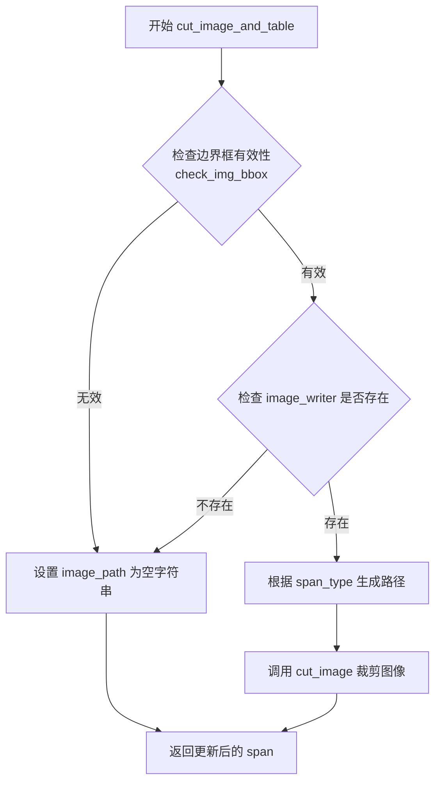

# `MinerU\mineru\utils\cut_image.py` 详细设计文档

该代码是一个PDF文档图像处理模块，核心功能是从PDF页面中裁剪图像和表格区域。它通过检查边界框有效性，调用图像裁剪工具将指定的区域提取为独立图像文件，并更新span对象中的图像路径。

## 整体流程

```mermaid
graph TD
    A[开始 cut_image_and_table] --> B[定义内部函数 return_path]
B --> C{检查bbox有效性 AND image_writer存在?}
C -- 否 --> D[设置span.image_path为空字符串]
C -- 是 --> E[调用cut_image裁剪图像]
E --> F[返回更新后的span]
D --> F
G[开始 check_img_bbox] --> H{bbox[0] >= bbox[2] 或 bbox[1] >= bbox[3]?}
H -- 是 --> I[记录警告日志并返回False]
H -- 否 --> J[返回True]
```

## 类结构

```
无类定义 (基于函数的模块)
```

## 全局变量及字段


### `span`
    
PDF元素字典，包含type和bbox字段

类型：`dict`
    


### `page_pil_img`
    
PDF页面的PIL图像对象

类型：`PIL.Image`
    


### `page_img_md5`
    
页面图像的MD5哈希值，用于文件命名

类型：`str`
    


### `page_id`
    
PDF页面编号

类型：`int`
    


### `image_writer`
    
图像写入器对象，负责保存裁剪的图像

类型：`object`
    


### `scale`
    
图像缩放比例，默认为2

类型：`int`
    


### `path_type`
    
路径类型字符串（image或table）

类型：`str`
    


### `bbox`
    
图像边界框坐标 (x0, y0, x1, y1)

类型：`tuple`
    


### `span_type`
    
span元素的类型标识

类型：`str`
    


### `logger`
    
loguru日志对象，用于记录警告和错误信息

类型：`Logger`
    


### `cut_image`
    
图像裁剪函数，用于从PDF页面中提取指定区域的图像

类型：`function`
    


    

## 全局函数及方法


### `cut_image_and_table`

该函数是处理PDF页面中图像和表格裁剪的核心逻辑，通过检查元素边界框有效性，调用图像裁剪工具将PDF页面中的图像或表格区域裁剪为独立图像文件，并更新原始元素的图像路径信息。

参数：

- `span`：`dict`，表示PDF页面中的元素（如图像、表格等），包含类型、边界框和图像路径等属性
- `page_pil_img`：`PIL.Image对象`，当前PDF页面的PIL图像对象，用于从中裁剪子图像
- `page_img_md5`：`str`，当前页面图像的MD5哈希值，用于生成唯一且可识别的文件路径
- `page_id`：`int`，当前页面在PDF中的页码编号，用于标识图像所属页面
- `image_writer`：`object`，图像写入器，负责将裁剪后的图像保存到存储系统，提供write方法
- `scale`：`int`，图像缩放比例，默认为2，用于提高裁剪图像的清晰度

返回值：`dict`，返回更新后的span元素，其image_path属性被设置为裁剪后图像的路径（如果裁剪成功）或空字符串（如果裁剪失败）

#### 流程图



#### 带注释源码

```python
from loguru import logger  # 导入日志记录工具

from .pdf_image_tools import cut_image  # 从相对模块导入图像裁剪函数


def cut_image_and_table(span, page_pil_img, page_img_md5, page_id, image_writer, scale=2):
    """
    处理图像和表格的裁剪，输出名称
    
    参数:
        span: PDF元素字典，包含type、bbox等字段
        page_pil_img: PIL图像对象，表示整个页面
        page_img_md5: 页面图像的MD5值，用于文件命名
        page_id: 页面编号
        image_writer: 图像写入器对象
        scale: 缩放比例，默认为2
    
    返回:
        更新后的span字典
    """
    
    def return_path(path_type):
        """内部函数：根据元素类型生成存储路径"""
        return f"{path_type}/{page_img_md5}"

    # 获取span的元素类型（image或table）
    span_type = span["type"]

    # 检查边界框有效性且image_writer存在
    if not check_img_bbox(span["bbox"]) or not image_writer:
        # 无效边界框或writer不存在时，设置空路径
        span["image_path"] = ""
    else:
        # 有效情况下调用裁剪函数
        span["image_path"] = cut_image(
            span["bbox"],  # 边界框坐标
            page_id,       # 页面ID
            page_pil_img,  # 页面PIL图像
            return_path=return_path(span_type),  # 生成路径：类型/md5
            image_writer=image_writer,  # 写入器
            scale=scale    # 缩放比例
        )

    return span


def check_img_bbox(bbox) -> bool:
    """
    检查边界框是否有效
    
    参数:
        bbox: 四元组 [x0, y0, x1, y1]，表示矩形区域
    
    返回:
        bool: 边界框有效返回True，否则返回False
    """
    # 检查x1是否大于x0，y1是否大于y0（即宽度和高度是否大于0）
    if any([bbox[0] >= bbox[2], bbox[1] >= bbox[3]]):
        logger.warning(f"image_bboxes: 错误的box, {bbox}")
        return False
    return True

```

---

## 补充信息

### 关键组件信息

| 组件名称 | 描述 |
|---------|------|
| `cut_image` | 实际的图像裁剪实现函数，负责从页面图像中提取指定区域并保存 |
| `image_writer` | 图像写入器抽象，负责将裁剪后的图像数据写入到存储系统 |
| `check_img_bbox` | 边界框验证工具，确保传入的坐标是有效的矩形区域 |

### 潜在的技术债务或优化空间

1. **内部函数冗余**：`return_path` 定义在主函数内部，每次调用都会重新定义，建议提取到模块级别
2. **错误处理不够细致**：当前只检查边界框有效性，对于 `cut_image` 调用失败的情况未做处理
3. **硬编码默认值**：`scale=2` 作为默认值内联在函数签名中，可考虑提取为配置常量
4. **日志信息不够详细**：`check_img_bbox` 只记录了警告日志，缺少调用栈信息，不利于问题追踪

### 其它项目

**设计目标与约束：**
- 目标：将PDF页面中的图像/表格元素裁剪为独立的图像文件，便于后续处理或展示
- 约束：依赖 `image_writer` 提供的写入能力，必须保证边界框有效性

**错误处理与异常设计：**
- 使用 `logger.warning` 记录无效边界框，但不影响主流程继续执行
- 边界框无效或 writer 不存在时，采用静默失败策略（返回空路径）而非抛出异常

**数据流与状态机：**
- 输入：span（含bbox、type）→ 页面PIL图像 → 页面MD5/ID → 图像写入器
- 处理：验证边界框 → 生成路径 → 调用裁剪 → 更新span
- 输出：含 image_path 的更新后 span

**外部依赖与接口契约：**
- 依赖 `cut_image` 函数（来自 `.pdf_image_tools` 模块）
- 依赖 `image_writer` 对象，需具备写入图像的能力
- span 字典结构约定：必须包含 `type`（str）、`bbox`（list/tuple）字段


### `check_img_bbox`

辅助函数，用于验证图像边界框（Bounding Box）的有效性。函数检查边界框的左上角坐标是否小于右下角坐标（即 x1 < x2 且 y1 < y2），确保边界框具有有效的宽高。如果边界框无效，记录警告日志并返回 False，否则返回 True。

参数：

- `bbox`：list 或 tuple，边界框坐标，格式为 [x1, y1, x2, y2]，其中 (x1, y1) 为左上角坐标，(x2, y2) 为右下角坐标

返回值：`bool`，如果边界框有效返回 True，否则返回 False

#### 流程图

```mermaid
flowchart TD
    A[开始检查边界框] --> B{检查 bbox[0] >= bbox[2] 或 bbox[1] >= bbox[3]}
    B -->|是| C[记录警告日志: 错误的box]
    C --> D[返回 False]
    B -->|否| E[返回 True]
    D --> F[结束]
    E --> F
```

#### 带注释源码

```python
def check_img_bbox(bbox) -> bool:
    """
    验证边界框有效性
    
    参数:
        bbox: 边界框坐标 [x1, y1, x2, y2]
              x1, y1 为左上角坐标
              x2, y2 为右下角坐标
    
    返回:
        bool: 边界框有效返回 True，无效返回 False
    """
    # 检查 x1 >= x2 (左边界大于等于右边界) 或 y1 >= y3 (上边界大于等于下边界)
    # 任意一种情况都表示边界框无效
    if any([bbox[0] >= bbox[2], bbox[1] >= bbox[3]]):
        # 记录警告日志，包含错误的边界框信息
        logger.warning(f"image_bboxes: 错误的box, {bbox}")
        return False
    # 边界框有效
    return True
```


### `cut_image_and_table.return_path`

该内部函数用于根据传入的路径类型（span_type）拼接生成完整的文件存储路径，通过将路径类型与页面图片的MD5值组合，形成格式为 `{path_type}/{page_img_md5}` 的路径字符串。

参数：

- `path_type`：`str`，路径类型前缀，用于拼接路径的第一部分（如 "table"、"image" 等类型标识）

返回值：`str`，拼接后的完整文件路径，格式为 `{path_type}/{page_img_md5}`

#### 流程图

```mermaid
flowchart TD
    A[开始] --> B[接收 path_type 参数]
    B --> C[拼接路径字符串]
    C --> D[格式: {path_type}/{page_img_md5}]
    D --> E[返回完整路径]
    E --> F[结束]
```

#### 带注释源码

```python
def return_path(path_type):
    # 内部函数：根据路径类型生成完整的文件存储路径
    # 参数 path_type: 路径类型前缀（如 'image'、'table' 等）
    # 返回值: 拼接后的完整路径，格式为 "{path_type}/{page_img_md5}"
    return f"{path_type}/{page_img_md5}"
```

## 关键组件


### 图像裁剪主函数 (cut_image_and_table)

负责将PDF页面中的特定区域（图像或表格）裁剪出来，并保存到指定路径，返回包含图像路径的span对象。

### 边界框验证函数 (check_img_bbox)

验证图像边界框坐标是否有效，确保左上角坐标小于右下角坐标，防止无效的裁剪区域。

### 路径生成器 (return_path)

内部嵌套函数，根据类型生成对应的存储路径，格式为"{类型}/{MD5值}"。

### 图像写入器 (image_writer)

负责将裁剪后的图像数据写入存储系统的对象，提供了图像持久化的能力。

### 缩放参数 (scale)

控制图像裁剪时的缩放倍数，默认值为2，可提升图像清晰度。


## 问题及建议


### 已知问题

-   **缺少类型注解**：`span`、`page_pil_img`、`image_writer` 等参数缺乏类型注解，影响代码可读性和静态分析
-   **函数命名与实际功能不符**：`cut_image_and_table` 函数名暗示处理图片和表格，但实际仅调用了 `cut_image`，存在误导性
-   **硬编码路径分隔符**：使用 `/` 作为路径分隔符，未考虑跨平台兼容性（Windows 使用 `\`）
-   **日志级别使用不当**：bbox 无效时使用 `warning` 级别，建议使用 `error` 级别以更准确反映问题的严重性
-   **魔法数字**：`scale=2` 作为默认值缺乏说明文档，且无法满足不同场景的灵活配置需求
-   **内部函数定义**：在 `cut_image_and_table` 内部定义 `return_path` 嵌套函数，降低了函数的可复用性和代码清晰度
-   **异常处理缺失**：裁剪图像过程可能抛出异常（如文件写入失败、图像格式错误等），但未使用 try-except 包裹
-   **边界检查可优化**：使用 `any([bbox[0] >= bbox[2], bbox[1] >= bbox[3]])` 创建了不必要的列表对象
-   **错误处理不一致**：当 `image_writer` 为空时设置空字符串而非 `None`，可能导致调用方处理逻辑复杂化

### 优化建议

-   为所有函数参数和返回值添加明确的类型注解
-   重命名函数为 `cut_image_from_span` 以准确反映功能，或扩展函数逻辑以支持表格裁剪
-   使用 `os.path.join()` 或 `pathlib.Path` 处理路径拼接，提升跨平台兼容性
-   将无效 bbox 的日志级别提升为 `error`，或在函数文档中明确说明边界验证失败的处理方式
-   将 `scale` 参数配置化或从配置文件读取，提供更灵活的配置机制
-   将 `return_path` 函数提取为模块级函数或使用 lambda 表达式简化
-   为 `cut_image` 调用添加 try-except 异常处理，捕获并记录可能的异常
-   使用 `any(bbox[0] >= bbox[2] or bbox[1] >= bbox[3])` 避免创建中间列表
-   统一错误返回值语义，如使用 `None` 替代空字符串表示无效状态，并在文档中明确说明


## 其它


### 设计目标与约束

本模块的核心目标是从PDF页面图像中提取并裁剪指定区域的图像，同时确保边界框（bbox）有效性。设计约束包括：1）仅处理有效的图像区域（bbox宽高大于0）；2）图像路径遵循特定的命名规范（{type}/{md5_hash}）；3）裁剪操作支持缩放参数scale，默认为2倍；4）依赖外部图像处理工具cut_image和image_writer。

### 错误处理与异常设计

错误处理策略主要包含以下方面：1）边界框验证失败时记录警告日志并返回False，调用方将置空图像路径；2）image_writer为空或bbox无效时，跳过图像裁剪并返回空路径；3）所有异常通过logger.warning输出警告信息，不抛出异常，保证主流程继续执行；4）cut_image内部异常由其自行处理。

### 数据流与状态机

数据流：输入span字典（包含type和bbox）→ check_img_bbox验证边界框有效性 → 若有效且image_writer存在 → 调用cut_image裁剪图像 → 输出更新后的span（包含image_path字段）。状态转换：初始状态（span带空image_path）→ 验证状态（check_img_bbox返回bool）→ 裁剪状态（调用cut_image）→ 完成状态（返回带image_path的span）。

### 外部依赖与接口契约

外部依赖：1）loguru.logger - 日志记录；2）cut_image函数 - 图像裁剪核心逻辑，接收bbox、page_id、page_pil_img、return_path、image_writer、scale参数；3）image_writer - 图像写入器对象，需支持写入操作。接口契约：span字典必须包含type和bbox字段，bbox为4元素列表[x0, y0, x1, y1]，cut_image返回图像保存路径字符串。

### 性能考虑

性能优化点：1）边界框验证采用短路求值，any函数遇True即返回；2）return_path内部函数避免重复字符串拼接；3）scale参数默认2平衡图像质量与存储空间；4）无效bbox提前过滤减少不必要的图像处理开销。建议：对于大批量处理可考虑并行化cut_image调用。

### 安全性考虑

安全措施：1）path_type参数直接拼接路径需注意路径遍历风险（当前实现未做校验）；2）page_img_md5应为可信的MD5哈希值，防止路径注入；3）建议对span["type"]和page_img_md5进行输入校验，确保符合预期格式。

### 可扩展性设计

扩展点：1）return_path函数可抽象为策略模式，支持自定义路径生成规则；2）可添加图像格式转换参数支持JPEG/PNG等格式选择；3）check_img_bbox可扩展支持更多边界条件检查（如最小尺寸限制、坐标范围校验等）；4）scale参数可扩展为动态计算，根据页面分辨率自适应。

### 配置与参数说明

关键配置参数：1）scale - 图像缩放倍数，默认2，建议范围1-4，过大增加存储开销；2）path_type - 路径类型，来源于span["type"]，决定图像存储的子目录；3）page_img_md5 - 页面图像MD5值，用于唯一标识和路径生成。

### 使用示例

```python
# 示例：裁剪表格区域图像
span = {
    "type": "table",
    "bbox": [100, 200, 500, 800],
    "image_path": ""
}
result = cut_image_and_table(
    span=span,
    page_pil_img=page_image,
    page_img_md5="abc123def456",
    page_id=0,
    image_writer=writer,
    scale=2
)
# result["image_path"] = "table/abc123def456"
```

### 注意事项

1）span字典会被直接修改，调用方需注意引用语义；2）cut_image失败时image_path为空字符串而非None；3）check_img_bbox仅验证坐标逻辑关系，不验证坐标是否超出页面范围；4）当bbox为[0,0,0,0]时会被判定为无效。


    