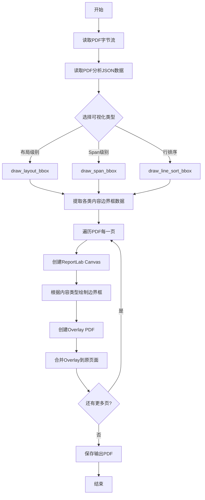
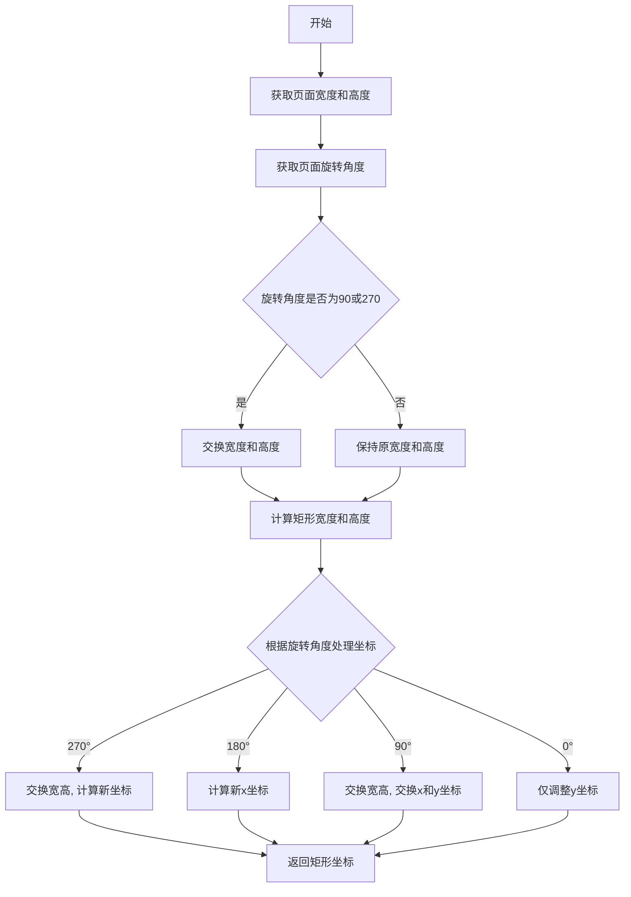
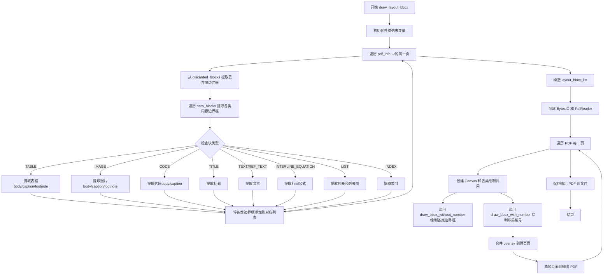
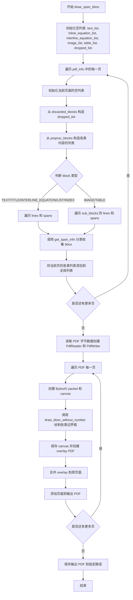

# `MinerU\mineru\utils\draw_bbox.py` 详细设计文档

该代码是一个PDF可视化调试工具，用于在PDF页面上绘制不同类型内容（文本、表格、图像、代码块、标题等）的边界框，以便于可视化PDF解析结果。它接收PDF字节流和PDF分析信息（包含各类内容的边界框），然后生成带有彩色标注的PDF输出文件。

## 整体流程



## 类结构

```
无类层次结构 (基于函数的模块化设计)
├── 模块级函数
│   ├── cal_canvas_rect
│   ├── draw_bbox_without_number
│   ├── draw_bbox_with_number
│   ├── draw_layout_bbox
│   ├── draw_span_bbox
│   └── draw_line_sort_bbox
```

## 全局变量及字段


### `BlockType`
    
枚举类，定义PDF元素的块类型，如TEXT、TABLE、IMAGE、CODE等

类型：`Enum class (from enum_class)`
    


### `ContentType`
    
枚举类，定义内容元素的类型，如TEXT、INLINE_EQUATION、INTERLINE_EQUATION、IMAGE、TABLE等

类型：`Enum class (from enum_class)`
    


### `SplitFlag`
    
枚举类，定义分割标志，用于标记元素是否跨页等状态

类型：`Enum class (from enum_class)`
    


### `pdf_bytes`
    
原始PDF文件的字节数据，用于后续处理和可视化渲染

类型：`bytes`
    


### `pdf_info`
    
从JSON加载的PDF结构化信息，包含每页的块、坐标、类型等元数据

类型：`List[dict]`
    


### `pdf_ann`
    
从JSON文件加载的完整PDF注解数据，包含pdf_info及其他注解信息

类型：`dict`
    


    

## 全局函数及方法


### `cal_canvas_rect`

根据原始PDF页面和边界框计算画布上的矩形坐标。该函数处理PDF页面的旋转情况，将原始的边界框坐标（[x0, y0, x1, y1]）转换为画布上的矩形坐标（[x0, y0, width, height]），同时处理0°、90°、180°、270°等不同的旋转角度。

参数：

- `page`：`Page`，PyPDF2的Page对象，代表PDF中的单个页面
- `bbox`：`List[float]`，边界框坐标，格式为 [x0, y0, x1, y1]

返回值：`List[float]`，画布上的矩形坐标，格式为 [x0, y0, width, height]

#### 流程图



#### 带注释源码

```python
def cal_canvas_rect(page, bbox):
    """
    Calculate the rectangle coordinates on the canvas based on the original PDF page and bounding box.
    根据原始PDF页面和边界框计算画布上的矩形坐标

    Args:
        page: A PyPDF2 Page object representing a single page in the PDF.
              PyPDF2的Page对象，代表PDF中的单个页面
        bbox: [x0, y0, x1, y1] representing the bounding box coordinates.
              边界框坐标，格式为 [x0, y0, x1, y1]

    Returns:
        rect: [x0, y0, width, height] representing the rectangle coordinates on the canvas.
              画布上的矩形坐标，格式为 [x0, y0, width, height]
    """
    # 获取页面的裁剪框宽度和高度
    page_width, page_height = float(page.cropbox[2]), float(page.cropbox[3])
    
    # 最终PDF显示的宽度和高度
    actual_width = page_width    # The width of the final PDF display
    actual_height = page_height  # The height of the final PDF display
    
    # 获取页面的旋转角度，默认为0
    rotation_obj = page.get("/Rotate", 0)
    try:
        # 将旋转角度转换为整数，处理IndirectObject的情况
        rotation = int(rotation_obj) % 360  # cast rotation to int to handle IndirectObject
    except (ValueError, TypeError) as e:
        logger.warning(f"Invalid /Rotate value {rotation_obj!r} on page; defaulting to 0. Error: {e}")
        rotation = 0
    
    # 如果PDF旋转90度或270度，需要交换宽度和高度
    if rotation in [90, 270]:
        # PDF is rotated 90 degrees or 270 degrees, and the width and height need to be swapped
        actual_width, actual_height = actual_height, actual_width
        
    # 解包边界框坐标
    x0, y0, x1, y1 = bbox
    # 计算矩形的宽度和高度
    rect_w = abs(x1 - x0)
    rect_h = abs(y1 - y0)
    
    # 根据不同的旋转角度调整坐标
    if rotation == 270:
        # 旋转270度时，交换宽高，并计算新的坐标
        rect_w, rect_h = rect_h, rect_w
        x0 = actual_height - y1
        y0 = actual_width - x1
    elif rotation == 180:
        # 旋转180度时，只调整x坐标
        x0 = page_width - x1
        # y0 stays the same
    elif rotation == 90:
        # 旋转90度时，交换宽高，并交换x和y坐标
        rect_w, rect_h = rect_h, rect_w
        x0, y0 = y0, x0 
    else:
        # rotation == 0
        # 正常情况下，只调整y坐标（PDF坐标系原点在左下角）
        y0 = page_height - y1
    
    # 组装最终的矩形坐标 [x0, y0, width, height]
    rect = [x0, y0, rect_w, rect_h]        
    return rect
```


### `draw_bbox_without_number`

该函数负责在 PDF 页面的指定坐标上绘制矩形边界框（Bounding Box）。它根据 `fill_config` 参数决定是绘制填充矩形（高亮）还是仅绘制边框轮廓。函数内部调用 `cal_canvas_rect` 处理 PDF 页面旋转和坐标系转换（PDF 原点在左下，Canvas 原点在左上），并使用 ReportLab 库在临时的 PDF 层（Overlay）上进行绘图操作。

参数：

-  `i`：`int`，当前处理的页面索引，用于从 `bbox_list` 中获取对应页面的数据。
-  `bbox_list`：`list`，包含所有页面边界框数据的嵌套列表，结构为 `List[List[List[float]]]`。
-  `page`：`PageObject` (pypdf2)，PDF 页面对象，用于获取页面属性（如旋转角度、裁剪框）以进行坐标计算。
-  `c`：`Canvas` (reportlab.pdfgen)，ReportLab 的画布对象，用于在 PDF 上绘制图形。
-  `rgb_config`：`list[int, int, int]` 或 `tuple[int, int, int]`，[R, G, B] 颜色配置，值为 0-255。
-  `fill_config`：`bool`，标志位。`True` 表示绘制填充矩形（通常用于标记 discarded 区域或特定类型块），`False` 表示仅绘制边框。

返回值：`Canvas` (reportlab.pdfgen.canvas)，返回绘制完成后的 Canvas 对象 `c`。

#### 流程图

```mermaid
graph TD
    A([Start draw_bbox_without_number]) --> B[Convert RGB Config]
    B --> C[0-255 to 0-1 Float]
    B --> D[Get page_data: bbox_list[i]]
    D --> E{Loop: for bbox in page_data}
    E --> F[cal_canvas_rect]
    F --> G[Calculate rect coordinates]
    G --> H{Is fill_config True?}
    H -- Yes --> I[Set Fill Color RGB]
    I --> J[Set Alpha 0.3]
    J --> K[Draw Rect: fill=1, stroke=0]
    H -- No --> L[Set Stroke Color RGB]
    L --> M[Draw Rect: fill=0, stroke=1]
    K --> N[Loop End]
    M --> N
    N --> O{More bbox?}
    O -- Yes --> E
    O -- No --> P([Return Canvas c])
```

#### 带注释源码

```python
def draw_bbox_without_number(i, bbox_list, page, c, rgb_config, fill_config):
    """
    在给定的 PDF 页面上绘制边界框（无编号）。

    参数:
        i: 页面索引。
        bbox_list: 包含所有页面边界框的列表。
        page: PyPDF2 的页面对象。
        c: ReportLab 的 Canvas 对象。
        rgb_config: RGB 颜色配置列表 [r, g, b]。
        fill_config: 是否填充矩形的标志位。
    
    返回:
        绘制后的 Canvas 对象。
    """
    # 1. 处理颜色配置：将 0-255 的整数颜色转换为 ReportLab 需要的 0-1 浮点数
    new_rgb = [float(color) / 255 for color in rgb_config]
    
    # 2. 获取当前页面的边界框数据
    page_data = bbox_list[i]

    # 3. 遍历当前页面的每一个边界框
    for bbox in page_data:
        # 计算画布上的实际矩形坐标（处理旋转和坐标轴翻转）
        rect = cal_canvas_rect(page, bbox)  

        # 4. 根据 fill_config 决定绘制样式
        if fill_config:  # filled rectangle (填充模式)
            # 设置填充颜色，透明度为 0.3
            c.setFillColorRGB(new_rgb[0], new_rgb[1], new_rgb[2], 0.3)
            # 绘制矩形：x, y, width, height, stroke(边框), fill(填充)
            c.rect(rect[0], rect[1], rect[2], rect[3], stroke=0, fill=1)
        else:  # bounding box (仅描边模式)
            # 设置描边颜色
            c.setStrokeColorRGB(new_rgb[0], new_rgb[1], new_rgb[2])
            # 绘制矩形：无填充，仅描边
            c.rect(rect[0], rect[1], rect[2], rect[3], stroke=1, fill=0)
    
    # 5. 返回修改后的 Canvas 对象，以便后续继续绘制
    return c
```


### `draw_bbox_with_number`

该函数用于在PDF页面的每个边界框附近绘制对应的数字编号（从1开始递增），同时可选是否绘制边界框（填充或描边），并根据页面旋转角度调整数字编号的绘制位置和方向。

参数：

- `i`：`int`，当前页面的索引，用于从 `bbox_list` 中获取对应页面的边界框数据
- `bbox_list`：`list`，包含所有页面的边界框数据的二维列表，结构为 `[[page0_bboxs], [page1_bboxs], ...]`
- `page`：`PageObject`，PyPDF2的页面对象，用于获取页面属性（如旋转角度、裁剪框尺寸）
- `c`：`canvas`，ReportLab的画布对象，用于在PDF上绘制图形和文本
- `rgb_config`：`list`，RGB颜色配置，格式为 `[R, G, B]`，每个值为0-255的整数
- `fill_config`：`bool`，是否以填充方式绘制边界框，`True` 为填充矩形，`False` 为描边矩形
- `draw_bbox`：`bool`，是否绘制边界框，默认为 `True`

返回值：`canvas`，返回经过绘制操作后的ReportLab画布对象

#### 流程图

```mermaid
graph TD
    A[开始] --> B[将RGB颜色值转换为0-1范围]
    B --> C[从bbox_list[i]获取当前页面数据]
    C --> D[获取页面裁剪框宽度和高度]
    D --> E[遍历当前页面的每个边界框]
    E --> F[计算画布上的矩形坐标 rect = cal_canvas_rect]
    F --> G{draw_bbox?}
    G -->|True| H{fill_config?}
    H -->|True| I[设置填充颜色并绘制填充矩形]
    H -->|False| J[设置描边颜色并绘制描边矩形]
    G -->|False| K[跳过边界框绘制]
    I --> L[设置填充颜色为不透明]
    J --> L
    K --> L
    L --> M[设置字体大小为10]
    M --> N[获取页面旋转角度]
    N --> O{rotation == 0?}
    O -->|Yes| P[translate to 右上角]
    O -->|No| Q{rotation == 90?}
    Q -->|Yes| R[translate to 左下角]
    Q -->|No| S{rotation == 180?}
    S -->|Yes| T[translate to 右下角]
    S -->|No| U{rotation == 270?}
    U -->|Yes| V[translate to 右上角]
    U -->|No| W[默认位置]
    P --> X[rotate旋转画布]
    R --> X
    T --> X
    V --> X
    W --> X
    X --> Y[drawString绘制数字编号 j+1]
    Y --> Z[restoreState恢复画布状态]
    Z --> AA{还有更多边界框?}
    AA -->|Yes| E
    AA -->|No| AB[返回画布对象c]
```

#### 带注释源码

```python
def draw_bbox_with_number(i, bbox_list, page, c, rgb_config, fill_config, draw_bbox=True):
    """
    在PDF页面上绘制带有数字编号的边界框。
    
    Args:
        i: 当前页面的索引
        bbox_list: 所有页面的边界框列表
        page: PyPDF2页面对象
        c: ReportLab画布对象
        rgb_config: RGB颜色配置 [R, G, B]
        fill_config: 是否填充边界框
        draw_bbox: 是否绘制边界框，默认为True
    
    Returns:
        c: 绘制完成后的画布对象
    """
    # 将RGB颜色值从0-255范围转换为0-1范围（ReportLab要求）
    new_rgb = [float(color) / 255 for color in rgb_config]
    # 获取当前页面的边界框数据
    page_data = bbox_list[i]
    # 强制转换为 float，获取页面裁剪框的宽度和高度
    page_width, page_height = float(page.cropbox[2]), float(page.cropbox[3])

    # 遍历当前页面的所有边界框
    for j, bbox in enumerate(page_data):
        # 确保bbox的每个元素都是float，调用辅助函数计算画布上的矩形坐标
        rect = cal_canvas_rect(page, bbox)  # Define the rectangle  
        
        # 根据draw_bbox参数决定是否绘制边界框
        if draw_bbox:
            if fill_config:
                # 设置填充颜色（带透明度0.3），绘制填充矩形
                c.setFillColorRGB(*new_rgb, 0.3)
                c.rect(rect[0], rect[1], rect[2], rect[3], stroke=0, fill=1)
            else:
                # 设置描边颜色，绘制描边矩形（空心）
                c.setStrokeColorRGB(*new_rgb)
                c.rect(rect[0], rect[1], rect[2], rect[3], stroke=1, fill=0)
        
        # 设置用于绘制数字编号的填充颜色（不透明）
        c.setFillColorRGB(*new_rgb, 1.0)
        # 设置字体大小为10
        c.setFontSize(size=10)
        
        # 保存当前画布状态，以便后续恢复
        c.saveState()
        # 获取页面旋转角度，默认为0
        rotation_obj = page.get("/Rotate", 0)
        try:
            # 将旋转角度转换为整数并取模360，处理IndirectObject情况
            rotation = int(rotation_obj) % 360  # cast rotation to int to handle IndirectObject
        except (ValueError, TypeError):
            # 如果转换失败，记录警告日志并默认旋转角度为0
            logger.warning(f"Invalid /Rotate value: {rotation_obj!r}, defaulting to 0")
            rotation = 0

        # 根据不同的旋转角度，调整数字编号的绘制位置
        if rotation == 0:
            # 旋转0度：绘制在边界框右上角外侧
            c.translate(rect[0] + rect[2] + 2, rect[1] + rect[3] - 10)
        elif rotation == 90:
            # 旋转90度：绘制在边界框左下角外侧
            c.translate(rect[0] + 10, rect[1] + rect[3] + 2)
        elif rotation == 180:
            # 旋转180度：绘制在边界框左下角外侧
            c.translate(rect[0] - 2, rect[1] + 10)
        elif rotation == 270:
            # 旋转270度：绘制在边界框右上角外侧
            c.translate(rect[0] + rect[2] - 10, rect[1] - 2)
            
        # 执行旋转，使数字编号方向与页面内容一致
        c.rotate(rotation)
        # 在坐标原点(0,0)绘制数字编号，j+1使得编号从1开始
        c.drawString(0, 0, str(j + 1))
        # 恢复之前保存的画布状态
        c.restoreState()

    # 返回绘制完成后的画布对象
    return c
```


### `draw_layout_bbox`

该函数是PDF布局可视化工具的核心函数，负责从PDF信息（JSON格式）中提取各类内容（表格、图片、代码、标题、文本等）的边界框坐标，然后将这些边界框按照不同类型使用不同颜色绘制到原始PDF页面上，最终输出带有布局标注的PDF文件。

参数：

- `pdf_info`：`List[Dict]`，PDF的结构化信息，包含每页的段落块、丢弃块等元数据
- `pdf_bytes`：`bytes`，原始PDF文件的字节数据
- `out_path`：`str`，输出PDF文件的目录路径
- `filename`：`str`，输出PDF文件的名称

返回值：`None`，该函数直接将标注后的PDF写入指定路径的文件

#### 流程图



#### 带注释源码

```python
def draw_layout_bbox(pdf_info, pdf_bytes, out_path, filename):
    """
    在原始PDF上绘制各类布局元素的边界框，并输出新的PDF文件。
    
    Args:
        pdf_info: PDF的结构化信息列表，每个元素代表一页的内容
        pdf_bytes: 原始PDF文件的字节数据
        out_path: 输出PDF文件的目录路径
        filename: 输出PDF文件的名称
    """
    
    # ========== 第一部分：初始化各类边界框列表 ==========
    # 用于存储不同类型内容的边界框，每个元素对应一页
    dropped_bbox_list = []          # 丢弃的块
    tables_body_list = []           # 表格主体
    tables_caption_list = []       # 表格标题
    tables_footnote_list = []      # 表格脚注
    imgs_body_list = []            # 图片主体
    imgs_caption_list = []         # 图片标题
    imgs_footnote_list = []        # 图片脚注
    codes_body_list = []           # 代码主体
    codes_caption_list = []        # 代码标题
    titles_list = []               # 标题
    texts_list = []                # 文本段落
    interequations_list = []       # 行间公式
    lists_list = []                # 列表
    list_items_list = []           # 列表项
    indexs_list = []               # 索引
    
    # ========== 第二部分：遍历每一页，提取各类边界框 ==========
    for page in pdf_info:
        # 初始化当前页的各类列表
        page_dropped_list = []
        tables_body, tables_caption, tables_footnote = [], [], []
        imgs_body, imgs_caption, imgs_footnote = [], [], []
        codes_body, codes_caption = [], []
        titles = []
        texts = []
        interequations = []
        lists = []
        list_items = []
        indices = []
        
        # 提取被丢弃的块边界框
        for dropped_bbox in page['discarded_blocks']:
            page_dropped_list.append(dropped_bbox['bbox'])
        dropped_bbox_list.append(page_dropped_list)
        
        # 遍历段落块，提取各类内容的边界框
        for block in page["para_blocks"]:
            bbox = block["bbox"]
            
            # 处理表格类型
            if block["type"] == BlockType.TABLE:
                for nested_block in block["blocks"]:
                    bbox = nested_block["bbox"]
                    if nested_block["type"] == BlockType.TABLE_BODY:
                        tables_body.append(bbox)
                    elif nested_block["type"] == BlockType.TABLE_CAPTION:
                        tables_caption.append(bbox)
                    elif nested_block["type"] == BlockType.TABLE_FOOTNOTE:
                        # 跳过跨页的表格脚注
                        if nested_block.get(SplitFlag.CROSS_PAGE, False):
                            continue
                        tables_footnote.append(bbox)
            
            # 处理图片类型
            elif block["type"] == BlockType.IMAGE:
                for nested_block in block["blocks"]:
                    bbox = nested_block["bbox"]
                    if nested_block["type"] == BlockType.IMAGE_BODY:
                        imgs_body.append(bbox)
                    elif nested_block["type"] == BlockType.IMAGE_CAPTION:
                        imgs_caption.append(bbox)
                    elif nested_block["type"] == BlockType.IMAGE_FOOTNOTE:
                        imgs_footnote.append(bbox)
            
            # 处理代码类型
            elif block["type"] == BlockType.CODE:
                for nested_block in block["blocks"]:
                    if nested_block["type"] == BlockType.CODE_BODY:
                        bbox = nested_block["bbox"]
                        codes_body.append(bbox)
                    elif nested_block["type"] == BlockType.CODE_CAPTION:
                        bbox = nested_block["bbox"]
                        codes_caption.append(bbox)
            
            # 处理标题类型
            elif block["type"] == BlockType.TITLE:
                titles.append(bbox)
            
            # 处理文本类型
            elif block["type"] in [BlockType.TEXT, BlockType.REF_TEXT]:
                texts.append(bbox)
            
            # 处理行间公式
            elif block["type"] == BlockType.INTERLINE_EQUATION:
                interequations.append(bbox)
            
            # 处理列表类型
            elif block["type"] == BlockType.LIST:
                lists.append(bbox)
                if "blocks" in block:
                    for sub_block in block["blocks"]:
                        list_items.append(sub_block["bbox"])
            
            # 处理索引类型
            elif block["type"] == BlockType.INDEX:
                indices.append(bbox)
        
        # 将当前页的各类边界框添加到全局列表
        tables_body_list.append(tables_body)
        tables_caption_list.append(tables_caption)
        tables_footnote_list.append(tables_footnote)
        imgs_body_list.append(imgs_body)
        imgs_caption_list.append(imgs_caption)
        imgs_footnote_list.append(imgs_footnote)
        titles_list.append(titles)
        texts_list.append(texts)
        interequations_list.append(interequations)
        lists_list.append(lists)
        list_items_list.append(list_items)
        indexs_list.append(indices)
        codes_body_list.append(codes_body)
        codes_caption_list.append(codes_caption)
    
    # ========== 第三部分：构造布局边界框列表 ==========
    # 用于绘制带有编号的布局边界框
    layout_bbox_list = []
    
    # 定义表格子块的绘制顺序
    table_type_order = {"table_caption": 1, "table_body": 2, "table_footnote": 3}
    
    for page in pdf_info:
        page_block_list = []
        for block in page["para_blocks"]:
            # 处理基本块类型
            if block["type"] in [
                BlockType.TEXT,
                BlockType.REF_TEXT,
                BlockType.TITLE,
                BlockType.INTERLINE_EQUATION,
                BlockType.LIST,
                BlockType.INDEX,
            ]:
                bbox = block["bbox"]
                page_block_list.append(bbox)
            
            # 处理图片块
            elif block["type"] in [BlockType.IMAGE]:
                for sub_block in block["blocks"]:
                    bbox = sub_block["bbox"]
                    page_block_list.append(bbox)
            
            # 处理表格块（按顺序）
            elif block["type"] in [BlockType.TABLE]:
                sorted_blocks = sorted(block["blocks"], key=lambda x: table_type_order[x["type"]])
                for sub_block in sorted_blocks:
                    if sub_block.get(SplitFlag.CROSS_PAGE, False):
                        continue
                    bbox = sub_block["bbox"]
                    page_block_list.append(bbox)
            
            # 处理代码块
            elif block["type"] in [BlockType.CODE]:
                for sub_block in block["blocks"]:
                    bbox = sub_block["bbox"]
                    page_block_list.append(bbox)
        
        layout_bbox_list.append(page_block_list)
    
    # ========== 第四部分：创建PDF并绘制边界框 ==========
    # 将字节数据转换为PDF阅读器
    pdf_bytes_io = BytesIO(pdf_bytes)
    pdf_docs = PdfReader(pdf_bytes_io)
    output_pdf = PdfWriter()
    
    # 遍历PDF的每一页
    for i, page in enumerate(pdf_docs.pages):
        # 获取原始页面尺寸
        page_width, page_height = float(page.cropbox[2]), float(page.cropbox[3])
        custom_page_size = (page_width, page_height)
        
        # 创建内存中的Canvas用于绘制
        packet = BytesIO()
        c = canvas.Canvas(packet, pagesize=custom_page_size)
        
        # 使用不同颜色绘制各类内容的边界框（填充模式）
        # 颜色格式: [R, G, B]，数值为0-255范围，函数内部会转换为0-1
        c = draw_bbox_without_number(i, codes_body_list, page, c, [102, 0, 204], True)        # 紫色-代码主体
        c = draw_bbox_without_number(i, codes_caption_list, page, c, [204, 153, 255], True)   # 浅紫-代码标题
        c = draw_bbox_without_number(i, dropped_bbox_list, page, c, [158, 158, 158], True)    # 灰色-丢弃块
        c = draw_bbox_without_number(i, tables_body_list, page, c, [204, 204, 0], True)      # 黄色-表格主体
        c = draw_bbox_without_number(i, tables_caption_list, page, c, [255, 255, 102], True) # 浅黄-表格标题
        c = draw_bbox_without_number(i, tables_footnote_list, page, c, [229, 255, 204], True) # 浅绿-表格脚注
        c = draw_bbox_without_number(i, imgs_body_list, page, c, [153, 255, 51], True)        # 绿色-图片主体
        c = draw_bbox_without_number(i, imgs_caption_list, page, c, [102, 178, 255], True)     # 蓝色-图片标题
        c = draw_bbox_without_number(i, imgs_footnote_list, page, c, [255, 178, 102], True)   # 橙色-图片脚注
        c = draw_bbox_without_number(i, titles_list, page, c, [102, 102, 255], True)          # 蓝色-标题
        c = draw_bbox_without_number(i, texts_list, page, c, [153, 0, 76], True)              # 紫红-文本
        c = draw_bbox_without_number(i, interequations_list, page, c, [0, 255, 0], True)       # 绿色-行间公式
        c = draw_bbox_without_number(i, lists_list, page, c, [40, 169, 92], True)              # 绿色-列表
        c = draw_bbox_without_number(i, list_items_list, page, c, [40, 169, 92], False)        # 绿色-列表项（仅描边）
        c = draw_bbox_without_number(i, indexs_list, page, c, [40, 169, 92], True)             # 绿色-索引
        
        # 绘制带编号的布局边界框（红色，仅编号不绘制边框）
        c = draw_bbox_with_number(i, layout_bbox_list, page, c, [255, 0, 0], False, draw_bbox=False)
        
        # 保存Canvas内容到packet
        c.save()
        packet.seek(0)
        overlay_pdf = PdfReader(packet)
        
        # 合并overlay到原页面
        if len(overlay_pdf.pages) > 0:
            new_page = PageObject(pdf=None)
            new_page.update(page)
            page = new_page
            page.merge_page(overlay_pdf.pages[0])
        else:
            # 如果overlay为空，记录日志并继续
            pass
        
        # 添加处理后的页面到输出PDF
        output_pdf.add_page(page)
    
    # ========== 第五部分：保存输出PDF ==========
    with open(f"{out_path}/{filename}", "wb") as f:
        output_pdf.write(f)
```


### `draw_span_bbox`

该函数用于在PDF文档上绘制Span级别（行内元素）的可视化边界框，包括文本、行内公式、行间公式、图像、表格和被丢弃的内容块，通过不同颜色区分不同内容类型，并将带边界框标记的overlay层合并到原始PDF页面中输出。

参数：

- `pdf_info`：`<class 'list'>`，PDF解析后的结构化信息列表，包含每个页面的块、段落、线条和Span信息
- `pdf_bytes`：`<class 'bytes'>`，原始PDF文件的字节数据
- `out_path`：`<class 'str'>`，输出PDF文件的目录路径
- `filename`：`<class 'str'>`，输出PDF文件的名称

返回值：`None`，函数直接写入文件，不返回数据

#### 流程图



#### 带注释源码

```python
def draw_span_bbox(pdf_info, pdf_bytes, out_path, filename):
    """
    在PDF上绘制Span级别的可视化边界框。
    
    参数:
        pdf_info: PDF解析后的结构化信息列表
        pdf_bytes: 原始PDF文件的字节数据
        out_path: 输出目录路径
        filename: 输出文件名
    返回:
        None: 直接写入文件
    """
    # 初始化各类内容的边界框列表
    text_list = []              # 文本内容的边界框列表
    inline_equation_list = []   # 行内公式的边界框列表
    interline_equation_list = []  # 行间公式的边界框列表
    image_list = []             # 图像的边界框列表
    table_list = []             # 表格的边界框列表
    dropped_list = []           # 被丢弃内容的边界框列表

    def get_span_info(span):
        """
        内部函数：根据span的类型将其边界框添加到对应的列表中。
        
        参数:
            span: 包含类型和边界框信息的span对象
        """
        if span['type'] == ContentType.TEXT:
            # 文本类型，添加到文本列表
            page_text_list.append(span['bbox'])
        elif span['type'] == ContentType.INLINE_EQUATION:
            # 行内公式类型，添加到行内公式列表
            page_inline_equation_list.append(span['bbox'])
        elif span['type'] == ContentType.INTERLINE_EQUATION:
            # 行间公式类型，添加到行间公式列表
            page_interline_equation_list.append(span['bbox'])
        elif span['type'] == ContentType.IMAGE:
            # 图像类型，添加到图像列表
            page_image_list.append(span['bbox'])
        elif span['type'] == ContentType.TABLE:
            # 表格类型，添加到表格列表
            page_table_list.append(span['bbox'])

    # 第一阶段：遍历pdf_info收集各类内容的边界框
    for page in pdf_info:
        # 初始化当前页面的各类列表
        page_text_list = []
        page_inline_equation_list = []
        page_interline_equation_list = []
        page_image_list = []
        page_table_list = []
        page_dropped_list = []

        # 从discarded_blocks构造dropped_list（被丢弃的块）
        for block in page['discarded_blocks']:
            if block['type'] == BlockType.DISCARDED:
                # 遍历丢弃块中的所有行和span
                for line in block['lines']:
                    for span in line['spans']:
                        page_dropped_list.append(span['bbox'])
        dropped_list.append(page_dropped_list)
        
        # 从preproc_blocks构造其余有用的内容列表
        for block in page['preproc_blocks']:
            # 处理文本类块（TEXT, TITLE, INTERLINE_EQUATION, LIST, INDEX）
            if block['type'] in [
                BlockType.TEXT,
                BlockType.TITLE,
                BlockType.INTERLINE_EQUATION,
                BlockType.LIST,
                BlockType.INDEX,
            ]:
                for line in block['lines']:
                    for span in line['spans']:
                        get_span_info(span)
            # 处理图像和表格块（包含子块）
            elif block['type'] in [BlockType.IMAGE, BlockType.TABLE]:
                for sub_block in block['blocks']:
                    for line in sub_block['lines']:
                        for span in line['spans']:
                            get_span_info(span)
        
        # 将当前页的各类边界框添加到全局列表
        text_list.append(page_text_list)
        inline_equation_list.append(page_inline_equation_list)
        interline_equation_list.append(page_interline_equation_list)
        image_list.append(page_image_list)
        table_list.append(page_table_list)

    # 第二阶段：创建PDF的overlay层并绘制边界框
    pdf_bytes_io = BytesIO(pdf_bytes)
    pdf_docs = PdfReader(pdf_bytes_io)
    output_pdf = PdfWriter()

    # 遍历PDF的每一页
    for i, page in enumerate(pdf_docs.pages):
        # 获取原始页面尺寸
        page_width, page_height = float(page.cropbox[2]), float(page.cropbox[3])
        custom_page_size = (page_width, page_height)

        # 创建内存中的PDF packet用于绘制边界框
        packet = BytesIO()
        # 使用原始PDF的尺寸创建canvas
        c = canvas.Canvas(packet, pagesize=custom_page_size)

        # 获取当前页面的数据并绘制各类边界框
        # 文本：红色 [255, 0, 0]，不填充
        draw_bbox_without_number(i, text_list, page, c, [255, 0, 0], False)
        # 行内公式：绿色 [0, 255, 0]，不填充
        draw_bbox_without_number(i, inline_equation_list, page, c, [0, 255, 0], False)
        # 行间公式：蓝色 [0, 0, 255]，不填充
        draw_bbox_without_number(i, interline_equation_list, page, c, [0, 0, 255], False)
        # 图像：黄色 [255, 204, 0]，不填充
        draw_bbox_without_number(i, image_list, page, c, [255, 204, 0], False)
        # 表格：紫色 [204, 0, 255]，不填充
        draw_bbox_without_number(i, table_list, page, c, [204, 0, 255], False)
        # 丢弃内容：灰色 [158, 158, 158]，不填充
        draw_bbox_without_number(i, dropped_list, page, c, [158, 158, 158], False)

        # 保存canvas并创建overlay PDF
        c.save()
        packet.seek(0)
        overlay_pdf = PdfReader(packet)

        # 添加检查确保overlay_pdf.pages不为空
        if len(overlay_pdf.pages) > 0:
            # 创建新页面并合并overlay
            new_page = PageObject(pdf=None)
            new_page.update(page)
            page = new_page
            page.merge_page(overlay_pdf.pages[0])
        else:
            # 如果overlay为空，记录日志并继续处理下一个页面
            # logger.warning(f"span.pdf: 第{i + 1}页未能生成有效的overlay PDF")
            pass

        # 添加页面到输出PDF
        output_pdf.add_page(page)

    # 保存最终的PDF文件
    with open(f"{out_path}/{filename}", "wb") as f:
        output_pdf.write(f)
```


### `draw_line_sort_bbox`

该函数接收PDF的元信息（pdf_info）、PDF文件字节流（pdf_bytes）、输出目录路径（out_path）和输出文件名（filename），遍历PDF页面中的预处理器块（preproc_blocks），提取文本、标题、行间公式、图像和表格等元素的边界框（bbox）及其索引（index），按索引排序后，使用reportlab在原PDF上绘制带序号的边界框，生成新的PDF文件用于可视化页面元素的阅读顺序。

参数：

- `pdf_info`：字典列表（List[Dict]），PDF的页面结构和元素信息，来源于JSON解析结果，包含预处理器块（preproc_blocks）的类型、边界框、行数据等。
- `pdf_bytes`：字节流（bytes），原始PDF文件的二进制内容，用于读取和写入PDF页面。
- `out_path`：字符串（str），输出PDF文件的目录路径。
- `filename`：字符串（str），输出PDF文件的名称。

返回值：`None`，该函数直接生成PDF文件到指定路径，无返回值。

#### 流程图

```mermaid
flowchart TD
    A[开始] --> B[初始化 layout_bbox_list]
    B --> C[遍历 pdf_info 中的每一页]
    C --> D[初始化 page_line_list]
    D --> E[遍历当前页的 preproc_blocks]
    E --> F{判断 block['type']}
    F -->|TEXT| G[遍历 block['lines'] 提取 bbox 和 index]
    F -->|TITLE 或 INTERLINE_EQUATION| H{检查 'virtual_lines' 是否存在}
    H -->|存在| I[遍历 virtual_lines 提取 bbox 和 index]
    H -->|不存在| J[遍历 block['lines'] 提取 bbox 和 index]
    F -->|IMAGE 或 TABLE| K[遍历 sub_block]
    K --> L{判断 sub_block['type']}
    L -->|IMAGE_BODY 或 TABLE_BODY| M{检查 'virtual_lines' 是否存在}
    M -->|存在| N[遍历 virtual_lines 提取]
    M -->|不存在| O[遍历 sub_block['lines'] 提取]
    L -->|CAPTION 或 FOOTNOTE| P[遍历 sub_block['lines'] 提取]
    G --> Q[将 {index, bbox} 添加到 page_line_list]
    I --> Q
    J --> Q
    N --> Q
    O --> Q
    P --> Q
    Q --> R{preproc_blocks 遍历结束?}
    R -->|否| E
    R -->|是| S[按 index 排序 page_line_list]
    S --> T[将排序后的 bbox 添加到 layout_bbox_list]
    T --> U{所有页面遍历结束?}
    U -->|否| C
    U -->|是| V[读取 pdf_bytes 为 BytesIO]
    V --> W[创建 PdfReader 和 PdfWriter]
    W --> X[遍历 pdf_docs.pages]
    X --> Y[创建 Canvas 用于绘制]
    Y --> Z[调用 draw_bbox_with_number 绘制带序号的边界框]
    Z --> AA[保存 packet 并读取为 overlay_pdf]
    AA --> AB{检查 overlay_pdf.pages 非空?}
    AB -->|是| AC[合并 overlay 到原页面]
    AB -->|否| AD[记录日志并跳过]
    AC --> AE[添加页面到 output_pdf]
    AD --> AE
    AE --> AF{所有页面处理结束?}
    AF -->|否| X
    AF -->|是| AG[保存 output_pdf 到文件]
    AG --> H[结束]
```

#### 带注释源码

```python
def draw_line_sort_bbox(pdf_info, pdf_bytes, out_path, filename):
    """
    Draw sorted line bounding boxes on PDF pages for visualization.

    This function extracts bounding boxes from preprocessed blocks in the PDF info,
    sorts them by their index to represent the reading order, and overlays them
    on the original PDF with numbering.

    Args:
        pdf_info: List of dictionaries containing PDF page structure and element information.
        pdf_bytes: Bytes of the original PDF file.
        out_path: Directory path to save the output PDF.
        filename: Name of the output PDF file.

    Returns:
        None. The function writes the output PDF directly to the specified path.
    """
    # Initialize a list to hold sorted bounding boxes for all pages
    layout_bbox_list = []

    # Iterate through each page in the PDF information
    for page in pdf_info:
        # Initialize a list to hold line data for the current page
        page_line_list = []
        
        # Process each preprocessed block in the current page
        for block in page['preproc_blocks']:
            # Handle TEXT blocks: extract bbox and index from each line
            if block['type'] in [BlockType.TEXT]:
                for line in block['lines']:
                    bbox = line['bbox']
                    index = line['index']
                    page_line_list.append({'index': index, 'bbox': bbox})
            
            # Handle TITLE and INTERLINE_EQUATION blocks
            elif block['type'] in [BlockType.TITLE, BlockType.INTERLINE_EQUATION]:
                # Check if the block has virtual_lines (for reordered content)
                if 'virtual_lines' in block:
                    # If virtual_lines exist and have valid indices
                    if len(block['virtual_lines']) > 0 and block['virtual_lines'][0].get('index', None) is not None:
                        for line in block['virtual_lines']:
                            bbox = line['bbox']
                            index = line['index']
                            page_line_list.append({'index': index, 'bbox': bbox})
                else:
                    # Fallback to regular lines
                    for line in block['lines']:
                        bbox = line['bbox']
                        index = line['index']
                        page_line_list.append({'index': index, 'bbox': bbox})
            
            # Handle IMAGE and TABLE blocks
            elif block['type'] in [BlockType.IMAGE, BlockType.TABLE]:
                for sub_block in block['blocks']:
                    # Process IMAGE_BODY or TABLE_BODY
                    if sub_block['type'] in [BlockType.IMAGE_BODY, BlockType.TABLE_BODY]:
                        # Check for virtual_lines
                        if len(sub_block['virtual_lines']) > 0 and sub_block['virtual_lines'][0].get('index', None) is not None:
                            for line in sub_block['virtual_lines']:
                                bbox = line['bbox']
                                index = line['index']
                                page_line_list.append({'index': index, 'bbox': bbox})
                        else:
                            for line in sub_block['lines']:
                                bbox = line['bbox']
                                index = line['index']
                                page_line_list.append({'index': index, 'bbox': bbox})
                    
                    # Process captions and footnotes
                    elif sub_block['type'] in [BlockType.IMAGE_CAPTION, BlockType.TABLE_CAPTION, 
                                               BlockType.IMAGE_FOOTNOTE, BlockType.TABLE_FOOTNOTE]:
                        for line in sub_block['lines']:
                            bbox = line['bbox']
                            index = line['index']
                            page_line_list.append({'index': index, 'bbox': bbox})
        
        # Sort the collected bounding boxes by index to represent reading order
        sorted_bboxes = sorted(page_line_list, key=lambda x: x['index'])
        # Append sorted bboxes for this page to the layout list
        # Note: Using generator expression directly may cause issues; should convert to list
        layout_bbox_list.append([sorted_bbox['bbox'] for sorted_bbox in sorted_bboxes])
    
    # Read the original PDF from bytes
    pdf_bytes_io = BytesIO(pdf_bytes)
    pdf_docs = PdfReader(pdf_bytes_io)
    output_pdf = PdfWriter()

    # Process each page in the original PDF
    for i, page in enumerate(pdf_docs.pages):
        # Get original page dimensions
        page_width, page_height = float(page.cropbox[2]), float(page.cropbox[3])
        custom_page_size = (page_width, page_height)

        # Create a BytesIO packet for the overlay
        packet = BytesIO()
        # Create a canvas with the original PDF's dimensions
        c = canvas.Canvas(packet, pagesize=custom_page_size)

        # Draw bounding boxes with numbers on the current page
        # Note: layout_bbox_list[i] is used to get the bounding boxes for page i
        draw_bbox_with_number(i, layout_bbox_list, page, c, [255, 0, 0], False)

        # Save the canvas content to the packet
        c.save()
        packet.seek(0)
        overlay_pdf = PdfReader(packet)

        # Check if the overlay PDF was generated successfully
        if len(overlay_pdf.pages) > 0:
            # Create a new page object and merge with the overlay
            new_page = PageObject(pdf=None)
            new_page.update(page)
            page = new_page
            page.merge_page(overlay_pdf.pages[0])
        else:
            # Log warning and continue to the next page
            # logger.warning(f"span.pdf: Page {i + 1} failed to generate valid overlay PDF")
            pass

        # Add the processed page to the output PDF
        output_pdf.add_page(page)

    # Save the output PDF to the specified path
    with open(f"{out_path}/{filename}", "wb") as f:
        output_pdf.write(f)
```

## 关键组件


### cal_canvas_rect

计算PDF页面在旋转后的画布矩形坐标，将原始PDF的边界框坐标转换为reportlab画布坐标系统，考虑0°/90°/180°/270°旋转情况。

### draw_bbox_without_number

在PDF页面上绘制不带序号的填充或描边矩形边界框，用于可视化表格、图片、代码、标题等不同类型块的区域。

### draw_bbox_with_number

在PDF页面上绘制带序号的边界框，并在每个矩形旁边标注序号，支持根据页面旋转角度调整标注位置，适用于布局块的可视化。

### draw_layout_bbox

主函数之一，遍历PDF信息提取各类布局块（表格正文/标题/脚注、图片正文/标题/脚注、代码块、标题、文本、行内公式、列表、索引等）的边界框，按类型绘制不同颜色的填充矩形并输出可视化PDF。

### draw_span_bbox

遍历预处理块和丢弃块，提取更细粒度的span级别信息（文本、行内公式、行间公式、图片、表格、丢弃内容），绘制对应边界框生成span级可视化PDF。

### draw_line_sort_bbox

提取文本行的边界框和索引信息，按索引排序后绘制带序号的行级边界框，生成排序后的行可视化PDF。

### PDF页面旋转处理逻辑

统一处理PDF页面可能存在的/Rotate属性，将旋转角度归一化到0-360度范围，并根据旋转角度调整页面宽高互换及坐标转换。

### 边界框颜色配置

为不同类型的布局元素（代码、表格、图片、标题、文本、公式、列表、索引、丢弃块等）预定义RGB颜色配置，用于可视化区分。


## 问题及建议


### 已知问题

- **重复代码严重**：`draw_bbox_without_number` 和 `draw_bbox_with_number` 存在大量重复逻辑（rgb转换、rotation获取与处理），`draw_layout_bbox`、`draw_span_bbox`、`draw_line_sort_bbox` 三个函数中PDF读取、页面遍历、overlay合并的流程几乎完全重复。
- **变量命名错误**：`indexs_list` 应该是 `indices_list`（英语复数形式错误）。
- **魔法数字和硬编码**：颜色值（如 `[102, 0, 204]`、`[204, 153, 255]`）散布在代码各处，应提取为常量配置。
- **cal_canvas_rect 函数逻辑不完整**：rotation 为 270 度时的坐标计算使用 `actual_height` 和 `actual_width`，但 rotation 为 90 度时却混用 `rect_w, rect_h = rect_h, rect_w` 与 `x0, y0 = y0, x0`，逻辑不一致且未完全验证正确性。
- **生成器误用**：`draw_line_sort_bbox` 中 `sorted(page_line_list, key=lambda x: x['index'])` 后使用列表推导式 `...append(sorted_bbox['bbox'] for sorted_bbox in sorted_bboxes)` 错误地将生成器对象添加到列表，导致后续遍历时出错，应改为 `...append([sorted_bbox['bbox'] for sorted_bbox in sorted_bboxes])`。
- **异常处理不完善**：`cal_canvas_rect` 中 rotation 解析失败时仅记录警告但未做进一步处理，可能导致后续绘制坐标错误；多处 `except` 块为空或仅记录日志。
- **循环内重复对象创建**：在 `for i, page in enumerate(pdf_docs.pages):` 循环内每次都创建新的 `BytesIO` 和 `canvas.Canvas`，可以优化到循环外或复用。
- **PDF旋转处理重复**：在 `draw_bbox_with_number` 的循环内部对每一 个bbox都重复获取并解析page的rotation属性，应该在循环外获取一次。
- **注释与实际不符**：注释 `# 强制转换为 float` 与实际代码 `page_width, page_height = float(page.cropbox[2]), float(page.cropbox[3])` 表述不准确；`layout.pdf: 第{i + 1}页未能生成有效的overlay PDF` 日志被注释但未删除。

### 优化建议

- **提取公共逻辑**：创建基类或抽象函数，将PDF读取、页面遍历、overlay合并等公共流程封装；将颜色配置抽取为常量字典或配置文件。
- **重构绘制函数**：合并 `draw_bbox_without_number` 和 `draw_bbox_with_number` 为一个函数，通过参数控制是否绘制编号；将rotation获取与处理抽取为独立函数。
- **修复逻辑错误**：修正 `draw_line_sort_bbox` 中的生成器误用问题；完善 `cal_canvas_rect` 函数在各种rotation角度下的坐标转换逻辑并添加单元测试验证。
- **优化性能**：将 `BytesIO` 和 `canvas.Canvas` 的创建移至循环外（如果页面尺寸一致）或在循环内复用；将page的rotation解析移到循环外避免重复计算。
- **改进错误处理**：对关键输入（pdf_info、pdf_bytes）进行类型和有效性检查；完善异常处理，在捕获异常时进行适当的回退或记录更详细的上下文信息。
- **统一代码风格**：修正变量命名 `indexs_list` 为 `indices_list`；删除被注释的无用日志代码；添加更准确的注释说明函数意图。


## 其它


### 设计目标与约束

本模块的设计目标是为PDF文档可视化提供一套统一的绘图接口，能够根据不同的层级（layout、span、line）绘制对应的边界框，并支持颜色配置、填充样式、数字标注等功能。约束条件包括：1）依赖PyPDF2和reportlab库进行PDF操作；2）输入的pdf_info必须符合预定义的JSON结构；3）只支持常见的PDF旋转角度（0、90、180、270度）；4）PDF页面尺寸必须从cropbox获取。

### 错误处理与异常设计

代码中的错误处理主要包括：1）旋转角度解析使用try-except捕获ValueError和TypeError，当/Rotate字段无效时记录警告日志并默认设为0；2）overlay_pdf.pages为空时记录警告并跳过该页；3）文件读写异常由调用方处理。潜在改进：添加对pdf_info结构不匹配的校验、对pdf_bytes为空或损坏的检查、对out_path路径合法性的验证。

### 数据流与状态机

数据流分为三个主要阶段：1）数据提取阶段：从pdf_info中按BlockType分类提取各类元素（table、image、code、text等）的bbox；2）坐标转换阶段：调用cal_canvas_rect将原始PDF坐标转换为画布坐标，考虑页面旋转因素；3）PDF生成阶段：创建临时canvas绘制边框，然后合并到原始PDF页面。状态机表现为：draw_layout_bbox、draw_span_bbox、draw_line_sort_bbox三个独立流程，共享数据提取逻辑但使用不同的渲染策略。

### 外部依赖与接口契约

外部依赖包括：1）json模块用于解析pdf_info；2）pypdf（原PyPDF2）的PdfReader、PdfWriter、PageObject用于PDF读取和写入；3）reportlab.pdfgen的canvas用于绘制边框；4）loguru用于日志记录；5）enum_class模块定义BlockType、ContentType、SplitFlag枚举类。接口契约：所有draw_*函数接受pdf_info（字典列表）、pdf_bytes（字节流）、out_path（字符串）、filename（字符串）四个参数，无返回值，直接写入文件。

### 性能考虑

当前实现存在性能瓶颈：1）每个页面都创建新的BytesIO和canvas对象；2）大量小矩形绘制使用循环而非批量操作；3）重复计算页面尺寸和旋转角度。优化建议：1）预计算共享的页面元数据；2）使用reportlab的Path对象批量绘制；3）考虑使用缓存存储已计算的rect坐标。

### 配置与参数说明

核心配置参数包括：1）rgb_config：颜色配置，格式为[R, G, B]（0-255范围），函数内部自动转换为0-1范围；2）fill_config：布尔值，决定是否填充矩形；3）draw_bbox：布尔值，控制是否绘制边框；4）custom_page_size：元组(width, height)，从page.cropbox获取。各类元素对应的颜色在draw_layout_bbox中硬编码，如codes_body使用[102, 0, 204]，tables_body使用[204, 204, 0]等。

### 使用示例

模块提供三个可视化接口：1）draw_layout_bbox：绘制段落级别的布局边框，包括table、image、code、title、text等元素的边框和标注；2）draw_span_bbox：绘制行内span级别的边框，用于细粒度分析；3）draw_line_sort_bbox：绘制按阅读顺序排序的线条边框并标注序号。使用时需先准备pdf_info JSON数据（包含pdf_info键和各类blocks结构），然后调用相应函数并指定输出路径和文件名。

### 维护性与扩展性

代码的模块化程度较好，cal_canvas_rect作为独立函数被多次复用。扩展性方面：1）新增元素类型只需在对应draw函数中添加颜色配置和提取逻辑；2）支持自定义颜色映射表；3）draw_bbox_with_number函数预留了draw_bbox参数控制是否绘制边框。维护性问题：大量硬编码的颜色值和建议提取逻辑分散，建议抽取为配置常量或数据类；部分变量命名不够直观（如page_dropped_list）。

### 测试策略

建议补充的测试用例包括：1）单元测试：cal_canvas_rect在不同旋转角度下的坐标计算准确性；2）集成测试：使用示例PDF和json验证输出PDF的正确性；3）边界测试：空pdf_info、单页PDF、旋转角度异常、bbox坐标超出页面范围等情况；4）回归测试：确保修改后的输出与历史版本一致（可使用PDF内容比对工具）。

### 版本兼容性说明

代码使用了pypdf库（PdfReader、PdfWriter），需要注意：1）pypdf 3.0+版本API与旧版PyPDF2有差异；2）reportlab版本需支持Canvas的rect、setFillColorRGB、setStrokeColorRGB等方法；3）Python版本建议3.8+以确保最佳兼容性。


    