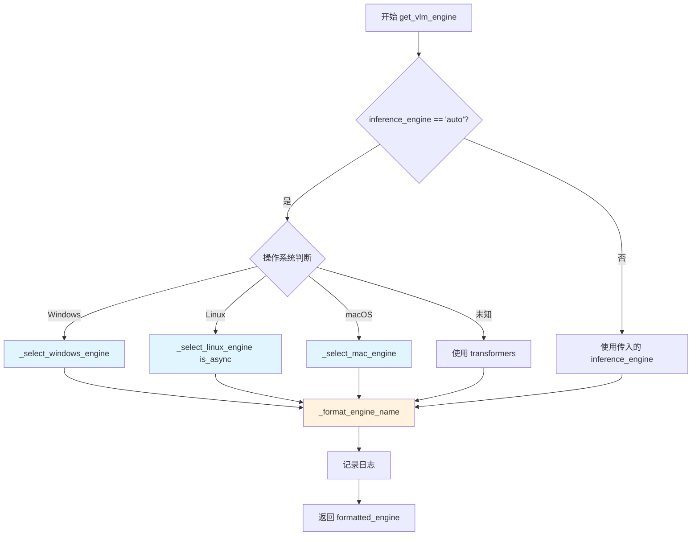
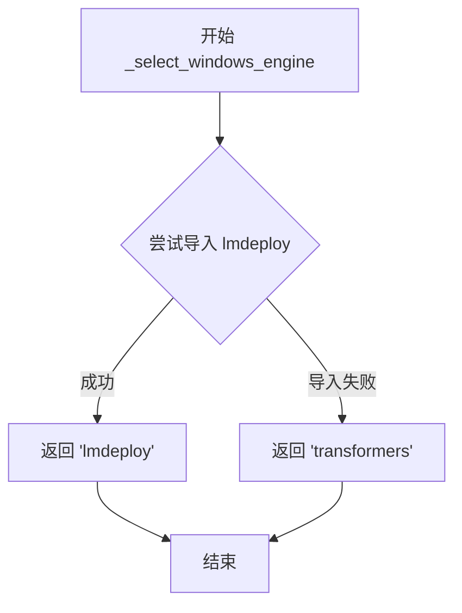
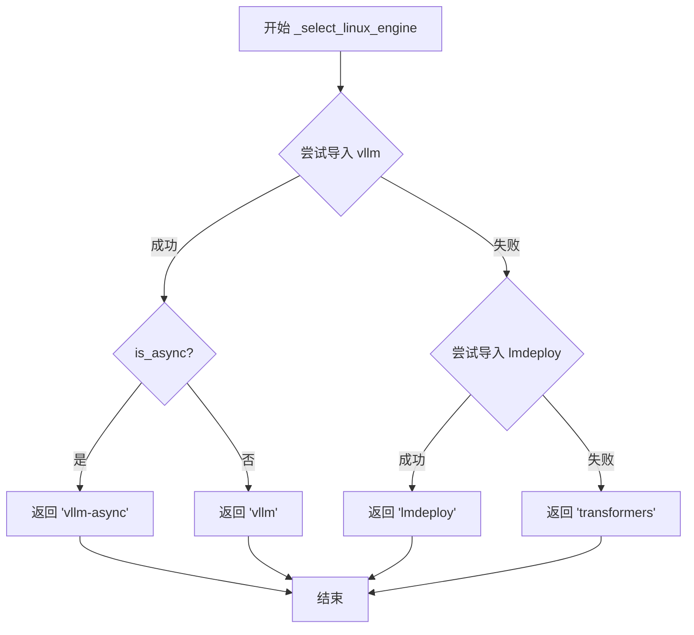
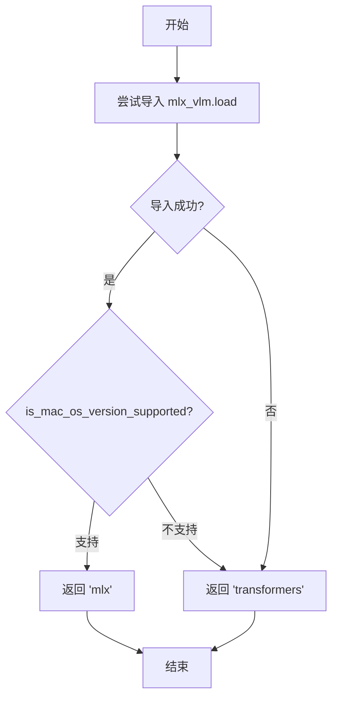

# `MinerU\mineru\utils\engine_utils.py` 详细设计文档

该代码实现了一个智能的 VLM（视觉语言模型）推理引擎自动选择机制，根据不同的操作系统环境自动选择最优的推理引擎（vllm、lmdeploy、mlx 或 transformers）。

## 整体流程

```mermaid
graph TD
    A[开始] --> B{inference_engine == 'auto'?}
    B -- 否 --> C[_format_engine_name(inference_engine)]
    B -- 是 --> D{is_windows_environment()?}
    D -- 是 --> E[_select_windows_engine]
    D -- 否 --> F{is_linux_environment()?}
    F -- 是 --> G[_select_linux_engine(is_async)]
    F -- 否 --> H{is_mac_environment()?}
    H -- 是 --> I[_select_mac_engine]
    H -- 否 --> J[fallback to transformers]
    E --> K[_format_engine_name]
    G --> K
    I --> K
    J --> K
    C --> K
    K --> L[返回格式化后的引擎名称]
```

## 类结构

```
无类层次结构（该文件仅包含函数模块）
```

## 全局变量及字段


### `logger`
    
loguru库提供的日志对象，用于记录程序运行时的日志信息

类型：`logging.Logger`
    


### `is_mac_os_version_supported`
    
检查macOS版本是否支持的函数

类型：`Callable[[], bool]`
    


### `is_windows_environment`
    
检查当前是否运行在Windows环境的函数

类型：`Callable[[], bool]`
    


### `is_mac_environment`
    
检查当前是否运行在macOS环境的函数

类型：`Callable[[], bool]`
    


### `is_linux_environment`
    
检查当前是否运行在Linux环境的函数

类型：`Callable[[], bool]`
    


    

## 全局函数及方法


### `get_vlm_engine`

自动选择或验证 VLM 推理引擎，根据操作系统和参数自动选择合适的推理后端。

参数：

- `inference_engine`：`str`，指定的引擎名称或 `'auto'` 进行自动选择
- `is_async`：`bool`，是否使用异步引擎（仅对 vllm 有效），默认为 `False`

返回值：`str`，最终选择的引擎名称

#### 流程图



#### 带注释源码

```python
def get_vlm_engine(inference_engine: str, is_async: bool = False) -> str:
    """
    自动选择或验证 VLM 推理引擎

    Args:
        inference_engine: 指定的引擎名称或 'auto' 进行自动选择
        is_async: 是否使用异步引擎(仅对 vllm 有效)

    Returns:
        最终选择的引擎名称
    """
    # 判断是否需要自动选择引擎
    if inference_engine == 'auto':
        # 根据操作系统自动选择引擎
        if is_windows_environment():
            # Windows 平台：优先尝试 lmdeploy，回退到 transformers
            inference_engine = _select_windows_engine()
        elif is_linux_environment():
            # Linux 平台：根据 is_async 参数选择 vllm-async 或 vllm，
            # 回退尝试 lmdeploy，最后回退到 transformers
            inference_engine = _select_linux_engine(is_async)
        elif is_mac_environment():
            # macOS 平台：根据系统版本选择 mlx 或 transformers
            inference_engine = _select_mac_engine()
        else:
            # 未知操作系统，记录警告并回退到 transformers
            logger.warning("Unknown operating system, falling back to transformers")
            inference_engine = 'transformers'

    # 格式化引擎名称：非 transformers 引擎统一添加 "-engine" 后缀
    formatted_engine = _format_engine_name(inference_engine)
    # 记录最终使用的引擎
    logger.info(f"Using {formatted_engine} as the inference engine for VLM.")
    return formatted_engine
```


### `_select_windows_engine`

Windows 平台引擎选择函数，用于在 Windows 环境中自动选择合适的 VLM 推理引擎，优先尝试使用 lmdeploy，若导入失败则回退到 transformers。

参数：无参数

返回值：`str`，返回选定的引擎名称（'lmdeploy' 或 'transformers'）

#### 流程图



#### 带注释源码

```python
def _select_windows_engine() -> str:
    """
    Windows 平台引擎选择
    
    该函数在 Windows 环境中尝试选择最优的 VLM 推理引擎。
    优先选择 lmdeploy，因为它在 Windows 上通常有更好的支持；
    如果 lmdeploy 不可用，则回退到 transformers 作为通用选项。
    
    Returns:
        str: 选定的引擎名称，'lmdeploy' 或 'transformers'
    """
    try:
        # 尝试导入 lmdeploy 库
        # lmdeploy 是 NVIDIA 推出的推理部署框架，在 Windows 上支持较好
        import lmdeploy
        # 导入成功，返回 lmdeploy 作为首选引擎
        return 'lmdeploy'
    except ImportError:
        # lmdeploy 导入失败（未安装或不可用）
        # 回退到 transformers 作为通用可靠的备选方案
        return 'transformers'
```

---

### 关联信息

#### 关键组件信息

| 组件名称 | 一句话描述 |
|---------|-----------|
| `lmdeploy` | NVIDIA 推出的轻量级推理部署框架，优先选择的引擎 |
| `transformers` | Hugging Face 的 Transformers 库，作为回退的通用引擎 |

#### 潜在技术债务或优化空间

1. **缺乏版本检查**：当前仅检查模块是否可导入，未验证版本兼容性，可能导致运行时错误
2. **硬编码的引擎优先级**：引擎选择逻辑固定，未来扩展新引擎需要修改函数源码
3. **缺少详细错误日志**：ImportError 被静默处理，建议记录具体缺失原因便于调试

#### 错误处理与异常设计

- 使用 `try/except ImportError` 捕获导入失败异常
- 当前设计为静默失败（无日志输出），建议添加 `logger.warning()` 记录回退行为

#### 在整体流程中的位置

该函数被 `get_vlm_engine()` 调用，当 `inference_engine` 参数为 `'auto'` 且系统为 Windows 环境时触发调用。完整调用链：

```
get_vlm_engine('auto') 
  → is_windows_environment() == True 
  → _select_windows_engine()
```


### `_select_linux_engine`

Linux 平台推理引擎选择函数，根据异步参数尝试优先使用 vllm 引擎，若失败则尝试 lmdeploy，最后回退到 transformers。

参数：

- `is_async`：`bool`，是否使用异步引擎

返回值：`str`，最终选择的引擎名称（'vllm-async'、'vllm'、'lmdeploy' 或 'transformers'）

#### 流程图



#### 带注释源码

```python
def _select_linux_engine(is_async: bool) -> str:
    """
    Linux 平台引擎选择
    
    优先级: vllm > lmdeploy > transformers
    根据 is_async 参数决定是否使用 vllm 的异步版本
    
    Args:
        is_async: 是否使用异步引擎
        
    Returns:
        选择的推理引擎名称
    """
    # 优先尝试导入 vllm 引擎（性能最优）
    try:
        import vllm
        # 根据异步参数返回对应版本
        # vllm-async: 异步推理模式，适合高并发场景
        # vllm: 同步推理模式
        return 'vllm-async' if is_async else 'vllm'
    except ImportError:
        # vllm 不可用时，尝试 lmdeploy（国产推理引擎）
        try:
            import lmdeploy
            return 'lmdeploy'
        except ImportError:
            # 所有高性能引擎都不可用，回退到 transformers（最稳定但性能较低）
            return 'transformers'
```


### `_select_mac_engine`

macOS 平台推理引擎选择函数，根据当前 macOS 操作系统版本是否支持 MLX 框架，智能选择 'mlx'（高性能苹果芯片推理引擎）或 'transformers'（通用推理引擎）作为 VLM 推理后端。

参数：无

返回值：`str`，返回选择的推理引擎名称（'mlx' 或 'transformers'）

#### 流程图



#### 带注释源码

```python
def _select_mac_engine() -> str:
    """
    macOS 平台引擎选择
    
    尝试使用 MLX 框架（苹果芯片专用推理引擎），
    如果不可用则回退到 transformers 通用引擎
    
    Returns:
        str: 选择的推理引擎名称
    """
    try:
        # 尝试导入 mlx_vlm 的加载函数
        # mlx_vlm 是苹果芯片专用的视觉语言模型推理库
        from mlx_vlm import load as mlx_load
        
        # 检查当前 macOS 版本是否满足 MLX 框架要求
        if is_mac_os_version_supported():
            # macOS 版本支持，返回高性能的 mlx 引擎
            return 'mlx'
        else:
            # macOS 版本过低，回退到通用的 transformers 引擎
            return 'transformers'
    except ImportError:
        # mlx_vlm 未安装或导入失败，回退到 transformers 引擎
        return 'transformers'
```


### `_format_engine_name`

该函数用于统一格式化引擎名称，当引擎名称不是 'transformers' 时，会自动添加 '-engine' 后缀，以保持引擎命名的一致性。

参数：

- `engine`：`str`，原始引擎名称

返回值：`str`，格式化后的引擎名称

#### 流程图

```mermaid
flowchart TD
    A[开始] --> B{engine != 'transformers'?}
    B -->|是| C[返回 f"{engine}-engine"]
    B -->|否| D[返回 'transformers']
    C --> E[结束]
    D --> E
```

#### 带注释源码

```python
def _format_engine_name(engine: str) -> str:
    """
    统一格式化引擎名称
    
    Args:
        engine: 原始引擎名称字符串
        
    Returns:
        格式化后的引擎名称字符串
        - 如果 engine 不是 'transformers'，返回 '{engine}-engine'
        - 如果 engine 是 'transformers'，直接返回 'transformers'
    """
    # 判断引擎是否为 transformers
    if engine != 'transformers':
        # 非 transformers 引擎添加 -engine 后缀
        return f"{engine}-engine"
    # transformers 引擎保持原名
    return engine
```

## 关键组件


这段代码是一个VLM（视觉语言模型）推理引擎自动选择工具，根据当前操作系统环境自动选择最合适的推理引擎（vllm、lmdeploy、mlx或transformers），并支持异步模式配置。

### 文件整体运行流程

1. 入口函数`get_vlm_engine`接收推理引擎名称和异步标志
2. 若引擎为'auto'，则根据操作系统调用对应的平台选择函数
3. 各平台选择函数尝试导入对应引擎，失败时降级到transformers
4. 最后通过`_format_engine_name`统一格式化引擎名称并返回

### 全局函数详细信息

#### get_vlm_engine

自动选择或验证VLM推理引擎

- 参数：
  - `inference_engine: str` - 指定的引擎名称或'auto'进行自动选择
  - `is_async: bool` - 是否使用异步引擎（仅对vllm有效）
- 返回值：
  - `str` - 最终选择的引擎名称
- 源码：
```python
def get_vlm_engine(inference_engine: str, is_async: bool = False) -> str:
    """
    自动选择或验证 VLM 推理引擎

    Args:
        inference_engine: 指定的引擎名称或 'auto' 进行自动选择
        is_async: 是否使用异步引擎(仅对 vllm 有效)

    Returns:
        最终选择的引擎名称
    """
    if inference_engine == 'auto':
        # 根据操作系统自动选择引擎
        if is_windows_environment():
            inference_engine = _select_windows_engine()
        elif is_linux_environment():
            inference_engine = _select_linux_engine(is_async)
        elif is_mac_environment():
            inference_engine = _select_mac_engine()
        else:
            logger.warning("Unknown operating system, falling back to transformers")
            inference_engine = 'transformers'

    formatted_engine = _format_engine_name(inference_engine)
    logger.info(f"Using {formatted_engine} as the inference engine for VLM.")
    return formatted_engine
```

#### _select_windows_engine

Windows平台引擎选择，优先尝试lmdeploy，失败则降级到transformers

- 参数：无
- 返回值：
  - `str` - 选择的引擎名称
- 源码：
```python
def _select_windows_engine() -> str:
    """Windows 平台引擎选择"""
    try:
        import lmdeploy
        return 'lmdeploy'
    except ImportError:
        return 'transformers'
```

#### _select_linux_engine

Linux平台引擎选择，优先尝试vllm（支持异步），其次lmdeploy，最后transformers

- 参数：
  - `is_async: bool` - 是否使用异步模式
- 返回值：
  - `str` - 选择的引擎名称
- 源码：
```python
def _select_linux_engine(is_async: bool) -> str:
    """Linux 平台引擎选择"""
    try:
        import vllm
        return 'vllm-async' if is_async else 'vllm'
    except ImportError:
        try:
            import lmdeploy
            return 'lmdeploy'
        except ImportError:
            return 'transformers'
```

#### _select_mac_engine

macOS平台引擎选择，优先使用mlx（需系统版本支持），否则降级到transformers

- 参数：无
- 返回值：
  - `str` - 选择的引擎名称
- 源码：
```python
def _select_mac_engine() -> str:
    """macOS 平台引擎选择"""
    try:
        from mlx_vlm import load as mlx_load
        if is_mac_os_version_supported():
            return 'mlx'
        else:
            return 'transformers'
    except ImportError:
        return 'transformers'
```

#### _format_engine_name

统一格式化引擎名称，非transformers引擎添加"-engine"后缀

- 参数：
  - `engine: str` - 引擎名称
- 返回值：
  - `str` - 格式化后的引擎名称
- 源码：
```python
def _format_engine_name(engine: str) -> str:
    """统一格式化引擎名称"""
    if engine != 'transformers':
        return f"{engine}-engine"
    return engine
```

### 关键组件信息

#### 引擎自动选择器

根据操作系统环境动态选择最优推理引擎，支持Windows、Linux、macOS三平台

#### 引擎降级策略

各平台实现级联降级机制，确保至少有一个可用的推理引擎

#### 异步引擎支持

Linux平台vllm引擎支持异步模式，通过is_async参数控制

### 潜在技术债务或优化空间

1. **重复导入检测**：每次调用都重新尝试import，建议缓存导入结果
2. **引擎版本检测**：未检查引擎版本兼容性，可能导致运行时错误
3. **错误信息不明确**：import失败时仅返回降级引擎，缺少具体缺失原因日志
4. **macOS引擎判断不完整**：仅检查mlx_vlm导入和系统版本，未检查mlx是否可用

### 其它项目

#### 设计目标与约束

- 设计目标：实现跨平台的VLM推理引擎自动选择
- 约束：优先使用高性能引擎，失败时保证功能可用性

#### 错误处理与异常设计

- 使用try-except捕获ImportError
- 未知操作系统时记录警告并降级到transformers
- 所有平台选择失败时默认返回transformers作为保底

#### 外部依赖与接口契约

- 依赖：loguru日志库、mineru.utils.check_sys_env环境检测模块
- 接口：get_vlm_engine为公开接口，接受引擎名称和异步标志，返回格式化后的引擎字符串


## 问题及建议


### 已知问题

- **异常处理不一致**：`_select_mac_engine()`中`is_mac_os_version_supported()`调用在`try-except`块外部，若该函数抛出异常会导致程序崩溃；而其他平台引擎选择函数的异常处理均在`try`块内
- **日志信息不完整**：仅Windows平台fallback时有warning日志，Linux和Mac平台降级到transformers时无任何日志提示
- **引擎选择逻辑重复**：三个平台选择函数`_select_windows_engine`、`_select_linux_engine`、`_select_mac_engine`结构高度相似，存在代码重复
- **模块重复导入**：每次调用引擎选择函数都会尝试`import`对应模块，没有缓存机制导致重复开销
- **类型语义模糊**：返回类型统一为`str`，无法区分`vllm`、`vllm-async`、`mlx`等不同引擎的语义差异
- **函数职责不清晰**：公开函数`get_vlm_engine`既处理自动选择又处理名称格式化，违反单一职责原则
- **扩展性差**：引擎选择逻辑硬编码，不支持通过配置文件或插件机制动态添加新引擎
- **Linux异步参数未完全利用**：`is_async`参数仅影响vllm引擎，对lmdeploy和transformers无实际作用

### 优化建议

- 将`is_mac_os_version_supported()`调用纳入`try-except`块统一处理异常
- 为所有平台的引擎降级路径添加统一的日志记录
- 提取公共的模块检查逻辑为独立函数，使用字典映射或策略模式减少重复代码
- 引入模块缓存机制，将已检查的模块状态缓存起来避免重复导入
- 考虑使用枚举或常量类定义引擎类型，提供更精确的类型注解
- 拆分`get_vlm_engine`函数，将引擎选择和名称格式化分离到不同函数
- 设计引擎注册表或配置文件机制，支持运行时动态注册新引擎
- 为`is_async`参数在所有引擎选择路径中提供一致的逻辑处理

## 其它


### 设计目标与约束

本模块的设计目标是提供一个跨平台的VLM推理引擎自动选择机制，使应用程序能够在不同的操作系统环境下自动选择最优的推理引擎，同时支持手动指定引擎。约束条件包括：必须支持Windows、Linux、macOS三大主流操作系统；当指定的引擎不可用时应有合理的回退策略；引擎选择逻辑应保持简洁高效，避免复杂的条件判断。

### 错误处理与异常设计

本模块的错误处理采用分级策略：对于ImportError采用捕获后返回默认值的方式处理，确保程序不会因单个引擎不可用而崩溃；对于未知操作系统采用warning级别日志记录并回退到transformers引擎；对于用户传入的无效inference_engine参数未做显式校验，默认行为由_format_engine_name统一处理。异常处理原则是保证程序的可用性优先，优先使用更高效的引擎，必要时降级到通用引擎。

### 数据流与状态机

本模块的数据流为：用户调用get_vlm_engine() → 判断是否为'auto'模式 → 根据操作系统环境分发到对应的平台选择函数 → 尝试导入目标引擎库 → 成功则返回引擎名称，失败则回退 → 最后通过_format_engine_name统一格式化输出。状态机包含三个主要状态：初始状态（接收inference_engine参数）、选择状态（根据环境选择引擎）、完成状态（返回格式化后的引擎名称）。

### 外部依赖与接口契约

本模块的外部依赖包括：loguru用于日志记录；mineru.utils.check_sys_env模块提供操作系统环境检测函数（is_mac_os_version_supported、is_windows_environment、is_mac_environment、is_linux_environment）；各推理引擎的Python包（lmdeploy、vllm、mlx_vlm、transformers）。接口契约方面：get_vlm_engine接受字符串类型inference_engine和布尔类型is_async参数，返回字符串类型的引擎名称；各私有选择函数分别返回对应平台的首选引擎名称或回退引擎名称。

### 性能考量

本模块的性能开销主要来自动态导入库操作（import语句），在Linux平台的选择逻辑中可能存在最多两次import尝试。为优化性能，建议：对于已知的引擎列表可以预先进行可用性检测并缓存结果；可以考虑使用importlib.util.find_spec进行轻量级的包存在性检查而非完整导入；在高频调用场景下可以对选择结果进行单例缓存。

### 兼容性设计

本模块的兼容性设计体现在：提供'auto'模式自动适配多平台；每个平台都有明确的回退方案（transformers作为兜底引擎）；引擎名称格式化逻辑统一处理不同引擎的命名差异；macOS平台额外检查操作系统版本支持情况。潜在兼容性问题包括：新版本vllm库可能不支持is_async参数；mlx_vlm库的API稳定性；不同版本transformers库的API差异。

### 测试策略

建议的测试策略包括：单元测试覆盖各平台选择函数的边界条件（引擎可用/不可用）；集成测试验证在真实操作系统环境下的引擎选择逻辑；Mock测试模拟各引擎库的导入失败场景；跨平台CI测试确保各操作系统的兼容性。测试用例应覆盖：auto模式在各平台的行为、指定引擎名称的透传、格式化函数的各种输入、异常场景的日志输出。

### 部署注意事项

部署时需注意：确保目标运行环境已安装必要的操作系统环境检测模块mineru.utils.check_sys_env；如使用auto模式需确保目标平台至少安装有一种推理引擎；对于生产环境建议明确指定推理引擎而非使用auto模式以减少运行时的不确定性；日志级别需要根据部署环境适当配置以控制日志输出量。

### 版本演化与扩展性

本模块的扩展性设计包括：新增平台支持只需添加新的平台检测函数和对应的选择函数；引擎选择逻辑遵循开闭原则，对扩展开放对修改封闭；_format_engine_name提供了统一的命名格式化便于后续添加新引擎。建议的未来扩展方向：增加GPU/CPU环境的细粒度选择、增加推理引擎版本兼容性检查、支持自定义引擎优先级配置。

    