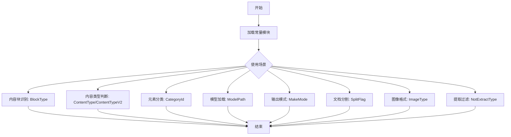
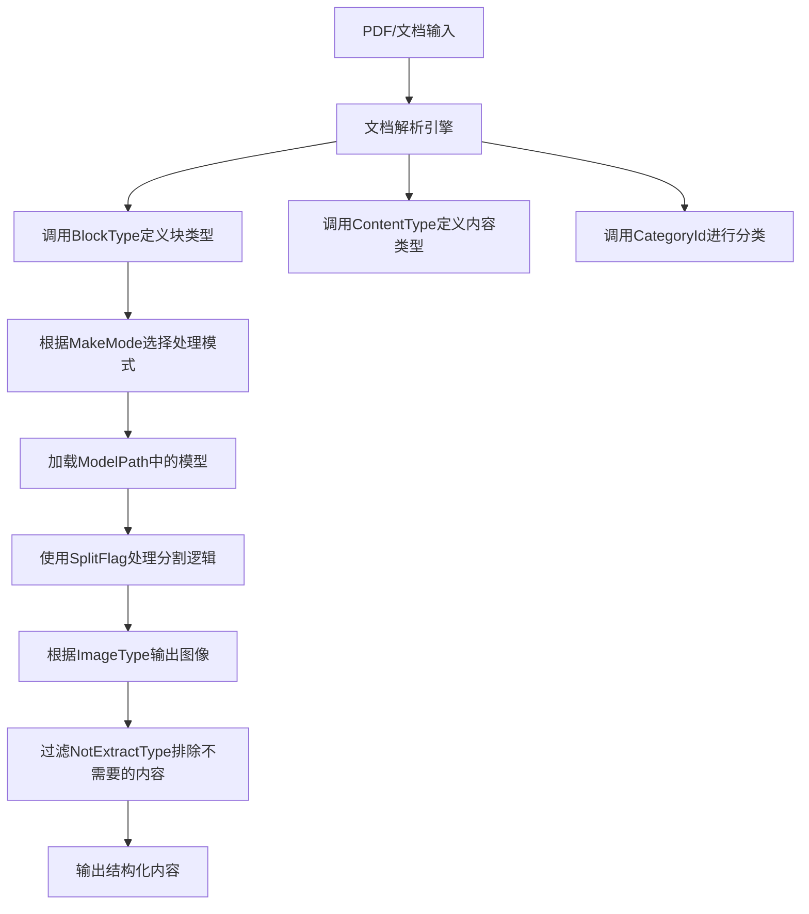
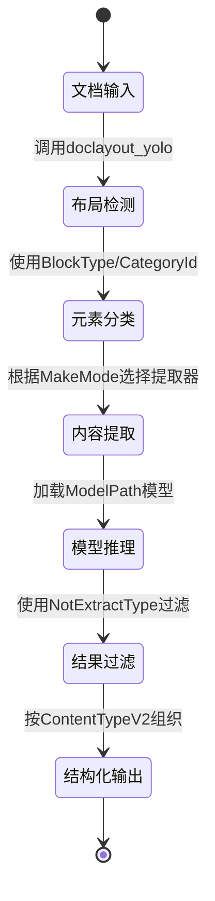

# `MinerU\mineru\utils\enum_class.py` 详细设计文档

该文件定义了PDF文档解析系统（MinerU项目）的核心常量类，涵盖了文档内容块类型（BlockType）、内容类型（ContentType）、分类ID（CategoryId）、模型路径（ModelPath）、制作模式（MakeMode）、分割标志（SplitFlag）、图像类型（ImageType）以及不可提取类型（NotExtractType）等关键枚举和类，用于指导文档元素的识别、分类和处理流程。

## 整体流程



## 类结构

```
BlockType (内容块类型枚举)
ContentType (内容类型枚举)
ContentTypeV2 (内容类型枚举v2)
CategoryId (分类ID类)
MakeMode (制作模式类)
ModelPath (模型路径类)
SplitFlag (分割标志类)
ImageType (图像类型类)
NotExtractType (不可提取类型枚举)
```

## 全局变量及字段


### `BlockType.IMAGE`
    
图像块

类型：`str`
    


### `BlockType.TABLE`
    
表格块

类型：`str`
    


### `BlockType.IMAGE_BODY`
    
图像主体

类型：`str`
    


### `BlockType.TABLE_BODY`
    
表格主体

类型：`str`
    


### `BlockType.IMAGE_CAPTION`
    
图像标题

类型：`str`
    


### `BlockType.TABLE_CAPTION`
    
表格标题

类型：`str`
    


### `BlockType.IMAGE_FOOTNOTE`
    
图像脚注

类型：`str`
    


### `BlockType.TABLE_FOOTNOTE`
    
表格脚注

类型：`str`
    


### `BlockType.TEXT`
    
文本

类型：`str`
    


### `BlockType.TITLE`
    
标题

类型：`str`
    


### `BlockType.INTERLINE_EQUATION`
    
行间公式

类型：`str`
    


### `BlockType.LIST`
    
列表

类型：`str`
    


### `BlockType.INDEX`
    
索引

类型：`str`
    


### `BlockType.DISCARDED`
    
丢弃

类型：`str`
    


### `BlockType.CODE`
    
代码块

类型：`str`
    


### `BlockType.CODE_BODY`
    
代码主体

类型：`str`
    


### `BlockType.CODE_CAPTION`
    
代码标题

类型：`str`
    


### `BlockType.ALGORITHM`
    
算法

类型：`str`
    


### `BlockType.REF_TEXT`
    
引用文本

类型：`str`
    


### `BlockType.PHONETIC`
    
注音

类型：`str`
    


### `BlockType.HEADER`
    
页眉

类型：`str`
    


### `BlockType.FOOTER`
    
页脚

类型：`str`
    


### `BlockType.PAGE_NUMBER`
    
页码

类型：`str`
    


### `BlockType.ASIDE_TEXT`
    
旁注

类型：`str`
    


### `BlockType.PAGE_FOOTNOTE`
    
页脚注

类型：`str`
    


### `ContentType.IMAGE`
    
图像内容

类型：`str`
    


### `ContentType.TABLE`
    
表格内容

类型：`str`
    


### `ContentType.TEXT`
    
文本内容

类型：`str`
    


### `ContentType.INTERLINE_EQUATION`
    
行间公式

类型：`str`
    


### `ContentType.INLINE_EQUATION`
    
行内公式

类型：`str`
    


### `ContentType.EQUATION`
    
公式

类型：`str`
    


### `ContentType.CODE`
    
代码

类型：`str`
    


### `ContentTypeV2.CODE`
    
代码

类型：`str`
    


### `ContentTypeV2.ALGORITHM`
    
算法

类型：`str`
    


### `ContentTypeV2.EQUATION_INTERLINE`
    
行间公式

类型：`str`
    


### `ContentTypeV2.IMAGE`
    
图像

类型：`str`
    


### `ContentTypeV2.TABLE`
    
表格

类型：`str`
    


### `ContentTypeV2.TABLE_SIMPLE`
    
简单表格

类型：`str`
    


### `ContentTypeV2.TABLE_COMPLEX`
    
复杂表格

类型：`str`
    


### `ContentTypeV2.LIST`
    
列表

类型：`str`
    


### `ContentTypeV2.LIST_TEXT`
    
文本列表

类型：`str`
    


### `ContentTypeV2.LIST_REF`
    
引用列表

类型：`str`
    


### `ContentTypeV2.TITLE`
    
标题

类型：`str`
    


### `ContentTypeV2.PARAGRAPH`
    
段落

类型：`str`
    


### `ContentTypeV2.SPAN_TEXT`
    
文本片段

类型：`str`
    


### `ContentTypeV2.SPAN_EQUATION_INLINE`
    
行内公式片段

类型：`str`
    


### `ContentTypeV2.SPAN_PHONETIC`
    
注音片段

类型：`str`
    


### `ContentTypeV2.SPAN_MD`
    
Markdown片段

类型：`str`
    


### `ContentTypeV2.SPAN_CODE_INLINE`
    
行内代码片段

类型：`str`
    


### `ContentTypeV2.PAGE_HEADER`
    
页眉

类型：`str`
    


### `ContentTypeV2.PAGE_FOOTER`
    
页脚

类型：`str`
    


### `ContentTypeV2.PAGE_NUMBER`
    
页码

类型：`str`
    


### `ContentTypeV2.PAGE_ASIDE_TEXT`
    
旁注

类型：`str`
    


### `ContentTypeV2.PAGE_FOOTNOTE`
    
页脚注

类型：`str`
    


### `CategoryId.Title`
    
标题分类ID

类型：`int`
    


### `CategoryId.Text`
    
文本分类ID

类型：`int`
    


### `CategoryId.Abandon`
    
废弃分类ID

类型：`int`
    


### `CategoryId.ImageBody`
    
图像主体分类ID

类型：`int`
    


### `CategoryId.ImageCaption`
    
图像标题分类ID

类型：`int`
    


### `CategoryId.TableBody`
    
表格主体分类ID

类型：`int`
    


### `CategoryId.TableCaption`
    
表格标题分类ID

类型：`int`
    


### `CategoryId.TableFootnote`
    
表格脚注分类ID

类型：`int`
    


### `CategoryId.InterlineEquation_Layout`
    
行间公式布局分类ID

类型：`int`
    


### `CategoryId.InterlineEquationNumber_Layout`
    
行间公式编号布局分类ID

类型：`int`
    


### `CategoryId.InlineEquation`
    
行内公式分类ID

类型：`int`
    


### `CategoryId.InterlineEquation_YOLO`
    
行间公式YOLO分类ID

类型：`int`
    


### `CategoryId.OcrText`
    
OCR文本分类ID

类型：`int`
    


### `CategoryId.LowScoreText`
    
低分文本分类ID

类型：`int`
    


### `CategoryId.ImageFootnote`
    
图像脚注分类ID

类型：`int`
    


### `MakeMode.MM_MD`
    
Markdown模式

类型：`str`
    


### `MakeMode.NLP_MD`
    
NLP Markdown模式

类型：`str`
    


### `MakeMode.CONTENT_LIST`
    
内容列表模式

类型：`str`
    


### `MakeMode.CONTENT_LIST_V2`
    
内容列表V2模式

类型：`str`
    


### `ModelPath.vlm_root_hf`
    
HuggingFace VLM根路径

类型：`str`
    


### `ModelPath.vlm_root_modelscope`
    
ModelScope VLM根路径

类型：`str`
    


### `ModelPath.pipeline_root_modelscope`
    
ModelScope Pipeline根路径

类型：`str`
    


### `ModelPath.pipeline_root_hf`
    
HuggingFace Pipeline根路径

类型：`str`
    


### `ModelPath.doclayout_yolo`
    
文档布局YOLO模型路径

类型：`str`
    


### `ModelPath.yolo_v8_mfd`
    
YOLO v8文字检测模型路径

类型：`str`
    


### `ModelPath.unimernet_small`
    
小型文字识别模型路径

类型：`str`
    


### `ModelPath.pp_formulanet_plus_m`
    
公式识别模型路径

类型：`str`
    


### `ModelPath.pytorch_paddle`
    
PaddleOCR模型路径

类型：`str`
    


### `ModelPath.layout_reader`
    
阅读顺序模型路径

类型：`str`
    


### `ModelPath.slanet_plus`
    
表格识别模型路径

类型：`str`
    


### `ModelPath.unet_structure`
    
表格结构识别模型路径

类型：`str`
    


### `ModelPath.paddle_table_cls`
    
表格分类模型路径

类型：`str`
    


### `ModelPath.paddle_orientation_classification`
    
方向分类模型路径

类型：`str`
    


### `SplitFlag.CROSS_PAGE`
    
跨页标志

类型：`str`
    


### `SplitFlag.LINES_DELETED`
    
行删除标志

类型：`str`
    


### `ImageType.PIL`
    
PIL图像格式

类型：`str`
    


### `ImageType.BASE64`
    
Base64图像格式

类型：`str`
    


### `NotExtractType.TEXT`
    
不提取的文本类型

类型：`Enum`
    


### `NotExtractType.TITLE`
    
不提取的标题类型

类型：`Enum`
    


### `NotExtractType.HEADER`
    
不提取的页眉类型

类型：`Enum`
    


### `NotExtractType.FOOTER`
    
不提取的页脚类型

类型：`Enum`
    


### `NotExtractType.PAGE_NUMBER`
    
不提取的页码类型

类型：`Enum`
    


### `NotExtractType.PAGE_FOOTNOTE`
    
不提取的页脚注类型

类型：`Enum`
    


### `NotExtractType.REF_TEXT`
    
不提取的引用文本类型

类型：`Enum`
    


### `NotExtractType.TABLE_CAPTION`
    
不提取的表格标题类型

类型：`Enum`
    


### `NotExtractType.IMAGE_CAPTION`
    
不提取的图像标题类型

类型：`Enum`
    


### `NotExtractType.TABLE_FOOTNOTE`
    
不提取的表格脚注类型

类型：`Enum`
    


### `NotExtractType.IMAGE_FOOTNOTE`
    
不提取的图像脚注类型

类型：`Enum`
    


### `NotExtractType.CODE_CAPTION`
    
不提取的代码标题类型

类型：`Enum`
    
    

## 全局函数及方法


## 关键组件


### BlockType

文档块类型枚举，定义了PDF或文档中各种内容块的类型标识，包括图像、表格、文本、标题、代码、公式、列表、页眉页脚等，是整个文档解析系统的基础类型定义。

### ContentType

内容类型枚举，定义了主要的内容分类，用于区分图像、表格、文本、公式、代码等核心内容类型，是内容识别的一级分类。

### ContentTypeV2

扩展内容类型枚举（V2版本），在ContentType基础上进行了细化，增加了更多细粒度类型如简单表格、复杂表格、文本列表、引用列表、页面元素等，支持更精细的文档结构解析。

### CategoryId

类别标识符枚举，使用整数ID标识不同的文档元素类别，如标题(0)、文本(1)、图像主体(3)、图像标题(4)、表格主体(5)等，用于后端处理和分类识别。

### MakeMode

输出模式枚举，定义了文档转换的输出格式，包括Markdown模式(mm_markdown)、NLP Markdown模式(nlp_markdown)、内容列表模式(content_list)和内容列表V2模式(content_list_v2)。

### ModelPath

模型路径配置类，定义了PDF解析pipeline中使用的各种AI模型的路径，包括视觉语言模型(VLM)、文档布局检测模型(YOLO)、公式识别模型、表格识别模型、OCR模型等的HuggingFace和ModelScope路径。

### SplitFlag

分割标志枚举，用于标记文档元素的状态，包括跨页标记(cross_page)和已删除行标记(lines_deleted)，用于处理跨页表格和内容过滤场景。

### ImageType

图像类型枚举，定义了图像的输出格式，包括PIL图像对象(pil_img)和Base64编码图像(base64_img)两种形式。

### NotExtractType

不提取类型枚举，基于BlockType定义了需要过滤排除的文档元素，如文本、标题、页眉页脚、页码、脚注、引用文本、表格/图像标题等，用于内容提取时的过滤逻辑。


## 问题及建议


### 已知问题

-   **混用常量定义方式**：BlockType、ContentType、ContentTypeV2、MakeMode、ModelPath、SplitFlag、ImageType 使用类属性定义字符串常量，而 NotExtractType 使用 Enum 类，两者风格不统一，后者更符合 Python 最佳实践。
-   **字符串字面量散落**：大量使用硬编码字符串（如 'image'、'table' 等），缺乏集中管理，容易出现拼写错误且难以维护。
-   **类名与用途不匹配**：BlockType、ContentType 等名为"Type"但实际用作常量集合，与 Python 类型系统惯例不符，应使用 Enum 或明确为常量类。
-   **命名风格不一致**：CategoryId 中使用 PascalCase（如 Title、Text），而其他类使用全大写加下划线（如 MM_MK），ModelPath 中又使用全小写加下划线（如 vlm_root_hf），违反 PEP8 规范。
-   **重复定义**：BlockType 和 ContentType 中存在重复定义（如 IMAGE、TABLE、TEXT、INTERLINE_EQUATION、CODE），可能导致维护困难和逻辑混乱。
-   **魔法字符串问题**：ModelPath 中的路径字符串（如 "models/Layout/YOLO/..."）包含硬编码路径前缀，缺乏灵活配置机制。
-   **版本注释不规范**：使用代码注释（# Added in vlm 2.5）标记版本信息，而非正式的版本控制或变更日志。
-   **ContentTypeV2 设计意图不明确**：ContentType 和 ContentTypeV2 的关系和演进原因未在代码中体现，后续维护者可能难以理解。
-   **缺少文档字符串**：所有类均无文档注释，无法提供类型用途、取值范围等必要说明。
-   **枚举值类型不安全**：使用类属性定义的常量可被随意修改（尽管不推荐），而 Enum 提供更强的类型安全保障。

### 优化建议

-   **统一使用 Enum**：将所有常量集合改为 Enum 或 IntEnum（CategoryId），提供更强的类型检查和 IDE 支持。
-   **消除重复定义**：提取公共常量到共享基类或单独的工具类中，避免重复。
-   **统一命名规范**：遵循 PEP8，类名使用 PascalCase，常量使用全大写加下划线。
-   **集中管理字符串常量**：使用 Enum 或独立的常量模块管理所有字符串常量，便于搜索和维护。
-   **添加文档字符串**：为每个类和重要常量添加 docstring，说明用途、取值含义和版本历史。
-   **外部化配置**：将 ModelPath 中的路径前缀设计为可配置项，支持从配置文件或环境变量加载。
-   **使用版本管理工具**：用 Git 或 changelog 文件记录版本变更，而非代码注释。
-   **明确类型演进**：若 ContentTypeV2 是重大升级，考虑添加注释说明与 V1 的兼容性或迁移路径。


## 其它


### 1. 一段话描述

该代码文件定义了一套完整的文档解析和内容提取的枚举配置系统，涵盖了从文档元素类型（BlockType）、内容分类（ContentType/ContentTypeV2/CategoryId）、处理模式（MakeMode）到模型路径（ModelPath）的全链路配置，同时提供了分割标志（SplitFlag）、图像类型（ImageType）及排除类型（NotExtractType）等辅助枚举，共同构成了PDF/文档解析工具MinerU的核心配置基石，支持多种文档格式的智能识别、结构化提取和内容分类。

### 2. 文件的整体运行流程

本代码文件为配置定义模块，不涉及运行时流程，但其在整体系统中的调用流程如下：



### 3. 类的详细信息

#### 3.1 BlockType 类

- **类描述**：定义文档中各种块元素的类型枚举，用于标识PDF或文档中的不同内容区域

- **类字段（类属性）**：

| 名称 | 类型 | 描述 |
|------|------|------|
| IMAGE | str | 图像块类型 |
| TABLE | str | 表格块类型 |
| IMAGE_BODY | str | 图像主体内容块 |
| TABLE_BODY | str | 表格主体内容块 |
| IMAGE_CAPTION | str | 图像标题/说明块 |
| TABLE_CAPTION | str | 表格标题/说明块 |
| IMAGE_FOOTNOTE | str | 图像脚注块 |
| TABLE_FOOTNOTE | str | 表格脚注块 |
| TEXT | str | 文本块 |
| TITLE | str | 标题块 |
| INTERLINE_EQUATION | str | 行间公式块 |
| LIST | str | 列表块 |
| INDEX | str | 索引块 |
| DISCARDED | str | 丢弃/废弃块 |
| CODE | str | 代码块（vlm 2.5新增） |
| CODE_BODY | str | 代码主体块 |
| CODE_CAPTION | str | 代码标题块 |
| ALGORITHM | str | 算法块 |
| REF_TEXT | str | 引用文本块 |
| PHONETIC | str | 音标/拼音块 |
| HEADER | str | 页眉块 |
| FOOTER | str | 页脚块 |
| PAGE_NUMBER | str | 页码块 |
| ASIDE_TEXT | str | 旁注块 |
| PAGE_FOOTNOTE | str | 页面脚注块 |

- **类方法**：无（该类仅包含类属性）

#### 3.2 ContentType 类

- **类描述**：定义内容类型的简洁枚举，用于标识主要内容载体

- **类字段（类属性）**：

| 名称 | 类型 | 描述 |
|------|------|------|
| IMAGE | str | 图像内容类型 |
| TABLE | str | 表格内容类型 |
| TEXT | str | 文本内容类型 |
| INTERLINE_EQUATION | str | 行间公式内容类型 |
| INLINE_EQUATION | str | 行内公式内容类型 |
| EQUATION | str | 公式内容类型（通用） |
| CODE | str | 代码内容类型 |

- **类方法**：无

#### 3.3 ContentTypeV2 类

- **类描述**：内容类型的扩展版本v2，提供了更细粒度的内容类型划分，支持更多文档元素类型

- **类字段（类属性）**：

| 名称 | 类型 | 描述 |
|------|------|------|
| CODE | str | 代码内容类型 |
| ALGORITHM | str | 算法内容类型 |
| EQUATION_INTERLINE | str | 行间公式内容类型 |
| IMAGE | str | 图像内容类型 |
| TABLE | str | 表格内容类型 |
| TABLE_SIMPLE | str | 简单表格内容类型 |
| TABLE_COMPLEX | str | 复杂表格内容类型 |
| LIST | str | 列表内容类型 |
| LIST_TEXT | str | 文本列表内容类型 |
| LIST_REF | str | 引用列表内容类型 |
| TITLE | str | 标题内容类型 |
| PARAGRAPH | str | 段落内容类型 |
| SPAN_TEXT | str | 文本片段内容类型 |
| SPAN_EQUATION_INLINE | str | 行内公式片段类型 |
| SPAN_PHONETIC | str | 拼音片段内容类型 |
| SPAN_MD | str | Markdown片段内容类型 |
| SPAN_CODE_INLINE | str | 行内代码片段类型 |
| PAGE_HEADER | str | 页面页眉内容类型 |
| PAGE_FOOTER | str | 页面页脚内容类型 |
| PAGE_NUMBER | str | 页码内容类型 |
| PAGE_ASIDE_TEXT | str | 页面旁注内容类型 |
| PAGE_FOOTNOTE | str | 页面脚注内容类型 |

- **类方法**：无

#### 3.4 CategoryId 类

- **类描述**：定义文档元素分类ID的枚举，用于内部处理和模型训练的类别标识

- **类字段（类属性）**：

| 名称 | 类型 | 描述 |
|------|------|------|
| Title | int | 标题分类ID |
| Text | int | 文本分类ID |
| Abandon | int | 废弃/放弃分类ID |
| ImageBody | int | 图像主体分类ID |
| ImageCaption | int | 图像标题分类ID |
| TableBody | int | 表格主体分类ID |
| TableCaption | int | 表格标题分类ID |
| TableFootnote | int | 表格脚注分类ID |
| InterlineEquation_Layout | int | 行间公式布局分类ID |
| InterlineEquationNumber_Layout | int | 行间公式编号分类ID |
| InlineEquation | int | 行内公式分类ID |
| InterlineEquation_YOLO | int | 行间公式YOLO分类ID |
| OcrText | int | OCR识别文本分类ID |
| LowScoreText | int | 低置信度文本分类ID |
| ImageFootnote | int | 图像脚注分类ID |

- **类方法**：无

#### 3.5 MakeMode 类

- **类描述**：定义文档处理的输出模式枚举

- **类字段（类属性）**：

| 名称 | 类型 | 描述 |
|------|------|------|
| MM_MD | str | Markdown格式输出模式 |
| NLP_MD | str | NLP增强的Markdown输出模式 |
| CONTENT_LIST | str | 内容列表输出模式v1 |
| CONTENT_LIST_V2 | str | 内容列表输出模式v2 |

- **类方法**：无

#### 3.6 ModelPath 类

- **类描述**：定义各种AI模型和资源的路径配置类，用于统一管理模型文件路径

- **类字段（类属性）**：

| 名称 | 类型 | 描述 |
|------|------|------|
| vlm_root_hf | str | VLM模型HuggingFace根路径 |
| vlm_root_modelscope | str | VLM模型ModelScope根路径 |
| pipeline_root_modelscope | str | 管道模型ModelScope根路径 |
| pipeline_root_hf | str | 管道模型HuggingFace根路径 |
| doclayout_yolo | str | 文档布局YOLO模型路径 |
| yolo_v8_mfd | str | YOLOv8文档元素检测模型路径 |
| unimernet_small | str | Unimernet小规模公式识别模型路径 |
| pp_formulanet_plus_m | str | PaddlePaddle公式识别模型路径 |
| pytorch_paddle | str | Pytorch版PaddleOCR模型路径 |
| layout_reader | str | 阅读顺序布局读取模型路径 |
| slanet_plus | str | Slanet Plus表格识别模型路径 |
| unet_structure | str | UNet结构检测模型路径 |
| paddle_table_cls | str | Paddle表格分类模型路径 |
| paddle_orientation_classification | str | Paddle方向分类模型路径 |

- **类方法**：无

#### 3.7 SplitFlag 类

- **类描述**：定义文档分割处理的标志枚举

- **类字段（类属性）**：

| 名称 | 类型 | 描述 |
|------|------|------|
| CROSS_PAGE | str | 跨页分割标志 |
| LINES_DELETED | str | 行删除标志 |

- **类方法**：无

#### 3.8 ImageType 类

- **类描述**：定义图像输出的格式类型枚举

- **类字段（类属性）**：

| 名称 | 类型 | 描述 |
|------|------|------|
| PIL | str | PIL图像对象格式 |
| BASE64 | str | Base64编码字符串格式 |

- **类方法**：无

#### 3.9 NotExtractType 类

- **类描述**：定义不需要进行内容提取的块类型枚举，继承自Enum基类，用于过滤不需要提取的页面元素

- **类字段（类属性）**：

| 名称 | 类型 | 描述 |
|------|------|------|
| TEXT | BlockType | 文本类型不提取 |
| TITLE | BlockType | 标题类型不提取 |
| HEADER | BlockType | 页眉类型不提取 |
| FOOTER | BlockType | 页脚类型不提取 |
| PAGE_NUMBER | BlockType | 页码类型不提取 |
| PAGE_FOOTNOTE | BlockType | 页面脚注不提取 |
| REF_TEXT | BlockType | 引用文本不提取 |
| TABLE_CAPTION | BlockType | 表格标题不提取 |
| IMAGE_CAPTION | BlockType | 图像标题不提取 |
| TABLE_FOOTNOTE | BlockType | 表格脚注不提取 |
| IMAGE_FOOTNOTE | BlockType | 图像脚注不提取 |
| CODE_CAPTION | BlockType | 代码标题不提取 |

- **类方法**：无

### 4. 全局变量和全局函数

- **全局变量**：无（本文件仅包含类和枚举定义）

- **全局函数**：无（本文件不包含任何函数定义）

### 5. 关键组件信息

| 名称 | 一句话描述 |
|------|------------|
| BlockType | 文档块元素类型定义的核心枚举，覆盖图像/表格/文本/代码等12+种元素类型 |
| ContentTypeV2 | 细粒度内容类型扩展版本，支持简单/复杂表格、文本片段、Markdown片段等20+类型 |
| CategoryId | 文档元素分类ID映射表，用于模型训练和推理的类别标识 |
| ModelPath | 统一管理PDF解析管道中9+种AI模型的路径配置，支持HuggingFace和ModelScope双源 |
| NotExtractType | 提取过滤规则定义，用于排除页眉/页脚/页码等辅助元素 |
| MakeMode | 输出格式控制枚举，支持Markdown和结构化列表两种主流输出模式 |

### 6. 潜在的技术债务或优化空间

1. **重复定义问题**：BlockType、ContentType、ContentTypeV2三个类存在大量重复的字符串定义（如IMAGE、TABLE、CODE等），建议抽取公共常量到基类或使用继承关系

2. **版本管理混乱**：BlockType中通过注释标记"vlm 2.5"新增字段，ContentTypeV2作为独立类而非版本迭代，建议引入版本号管理机制

3. **硬编码路径风险**：ModelPath中的路径均为相对路径字符串，无运行时路径解析和校验，存在路径不存在时的隐性失败风险

4. **类型安全不足**：大量使用str类型而非TypeAlias或Literal，ContentTypeV2.SPAN_*系列与BlockType缺乏类型关联

5. **枚举一致性**：NotExtractType继承Enum但其他类仅作为类属性，建议统一使用Enum或dataclass

6. **魔法数字**：CategoryId中存在不连续的ID编号（如8,9后跳过10-12），缺乏注释说明

7. **文档缺失**：所有配置类无docstring，外部使用者需阅读源码才能理解用途

### 7. 其它项目

#### 7.1 设计目标与约束

- **设计目标**：建立统一的文档解析类型系统，支持多格式PDF/文档的结构化元素识别、内容提取和分类输出
- **设计约束**：
  - 字符串常量必须与下游模型输出标签完全匹配
  - 保持向后兼容，新增类型不能影响已有功能的字符串值
  - 模型路径需支持HuggingFace和ModelScope双源切换

#### 7.2 错误处理与异常设计

- 当前配置类无运行时校验，建议增加：
  - ModelPath路径存在性检查（文件/目录）
  - BlockType与CategoryId的值一致性校验
  - MakeMode合法值验证

#### 7.3 数据流与状态机



#### 7.4 外部依赖与接口契约

- **依赖**：
  - Python标准库：Enum（NotExtractType使用）
  - 无第三方依赖（纯配置定义）
- **接口契约**：
  - 所有str类型常量供外部模块直接引用
  - ModelPath类属性供配置加载器读取
  - NotExtractType枚举值供提取器做过滤判断

#### 7.5 配置管理策略

- **变更策略**：新增BlockType字段时需同步更新ContentTypeV2和CategoryId映射表
- **版本记录**：建议在代码头部添加版本日志，记录各类型集合的变更历史

#### 7.6 使用示例

```python
# 示例：使用BlockType过滤提取结果
extracted_blocks = [block1, block2, block3]
filtered = [b for b in extracted_blocks if b.type not in [e.value for e in NotExtractType]]

# 示例：使用ModelPath加载模型
from transformers import AutoModel
model = AutoModel.from_pretrained(ModelPath.vlm_root_hf)
```


    