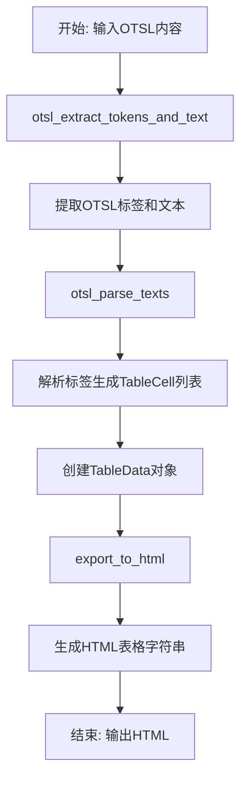
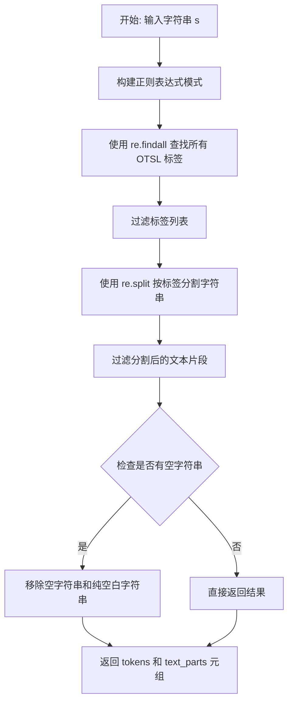
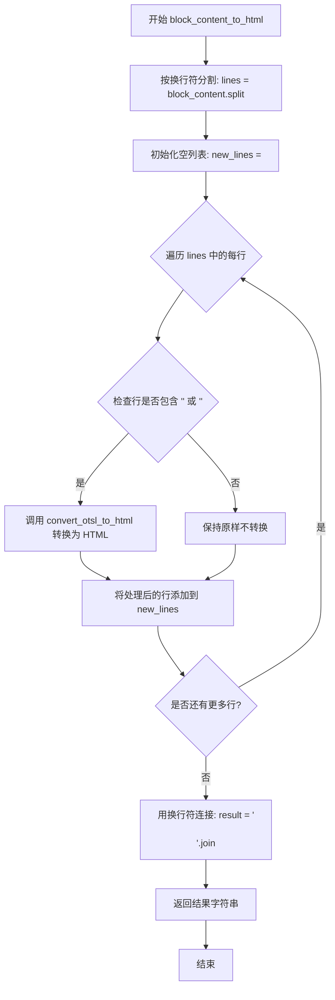

# `MinerU\mineru\utils\format_utils.py` 详细设计文档

该代码实现了一个OTSL（Open Table Structure Language）解析器，能够将包含OTSL标签的文本内容转换为HTML表格，支持单元格的行列跨度和表头识别。

## 整体流程



## 类结构

```
TableCell (Pydantic BaseModel)
└── from_dict_format (model_validator)

TableData (Pydantic BaseModel)
└── grid (computed_field)
```

## 全局变量及字段


### `OTSL_NL`
    
换行标签 '<nl>'

类型：`str`
    


### `OTSL_FCEL`
    
首个单元格标签 '<fcel>'

类型：`str`
    


### `OTSL_ECEL`
    
空单元格标签 '<ecel>'

类型：`str`
    


### `OTSL_LCEL`
    
左侧跨列单元格标签 '<lcel>'

类型：`str`
    


### `OTSL_UCEL`
    
下方跨行单元格标签 '<ucel>'

类型：`str`
    


### `OTSL_XCEL`
    
二维跨格单元格标签 '<xcel>'

类型：`str`
    


### `TableCell.row_span`
    
行跨度

类型：`int`
    


### `TableCell.col_span`
    
列跨度

类型：`int`
    


### `TableCell.start_row_offset_idx`
    
起始行索引

类型：`int`
    


### `TableCell.end_row_offset_idx`
    
结束行索引

类型：`int`
    


### `TableCell.start_col_offset_idx`
    
起始列索引

类型：`int`
    


### `TableCell.end_col_offset_idx`
    
结束列索引

类型：`int`
    


### `TableCell.text`
    
单元格文本内容

类型：`str`
    


### `TableCell.column_header`
    
是否为列标题

类型：`bool`
    


### `TableCell.row_header`
    
是否为行标题

类型：`bool`
    


### `TableCell.row_section`
    
是否为行分区

类型：`bool`
    


### `TableData.table_cells`
    
表格单元格列表

类型：`List[TableCell]`
    


### `TableData.num_rows`
    
表格行数

类型：`int`
    


### `TableData.num_cols`
    
表格列数

类型：`int`
    


### `TableData.grid`
    
二维网格（计算属性）

类型：`List[List[TableCell]]`
    
    

## 全局函数及方法


### `otsl_extract_tokens_and_text`

该函数用于从输入字符串中提取 OTSL（Open Table Structure Language）标签和文本内容，通过正则表达式匹配预定义的 OTSL 标签（`<nl>`、`<fcel>`、`<ecel>`、`<lcel>`、`<ucel>`、`<xcel>`），将标签和文本内容分离并返回。

参数：

-  `s`：`str`，输入的需要解析的包含 OTSL 标签的字符串

返回值：`(List[str], List[str])`，返回元组，第一个元素是提取到的所有 OTSL 标签列表，第二个元素是去除空白后的文本内容列表

#### 流程图



#### 带注释源码

```python
def otsl_extract_tokens_and_text(s: str):
    """
    从输入字符串中提取 OTSL 标签和文本内容。
    
    该函数使用正则表达式匹配预定义的 OTSL 标签集合，
    并将字符串分割为标签列表和文本内容列表两部分返回。
    
    Args:
        s: 输入的需要解析的包含 OTSL 标签的字符串
        
    Returns:
        返回元组 (tokens, text_parts):
            - tokens: 提取到的所有 OTSL 标签列表
            - text_parts: 去除空白后的文本内容列表
    """
    # 构建正则表达式模式，匹配预定义的 OTSL 标签
    # 标签包括: <nl>, <fcel>, <ecel>, <lcel>, <ucel>, <xcel>
    pattern = r"(" + r"|".join([OTSL_NL, OTSL_FCEL, OTSL_ECEL, OTSL_LCEL, OTSL_UCEL, OTSL_XCEL]) + r")"
    
    # 使用 re.findall 查找所有匹配的 OTSL 标签
    # 例如: 输入 "<fcel>内容<nl>测试" 会返回 ['<fcel>', '<nl>']
    tokens = re.findall(pattern, s)
    
    # 过滤标签列表（此处逻辑冗余，实际可移除）
    # 注释说明原本意图是移除以 "<loc_" 开头的标签
    tokens = [token for token in tokens]
    
    # 使用 re.split 按匹配到的标签分割字符串，获取文本内容
    # re.split 会保留分隔符（标签），因此 text_parts 会交替出现 [文本, 标签, 文本, 标签, ...]
    text_parts = re.split(pattern, s)
    
    # 过滤分割后的结果（此处逻辑冗余，实际可移除）
    text_parts = [token for token in text_parts]
    
    # 移除空字符串和纯空白字符串
    text_parts = [part for part in text_parts if part.strip()]
    
    return tokens, text_parts
```


### `otsl_parse_texts`

该函数用于解析包含OTSL（Open Table Structure Language）标记的文本和标记列表，生成TableCell列表和按行分割的标记组。它通过识别OTSL标签（如`<fcel>`、`<ecel>`、`<lcel>`、`<ucel>`、`<xcel>`、`<nl>`）来构建表格结构，计算单元格的行跨度(row_span)和列跨度(col_span)，并处理不规则矩阵的补全。

参数：

- `texts`：`List[str]`，需要解析的文本片段列表，包含实际文本内容和OTSL标记
- `tokens`：`List[str]`，从OTSL字符串中提取的标记列表，用于标识表格结构

返回值：

- `table_cells`：`List[TableCell]`，解析生成的表格单元格列表，每个单元格包含文本内容、行列跨度及位置索引
- `split_row_tokens`：`List[List[str]]`，按行分割的二维标记列表，每行是一个标记序列

#### 流程图

```mermaid
flowchart TD
    A[开始 otsl_parse_texts] --> B[设置分隔词 OTSL_NL = '<nl>']
    B --> C[使用 itertools.groupby 按 OTSL_NL 分组 tokens]
    C --> D[初始化 table_cells, r_idx, c_idx]
    E{检查 split_row_tokens} -->|不为空| F[计算最大列数 max_cols]
    E -->|为空| M[跳过矩阵补全]
    F --> G[为每行添加缺失的 <ecel> 标记]
    G --> H[补全文本列表 texts]
    H --> I[定义辅助函数 count_right 和 count_down]
    I --> J[遍历 texts 处理每个元素]
    
    J --> K{当前文本是否在 [OTSL_FCEL, OTSL_ECEL]}
    K -->|是| L[计算 row_span 和 col_span]
    K -->|否| N[继续下一个元素]
    
    L --> O[获取右侧和底部相邻单元格]
    O --> P{右侧单元格是否在 [OTSL_LCEL, OTSL_XCEL]}
    P -->|是| Q[调用 count_right 计算列跨度]
    P -->|否| R{底部单元格是否在 [OTSL_UCEL, OTSL_XCEL]}
    
    Q --> S[计算 row_span]
    R -->|是| T[调用 count_down 计算行跨度]
    R -->|否| U
    
    S --> U[创建 TableCell 并添加到 table_cells]
    T --> U
    
    U --> V{当前文本是否在 OTSL 标签集合}
    V -->|是| W[c_idx += 1]
    V -->|否| X{文本是否为 OTSL_NL}
    
    W --> N
    X -->|是| Y[r_idx += 1, c_idx = 0]
    X -->|否| N
    
    N --> Z{是否还有更多文本}
    Z -->|是| J
    Z -->|否| AA[返回 table_cells 和 split_row_tokens]
    
    M --> I
```

#### 带注释源码

```python
def otsl_parse_texts(texts, tokens):
    """
    解析文本和标签生成TableCell列表
    
    参数:
        texts: 文本片段列表，包含实际文本和OTSL标记
        tokens: 从OTSL字符串提取的标记列表
    返回:
        table_cells: TableCell对象列表
        split_row_tokens: 按行分割的二维标记列表
    """
    # 设置行分隔符为 OTSL_NL
    split_word = OTSL_NL
    
    # 使用 itertools.groupby 将 tokens 按是否为 split_word 分组
    # not x 表示选取不为分隔符的组（即表格行数据）
    # list(y) 将每个分组转换为列表
    split_row_tokens = [
        list(y)
        for x, y in itertools.groupby(tokens, lambda z: z == split_word)
        if not x
    ]
    
    # 初始化结果列表和行列索引
    table_cells = []
    r_idx = 0  # 行索引
    c_idx = 0  # 列索引

    # 检查并补全矩阵（处理不规则表格）
    if split_row_tokens:
        # 计算最大列数，确保矩阵规则
        max_cols = max(len(row) for row in split_row_tokens)

        # 为每行添加缺失的 <ecel> (空单元格) 标记
        for row_idx, row in enumerate(split_row_tokens):
            while len(row) < max_cols:
                row.append(OTSL_ECEL)

        # 重新组织文本列表，补全可能缺失的文本
        new_texts = []
        text_idx = 0

        # 遍历每一行和每一列
        for row_idx, row in enumerate(split_row_tokens):
            for col_idx, token in enumerate(row):
                # 添加当前标记
                new_texts.append(token)
                
                # 检查是否需要添加实际文本（非标记）
                if text_idx < len(texts) and texts[text_idx] == token:
                    text_idx += 1
                    # 如果下一个文本不是OTSL标记，则添加到new_texts
                    if (text_idx < len(texts) and 
                        texts[text_idx] not in [OTSL_NL, OTSL_FCEL, OTSL_ECEL, OTSL_LCEL, OTSL_UCEL, OTSL_XCEL]):
                        new_texts.append(texts[text_idx])
                        text_idx += 1

            # 添加行分隔符
            new_texts.append(OTSL_NL)
            if text_idx < len(texts) and texts[text_idx] == OTSL_NL:
                text_idx += 1

        # 更新文本列表
        texts = new_texts

    def count_right(tokens, c_idx, r_idx, which_tokens):
        """
        计算向右的跨列数量
        
        参数:
            tokens: 标记的二维列表
            c_idx: 当前列索引
            r_idx: 当前行索引
            which_tokens: 需要计算的标记类型列表
        返回:
            span: 跨越的列数
        """
        span = 0
        c_idx_iter = c_idx
        # 持续向右检查直到遇到非指定标记
        while tokens[r_idx][c_idx_iter] in which_tokens:
            c_idx_iter += 1
            span += 1
            if c_idx_iter >= len(tokens[r_idx]):
                return span
        return span

    def count_down(tokens, c_idx, r_idx, which_tokens):
        """
        计算向下的跨行数量
        
        参数:
            tokens: 标记的二维列表
            c_idx: 当前列索引
            r_idx: 当前行索引
            which_tokens: 需要计算的标记类型列表
        返回:
            span: 跨越的行数
        """
        span = 0
        r_idx_iter = r_idx
        # 持续向下检查直到遇到非指定标记
        while tokens[r_idx_iter][c_idx] in which_tokens:
            r_idx_iter += 1
            span += 1
            if r_idx_iter >= len(tokens):
                return span
        return span

    # 遍历所有文本元素，构建 TableCell 对象
    for i, text in enumerate(texts):
        cell_text = ""
        
        # 处理单元格标记：<fcel> (第一个单元格) 或 <ecel> (空/普通单元格)
        if text in [OTSL_FCEL, OTSL_ECEL]:
            # 初始化跨度和偏移
            row_span = 1
            col_span = 1
            right_offset = 1
            
            # 如果不是空单元格，获取下一个文本作为单元格内容
            if text != OTSL_ECEL:
                cell_text = texts[i + 1]
                right_offset = 2

            # 获取右侧相邻单元格标记
            next_right_cell = ""
            if i + right_offset < len(texts):
                next_right_cell = texts[i + right_offset]

            # 获取底部相邻单元格标记
            next_bottom_cell = ""
            if r_idx + 1 < len(split_row_tokens):
                if c_idx < len(split_row_tokens[r_idx + 1]):
                    next_bottom_cell = split_row_tokens[r_idx + 1][c_idx]

            # 处理水平跨列：<lcel> (左侧跨列) 或 <xcel> (2D跨列)
            if next_right_cell in [OTSL_LCEL, OTSL_XCEL]:
                # 计算水平跨越的列数
                col_span += count_right(
                    split_row_tokens,
                    c_idx + 1,
                    r_idx,
                    [OTSL_LCEL, OTSL_XCEL],
                )
            
            # 处理垂直跨行：<ucel> (上方跨行) 或 <xcel> (2D跨列)
            if next_bottom_cell in [OTSL_UCEL, OTSL_XCEL]:
                # 计算垂直跨越的行数
                row_span += count_down(
                    split_row_tokens,
                    c_idx,
                    r_idx + 1,
                    [OTSL_UCEL, OTSL_XCEL],
                )

            # 创建 TableCell 对象并添加到列表
            table_cells.append(
                TableCell(
                    text=cell_text.strip(),
                    row_span=row_span,
                    col_span=col_span,
                    start_row_offset_idx=r_idx,
                    end_row_offset_idx=r_idx + row_span,
                    start_col_offset_idx=c_idx,
                    end_col_offset_idx=c_idx + col_span,
                )
            )
        
        # 更新列索引（遇到任何单元格标记）
        if text in [OTSL_FCEL, OTSL_ECEL, OTSL_LCEL, OTSL_UCEL, OTSL_XCEL]:
            c_idx += 1
        
        # 更新行列索引（遇到换行标记）
        if text == OTSL_NL:
            r_idx += 1
            c_idx = 0
    
    return table_cells, split_row_tokens
```


### `export_to_html`

该函数是表格数据导出模块的核心方法，负责将内部定义的 `TableData` 对象（包含网格结构、单元格合并信息）转换为标准的 HTML `<table>` 字符串。它遍历表格网格，根据单元格的起始坐标渲染包含 `rowspan` 和 `colspan` 属性的 HTML 标签，并处理文本转义以防止 XSS 攻击。

参数：

- `table_data`：`TableData`，包含表格行数、列数及单元格列表的数据模型对象。

返回值：`str`，返回生成的 HTML 表格字符串；如果源数据中无单元格，则返回空字符串。

#### 流程图

```mermaid
graph TD
    A([Start export_to_html]) --> B{table_data.table_cells 是否为空?}
    B -- 是 --> C[返回空字符串 ""]
    B -- 否 --> D[获取 grid = table_data.grid]
    D --> E[遍历每一行 i]
    E --> F[遍历每一列 j]
    F --> G[获取单元格 cell = grid[i][j]]
    G --> H{当前单元格是否为该区域的起始点?}
    H -- 否 --> F
    H -- 是 --> I[获取 row_span, col_span, text]
    I --> J{cell.column_header 是否为真?}
    J -- 是 --> K[设置标签为 "th"]
    J -- 否 --> L[设置标签为 "td"]
    K --> M[使用 html.escape 转义文本内容]
    L --> M
    M --> N[构建带 rowspan/colspan 属性的标签]
    N --> O[拼接 HTML 标签串到 body]
    O --> F
    F --> P{循环结束?}
    P -- 否 --> E
    P -- 是 --> Q[将 body 包裹在 <table> 标签中]
    Q --> R([返回最终 HTML 字符串])
```

#### 带注释源码

```python
def export_to_html(table_data: TableData):
    """
    将 TableData 导出为 HTML 表格字符串。
    
    Args:
        table_data: 包含表格完整数据的 TableData 实例。
        
    Returns:
        str: HTML 表格字符串，如果无数据则返回空字符串。
    """
    nrows = table_data.num_rows
    ncols = table_data.num_cols

    # 初始化结果字符串
    text = ""

    # 1. 边界检查：如果没有单元格数据，直接返回空字符串
    if len(table_data.table_cells) == 0:
        return ""

    body = ""

    # 2. 获取表格网格数据 (二维列表)
    grid = table_data.grid
    
    # 3. 双重循环遍历表格的每一个位置
    for i in range(nrows):
        body += "<tr>" # 开始行标签
        for j in range(ncols):
            cell: TableCell = grid[i][j]

            # 提取单元格属性
            rowspan, rowstart = (
                cell.row_span,
                cell.start_row_offset_idx,
            )
            colspan, colstart = (
                cell.col_span,
                cell.start_col_offset_idx,
            )

            # 4. 关键逻辑：处理合并单元格
            # 只有当单元格的起始坐标与当前遍历到的坐标 (i, j) 一致时，才渲染该单元格。
            # 如果不一致，说明该位置被前面的单元格（通过 rowspan/colspan）已经覆盖了，应跳过。
            if rowstart != i:
                continue
            if colstart != j:
                continue

            # 获取单元格文本并进行 HTML 转义，防止 XSS
            content = html.escape(cell.text.strip())
            
            # 确定使用 th (表头) 还是 td (数据)
            celltag = "td"
            if cell.column_header:
                celltag = "th"

            # 5. 构建开始标签，添加 rowspan 和 colspan 属性
            opening_tag = f"{celltag}"
            if rowspan > 1:
                opening_tag += f' rowspan="{rowspan}"'
            if colspan > 1:
                opening_tag += f' colspan="{colspan}"'

            # 6. 拼接完整的单元格 HTML
            body += f"<{opening_tag}>{content}</{celltag}>"
        
        body += "</tr>" # 结束行标签

    # 7. 包裹 table 标签并返回
    # dir = get_text_direction(text) # 原代码中的注释
    body = f"<table>{body}</table>"

    return body
```


### `convert_otsl_to_html`

#### 描述
该函数是 OTSL（Open Table Structure Language）转 HTML 流程的**核心入口函数**。它负责接收原始的 OTSL 标记字符串，依次调用文本提取器、解析器和数据模型构造器，最终生成标准的 HTML 表格标签字符串。此函数封装了从非结构化文本标记到结构化 Web 展示的全部转换逻辑。

#### 参数

- `otsl_content`：`str`，输入的 OTSL 格式字符串。该字符串通常包含如 `<fcel>`（首单元格）、`<ecel>`（空单元格）、`<nl>`（换行）等结构标记，以及穿插在其中的文本内容。

#### 返回值

- `str`，返回生成的 HTML 表格字符串。如果解析后表格数据为空，则返回空字符串。

#### 流程图

```mermaid
graph TD
    A[开始: OTSL 字符串输入] --> B{otsl_extract_tokens_and_text}
    B -->|提取 tokens (标记) 和 texts (文本)| C{otsl_parse_texts}
    C -->|解析 tokens 与 texts 生成表格单元格和结构| D[TableData 模型实例化]
    D -->|填充行列数与单元格列表| E{export_to_html}
    E -->|渲染 TableData 为 HTML 标签| F[结束: HTML 字符串输出]
```

#### 带注释源码

```python
def convert_otsl_to_html(otsl_content: str):
    """
    将 OTSL 内容转换为 HTML 表格。
    """
    # 步骤 1: 提取 OTSL 标记和文本内容
    # 使用正则表达式从原始字符串中分离出 OTSL 标签(如 <fcel>)和普通文本
    tokens, mixed_texts = otsl_extract_tokens_and_text(otsl_content)
    
    # 步骤 2: 解析文本和标记以构建表格逻辑结构
    # 解析混合文本流，计算单元格的跨行(row_span)和跨列(col_span)信息
    table_cells, split_row_tokens = otsl_parse_texts(mixed_texts, tokens)

    # 步骤 3: 构建数据模型
    # 根据解析出的行列结构(split_row_tokens)初始化 TableData 对象
    table_data = TableData(
        num_rows=len(split_row_tokens),
        num_cols=(
            max(len(row) for row in split_row_tokens) if split_row_tokens else 0
        ),
        table_cells=table_cells,
    )

    # 步骤 4: 导出为 HTML
    # 调用渲染器将结构化数据转换为 HTML <table> 标签字符串
    return export_to_html(table_data)
```


### `block_content_to_html`

该函数将包含OTSL（开放表格结构语言）标签的块内容转换为HTML表格。它通过按双换行符分割内容，检查每行是否包含OTSL表格标签（`<fcel>`或`<ecel>`），对包含标签的行调用转换函数生成HTML表格，最后重新组合所有行并返回处理后的字符串。

参数：
- `block_content`：`str`，包含潜在OTSL标签的块内容字符串

返回值：`str`，处理后的块内容，其中OTSL标签已转换为HTML表格

#### 流程图



#### 带注释源码

```python
def block_content_to_html(block_content: str) -> str:
    """
    Converts block content containing OTSL (Open Table Structure Language) tags into HTML.

    This function processes a block of text, splitting it into lines and converting any lines
    containing OTSL table tags (e.g., <fcel>, <ecel>) into HTML tables. Lines without these
    tags are left unchanged.

    Parameters:
        block_content (str): A string containing block content with potential OTSL tags.

    Returns:
        str: The processed block content with OTSL tags converted to HTML tables.
    """
    # Step 1: 按双换行符分割块内容为多行
    # 使用 "\n\n" 作为分隔符，因为每个表格在原始数据中由双换行符分隔
    lines = block_content.split("\n\n")
    
    # Step 2: 初始化结果列表，用于存储处理后的各行
    new_lines = []
    
    # Step 3: 遍历每一行，检查是否包含 OTSL 表格标签
    for line in lines:
        # Step 4: 仅当行中包含 <fcel> 或 <ecel> 标签时才进行转换
        # <fcel> 表示表格的第一个单元格
        # <ecel> 表示表格的普通/结束单元格
        if "<fcel>" in line or "<ecel>" in line:
            # 调用专门的转换函数将 OTSL 格式转换为 HTML 表格
            line = convert_otsl_to_html(line)
        
        # Step 5: 将处理后的行（无论是否转换）添加到结果列表
        new_lines.append(line)
    
    # Step 6: 将处理后的所有行重新用双换行符连接成最终字符串
    return "\n\n".join(new_lines)
```


### `TableCell.from_dict_format`

这是一个 Pydantic 模型验证器方法，用于在创建 `TableCell` 实例之前将字典格式的输入数据转换为模型可处理的格式。它主要负责从不同的数据结构（如包含 bbox 或 text_cell_bboxes 的字典）中提取文本内容，并确保最终数据包含 "text" 字段。

参数：

- `cls`：类本身（Classmethod 的隐式参数），类型为 `Type[TableCell]`，表示类方法所属的类
- `data: Any`：输入的任意类型数据，类型为 `Any`，可以是字典类型或其他类型，这是待验证和转换的原始输入数据

返回值：`Any`，返回处理后的数据，类型为 `Any`，返回经过处理（可能添加或修改了 "text" 字段）的字典数据，或者如果不符合特定条件则原样返回

#### 流程图

```mermaid
flowchart TD
    A[开始: data 输入] --> B{isinstance(data, Dict)?}
    B -- 否 --> Z[直接返回 data]
    B -- 是 --> C{&quot;text&quot; in data?}
    C -- 是 --> Z
    C -- 否 --> D[从 data[&quot;bbox&quot;].get(&quot;token&quot;) 获取文本]
    D --> E{len(text) > 0?}
    E -- 是 --> I[返回处理后的 data]
    E -- 否 --> F{text_cell_bboxes 存在?}
    F -- 否 --> H[text = &quot;&quot;]
    F -- 是 --> G[遍历 text_cells 拼接 token]
    G --> H
    H --> J[text = text.strip]
    J --> K[data[&quot;text&quot;] = text]
    K --> I
```

#### 带注释源码

```python
@model_validator(mode="before")  # Pydantic 装饰器：在模型实例化前执行验证
@classmethod
def from_dict_format(cls, data: Any) -> Any:
    """from_dict_format.
    
    模型验证器方法，用于从字典格式初始化 TableCell。
    处理来自不同数据源的输入（如 docling-ibm-models 的 bbox 格式）。
    """
    # 检查输入数据是否为字典类型
    if isinstance(data, Dict):
        # 检查是否为原生 BoundingBox 或包含 text 字段的数据
        # 注释掉的代码原意是检查 bbox 相关字段
        if (
                # "bbox" not in data
                # or data["bbox"] is None
                # or isinstance(data["bbox"], BoundingBox)
                "text"
                in data
        ):
            # 如果已包含 text 字段，直接返回原始数据
            return data
        
        # 从 bbox 字典中获取 token 作为文本内容
        text = data["bbox"].get("token", "")
        
        # 如果没有获取到文本，尝试从 text_cell_bboxes 中提取
        if not len(text):
            text_cells = data.pop("text_cell_bboxes", None)
            if text_cells:
                # 遍历所有文本单元格，拼接 token
                for el in text_cells:
                    text += el["token"] + " "

            # 去除首尾空白字符
            text = text.strip()
        
        # 将提取的文本赋值给 data 字典的 text 键
        data["text"] = text

    # 返回处理后的数据（可能是修改后的字典或原始非字典数据）
    return data
```

## 关键组件


### TableCell 类

表示表格中单个单元格的数据模型，包含行跨度(row_span)、列跨度(col_span)、单元格索引位置(text_start_row_offset_idx等)、文本内容以及是否为标题行列的标志。该类使用Pydantic的BaseModel定义，并包含一个model_validator用于从不同数据格式初始化。

### TableData 类

表示整个表格的数据结构，包含单元格列表(table_cells)、总行数(num_rows)和总列数(num_cols)。该类提供了一个computed_field属性的grid方法，用于生成二维表格网格并填充实际单元格内容，处理单元格覆盖和坐标映射。

### OTSL常量定义

定义了OTSL(Open Table Structure Language)的六种标记：OTSL_NL(换行)、OTSL_FCEL(第一个单元格)、OTSL_ECEL(空单元格)、OTSL_LCEL(左侧合并单元格)、OTSL_UCEL(上方合并单元格)、OTSL_XCEL(双向合并单元格)。这些标记用于描述表格的物理结构和单元格合并关系。

### otsl_extract_tokens_and_text 函数

从OTSL格式字符串中提取标记和文本内容。使用正则表达式匹配OTSL标记，并将字符串分割为标记列表和文本片段列表，为后续解析提供数据准备。

### otsl_parse_texts 函数

将OTSL文本和标记解析为TableCell列表。核心逻辑包括：按行分割文本、计算行列跨度(通过count_right和count_down辅助函数)、处理不同类型的单元格合并、构建TableCell对象列表并记录单元格在表格中的位置信息。

### export_to_html 函数

将TableData对象转换为HTML表格字符串。遍历表格网格，生成HTML的tr/td/th标签，处理rowspan和colspan属性以支持合并单元格，同时转义文本内容以防止XSS攻击。

### convert_otsl_to_html 函数

OTSL转HTML的主转换函数。协调调用otsl_extract_tokens_and_text和otsl_parse_texts完成解析，然后根据解析结果创建TableData对象并调用export_to_html导出为HTML。

### block_content_to_html 函数

处理包含OTSL标记的块级内容。将输入按双换行符分割，对包含<fcel>或<ecel>标记的行调用convert_otsl_to_html转换，其他行保持原样，最后重新合并为字符串。


## 问题及建议


### 已知问题

-   **索引越界风险**：`otsl_parse_texts`函数中访问`texts[i + 1]`时未检查`i + 1`是否超出列表范围，当`text == OTSL_FCEL`时可能导致IndexError异常
-   **边界检查缺失**：`count_right`和`count_down`函数直接访问`tokens[r_idx][c_idx_iter]`，未验证`r_idx`和`c_idx_iter`是否在有效范围内
-   **不完整的类设计**：`TableData`类标注有`# TBD`注释，表明该类设计尚未完成，可能存在功能缺陷
-   **注释代码未清理**：`TableCell.from_dict_format`方法中包含大量被注释掉的代码（`# "bbox" not in data`等），影响代码可读性
-   **类型提示不完整**：`otsl_parse_texts`函数的`texts`和`tokens`参数缺少类型标注，且`split_row_tokens`变量命名与实际用途不符（存储的是tokens而非split后的行）
-   **逻辑缺陷**：第158-160行的文本处理逻辑存在错误，当`texts[text_idx] == token`时增加索引，但随后检查的却是下一个文本是否不在token列表中，逻辑流程不清晰

### 优化建议

-   **添加输入验证**：在关键函数入口处添加参数验证，检查`texts`和`tokens`是否为有效列表，以及索引访问时是否越界
-   **缓存计算属性**：`TableData.grid`属性使用`@computed_field`装饰器但每次调用都重新计算网格，建议添加缓存机制或使用`functools.cached_property`
-   **重构复杂函数**：`otsl_parse_texts`函数过长（超过150行），建议拆分为多个独立函数，分别处理矩阵补全、跨度计算和单元格构建
-   **优化字符串拼接**：`export_to_html`函数中使用`+=`进行字符串拼接，应改用列表 join 方式以提升性能
-   **统一代码风格**：将全局常量（OTSL_NL等）移至文件顶部，并添加类型注解；清理注释掉的代码；为所有函数参数添加完整的docstring
-   **改进错误处理**：添加try-except块捕获可能的异常，提供有意义的错误信息而非让程序直接崩溃
-   **消除魔法数字**：将硬编码的索引值（如`right_offset = 2`）提取为命名常量，提高代码可维护性


## 其它


### 设计目标与约束

本模块的设计目标是将OTSL（Open Table Structure Language）格式的文本内容转换为HTML表格表示，支持单元格的行跨度（row_span）和列跨度（col_span）解析。约束条件包括：输入文本必须符合OTSL标记规范，表格行列数由解析结果自动计算，最大支持行列数受内存限制。

### 错误处理与异常设计

代码中主要使用Pydantic的model_validator进行数据验证。对于OTSL解析，假设输入格式基本正确，未进行严格的异常捕获。潜在错误场景包括：OTSL标记不匹配导致解析结果异常、文本索引越界、空表格输入等。建议在convert_otsl_to_html函数中添加try-except块处理正则表达式匹配失败的情况，在otsl_parse_texts中添加边界检查防止索引越界。

### 数据流与状态机

数据流如下：block_content_to_html接收块内容 → 按双换行符分割lines → 对每个包含OTSL标记的line调用convert_otsl_to_html → otsl_extract_tokens_and_text分离标记和文本 → otsl_parse_texts解析为TableCell列表 → 构建TableData对象 → export_to_html生成HTML。整个过程可视为状态机：初始状态（读取输入）→ 分割状态（识别OTSL标记）→ 解析状态（构建表格结构）→ 输出状态（生成HTML）。

### 外部依赖与接口契约

主要依赖包括：pydantic（数据模型验证）、re（正则表达式匹配）、itertools（分组操作）、html（HTML转义）。接口契约方面：otsl_extract_tokens_and_text输入字符串返回(tokens, text_parts)元组；otsl_parse_texts输入(texts, tokens)返回(table_cells, split_row_tokens)；convert_otsl_to_html输入otsl_content字符串返回HTML字符串；block_content_to_html输入block_content返回处理后的字符串。所有函数输入输出均有类型标注。

### 性能考虑

当前实现中grid属性使用@computed_field装饰器，每次访问都会重新计算整个表格网格。对于大型表格可能存在性能瓶颈，建议缓存grid结果。otsl_parse_texts中的多重循环和嵌套条件判断在表格较大时复杂度较高，可考虑优化算法或添加性能测试。

### 安全性考虑

代码使用html.escape对单元格文本进行转义，防止XSS攻击。OTSL标记解析未对输入进行白名单验证，理论上可能接受恶意构造的输入。建议对OTSL标记种类进行严格限定，并对输入长度和复杂度进行限制。

### 可扩展性设计

OTSL标记类型定义为模块级常量（OTSL_NL, OTSL_FCEL等），便于扩展新的标记类型。TableCell和TableData使用Pydantic模型，易于添加新字段。export_to_html函数可通过参数扩展支持更多HTML属性（如class、style等）。

### 测试考虑

建议添加单元测试覆盖：正常OTSL格式解析、边界情况处理（空输入、单行单列、跨行跨列）、HTML转义安全性测试、性能基准测试。现有代码缺少测试文件，建议补充test_otsl_parser.py和test_table_data.py。

### 版本兼容性

代码使用Python 3.9+的类型注解语法，依赖pydantic库需确认版本兼容性（建议pydantic v2.x）。re.findall和re.split在Python 3.7+行为一致，无兼容性问题。

### 使用示例

```python
# 示例1：转换单个OTSL内容
otsl = "<fcel>Header1<ecel><fcel>Header2<ecel><nl><fcel>Cell1<ecel><fcel>Cell2<ecel>"
html_result = convert_otsl_to_html(otsl)

# 示例2：处理块内容
block = "<fcel>Name<ecel><fcel>Age<ecel><nl><fcel>John<ecel><fcel>30<ecel>"
result = block_content_to_html(block)
```


    