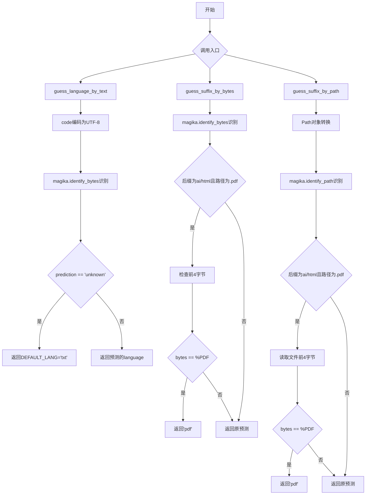
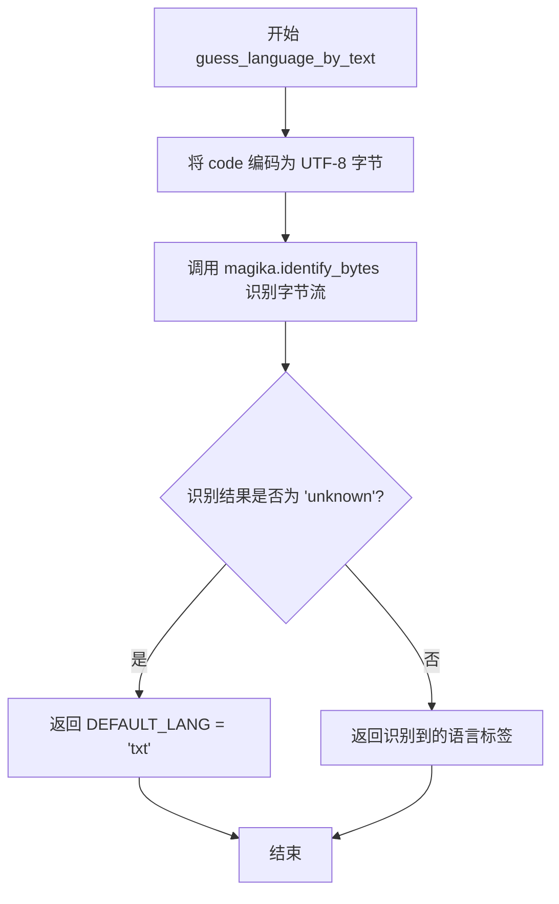

# `MinerU\mineru\utils\guess_suffix_or_lang.py` 详细设计文档

基于Magika深度学习模型的文件类型识别工具模块，提供通过文本内容、字节流和文件路径三种方式推断文件语言类型和后缀的功能，并特别处理PDF文件的签名验证场景

## 整体流程



## 类结构

```
无类层次结构（模块仅包含全局函数和全局变量）
```

## 全局变量及字段


### `DEFAULT_LANG`
    
默认语言类型，当识别结果为未知时使用

类型：`str`
    


### `PDF_SIG_BYTES`
    
PDF文件的魔术字节签名，用于检测PDF文件

类型：`bytes`
    


### `magika`
    
Magika库实例，用于识别文件类型和语言

类型：`Magika`
    


    

## 全局函数及方法


### `guess_language_by_text`

该函数接收一段代码文本，使用 Magika 库通过文本编码后的字节流识别其语言类型，若识别结果为 "unknown" 则返回默认的纯文本类型 "txt"。

参数：

- `code`：`str`，需要识别语言类型的源代码文本

返回值：`str`，返回识别到的语言标签，若无法识别则返回默认的 "txt"

#### 流程图



#### 带注释源码

```python
# 导入 Path 用于路径处理（虽然此函数未使用，但保持一致性）
from pathlib import Path

# 导入日志记录器
from loguru import logger
# 导入 Magika 库用于文件类型识别
from magika import Magika


# 默认语言类型，当无法识别时使用
DEFAULT_LANG = "txt"
# PDF 文件签名字节，用于特定场景下的文件类型判断
PDF_SIG_BYTES = b'%PDF'
# 创建 Magika 全局实例，用于文件类型识别
magika = Magika()


def guess_language_by_text(code):
    """
    通过文本内容猜测代码的语言类型
    
    参数:
        code: 需要识别语言类型的源代码文本字符串
    
    返回:
        识别到的语言标签字符串，若无法识别则返回默认的 'txt'
    """
    # 将输入的代码文本编码为 UTF-8 字节流
    codebytes = code.encode(encoding="utf-8")
    # 使用 Magika 库的 identify_bytes 方法识别字节流对应的语言类型
    # 并从预测结果中获取输出标签
    lang = magika.identify_bytes(codebytes).prediction.output.label
    # 如果识别结果不是 'unknown'，则返回识别到的语言类型
    # 否则返回默认的纯文本类型 'txt'
    return lang if lang != "unknown" else DEFAULT_LANG
```


### `guess_suffix_by_bytes`

该函数用于通过文件字节内容识别文件类型或语言，并利用可选的文件路径进行额外的 PDF 签名验证修正。当 Magika 识别为 "ai" 或 "html" 但文件路径显示为 .pdf 且文件头包含 PDF 签名时，强制修正返回 "pdf"。

参数：

- `file_bytes`：`bytes`，待识别文件的字节内容
- `file_path`：`str | Path | None`，可选参数，提供文件路径以进行额外的 PDF 签名检查

返回值：`str`，预测的文件类型/语言标签（如 "python", "javascript", "pdf" 等）

#### 流程图

```mermaid
flowchart TD
    A[开始] --> B[调用 magika.identify_bytes 识别文件类型]
    B --> C[获取预测结果 label]
    C --> D{suffix in ['ai', 'html']?}
    D -->|是| E{file_path 存在?}
    D -->|否| H[返回 suffix]
    E -->|是| F{文件路径后缀为 .pdf?}
    E -->|否| H
    F -->|是| G{文件头为 %PDF 签名?}
    F -->|否| H
    G -->|是| I[suffix = 'pdf']
    G -->|否| H
    I --> H
    H[结束]
```

#### 带注释源码

```python
def guess_suffix_by_bytes(file_bytes, file_path=None) -> str:
    """
    通过文件字节内容识别文件类型/语言
    
    Args:
        file_bytes: 文件的原始字节内容
        file_path: 可选的文件路径，用于 PDF 签名二次验证
    
    Returns:
        识别的文件类型/语言标签字符串
    """
    # 使用 Magika 库识别文件字节内容，返回预测结果
    suffix = magika.identify_bytes(file_bytes).prediction.output.label
    
    # PDF 签名二次校验：当识别结果为 ai/html 但文件路径显示为 .pdf 时
    # 需要验证文件头是否真的是 PDF 签名，防止误判
    if file_path and suffix in ["ai", "html"] and Path(file_path).suffix.lower() in [".pdf"] and file_bytes[:4] == PDF_SIG_BYTES:
        # 强制将结果修正为 pdf
        suffix = "pdf"
    
    return suffix
```


### `guess_suffix_by_path`

根据文件路径识别文件类型（后缀），特别处理了可能被误判为 AI/HTML 但实际是 PDF 的文件。

参数：

- `file_path`：`str | Path`，文件路径，可以是字符串路径或 Path 对象

返回值：`str`，返回识别出的文件类型标签（如 "pdf", "ai", "html" 等）

#### 流程图

```mermaid
flowchart TD
    A[开始] --> B{file_path 是否为 Path 实例?}
    B -- 是 --> C[直接使用 file_path]
    B -- 否 --> D[将 file_path 转换为 Path 对象]
    D --> C
    C --> E[使用 magika.identify_path 识别文件类型]
    E --> F[获取预测结果标签 suffix]
    G{suffix in ['ai', 'html'] 且 file_path.suffix.lower() == '.pdf'?}
    F --> G
    G -- 否 --> L[返回 suffix]
    G -- 是 --> H[尝试以二进制模式打开文件]
    H --> I[读取前 4 字节]
    I --> J{读取的字节是否等于 PDF_SIG_BYTES?}
    J -- 否 --> L
    J -- 是 --> K[设置 suffix = 'pdf']
    K --> L
    M[捕获异常] --> N[记录警告日志]
    N --> L
```

#### 带注释源码

```python
def guess_suffix_by_path(file_path) -> str:
    """
    根据文件路径猜测文件类型后缀
    
    Args:
        file_path: 文件路径，可以是 str 或 Path 对象
        
    Returns:
        str: 文件类型标签（如 "pdf", "ai", "html", "txt" 等）
    """
    # 确保 file_path 是 Path 对象
    if not isinstance(file_path, Path):
        file_path = Path(file_path)
    
    # 使用 Magika 库通过路径识别文件类型
    suffix = magika.identify_path(file_path).prediction.output.label
    
    # 特殊处理：AI/HTML 文件可能被误判为 PDF
    # 检查文件扩展名是否为 .pdf 且 Magika 识别为 ai/html
    if suffix in ["ai", "html"] and file_path.suffix.lower() in [".pdf"]:
        try:
            # 以二进制模式打开文件并读取前 4 字节
            with open(file_path, 'rb') as f:
                if f.read(4) == PDF_SIG_BYTES:
                    # 如果文件头是 PDF 签名，则修正后缀为 pdf
                    suffix = "pdf"
        except Exception as e:
            # 文件读取失败时记录警告日志，不影响正常流程
            logger.warning(f"Failed to read file {file_path} for PDF signature check: {e}")
    
    return suffix
```

## 关键组件


### Magika 识别器

核心文件类型识别引擎，通过 magika 库识别文件内容并返回预测结果

### PDF 签名检测

检测文件前4字节是否为 %PDF，用于识别被误判为其他格式的 PDF 文件

### 默认语言回退机制

当识别结果为 unknown 时，返回默认的纯文本类型

### 字节级文件识别

通过 magika.identify_bytes 方法直接分析文件字节内容进行类型识别

### 路径级文件识别

通过 magika.identify_path 方法根据文件路径进行类型识别

### 异常处理与日志记录

捕获文件读取错误并记录警告日志，保证程序稳定性

### 多格式误判纠正

针对 ai 和 html 格式可能被误判为 pdf 的情况进行二次校验


## 问题及建议


### 已知问题

-   **全局Magika实例初始化时机**：模块级别直接初始化`magika = Magika()`，若Magika初始化较重，会导致模块导入时产生性能开销，且无法延迟到真正需要时再初始化
-   **代码重复**：PDF签名检测逻辑在`guess_suffix_by_bytes`和`guess_suffix_by_path`中重复实现，违反DRY原则，维护时需同步修改两处
-   **异常处理不一致**：`guess_suffix_by_bytes`没有异常处理，当传入无效file_bytes时可能直接崩溃；而`guess_suffix_by_path`有try-except保护
-   **类型提示不完整**：`guess_suffix_by_bytes`函数的file_path参数缺少类型注解
-   **常量命名不符合规范**：`DEFAULT_LANG`作为常量应使用全大写命名（PEP 8约定）
-   **Magic String散落**："ai"、"html"、"unknown"等字符串字面量散布在代码中，未提取为具名常量，影响可读性和可维护性
-   **函数职责边界模糊**：`guess_suffix_by_bytes`和`guess_suffix_by_path`功能高度相似但采用不同实现策略，可考虑抽象统一

### 优化建议

-   将Magika实例化改为懒加载模式（Lazy Initialization），或提供可配置的初始化参数
-   抽取PDF检测逻辑为独立函数（如`_detect_pdf_by_signature`），供两处调用
-   为`guess_suffix_by_bytes`添加参数校验和异常处理，保持接口一致性
-   为file_path参数添加类型提示`Optional[Union[str, Path]]`
-   将`DEFAULT_LANG`重命名为`DEFAULT_LANG = "txt"` → `DEFAULT_LANG = "txt"`（保持全大写）
-   定义常量类或模块级常量：`SUPPORTED_PDF_MIMETYPES = {"ai", "html"}`、`FALLBACK_LANG = "txt"`等
-   考虑使用functools.lru_cache对识别结果进行缓存，减少重复识别开销
-   统一日志级别，可根据场景引入info/debug级别日志便于调试


## 其它


### 设计目标与约束

**设计目标**：提供一种可靠的文件类型/语言识别机制，通过Magika库实现对多种文件类型的识别，并特别处理PDF文件可能被误识别为"ai"或"html"的情况，通过PDF签名字节进行纠正。

**约束条件**：
- 依赖外部Magika库进行文件类型识别
- 仅支持UTF-8编码的文本输入
- PDF文件识别依赖文件头签名（%PDF）
- 默认语言为"txt"，当识别结果为"unknown"时使用

### 错误处理与异常设计

**异常处理策略**：
- 文件读取异常：在`guess_suffix_by_path`函数中，使用try-except捕获文件读取异常，并通过logger.warning记录警告信息
- Magika识别异常：依赖Magika库内部异常处理
- 类型转换异常：在`guess_suffix_by_path`中检查file_path类型，非Path对象则转换为Path对象

**日志设计**：
- 使用loguru库进行日志记录
- 警告级别：文件读取失败时记录
- 信息级别：Magika识别结果（隐式）

### 数据流与状态机

**主要数据流**：

1. **文本输入流程** (`guess_language_by_text`)：
   - 输入：代码文本字符串
   - 处理：UTF-8编码 → Magika识别 → 提取预测标签
   - 输出：语言标签（unknown时返回默认"txt"）

2. **字节输入流程** (`guess_suffix_by_bytes`)：
   - 输入：文件字节数组、文件路径（可选）
   - 处理：Magika识别 → 检查是否为PDF误识别 → PDF签名验证
   - 输出：文件类型标签

3. **文件路径输入流程** (`guess_suffix_by_path`)：
   - 输入：文件路径字符串或Path对象
   - 处理：Path转换 → Magika识别 → PDF文件检查 → 文件头读取验证
   - 输出：文件类型标签

**状态转换**：
- 初始状态：接收输入
- 识别状态：调用Magika进行识别
- 校正状态：检查是否需要PDF签名校正
- 最终状态：返回结果

### 外部依赖与接口契约

**外部依赖**：
- `magika`：核心文件类型识别库
- `loguru`：日志记录库
- `pathlib`：Python标准库，路径处理

**接口契约**：
- `guess_language_by_text(code: str) -> str`：输入字符串，返回语言标签
- `guess_suffix_by_bytes(file_bytes: bytes, file_path: Optional[str]) -> str`：输入字节和可选路径，返回文件类型标签
- `guess_suffix_by_path(file_path: str | Path) -> str`：输入路径，返回文件类型标签

### 性能考虑

- Magika模型初始化：在模块加载时创建全局Magika实例，避免重复初始化开销
- 文件读取：仅读取文件前4字节用于PDF签名检查，避免读取整个文件
- 缓存优化：可考虑对识别结果进行缓存，但当前实现未包含

### 安全性考虑

- 文件路径处理：使用Path对象安全处理路径，防止路径注入攻击
- 文件读取：仅读取文件头部，减小恶意大文件攻击面
- 编码处理：仅支持UTF-8编码，非UTF-8编码的文本可能无法正确识别

### 可扩展性设计

- 支持更多文件类型校正：可在`guess_suffix_by_bytes`和`guess_suffix_by_path`中添加更多文件签名检查逻辑
- 配置外部化：DEFAULT_LANG、PDF_SIG_BYTES可移至配置文件
- 多语言支持：当前仅支持英文标签，可扩展为多语言返回

### 测试策略

**单元测试**：
- 测试各函数的基本功能
- 测试PDF文件识别校正逻辑
- 测试异常处理和日志记录

**边界测试**：
- 空文件输入
- 超大文件输入
- 非UTF-8编码文本
- 损坏的PDF文件
- 文件读取权限错误

**集成测试**：
- 与Magika库的集成测试
- 实际文件类型识别测试

### 部署和运维

**依赖管理**：
- Python标准库：pathlib
- 第三方库：magika、loguru

**配置要求**：
- Python 3.8+
- Magika模型文件（首次使用时自动下载）

**监控指标**：
- 识别成功率
- 识别耗时
- PDF校正触发次数

### 版本兼容性

- Python版本：3.8+
- Magika版本：需兼容最新版本
- 依赖库版本：无严格版本限制

### 配置管理

**硬编码配置**：
- DEFAULT_LANG = "txt"
- PDF_SIG_BYTES = b'%PDF'

**可配置项**：
- 默认语言类型
- PDF签名字节
- 支持校正的文件类型列表


    