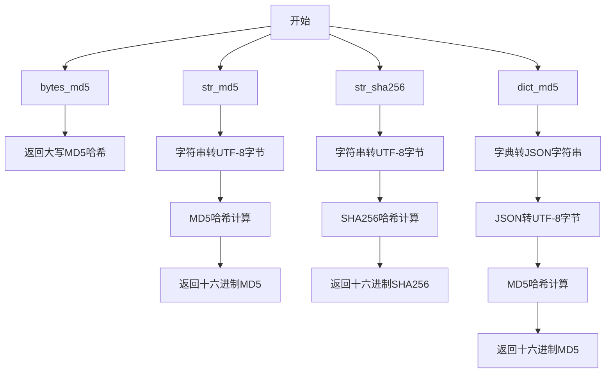
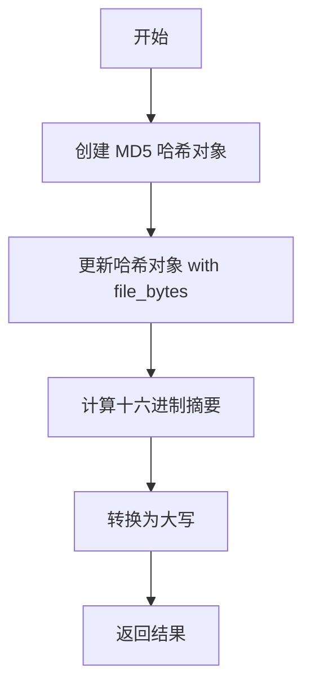
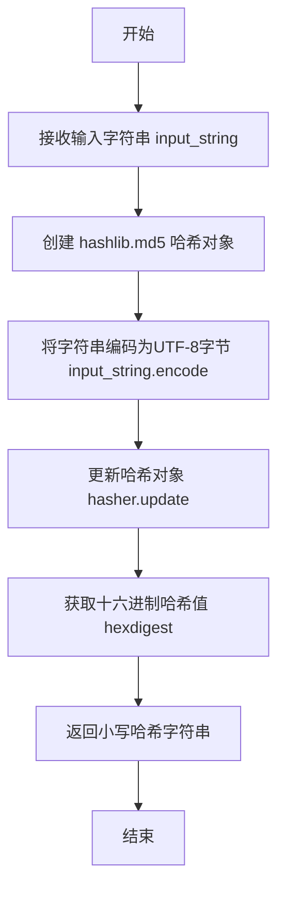
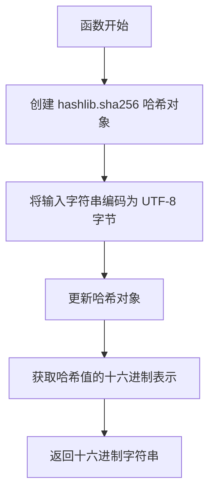
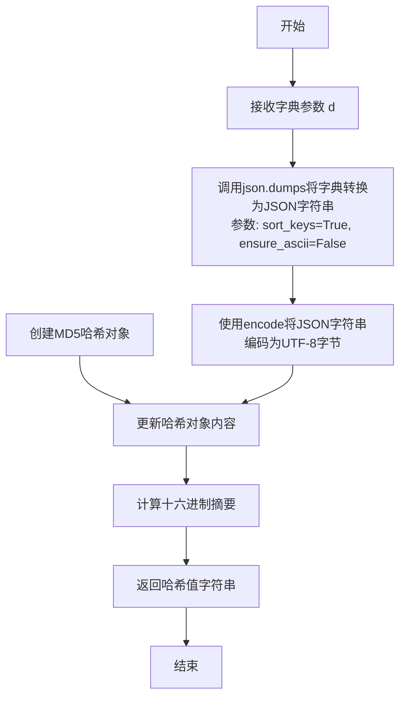
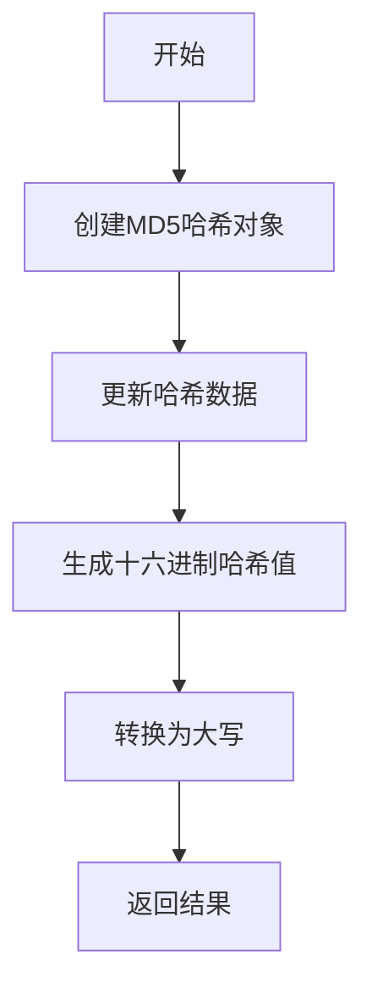
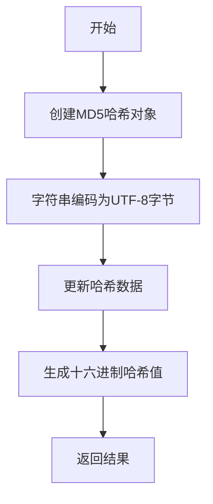
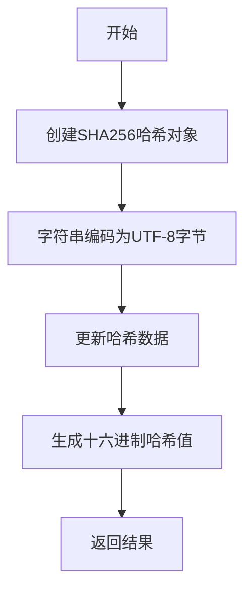
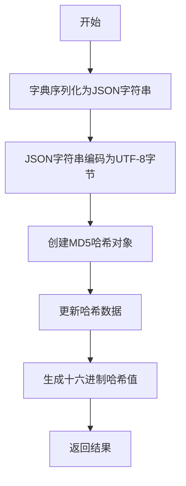

# `MinerU\mineru\utils\hash_utils.py` 详细设计文档

这是一个哈希工具模块，提供对字节、字符串和字典数据的MD5和SHA256哈希计算功能，用于数据完整性校验和唯一标识生成。

## 整体流程



## 类结构

```
无类层次结构（纯函数模块）
```

## 全局变量及字段


### `bytes_md5`
    
计算字节数据的MD5哈希值，返回大写十六进制字符串

类型：`function`
    


### `str_md5`
    
计算字符串的MD5哈希值，返回小写十六进制字符串

类型：`function`
    


### `str_sha256`
    
计算字符串的SHA256哈希值，返回小写十六进制字符串

类型：`function`
    


### `dict_md5`
    
对字典进行JSON序列化后计算MD5哈希值，用于字典内容的快速比对

类型：`function`
    


    

## 全局函数及方法


### `bytes_md5`

该函数接收字节数据作为输入，使用 MD5 哈希算法计算其摘要，并以大写十六进制字符串形式返回结果。

参数：

- `file_bytes`：`bytes`，待计算 MD5 哈希值的字节数据

返回值：`str`，MD5 哈希值的大写十六进制表示

#### 流程图



#### 带注释源码

```python
def bytes_md5(file_bytes):
    """
    计算字节数据的 MD5 哈希值
    
    参数:
        file_bytes: 待哈希的字节数据
        
    返回:
        MD5 哈希值的大写十六进制字符串
    """
    # 创建 MD5 哈希对象
    hasher = hashlib.md5()
    
    # 使用输入的字节数据更新哈希对象
    hasher.update(file_bytes)
    
    # 获取十六进制摘要并转换为大写后返回
    return hasher.hexdigest().upper()
```


### `str_md5`

该函数接收一个字符串输入，使用UTF-8编码将其转换为字节串，然后通过MD5哈希算法计算哈希值，并返回32位十六进制小写哈希字符串。

参数：
- `input_string`：`str`，需要进行MD5哈希计算的输入字符串

返回值：`str`，返回小写的32位十六进制MD5哈希值

#### 流程图



#### 带注释源码

```python
def str_md5(input_string):
    """
    计算字符串的MD5哈希值
    
    参数:
        input_string: str, 需要进行哈希计算的输入字符串
        
    返回:
        str: 32位十六进制小写MD5哈希值
    """
    hasher = hashlib.md5()  # 创建MD5哈希对象
    # 在Python3中，需要将字符串转化为字节对象才能被哈希函数处理
    input_bytes = input_string.encode('utf-8')  # 将字符串编码为UTF-8字节
    hasher.update(input_bytes)  # 更新哈希对象
    return hasher.hexdigest()  # 返回32位十六进制小写哈希值
```


### `str_sha256`

对输入字符串进行 SHA256 哈希计算并返回十六进制摘要值。

参数：

- `input_string`：`str`，需要进行 SHA256 哈希计算的输入字符串

返回值：`str`，SHA256 哈希值的十六进制字符串表示

#### 流程图



#### 带注释源码

```python
def str_sha256(input_string):
    """
    计算输入字符串的 SHA256 哈希值
    
    参数:
        input_string: 需要进行哈希的字符串
    
    返回:
        SHA256 哈希值的十六进制表示
    """
    hasher = hashlib.sha256()  # 创建 SHA256 哈希对象
    # 在Python3中，需要将字符串转化为字节对象才能被哈希函数处理
    input_bytes = input_string.encode('utf-8')  # 将字符串编码为 UTF-8 字节
    hasher.update(input_bytes)  # 更新哈希对象，传入待哈希的字节数据
    return hasher.hexdigest()  # 返回十六进制格式的哈希值
```


### `dict_md5`

该函数接收一个字典对象，将其转换为规范化的JSON字符串（按键排序），然后计算其UTF-8编码的MD5哈希值并返回十六进制摘要，常用于生成字典内容的唯一标识符。

参数：

- `d`：`dict`，输入的字典对象，待计算MD5哈希的字典

返回值：`str`，返回MD5哈希值的十六进制字符串表示

#### 流程图



#### 带注释源码

```python
def dict_md5(d):
    """
    计算字典的MD5哈希值
    
    该函数将字典转换为规范化的JSON字符串，
    确保相同内容的不同字典实例产生相同的哈希值。
    
    参数:
        d: 输入的字典对象
    
    返回:
        字典内容的MD5哈希值（十六进制字符串）
    """
    # Step 1: 将字典转换为JSON字符串
    # sort_keys=True 确保字典的键按字母顺序排序
    # ensure_ascii=False 允许包含非ASCII字符（如中文）
    json_str = json.dumps(d, sort_keys=True, ensure_ascii=False)
    
    # Step 2: 将JSON字符串编码为UTF-8字节
    # MD5哈希函数需要字节输入
    json_bytes = json_str.encode('utf-8')
    
    # Step 3: 计算MD5哈希并返回十六进制表示
    return hashlib.md5(json_bytes).hexdigest()
```

## 关键组件


### 核心功能概述

该代码模块提供了一组哈希计算工具函数，支持对字节数据、字符串和字典进行MD5和SHA256哈希运算，主要用于数据完整性校验和唯一标识生成。

### 文件整体运行流程

该文件为工具模块，不涉及主动执行流程。导入后可直接调用各哈希函数：
1. 导入模块 `import hash_utils`（假设文件名）
2. 调用 `bytes_md5(file_bytes)` 计算字节数据的MD5值
3. 调用 `str_md5(input_string)` 计算字符串的MD5值
4. 调用 `str_sha256(input_string)` 计算字符串的SHA256值
5. 调用 `dict_md5(d)` 计算字典的MD5值

### 全局函数详细信息

#### bytes_md5

- **函数名称**: bytes_md5
- **参数**: 
  - `file_bytes`: bytes类型，要计算MD5的字节数据
- **参数描述**: 输入的字节类型数据
- **返回值类型**: str
- **返回值描述**: 返回32位大写十六进制MD5哈希字符串
- **mermaid流程图**:

- **带注释源码**:
```python
def bytes_md5(file_bytes):
    hasher = hashlib.md5()  # 创建MD5哈希对象
    hasher.update(file_bytes)  # 更新哈希对象的数据
    return hasher.hexdigest().upper()  # 返回大写的十六进制哈希值
```

#### str_md5

- **函数名称**: str_md5
- **参数**: 
  - `input_string`: str，要计算MD5的字符串
- **参数描述**: 输入的字符串数据
- **返回值类型**: str
- **返回值描述**: 返回32位十六进制MD5哈希字符串
- **mermaid流程图**:

- **带注释源码**:
```python
def str_md5(input_string):
    hasher = hashlib.md5()  # 创建MD5哈希对象
    # 在Python3中，需要将字符串转化为字节对象才能被哈希函数处理
    input_bytes = input_string.encode('utf-8')  # UTF-8编码转换
    hasher.update(input_bytes)  # 更新哈希对象的数据
    return hasher.hexdigest()  # 返回十六进制哈希值
```

#### str_sha256

- **函数名称**: str_sha256
- **参数**: 
  - `input_string`: str，要计算SHA256的字符串
- **参数描述**: 输入的字符串数据
- **返回值类型**: str
- **返回值描述**: 返回64位十六进制SHA256哈希字符串
- **mermaid流程图**:

- **带注释源码**:
```python
def str_sha256(input_string):
    hasher = hashlib.sha256()  # 创建SHA256哈希对象
    # 在Python3中，需要将字符串转化为字节对象才能被哈希函数处理
    input_bytes = input_string.encode('utf-8')  # UTF-8编码转换
    hasher.update(input_bytes)  # 更新哈希对象的数据
    return hasher.hexdigest()  # 返回十六进制哈希值
```

#### dict_md5

- **函数名称**: dict_md5
- **参数**: 
  - `d`: dict，要计算MD5的字典
- **参数描述**: 输入的字典数据
- **返回值类型**: str
- **返回值描述**: 返回32位十六进制MD5哈希字符串
- **mermaid流程图**:

- **带注释源码**:
```python
def dict_md5(d):
    json_str = json.dumps(d, sort_keys=True, ensure_ascii=False)  # 序列化字典为JSON，sort_keys确保键的顺序一致以保证哈希结果稳定
    return hashlib.md5(json_str.encode('utf-8')).hexdigest()  # 编码后计算MD5并返回
```

### 关键组件信息

#### MD5哈希计算组件

提供MD5哈希算法支持，包括字节数据、字符串和字典三种输入形式的哈希计算。

#### SHA256哈希计算组件

提供SHA256哈希算法支持，目前仅支持字符串输入形式的哈希计算。

#### 字典序列化组件

将Python字典转换为稳定的JSON字符串表示，确保相同内容的字典生成相同的哈希值。

### 潜在的技术债务或优化空间

1. **缺乏错误处理机制**: 未对输入参数进行有效性验证，如输入为None或非预期类型时可能导致异常
2. **字节数据哈希缺少编码说明**: `bytes_md5`函数未提供字符编码参数，可能导致多语言环境下的兼容性问题
3. **功能扩展性不足**: SHA256函数目前仅支持字符串输入，未提供字典的SHA256支持
4. **性能优化空间**: 对于大量数据处理场景，可考虑使用hashlib的update方法进行增量计算
5. **缺少异步支持**: 在IO密集型场景下，可考虑添加异步版本以提高并发性能

### 其它项目

#### 设计目标与约束

- **设计目标**: 提供统一且简便的哈希计算接口，支持常见数据类型的MD5和SHA256运算
- **约束**: Python 3.x环境，需要hashlib和json标准库支持

#### 错误处理与异常设计

- 当前实现未包含显式的异常处理
- 潜在异常场景：输入为None时调用encode方法会抛出AttributeError；输入类型非字符串/字典时可能产生预期外结果

#### 数据流与状态机

- 该模块为无状态工具模块，不涉及状态机设计
- 数据流为：输入数据 → 编码处理 → 哈希计算 → 十六进制字符串输出

#### 外部依赖与接口契约

- 依赖标准库：hashlib（哈希计算）、json（字典序列化）
- 接口契约：所有函数均接收特定类型的输入并返回十六进制字符串类型的哈希值


## 问题及建议


### 已知问题

-   **MD5 算法的安全性问题**：`bytes_md5` 和 `dict_md5` 使用了 MD5 算法，MD5 已被证明存在碰撞攻击风险，不适用于安全敏感场景（如密码存储、数字签名等）
-   **返回格式不一致**：`bytes_md5` 返回大写十六进制字符串，`str_md5` 和 `dict_md5` 返回小写，调用者可能因大小写不一致导致比较失败
-   **缺少类型提示**：所有函数均无类型注解（type hints），降低代码可读性和 IDE 友好性
-   **缺少文档字符串**：函数无 docstring，无法快速了解函数用途、参数和返回值含义
-   **缺乏异常处理**：未对输入进行校验（如 `None` 值、空输入等），可能导致运行时异常
-   **代码重复**：`str_md5` 和 `str_sha256` 存在重复的编码逻辑，可抽象复用

### 优化建议

-   **统一返回格式**：建议所有哈希函数统一返回小写或大写十六进制字符串，并在文档中明确说明
-   **添加类型提示**：为所有函数添加参数和返回值类型注解，提升代码可维护性
-   **添加文档字符串**：为每个函数编写 docstring，说明功能、参数、返回值及示例
-   **增强异常处理**：对输入进行校验，捕获并处理可能的异常情况，提供有意义的错误信息
-   **重构减少重复**：抽取公共的字符串哈希逻辑为内部辅助函数，避免代码重复
-   **考虑安全性替代**：在文档中明确说明 MD5 适用于非安全敏感场景（如文件校验），建议安全场景使用 SHA-256 或更安全的算法

## 其它


### 设计目标与约束

本模块提供统一的哈希计算工具函数，支持MD5和SHA256两种算法，用于对字节、字符串和字典进行哈希运算。设计约束：Python 3.6+，依赖标准库hashlib和json，无外部依赖。

### 错误处理与异常设计

- 输入类型错误：函数未对输入类型进行显式校验，传入不支持的类型（如bytes_md5接收字符串）会抛出AttributeError
- 编码错误：str_md5和str_sha256使用UTF-8编码，无法处理包含非UTF-8字符的字符串时会抛出UnicodeEncodeError
- dict_md5依赖json.dumps，传入不可JSON序列化的对象会抛出TypeError
- 建议：添加输入类型检查和明确的异常抛出

### 外部依赖与接口契约

- hashlib：Python标准库，提供MD5、SHA256等哈希算法
- json：Python标准库，用于字典转JSON字符串
- 接口契约：bytes_md5接收bytes返回大写十六进制字符串；str_md5/str_sha256接收str返回十六进制字符串；dict_md5接收dict返回十六进制字符串

### 性能考虑

- MD5算法快速但已被破解，不适用于安全敏感场景
- SHA256安全性更高但计算开销更大
- dict_md5每次调用json.dumps，存在重复序列化的性能优化空间
- 大文件哈希建议使用分块读取方式，当前实现适合小数据量

### 安全性考虑

- MD5存在碰撞攻击风险，不推荐用于密码存储或安全签名
- SHA256相对安全但仍需考虑盐值添加
- bytes_md5返回大写十六进制，str_md5返回小写，保持一致性需注意

### 使用示例

```python
# 字节哈希
file_content = b"Hello World"
md5_hash = bytes_md5(file_content)  # 返回大写MD5

# 字符串哈希
text = "Hello World"
md5_hash = str_md5(text)  # 返回小写MD5
sha_hash = str_sha256(text)  # 返回小写SHA256

# 字典哈希
data = {"name": "test", "value": 123}
dict_hash = dict_md5(data)  # 返回小写MD5，键按字母排序
```

### 测试考虑

- 需测试空输入、边界值、特殊字符（中文、emoji、空格）
- 需验证字节与字符串输入的边界情况
- 需测试dict中嵌套复杂结构（嵌套dict、list、None）的处理
- 建议添加单元测试覆盖正常输入和异常输入

### 版本信息

当前版本：1.0.0
版权：Copyright (c) Opendatalab. All rights reserved.

    