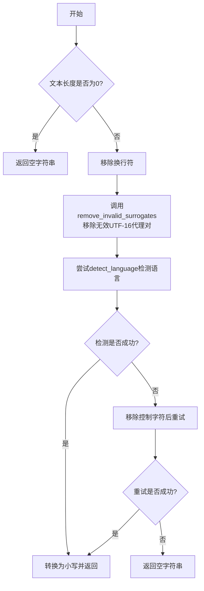
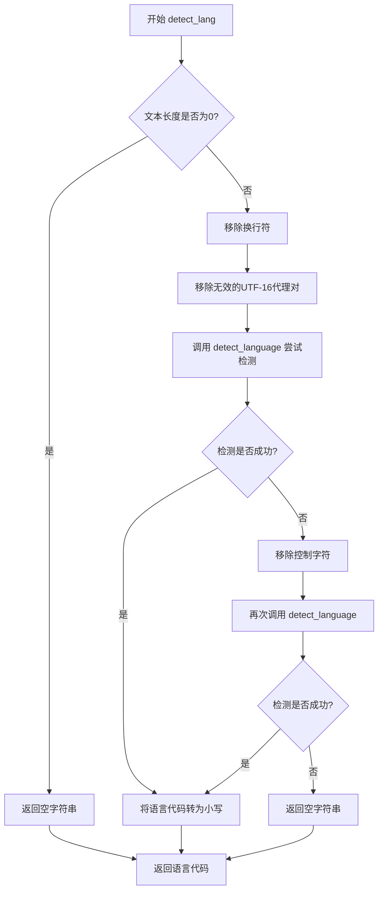

# `MinerU\mineru\utils\language.py` 详细设计文档

这是一个语言检测模块，通过fast_langdetect库识别输入文本的语言类型，并处理了UTF-16代理对、控制字符等特殊字符，确保语言检测的准确性和稳定性。

## 整体流程



## 类结构

```
无类层次结构（面向过程编程）
```

## 全局变量及字段


### `current_file_path`
    
当前Python文件的绝对路径

类型：`str`
    


### `current_dir`
    
当前文件所在的目录路径

类型：`str`
    


### `root_dir`
    
项目根目录路径

类型：`str`
    


### `ftlang_cache_dir`
    
fasttext语言检测模型的缓存目录路径

类型：`str`
    


    

## 全局函数及方法


### `remove_invalid_surrogates(text)`

移除无效的 UTF-16 代理对。该函数遍历输入字符串中的每个字符，检查其 Unicode 码点是否落在 UTF-16 代理对范围内（0xD800-0xDFFF），如果是则过滤掉，否则保留，最终返回清理后的字符串。

参数：

- `text`：`str`，需要进行代理对清理的原始文本

返回值：`str`，移除了无效 UTF-16 代理对后的字符串

#### 流程图

```mermaid
flowchart TD
    A[开始] --> B[遍历 text 中的每个字符 c]
    B --> C{ord(c) 在 0xD800-0xDFFF 范围内?}
    C -->|是| D[过滤掉该字符]
    C -->|否| E[保留该字符]
    D --> F{还有更多字符?}
    E --> F
    F -->|是| B
    F -->|否| G[连接所有保留的字符]
    G --> H[返回结果字符串]
    H --> I[结束]
```

#### 带注释源码

```python
def remove_invalid_surrogates(text):
    """
    移除无效的 UTF-16 代理对
    
    UTF-16 代理对范围是 0xD800-0xDFFF，这些码点在 Unicode 标准中
    用于表示 UTF-16 编码中的代理对，但在 Python 的 str 类型中
    是无效的字符，应该被过滤掉。
    
    参数:
        text: str，需要进行代理对清理的原始文本
    
    返回:
        str，移除了无效 UTF-16 代理对后的字符串
    """
    # 遍历字符串中的每个字符，使用生成器表达式过滤
    # ord(c) 获取字符的 Unicode 码点
    # 0xD800 <= ord(c) <= 0xDFFF 判断是否在 UTF-16 代理对范围内
    # not (0xD800 <= ord(c) <= 0xDFFF) 取反，表示保留不在代理对范围内的字符
    return ''.join(c for c in text if not (0xD800 <= ord(c) <= 0xDFFF))
```


### `detect_lang`

该函数是主语言检测函数，用于检测输入文本的语言类型。函数首先对文本进行预处理（移除换行符和无效的UTF-16代理对），然后调用 `fast_langdetect` 库进行语言检测。如果检测失败，会移除控制字符后重试。最终返回小写的语言代码（如 "en"、"zh" 等）。

参数：

- `text`：`str`，需要检测语言的文本字符串

返回值：`str`，检测到的语言代码（小写形式），如果无法检测则返回空字符串

#### 流程图



#### 带注释源码

```python
def detect_lang(text: str) -> str:
    """
    检测输入文本的语言类型
    
    参数:
        text: str - 要检测语言的文本字符串
        
    返回:
        str - 检测到的语言代码（小写形式），如 'en', 'zh' 等，无法检测时返回空字符串
    """
    
    # 如果文本为空，直接返回空字符串
    if len(text) == 0:
        return ""

    # 移除换行符，避免影响语言检测
    text = text.replace("\n", "")
    
    # 移除无效的 UTF-16 代理对，防止Unicode编码问题
    text = remove_invalid_surrogates(text)

    try:
        # 尝试直接检测语言，返回大写的语言代码（如 'EN', 'ZH'）
        lang_upper = detect_language(text)
    except:
        # 如果检测失败，移除所有控制字符后重试
        # unicodedata.category(l)[0] == 'C' 表示控制字符类别
        html_no_ctrl_chars = ''.join([l for l in text if unicodedata.category(l)[0] not in ['C', ]])
        lang_upper = detect_language(html_no_ctrl_chars)

    try:
        # 将语言代码转换为小写形式（如 'EN' -> 'en'）
        lang = lang_upper.lower()
    except:
        # 如果转换失败，返回空字符串
        lang = ""
    
    return lang
```

## 关键组件


### 环境变量与缓存路径设置

设置FTLANG_CACHE环境变量，用于指定fasttext语言检测模型的缓存目录路径，默认指向项目resources目录下的fasttext-langdetect文件夹。

### 无效UTF-16代理对移除组件

实现remove_invalid_surrogates函数，通过过滤Unicode范围0xD800-0xDFFF（UTF-16代理对范围）来移除无效的代理对字符，确保输入文本符合有效的UTF-8编码规范。

### 语言检测核心组件

实现detect_lang主函数，负责文本语言检测的核心逻辑。包含文本预处理（换行符移除、代理对清理）、双重异常处理机制（首次检测失败后过滤控制字符重试）、返回小写语言代码。具备处理空字符串、超长文本、控制字符等边界情况的能力。

### 外部依赖接口

导入fast_langdetect模块的detect_language函数，作为底层语言检测引擎，支持多语言识别能力。

### 错误处理与降级机制

采用双层try-except防护策略：第一层尝试直接检测原文本，失败后过滤所有控制字符（C类别）再重试，确保在包含HTML标签或特殊控制字符的场景下仍能正常返回语言结果。


## 问题及建议


### 已知问题

-   **裸异常捕获（Bare except）**：第31行使用`except:`捕获所有异常，这会隐藏真实的错误类型和消息，导致难以定位问题，且可能捕获KeyboardInterrupt等不应捕获的异常
-   **重复调用风险**：异常处理中再次调用`detect_language(html_no_ctrl_chars)`，如果第二次调用仍然失败，没有进一步的错误处理，可能导致程序崩溃
-   **环境变量副作用**：第4-10行的环境变量设置在模块导入时立即执行，如果FTLANG_CACHE已设置则不生效，但逻辑在每次import时都会执行，可能导致不可预期的行为
-   **缺少输入验证**：未对`text`参数进行None检查或类型验证，可能导致运行时错误
-   **字符串处理效率**：使用多次字符串操作（replace、列表推导式），对于大文本可能导致性能问题
-   **控制字符过滤不完整**：第32行使用`unicodedata.category(l)[0] not in ['C']`判断，但只取了第一个字符，可能无法正确过滤所有控制字符（如某些Format类字符）
-   **缺少日志记录**：没有任何日志输出，调试和监控困难
-   **没有缓存机制**：每次调用detect_language都是完整计算，对于重复文本效率低下
-   **类型提示不完整**：虽然有基本的参数类型提示，但缺少返回值说明、异常说明等

### 优化建议

-   替换裸异常为具体异常类型，如`except Exception as e:`，并记录错误日志
-   为第二次detect_language调用添加try-except或使用重试机制
-   将环境变量设置逻辑封装成函数或使用懒加载模式
-   添加输入验证：`if text is None or not isinstance(text, str): raise TypeError(...)`
-   考虑使用`re.sub()`进行正则表达式替换以提高字符串处理效率
-   完善控制字符过滤逻辑，使用完整的unicodedata类别判断
-   引入logging模块添加适当的日志记录
-   考虑添加简单的缓存机制（如lru_cache）存储已检测文本的语言结果
-   完善类型提示，包括返回类型、异常类型等
-   将环境变量设置改为条件判断，仅在未设置时才设置


## 其它


### 设计目标与约束

本模块的主要设计目标是提供一个轻量级的语言检测功能，能够快速准确地识别输入文本的语言类型。核心约束包括：1）依赖fast_langdetect库进行底层语言检测；2）需要设置FTLANG_CACHE环境变量指向fasttext模型缓存目录；3）输入文本需为有效的UTF-8编码字符串；4）单次检测的文本长度无硬性限制，但过长文本可能影响检测性能；5）本模块专注于语言检测，不包含语言翻译或语言转换功能。

### 错误处理与异常设计

代码采用两层异常捕获机制：第一层捕获detect_language函数可能抛出的异常，当检测失败时尝试过滤控制字符后再次检测；第二层捕获lang_upper.lower()调用可能的异常，确保返回空字符串而非抛出异常。当前实现使用裸except子句捕获所有异常，建议改进为捕获具体异常类型（如Exception），并记录详细错误信息以便调试。对于空文本输入，函数直接返回空字符串而不触发语言检测。异常处理的总体策略是保证函数不会因异常而中断执行，而是返回安全的默认值。

### 数据流与状态机

数据流处理遵循以下流程：输入文本首先经过长度检查，空文本直接返回空字符串；非空文本经历三个主要处理阶段——第一阶段移除换行符，第二阶段过滤无效的UTF-16代理对（0xD800-0xDFFF范围），第三阶段尝试语言检测；检测失败时进入备用流程，过滤所有控制字符（Unicode分类C开头）后再次检测。最终将检测结果转换为小写并返回。状态机可简化为三个状态：初始态→处理态→结果态，其中处理态包含主检测和备用检测两条路径。

### 外部依赖与接口契约

核心依赖包括：1）fast_langdetect库，提供detect_language函数进行语言检测；2）os标准库，用于环境变量读取和路径操作；3）unicodedata标准库，用于Unicode字符分类查询。接口契约方面：detect_lang函数接受一个str类型的文本参数，返回str类型的语言代码（如"en"、"zh"等），空输入返回空字符串。FTLANG_CACHE环境变量必须在模块导入前或导入时设置，指向包含fasttext模型的目录路径。模块同时导出remove_invalid_surrogates辅助函数供外部调用。

### 性能考虑

当前实现的主要性能瓶颈在于字符级别的迭代处理：remove_invalid_surrogates函数使用列表推导式逐字符检查UTF-16代理对范围，控制字符过滤使用类似方式。对于短文本影响可忽略，但对于长文本（如数万字符）可能产生明显延迟。优化建议：1）使用正则表达式批量处理代理对和控制字符；2）对于超长文本考虑截断处理；3）缓存常见文本的语言检测结果。fast_langdetect的首次调用需要加载模型，存在冷启动延迟，后续调用性能稳定。

### 安全性考虑

代码处理来自外部输入的文本，需注意：1）输入文本可能包含恶意构造的特殊Unicode字符或代理对，但当前remove_invalid_surrogates函数已过滤代理对；2）控制字符过滤仅移除Unicode分类C开头的字符（包括控制码），但不过滤其他可能具有安全影响的字符；3）模块本身不执行任何代码注入或文件操作，风险较低。建议在生产环境中对输入文本长度设置合理上限（如10000字符），防止资源耗尽攻击。

### 配置与环境要求

运行时环境要求：1）Python 3.6+版本；2）fast_langdetect包已安装；3）FTLANG_CACHE环境变量指向有效的fasttext模型目录。模型目录结构应包含fasttext语言检测所需的.bin模型文件。首次运行模块时如FTLANG_CACHE未设置，会自动构造默认路径（resources/fasttext-langdetect），该路径相对于模块文件所在目录。建议在部署时显式设置环境变量，避免路径依赖导致的问题。

### 测试策略

测试用例应覆盖：1）空字符串输入返回空字符串；2）纯英文文本正确返回"en"；3）纯中文文本正确返回"zh"；4）包含HTML标签的文本正确识别语言；5）包含换行符的文本正常处理；6）包含UTF-16代理对的文本正常处理；7）包含控制字符的文本正常处理；8）快速连续调用测试并发安全性。建议使用pytest框架编写单元测试，设置模拟的FTLANG_CACHE目录进行隔离测试。

### 部署注意事项

部署时需确保：1）在应用启动时设置FTLANG_CACHE环境变量，指向实际部署环境的模型目录；2）模型目录包含完整的fasttext语言检测模型文件；3）部署包包含resources/fasttext-langdetect目录或通过其他方式提供模型；4）如在无网络环境下部署，需预先下载模型文件；5）多实例部署时模型目录可为共享只读存储。建议将语言检测服务封装为独立微服务，避免每个应用实例重复加载模型。


    