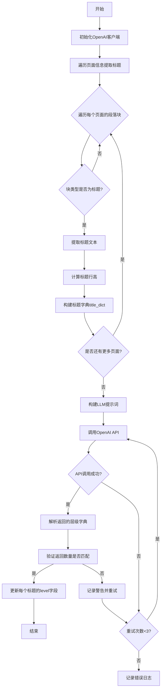
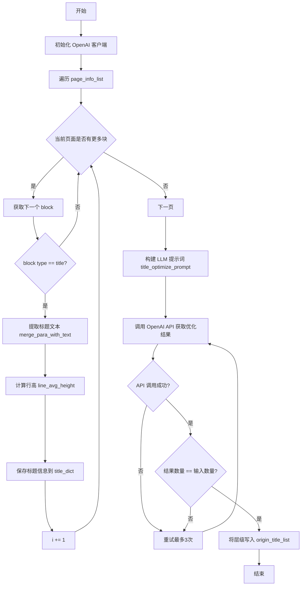
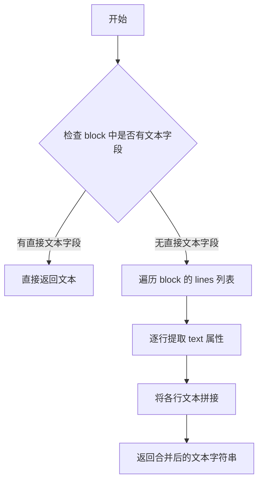
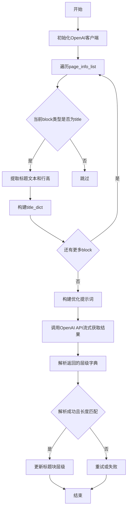

# `MinerU\mineru\utils\llm_aided.py` 详细设计文档

该代码实现了一个LLM辅助的文档标题层级优化功能，通过调用OpenAI API对提取的标题进行语义分析和层级重新划分，使标题结构更加符合正常文档的层次逻辑。

## 整体流程



## 类结构

```
模块: llm_aided_title
└── 函数: llm_aided_title(page_info_list, title_aided_config)
    ├── 导入: merge_para_with_text (来自 mineru.backend.pipeline.pipeline_middle_json_mkcontent)
    ├── 导入: OpenAI (openai)
    ├── 导入: json_repair
    └── 导入: logger (loguru)
```

## 全局变量及字段


### `title_aided_config`
    
包含API配置信息的字典，包括api_key、base_url、model等参数

类型：`dict`
    


### `client`
    
OpenAI客户端实例，用于调用LLM API

类型：`OpenAI`
    


### `title_dict`
    
存储标题文本、行高和页码的字典，key为标题序号，value为[标题文本, 行高, 页码]列表

类型：`dict`
    


### `origin_title_list`
    
存储原始标题块的列表，用于后续更新层级信息

类型：`list`
    


### `i`
    
标题序号计数器，用于生成title_dict的key

类型：`int`
    


### `blocks`
    
当前页面的段落块列表，从page_info中提取

类型：`list`
    


### `block`
    
单个段落块对象，包含type、lines、bbox等属性

类型：`dict`
    


### `title_text`
    
合并后的标题文本，通过merge_para_with_text函数获取

类型：`str`
    


### `line_avg_height`
    
标题的平均行高，用于判断标题级别

类型：`float`
    


### `title_optimize_prompt`
    
发送给LLM的提示词，包含优化标题层级的指导原则

类型：`str`
    


### `retry_count`
    
重试计数器，记录当前重试次数

类型：`int`
    


### `max_retries`
    
最大重试次数，固定值为3

类型：`int`
    


### `dict_completion`
    
LLM返回的层级字典，key为标题序号，value为层级整数

类型：`dict`
    


### `api_params`
    
API调用参数，包含model、messages、temperature、stream等

类型：`dict`
    


### `completion`
    
API返回的流式响应对象，包含多个chunk

类型：`ChatCompletion`
    


### `content_pieces`
    
流式响应的内容片段列表，用于拼接完整响应

类型：`list`
    


### `content`
    
拼接后的完整响应内容，经过去除think标签处理

类型：`str`
    


    

## 全局函数及方法


### `llm_aided_title`

该函数通过调用 OpenAI LLM API 对文档中提取的标题进行层级优化，根据标题文本语义和行高信息为每个标题分配合理的层级（1-4级），确保标题层级连续且符合文档结构。

参数：

- `page_info_list`：`List[Dict]`，页面信息列表，每个元素包含 `para_blocks`（段落块）和 `page_idx`（页码）
- `title_aided_config`：`Dict`，标题辅助配置，包含 `api_key`（OpenAI API 密钥）、`base_url`（API 基础 URL）、`model`（模型名称）、`enable_thinking`（可选，是否启用思考模式）

返回值：`None`，该函数直接修改 `origin_title_list` 中的标题块，添加 `level` 字段，不通过返回值传递结果

#### 流程图



#### 带注释源码

```python
# 导入日志、OpenAI 客户端和 JSON 修复工具
from loguru import logger
from openai import OpenAI
import json_repair

# 导入合并段落文本的工具函数
from mineru.backend.pipeline.pipeline_middle_json_mkcontent import merge_para_with_text


def llm_aided_title(page_info_list, title_aided_config):
    """
    使用 LLM 优化文档标题层级的主函数
    
    参数:
        page_info_list: 页面信息列表，每个元素包含 para_blocks 和 page_idx
        title_aided_config: 配置字典，包含 api_key, base_url, model 等
    """
    # 1. 初始化 OpenAI 客户端，使用配置中的 API 密钥和基础 URL
    client = OpenAI(
        api_key=title_aided_config["api_key"],
        base_url=title_aided_config["base_url"],
    )
    
    # 初始化标题字典和原始标题列表
    title_dict = {}
    origin_title_list = []
    i = 0
    
    # 2. 遍历所有页面，提取标题块
    for page_info in page_info_list:
        blocks = page_info["para_blocks"]
        for block in blocks:
            # 只处理类型为 "title" 的块
            if block["type"] == "title":
                origin_title_list.append(block)
                # 使用工具函数将标题块合并为文本
                title_text = merge_para_with_text(block)

                # 3. 计算标题块的平均行高
                if 'line_avg_height' in block:
                    # 如果块已有行高信息，直接使用
                    line_avg_height = block['line_avg_height']
                else:
                    # 否则从行的 bbox 计算行高
                    title_block_line_height_list = []
                    for line in block['lines']:
                        bbox = line['bbox']
                        # 行高 = bbox[3] - bbox[1]（底部 y - 顶部 y）
                        title_block_line_height_list.append(int(bbox[3] - bbox[1]))
                    if len(title_block_line_height_list) > 0:
                        # 计算平均行高
                        line_avg_height = sum(title_block_line_height_list) / len(title_block_line_height_list)
                    else:
                        # 如果没有行，使用块 bbox 的高度
                        line_avg_height = int(block['bbox'][3] - block['bbox'][1])

                # 4. 保存标题信息：文本、平均行高、页码（1-based）
                title_dict[f"{i}"] = [title_text, line_avg_height, int(page_info['page_idx']) + 1]
                i += 1

    # 5. 构建 LLM 优化提示词
    title_optimize_prompt = f"""输入的内容是一篇文档中所有标题组成的字典，请根据以下指南优化标题的结果，使结果符合正常文档的层次结构：

1. 字典中每个value均为一个list，包含以下元素：
    - 标题文本
    - 文本行高是标题所在块的平均行高
    - 标题所在的页码

2. 保留原始内容：
    - 输入的字典中所有元素都是有效的，不能删除字典中的任何元素
    - 请务必保证输出的字典中元素的数量和输入的数量一致

3. 保持字典内key-value的对应关系不变

4. 优化层次结构：
    - 根据标题内容的语义为每个标题元素添加适当的层次结构
    - 行高较大的标题一般是更高级别的标题
    - 标题从前至后的层级必须是连续的，不能跳过层级
    - 标题层级最多为4级，不要添加过多的层级
    - 优化后的标题只保留代表该标题的层级的整数，不要保留其他信息

5. 合理性检查与微调：
    - 在完成初步分级后，仔细检查分级结果的合理性
    - 根据上下文关系和逻辑顺序，对不合理的分级进行微调
    - 确保最终的分级结果符合文档的实际结构和逻辑

IMPORTANT: 
请直接返回优化过的由标题层级组成的字典，格式为{{标题id:标题层级}}，如下：
{{
  0:1,
  1:2,
  2:2,
  3:3
}}
不需要对字典格式化，不需要返回任何其他信息。

Input title list:
{title_dict}

Corrected title list:
"""
    # 注意：提示词中第5点提到可以通过层级标记为0来排除误识别的标题

    # 6. 设置重试机制
    retry_count = 0
    max_retries = 3
    dict_completion = None

    # 构建 API 调用参数
    api_params = {
        "model": title_aided_config["model"],
        "messages": [{'role': 'user', 'content': title_optimize_prompt}],
        "temperature": 0.7,
        "stream": True,  # 使用流式响应
    }

    # 仅在配置中明确指定时添加 extra_body（用于启用思考模式）
    if "enable_thinking" in title_aided_config:
        api_params["extra_body"] = {"enable_thinking": title_aided_config["enable_thinking"]}

    # 7. 循环调用 API，包含重试逻辑
    while retry_count < max_retries:
        try:
            # 调用 OpenAI Chat Completions API
            completion = client.chat.completions.create(**api_params)
            
            # 处理流式响应，收集所有内容片段
            content_pieces = []
            for chunk in completion:
                if chunk.choices and chunk.choices[0].delta.content is not None:
                    content_pieces.append(chunk.choices[0].delta.content)
            content = "".join(content_pieces).strip()
            
            # 处理可能存在的 thinking 内容（以 ]]> 结尾）
            if "</think>" in content:
                idx = content.index("</think>") + len("</think>\n")
                content = content[idx].strip()
            
            # 使用 json_repair 解析响应内容为字典
            dict_completion = json_repair.loads(content)
            # 确保键和值都是整数类型
            dict_completion = {int(k): int(v) for k, v in dict_completion.items()}

            # 8. 验证优化结果的数量是否与输入一致
            if len(dict_completion) == len(title_dict):
                # 9. 将优化后的层级写回原始标题块
                for i, origin_title_block in enumerate(origin_title_list):
                    origin_title_block["level"] = int(dict_completion[i])
                break  # 成功完成，跳出循环
            else:
                # 数量不匹配，记录警告并重试
                logger.warning(
                    "The number of titles in the optimized result is not equal to the number of titles in the input.")
                retry_count += 1
        except Exception as e:
            # 捕获异常，记录日志并重试
            logger.exception(e)
            retry_count += 1

    # 10. 如果所有重试都失败，记录错误
    if dict_completion is None:
        logger.error("Failed to decode dict after maximum retries.")
```


### `merge_para_with_text`

将段落块（包含文本和布局信息的结构）合并提取为纯文本字符串。

参数：

- `block`：`dict`，段落块对象，包含 `type`、`lines`、`bbox` 等键的字典结构，其中 `lines` 包含该段落的所有行信息，每行有 `text` 和 `bbox` 属性

返回值：`str`，从段落块中提取合并后的纯文本内容

#### 流程图



#### 带注释源码

```python
def merge_para_with_text(block):
    """
    将段落块合并为纯文本
    
    参数:
        block: 段落块字典，通常包含以下结构:
            - type: 块类型
            - lines: 行列表，每行包含 text 和 bbox
            - bbox: 边界框
            - 其他元数据
    
    返回:
        str: 合并后的纯文本字符串
    """
    # 函数定义位于 mineru.backend.pipeline.pipeline_middle_json_mkcontent 模块
    # 此处仅展示导入和调用方式，具体实现需查看源模块
    pass
```

## 关键组件


### LLM客户端初始化

使用OpenAI API客户端，根据配置中的api_key和base_url进行初始化，用于后续调用大语言模型优化标题层级

### 标题信息提取

遍历页面信息列表，从每个页面的段落块中识别类型为"title"的块，提取原始标题内容用于后续处理

### 行高计算模块

对于每个标题块，如果存在line_avg_height字段则直接使用，否则通过遍历该块内所有行的bbox计算高度差，求得平均行高用于层级判断

### 提示词构建器

构建结构化的prompt，包含标题字典的格式说明、保留原始内容要求、层级连续性约束（最多4级）、以及合理性检查指南，引导LLM生成正确的层级划分

### API调用与流式响应处理

使用chat.completions.create进行流式调用，遍历响应块收集content片段，处理可能的<think>标签并拼接为完整响应内容

### JSON响应解析与验证

使用json_repair库解析LLM返回的字典字符串，将键值转换为整数类型，并验证返回的标题数量与输入数量是否一致

### 重试与错误处理机制

实现最大3次重试逻辑，捕获异常并记录日志，当解析失败或数量不匹配时自动重试，超过最大次数后记录错误日志

### 标题层级回填

将LLM返回的层级整数结果写入原始标题块的level字段，实现优化结果与原始数据的关联


## 问题及建议

`），不够健壮

3. **数据处理问题**：
   - `line_avg_height` 计算逻辑在两处重复
   - 字典键使用字符串数字 `f"{i}"`，但最后又转换成整数
   - 没有输入验证

4. **错误处理**：
   - 异常捕获过于宽泛
   - 失败后没有合理的降级策略

5. **性能问题**：
   - 流式API逐块处理，可能影响性能

6. **可维护性问题**：
   - 缺少文档字符串
   - 魔法数字（如max_retries=3, temperature=0.7）
   - 提示词模板过长，应该分离

让我整理成要求的格式输出。
</think>

### 已知问题

-   **缺少类型注解**：函数参数和返回值均无类型声明，降低代码可读性和IDE支持
-   **重复计算逻辑**：`line_avg_height` 的计算逻辑在两处重复（if块和else块），应抽取为独立函数
-   **硬编码配置值**：`max_retries=3`、`temperature=0.7` 等值硬编码在函数内部，应提取为配置参数
-   **API无超时设置**：OpenAI客户端创建时未设置超时参数，可能导致请求无限期等待
-   **字符串解析依赖脆弱**：依赖 `</think>` 标记截断内容，一旦LLM输出格式变化（如无think标签），逻辑会失败
-   **重试逻辑不完善**：重试时使用相同的prompt，无退避策略，可能对API造成压力
-   **缺少输入验证**：未对 `page_info_list` 和 `title_aided_config` 的结构和必填字段进行校验
-   **错误后无降级策略**：当LLM调用完全失败时，只是记录日志，未返回原始标题或降级处理
-   **Prompt过长且混合逻辑**：系统提示与用户输入混合在一个大字符串中，难以维护
-   **魔法数字**：标题层级上限4级等数值散落代码中，应定义为常量
-   **日志泄露风险**：虽然关键日志被注释，但日志输出可能包含敏感信息

### 优化建议

-   为所有函数参数、返回值和重要变量添加类型注解
-   抽取 `calculate_line_avg_height` 函数，消除重复代码
-   将可配置项（重试次数、温度等）提取到配置对象中
-   为OpenAI客户端添加 `timeout` 参数，建议设置合理超时
-   改进响应解析逻辑，增加对多种输出格式的兼容性
-   添加指数退避重试机制，避免连续失败时仍高频重试
-   增加输入参数的结构校验，使用pydantic或类进行验证
-   实现优雅降级：当LLM调用失败时，保留原始标题或使用默认层级
-   将prompt模板分离到独立文件或使用模板引擎
-   定义常量类或枚举来管理层级数量等业务规则
-   审查日志输出，确保不泄露敏感配置信息

## 其它


### 项目概述

本代码实现了一个LLM辅助标题层级优化的功能模块，通过OpenAI API对文档中提取的标题进行智能层级分类和优化，使标题结构符合正常文档的层次结构规范。

### 设计目标与约束

**设计目标**：
1. 自动识别文档标题的层级结构（最多4级）
2. 利用LLM理解语义能力优化标题分级
3. 保持原始标题信息的完整性
4. 通过重试机制保证API调用的可靠性

**约束条件**：
1. 标题层级最多为4级
2. 输出字典元素数量必须与输入一致
3. 标题层级必须连续，不能跳过层级
4. API调用采用流式响应模式
5. 最大重试次数为3次

### 整体运行流程

1. 初始化OpenAI客户端
2. 遍历页面信息列表，提取所有类型为"title"的块
3. 对每个标题块计算平均行高
4. 构建标题字典{索引: [标题文本, 行高, 页码]}
5. 构建优化提示词并调用OpenAI API
6. 解析API返回的层级字典
7. 将层级信息更新到原始标题块中

### 错误处理与异常设计

**异常处理机制**：
- API调用异常：捕获所有Exception，记录日志并重试
- 返回结果解析失败：使用json_repair进行JSON修复
- 字典长度不匹配：记录警告日志并重试
- 最大重试次数后仍失败：记录错误日志，dict_completion为None

**日志记录**：
- 使用loguru进行结构化日志记录
- 包含info、warning、error、exception级别日志

### 数据流与状态机

**输入数据流**：
- page_info_list: 包含页面信息和段落块的列表
- title_aided_config: 配置字典，包含api_key、base_url、model等

**处理状态**：
1. INIT_STATE - 初始化OpenAI客户端
2. EXTRACT_STATE - 遍历提取标题信息
3. API_CALL_STATE - 调用LLM API优化层级
4. PARSE_STATE - 解析返回结果
5. UPDATE_STATE - 更新原始标题块层级
6. FAIL_STATE - 处理失败状态

**输出数据流**：
- 直接修改origin_title_list中的title_block元素，添加level字段

### 外部依赖与接口契约

**外部依赖**：
- openai: OpenAI API Python客户端
- json_repair: JSON解析和修复库
- loguru: 日志记录库
- mineru.backend.pipeline.pipeline_middle_json_mkcontent.merge_para_with_text: 合并段落文本函数

**接口契约**：
- page_info_list: List[Dict]，每个元素包含para_blocks和page_idx
- block结构: 包含type、lines、bbox等字段
- title_aided_config: Dict，包含api_key、base_url、model、enable_thinking(可选)

### 关键组件信息

1. **OpenAI客户端** - 用于调用LLM API进行标题层级优化
2. **标题提取器** - 遍历页面信息提取所有标题块
3. **行高计算器** - 计算标题块的平均行高作为层级参考
4. **提示词构建器** - 生成结构化的LLM提示词
5. **重试机制** - 保证API调用的可靠性
6. **JSON解析器** - 解析LLM返回的层级字典

### 潜在技术债务与优化空间

1. **硬编码的最大重试次数** - max_retries=3应可配置
2. **固定temperature参数** - 0.7应可配置
3. **缺少超时处理** - API调用可能无限等待
4. **错误处理不够细致** - 统一的Exception捕获可能导致问题难以定位
5. **行高计算逻辑冗余** - 可提取为独立函数
6. **提示词模板过长** - 可考虑外部配置或模板化
7. **缺少缓存机制** - 相同文档重复处理时会重复调用API
8. **API密钥暴露风险** - 配置中直接传递api_key

### 全局变量与函数详情

### llm_aided_title

**函数签名**：
```python
def llm_aided_title(page_info_list: List[Dict], title_aided_config: Dict) -> None
```

**参数说明**：
| 参数名称 | 参数类型 | 参数描述 |
|---------|---------|---------|
| page_info_list | List[Dict] | 页面信息列表，每个元素包含para_blocks和page_idx |
| title_aided_config | Dict | 配置字典，包含api_key、base_url、model等 |

**返回值类型**：None

**返回值描述**：无返回值，直接修改origin_title_list中的标题块对象

**Mermaid流程图**：


**带注释源码**：
```python
def llm_aided_title(page_info_list, title_aided_config):
    """LLM辅助标题层级优化主函数
    
    Args:
        page_info_list: 页面信息列表，每个元素包含para_blocks和page_idx
        title_aided_config: 配置字典，必须包含api_key、base_url、model
    
    Returns:
        None: 直接修改origin_title_list中的标题块对象，添加level字段
    """
    # 1. 初始化OpenAI客户端
    client = OpenAI(
        api_key=title_aided_config["api_key"],
        base_url=title_aided_config["base_url"],
    )
    
    # 2. 初始化数据存储
    title_dict = {}
    origin_title_list = []
    i = 0
    
    # 3. 遍历页面信息，提取所有标题
    for page_info in page_info_list:
        blocks = page_info["para_blocks"]
        for block in blocks:
            if block["type"] == "title":
                origin_title_list.append(block)
                # 合并标题文本
                title_text = merge_para_with_text(block)

                # 4. 计算标题行高
                if 'line_avg_height' in block:
                    line_avg_height = block['line_avg_height']
                else:
                    # 从lines中计算行高
                    title_block_line_height_list = []
                    for line in block['lines']:
                        bbox = line['bbox']
                        title_block_line_height_list.append(int(bbox[3] - bbox[1]))
                    if len(title_block_line_height_list) > 0:
                        line_avg_height = sum(title_block_line_height_list) / len(title_block_line_height_list)
                    else:
                        # 使用block的bbox计算行高
                        line_avg_height = int(block['bbox'][3] - block['bbox'][1])

                # 5. 构建标题字典
                title_dict[f"{i}"] = [title_text, line_avg_height, int(page_info['page_idx']) + 1]
                i += 1

    # 6. 构建优化提示词
    title_optimize_prompt = f"""输入的内容是一篇文档中所有标题组成的字典，请根据以下指南优化标题的结果，使结果符合正常文档的层次结构：

1. 字典中每个value均为一个list，包含以下元素：
    - 标题文本
    - 文本行高是标题所在块的平均行高
    - 标题所在的页码

2. 保留原始内容：
    - 输入的字典中所有元素都是有效的，不能删除字典中的任何元素
    - 请务必保证输出的字典中元素的数量和输入的数量一致

3. 保持字典内key-value的对应关系不变

4. 优化层次结构：
    - 根据标题内容的语义为每个标题元素添加适当的层次结构
    - 行高较大的标题一般是更高级别的标题
    - 标题从前至后的层级必须是连续的，不能跳过层级
    - 标题层级最多为4级，不要添加过多的层级
    - 优化后的标题只保留代表该标题的层级的整数，不要保留其他信息

5. 合理性检查与微调：
    - 在完成初步分级后，仔细检查分级结果的合理性
    - 根据上下文关系和逻辑顺序，对不合理的分级进行微调
    - 确保最终的分级结果符合文档的实际结构和逻辑

IMPORTANT: 
请直接返回优化过的由标题层级组成的字典，格式为{{标题id:标题层级}}，如下：
{{
  0:1,
  1:2,
  2:2,
  3:3
}}
不需要对字典格式化，不需要返回任何其他信息。

Input title list:
{title_dict}

Corrected title list:
"""

    # 7. 初始化重试机制
    retry_count = 0
    max_retries = 3
    dict_completion = None

    # 8. 构建API调用参数
    api_params = {
        "model": title_aided_config["model"],
        "messages": [{'role': 'user', 'content': title_optimize_prompt}],
        "temperature": 0.7,
        "stream": True,
    }

    # 9. 添加可选的thinking配置
    if "enable_thinking" in title_aided_config:
        api_params["extra_body"] = {"enable_thinking": title_aided_config["enable_thinking"]}

    # 10. 重试循环
    while retry_count < max_retries:
        try:
            # 流式调用API
            completion = client.chat.completions.create(**api_params)
            content_pieces = []
            for chunk in completion:
                if chunk.choices and chunk.choices[0].delta.content is not None:
                    content_pieces.append(chunk.choices[0].delta.content)
            content = "".join(content_pieces).strip()
            
            # 11. 处理LLM思考过程标记
            if "</think>" in content:
                idx = content.index("</think>") + len("</think>\n")
                content = content[idx:].strip()
            
            # 12. 解析返回的JSON字典
            dict_completion = json_repair.loads(content)
            dict_completion = {int(k): int(v) for k, v in dict_completion.items()}

            # 13. 验证返回结果
            if len(dict_completion) == len(title_dict):
                # 14. 更新原始标题块的层级
                for i, origin_title_block in enumerate(origin_title_list):
                    origin_title_block["level"] = int(dict_completion[i])
                break
            else:
                logger.warning(
                    "The number of titles in the optimized result is not equal to the number of titles in the input.")
                retry_count += 1
        except Exception as e:
            logger.exception(e)
            retry_count += 1

    # 15. 处理最终失败情况
    if dict_completion is None:
        logger.error("Failed to decode dict after maximum retries.")
```

### 全局变量

**title_dict**:
- 类型: Dict[str, List[Union[str, float, int]]]]
- 描述: 存储标题信息的字典，key为索引，value为[标题文本, 行高, 页码]的列表

**origin_title_list**:
- 类型: List[Dict]
- 描述: 存储原始标题块的列表，用于后续直接修改level字段

**title_optimize_prompt**:
- 类型: str
- 描述: 发送给LLM的优化提示词模板，包含标题层级优化的规则和示例
    