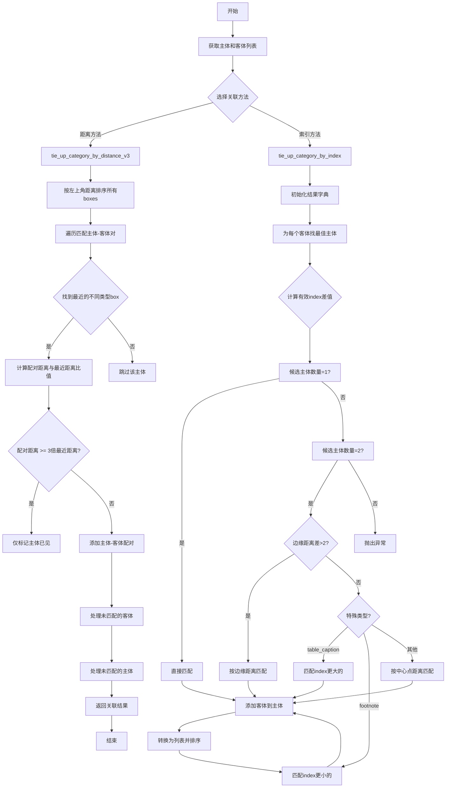
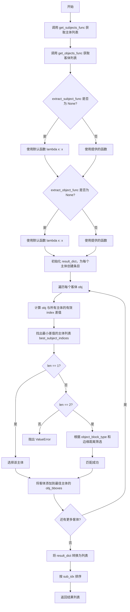

# `MinerU\mineru\utils\magic_model_utils.py` 详细设计文档

该代码提供了一组用于文档布局分析中主体-客体关联的工具函数，包含去除重叠bbox的reduct_overlap函数、基于空间距离的tie_up_category_by_distance_v3函数、以及基于索引的tie_up_category_by_index函数，用于将文档中的主体元素（如标题、段落）与客体元素（如图片、表格、脚注等）进行匹配关联。

## 整体流程



## 类结构

```
该代码为模块文件，无类定义
├── 全局函数
│   ├── reduct_overlap (去除重叠bbox)
│   ├── tie_up_category_by_distance_v3 (基于距离的关联)
│   └── tie_up_category_by_index (基于索引的关联)
```

## 全局变量及字段


### `N`
    
bboxes列表的长度

类型：`int`
    


### `keep`
    
标记每个bbox是否应被保留的布尔列表

类型：`List[bool]`
    


### `i`
    
外层循环索引

类型：`int`
    


### `j`
    
内层循环索引

类型：`int`
    


### `subjects`
    
主体对象列表

类型：`List[Dict[str, Any]]`
    


### `objects`
    
客体对象列表

类型：`List[Dict[str, Any]]`
    


### `OBJ_IDX_OFFSET`
    
客体索引偏移量，用于区分主体和客体

类型：`int`
    


### `SUB_BIT_KIND`
    
主体类型标记位

类型：`int`
    


### `OBJ_BIT_KIND`
    
客体类型标记位

类型：`int`
    


### `all_boxes_with_idx`
    
所有带索引的bbox列表

类型：`List[Tuple]`
    


### `seen_idx`
    
已处理的索引集合

类型：`set`
    


### `seen_sub_idx`
    
已匹配的主体索引集合

类型：`set`
    


### `ret`
    
关联结果列表

类型：`List[Dict[str, Any]]`
    


### `candidates`
    
当前候选的bbox列表

类型：`List[Tuple]`
    


### `left_x`
    
候选区域的左边界x坐标

类型：`float`
    


### `top_y`
    
候选区域的顶部边界y坐标

类型：`float`
    


### `fst_idx`
    
第一个（最左上）bbox的索引

类型：`int`
    


### `fst_kind`
    
第一个bbox的类型（主体或客体）

类型：`int`
    


### `fst_bbox`
    
第一个bbox的坐标

类型：`List[float]`
    


### `nxt`
    
下一个不同类型的候选bbox

类型：`Tuple`
    


### `sub_idx`
    
匹配的主体索引

类型：`int`
    


### `obj_idx`
    
匹配的客体索引

类型：`int`
    


### `pair_dis`
    
主体与客体的配对距离

类型：`float`
    


### `nearest_dis`
    
最近邻距离

类型：`float`
    


### `result_dict`
    
按主体索引存储的结果字典

类型：`Dict[int, Dict]`
    


### `object_indices`
    
所有客体index的集合

类型：`set`
    


### `obj_index`
    
当前客体的index

类型：`int`
    


### `min_index_diff`
    
最小有效index差值

类型：`float`
    


### `best_subject_indices`
    
最佳匹配的主体索引列表

类型：`List[int]`
    


### `edge_distances`
    
边缘距离列表

类型：`List[Tuple]`
    


### `edge_dist_diff`
    
边缘距离差值

类型：`float`
    


### `center_distances`
    
中心距离列表

类型：`List[Tuple]`
    


### `best_subject_idx`
    
最终选择的主体索引

类型：`int`
    


    

## 全局函数及方法


### `reduct_overlap`

该函数用于去除重叠的边界框，通过检测并移除被其他边界框完全包含的bbox，保留最外层的边界框。

参数：

- `bboxes`：`List[Dict[str, Any]]`，包含bbox信息的字典列表，每个字典需包含'bbox'键

返回值：`List[Dict[str, Any]]`，去重后的bbox列表，仅保留不被其他bbox包含的bbox

#### 流程图

```mermaid
flowchart TD
    A[开始 reduct_overlap] --> B[N = len(bboxes)]
    B --> C[初始化 keep = [True] * N]
    C --> D[i = 0 to N-1]
    D --> E[j = 0 to N-1]
    E --> F{i == j?}
    F -->|是| G[继续下一个j]
    F -->|否| H{is_in(bboxes[i]['bbox'], bboxes[j]['bbox'])?}
    H -->|是| I[keep[i] = False]
    H -->|否| G
    I --> G
    G --> J[j循环结束?]
    J -->|否| E
    J -->|是| K[i循环结束?]
    K -->|否| D
    K -->|是| L[返回 [bboxes[i] for i in range(N) if keep[i]]]
    L --> M[结束]
```

#### 带注释源码

```python
def reduct_overlap(bboxes: List[Dict[str, Any]]) -> List[Dict[str, Any]]:
    """
    去除重叠的bbox，保留不被其他bbox包含的bbox

    Args:
        bboxes: 包含bbox信息的字典列表

    Returns:
        去重后的bbox列表
    """
    # 获取输入bbox的数量
    N = len(bboxes)
    # 初始化标记数组，True表示该bbox需要保留
    keep = [True] * N
    # 双重遍历比较所有bbox对
    for i in range(N):
        for j in range(N):
            # 跳过自身比较
            if i == j:
                continue
            # 检查第i个bbox是否被第j个bbox包含
            # is_in函数判断bboxes[i]['bbox']是否在bboxes[j]['bbox']内部
            if is_in(bboxes[i]['bbox'], bboxes[j]['bbox']):
                # 如果被包含，标记为False，表示该bbox需要被移除
                keep[i] = False
    # 收集所有标记为True的bbox，即保留不被包含的bbox
    return [bboxes[i] for i in range(N) if keep[i]]
```


### `tie_up_category_by_distance_v3`

该函数是一个通用的类别关联方法，通过计算主体对象与客体对象之间的空间距离（bbox边缘距离），将主体与最接近的客体进行匹配关联，支持自定义的主体/客体属性提取函数，并处理一对多和多对一的匹配场景。

参数：

- `get_subjects_func`：`Callable`，用于提取主体对象的函数
- `get_objects_func`：`Callable`，用于提取客体对象的函数
- `extract_subject_func`：`Callable`，可选，自定义提取主体属性的函数（默认为 `lambda x: x`，即直接返回原对象）
- `extract_object_func`：`Callable`，可选，自定义提取客体属性的函数（默认为 `lambda x: x`，即直接返回原对象）

返回值：`List[Dict[str, Any]]`，关联后的对象列表，每个元素包含 `sub_bbox`（主体属性）、`obj_bboxes`（关联的客体属性列表）和 `sub_idx`（主体索引）

#### 流程图

```mermaid
flowchart TD
    A[开始] --> B[调用 get_subjects_func 获取主体列表]
    B --> C[调用 get_objects_func 获取客体列表]
    C --> D{extract_subject_func<br/>是否为 None?}
    D -->|是| E[设置默认 lambda x: x]
    D -->|否| F[使用提供的函数]
    E --> G{extract_object_func<br/>是否为 None?}
    F --> G
    G -->|是| H[设置默认 lambda x: x]
    G -->|否| I[使用提供的函数]
    H --> J[按 bbox 左上角距离排序主体和客体]
    J --> K[构建 all_boxes_with_idx 列表<br/>包含主体和客体的索引、类型和坐标]
    K --> L[初始化 seen_idx 和 seen_sub_idx 空集合]
    L --> M{N > len<br/>seen_sub_idx?}
    M -->|是| N[从未处理的 box 中找出候选列表]
    N --> O[计算候选列表的 left_x 和 top_y]
    O --> P[按到 left_x, top_y 的距离排序候选列表]
    P --> Q[取第一个作为 fst（首个匹配box）]
    Q --> R[按到 fst_bbox 的距离重新排序候选列表]
    R --> S[在候选列表中找第一个与 fst 类型不同的 box 作为 nxt]
    S --> T{nxt 是否为空?}
    T -->|是| U[跳出循环]
    T -->|否| V[确定 sub_idx 和 obj_idx]
    V --> W[计算 pair_dis（当前配对距离）]
    W --> X[计算 nearest_dis（到该客体的最近主体距离）]
    X --> Y{pair_dis >=<br/>3 * nearest_dis?}
    Y -->|是| Z[将 sub_idx 加入 seen_idx<br/>继续下一轮]
    Y -->|否| AA[将 sub_idx 和 obj_idx 加入 seen_idx<br/>将 sub_idx 加入 seen_sub_idx]
    AA --> AB[构建关联结果加入 ret]
    Z --> M
    AB --> M
    M -->|否| AC[处理剩余未匹配的客体]
    AC --> AD{客体 j 是否在 seen_idx?}
    AD -->|是| AE[跳过]
    AD -->|否| AF[找最近的客体 nearest_sub_idx]
    AF --> AG{最近主体是否已匹配?}
    AG -->|是| AH[将该客体加入对应 ret[kk] 的 obj_bboxes]
    AG -->|否| AI[创建新的关联记录加入 ret]
    AH --> AE
    AI --> AE
    AE --> AJ[下一个客体]
    AJ --> AD
    AC --> AK[处理剩余未匹配的主体]
    AK --> AL{主体 i 是否在 seen_sub_idx?]
    AL -->|是| AM[跳过]
    AL -->|否| AN[创建空 obj_bboxes 的关联记录]
    AN --> AO[加入 ret]
    AM --> AO
    AO --> AP[返回 ret]
    U --> AC
```

#### 带注释源码

```python
def tie_up_category_by_distance_v3(
        get_subjects_func: Callable,
        get_objects_func: Callable,
        extract_subject_func: Callable = None,
        extract_object_func: Callable = None
):
    """
    通用的类别关联方法，用于将主体对象与客体对象进行关联

    参数:
        get_subjects_func: 函数，提取主体对象
        get_objects_func: 函数，提取客体对象
        extract_subject_func: 函数，自定义提取主体属性（默认使用bbox和其他属性）
        extract_object_func: 函数，自定义提取客体属性（默认使用bbox和其他属性）

    返回:
        关联后的对象列表
    """
    # 步骤1: 调用传入的函数获取主体和客体列表
    subjects = get_subjects_func()
    objects = get_objects_func()

    # 步骤2: 如果没有提供自定义提取函数，使用默认函数（直接返回原对象）
    if extract_subject_func is None:
        extract_subject_func = lambda x: x
    if extract_object_func is None:
        extract_object_func = lambda x: x

    # 步骤3: 初始化结果列表
    ret = []
    N, M = len(subjects), len(objects)

    # 步骤4: 按 bbox 左上角坐标的欧氏距离排序（距离原点越近越优先）
    subjects.sort(key=lambda x: x["bbox"][0] ** 2 + x["bbox"][1] ** 2)
    objects.sort(key=lambda x: x["bbox"][0] ** 2 + x["bbox"][1] ** 2)

    # 步骤5: 定义常量
    OBJ_IDX_OFFSET = 10000      # 客体索引偏移量，用于区分主体和客体
    SUB_BIT_KIND, OBJ_BIT_KIND = 0, 1  # 主体和客体的类型标识

    # 步骤6: 构建所有 bbox 的统一列表，每个元素包含 (索引, 类型, x0, y0)
    all_boxes_with_idx = [(i, SUB_BIT_KIND, sub["bbox"][0], sub["bbox"][1]) for i, sub in enumerate(subjects)] + [
        (i + OBJ_IDX_OFFSET, OBJ_BIT_KIND, obj["bbox"][0], obj["bbox"][1]) for i, obj in enumerate(objects)
    ]
    # 用于记录已处理的索引
    seen_idx = set()        # 所有已处理的索引
    seen_sub_idx = set()    # 已匹配过的主体索引

    # 步骤7: 主循环 - 主体-客体配对阶段
    # 持续处理直到所有主体都被处理完毕
    while N > len(seen_sub_idx):
        # 7.1: 从未处理的 box 中生成候选列表
        candidates = []
        for idx, kind, x0, y0 in all_boxes_with_idx:
            if idx in seen_idx:
                continue
            candidates.append((idx, kind, x0, y0))

        # 7.2: 如果没有候选了，退出循环
        if len(candidates) == 0:
            break

        # 7.3: 计算候选区域的左上角边界
        left_x = min([v[2] for v in candidates])
        top_y = min([v[3] for v in candidates])

        # 7.4: 按到左上角的距离排序候选列表
        candidates.sort(key=lambda x: (x[2] - left_x) ** 2 + (x[3] - top_y) ** 2)

        # 7.5: 取出第一个作为 fst（首个匹配的 box）
        fst_idx, fst_kind, left_x, top_y = candidates[0]
        # 根据类型获取 fst 的 bbox
        fst_bbox = subjects[fst_idx]['bbox'] if fst_kind == SUB_BIT_KIND else objects[fst_idx - OBJ_IDX_OFFSET]['bbox']

        # 7.6: 按到 fst_bbox 的距离重新排序候选列表
        candidates.sort(
            key=lambda x: bbox_distance(fst_bbox, subjects[x[0]]['bbox']) if x[1] == SUB_BIT_KIND else bbox_distance(
                fst_bbox, objects[x[0] - OBJ_IDX_OFFSET]['bbox']))

        # 7.7: 找到第一个与 fst 类型不同的候选（确保主体-客体配对）
        nxt = None
        for i in range(1, len(candidates)):
            # 使用异或判断类型不同（0^1=1, 1^1=0）
            if candidates[i][1] ^ fst_kind == 1:
                nxt = candidates[i]
                break

        # 7.8: 如果没有找到配对的候选，退出循环
        if nxt is None:
            break

        # 7.9: 确定配对的主体和客体索引
        if fst_kind == SUB_BIT_KIND:
            sub_idx, obj_idx = fst_idx, nxt[0] - OBJ_IDX_OFFSET
        else:
            sub_idx, obj_idx = nxt[0], fst_idx - OBJ_IDX_OFFSET

        # 7.10: 计算当前配对的距离
        pair_dis = bbox_distance(subjects[sub_idx]["bbox"], objects[obj_idx]["bbox"])

        # 7.11: 计算该客体到所有主体的最近距离（作为判断是否有效配对的依据）
        nearest_dis = float("inf")
        for i in range(N):
            # 取消原先算法中 1对1 匹配的偏置
            # if i in seen_idx or i == sub_idx:continue
            nearest_dis = min(nearest_dis, bbox_distance(subjects[i]["bbox"], objects[obj_idx]["bbox"]))

        # 7.12: 如果配对距离大于等于最近距离的3倍，认为匹配不合理，跳过该主体
        if pair_dis >= 3 * nearest_dis:
            seen_idx.add(sub_idx)
            continue

        # 7.13: 有效配对，加入已见集合并记录结果
        seen_idx.add(sub_idx)
        seen_idx.add(obj_idx + OBJ_IDX_OFFSET)
        seen_sub_idx.add(sub_idx)

        ret.append(
            {
                "sub_bbox": extract_subject_func(subjects[sub_idx]),
                "obj_bboxes": [extract_object_func(objects[obj_idx])],
                "sub_idx": sub_idx,
            }
        )

    # 步骤8: 处理剩余未匹配的客体（客体找最近的主体进行追加或新建关联）
    for i in range(len(objects)):
        j = i + OBJ_IDX_OFFSET
        if j in seen_idx:
            continue
        seen_idx.add(j)

        # 8.1: 找最近的客体
        nearest_dis, nearest_sub_idx = float("inf"), -1
        for k in range(len(subjects)):
            dis = bbox_distance(objects[i]["bbox"], subjects[k]["bbox"])
            if dis < nearest_dis:
                nearest_dis = dis
                nearest_sub_idx = k

        # 8.2: 将该客体追加到最近主体或新建关联
        for k in range(len(subjects)):
            if k != nearest_sub_idx:
                continue
            if k in seen_sub_idx:
                # 已匹配过的主体，追加到其 obj_bboxes
                for kk in range(len(ret)):
                    if ret[kk]["sub_idx"] == k:
                        ret[kk]["obj_bboxes"].append(extract_object_func(objects[i]))
                        break
            else:
                # 未匹配过的主体，新建关联记录
                ret.append(
                    {
                        "sub_bbox": extract_subject_func(subjects[k]),
                        "obj_bboxes": [extract_object_func(objects[i])],
                        "sub_idx": k,
                    }
                )
            seen_sub_idx.add(k)
            seen_idx.add(k)

    # 步骤9: 处理剩余未匹配的主体（没有关联任何客体）
    for i in range(len(subjects)):
        if i in seen_sub_idx:
            continue
        ret.append(
            {
                "sub_bbox": extract_subject_func(subjects[i]),
                "obj_bboxes": [],
                "sub_idx": i,
            }
        )

    # 步骤10: 返回关联结果列表
    return ret
```


### `tie_up_category_by_index`

基于索引的类别关联方法，用于将主体对象与客体对象进行关联。客体优先匹配给index最接近的主体，匹配优先级为：index差值（最高优先级）、bbox边缘距离（次优先级）、bbox中心点距离（最低优先级，作为最终tiebreaker）。

参数：

- `get_subjects_func`：`Callable`，获取主体对象的函数
- `get_objects_func`：`Callable`，获取客体对象的函数
- `extract_subject_func`：`Callable`，自定义提取主体属性的函数（可选，默认为 `lambda x: x`）
- `extract_object_func`：`Callable`，自定义提取客体属性的函数（可选，默认为 `lambda x: x`）
- `object_block_type`：`str`，客体块类型，用于特殊匹配规则（可选，默认为 `"object"`）

返回值：`List[Dict[str, Any]]`，关联后的对象列表，按主体index升序排列

#### 流程图



#### 带注释源码

```python
def tie_up_category_by_index(
        get_subjects_func: Callable,
        get_objects_func: Callable,
        extract_subject_func: Callable = None,
        extract_object_func: Callable = None,
        object_block_type: str = "object",
):
    """
    基于index的类别关联方法，用于将主体对象与客体对象进行关联
    客体优先匹配给index最接近的主体，匹配优先级为：
    1. index差值（最高优先级）
    2. bbox边缘距离（相邻边距离）
    3. bbox中心点距离（最低优先级，作为最终tiebreaker）

    参数:
        get_subjects_func: 函数，提取主体对象
        get_objects_func: 函数，提取客体对象
        extract_subject_func: 函数，自定义提取主体属性（默认使用bbox和其他属性）
        extract_object_func: 函数，自定义提取客体属性（默认使用bbox和其他属性）

    返回:
        关联后的对象列表，按主体index升序排列
    """
    # 调用传入的函数获取主体和客体列表
    subjects = get_subjects_func()
    objects = get_objects_func()

    # 如果没有提供自定义提取函数，使用默认函数（直接返回原对象）
    if extract_subject_func is None:
        extract_subject_func = lambda x: x
    if extract_object_func is None:
        extract_object_func = lambda x: x

    # 初始化结果字典，key为主体索引，value为关联信息
    result_dict = {}

    # 初始化所有主体，为每个主体创建初始条目
    for i, subject in enumerate(subjects):
        result_dict[i] = {
            "sub_bbox": extract_subject_func(subject),  # 提取主体属性
            "obj_bboxes": [],  # 初始化客体列表为空
            "sub_idx": i,  # 记录主体索引
        }

    # 提取所有客体的index集合，用于计算有效index差值
    object_indices = set(obj["index"] for obj in objects)

    def calc_effective_index_diff(obj_index: int, sub_index: int) -> int:
        """
        计算有效的index差值
        有效差值 = 绝对差值 - 区间内其他客体的数量
        即：如果obj_index和sub_index之间的差值是由其他客体造成的，则应该扣除这部分差值
        """
        # 如果index相等，差值为0
        if obj_index == sub_index:
            return 0

        # 确定区间范围
        start, end = min(obj_index, sub_index), max(obj_index, sub_index)
        abs_diff = end - start  # 计算绝对差值

        # 计算区间(start, end)内有多少个其他客体的index
        other_objects_count = 0
        for idx in range(start + 1, end):
            if idx in object_indices:
                other_objects_count += 1

        # 返回有效差值 = 绝对差值 - 其他客体数量
        return abs_diff - other_objects_count

    # 为每个客体找到最匹配的主体
    for obj in objects:
        # 如果没有主体，跳过该客体
        if len(subjects) == 0:
            continue

        obj_index = obj["index"]
        min_index_diff = float("inf")  # 初始化最小index差值为无穷大
        best_subject_indices = []  # 存储最佳主体索引列表

        # 遍历所有主体，找出有效index差值最小的
        for i, subject in enumerate(subjects):
            sub_index = subject["index"]
            index_diff = calc_effective_index_diff(obj_index, sub_index)

            # 更新最小差值和最佳主体列表
            if index_diff < min_index_diff:
                min_index_diff = index_diff
                best_subject_indices = [i]
            elif index_diff == min_index_diff:
                best_subject_indices.append(i)

        # 根据最佳主体数量进行不同处理
        if len(best_subject_indices) == 1:
            # 只有一个最佳主体，直接选择
            best_subject_idx = best_subject_indices[0]
        # 如果有多个主体的index差值相同（最多两个），根据边缘距离进行筛选
        elif len(best_subject_indices) == 2:
            # 计算所有候选主体的边缘距离
            edge_distances = [(idx, bbox_distance(obj["bbox"], subjects[idx]["bbox"])) for idx in best_subject_indices]
            edge_dist_diff = abs(edge_distances[0][1] - edge_distances[1][1])

            # 调试日志：输出边缘距离信息
            for idx, edge_dist in edge_distances:
                logger.debug(f"Obj index: {obj_index}, Sub index: {subjects[idx]['index']}, Edge distance: {edge_dist}")

            if edge_dist_diff > 2:
                # 边缘距离差值大于2，匹配边缘距离更小的主体
                best_subject_idx = min(edge_distances, key=lambda x: x[1])[0]
                logger.debug(f"Obj index: {obj_index}, edge_dist_diff > 2, matching to subject with min edge distance, index: {subjects[best_subject_idx]['index']}")
            elif object_block_type == "table_caption":
                # 边缘距离差值<=2且为table_caption，匹配index更大的主体
                best_subject_idx = max(best_subject_indices, key=lambda idx: subjects[idx]["index"])
                logger.debug(f"Obj index: {obj_index}, edge_dist_diff <= 2 and table_caption, matching to later subject with index: {subjects[best_subject_idx]['index']}")
            elif object_block_type.endswith("footnote"):
                # 边缘距离差值<=2且为footnote，匹配index更小的主体
                best_subject_idx = min(best_subject_indices, key=lambda idx: subjects[idx]["index"])
                logger.debug(f"Obj index: {obj_index}, edge_dist_diff <= 2 and footnote, matching to earlier subject with index: {subjects[best_subject_idx]['index']}")
            else:
                # 边缘距离差值<=2 且不适用特殊匹配规则，使用中心点距离匹配
                center_distances = [(idx, bbox_center_distance(obj["bbox"], subjects[idx]["bbox"])) for idx in best_subject_indices]
                for idx, center_dist in center_distances:
                    logger.debug(f"Obj index: {obj_index}, Sub index: {subjects[idx]['index']}, Center distance: {center_dist}")
                best_subject_idx = min(center_distances, key=lambda x: x[1])[0]
        else:
            # 理论上不应该出现超过2个主体具有相同最小差值的情况
            raise ValueError("More than two subjects have the same minimal index difference, which is unexpected.")

        # 将客体添加到最佳主体的obj_bboxes中
        result_dict[best_subject_idx]["obj_bboxes"].append(extract_object_func(obj))

    # 转换为列表并按主体index排序
    ret = list(result_dict.values())
    ret.sort(key=lambda x: x["sub_idx"])

    return ret
```

## 关键组件


### reduct_overlap 函数

去除重叠的bbox，保留不被其他bbox包含的bbox，用于去重处理。

### tie_up_category_by_distance_v3 函数

通用的基于距离的类别关联方法，将主体对象与客体对象进行空间距离匹配关联，支持自定义提取函数。

### tie_up_category_by_index 函数

基于index的类别关联方法，将客体对象匹配到index最接近的主体，匹配优先级为：index差值 > bbox边缘距离 > bbox中心点距离。

### bbox_distance 工具函数

计算两个bbox之间的边缘距离，用于距离计算和匹配排序。

### bbox_center_distance 工具函数

计算两个bbox之间的中心点距离，用于最终tiebreaker排序。

### is_in 工具函数

判断一个bbox是否被另一个bbox包含，用于重叠检测。

### OBJ_IDX_OFFSET 常量

客体索引偏移量（值为10000），用于区分主体和客体的索引标识。

### SUB_BIT_KIND 和 OBJ_BIT_KIND 常量

主体和客体的类型标识位，分别用于标记数据类型。


## 问题及建议


### 已知问题

-   **代码重复**：两个核心函数 `tie_up_category_by_distance_v3` 和 `tie_up_category_by_index` 存在大量重复逻辑，如获取 subjects/objects、设置默认的 extract 函数、构建结果结构等，可通过抽象公共逻辑减少重复。
-   **算法复杂度较高**：`reduct_overlap` 使用 O(N²) 的双重循环，当 bbox 数量较多时性能可能成为瓶颈；`tie_up_category_by_index` 中的 `calc_effective_index_diff` 函数内部也存在嵌套循环，整体时间复杂度较高。
-   **魔法数字和硬编码**：代码中多处使用硬编码数值如 `OBJ_IDX_OFFSET = 10000`、`3 * nearest_dis`、`edge_dist_diff > 2` 等，缺乏常量定义或配置说明，可读性和可维护性较差。
-   **副作用风险**：`tie_up_category_by_distance_v3` 中对 `subjects` 和 `objects` 列表进行了原地排序（`sort()`），可能修改原始输入数据，建议在使用前进行拷贝。
-   **边界条件处理不足**：多处假设输入数据存在特定字段（如 `bbox`、`index`），但未进行充分的校验，当输入数据格式不符合预期时可能导致 KeyError 或其他异常。
-   **参数设计冗余**：`extract_subject_func` 和 `extract_object_func` 参数默认为 `None` 时使用 `lambda x: x`，这种模式可以用更简洁的方式实现，同时参数过多增加了调用复杂度。
-   **日志使用不规范**：在 `tie_up_category_by_index` 中使用了 `logger.debug` 但未说明是否在生产环境开启，且大量调试日志可能影响性能。
-   **异常处理缺失**：`tie_up_category_by_index` 在匹配到超过两个主体时会抛出 `ValueError`，但未提供明确的错误恢复机制。

### 优化建议

-   **提取公共逻辑**：将两个 tie_up 函数中相同的初始化逻辑（获取数据、设置默认函数、构建结果结构）抽取为私有方法或工具函数。
-   **优化算法**：对 `reduct_overlap` 可考虑使用空间索引（如 R-tree）或更高效的去重算法；对 `calc_effective_index_diff` 可预先构建 index 集合以减少重复遍历。
-   **常量定义**：将魔法数字提取为模块级常量或配置文件，并添加注释说明其含义和取值依据。
-   **输入校验**：在函数入口处增加必要的参数校验，确保 `bbox`、`index` 等必填字段存在，或提供清晰的错误提示。
-   **避免副作用**：在排序操作前对输入列表进行拷贝，或使用 `sorted()` 返回新列表。
-   **简化参数设计**：可考虑将 `extract_subject_func` 和 `extract_object_func` 合并为配置对象，或提供更便捷的默认实现。
-   **优化日志输出**：将关键决策点的日志改为 `logger.info` 或 `logger.warning`，并确保日志格式统一。

## 其它


### 设计目标与约束

本模块旨在解决文档元素（特别是PDF文档）中主体（subjects）与客体（objects）的关联问题，支持两种关联策略：基于距离的关联（tie_up_category_by_distance_v3）和基于索引的关联（tie_up_category_by_index）。核心约束包括：1）输入的bboxes必须包含bbox字段；2）distance算法要求pair_dis < 3 * nearest_dis才能成功匹配；3）index算法中有效index差值计算需排除区间内其他客体的影响；4）时间复杂度为O(N*M)级别，空间复杂度为O(N+M)。

### 错误处理与异常设计

代码采用防御性编程风格，主要错误处理包括：1）空列表检查：在tie_up_category_by_index中当subjects为空时跳过客体处理；2）索引越界防护：通过seen_idx和seen_sub_idx集合防止重复处理；3）异常抛出：当best_subject_indices长度超过2时抛出ValueError("More than two subjects have the same minimal index difference, which is unexpected.")；4）边界条件处理：distance算法中当nxt为None时跳出循环，避免后续空指针访问。

### 数据流与状态机

整体数据流为：输入原始subjects和objects列表 → 排序预处理（按坐标或索引） → 迭代匹配主体与客体 → 构建关联结果 → 输出ret列表。状态机包含：1）初始化状态（seen_idx/seen_sub_idx为空）；2）匹配中状态（遍历candidates寻找配对）；3）完成状态（所有主体已处理或无可用客体）。tie_up_category_by_index额外维护result_dict状态，按主体索引存储关联结果。

### 外部依赖与接口契约

外部依赖包括：1）loguru - 日志记录；2）mineru.utils.boxbase.bbox_distance - 计算边界框距离；3）mineru.utils.boxbase.bbox_center_distance - 计算边界框中心距离；4）mineru.utils.boxbase.is_in - 判断bbox包含关系。接口契约：get_subjects_func和get_objects_func必须返回包含bbox字段的字典列表；extract_subject_func和extract_object_func为可选参数，默认使用lambda x: x返回原对象；返回结果统一格式为包含sub_bbox、obj_bboxes、sub_idx字段的字典列表。

### 性能考虑与优化空间

当前实现存在以下性能瓶颈：1）双重嵌套循环导致O(N²)时间复杂度；2）每次迭代重新计算candidates列表；3）index算法中calc_effective_index_diff函数存在O(N)复杂度的区间遍历。优化方向：1）使用空间换时间策略，预计算距离矩阵；2）引入kd-tree加速最近邻搜索；3）将calc_effective_index_diff的区间统计改为前缀和或BIT树实现O(logN)查询；4）distance算法中的排序可使用更高效的单次排序而非多次sort。

### 安全性考虑

当前代码主要关注功能实现，安全性考虑不足：1）无输入验证 - 未检查bbox格式是否合法（应为4元素数值列表）；2）无类型校验 - get_subjects_func/get_objects_func返回值类型未强制约束；3）潜在数值溢出 - 坐标计算使用**2运算，大坐标值可能导致溢出；4）日志信息泄露 - debug日志可能输出敏感文档结构信息。建议增加：输入格式校验函数、类型注解强化、坐标值范围检查。

### 并发与线程安全分析

当前实现为单线程设计，存在以下线程不安全问题：1）seen_idx和seen_sub_idx为可变集合，并发访问可能导致状态不一致；2）result_dict为可变字典，多线程写入存在竞态条件；3）全局变量all_boxes_with_idx在while循环中被重复计算。如需并发化，建议：每个线程处理独立的主体子集，最后合并结果；或使用线程安全的数据结构（如queue.Queue）收集结果。

### 兼容性说明

本模块兼容Python 3.7+（使用typing模块的Callable类型注解）。依赖库版本要求：loguru >= 0.5.0，mineru.utils.boxbase需与mineru主版本匹配。输出结果格式在不同版本间应保持稳定：sub_bbox和obj_bboxes返回extract_func的处理结果，sub_idx返回原始主体索引。

    