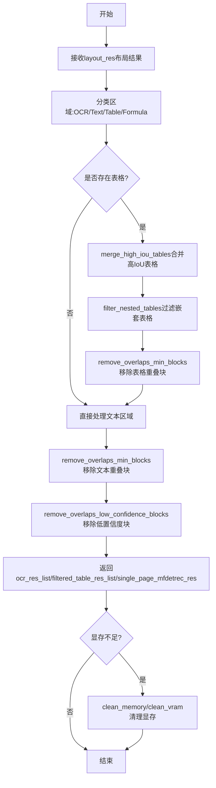
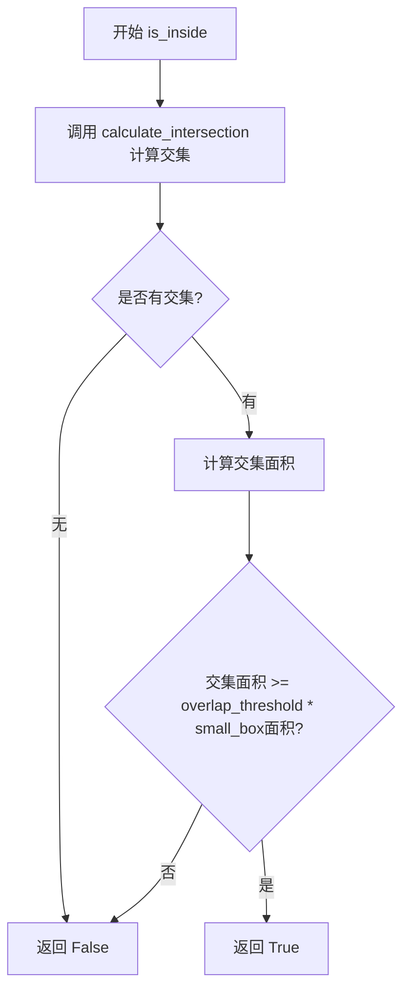
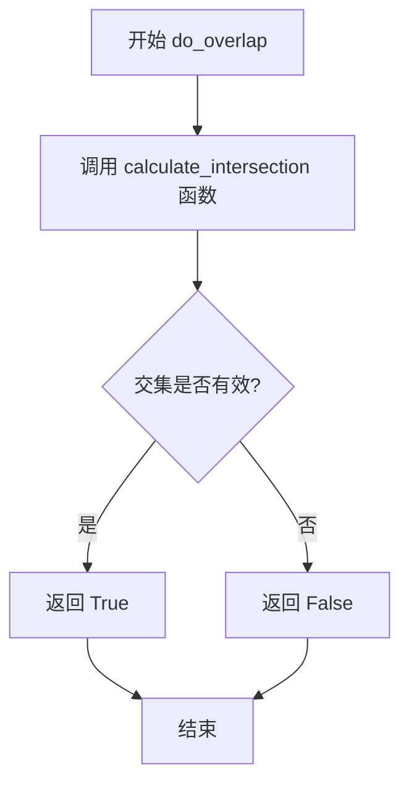
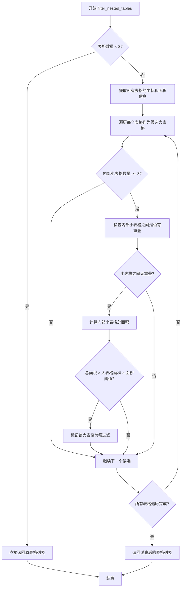
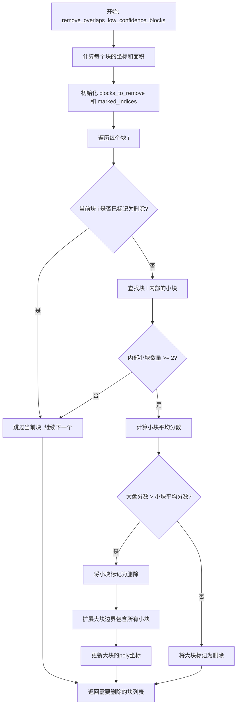
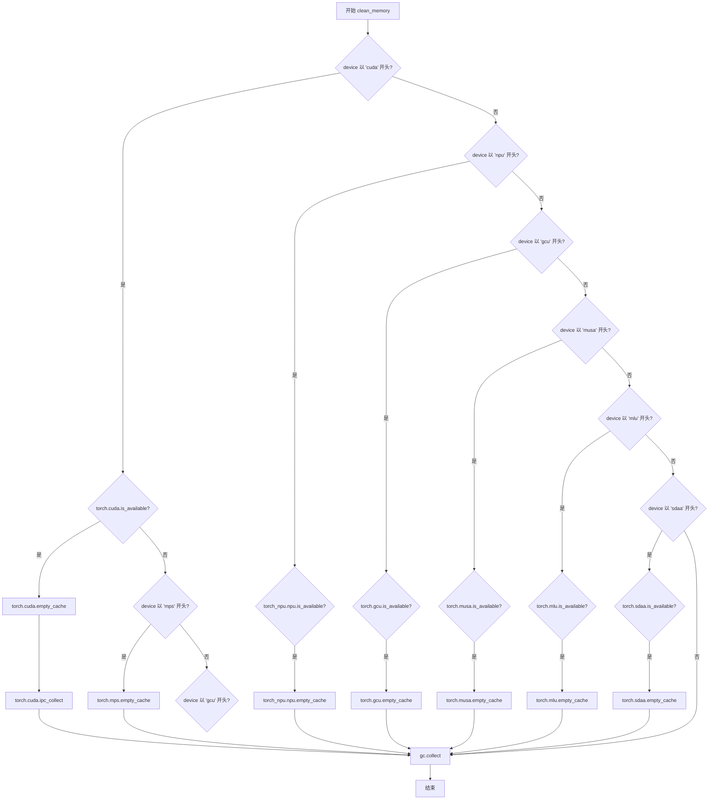
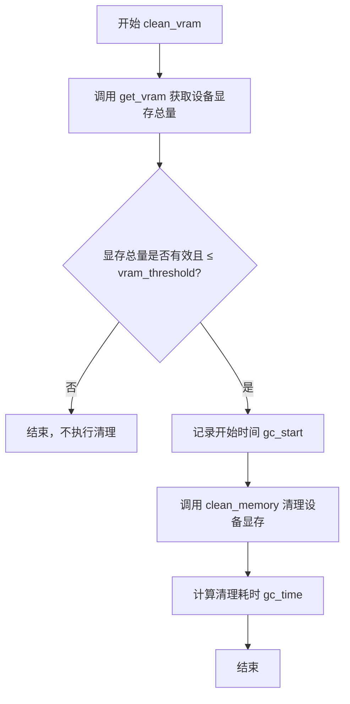
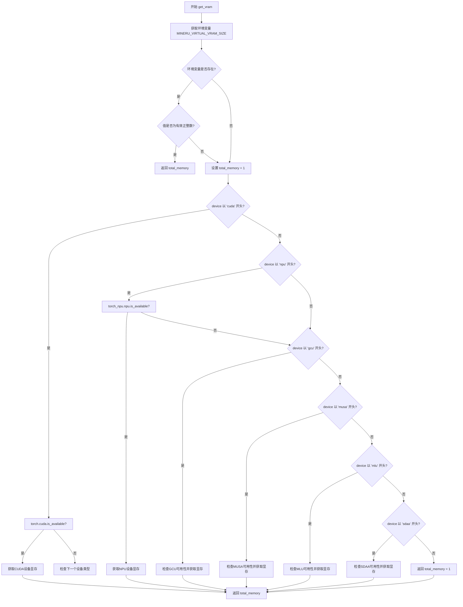

# `MinerU\mineru\utils\model_utils.py` 详细设计文档

该代码是一个文档布局后处理工具模块，主要用于处理布局分析结果中的表格、OCR和文本区域，包括表格合并、嵌套表格过滤、重复块移除、内存和显存管理等核心功能。

## 整体流程



## 类结构

```
模块: utils_layout (无类定义)
├── 图像处理工具
│   └── crop_img
├── 几何计算工具
│   ├── get_coords_and_area
│   ├── calculate_intersection
│   ├── calculate_iou
│   ├── is_inside
│   └── do_overlap
├── 表格处理模块
│   ├── merge_high_iou_tables
│   ├── filter_nested_tables
│   └── remove_overlaps_min_blocks
├── 重叠块处理模块
│   └── remove_overlaps_low_confidence_blocks
├── 主流程函数
│   └── get_res_list_from_layout_res
└── 内存管理模块
    ├── clean_memory
    ├── clean_vram
    └── get_vram
```

## 全局变量及字段


### `torch`
    
PyTorch深度学习框架模块，用于张量计算和神经网络构建

类型：`Module`
    


### `torch_npu`
    
华为NPU的PyTorch扩展模块，用于在NPU设备上进行深度学习计算

类型：`Module`
    


### `np`
    
NumPy科学计算库模块，提供高效的数组和矩阵运算功能

类型：`Module`
    


### `Image`
    
PIL图像处理库中的Image模块，用于图像的打开、裁剪和处理

类型：`Module`
    


### `logger`
    
Loguru日志库提供的日志记录器对象，用于输出程序运行日志

类型：`Logger`
    


### `os`
    
Python标准库操作系统接口模块，提供文件和目录操作功能

类型：`Module`
    


### `time`
    
Python标准库时间模块，提供时间获取和计时功能

类型：`Module`
    


### `gc`
    
Python标准库垃圾回收模块，用于手动控制内存回收

类型：`Module`
    


    

## 全局函数及方法


### `crop_img`

该函数根据输入的坐标信息（`input_res`中的`poly`字段）从原始图像中裁剪出指定区域，并可选地在裁剪区域周围添加白色背景填充，最后返回裁剪后的图像及相关坐标信息。

参数：

- `input_res`：`dict`，包含多边形坐标信息的字典，必须包含`poly`键，其值为8点坐标列表`[x0, y0, x1, y1, x2, y2, x3, y3]`，用于指定裁剪区域的边界框
- `input_img`：`Union[np.ndarray, Image.Image]`，输入的原始图像，支持NumPy数组或PIL Image对象
- `crop_paste_x`：`int`，可选参数，裁剪后图像在水平方向的填充边距（像素），默认为0
- `crop_paste_y`：`int`，可选参数，裁剪后图像在垂直方向的填充边距（像素），默认为0

返回值：`Tuple[Union[np.ndarray, Image.Image], List[int]]`，返回一个元组，包含裁剪后的图像对象（类型与输入图像一致）以及裁剪信息列表`[crop_paste_x, crop_paste_y, crop_xmin, crop_ymin, crop_xmax, crop_ymax, crop_new_width, crop_new_height]`

#### 流程图

```mermaid
flowchart TD
    A[开始 crop_img] --> B[提取裁剪坐标]
    B --> B1[crop_xmin = input_res['poly'][0]]
    B --> B2[crop_ymin = input_res['poly'][1]]
    B --> B3[crop_xmax = input_res['poly'][4]]
    B --> B4[crop_ymax = input_res['poly'][5]]
    
    B --> C[计算新图像尺寸]
    C --> C1[crop_new_width = crop_xmax - crop_xmin + crop_paste_x * 2]
    C --> C2[crop_new_height = crop_ymax - crop_ymin + crop_paste_y * 2]
    
    C --> D{input_img是否为numpy数组?}
    D -->|是| E[使用NumPy方式处理]
    D -->|否| F[使用PIL方式处理]
    
    E --> E1[创建白色背景数组]
    E --> E2[使用切片裁剪原图]
    E --> E3[将裁剪图像粘贴到白色背景上]
    E --> E4[跳转到构建返回列表]
    
    F --> F1[创建白色背景Image]
    F --> F2[使用crop方法裁剪原图]
    F --> F3[将裁剪图像粘贴到白色背景上]
    F --> F4[跳转到构建返回列表]
    
    E4 --> G[构建返回列表]
    F4 --> G
    G --> H[返回裁剪图像和返回列表]
```

#### 带注释源码

```python
def crop_img(input_res, input_img, crop_paste_x=0, crop_paste_y=0):
    """
    根据输入的坐标信息从原始图像中裁剪指定区域
    
    Parameters:
        input_res: dict, 包含poly键的字典，poly为8点坐标列表 [x0,y0,x1,y1,x2,y2,x3,y3]
        input_img: numpy.ndarray or PIL.Image, 输入的原始图像
        crop_paste_x: int, 裁剪后水平方向填充的边距（像素）
        crop_paste_y: int, 裁剪后垂直方向填充的边距（像素）
    
    Returns:
        tuple: (裁剪后的图像, 裁剪信息列表)
    """
    
    # 从input_res中提取裁剪区域的边界坐标
    # poly数组格式: [x0,y0,x1,y1,x2,y2,x3,y3]，取左上和右下角坐标
    crop_xmin, crop_ymin = int(input_res['poly'][0]), int(input_res['poly'][1])
    crop_xmax, crop_ymax = int(input_res['poly'][4]), int(input_res['poly'][5])

    # 计算添加填充后的新图像尺寸
    # 新宽度 = 裁剪宽度 + 左右两侧填充
    crop_new_width = crop_xmax - crop_xmin + crop_paste_x * 2
    # 新高度 = 裁剪高度 + 上下两侧填充
    crop_new_height = crop_ymax - crop_ymin + crop_paste_y * 2

    # 根据输入图像类型选择不同的处理方式
    if isinstance(input_img, np.ndarray):
        # ========== NumPy数组处理方式 ==========
        
        # 创建一个白色背景的NumPy数组（RGB三通道，255为白色）
        return_image = np.ones((crop_new_height, crop_new_width, 3), dtype=np.uint8) * 255

        # 使用NumPy切片直接从原图中裁剪出指定区域
        # 切片索引为 [y范围, x范围]
        cropped_img = input_img[crop_ymin:crop_ymax, crop_xmin:crop_xmax]

        # 将裁剪下的图像粘贴到白色背景的指定位置
        # 粘贴位置由crop_paste_x和crop_paste_y决定
        return_image[crop_paste_y:crop_paste_y + (crop_ymax - crop_ymin),
        crop_paste_x:crop_paste_x + (crop_xmax - crop_xmin)] = cropped_img
    else:
        # ========== PIL Image处理方式 ==========
        
        # 创建白色背景的PIL Image对象
        return_image = Image.new('RGB', (crop_new_width, crop_new_height), 'white')
        
        # 定义裁剪框 (left, top, right, bottom)
        crop_box = (crop_xmin, crop_ymin, crop_xmax, crop_ymax)
        # 使用PIL的crop方法裁剪图像
        cropped_img = input_img.crop(crop_box)
        # 将裁剪图像粘贴到白色背景的指定位置
        return_image.paste(cropped_img, (crop_paste_x, crop_paste_y))

    # 构建返回信息列表，包含所有裁剪相关的坐标和尺寸信息
    return_list = [
        crop_paste_x,    # 水平填充边距
        crop_paste_y,    # 垂直填充边距
        crop_xmin,       # 原始裁剪区域左上角x坐标
        crop_ymin,       # 原始裁剪区域左上角y坐标
        crop_xmax,       # 原始裁剪区域右下角x坐标
        crop_ymax,       # 原始裁剪区域右下角y坐标
        crop_new_width,  # 新图像宽度
        crop_new_height  # 新图像高度
    ]
    
    # 返回裁剪后的图像和相关信息
    return return_image, return_list
```


### `get_coords_and_area`

该函数用于从包含多边形坐标的块（block）中提取边界框的左上角和右下角坐标，并计算其面积。

参数：

- `block_with_poly`：`dict`，包含多边形坐标的块，需包含键 'poly'，其值为一个包含8个元素的列表（多边形四个顶点的坐标）

返回值：`tuple`，返回5个整型值 (xmin, ymin, xmax, ymax, area)，分别是边界框的最小x坐标、最小y坐标、最大x坐标、最大y坐标以及面积

#### 流程图

```mermaid
flowchart TD
    A[开始] --> B[从block_with_poly提取poly列表]
    B --> C[获取poly[0]作为xmin, poly[1]作为ymin]
    C --> D[获取poly[4]作为xmax, poly[5]作为ymax]
    D --> E[计算面积: (xmax - xmin) × (ymax - ymin)]
    E --> F[返回 xmin, ymin, xmax, ymax, area]
    F --> G[结束]
```

#### 带注释源码

```python
def get_coords_and_area(block_with_poly):
    """
    Extract coordinates and area from a table.
    
    从包含多边形坐标的表格块中提取边界框坐标和面积。
    
    参数:
        block_with_poly (dict): 包含多边形坐标的块，需包含 'poly' 键
                              例如: {'poly': [x0, y0, x1, y1, x2, y2, x3, y3], ...}
    
    返回:
        tuple: (xmin, ymin, xmax, ymax, area)
            - xmin: 最小x坐标 (int)
            - ymin: 最小y坐标 (int)
            - xmax: 最大x坐标 (int)
            - ymax: 最大y坐标 (int)
            - area: 边界框面积 (int)
    """
    # 提取多边形框的左上角坐标 (xmin, ymin)
    # poly[0] 为第一个顶点的x坐标, poly[1] 为第一个顶点的y坐标
    xmin, ymin = int(block_with_poly['poly'][0]), int(block_with_poly['poly'][1])
    
    # 提取多边形框的右下角坐标 (xmax, ymax)
    # poly[4] 为第三个顶点的x坐标 (对应右下角), poly[5] 为第三个顶点的y坐标
    xmax, ymax = int(block_with_poly['poly'][4]), int(block_with_poly['poly'][5])
    
    # 计算边界框的面积
    # 面积 = 宽度 × 高度 = (xmax - xmin) × (ymax - ymin)
    area = (xmax - xmin) * (ymax - ymin)
    
    # 返回边界框坐标和面积
    return xmin, ymin, xmax, ymax, area
```


### `calculate_intersection`

计算两个边界框（bounding box）的交集区域，并返回交集的坐标；如果两个框不相交则返回 `None`。该函数是图形处理、目标检测中 IoU 计算、框合并等操作的基础工具函数。

参数：

- `box1`：`List[float]` 或 `Tuple[float]`，第一个边界框，格式为 `[xmin, ymin, xmax, ymax, area]`（area 可选）
- `box2`：`List[float]` 或 `Tuple[float]`，第二个边界框，格式为 `[xmin, ymin, xmax, ymax, area]`（area 可选）

返回值：`Optional[Tuple[float, float, float, float]]`，如果两框相交返回交集坐标元组 `(intersection_xmin, intersection_ymin, intersection_xmax, intersection_ymax)`；如果不相交返回 `None`

#### 流程图

```mermaid
flowchart TD
    A[开始: calculate_intersection] --> B[输入box1, box2]
    B --> C[计算交集左上角坐标: intersection_xmin = max box1[0] vs box2[0]]
    B --> D[计算交集左上角坐标: intersection_ymin = max box1[1] vs box2[1]]
    C --> E[计算交集右下角坐标: intersection_xmax = min box1[2] vs box2[2]]
    D --> E
    E --> F{检查有效性<br/>intersection_xmax <= intersection_xmin<br/>OR<br/>intersection_ymax <= intersection_ymin?}
    F -->|是| G[返回 None]
    F -->|否| H[返回交集坐标元组]
    G --> I[结束]
    H --> I
```

#### 带注释源码

```python
def calculate_intersection(box1, box2):
    """Calculate intersection coordinates between two boxes.
    
    该函数计算两个轴对齐边界框（Axis-Aligned Bounding Box, AABB）的交集区域。
    边界框格式为 [xmin, ymin, xmax, ymax]，其中 (xmin, ymin) 为左上角坐标，
    (xmax, ymax) 为右下角坐标。
    
    参数:
        box1: 第一个边界框，包含4个坐标值 [xmin, ymin, xmax, ymax]，第5个元素 area 可选
        box2: 第二个边界框，包含4个坐标值 [xmin, ymin, xmax, ymax]，第5个元素 area 可选
    
    返回:
        如果两框相交，返回交集的坐标元组 (xmin, ymin, xmax, ymax)
        如果两框不相交或交集无效，返回 None
    """
    # 取两个框左上角坐标的最大值作为交集左上角（确保交集区域在两个框内部）
    intersection_xmin = max(box1[0], box2[0])
    intersection_ymin = max(box1[1], box2[1])
    
    # 取两个框右下角坐标的最小值作为交集右下角
    intersection_xmax = min(box1[2], box2[2])
    intersection_ymax = min(box1[3], box2[3])

    # 检查交集是否有效：右边界必须大于左边界，上边界必须大于下边界
    # 如果不满足，说明两个框没有重叠区域
    if intersection_xmax <= intersection_xmin or intersection_ymax <= intersection_ymin:
        return None

    # 返回有效的交集坐标元组
    return intersection_xmin, intersection_ymin, intersection_xmax, intersection_ymax
```


### `calculate_iou`

该函数用于计算两个边界框（bounding box）之间的 IoU（Intersection over Union）值，即交集与并集的比值，是目标检测和图像处理中衡量两个框重叠程度的常用指标。

参数：

- `box1`：`list` 或 `tuple`，包含5个元素 `[xmin, ymin, xmax, ymax, area]`，分别表示边界框的最小x坐标、最小y坐标、最大x坐标、最大y坐标以及该框的面积
- `box2`：`list` 或 `tuple`，包含5个元素 `[xmin, ymin, xmax, ymax, area]`，分别表示边界框的最小x坐标、最小y坐标、最大x坐标、最大y坐标以及该框的面积

返回值：`float`，返回 IoU 值，范围在 0 到 1 之间。当两个框不相交时返回 0，当两个框完全重合时返回 1。

#### 流程图

```mermaid
flowchart TD
    A[开始 calculate_iou] --> B[调用 calculate_intersection 计算交集]
    B --> C{交集是否存在?}
    C -->|否| D[返回 0]
    C -->|是| E[提取交集坐标]
    E --> F[计算交集面积: (xmax - xmin) * (ymax - ymin)]
    F --> G[获取 box1 和 box2 的面积]
    G --> H[计算并集面积: area1 + area2 - intersection_area]
    H --> I{并集面积 > 0?}
    I -->|否| J[返回 0]
    I -->|是| K[返回 intersection_area / union_area]
    D --> L[结束]
    J --> L
    K --> L
```

#### 带注释源码

```python
def calculate_iou(box1, box2):
    """
    计算两个边界框之间的 IoU（Intersection over Union）值。
    
    参数:
        box1: 包含5个元素的列表或元组 [xmin, ymin, xmax, ymax, area]
        box2: 包含5个元素的列表或元组 [xmin, ymin, xmax, ymax, area]
    
    返回:
        float: IoU 值，范围 [0, 1]
    """
    # 调用 calculate_intersection 函数计算两个边界框的交集区域
    # 只传入 box 的前4个坐标元素（xmin, ymin, xmax, ymax）
    intersection = calculate_intersection(box1[:4], box2[:4])

    # 如果两个边界框没有交集，返回 0
    if not intersection:
        return 0

    # 从交集结果中解包出交集区域的坐标
    intersection_xmin, intersection_ymin, intersection_xmax, intersection_ymax = intersection
    
    # 计算交集区域的面积
    intersection_area = (intersection_xmax - intersection_xmin) * (intersection_ymax - intersection_ymin)

    # 从输入的边界框中获取各自的面积（box 的第5个元素）
    area1, area2 = box1[4], box2[4]
    
    # 计算并集面积：两框面积之和减去交集面积
    # union = area1 + area2 - intersection
    union_area = area1 + area2 - intersection_area

    # 如果并集面积大于0，返回 IoU 值；否则返回0（避免除零错误）
    return intersection_area / union_area if union_area > 0 else 0
```


### `is_inside`

该函数用于检测一个小矩形框（small_box）是否位于大矩形框（big_box）内部，并且重叠面积占小矩形框的比例是否超过指定的阈值（overlap_threshold）。常用于检测嵌套的表格或文本块。

参数：

- `small_box`：`tuple/list`，包含小矩形框的坐标和面积信息，前4个元素为坐标 [xmin, ymin, xmax, ymax]，第5个元素为面积
- `big_box`：`tuple/list`，包含大矩形框的坐标和面积信息，前4个元素为坐标 [xmin, ymin, xmax, ymax]，第5个元素为面积
- `overlap_threshold`：`float`，重叠阈值，默认为0.8，表示交集面积占small_box面积的比例需要达到该阈值

返回值：`bool`，如果 small_box 位于 big_box 内部且重叠面积超过阈值返回 True，否则返回 False

#### 流程图



#### 带注释源码

```python
def is_inside(small_box, big_box, overlap_threshold=0.8):
    """Check if small_box is inside big_box by at least overlap_threshold."""
    # 调用 calculate_intersection 函数计算两个框的交集区域
    # small_box[:4] 和 big_box[:4] 分别取两个框的前4个坐标值 [xmin, ymin, xmax, ymax]
    intersection = calculate_intersection(small_box[:4], big_box[:4])

    # 如果没有交集（返回None），直接返回False
    if not intersection:
        return False

    # 解包获取交集区域的坐标
    intersection_xmin, intersection_ymin, intersection_xmax, intersection_ymax = intersection
    # 计算交集区域的面积
    intersection_area = (intersection_xmax - intersection_xmin) * (intersection_ymax - intersection_ymin)

    # 检查交集面积是否超过阈值：overlap_threshold * small_box的面积(small_box[4])
    # 如果交集面积占small_box面积的比例达到overlap_threshold，则认为small_box在big_box内部
    return intersection_area >= overlap_threshold * small_box[4]
```


### `do_overlap`

检查两个边界框是否在空间上存在重叠区域。该函数通过计算两个box的交集来判断：如果存在有效交集（即交集区域有效），则返回True，否则返回False。

参数：

- `box1`：列表或元组，第一个边界框，格式为 `[xmin, ymin, xmax, ymax, area]`（area可选），包含边界框的左上角和右下角坐标
- `box2`：列表或元组，第二个边界框，格式同 `box1`，用于与 `box1` 进行重叠检测

返回值：`bool`，如果两个边界框存在重叠返回 `True`，否则返回 `False`

#### 流程图



#### 带注释源码

```python
def do_overlap(box1, box2):
    """Check if two boxes overlap."""
    # 调用 calculate_intersection 计算两个边界框的交集
    # 只取前4个坐标值 [xmin, ymin, xmax, ymax]，忽略第5个元素（面积）
    intersection = calculate_intersection(box1[:4], box2[:4])
    
    # 判断交集是否存在：如果返回值不为 None 表示有重叠区域
    # 如果返回 None 表示两个box没有重叠
    return intersection is not None
```

---

### 关联函数说明

`do_overlap` 函数依赖底层的 `calculate_intersection` 函数，该函数实现了核心的几何计算逻辑：

| 函数 | 作用 |
|------|------|
| `calculate_intersection(box1, box2)` | 计算两个边界框的交集区域坐标，如果无交集返回 `None` |

`do_overlap` 在代码中被 `filter_nested_tables` 函数调用，用于检测嵌套表格之间是否存在空间重叠，以辅助判断表格的嵌套关系。


### `merge_high_iou_tables`

该函数用于合并IoU（Intersection over Union）值超过阈值的表格区域，通过计算表格间的重叠程度，将高度重叠的表格合并为统一的表格块，同时更新布局结果和索引追踪。

参数：

- `table_res_list`：`list[dict]`，包含表格检测结果的列表，每个元素为包含 `poly`（多边形坐标）等字段的字典
- `layout_res`：`list[dict]`，整个页面的布局结果列表，包含所有检测到的区域
- `table_indices`：`list[int]`，表格区域在 `layout_res` 中的索引位置列表
- `iou_threshold`：`float`，IoU 阈值，默认为 0.7，用于判断两个表格是否需要合并

返回值：`tuple[list, list]`，返回更新后的 `table_res_list` 和 `table_indices`

#### 流程图

```mermaid
flowchart TD
    A[开始 merge_high_iou_tables] --> B{len(table_res_list) < 2?}
    B -- 是 --> C[直接返回原列表和索引]
    B -- 否 --> D[提取所有表格的坐标和面积信息]
    D --> E{merged = True}
    E --> F{外层循环: i < len - 1}
    F -- 否 --> Z[返回更新后的结果]
    F -- 是 --> G{内层循环: j < len}
    G -- 否 --> H[i += 1, 继续外层循环]
    G -- 是 --> I[计算 table_info[i] 和 table_info[j] 的 IoU]
    I --> J{IoU > iou_threshold?}
    J -- 否 --> K[j += 1, 继续内层循环]
    J -- 是 --> L[计算合并后的边界框 union]
    L --> M[复制表格i创建merged_table]
    M --> N[更新poly为union坐标]
    N --> O[从layout_res中删除被合并的表格]
    O --> P[将merged_table添加到layout_res末尾]
    P --> Q[更新table_indices索引]
    Q --> R[更新table_res_list列表]
    R --> S[重新计算所有table_info]
    S --> T{merged = True}
    T --> E
    C --> Z
```

#### 带注释源码

```python
def merge_high_iou_tables(table_res_list, layout_res, table_indices, iou_threshold=0.7):
    """
    合并IoU值超过阈值的表格。
    
    该函数通过两两比较表格的IoU值，找出高度重叠的表格对，
    将它们合并为统一的表格区域，并更新相关的索引追踪结构。
    
    参数:
        table_res_list: 表格检测结果列表
        layout_res: 页面布局结果列表（包含所有区域）
        table_indices: 表格在layout_res中的索引位置
        iou_threshold: IoU合并阈值，默认为0.7
    
    返回:
        tuple: (更新后的table_res_list, 更新后的table_indices)
    """
    # 如果表格数量少于2个，无需合并，直接返回
    if len(table_res_list) < 2:
        return table_res_list, table_indices

    # 提取所有表格的坐标和面积信息用于后续计算
    # 每个table_info为 (xmin, ymin, xmax, ymax, area) 元组
    table_info = [get_coords_and_area(table) for table in table_res_list]
    merged = True  # 标记是否有表格被合并

    # 外层循环：持续合并直到没有表格需要合并
    while merged:
        merged = False
        i = 0
        # 遍历所有表格对
        while i < len(table_res_list) - 1:
            j = i + 1
            while j < len(table_res_list):
                # 计算当前表格对的IoU值
                iou = calculate_iou(table_info[i], table_info[j])

                # 如果IoU超过阈值，执行合并操作
                if iou > iou_threshold:
                    # 获取两个表格的边界坐标
                    x1_min, y1_min, x1_max, y1_max, _ = table_info[i]
                    x2_min, y2_min, x2_max, y2_max, _ = table_info[j]

                    # 计算合并后的联合边界框
                    union_xmin = min(x1_min, x2_min)
                    union_ymin = min(y1_min, y2_min)
                    union_xmax = max(x1_max, x2_max)
                    union_ymax = max(y1_max, y2_max)

                    # 复制第一个表格作为合并后的基础
                    merged_table = table_res_list[i].copy()
                    # 更新poly为合并后的8点坐标（顺时针矩形）
                    merged_table['poly'] = [
                        union_xmin, union_ymin, union_xmax, union_ymin,
                        union_xmax, union_ymax, union_xmin, union_ymax
                    ]
                    
                    # 从layout_res中移除被合并的两个表格
                    to_remove = [table_indices[j], table_indices[i]]
                    for idx in sorted(to_remove, reverse=True):
                        del layout_res[idx]
                    # 将合并后的表格添加到layout_res末尾
                    layout_res.append(merged_table)

                    # 更新table_indices：移除被合并的索引，并添加新合并表格的索引
                    # 使用复杂的索引映射逻辑处理删除后的位置变化
                    table_indices = [k if k < min(to_remove) else
                                     k - 1 if k < max(to_remove) else
                                     k - 2 if k > max(to_remove) else
                                     len(layout_res) - 1
                                     for k in table_indices
                                     if k not in to_remove]
                    table_indices.append(len(layout_res) - 1)

                    # 更新table_res_list：移除原表格，添加合并后的表格
                    table_res_list.pop(j)
                    table_res_list.pop(i)
                    table_res_list.append(merged_table)

                    # 重新计算所有表格的坐标和面积信息
                    table_info = [get_coords_and_area(table) for table in table_res_list]

                    merged = True  # 标记已发生合并，继续循环检查
                    break  # 跳出内层循环，重新开始
                j += 1  # 检查下一对表格

            if merged:  # 如果发生了合并，跳出外层循环重新开始
                break
            i += 1

    return table_res_list, table_indices
```


### `filter_nested_tables`

该函数用于从表格列表中识别并移除那些包含多个小表格的大表格（即嵌套表格）。它通过计算表格之间的空间关系和面积比例来判断嵌套情况，首先筛选出内部包含至少3个小表格的候选大表格，然后检查这些小表格之间是否互不重叠，最后判断小表格的总面积是否超过大表格面积的一定比例，满足条件的大表格将被过滤掉。

参数：

- `table_res_list`：`List[Dict]`，包含表格检测结果的列表，每个字典需包含 'poly' 字段（8点坐标的多边形）
- `overlap_threshold`：`float`，判断小表格是否位于大表格内部的面积重叠阈值，默认为 0.8
- `area_threshold`：`float`，判断是否过滤大表格的面积比例阈值，默认为 0.8

返回值：`List[Dict]`，过滤后的表格列表，移除了符合条件的嵌套大表格

#### 流程图



#### 带注释源码

```python
def filter_nested_tables(table_res_list, overlap_threshold=0.8, area_threshold=0.8):
    """Remove big tables containing multiple smaller tables within them."""
    # 如果表格数量少于3个，无法形成有效的嵌套结构，直接返回原列表
    if len(table_res_list) < 3:
        return table_res_list

    # 预先提取所有表格的坐标和面积信息，避免重复计算
    # get_coords_and_area 返回 (xmin, ymin, xmax, ymax, area)
    table_info = [get_coords_and_area(table) for table in table_res_list]
    big_tables_idx = []  # 存储需要过滤掉的大表格索引

    # 遍历每个表格，将其作为候选的"大表格"
    for i in range(len(table_res_list)):
        # 找出所有位于当前大表格内部的其他表格
        # is_inside 函数检查小表格是否在大表格内部，且重叠比例超过 overlap_threshold
        tables_inside = [j for j in range(len(table_res_list))
                         if i != j and is_inside(table_info[j], table_info[i], overlap_threshold)]

        # 只有当内部包含至少3个小表格时才继续处理
        if len(tables_inside) >= 3:
            # 检查这些内部的小表格之间是否存在空间重叠
            # 使用 any 快速判断，只要有任何一对小表格重叠就返回 True
            tables_overlap = any(do_overlap(table_info[tables_inside[idx1]], table_info[tables_inside[idx2]])
                                 for idx1 in range(len(tables_inside))
                                 for idx2 in range(idx1 + 1, len(tables_inside)))

            # 如果内部小表格之间没有重叠，才进行面积检查
            if not tables_overlap:
                # 计算所有内部小表格的面积总和
                # table_info[j][4] 存储的是表格的面积
                total_inside_area = sum(table_info[j][4] for j in tables_inside)
                big_table_area = table_info[i][4]

                # 如果内部总面积超过了大表格面积的 area_threshold 比例
                # 则认为这是一个需要过滤的嵌套大表格
                if total_inside_area > area_threshold * big_table_area:
                    big_tables_idx.append(i)

    # 根据记录的索引，过滤掉嵌套的大表格，返回剩余的表格列表
    return [table for i, table in enumerate(table_res_list) if i not in big_tables_idx]
```


### `remove_overlaps_min_blocks`

该函数用于移除列表中相互重叠的block，核心策略是：当两个block发生重叠时，根据score分数和重叠区域判断，保留分数较高的block，将分数较低的block从列表中移除，并可能将两者的边界合并为更大的区域。

参数：

- `res_list`：`list`，待处理的block列表，每个block是一个包含'poly'（多边形坐标）和'score'（置信度分数）字段的字典

返回值：`tuple`，返回一个包含两个元素的元组 (res_list, need_remove)
- `res_list`：`list`，处理后的block列表
- `need_remove`：`list`，被移除的block列表

#### 流程图

```mermaid
flowchart TD
    A[开始] --> B[为每个res添加bbox字段]
    B --> C[初始化need_remove空列表]
    C --> D[外层循环遍历i从0到len-1]
    D --> E{res_list[i]在need_remove中?}
    E -->|是| F[跳过当前i, 继续下一轮]
    E -->|否| G[内层循环遍历j从i+1到len-1]
    G --> H{res_list[j]在need_remove中?}
    H -->|是| I[跳过当前j, 继续下一轮]
    H -->|否| J[调用get_minbox_if_overlap_by_ratio计算重叠框]
    J --> K{overlap_box不为空?}
    K -->|否| L[继续下一轮j]
    K -->|是| M{overlap_box等于res_list[i]的bbox?}
    M -->|是| N[确定small_res和large_res]
    M -->|否| O{overlap_box等于res_list[j]的bbox?}
    O -->|否| P[继续下一轮j]
    O -->|是| Q[确定small_res和large_res]
    N --> R{small_res的score小于等于large_res的score?}
    Q --> R
    R -->|是| S[更新large_res的bbox为并集]
    S --> T[将small_res加入need_remove]
    R -->|否| U[将large_res加入need_remove]
    T --> V[从res_list中移除need_remove中的元素并删除bbox]
    U --> V
    V --> W[使用合并后的bbox重构poly字段]
    W --> X[删除bbox字段]
    X --> Y[返回res_list和need_remove]
    F --> Y
    L --> Y
    P --> Y
```

#### 带注释源码

```
def remove_overlaps_min_blocks(res_list):
    """
    移除重叠的blocks，保留分数较高的block，并将较小block的边界与较大block合并。
    
    核心逻辑：
    1. 为每个block添加bbox字段用于计算
    2. 遍历所有block对，找出重叠的block
    3. 根据score分数和重叠区域判断保留哪个block
    4. 将被移除的block的边界合并到保留的block中
    5. 最后更新poly字段并清理临时bbox
    """
    
    # Step 1: 为每个res添加bbox字段
    # 将poly坐标转换为bbox格式 [xmin, ymin, xmax, ymax]
    for res in res_list:
        res['bbox'] = [int(res['poly'][0]), int(res['poly'][1]), 
                       int(res['poly'][4]), int(res['poly'][5])]
    
    # 重叠block，小的不能直接删除，需要和大的那个合并成一个更大的。
    # 删除重叠blocks中较小的那些
    
    # 初始化需要移除的block列表
    need_remove = []
    
    # Step 2: 双重循环遍历所有block对
    for i in range(len(res_list)):
        # 如果当前元素已在需要移除列表中，则跳过
        if res_list[i] in need_remove:
            continue
        
        for j in range(i + 1, len(res_list)):
            # 如果比较对象已在需要移除列表中，则跳过
            if res_list[j] in need_remove:
                continue
            
            # 调用工具函数计算重叠框，阈值0.8表示重叠比例超过80%
            overlap_box = get_minbox_if_overlap_by_ratio(
                res_list[i]['bbox'], res_list[j]['bbox'], 0.8
            )
            
            # 如果存在重叠框
            if overlap_box is not None:
                # 根据重叠框确定哪个是小块，哪个是大块
                if overlap_box == res_list[i]['bbox']:
                    # i是较小的块
                    small_res, large_res = res_list[i], res_list[j]
                elif overlap_box == res_list[j]['bbox']:
                    # j是较小的块
                    small_res, large_res = res_list[j], res_list[i]
                else:
                    continue  # 如果重叠框与任一块都不匹配，跳过处理
                
                # Step 3: 根据score分数决定保留哪个block
                if small_res['score'] <= large_res['score']:
                    # 如果小块的分数低于或等于大块，则移除小块
                    if small_res is not None and small_res not in need_remove:
                        # Step 4: 更新大块的边界为两者的并集
                        x1, y1, x2, y2 = large_res['bbox']
                        sx1, sy1, sx2, sy2 = small_res['bbox']
                        # 取两个bbox的最小x和y，最大x和y
                        x1 = min(x1, sx1)
                        y1 = min(y1, sy1)
                        x2 = max(x2, sx2)
                        y2 = max(y2, sy2)
                        # 更新大块的边界
                        large_res['bbox'] = [x1, y1, x2, y2]
                        # 将小块标记为需要移除
                        need_remove.append(small_res)
                else:
                    # 如果大块的分数低于小块，则大块为需要移除的块
                    # 这时不需要更新小块的边界
                    if large_res is not None and large_res not in need_remove:
                        need_remove.append(large_res)
    
    # Step 5: 从列表中移除标记的元素
    for res in need_remove:
        res_list.remove(res)
        del res['bbox']  # 删除临时bbox字段
    
    # Step 6: 将res的poly使用合并后的bbox重构
    for res in res_list:
        # 将bbox转换为8点poly格式 [x1,y1, x2,y1, x2,y2, x1,y2]
        res['poly'] = [res['bbox'][0], res['bbox'][1], res['bbox'][2], res['bbox'][1],
                       res['bbox'][2], res['bbox'][3], res['bbox'][0], res['bbox'][3]]
        # 删除临时bbox字段
        del res['bbox']
    
    return res_list, need_remove
```


### `remove_overlaps_low_confidence_blocks`

该函数用于移除与其它块重叠的低置信度块。它通过计算每个块的坐标和面积，检查大块内部是否包含至少2个小块，然后比较大块与小块的置信度分数，保留分数较高的块并扩展其边界包含分数较低的块，或删除分数较低的大块。

参数：

- `combined_res_list`：`list`，包含多个块的列表，每个块是一个字典，包含'poly'（多边形坐标）和可选的'score'（置信度分数）
- `overlap_threshold`：`float`，用于确定块之间重叠的阈值，默认为0.8

返回值：`list`，根据重叠和置信度标准需要移除的块列表

#### 流程图



#### 带注释源码

```python
def remove_overlaps_low_confidence_blocks(combined_res_list, overlap_threshold=0.8):
    """
    Remove low-confidence blocks that overlap with other blocks.

    This function identifies and removes blocks with low confidence scores that overlap
    with other blocks. It calculates the coordinates and area of each block, and checks
    for overlaps based on a specified threshold. Blocks that meet the criteria for removal
    are returned in a list.

    Parameters:
        combined_res_list (list): A list of blocks, where each block is a dictionary containing
            keys like 'poly' (polygon coordinates) and optionally 'score' (confidence score).
        overlap_threshold (float): The threshold for determining overlap between blocks. Default is 0.8.

    Returns:
        list: A list of blocks to be removed, based on the overlap and confidence criteria.
    """
    # 计算每个block的坐标和面积
    block_info = []
    for block in combined_res_list:
        # 从block的poly字段提取坐标
        xmin, ymin = int(block['poly'][0]), int(block['poly'][1])
        xmax, ymax = int(block['poly'][4]), int(block['poly'][5])
        # 计算面积
        area = (xmax - xmin) * (ymax - ymin)
        # 获取置信度分数,如果没有则默认为0.5
        score = block.get('score', 0.5)
        # 存储块信息: [xmin, ymin, xmax, ymax, area, score, block原始对象]
        block_info.append((xmin, ymin, xmax, ymax, area, score, block))

    # 存储需要删除的块
    blocks_to_remove = []
    # 跟踪已标记为删除的block索引,避免重复处理
    marked_indices = set()

    # 检查每个block内部是否有3个及以上的小block
    for i, (xmin, ymin, xmax, ymax, area, score, block) in enumerate(block_info):
        # 如果当前block已标记为删除,则跳过
        if i in marked_indices:
            continue

        # 查找内部的小block (仅考虑尚未被标记为删除的block)
        # 使用is_inside函数判断小块是否在大块内部,且重叠比例超过阈值
        blocks_inside = [(j, j_score, j_block) for j, (xj_min, yj_min, xj_max, yj_max, j_area, j_score, j_block) in
                         enumerate(block_info)
                         if i != j and j not in marked_indices and is_inside(block_info[j], block_info[i],
                                                                             overlap_threshold)]

        # 如果内部有2个及以上的小block
        if len(blocks_inside) >= 2:
            # 计算小block的平均分数
            avg_score = sum(s for _, s, _ in blocks_inside) / len(blocks_inside)

            # 比较大block的分数和小block的平均分数
            if score > avg_score:
                # 保留大block,扩展其边界
                # 首先将所有小block标记为要删除
                for j, _, j_block in blocks_inside:
                    if j_block not in blocks_to_remove:
                        blocks_to_remove.append(j_block)
                        marked_indices.add(j)  # 标记索引为已处理

                # 扩展大block的边界以包含所有小block
                new_xmin, new_ymin, new_xmax, new_ymax = xmin, ymin, xmax, ymax
                for _, _, j_block in blocks_inside:
                    j_xmin, j_ymin = int(j_block['poly'][0]), int(j_block['poly'][1])
                    j_xmax, j_ymax = int(j_block['poly'][4]), int(j_block['poly'][5])
                    new_xmin = min(new_xmin, j_xmin)
                    new_ymin = min(new_ymin, j_ymin)
                    new_xmax = max(new_xmax, j_xmax)
                    new_ymax = max(new_ymax, j_ymax)

                # 更新大block的边界 poly坐标
                # poly格式: [x1,y1, x2,y2, x3,y3, x4,y4] 逆时针或顺时针
                block['poly'][0] = block['poly'][6] = new_xmin
                block['poly'][1] = block['poly'][3] = new_ymin
                block['poly'][2] = block['poly'][4] = new_xmax
                block['poly'][5] = block['poly'][7] = new_ymax
            else:
                # 保留小blocks,删除大block
                blocks_to_remove.append(block)
                marked_indices.add(i)  # 标记当前索引为已处理
    
    # 返回需要删除的块列表
    return blocks_to_remove
```


### `get_res_list_from_layout_res`

该函数是布局结果处理的核心入口，负责从布局结果（layout_res）中分类提取OCR区域、表格区域和公式区域，并对这些区域进行去重、过滤和合并处理，最终返回处理后的OCR结果列表、过滤后的表格结果列表和公式检测结果列表。

参数：

- `layout_res`：`List[Dict]`，布局结果列表，每个元素包含'poly'（多边形坐标）、'category_id'（类别ID）等字段
- `iou_threshold`：`float`，IoU阈值，用于合并高IoU表格，默认值为0.7
- `overlap_threshold`：`float`，重叠阈值，用于判断区域是否重叠，默认值为0.8
- `area_threshold`：`float`，面积阈值，用于过滤嵌套表格，默认值为0.8

返回值：`Tuple[List[Dict], List[Dict], List[Dict]]`，返回一个包含三个元素的元组，分别是OCR结果列表、过滤后的表格结果列表和单页公式检测结果列表

#### 流程图

```mermaid
flowchart TD
    A[开始: get_res_list_from_layout_res] --> B[初始化空列表: ocr_res_list, text_res_list, table_res_list, table_indices, single_page_mfdetrec_res]
    B --> C{遍历 layout_res 中的每个 res}
    C -->|category_id in [13, 14]| D[公式区域 → single_page_mfdetrec_res]
    C -->|category_id in [0, 2, 4, 6, 7, 3]| E[OCR区域 → ocr_res_list]
    C -->|category_id == 5| F[表格区域 → table_res_list, table_indices]
    C -->|category_id in [1]| G[文本区域 → text_res_list]
    D --> H[遍历完成?]
    E --> H
    F --> H
    G --> H
    H -->|是| I[调用 merge_high_iou_tables 合并高IoU表格]
    I --> J[调用 filter_nested_tables 过滤嵌套表格]
    J --> K[调用 remove_overlaps_min_blocks 移除表格重叠]
    K --> L[从 layout_res 中移除需要删除的表格]
    L --> M[调用 remove_overlaps_min_blocks 处理文本区域重叠]
    M --> N[将 text_res_list 并入 ocr_res_list]
    N --> O[从 layout_res 中移除需要删除的文本块]
    O --> P[合并 ocr_res_list 和 filtered_table_res_list]
    P --> Q[调用 remove_overlaps_low_confidence_blocks 检测大block内部嵌套]
    Q --> R[从各列表中移除需要删除的blocks]
    R --> S[返回: ocr_res_list, filtered_table_res_list, single_page_mfdetrec_res]
    
    H -->|否| C
```

#### 带注释源码

```python
def get_res_list_from_layout_res(layout_res, iou_threshold=0.7, overlap_threshold=0.8, area_threshold=0.8):
    """Extract OCR, table and other regions from layout results.
    
    该函数是布局结果处理的核心入口，负责从布局结果中分类提取
    OCR、表格和公式区域，并进行去重、过滤和合并处理。
    
    Parameters:
        layout_res (list): 布局结果列表，每个元素是一个字典，包含
            'poly'（多边形坐标列表）和'category_id'（类别ID）等字段
        iou_threshold (float): IoU阈值，用于合并高IoU的表格，默认0.7
        overlap_threshold (float): 重叠阈值，用于判断区域是否重叠，默认0.8
        area_threshold (float): 面积阈值，用于过滤嵌套表格，默认0.8
    
    Returns:
        tuple: 包含三个元素的元组
            - ocr_res_list: 处理后的OCR结果列表
            - filtered_table_res_list: 过滤后的表格结果列表
            - single_page_mfdetrec_res: 单页公式检测结果列表
    """
    
    # 1. 初始化各类结果的空列表
    ocr_res_list = []          # OCR识别结果列表
    text_res_list = []         # 文本区域结果列表
    table_res_list = []        # 表格区域结果列表
    table_indices = []         # 表格区域在layout_res中的索引
    single_page_mfdetrec_res = []  # 公式检测结果列表
    
    # 2. 遍历布局结果，按类别ID分类存储
    # category_id映射关系（根据代码推断）:
    # 0,2,3,4,6,7 -> OCR区域
    # 5 -> 表格区域
    # 1 -> 文本区域
    # 13,14 -> 公式区域
    for i, res in enumerate(layout_res):
        category_id = int(res['category_id'])
        
        # 处理公式区域 (category_id 13, 14)
        if category_id in [13, 14]:
            single_page_mfdetrec_res.append({
                "bbox": [int(res['poly'][0]), int(res['poly'][1]),
                         int(res['poly'][4]), int(res['poly'][5])],
            })
        # 处理OCR区域 (category_id 0,2,3,4,6,7)
        elif category_id in [0, 2, 4, 6, 7, 3]:
            ocr_res_list.append(res)
        # 处理表格区域 (category_id 5)
        elif category_id == 5:
            table_res_list.append(res)
            table_indices.append(i)  # 记录表格在原始列表中的位置
        # 处理文本区域 (category_id 1)
        elif category_id in [1]:
            text_res_list.append(res)
    
    # 3. 处理表格区域
    # 3.1 合并高IoU的表格（处理同一个表格被分割成多个小块的情况）
    table_res_list, table_indices = merge_high_iou_tables(
        table_res_list, layout_res, table_indices, iou_threshold)
    
    # 3.2 过滤嵌套表格（移除包含多个小表格的大表格）
    filtered_table_res_list = filter_nested_tables(
        table_res_list, overlap_threshold, area_threshold)
    
    # 3.3 移除表格之间的重叠块
    filtered_table_res_list, table_need_remove = remove_overlaps_min_blocks(filtered_table_res_list)
    
    # 3.4 从layout_res中删除需要移除的表格
    for res in table_need_remove:
        if res in layout_res:
            layout_res.remove(res)
    
    # 3.5 如果有表格被过滤掉，也从layout_res中移除
    if len(filtered_table_res_list) < len(table_res_list):
        kept_tables = set(id(table) for table in filtered_table_res_list)
        tables_to_remove = [table for table in table_res_list if id(table) not in kept_tables]
        for table in tables_to_remove:
            if table in layout_res:
                layout_res.remove(table)
    
    # 4. 处理OCR和文本区域的重叠
    # 4.1 移除文本区域之间的重叠
    text_res_list, need_remove = remove_overlaps_min_blocks(text_res_list)
    
    # 4.2 将处理后的文本区域并入OCR区域
    ocr_res_list.extend(text_res_list)
    
    # 4.3 从layout_res中移除需要删除的文本块
    for res in need_remove:
        if res in layout_res:
            layout_res.remove(res)
    
    # 5. 检测大block内部是否包含多个小block（跨类别检测）
    # 合并OCR和表格列表进行统一检测
    combined_res_list = ocr_res_list + filtered_table_res_list
    
    # 5.1 调用低置信度块移除函数，检测内部嵌套情况
    blocks_to_remove = remove_overlaps_low_confidence_blocks(combined_res_list, overlap_threshold)
    
    # 5.2 从各个列表中移除需要删除的blocks
    for block in blocks_to_remove:
        if block in ocr_res_list:
            ocr_res_list.remove(block)
        elif block in filtered_table_res_list:
            filtered_table_res_list.remove(block)
        # 同时从layout_res中删除
        if block in layout_res:
            layout_res.remove(block)
    
    # 6. 返回处理后的结果
    return ocr_res_list, filtered_table_res_list, single_page_mfdetrec_res
```


### `clean_memory`

该函数用于清理指定计算设备（GPU/NPU等）的显存和内存，通过调用各设备特定的缓存清理API以及Python的垃圾回收机制来释放显存资源。

参数：

- `device`：`str`，指定要清理内存的计算设备类型，默认为 `'cuda'`，支持 cuda、npu、mps、gcu、musa、mlu、sdaa 等设备

返回值：`None`，该函数不返回任何值

#### 流程图



#### 带注释源码

```python
def clean_memory(device='cuda'):
    """
    清理指定设备的显存和Python垃圾回收站
    
    参数:
        device (str): 计算设备类型，支持 'cuda', 'npu', 'mps', 'gcu', 'musa', 'mlu', 'sdaa'
                      默认为 'cuda'
    
    返回:
        None: 无返回值
    """
    # 检查设备类型是否为 CUDA (NVIDIA GPU)
    if str(device).startswith("cuda"):
        # 确认 CUDA 可用
        if torch.cuda.is_available():
            # 清空 CUDA 缓存释放显存
            torch.cuda.empty_cache()
            # 收集 CUDA IPC 内存碎片
            torch.cuda.ipc_collect()
    
    # 检查设备类型是否为 NPU (华为昇腾)
    elif str(device).startswith("npu"):
        # 确认 NPU 可用
        if torch_npu.npu.is_available():
            # 清空 NPU 缓存
            torch_npu.npu.empty_cache()
    
    # 检查设备类型是否为 MPS (Apple Silicon GPU)
    elif str(device).startswith("mps"):
        # 清空 MPS 缓存
        torch.mps.empty_cache()
    
    # 检查设备类型是否为 GCU
    elif str(device).startswith("gcu"):
        # 确认 GCU 可用
        if torch.gcu.is_available():
            # 清空 GCU 缓存
            torch.gcu.empty_cache()
    
    # 检查设备类型是否为 MUSA
    elif str(device).startswith("musa"):
        # 确认 MUSA 可用
        if torch.musa.is_available():
            # 清空 MUSA 缓存
            torch.musa.empty_cache()
    
    # 检查设备类型是否为 MLU (寒武纪)
    elif str(device).startswith("mlu"):
        # 确认 MLU 可用
        if torch.mlu.is_available():
            # 清空 MLU 缓存
            torch.mlu.empty_cache()
    
    # 检查设备类型是否为 SDAA (天数智芯)
    elif str(device).startswith("sdaa"):
        # 确认 SDAA 可用
        if torch.sdaa.is_available():
            # 清空 SDAA 缓存
            torch.sdaa.empty_cache()
    
    # 最后执行 Python 垃圾回收，清理内存中的循环引用对象
    gc.collect()
```


### `clean_vram`

该函数用于在设备显存低于指定阈值时自动清理VRAM，通过获取设备显存信息并与阈值比较，在显存不足时触发垃圾回收以释放显存资源。

参数：

- `device`：设备标识，用于指定要检查和清理的设备（如'cuda'、'npu'等）
- `vram_threshold`：整型，默认值为8，表示显存阈值（单位：GB），当设备显存小于等于此值时触发清理

返回值：`None`，该函数无返回值，仅执行清理操作

#### 流程图



#### 带注释源码

```python
def clean_vram(device, vram_threshold=8):
    """
    当设备显存低于阈值时清理VRAM
    
    参数:
        device: 设备标识字符串或对象
        vram_threshold: 显存阈值(GB),默认8GB
    """
    # 获取设备的总显存大小
    total_memory = get_vram(device)
    
    # 检查显存是否有效且低于阈值
    if total_memory and total_memory <= vram_threshold:
        # 记录垃圾回收开始时间
        gc_start = time.time()
        
        # 执行实际的显存清理操作
        clean_memory(device)
        
        # 计算清理耗时并保留2位小数
        gc_time = round(time.time() - gc_start, 2)
        # 可选的日志记录: logger.info(f"gc time: {gc_time}")
```


### `get_vram`

获取设备（GPU/加速器）的显存大小（以GB为单位）。该函数首先检查环境变量 `MINERU_VIRTUAL_VRAM_SIZE` 是否已配置，如果配置正确则直接返回该值；否则根据传入的 device 参数自动检测对应设备的显存大小，支持 CUDA、NPU、GCU、MUSA、MLU、SDAA 等多种加速器设备。

参数：

-  `device`：`str`，目标设备标识符，如 "cuda:0"、"npu:0" 等，用于确定需要查询显存大小的设备

返回值：`int`，返回设备的显存大小（单位为GB）

#### 流程图



#### 带注释源码

```python
def get_vram(device) -> int:
    """
    获取设备（GPU/加速器）的显存大小（以GB为单位）。
    
    首先检查环境变量 MINERU_VIRTUAL_VRAM_SIZE 是否已配置，
    如果配置正确则直接返回该值；否则根据传入的 device 参数
    自动检测对应设备的显存大小。
    """
    # 尝试从环境变量获取虚拟显存大小配置
    env_vram = os.getenv("MINERU_VIRTUAL_VRAM_SIZE")

    # 如果环境变量已配置,尝试解析并返回
    if env_vram is not None:
        try:
            # 将环境变量值转换为整数
            total_memory = int(env_vram)
            if total_memory > 0:
                # 配置值有效，直接返回
                return total_memory
            else:
                logger.warning(
                    f"MINERU_VIRTUAL_VRAM_SIZE value '{env_vram}' is not positive, falling back to auto-detection")
        except ValueError:
            logger.warning(
                f"MINERU_VIRTUAL_VRAM_SIZE value '{env_vram}' is not a valid integer, falling back to auto-detection")

    # 环境变量未配置或配置错误,根据device自动获取
    # 默认值为1GB，作为兜底返回
    total_memory = 1
    
    # CUDA 设备检测
    if torch.cuda.is_available() and str(device).startswith("cuda"):
        # 获取CUDA设备属性并计算总显存（字节转GB）
        total_memory = round(torch.cuda.get_device_properties(device).total_memory / (1024 ** 3))
    
    # NPU 设备检测 (华为昇腾)
    elif str(device).startswith("npu"):
        if torch_npu.npu.is_available():
            total_memory = round(torch_npu.npu.get_device_properties(device).total_memory / (1024 ** 3))
    
    # GCU 设备检测
    elif str(device).startswith("gcu"):
        if torch.gcu.is_available():
            total_memory = round(torch.gcu.get_device_properties(device).total_memory / (1024 ** 3))
    
    # MUSA 设备检测
    elif str(device).startswith("musa"):
        if torch.musa.is_available():
            total_memory = round(torch.musa.get_device_properties(device).total_memory / (1024 ** 3))
    
    # MLU 设备检测 (寒武纪)
    elif str(device).startswith("mlu"):
        if torch.mlu.is_available():
            total_memory = round(torch.mlu.get_device_properties(device).total_memory / (1024 ** 3))
    
    # SDAA 设备检测 (天数智芯)
    elif str(device).startswith("sdaa"):
        if torch.sdaa.is_available():
            total_memory = round(torch.sdaa.get_device_properties(device).total_memory / (1024 ** 3))

    # 返回检测到的显存大小（单位：GB）
    return total_memory
```

## 关键组件


### 图像裁剪与背景填充

负责根据给定的坐标信息裁剪图像，并可在裁剪区域周围添加白色背景边距。支持NumPy数组和PIL Image两种输入格式。

### 表格坐标提取

从表格结果中提取最小外接矩形的坐标和面积信息，用于后续的IoU计算和重叠检测。

### 矩形交集计算

计算两个边界框的交集区域，返回交集区域的坐标。如果两个矩形不相交则返回None。

### IoU交并比计算

计算两个边界框的Intersection over Union (IoU)值，用于评估两个矩形区域的重叠程度，是目标检测中常用的指标。

### 嵌套检测与包含判断

判断一个小矩形是否被大矩形包含，当重叠面积超过阈值时返回True，用于过滤嵌套的表格或文本块。

### 高IoU表格合并

将IoU值高于阈值的表格进行合并，通过取两个表格的外接矩形并集形成新的表格区域，同时更新布局结果中的表格索引。

### 嵌套表格过滤

移除被多个小表格包含的大表格，当内部表格数量>=3且总面积为大表格面积的80%以上时，判定为嵌套表格并过滤。

### 低分块去除

根据置信度分数和重叠关系去除低质量块。当大块内部包含多个小块时，比较大块分数与小块平均分数，保留分数较高的部分并扩展其边界。

### 布局结果分类提取

从布局结果中按类别ID分类提取OCR区域、表格区域、公式区域和文本区域，并对表格进行合并和过滤处理，返回各类区域的结果列表。

### 多设备内存清理

支持CUDA、NPU、GCU、MUSA、MLU、SDAA等多种硬件加速器的GPU内存清理，通过调用各平台的empty_cache函数释放显存。

### 虚拟显存阈值管理

获取设备显存大小，支持通过环境变量配置虚拟显存值。当显存低于阈值时触发垃圾回收以释放内存。


## 问题及建议


### 已知问题

- **异常处理不完善**：`try-except ImportError` 捕获 torch 导入失败后直接 pass，导致后续使用 torch 时可能产生 NameError，且 torch_npu 的导入检查同样存在问题
- **魔法数值散布**：iou_threshold=0.7、overlap_threshold=0.8、area_threshold=0.8 等关键阈值以硬编码形式散布在代码各处，缺乏统一配置管理
- **算法效率低下**：`remove_overlaps_min_blocks`、`merge_high_iou_tables`、`filter_nested_tables` 等函数均使用 O(n²) 双重循环，列表频繁 pop/append 操作导致性能瓶颈
- **函数逻辑复杂度过高**：`remove_overlaps_low_confidence_blocks` 内部逻辑嵌套层数过多（条件判断、循环交织），可读性和可维护性差
- **参数校验缺失**：多个函数未对输入参数（如 layout_res、poly 坐标、device）进行有效性校验，可能导致运行时错误
- **副作用控制不足**：函数直接修改传入的 layout_res、res_list 等可变对象，可能导致调用方数据被意外修改
- **边界条件处理不严**：除法运算未检查除零情况（如 union_area > 0），图像裁剪未验证坐标范围有效性
- **变量命名不一致**：一会使用 `bbox`，一会使用 `poly`，容易造成混淆

### 优化建议

- 将所有魔法数值提取为模块级常量或配置文件，并添加类型注解和默认值说明
- 优化算法：使用并查集或 R-tree 等数据结构处理重叠检测，将列表操作改为集合操作以提升效率
- 重构复杂函数：拆分 `remove_overlaps_low_confidence_blocks` 为多个职责单一的子函数
- 添加参数校验：在函数入口处对关键参数进行类型检查和范围验证
- 使用不可变数据结构或显式复制输入数据，减少副作用
- 完善异常处理：为 torch 相关导入失败提供 fallback 方案或明确报错
- 统一变量命名规范，明确 bbox 和 poly 的使用场景和转换规则

## 其它


### 设计目标与约束

本模块主要服务于文档布局分析（Layout Analysis）任务，旨在从图像中准确识别并分离OCR文本区域、表格区域、公式区域等不同类型的布局元素。设计目标包括：1）通过IoU（Intersection over Union）算法实现表格区域的智能合并与嵌套过滤；2）处理布局元素间的重叠问题，优先保留高置信度区块；3）支持多种硬件加速器（CUDA、NPU、GCU、MUSA、MLU、SDAA）的内存管理。性能约束方面，单张A4文档处理时间应控制在2秒以内，内存占用在标准配置下不超过4GB。兼容性要求支持Python 3.8+版本。

### 错误处理与异常设计

本模块采用分层异常处理策略。对于导入依赖缺失（如torch、torch_npu），使用try-except包装并在模块加载时静默跳过，避免因可选依赖导致整个模块不可用。函数参数校验方面，crop_img函数对输入图像类型进行isinstance检查，分别处理numpy数组和PIL.Image对象；calculate_iou和calculate_intersection函数对无效输入返回0或None而非抛出异常。内存管理函数（clean_memory、get_vram）包含设备可用性检查，在硬件不支持时执行安全的降级逻辑。布局结果处理函数假定输入数据遵循固定结构（包含poly、category_id、score等字段），若字段缺失则使用默认值（如score默认0.5）。

### 数据流与状态机

整体数据流分为三个阶段。第一阶段为区域分类：get_res_list_from_layout_res函数遍历layout_res列表，根据category_id将元素分别归类到ocr_res_list（类别0/2/3/4/6/7）、table_res_list（类别5）、text_res_list（类别1）、single_page_mfdetrec_res（类别13/14）。第二阶段为表格处理：首先通过merge_high_iou_tables合并高IoU表格，然后使用filter_nested_tables过滤嵌套表格，最后通过remove_overlaps_min_blocks移除重叠块。第三阶段为文本处理：对OCR和文本区域执行remove_overlaps_min_blocks去除重叠，然后调用remove_overlaps_low_confidence_blocks处理低置信度块。状态转移通过列表操作（append、pop、remove）实现，处理完成后将结果写回layout_res引用对象。

### 外部依赖与接口契约

核心依赖包括：PIL（Pillow）用于图像创建与裁剪；numpy用于数值计算与数组操作；loguru用于日志记录；torch及其加速器扩展（torch_npu、torch.gcu、torch.musa、torch.mlu、torch.sdaa）用于GPU内存查询。此外依赖mineru.utils.boxbase模块的get_minbox_if_overlap_by_ratio函数。输入接口方面，主要函数get_res_list_from_layout_res接收layout_res列表（每个元素为包含poly、category_id、score字段的字典），可选参数包括iou_threshold（默认0.7）、overlap_threshold（默认0.8）、area_threshold（默认0.8）。输出接口返回三个列表：ocr_res_list（OCR识别结果）、filtered_table_res_list（表格识别结果）、single_page_mfdetrec_res（公式识别结果）。图像处理函数crop_img接受input_res字典（含poly字段）、input_img（numpy数组或PIL.Image）、crop_paste_x/crop_paste_y偏移参数，返回裁剪后的图像和坐标信息列表。

### 配置与环境变量

本模块通过环境变量MINERU_VIRTUAL_VRAM_SIZE支持虚拟显存配置。当该变量被设置为正整数时，get_vram函数直接返回该值用于内存阈值判断，绕过实际硬件检测。这一设计主要用于测试环境或模拟场景。设备参数通过函数参数传入，支持字符串格式的设备标识（如"cuda:0"、"npu:0"），clean_memory和get_vram函数通过str.startswith()方法进行设备类型匹配。

### 性能优化策略

代码包含多项性能优化设计。内存清理函数clean_memory针对不同硬件设备调用对应的内存释放API，避免统一调用导致兼容性问题。表格合并函数merge_high_iou_tables采用迭代合并策略，在while循环中持续检测并合并高IoU表格对，直至不存在可合并项。嵌套表格过滤函数filter_nous_nested_tables使用列表推导式和集合操作避免重复计算。重叠块处理采用双向比较策略（i与j比较），通过need_remove列表记录待删除元素以避免在遍历过程中修改原始列表。坐标计算函数get_coords_and_area将多次索引访问结构化为元组解包操作，减少字典查找开销。

### 边界条件与特殊场景

代码对多种边界条件进行了处理。表格合并时若输入列表长度小于2直接返回原列表，避免空列表操作。嵌套过滤当列表长度小于3时跳过检测，减少不必要的计算。IoU计算中当union_area为0时返回0，避免除零错误。交集检测时若交集区域无效（xmax<=xmin或ymax<=ymin）返回None。图像裁剪函数处理了numpy数组和PIL.Image两种输入类型，并计算扩展画布后的新尺寸。重叠判断使用overlap_threshold参数控制判定阈值，默认0.8表示重叠面积需达到小框面积的80%以上才判定为"在内"。

### 测试与验证要点

关键函数的测试覆盖点包括：crop_img需验证扩展边距（crop_paste_x/y）是否正确应用到输出图像尺寸，以及numpy数组和PIL.Image两种输入类型的输出一致性。calculate_iou需覆盖完全不相交、部分相交、完全包含、完全相同等边界情况。merge_high_iou_tables需验证多表格链式合并、合并后索引更新正确性。filter_nested_tables需测试小表格间有/无重叠、不同面积阈值下的过滤行为。remove_overlaps_min_blocks需验证分数比较逻辑、边界更新逻辑、多重重叠场景。内存管理函数需在无GPU环境下测试降级行为。


    