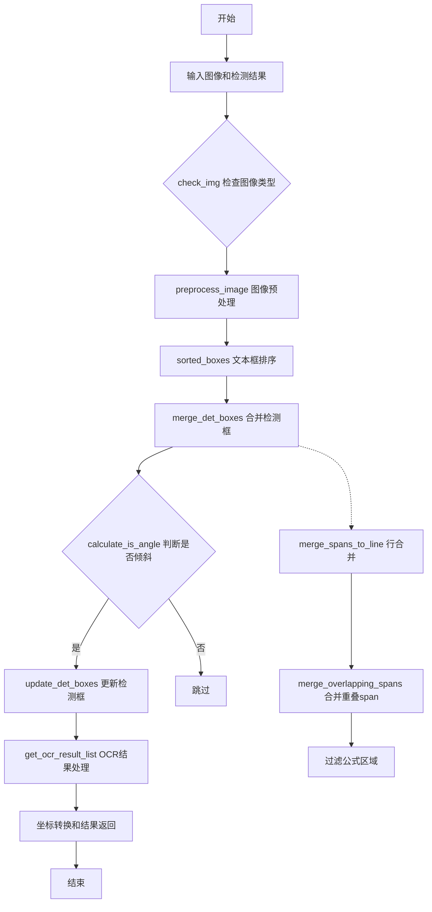
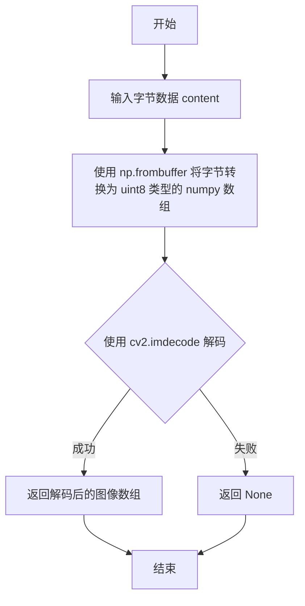
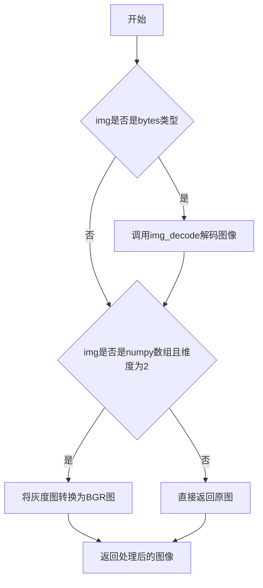
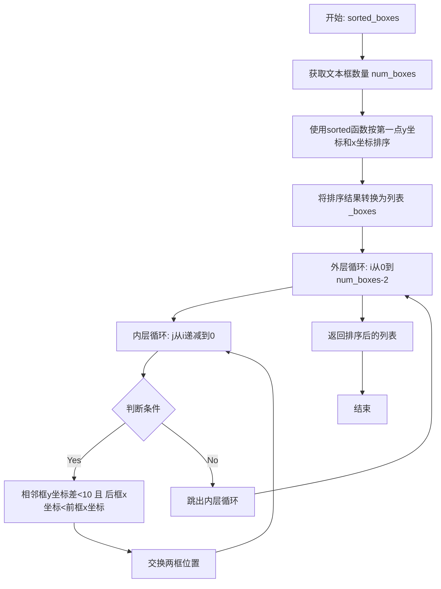
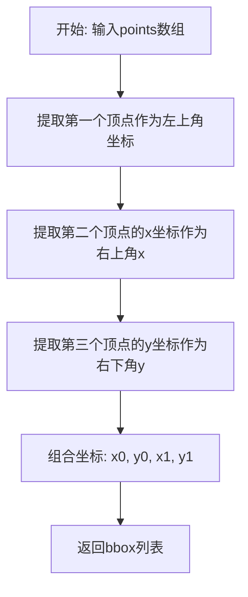
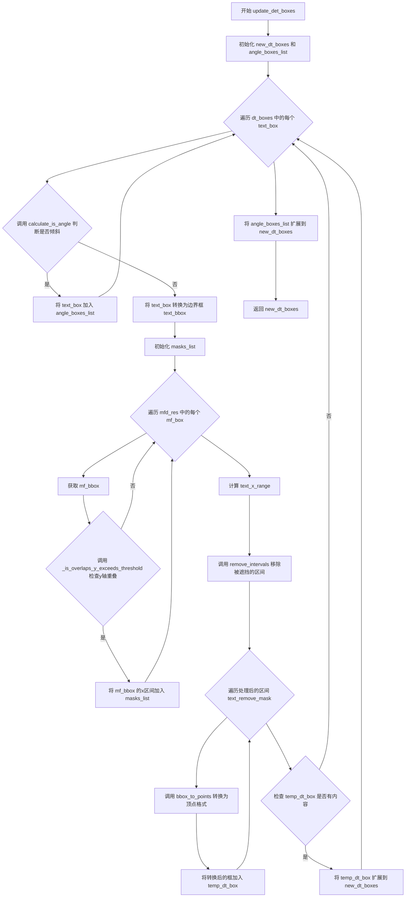

# `MinerU\mineru\utils\ocr_utils.py` 详细设计文档

该文件是一个OCR图像处理工具库，主要用于图像中文本检测框的预处理、排序、合并和坐标转换，以及对文本区域的OCR结果进行后处理，支持文本行合并、重叠区间处理、数学公式区域排除、图像增强和旋转裁剪等功能。

## 整体流程



## 类结构

```
OcrConfidence (配置类)
├── min_confidence (类属性)
└── min_width (类属性)

全局函数模块 (无继承层次)
├── 图像处理函数群
│   ├── img_decode
│   ├── check_img
│   ├── alpha_to_color
│   ├── preprocess_image
│   └── get_rotate_crop_image
├── 坐标转换函数群
│   ├── bbox_to_points
│   ├── points_to_bbox
│   └── sorted_boxes
├── 区间处理函数群
│   ├── merge_intervals
│   └── remove_intervals
├── 检测框处理函数群
│   ├── merge_spans_to_line
│   ├── _is_overlaps_y_exceeds_threshold
│   ├── _is_overlaps_x_exceeds_threshold
│   ├── merge_overlapping_spans
│   ├── merge_det_boxes
│   ├── update_det_boxes
│   └── calculate_is_angle
├── 辅助判断函数群
│   └── is_bbox_aligned_rect
└── 结果处理函数群
    ├── get_adjusted_mfdetrec_res
    └── get_ocr_result_list
```

## 全局变量及字段


### `LINE_WIDTH_TO_HEIGHT_RATIO_THRESHOLD`
    
行宽高比阈值，用于判断是否进行行合并，值为4

类型：`int`
    


### `OcrConfidence.min_confidence`
    
OCR最小置信度阈值，默认0.5

类型：`float`
    


### `OcrConfidence.min_width`
    
文本框最小宽度阈值，默认3像素

类型：`float`
    
    

## 全局函数及方法


### `merge_spans_to_line`

该函数将OCR检测出的文本片段（spans）按照Y轴重叠度进行合并，形成多行文本。它首先按Y轴坐标排序所有spans，然后遍历并检查相邻span之间的Y轴重叠比例是否超过指定阈值，若超过则归入同一行，否则开启新行，最终返回按行分组的二维列表。

参数：

- `spans`：`list`，待合并的span列表，每个span应为包含`bbox`键的字典，bbox格式为`[x0, y0, x1, y1]`
- `threshold`：`float`，Y轴重叠度阈值，默认为0.6，表示重叠区域高度占较矮bbox高度的比例超过该值时视为同一行

返回值：`list`，返回按行分组的span列表，外层列表每项表示一行，内层列表包含该行所有span

#### 流程图

```mermaid
flowchart TD
    A[开始 merge_spans_to_line] --> B{spans 长度为 0?}
    B -->|是| C[返回空列表 []]
    B -->|否| D[按 y0 坐标排序 spans]
    D --> E[初始化 lines 和 current_line]
    E --> F[遍历 spans[1:]]
    F --> G{当前 span 与 current_line[-1] 的 bbox 在 Y 轴重叠度 > threshold?}
    G -->|是| H[将 span 添加到 current_line]
    H --> F
    G -->|否| I[将 current_line 添加到 lines]
    I --> J[开启新行 current_line = [span]]
    J --> F
    F --> K{遍历结束?}
    K -->|否| F
    K --> L[将最后一行 current_line 添加到 lines]
    L --> M[返回 lines]
```

#### 带注释源码

```python
def merge_spans_to_line(spans, threshold=0.6):
    """
    将 spans 按 Y 轴重叠度合并成行
    
    Args:
        spans: span 列表，每个 span 为包含 'bbox' 键的字典，bbox 格式为 [x0, y0, x1, y1]
        threshold: Y 轴重叠度阈值，默认 0.6
    
    Returns:
        按行分组的 span 二维列表
    """
    # 空列表直接返回空列表，避免后续处理空列表导致的异常
    if len(spans) == 0:
        return []
    else:
        # 按 y0 坐标排序，确保 spans 按从上到下顺序排列
        # bbox 格式为 [x0, y0, x1, y1]，y0 为顶部 y 坐标
        spans.sort(key=lambda span: span['bbox'][1])

        # lines 存储所有行，每行是一个 span 列表
        # current_line 存储当前正在处理的行
        lines = []
        current_line = [spans[0]]
        
        # 从第二个 span 开始遍历，检查是否与当前行的最后一个 span 同行
        for span in spans[1:]:
            # 如果当前的 span 与当前行的最后一个 span 在 y 轴上重叠度超过阈值，
            # 则认为是同一行，添加到当前行
            if _is_overlaps_y_exceeds_threshold(span['bbox'], current_line[-1]['bbox'], threshold):
                current_line.append(span)
            else:
                # 否则，当前 span 属于新行，保存当前行并开启新行
                lines.append(current_line)
                current_line = [span]

        # 添加最后一行（如果非空）
        if current_line:
            lines.append(current_line)

        return lines
```


### `_is_overlaps_y_exceeds_threshold`

检查两个边界框在Y轴上是否有重叠，并且该重叠区域的高度占两个边界框高度中较低的那个超过指定的阈值比例（默认80%）。

参数：

- `bbox1`：`list` 或 `tuple`，第一个边界框，格式为 [x0, y0, x1, y1]
- `bbox2`：`list` 或 `tuple`，第二个边界框，格式为 [x0, y0, x1, y1]
- `overlap_ratio_threshold`：`float`，重叠比率阈值，默认为 0.8

返回值：`bool`，如果两个bbox在y轴上的重叠区域高度占较低bbox高度的比例超过阈值返回True，否则返回False

#### 流程图

```mermaid
flowchart TD
    A[开始] --> B[提取bbox1的y坐标: y0_1, y1_1]
    B --> C[提取bbox2的y坐标: y0_2, y1_2]
    C --> D[计算y轴重叠区域高度: overlap = max(0, min(y1_1, y1_2) - max(y0_1, y0_2))]
    D --> E[计算两个bbox的高度: height1 = y1_1 - y0_1, height2 = y1_2 - y0_2]
    E --> F[计算最小高度: min_height = min(height1, height2)]
    F --> G{min_height > 0?}
    G -->|否| H[返回 False]
    G -->|是| I[计算重叠比率: ratio = overlap / min_height]
    I --> J{ratio > overlap_ratio_threshold?}
    J -->|是| K[返回 True]
    J -->|否| L[返回 False]
```

#### 带注释源码

```python
def _is_overlaps_y_exceeds_threshold(bbox1,
                                     bbox2,
                                     overlap_ratio_threshold=0.8):
    """检查两个bbox在y轴上是否有重叠，并且该重叠区域的高度占两个bbox高度更低的那个超过80%"""
    # 提取第一个bbox的y坐标 (y0:上边界, y1:下边界)
    _, y0_1, _, y1_1 = bbox1
    # 提取第二个bbox的y坐标 (y0:上边界, y1:下边界)
    _, y0_2, _, y1_2 = bbox2

    # 计算y轴方向的重叠区域高度
    # 重叠区域 = min(bbox1下边界, bbox2下边界) - max(bbox1上边界, bbox2上边界)
    # 使用max(0, ...)确保重叠高度不为负值
    overlap = max(0, min(y1_1, y1_2) - max(y0_1, y0_2))
    
    # 计算两个bbox的高度
    height1, height2 = y1_1 - y0_1, y1_2 - y0_2
    # 获取两个高度中的最小值
    # max_height = max(height1, height2)  # 当前未使用
    min_height = min(height1, height2)

    # 如果最小高度大于0，则计算重叠比率并与阈值比较
    # 重叠比率 = 重叠区域高度 / 较小bbox的高度
    return (overlap / min_height) > overlap_ratio_threshold if min_height > 0 else False
```


### `_is_overlaps_x_exceeds_threshold`

检查两个边界框（Bounding Box）在X轴上是否有重叠，并且该重叠区域的宽度占两个边界框宽度中较小的那个超过指定阈值。

参数：
- `bbox1`：`list` 或 `tuple`，第一个边界框，格式为 `[x0, y0, x1, y1]`
- `bbox2`：`list` 或 `tuple`，第二个边界框，格式为 `[x0, y0, x1, y1]`
- `overlap_ratio_threshold`：`float`，可选参数，默认为 `0.8`，表示重叠比例阈值

返回值：`bool`，如果两个边界框在X轴上的重叠宽度占较窄边界框宽度的比例超过阈值则返回 `True`，否则返回 `False`

#### 流程图

```mermaid
flowchart TD
    A[开始] --> B[从bbox1提取x0_1, x1_1]
    B --> C[从bbox2提取x0_2, x1_2]
    C --> D[计算重叠区域宽度: overlap = max(0, min(x1_1, x1_2) - max(x0_1, x0_2))]
    D --> E[计算两个bbox的宽度: width1 = x1_1 - x0_1, width2 = x1_2 - x0_2]
    E --> F[计算最小宽度: min_width = min(width1, width2)]
    F --> G{min_width > 0?}
    G -->|否| H[返回 False]
    G -->|是| I[计算重叠比例: overlap_ratio = overlap / min_width]
    I --> J{overlap_ratio > overlap_ratio_threshold?}
    J -->|是| K[返回 True]
    J -->|否| L[返回 False]
```

#### 带注释源码

```python
def _is_overlaps_x_exceeds_threshold(bbox1,
                                     bbox2,
                                     overlap_ratio_threshold=0.8):
    """检查两个bbox在x轴上是否有重叠，并且该重叠区域的宽度占两个bbox宽度更低的那个超过指定阈值"""
    # 从第一个bbox中提取x轴坐标 (x0_1, x1_1)
    x0_1, _, x1_1, _ = bbox1
    # 从第二个bbox中提取x轴坐标 (x0_2, x1_2)
    x0_2, _, x1_2, _ = bbox2

    # 计算x轴方向的重叠区域宽度
    # 重叠区域 = 两个区间交集的宽度，使用 max(0, ...) 确保不会得到负值
    overlap = max(0, min(x1_1, x1_2) - max(x0_1, x0_2))
    
    # 计算两个bbox各自的宽度
    width1, width2 = x1_1 - x0_1, x1_2 - x0_2
    # 取两个宽度中的最小值作为参考
    min_width = min(width1, width2)

    # 如果最小宽度大于0，计算重叠比例并与阈值比较
    # 否则返回 False（避免除零错误）
    return (overlap / min_width) > overlap_ratio_threshold if min_width > 0 else False
```


### `img_decode`

将字节内容解码为numpy图像数组，支持包括alpha通道在内的多种图像格式。

参数：

-  `content`：`bytes`，待解码的图像字节数据

返回值：`numpy.ndarray`，解码后的图像数组（可能包含alpha通道）

#### 流程图



#### 带注释源码

```python
def img_decode(content: bytes):
    """
    将字节内容解码为numpy图像数组
    
    该函数接收图像的字节数据，使用numpy将其转换为数组，
    然后使用OpenCV的imdecode进行解码，支持包括alpha通道在内的图像格式。
    
    Args:
        content: 图像的字节数据，例如从文件读取的二进制内容
        
    Returns:
        numpy.ndarray: 解码后的图像数组。如果解码失败，返回None
    """
    # 将字节数据转换为uint8类型的numpy数组
    # np.frombuffer 直接从缓冲区读取数据，创建一个一维数组
    np_arr = np.frombuffer(content, dtype=np.uint8)
    
    # 使用OpenCV解码图像
    # cv2.IMREAD_UNCHANGED 保持原样，包括alpha通道（如果有）
    # 等同于 cv2.IMREAD_COLOR | cv2.IMREAD_ANYDEPTH | cv2.IMREAD_ANYCOLOR
    return cv2.imdecode(np_arr, cv2.IMREAD_UNCHANGED)
```


### `check_img`

该函数用于检查并转换图像格式，确保输出为BGR格式。如果输入是字节类型的图像数据，则先解码为NumPy数组；如果是灰度图像，则自动转换为三通道BGR彩色图像。

参数：

- `img`：`bytes` 或 `np.ndarray`，输入图像数据，可以是字节流（图像编码数据）或NumPy数组（已解码的图像）

返回值：`np.ndarray`，返回处理后的BGR格式图像数据

#### 流程图



#### 带注释源码

```python
def check_img(img):
    # 检查输入是否为字节类型（如PNG、JPEG等编码格式）
    if isinstance(img, bytes):
        # 调用img_decode函数将字节数据解码为NumPy数组
        img = img_decode(img)
    
    # 检查输入是否为灰度图像（2维数组表示灰度图）
    if isinstance(img, np.ndarray) and len(img.shape) == 2:
        # 将灰度图像转换为3通道BGR彩色图像
        img = cv2.cvtColor(img, cv2.COLOR_GRAY2BGR)
    
    # 返回处理后的BGR格式图像
    return img
```


### `alpha_to_color`

将带alpha通道的图像（BGRA）合成到指定颜色的背景上，输出RGB格式的图像。如果输入图像没有alpha通道，则直接返回原图像。

参数：

- `img`：`np.ndarray`，输入的BGRA图像数组
- `alpha_color`：`tuple`，背景颜色，默认为 (255, 255, 255) 表示白色

返回值：`np.ndarray`，合成后的RGB图像数组

#### 流程图

```mermaid
flowchart TD
    A[开始] --> B{检查图像是否有4通道}
    B -->|是| C[分离B, G, R, A通道]
    B -->|否| H[直接返回原图像]
    
    C --> D[计算alpha权重<br/>alpha = A / 255]
    D --> E[分别对R, G, B通道进行混合]
    E --> F[R = alpha_color[0] × (1 - alpha) + R × alpha]
    E --> G[G = alpha_color[1] × (1 - alpha) + G × alpha]
    E --> I[B = alpha_color[2] × (1 - alpha) + B × alpha]
    
    F --> J[合并B, G, R通道为RGB图像]
    G --> J
    I --> J
    J --> K[返回合成后的图像]
    H --> K
```

#### 带注释源码

```python
def alpha_to_color(img, alpha_color=(255, 255, 255)):
    """
    将带alpha通道的图像合成到指定颜色背景上
    
    参数:
        img: np.ndarray, 输入的BGRA图像数组
        alpha_color: tuple, 背景颜色，默认为(255, 255, 255)白色
    
    返回:
        np.ndarray, 合成后的RGB图像数组
    """
    # 检查图像是否为3通道且第4通道为alpha通道（即4通道BGRA图像）
    if len(img.shape) == 3 and img.shape[2] == 4:
        # 分离图像的B、G、R、A四个通道
        B, G, R, A = cv2.split(img)
        # 将alpha值从0-255归一化到0-1范围
        alpha = A / 255

        # 根据alpha值混合背景色和原图像颜色
        # 公式: result = background * (1 - alpha) + foreground * alpha
        # 这实现了透明度合成：alpha=0时完全显示背景色，alpha=1时完全显示原图像
        R = (alpha_color[0] * (1 - alpha) + R * alpha).astype(np.uint8)
        G = (alpha_color[1] * (1 - alpha) + G * alpha).astype(np.uint8)
        B = (alpha_color[2] * (1 - alpha) + B * alpha).astype(np.uint8)

        # 重新合并为BGR三通道图像（OpenCV使用BGR格式）
        img = cv2.merge((B, G, R))
    
    # 如果没有alpha通道，直接返回原图像
    return img
```


### `preprocess_image`

该函数是图像预处理的入口函数，主要用于将带透明度通道（Alpha通道）的图像转换为标准RGB三通道图像，并将透明背景填充为白色，以便后续的OCR识别流程能够正确处理。

参数：

- `_image`：`numpy.ndarray`，输入的图像数据，可能是灰度图、RGB图或带Alpha通道的RGBA图

返回值：`numpy.ndarray`，处理后的RGB三通道图像，透明背景已被填充为白色

#### 流程图

```mermaid
graph TD
    A[开始: 输入图像 _image] --> B[设置白色背景色: alpha_color = (255, 255, 255)]
    B --> C[调用 alpha_to_color 函数]
    C --> D{检查图像是否有Alpha通道}
    D -->|是(4通道)| E[分离BGR和Alpha通道]
    E --> F[计算Alpha混合权重: alpha = A / 255]
    F --> G[逐通道混合: R = alpha_color[0]*(1-alpha) + R*alpha]
    G --> H[合并RGB通道]
    H --> I[返回处理后的图像]
    D -->|否(非4通道)| I
    I --> J[结束: 返回 _image]
```

#### 带注释源码

```python
def preprocess_image(_image):
    """
    图像预处理函数，将带透明度通道的图像转换为RGB图像
    
    该函数是OCR识别流程的预处理环节，调用alpha_to_color函数
    将RGBA格式的图像转换为RGB格式，并将透明区域填充为白色背景
    """
    # 定义白色背景色值 (R, G, B)
    alpha_color = (255, 255, 255)
    
    # 调用alpha_to_color函数进行透明度通道处理
    # 如果图像没有Alpha通道，该函数会直接返回原图
    _image = alpha_to_color(_image, alpha_color)
    
    # 返回处理后的图像
    return _image
```


### `sorted_boxes`

该函数实现文本框从上到下、从左到右的排序功能。首先按第一点的(y, x)坐标进行初步排序，然后使用冒泡排序思想对同一行的文本框进行左右顺序调整，确保行内文本框按x坐标从左到右排列。

参数：
- `dt_boxes`：`numpy.ndarray`，检测到的文本框，形状为 [N, 4, 2]，其中N为文本框数量，每个文本框包含4个顶点坐标

返回值：`list`，排序后的文本框列表，元素为numpy.ndarray，形状为 [4, 2]

#### 流程图



#### 带注释源码

```
def sorted_boxes(dt_boxes):
    """
    Sort text boxes in order from top to bottom, left to right
    args:
        dt_boxes(array):detected text boxes with shape [4, 2]
    return:
        sorted boxes(array) with shape [4, 2]
    """
    # 获取文本框的数量
    num_boxes = dt_boxes.shape[0]
    
    # 第一次排序：按第一点(box[0])的(y坐标, x坐标)进行排序
    # 先按y坐标排序，再按x坐标排序，实现从上到下、从左到右的初步排序
    sorted_boxes = sorted(dt_boxes, key=lambda x: (x[0][1], x[0][0]))
    
    # 将排序后的numpy数组转换为列表，便于后续交换操作
    _boxes = list(sorted_boxes)

    # 冒泡排序：确保同一行内的文本框按x坐标从左到右排列
    # 外层循环控制已排序好的元素边界
    for i in range(num_boxes - 1):
        # 内层循环从后向前扫描，比较相邻元素
        for j in range(i, -1, -1):
            # 判断条件：
            # 1. 相邻两个框的第一点y坐标差小于10（认为在同一行）
            # 2. 后一个框的x坐标小于前一个框的x坐标（需要交换左右顺序）
            if abs(_boxes[j + 1][0][1] - _boxes[j][0][1]) < 10 and \
                    (_boxes[j + 1][0][0] < _boxes[j][0][0]):
                # 交换两个框的位置
                tmp = _boxes[j]
                _boxes[j] = _boxes[j + 1]
                _boxes[j + 1] = tmp
            else:
                # 如果不满足交换条件，说明顺序已经正确，跳出内层循环
                break
    
    # 返回排序后的文本框列表
    return _boxes
```


### `bbox_to_points`

该函数将边界框（bbox）格式转换为四个顶点坐标的数组，用于表示一个矩形区域的四个角点坐标，常用于图像处理和目标检测中坐标格式的相互转换。

参数：

- `bbox`：`list` 或 `tuple`，边界框坐标，格式为 `[x0, y0, x1, y1]`，其中 (x0, y0) 为左上角坐标，(x1, y1) 为右下角坐标

返回值：`numpy.ndarray`，形状为 (4, 2) 的浮点型数组，包含四个顶点坐标 `[[x0, y0], [x1, y0], [x1, y1], [x0, y1]]`，依次为左上、右上、右下、左下角点

#### 流程图

```mermaid
flowchart TD
    A[开始 bbox_to_points] --> B[输入 bbox = [x0, y0, x1, y1]]
    B --> C[解包 bbox 得到 x0, y0, x1, y1]
    C --> D[构建顶点数组<br/>[[x0, y0], [x1, y0], [x1, y1], [x0, y1]]]
    D --> E[转换为 float32 类型]
    E --> F[返回 4x2 numpy 数组]
    F --> G[结束]
    
    style A fill:#f9f,color:#333
    style G fill:#9f9,color:#333
```

#### 带注释源码

```python
def bbox_to_points(bbox):
    """
    将bbox格式转换为四个顶点的数组
    
    参数:
        bbox: 边界框坐标，格式为 [x0, y0, x1, y1]
            - x0: 左上角 x 坐标
            - y0: 左上角 y 坐标
            - x1: 右下角 x 坐标
            - y1: 右下角 y 坐标
    
    返回:
        numpy.ndarray: 形状为 (4, 2) 的数组，包含四个顶点坐标
            - 第0行: 左上角 [x0, y0]
            - 第1行: 右上角 [x1, y0]
            - 第2行: 右下角 [x1, y1]
            - 第3行: 左下角 [x0, y1]
    """
    # 从输入的 bbox 中解包出四个坐标值
    x0, y0, x1, y1 = bbox
    
    # 构建四个顶点的坐标数组
    # 按顺序排列: 左上 -> 右上 -> 右下 -> 左下 (顺时针)
    points_array = np.array([
        [x0, y0],  # 左上角顶点
        [x1, y0],  # 右上角顶点
        [x1, y1],  # 右下角顶点
        [x0, y1]   # 左下角顶点
    ])
    
    # 转换为 float32 类型以满足后续图像处理的需求
    return points_array.astype('float32')
```


### `points_to_bbox(points)`

将四个顶点的坐标数组转换为边界框（Bounding Box）格式。该函数接受一个包含四个顶点坐标的数组，每个顶点由 [x, y] 组成，按照左上、右上、右下、左下的顺序排列，输出为标准的目标检测边界框格式 [x0, y0, x1, y1]，其中 (x0, y0) 为左上角坐标，(x1, y1) 为右下角坐标。

参数：

- `points`：list 或 numpy array，四个顶点的坐标数组，格式为 [[x0, y0], [x1, y1], [x2, y2], [x3, y3]]，通常按顺时针或逆时针顺序排列

返回值：`list`，边界框坐标 [x0, y0, x1, y1]，其中 x0 和 y0 分别表示左上角的 x 和 y 坐标，x1 和 y1 分别表示右下角的 x 和 y 坐标

#### 流程图



#### 带注释源码

```python
def points_to_bbox(points):
    """ 将四个顶点的数组转换为bbox格式 """
    # 从points数组中提取第一个顶点 (points[0]) 的 x0 和 y0 坐标
    # 这个顶点被认为是矩形的左上角
    x0, y0 = points[0]
    
    # 提取第二个顶点 (points[1]) 的 x 坐标作为边界框的右上角 x 坐标
    # 忽略该顶点的 y 坐标，因为我们需要的是 x1
    x1, _ = points[1]
    
    # 提取第三个顶点 (points[2]) 的 y 坐标作为边界框的右下角 y 坐标
    # 忽略该顶点的 x 坐标，因为 x1 已经从上一个顶点获取
    _, y1 = points[2]
    
    # 返回标准的边界框格式 [x0, y0, x1, y1]
    # x0, y0: 左上角坐标
    # x1, y1: 右下角坐标
    return [x0, y0, x1, y1]
```


### `merge_intervals`

该函数用于合并重叠的区间，将多个可能存在交叉的区间列表合并成互不重叠的区间集合，常用于处理OCR文本检测中的文本块坐标或时间段等场景。

参数：

- `intervals`：`List[List[int]]`（或 `List[Tuple[int, int]]`），需要合并的区间列表，每个区间为 `[start, end]` 形式的二维列表/元组，其中 start 和 end 均为整数

返回值：`List[List[int]]`，合并后的区间列表，返回的区间按起始值升序排列，且区间之间互不重叠

#### 流程图

```mermaid
flowchart TD
    A[开始 merge_intervals] --> B{intervals 是否为空}
    B -->|是| C[返回空列表]
    B -->|否| D[按区间起始值排序 intervals]
    D --> E[初始化空列表 merged]
    E --> F[遍历 intervals 中的每个 interval]
    F --> G{merged 为空 或<br/>merged[-1][1] < interval[0]}
    G -->|是| H[将当前 interval 添加到 merged]
    G -->|否| I[存在重叠，合并区间]
    I --> J[merged[-1][1] = max(merged[-1][1], interval[1])]
    H --> K{是否还有未处理的 interval}
    J --> K
    K -->|是| F
    K -->|否| L[返回 merged]
    
    style A fill:#f9f,stroke:#333
    style L fill:#9f9,stroke:#333
```

#### 带注释源码

```python
def merge_intervals(intervals):
    """
    合并重叠的区间
    
    参数:
        intervals: 需要合并的区间列表，每个区间为 [start, end] 形式
                   例如: [[1, 3], [2, 6], [8, 10], [15, 18]]
    
    返回:
        合并后的区间列表，区间按起始值升序排列且互不重叠
        例如: [[1, 6], [8, 10], [15, 18]]
    """
    # 步骤1: 按照区间的起始值进行排序
    # 这一步是关键，因为后续的合并逻辑依赖于区间已经按起始值排序
    intervals.sort(key=lambda x: x[0])

    # 步骤2: 初始化合并后的区间列表
    merged = []
    
    # 步骤3: 遍历每个区间
    for interval in intervals:
        # 如果 merged 为空，或者当前区间与上一个合并区间不重叠
        # (判断条件: 上一个区间的结束值 < 当前区间的起始值)
        if not merged or merged[-1][1] < interval[0]:
            # 直接将当前区间添加到结果列表
            merged.append(interval)
        else:
            # 步骤4: 存在重叠，合并区间
            # 取两个区间结束值的较大者，更新上一个合并区间的结束值
            merged[-1][1] = max(merged[-1][1], interval[1])

    # 步骤5: 返回合并后的区间列表
    return merged
```

---

#### 关键特性说明

| 特性 | 说明 |
|------|------|
| 时间复杂度 | O(n log n)，主要来自排序操作，遍历合并操作只需 O(n) |
| 空间复杂度 | O(n)，用于存储合并后的区间列表 |
| 原地修改 | 输入的 intervals 列表会被排序修改（如果不想修改原列表，应传入副本） |
| 边界情况 | 空列表返回空列表；单个区间直接返回；完全重叠的区间会合并为一个 |


### `remove_intervals`

该函数用于从原始区间（original）中移除被遮罩区间（masks）覆盖的部分，返回剩余的区间列表。

参数：
- `original`：`list`，原始区间，格式为 `[start, end]`，表示要处理的原始区间范围
- `masks`：`list`，遮罩区间列表，格式为 `[[start1, end1], [start2, end2], ...]`，每个元素表示一个需要移除的区间

返回值：`list`，返回处理后的区间列表，格式为 `[[start1, end1], [start2, end2], ...]`

#### 流程图

```mermaid
flowchart TD
    A[开始] --> B[合并所有遮罩区间 merged_masks = merge_intervals(masks)]
    B --> C[从 original 中提取起始和结束位置 original_start, original_end]
    C --> D[初始化结果列表 result = []]
    D --> E{遍历 merged_masks 中的每个 mask}
    E -->|是| F[提取 mask_start, mask_end]
    F --> G{mask_start > original_end?}
    G -->|是| H[跳过当前 mask, 继续下一个]
    G -->|否| I{mask_end < original_start?}
    I -->|是| H
    I -->|否| J{original_start < mask_start?}
    J -->|是| K[添加区间 [original_start, mask_start-1] 到 result]
    J -->|否| L[更新 original_start = max(mask_end + 1, original_start)]
    K --> L
    H --> M{是否还有更多 mask?}
    M -->|是| E
    M -->|否| N{original_start <= original_end?}
    N -->|是| O[添加区间 [original_start, original_end] 到 result]
    N -->|否| P[返回 result]
    O --> P
```

#### 带注释源码

```python
def remove_intervals(original, masks):
    """
    从原始区间中移除被遮罩覆盖的部分
    
    参数:
        original: 原始区间, 格式为 [start, end]
        masks: 遮罩区间列表, 格式为 [[start1, end1], [start2, end2], ...]
    
    返回:
        处理后的区间列表
    """
    # 1. 首先合并所有遮罩区间,处理区间重叠的情况
    merged_masks = merge_intervals(masks)

    # 2. 初始化结果列表
    result = []
    
    # 3. 解构原始区间,获取起始和结束位置
    original_start, original_end = original

    # 4. 遍历每个合并后的遮罩区间
    for mask in merged_masks:
        mask_start, mask_end = mask

        # 如果遮罩区间在原始区间之后,直接忽略
        if mask_start > original_end:
            continue

        # 如果遮罩区间在原始区间之前,也忽略
        if mask_end < original_start:
            continue

        # 5. 如果遮罩区间之前还有空间,则保留该部分
        # 即:原始区间起始位置 < 遮罩区间起始位置
        if original_start < mask_start:
            # 添加从原始起始到遮罩起始前一个位置的区间
            result.append([original_start, mask_start - 1])

        # 6. 更新原始区间的起始位置为遮罩结束位置+1
        # 取max是为了确保不会向后回溯
        original_start = max(mask_end + 1, original_start)

    # 7. 处理剩余部分
    # 如果处理后仍有剩余区间,则添加到结果中
    if original_start <= original_end:
        result.append([original_start, original_end])

    # 8. 返回最终结果
    return result
```


### `update_det_boxes`

该函数根据公式检测结果（mfd_res）更新文本检测框，通过检测文本框与公式框在y轴上的重叠关系，将被公式遮挡的文本区域进行切分，最终返回处理后的文本检测框列表，同时保留倾斜文本框。

参数：

-  `dt_boxes`：List[np.ndarray]，文本检测框列表，每个元素为4个顶点坐标组成的数组
-  `mfd_res`：List[Dict]，公式检测结果列表，每个元素包含 'bbox' 键表示公式的边界框

返回值：`List[np.ndarray]`，处理后的文本检测框列表

#### 流程图



#### 带注释源码

```python
def update_det_boxes(dt_boxes, mfd_res):
    """
    根据公式检测结果更新文本检测框
    
    该函数的主要目的是将文本检测框中被公式（数学公式/文本）遮挡的部分进行切分处理。
    处理逻辑：
    1. 首先识别并分离倾斜的文本框（angle_boxes），这些框不参与切分处理
    2. 对于正常文本框，检测其与公式框在y轴上的重叠关系
    3. 根据公式框的x轴区间，计算需要从文本框中移除的区间
    4. 将文本框切分为多个不包含公式区域的子框
    5. 最后将处理后的框与倾斜框合并返回
    
    Args:
        dt_boxes: 文本检测框列表，每个元素为4个顶点坐标 [4,2] 的numpy数组
        mfd_res: 公式检测结果列表，每个元素为 {'bbox': [x0, y0, x1, y1]}
    
    Returns:
        new_dt_boxes: 处理后的文本检测框列表
    """
    # 存储处理后的文本检测框
    new_dt_boxes = []
    # 存储倾斜的文本框（不参与切分处理）
    angle_boxes_list = []
    
    # 遍历每一个文本检测框
    for text_box in dt_boxes:
        # 判断当前文本框是否为倾斜状态（与x轴夹角超过阈值）
        if calculate_is_angle(text_box):
            # 倾斜框直接保留，不进行切分处理
            angle_boxes_list.append(text_box)
            continue
        
        # 将文本框的顶点格式转换为边界框格式 [x0, y0, x1, y1]
        text_bbox = points_to_bbox(text_box)
        
        # 存储与当前文本框y轴重叠的公式框的x轴区间（用于遮罩）
        masks_list = []
        
        # 遍历所有公式检测结果
        for mf_box in mfd_res:
            # 获取公式框的边界框
            mf_bbox = mf_box['bbox']
            
            # 检查文本框与公式框在y轴上是否有重叠
            if _is_overlaps_y_exceeds_threshold(text_bbox, mf_bbox):
                # 将公式框的x轴区间 [x0, x1] 作为遮罩区间
                masks_list.append([mf_bbox[0], mf_bbox[2]])
        
        # 计算文本框的x轴范围
        text_x_range = [text_bbox[0], text_bbox[2]]
        
        # 移除被公式遮挡的区间，得到处理后的区间列表
        # 例如：文本框x范围 [0, 100]，公式遮挡区间 [[30, 50], [70, 80]]
        # 结果将返回 [[0, 29], [51, 69], [81, 100]]
        text_remove_mask_range = remove_intervals(text_x_range, masks_list)
        
        # 存储当前文本框切分后的子框
        temp_dt_box = []
        
        # 遍历每个处理后的区间，转换为文本检测框格式
        for text_remove_mask in text_remove_mask_range:
            # 使用区间端点和原文本框的y坐标构造新的边界框
            # 并转换为4个顶点的格式
            temp_dt_box.append(bbox_to_points([
                text_remove_mask[0],  # 新x0
                text_bbox[1],          # 原y0（保持不变）
                text_remove_mask[1],  # 新x1
                text_bbox[3]           # 原y1（保持不变）
            ]))
        
        # 如果有切分后的子框，则添加到结果列表
        if len(temp_dt_box) > 0:
            new_dt_boxes.extend(temp_dt_box)
    
    # 最后将倾斜的文本框添加到结果中（保持原位置）
    new_dt_boxes.extend(angle_boxes_list)
    
    return new_dt_boxes
```


### `merge_overlapping_spans`

该函数用于合并同一行上重叠的文本区域。它接受一个包含多个span坐标的列表，通过按x坐标排序后遍历，比较当前span与已合并列表中最后一个span是否存在水平重叠。若有重叠，则合并为一个更大的span（取最小的左上坐标和最大的右下坐标）；若无重叠或列表为空，则直接将当前span添加到结果列表中。最终返回合并后的span列表。

参数：

- `spans`：`List[Tuple[int, int, int, int]]`，包含多个span坐标的列表，每个span是一个四元组 (x1, y1, x2, y2)，分别表示左上角和右下角的坐标

返回值：`List[Tuple[int, int, int, int]]`，合并后的span坐标列表

#### 流程图

```mermaid
flowchart TD
    A[开始] --> B{spans是否为空}
    B -->|是| C[返回空列表]
    B -->|否| D[按x1坐标排序spans]
    D --> E[初始化merged列表]
    E --> F{遍历spans中的每个span}
    F --> G{当前span与merged[-1]是否有水平重叠}
    G -->|否| H[直接将span添加到merged]
    H --> F
    G -->|是| I[弹出merged[-1]]
    I --> J[计算合并后的新坐标: x1=min, y1=min, x2=max, y2=max]
    J --> K[将合并后的span添加到merged]
    K --> F
    F --> L{遍历完成?}
    L -->|否| F
    L -->|是| M[返回merged列表]
```

#### 带注释源码

```python
def merge_overlapping_spans(spans):
    """
    Merges overlapping spans on the same line.

    :param spans: A list of span coordinates [(x1, y1, x2, y2), ...]
    :return: A list of merged spans
    """
    # Return an empty list if the input spans list is empty
    if not spans:
        return []

    # Sort spans by their starting x-coordinate
    # 按x1坐标排序，确保从左到右处理每个span
    spans.sort(key=lambda x: x[0])

    # Initialize the list of merged spans
    merged = []
    for span in spans:
        # Unpack span coordinates
        x1, y1, x2, y2 = span
        # If the merged list is empty or there's no horizontal overlap, add the span directly
        # 如果merged为空，或者当前span的x1大于merged中最后一个span的x2（即无水平重叠），则直接添加
        if not merged or merged[-1][2] < x1:
            merged.append(span)
        else:
            # If there is horizontal overlap, merge the current span with the previous one
            # 存在水平重叠，弹出最后一个span进行合并
            last_span = merged.pop()
            # Update the merged span's top-left corner to the smaller (x1, y1) and bottom-right to the larger (x2, y2)
            # 合并原则：取两个span的最小x1和y1作为新span的左上角，取最大x2和y2作为右下角
            x1 = min(last_span[0], x1)
            y1 = min(last_span[1], y1)
            x2 = max(last_span[2], x2)
            y2 = max(last_span[3], y2)
            # Add the merged span back to the list
            merged.append((x1, y1, x2, y2))

    # Return the list of merged spans
    return merged
```


### `merge_det_boxes`

合并检测到的文本框为更大的文本区域。该函数接收一组检测到的文本框（每个由四个角点表示），首先将它们分类为角度框和非角度框，然后将非角度框按行分组，对于宽度超过高度4倍的行进行跨距合并，最后返回合并后的文本区域列表。

参数：

-  `dt_boxes`：`list`，包含多个文本检测框的列表，每个框由四个角点定义

返回值：`list`，包含合并后的文本区域列表，每个区域由四个角点表示

#### 流程图

```mermaid
flowchart TD
    A[开始 merge_det_boxes] --> B[初始化 dt_boxes_dict_list 和 angle_boxes_list]
    B --> C{遍历 dt_boxes 中的每个 text_box}
    C --> D[将 text_box 转换为 bbox 格式]
    D --> E{calculate_is_angle(text_box)}
    E -->|是角度框| F[添加到 angle_boxes_list, 继续下一个]
    E -->|不是角度框| G[创建 text_box_dict, 添加到 dt_boxes_dict_list]
    F --> C
    G --> C
    C -->|遍历完成| H[调用 merge_spans_to_line 合并为行]
    H --> I[初始化 new_dt_boxes]
    I --> J{遍历 lines 中的每一行}
    J --> K[提取该行所有 bbox 到 line_bbox_list]
    K --> L[计算行的 min_x, max_x, min_y, max_y]
    L --> M[计算 line_width 和 line_height]
    M --> N{line_width > line_height * 4}
    N -->|是| O[调用 merge_overlapping_spans 合并重叠跨距]
    O --> P[将合并后的 span 转换为角点格式, 添加到 new_dt_boxes]
    N -->|否| Q[将原始 bbox 转换为角点格式, 添加到 new_dt_boxes]
    P --> J
    Q --> J
    J -->|所有行处理完成| R[将 angle_boxes_list 添加到 new_dt_boxes]
    R --> S[返回 new_dt_boxes]
```

#### 带注释源码

```python
def merge_det_boxes(dt_boxes):
    """
    Merge detection boxes.

    This function takes a list of detected bounding boxes, each represented by four corner points.
    The goal is to merge these bounding boxes into larger text regions.

    Parameters:
    dt_boxes (list): A list containing multiple text detection boxes, where each box is defined by four corner points.

    Returns:
    list: A list containing the merged text regions, where each region is represented by four corner points.
    """
    # 步骤1: 将检测框转换为字典格式，区分角度框和普通框
    # Convert the detection boxes into a dictionary format with bounding boxes and type
    dt_boxes_dict_list = []  # 用于存储普通文本框的字典列表
    angle_boxes_list = []    # 用于存储角度框（倾斜的文本框）
    
    # 遍历每个文本检测框
    for text_box in dt_boxes:
        # 将角点格式转换为bbox格式 (x0, y0, x1, y1)
        text_bbox = points_to_bbox(text_box)

        # 判断是否为角度框（倾斜的文本）
        if calculate_is_angle(text_box):
            # 角度框直接添加到角度框列表，不参与合并
            angle_boxes_list.append(text_box)
            continue

        # 普通框构建字典并添加到列表
        text_box_dict = {'bbox': text_bbox}
        dt_boxes_dict_list.append(text_box_dict)

    # 步骤2: 将相邻的文本区域合并成行
    # 根据Y轴重叠将span合并为行
    lines = merge_spans_to_line(dt_boxes_dict_list)

    # 步骤3: 处理每一行，根据宽高比决定是否合并
    # Initialize a new list for storing the merged text regions
    new_dt_boxes = []
    
    # 遍历每一行
    for line in lines:
        # 提取该行所有span的bbox
        line_bbox_list = []
        for span in line:
            line_bbox_list.append(span['bbox'])

        # 计算整行的边界框
        min_x = min(bbox[0] for bbox in line_bbox_list)
        max_x = max(bbox[2] for bbox in line_bbox_list)
        min_y = min(bbox[1] for bbox in line_bbox_list)
        max_y = max(bbox[3] for bbox in line_bbox_list)
        
        # 计算行宽度和高度
        line_width = max_x - min_x
        line_height = max_y - min_y

        # 只有当行宽度超过高度4倍时才进行合并
        # 这是一个启发式规则，用于判断是否为横向文本块
        if line_width > line_height * LINE_WIDTH_TO_HEIGHT_RATIO_THRESHOLD:
            # 步骤3a: 合并同一行内的重叠文本区域
            # Merge overlapping text regions within the same line
            merged_spans = merge_overlapping_spans(line_bbox_list)

            # 将合并后的文本区域转换回角点格式并添加到结果列表
            for span in merged_spans:
                new_dt_boxes.append(bbox_to_points(span))
        else:
            # 步骤3b: 不进行合并，直接添加原始区域
            # 不满足宽高比条件，保持原始文本框不变
            for bbox in line_bbox_list:
                new_dt_boxes.append(bbox_to_points(bbox))

    # 步骤4: 将角度框添加到结果中
    # 角度框不参与行合并，但需要保留在最终结果中
    new_dt_boxes.extend(angle_boxes_list)

    # 返回合并后的文本区域列表
    return new_dt_boxes
```


### `get_adjusted_mfdetrec_res`

该函数负责将公式检测结果（MFDetRec）的坐标从原始图像空间调整到当前裁剪/处理后的图像空间，并过滤掉超出目标区域范围的检测框。

参数：
- `single_page_mfdetrec_res`：`List[Dict]`，单页图像的公式检测结果列表，每个元素为包含 `'bbox'` 键的字典。
- `useful_list`：`Tuple` 或 `List`，包含图像裁剪和粘贴参数元组，依次为 `paste_x, paste_y, xmin, ymin, xmax, ymax, new_width, new_height`。

返回值：`List[Dict]`，调整坐标并过滤后的公式检测结果列表，每个元素包含调整后的 `'bbox'`。

#### 流程图

```mermaid
graph TD
    A([开始]) --> B[解包 useful_list 获取坐标和尺寸参数]
    B --> C{遍历 single_page_mfdetrec_res}
    C -->|还有检测结果| D[提取当前结果的 bbox: mf_xmin, mf_ymin, mf_xmax, mf_ymax]
    D --> E[计算调整后的坐标: x0, y0, x1, y1]
    E --> F{检查是否越界}
    F -->|是 (x1<0 或 y1<0 或 x0>w 或 y0>h)| C
    F -->|否| G[将调整后的 bbox 添加到结果列表]
    G --> C
    C -->|遍历结束| H([返回调整后的结果列表])
```

#### 带注释源码

```python
def get_adjusted_mfdetrec_res(single_page_mfdetrec_res, useful_list):
    """
    调整公式检测结果的坐标。

    该函数根据提供的裁剪/粘贴参数，将公式检测结果的坐标映射到新的坐标空间，
    并过滤掉完全落在目标区域外的检测框。

    参数:
        single_page_mfdetrec_res (list): 公式检测结果列表。
        useful_list (tuple): 包含粘贴坐标 (paste_x, paste_y) 和裁剪坐标及尺寸 (xmin, ymin, xmax, ymax, new_width, new_height) 的元组。

    返回:
        list: 调整坐标后的公式检测结果列表。
    """
    # 解包参数：paste_x/y 为粘贴偏移量，xmin/ymin 为裁剪起始点，new_width/height 为目标尺寸
    paste_x, paste_y, xmin, ymin, xmax, ymax, new_width, new_height = useful_list
    
    # 初始化调整后的结果列表
    adjusted_mfdetrec_res = []
    
    # 遍历每一个公式检测结果
    for mf_res in single_page_mfdetrec_res:
        # 提取原始包围盒坐标
        mf_xmin, mf_ymin, mf_xmax, mf_ymax = mf_res["bbox"]
        
        # 调整坐标：
        # 1. 减去 xmin/ymin 以移除相对于原始图像的偏移（如果检测结果是基于原始图像的）
        # 2. 加上 paste_x/paste_y 以添加到目标粘贴位置
        x0 = mf_xmin - xmin + paste_x
        y0 = mf_ymin - ymin + paste_y
        x1 = mf_xmax - xmin + paste_x
        y1 = mf_ymax - ymin + paste_y
        
        # 过滤逻辑：移除完全超出目标图像范围的检测框
        # 如果右下角坐标小于0(在左边/上边) 或 左上角坐标大于目标宽高(在右边/下边)，则跳过
        if any([x1 < 0, y1 < 0]) or any([x0 > new_width, y0 > new_height]):
            continue
        else:
            # 保留调整后的结果
            adjusted_mfdetrec_res.append({
                "bbox": [x0, y0, x1, y1],
            })
            
    return adjusted_mfdetrec_res
```


### `get_ocr_result_list`

该函数是OCR后处理的核心逻辑，接收原始OCR检测结果（包含文本框坐标、文本内容、置信度等），通过坐标变换、置信度过滤、宽度过滤、角度纠正等步骤，将结果标准化为包含多边形坐标、置信度、文本内容以及可选的裁剪图像的列表，最终用于后续的文档结构化或可视化展示。

参数：

-  `ocr_res`：`list`，原始OCR检测结果列表。每个元素通常包含文本框的四个顶点坐标以及（可选的）文本和置信度。
-  `useful_list`：`list`，包含图像裁剪和坐标映射所需的8个参数：`[paste_x, paste_y, xmin, ymin, xmax, ymax, new_width, new_height]`。其中`(xmin, ymax)`定义了裁剪区域在原图中的左上角坐标，`(paste_x, paste_y)`定义了目标合成位置。
-  `ocr_enable`：`bool`，布尔标志位。当设为`True`时，函数会对每个文本框进行透视变换以裁剪出清晰的文本图像（`np_img`），这通常用于后续的精确OCR识别或可视化；当设为`False`时，仅处理元数据。
-  `bgr_image`：`numpy.ndarray`，原始的BGR格式图像，用于在`ocr_enable`为真时进行图像裁剪。
-  `lang`：`str`，指定OCR识别使用的语言代码（如"ch", "en"等），仅在`ocr_enable`为真时生效。

返回值：`list`，处理后的OCR结果列表。列表中的每个元素为一个字典，包含以下键值对：
- `category_id`：`int`，类别ID（固定为15，表示文本）。
- `poly`：`list`，文本框的四个顶点坐标在原始图像坐标系下的展开列表 `[x1, y1, x2, y2, x3, y3, x4, y4]`。
- `score`：`float`，置信度得分。
- `text`：`str`，识别到的文本内容。
- `np_img`：`numpy.ndarray`（可选），裁剪后的文本图像，仅当`ocr_enable`为真时存在。
- `lang`：`str`（可选），语言代码，仅当`ocr_enable`为真时存在。

#### 流程图

```mermaid
graph TD
    A([Start get_ocr_result_list]) --> B[Unpack useful_list to get coordinates]
    B --> C[Copy bgr_image to ori_im]
    C --> D{Loop for each box_ocr_res}
    
    D --> E{Is length of box_ocr_res == 2?}
    E -- Yes --> F[Extract points p1-p4, text and score]
    F --> G{Is score < OcrConfidence.min_confidence?}
    G -- Yes --> H[Continue to next]
    G -- No --> I[Check width]
    
    E -- No --> J[Extract points p1-p4, empty text, score=1]
    J --> K{Is ocr_enable True?}
    K -- Yes --> L[Call get_rotate_crop_image to get img_crop]
    K -- No --> I
    
    I --> M{Is width < OcrConfidence.min_width?}
    M -- Yes --> H
    M -- No --> N{Is calculate_is_angle(poly) True?}
    
    N -- Yes --> O[Correct angled box to axis-aligned rect]
    N -- No --> P
    
    O --> P[Convert coordinates to original system: subtract paste offsets, add xmin/ymin]
    
    P --> Q{Is ocr_enable True?}
    Q -- Yes --> R[Append result dict with np_img and lang]
    Q -- No --> S[Append result dict without np_img and lang]
    
    R --> T([Return ocr_result_list])
    S --> T
    
    H --> D
```

#### 带注释源码

```python
def get_ocr_result_list(ocr_res, useful_list, ocr_enable, bgr_image, lang):
    """
    处理OCR结果列表，过滤低置信度结果，纠正角度，并转换坐标到原图坐标系。
    
    参数:
        ocr_res (list): 原始OCR检测结果列表。
        useful_list (list): [paste_x, paste_y, xmin, ymin, xmax, ymax, new_width, new_height] 坐标映射列表。
        ocr_enable (bool): 是否启用图像裁剪。
        bgr_image (numpy.ndarray): 原始BGR图像。
        lang (str): 语言代码。
    
    返回:
        list: 处理后的OCR结果字典列表。
    """
    # 解包坐标变换参数
    # paste_x, paste_y: 裁剪图像在最终输出中的偏移量
    # xmin, ymin, xmax, ymax: 裁剪区域在原图中的左上角和右下角坐标
    paste_x, paste_y, xmin, ymin, xmax, ymax, new_width, new_height = useful_list
    
    ocr_result_list = []
    # 复制原图以避免修改原始输入
    ori_im = bgr_image.copy()
    
    # 遍历每一个OCR检测框
    for box_ocr_res in ocr_res:

        # 判断检测结果格式：长度为2表示包含[顶点坐标, (文本, 置信度)]，长度为4表示仅包含顶点坐标
        if len(box_ocr_res) == 2:
            p1, p2, p3, p4 = box_ocr_res[0]
            text, score = box_ocr_res[1]
            
            # 过滤低置信度结果
            if score < OcrConfidence.min_confidence: 
                continue
        else:
            p1, p2, p3, p4 = box_ocr_res
            text, score = "", 1

            # 如果只是检测框坐标（无文本），且需要启用OCR，则进行图像裁剪
            if ocr_enable:
                # 将坐标转换为float32并深拷贝，防止修改原数据
                tmp_box = copy.deepcopy(np.array([p1, p2, p3, p4]).astype('float32'))
                # 透视变换裁剪出文本区域图像
                img_crop = get_rotate_crop_image(ori_im, tmp_box)

        # 组成多边形点集
        poly = [p1, p2, p3, p4]

        # 过滤宽度太小的检测框（通常不是有效文本）
        if (p3[0] - p1[0]) < OcrConfidence.min_width:
            continue

        # 检查多边形是否与x轴有夹角（倾斜检测），如果有则进行几何纠正（矫正为水平矩形）
        if calculate_is_angle(poly):
            # 计算几何中心
            x_center = sum(point[0] for point in poly) / 4
            y_center = sum(point[1] for point in poly) / 4
            # 重新计算高度和宽度
            new_height = ((p4[1] - p1[1]) + (p3[1] - p2[1])) / 2
            new_width = p3[0] - p1[0]
            # 计算新的四个角点（使其水平）
            p1 = [x_center - new_width / 2, y_center - new_height / 2]
            p2 = [x_center + new_width / 2, y_center - new_height / 2]
            p3 = [x_center + new_width / 2, y_center + new_height / 2]
            p4 = [x_center - new_width / 2, y_center + new_height / 2]

        # 坐标转换：将裁剪后图像的局部坐标转换回原始大图的全局坐标
        # 减去裁剪偏移量(paste)，加上裁剪区域在原图中的起始坐标(xmin, ymin)
        p1 = [p1[0] - paste_x + xmin, p1[1] - paste_y + ymin]
        p2 = [p2[0] - paste_x + xmin, p2[1] - paste_y + ymin]
        p3 = [p3[0] - paste_x + xmin, p3[1] - paste_y + ymin]
        p4 = [p4[0] - paste_x + xmin, p4[1] - paste_y + ymin]

        # 根据是否启用OCR标志位，决定结果中是否包含裁剪的图像数据
        if ocr_enable:
            ocr_result_list.append({
                'category_id': 15,
                'poly': p1 + p2 + p3 + p4, # 展平为1维列表
                'score': 1,
                'text': text,
                'np_img': img_crop,
                'lang': lang,
            })
        else:
            ocr_result_list.append({
                'category_id': 15,
                'poly': p1 + p2 + p3 + p4,
                'score': float(round(score, 2)),
                'text': text,
            })

    return ocr_result_list
```


### `calculate_is_angle`

#### 描述
该函数用于判断给定的四边形（文本检测框）是否为倾斜或严重畸变的矩形。它通过比较四边形的平均垂直高度与由左上角和右下角构成的垂直对角线长度来进行判断。如果两者接近（允许 20% 的容差），则认为该框是一个比较规整的矩形（无论是水平、垂直还是轻微旋转），返回 `False`；如果差异较大，则认为文本框发生了较大的倾斜或几何畸变，返回 `True`。

#### 参数

- `poly`：`list`，表示由四个顶点组成的列表 `[[x1, y1], [x2, y2], [x3, y3], [x4, y4]]`。通常对应文本检测框的左上、右上、右下、左下四个点。

#### 返回值

- `bool`，返回 `True` 表示多边形存在显著倾斜或垂直高度与对角线不匹配（判定为需要矫正的角度）；返回 `False` 表示多边形近似为矩形（判定为正常）。

#### 流程图

```mermaid
graph TD
    A[开始 calculate_is_angle] --> B[解包 poly: p1, p2, p3, p4]
    B --> C[计算高度 height = (p4_y - p1_y + p3_y - p2_y) / 2]
    C --> D[计算垂直对角线差值 diff = p3_y - p1_y]
    D --> E{判断条件:<br>0.8 * height <= diff <= 1.2 * height}
    E -- 是 (在容差范围内) --> F[返回 False <br> (视为正常矩形)]
    E -- 否 (超出容差范围) --> G[返回 True <br> (视为倾斜/畸形)]
    F --> H[结束]
    G --> H
```

#### 带注释源码

```python
def calculate_is_angle(poly):
    """
    计算多边形是否倾斜。
    通过比较垂直高度与对角线垂直分量的差异来判断。
    """
    # 将输入的四个点解包为 p1(左上), p2(右上), p3(右下), p4(左下)
    p1, p2, p3, p4 = poly
    
    # 计算多边形的平均高度。
    # 左边高度 = p4[1] - p1[1] (左下y - 左上y)
    # 右边高度 = p3[1] - p2[1] (右下y - 右上y)
    # 取两者平均值作为该文本块的“高度”
    height = ((p4[1] - p1[1]) + (p3[1] - p2[1])) / 2
    
    # 计算垂直对角线的差值 (右下角y坐标 - 左上角y坐标)
    # 这代表了从左上到右下的直线在垂直方向上的投影长度
    # 对于矩形来说，这个值应该约等于其高度
    if 0.8 * height <= (p3[1] - p1[1]) <= 1.2 * height:
        # 如果差值在 [0.8*height, 1.2*height] 范围内，
        # 说明该框接近矩形（水平、垂直或轻微倾斜），不算倾斜
        return False
    else:
        # 如果差值超出范围，说明框在垂直方向上有较大的几何畸变或倾斜
        # logger.info((p3[1] - p1[1])/height)
        return True
```


### `is_bbox_aligned_rect(points)`

该函数用于检查给定的四个点是否构成一个轴对齐矩形（即矩形的边与坐标轴平行）。通过检查x坐标和y坐标是否各只有两个唯一值来判断。

参数：

- `points`：`numpy.ndarray`，包含四个顶点的坐标数组，形状为 (4, 2)，每行是一个点的 [x, y] 坐标

返回值：`bool`，如果 x 轴和 y 轴方向各只有两个唯一坐标值（即构成轴对齐矩形），返回 `True`；否则返回 `False`

#### 流程图

```mermaid
flowchart TD
    A[开始: 输入 points 数组] --> B[提取 x 坐标: points[:, 0]]
    B --> C[提取 y 坐标: points[:, 1]]
    C --> D[获取唯一的 x 坐标: np.unique(x_coords)]
    D --> E[获取唯一的 y 坐标: np.unique(y_coords)]
    E --> F{len(unique_x) == 2?}
    F -- 是 --> G{len(unique_y) == 2?}
    F -- 否 --> H[返回 False]
    G -- 是 --> I[返回 True]
    G -- 否 --> H
    I --> J[结束]
    H --> J
```

#### 带注释源码

```python
def is_bbox_aligned_rect(points):
    """
    检查边界框是否为轴对齐矩形
    
    该函数通过检查四个点的x坐标和y坐标是否各只有两个唯一值，
    来判断这四个点是否构成一个轴对齐矩形（即矩形的边与坐标轴平行）。
    
    参数:
        points: 包含四个顶点的numpy数组，形状为 (4, 2)
               每行是一个点的 [x, y] 坐标
    
    返回:
        bool: 如果x方向和y方向各只有两个唯一坐标值，返回True表示是轴对齐矩形；
             否则返回False
    """
    # 提取所有点的x坐标
    x_coords = points[:, 0]
    # 提取所有点的y坐标
    y_coords = points[:, 1]
    # 获取唯一的x坐标值
    unique_x = np.unique(x_coords)
    # 获取唯一的y坐标值
    unique_y = np.unique(y_coords)
    # 如果恰好有2个唯一x值和2个唯一y值，则为轴对齐矩形
    return len(unique_x) == 2 and len(unique_y) == 2
```


### `get_rotate_crop_image`

对图像进行旋转裁剪，根据给定的四边形顶点坐标，通过透视变换将图像裁剪为正向矩形区域，并处理极端宽高比情况的旋转。

参数：

- `img`：`np.ndarray`，输入的原始图像
- `points`：`np.ndarray`，四边形的四个顶点坐标，形状为 (4, 2)，按顺序为左上、右上、右下、左下

返回值：`np.ndarray`，裁剪并校正后的图像

#### 流程图

```mermaid
flowchart TD
    A[开始 get_rotate_crop_image] --> B{检查points长度是否为4}
    B -->|否| C[抛出断言错误]
    B -->|是| D{检查是否为对齐矩形 is_bbox_aligned_rect}
    D -->|是| E[计算xmin, xmax, ymin, ymax]
    E --> F[直接裁剪图像: img[ymin:ymax, xmin:xmax]]
    F --> G{裁剪图像尺寸是否合法}
    G -->|是| H[返回裁剪图像]
    G -->|否| I[继续进行透视变换]
    D -->|否| J[计算裁剪宽度和高度]
    J --> K[计算四边形的边长确定宽高]
    K --> L[构建标准矩形目标点 pts_std]
    L --> M[计算透视变换矩阵 M]
    M --> N[执行透视变换 warpPerspective]
    N --> O{检查高度宽度比是否大于等于2}
    O -->|是| P[旋转90度]
    O -->|否| Q[不旋转]
    P --> R[返回最终图像]
    Q --> R
    I --> J
```

#### 带注释源码

```python
def get_rotate_crop_image(img, points):
    '''
    对图像进行旋转裁剪，根据给定的四边形顶点通过透视变换获取正向矩形区域
    
    参数:
        img: 输入图像 (numpy.ndarray)
        points: 四边形的四个顶点坐标，形状为 (4, 2)，数据类型为 float32
                顶点顺序: [左上, 右上, 右下, 左下]
    
    返回:
        裁剪并校正后的图像 (numpy.ndarray)
    '''
    
    # 注释: 简单的裁剪方式（已注释）
    # img_height, img_width = img.shape[0:2]
    # left = int(np.min(points[:, 0]))
    # right = int(np.max(points[:, 0]))
    # top = int(np.min(points[:, 1]))
    # bottom = int(np.max(points[:, 1]))
    # img_crop = img[top:bottom, left:right, :].copy()
    # points[:, 0] = points[:, 0] - left
    # points[:, 1] = points[:, 1] - top
    
    # 断言检查：确保输入的点数为4
    assert len(points) == 4, "shape of points must be 4*2"
    
    # 判断四边形是否为轴对齐的矩形（即只有两个唯一x坐标和两个唯一y坐标）
    if is_bbox_aligned_rect(points):
        # 计算对齐矩形的边界坐标
        xmin = int(np.min(points[:, 0]))
        xmax = int(np.max(points[:, 0]))
        ymin = int(np.min(points[:, 1]))
        ymax = int(np.max(points[:, 1]))
        
        # 直接使用数组切片进行裁剪，性能较好
        new_img = img[ymin:ymax, xmin:xmax].copy()
        
        # 检查裁剪后的图像尺寸是否合法（宽度和高度都大于0）
        if new_img.shape[0] > 0 and new_img.shape[1] > 0:
            return new_img
    
    # 计算裁剪区域的宽度：取四边形上边和下边中的较大值
    # 使用 L2 范数（欧几里得距离）计算边的长度
    img_crop_width = int(
        max(
            np.linalg.norm(points[0] - points[1]),  # 顶边长度
            np.linalg.norm(points[2] - points[3])  # 底边长度
        )
    )
    
    # 计算裁剪区域的高度：取四边形左边和右边中的较大值
    img_crop_height = int(
        max(
            np.linalg.norm(points[0] - points[3]),  # 左边长度
            np.linalg.norm(points[1] - points[2])  # 右边长度
        )
    )
    
    # 定义目标标准矩形的四个顶点坐标
    # 顺序与输入points对应：[左上, 右上, 右下, 左下]
    pts_std = np.float32([[0, 0], [img_crop_width, 0],
                          [img_crop_width, img_crop_height],
                          [0, img_crop_height]])
    
    # 计算透视变换矩阵 M
    # 将原始四边形points映射到标准矩形pts_std
    M = cv2.getPerspectiveTransform(points, pts_std)
    
    # 执行透视变换，输出裁剪并校正后的图像
    # borderMode=cv2.BORDER_REPLICATE: 边界像素复制扩展
    # flags=cv2.INTER_CUBIC: 双三次插值，提高图像质量
    dst_img = cv2.warpPerspective(
        img,
        M, (img_crop_width, img_crop_height),
        borderMode=cv2.BORDER_REPLICATE,
        flags=cv2.INTER_CUBIC)
    
    # 获取变换后图像的尺寸
    dst_img_height, dst_img_width = dst_img.shape[0:2]
    
    # 设置旋转阈值：如果高度是宽度的2倍以上，则进行旋转
    rotate_radio = 2
    
    # 检查是否需要旋转（处理竖向文本的情况）
    if dst_img_height * 1.0 / dst_img_width >= rotate_radio:
        # 逆时针旋转90度
        dst_img = np.rot90(dst_img)
    
    # 返回最终处理后的图像
    return dst_img
```

## 关键组件


### OcrConfidence

配置类，定义OCR识别置信度的最小阈值和最小宽度参数，用于过滤低质量检测结果。

### merge_spans_to_line

将多个span（文本片段）按Y轴坐标排序并分组到不同的行中，基于Y轴重叠比例阈值判断是否属于同一行。

### _is_overlaps_y_exceeds_threshold

检查两个边界框在Y轴上是否有重叠，且重叠区域高度占较矮边界框的比例是否超过指定阈值（默认80%）。

### _is_overlaps_x_exceeds_threshold

检查两个边界框在X轴上是否有重叠，且重叠区域宽度占较窄边界框的比例是否超过指定阈值（默认80%）。

### img_decode

将字节格式的图像数据解码为NumPy数组，使用OpenCV进行解码，支持多种图像格式。

### check_img

验证图像输入格式，将字节或灰度图像转换为BGR格式，确保后续处理的一致性。

### alpha_to_color

处理带Alpha通道的PNG图像，将透明背景替换为指定的白色背景色，通过Alpha混合实现。

### preprocess_image

主图像预处理函数，调用alpha_to_color将透明背景转换为白色。

### sorted_boxes

对检测到的文本框进行排序，按照从上到下、从左到右的阅读顺序排列，处理Y轴相近时的X轴排序。

### bbox_to_points

将边界框格式（x0, y0, x1, y1）转换为四个顶点坐标数组，格式为[[x0,y0], [x1,y0], [x1,y1], [x0,y1]]。

### points_to_bbox

将四个顶点坐标数组转换回边界框格式（x0, y0, x1, y1）。

### merge_intervals

合并重叠的区间列表，输入已排序的区间数组，输出合并后的不重叠区间列表。

### remove_intervals

从原始区间中移除多个掩码区间，返回移除后的剩余区间列表，用于文本框中遮罩区域的排除。

### update_det_boxes

更新检测框列表，根据公式检测结果（mfd_res）去除被公式区域遮挡的文本部分，返回处理后的新检测框。

### merge_overlapping_spans

合并同一行内重叠的文本区域，通过比较X坐标实现水平方向的区间合并。

### merge_det_boxes

主要的检测框合并函数，将多个文本检测框合并为更大的文本区域，包含行分组、宽高比判断、跨行合并等逻辑。

### get_adjusted_mfdetrec_res

调整公式检测结果的坐标，将裁剪区域的坐标转换回原始图像坐标系统，并过滤超出范围的公式区域。

### get_ocr_result_list

处理OCR识别结果，将原始OCR输出转换为标准化结果列表，包含坐标转换、置信度过滤、角度校正等处理。

### calculate_is_angle

判断多边形是否为倾斜文本框，通过比较对角线高度差与平均高度的比率来确定是否需要角度校正。

### is_bbox_aligned_rect

检查边界框顶点是否为对齐的矩形，通过判断X和Y坐标是否各只有两个唯一值来确定。

### get_rotate_crop_image

从图像中提取并校正旋转的文本区域，支持矩形直接裁剪和透视变换两种方式，处理倾斜文本的旋转校正。

### LINE_WIDTH_TO_HEIGHT_RATIO_THRESHOLD

全局常量，定义行宽度与高度的阈值比例（4倍），用于判断是否为正常的横向文本块。


## 问题及建议


### 已知问题

- **硬编码的魔法数字**：代码中存在大量硬编码的数值（如`0.6`、`0.8`、`10`、`4`、`15`、`0.5`、`3`等），缺乏常量定义，导致可维护性差。
- **参数配置不灵活**：`OcrConfidence`类中的`min_confidence`和`min_width`以及全局常量`LINE_WIDTH_TO_HEIGHT_RATIO_THRESHOLD`被硬编码，修改需要改动源码。
- **缺少错误处理**：图像解码函数`img_decode`和`check_img`缺乏对异常输入的校验（如空字节、损坏的图像数据）；除法运算未做除零保护（如`_is_overlaps_y_exceeds_threshold`）。
- **文档不完整**：部分函数（如`merge_det_boxes`、`update_det_boxes`）缺少详细的文档字符串；`get_rotate_crop_image`的文档被注释掉。
- **类型注解缺失**：大量函数缺少参数类型和返回值类型的注解（如`merge_spans_to_line`、`merge_overlapping_spans`等）。
- **变量命名不一致**：混用`_image`和`img`；`dt_boxes`和`text_box`命名风格不统一；`bbox`和`points`概念混用。
- **代码重复**：坐标转换逻辑在多处重复出现（如`points_to_bbox`和`bbox_to_points`的反复调用）；`merge_spans_to_line`与`merge_overlapping_spans`有相似逻辑。
- **外部依赖未定义**：调用了`calculate_is_angle`和`get_rotate_crop_image`函数，但这两个函数在代码中未定义（可能来自其他模块），存在运行时错误风险。
- **边界条件处理不足**：`is_bbox_aligned_rect`函数返回布尔值但未被有效利用；`get_rotate_crop_image`中对`new_img.shape[0] > 0`的检查可以更严格。
- **性能优化空间**：频繁使用`copy.deepcopy`和`.copy()`可能影响性能；嵌套循环（如`sorted_boxes`中的冒泡排序）可以优化。

### 优化建议

- **提取配置参数**：将所有魔法数字抽取为配置文件或类常量，提供配置接口。
- **完善错误处理**：为图像处理函数添加输入校验和异常捕获；为所有除法运算添加`min_height > 0`或`min_width > 0`的检查。
- **补充文档和类型注解**：为所有公共函数添加详细的文档字符串和类型注解，使用Google或NumPy风格。
- **消除代码重复**：将坐标转换逻辑封装为独立函数；合并相似的合并逻辑。
- **统一命名规范**：遵循PEP8命名规范，统一变量命名风格（如全部使用`bbox`或`points`）。
- **优化性能**：使用`list comprehension`替代部分循环；考虑使用`numpy`向量化操作替代显式循环。
- **添加单元测试**：为关键函数（如`merge_spans_to_line`、`remove_intervals`）添加单元测试，确保边界条件正确。
- **明确依赖接口**：将外部依赖函数通过参数注入或明确文档说明，避免隐式依赖导致的运行时错误。


## 其它


### 设计目标与约束

本模块主要实现OCR图像预处理、文本框检测与合并、公式区域掩码处理等功能。核心目标是将图像中的文本区域进行规范化处理，合并相邻文本框，去除公式区域的干扰，并输出标准化的OCR输入数据。设计约束包括：输入图像需为OpenCV支持的格式，文本框需为4点坐标表示，公式区域通过外部检测模块提供，合并阈值通过配置文件或参数传入。

### 错误处理与异常设计

1. **图像解码异常**：在`img_decode`函数中，若`cv2.imdecode`返回None，应抛出`ValueError("Failed to decode image")`。2. **空输入处理**：`merge_spans_to_line`、`merge_overlapping_spans`、`sorted_boxes`等函数对空列表返回空列表，避免索引越界。3. **除零保护**：在`_is_overlaps_y_exceeds_threshold`和`_is_overlaps_x_exceeds_threshold`中，当`min_height`或`min_width`为0时直接返回False。4. **数组越界保护**：`get_rotate_crop_image`中验证`points`长度为4，否则抛出`AssertionError`。5. **坐标范围校验**：`update_det_boxes`和`get_adjusted_mfdetrec_res`中对越界坐标进行过滤处理。

### 数据流与状态机

```
输入图像 → 图像解码(img_decode) → 预处理(preprocess_image/alpha_to_color) 
→ 文本框检测 → 排序(sorted_boxes) → 框合并(merge_det_boxes) 
→ 公式区域掩码处理(update_det_boxes) → 角度校正 → OCR结果生成(get_ocr_result_list) 
→ 输出标准化结果
```

状态转换：初始状态 → 图像加载成功 → 预处理完成 → 检测完成 → 合并完成 → 掩码处理完成 → 最终结果。

### 外部依赖与接口契约

1. **OpenCV (cv2)**：用于图像解码、颜色空间转换、透视变换、矩阵运算。2. **NumPy**：用于数组操作、坐标计算、几何变换。3. **输入接口**： - `img_decode(content: bytes)` 接受字节流 - `check_img(img)` 接受bytes或np.ndarray - `sorted_boxes(dt_boxes)` 接受np.ndarray shape [N,4,2] - `merge_det_boxes(dt_boxes)` 接受list of np.ndarray - `get_ocr_result_list(ocr_res, useful_list, ocr_enable, bgr_image, lang)` 4. **输出接口**： - 返回文本框列表（4点坐标数组）或OCR结果字典列表 - `bbox_to_points`返回np.ndarray shape [4,2] float32 - `points_to_bbox`返回list [x0,y0,x1,y1]

### 性能考虑

1. **排序优化**：`merge_spans_to_line`中对spans按y坐标排序后线性遍历，时间复杂度O(nlogn)。2. **合并策略**：先按行分组再合并同行重叠框，避免全量两两比较。3. **掩码处理**：`update_det_boxes`中先筛选y轴重叠的公式框，减少x轴计算量。4. **向量化操作**：使用NumPy批量计算坐标，避免Python循环。5. **图像裁剪**：对规则矩形框使用直接切片，对旋转框使用透视变换，平衡精度与性能。

### 配置参数说明

| 参数名 | 类型 | 默认值 | 说明 |
|--------|------|--------|------|
| OcrConfidence.min_confidence | float | 0.5 | OCR结果最低置信度阈值 |
| OcrConfidence.min_width | int | 3 | 文本框最小宽度像素 |
| LINE_WIDTH_TO_HEIGHT_RATIO_THRESHOLD | int | 4 | 行合并宽度/高度比阈值 |
| overlap_ratio_threshold | float | 0.8 | 框重叠率阈值（y轴/ x轴） |
| alpha_color | tuple | (255,255,255) | 透明通道填充颜色 |

### 使用示例

```python
# 1. 图像加载与预处理
with open('test.png', 'rb') as f:
    img_bytes = f.read()
img = img_decode(img_bytes)
img = preprocess_image(img)

# 2. 文本框排序
dt_boxes = sorted_boxes(detected_boxes)

# 3. 文本框合并
merged_boxes = merge_det_boxes(dt_boxes)

# 4. 公式区域掩码处理
new_boxes = update_det_boxes(merged_boxes, mfdetrec_results)

# 5. 旋转校正与裁剪
for box in new_boxes:
    crop_img = get_rotate_crop_image(img, box)
```

### 已知限制

1. **角度限制**：`calculate_is_angle`仅检测纵横比异常，不支持任意角度旋转校正。2. **语言支持**：`get_ocr_result_list`中`lang`参数传递依赖外部OCR引擎支持。3. **公式检测依赖**：本模块不包含公式检测逻辑，需外部`mfd_res`输入。4. **表格区域**：未对表格进行特殊处理，表格内文本可能被错误合并。5. **多语言混合**：未处理不同方向文本（如竖排中文与横排英文混合）场景。


    