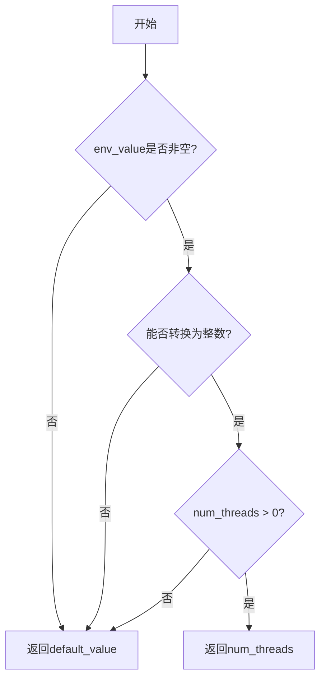
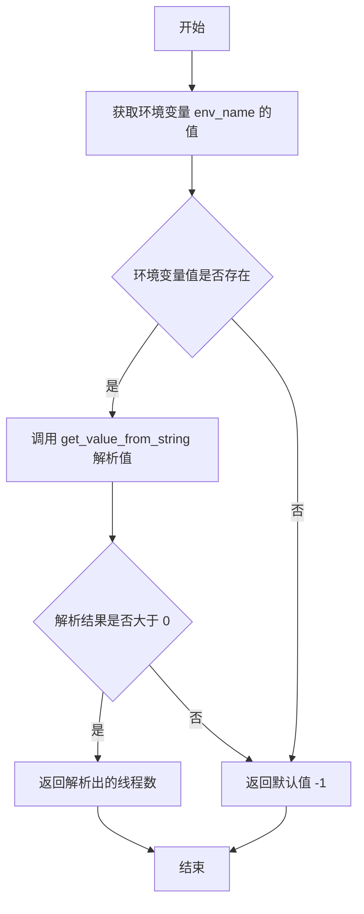
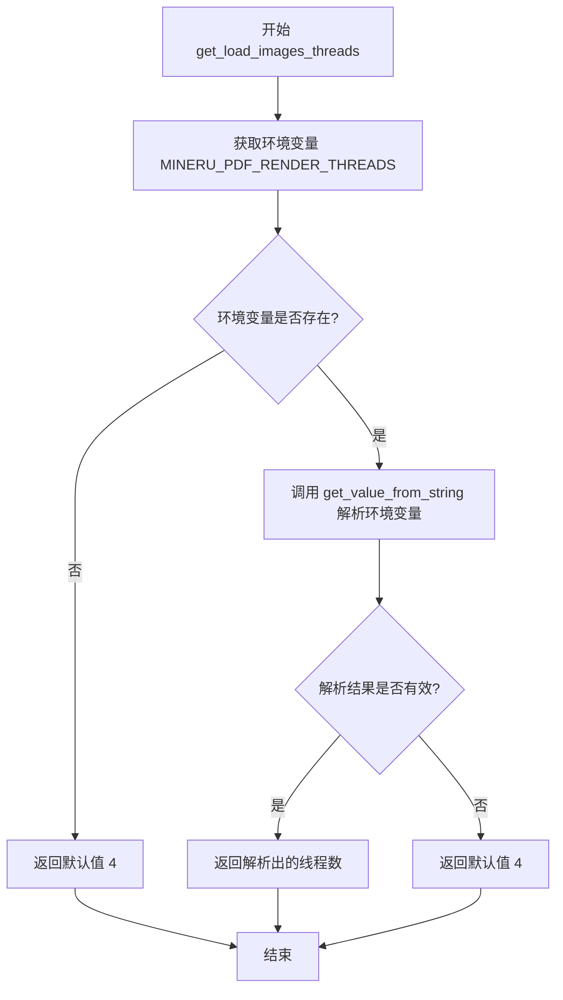

# `MinerU\mineru\utils\os_env_config.py` 详细设计文档

该文件是一个环境配置读取模块，通过读取操作系统环境变量获取运行时配置参数，包括OpenNumThread线程数、PDF渲染超时时间和渲染线程数，并提供统一的字符串转整数转换功能。

## 整体流程



## 类结构

```
无类结构（纯函数模块）
```

## 全局变量及字段


### `get_op_num_threads`
    
从指定环境变量获取线程数配置，如果环境变量不存在或值无效则返回-1

类型：`function`
    


### `get_load_images_timeout`
    
获取图片加载超时时间，默认300秒，通过MINERU_PDF_RENDER_TIMEOUT环境变量配置

类型：`function`
    


### `get_load_images_threads`
    
获取图片加载线程数，默认4个线程，通过MINERU_PDF_RENDER_THREADS环境变量配置

类型：`function`
    


### `get_value_from_string`
    
将字符串环境变量值转换为整数，大于0时返回转换值，否则返回默认值

类型：`function`
    


    

## 全局函数及方法


### `get_op_num_threads`

该函数通过读取指定的环境变量获取线程数配置，如果环境变量不存在或值无效，则返回默认值-1。

参数：

- `env_name`：`str`，环境变量的名称

返回值：`int`，从环境变量解析出的线程数，如果解析失败则返回默认值-1

#### 流程图



#### 带注释源码

```python
import os


def get_op_num_threads(env_name: str) -> int:
    """
    从指定环境变量获取线程数配置
    
    参数:
        env_name: str - 环境变量的名称
    
    返回:
        int - 线程数，如果环境变量不存在或无效则返回 -1
    """
    # 获取指定环境变量的值，如果不存在则返回 None
    env_value = os.getenv(env_name, None)
    # 调用辅助函数将字符串值转换为整数，解析失败时返回默认值 -1
    return get_value_from_string(env_value, -1)


def get_load_images_timeout() -> int:
    """获取图片加载超时时间，默认300秒"""
    env_value = os.getenv('MINERU_PDF_RENDER_TIMEOUT', None)
    return get_value_from_string(env_value, 300)


def get_load_images_threads() -> int:
    """获取图片加载线程数，默认4个线程"""
    env_value = os.getenv('MINERU_PDF_RENDER_THREADS', None)
    return get_value_from_string(env_value, 4)


def get_value_from_string(env_value: str, default_value: int) -> int:
    """
    将环境变量字符串值转换为整数
    
    参数:
        env_value: str - 环境变量的字符串值
        default_value: int - 默认值
    
    返回:
        int - 解析后的整数值或默认值
    """
    if env_value is not None:
        try:
            # 尝试将字符串转换为整数
            num_threads = int(env_value)
            if num_threads > 0:
                return num_threads
        except ValueError:
            # 字符串无法转换为整数时返回默认值
            return default_value
    return default_value


if __name__ == '__main__':
    print(get_value_from_string('1', -1))      # 输出: 1
    print(get_value_from_string('0', -1))      # 输出: -1 (0不大于0)
    print(get_value_from_string('-1', -1))     # 输出: -1 (负数不大于0)
    print(get_value_from_string('abc', -1))    # 输出: -1 (无法解析)
    print(get_load_images_timeout())            # 输出: 300
```


### `get_load_images_timeout`

获取 PDF 渲染超时时间的配置值。该函数从环境变量 `MINERU_PDF_RENDER_TIMEOUT` 中读取超时时间设置，如果环境变量未设置或值无效，则返回默认的 300 秒超时时间。

参数： 无

返回值：`int`，返回图片加载超时时间（单位：秒），默认为 300 秒

#### 流程图

```mermaid
flowchart TD
    A[开始 get_load_images_timeout] --> B[获取环境变量 MINERU_PDF_RENDER_TIMEOUT]
    B --> C{环境变量是否存在?}
    C -->|是| D[调用 get_value_from_string(env_value, 300)]
    C -->|否| D
    D --> E{值是否为有效正整数?}
    E -->|是| F[返回解析后的超时值]
    E -->|否| G[返回默认值 300]
    F --> H[结束]
    G --> H
```

#### 带注释源码

```python
def get_load_images_timeout() -> int:
    """
    获取 PDF 渲染超时时间配置
    
    从环境变量 'MINERU_PDF_RENDER_TIMEOUT' 中读取超时时间设置。
    如果环境变量未设置或值无效，返回默认值 300 秒。
    
    Returns:
        int: 超时时间（秒），默认值为 300
    """
    # 获取环境变量，默认为 None（未设置）
    env_value = os.getenv('MINERU_PDF_RENDER_TIMEOUT', None)
    
    # 调用通用解析函数，传入默认值 300
    # get_value_from_string 会处理以下情况：
    # - env_value 为 None 时返回默认值
    # - 无法转换为整数时返回默认值
    # - 转换后的值 <= 0 时返回默认值
    return get_value_from_string(env_value, 300)
```


### `get_load_images_threads`

该函数用于从环境变量 `MINERU_PDF_RENDER_THREADS` 获取图像加载线程数，若环境变量未设置或值无效，则返回默认线程数 4。

参数： 无

返回值：`int`，返回配置的图像加载线程数

#### 流程图



#### 带注释源码

```python
def get_load_images_threads() -> int:
    """
    获取图像加载线程数。
    
    从环境变量 'MINERU_PDF_RENDER_THREADS' 读取线程数配置。
    如果环境变量未设置或值无效，则返回默认值 4。
    
    Returns:
        int: 图像加载线程数
    """
    # 获取环境变量 MINERU_PDF_RENDER_THREADS，若未设置则为 None
    env_value = os.getenv('MINERU_PDF_RENDER_THREADS', None)
    
    # 调用 get_value_from_string 解析环境变量值
    # 传入默认值 4，如果解析失败则返回该默认值
    return get_value_from_string(env_value, 4)
```


### `get_value_from_string`

该函数用于将环境变量的字符串值转换为正整数，如果转换失败或值无效则返回提供的默认值。

参数：

-  `env_value`：`str`，环境变量的值字符串
-  `default_value`：`int`，当转换失败或值无效时返回的默认值

返回值：`int`，成功转换且大于0的整数值，或默认值

#### 流程图

```mermaid
flowchart TD
    A[开始] --> B{env_value is not None}
    B -- 否 --> F[返回 default_value]
    B -- 是 --> C[尝试 int(env_value)]
    C --> D{转换成功?}
    D -- 否 --> E[捕获 ValueError]
    E --> F
    D -- 是 --> G{num_threads > 0}
    G -- 否 --> F
    G -- 是 --> H[返回 num_threads]
    
    style A fill:#f9f,stroke:#333
    style H fill:#9f9,stroke:#333
    style F fill:#f99,stroke:#333
```

#### 带注释源码

```python
def get_value_from_string(env_value: str, default_value: int) -> int:
    """
    将环境变量的字符串值转换为正整数。
    
    参数:
        env_value: 环境变量的值字符串，可能为 None 或无效字符串
        default_value: 当转换失败时返回的默认值
    
    返回:
        成功转换且大于0的整数值，或默认值
    """
    # 检查环境变量值是否提供
    if env_value is not None:
        try:
            # 尝试将字符串转换为整数
            num_threads = int(env_value)
            # 只返回大于0的正整数
            if num_threads > 0:
                return num_threads
        except ValueError:
            # 转换失败时返回默认值
            return default_value
    # env_value 为 None 或值不大于0时返回默认值
    return default_value
```


## 关键组件


### 环境变量加载模块

该代码模块主要负责从操作系统环境变量中读取配置参数，支持超时时间和线程数等运行时配置的灵活设置，并提供安全的字符串到整数的转换功能。

### 关键组件信息

#### 组件1：环境变量读取机制

通过 `os.getenv()` 函数从系统环境变量中获取配置值，支持默认值回退机制。

#### 组件2：字符串转整数解析器

`get_value_from_string` 函数提供安全的字符串到整数转换，只返回大于0的有效数值，否则使用默认值。

#### 组件3：配置参数获取函数

三个专用配置获取函数分别获取 PDF 渲染超时时间、渲染线程数和操作线程数，支持通过环境变量覆盖默认值。

### 潜在的技术债务或优化空间

1. 缺少日志记录，当环境变量值无效时静默返回默认值，难以排查配置问题
2. 线程数配置缺少上限检查，可能导致资源耗尽
3. 超时时间配置缺少合理性验证

### 其它项目

**设计目标**：提供可配置的运行时参数，支持环境变量覆盖默认值

**错误处理**：捕获 ValueError 异常并返回默认值，但未记录警告信息

**数据流**：环境变量 → 字符串解析 → 整数验证 → 返回值

**外部依赖**：仅依赖 Python 标准库 `os` 模块


## 问题及建议


### 已知问题

-   环境变量名称硬编码在各个函数中，分散管理导致维护困难，修改时需要修改多处
-   缺少日志或错误报告机制，当环境变量值解析失败时静默返回默认值，难以追踪问题根因
-   负数未做处理，当前逻辑只判断 `num_threads > 0`，负数值会被忽略并返回默认值
-   函数缺少文档字符串（docstring），代码可读性和可维护性差
-   `get_value_from_string` 函数名与参数名 `env_value` 命名不够直观，语义不清晰
-   `if __name__ == '__main__'` 中包含测试代码，混合了生产代码与测试代码

### 优化建议

-   使用配置类或枚举集中管理所有环境变量名称，便于统一维护和修改
-   添加日志记录功能，在环境变量解析失败时输出警告日志，便于问题排查
-   明确负数的处理逻辑，或在文档中说明负数会被视为无效值
-   为所有函数添加文档字符串，说明函数功能、参数和返回值含义
-   考虑将测试代码移至独立的单元测试文件（如 `test_*.py`），保持生产代码纯净
-   考虑将 `get_value_from_string` 重命名为更语义化的名称，如 `parse_int_env_value`

## 其它


### 设计目标与约束

本代码模块的设计目标是提供一个统一的配置读取机制，从环境变量中获取运行时配置参数，并进行类型验证和默认值处理。主要约束包括：仅支持整数值的环境变量配置，默认值必须为整数类型，不支持浮点数或字符串类型的配置转换。

### 错误处理与异常设计

代码采用静默失败策略，当环境变量值无法转换为正整数时，返回默认值而不是抛出异常。具体错误处理包括：ValueError异常捕获（环境变量值不是有效整数）、None值处理（环境变量不存在）、负数和零值处理（返回默认值）。这种设计适合配置加载场景，避免因配置错误导致程序启动失败。

### 数据流与状态机

数据流向为：环境变量名称 → os.getenv()读取 → get_value_from_string()类型转换 → 验证是否为正整数 → 返回配置值。没有复杂的状态机设计，属于简单的线性数据流。

### 外部依赖与接口契约

主要外部依赖为Python标准库os模块，用于读取环境变量。接口契约规定：所有get函数接受字符串参数（环境变量名），返回整数类型的配置值，若配置无效或不存在则返回指定的默认值。

### 性能考虑

代码性能开销极低，仅涉及环境变量读取和简单的类型转换操作，无I/O密集或计算密集操作。get_value_from_string函数设计为无状态纯函数，可安全并发调用。

### 安全考虑

代码本身不涉及敏感数据处理，但需要注意：环境变量可能包含用户敏感信息，生产环境中应避免将敏感信息写入环境变量。目前未对环境变量值进行额外的安全校验（如值范围上限限制），建议根据实际业务需求添加最大值限制。

### 配置管理

配置管理采用环境变量方式，支持运行时动态修改。主要配置项包括：MINERU_PDF_RENDER_TIMEOUT（图片加载超时时间，默认300秒）、MINERU_PDF_RENDER_THREADS（图片加载线程数，默认4线程）、以及自定义环境变量名称的通用配置接口。

### 单元测试策略

建议覆盖以下测试场景：正常正整数转换、零值处理、负数值处理、非数字字符串处理、空字符串处理、None值处理、默认值正确返回。建议使用pytest框架编写测试用例。

### 版本兼容性

代码使用Python 3标准库语法，无第三方依赖，适用于Python 3.6及以上版本。os.getenv()方法在所有Python 3.x版本中行为一致。

### 部署注意事项

部署时需确保运行环境已正确配置所需的环境变量。建议在容器化部署时通过Dockerfile或docker-compose配置环境变量。配置变更后需要重启应用才能生效。


    