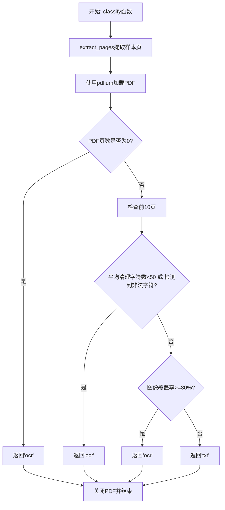
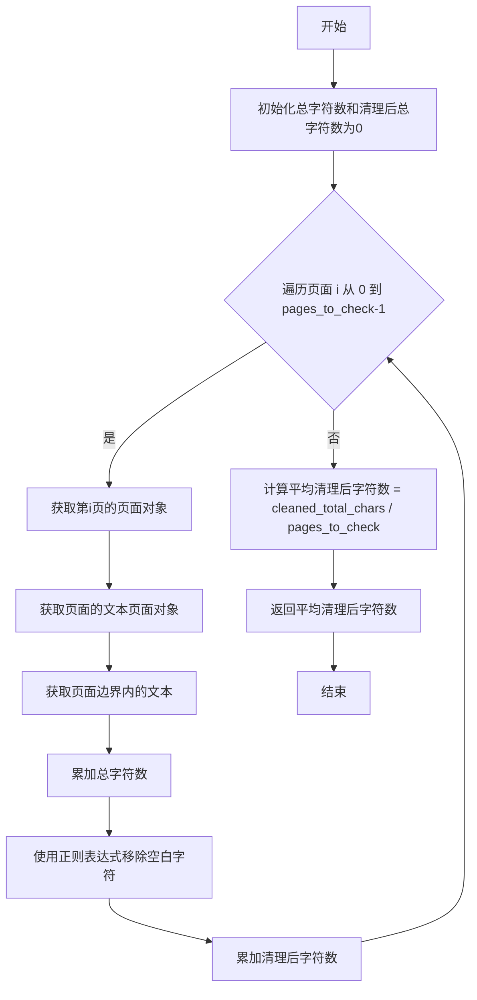
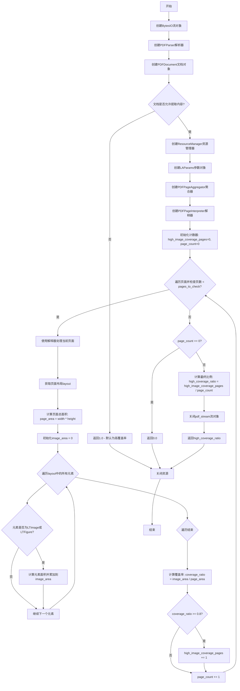
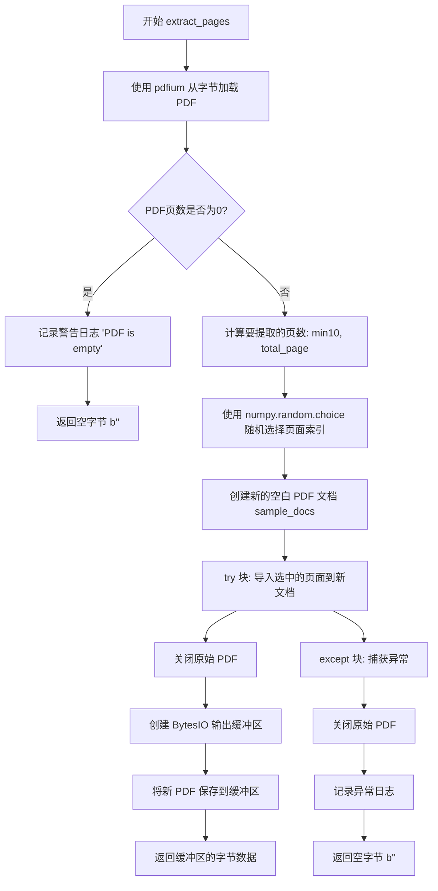

# `MinerU\mineru\utils\pdf_classify.py` 详细设计文档

该代码实现了一个PDF文档分类器，用于判断PDF文件是可以直接提取文本还是需要OCR处理。它通过分析PDF的平均字符数、图像覆盖率、非法字符比例等多维度指标来进行决策，返回'txt'表示可直接文本提取，返回'ocr'表示需要OCR处理。

## 整体流程



## 类结构

```
classify (主分类函数)
├── extract_pages (页面提取函数)
├── get_avg_cleaned_chars_per_page (字符统计函数)
├── get_high_image_coverage_ratio (图像覆盖率函数)
└── detect_invalid_chars (非法字符检测函数)
```

## 全局变量及字段


### `sample_pdf_bytes`
    
从原始PDF提取的样本PDF字节数据，用于分析

类型：`bytes`
    


### `page_count`
    
PDF文档的总页数

类型：`int`
    


### `pages_to_check`
    
需要检查的页面数量，默认为最多10页

类型：`int`
    


### `chars_threshold`
    
字符数阈值，每页平均少于该值则需要OCR

类型：`int`
    


### `total_chars`
    
提取的总字符数（含空白字符）

类型：`int`
    


### `cleaned_total_chars`
    
清理后的总字符数（去除空白字符后）

类型：`int`
    


### `avg_cleaned_chars_per_page`
    
每页平均清理后的字符数

类型：`float`
    


### `pdf_stream`
    
PDF文件的内存流对象

类型：`BytesIO`
    


### `parser`
    
PDF解析器对象，用于解析PDF文件

类型：`PDFParser`
    


### `document`
    
PDF文档对象，包含文档结构信息

类型：`PDFDocument`
    


### `rsrcmgr`
    
PDF资源管理器，用于管理字体和图像等资源

类型：`PDFResourceManager`
    


### `laparams`
    
PDF布局分析参数，配置文本提取规则

类型：`LAParams`
    


### `device`
    
PDF页面聚合器设备，用于获取页面布局

类型：`PDFPageAggregator`
    


### `interpreter`
    
PDF页面解释器，用于处理页面内容

类型：`PDFPageInterpreter`
    


### `high_image_coverage_pages`
    
高图像覆盖率（≥80%）的页面数量

类型：`int`
    


### `page_count`
    
当前已检查的页面计数

类型：`int`
    


### `page_width`
    
PDF页面的宽度

类型：`float`
    


### `page_height`
    
PDF页面的高度

类型：`float`
    


### `page_area`
    
PDF页面的总面积

类型：`float`
    


### `image_area`
    
页面上图像元素的总面积

类型：`float`
    


### `img_width`
    
单个图像元素的宽度

类型：`float`
    


### `img_height`
    
单个图像元素的高度

类型：`float`
    


### `img_area`
    
单个图像元素的面积

类型：`float`
    


### `coverage_ratio`
    
当前页面的图像覆盖率

类型：`float`
    


### `high_coverage_ratio`
    
高图像覆盖率页面的比例

类型：`float`
    


### `total_page`
    
PDF文档的总页数

类型：`int`
    


### `select_page_cnt`
    
随机选择的页面数量

类型：`int`
    


### `page_indices`
    
随机选择的页面索引列表

类型：`list`
    


### `sample_docs`
    
提取页面后创建的新PDF文档对象

类型：`pdfium.PdfDocument`
    


### `output_buffer`
    
用于保存新PDF的内存缓冲区

类型：`BytesIO`
    


### `sample_pdf_file_like_object`
    
用于pdfminer提取文本的文件对象

类型：`BytesIO`
    


### `text`
    
从PDF中提取的文本内容

类型：`str`
    


### `cid_pattern`
    
用于匹配乱码字符的正则表达式模式

类型：`re.Pattern`
    


### `matches`
    
正则表达式匹配到的乱码字符列表

类型：`list`
    


### `cid_count`
    
乱码字符（cid）的数量

类型：`int`
    


### `cid_len`
    
所有乱码字符的总长度

类型：`int`
    


### `text_len`
    
提取文本的总长度

类型：`int`
    


### `cid_chars_radio`
    
乱码字符占总文本的比例

类型：`float`
    


    

## 全局函数及方法


### `classify`

该函数是PDF文档处理模块的核心分类函数，用于判断PDF文件是可以直接提取文本还是需要OCR处理。它通过提取PDF样本页面，分析文本密度、字符有效性和图像覆盖率三个维度来综合决策：当PDF页数为0、每页平均有效字符少于50、存在超过5%的乱码字符、或图像覆盖率超过80%时，判定为需要OCR处理；否则判定为可以直接提取文本。

**参数：**

- `pdf_bytes`：`bytes`，PDF文件的原始字节数据

**返回值：** `str`，返回 `'txt'` 表示PDF可以直接提取文本，返回 `'ocr'` 表示需要OCR处理

#### 流程图

```mermaid
flowchart TD
    A[开始classify] --> B[extract_pages提取样本页]
    B --> C[pdfium加载PDF文档]
    C --> D{获取页数}
    D -->|page_count == 0| E[返回'ocr']
    D -->|page_count > 0| F[设置检查页数pages_to_check = min(page_count, 10)]
    F --> G[设置字符阈值chars_threshold = 50]
    G --> H{平均清理字符数 < 阈值 OR 检测到无效字符?}
    H -->|是| E
    H -->|否| I{图像覆盖率 >= 0.8?}
    I -->|是| E
    I -->|否| J[返回'txt']
    E --> K[关闭PDF]
    J --> K
    K --> L[结束]
    
    style H fill:#ff9999
    style I fill:#ff9999
    style E fill:#99ff99
    style J fill:#99ff99
```

#### 带注释源码

```python
def classify(pdf_bytes):
    """
    判断PDF文件是可以直接提取文本还是需要OCR

    Args:
        pdf_bytes: PDF文件的字节数据

    Returns:
        str: 'txt' 表示可以直接提取文本，'ocr' 表示需要OCR
    """

    # 从字节数据加载PDF - 提取最多10页作为样本
    sample_pdf_bytes = extract_pages(pdf_bytes)
    
    # 使用pdfium库加载PDF文档
    pdf = pdfium.PdfDocument(sample_pdf_bytes)
    
    try:
        # 获取PDF页数
        page_count = len(pdf)

        # 如果PDF页数为0，直接返回OCR（空文档无法提取文本）
        if page_count == 0:
            return 'ocr'

        # 检查的页面数（最多检查10页）
        pages_to_check = min(page_count, 10)

        # 设置阈值：如果每页平均少于50个有效字符，认为需要OCR
        chars_threshold = 50

        # 检查平均字符数和无效字符
        # 如果平均清理后字符数少于阈值，或者检测到乱码字符，返回'ocr'
        if (get_avg_cleaned_chars_per_page(pdf, pages_to_check) < chars_threshold) or detect_invalid_chars(sample_pdf_bytes):
            return 'ocr'

        # 检查图像覆盖率
        # 如果图像覆盖率>=80%，说明页面主要是图像，需要OCR
        if get_high_image_coverage_ratio(sample_pdf_bytes, pages_to_check) >= 0.8:
            return 'ocr'

        # 通过所有检查，PDF可以直接提取文本
        return 'txt'

    except Exception as e:
        # 发生任何异常，记录错误日志
        logger.error(f"判断PDF类型时出错: {e}")
        # 出错时默认使用OCR（保守策略）
        return 'ocr'

    finally:
        # 无论执行哪个路径，都确保PDF被关闭，释放资源
        pdf.close()
```

---

### 关键组件信息

| 组件名称 | 一句话描述 |
|---------|-----------|
| `extract_pages` | 从原始PDF字节数据中随机提取最多10页，返回新的PDF字节数据用于分析 |
| `get_avg_cleaned_chars_per_page` | 计算PDF每页清理后（去除空白字符）的平均字符数，用于判断文本密度 |
| `get_high_image_coverage_ratio` | 计算PDF页面的图像覆盖率，统计高图像覆盖率页面占比 |
| `detect_invalid_chars` | 检测PDF中是否存在乱码字符（cid:xxx格式），判断文本提取质量 |

---

### 潜在的技术债务与优化空间

1. **硬编码阈值缺乏灵活性**：字符阈值50、图像覆盖率80%、乱码率5%等阈值均为硬编码，建议提取为配置参数或提供自适应阈值算法
2. **异常处理策略保守**：任何异常都默认返回OCR，可能导致本可文本提取的PDF被误判，建议增加重试机制和更细粒度的异常分类
3. **性能优化空间**：`detect_invalid_chars`中每次都重新解析PDF样本，可考虑缓存样本提取结果
4. **随机抽样稳定性**：使用`np.random.choice`随机抽样可能导致同一PDF多次调用结果不一致，建议增加抽样种子或使用确定性的前N页策略
5. **日志级别不统一**：部分关键判断节点使用debug级别日志，建议提升为info级别以便问题排查

---

### 其它项目

**设计目标与约束：**
- 目标：最小化误判，最大化文本提取成功率
- 约束：只检查前10页（性能与准确性的平衡点）

**错误处理与异常设计：**
- 采用保守策略：任何异常默认返回OCR，确保不会遗漏需要OCR的文档
- 使用`finally`块确保PDF资源释放

**数据流与状态机：**
```
PDF字节输入 → 样本提取 → 三重检查(字符数/乱码/图像覆盖率) → 分类结果输出
```

**外部依赖与接口契约：**
- 依赖`pdfium`库进行PDF渲染和文本提取
- 依赖`pdfminer`库进行布局分析和元素检测
- 输入为原始PDF字节，输出为字符串`'txt'`或`'ocr'`


### `get_avg_cleaned_chars_per_page`

该函数用于计算PDF文档前N页中，平均每页清理后的字符数（移除空白字符后），用于判断PDF是否包含足够的可读文本内容，以决定是直接提取文本还是需要OCR处理。

参数：

- `pdf_doc`：`pdfium.PdfDocument`，PDF文档对象，用于访问PDF页面
- `pages_to_check`：`int`，要检查的页数，用于控制统计的页面数量

返回值：`float`，返回平均每页清理后的字符数

#### 流程图



#### 带注释源码

```python
def get_avg_cleaned_chars_per_page(pdf_doc, pages_to_check):
    """
    计算PDF每页平均清理后的字符数（移除空白字符）
    
    Args:
        pdf_doc: pdfium.PdfDocument对象
        pages_to_check: 要检查的页数
    
    Returns:
        float: 平均每页清理后的字符数
    """
    
    # 初始化总字符数计数器
    total_chars = 0
    # 初始化清理后的总字符数计数器
    cleaned_total_chars = 0

    # 遍历前pages_to_check页
    for i in range(pages_to_check):
        # 获取PDF文档中的第i页
        page = pdf_doc[i]
        # 获取页面的文本页面对象，用于提取文本
        text_page = page.get_textpage()
        # 获取页面边界内的所有文本
        text = text_page.get_text_bounded()
        # 累加原始字符数
        total_chars += len(text)

        # 使用正则表达式清理提取的文本，移除所有空白字符（空格、换行、制表符等）
        cleaned_text = re.sub(r'\s+', '', text)
        # 累加清理后的字符数
        cleaned_total_chars += len(cleaned_text)

    # 计算平均每页清理后的字符数
    avg_cleaned_chars_per_page = cleaned_total_chars / pages_to_check

    # 记录日志用于调试（可选）
    # logger.debug(f"PDF分析: 平均每页清理后{avg_cleaned_chars_per_page:.1f}字符")

    # 返回平均清理后字符数
    return avg_cleaned_chars_per_page
```


### `get_high_image_coverage_ratio`

该函数用于分析PDF文档中图像元素的覆盖率，计算高图像覆盖率页面占总检查页面的比例，用于判断PDF是否需要OCR处理（当图像覆盖率≥80%时认为需要OCR）。

参数：

- `sample_pdf_bytes`：`bytes`，PDF文件的字节数据，用于创建内存PDF文档
- `pages_to_check`：`int`，需要检查的页面数量上限

返回值：`float`，返回高图像覆盖率（≥80%）的页面占总检查页面的比例，范围0.0-1.0；如果文档不允许提取内容或无页面则返回特定值

#### 流程图



#### 带注释源码

```python
def get_high_image_coverage_ratio(sample_pdf_bytes, pages_to_check):
    """
    计算PDF中高图像覆盖率页面的比例
    
    Args:
        sample_pdf_bytes: PDF文件的字节数据
        pages_to_check: 需要检查的页面数量
    
    Returns:
        float: 高图像覆盖率(>=80%)页面占总检查页面的比例
    """
    
    # 创建内存文件对象 - 将字节数据转换为流对象供PDF解析器使用
    pdf_stream = BytesIO(sample_pdf_bytes)

    # 创建PDF解析器 - 用于解析PDF文档结构
    parser = PDFParser(pdf_stream)

    # 创建PDF文档对象 - 完整解析PDF内容
    document = PDFDocument(parser)

    # 检查文档是否允许文本提取 - 某些PDF可能加密或限制提取
    if not document.is_extractable:
        # 默认为高覆盖率，因为无法提取内容可能是因为图像化PDF
        return 1.0

    # 创建资源管理器 - 管理PDF中使用的资源(字体、图像等)
    rsrcmgr = PDFResourceManager()
    
    # 创建布局分析参数 - 控制pdfminer如何解析布局
    laparams = LAParams(
        line_overlap=0.5,      # 行重叠阈值
        char_margin=2.0,       # 字符边距
        line_margin=0.5,      # 行边距
        word_margin=0.1,      # 单词边距
        boxes_flow=None,       # 文本框流动模式
        detect_vertical=False, # 是否检测竖排文本
        all_texts=False,       # 是否提取所有文本
    )

    # 创建聚合器 - 将页面内容聚合成可遍历的布局对象
    device = PDFPageAggregator(rsrcmgr, laparams=laparams)

    # 创建解释器 - 解释执行PDF页面内容
    interpreter = PDFPageInterpreter(rsrcmgr, device)

    # 记录高图像覆盖率的页面数量
    high_image_coverage_pages = 0
    # 记录实际检查的页面数
    page_count = 0

    # 遍历页面 - 只检查前pages_to_check页
    for page in PDFPage.create_pages(document):
        # 控制检查的页数 - 达到上限则退出循环
        if page_count >= pages_to_check:
            break

        # 处理页面 - 解释器解析页面内容
        interpreter.process_page(page)
        # 获取页面布局结果
        layout = device.get_result()

        # 获取页面尺寸并计算页面面积
        page_width = layout.width
        page_height = layout.height
        page_area = page_width * page_height

        # 初始化图像覆盖总面积
        image_area = 0

        # 遍历页面中的所有元素 - 查找图像和图形元素
        for element in layout:
            # 检查是否为图像或图形元素
            if isinstance(element, (LTImage, LTFigure)):
                # 获取元素边界框尺寸
                img_width = element.width
                img_height = element.height
                # 计算元素面积并累加
                img_area = img_width * img_height
                image_area += img_area

        # 计算当前页面的图像覆盖率
        # 使用min确保不超过1.0，处理边界情况
        coverage_ratio = min(image_area / page_area, 1.0) if page_area > 0 else 0

        # 判断是否为高覆盖率页面 - 阈值80%
        if coverage_ratio >= 0.8:
            high_image_coverage_pages += 1

        # 增加页面计数
        page_count += 1

    # 关闭流对象释放资源
    pdf_stream.close()

    # 如果没有处理任何页面(空PDF)，返回0
    if page_count == 0:
        return 0.0

    # 计算高图像覆盖率的页面比例
    high_coverage_ratio = high_image_coverage_pages / page_count

    return high_coverage_ratio
```


### `extract_pages`

该函数从输入的PDF字节数据中随机提取最多10页，创建一个包含这些随机页面的新PDF文档并返回其字节数据。主要用于在不需要分析整个PDF的情况下获取样本页面进行初步分析（如判断是否需要OCR）。

参数：

- `src_pdf_bytes`：`bytes`，原始PDF文件的字节数据

返回值：`bytes`，提取页面后生成的新PDF字节数据

#### 流程图



#### 带注释源码

```python
def extract_pages(src_pdf_bytes: bytes) -> bytes:
    """
    从PDF字节数据中随机提取最多10页，返回新的PDF字节数据

    Args:
        src_pdf_bytes: PDF文件的字节数据

    Returns:
        bytes: 提取页面后的PDF字节数据
    """

    # 从字节数据加载PDF
    pdf = pdfium.PdfDocument(src_pdf_bytes)

    # 获取PDF页数
    total_page = len(pdf)
    if total_page == 0:
        # 如果PDF没有页面，直接返回空文档
        logger.warning("PDF is empty, return empty document")
        return b''

    # 选择最多10页
    select_page_cnt = min(10, total_page)

    # 从总页数中随机选择页面（不放回抽样）
    page_indices = np.random.choice(total_page, select_page_cnt, replace=False).tolist()

    # 创建一个新的PDF文档
    sample_docs = pdfium.PdfDocument.new()

    try:
        # 将选择的页面导入新文档
        sample_docs.import_pages(pdf, page_indices)
        pdf.close()  # 关闭原始PDF文档释放资源

        # 将新PDF保存到内存缓冲区
        output_buffer = BytesIO()
        sample_docs.save(output_buffer)

        # 获取字节数据并返回
        return output_buffer.getvalue()
    except Exception as e:
        pdf.close()  # 确保异常时也关闭PDF
        logger.exception(e)
        return b''  # 出错时返回空字节
```


### `detect_invalid_chars`

检测PDF中是否包含非法字符（乱码），通过分析提取的文本中CID（Character ID）模式的比例来判断文档是否为乱码文档。当乱码字符占比超过5%时判定为乱码文档。

参数：

- `sample_pdf_bytes`：`bytes`，PDF文件的字节数据（已抽取的样本页面）

返回值：`bool`，True 表示检测到无效字符（乱码文档），False 表示正常文档

#### 流程图

```mermaid
flowchart TD
    A[开始检测] --> B[创建BytesIO对象]
    B --> C[设置LAParams参数]
    C --> D[使用pdfminer提取文本]
    D --> E[移除换行符]
    E --> F[编译CID正则模式 \n\(cid:\d+\)]
    F --> G[查找所有CID匹配]
    G --> H[计算CID数量和总长度]
    H --> I{text_len == 0?}
    I -->|是| J[cid_chars_radio = 0]
    I -->|否| K[计算乱码比例<br/>cid_count / (cid_count + text_len - cid_len)]
    J --> L{乱码比例 > 0.05?}
    K --> L
    L -->|是| M[返回True<br/>乱码文档]
    L -->|否| N[返回False<br/>正常文档]
```

#### 带注释源码

```python
def detect_invalid_chars(sample_pdf_bytes: bytes) -> bool:
    """"
    检测PDF中是否包含非法字符
    """
    # 将PDF字节数据转换为类似文件对象的BytesIO对象
    # 注意：此处直接使用sample_pdf_bytes（已抽取的样本），不再重复抽取
    # 注释说明：pdfminer比较慢，需要先随机抽取10页左右的sample
    sample_pdf_file_like_object = BytesIO(sample_pdf_bytes)
    
    # 配置LAParams参数用于pdfminer的文本提取
    laparams = LAParams(
        line_overlap=0.5,       # 行重叠阈值
        char_margin=2.0,       # 字符边距
        line_margin=0.5,       # 行边距
        word_margin=0.1,       # 词边距
        boxes_flow=None,       # 文本流方向
        detect_vertical=False,  # 不检测垂直文本
        all_texts=False,       # 仅提取文本内容
    )
    
    # 使用pdfminer从PDF中提取文本内容
    text = extract_text(pdf_file=sample_pdf_file_like_object, laparams=laparams)
    
    # 移除文本中的换行符，统一处理
    text = text.replace("\n", "")
    
    # 日志记录提取的文本（已注释）
    # logger.info(text)
    
    # 注释说明：乱码文本用pdfminer提取出来的文本特征是(cid:xxx)
    # 编译正则表达式模式匹配CID格式：括号内的cid后跟数字
    cid_pattern = re.compile(r'\(cid:\d+\)')
    
    # 在提取的文本中查找所有CID模式匹配
    matches = cid_pattern.findall(text)
    
    # 计算CID匹配的数量
    cid_count = len(matches)
    
    # 计算所有CID匹配的总长度
    cid_len = sum(len(match) for match in matches)
    
    # 计算文本总长度
    text_len = len(text)
    
    # 处理空文本情况，避免除零错误
    if text_len == 0:
        cid_chars_radio = 0
    else:
        # 计算乱码字符比例
        # 公式：cid_count / (cid_count + text_len - cid_len)
        # 其中 text_len - cid_len 是非CID字符的数量
        cid_chars_radio = cid_count / (cid_count + text_len - cid_len)
    
    # 日志调试（已注释）：记录CID数量、文本长度和乱码比例
    # logger.debug(f"cid_count: {cid_count}, text_len: {text_len}, cid_chars_radio: {cid_chars_radio}")
    
    # 注释说明：当一篇文章存在5%以上的文本是乱码时，认为该文档为乱码文档
    if cid_chars_radio > 0.05:
        return True  # 乱码文档
    else:
        return False  # 正常文档
```

## 关键组件


### 张量索引与惰性加载

该组件负责从原始PDF字节数据中随机提取最多10页作为样本，用于后续的文本提取和图像覆盖率分析。通过随机采样而非全量处理，实现惰性加载策略，减少内存占用和处理开销。

### 反量化支持

该组件通过 `detect_invalid_chars` 函数实现反量化支持，使用正则表达式匹配 `(cid:\d+)` 模式识别PDF中的乱码字符。计算乱码字符占比，当超过5%阈值时判定为需要OCR处理的扫描文档。

### 量化策略

该组件采用多维度量化判断策略：1) 平均字符数阈值（每页少于50个清理后字符需OCR）；2) 图像覆盖率阈值（超过80%需OCR）；3) 乱码字符比例阈值（超过5%需OCR）。通过多策略融合提高PDF分类准确性。


## 问题及建议


### 已知问题

-   **extract_pages函数页数选择bug**：当PDF总页数少于10页时，`np.random.choice(total_page, select_page_cnt, replace=False)`会抛出ValueError，因为replace=False不允许选择比总样本更多的元素
-   **随机数种子未设置**：`np.random.choice`使用全局随机状态，导致测试结果不可复现，单元测试可靠性低
-   **PDF对象资源泄漏风险**：`extract_pages`中创建的`sample_docs`（pdfium.PdfDocument）未显式关闭，可能导致内存泄漏
-   **重复解析PDF**：在`classify`函数中，先用pdfium解析一次PDF获取页数，又在`get_high_image_coverage_ratio`中用pdfminer重新解析同一个PDF数据，效率低下
-   **魔法数字散落各处**：阈值常量如`50`、`0.8`、`10`、`0.05`等散落在代码中，缺乏统一管理，修改时容易遗漏
-   **LTFigure覆盖面积计算不准确**：LTFigure可能包含文本内容而非纯图像，直接用`width*height`计算覆盖率会高估实际的图像占比
-   **异常处理过于宽泛**：捕获所有Exception后直接返回默认值'ocr'，掩盖了真实错误信息，不利于问题排查
-   **text_page空值未检查**：`get_avg_cleaned_chars_per_page`中`page.get_textpage()`可能返回None，但直接使用未做空值检查

### 优化建议

-   **修复页数选择逻辑**：使用`replace=total_page <= select_page_cnt`或先判断页数是否足够
-   **添加随机种子**：在需要随机的地方使用`np.random.seed()`或使用本地Random对象，确保可复现性
-   **统一资源管理**：使用上下文管理器或确保所有PdfDocument对象在finally块中正确关闭
-   **提取配置常量**：创建配置类或常量文件集中管理阈值常量，如`MAX_CHECK_PAGES = 10`、`MIN_CHARS_PER_PAGE = 50`、`HIGH_IMAGE_COVERAGE_RATIO = 0.8`等
-   **优化PDF解析流程**：考虑在一次解析中同时获取文本和图像信息，避免重复解析
-   **改进异常处理**：分类捕获特定异常，记录详细错误信息，或在关键失败时抛出自定义异常而非静默返回默认值
-   **添加类型注解**：为函数参数和返回值添加详细的类型注解，提高代码可读性和IDE支持
-   **考虑使用缓存**：对于相同PDF内容的多次分类，可添加缓存机制避免重复计算


## 其它


### 设计目标与约束

本模块的设计目标是实现一个PDF文档分类器，能够自动判断PDF文件是可以直接提取文本还是需要OCR处理。核心约束包括：1）仅检查最多10页以提高性能；2）使用多个判断条件综合决策（字符数量、图像覆盖率、非法字符检测）；3）返回结果限于'txt'或'ocr'两种；4）错误时默认返回'ocr'以保证可靠性。

### 错误处理与异常设计

模块采用统一的异常处理策略：1）classify函数使用try-except捕获所有异常，错误时返回'ocr'并记录日志；2）extract_pages函数在出错时返回空字节并关闭PDF资源；3）所有可能失败的外部调用（PDF解析、文本提取）都被包裹在异常处理块中；4）使用loguru记录错误日志，包含具体异常信息；5）finally块确保PDF资源被正确关闭。

### 数据流与状态机

数据流如下：输入PDF字节 → extract_pages提取样本页 → 并行执行三个检测分支（字符数检查、图像覆盖率检查、非法字符检查） → 综合判断 → 返回结果。状态转换：初始状态 → 加载PDF → 获取页数 → （页数为0则直接返回'ocr'） → 执行检测 → 判断阈值 → 返回结果或异常。

### 外部依赖与接口契约

核心依赖包括：1）pypdfium2用于PDF加载和页提取；2）pdfminer.six用于文本提取和布局分析；3）numpy用于随机页面选择；4）loguru用于日志记录。输入接口：classify(pdf_bytes: bytes) → str，返回'txt'或'ocr'；extract_pages(src_pdf_bytes: bytes) → bytes，返回提取后的PDF字节；get_avg_cleaned_chars_per_page(pdf_doc, pages_to_check) → float；get_high_image_coverage_ratio(sample_pdf_bytes, pages_to_check) → float；detect_invalid_chars(sample_pdf_bytes: bytes) → bool。

### 性能考虑与优化策略

性能优化点：1）仅检查前10页而非全部页面；2）使用随机采样减少处理量；3）字符数检查使用清理后的文本避免空白字符干扰；4）图像覆盖率检查使用早期退出策略；5）异常情况下快速返回默认值。潜在瓶颈：pdfminer的文本提取速度较慢，detect_invalid_chars函数在大文档上可能耗时较长，考虑添加超时机制或使用更快的检测方法。

### 安全性考虑

安全措施：1）函数参数类型明确（bytes类型）；2）异常处理防止信息泄露；3）资源正确释放（PDF.close()）；4）无外部命令执行风险。潜在风险：1）大PDF文件可能导致内存问题，extract_pages应添加文件大小检查；2）随机选择页面时应验证索引有效性。

### 兼容性考虑

兼容性要求：1）Python 3.8+；2）依赖库版本：pypdfium2、pdfminer.six、numpy、loguru；3）支持UTF-8编码的PDF文档；4）跨平台支持（无平台特定代码）。限制：1）仅支持可解析的标准PDF格式；2）加密PDF可能返回'ocr'；3）仅检测前10页可能遗漏文档后部的重要内容。

### 配置参数与阈值

关键配置参数：1）pages_to_check：最多检查10页；2）chars_threshold：每页50个有效字符作为阈值；3）coverage_ratio：0.8（80%）作为高图像覆盖率阈值；4）cid_chars_radio：0.05（5%）作为乱码判定阈值。这些阈值可通过配置文件或环境变量进行调优。

### 测试策略建议

测试用例应覆盖：1）空PDF返回'ocr'；2）正常文本PDF返回'txt'；3）扫描版PDF返回'ocr'；4）混排PDF（文本+图像）正确分类；5）乱码PDF正确识别；6）大文件性能测试；7）异常输入（空字节、损坏PDF）的容错性。建议使用pytest框架编写单元测试和集成测试。

    