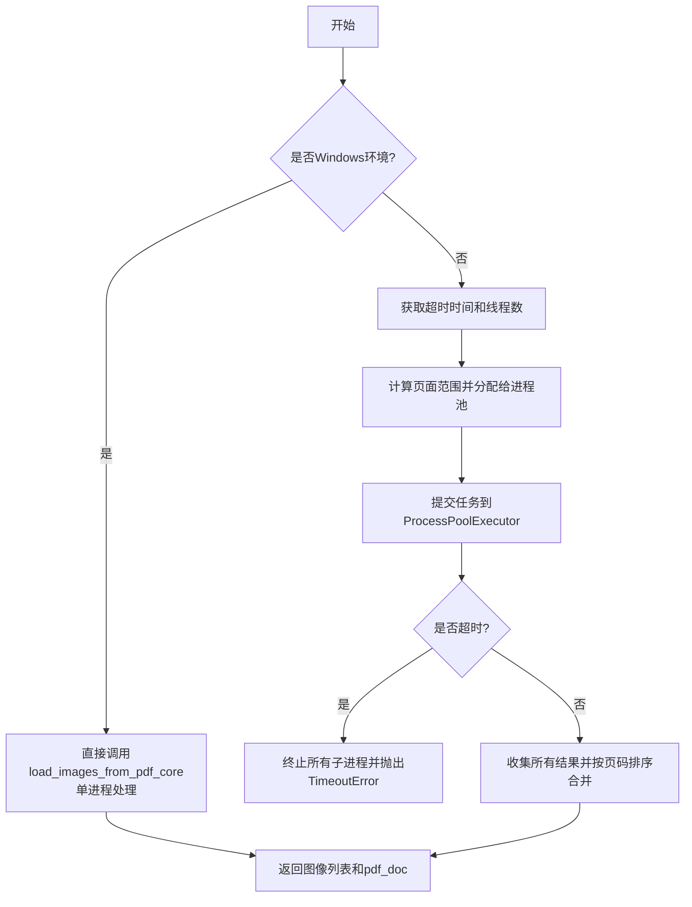
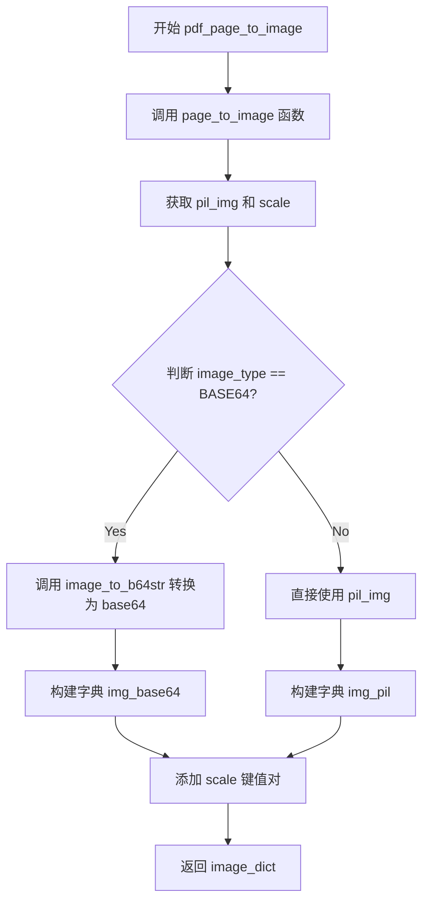
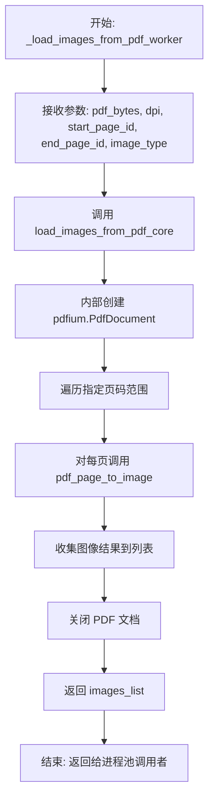
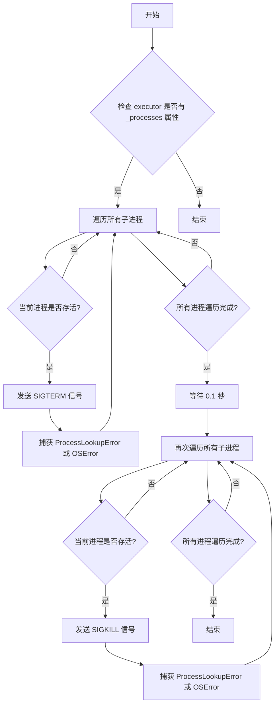
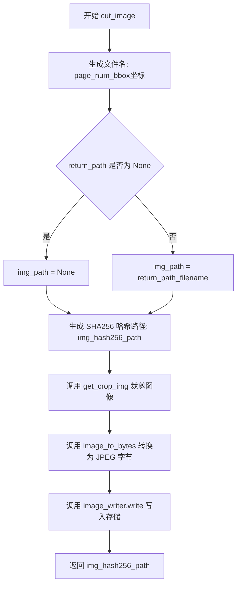
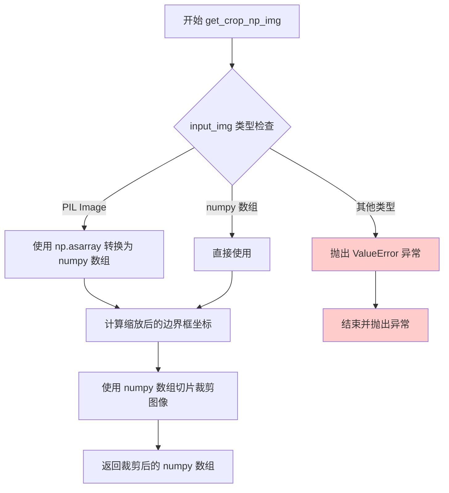
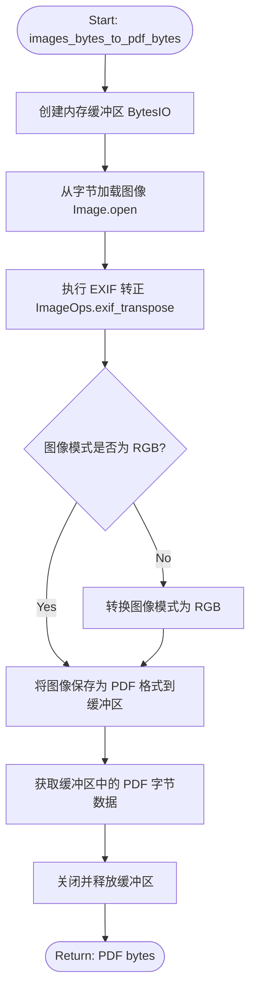

# `MinerU\mineru\utils\pdf_image_tools.py` 详细设计文档

该模块提供PDF转图像的核心功能，支持多进程并行转换、超时控制、图像裁剪以及图片与PDF之间的格式转换，主要用于文档图像处理流水线。

## 整体流程



## 类结构

```
模块: pdf_page_to_image (无类定义，纯函数模块)
└── 主要函数组:
    ├── PDF转图像函数群
    │   ├── pdf_page_to_image
    │   ├── load_images_from_pdf
    │   └── load_images_from_pdf_core
    ├── 图像裁剪函数群
    │   ├── cut_image
    │   ├── get_crop_img
    │   └── get_crop_np_img
    └── 格式转换函数群
        └── images_bytes_to_pdf_bytes
```

## 全局变量及字段


### `pdf_bytes`
    
PDF文件的原始字节数据

类型：`bytes`
    


### `dpi`
    
图像分辨率，默认200

类型：`int`
    


### `start_page_id`
    
起始页码，默认0

类型：`int`
    


### `end_page_id`
    
结束页码，默认None

类型：`int|None`
    


### `image_type`
    
返回图像类型，PIL或BASE64

类型：`ImageType`
    


### `timeout`
    
超时时间秒数，默认从环境变量读取或300

类型：`int|None`
    


### `threads`
    
进程数，默认从环境变量读取或4

类型：`int|None`
    


### `actual_threads`
    
实际使用的进程数

类型：`int`
    


### `total_pages`
    
总页数

类型：`int`
    


### `pages_per_thread`
    
每个进程处理的页面数

类型：`int`
    


### `page_ranges`
    
页面范围列表

类型：`list`
    


### `bbox`
    
边界框坐标 (x0, y0, x1, y1)

类型：`tuple`
    


### `page_num`
    
页码

类型：`int`
    


### `page_pil_img`
    
页面PIL图像对象

类型：`PIL.Image`
    


### `return_path`
    
返回路径

类型：`str|None`
    


### `image_writer`
    
文件数据写入器

类型：`FileBasedDataWriter`
    


### `scale`
    
缩放因子，默认2

类型：`int`
    


### `pil_img`
    
PIL图像对象

类型：`PIL.Image`
    


### `input_img`
    
输入图像

类型：`PIL.Image|np.ndarray`
    


### `np_img`
    
NumPy数组图像

类型：`np.ndarray`
    


### `scale_bbox`
    
缩放后的边界框

类型：`tuple`
    


### `image_bytes`
    
图像字节数据

类型：`bytes`
    


### `pdf_buffer`
    
内存缓冲区

类型：`BytesIO`
    


    

## 全局函数及方法


### `pdf_page_to_image`

将 pdfium.PdfPage 页面对象转换为图像字典，支持根据 image_type 参数返回 PIL 图像对象或 BASE64 编码的字符串，并附带图像缩放比例信息。

参数：

- `page`：`pdfium.PdfPage`，PDF 页面对象，由 pdfium 库生成的 PDF 页面实例
- `dpi`：`int`，图像分辨率，默认为 200，用于控制输出图像的清晰度
- `image_type`：`ImageType`，图像返回格式类型，默认为 ImageType.PIL，枚举值包括 PIL 和 BASE64 两种

返回值：`dict`，包含图像数据的字典，必含键 "scale"（浮点数，表示图像缩放比例），根据 image_type 可选包含 "img_pil"（PIL.Image 对象）或 "img_base64"（base64 编码字符串）

#### 流程图



#### 带注释源码

```python
def pdf_page_to_image(page: pdfium.PdfPage, dpi=200, image_type=ImageType.PIL) -> dict:
    """Convert pdfium.PdfDocument to image, Then convert the image to base64.

    Args:
        page (_type_): pdfium.PdfPage
        dpi (int, optional): reset the dpi of dpi. Defaults to 200.
        image_type (ImageType, optional): The type of image to return. Defaults to ImageType.PIL.

    Returns:
        dict:  {'img_base64': str, 'img_pil': pil_img, 'scale': float }
    """
    # 调用底层 page_to_image 函数将 PDF 页面渲染为 PIL 图像
    # 返回 (PIL图像对象, 缩放比例)
    pil_img, scale = page_to_image(page, dpi=dpi)
    
    # 初始化结果字典，先放入缩放比例
    image_dict = {
        "scale": scale,
    }
    
    # 根据图像类型决定返回格式
    if image_type == ImageType.BASE64:
        # 将 PIL 图像转换为 base64 编码字符串（用于 HTTP 传输或 JSON 序列化）
        image_dict["img_base64"] = image_to_b64str(pil_img)
    else:
        # 直接返回 PIL 图像对象（用于后续图像处理操作）
        image_dict["img_pil"] = pil_img

    # 返回包含图像数据和元信息的字典
    return image_dict
```

### 关键组件信息

| 组件名称 | 一句话描述 |
|---------|-----------|
| `page_to_image` | 底层函数，将 pdfium.PdfPage 渲染为 PIL 图像和缩放比例 |
| `image_to_b64str` | 工具函数，将 PIL 图像转换为 base64 编码的字符串 |
| `ImageType` | 枚举类，定义图像返回类型（PIL/BASE64） |

### 潜在技术债务或优化空间

1. **缺少错误处理**：函数未对 `page`、`dpi`、`image_type` 参数进行有效性校验（如 page 是否为 None、dpi 是否为正整数、image_type 是否为合法枚举值）
2. **返回值不一致风险**：文档注释描述返回包含 `'img_base64'` 和 `'img_pil'` 两个键，但实际代码是二选一返回，可能导致调用方处理困惑
3. **性能冗余**：当 image_type 为 PIL 时，底层 `page_to_image` 可能已完成不需要的操作，可考虑根据类型优化渲染流程

### 其它项目

**设计目标与约束**：

- 目标：提供统一的 PDF 页面转图像接口，屏蔽底层渲染细节
- 约束：依赖 pdfium 库进行 PDF 渲染，依赖 PIL 进行图像操作

**错误处理与异常设计**：

- 当前实现无显式异常捕获，依赖调用方保证输入合法
- 建议增加参数校验，抛出 ValueError 或 TypeError

**数据流与状态机**：

- 输入：PDF 页面对象 → 渲染为 PIL 图像 → 按类型转换为目标格式 → 输出字典
- 状态：纯函数设计，无内部状态变更

**外部依赖与接口契约**：

- 依赖 `pdfium`（PdfPage 对象）、`PIL`（图像处理）、`mineru.utils.pdf_reader`（底层转换函数）
- 调用方需保证 page 为有效的 pdfium.PdfPage 实例


### `_load_images_from_pdf_worker`

用于进程池的包装函数，将 PDF 字节数据转换为指定页码范围的图像列表。该函数作为 `ProcessPoolExecutor` 的工作单元，内部调用核心转换逻辑 `load_images_from_pdf_core` 执行实际的 PDF 到图像转换工作。

参数：

- `pdf_bytes`：`bytes`，PDF 文件的字节数据
- `dpi`：`int`，图像分辨率（每英寸点数），默认为 200
- `start_page_id`：`int`，起始页码（0-based），默认为 0
- `end_page_id`：`int | None`，结束页码，默认为 None（表示最后一页）
- `image_type`：`ImageType`，图像输出类型（PIL 或 BASE64），默认为 ImageType.PIL

返回值：`list`，图像字典列表，每个字典包含 `scale` 字段以及根据 `image_type` 包含 `img_base64` 或 `img_pil` 字段

#### 流程图



#### 带注释源码

```python
def _load_images_from_pdf_worker(
    pdf_bytes, dpi, start_page_id, end_page_id, image_type
):
    """用于进程池的包装函数
    
    该函数作为 ProcessPoolExecutor 的工作单元,
    负责在子进程中执行 PDF 到图像的转换工作。
    
    Args:
        pdf_bytes: PDF 文件的字节数据
        dpi: 图像分辨率
        start_page_id: 起始页码
        end_page_id: 结束页码
        image_type: 图像输出类型
    
    Returns:
        list: 图像字典列表
    """
    # 直接调用核心转换函数，传入相同参数
    # load_images_from_pdf_core 是实际执行转换逻辑的函数
    return load_images_from_pdf_core(
        pdf_bytes, dpi, start_page_id, end_page_id, image_type
    )
```


### `load_images_from_pdf`

带超时控制的 PDF 转图片主函数，支持多进程加速（Windows 环境下使用单进程），通过 ProcessPoolExecutor 并行处理 PDF 页面转换，可配置超时时间和线程数，超时时抛出 TimeoutError 并强制终止子进程。

参数：

- `pdf_bytes`：`bytes`，PDF 文件的 bytes 形式
- `dpi`：`int`，可选，重置 DPI 值。默认为 200
- `start_page_id`：`int`，可选，起始页码（从 0 开始）。默认为 0
- `end_page_id`：`int | None`，可选，结束页码。默认为 None（表示处理到最后一页）
- `image_type`：`ImageType`，可选，图片返回类型。默认为 ImageType.PIL
- `timeout`：`int | None`，可选，超时时间（秒）。如果为 None，则从环境变量 MINERU_PDF_RENDER_TIMEOUT 读取，若未设置则默认为 300 秒
- `threads`：`int | None`，可选，进程数。如果为 None，则从环境变量 MINERU_PDF_RENDER_THREADS 读取，若未设置则默认为 4

返回值：`(list[dict], pdfium.PdfDocument)`，返回转换后的图片列表和 PDF 文档对象，其中图片列表每个元素包含 `scale` 和图片数据（根据 image_type 包含 `img_base64` 或 `img_pil`）

#### 流程图

```mermaid
flowchart TD
    A[开始 load_images_from_pdf] --> B{是否为 Windows 环境?}
    B -->|是| C[调用单进程模式 load_images_from_pdf_core]
    C --> D[返回 images_list 和 pdf_doc]
    B -->|否| E[获取 timeout 和 threads 参数]
    E --> F[计算实际进程数: min(cpu_count, threads, total_pages)]
    F --> G[根据进程数分组页面范围]
    G --> H[创建 ProcessPoolExecutor]
    H --> I[提交所有任务到进程池]
    I --> J[使用 wait 设置全局超时等待]
    J --> K{是否有未完成的任务?}
    K -->|是| L[超时: 强制终止子进程]
    L --> M[关闭 pdf_doc]
    M --> N[抛出 TimeoutError]
    K -->|否| O[收集所有任务结果]
    O --> P[按起始页码排序并合并结果]
    P --> Q[返回 images_list 和 pdf_doc]
    
    style L fill:#ff6b6b
    style N fill:#ff6b6b
    style Q fill:#51cf66
```

#### 带注释源码

```python
def load_images_from_pdf(
    pdf_bytes: bytes,
    dpi=200,
    start_page_id=0,
    end_page_id=None,
    image_type=ImageType.PIL,
    timeout=None,
    threads=None,
):
    """带超时控制的 PDF 转图片函数,支持多进程加速

    Args:
        pdf_bytes (bytes): PDF 文件的 bytes
        dpi (int, optional): reset the dpi of dpi. Defaults to 200.
        start_page_id (int, optional): 起始页码. Defaults to 0.
        end_page_id (int | None, optional): 结束页码. Defaults to None.
        image_type (ImageType, optional): 图片类型. Defaults to ImageType.PIL.
        timeout (int | None, optional): 超时时间(秒)。如果为 None，则从环境变量 MINERU_PDF_RENDER_TIMEOUT 读取，若未设置则默认为 300 秒。
        threads (int): 进程数, 如果为 None，则从环境变量 MINERU_PDF_RENDER_THREADS 读取，若未设置则默认为 4.

    Raises:
        TimeoutError: 当转换超时时抛出
    """
    # 创建 PDF 文档对象
    pdf_doc = pdfium.PdfDocument(pdf_bytes)
    
    # Windows 环境下不使用多进程，直接使用单进程核心函数
    if is_windows_environment():
        return load_images_from_pdf_core(
            pdf_bytes,
            dpi,
            start_page_id,
            get_end_page_id(end_page_id, len(pdf_doc)),
            image_type,
        ), pdf_doc
    else:
        # 如果未指定 timeout，从环境变量读取，默认 300 秒
        if timeout is None:
            timeout = get_load_images_timeout()
        
        # 如果未指定 threads，从环境变量读取，默认 4
        if threads is None:
            threads = get_load_images_threads()

        # 计算结束页码
        end_page_id = get_end_page_id(end_page_id, len(pdf_doc))

        # 计算总页数
        total_pages = end_page_id - start_page_id + 1

        # 实际使用的进程数不超过总页数，取 CPU 核心数、指定线程数、总页数的最小值
        actual_threads = min(os.cpu_count() or 1, threads, total_pages)

        # 根据实际进程数分组页面范围
        pages_per_thread = max(1, total_pages // actual_threads)
        page_ranges = []

        for i in range(actual_threads):
            range_start = start_page_id + i * pages_per_thread
            if i == actual_threads - 1:
                # 最后一个进程处理剩余所有页面
                range_end = end_page_id
            else:
                range_end = start_page_id + (i + 1) * pages_per_thread - 1

            page_ranges.append((range_start, range_end))

        logger.debug(f"PDF to images using {actual_threads} processes, page ranges: {page_ranges}")

        # 创建进程池执行器
        executor = ProcessPoolExecutor(max_workers=actual_threads)
        try:
            # 提交所有任务
            futures = []
            future_to_range = {}
            for range_start, range_end in page_ranges:
                future = executor.submit(
                    _load_images_from_pdf_worker,
                    pdf_bytes,
                    dpi,
                    range_start,
                    range_end,
                    image_type,
                )
                futures.append(future)
                future_to_range[future] = range_start

            # 使用 wait() 设置单一全局超时
            done, not_done = wait(futures, timeout=timeout, return_when=ALL_COMPLETED)

            # 检查是否有未完成的任务（超时情况）
            if not_done:
                # 超时：强制终止所有子进程
                _terminate_executor_processes(executor)
                pdf_doc.close()
                raise TimeoutError(f"PDF to images conversion timeout after {timeout}s")

            # 所有任务完成，收集结果
            all_results = []
            for future in futures:
                range_start = future_to_range[future]
                # 这里不需要 timeout，因为任务已完成
                images_list = future.result()
                all_results.append((range_start, images_list))

            # 按起始页码排序并合并结果
            all_results.sort(key=lambda x: x[0])
            images_list = []
            for _, imgs in all_results:
                images_list.extend(imgs)

            return images_list, pdf_doc

        except Exception as e:
            # 发生任何异常时，确保清理子进程
            _terminate_executor_processes(executor)
            pdf_doc.close()
            if isinstance(e, TimeoutError):
                raise
            raise
        finally:
            executor.shutdown(wait=False, cancel_futures=True)
```


### `_terminate_executor_processes`

强制终止 ProcessPoolExecutor 中的所有子进程，通过先发送 SIGTERM 信号尝试优雅退出，若进程仍未退出则发送 SIGKILL 强制终止。

参数：

- `executor`：`concurrent.futures.ProcessPoolExecutor`，待终止的进程池执行器对象

返回值：`None`，无返回值（该函数直接操作进程，不返回结果）

#### 流程图



#### 带注释源码

```python
def _terminate_executor_processes(executor):
    """强制终止 ProcessPoolExecutor 中的所有子进程"""
    # 检查 executor 对象是否包含 _processes 属性（ProcessPoolExecutor 内部存储子进程的字典）
    if hasattr(executor, '_processes'):
        # 第一次遍历：对所有存活进程发送 SIGTERM 信号，尝试优雅退出
        for pid, process in executor._processes.items():
            # 仅对存活进程发送信号，避免对已退出进程操作
            if process.is_alive():
                try:
                    # 先发送 SIGTERM 允许优雅退出
                    # SIGTERM 是终止信号，允许进程清理资源后退出
                    os.kill(pid, signal.SIGTERM)
                except (ProcessLookupError, OSError):
                    # 捕获进程不存在或已退出的异常，避免中断执行
                    pass

        # 给子进程一点时间响应 SIGTERM
        # 等待 100ms 让进程响应 SIGTERM 信号并完成清理
        time.sleep(0.1)

        # 第二次遍历：对仍然存活的进程发送 SIGKILL 强制终止
        for pid, process in executor._processes.items():
            if process.is_alive():
                try:
                    # 发送 SIGKILL 强制终止无法优雅退出的进程
                    # SIGKILL 会立即终止进程，不允许任何清理操作
                    os.kill(pid, signal.SIGKILL)
                except (ProcessLookupError, OSError):
                    # 捕获进程不存在或已退出的异常
                    pass
```


### `load_images_from_pdf_core`

将 PDF 文档的指定页面范围逐页转换为图像列表的核心函数，支持自定义 DPI 和图像输出类型（PIL Image 或 Base64 字符串），返回包含图像数据的字典列表。

参数：

- `pdf_bytes`：`bytes`，PDF 文件的字节数据
- `dpi`：`int`，图像分辨率（每英寸点数），默认为 200
- `start_page_id`：`int`，起始页码（从 0 开始），默认为 0
- `end_page_id`：`int | None`，结束页码，默认为 None（表示 PDF 的最后一页）
- `image_type`：`ImageType`，图像输出类型枚举，默认为 ImageType.PIL（可选 BASE64）

返回值：`list`，返回图像字典列表，每个字典包含 `scale` 字段以及根据 `image_type` 生成的 `img_pil`（PIL 图像对象）或 `img_base64`（Base64 编码字符串）

#### 流程图

```mermaid
flowchart TD
    A[开始] --> B[接收 pdf_bytes, dpi, start_page_id, end_page_id, image_type]
    B --> C[创建 pdfium.PdfDocument 对象]
    C --> D[获取 PDF 总页数]
    D --> E[调用 get_end_page_id 确定实际结束页码]
    E --> F{当前页码 <= 结束页码?}
    F -->|是| G[获取当前页对象 pdf_doc[index]]
    G --> H[调用 pdf_page_to_image 转换为图像字典]
    H --> I[将图像字典添加到列表]
    I --> J[页码 + 1]
    J --> F
    F -->|否| K[关闭 pdf_doc 释放资源]
    K --> L[返回 images_list]
    L --> M[结束]
```

#### 带注释源码

```python
def load_images_from_pdf_core(
    pdf_bytes: bytes,
    dpi=200,
    start_page_id=0,
    end_page_id=None,
    image_type=ImageType.PIL,  # PIL or BASE64
):
    """
    PDF 转图像的核心单进程实现，遍历页面逐个转换
    
    Args:
        pdf_bytes: PDF 文件的 bytes 形式
        dpi: 图像分辨率，默认为 200
        start_page_id: 起始页码（从 0 开始），默认为 0
        end_page_id: 结束页码，默认为 None（表示处理到最后一页）
        image_type: 图像类型，默认为 PIL 图像对象，可选 BASE64 字符串
    
    Returns:
        list: 图像字典列表，每个元素包含 {
            'scale': float,  # 缩放比例
            'img_pil': PIL.Image or None,  # PIL 图像对象（当 image_type 为 PIL 时）
            'img_base64': str or None     # Base64 字符串（当 image_type 为 BASE64 时）
        }
    """
    # 初始化空列表用于存储转换后的图像
    images_list = []
    
    # 使用 pdfium 库加载 PDF 字节数据创建文档对象
    pdf_doc = pdfium.PdfDocument(pdf_bytes)
    
    # 获取 PDF 文档的总页数
    pdf_page_num = len(pdf_doc)
    
    # 处理结束页码：如果为 None，则设为最后一页的索引（总页数 - 1）
    end_page_id = get_end_page_id(end_page_id, pdf_page_num)

    # 遍历指定页面范围 [start_page_id, end_page_id]（包含两端）
    for index in range(start_page_id, end_page_id + 1):
        # 获取当前页面的 pdfium 页面对象
        page = pdf_doc[index]
        
        # 调用转换函数将 PDF 页面转换为图像字典
        # 内部会处理 DPI 设置和图像类型转换
        image_dict = pdf_page_to_image(page, dpi=dpi, image_type=image_type)
        
        # 将转换结果添加到图像列表中
        images_list.append(image_dict)

    # 关闭 PDF 文档对象，释放底层资源
    pdf_doc.close()

    # 返回所有转换后的图像列表
    return images_list
```


### `cut_image`

根据边界框（bbox）从 PDF 页面图像中裁剪出指定区域，生成 JPEG 格式的图片并写入存储（支持本地或 S3），同时生成基于 SHA256 哈希的文件路径。

参数：

- `bbox`：`tuple`，边界框坐标，格式为 (x0, y0, x1, y1)，表示要裁剪的区域
- `page_num`：`int`，页码，用于生成文件名
- `page_pil_img`：`PIL.Image`，PIL 图像对象，表示完整的 PDF 页面图像
- `return_path`：`str | None`，返回路径，用于生成文件名的基础路径（支持 S3 或本地路径），若为 None 则仅返回哈希路径
- `image_writer`：`FileBasedDataWriter`，数据写入器，负责将图像字节写入存储系统
- `scale`：`int`，缩放因子，默认为 2，用于在裁剪前对边界框进行放大

返回值：`str`，返回生成的 SHA256 哈希文件名（.jpg 格式），用于定位存储的图片

#### 流程图



#### 带注释源码

```python
def cut_image(
    bbox: tuple,
    page_num: int,
    page_pil_img,
    return_path,
    image_writer: FileBasedDataWriter,
    scale=2,
):
    """从第page_num页的page中，根据bbox进行裁剪出一张jpg图片，返回图片路径 save_path：需要同时支持s3和本地,
    图片存放在save_path下，文件名是:
    {page_num}_{bbox[0]}_{bbox[1]}_{bbox[2]}_{bbox[3]}.jpg , bbox内数字取整。"""

    # 1. 拼接文件名：页码_边界框坐标(取整)
    # 格式：{page_num}_{x0}_{y0}_{x1}_{y1}
    filename = f"{page_num}_{int(bbox[0])}_{int(bbox[1])}_{int(bbox[2])}_{int(bbox[3])}"

    # 2. 老版本返回不带bucket的路径（兼容旧逻辑）
    # 如果 return_path 为 None，则 img_path 也为 None
    img_path = f"{return_path}_{filename}" if return_path is not None else None

    # 3. 新版本生成平铺路径：使用 SHA256 哈希作为文件名
    # 这样可以避免路径过长，并统一存储格式
    img_hash256_path = f"{str_sha256(img_path)}.jpg"
    # 注意：原代码中有一行被注释的备选方案，直接使用 img_path

    # 4. 根据边界框和缩放因子裁剪图像
    # get_crop_img 内部会对 bbox 进行缩放处理
    crop_img = get_crop_img(bbox, page_pil_img, scale=scale)

    # 5. 将 PIL 图像转换为 JPEG 字节流
    img_bytes = image_to_bytes(crop_img, image_format="JPEG")

    # 6. 使用数据写入器将图像字节写入存储（支持本地或 S3）
    image_writer.write(img_hash256_path, img_bytes)

    # 7. 返回哈希路径，供后续引用
    return img_hash256_path
```

---

### 关联函数 `get_crop_img`

辅助函数，用于根据边界框和缩放因子裁剪 PIL 图像。

参数：

- `bbox`：`tuple`，原始边界框坐标 (x0, y0, x1, y1)
- `pil_img`：`PIL.Image`，原始 PIL 图像对象
- `scale`：`int`，缩放因子，默认为 2

返回值：`PIL.Image`，裁剪后的图像对象

#### 带注释源码

```python
def get_crop_img(bbox: tuple, pil_img, scale=2):
    # 对边界框坐标进行缩放：坐标 * scale
    # 因为原始 PDF 页面图像可能是按 scale=2 渲染的
    scale_bbox = (
        int(bbox[0] * scale),
        int(bbox[1] * scale),
        int(bbox[2] * scale),
        int(bbox[3] * scale),
    )
    # 使用 PIL 的 crop 方法进行裁剪
    # crop 接收 (left, top, right, bottom) 格式的元组
    return pil_img.crop(scale_bbox)
```

---

### 关键组件信息

| 组件名称 | 描述 |
|---------|------|
| `FileBasedDataWriter` | 数据写入器抽象，支持本地文件系统和 S3 等多种存储后端 |
| `str_sha256` | SHA256 哈希工具函数，用于生成不可读的存储路径 |
| `image_to_bytes` | 图像转换工具，将 PIL 图像转换为指定格式的字节流 |

---

### 潜在技术债务与优化空间

1. **哈希路径兼容性问题**：`img_path` 可能为 `None`，此时 `str_sha256(None)` 的行为需验证，可能导致哈希值不稳定或错误
2. **硬编码 JPEG 格式**：当前仅支持 JPEG 输出，缺乏灵活性（如需要 PNG 或 WebP 支持）
3. **文件名格式旧版本兼容**：`return_path` 路径拼接逻辑存在老版本兼容代码，可考虑统一为单一逻辑
4. **缺乏错误处理**：裁剪、转换、写入过程中缺少异常捕获与重试机制
5. **scale 参数未校验**：未对 scale 的有效范围进行校验，可能导致异常值

---

### 外部依赖与接口契约

| 依赖模块 | 用途 |
|---------|------|
| `mineru.utils.pdf_reader.image_to_bytes` | 将 PIL 图像转换为 JPEG 字节 |
| `mineru.utils.hash_utils.str_sha256` | 生成 SHA256 哈希字符串 |
| `mineru.data.data_writer.FileBasedDataWriter` | 抽象存储写入接口 |
| `PIL.Image` | 图像处理基础对象 |


### `get_crop_img`

该函数根据给定的边界框（Bounding Box）和缩放因子对 PIL 图像进行裁剪，返回裁剪后的 PIL.Image 对象。函数内部将边界框坐标乘以缩放因子后取整，然后调用 PIL.Image 的 crop 方法完成裁剪操作。

参数：

- `bbox`：`tuple`，边界框坐标，格式为 (x1, y1, x2, y2)，表示左上角和右下角的坐标
- `pil_img`：`PIL.Image`，待裁剪的 PIL 图像对象
- `scale`：`int`，缩放因子，用于放大边界框坐标，默认为 2

返回值：`PIL.Image`，裁剪并缩放后的图像对象

#### 流程图

```mermaid
flowchart TD
    A[开始 get_crop_img] --> B[接收参数 bbox, pil_img, scale]
    B --> C[计算缩放后的边界框 scale_bbox]
    C --> D[对 bbox 各坐标乘以 scale 并取整]
    E[调用 pil_img.crop[scale_bbox]]
    D --> E
    E --> F[返回裁剪后的图像]
    F --> G[结束]
```

#### 带注释源码

```python
def get_crop_img(bbox: tuple, pil_img, scale=2):
    """根据边界框和缩放因子裁剪 PIL 图像
    
    Args:
        bbox (tuple): 边界框坐标，格式为 (x1, y1, x2, y2)，分别代表左上角和右下角的坐标
        pil_img (PIL.Image): 待裁剪的 PIL 图像对象
        scale (int, optional): 缩放因子，用于放大边界框坐标。 Defaults to 2.
    
    Returns:
        PIL.Image: 裁剪后的图像对象
    """
    # 将边界框坐标乘以缩放因子，并对每个坐标取整
    # bbox[0]: x1, bbox[1]: y1, bbox[2]: x2, bbox[3]: y2
    scale_bbox = (
        int(bbox[0] * scale),
        int(bbox[1] * scale),
        int(bbox[2] * scale),
        int(bbox[3] * scale),
    )
    # 调用 PIL Image 的 crop 方法进行裁剪
    # crop 接收一个四元组 (left, top, right, bottom)
    return pil_img.crop(scale_bbox)
```


### `get_crop_np_img`

裁剪numpy数组或PIL图像，根据边界框和缩放因子返回裁剪后的numpy数组。

参数：

- `bbox`：`tuple`，边界框坐标，格式为 (x1, y1, x2, y2)，其中 (x1, y1) 为左上角坐标，(x2, y2) 为右下角坐标
- `input_img`：`Image.Image | np.ndarray`，输入图像，支持PIL图像对象或numpy数组
- `scale`：`int`，缩放因子，用于放大边界框坐标，默认为2

返回值：`np.ndarray`，裁剪后的图像数组，类型为numpy多维数组

#### 流程图



#### 带注释源码

```python
def get_crop_np_img(bbox: tuple, input_img, scale=2):
    """
    裁剪numpy数组或PIL图像，根据边界框和缩放因子返回裁剪后的numpy数组
    
    Args:
        bbox: 边界框坐标，格式为 (x1, y1, x2, y2)
        input_img: 输入图像，支持PIL图像对象或numpy数组
        scale: 缩放因子，用于放大边界框坐标
    
    Returns:
        np.ndarray: 裁剪后的图像数组
    
    Raises:
        ValueError: 当输入既不是PIL图像也不是numpy数组时抛出
    """
    # 判断输入图像类型，如果是PIL图像则转换为numpy数组
    if isinstance(input_img, Image.Image):
        # 使用np.asarray将PIL图像转换为numpy数组
        np_img = np.asarray(input_img)
    elif isinstance(input_img, np.ndarray):
        # 如果已经是numpy数组，直接使用
        np_img = input_img
    else:
        # 输入类型不合法，抛出ValueError异常
        raise ValueError("Input must be a pillow object or a numpy array.")

    # 根据缩放因子计算缩放后的边界框坐标
    # bbox格式: (x1, y1, x2, y2) -> scale_bbox格式: (x1*scale, y1*scale, x2*scale, y2*scale)
    scale_bbox = (
        int(bbox[0] * scale),  # 左上角x坐标
        int(bbox[1] * scale),  # 左上角y坐标
        int(bbox[2] * scale),  # 右下角x坐标
        int(bbox[3] * scale),  # 右下角y坐标
    )

    # 使用numpy数组切片进行图像裁剪
    # 格式: np_img[y1:y2, x1:x2]，注意numpy数组是行优先(高×宽×通道)
    return np_img[scale_bbox[1] : scale_bbox[3], scale_bbox[0] : scale_bbox[2]]
```


### `images_bytes_to_pdf_bytes`

将图像字节数据转换为 PDF 字节数据的核心转换函数。该函数首先在内存中创建一个缓冲区，载入图像后根据 EXIF 信息自动校正图像方向，并将图像转换为 RGB 模式以确保兼容性，最后将图像保存为 PDF 格式并输出其字节流。

参数：

-  `image_bytes`：`bytes`，输入的图像原始字节数据（如 JPEG、PNG 等格式）。

返回值：`bytes`，生成的 PDF 文件的二进制数据。

#### 流程图



#### 带注释源码

```python
def images_bytes_to_pdf_bytes(image_bytes):
    # 1. 创建一个内存中的二进制缓冲区，用于暂存生成的 PDF 数据
    # 使用 BytesIO 可以避免磁盘 I/O，提高处理速度
    pdf_buffer = BytesIO()

    # 2. 从输入的字节数据中打开图像
    image = Image.open(BytesIO(image_bytes))
    
    # 3. 根据 EXIF 信息自动转正
    # 处理手机等设备拍摄的图片（通常包含 Orientation 标签），确保图片方向正确
    # 这里使用 or image 是为了防止 exif_transpose 返回 None（当无需旋转时）
    image = ImageOps.exif_transpose(image) or image
    
    # 4. 颜色模式检查与转换
    # PDF 标准通常要求图像为 RGB 模式，灰度或 RGBA 模式可能不被所有阅读器支持或导致文件体积增大
    if image.mode != "RGB":
        image = image.convert("RGB")

    # 5. 将图像保存为 PDF 格式
    # 注意：当前实现仅支持单页 PDF（仅保存当前这一张图）
    # 如果需要保存多页，需要启用 save_all=True 并传入图像列表
    image.save(
        pdf_buffer,
        format="PDF",
        # save_all=True # 当前未启用，暗示该函数目前仅处理单张图像
    )

    # 6. 从缓冲区提取生成的 PDF 数据
    pdf_bytes = pdf_buffer.getvalue()
    
    # 7. 关闭缓冲区以释放内存资源
    pdf_buffer.close()
    
    return pdf_bytes
```

#### 潜在的技术债务或优化空间

1.  **单页限制**：代码注释 `# save_all=True` 被注释掉，且函数签名接受单张图片（`image_bytes` 单数）。如果上游需要将多张图片合并为一个 PDF（例如 OCR 后的多页文档），则需要在调用层进行循环调用或重构此函数以接受图片列表。当前实现可能会导致多页 PDF 生成逻辑分散在调用方。
2.  **异常处理缺失**：该函数直接使用 `Image.open` 和 `save` 方法，但没有显式的 `try-except` 块。如果输入的 `image_bytes` 损坏或格式不支持，可能会抛出 PIL 库的异常并向上传播，缺乏针对特定图像格式错误的友好处理。
3.  **缓冲区资源管理**：虽然使用了 `close()`，但在复杂流程中（如果发生异常），建议使用上下文管理器（`with BytesIO() as buffer:`）以确保资源必定被释放，尽管对于这个简短函数影响不大。

#### 其它项目

-   **设计目标**：在内存中快速将图片转换为 PDF，减少磁盘 I/O 操作，适用于需要即时处理或临时文件的场景。
-   **外部依赖**：
    -   `PIL (Pillow)`：用于图像读取、EXIF处理（`ImageOps`）和格式转换。
    -   `io.BytesIO`：标准库，用于内存二进制流操作。
-   **错误处理**：依赖 Pillow 库的底层错误处理。如果传入非图像字节，可能抛出 `UnidentifiedImageError`。

## 关键组件


### PDF页面转图像组件

将PDF页面对象转换为图像，支持PIL图像或Base64字符串输出，包含缩放因子计算

### 多进程PDF转图像引擎

带超时控制的多进程PDF转图像函数，支持动态计算进程数、分页分配、任务超时检测与进程强制终止

### PDF转图像核心实现

单进程PDF转图像的核心逻辑，遍历指定页面范围并将每页转换为图像

### 图像裁剪组件

根据边界框从页面图像中裁剪指定区域，支持缩放并保存为JPEG格式到指定数据写入器

### 裁剪图像获取函数

将边界框坐标按缩放因子转换后，使用PIL Image的crop方法获取裁剪区域

### NumPy数组裁剪函数

支持PIL图像或NumPy数组输入，按边界框裁剪并返回NumPy数组格式的图像区域

### 图像到PDF字节转换器

将图像字节数据转换为PDF格式字节流，处理EXIF方向信息并转换为RGB模式


## 问题及建议


### 已知问题

- **进程终止不可靠**: `_terminate_executor_processes` 函数依赖私有属性 `_processes`，这在不同Python版本中可能不稳定；使用固定 `time.sleep(0.1)` 等待进程终止不可靠，可能导致进程未完全退出
- **Windows平台逻辑不一致**: Windows环境下不使用多进程，但代码仍然创建了 `ProcessPoolExecutor` 并在异常处理中调用 `_terminate_executor_processes`，该函数依赖的 `_processes` 属性在单进程环境下可能不存在
- **资源泄漏风险**: `load_images_from_pdf` 中，如果 `executor.submit()` 之前抛出异常，`pdf_doc` 不会被关闭；另外 `pdf_doc` 作为返回值交给调用方管理，但函数内部也有 `close()` 调用，存在责任不清晰的问题
- **返回类型不一致**: `load_images_from_pdf` 在Windows环境下返回 `(images_list, pdf_doc)`，在非Windows环境下也返回同样结构，但 `load_images_from_pdf_core` 只返回 `images_list`，调用方需要了解这种差异
- **类型注解错误**: `load_images_from_pdf` 函数签名中 `threads` 参数类型为 `int`，但实际接收 `None` 值（从环境变量读取或默认为4）
- **图像内存占用**: 所有页面的图像数据都被加载到 `images_list` 列表中，对于大型PDF文件可能导致内存溢出
- **代码冗余**: `cut_image` 函数中存在两套路径生成逻辑（注释掉的代码和现役代码），且 `img_hash256_path` 的生成逻辑与注释描述的文件名格式不一致

### 优化建议

- 替换 `_terminate_executor_processes` 中对私有属性的访问，使用 `executor._processes.keys()` 获取PID列表，或改用 `psutil` 库来可靠地管理子进程
- 考虑使用上下文管理器 (`with` 语句) 统一管理 `pdf_doc` 资源的生命周期，明确资源释放的责任边界
- 统一 `load_images_from_pdf` 和 `load_images_from_pdf_core` 的返回类型，或提供统一的接口类
- 修正 `threads` 参数的类型注解为 `int | None`
- 对于大型PDF，考虑使用生成器模式或流式处理，避免一次性加载所有图像到内存
- 清理 `cut_image` 函数中废弃的代码路径，保留唯一实现
- 为关键操作添加适当的日志记录（如 WARNING 或 ERROR 级别），而不仅仅依赖 debug 级别

## 其它


### 设计目标与约束

本模块的设计目标是实现高效的PDF转图片功能，支持多进程并行处理，具备超时控制机制，支持多种图片输出格式（PIL、Base64），并提供图片裁剪能力。核心约束包括：仅在非Windows环境下启用多进程优化，超时默认300秒，默认线程数为4，实际线程数受CPU核心数和总页数限制，图片缩放默认因子为2。

### 错误处理与异常设计

超时场景：PDF转图片总耗时超过timeout参数时，抛出TimeoutError并强制终止所有子进程。子进程管理：_terminate_executor_processes函数先发送SIGTERM尝试优雅退出，10ms后对仍存活进程发送SIGKILL强制终止。参数校验：is_windows_environment()、get_load_images_timeout()、get_load_images_threads()从环境变量读取配置，若未设置则使用默认值。图像类型错误：get_crop_np_img函数对非PIL或numpy对象的输入抛出ValueError。进程查找错误：os.kill操作捕获ProcessLookupError和OSError，防止进程已退出导致的异常。

### 数据流与状态机

PDF加载阶段：pdf_bytes输入 → pdfium.PdfDocument加载 → 判断Windows/非Windows环境。任务分发阶段（非Windows）：计算total_pages → 计算actual_threads → 计算pages_per_thread → 生成page_ranges列表 → 提交到ProcessPoolExecutor。图像转换阶段：每个进程独立执行load_images_from_pdf_core → 遍历指定页码范围 → pdf_page_to_image转换单页 → 返回images_list。结果合并阶段：收集所有future结果 → 按range_start排序 → 合并为最终images_list。资源清理阶段：pdf_doc.close()释放PDF文档句柄 → executor.shutdown清理进程池。

### 外部依赖与接口契约

核心依赖：pypdfium2（PDF解析渲染）、PIL/Pillow（图像处理）、numpy（数组操作）、loguru（日志）、BytesIO（内存缓冲）。内部依赖模块：mineru.data.data_reader_writer.FileBasedDataWriter（图片写入）、mineru.utils.check_sys_env.is_windows_environment（环境判断）、mineru.utils.os_env_config（环境配置读取）、mineru.utils.pdf_reader（图像转换工具）、mineru.utils.enum_class.ImageType（枚举）、mineru.utils.hash_utils.str_sha256（哈希）、mineru.utils.pdf_page_id.get_end_page_id（页码计算）。

### 性能考虑

多进程优化：仅在非Windows环境启用多进程，避免Windows下进程创建开销。线程数动态计算：actual_threads = min(os.cpu_count(), threads, total_pages)，确保不超过页数。页面范围均衡分配：pages_per_thread = max(1, total_pages // actual_threads)，最后一个进程处理剩余页面。超时控制：使用concurrent.futures.wait设置全局超时，而非单任务超时，避免长时间阻塞。结果预排序：所有结果按range_start排序后合并，保证输出顺序与页码顺序一致。

### 安全性考虑

进程终止安全：_terminate_executor_processes使用try-except捕获ProcessLookupError和OSError，避免向已退出进程发送信号导致异常。资源释放：finally块中executor.shutdown(cancel_futures=True)确保任务取消，pdf_doc.close()释放PDF句柄。内存管理：ProcessPoolExecutor在Windows下不创建，避免内存占用过高；images_bytes_to_pdf_pdf_bytes使用BytesIO内存缓冲而非磁盘临时文件。

### 配置与参数设计

环境变量：MINERU_PDF_RENDER_TIMEOUT（超时时间，默认300秒）、MINERU_PDF_RENDER_THREADS（线程数，默认4）。函数参数：pdf_bytes（bytes，必填）、dpi（int，默认200）、start_page_id（int，默认0）、end_page_id（int|None，默认None表示全部）、image_type（ImageType，默认PIL）、timeout（int|None，默认从环境变量读取）、threads（int，默认从环境变量读取）。

### 并发与同步机制

进程池管理：ProcessPoolExecutor(max_workers=actual_threads)创建固定数量工作进程。任务提交：executor.submit批量提交所有page_ranges对应的任务。超时等待：wait(futures, timeout=timeout, return_when=ALL_COMPLETED)阻塞等待所有任务完成或超时。进程间通信：future.result()获取子进程返回值，无需额外同步机制。结果聚合：主进程收集所有结果后排序合并，无竞争条件。

### 资源管理与生命周期

PDFDocument生命周期：load_images_from_pdf函数内创建，finally块或异常分支中close()释放。ProcessPoolExecutor生命周期：try块内使用，finally块中executor.shutdown(wait=False, cancel_futures=True)强制关闭。子进程生命周期：任务完成后自动退出，超时或异常时通过_terminate_executor_processes强制终止。图片对象生命周期：PIL Image在函数内创建使用，无需显式释放。

### 兼容性考虑

平台兼容性：is_windows_environment()判断后，Windows下走单进程路径，非Windows下走多进程路径。图像格式兼容性：image_to_bytes支持指定image_format="JPEG"，images_bytes_to_pdf_pdf_bytes自动处理EXIF旋转（ImageOps.exif_transpose）。Python版本：使用typing模块（int|None语法需要Python 3.10+）。PDF库兼容性：pypdfium2为Pure Python封装，跨平台兼容。

### 日志与监控

调试日志：logger.debug输出实际使用的进程数和页面范围分配。性能监控：超时场景记录超时时间。异常日志：隐式继承loguru默认行为，异常堆栈自动记录。


    