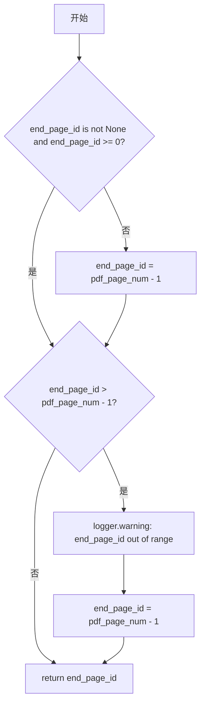
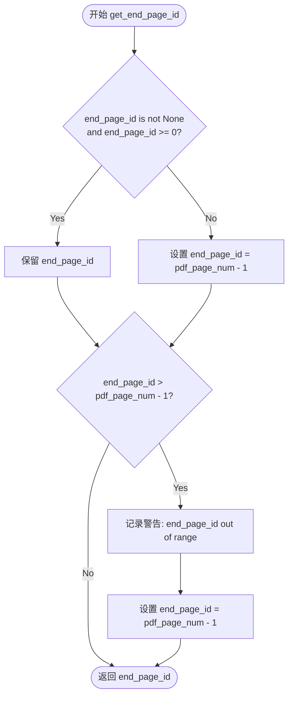

# `MinerU\mineru\utils\pdf_page_id.py` 详细设计文档

该代码实现了一个用于计算PDF文档结束页码的辅助函数，通过对传入的结束页码进行边界检查和自动调整，确保结束页码始终在有效的PDF页码范围内，并使用loguru记录超出范围的警告信息。

## 整体流程



## 类结构

```
无类结构（仅包含全局函数）
```

## 全局变量及字段


### `logger`
    
loguru日志实例，用于记录警告信息

类型：`loguru.logger`
    


    

## 全局函数及方法


### `get_end_page_id`

该函数负责计算并返回一个有效的PDF结束页码索引。它首先检查传入的 `end_page_id` 是否有效（不为 `None` 且非负），若无效则默认为 PDF 最后一页；若有效但超出了实际 PDF 的页数范围，则修正为最后一页的索引并记录警告日志，确保不会发生数组越界。

参数：

- `end_page_id`：`int | None`，用户期望的结束页码。如果为 `None` 或负数，将被视为无效并被替换。
- `pdf_page_num`：`int`，PDF 文档的总页数。

返回值：`int`，经过校验和修正后的有效结束页码索引（从 0 开始）。

#### 流程图



#### 带注释源码

```python
# Copyright (c) Opendatalab. All rights reserved.
from loguru import logger


def get_end_page_id(end_page_id, pdf_page_num):
    # 1. 基础校验：如果 end_page_id 为 None 或者小于 0，则视为无效，
    #    将其默认设置为 PDF 的最后一页（索引为总页数减 1）
    end_page_id = end_page_id if end_page_id is not None and end_page_id >= 0 else pdf_page_num - 1
    
    # 2. 边界校验：如果计算后的 end_page_id 仍然超出了 PDF 的实际索引范围，
    #    则进行强制修正，并打印警告日志
    if end_page_id > pdf_page_num - 1:
        logger.warning("end_page_id is out of range, use images length")
        end_page_id = pdf_page_num - 1
        
    # 3. 返回最终计算出的有效结束页码索引
    return end_page_id
```

## 关键组件


### get_end_page_id 函数

负责计算PDF的结束页码，确保结束页码在有效范围内（0到pdf_page_num-1之间），处理None值、负数和越界等边界情况。

### 参数处理逻辑

对end_page_id进行有效性验证，如果为None或负数则默认使用PDF最后一页（pdf_page_num - 1）。

### 越界保护机制

当end_page_id超出PDF实际页数范围时，记录警告日志并将值修正为pdf_page_num - 1。

### loguru日志集成

使用loguru库记录边界情况警告信息，用于调试和追踪异常页码输入。


## 问题及建议


### 已知问题

- **参数设计不当**：参数 `end_page_id` 既作为输入又作为输出变量，违反了函数参数设计的单一职责原则，降低了代码可读性
- **输入验证缺失**：未对 `pdf_page_num` 进行有效性检查（如 None、负数或零），当传入非法值时会导致 `TypeError` 或返回错误的 `-1`
- **边界条件处理不完整**：当 `pdf_page_num <= 0` 时，函数会返回 `-1`，这在业务逻辑上可能是无效的页码
- **日志信息不准确**：日志提示 "use images length" 但实际使用的是 `pdf_page_num - 1`，信息存在误导性
- **魔法数字**：`pdf_page_num - 1` 中的 `-1` 缺乏语义化定义，可维护性较差

### 优化建议

- 将输入参数和输出参数分离，使用独立的变量接收返回值，提高函数签名的清晰度
- 在函数入口处添加 `pdf_page_num` 的有效性校验，确保其为正整数
- 明确处理 `pdf_page_num <= 0` 的边界情况，可抛出明确的异常或返回合适的默认值
- 修正日志信息，使其准确反映实际逻辑，如 "end_page_id is out of range, adjusted to pdf_page_num - 1"
- 考虑使用 Enum 或常量类定义页码相关的边界值，提高代码可维护性


## 其它


### 设计目标与约束

本函数的设计目标是在PDF处理场景中安全地计算有效的结束页码，确保结束页码不会超出PDF的实际页数范围。约束条件包括：end_page_id参数可以为None或负数，此时需要使用PDF的最后一页作为默认值；同时end_page_id不能超过pdf_page_num - 1的有效索引范围。

### 错误处理与异常设计

本函数不抛出异常，而是通过日志记录警告信息。当end_page_id超出有效范围时，使用logger.warning()记录警告，并将值修正为合法范围的最大值（pdf_page_num - 1）。这种设计采用了防御性编程策略，将异常情况转化为安全的默认值，保证调用方始终获得有效的页码。

### 数据流与状态机

输入数据流：end_page_id（可能为None、负数或正整数）→ pdf_page_num（正整数，表示PDF总页数）。处理流程：首先判断end_page_id是否为有效值，如果不是则使用默认值；然后检查是否超出上界，超出则修正。输出数据流：返回经过校验和修正的end_page_id（整数），范围始终在[0, pdf_page_num - 1]区间内。

### 外部依赖与接口契约

外部依赖：loguru模块的logger对象，用于输出警告日志。接口契约：函数接受两个参数——end_page_id（int或None类型，表示用户指定的结束页码）和pdf_page_num（int类型，表示PDF的总页数）；返回值类型为int，表示修正后的结束页码。调用方需确保pdf_page_num为正整数。

### 性能考虑

该函数的时间复杂度为O(1)，只包含常数次的比较和赋值操作。空间复杂度为O(1)，仅使用局部变量存储临时值。由于逻辑简单且无循环或递归调用，执行性能极高，适合在高频调用场景中使用。

### 安全性考虑

输入验证：函数对end_page_id进行了隐式的类型假设（期望为int或None类型），但未对pdf_page_num的类型进行严格校验。潜在风险：如果传入的pdf_page_num为负数或非整数，可能导致意外行为。建议在调用前确保pdf_page_num为有效的正整数。日志信息可能会暴露系统内部状态，但在本场景中属于可接受范围。

### 使用示例与边界情况

边界情况1：end_page_id为None，pdf_page_num为5，返回4（最后一页索引）。边界情况2：end_page_id为-1，pdf_page_num为5，返回4（修正为最后一页）。边界情况3：end_page_id为10，pdf_page_num为5，返回4（超出范围，修正为最后一页）。边界情况4：end_page_id为2，pdf_page_num为5，返回2（正常值，直接返回）。

### 版本历史

初始版本（v1.0）：创建get_end_page_id函数，实现基本的结束页码校验和修正逻辑。


    