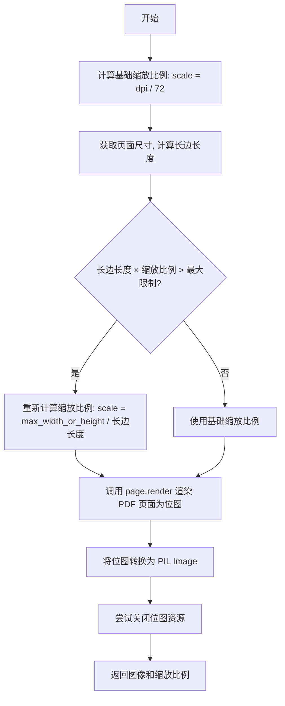
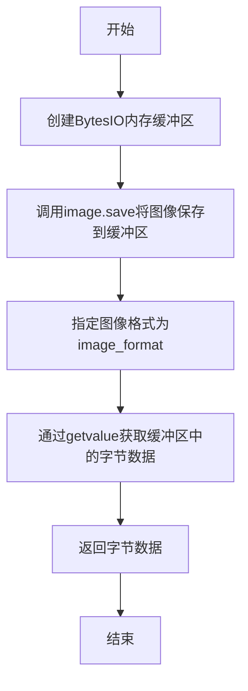
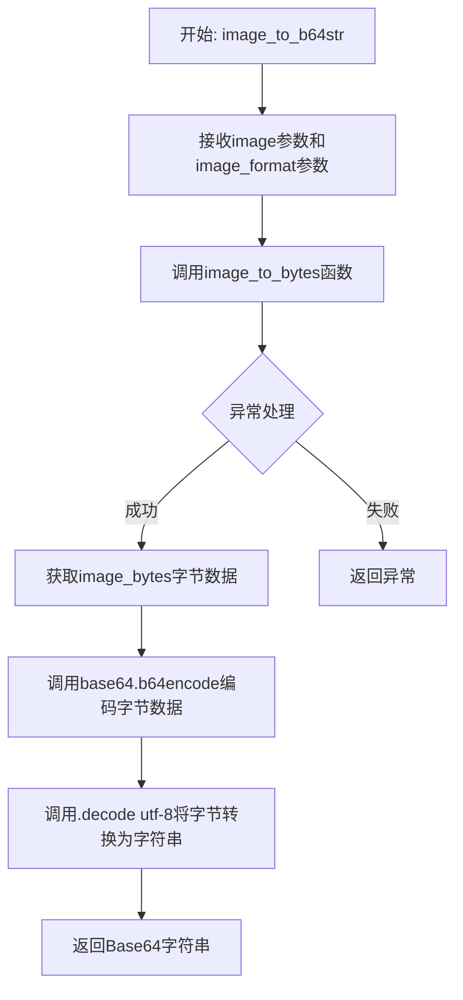
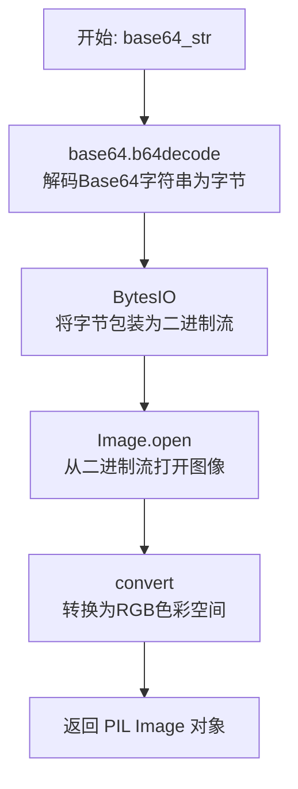
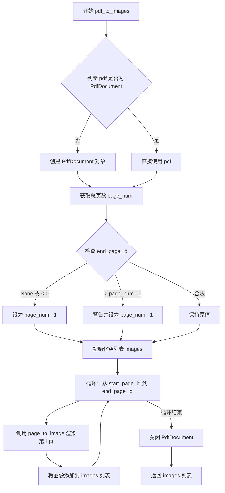
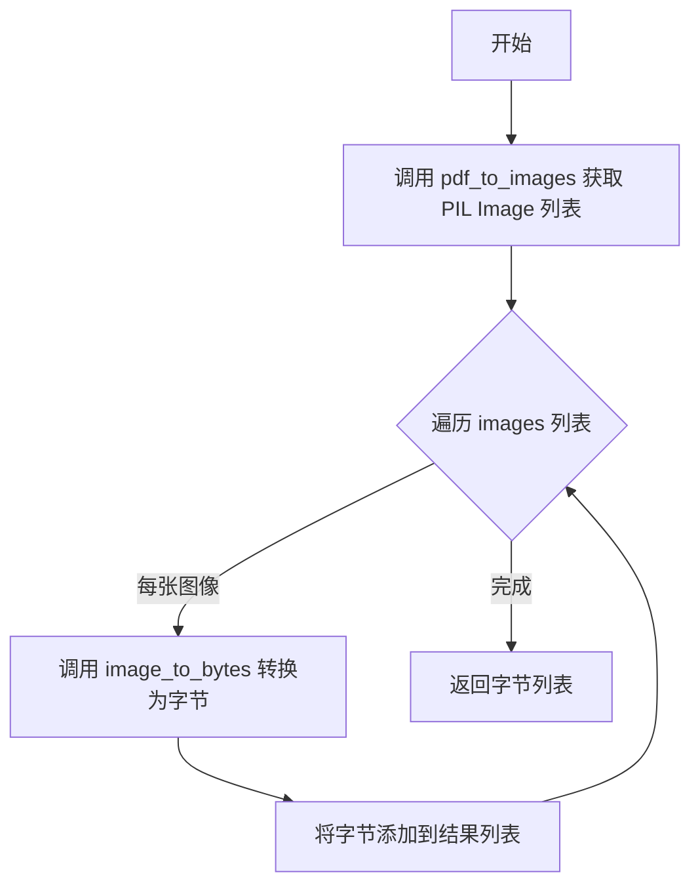
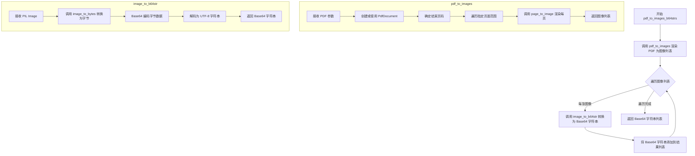

# `MinerU\mineru\utils\pdf_reader.py` 详细设计文档

这是一个用于将PDF文档光栅化（Rasterize）的工具模块。它主要负责将PDF文件或字节流转换为PIL图像对象、图像字节流或Base64编码字符串，并提供了灵活的DPI和最大尺寸控制逻辑。

## 整体流程

```mermaid
graph TD
    A[开始: 输入 PDF (str/bytes/PdfDocument)] --> B{输入类型是否为 PdfDocument?}
    B -- 是 --> C[直接使用]
    B -- 否 --> D[使用 PdfDocument 构造函数加载]
    C --> E[计算结束页码]
    D --> E
    E --> F{循环页码: start_page_id 到 end_page_id}
    F -- 下一页 --> G[调用 page_to_image]
    G --> H[计算缩放比例 (Scale)]
    H --> I[使用 pypdfium2 渲染页面为 Bitmap]
    I --> J[Bitmap 转为 PIL Image]
    J --> K[资源清理: 关闭 Bitmap]
    K --> L{目标输出格式?}
    L -- PIL Image --> M[直接返回 Image 对象]
    L -- Bytes --> N[调用 image_to_bytes]
    L -- Base64 --> O[调用 image_to_b64str]
    N --> P[返回字节列表]
    O --> Q[返回字符串列表]
    M --> R[返回图像列表]
    F -- 循环结束 --> S[关闭 PdfDocument 资源]
    S --> T[结束]
```

## 类结构

```
Module: pdf_processor (无类定义，纯函数模块)
├── 转换函数集
│   ├── page_to_image (单页转图像)
│   ├── image_to_bytes (图像转字节)
│   ├── image_to_b64str (图像转Base64)
│   └── base64_to_pil_image (Base64转图像 - 逆向)
└── 批量处理函数集
    ├── pdf_to_images (批量转图像列表)
    ├── pdf_to_images_bytes (批量转字节列表)
    └── pdf_to_images_b64strs (批量转Base64列表)
```

## 全局变量及字段


### `page_to_image`
    
将PDF页面渲染为PIL图像对象

类型：`function`
    


### `image_to_bytes`
    
将PIL图像转换为字节数据

类型：`function`
    


### `image_to_b64str`
    
将PIL图像转换为Base64字符串

类型：`function`
    


### `base64_to_pil_image`
    
将Base64字符串转换回PIL图像

类型：`function`
    


### `pdf_to_images`
    
将整个PDF文档转换为图像列表

类型：`function`
    


### `pdf_to_images_bytes`
    
将PDF转换为图像字节列表

类型：`function`
    


### `pdf_to_images_b64strs`
    
将PDF转换为Base64字符串列表

类型：`function`
    


    

## 全局函数及方法


### `page_to_image`

将 PDF 页面对象渲染为 PIL Image 图像，并返回图像及实际使用的缩放比例。

参数：

- `page`：`PdfPage`，PDF 页面对象（pypdfium2 的 PdfPage 实例）
- `dpi`：`int`，目标渲染 DPI，默认为 200
- `max_width_or_height`：`int`，渲染后图像的长边最大像素值，默认为 3500

返回值：`(Image.Image, float)`，返回元组，第一个元素为 PIL Image 图像对象，第二个元素为实际使用的缩放比例

#### 流程图



#### 带注释源码

```python
def page_to_image(
    page: PdfPage,
    dpi: int = 200,
    max_width_or_height: int = 3500,  # changed from 4500 to 3500
) -> (Image.Image, float):
    # 将 DPI 转换为缩放比例（PDF 默认 72 DPI）
    scale = dpi / 72

    # 获取 PDF 页面的宽高尺寸，计算长边长度
    long_side_length = max(*page.get_size())
    
    # 如果渲染后的长边超过最大限制，则按比例缩小
    if (long_side_length*scale) > max_width_or_height:
        scale = max_width_or_height / long_side_length

    # 使用 pypdfium2 渲染页面为位图对象
    bitmap: PdfBitmap = page.render(scale=scale)  # type: ignore

    # 将位图转换为 PIL Image 对象
    image = bitmap.to_pil()
    
    # 显式关闭位图以释放资源，捕获可能的异常
    try:
        bitmap.close()
    except Exception as e:
        logger.error(f"Failed to close bitmap: {e}")
    
    # 返回图像对象和实际使用的缩放比例
    return image, scale
```


### `image_to_bytes`

该函数接收一个 PIL Image 对象，并将其转换为指定格式（默认为 JPEG）的字节数据，使用 BytesIO 作为内存缓冲区来存储图像数据。

参数：

- `image`：`Image.Image`，要转换的 PIL 图像对象
- `image_format`：`str`，图像格式，默认为 "JPEG"（也支持 "PNG"）

返回值：`bytes`，转换后的图像字节数据

#### 流程图



#### 带注释源码

```python
def image_to_bytes(
    image: Image.Image,
    # image_format: str = "PNG",  # 也可以用 "JPEG"
    image_format: str = "JPEG",
) -> bytes:
    """
    将PIL图像对象转换为字节数据
    
    参数:
        image: PIL Image对象，要转换的图像
        image_format: 图像格式字符串，默认为"JPEG"
    
    返回:
        bytes: 指定格式的图像字节数据
    """
    # 创建一个内存缓冲区对象，用于临时存储图像数据
    with BytesIO() as image_buffer:
        # 使用PIL的save方法将图像写入缓冲区，format参数指定图像格式
        image.save(image_buffer, format=image_format)
        # 获取缓冲区中的所有字节数据并返回
        return image_buffer.getvalue()
```


### `image_to_b64str`

将 PIL Image 对象转换为 Base64 编码的字符串，用于在不支持直接传输二进制数据的场景（如 JSON、HTML、URL 等）中传输图像数据。

参数：

- `image`：`Image.Image`，PIL 图片对象，即需要转换的图像数据
- `image_format`：`str`，图像格式，默认为 "JPEG"，支持 "PNG" 等其他 PIL 支持的格式

返回值：`str`，Base64 编码后的字符串，可直接用于数据传输或嵌入到 HTML/Data URI 中

#### 流程图



#### 带注释源码

```python
def image_to_b64str(
    image: Image.Image,
    # image_format: str = "PNG",  # 也可以用 "JPEG"
    image_format: str = "JPEG",
) -> str:
    """
    将PIL Image对象转换为Base64编码的字符串
    
    参数:
        image: PIL Image对象,需要转换的图像
        image_format: 图像格式,默认为JPEG,可改为PNG等格式
    
    返回:
        Base64编码的字符串
    """
    # 第一步: 调用image_to_bytes将PIL图像转换为字节数据
    image_bytes = image_to_bytes(image, image_format)
    
    # 第二步: 使用base64模块进行编码
    # b64encode接受bytes类型,返回也是bytes类型
    # decode('utf-8')将bytes转换为字符串
    return base64.b64encode(image_bytes).decode("utf-8")
```


### `base64_to_pil_image`

将 Base64 编码的字符串转换为 PIL Image 对象，支持常见的图像格式解码。

参数：

- `base64_str`：`str`，Base64 编码的图像数据字符串

返回值：`Image.Image`，解码后的 PIL 图像对象（RGB 格式）

#### 流程图



#### 带注释源码

```python
def base64_to_pil_image(
    base64_str: str,
) -> Image.Image:
    """Convert base64 string to PIL Image."""
    # 使用base64模块将Base64字符串解码为字节数据
    image_bytes = base64.b64decode(base64_str)
    # 将解码后的字节数据包装为BytesIO二进制缓冲区
    with BytesIO(image_bytes) as image_buffer:
        # 使用PIL从二进制缓冲区打开图像，并转换为RGB模式
        return Image.open(image_buffer).convert("RGB")
```


### `pdf_to_images`

该函数将PDF文档转换为PIL Image对象列表，支持指定页码范围、分辨率和最大尺寸，实现PDF页面的 rasterization 过程。

参数：

- `pdf`：`str | bytes | PdfDocument`，PDF文件路径（字符串）、PDF字节数据或已加载的 PdfDocument 对象
- `dpi`：`int = 200`，渲染分辨率（每英寸点数），默认200dpi
- `max_width_or_height`：`int = 3500`，输出图像的最大宽度或高度像素值，默认3500
- `start_page_id`：`int = 0`，起始页码（0-based），默认从第一页开始
- `end_page_id`：`int | None = None`，结束页码（0-based），默认 None 表示最后一页

返回值：`list[Image.Image]`，返回 PIL Image 对象列表，每个元素对应一页PDF的图像

#### 流程图



#### 带注释源码

```python
def pdf_to_images(
    pdf: str | bytes | PdfDocument,
    dpi: int = 200,
    max_width_or_height: int = 3500,
    start_page_id: int = 0,
    end_page_id: int | None = None,
) -> list[Image.Image]:
    """
    将PDF文档转换为PIL Image对象列表
    
    Args:
        pdf: PDF文件路径（str）、PDF字节数据（bytes）或已加载的PdfDocument对象
        dpi: 渲染分辨率（每英寸点数），默认200
        max_width_or_height: 输出图像的最大宽度或高度像素值，默认3500
        start_page_id: 起始页码（0-based索引），默认0
        end_page_id: 结束页码（0-based索引），默认None表示到最后一页
    
    Returns:
        list[Image.Image]: PIL Image对象列表，每个元素对应一页PDF
    """
    # 如果输入不是PdfDocument对象，则创建PdfDocument实例
    # 支持字符串路径、字节数据两种输入形式
    doc = pdf if isinstance(pdf, PdfDocument) else PdfDocument(pdf)
    
    # 获取PDF总页数
    page_num = len(doc)

    # 处理结束页码边界情况
    # 如果end_page_id为None或负数，设置为最后一页索引
    end_page_id = end_page_id if end_page_id is not None and end_page_id >= 0 else page_num - 1
    
    # 如果end_page_id超出实际页数范围，警告并修正为最后一页
    if end_page_id > page_num - 1:
        logger.warning("end_page_id is out of range, use images length")
        end_page_id = page_num - 1

    # 初始化用于存储图像的空列表
    images = []
    try:
        # 遍历指定页码范围，将每页PDF渲染为图像
        for i in range(start_page_id, end_page_id + 1):
            # 调用page_to_image将单个PDF页面转换为PIL Image
            # 返回(image, scale)元组，这里用_忽略scale
            image, _ = page_to_image(doc[i], dpi, max_width_or_height)
            images.append(image)
    finally:
        # 确保PdfDocument资源被正确释放
        # 即使渲染过程中发生异常也会执行关闭操作
        try:
            doc.close()
        except Exception:
            # 忽略关闭时的异常，防止掩盖原始错误
            pass
    
    # 返回转换后的PIL Image对象列表
    return images
```


### `pdf_to_images_bytes`

该函数是PDF转图像的核心输出函数之一，负责将PDF文档转换为指定格式的图像字节数据列表。它首先调用`pdf_to_images`获取PIL Image对象列表，然后通过`image_to_bytes`将每张图像转换为字节格式，最终返回包含各页图像二进制数据的列表。

参数：

- `pdf`：`str | bytes | PdfDocument`，输入的PDF文件，支持文件路径字符串、字节数据或PdfDocument对象
- `dpi`：`int`，图像渲染DPI，默认为200
- `max_width_or_height`：`int`，图像最大宽度或高度，默认为3500像素
- `start_page_id`：`int`，起始页码（从0开始），默认为0
- `end_page_id`：`int | None`，结束页码，默认为None表示处理到最后一页
- `image_format`：`str`，输出图像格式，默认为JPEG

返回值：`list[bytes]`，返回各页图像的字节数据列表

#### 流程图



#### 带注释源码

```python
def pdf_to_images_bytes(
    pdf: str | bytes | PdfDocument,
    dpi: int = 200,
    max_width_or_height: int = 3500,
    start_page_id: int = 0,
    end_page_id: int | None = None,
    # image_format: str = "PNG",  # 也可以用 "JPEG"
    image_format: str = "JPEG",
) -> list[bytes]:
    """
    将PDF文档转换为图像字节数据列表
    
    参数:
        pdf: PDF文件路径(str)、字节数据(bytes)或PdfDocument对象
        dpi: 图像渲染DPI，默认200
        max_width_or_height: 图像最大宽度或高度，默认3500
        start_page_id: 起始页码（从0开始），默认0
        end_page_id: 结束页码，None表示最后一页，默认None
        image_format: 输出图像格式，JPEG或PNG，默认JPEG
    
    返回:
        list[bytes]: 各页图像的字节数据列表
    """
    # 调用 pdf_to_images 获取 PIL Image 对象列表
    images = pdf_to_images(pdf, dpi, max_width_or_height, start_page_id, end_page_id)
    
    # 遍历每张图像，转换为字节格式并返回列表
    return [image_to_bytes(image, image_format) for image in images]
```


### `pdf_to_images_b64strs`

该函数将 PDF 文档转换为 Base64 编码的图像字符串列表。它首先调用 `pdf_to_images` 将 PDF 页面渲染为 PIL Image 列表，然后对每个图像调用 `image_to_b64str` 进行 Base64 编码，最终返回编码后的字符串列表。

参数：

- `pdf`：`str | bytes | PdfDocument`，要转换的 PDF 文件，可以是文件路径、字节数据或 PdfDocument 对象
- `dpi`：`int`，渲染 DPI，分辨率参数，默认为 200
- `max_width_or_height`：`int`，最大宽度或高度，用于控制图像尺寸，默认为 3500
- `start_page_id`：`int`，起始页码索引，默认为 0
- `end_page_id`：`int | None`，结束页码索引，None 表示到最后一页，默认为 None
- `image_format`：`str`，输出图像格式，默认为 "JPEG"

返回值：`list[str]`，Base64 编码的图像字符串列表

#### 流程图



#### 带注释源码

```python
def pdf_to_images_b64strs(
    pdf: str | bytes | PdfDocument,  # 输入：PDF 文件路径、字节或 PdfDocument 对象
    dpi: int = 200,                  # 参数：渲染 DPI，分辨率控制
    max_width_or_height: int = 3500,  # 参数：图像最大宽度或高度
    start_page_id: int = 0,          # 参数：起始页码（从 0 开始）
    end_page_id: int | None = None,  # 参数：结束页码，None 表示最后一页
    # image_format: str = "PNG",    # 备选：可选的图像格式（已注释）
    image_format: str = "JPEG",     # 参数：输出图像格式，默认为 JPEG
) -> list[str]:                      # 返回值：Base64 编码的图像字符串列表
    """
    将 PDF 文档转换为 Base64 编码的图像字符串列表。
    
    工作流程：
    1. 调用 pdf_to_images 将 PDF 页面渲染为 PIL Image 列表
    2. 遍历每个图像，使用 image_to_b64str 转换为 Base64 编码字符串
    3. 返回字符串列表
    """
    
    # 第一步：调用 pdf_to_images 函数将 PDF 转换为 PIL Image 列表
    # 该函数内部处理 PDF 加载、页面渲染和资源清理
    images = pdf_to_images(
        pdf,               # PDF 源文件
        dpi,               # 渲染分辨率
        max_width_or_height,  # 最大尺寸限制
        start_page_id,     # 起始页
        end_page_id        # 结束页
    )
    
    # 第二步：遍历图像列表，将每张图像转换为 Base64 字符串
    # 使用列表推导式简洁地处理所有图像
    # image_to_b64str 内部会调用 image_to_bytes 和 base64.b64encode
    return [image_to_b64str(image, image_format) for image in images]
```

## 关键组件


### PDF页面渲染组件 (page_to_image)

将PDF单个页面渲染为PIL图像，支持DPI和最大尺寸约束，通过比例计算确保输出图像在限定范围内。

### 图像编码组件 (image_to_bytes)

将PIL图像对象转换为指定格式（默认为JPEG）的字节数据，用于后续传输或存储。

### 图像Base64编码组件 (image_to_b64str)

将图像字节数据编码为Base64字符串，便于在JSON/API等文本协议中传输图像数据。

### 图像Base64解码组件 (base64_to_pil_image)

将Base64字符串解码并转换为PIL图像对象，支持RGB色彩模式。

### PDF转图像列表工作流 (pdf_to_images)

核心转换函数，支持指定页面范围，将PDF文档转换为PIL图像列表，包含文档关闭的异常处理。

### PDF转图像字节工作流 (pdf_to_images_bytes)

在pdf_to_images基础上进一步将图像列表转换为字节列表的便捷函数。

### PDF转Base64字符串工作流 (pdf_to_images_b64strs)

在pdf_to_images基础上进一步将图像列表转换为Base64字符串列表的便捷函数。


## 问题及建议


### 已知问题

-   **资源管理不当**：在 `pdf_to_images` 函数中，如果传入的 `pdf` 已经是 `PdfDocument` 对象，函数会调用 `doc.close()` 关闭它，这可能导致调用者后续无法使用该文档对象
-   **异常处理不完整**：`pdf_to_images` 中遍历页面时没有捕获 `doc[i]` 可能抛出的异常（如页面索引越界），会导致整个函数失败且信息不明确
-   **返回值类型不一致**：`page_to_image` 函数声明返回类型为 `(Image.Image, float)`，但实际返回的是元组 `(image, scale)`
-   **缺少上下文管理器支持**：没有为 `PdfDocument` 提供上下文管理器协议支持，使用不够方便
-   **参数校验缺失**：没有对 `dpi`、`max_width_or_height` 等数值参数进行有效性校验，负值或零值可能导致异常

### 优化建议

-   **改进资源管理逻辑**：区分传入的 `PdfDocument` 是否由本函数创建，如果是调用者传入的则不应关闭
-   **增强异常处理**：为页面渲染和文档操作添加 try-except 块，提供更友好的错误信息
-   **统一返回类型**：使用 TypedDict 或 dataclass 明确返回类型，提高代码可读性
-   **添加参数校验**：在函数入口处添加参数有效性检查，如 `dpi > 0`、`max_width_or_height > 0`
-   **实现上下文管理器**：考虑封装一个 PDF 上下文管理器类，自动处理资源释放
-   **考虑流式处理**：对于大型 PDF，建议添加生成器模式支持，避免一次性加载所有图像到内存

## 其它


### 设计目标与约束

本模块的设计目标是提供一个轻量级、高效的PDF转图像解决方案，支持将PDF文档的指定页面范围转换为PIL图像对象、字节数据或Base64字符串。核心约束包括：仅支持Python 3.8+环境，依赖pypdfium2和Pillow库，输出图像默认格式为JPEG（可通过参数调整为PNG），支持自定义DPI和最大分辨率限制以平衡图像质量与内存占用。

### 性能考量与优化空间

模块在处理大型PDF时存在优化空间：当前实现逐页渲染并一次性加载所有图像到内存，当PDF页数较多时可能导致内存峰值过高。建议考虑生成器模式（Generator）实现流式处理，减少内存占用。另外，`bitmap.close()`调用放在try-except中但未完全释放底层资源，可考虑使用上下文管理器或显式垃圾回收。当前默认DPI为200、最大边长3500像素，适合大多数场景，但可通过参数调优以适应不同性能需求。

### 错误处理与异常设计

模块采用分层的异常处理策略：对于bitmap关闭失败，记录日志但不中断流程（logger.error）；对于PDF文档关闭异常，静默处理以确保资源释放；对于页面索引越界，自动修正并记录警告。缺少对PDF文件格式错误、损坏PDF、权限受限等情况的显式处理，建议增加更具体的异常类型和错误信息返回。当前返回类型使用tuple可能导致类型提示不够精确，可考虑使用@dataclass或NamedTuple增强类型安全。

### 数据流与状态机

数据流主要包含三条路径：路径一（pdf_to_images）：PDF输入→PdfDocument解析→逐页渲染→PIL图像列表；路径二（pdf_to_images_bytes）：路径一结果→逐个转换为JPEG字节→字节列表；路径三（pdf_to_images_b64strs）：路径一结果→逐个转换为Base64字符串→字符串列表。状态转换遵循：文档加载→页面迭代→图像渲染→格式转换→资源释放。无复杂状态机设计，流程为线性管道式处理。

### 外部依赖与接口契约

核心依赖包括：pypdfium2（PDF解析与渲染）、Pillow（图像处理）、loguru（日志记录）、base64（编码转换）。接口契约规定：输入PDF支持str（文件路径）、bytes（PDF字节数据）、PdfDocument（已解析文档）三种形式；输出图像格式默认为JPEG可配置；页面索引采用0-based起始；end_page_id为None或负数时自动调整为最后一页；所有函数参数均具有默认值，支持最小化调用。返回的图像对象为PIL.Image.Image类型，字节数据为bytes类型，字符串为UTF-8编码的Base64字符串。

### 安全考虑

模块处理来自外部的PDF输入时存在潜在风险：恶意构造的PDF文件可能导致内存溢出或无限循环；Base64解码未验证数据有效性；文件路径输入未做路径遍历检查（虽然当前未直接处理文件IO）。建议增加：输入验证（文件魔数检查、大小限制）、资源限制（最大页数、最大内存使用）、超时控制（防止渲染卡死）。

### 配置管理与参数说明

主要配置参数包括：dpi（渲染分辨率，默认200，影响图像清晰度和文件大小）、max_width_or_height（最大边长，默认3500，用于防止高分辨率PDF导致内存爆炸）、image_format（输出格式，默认JPEG，可选PNG）、start_page_id和end_page_id（页面范围控制）。所有参数可通过函数参数动态覆盖，适合不同业务场景的灵活配置。

### 版本兼容性与平台依赖

模块依赖pypdfium2，该库底层使用PDFium（Google开源PDF引擎），需要根据平台安装对应的二进制依赖。代码中使用`from __future__ import annotations`风格的类型提示（PDF类型使用字符串引用），确保与Python 3.8+的兼容性。pypdfium2的版本兼容性需在requirements中明确指定，避免API变更导致功能异常。

### 使用示例与调用模式

基础调用模式：`pdf_to_images("document.pdf")`返回所有页面图像列表；指定范围：`pdf_to_images("doc.pdf", start_page_id=0, end_page_id=5)`转换前6页；获取Base64：`pdf_to_images_b64strs(pdf_bytes)`适合Web API传输；自定义质量：`pdf_to_images("doc.pdf", dpi=300, max_width_or_height=4500)`获得更高分辨率。典型应用场景包括：PDF预览生成、文档OCR预处理、PDF转图片存储等。

### 测试考虑与质量保障

建议补充的测试用例包括：正常PDF转换功能测试（多页PDF、单页PDF）、参数边界测试（dpi范围、max_width_or_height极限值）、异常输入测试（损坏PDF、空PDF、无效路径）、资源清理测试（确保PdfDocument正确关闭）、大文件压力测试（评估内存占用）、输出格式验证（图像尺寸、格式、编码正确性）。当前代码覆盖率可能不足，建议增加单元测试和集成测试。

### 关键组件信息

本模块的关键组件为page_to_image函数，它是整个转换流程的核心，负责PDF页面到PIL图像的实际渲染转换，其性能直接影响整体效率。另外PdfDocument的生命周期管理（加载、遍历、关闭）也是关键点，当前实现存在资源泄露风险。

    