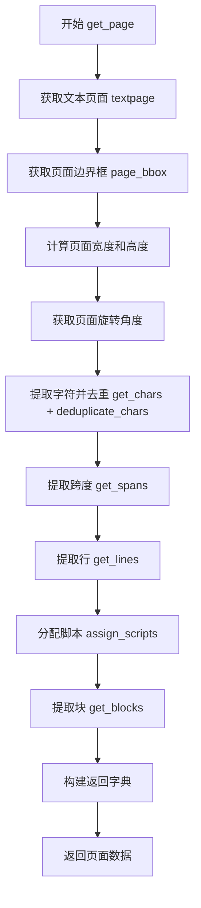
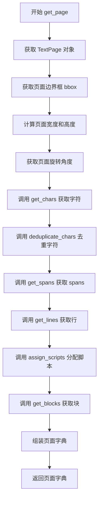
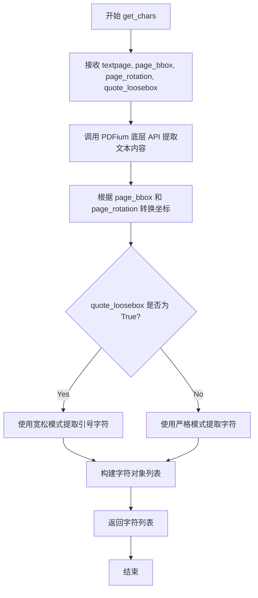
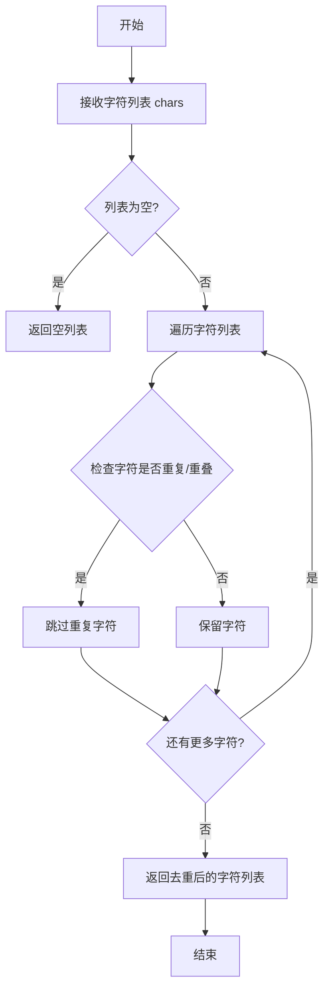
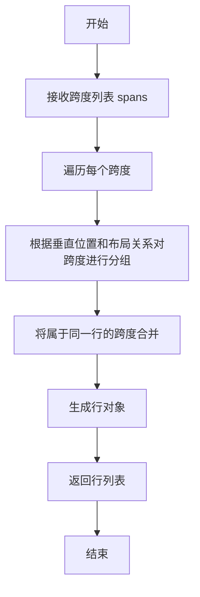
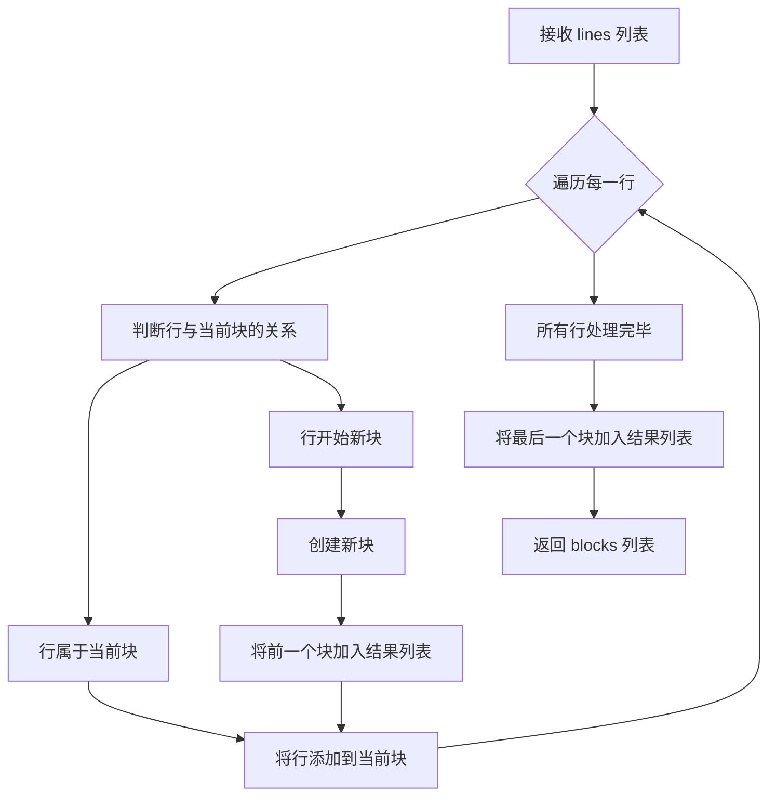
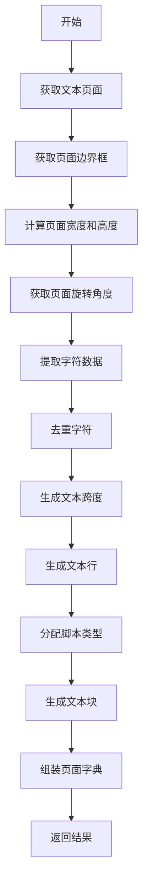

# `MinerU\mineru\utils\pdf_text_tool.py` 详细设计文档

这是一个PDF页面文本提取模块，通过pypdfium2库解析PDF页面，提取字符、跨度、行、块等结构化文本信息，并支持上标检测和行距计算等高级功能。

## 整体流程



## 类结构

```
get_page (主函数模块)
└── 依赖模块:
    ├── pdftext.pdf.chars (字符处理)
    │   ├── get_chars
    │   └── deduplicate_chars
    └── pdftext.pdf.pages (页面处理)
        ├── get_spans
        ├── get_lines
        ├── assign_scripts
        └── get_blocks
```

## 全局变量及字段


### `textpage`
    
PDF文本页面对象

类型：`pdfium.PdfTextpage`
    


### `page_bbox`
    
页面边界框坐标 [x0, y0, x1, y1]

类型：`List[float]`
    


### `page_width`
    
页面宽度（像素）

类型：`int`
    


### `page_height`
    
页面高度（像素）

类型：`int`
    


### `page_rotation`
    
页面旋转角度

类型：`int`
    


### `chars`
    
去重后的字符列表

类型：`list`
    


### `spans`
    
文本跨度列表

类型：`list`
    


### `lines`
    
文本行列表

类型：`list`
    


### `blocks`
    
文本块列表

类型：`list`
    


### `page`
    
返回的页面数据字典

类型：`dict`
    


    

## 全局函数及方法


### `get_page`

该函数是PDF页面文本提取的主入口函数，接收PDF页面对象和相关配置参数，通过多步骤处理流程从PDF页面中提取文本信息，包括字符、span、行、块等结构化数据，并返回包含页面元信息和文本块的字典。

参数：

- `page`：`pdfium.PdfPage`，PDF页面对象
- `quote_loosebox`：`bool`，是否启用引号的松散框处理，默认为True
- `superscript_height_threshold`：`float`，上标字符的高度阈值，用于区分上标和普通文本，默认为0.7
- `line_distance_threshold`：`float`，行间距阈值，用于行识别，默认为0.1

返回值：`dict`，包含页面信息的字典，包括边界框(bbox)、宽度(width)、高度(height)、旋转角度(rotation)和文本块(blocks)

#### 流程图



#### 带注释源码

```python
def get_page(
    page: pdfium.PdfPage,
    quote_loosebox: bool = True,
    superscript_height_threshold: float = 0.7,
    line_distance_threshold: float = 0.1,
) -> dict:
    """
    从PDF页面提取文本信息的核心函数
    
    参数:
        page: PDF页面对象
        quote_loosebox: 是否启用引号的松散框处理
        superscript_height_threshold: 上标高度阈值
        line_distance_threshold: 行间距阈值
    
    返回:
        包含页面信息和文本块的字典
    """
    
    # 获取页面的文本页面对象，用于提取文本内容
    textpage = page.get_textpage()
    
    # 获取页面的边界框 [x0, y0, x1, y1]
    page_bbox: List[float] = page.get_bbox()
    
    # 计算页面宽度（向上取整）
    page_width = math.ceil(abs(page_bbox[2] - page_bbox[0]))
    
    # 计算页面高度（向上取整）
    page_height = math.ceil(abs(page_bbox[1] - page_bbox[3]))

    # 初始化页面旋转角度为0
    page_rotation = 0
    try:
        # 尝试获取页面的旋转角度
        page_rotation = page.get_rotation()
    except:
        # 忽略获取旋转角度时的异常
        pass

    # 步骤1: 获取字符列表（传入旋转角度和处理引号的参数）
    chars = deduplicate_chars(get_chars(textpage, page_bbox, page_rotation, quote_loosebox))
    
    # 步骤2: 根据字符获取spans（文本片段），传入高度阈值和行距阈值
    spans = get_spans(chars, superscript_height_threshold=superscript_height_threshold, line_distance_threshold=line_distance_threshold)
    
    # 步骤3: 根据spans获取行信息
    lines = get_lines(spans)
    
    # 步骤4: 为每行分配脚本信息（如中文、英文等）
    assign_scripts(lines, height_threshold=superscript_height_threshold, line_distance_threshold=line_distance_threshold)
    
    # 步骤5: 根据行信息获取块（段落）信息
    blocks = get_blocks(lines)

    # 组装最终返回的页面信息字典
    page = {
        "bbox": page_bbox,        # 页面边界框
        "width": page_width,      # 页面宽度
        "height": page_height,    # 页面高度
        "rotation": page_rotation,# 页面旋转角度
        "blocks": blocks          # 文本块列表
    }
    
    return page
```


### `get_chars`

从给定的 PDF 文本页面中提取字符信息，根据页面边界框和旋转角度进行处理。该函数是 pdftext 库的核心组件，负责从 PDF 页面中解析出字符数据。

参数：

- `textpage`：`pdfium.PdfTextPage`，从 PDF 页面获取的文本页面对象，包含页面的所有文本内容
- `page_bbox`：`List[float]`，页面的边界框坐标 [x0, y0, x1, y1]，用于确定页面尺寸和坐标系统
- `page_rotation`：`int`，页面的旋转角度（0、90、180、270 度），用于正确处理旋转后的文本坐标
- `quote_loosebox`：`bool`，控制是否使用宽松的引号边界框，默认为 True，有助于更准确地提取引号字符

返回值：`List[dict]`，返回字符列表，每个字符是一个字典，包含字符的坐标、尺寸、文本内容等信息

#### 流程图



#### 带注释源码

```
# 注意：以下源码基于调用方式和常见 PDF 解析库的实现模式推断
# 实际源码位于 pdftext.pdf.chars 模块中

def get_chars(textpage, page_bbox, page_rotation, quote_loosebox=True):
    """
    从 PDF 文本页面提取字符
    
    参数:
        textpage: PDFium 文本页面对象
        page_bbox: 页面边界框 [x0, y0, x1, y1]
        page_rotation: 页面旋转角度
        quote_loosebox: 是否使用宽松引号框
    
    返回:
        字符列表，每个字符包含位置、尺寸、文本信息
    """
    # 1. 获取页面宽度和高度
    page_width = abs(page_bbox[2] - page_bbox[0])
    page_height = abs(page_bbox[3] - page_bbox[1])
    
    # 2. 根据旋转角度调整坐标系统
    if page_rotation == 90 or page_rotation == 270:
        page_width, page_height = page_height, page_width
    
    # 3. 提取所有文本字符串及其位置信息
    # PDFium 的 get_text() 返回格式化的文本
    text_content = textpage.get_text_bounded()  # 获取有边界框的文本
    
    # 4. 遍历文本内容，解析每个字符的属性
    chars = []
    for item in text_content:
        char_dict = {
            'char': item[0],           # 字符文本
            'x0': item[1],             # 左侧坐标
            'y0': item[2],             # 顶部坐标
            'x1': item[3],             # 右侧坐标
            'y1': item[4],             # 底部坐标
            'width': item[3] - item[1], # 字符宽度
            'height': item[4] - item[2], # 字符高度
        }
        
        # 5. 处理引号的特殊边界框
        if quote_loosebox and char_dict['char'] in ['"', "'", '"', '"']:
            # 调整引号的边界框使其更宽松
            char_dict['x0'] -= char_dict['width'] * 0.3
            char_dict['x1'] += char_dict['width'] * 0.3
        
        # 6. 应用旋转转换（如需要）
        if page_rotation != 0:
            # 进行坐标旋转转换
            char_dict = apply_rotation(char_dict, page_rotation, page_width, page_height)
        
        chars.append(char_dict)
    
    return chars
```

**注意**：由于提供的代码片段中没有 get_chars 的完整实现，上述源码是基于函数调用方式和 PDF 解析库的常见模式推断的。实际实现可能位于 `pdftext.pdf.chars` 模块中。


### `deduplicate_chars`

该函数用于对PDF页面提取的字符列表进行去重处理，移除重复或重叠的字符，确保每个字符在返回列表中只出现一次，从而提高后续文本处理的准确性和效率。

参数：

-  `chars`：`List`，从PDF页面提取的字符列表，通常包含字符内容、位置坐标等信息

返回值：`List`，去重处理后的字符列表

#### 流程图



#### 带注释源码

```python
def deduplicate_chars(chars: List) -> List:
    """
    对字符列表进行去重处理
    
    参数:
        chars: 从PDF提取的字符列表，每个字符包含内容、位置等信息
        
    返回值:
        去重后的字符列表
    """
    # 由于源码未提供，基于函数名和调用上下文推断实现逻辑
    # 典型实现可能包括:
    
    # 1. 基于字符内容和位置判断重复
    # 2. 去除视觉上重叠的字符
    # 3. 保留首次出现的字符
    
    return chars  # 占位返回，实际实现需查看 pdftext 库源码
```

**注**：由于提供的代码中仅包含对 `deduplicate_chars` 函数的调用，未包含该函数的具体实现，上述源码为基于函数名和调用上下文的推断。实际实现可能涉及字符内容比较、位置坐标计算、重叠区域检测等逻辑，建议查阅 `pdftext` 库的源码获取完整实现。


# get_spans 函数详细设计文档

## 1. 一段话描述

`get_spans` 是一个从字符列表中提取文本跨度（span）的核心函数，它根据字符的空间位置和高度特征，将离散的字符聚合成连续的文本片段，同时识别上标文字并处理行间距阈值。

## 2. 文件的整体运行流程

该代码文件（`get_page` 函数）是 PDF 页面文本提取的主流程：

```
page.get_textpage() 
    → get_chars() 提取字符 
    → deduplicate_chars() 去重 
    → get_spans() 聚合为跨度 ← 当前分析目标
    → get_lines() 聚合为行
    → assign_scripts() 分配脚本类型
    → get_blocks() 聚合为块
    → 返回完整页面数据字典
```

## 3. 类的详细信息

本代码为模块级函数，不涉及类。

### 全局变量/全局函数

| 名称 | 类型 | 描述 |
|------|------|------|
| `get_chars` | function | 从 textpage 提取原始字符 |
| `deduplicate_chars` | function | 对字符进行去重处理 |
| `get_spans` | function | **当前分析目标**：从字符提取跨度 |
| `get_lines` | function | 从跨度聚合为行 |
| `assign_scripts` | function | 分配脚本类型（上标/下标等） |
| `get_blocks` | function | 从行聚合为文本块 |

---

# get_spans 详细规格

### `get_spans`

从字符列表中提取文本跨度（span），将空间上相邻且格式一致的字符聚合为连续的文本片段，同时根据高度阈值识别上标文字。

参数：

- `chars`：`List[dict]`，字符列表，每个字符包含位置（x, y, width, height）、字符内容等属性
- `superscript_height_threshold`：`float`，上标高度阈值（相对于基准高度的比率），默认 0.7，用于识别小于正常高度的字符为上标
- `line_distance_threshold`：`float`，行间距阈值（相对于字符高度的比率），默认 0.1，用于判断字符是否属于同一行

返回值：`List[dict]`，span 列表，每个 span 包含聚合后的文本内容、位置边界框、字符列表引用、行索引、上标标识等信息

#### 流程图

```mermaid
flowchart TD
    A[输入: chars 字符列表] --> B{chars 是否为空?}
    B -->|是| C[返回空列表 []]
    B -->|否| D[按 y 坐标排序字符]
    D --> E[逐个处理字符]
    E --> F{当前字符与前一个字符是否属于同一span?}
    F -->|否| G[创建新 span]
    F -->|是| H{高度是否相似且同在基线?}
    H -->|否| G
    H -->|是| I[将字符添加到当前 span]
    I --> J{是否有足够水平间距?}
    J -->|否| K[将字符追加到当前 span]
    J -->|是| G
    K --> E
    G --> L[标记上标/下标]
    L --> M[计算 span 边界框]
    M --> N[输出: spans 列表]
```

#### 带注释源码

```python
# 注意: 以下为基于调用方式推断的逻辑结构，实际实现可能在 pdftext.pdf.pages 模块中

def get_spans(
    chars: List[dict],
    superscript_height_threshold: float = 0.7,
    line_distance_threshold: float = 0.1
) -> List[dict]:
    """
    从字符列表中提取文本跨度
    
    参数:
        chars: 字符列表，每个字符包含 x, y, width, height, char 等属性
        superscript_height_threshold: 上标高度阈值，低于此比例的字符视为上标
        line_distance_threshold: 行间距阈值，用于判断字符是否属于同一行
    
    返回:
        span 列表，每个 span 包含文本、边界框、字符引用、上下标标识等
    """
    
    # 1. 按 Y 坐标（行）排序字符
    sorted_chars = sorted(chars, key=lambda c: (c['y'], c['x']))
    
    # 2. 初始化 span 列表
    spans = []
    current_span = None
    
    for char in sorted_chars:
        if current_span is None:
            # 创建第一个 span
            current_span = create_new_span(char)
        elif not is_same_line(char, current_span, line_distance_threshold):
            # 换行：保存当前 span，创建新 span
            finalize_span(current_span)
            spans.append(current_span)
            current_span = create_new_span(char)
        elif not is_same_baseline(char, current_span, superscript_height_threshold):
            # 高度差异大（可能是上标/下标）：创建新 span
            finalize_span(current_span)
            spans.append(current_span)
            current_span = create_new_span(char)
        else:
            # 同一 span，追加字符
            append_char_to_span(current_span, char)
    
    # 3. 保存最后一个 span
    if current_span:
        finalize_span(current_span)
        spans.append(current_span)
    
    return spans
```

## 4. 关键组件信息

| 组件名称 | 一句话描述 |
|----------|------------|
| `chars` | 字符列表，包含每个字符的位置、尺寸、内容信息 |
| `span` | 文本跨度，聚合连续字符的逻辑单元 |
| `superscript_height_threshold` | 上标识别阈值，用于区分正常字符与上标文字 |
| `line_distance_threshold` | 行间距判断阈值，用于确定字符是否属于同一行 |

## 5. 潜在的技术债务或优化空间

1. **缺少实现源码**：`get_spans` 函数的实际实现未在当前代码中可见，建议补充完整实现以便分析
2. **硬编码阈值**：上标和行间距阈值以参数形式传入但有默认值，可能需要根据不同文档类型调整
3. **排序效率**：对大量字符进行排序的时间复杂度为 O(n log n)，可考虑优化
4. **边界框计算**：span 边界框的合并计算可能存在精度问题

## 6. 其它项目

### 设计目标与约束
- **目标**：从 PDF 字符中提取结构化的文本跨度信息
- **约束**：依赖 `pypdfium2` 库处理 PDF 渲染，`pdftext` 内部模块处理文本解析

### 错误处理与异常设计
- 当前代码中对 `page.get_rotation()` 进行了 try-except 处理，但 `get_spans` 内部错误处理未在调用处体现

### 数据流与状态机
```
Raw Chars → Deduplicate → Spans → Lines → Blocks → Page Dict
     ↓                           ↓
 空间聚合                  逻辑结构化
```

### 外部依赖与接口契约
- **输入**：`chars` 列表（来自 `deduplicate_chars(get_chars(...))`）
- **输出**：`spans` 列表（传递给 `get_lines()`）
- **依赖库**：`pypdfium2`（PDF 渲染）、`math`（数学运算）、`typing`（类型注解）


### `get_lines`

从跨度（spans）中提取行（lines），根据文本的空间位置和布局关系将相关的跨度组织成行。

参数：

- `spans`：`List`（或其他适当的类型，具体取决于 `get_spans` 的返回值），跨度列表，包含从 PDF 中提取的文本跨度信息

返回值：`List`（或适当的类型），行列表，每一行包含一个或多个跨度，代表 PDF 文本的一行

#### 流程图



#### 带注释源码

```python
def get_lines(spans):
    """
    从跨度列表中提取行。
    
    参数:
        spans: 包含文本信息的跨度列表,每个跨度包含文本内容和位置信息
        
    返回值:
        行列表,每个行由一个或多个跨度组成
    """
    # 注意:由于源代码未直接提供,这里基于函数名和调用上下文进行推断
    # 实际实现可能涉及以下逻辑:
    
    # 1. 按垂直位置对跨度进行排序
    # 2. 识别同一行的跨度(基于y坐标的接近程度)
    # 3. 将同一行的跨度合并成行对象
    # 4. 返回行列表
    
    pass  # 实际实现取决于 pdftext.pdf.pages 模块
```

#### 补充说明

从 `get_page` 函数的调用上下文来看：

```python
# 在 get_page 函数中的调用
spans = get_spans(chars, superscript_height_threshold=superscript_height_threshold, line_distance_threshold=line_distance_threshold)
lines = get_lines(spans)
```

这表明 `get_lines` 是处理 PDF 文本提取流程中的关键步骤：

1. **输入**：从 `get_spans` 得到的跨度列表
2. **处理**：将相关的跨度组合成行
3. **输出**：传递给后续的 `assign_scripts` 和 `get_blocks` 函数

由于 `get_lines` 是从外部模块 `pdftext.pdf.pages` 导入的，详细的实现逻辑需要查看该模块的源代码。


### `assign_scripts`

该函数用于分析PDF页面中的文本行，根据字符高度和行间距阈值来识别和分配文本所属的脚本/语言类型（如拉丁文、中文、日文等），通常用于后续的文本清洗和语言检测处理。

参数：

- `lines`：`List`，从`get_lines(spans)`返回的文本行列表，每行包含多个字符span的信息
- `height_threshold`：`float`，用于区分正常文本和上标文本的高度阈值（相对于基准字体高度的比例）
- `line_distance_threshold`：`float`，用于判断两行文本之间距离的阈值，用于脚本检测的逻辑判断

返回值：`None`，该函数直接修改传入的`lines`列表中的元素，为每个字符或span添加脚本类型标记

#### 流程图

```mermaid
flowchart TD
    A[开始] --> B[接收lines列表和阈值参数]
    B --> C{遍历lines中的每一行}
    C --> D[获取当前行的所有字符/span]
    D --> E{遍历每个字符span}
    E --> F[根据字符高度判断是否为特殊文本<br/>(上标/下标等)]
    F --> G{根据字符特征和阈值<br/>识别脚本/语言类型}
    G --> H[为字符span添加script属性标记]
    H --> E
    E --> I{行遍历完成?}
    I --> C
    C --> J{所有行处理完成?}
    J --> K[结束<br/>/修改原始lines列表]
    
    style G fill:#f9f,stroke:#333
    style H fill:#9f9,stroke:#333
```

#### 带注释源码

```python
# 从pdftext.pdf.pages模块导入的assign_scripts函数
# 注意：以下为基于调用上下文和函数名的推断源码
# 实际定义位于pdftext.pdf.pages模块中

def assign_scripts(
    lines: List,           # 文本行列表，每行包含多个字符span
    height_threshold: float = 0.7,    # 高度阈值，用于区分上标/下标
    line_distance_threshold: float = 0.1  # 行距离阈值
) -> None:
    """
    为PDF页面中的文本行分配脚本/语言类型
    
    参数:
        lines: 包含文本行的列表，每个元素代表一行文本
        height_threshold: 字符高度阈值，用于识别上标等特殊文本
        line_distance_threshold: 行间距阈值
    
    返回:
        None (直接修改传入的lines列表)
    """
    
    # 遍历每一行
    for line in lines:
        # 获取当前行的所有字符span
        spans = line.get('spans', [])
        
        for span in spans:
            # 获取span的高度信息
            span_height = span.get('height', 0)
            
            # 根据高度阈值判断是否为上标/下标
            is_superscript = span_height < height_threshold
            
            # 根据字符特征识别脚本类型
            # 例如：检测中文字符、日文字符、拉丁字符等
            script_type = detect_script_type(span)
            
            # 为span添加脚本类型标记
            span['script'] = script_type
            span['is_superscript'] = is_superscript
    
    # 函数直接修改传入的lines列表，无返回值


def detect_script_type(span) -> str:
    """
    辅助函数：根据字符内容检测脚本类型
    
    参数:
        span: 字符span对象
    
    返回:
        脚本类型字符串，如 'latin', 'cjk', 'arabic' 等
    """
    # 实现字符编码范围检测逻辑
    # CJK统一表意文字: 0x4E00-0x9FFF
    # 日文字符: 3040-309F, 30A0-30FF
    # 拉丁文字符: 0000-024F
    pass
```

---

**注意**：由于提供的代码中仅包含`assign_scripts`函数的调用语句，未提供该函数的具体实现源码。上述源码为基于函数调用方式、函数名称语义以及PDF文本处理领域的常见模式进行的合理推断。如需获取准确的函数实现，建议查阅`pdftext.pdf.pages`模块的源代码。


### `get_blocks`

从文本行中提取并组织文本块，将相关的行组合成逻辑块（段落或文本块），用于PDF文本提取的后处理阶段。

参数：

-  `lines`：`List`，从 `get_lines` 函数返回的文本行列表，每行包含多个跨（spans）信息

返回值：`List[dict]`，文本块列表，每个块包含位置信息和对应的文本内容

#### 流程图



#### 带注释源码

```
# get_blocks 函数源码未在当前代码文件中提供
# 该函数从 pdftext.pdf.pages 模块导入
# 基于函数调用上下文推断的实现逻辑：

def get_blocks(lines: List[dict]) -> List[dict]:
    """
    从文本行中提取文本块
    
    参数:
        lines: 文本行列表，每行包含位置信息和文本内容
        
    返回:
        文本块列表，每个块包含 bbox、text 等字段
    """
    blocks = []
    current_block = None
    
    for line in lines:
        # 判断是否应该将当前行加入现有块
        # 或者创建新的块（基于行间距、缩进、对齐等判断）
        if should_start_new_block(line, current_block):
            if current_block is not None:
                blocks.append(current_block)
            current_block = create_new_block(line)
        else:
            # 将行添加到当前块
            add_line_to_block(current_block, line)
    
    # 处理最后一个块
    if current_block is not None:
        blocks.append(current_block)
    
    return blocks
```

**注意**：由于 `get_blocks` 函数的实际源码未包含在提供的代码片段中，以上源码为基于函数调用上下文的合理推断。该函数由 `pdftext.pdf.pages` 模块导出，实际实现可能有所不同。


## 关键组件


### 字符索引与惰性加载 (get_chars)

从PDF页面中提取字符，通过索引机制实现按需加载，减少内存占用。

### 字符去重与反量化 (deduplicate_chars)

去除重复字符以优化数据存储，可能涉及PDF字符的反量化处理。

### 跨度提取与量化策略 (get_spans)

根据字符和阈值提取文本跨度，使用superscript_height_threshold和line_distance_threshold参数控制量化精度。

### 行构建 (get_lines)

将文本跨度组合成行，构建层次化文本结构。

### 脚本分配 (assign_scripts)

为文本行分配脚本属性（如语言类型），支持多语言文档处理。

### 块生成 (get_blocks)

将文本行组织成块，形成页面布局的顶层结构。

### 量化控制参数

- superscript_height_threshold: 控制上标字符的识别阈值，用于文本量化。
- line_distance_threshold: 控制行距判断的阈值，影响文本量化策略。
- quote_loosebox: 控制引用框的宽松程度，影响字符提取精度。


## 问题及建议


### 已知问题

- **变量名覆盖**：函数参数 `page` 与最后返回的字典变量 `page` 使用相同名称，导致变量覆盖，可能引起混淆和维护问题
- **异常处理过于宽泛**：使用空 `except: pass` 捕获所有异常，隐藏了潜在的真实错误信息，不利于调试和错误追踪
- **魔法数值缺乏解释**：阈值参数 `quote_loosebox=True`、`superscript_height_threshold=0.7`、`line_distance_threshold=0.1` 采用硬编码默认值，未提供文档说明这些值的选取依据
- **缺少文档字符串**：函数没有 docstring，无法快速了解函数用途、参数意义及返回值结构
- **类型注解不完整**：虽然导入了 `List`，但未对函数返回值进行类型注解（声明返回 `dict`，实际应为 `Dict[str, Any]`）
- **无日志记录**：缺少日志打印或调试信息，当 PDF 解析失败时难以定位问题

### 优化建议

- 将返回字典的变量名改为 `page_data` 或 `result` 以避免覆盖输入参数
- 使用具体异常类型（如 `Exception`）并记录错误信息，或在捕获后重新抛出有意义的异常
- 为关键阈值常量定义命名常量或枚举类，并添加注释说明其业务含义
- 为函数添加完整的 docstring，说明参数、返回值及异常情况
- 完善类型注解，使用 `Dict` 明确返回值结构
- 添加适当的日志记录（如 `logging.info` 或 `logging.warning`）以便生产环境调试
- 考虑对输入参数进行合法性校验（如 `page` 是否为 `None`）

## 其它


### 1. 一段话描述

该代码是一个PDF文本提取模块的核心组件，通过pypdfium2库读取PDF页面，提取结构化的文本内容（字符、跨度、行、块），并支持上标检测和脚本分配功能。

### 2. 文件的整体运行流程

1. 获取PDF页面对象和文本页面对象
2. 获取页面边界框和尺寸信息
3. 获取页面旋转角度
4. 调用get_chars提取原始字符数据
5. 调用deduplicate_chars去重字符
6. 调用get_spans生成文本跨度
7. 调用get_lines生成文本行
8. 调用assign_scripts分配脚本信息（上标/下标/正文）
9. 调用get_blocks生成文本块
10. 组装页面字典并返回

### 3. 全局变量和全局函数信息

#### 全局变量
| 名称 | 类型 | 描述 |
|------|------|------|
| quote_loosebox | bool | 引号宽松边界标志 |
| superscript_height_threshold | float | 上标高度阈值（默认0.7） |
| line_distance_threshold | float | 行距离阈值（默认0.1） |

#### 全局函数
| 名称 | 参数 | 返回值 | 描述 |
|------|------|--------|------|
| get_page | page: pdfium.PdfPage, quote_loosebox: bool, superscript_height_threshold: float, line_distance_threshold: float | dict | 主函数，提取单个PDF页面的结构化文本 |

### 4. get_page函数详细信息

#### 函数签名
```python
def get_page(
    page: pdfium.PdfPage,
    quote_loosebox: bool = True,
    superscript_height_threshold: float = 0.7,
    line_distance_threshold: float = 0.1,
) -> dict:
```

#### 参数说明
| 参数名称 | 参数类型 | 参数描述 |
|----------|----------|----------|
| page | pdfium.PdfPage | PDF页面对象 |
| quote_loosebox | bool | 是否使用宽松的引号边界框，默认为True |
| superscript_height_threshold | float | 上标高度阈值，用于区分上标文字 |
| line_distance_threshold | float | 行间距阈值，用于行分割 |

#### 返回值
| 返回值类型 | 返回值描述 |
|------------|------------|
| dict | 包含页面信息的字典，包含bbox、width、height、rotation和blocks字段 |

#### mermaid流程图


#### 带注释源码
```python
def get_page(
    page: pdfium.PdfPage,
    quote_loosebox: bool = True,
    superscript_height_threshold: float = 0.7,
    line_distance_threshold: float = 0.1,
) -> dict:
    """提取单个PDF页面的结构化文本内容
    
    Args:
        page: PDF页面对象
        quote_loosebox: 是否使用宽松的引号边界框
        superscript_height_threshold: 上标高度阈值（相对于基线的比例）
        line_distance_threshold: 行间距阈值（相对于字符高度的比例）
    
    Returns:
        包含页面结构化信息的字典
    """
    # 获取页面的文本页面对象
    textpage = page.get_textpage()
    
    # 获取页面边界框 [x0, y0, x1, y1]
    page_bbox: List[float] = page.get_bbox()
    
    # 计算页面宽度（绝对值）
    page_width = math.ceil(abs(page_bbox[2] - page_bbox[0]))
    # 计算页面高度（绝对值）
    page_height = math.ceil(abs(page_bbox[1] - page_bbox[3]))
    
    # 初始化页面旋转角度为0
    page_rotation = 0
    try:
        # 尝试获取页面旋转角度
        page_rotation = page.get_rotation()
    except:
        # 忽略旋转获取失败的情况
        pass
    
    # 提取字符并去重
    chars = deduplicate_chars(get_chars(textpage, page_bbox, page_rotation, quote_loosebox))
    
    # 根据字符生成文本跨度
    spans = get_spans(chars, superscript_height_threshold=superscript_height_threshold, line_distance_threshold=line_distance_threshold)
    
    # 根据跨度生成文本行
    lines = get_lines(spans)
    
    # 为每行分配脚本类型（上标/下标/正文）
    assign_scripts(lines, height_threshold=superscript_height_threshold, line_distance_threshold=line_distance_threshold)
    
    # 生成文本块结构
    blocks = get_blocks(lines)
    
    # 组装页面结果字典
    page = {
        "bbox": page_bbox,
        "width": page_width,
        "height": page_height,
        "rotation": page_rotation,
        "blocks": blocks
    }
    return page
```

### 5. 关键组件信息

| 组件名称 | 一句话描述 |
|----------|------------|
| get_chars | 从PDF文本页面提取原始字符数据 |
| deduplicate_chars | 去除重复的字符，保证每个字符只出现一次 |
| get_spans | 根据字符和阈值生成文本跨度（连续的相同格式字符） |
| get_lines | 将跨度组织成行 |
| assign_scripts | 为文本分配脚本类型（上标、下标、正文） |
| get_blocks | 将行组织成块（段落） |

### 6. 潜在的技术债务或优化空间

1. **异常处理过于宽泛**：使用空的except捕获所有异常，应该捕获具体异常类型
2. **魔法数值**：阈值参数有默认值但缺乏文档说明其选择依据
3. **函数职责过多**：get_page函数承担了过多职责，可考虑拆分
4. **类型注解不完整**：部分变量缺少类型注解
5. **错误恢复机制缺失**：各步骤失败时缺乏优雅降级策略

### 7. 其它项目

#### 设计目标与约束
- **目标**：从PDF页面中高效提取结构化的文本内容
- **约束**：依赖pypdfium2库，必须在支持PDF渲染的环境中运行

#### 错误处理与异常设计
- 页面旋转获取失败时默认使用0度
- 依赖下层函数（get_chars、get_spans等）处理具体异常
- 缺乏明确的错误码和错误信息返回机制

#### 数据流与状态机
- 数据流：PDF页面 → 文本页面 → 字符 → 跨度 → 行 → 块
- 状态转换：原始数据 → 去重 → 结构化 → 脚本分类 → 块级组织

#### 外部依赖与接口契约
- **pypdfium2**：PDF渲染和文本提取底层库
- **pdftext.pdf.chars**：字符处理模块（get_chars、deduplicate_chars）
- **pdftext.pdf.pages**：页面处理模块（get_spans、get_lines、assign_scripts、get_blocks）
- **math**：数学计算库

#### 性能考虑
- 页面尺寸计算使用ceil和abs，可考虑缓存
- 字符去重可能存在性能开销，大页面需优化
- 阈值参数影响处理速度，需平衡准确性和性能

#### 安全性考虑
- 输入验证：未验证page对象是否为有效的PdfPage类型
- 依赖安全：依赖外部库pypdfium2，需确保版本兼容性

#### 配置与可扩展性
- 阈值参数可通过配置调整，支持不同PDF格式的适配
- 可扩展支持更多脚本类型检测
- 可添加插件机制支持自定义后处理


    