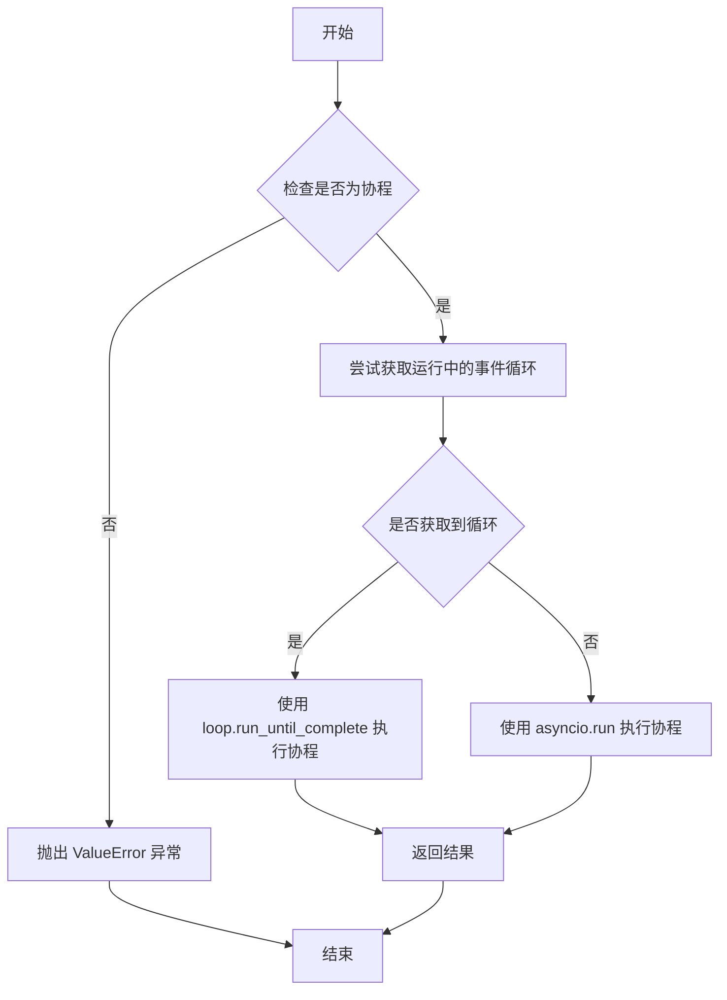
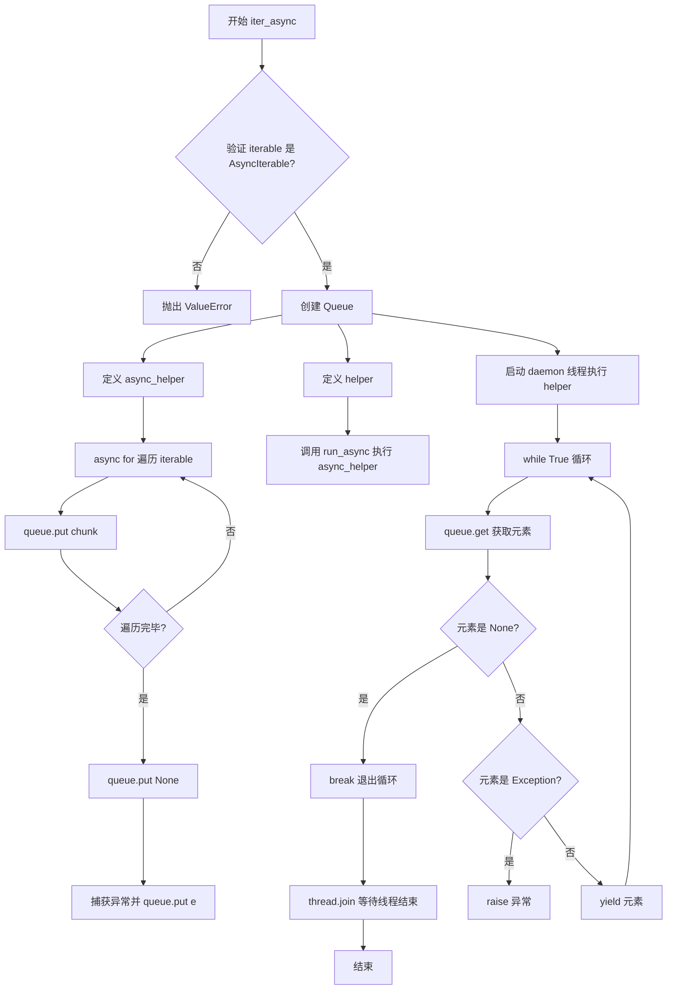

# `MinerU\mineru\utils\run_async.py` 详细设计文档

该模块提供两个实用函数：run_async用于在同步上下文中运行异步协程，iter_async用于将异步可迭代对象转换为同步迭代器，从而允许同步代码以迭代方式消费异步生成器。

## 整体流程

```mermaid
graph TD
    A[开始] --> B{检查协程对象}
    B -- 否 --> C[抛出ValueError: 必须提供协程]
    B -- 是 --> D{尝试获取运行中的事件循环}
    D --> E{是否获取到?}
    E -- 否 --> F[使用asyncio.run执行协程]
    E -- 是 --> G[使用loop.run_until_complete执行协程]
    F --> H[返回协程结果]
    G --> H
graph TD
    A[开始] --> B{检查AsyncIterable}
    B -- 否 --> C[抛出ValueError: 必须提供异步可迭代对象]
    B -- 是 --> D[创建Queue]
    E[启动后台线程执行async_helper] --> F[async_helper: 异步遍历iterable]
    F --> G{遍历项}
    G --> H[将chunk放入Queue]
    H --> I{遍历完成?}
    I -- 是 --> J[放入None到Queue]
    I -- 异常 --> K[将异常放入Queue]
    L[主线程循环: 从Queue获取] --> M{获取内容}
    M --> N{是None?}
    N -- 是 --> O[停止并等待线程结束]
    N -- 否 --> P{是异常?}
    P -- 是 --> Q[抛出异常]
    P -- 否 --> R[yield chunk]
    R --> L
```

## 类结构

```

```

## 全局变量及字段


### `T`
    
泛型类型变量，用于协程和异步迭代器的类型参数

类型：`TypeVar`
    


### `asyncio`
    
Python异步编程标准库，提供事件循环、协程和异步原语支持

类型：`module`
    


### `threading`
    
Python标准库模块，提供多线程创建和管理功能

类型：`module`
    


### `Queue`
    
线程安全的队列数据结构，用于在线程间传递数据

类型：`class`
    


    

## 全局函数及方法


### `run_async`

该函数是一个同步运行异步协程的实用工具函数，能够在已有事件循环的情况下运行协程，或在无事件循环时创建新事件循环来执行协程。

参数：

- `coroutine`：`Coroutine[Any, Any, T]` - 要运行的异步协程对象

返回值：`T` - 协程执行后的返回值

#### 流程图



#### 带注释源码

```python
def run_async(coroutine: Coroutine[Any, Any, T]) -> T:
    """
    在同步上下文中运行异步协程的函数。
    
    参数:
        coroutine: Coroutine[Any, Any, T] - 要运行的协程对象
        
    返回值:
        T - 协程执行完成后的返回值
        
    异常:
        ValueError - 当传入的不是协程对象时抛出
    """
    # 首先验证传入的对象是否为协程
    if not asyncio.iscoroutine(coroutine):
        raise ValueError("a coroutine was expected, got {!r}".format(coroutine))

    # 尝试获取当前运行中的事件循环
    try:
        loop = asyncio.get_running_loop()
    except RuntimeError:
        # 如果没有运行中的循环，get_running_loop 会抛出 RuntimeError
        loop = None

    # 根据是否有运行中的循环选择不同的执行策略
    if loop is not None:
        # 已有事件循环存在，在已有循环中运行协程
        return loop.run_until_complete(coroutine)
    else:
        # 没有运行中的循环，创建新的事件循环来运行协程
        return asyncio.run(coroutine)
```


### `iter_async`

将异步可迭代对象转换为同步可迭代对象的函数。该函数通过在后台守护线程中运行异步迭代器，将异步生成的元素放入队列，然后主线程从队列中同步 yielding 元素，从而实现同步方式遍历异步数据流。

参数：

- `iterable`：`AsyncIterable[T]`，需要转换为同步可迭代对象的异步可迭代对象

返回值：`Iterable[T]`，同步可迭代对象，可以直接用 `for` 循环遍历

#### 流程图



#### 带注释源码

```python
def iter_async(iterable: AsyncIterable[T]) -> Iterable[T]:
    """
    将 AsyncIterable 转换为同步 Iterable
    """
    
    # 参数验证：确保输入是 AsyncIterable 类型
    if not isinstance(iterable, AsyncIterable):
        raise ValueError("an async iterable was expected, got {!r}".format(iterable))

    # 创建线程安全的队列，用于在线程间传递数据
    queue = Queue()

    # 定义异步辅助函数，在独立线程中运行
    async def async_helper():
        try:
            # 异步遍历 AsyncIterable，将每个元素放入队列
            async for chunk in iterable:
                queue.put(chunk)
            # 遍历完成后放入 None 作为结束标记
            queue.put(None)
        except Exception as e:
            # 发生异常时，将异常对象放入队列
            queue.put(e)

    # 定义同步辅助函数，用于在线程中启动异步任务
    def helper():
        # 使用 run_async 运行异步辅助函数
        run_async(async_helper())

    # 创建守护线程，在后台执行异步迭代
    thread = threading.Thread(target=helper, daemon=True)
    thread.start()

    # 主循环：从队列中获取元素并 yield
    while True:
        chunk = queue.get()
        
        # None 表示迭代结束
        if chunk is None:
            break
        # 如果是异常，则抛出
        if isinstance(chunk, Exception):
            raise chunk
        # 否则 yield 普通元素
        yield chunk

    # 等待后台线程完成
    thread.join()
```

## 关键组件


### run_async 函数

同步环境中运行异步协程的核心函数，处理事件循环的获取与执行，支持在已有事件循环中运行或创建新事件循环。

### iter_async 函数

将 AsyncIterable 转换为同步 Iterable 的转换器，使用后台线程和队列实现惰性加载，支持异步迭代器的流式消费。

### 异步/同步桥接机制

基于 Queue 和 Threading 的桥接方案，允许在同步代码中透明地使用异步生成器，实现惰性加载避免一次性加载所有数据。

### 事件循环管理

自动检测当前是否在事件循环中运行，优先复用现有循环否则创建新循环，支持嵌套调用场景。

### 类型检查与验证

对输入的协程和异步迭代器进行运行时类型检查，确保接口契约得到遵守。

### 异常传播机制

通过 Queue 传递异常信息，在主线程中重新抛出异常，保持异步代码中的错误处理语义。

### 守护线程机制

使用 daemon=True 的后台线程确保主程序退出时自动清理资源，避免无限阻塞。


## 问题及建议


### 已知问题

- **线程资源未正确清理**：当迭代过程中发生异常或提前终止时，守护线程可能无法被正确停止，导致资源泄露
- **异常序列化风险**：通过`queue.Queue`传递异常对象（`queue.put(e)`）可能在跨线程传递时出现序列化问题，尤其在多进程环境下
- **类型标注不够精确**：`Coroutine[Any, Any, T]`使用了过于宽泛的`Any`类型，丢失了协程的具体类型信息
- **竞态条件风险**：`iter_async`返回生成器后，在主线程等待`queue.get()`时，辅助线程可能已经因异常退出但异常未被放入队列，导致死锁
- **阻塞主线程**：使用同步的`queue.get()`会阻塞调用线程，在高并发场景下可能导致线程资源耗尽
- **守护线程局限性**：设置`daemon=True`会导致主程序退出时线程被强制终止，可能造成资源未释放
- **无取消机制**：无法中断正在进行的异步迭代操作，缺乏取消令牌或中断支持
- **loop状态检查不严谨**：`run_async`中通过检查`asyncio.get_running_loop()`是否抛出来判断是否有运行中的loop，这种方式不够直接且可能遗漏边界情况

### 优化建议

- 使用`asyncio.run()`或创建新的事件循环时添加超时机制，并为迭代器实现`aclose`方法以支持资源清理
- 考虑使用`asyncio.Queue`替代`queue.Queue`，并通过`raise StopIteration`或自定义异常机制传递错误
- 改进类型标注，使用`Coroutine[Any, Any, T]`的泛型版本或定义具体的协议类型
- 添加迭代器的上下文管理器支持，实现`__enter__`/`__exit__`或`__aiter__`/`__anext__`
- 考虑使用`concurrent.futures.ThreadPoolExecutor`管理线程池，避免频繁创建线程
- 为`run_async`函数添加显式的`loop`参数，允许调用者控制事件循环行为
- 实现超时机制或提供取消令牌，防止无限等待
- 考虑使用`asyncio.to_thread`（Python 3.9+）或`run_in_executor`等更现代的异步同步桥接方式

## 其它


### 设计目标与约束

本代码库的核心目标是在同步环境中优雅地处理异步迭代器，提供两种主要能力：1）在已有事件循环的情况下运行协程；2）将异步迭代器透明地转换为同步迭代器。设计约束包括：必须保持对Python 3.7+的兼容性，需要处理事件循环不存在和已存在的两种场景，必须确保异步消费不会阻塞主线程。

### 错误处理与异常设计

代码采用分层异常处理策略。对于run_async函数，主要处理非协程传入的ValueError；对于iter_async函数，通过队列传递异常，将异步迭代过程中的异常转换为同步异常。关键设计点：在async_helper中捕获所有异常并通过queue.put(e)传递，然后在主循环中通过isinstance(chunk, Exception)检查并重新抛出原始异常。这种设计确保了异步端的异常能够传播到同步调用方。

### 数据流与状态机

iter_async的数据流遵循生产者-消费者模式。生产者是async_helper协程，它在后台线程中消费AsyncIterable；消费者是主线程中的while循环，通过queue.get()获取数据。状态转换：初始状态为STARTED，线程启动后进入RUNNING，当queue.get()获取到None时进入COMPLETED，若获取到Exception则进入ERROR状态。整个流程是阻塞的同步迭代器，每次yield都对应异步迭代器的一个chunk。

### 外部依赖与接口契约

主要依赖asyncio标准库和threading标准库，Queue来自queue模块。接口契约：run_async接受Coroutine对象并返回泛型T；iter_async接受AsyncIterable[T]并返回Iterable[T]。调用方职责：确保传入的协程或异步迭代器是有效的，iter_async的调用方必须完整迭代结果以避免线程泄漏。

### 性能考虑与资源管理

后台线程在iter_async中作为daemon线程运行，主线程通过thread.join()等待其完成。潜在的性能开销包括：线程创建开销、队列序列化开销、线程间通信开销。资源管理方面：线程在主循环结束后自动终止，队列大小未做限制可能导致内存问题，异步迭代器未完成时的异常处理可能导致线程hang。

### 并发与线程安全

run_async中存在事件循环访问的竞态条件：在检查loop是否为None和调用run_until_complete之间可能发生事件循环变化。iter_async中Queue的put和get操作是线程安全的，但队列的创建和消费逻辑需要确保异步端完全生产完毕后再开始消费。当前实现通过先启动线程再while循环消费来保证顺序。

### 使用示例与典型场景

典型场景一：在同步函数中调用异步API：result = run_async(async_function())。典型场景二：将异步文件流或异步数据库游标转换为同步迭代：for item in iter_async(async_iterator): process(item)。典型场景三：在Flask/Django等同步Web框架中处理异步数据源。

### 边界条件处理

边界条件处理包括：空异步迭代器会正常返回，迭代过程中断开连接等异常会被传播，事件循环在run_async调用期间被关闭可能导致未定义行为，嵌套调用run_async可能导致事件循环嵌套运行问题。


    