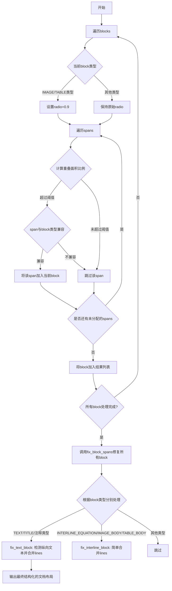
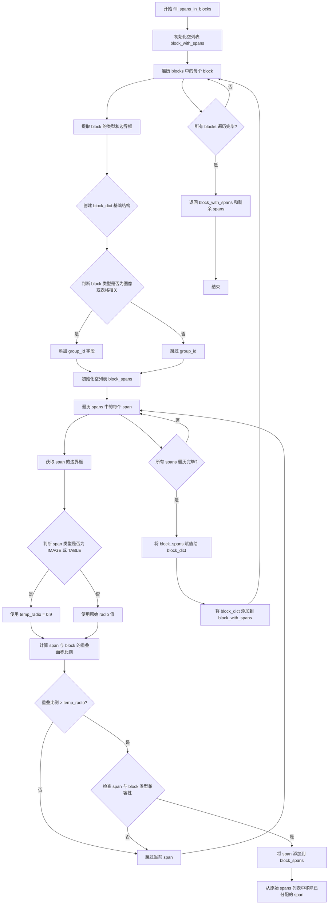
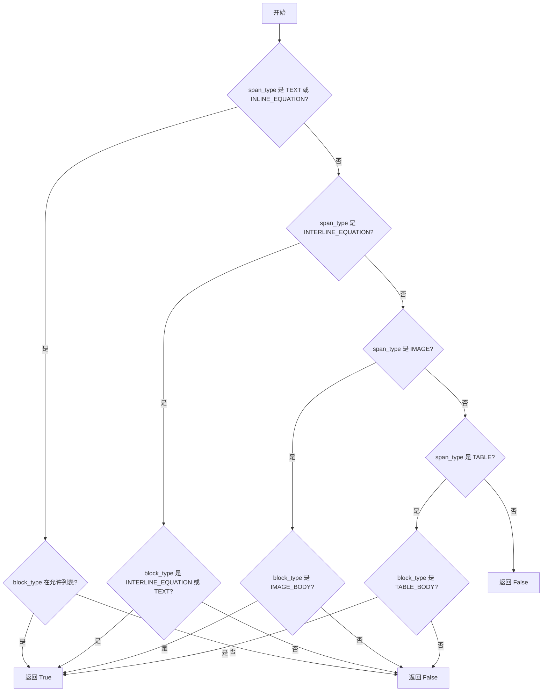
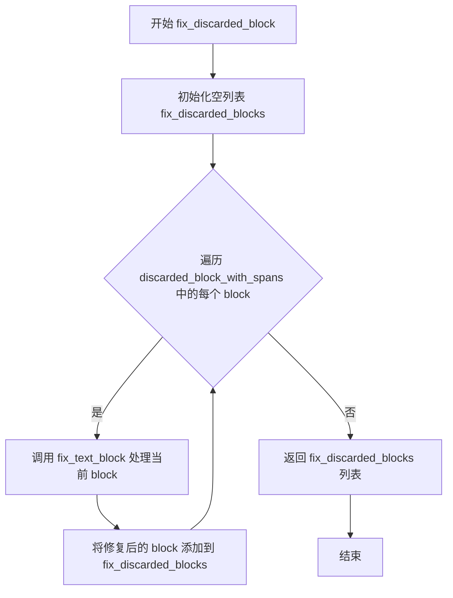
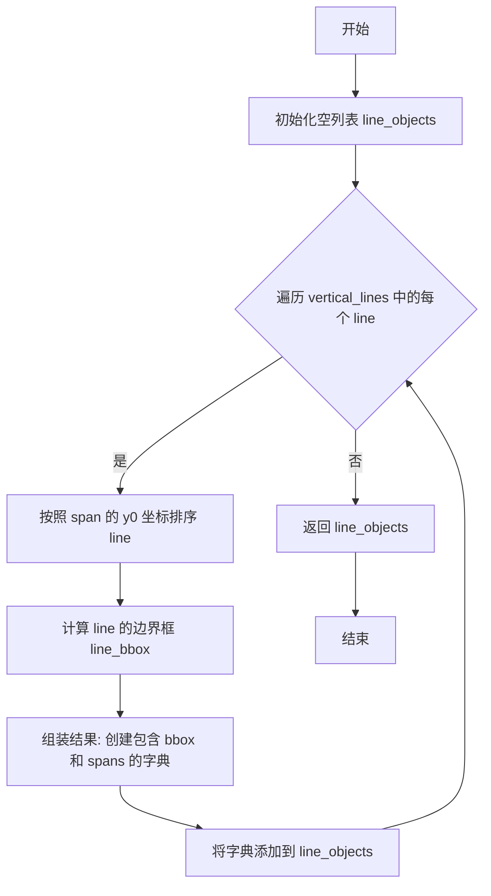
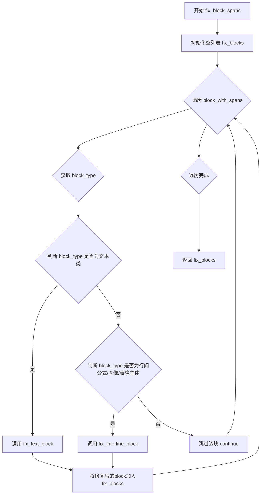

# `MinerU\mineru\utils\span_block_fix.py` 详细设计文档

该代码是文档布局分析模块的核心实现，负责将离散的spans（文本片段）根据空间位置关系分配到对应的blocks（文本块）中，并处理文本块的内部结构，包括检测纵向文本块、将spans合并成lines（行）、对lines进行排序等操作，最终输出结构化的文档布局信息。

## 整体流程



## 类结构

```
该文件为模块级代码，未定义类
所有功能通过全局函数实现
依赖外部模块: mineru.utils.boxbase, mineru.utils.enum_class, mineru.utils.ocr_utils
```

## 全局变量及字段


### `VERTICAL_SPAN_HEIGHT_TO_WIDTH_RATIO_THRESHOLD`
    
纵向span高宽比阈值，用于判断是否为纵向文本块，当span的高度与宽度之比超过此阈值时，认为是纵向span

类型：`float`
    


### `VERTICAL_SPAN_IN_BLOCK_THRESHOLD`
    
纵向span在block中的比例阈值，超过该比例则认为是纵向文本块，用于决定文本块的排列方式

类型：`float`
    


    

## 全局函数及方法


### `fill_spans_in_blocks`

该函数将输入的spans（文本块、图像、表格等元素）根据位置重叠关系和类型兼容性分配到对应的blocks（页面布局块）中，返回分配了spans的blocks列表以及剩余未能分配的spans列表，主要用于文档版面分析中将内容元素与布局结构进行匹配关联。

参数：

- `blocks`：`List`，页面布局块列表，每个block为包含8个元素的元组（bbox坐标、类型、额外信息等）
- `spans`：`List`，内容元素列表，每个span为包含`bbox`和`type`键的字典
- `radio`：`float`，重叠面积比例阈值，用于判断span是否落在block内部

返回值：`Tuple[List, List]`，第一个为分配了spans的block字典列表（每个block包含type、bbox、group_id及spans子列表），第二个为未分配到任何block的剩余spans列表

#### 流程图



#### 带注释源码

```python
def fill_spans_in_blocks(blocks, spans, radio):
    """将allspans中的span按位置关系，放入blocks中."""
    # 存储最终结果：每个block及其包含的spans
    block_with_spans = []
    
    # 遍历页面中的每一个布局block
    for block in blocks:
        # block[7] 存储block的类型信息（如TEXT、IMAGE_BODY等）
        block_type = block[7]
        # block[0:4] 存储block的边界框坐标 [x0, y0, x1, y1]
        block_bbox = block[0:4]
        
        # 构建block的字典结构，存储类型和边界框
        block_dict = {
            'type': block_type,
            'bbox': block_bbox,
        }
        
        # 对于图像和表格相关的block，额外保存group_id（block[-1]）
        # 用于建立图像/表格与其标题、脚注的关联关系
        if block_type in [
            BlockType.IMAGE_BODY, BlockType.IMAGE_CAPTION, BlockType.IMAGE_FOOTNOTE,
            BlockType.TABLE_BODY, BlockType.TABLE_CAPTION, BlockType.TABLE_FOOTNOTE
        ]:
            block_dict['group_id'] = block[-1]
        
        # 用于存储当前block匹配到的所有spans
        block_spans = []
        
        # 遍历所有待分配的spans
        for span in spans:
            # 默认为传入的radio阈值
            temp_radio = radio
            # 获取span的边界框
            span_bbox = span['bbox']
            
            # 如果span是图像或表格类型，使用更宽松的阈值(0.9)
            # 因为图像/表格通常与block有更明确的边界对应关系
            if span['type'] in [ContentType.IMAGE, ContentType.TABLE]:
                temp_radio = 0.9
            
            # 计算span与block的重叠面积比例
            # 只有当重叠比例超过阈值时才认为该span属于该block
            if calculate_overlap_area_in_bbox1_area_ratio(span_bbox, block_bbox) > temp_radio and span_block_type_compatible(span['type'], block_type):
                block_spans.append(span)

        # 将匹配到的spans关联到block
        block_dict['spans'] = block_spans
        block_with_spans.append(block_dict)

        # 【关键副作用】从原始spans列表中移除已分配的span
        # 注意：这种逐个remove的操作在spans数量大时效率较低
        if len(block_spans) > 0:
            for span in block_spans:
                spans.remove(span)

    return block_with_spans, spans
```

---

#### 关键组件信息

| 组件名称 | 一句话描述 |
|---------|-----------|
| `span_block_type_compatible` | 判断span内容类型与block布局类型是否兼容的辅助函数 |
| `calculate_overl` `ap_area_in_bbox1_area_ratio` | 计算两个边界框的重叠面积占较小box的比例（外部依赖函数） |
| `BlockType` | 枚举类，定义页面布局块的类型（TEXT、IMAGE_BODY、TABLE_BODY等） |
| `ContentType` | 枚举类，定义内容元素的类型（TEXT、IMAGE、TABLE、INLINE_EQUATION等） |

---

#### 潜在的技术债务或优化空间

1. **列表remove操作效率低下**：在循环中使用`spans.remove(span)`是O(n)操作，当spans数量较大时（如上百个），整体时间复杂度可达O(n²)。建议使用集合记录已分配span的索引或新建列表过滤。

2. **temp_radio阈值硬编码**：图像/表格使用0.9阈值的逻辑嵌入在主函数中，可提取为可配置参数或策略模式。

3. **block结构假设不稳定**：代码假设block是8元素元组（通过索引访问如`block[7]`、`block[-1]`），缺乏显式字段说明，建议改用命名元组或 dataclass 以提高可读性和可维护性。

4. **重复遍历spans**：每个block都要遍历整个spans列表，即使该span已被前面的block匹配过仍会参与比较计算，可引入空间换时间的优化。

---

#### 其它项目

**设计目标与约束**：
- 核心目标是将内容元素（spans）按空间位置分配到版面结构（blocks）中
- 采用重叠面积比例作为主要匹配依据，辅以类型兼容性校验
- 图像/表格采用更严格的重叠阈值（0.9），文本元素使用传入的radio参数

**错误处理与异常设计**：
- 未对输入参数进行空值或类型校验
- 假设`calculate_overlap_area_in_bbox1_area_ratio`和枚举类已正确导入
- 边界框坐标格式假设为`[x0, y0, x1, y1]`的四元组

**数据流与状态机**：
- 输入：未分类的spans列表 → 处理：逐个block匹配 → 输出：带有spans的blocks + 剩余spans
- 状态变化：spans列表在遍历过程中会被**原地修改**（remove操作），调用方需注意此副作用


### `span_block_type_compatible`

判断 span 类型与 block 类型是否兼容，用于确定特定类型的 span 是否可以放入特定类型的 block 中。

参数：

- `span_type`：`ContentType`，span 的内容类型（如 TEXT、IMAGE、TABLE 等）
- `block_type`：`BlockType`，block 的类型（如 TEXT、TITLE、IMAGE_BODY 等）

返回值：`bool`，如果 span 类型与 block 类型兼容返回 `True`，否则返回 `False`

#### 流程图



#### 带注释源码

```python
def span_block_type_compatible(span_type, block_type):
    """
    判断 span 类型与 block 类型是否兼容
    
    参数:
        span_type: span 的内容类型 (ContentType 枚举)
        block_type: block 的类型 (BlockType 枚举)
    
    返回:
        bool: 是否兼容
    """
    # 文本和行内公式可以放入文本块、标题、图像/表格的标题或脚注、丢弃块中
    if span_type in [ContentType.TEXT, ContentType.INLINE_EQUATION]:
        return block_type in [
            BlockType.TEXT,           # 文本块
            BlockType.TITLE,          # 标题块
            BlockType.IMAGE_CAPTION,  # 图像标题
            BlockType.IMAGE_FOOTNOTE, # 图像脚注
            BlockType.TABLE_CAPTION,  # 表格标题
            BlockType.TABLE_FOOTNOTE, # 表格脚注
            BlockType.DISCARDED       # 丢弃块
        ]
    # 行间公式可以放入行间公式块或文本块中
    elif span_type == ContentType.INTERLINE_EQUATION:
        return block_type in [BlockType.INTERLINE_EQUATION, BlockType.TEXT]
    # 图片只能放入图片主体块中
    elif span_type == ContentType.IMAGE:
        return block_type in [BlockType.IMAGE_BODY]
    # 表格只能放入表格主体块中
    elif span_type == ContentType.TABLE:
        return block_type in [BlockType.TABLE_BODY]
    # 其他未知类型默认不兼容
    else:
        return False
```


### `fix_discarded_block`

该函数用于修复被丢弃的（discarded）文本块，遍历传入的包含spans的discarded block列表，对每个block调用`fix_text_block`函数进行处理，将block中的spans转换为lines，并返回修复后的block列表。

参数：

- `discarded_block_with_spans`：`List[Dict]`，待修复的被丢弃block列表，每个block是一个字典，包含`type`、`bbox`、`spans`等字段，其中`spans`是该block内的所有span列表

返回值：`List[Dict]`，返回修复后的block列表，每个block包含`type`、`bbox`、`lines`字段，其中`lines`是按照阅读顺序排列的行列表

#### 流程图



#### 带注释源码

```python
def fix_discarded_block(discarded_block_with_spans):
    """修复被丢弃的block，调用fix_text_block处理每个block
    
    参数:
        discarded_block_with_spans: 包含被丢弃block的列表，每个block包含spans
        
    返回值:
        修复后的block列表
    """
    # 初始化用于存储修复后block的列表
    fix_discarded_blocks = []
    
    # 遍历每一个被丢弃的block
    for block in discarded_block_with_spans:
        # 调用fix_text_block函数对当前block进行处理
        # 处理包括：转换公式类型、判断纵向/横向文本、合并spans为lines、排序等
        block = fix_text_block(block)
        
        # 将修复后的block添加到结果列表中
        fix_discarded_blocks.append(block)
    
    # 返回修复后的所有block
    return fix_discarded_blocks
```


### `fix_text_block`

该函数是文档处理流程中的核心修复函数，用于修复文本块（block）的内部结构。它首先将文本块中的行间公式（INTERLINE_EQUATION）转换为行内公式（INLINE_EQUATION），然后通过计算文本span的高宽比来检测是否为纵向文本块，最后根据检测结果调用不同的合并算法将span元素组织成lines，并返回修复后的包含lines属性的block对象。

参数：

- `block`：`dict`，待修复的文本块对象，必须包含'spans'键，spans是一个包含多个span元素的列表，每个span包含'type'和'bbox'等属性

返回值：`dict`，修复后的文本块对象，删除了'spans'键，新增了'lines'键，lines是按照从左到右或从上到下排序的span列表组成的行对象列表

#### 流程图

```mermaid
flowchart TD
    A[开始: fix_text_block] --> B{遍历block中的spans}
    B --> C{检查span类型是否为INTERLINE_EQUATION}
    C -->|是| D[将span类型改为INLINE_EQUATION]
    C -->|否| E[跳过]
    D --> B
    E --> F[计算纵向span数量]
    F --> G{计算vertical_ratio}
    G --> H{vertical_ratio > 阈值0.8?}
    H -->|是| I[调用merge_spans_to_vertical_line合并spans为纵向lines]
    H -->|否| J[调用merge_spans_to_line合并spans为横向lines]
    I --> K[调用vertical_line_sort_spans_from_top_to_bottom排序]
    J --> L[调用line_sort_spans_by_left_to_right排序]
    K --> M[将排序后的lines赋值给block['lines']]
    L --> M
    M --> N[删除block['spans']键]
    N --> O[返回修复后的block]
```

#### 带注释源码

```python
def fix_text_block(block):
    # 文本block中的公式span都应该转换成行内type
    # 遍历block中的所有span，将INTERLINE_EQUATION类型转换为INLINE_EQUATION
    for span in block['spans']:
        if span['type'] == ContentType.INTERLINE_EQUATION:
            span['type'] = ContentType.INLINE_EQUATION

    # 假设block中的span超过80%的数量高度是宽度的两倍以上，则认为是纵向文本块
    # 计算纵向span的数量（高度/宽度 > 2）
    vertical_span_count = sum(
        1 for span in block['spans']
        if (span['bbox'][3] - span['bbox'][1]) / (span['bbox'][2] - span['bbox'][0]) > VERTICAL_SPAN_HEIGHT_TO_WIDTH_RATIO_THRESHOLD
    )
    total_span_count = len(block['spans'])
    if total_span_count == 0:
        vertical_ratio = 0
    else:
        vertical_ratio = vertical_span_count / total_span_count

    # 根据纵向比例判断文本块方向，选择不同的合并和排序策略
    if vertical_ratio > VERTICAL_SPAN_IN_BLOCK_THRESHOLD:
        # 如果是纵向文本块，则按纵向lines处理
        # 调用纵向合并函数将spans合并为纵向排列的lines
        block_lines = merge_spans_to_vertical_line(block['spans'])
        # 调用纵向排序函数，从上到下排序每列的spans
        sort_block_lines = vertical_line_sort_spans_from_top_to_bottom(block_lines)
    else:
        # 否则按横向lines处理（默认）
        # 调用横向合并函数将spans合并为横向排列的lines
        block_lines = merge_spans_to_line(block['spans'])
        # 调用横向排序函数，从左到右排序每行的spans
        sort_block_lines = line_sort_spans_by_left_to_right(block_lines)

    # 将排序后的lines添加到block中
    block['lines'] = sort_block_lines
    # 删除原始的spans数据，因为已经转换为lines
    del block['spans']
    return block
```

---

### 全局变量与常量

| 名称 | 类型 | 描述 |
|------|------|------|
| `VERTICAL_SPAN_HEIGHT_TO_WIDTH_RATIO_THRESHOLD` | `float` | 用于判断纵向span的高宽比阈值，值为2，表示高度是宽度的2倍以上 |
| `VERTICAL_SPAN_IN_BLOCK_THRESHOLD` | `float` | 用于判断整个block是否为纵向文本块的阈值，值为0.8（80%） |

---

### 关键组件信息

1. **ContentType.INTERLINE_EQUATION / INLINE_EQUATION**：公式内容的类型枚举，行间公式和行内公式
2. **merge_spans_to_line**：横向合并spans为lines的函数
3. **merge_spans_to_vertical_line**：纵向合并spans为垂直lines的函数
4. **line_sort_spans_by_left_to_right**：按左到右排序lines中spans的函数
5. **vertical_line_sort_spans_from_top_to_bottom**：按上到下排序纵向lines中spans的函数

---

### 潜在技术债务与优化空间

1. **硬编码阈值**：纵向检测的阈值（0.8和2.0）是硬编码的全局常量，建议提取为配置参数或构造函数参数，提高灵活性
2. **bbox计算重复**：在排序函数中多次计算line的bbox，可考虑缓存或重构减少重复计算
3. **直接修改输入对象**：函数直接修改传入的block对象的span类型，可能产生副作用，建议返回新对象或明确说明
4. **缺少错误处理**：未对block结构完整性进行校验，如block为None或缺少'spans'键的情况

---

### 其他项目

#### 设计目标与约束
- 目标：将文本块中的公式标准化为行内公式，并正确识别文本方向（纵向/横向）
- 约束：纵向比例超过80%时判定为纵向文本块；span高宽比超过2时判定为纵向span

#### 外部依赖
- `ContentType`：枚举类，定义内容类型（TEXT, INLINE_EQUATION, INTERLINE_EQUATION, IMAGE, TABLE等）
- `merge_spans_to_line`, `merge_spans_to_vertical_line`：span合并函数
- `line_sort_spans_by_left_to_right`, `vertical_line_sort_spans_from_top_to_bottom`：排序函数

#### 数据流
输入：包含'spans'列表的block字典
处理流程：公式类型转换 → 纵向检测 → 选择合并策略 → 排序 → 组织lines
输出：包含'lines'列表的block字典（不再包含'spans'）


### `merge_spans_to_line`

该函数将离散的span元素按从上到下的顺序排列，基于y轴坐标的重叠判断将它们合并成横向排列的lines（从左到右阅读），常用于文档版面分析中将文本块分行。

参数：

- `spans`：`List[dict]`，待合并的span列表，每个span包含`'bbox'`键表示边界框坐标 `[x0, y0, x1, y1]`
- `threshold`：`float`，y轴重叠判定阈值，默认为0.6，用于判断两个span是否在同一行

返回值：`List[List[dict]]`，返回合并后的lines列表，每个元素是一个包含多个span的列表，代表一行内容

#### 流程图

```mermaid
flowchart TD
    A[开始 merge_spans_to_line] --> B{spans 是否为空?}
    B -->|是| C[返回空列表 []]
    B -->|否| D[按 y0 坐标排序 spans]
    D --> E[创建第一个 line: current_line = [spans[0]]]
    E --> F[遍历 spans[1:]]
    F --> G{当前 span 类型是<br/>INTERLINE_EQUATION/IMAGE/TABLE<br/>或 current_line 已包含这些类型?}
    G -->|是| H[将 current_line 加入 lines<br/>开始新行 current_line = [span]]
    G -->|否| I{当前 span 与 current_line[-1]<br/>在 y 轴上重叠?}
    I -->|是| J[将 span 加入 current_line]
    I -->|否| K[将 current_line 加入 lines<br/>开始新行 current_line = [span]]
    J --> L{是否还有未处理的 span?}
    K --> L
    H --> L
    L -->|是| F
    L -->|否| M[将最后的 current_line 加入 lines]
    M --> N[返回 lines]
```

#### 带注释源码

```python
def merge_spans_to_line(spans, threshold=0.6):
    """
    将 spans 合并成横向 lines（从左到右阅读）
    
    参数:
        spans: 包含 bbox 信息的 span 列表，每个 span 是 dict，需有 'bbox' 和 'type' 键
        threshold: y 轴重叠判定阈值，默认为 0.6
    返回:
        lines: 嵌套列表，外层每个元素代表一行，内层是同一行的 span 列表
    """
    # 空列表直接返回空结果
    if len(spans) == 0:
        return []
    else:
        # Step 1: 按 y0 坐标（顶部边界）升序排序，从上到下排列
        spans.sort(key=lambda span: span['bbox'][1])

        # Step 2: 初始化结果列表和当前行
        lines = []
        current_line = [spans[0]]

        # Step 3: 遍历剩余的 span
        for span in spans[1:]:
            # Step 3.1: 特殊类型元素（行间公式、图片、表格）必须单独成行
            if span['type'] in [
                    ContentType.INTERLINE_EQUATION, ContentType.IMAGE,
                    ContentType.TABLE
            ] or any(s['type'] in [
                    ContentType.INTERLINE_EQUATION, ContentType.IMAGE,
                    ContentType.TABLE
            ] for s in current_line):
                # 当前行结束，保存并开始新行
                lines.append(current_line)
                current_line = [span]
                continue

            # Step 3.2: 检查当前 span 与当前行最后一个 span 的 y 轴重叠程度
            if _is_overlaps_y_exceeds_threshold(span['bbox'], current_line[-1]['bbox'], threshold):
                # 重叠超过阈值，加入当前行
                current_line.append(span)
            else:
                # 不重叠，当前行结束，开始新行
                lines.append(current_line)
                current_line = [span]

        # Step 4: 添加最后一行
        if current_line:
            lines.append(current_line)

        return lines
```

#### 关键组件信息

| 名称 | 描述 |
|------|------|
| `_is_overlaps_y_exceeds_threshold` | 外部工具函数，判断两个bbox在y轴上的重叠面积是否超过阈值 |
| `ContentType` | 枚举类，定义span的内容类型（TEXT、IMAGE、TABLE、INTERLINE_EQUATION等） |
| `spans` | 离散的视觉元素，每个包含位置信息和类型 |

#### 潜在技术债务与优化空间

1. **重复代码**：`merge_spans_to_vertical_line` 函数与本函数逻辑高度相似，仅在排序轴（x vs y）和重叠判断方向不同，可考虑抽象为通用函数并通过参数区分
2. **排序键硬编码**：`bbox[1]` 假设坐标格式为 `[x0, y0, x1, y1]`，缺乏显式注释说明
3. **空间复杂度**：使用 `list.remove()` 删除已分配到block的span是 O(n) 操作，大量span时性能堪忧
4. **阈值硬编码**：默认0.6阈值缺乏文档说明其选择依据，难以调整适应不同文档格式


### `merge_spans_to_vertical_line`

该函数用于将纵向文本的spans（跨距）合并成纵向lines（行/列），阅读顺序为从右向左，核心逻辑是基于x轴坐标的重叠判断来识别同一列的span元素。

参数：

- `spans`：`List[Dict]`，待合并的span列表，每个span包含bbox（边界框）和type（类型）等信息
- `threshold`：`float`，默认值0.6，用于判断x轴重叠的阈值，数值越大表示要求重叠程度越高

返回值：`List[List[Dict]]`，返回合并后的纵向lines列表，每个元素是一个span列表，代表一列（从右向左阅读的一列）

#### 流程图

```mermaid
flowchart TD
    A[开始 merge_spans_to_vertical_line] --> B{spans 是否为空?}
    B -->|是| C[返回空列表 []]
    B -->|否| D[按 x2 坐标从大到小排序 spans]
    D --> E[初始化 vertical_lines 和 current_line]
    E --> F[遍历 spans[1:]]
    F --> G{当前 span 或 current_line 中存在特殊类型?}
    G -->|是| H[将 current_line 加入 vertical_lines]
    H --> I[创建新的 current_line = [span]]
    I --> F
    G -->|否| J{span 与 current_line[-1] 在 x 轴上重叠?}
    J -->|是| K[将 span 加入 current_line]
    K --> F
    J -->|否| L[将 current_line 加入 vertical_lines]
    L --> I
    M[遍历结束后] --> N{current_line 是否非空?}
    N -->|是| O[将 current_line 加入 vertical_lines]
    N -->|否| P[返回 vertical_lines]
    O --> P
```

#### 带注释源码

```python
def merge_spans_to_vertical_line(spans, threshold=0.6):
    """
    将纵向文本的spans合并成纵向lines（从右向左阅读）
    
    参数:
        spans: 纵向文本的span列表
        threshold: x轴重叠阈值，默认0.6
    
    返回:
        纵向lines列表，每个元素是一列的span列表
    """
    # 空列表直接返回空列表
    if len(spans) == 0:
        return []
    else:
        # 按照x2坐标从大到小排序（从右向左）
        # bbox格式: [x0, y0, x1, y1]，x2即右边界坐标
        spans.sort(key=lambda span: span['bbox'][2], reverse=True)

        vertical_lines = []  # 存储最终的纵向lines
        current_line = [spans[0]]  # 初始化当前行为第一个span

        # 遍历剩余的span
        for span in spans[1:]:
            # 特殊类型元素单独成列（公式、图片、表格）
            # 这些元素不与其他类型混在一列
            if span['type'] in [
                ContentType.INTERLINE_EQUATION, ContentType.IMAGE,
                ContentType.TABLE
            ] or any(s['type'] in [
                ContentType.INTERLINE_EQUATION, ContentType.IMAGE,
                ContentType.TABLE
            ] for s in current_line):
                # 当前行结束，保存到结果集
                vertical_lines.append(current_line)
                # 开始新行
                current_line = [span]
                continue

            # 判断当前span与当前行最后一个span在x轴上是否重叠
            # 使用阈值判断，重叠超过threshold认为在同一列
            if _is_overlaps_x_exceeds_threshold(span['bbox'], current_line[-1]['bbox'], threshold):
                # 重叠，添加到当前列
                current_line.append(span)
            else:
                # 不重叠，当前列结束，开始新列
                vertical_lines.append(current_line)
                current_line = [span]

        # 添加最后一列
        if current_line:
            vertical_lines.append(current_line)

        return vertical_lines
```


### `line_sort_spans_by_left_to_right`

该函数将每个文本行（line）中的跨（span）按照其边界框的左边界（x0）坐标从左到右排序，并计算每行的边界框（bbox），最终返回包含排序后跨和行边界框的对象列表。

参数：

- `lines`：`List[List[Dict]]`，输入的文本行列表，其中每个元素是一个跨（span）字典列表，每个 span 包含 'bbox' 键用于定位

返回值：`List[Dict]`，返回包含每行边界框和排序后跨的对象列表，每个元素为 `{'bbox': list, 'spans': list}` 格式

#### 流程图

```mermaid
flowchart TD
    A[开始: 输入 lines 列表] --> B[初始化空列表 line_objects]
    B --> C{遍历 lines 中的每个 line}
    C -->|对每个 line| D[按 span.bbox[0] 从左到右排序]
    D --> E[计算 line_bbox: x0=min x0, y0=min y0, x1=max x1, y1=max y1]
    E --> F[将 {bbox: line_bbox, spans: 排序后的line} 添加到 line_objects]
    F --> C
    C -->|遍历完成| G[返回 line_objects 列表]
    G --> H[结束]
```

#### 带注释源码

```python
# 将每一个line中的span从左到右排序
def line_sort_spans_by_left_to_right(lines):
    """
    对输入的每一行文本中的span按从左到右排序，并计算每行的边界框
    
    参数:
        lines: 包含多个line的列表，每个line是一个span列表
    返回:
        包含每行排序后spans和对应bbox的字典列表
    """
    line_objects = []  # 用于存储排序后的行对象
    
    # 遍历每一行
    for line in lines:
        # 按照x0坐标排序（从左到右）
        # bbox格式: [x0, y0, x1, y1]，x0为左边界
        line.sort(key=lambda span: span['bbox'][0])
        
        # 计算该行的边界框（bbox）
        # x0: 所有span中最小的左边界
        # y0: 所有span中最小的上边界
        # x1: 所有span中最大的右边界
        # y1: 所有span中最大的下边界
        line_bbox = [
            min(span['bbox'][0] for span in line),  # x0
            min(span['bbox'][1] for span in line),  # y0
            max(span['bbox'][2] for span in line),  # x1
            max(span['bbox'][3] for span in line),  # y1
        ]
        
        # 将行边界框和排序后的spans组装成字典并添加到结果列表
        line_objects.append({
            'bbox': line_bbox,
            'spans': line,
        })
    
    return line_objects
```


### `vertical_line_sort_spans_from_top_to_bottom`

该函数用于将纵向排列的文本线条（vertical_lines）中的span元素按照从上到下的顺序进行排序，并计算每一条纵向线条的边界框（bbox），最终返回包含排序后spans及对应bbox的线条对象列表。

参数：

- `vertical_lines`：`list`，纵向线条列表，每个元素是一个包含多个span的列表，每个span包含bbox和内容信息

返回值：`list`，返回线条对象列表，每个对象包含`bbox`（边界框）和`spans`（排序后的span列表）

#### 流程图



#### 带注释源码

```python
def vertical_line_sort_spans_from_top_to_bottom(vertical_lines):
    """将纵向line中的span从上到下排序，并计算line的bbox"""
    # 初始化用于存储排序后线条对象的列表
    line_objects = []
    
    # 遍历每一根纵向线条
    for line in vertical_lines:
        # 按照y0坐标排序（从上到下）
        # bbox格式: [x0, y0, x1, y1]，y0为顶部坐标
        line.sort(key=lambda span: span['bbox'][1])

        # 计算整个列的边界框
        # x0: 所有span中最小的x0
        # y0: 所有span中最小的y0
        # x1: 所有span中最大的x1
        # y1: 所有span中最大的y1
        line_bbox = [
            min(span['bbox'][0] for span in line),  # x0
            min(span['bbox'][1] for span in line),  # y0
            max(span['bbox'][2] for span in line),  # x1
            max(span['bbox'][3] for span in line),  # y1
        ]

        # 组装结果字典，包含边界框和排序后的spans
        line_objects.append({
            'bbox': line_bbox,
            'spans': line,
        })
    
    # 返回排序并组装好的线条对象列表
    return line_objects
```


### `fix_block_spans`

该函数是文档/页面块处理流程中的核心修复函数，负责接收包含跨（spans）信息的块列表，遍历每个块并根据其类型分发到不同的处理函数（文本类块调用`fix_text_block`，行间公式/图像/表格块调用`fix_interline_block`），最终返回修复后的块列表，将原有的spans结构转换为lines结构。

参数：

- `block_with_spans`：`List[Dict]`，输入的包含spans信息的块列表，每个块是一个字典，包含type、bbox、spans等字段

返回值：`List[Dict]`，修复后的块列表，每个块从包含spans转换为包含lines

#### 流程图



#### 带注释源码

```python
def fix_block_spans(block_with_spans):
    """
    修复所有block_with_spans，根据block类型调用不同的处理函数
    
    参数:
        block_with_spans: 包含spans信息的块列表
        
    返回:
        修复后的块列表，spans已转换为lines
    """
    fix_blocks = []  # 用于存储修复后的块
    for block in block_with_spans:  # 遍历每个块
        block_type = block['type']  # 获取块类型

        # 判断是否为文本类块（TEXT, TITLE, 各类CAPTION, FOOTNOTE等）
        if block_type in [BlockType.TEXT, BlockType.TITLE,
                          BlockType.IMAGE_CAPTION, BlockType.IMAGE_CAPTION,
                          BlockType.TABLE_CAPTION, BlockType.TABLE_FOOTNOTE
                          ]:
            # 调用文本块修复函数
            block = fix_text_block(block)
        # 判断是否为行间公式块、图像主体或表格主体
        elif block_type in [BlockType.INTERLINE_EQUATION, BlockType.IMAGE_BODY, BlockType.TABLE_BODY]:
            # 调用行间公式块修复函数
            block = fix_interline_block(block)
        else:
            # 其它类型的块直接跳过
            continue
        
        # 将修复后的块添加到结果列表
        fix_blocks.append(block)
    
    return fix_blocks
```

---

### 完整设计文档

#### 1. 核心功能概述

该代码模块是文档解析后处理管道的核心组成部分，主要完成两项任务：1）通过`fill_spans_in_blocks`将离散的跨（span）按照空间位置关系分配到对应的块（block）中；2）通过`fix_block_spans`根据不同块类型调用相应的修复函数，将块内的spans转换为结构化的lines（文本行），同时处理文本方向（横排/竖排）、行间公式转换等逻辑。

#### 2. 文件整体运行流程

```
输入: blocks列表 + spans列表
    ↓
fill_spans_in_blocks() 
    ↓ [将spans分配到blocks]
输出: block_with_spans列表 + 剩余spans列表
    ↓
fix_block_spans()
    ↓ [根据类型分发处理]
    ├─→ fix_text_block() [文本类]
    │       ↓
    │   判断是否为竖排文本 → merge_spans_to_vertical_line() / merge_spans_to_line()
    │       ↓
    │   排序 → vertical_line_sort_spans_from_top_to_bottom() / line_sort_spans_by_left_to_right()
    │
    └─→ fix_interline_block() [行间公式/图像/表格]
            ↓
        merge_spans_to_line() + line_sort_spans_by_left_to_right()
    ↓
输出: fix_blocks列表 (包含lines结构)
```

#### 3. 类/函数详细信息

##### 3.1 全局变量

| 名称 | 类型 | 描述 |
|------|------|------|
| `VERTICAL_SPAN_HEIGHT_TO_WIDTH_RATIO_THRESHOLD` | float | 判定竖排文本的高度宽度比阈值（默认为2） |
| `VERTICAL_SPAN_IN_BLOCK_THRESHOLD` | float | 判定块为竖排文本的span比例阈值（默认为0.8） |

##### 3.2 函数清单

| 函数名 | 功能描述 |
|--------|----------|
| `fill_spans_in_blocks` | 将spans按位置关系分配到blocks中 |
| `span_block_type_compatible` | 判断span类型与block类型是否兼容 |
| `fix_discarded_block` | 修复被丢弃的块 |
| `fix_text_block` | 修复文本类块，处理竖排/横排文本转换 |
| `fix_block_spans` | **（目标函数）**根据block类型分发修复逻辑 |
| `fix_interline_block` | 修复行间公式/图像/表格块 |
| `merge_spans_to_line` | 将spans合并为横向lines |
| `merge_spans_to_vertical_line` | 将spans合并为竖向lines（从右向左阅读） |
| `line_sort_spans_by_left_to_right` | 将line中的spans从左到右排序 |
| `vertical_line_sort_spans_from_top_to_bottom` | 将竖向line中的spans从上到下排序 |

#### 4. 关键组件信息

| 组件名称 | 描述 |
|----------|------|
| `BlockType` | 块类型枚举（TEXT, TITLE, IMAGE_BODY, TABLE_BODY等） |
| `ContentType` | 内容类型枚举（TEXT, IMAGE, TABLE, INTERLINE_EQUATION等） |
| `calculate_overlaps...` | 计算重叠面积的辅助函数 |
| `_is_overlaps_y_exceeds_threshold` | 判断Y轴重叠是否超过阈值 |
| `_is_overlaps_x_exceeds_threshold` | 判断X轴重叠是否超过阈值 |

#### 5. 潜在技术债务与优化空间

1. **重复逻辑**：`fix_text_block`和`fix_interline_block`中存在大量重复代码（创建block_lines、调用排序函数、删除spans字段），可抽象通用方法
2. **冗余判断**：代码中`BlockType.IMAGE_CAPTION`出现两次（疑似笔误）
3. **列表操作效率**：`fill_spans_in_blocks`中使用`spans.remove(span)`在循环中删除元素，时间复杂度O(n²)，建议使用集合或标记位处理
4. **硬编码阈值**：重叠判断阈值0.6、0.9等硬编码在函数参数中，可考虑提取为配置参数

#### 6. 其它设计要点

- **设计目标**：实现文档解析后的块结构规范化，将离散的spans组织为符合阅读顺序的lines
- **错误处理**：当前实现对空列表、边界情况有基础处理（返回空列表），但缺乏显式异常抛出
- **数据流**：数据流为单向流动，blocks和spans经过两次处理后输出规范的lines结构
- **外部依赖**：依赖`mineru.utils`包下的boxbase、enum_class、ocr_utils模块


### `fix_interline_block`

修复interline类型的block（如行间公式、图像、表格），通过调用`merge_spans_to_line`将spans简单合并为lines，再调用`line_sort_spans_by_left_to_right`排序，最后更新block结构（删除spans，添加lines）并返回。

参数：

-  `block`：`Dict`，待修复的block对象，该对象必须包含键`'spans'`，为一个span列表。

返回值：`Dict`，修复后的block对象，原有的`'spans'`键被删除，新增`'lines'`键。

#### 流程图

```mermaid
graph TD
    A([开始 fix_interline_block]) --> B[调用 merge_spans_to_line<br/>合并 spans 为 lines]
    B --> C[调用 line_sort_spans_by_left_to_right<br/>对 lines 中的 spans 排序并计算 bbox]
    C --> D[更新 block['lines'] = sort_block_lines]
    D --> E[删除 block['spans']]
    E --> F([返回 block])
```

#### 带注释源码

```python
def fix_interline_block(block):
    """
    修复 interline 类型的 block。
    1. 将 block 中的 spans 合并成 lines。
    2. 对 lines 中的 spans 进行从左到右的排序。
    3. 用 lines 替换原来的 spans。
    """
    # 步骤1: 将 spans 列表按照 y 轴重叠关系合并成 lines 列表
    block_lines = merge_spans_to_line(block['spans'])
    
    # 步骤2: 对每个 line 内部的 spans 按 x0 坐标从左到右排序，并计算 line 的 bbox
    sort_block_lines = line_sort_spans_by_left_to_right(block_lines)
    
    # 步骤3: 将排序好的 lines 结果写入 block 的 'lines' 字段
    block['lines'] = sort_block_lines
    
    # 步骤4: 删除原有的 'spans' 字段，因为结构已转换
    del block['spans']
    
    # 步骤5: 返回修复后的 block
    return block
```


## 关键组件


### fill_spans_in_blocks

将文档中的所有spans（文本、图像、表格等元素）根据位置重叠关系和类型兼容性分配到对应的blocks中，返回带spans的block列表和剩余未分配的spans。

### span_block_type_compatible

判断span类型和block类型是否兼容的函数，用于确保将正确类型的span放入对应类型的block中，例如图像span只能放入图像块中。

### fix_text_block

处理文本block的核心函数，将行间公式转换为行内公式，检测是否为纵向文本块（通过高度与宽度的比例判断），并调用相应的merge和sort函数处理文本排列。

### merge_spans_to_line

将spans合并成横向lines的函数，按y0坐标排序，通过y轴重叠判断将spans归入同一行，特殊元素（公式、图像、表格）单独成行。

### merge_spans_to_vertical_line

将纵向文本的spans合并成纵向lines（从右向左阅读）的函数，按x2坐标从大到小排序，通过x轴重叠判断将spans归入同一列。

### line_sort_spans_by_left_to_right

将每个line中的spans从左到右排序（按x0坐标），并计算line的边界框。

### vertical_line_sort_spans_from_top_to_bottom

将纵向lines中的spans从上到下排序（按y0坐标），并计算每列的边界框。

### fix_block_spans

批量处理block_with_spans列表，根据block类型调用相应的处理函数。

### fix_interline_block

处理行间公式、图像、表格块的函数，将spans合并成lines并排序。

### fix_discarded_block

处理被丢弃的block的函数，调用fix_text_block进行修复。


## 问题及建议


### 已知问题

-   **副作用问题**：`fill_spans_in_blocks`函数直接修改传入的`spans`参数，使用`spans.remove(span)`删除已分配的span，这违反了函数式编程的纯函数原则，可能导致意外的副作用。
-   **性能问题**：在嵌套循环中使用`list.remove()`导致O(n²)时间复杂度，当处理大量span时性能会明显下降。
-   **代码重复**：大量重复代码模式存在于`merge_spans_to_line`与`merge_spans_to_vertical_line`之间（约70%相似），以及`line_sort_spans_by_left_to_right`与`vertical_line_sort_spans_from_top_to_bottom`之间。
-   **魔法数字**：多处硬编码的阈值（0.6, 0.8, 0.9, 2）缺乏语义化命名，降低了代码可读性和可维护性。
-   **边界条件处理不足**：`fix_text_block`中对空span列表的处理虽然有vertical_ratio=0的分支，但未考虑block['spans']为None的情况。
-   **类型注解缺失**：所有函数均无类型提示，不利于静态分析和IDE支持。
-   **冗余条件判断**：`fix_block_spans`中`BlockType.IMAGE_CAPTION`被重复列出两次。
-   **纵向文本判断逻辑简单**：仅通过高度宽度比>2来判断纵向文本，阈值过于绝对，可能误判正方形或接近正方形的文本。
-   **函数设计不合理**：`span_block_type_compatible`使用大量if-elif链而非映射表，扩展性差。

### 优化建议

-   **消除副作用**：改用集合或标记机制跟踪已分配的span，避免直接修改输入参数，或在函数文档中明确说明会修改输入。
-   **性能优化**：使用集合（set）替代列表存储已分配的span，或使用索引标记代替remove操作。
-   **提取公共逻辑**：将`merge_spans_to_line`和`merge_spans_to_vertical_line`合并为一个函数，通过参数区分横向/纵向模式。
-   **常量提取**：将所有魔法数字提取为命名常量，如`OVERLAP_THRESHOLD`、`VERTICAL_RATIO_THRESHOLD`等。
-   **增加类型注解**：为所有函数添加参数和返回值的类型提示。
-   **修复冗余代码**：删除`fix_block_spans`中重复的`BlockType.IMAGE_CAPTION`。
-   **改进纵向判断逻辑**：考虑多种特征综合判断纵向文本块，如字符方向、排列密度等。
-   **优化类型兼容性函数**：使用字典映射替代if-elif链，提高可维护性。
-   **增加输入验证**：对关键函数添加参数有效性检查，处理None或异常输入。


## 其它


### 设计目标与约束

本模块的设计目标是将文档中的spans（内容片段）根据位置关系正确地放入对应的blocks（文本块）中，并完成文本行的合并、排序等处理，最终生成结构化的文档表示。核心约束包括：1) span与block的匹配基于重叠面积比例（默认0.6，图像/表格为0.9）；2) span类型必须与block类型兼容才能放入；3) 纵向文本块（高度/宽度>2且占比>80%）需要特殊处理；4) 被标记为discarded的block需要进行修复处理。

### 错误处理与异常设计

代码采用了"静默跳过"而非"显式抛异常"的错误处理策略。当遇到不期望的block_type时，使用continue跳过而非抛出异常；空spans列表直接返回空列表；division by zero通过total_span_count检查避免。潜在改进空间：1) 建议为关键函数添加输入参数校验，如span_bbox格式必须是4元素列表；2) 对于配置参数异常（如radio<0或>1）应抛出ValueError；3) 建议定义自定义异常类（如SpanBlockMismatchError）用于标识类型不兼容错误。

### 数据流与状态机

数据流分为三个主要阶段：第一阶段fill_spans_in_blocks将所有spans分配到对应blocks，输出block_with_spans和剩余未分配的spans；第二阶段fix_block_spans遍历每个block，根据block_type调用fix_text_block或fix_interline_block进行处理；第三阶段fix_text_block内部根据vertical_ratio判断文本方向，调用merge_spans_to_line或merge_spans_to_vertical_line生成lines，最终删除spans字段。状态转换：blocks（含spans）→ block_with_spans（含spans）→ 修复后的blocks（含lines，删除了spans）。

### 外部依赖与接口契约

本模块依赖三个外部模块：1) mineru.utils.boxbase.calculate_overl_area_in_bbox1_area_ratio - 计算两个bbox的重叠面积比例；2) mineru.utils.enum_class.BlockType和ContentType - 定义块类型和内容类型的枚举类；3) mineru.utils.ocr_utils._is_overlaps_y_exceeds_threshold和_is_overlaps_x_exceeds_threshold - 判断span在y轴或x轴方向是否重叠超过阈值。接口契约：传入的blocks和spans应为列表结构，block应为包含bbox（4元素列表）和type的字典，span应为包含bbox和type键的字典，函数返回值遵循上述数据流规范。

### 算法复杂度分析

fill_spans_in_blocks时间复杂度O(n×m)，其中n为block数量，m为span数量，因每次迭代都遍历所有剩余spans且使用spans.remove导致列表重排。merge_spans_to_line时间复杂度O(m log m)，主要来自排序操作。merge_spans_to_vertical_line同样O(m log m)。空间复杂度方面，block_with_spans和fix_blocks需要O(n×m)的额外存储用于存储处理结果。优化建议：将spans.remove改为使用set标记或一次性过滤，可将时间复杂度降至O(n×m)。

### 边界条件处理

代码对以下边界条件进行了处理：1) 空spans列表：merge_spans_to_line和merge_spans_to_vertical_line返回空列表；2) total_span_count为0时：vertical_ratio设为0避免除零；3) 单个span情况：current_line初始化为[spans[0]]保证至少一行；4) 极端宽高比：垂直判定使用>2而非>=2避免误判。需注意的未处理边界：spans中元素可能缺少必需键（如bbox、type）；block的bbox可能是无效值（如x1<x0）；threshold参数未做范围校验。

### 性能考虑与优化空间

主要性能瓶颈：1) spans.remove(span)在循环中导致O(n²)时间复杂度；2) 每次分配都重新计算overlap_area；3) 重复遍历spans检查类型兼容性。优化建议：1) 使用集合追踪已分配span的索引而非直接删除；2) 对block按位置建立索引加速查询；3) 缓存span_block_type_compatible结果；4) 考虑使用numpy向量化计算替代逐个遍历。VERTICAL_SPAN_HEIGHT_TO_WIDTH_RATIO_THRESHOLD和VERTICAL_SPAN_IN_BLOCK_THRESHOLD可考虑作为配置参数而非硬编码。

### 使用示例

```python
# 示例：处理文档blocks和spans
blocks = [
    [0, 0, 100, 50, 0, 0, 0, 'TEXT', 0],  # [x0, y0, x1, y1, ..., block_type, group_id]
    [0, 60, 200, 100, 0, 0, 0, 'TITLE', 1]
]
spans = [
    {'bbox': [10, 10, 90, 40], 'type': 'TEXT'},
    {'bbox': [10, 70, 190, 90], 'type': 'TEXT'}
]

# 第一步：分配spans到blocks
block_with_spans, remaining_spans = fill_spans_in_blocks(blocks, spans.copy(), 0.6)

# 第二步：修复blocks生成lines
fixed_blocks = fix_block_spans(block_with_spans)
```


    