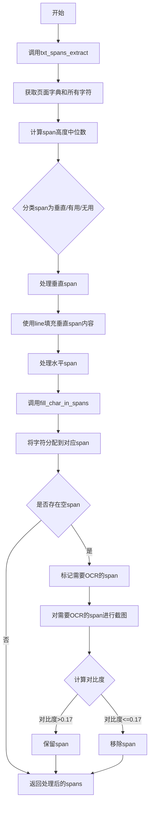
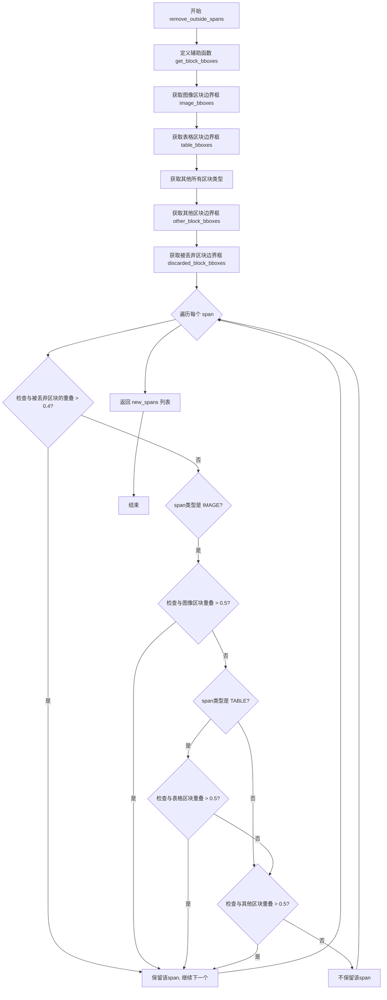
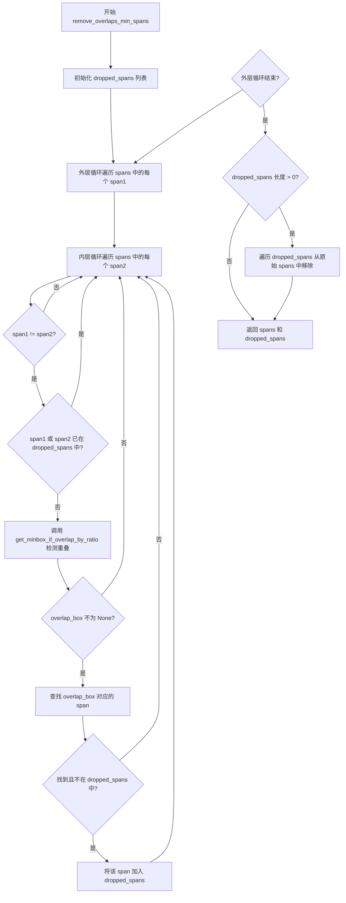
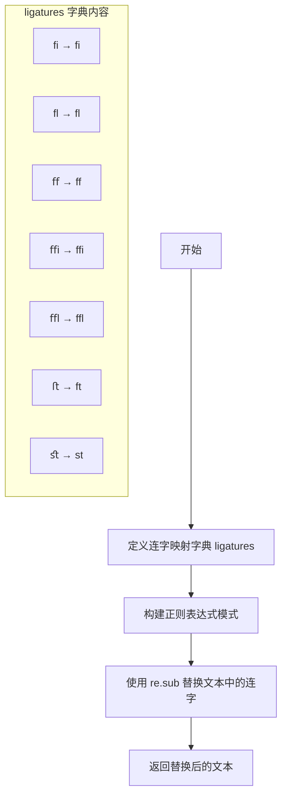
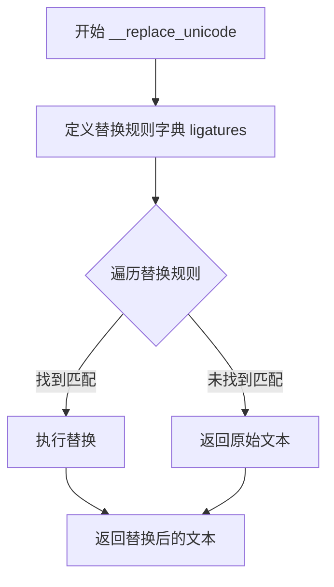
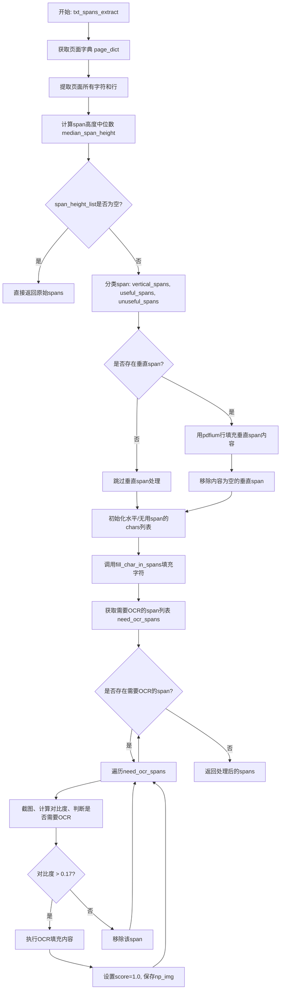
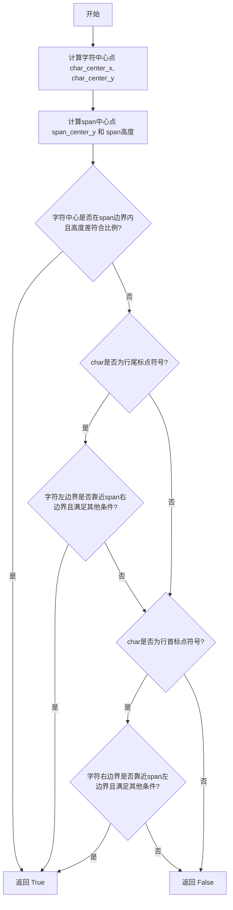

# `MinerU\mineru\utils\span_pre_proc.py` 详细设计文档

该文件是一个PDF文本提取和处理工具模块，主要用于从PDF页面中提取文本span，处理重叠span（移除低置信度或较小span），清理连字和Unicode字符，使用OCR填充无法直接提取的文本，并计算图像对比度以过滤低质量span。

## 整体流程



## 类结构

```
无类层次结构（函数式编程模块）
所有函数均为模块级函数
主要依赖: mineru.utils.boxbase, mineru.utils.enum_class, mineru.utils.pdf_image_tools, mineru.utils.pdf_text_tool
```

## 全局变量及字段


### `LINE_STOP_FLAG`
    
行结束标志字符元组，用于判断字符是否为行的结束符号（如句号、问号、逗号等）

类型：`tuple`
    


### `LINE_START_FLAG`
    
行开始标志字符元组，用于判断字符是否为行的起始符号（如括号、引号、书名号等）

类型：`tuple`
    


### `Span_Height_Radio`
    
字符中轴与span中轴的高度差比例阈值，默认为0.33（即1/3 span高度），用于判断字符是否属于某个span

类型：`float`
    


    

## 全局函数及方法


### `remove_outside_spans`

该函数用于过滤PDF文档中的spans，通过与不同类型区块（图像、表格、其他）的重叠面积比例来判断span是否应该保留，主要目的是移除位于图像、表格等特殊区域外部的无效spans。

参数：

- `spans`：`list`，包含span元素的列表，每个span是一个字典，必须包含`bbox`和`type`字段
- `all_bboxes`：`list`，所有区块的边界框列表，每个区块是一个列表，包含至少8个元素，其中第8个元素（索引7）是区块类型
- `all_discarded_blocks`：`list`，所有被丢弃的区块列表，格式与all_bboxes相同

返回值：`list`，过滤后的span列表，只保留与指定类型区块有足够重叠的spans

#### 流程图



#### 带注释源码

```python
def remove_outside_spans(spans, all_bboxes, all_discarded_blocks):
    """
    移除位于特殊区域（图像、表格等）外部的spans
    
    该函数通过计算span与不同类型区块的重叠面积比例来过滤spans：
    1. 与被丢弃区块重叠 > 40% 的span会被保留
    2. 与图像区块重叠 > 50% 的IMAGE类型span会被保留
    3. 与表格区块重叠 > 50% 的TABLE类型span会被保留
    4. 与其他区块重叠 > 50% 的其他类型span会被保留
    
    Args:
        spans: span列表，每个span是包含'bbox'和'type'字段的字典
        all_bboxes: 所有区块的边界框列表
        all_discarded_blocks: 所有被丢弃的区块列表
    
    Returns:
        过滤后的span列表
    """
    
    def get_block_bboxes(blocks, block_type_list):
        """
        从区块列表中提取指定类型的区块边界框
        
        Args:
            blocks: 区块列表
            block_type_list: 要筛选的区块类型列表
        
        Returns:
            符合条件的区块边界框列表
        """
        # block[0:4] 表示取区块的前4个元素作为边界框 [x0, y0, x1, y1]
        # block[7] 是区块类型字段
        return [block[0:4] for block in blocks if block[7] in block_type_list]

    # 获取图像区块的边界框列表（用于检测图像内的span）
    image_bboxes = get_block_bboxes(all_bboxes, [BlockType.IMAGE_BODY])
    
    # 获取表格区块的边界框列表（用于检测表格内的span）
    table_bboxes = get_block_bboxes(all_bboxes, [BlockType.TABLE_BODY])
    
    # 构建除图像和表格以外的所有其他区块类型列表
    other_block_type = []
    for block_type in BlockType.__dict__.values():
        # 跳过非字符串类型的属性（如__doc__等）
        if not isinstance(block_type, str):
            continue
        # 只保留非图像、非表格的区块类型
        if block_type not in [BlockType.IMAGE_BODY, BlockType.TABLE_BODY]:
            other_block_type.append(block_type)
    
    # 获取其他所有区块的边界框
    other_block_bboxes = get_block_bboxes(all_bboxes, other_block_type)
    
    # 获取被丢弃区块的边界框（这些区域内的span应该被保留）
    discarded_block_bboxes = get_block_bboxes(all_discarded_blocks, [BlockType.DISCARDED])

    # 用于存储过滤后的spans
    new_spans = []

    # 遍历每个span进行过滤判断
    for span in spans:
        # 获取当前span的边界框
        span_bbox = span['bbox']
        # 获取当前span的类型
        span_type = span['type']

        # 第一层过滤：检查是否与被丢弃区块有超过40%的重叠
        # 如果与被丢弃区域有较大重叠，说明该span可能是有用的，予以保留
        if any(calculate_overlap_area_in_bbox1_area_ratio(span_bbox, block_bbox) > 0.4 for block_bbox in
               discarded_block_bboxes):
            new_spans.append(span)
            continue

        # 根据span类型进行不同的重叠判断
        if span_type == ContentType.IMAGE:
            # 图像类型span：检查是否与图像区块有超过50%的重叠
            if any(calculate_overlap_area_in_bbox1_area_ratio(span_bbox, block_bbox) > 0.5 for block_bbox in
                   image_bboxes):
                new_spans.append(span)
        elif span_type == ContentType.TABLE:
            # 表格类型span：检查是否与表格区块有超过50%的重叠
            if any(calculate_overlap_area_in_bbox1_area_ratio(span_bbox, block_bbox) > 0.5 for block_bbox in
                   table_bboxes):
                new_spans.append(span)
        else:
            # 其他类型span（主要是文本）：检查是否与其他区块有超过50%的重叠
            if any(calculate_overlap_area_in_bbox1_area_ratio(span_bbox, block_bbox) > 0.5 for block_bbox in
                   other_block_bboxes):
                new_spans.append(span)

    # 返回过滤后的spans列表
    return new_spans
```


### `remove_overlaps_low_confidence_spans`

该函数用于处理一组span中高度重叠的情况。当两个span的IOU（交并比）超过0.9时，函数会比较它们的置信度分数（score），并保留分数较高的span，删除分数较低的span。这个过程可以有效去除文档中重复检测或误检的低质量span。

参数：

- `spans`：`list`，需要处理的span列表，每个span是一个包含`bbox`和`score`键的字典

返回值：`tuple[list, list]`，返回一个元组，包含处理后的span列表和被删除的span列表

#### 流程图

```mermaid
flowchart TD
    A[开始] --> B[初始化空列表 dropped_spans]
    B --> C[遍历 span1 in spans]
    C --> D[遍历 span2 in spans]
    D --> E{span1 != span2?}
    E -->|否| F[continue 跳过]
    E -->|是| G{span1 或 span2 在 dropped_spans 中?}
    G -->|是| F
    G -->|否| H[计算 span1 和 span2 的 IOU]
    H --> I{IOU > 0.9?}
    I -->|否| F
    I -->|是| J{span1['score'] < span2['score']?}
    J -->|是| K[span_need_remove = span1]
    J -->|否| L[span_need_remove = span2]
    K --> M{span_need_remove 不为 None 且不在 dropped_spans 中?}
    L --> M
    M -->|否| F
    M -->|是| N[将 span_need_remove 添加到 dropped_spans]
    N --> F
    F --> O{所有 span 对遍历完成?}
    O -->|否| D
    O -->|是| P{dropped_spans 长度 > 0?}
    P -->|是| Q[遍历 dropped_spans, 从 spans 中移除]
    P -->|否| R[返回 spans 和 dropped_spans]
    Q --> R
```

#### 带注释源码

```python
def remove_overlaps_low_confidence_spans(spans):
    """
    删除重叠span中置信度较低的那些
    
    当两个span的IOU超过0.9时，比较它们的置信度分数，
    保留分数较高的span，删除分数较低的span
    
    参数:
        spans: span列表，每个span包含 'bbox' 和 'score' 键
        
    返回:
        tuple: (处理后的spans列表, 被删除的spans列表)
    """
    dropped_spans = []
    #  删除重叠spans中置信度低的的那些
    for span1 in spans:
        for span2 in spans:
            # 跳过相同的span
            if span1 != span2:
                # span1 或 span2 任何一个都不应该在 dropped_spans 中
                # 如果已经有一个被标记删除，就跳过这个配对
                if span1 in dropped_spans or span2 in dropped_spans:
                    continue
                else:
                    # 计算两个span的IOU（交并比）
                    if calculate_iou(span1['bbox'], span2['bbox']) > 0.9:
                        # 置信度低的将被删除
                        if span1['score'] < span2['score']:
                            span_need_remove = span1
                        else:
                            span_need_remove = span2
                        # 确保要删除的span不为空且不在已删除列表中
                        if (
                            span_need_remove is not None
                            and span_need_remove not in dropped_spans
                        ):
                            dropped_spans.append(span_need_remove)

    # 如果有需要删除的span，从原始列表中移除
    if len(dropped_spans) > 0:
        for span_need_remove in dropped_spans:
            spans.remove(span_need_remove)

    return spans, dropped_spans
```


### `remove_overlaps_min_spans`

该函数用于删除重叠的 spans 中较小的那些。它通过遍历所有 span 对，使用 `get_minbox_if_overlap_by_ratio` 函数检测重叠区域，并将重叠区域中较小的 span 标记为需要删除的，最终从原始列表中移除这些 span。

参数：

- `spans`：`List[dict]`，包含多个 span 字典的列表，每个 span 字典至少包含 `bbox` 键（边界框信息，格式为 `[x1, y1, x2, y2]`）和其他属性如 `type`、`content` 等

返回值：`Tuple[List[dict], List[dict]]`，返回一个元组，其中第一个元素是处理后（已删除较小重叠 span）的 span 列表，第二个元素是所有被删除的 span 列表

#### 流程图



#### 带注释源码

```python
def remove_overlaps_min_spans(spans):
    """
    删除重叠 spans 中较小的那些
    
    该函数通过比较每对 spans 的重叠区域，将重叠区域中较小的 span 标记为需要删除的，
    并最终从原始列表中移除这些 span。主要用于处理 PDF 或图像中检测到的文本块重叠问题，
    保留较大的文本块而删除较小的文本块。
    
    参数:
        spans: 包含多个 span 字典的列表，每个 span 包含 'bbox' 键，格式为 [x1, y1, x2, y2]
        
    返回:
        Tuple[List[dict], List[dict]]: 
            - 第一个元素: 处理后的 spans 列表（已删除较小的重叠 span）
            - 第二个元素: 被删除的 spans 列表
    """
    dropped_spans = []  # 用于存储需要删除的 span
    
    #  删除重叠spans中较小的那些
    # 双重循环遍历所有 span 对
    for span1 in spans:
        for span2 in spans:
            if span1 != span2:  # 确保比较的是不同的 span
                # span1 或 span2 任何一个都不应该在 dropped_spans 中
                # 如果已经标记为删除，则跳过此次比较
                if span1 in dropped_spans or span2 in dropped_spans:
                    continue
                else:
                    # 调用工具函数检测两个 span 的重叠区域
                    # 参数 0.65 表示重叠比例阈值为 65%
                    overlap_box = get_minbox_if_overlap_by_ratio(span1['bbox'], span2['bbox'], 0.65)
                    
                    # 如果存在重叠区域
                    if overlap_box is not None:
                        # 查找重叠区域对应的 span（重叠区域实际上就是较小 span 的边界框）
                        span_need_remove = next(
                            (span for span in spans if span['bbox'] == overlap_box), 
                            None
                        )
                        # 如果找到且未被标记，则加入待删除列表
                        if span_need_remove is not None and span_need_remove not in dropped_spans:
                            dropped_spans.append(span_need_remove)
    
    # 如果有待删除的 span，从原始列表中移除
    if len(dropped_spans) > 0:
        for span_need_remove in dropped_spans:
            spans.remove(span_need_remove)

    return spans, dropped_spans
```


### `__replace_ligatures`

该函数用于将文本中的 Unicode 连字（Ligatures）字符替换为对应的 ASCII 字符序列，例如将 'fi' 替换为 'fi'。

参数：

- `text`：`str`，需要处理替换连字的输入文本

返回值：`str`，将所有连字字符替换为 ASCII 字符后的文本

#### 流程图



#### 带注释源码

```python
def __replace_ligatures(text: str):
    """
    将 Unicode 连字字符替换为对应的 ASCII 字符序列
    
    参数:
        text: str - 输入的文本字符串
        
    返回:
        str - 替换连字后的文本字符串
    """
    # 定义连字映射字典：键为 Unicode 连字，值为对应的 ASCII 字符序列
    ligatures = {
        'fi': 'fi',   # fi 连字
        'fl': 'fl',   # fl 连字
        'ff': 'ff',   # ff 连字
        'ffi': 'ffi',  # ffi 连字
        'ffc': 'ffl', # ffl 连字
        'ſt': 'ft',   # ft 连字
        'st': 'st'    # st 连字
    }
    
    # 使用正则表达式进行替换：
    # 1. map(re.escape, ligatures.keys()) - 转义字典中的所有键（虽然这里都是普通字符）
    # 2. '|'.join(...) - 用 OR 操作符连接所有键，构建正则模式
    # 3. lambda m: ligatures[m.group()] - 替换函数，匹配到什么键就用什么值替换
    return re.sub('|'.join(map(re.escape, ligatures.keys())), lambda m: ligatures[m.group()], text)
```

---

#### 补充说明

**设计目标：**
- 解决 PDF 文档中常见的 Unicode 连字字符无法正确显示或匹配的问题
- 将连字字符标准化为 ASCII 字符，便于后续文本处理、搜索和匹配

**调用场景：**
- 该函数在 `chars_to_content` 函数中被调用，用于处理从 PDF 提取的文本内容
- 在文本内容构建完成后，对整个文本进行一次连字替换

**潜在优化空间：**
1. **重复调用**：在 `chars_to_content` 函数中，该函数被调用了两次（连续调用），这是冗余的，可以删除一次调用
2. **性能考虑**：如果处理大量文档，可以考虑预编译正则表达式以提高性能
3. **完整性**：可以扩展 ligatures 字典以支持更多连字字符（如德语中的 'ß' → 'ss' 等）


### `__replace_unicode`

该函数用于将文本中的特定Unicode字符（如回车换行符和U+0002控制字符）替换为指定的字符，以清理或规范化文本内容。

参数：

-  `text`：`str`，需要处理的原始文本

返回值：`str`，替换特定Unicode字符后的文本

#### 流程图



#### 带注释源码

```python
def __replace_unicode(text: str):
    """
    将文本中的特定Unicode字符替换为指定字符
    
    该函数主要用于清理PDF解析后文本中的特殊控制字符：
    - \\r\\n (回车换行) 替换为空字符串
    - \\u0002 (STX控制字符) 替换为连字符
    
    参数:
        text: str - 需要处理的原始文本字符串
        
    返回:
        str - 替换特定Unicode字符后的文本字符串
    """
    # 定义替换规则字典：key为待替换的Unicode字符，value为替换后的字符
    ligatures = {
        '\r\n': '',      # 回车换行符 -> 空字符串（移除换行）
        '\u0002': '-',   # STX控制字符 -> 连字符
    }
    
    # 使用正则表达式进行批量替换
    # re.escape确保特殊字符被正确转义
    # lambda函数匹配到哪个key就返回对应的value
    return re.sub('|'.join(map(re.escape, ligatures.keys())), lambda m: ligatures[m.group()], text)
```


### `txt_spans_extract`

该函数是PDF文本提取的核心方法，主要负责从PDF页面中提取文本内容。它通过多阶段处理流程，首先识别垂直和水平文本span，然后利用PDF原始字符数据填充内容，对于无法直接填充的span则调用OCR进行补充，最终返回处理完善的span列表。

参数：

- `pdf_page`：pdf_page对象，PDF页面的原始数据对象，用于提取页面布局信息
- `spans`：List[Dict]，待处理的span列表，每个span包含类型、边界框等基本信息
- `pil_img`：PIL.Image对象，PDF页面对应的图像，用于OCR处理
- `scale`：float，图像的缩放比例，用于坐标转换
- `all_bboxes`：List，所有块的边界框列表，用于判断span与块的重叠关系
- `all_discarded_blocks`：List，被丢弃的块的边界框列表，用于过滤无效span

返回值：`List[Dict]`，处理完成后的span列表，每个span包含提取的文本内容、置信度等信息

#### 流程图



#### 带注释源码

```python
def txt_spans_extract(pdf_page, spans, pil_img, scale, all_bboxes, all_discarded_blocks):
    """
    PDF文本提取主函数，通过多阶段处理从PDF页面中提取文本内容
    
    处理流程：
    1. 获取PDF页面字典，提取所有字符和行信息
    2. 计算span高度中位数，用于后续判断
    3. 分类span为垂直、有用、无用三类
    4. 垂直span用PDF行直接填充
    5. 水平/无用span尝试用字符填充
    6. 无法填充的span调用OCR补充
    """
    
    # 第一步：获取页面字典结构
    page_dict = get_page(pdf_page)
    
    # 初始化字符和行列表，用于后续匹配
    page_all_chars = []
    page_all_lines = []
    
    # 遍历页面所有块，提取字符和行
    # 过滤掉旋转角度不在0/90/180/270度的行
    for block in page_dict['blocks']:
        for line in block['lines']:
            rotation_degrees = math.degrees(line['rotation'])
            # 旋转角度不为0, 90, 180, 270的行，直接跳过（rotation_degrees的值可能不为整数）
            if not any(abs(rotation_degrees - angle) < 0.1 for angle in [0, 90, 180, 270]):
                continue
            page_all_lines.append(line)
            for span in line['spans']:
                for char in span['chars']:
                    page_all_chars.append(char)
    
    # 第二步：计算所有span高度的中位数
    span_height_list = []
    for span in spans:
        # 只处理文本类型的span
        if span['type'] in [ContentType.TEXT]:
            # 计算span高度和宽度
            span_height = span['bbox'][3] - span['bbox'][1]
            span['height'] = span_height
            span['width'] = span['bbox'][2] - span['bbox'][0]
            span_height_list.append(span_height)
    
    # 如果没有有效span，直接返回
    if len(span_height_list) == 0:
        return spans
    else:
        # 计算中位数作为参考高度
        median_span_height = statistics.median(span_height_list)
    
    # 第三步：分类span
    useful_spans = []      # 有用span：与有效块重叠
    unuseful_spans = []    # 无用span：与已丢弃块重叠
    vertical_spans = []    # 垂直span：高度异常大的span
    
    # 纵向span的两个特征：1. 高度超过多个line 2. 高宽比超过某个值
    for span in spans:
        if span['type'] in [ContentType.TEXT]:
            # 遍历所有块，判断span与块的重叠关系
            for block in all_bboxes + all_discarded_blocks:
                # 跳过图片、表格、行间公式块
                if block[7] in [BlockType.IMAGE_BODY, BlockType.TABLE_BODY, BlockType.INTERLINE_EQUATION]:
                    continue
                # 计算重叠面积比例
                if calculate_overlap_area_in_bbox1_area_ratio(span['bbox'], block[0:4]) > 0.5:
                    # 判断是否为垂直span（高度大于中位数2.3倍且高宽比大于2.3）
                    if span['height'] > median_span_height * 2.3 and span['height'] > span['width'] * 2.3:
                        vertical_spans.append(span)
                    elif block in all_bboxes:
                        # 在有效块范围内
                        useful_spans.append(span)
                    else:
                        # 在已丢弃块范围内
                        unuseful_spans.append(span)
                    break
    
    """垂直的span框直接用line进行填充"""
    # 第四步：处理垂直span
    if len(vertical_spans) > 0:
        for pdfium_line in page_all_lines:
            for span in vertical_spans:
                # 如果行与span重叠面积大于50%，则用该行内容填充span
                if calculate_overlap_area_in_bbox1_area_ratio(pdfium_line['bbox'].bbox, span['bbox']) > 0.5:
                    # 累加该行所有span的文本
                    for pdfium_span in pdfium_line['spans']:
                        span['content'] += pdfium_span['text']
                    break
        
        # 移除内容为空的垂直span
        for span in vertical_spans:
            if len(span['content']) == 0:
                spans.remove(span)
    
    """水平的span框先用char填充，再用ocr填充空的span框"""
    new_spans = []
    
    # 第五步：初始化水平/无用span的字符列表
    for span in useful_spans + unuseful_spans:
        if span['type'] in [ContentType.TEXT]:
            span['chars'] = []
            new_spans.append(span)
    
    # 调用字符填充函数，返回需要OCR的span
    need_ocr_spans = fill_char_in_spans(new_spans, page_all_chars, median_span_height)
    
    """对未填充的span进行ocr"""
    # 第六步：对需要OCR的span进行处理
    if len(need_ocr_spans) > 0:
        for span in need_ocr_spans:
            # 对span的bbox截图再ocr
            span_pil_img = get_crop_img(span['bbox'], pil_img, scale)
            span_img = cv2.cvtColor(np.array(span_pil_img), cv2.COLOR_RGB2BGR)
            # 计算span的对比度，低于0.20的span不进行ocr
            if calculate_contrast(span_img, img_mode='bgr') <= 0.17:
                spans.remove(span)
                continue
            
            # 设置默认内容、分数和图像
            span['content'] = ''
            span['score'] = 1.0
            span['np_img'] = span_img
    
    return spans
```


### `fill_char_in_spans`

该函数用于将字符分配到对应的span中，通过网格索引加速匹配过程，并对填充后的span进行过滤，识别出需要OCR处理的空或低内容密度span。

参数：

- `spans`：`list`，需要填充字符的span列表
- `all_chars`：`list`，从PDF页面提取的所有字符列表
- `median_span_height`：`float`，所有span高度的中位数，用于网格划分

返回值：`list`，返回需要OCR处理的span列表（这些span的内容为空或密度过低）

#### 流程图

```mermaid
flowchart TD
    A[开始: fill_char_in_spans] --> B[按bbox[1]升序排序spans]
    B --> C[创建grid_size = median_span_height的网格]
    C --> D[为每个span分配网格单元索引]
    D --> E{遍历all_chars}
    E -->|每个char| F[计算char中心y坐标和网格单元索引]
    F --> G[获取该网格单元的所有候选span索引]
    G --> H{遍历候选span}
    H -->|每个span| I{调用calculate_char_in_span判断}
    I -->|是| J[将char添加到span的chars列表并跳出]
    I -->|否| H
    H --> K{所有候选span遍历完?}
    K -->|否| H
    K -->|是| E
    E --> L{遍历处理完所有chars}
    L --> M[对每个span调用chars_to_content转换]
    M --> N{判断span是否需要OCR}
    N -->|len content × height < width × 0.5| O[标记为需要OCR]
    N -->|否| P[不标记]
    O --> Q[删除临时添加的height和width字段]
    P --> Q
    Q --> R[返回need_ocr_spans列表]
```

#### 带注释源码

```
def fill_char_in_spans(spans, all_chars, median_span_height):
    """
    将字符分配到对应的span中，识别需要OCR的span
    
    参数:
        spans: 需要填充字符的span列表
        all_chars: 从PDF页面提取的所有字符列表
        median_span_height: 所有span高度的中位数，用于网格划分
    返回:
        需要OCR处理的span列表
    """
    # 1. 按span的顶部y坐标升序排序，便于后续处理
    spans = sorted(spans, key=lambda x: x['bbox'][1])

    # 2. 使用span高度中位数作为网格大小，建立空间索引加速字符查找
    grid_size = median_span_height
    grid = collections.defaultdict(list)
    for i, span in enumerate(spans):
        # 计算span占据的网格单元范围（从顶部到底部）
        start_cell = int(span['bbox'][1] / grid_size)
        end_cell = int(span['bbox'][3] / grid_size)
        # 将span索引添加到其占据的所有网格单元中
        for cell_idx in range(start_cell, end_cell + 1):
            grid[cell_idx].append(i)

    # 3. 遍历所有字符，将其分配到对应的span中
    for char in all_chars:
        # 计算字符中心点的y坐标
        char_center_y = (char['bbox'][1] + char['bbox'][3]) / 2
        # 计算字符所在的网格单元索引
        cell_idx = int(char_center_y / grid_size)

        # 获取该网格单元中的所有候选span索引
        candidate_span_indices = grid.get(cell_idx, [])

        # 遍历候选span，判断字符是否属于该span
        for span_idx in candidate_span_indices:
            span = spans[span_idx]
            # 使用几何规则判断字符是否在span范围内
            if calculate_char_in_span(char['bbox'], span['bbox'], char['char']):
                span['chars'].append(char)
                # 一个字符只属于一个span，找到后跳出
                break

    # 4. 处理每个span，生成content并识别需要OCR的span
    need_ocr_spans = []
    for span in spans:
        # 将chars列表转换为content字符串
        chars_to_content(span)
        
        # 判断span是否可能是空的（需要OCR）
        # 逻辑：content长度 × 高度 < 宽度 × 0.5 表示可能是空span
        if len(span['content']) * span['height'] < span['width'] * 0.5:
            need_ocr_spans.append(span)
        
        # 删除临时添加的height和width字段，不影响原数据
        del span['height'], span['width']
    
    return need_ocr_spans
```


### `calculate_char_in_span`

该函数用于判断一个字符是否属于某个 span（文本块），通过计算字符的中心点是否落在 span 的边界框内，以及字符与 span 的中心轴高度差是否在允许范围内。对于行首或行尾的特殊标点符号（如括号、引号等），采用不同的匹配策略以提高文本提取的准确性。

参数：

- `char_bbox`：`List[float]` 或 `Tuple[float, float, float, float]`，字符的边界框，格式为 `[x0, y0, x1, y1]`，表示字符的左上角和右下角坐标
- `span_bbox`：`List[float]` 或 `Tuple[float, float, float, float]`，span（文本块）的边界框，格式为 `[x0, y0, x1, y1]`，表示 span 的左上角和右下角坐标
- `char`：`str`，待检测的单个字符，用于判断是否为行首或行尾的标点符号
- `span_height_radio`：`float`，可选参数，字符中心与 span 中心的高度差允许比例，默认为 `Span_Height_Radio`（0.33），即允许高度差不超过 span 高度的 1/3

返回值：`bool`，如果字符属于该 span 则返回 `True`，否则返回 `False`

#### 流程图



#### 带注释源码

```python
# 全局常量：字符的中轴和span的中轴高度差不能超过1/3span高度
Span_Height_Radio = 0.33

def calculate_char_in_span(char_bbox, span_bbox, char, span_height_radio=Span_Height_Radio):
    """
    判断一个字符是否属于某个span（文本块）。
    
    通过计算字符中心点是否落在span的边界框内，以及字符与span的中心轴
    高度差是否在允许范围内来判定。对于行首或行尾的特殊标点符号，采用
    不同的匹配策略。
    
    参数:
        char_bbox: 字符的边界框 [x0, y0, x1, y1]
        span_bbox: span的边界框 [x0, y0, x1, y1]
        char: 待检测的字符
        span_height_radio: 高度差允许比例，默认0.33
    
    返回:
        bool: 字符是否属于该span
    """
    
    # 计算字符的中心点坐标（x和y方向）
    char_center_x = (char_bbox[0] + char_bbox[2]) / 2
    char_center_y = (char_bbox[1] + char_bbox[3]) / 2
    
    # 计算span的中心点y坐标和span的高度
    span_center_y = (span_bbox[1] + span_bbox[3]) / 2
    span_height = span_bbox[3] - span_bbox[1]

    # 方案一：标准的字符与span匹配逻辑
    # 1. 字符中心x坐标必须在span的左右边界之间
    # 2. 字符中心y坐标必须在span的上下边界之间
    # 3. 字符中心与span中心的y轴距离不能超过span高度的span_height_radio比例
    if (
        span_bbox[0] < char_center_x < span_bbox[2]
        and span_bbox[1] < char_center_y < span_bbox[3]
        and abs(char_center_y - span_center_y) < span_height * span_height_radio  # 字符的中轴和span的中轴高度差不能超过Span_Height_Radio
    ):
        return True
    else:
        # 方案二：处理行尾标点符号（如句号、问号、括号等）
        # 如果char是LINE_STOP_FLAG，就不用中心点判定，换一种方案（左边界在span区域内，高度判定和之前逻辑一致）
        # 主要是给结尾符号一个进入span的机会，这个char还应该离span右边界较近
        if char in LINE_STOP_FLAG:
            if (
                # 字符左边界在span右边界附近（距离不超过一个span高度）
                (span_bbox[2] - span_height) < char_bbox[0] < span_bbox[2]
                # 字符中心x坐标大于span左边界（在span内部或右侧）
                and char_center_x > span_bbox[0]
                # 字符中心y坐标在span上下边界之间
                and span_bbox[1] < char_center_y < span_bbox[3]
                # 高度差仍然需要在允许范围内
                and abs(char_center_y - span_center_y) < span_height * span_height_radio
            ):
                return True
        # 方案三：处理行首标点符号（如左括号、引号等）
        elif char in LINE_START_FLAG:
            if (
                # 字符右边界在span左边界附近（距离不超过一个span高度）
                span_bbox[0] < char_bbox[2] < (span_bbox[0] + span_height)
                # 字符中心x坐标小于span右边界（在span内部或左侧）
                and char_center_x < span_bbox[2]
                # 字符中心y坐标在span上下边界之间
                and span_bbox[1] < char_center_y < span_bbox[3]
                # 高度差仍然需要在允许范围内
                and abs(char_center_y - span_center_y) < span_height * span_height_radio
            ):
                return True
        else:
            # 不满足任何匹配条件，返回False
            return False
```


### `chars_to_content`

该函数将span中的字符列表转换为连续的内容字符串，根据字符间距智能添加空格，并处理Unicode字符和连字问题，最后将转换后的内容存储在span的content字段中，同时删除原有的chars字段。

参数：

- `span`：`dict`，包含chars列表的span对象，chars列表存储了span中的所有字符信息，每个字符包含bbox、char_idx和char等属性

返回值：`None`，该函数直接修改传入的span对象，不返回任何值

#### 流程图

```mermaid
flowchart TD
    A[开始 chars_to_content] --> B{span['chars']是否为空}
    B -->|是| C[pass 不做任何处理]
    B -->|否| D[按char_idx排序chars列表]
    D --> E[计算每个字符的宽度]
    E --> F[计算字符宽度的中位数 median_width]
    F --> G[初始化空字符串content]
    G --> H[遍历span中的每个字符]
    H --> I{获取下一个字符char2}
    I -->|char2存在| J{char2和char1的间距<br/>大于0.25倍中位宽度<br/>且两者都不是空格}
    J -->|是| K[添加char1和空格到content]
    J -->|否| L[只添加char1到content]
    I -->|char2不存在| L
    K --> M[遍历是否结束]
    L --> M
    M -->|未结束| H
    M -->|已结束| N[__replace_unicode处理content]
    N --> O[__replace_ligatures处理content两次]
    O --> P[content.strip去除首尾空格]
    P --> Q[span['content'] = content]
    Q --> R[del span['chars']]
    C --> R
    R --> S[结束]
```

#### 带注释源码

```python
def chars_to_content(span):
    # 检查span中的char是否为空
    if len(span['chars']) == 0:
        # 如果span中没有字符，直接pass，后续content字段不会被设置
        pass
    else:
        # 给chars按char_idx排序，确保字符按正确顺序连接
        span['chars'] = sorted(span['chars'], key=lambda x: x['char_idx'])

        # Calculate the width of each character
        # 遍历所有字符，计算每个字符的宽度（bbox的x2 - x0）
        char_widths = [char['bbox'][2] - char['bbox'][0] for char in span['chars']]
        # Calculate the median width
        # 使用中位数作为参考宽度，比平均值更鲁棒，能更好处理不同字号混合的情况
        median_width = statistics.median(char_widths)

        content = ''
        # 遍历每个字符，将它们连接成字符串
        for char in span['chars']:

            # 如果下一个char的x0和上一个char的x1距离超过0.25个字符宽度，则需要在中间插入一个空格
            # 这用于处理PDF中单词之间的间距
            char1 = char
            # 获取下一个字符，如果当前字符是最后一个，则char2为None
            char2 = span['chars'][span['chars'].index(char) + 1] if span['chars'].index(char) + 1 < len(span['chars']) else None
            # 判断条件：相邻字符间距大于0.25倍中位宽度，且两个字符都不是空格
            if char2 and char2['bbox'][0] - char1['bbox'][2] > median_width * 0.25 and char['char'] != ' ' and char2['char'] != ' ':
                content += f"{char['char']} "  # 在字符后添加空格
            else:
                content += char['char']  # 直接添加字符

        # 替换Unicode特殊字符（如换行符、回车符等）
        content = __replace_unicode(content)
        # 替换连字字符（如fi, fl, ff等连写形式）
        content = __replace_ligatures(content)
        # 再次调用以确保处理彻底
        content = __replace_ligatures(content)
        # 去除首尾空格并存储到span的content字段
        span['content'] = content.strip()

    # 删除span中的chars字段，因为已经转换为content，节省内存
    del span['chars']
```


### `calculate_contrast`

该函数用于计算给定图像的对比度，通过将图像转换为灰度图，然后计算灰度值的标准差与平均值的比值来评估图像对比度，常用于判断图像是否适合进行 OCR 识别。

参数：

- `img`：`numpy.ndarray`，输入的图像数据
- `img_mode`：`str`，图像的色彩通道模式，可选值为 `'rgb'` 或 `'bgr'`

返回值：`float`，返回图像的对比度值，保留两位小数

#### 流程图

```mermaid
flowchart TD
    A[开始] --> B{img_mode == 'rgb'?}
    B -->|是| C[使用 cv2.COLOR_RGB2GRAY 转换为灰度图]
    B -->|否| D{img_mode == 'bgr'?}
    D -->|是| E[使用 cv2.COLOR_BGR2GRAY 转换为灰度图]
    D -->|否| F[抛出 ValueError 异常]
    C --> G[计算灰度图均值]
    E --> G
    G --> H[计算灰度图标准差]
    H --> I[计算对比度: std_dev / (mean_value + 1e-6)]
    I --> J[返回四舍五入保留两位小数的对比度值]
    J --> K[结束]
    F --> K
```

#### 带注释源码

```python
def calculate_contrast(img, img_mode) -> float:
    """
    计算给定图像的对比度。
    :param img: 图像，类型为numpy.ndarray
    :Param img_mode = 图像的色彩通道，'rgb' 或 'bgr'
    :return: 图像的对比度值
    """
    # 根据图像模式进行灰度转换
    if img_mode == 'rgb':
        # 将RGB图像转换为灰度图
        gray_img = cv2.cvtColor(img, cv2.COLOR_RGB2GRAY)
    elif img_mode == 'bgr':
        # 将BGR图像转换为灰度图
        gray_img = cv2.cvtColor(img, cv2.COLOR_BGR2GRAY)
    else:
        # 如果提供了不支持的图像模式，抛出异常
        raise ValueError("Invalid image mode. Please provide 'rgb' or 'bgr'.")

    # 计算均值和标准差
    mean_value = np.mean(gray_img)
    std_dev = np.std(gray_img)
    
    # 对比度定义为标准差除以平均值（加上小常数避免除零错误）
    contrast = std_dev / (mean_value + 1e-6)
    
    # 返回四舍五入保留两位小数的对比度值
    # logger.debug(f"contrast: {contrast}")
    return round(contrast, 2)
```

## 关键组件


### 1. Span过滤与清理模块

该模块包含三个核心函数，用于去除无用的或重叠的文本片段。`remove_outside_spans`函数根据区块类型（图片、表格、 discarded块）过滤掉位于这些区域内的span；`remove_overlaps_low_confidence_spans`通过计算IOU去除重叠span中置信度较低的那个；`remove_overlaps_min_spans`则去除重叠区域中面积较小的span。这三个函数共同确保了后续处理的span数据质量。

### 2. 文本提取主流程

`txt_spans_extract`是该模块的核心入口函数，负责从PDF页面中提取文本内容。它首先获取页面所有行和字符，然后计算span高度的中位数作为参考基准。接着通过高度和宽高比特征识别垂直span（跨多行的标题类文本），直接使用PDF行文本填充；对于普通水平span，先尝试用字符填充，再用OCR处理未能填充的空白span。该函数综合运用了字符映射、空间位置判断和OCR技术。

### 3. 字符到Span映射引擎

`fill_char_in_spans`函数实现了字符与span的智能匹配。它首先将span按垂直位置排序并建立网格索引，以网格大小（span高度中位数）为单位构建空间索引，加速字符查找过程。对于每个字符，计算其中心点所在的网格单元，然后遍历候选span列表，通过`calculate_char_in_span`判断字符是否属于该span。`calculate_char_in_span`函数基于字符中心点与span中心点的垂直距离、字符是否在span边界内、以及特殊标点符号（行首/行尾标点）的特殊处理逻辑来决定归属关系。

### 4. 内容合成与文本规范化

`chars_to_content`函数负责将字符数组转换为最终的文本内容。它首先按字符索引排序，然后计算字符宽度中位数用于判断字符间距。当相邻字符的间距超过0.25个字符宽度时，在中间插入空格以保持适当的单词或字符间隔。最后通过`__replace_unicode`和`__replace_ligatures`函数进行Unicode规范化，将特殊连字符（如fi、fl等）和控制字符转换为标准形式。

### 5. OCR预处理与质量控制

`calculate_contrast`函数计算图像的对比度（标准差/平均值），用于判断某个span区域是否包含有效文本内容。当对比度低于0.17时，该span被认为可能是空白或极低质量的图像，不进行OCR处理直接丢弃。这是一种基于图像特征的惰性加载策略，避免对无内容区域进行昂贵的OCR运算。

### 6. 辅助工具函数

代码还包含一些辅助函数：`get_block_bboxes`用于从区块列表中提取指定类型的边界框；`__replace_ligatures`和`__replace_unicode`作为文本预处理函数，处理PDF文档中常见的连字和控制字符问题。这些工具函数支撑着核心文本提取逻辑的正常运行。


## 问题及建议


### 已知问题

-   **算法复杂度问题**：`remove_overlaps_low_confidence_spans` 和 `remove_overlaps_min_spans` 使用双重嵌套循环，时间复杂度为 O(n²)，当 spans 数量较大时性能较差
-   **硬编码阈值（魔数）**：代码中多处使用硬编码的数值如 0.4、0.5、0.9、0.65、2.3、0.17、0.25 等，缺乏注释说明，且散落在各处难以维护
-   **重复逻辑**：`remove_overlaps_low_confidence_spans` 和 `remove_overlaps_min_spans` 结构高度相似，重复代码较多，可抽象为通用函数
-   **字符串处理效率**：`chars_to_content` 中多次调用 `__replace_ligatures` 和 `__replace_unicode`，每次都编译正则表达式，可预先编译或合并
- **列表操作效率**：多处使用 `spans.remove(span)` 删除元素，时间复杂度为 O(n)，可改用其他数据结构或标记删除
- **重复计算**：相同 bbox 的重叠面积计算被多次执行，可引入缓存机制
- **网格划分策略**：`fill_char_in_spans` 中使用固定网格大小 `median_span_height` 划分，可能导致边界情况处理不当
- **边界处理**：`chars_to_content` 中使用 `span['chars'].index(char)` 获取索引，在字符量大的情况下效率不高
- **日志注释**：部分关键逻辑如对比度阈值判断被注释掉，不利于问题排查

### 优化建议

-   使用空间索引（如 R-tree 或四叉树）优化重叠检测，将时间复杂度降至 O(n log n)
-   将所有阈值常量提取为配置文件或类常量，并添加详细注释说明每个阈值的业务含义
-   抽象出通用的 `remove_overlaps_by_criteria` 函数，通过回调参数区分不同的比较逻辑
-   预编译正则表达式 `re.compile()` 并复用，或使用 `str.translate()` 处理单字符替换
-   使用 `enumerate` 替代 `list.index()` 获取索引，或在字符数据中直接存储索引信息
-   考虑使用 `set` 或 `dict` 标记待删除元素，最后统一过滤重建列表
-   将 `grid_size` 计算策略优化为动态调整或使用更细粒度的网格划分方法

## 其它


### 设计目标与约束

本模块旨在从PDF文档页面中高效、准确地提取文本内容，主要目标包括：1）处理各种布局的PDF（包括水平和垂直文本）；2）通过字符匹配和OCR双重机制确保高召回率；3）过滤掉与图片、表格等非文本区域的冲突内容。设计约束包括：依赖pdfium库提供的PDF渲染数据、需配合OpenCV进行图像处理、内存占用需控制在合理范围内以支持大批量文档处理。

### 错误处理与异常设计

代码中错误处理主要体现在：1）空值检查（如span_height_list为空时直接返回原spans）；2）图像模式校验（calculate_contrast函数中对rgb/bgr模式的校验，抛出ValueError）；3）除零保护（calculate_contrast中使用1e-6避免除零）；4）异常捕获（通过条件判断过滤无效span）。建议增强：错误类型应定义明确的异常类，OCR失败时应记录日志并允许降级处理，文件读取失败时应向上层抛出明确异常而非静默跳过。

### 数据流与状态机

数据流主要分为三个阶段：第一阶段为预处理（remove_outside_spans、remove_overlaps_low_confidence_spans、remove_overlaps_min_spans），对原始spans进行过滤和去重；第二阶段为文本提取（txt_spans_extract），根据span方向分别处理，垂直span使用PDF行填充，水平span使用字符填充；第三阶段为OCR补全（fill_char_in_spans），对未能填充的span进行OCR识别。状态转换通过span的content字段是否为空来判断，need_ocr_spans列表标记待OCR处理的span。

### 外部依赖与接口契约

本模块依赖以下外部组件：1）pdfium（通过get_page获取页面数据）；2）OpenCV（cv2用于图像处理和对比度计算）；3）NumPy（数组操作）；4）Loguru（日志记录）；5）自定义工具类（boxbase、enum_class、pdf_image_tools、pdf_text_tool）。输入接口：pdf_page（PDF页面对象）、spans（span列表）、pil_img（PIL图像）、scale（缩放因子）、all_bboxes和all_discarded_blocks（边界框信息）。输出接口：返回处理后的spans列表，每个span包含content、score、np_img等字段。

### 性能考虑与优化空间

当前实现中存在性能瓶颈：1）双重循环去重导致O(n²)复杂度，vertical_spans和useful_spans的遍历可优化；2）字符匹配使用线性扫描，应建立空间索引；3）OCR处理为串行执行，大批量文档时可考虑并行化。优化建议：使用R树或四叉树加速空间查询、引入缓存机制存储中间结果、考虑使用GPU加速OCR过程。

### 配置与参数说明

关键可配置参数包括：Span_Height_Radio（0.33）- 字符中心与span中心的高度差阈值；重叠阈值0.4（discarded blocks）和0.5（其他blocks）；OCR对比度阈值0.17；字符间距阈值0.25倍中位宽度。这些参数可通过配置文件或构造函数注入，便于针对不同PDF格式进行调优。

### 安全性考虑

代码不涉及直接的用户输入处理，安全性风险较低。但需注意：1）OCR处理涉及图像数据，需确保图像来源可信；2）日志输出需避免敏感信息泄露；3）文件路径处理应防止路径遍历攻击。建议在生产环境中对外部输入进行验证和清洗。

### 可扩展性设计

模块设计遵循单一职责原则，便于扩展：1）新增文本类型只需在ContentType枚举中添加并扩展处理逻辑；2）OCR引擎可通过策略模式替换为Tesseract或其他引擎；3）垂直/水平文本检测算法可独立演进。建议：建立插件机制支持自定义后处理步骤，抽象出文本提取策略接口以适应不同文档格式。

### 测试策略建议

建议补充单元测试覆盖：1）各filter函数的边界条件（空输入、单元素、全部重叠）；2）字符匹配算法的各种场景（正常字符、行首符、行尾符）；3）OCR对比度计算的准确性验证；4）集成测试使用标准PDF样本库验证召回率和准确率。性能测试应关注万级span处理耗时，回归测试确保参数调整不影响现有功能。


    