# `MinerU\mineru\utils\table_merge.py` 详细设计文档

该模块主要用于合并文档中跨页分割的表格。它通过检测表格的续表标识符（如'(续)'）、脚注、宽度和行列结构（colspan/rowspan），判断相邻页面的表格是否为同一表格的分割部分，并在结构兼容的情况下进行合并（调整列宽、移动行数据、合并脚注）。

## 整体流程

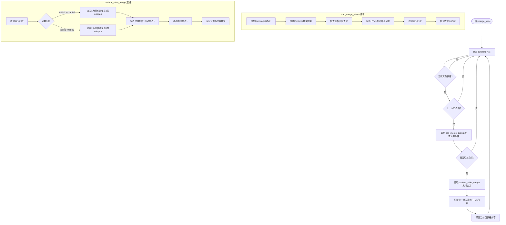

## 类结构

```
merge_table (模块 - 无类定义)
├── 全局常量
│   ├── CONTINUATION_END_MARKERS
│   └── CONTINUATION_INLINE_MARKERS
└── 函数列表
    ├── 表格结构计算 (calculate_*, build_*)
    ├── 表头检测 (detect_table_headers, _detect_table_headers_visual)
    ├── 合并可行性判断 (can_merge_tables, check_rows_match, check_row_columns_match)
    ├── 结构调整 (adjust_table_rows_colspan)
    ├── 执行合并 (perform_table_merge)
    └── 主入口 (merge_table)
```

## 全局变量及字段


### `CONTINUATION_END_MARKERS`
    
表格续表结束标记列表，包含用于标识表格结尾续表的多种语言符号，如"(续)"、"(continued)"等

类型：`List[str]`
    


### `CONTINUATION_INLINE_MARKERS`
    
表格内联续表标记列表，包含用于标识表格内续表的符号，如"(continued)"

类型：`List[str]`
    


    

## 全局函数及方法


### `calculate_table_total_columns`

该函数通过遍历HTML表格的所有行和单元格，处理`rowspan`和`colspan`属性，计算表格的总列数。它使用一个占用矩阵来跟踪已被单元格占据的位置，确保在存在跨行跨列单元格时仍能准确计算列数。

参数：

- `soup`：`BeautifulSoup`，BeautifulSoup解析的表格（HTML table元素）

返回值：`int`，表格的总列数

#### 流程图

```mermaid
flowchart TD
    A[开始] --> B{rows是否存在?}
    B -->|否| C[返回0]
    B -->|是| D[初始化max_cols=0, occupied={}]
    D --> E[遍历每一行row_idx, row]
    E --> F[初始化col_idx=0]
    F --> G[获取当前行所有单元格cells]
    G --> H[确保occupied[row_idx]存在]
    H --> I{遍历每个cell}
    I --> J[while col_idx被占用]
    J --> K[col_idx += 1]
    J --> L{col_idx未被占用}
    L -->|否| J
    L -->|是| M[获取colspan和rowspan]
    M --> N[标记rowspan×colspan区域为占用]
    N --> O[col_idx += colspan]
    O --> P[更新max_cols]
    P --> I
    I --> Q{下一行?}
    Q -->|否| E
    Q -->|是| R[返回max_cols]
```

#### 带注释源码

```python
def calculate_table_total_columns(soup):
    """计算表格的总列数，通过分析整个表格结构来处理rowspan和colspan

    Args:
        soup: BeautifulSoup解析的表格

    Returns:
        int: 表格的总列数
    """
    # 获取表格所有行
    rows = soup.find_all("tr")
    # 如果没有行，返回0
    if not rows:
        return 0

    # 创建一个矩阵来跟踪每个位置的占用情况
    # max_cols: 记录遍历过程中遇到的最大列数
    # occupied: 字典，键为行索引，值为该行被占用的列索引集合 {row_idx: {col_idx: True}}
    max_cols = 0
    occupied = {}

    # 遍历表格的每一行
    for row_idx, row in enumerate(rows):
        col_idx = 0  # 当前列索引，从0开始
        cells = row.find_all(["td", "th"])  # 获取当前行所有单元格

        # 确保当前行的占用字典已初始化
        if row_idx not in occupied:
            occupied[row_idx] = {}

        # 遍历当前行的每个单元格
        for cell in cells:
            # 找到下一个未被占用的列位置（处理colspan导致的列跳过）
            while col_idx in occupied[row_idx]:
                col_idx += 1

            # 获取单元格的colspan和rowspan属性，默认为1
            colspan = int(cell.get("colspan", 1))
            rowspan = int(cell.get("rowspan", 1))

            # 标记被这个单元格占用的所有位置
            # 这是一个二维标记，处理rowspan（跨行）和colspan（跨列）
            for r in range(row_idx, row_idx + rowspan):
                if r not in occupied:
                    occupied[r] = {}
                for c in range(col_idx, col_idx + colspan):
                    occupied[r][c] = True

            # 列索引前进到下一个未占用的位置
            col_idx += colspan
            # 更新最大列数
            max_cols = max(max_cols, col_idx)

    return max_cols
```


### `build_table_occupied_matrix`

构建表格的占用矩阵，遍历表格的每一行和单元格，跟踪每个单元格因 rowspan 和 colspan 属性所占据的位置，最终返回每行的有效列数（即考虑 rowspan 占用后的实际列数）。

参数：

-  `soup`：`BeautifulSoup`，BeautifulSoup 解析的表格对象

返回值：`dict`，键为行索引 `row_idx`，值为该行的有效列数（考虑 rowspan 占用）

#### 流程图

```mermaid
flowchart TD
    A[开始 build_table_occupied_matrix] --> B{rows 是否为空}
    B -->|是| C[返回空字典 {}]
    B -->|否| D[初始化 occupied 和 row_effective_cols]
    D --> E[遍历每一行 row_idx, row]
    E --> F[获取当前行所有单元格 cells]
    F --> G{遍历每个 cell}
    G --> H[找到下一个未被占用的列位置 col_idx]
    H --> I[获取 colspan 和 rowspan]
    I --> J[标记单元格占用的所有位置]
    J --> K[col_idx 增加 colspan]
    K --> G
    G --> L{当前行遍历完成}
    L --> M[计算该行有效列数]
    M --> N[保存到 row_effective_cols]
    N --> E
    E --> O[返回 row_effective_cols]
```

#### 带注释源码

```python
def build_table_occupied_matrix(soup):
    """构建表格的占用矩阵，返回每行的有效列数

    Args:
        soup: BeautifulSoup解析的表格

    Returns:
        dict: {row_idx: effective_columns} 每行的有效列数（考虑rowspan占用）
    """
    # 获取表格所有行
    rows = soup.find_all("tr")
    
    # 空表格直接返回空字典
    if not rows:
        return {}

    # occupied: 记录每个位置是否被占用 {row_idx: {col_idx: True}}
    occupied = {}
    # row_effective_cols: 记录每行的有效列数 {row_idx: effective_columns}
    row_effective_cols = {}

    # 遍历表格的每一行
    for row_idx, row in enumerate(rows):
        col_idx = 0  # 当前列索引
        cells = row.find_all(["td", "th"])  # 获取当前行的所有单元格

        # 初始化当前行的占用记录
        if row_idx not in occupied:
            occupied[row_idx] = {}

        # 遍历当前行的每个单元格
        for cell in cells:
            # 找到下一个未被占用的列位置（处理 rowspan 导致的列跳过）
            while col_idx in occupied[row_idx]:
                col_idx += 1

            # 获取单元格的 colspan 和 rowspan 属性
            colspan = int(cell.get("colspan", 1))
            rowspan = int(cell.get("rowspan", 1))

            # 标记这个单元格占用的所有位置
            for r in range(row_idx, row_idx + rowspan):
                if r not in occupied:
                    occupied[r] = {}
                for c in range(col_idx, col_idx + colspan):
                    occupied[r][c] = True

            # 列索引前移，准备处理下一个单元格
            col_idx += colspan

        # 该行的有效列数为已占用的最大列索引+1
        if occupied[row_idx]:
            row_effective_cols[row_idx] = max(occupied[row_idx].keys()) + 1
        else:
            row_effective_cols[row_idx] = 0

    return row_effective_cols
```


### `calculate_row_effective_columns`

计算指定行的有效列数，考虑表格中单元格跨行（rowspan）造成的占用情况。

参数：

-  `soup`：`BeautifulSoup`，BeautifulSoup解析的表格对象
-  `row_idx`：`int`，行索引

返回值：`int`，该行的有效列数（考虑rowspan占用后的列数）

#### 流程图

```mermaid
flowchart TD
    A[开始] --> B[调用build_table_occupied_matrix构建表格占用矩阵]
    B --> C{检查row_idx是否在row_effective_cols字典中}
    C -->|是| D[返回row_effective_cols[row_idx]]
    C -->|否| E[返回默认值0]
    D --> F[结束]
    E --> F
```

#### 带注释源码

```python
def calculate_row_effective_columns(soup, row_idx):
    """计算指定行的有效列数（考虑rowspan占用）

    Args:
        soup: BeautifulSoup解析的表格
        row_idx: 行索引

    Returns:
        int: 该行的有效列数
    """
    # 调用build_table_occupied_matrix函数构建整个表格的占用矩阵
    # 该矩阵记录了每一行的有效列数（考虑了rowspan对后续行的占用影响）
    row_effective_cols = build_table_occupied_matrix(soup)
    
    # 从构建的矩阵中获取指定行row_idx的有效列数
    # 如果row_idx不存在于矩阵中（该行可能为空或索引越界），返回默认值0
    return row_effective_cols.get(row_idx, 0)
```


### `calculate_row_columns`

计算表格行的实际列数，通过遍历行内所有单元格并累加每个单元格的 colspan 属性值来得到该行的总列数。

参数：

- `row`：`BeautifulSoup.element.Tag` (tr 元素对象)，需要计算列数的表格行元素

返回值：`int`，该行的实际列数（考虑 colspan 属性）

#### 流程图

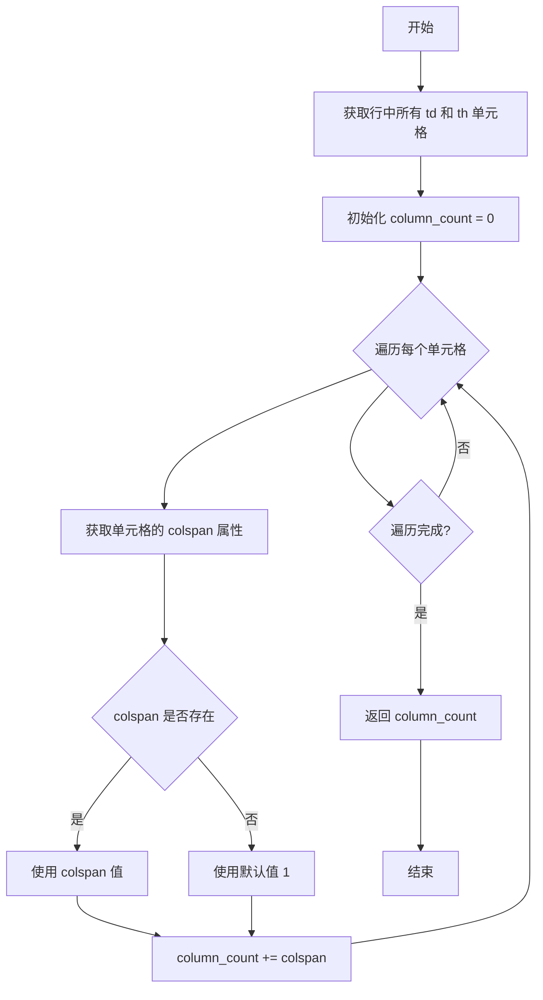

#### 带注释源码

```python
def calculate_row_columns(row):
    """
    计算表格行的实际列数，考虑colspan属性

    Args:
        row: BeautifulSoup的tr元素对象

    Returns:
        int: 行的实际列数
    """
    # 查找当前行中所有的 td 和 th 单元格元素
    cells = row.find_all(["td", "th"])
    
    # 初始化列计数器
    column_count = 0

    # 遍历每一个单元格，累加其 colspan 值
    for cell in cells:
        # 获取 colspan 属性，默认为 1
        # colspan 表示该单元格跨越的列数
        colspan = int(cell.get("colspan", 1))
        column_count += colspan

    # 返回该行的实际列数（考虑 colspan）
    return column_count
```


### `calculate_visual_columns`

该函数用于计算表格行的视觉列数，即实际`<td>`或`<th>`单元格的数量，不考虑`colspan`属性的合并效果。在表格合并逻辑中，用于获取表格行的视觉列数（实际单元格数），以辅助判断两个表格是否满足合并条件（如首末行视觉列数匹配）。

参数：

- `row`：`BeautifulSoup.tr`，BeautifulSoup的`<tr>`元素对象，表示表格的一行

返回值：`int`，返回该行的视觉列数（实际单元格数量）

#### 流程图

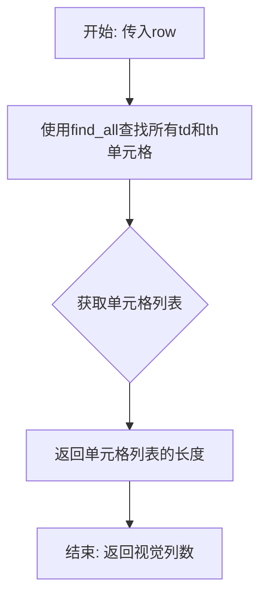

#### 带注释源码

```python
def calculate_visual_columns(row):
    """
    计算表格行的视觉列数（实际td/th单元格数量，不考虑colspan）

    Args:
        row: BeautifulSoup的tr元素对象

    Returns:
        int: 行的视觉列数（实际单元格数）
    """
    # 查找当前行中所有的td和th元素（表格单元格）
    cells = row.find_all(["td", "th"])
    
    # 返回单元格的总数，即视觉上的列数
    # 注意：这里不处理colspan属性，所以如果一个单元格colspan=2，
    # 这里仍然只计算为1列（视觉列数）
    return len(cells)
```

---

### 补充信息

#### 关键组件信息

| 名称 | 一句话描述 |
|------|-----------|
| `calculate_table_total_columns` | 计算表格的总列数，处理rowspan和colspan |
| `build_table_occupied_matrix` | 构建表格占用矩阵，返回每行有效列数 |
| `calculate_row_effective_columns` | 计算指定行的有效列数（考虑rowspan占用） |
| `calculate_row_columns` | 计算表格行的实际列数（考虑colspan属性） |
| `detect_table_headers` | 检测并比较两个表格的表头 |
| `check_rows_match` | 检查表格行是否匹配（有效列数/实际列数/视觉列数） |
| `can_merge_tables` | 判断两个表格是否可以合并 |
| `perform_table_merge` | 执行表格合并操作 |

#### 技术债务与优化空间

1. **函数功能重复**：`calculate_visual_columns`与`calculate_row_columns`功能相似但用途不同（分别处理视觉列数和实际列数），建议在文档中明确区分两者的使用场景。
2. **缺少输入校验**：函数未对`row`参数进行类型校验，若传入非tr元素可能导致意外行为。
3. **注释可以更详细**：可以补充说明"视觉列数"与"实际列数"的区别，帮助后续维护者理解。

#### 外部依赖

- **BeautifulSoup**：用于解析HTML表格结构，依赖`bs4`库。
- **mineru.utils.char_utils.full_to_half**：代码中其他函数依赖此工具函数进行全角转半角处理。


### `detect_table_headers`

该函数用于检测并比较两个HTML表格的表头，通过结构匹配和视觉一致性匹配两种方式确定表头行数、表头是否一致，并提取表头文本内容。

参数：

- `soup1`：`BeautifulSoup`，第一个表格的BeautifulSoup对象
- `soup2`：`BeautifulSoup`，第二个表格的BeautifulSoup对象
- `max_header_rows`：`int`，最大可能的表头行数，默认为5

返回值：`tuple`，返回三元组(表头行数, 表头是否一致, 表头文本列表)

#### 流程图

```mermaid
flowchart TD
    A[开始 detect_table_headers] --> B[获取两个表格的所有行]
    B --> C[构建两个表格的有效列数矩阵]
    C --> D[初始化: header_rows=0, headers_match=True, header_texts=[]]
    D --> E{min_rows = min(len(rows1), len(rows2), max_header_rows)}
    E --> F{遍历 i 从 0 到 min_rows-1}
    
    F --> G[提取当前行所有单元格 cells1, cells2]
    G --> H{检查单元格数量是否相等}
    H -->|否| I[structure_match = False]
    H -->|是| J{检查有效列数是否相等}
    J -->|否| I
    J -->|是| K[遍历每个单元格对比colspan/rowspan/文本]
    
    K --> L{所有属性和文本是否匹配}
    L -->|是| M[header_rows += 1, 添加表头文本到header_texts]
    L -->|否| N[headers_match = header_rows > 0]
    N --> O[跳出循环]
    
    M --> P{继续遍历?}
    P -->|是| F
    P -->|否| Q
    
    I --> Q
    
    O --> Q{header_rows == 0?}
    Q -->|是| R[调用 _detect_table_headers_visual 进行视觉匹配]
    Q -->|否| S[返回结果]
    
    R --> S
    
    subgraph _detect_table_headers_visual
        T[构建有效列数矩阵] --> U[遍历行比较文本内容]
        U --> V{文本内容相同且有效列数一致?}
        V -->|是| W[header_rows += 1]
        V -->|否| X[headers_match = header_rows > 0, 跳出]
        W --> Y{继续遍历?}
        Y -->|是| U
        Y -->|否| Z
        X --> Z
    end
    
    S[返回 header_rows, headers_match, header_texts]
```

#### 带注释源码

```python
def detect_table_headers(soup1, soup2, max_header_rows=5):
    """
    检测并比较两个表格的表头

    Args:
        soup1: 第一个表格的BeautifulSoup对象
        soup2: 第二个表格的BeautifulSoup对象
        max_header_rows: 最大可能的表头行数

    Returns:
        tuple: (表头行数, 表头是否一致, 表头文本列表)
    """
    # 获取两个表格的所有行元素
    rows1 = soup1.find_all("tr")
    rows2 = soup2.find_all("tr")

    # 构建两个表格的有效列数矩阵，处理rowspan和colspan的占用情况
    effective_cols1 = build_table_occupied_matrix(soup1)
    effective_cols2 = build_table_occupied_matrix(soup2)

    # 取表格行数与最大表头行数的最小值作为遍历上限
    min_rows = min(len(rows1), len(rows2), max_header_rows)
    header_rows = 0  # 匹配的表头行数
    headers_match = True  # 表头是否匹配
    header_texts = []  # 表头文本列表

    # 遍历前min_rows行进行结构匹配
    for i in range(min_rows):
        # 提取当前行的所有单元格（td或th）
        cells1 = rows1[i].find_all(["td", "th"])
        cells2 = rows2[i].find_all(["td", "th"])

        # 检查两行的结构和内容是否一致
        structure_match = True

        # 首先检查单元格数量是否一致
        if len(cells1) != len(cells2):
            structure_match = False
        else:
            # 检查有效列数是否一致（考虑rowspan影响）
            if effective_cols1.get(i, 0) != effective_cols2.get(i, 0):
                structure_match = False
            else:
                # 然后检查单元格的colspan、rowspan属性和文本内容
                for cell1, cell2 in zip(cells1, cells2):
                    # 获取单元格跨行跨列属性
                    colspan1 = int(cell1.get("colspan", 1))
                    rowspan1 = int(cell1.get("rowspan", 1))
                    colspan2 = int(cell2.get("colspan", 1))
                    rowspan2 = int(cell2.get("rowspan", 1))

                    # 去除所有空白字符（包括空格、换行、制表符等）并转换全角到半角
                    text1 = ''.join(full_to_half(cell1.get_text()).split())
                    text2 = ''.join(full_to_half(cell2.get_text()).split())

                    # 如果任一属性或文本不一致，则结构不匹配
                    if colspan1 != colspan2 or rowspan1 != rowspan2 or text1 != text2:
                        structure_match = False
                        break

        # 根据匹配结果更新表头信息
        if structure_match:
            header_rows += 1
            # 获取表头文本（保留格式，仅去首尾空白）
            row_texts = [full_to_half(cell.get_text().strip()) for cell in cells1]
            header_texts.append(row_texts)  # 添加表头文本
        else:
            # 只有当至少匹配了一行时，才认为表头匹配（避免首行不匹配导致完全否定）
            headers_match = header_rows > 0
            break

    # 如果严格匹配失败，尝试视觉一致性匹配（只比较文本内容，忽略colspan/rowspan差异）
    if header_rows == 0:
        header_rows, headers_match, header_texts = _detect_table_headers_visual(
            soup1, soup2, rows1, rows2, max_header_rows
        )

    return header_rows, headers_match, header_texts
```


### `_detect_table_headers_visual`

基于视觉一致性检测表头，当严格匹配失败时的备选方案。该函数仅比较文本内容，忽略colspan/rowspan结构差异，用于处理两个表格表头在视觉上相似但HTML结构不完全一致的情况。

参数：

- `soup1`：`BeautifulSoup`，第一个表格的BeautifulSoup对象
- `soup2`：`BeautifulSoup`，第二个表格的BeautifulSoup对象
- `rows1`：`list`，第一个表格的行列表（tr元素列表）
- `rows2`：`list`，第二个表格的行列表（tr元素列表）
- `max_header_rows`：`int`，最大可能的表头行数，默认为5

返回值：`tuple`，返回三元组(表头行数, 表头是否一致, 表头文本列表)

- 表头行数：`int`，检测到的连续匹配表头行数
- 表头是否一致：`bool`，表头是否一致（至少有一行匹配才为True）
- 表头文本列表：`list`，表头文本的二维列表，每行一个列表

#### 流程图

```mermaid
flowchart TD
    A[开始] --> B[构建两个表格的有效列数矩阵]
    B --> C[计算最小遍历行数: min_rows = minlenrows1, lenrows2, max_header_rows]
    C --> D[初始化: header_rows=0, headers_match=True, header_texts=[]]
    D --> E{遍历索引 i < min_rows?}
    E -->|是| F[获取当前行i的所有单元格]
    F --> G[提取单元格文本列表texts1和texts2]
    G --> H[比较有效列数和文本内容是否都匹配]
    H -->|是| I[header_rows += 1]
    I --> J[添加表头文本到header_texts]
    J --> E
    H -->|否| K[headers_match = header_rows > 0]
    K --> L[跳出循环]
    E -->|否| L
    L --> M{header_rows == 0?}
    M -->|是| N[headers_match = False]
    M -->|否| O[返回结果]
    N --> O
    O --> P[结束]
```

#### 带注释源码

```python
def _detect_table_headers_visual(soup1, soup2, rows1, rows2, max_header_rows=5):
    """
    基于视觉一致性检测表头（只比较文本内容，忽略colspan/rowspan差异）

    Args:
        soup1: 第一个表格的BeautifulSoup对象
        soup2: 第二个表格的BeautifulSoup对象
        rows1: 第一个表格的行列表
        rows2: 第二个表格的行列表
        max_header_rows: 最大可能的表头行数

    Returns:
        tuple: (表头行数, 表头是否一致, 表头文本列表)
    """
    # 构建两个表格的有效列数矩阵，用于处理rowspan占用
    effective_cols1 = build_table_occupied_matrix(soup1)
    effective_cols2 = build_table_occupied_matrix(soup2)

    # 计算需要遍历的最小行数
    min_rows = min(len(rows1), len(rows2), max_header_rows)
    header_rows = 0
    headers_match = True
    header_texts = []

    # 逐行比较，查找连续的表头行
    for i in range(min_rows):
        # 获取当前行的所有单元格
        cells1 = rows1[i].find_all(["td", "th"])
        cells2 = rows2[i].find_all(["td", "th"])

        # 提取每行的文本内容列表（去除空白字符并转换全角半角）
        texts1 = [''.join(full_to_half(cell.get_text()).split()) for cell in cells1]
        texts2 = [''.join(full_to_half(cell.get_text()).split()) for cell in cells2]

        # 检查视觉一致性：文本内容完全相同，且有效列数一致
        effective_cols_match = effective_cols1.get(i, 0) == effective_cols2.get(i, 0)
        if texts1 == texts2 and effective_cols_match:
            # 当前行匹配，累加表头行数
            header_rows += 1
            # 保留原始格式的表头文本（仅去除首尾空白）
            row_texts = [full_to_half(cell.get_text().strip()) for cell in cells1]
            header_texts.append(row_texts)
        else:
            # 当前行不匹配，记录匹配状态并停止遍历
            headers_match = header_rows > 0  # 只有至少有一行匹配才认为表头匹配
            break

    # 如果没有任何表头行匹配，标记为不匹配
    if header_rows == 0:
        headers_match = False

    return header_rows, headers_match, header_texts
```


### `can_merge_tables`

该函数用于判断两个跨页表格是否可以合并。它通过检查表格的caption（续表标识）、footnote数量、宽度差异、列数匹配以及首末行结构来判断两个表格是否属于同一表格的跨页拆分。

参数：

- `current_table_block`：`dict`，当前页的表格块对象，包含表格的blocks列表、bbox等信息
- `previous_table_block`：`dict`，前一页的表格块对象，包含表格的blocks列表、bbox等信息

返回值：`tuple`，返回一个五元组 `(tables_match or rows_match, soup1, soup2, current_html, previous_html)`，其中第一个元素为布尔值表示是否可以合并，后四个元素分别为前一个表格的BeautifulSoup对象、当前表格的BeautifulSoup对象、前一个表格的HTML字符串和当前表格的HTML字符串

#### 流程图

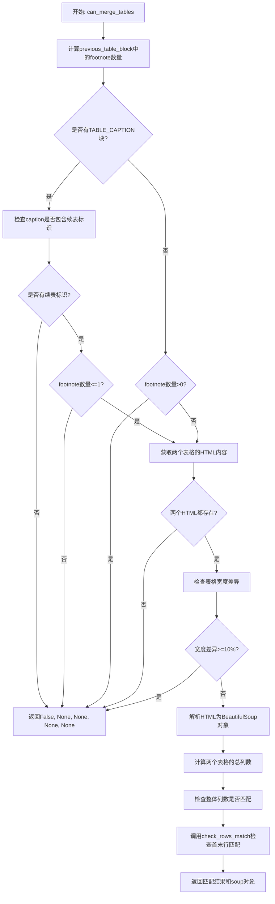

#### 带注释源码

```python
def can_merge_tables(current_table_block, previous_table_block):
    """判断两个表格是否可以合并"""
    # 检查表格是否有caption和footnote
    # 计算previous_table_block中的footnote数量
    footnote_count = sum(1 for block in previous_table_block["blocks"] if block["type"] == BlockType.TABLE_FOOTNOTE)
    
    # 如果有TABLE_CAPTION类型的块,检查是否至少有一个以"(续)"结尾
    caption_blocks = [block for block in current_table_block["blocks"] if block["type"] == BlockType.TABLE_CAPTION]
    if caption_blocks:
        # 检查是否至少有一个caption包含续表标识
        has_continuation_marker = False
        for block in caption_blocks:
            # 将文本转为半角并去除首尾空格后转小写
            caption_text = full_to_half(merge_para_with_text(block).strip()).lower()
            # 检查是否以续表结束标记结尾或包含续表内联标记
            if (
                    any(caption_text.endswith(marker.lower()) for marker in CONTINUATION_END_MARKERS)
                    or any(marker.lower() in caption_text for marker in CONTINUATION_INLINE_MARKERS)
            ):
                has_continuation_marker = True
                break

        # 如果所有caption都不包含续表标识，则不允许合并
        if not has_continuation_marker:
            return False, None, None, None, None

        # 如果current_table_block的caption存在续标识,放宽footnote的限制允许previous_table_block有最多一条footnote
        if footnote_count > 1:
            return False, None, None, None, None
    else:
        # 如果没有caption块，则不允许有任何footnote
        if footnote_count > 0:
            return False, None, None, None, None

    # 获取两个表格的HTML内容
    current_html = ""
    previous_html = ""

    # 从current_table_block的TABLE_BODY块中提取HTML
    for block in current_table_block["blocks"]:
        if (block["type"] == BlockType.TABLE_BODY and block["lines"] and block["lines"][0]["spans"]):
            current_html = block["lines"][0]["spans"][0].get("html", "")

    # 从previous_table_block的TABLE_BODY块中提取HTML
    for block in previous_table_block["blocks"]:
        if (block["type"] == BlockType.TABLE_BODY and block["lines"] and block["lines"][0]["spans"]):
            previous_html = block["lines"][0]["spans"][0].get("html", "")

    # 如果任一HTML为空，则不能合并
    if not current_html or not previous_html:
        return False, None, None, None, None

    # 检查表格宽度差异
    x0_t1, y0_t1, x1_t1, y1_t1 = current_table_block["bbox"]
    x0_t2, y0_t2, x1_t2, y1_t2 = previous_table_block["bbox"]
    table1_width = x1_t1 - x0_t1
    table2_width = x1_t2 - x0_t2

    # 如果宽度差异超过10%，则不能合并
    if abs(table1_width - table2_width) / min(table1_width, table2_width) >= 0.1:
        return False, None, None, None, None

    # 解析HTML并检查表格结构
    soup1 = BeautifulSoup(previous_html, "html.parser")
    soup2 = BeautifulSoup(current_html, "html.parser")

    # 检查整体列数匹配
    table_cols1 = calculate_table_total_columns(soup1)
    table_cols2 = calculate_table_total_columns(soup2)
    # logger.debug(f"Table columns - Previous: {table_cols1}, Current: {table_cols2}")
    tables_match = table_cols1 == table_cols2

    # 检查首末行列数匹配
    rows_match = check_rows_match(soup1, soup2)

    # 返回合并判断结果和中间数据
    return (tables_match or rows_match), soup1, soup2, current_html, previous_html
```


### `check_rows_match`

检查两个表格的首末行是否匹配，用于判断跨页表格是否可以合并

参数：

-  `soup1`：`BeautifulSoup`，第一个表格的 BeautifulSoup 对象（上一页的表格）
-  `soup2`：`BeautifulSoup`，第二个表格的 BeautifulSoup 对象（当前页的表格）

返回值：`bool`，返回 `True` 表示两个表格的行结构匹配（可以合并），返回 `False` 表示不匹配

#### 流程图

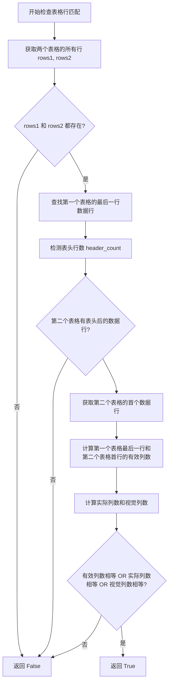

#### 带注释源码

```
def check_rows_match(soup1, soup2):
    """检查表格行是否匹配"""
    # 获取两个表格的所有行元素
    rows1 = soup1.find_all("tr")
    rows2 = soup2.find_all("tr")

    # 如果任一表格没有行，则无法匹配
    if not (rows1 and rows2):
        return False

    # 获取第一个表的最后一行数据行索引（跳过可能的空行）
    last_row_idx = None
    last_row = None
    for idx in range(len(rows1) - 1, -1, -1):
        if rows1[idx].find_all(["td", "th"]):
            last_row_idx = idx
            last_row = rows1[idx]
            break

    # 检测表头行数，以便获取第二个表的首个数据行
    header_count, _, _ = detect_table_headers(soup1, soup2)

    # 获取第二个表的首个数据行
    first_data_row_idx = None
    first_data_row = None
    if len(rows2) > header_count:
        first_data_row_idx = header_count
        first_data_row = rows2[header_count]  # 第一个非表头行

    # 如果找不到有效的最后一行或第一行数据行，则不匹配
    if not (last_row and first_data_row):
        return False

    # 计算有效列数（考虑rowspan和colspan的综合占用）
    last_row_effective_cols = calculate_row_effective_columns(soup1, last_row_idx)
    first_row_effective_cols = calculate_row_effective_columns(soup2, first_data_row_idx)

    # 计算实际列数（仅考虑colspan）和视觉列数（单元格数量）
    last_row_cols = calculate_row_columns(last_row)
    first_row_cols = calculate_row_columns(first_data_row)
    last_row_visual_cols = calculate_visual_columns(last_row)
    first_row_visual_cols = calculate_visual_columns(first_data_row)

    # 同时考虑三种列数匹配方式：有效列数、实际列数、视觉列数
    # 任一方式匹配成功即认为表格可以合并
    return (last_row_effective_cols == first_row_effective_cols or
            last_row_cols == first_row_cols or
            last_row_visual_cols == first_row_visual_cols)
```


### `check_row_columns_match`

该函数用于检查两个表格行（HTML表格中的 `<tr>` 元素）的单元格 colspan 属性是否一致，通过逐个对比单元格的 colspan 值来判断两行的结构是否匹配，常用于表格结构分析和表格合并场景中。

参数：

- `row1`：`bs4.element.Tag`，第一个 BeautifulSoup 的 tr 元素对象，表示待比较的第一行
- `row2`：`bs4.element.Tag`，第二个 BeautifulSoup 的 tr 元素对象，表示待比较的第二行

返回值：`bool`，如果两行的单元格数量相同且所有对应单元格的 colspan 属性值一致则返回 `True`，否则返回 `False`

#### 流程图

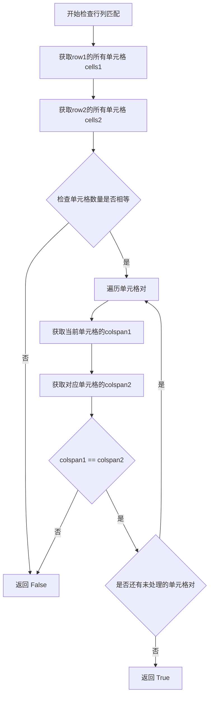

#### 带注释源码

```python
def check_row_columns_match(row1, row2):
    # 逐个cell检测colspan属性是否一致
    # 获取第一行的所有单元格（包含td和th）
    cells1 = row1.find_all(["td", "th"])
    # 获取第二行的所有单元格（包含td和th）
    cells2 = row2.find_all(["td", "th"])
    
    # 首先检查两行的单元格数量是否相同
    if len(cells1) != len(cells2):
        # 单元格数量不一致，直接返回False
        return False
    
    # 遍历两行的所有对应单元格，逐个比较colspan属性
    for cell1, cell2 in zip(cells1, cells2):
        # 获取第一个单元格的colspan值，默认为1
        colspan1 = int(cell1.get("colspan", 1))
        # 获取第二个单元格的colspan值，默认为1
        colspan2 = int(cell2.get("colspan", 1))
        # 比较colspan是否一致
        if colspan1 != colspan2:
            # colspan不一致，返回False
            return False
    
    # 所有单元格 colspan 都匹配，返回 True
    return True
```


### `adjust_table_rows_colspan`

该函数用于调整表格行的colspan属性，使跨页表格在合并后列数能够匹配目标列数。当两个表格列数不一致时，函数会比较待调整行与参考行的结构，若结构匹配则应用参考结构的colspan值，否则扩展最后一个单元格的colspan以填补列数差异。

参数：

- `soup`：`BeautifulSoup`，BeautifulSoup解析的表格对象，用于计算有效列数
- `rows`：`list`，表格行列表（tr元素列表）
- `start_idx`：`int`，起始行索引
- `end_idx`：`int`，结束行索引（不包含）
- `reference_structure`：`list`，参考行的colspan结构列表，如[1, 2, 1]表示第二个单元格跨2列
- `reference_visual_cols`：`int`，参考行的视觉列数（实际单元格数量）
- `target_cols`：`int`，目标总列数（合并后应有的列数）
- `current_cols`：`int`，当前总列数（调整前的列数）
- `reference_row`：`Tag`，参考行对象（BeautifulSoup的tr元素）

返回值：`None`，该函数直接修改传入的`soup`对象中的单元格colspan属性，无返回值

#### 流程图

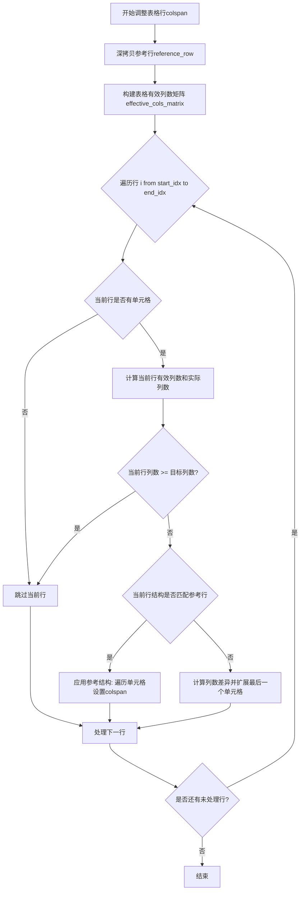

#### 带注释源码

```python
def adjust_table_rows_colspan(soup, rows, start_idx, end_idx,
                              reference_structure, reference_visual_cols,
                              target_cols, current_cols, reference_row):
    """调整表格行的colspan属性以匹配目标列数

    Args:
        soup: BeautifulSoup解析的表格对象（用于计算有效列数）
        rows: 表格行列表
        start_idx: 起始行索引
        end_idx: 结束行索引（不包含）
        reference_structure: 参考行的colspan结构列表
        reference_visual_cols: 参考行的视觉列数
        target_cols: 目标总列数
        current_cols: 当前总列数
        reference_row: 参考行对象
    """
    # 使用deepcopy避免修改原始参考行
    reference_row_copy = deepcopy(reference_row)

    # 构建有效列数矩阵，用于处理rowspan占用情况
    effective_cols_matrix = build_table_occupied_matrix(soup)

    # 遍历指定范围内的每一行
    for i in range(start_idx, end_idx):
        row = rows[i]
        # 获取当前行的所有单元格
        cells = row.find_all(["td", "th"])
        if not cells:
            continue

        # 使用有效列数（考虑rowspan）判断是否需要调整
        # 获取当前行在有效列数矩阵中的列数
        current_row_effective_cols = effective_cols_matrix.get(i, 0)
        # 计算当前行的实际列数（考虑colspan）
        current_row_cols = calculate_row_columns(row)

        # 如果有效列数或实际列数已经达到目标，则跳过该行
        if current_row_effective_cols >= target_cols or current_row_cols >= target_cols:
            continue

        # 检查当前行是否与参考行结构匹配
        # 条件1: 视觉列数相等
        # 条件2: 每个单元格的colspan属性一致
        if calculate_visual_columns(row) == reference_visual_cols and check_row_columns_match(row, reference_row_copy):
            # 尝试应用参考结构
            # 将参考行的colspan结构应用到当前行
            if len(cells) <= len(reference_structure):
                for j, cell in enumerate(cells):
                    # 如果参考结构中该位置colspan > 1，则应用到当前单元格
                    if j < len(reference_structure) and reference_structure[j] > 1:
                        cell["colspan"] = str(reference_structure[j])
        else:
            # 当前行结构与参考行不匹配
            # 扩展最后一个单元格以填补列数差异
            # 使用有效列数来计算差异（考虑rowspan影响）
            cols_diff = target_cols - current_row_effective_cols
            if cols_diff > 0:
                last_cell = cells[-1]
                # 获取当前最后一个单元格的colspan值
                current_last_span = int(last_cell.get("colspan", 1))
                # 扩展最后一个单元格的colspan
                last_cell["colspan"] = str(current_last_span + cols_diff)
```


### `perform_table_merge`

执行表格合并操作，将两个跨页表格（通过BeautifulSoup解析的HTML表格）合并成一个完整的表格，同时处理表头检测、列结构调整和脚注迁移。

参数：

-  `soup1`：`BeautifulSoup`，第一个（上一个）表格的BeautifulSoup解析对象，包含原始表格的DOM结构
-  `soup2`：`BeautifulSoup`，第二个（当前页）表格的BeautifulSoup解析对象，包含待合并的表格DOM结构
-  `previous_table_block`：`dict`，前一个表格块的字典引用，用于存储合并后的HTML和脚注信息
-  `wait_merge_table_footnotes`：`list[dict]`，待合并表格的脚注列表，这些脚注需要迁移到前一个表格块中

返回值：`str`，合并后表格的HTML字符串表示形式

#### 流程图

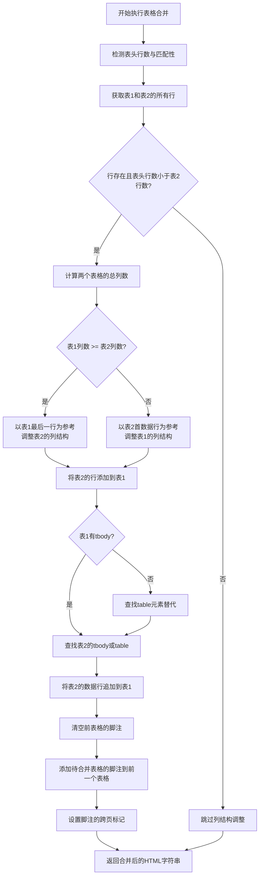

#### 带注释源码

```python
def perform_table_merge(soup1, soup2, previous_table_block, wait_merge_table_footnotes):
    """执行表格合并操作"""
    
    # Step 1: 检测表头有几行，并确认表头内容是否一致
    # 使用detect_table_headers函数比较两个表格的表头结构
    # 返回: (表头行数, 表头是否一致, 表头文本列表)
    header_count, headers_match, header_texts = detect_table_headers(soup1, soup2)
    # logger.debug(f"检测到表头行数: {header_count}, 表头匹配: {headers_match}")
    # logger.debug(f"表头内容: {header_texts}")

    # Step 2: 找到第一个表格的tbody元素，如果不存在则查找table元素
    # soup1是上一个表格的BeautifulSoup对象
    tbody1 = soup1.find("tbody") or soup1.find("table")

    # Step 3: 获取表1和表2的所有行(tr元素)
    rows1 = soup1.find_all("tr")
    rows2 = soup2.find_all("tr")

    # Step 4: 判断是否需要调整列结构
    # 条件: 两个表格都有行，且表头行数小于表2的总行数
    if rows1 and rows2 and header_count < len(rows2):
        # 获取表1最后一行和表2第一个非表头行
        last_row1 = rows1[-1]  # 表1的最后一行
        first_data_row2 = rows2[header_count]  # 表2的第一个数据行（跳过表头）

        # 计算两个表格的总列数（考虑rowspan和colspan）
        table_cols1 = calculate_table_total_columns(soup1)
        table_cols2 = calculate_table_total_columns(soup2)
        
        # 根据列数比较结果决定参考行
        if table_cols1 >= table_cols2:
            # 表1列数较多，以表1最后一行作为参考结构
            # 提取参考行的colspan属性列表
            reference_structure = [int(cell.get("colspan", 1)) for cell in last_row1.find_all(["td", "th"])]
            # 计算参考行的视觉列数（实际单元格数量）
            reference_visual_cols = calculate_visual_columns(last_row1)
            
            # 调用adjust_table_rows_colspan调整表2的行结构
            # 使其列数与表1匹配
            adjust_table_rows_colspan(
                soup2, rows2, header_count, len(rows2),  # 调整表2从表头后的所有行
                reference_structure, reference_visual_cols,
                table_cols1, table_cols2, first_data_row2
            )

        else:  # table_cols2 > table_cols1
            # 表2列数较多，以表2首数据行作为参考结构
            reference_structure = [int(cell.get("colspan", 1)) for cell in first_data_row2.find_all(["td", "th"])]
            reference_visual_cols = calculate_visual_columns(first_data_row2)
            
            # 调整表1的所有行以匹配表2的列数
            adjust_table_rows_colspan(
                soup1, rows1, 0, len(rows1),  # 调整表1的所有行
                reference_structure, reference_visual_cols,
                table_cols2, table_cols1, last_row1
            )

    # Step 5: 将第二个表格的行添加到第一个表格中
    if tbody1:
        # 查找表2的tbody或table元素
        tbody2 = soup2.find("tbody") or soup2.find("table")
        if tbody2:
            # 遍历表2的所有行（从表头后开始），逐个提取并添加到表1
            for row in rows2[header_count:]:
                row.extract()  # 从soup2中移除该行
                tbody1.append(row)  # 添加到表1的tbody中

    # Step 6: 处理脚注 - 清空前一个表格的所有脚注
    previous_table_block["blocks"] = [
        block for block in previous_table_block["blocks"]
        if block["type"] != BlockType.TABLE_FOOTNOTE
    ]
    
    # Step 7: 添加待合并表格的脚注到前一个表格块中
    for table_footnote in wait_merge_table_footnotes:
        temp_table_footnote = table_footnote.copy()  # 复制脚注块
        temp_table_footnote[SplitFlag.CROSS_PAGE] = True  # 设置跨页标记
        previous_table_block["blocks"].append(temp_table_footnote)

    # Step 8: 返回合并后的HTML字符串
    return str(soup1)
```


### `merge_table`

该函数用于合并跨页表格，遍历页面列表并检测相邻页面中的表格块，判断是否可以合并（如表头匹配、列数一致等），若可以则将后续页面的表格内容合并到前一个表格中，并处理脚注和标记删除状态。

参数：

-  `page_info_list`：`list`，页面信息列表，每个元素包含 `para_blocks` 等字段，用于存储页面中的段落块（包括表格块）

返回值：`None`，该函数直接修改 `page_info_list` 中的表格块数据，不返回任何值

#### 流程图

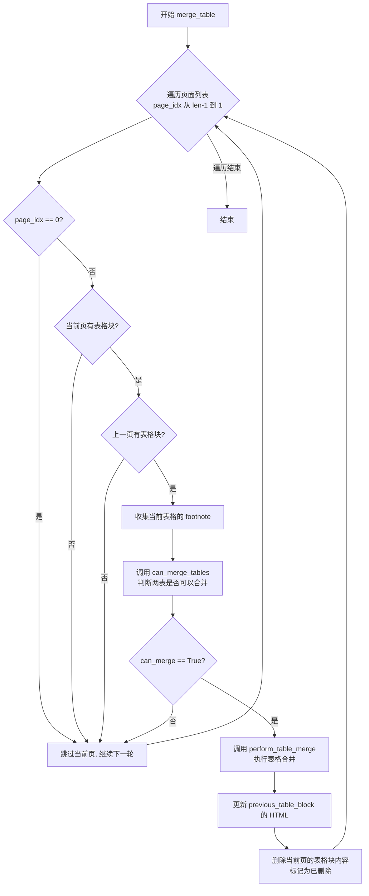

#### 带注释源码

```python
def merge_table(page_info_list):
    """合并跨页表格"""
    # 倒序遍历每一页，从最后一页开始向前处理
    for page_idx in range(len(page_info_list) - 1, -1, -1):
        # 跳过第一页，因为它没有前一页可以合并
        if page_idx == 0:
            continue

        # 获取当前页和上一页的页面信息
        page_info = page_info_list[page_idx]
        previous_page_info = page_info_list[page_idx - 1]

        # 检查当前页是否有表格块（必须是第一个段落块且类型为 TABLE）
        if not (page_info["para_blocks"] and page_info["para_blocks"][0]["type"] == BlockType.TABLE):
            continue

        current_table_block = page_info["para_blocks"][0]

        # 检查上一页是否有表格块（必须是最后一个段落块且类型为 TABLE）
        if not (previous_page_info["para_blocks"] and previous_page_info["para_blocks"][-1]["type"] == BlockType.TABLE):
            continue

        previous_table_block = previous_page_info["para_blocks"][-1]

        # 收集待合并表格的 footnote（脚注）
        wait_merge_table_footnotes = [
            block for block in current_table_block["blocks"]
            if block["type"] == BlockType.TABLE_FOOTNOTE
        ]

        # 检查两个表格是否可以合并
        # 返回: (是否可合并, soup1, soup2, current_html, previous_html)
        can_merge, soup1, soup2, current_html, previous_html = can_merge_tables(
            current_table_block, previous_table_block
        )

        # 如果不可合并，跳过当前页，继续检查更早的页面
        if not can_merge:
            continue

        # 执行表格合并操作
        # 合并逻辑包括：表头检测、colspan 调整、行合并、footnote 迁移
        merged_html = perform_table_merge(
            soup1, soup2, previous_table_block, wait_merge_table_footnotes
        )

        # 更新 previous_table_block 的 HTML 内容
        # 找到 TABLE_BODY 类型的块并更新其 HTML
        for block in previous_table_block["blocks"]:
            if (block["type"] == BlockType.TABLE_BODY and block["lines"] and block["lines"][0]["spans"]):
                block["lines"][0]["spans"][0]["html"] = merged_html
                break

        # 删除当前页的 table 块内容
        # 清空 lines 并标记为已删除
        for block in current_table_block["blocks"]:
            block['lines'] = []
            block[SplitFlag.LINES_DELETED] = True
```

## 关键组件


### 表格列数计算组件

负责计算表格的总列数和每行的有效列数，考虑rowspan和colspan属性。主要函数包括calculate_table_total_columns、build_table_occupied_matrix、calculate_row_effective_columns、calculate_row_columns和calculate_visual_columns。

### 表头检测组件

用于检测并比较两个表格的表头结构与内容一致性。包含detect_table_headers和_detect_table_headers_visual两个函数，前者进行严格匹配，后者进行视觉一致性匹配（只比较文本内容）。

### 表格合并决策组件

判断两个表格是否可以合并。核心函数为can_merge_tables和check_rows_match，检查caption/footnote标识、表格宽度差异、列数匹配和行结构匹配。

### 表格合并执行组件

执行实际的表格合并操作。包含adjust_table_rows_colspan用于调整colspan属性，perform_table_merge负责合并逻辑，merge_table是跨页表格合并的主入口函数。

### 续表标记识别组件

预定义续表标记列表，用于识别表格是否为跨页续表。包含CONTINUATION_END_MARKERS（结尾续表标识如"(续)"、"(续表)"等）和CONTINUATION_INLINE_MARKERS（内联续表标识如"(continued)"）。


## 问题及建议


### 已知问题

- **重复计算问题**：`build_table_occupied_matrix` 函数在 `detect_table_headers`、`_detect_table_headers_visual`、`calculate_row_effective_columns` 中被多次调用，导致相同矩阵被重复构建，效率低下。
- **函数功能冗余**：`calculate_table_total_columns` 和 `build_table_occupied_matrix` 包含大量重复逻辑；`calculate_row_columns` 和 `calculate_visual_columns` 功能存在重叠。
- **魔法数字硬编码**：`max_header_rows=5`、表格宽度差异阈值 `0.1`、footnote 数量限制 `1` 等关键参数散落在代码中，缺乏统一配置管理。
- **函数职责过载**：`can_merge_tables` 函数过长（超过 80 行），同时承担参数校验、表格解析、结构比较、合并条件判断等多重职责，降低了代码可读性和可维护性。
- **错误处理不完善**：`can_merge_tables` 返回多个 `None` 值缺乏明确的错误分类和详细的错误信息；未对空表格、异常 HTML 结构、解析失败等情况进行防御性处理。
- **变量命名不够清晰**：使用 `soup1`、`soup2`、`table_cols1`、`table_cols2` 等通用命名，可读性较差；部分变量名与实际含义不匹配（如 `wait_merge_table_footnotes` 实际包含的是当前页的 footnote）。
- **日志代码不规范**：存在被注释掉的调试日志（如 `logger.debug`），且日志粒度不统一，影响后续问题排查。
- **缺少单元测试**：作为关键的表格合并模块，未发现任何测试代码覆盖核心逻辑。

### 优化建议

- **引入缓存机制**：在 `merge_table` 函数开始时一次性计算并缓存 `build_table_occupied_matrix` 的结果，避免在循环和多次调用中重复计算。
- **提取配置常量**：将魔法数字提取为模块级常量或配置文件（如 `MAX_HEADER_ROWS`、`TABLE_WIDTH_THRESHOLD`、`MAX_FOOTNOTE_COUNT`），提高代码可维护性。
- **重构大函数**：将 `can_merge_tables` 拆分为多个职责单一的小函数，如 `check_caption_continuation`、`check_table_width_match`、`check_table_structure_match` 等。
- **增强错误处理**：为 `can_merge_tables` 的返回值定义明确的错误码或使用自定义异常类；增加对空表格、解析失败的防御性检查。
- **统一日志策略**：规范日志级别使用，移除无用的注释代码，增加关键节点的日志记录（如合并成功/失败的原因）。
- **优化数据结构**：考虑使用命名元组或 dataclass 定义表格块的数据结构，提高类型安全和代码可读性。
- **补充测试用例**：编写针对核心函数的单元测试，覆盖正常流程和边界情况（如空表格、colspan/rowspan 嵌套、表格结构不匹配等）。

## 其它


### 设计目标与约束

本模块旨在解决PDF文档中跨页表格的自动合并问题，确保表格在分页后能够正确地整合为一个完整的表格，同时保留表格的格式、样式和脚注信息。设计约束包括：仅处理结构相似的表格合并，表头需保持一致，列数需匹配，表格宽度差异需控制在10%以内，且不支持跨表格的复杂合并场景。

### 核心功能概述

该代码实现了一个跨页表格合并引擎，通过解析PDF提取的HTML表格结构，检测表格是否具备续表标识（如"(续)"、"(continued)"等），比较相邻页面的表格结构（列数、行数、表头），并在满足合并条件时将后续表格的内容合并到前一个表格中，同时处理脚注和表头的问题。

### 整体运行流程

整体流程从`merge_table`函数开始，该函数接收页面信息列表`page_info_list`，从最后一页开始向前遍历，依次检查当前页和上一页是否都包含表格块。对于每对可合并的表格，首先调用`can_merge_tables`进行合并可行性判断，包括检查续表标识、表格宽度差异、列数匹配和行结构匹配。如果判断可以合并，则调用`perform_table_merge`执行实际的合并操作，将后续表格的数据行追加到前一个表格的tbody中，处理脚注的转移，最后清空当前页的表格块内容。在合并可行性判断过程中，会调用多个辅助函数进行表格结构分析，包括表头检测(`detect_table_headers`)、列数计算(`calculate_table_total_columns`、`build_table_occupied_matrix`)、行匹配检查(`check_rows_match`)等。

### 全局变量与常量

### CONTINUATION_END_MARKERS

类型: List[str]

描述: 定义表格续表结束标记的列表，用于识别表格是否为续表，包含"(续)"、"(续表)"、"(续上表)"、"(continued)"、"(cont.)"、"(cont’d)"、"(…continued)"、"续表"等中英文标识。

### CONTINUATION_INLINE_MARKERS

类型: List[str]

描述: 定义表格续表内联标记的列表，用于检测表格标题中是否包含内联的续表标识，目前包含"(continued)"。

### 全局函数

### calculate_table_total_columns

参数:

- soup: BeautifulSoup解析的表格对象

返回类型: int

描述: 计算表格的总列数，通过构建占用矩阵处理rowspan和colspan属性，确定表格的理论最大列数。

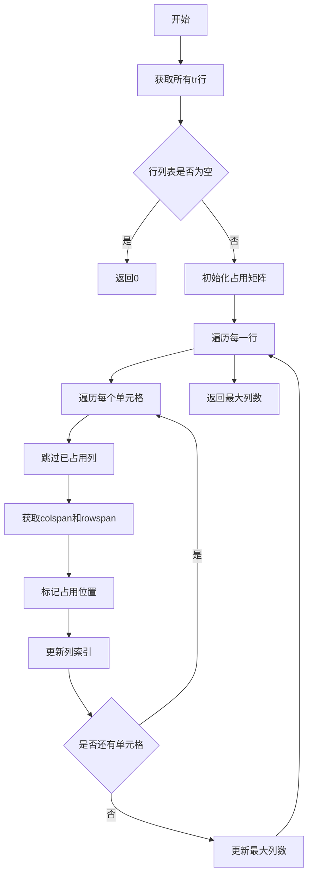

源码:
```python
def calculate_table_total_columns(soup):
    """计算表格的总列数，通过分析整个表格结构来处理rowspan和colspan

    Args:
        soup: BeautifulSoup解析的表格

    Returns:
        int: 表格的总列数
    """
    rows = soup.find_all("tr")
    if not rows:
        return 0

    # 创建一个矩阵来跟踪每个位置的占用情况
    max_cols = 0
    occupied = {}  # {row_idx: {col_idx: True}}

    for row_idx, row in enumerate(rows):
        col_idx = 0
        cells = row.find_all(["td", "th"])

        if row_idx not in occupied:
            occupied[row_idx] = {}

        for cell in cells:
            # 找到下一个未被占用的列位置
            while col_idx in occupied[row_idx]:
                col_idx += 1

            colspan = int(cell.get("colspan", 1))
            rowspan = int(cell.get("rowspan", 1))

            # 标记被这个单元格占用的所有位置
            for r in range(row_idx, row_idx + rowspan):
                if r not in occupied:
                    occupied[r] = {}
                for c in range(col_idx, col_idx + colspan):
                    occupied[r][c] = True

            col_idx += colspan
            max_cols = max(max_cols, col_idx)

    return max_cols
```

### build_table_occupied_matrix

参数:

- soup: BeautifulSoup解析的表格对象

返回类型: dict

描述: 构建表格的占用矩阵，返回每行的有效列数字典，用于处理rowspan导致的列占用问题。

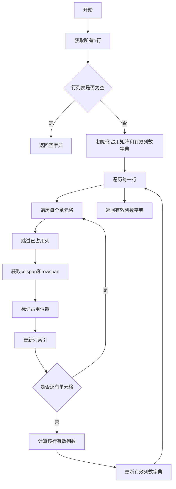

源码:
```python
def build_table_occupied_matrix(soup):
    """构建表格的占用矩阵，返回每行的有效列数

    Args:
        soup: BeautifulSoup解析的表格

    Returns:
        dict: {row_idx: effective_columns} 每行的有效列数（考虑rowspan占用）
    """
    rows = soup.find_all("tr")
    if not rows:
        return {}

    occupied = {}  # {row_idx: {col_idx: True}}
    row_effective_cols = {}  # {row_idx: effective_columns}

    for row_idx, row in enumerate(rows):
        col_idx = 0
        cells = row.find_all(["td", "th"])

        if row_idx not in occupied:
            occupied[row_idx] = {}

        for cell in cells:
            # 找到下一个未被占用的列位置
            while col_idx in occupied[row_idx]:
                col_idx += 1

            colspan = int(cell.get("colspan", 1))
            rowspan = int(cell.get("rowspan", 1))

            # 标记被这个单元格占用的所有位置
            for r in range(row_idx, row_idx + rowspan):
                if r not in occupied:
                    occupied[r] = {}
                for c in range(col_idx, col_idx + colspan):
                    occupied[r][c] = True

            col_idx += colspan

        # 该行的有效列数为已占用的最大列索引+1
        if occupied[row_idx]:
            row_effective_cols[row_idx] = max(occupied[row_idx].keys()) + 1
        else:
            row_effective_cols[row_idx] = 0

    return row_effective_cols
```

### calculate_row_effective_columns

参数:

- soup: BeautifulSoup解析的表格对象
- row_idx: 行索引

返回类型: int

描述: 计算指定行的有效列数，考虑rowspan属性对列的占用影响。

源码:
```python
def calculate_row_effective_columns(soup, row_idx):
    """计算指定行的有效列数（考虑rowspan占用）

    Args:
        soup: BeautifulSoup解析的表格
        row_idx: 行索引

    Returns:
        int: 该行的有效列数
    """
    row_effective_cols = build_table_occupied_matrix(soup)
    return row_effective_cols.get(row_idx, 0)
```

### calculate_row_columns

参数:

- row: BeautifulSoup的tr元素对象

返回类型: int

描述: 计算表格行的实际列数，累加所有单元格的colspan值。

源码:
```python
def calculate_row_columns(row):
    """
    计算表格行的实际列数，考虑colspan属性

    Args:
        row: BeautifulSoup的tr元素对象

    Returns:
        int: 行的实际列数
    """
    cells = row.find_all(["td", "th"])
    column_count = 0

    for cell in cells:
        colspan = int(cell.get("colspan", 1))
        column_count += colspan

    return column_count
```

### calculate_visual_columns

参数:

- row: BeautifulSoup的tr元素对象

返回类型: int

描述: 计算表格行的视觉列数，即实际的td/th单元格数量，不考虑colspan属性。

源码:
```python
def calculate_visual_columns(row):
    """
    计算表格行的视觉列数（实际td/th单元格数量，不考虑colspan）

    Args:
        row: BeautifulSoup的tr元素对象

    Returns:
        int: 行的视觉列数（实际单元格数）
    """
    cells = row.find_all(["td", "th"])
    return len(cells)
```

### detect_table_headers

参数:

- soup1: 第一个表格的BeautifulSoup对象
- soup2: 第二个表格的BeautifulSoup对象
- max_header_rows: 最大可能的表头行数，默认为5

返回类型: tuple

描述: 检测并比较两个表格的表头，返回表头行数、表头是否一致以及表头文本列表。优先使用严格的结构匹配，如果失败则回退到视觉一致性匹配。

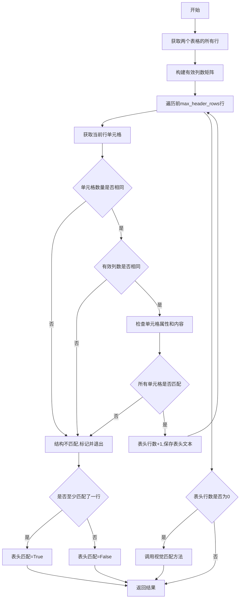

源码:
```python
def detect_table_headers(soup1, soup2, max_header_rows=5):
    """
    检测并比较两个表格的表头

    Args:
        soup1: 第一个表格的BeautifulSoup对象
        soup2: 第二个表格的BeautifulSoup对象
        max_header_rows: 最大可能的表头行数

    Returns:
        tuple: (表头行数, 表头是否一致, 表头文本列表)
    """
    rows1 = soup1.find_all("tr")
    rows2 = soup2.find_all("tr")

    # 构建两个表格的有效列数矩阵
    effective_cols1 = build_table_occupied_matrix(soup1)
    effective_cols2 = build_table_occupied_matrix(soup2)

    min_rows = min(len(rows1), len(rows2), max_header_rows)
    header_rows = 0
    headers_match = True
    header_texts = []

    for i in range(min_rows):
        # 提取当前行的所有单元格
        cells1 = rows1[i].find_all(["td", "th"])
        cells2 = rows2[i].find_all(["td", "th"])

        # 检查两行的结构和内容是否一致
        structure_match = True

        # 首先检查单元格数量
        if len(cells1) != len(cells2):
            structure_match = False
        else:
            # 检查有效列数是否一致（考虑rowspan影响）
            if effective_cols1.get(i, 0) != effective_cols2.get(i, 0):
                structure_match = False
            else:
                # 然后检查单元格的属性和内容
                for cell1, cell2 in zip(cells1, cells2):
                    colspan1 = int(cell1.get("colspan", 1))
                    rowspan1 = int(cell1.get("rowspan", 1))
                    colspan2 = int(cell2.get("colspan", 1))
                    rowspan2 = int(cell2.get("rowspan", 1))

                    # 去除所有空白字符（包括空格、换行、制表符等）
                    text1 = ''.join(full_to_half(cell1.get_text()).split())
                    text2 = ''.join(full_to_half(cell2.get_text()).split())

                    if colspan1 != colspan2 or rowspan1 != rowspan2 or text1 != text2:
                        structure_match = False
                        break

        if structure_match:
            header_rows += 1
            row_texts = [full_to_half(cell.get_text().strip()) for cell in cells1]
            header_texts.append(row_texts)  # 添加表头文本
        else:
            headers_match = header_rows > 0  # 只有当至少匹配了一行时，才认为表头匹配
            break

    # 如果严格匹配失败，尝试视觉一致性匹配（只比较文本内容）
    if header_rows == 0:
        header_rows, headers_match, header_texts = _detect_table_headers_visual(soup1, soup2, rows1, rows2, max_header_rows)

    return header_rows, headers_match, header_texts
```

### _detect_table_headers_visual

参数:

- soup1: 第一个表格的BeautifulSoup对象
- soup2: 第二个表格的BeautifulSoup对象
- rows1: 第一个表格的行列表
- rows2: 第二个表格的行列表
- max_header_rows: 最大可能的表头行数，默认为5

返回类型: tuple

描述: 基于视觉一致性检测表头，只比较文本内容，忽略colspan和rowspan的差异，作为严格匹配的备选方案。

源码:
```python
def _detect_table_headers_visual(soup1, soup2, rows1, rows2, max_header_rows=5):
    """
    基于视觉一致性检测表头（只比较文本内容，忽略colspan/rowspan差异）

    Args:
        soup1: 第一个表格的BeautifulSoup对象
        soup2: 第二个表格的BeautifulSoup对象
        rows1: 第一个表格的行列表
        rows2: 第二个表格的行列表
        max_header_rows: 最大可能的表头行数

    Returns:
        tuple: (表头行数, 表头是否一致, 表头文本列表)
    """
    # 构建两个表格的有效列数矩阵
    effective_cols1 = build_table_occupied_matrix(soup1)
    effective_cols2 = build_table_occupied_matrix(soup2)

    min_rows = min(len(rows1), len(rows2), max_header_rows)
    header_rows = 0
    headers_match = True
    header_texts = []

    for i in range(min_rows):
        cells1 = rows1[i].find_all(["td", "th"])
        cells2 = rows2[i].find_all(["td", "th"])

        # 提取每行的文本内容列表（去除空白字符）
        texts1 = [''.join(full_to_half(cell.get_text()).split()) for cell in cells1]
        texts2 = [''.join(full_to_half(cell.get_text()).split()) for cell in cells2]

        # 检查视觉一致性：文本内容完全相同，且有效列数一致
        effective_cols_match = effective_cols1.get(i, 0) == effective_cols2.get(i, 0)
        if texts1 == texts2 and effective_cols_match:
            header_rows += 1
            row_texts = [full_to_half(cell.get_text().strip()) for cell in cells1]
            header_texts.append(row_texts)
        else:
            headers_match = header_rows > 0
            break

    if header_rows == 0:
        headers_match = False

    return header_rows, headers_match, header_texts
```

### can_merge_tables

参数:

- current_table_block: 当前页表格块
- previous_table_block: 上一页表格块

返回类型: tuple

描述: 判断两个表格是否可以合并，检查因素包括caption中的续表标识、脚注数量、表格宽度差异、列数匹配和行结构匹配。返回布尔值和解析后的HTML对象供后续使用。

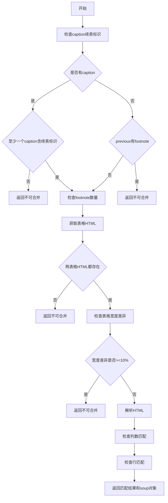

源码:
```python
def can_merge_tables(current_table_block, previous_table_block):
    """判断两个表格是否可以合并"""
    # 检查表格是否有caption和footnote
    # 计算previous_table_block中的footnote数量
    footnote_count = sum(1 for block in previous_table_block["blocks"] if block["type"] == BlockType.TABLE_FOOTNOTE)
    # 如果有TABLE_CAPTION类型的块,检查是否至少有一个以"(续)"结尾
    caption_blocks = [block for block in current_table_block["blocks"] if block["type"] == BlockType.TABLE_CAPTION]
    if caption_blocks:
        # 检查是否至少有一个caption包含续表标识
        has_continuation_marker = False
        for block in caption_blocks:
            caption_text = full_to_half(merge_para_with_text(block).strip()).lower()
            if (
                    any(caption_text.endswith(marker.lower()) for marker in CONTINUATION_END_MARKERS)
                    or any(marker.lower() in caption_text for marker in CONTINUATION_INLINE_MARKERS)
            ):
                has_continuation_marker = True
                break

        # 如果所有caption都不包含续表标识，则不允许合并
        if not has_continuation_marker:
            return False, None, None, None, None

        # 如果current_table_block的caption存在续标识,放宽footnote的限制允许previous_table_block有最多一条footnote
        if footnote_count > 1:
            return False, None, None, None, None
    else:
        if footnote_count > 0:
            return False, None, None, None, None

    # 获取两个表格的HTML内容
    current_html = ""
    previous_html = ""

    for block in current_table_block["blocks"]:
        if (block["type"] == BlockType.TABLE_BODY and block["lines"] and block["lines"][0]["spans"]):
            current_html = block["lines"][0]["spans"][0].get("html", "")

    for block in previous_table_block["blocks"]:
        if (block["type"] == BlockType.TABLE_BODY and block["lines"] and block["lines"][0]["spans"]):
            previous_html = block["lines"][0]["spans"][0].get("html", "")

    if not current_html or not previous_html:
        return False, None, None, None, None

    # 检查表格宽度差异
    x0_t1, y0_t1, x1_t1, y1_t1 = current_table_block["bbox"]
    x0_t2, y0_t2, x1_t2, y1_t2 = previous_table_block["bbox"]
    table1_width = x1_t1 - x0_t1
    table2_width = x1_t2 - x0_t2

    if abs(table1_width - table2_width) / min(table1_width, table2_width) >= 0.1:
        return False, None, None, None, None

    # 解析HTML并检查表格结构
    soup1 = BeautifulSoup(previous_html, "html.parser")
    soup2 = BeautifulSoup(current_html, "html.parser")

    # 检查整体列数匹配
    table_cols1 = calculate_table_total_columns(soup1)
    table_cols2 = calculate_table_total_columns(soup2)
    # logger.debug(f"Table columns - Previous: {table_cols1}, Current: {table_cols2}")
    tables_match = table_cols1 == table_cols2

    # 检查首末行列数匹配
    rows_match = check_rows_match(soup1, soup2)

    return (tables_match or rows_match), soup1, soup2, current_html, previous_html
```

### check_rows_match

参数:

- soup1: 第一个表格的BeautifulSoup对象
- soup2: 第二个表格的BeautifulSoup对象

返回类型: bool

描述: 检查两个表格的首末行是否匹配，用于判断表格结构是否兼容进行合并。通过比较前一个表格的最后一行和后一个表格的第一个数据行（跳过表头）的有效列数、实际列数和视觉列数来判断。

源码:
```python
def check_rows_match(soup1, soup2):
    """检查表格行是否匹配"""
    rows1 = soup1.find_all("tr")
    rows2 = soup2.find_all("tr")

    if not (rows1 and rows2):
        return False

    # 获取第一个表的最后一行数据行索引
    last_row_idx = None
    last_row = None
    for idx in range(len(rows1) - 1, -1, -1):
        if rows1[idx].find_all(["td", "th"]):
            last_row_idx = idx
            last_row = rows1[idx]
            break

    # 检测表头行数，以便获取第二个表的首个数据行
    header_count, _, _ = detect_table_headers(soup1, soup2)

    # 获取第二个表的首个数据行
    first_data_row_idx = None
    first_data_row = None
    if len(rows2) > header_count:
        first_data_row_idx = header_count
        first_data_row = rows2[header_count]  # 第一个非表头行

    if not (last_row and first_data_row):
        return False

    # 计算有效列数（考虑rowspan和colspan）
    last_row_effective_cols = calculate_row_effective_columns(soup1, last_row_idx)
    first_row_effective_cols = calculate_row_effective_columns(soup2, first_data_row_idx)

    # 计算实际列数（仅考虑colspan）和视觉列数
    last_row_cols = calculate_row_columns(last_row)
    first_row_cols = calculate_row_columns(first_data_row)
    last_row_visual_cols = calculate_visual_columns(last_row)
    first_row_visual_cols = calculate_visual_columns(first_data_row)

    # logger.debug(f"行列数 - 前表最后一行: {last_row_cols}(有效列数:{last_row_effective_cols}, 视觉列数:{last_row_visual_cols}), 当前表首行: {first_row_cols}(有效列数:{first_row_effective_cols}, 视觉列数:{first_row_visual_cols})")

    # 同时考虑有效列数匹配、实际列数匹配和视觉列数匹配
    return (last_row_effective_cols == first_row_effective_cols or
            last_row_cols == first_row_cols or
            last_row_visual_cols == first_row_visual_cols)
```

### check_row_columns_match

参数:

- row1: 第一行BeautifulSoup对象
- row2: 第二行BeautifulSoup对象

返回类型: bool

描述: 逐个单元格检查两行的colspan属性是否一致，用于判断行结构是否相同。

源码:
```python
def check_row_columns_match(row1, row2):
    # 逐个cell检测colspan属性是否一致
    cells1 = row1.find_all(["td", "th"])
    cells2 = row2.find_all(["td", "th"])
    if len(cells1) != len(cells2):
        return False
    for cell1, cell2 in zip(cells1, cells2):
        colspan1 = int(cell1.get("colspan", 1))
        colspan2 = int(cell2.get("colspan", 1))
        if colspan1 != colspan2:
            return False
    return True
```

### adjust_table_rows_colspan

参数:

- soup: BeautifulSoup解析的表格对象
- rows: 表格行列表
- start_idx: 起始行索引
- end_idx: 结束行索引（不包含）
- reference_structure: 参考行的colspan结构列表
- reference_visual_cols: 参考行的视觉列数
- target_cols: 目标总列数
- current_cols: 当前总列数
- reference_row: 参考行对象

返回类型: None

描述: 调整表格行的colspan属性以匹配目标列数。当两个表格列数不一致时，使用参考行的结构来调整另一表格的单元格colspan，确保合并后的表格结构正确。

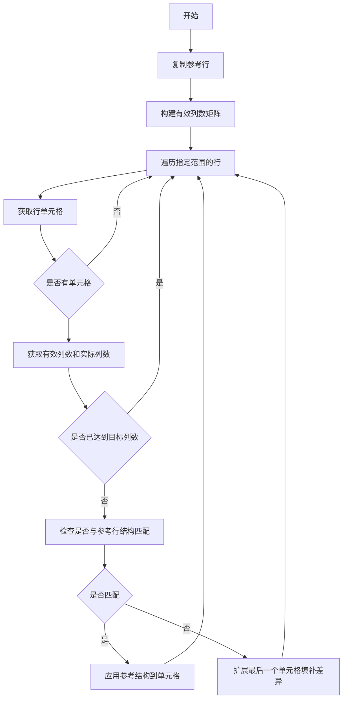

源码:
```python
def adjust_table_rows_colspan(soup, rows, start_idx, end_idx,
                              reference_structure, reference_visual_cols,
                              target_cols, current_cols, reference_row):
    """调整表格行的colspan属性以匹配目标列数

    Args:
        soup: BeautifulSoup解析的表格对象（用于计算有效列数）
        rows: 表格行列表
        start_idx: 起始行索引
        end_idx: 结束行索引（不包含）
        reference_structure: 参考行的colspan结构列表
        reference_visual_cols: 参考行的视觉列数
        target_cols: 目标总列数
        current_cols: 当前总列数
        reference_row: 参考行对象
    """
    reference_row_copy = deepcopy(reference_row)

    # 构建有效列数矩阵
    effective_cols_matrix = build_table_occupied_matrix(soup)

    for i in range(start_idx, end_idx):
        row = rows[i]
        cells = row.find_all(["td", "th"])
        if not cells:
            continue

        # 使用有效列数（考虑rowspan）判断是否需要调整
        current_row_effective_cols = effective_cols_matrix.get(i, 0)
        current_row_cols = calculate_row_columns(row)

        # 如果有效列数或实际列数已经达到目标，则跳过
        if current_row_effective_cols >= target_cols or current_row_cols >= target_cols:
            continue

        # 检查是否与参考行结构匹配
        if calculate_visual_columns(row) == reference_visual_cols and check_row_columns_match(row, reference_row_copy):
            # 尝试应用参考结构
            if len(cells) <= len(reference_structure):
                for j, cell in enumerate(cells):
                    if j < len(reference_structure) and reference_structure[j] > 1:
                        cell["colspan"] = str(reference_structure[j])
        else:
            # 扩展最后一个单元格以填补列数差异
            # 使用有效列数来计算差异
            cols_diff = target_cols - current_row_effective_cols
            if cols_diff > 0:
                last_cell = cells[-1]
                current_last_span = int(last_cell.get("colspan", 1))
                last_cell["colspan"] = str(current_last_span + cols_diff)
```

### perform_table_merge

参数:

- soup1: 第一个表格的BeautifulSoup对象
- soup2: 第二个表格的BeautifulSoup对象
- previous_table_block: 前一个表格块
- wait_merge_table_footnotes: 待合并的表格脚注列表

返回类型: str

描述: 执行实际的表格合并操作，包括表头检测、列数调整、行合并和脚注处理。返回合并后的HTML字符串。

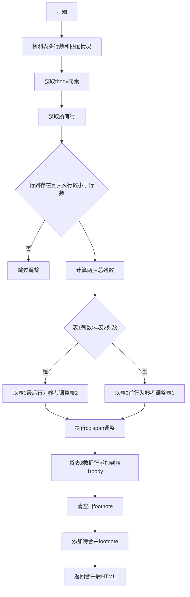

源码:
```python
def perform_table_merge(soup1, soup2, previous_table_block, wait_merge_table_footnotes):
    """执行表格合并操作"""
    # 检测表头有几行，并确认表头内容是否一致
    header_count, headers_match, header_texts = detect_table_headers(soup1, soup2)
    # logger.debug(f"检测到表头行数: {header_count}, 表头匹配: {headers_match}")
    # logger.debug(f"表头内容: {header_texts}")

    # 找到第一个表格的tbody，如果没有则查找table元素
    tbody1 = soup1.find("tbody") or soup1.find("table")

    # 获取表1和表2的所有行
    rows1 = soup1.find_all("tr")
    rows2 = soup2.find_all("tr")


    if rows1 and rows2 and header_count < len(rows2):
        # 获取表1最后一行和表2第一个非表头行
        last_row1 = rows1[-1]
        first_data_row2 = rows2[header_count]

        # 计算表格总列数
        table_cols1 = calculate_table_total_columns(soup1)
        table_cols2 = calculate_table_total_columns(soup2)
        if table_cols1 >= table_cols2:
            reference_structure = [int(cell.get("colspan", 1)) for cell in last_row1.find_all(["td", "th"])]
            reference_visual_cols = calculate_visual_columns(last_row1)
            # 以表1的最后一行为参考，调整表2的行
            adjust_table_rows_colspan(
                soup2, rows2, header_count, len(rows2),
                reference_structure, reference_visual_cols,
                table_cols1, table_cols2, first_data_row2
            )

        else:  # table_cols2 > table_cols1
            reference_structure = [int(cell.get("colspan", 1)) for cell in first_data_row2.find_all(["td", "th"])]
            reference_visual_cols = calculate_visual_columns(first_data_row2)
            # 以表2的第一个数据行为参考，调整表1的行
            adjust_table_rows_colspan(
                soup1, rows1, 0, len(rows1),
                reference_structure, reference_visual_cols,
                table_cols2, table_cols1, last_row1
            )

    # 将第二个表格的行添加到第一个表格中
    if tbody1:
        tbody2 = soup2.find("tbody") or soup2.find("table")
        if tbody2:
            # 将第二个表格的行添加到第一个表格中（跳过表头行）
            for row in rows2[header_count:]:
                row.extract()
                tbody1.append(row)

    # 清空previous_table_block的footnote
    previous_table_block["blocks"] = [
        block for block in previous_table_block["blocks"]
        if block["type"] != BlockType.TABLE_FOOTNOTE
    ]
    # 添加待合并表格的footnote到前一个表格中
    for table_footnote in wait_merge_table_footnotes:
        temp_table_footnote = table_footnote.copy()
        temp_table_footnote[SplitFlag.CROSS_PAGE] = True
        previous_table_block["blocks"].append(temp_table_footnote)

    return str(soup1)
```

### merge_table

参数:

- page_info_list: 页面信息列表

返回类型: None

描述: 主入口函数，负责协调跨页表格合并的整个流程。从后向前遍历页面，识别连续的表格对，验证合并条件，并执行合并操作。

```mermaid
flowchart TD
    A[开始] --> B[从后向前遍历页面]
    B --> C{是否还有页面}
    C -->|否| D[结束]
    C --> E{当前页是否为第一页}
    E -->|是| F[跳过检查前一页]
    E -->|否| G[检查当前页是否有表格]
    G --> H{当前页有表格}
    H -->|否| F
    H -->|是| I[检查上一页是否有表格]
    I --> J{上一页有表格}
    J -->|否| F
    J -->|是| K[收集待合并footnote]
    K --> L[检查表格是否可合并]
    L --> M{可以合并}
    M -->|否| F
    M -->|是| N[执行表格合并]
    N --> O[更新前一页的HTML]
    O --> P[清空当前页表格]
    P --> F
    F --> C
```

源码:
```python
def merge_table(page_info_list):
    """合并跨页表格"""
    # 倒序遍历每一页
    for page_idx in range(len(page_info_list) - 1, -1, -1):
        # 跳过第一页，因为它没有前一页
        if page_idx == 0:
            continue

        page_info = page_info_list[page_idx]
        previous_page_info = page_info_list[page_idx - 1]

        # 检查当前页是否有表格块
        if not (page_info["para_blocks"] and page_info["para_blocks"][0]["type"] == BlockType.TABLE):
            continue

        current_table_block = page_info["para_blocks"][0]

        # 检查上一页是否有表格块
        if not (previous_page_info["para_blocks"] and previous_page_info["para_blocks"][-1]["type"] == BlockType.TABLE):
            continue

        previous_table_block = previous_page_info["para_blocks"][-1]

        # 收集待合并表格的footnote
        wait_merge_table_footnotes = [
            block for block in current_table_block["blocks"]
            if block["type"] == BlockType.TABLE_FOOTNOTE
        ]

        # 检查两个表格是否可以合并
        can_merge, soup1, soup2, current_html, previous_html = can_merge_tables(
            current_table_block, previous_table_block
        )

        if not can_merge:
            continue

        # 执行表格合并
        merged_html = perform_table_merge(
            soup1, soup2, previous_table_block, wait_merge_table_footnotes
        )

        # 更新previous_table_block的html
        for block in previous_table_block["blocks"]:
            if (block["type"] == BlockType.TABLE_BODY and block["lines"] and block["lines"][0]["spans"]):
                block["lines"][0]["spans"][0]["html"] = merged_html
                break

        # 删除当前页的table
        for block in current_table_block["blocks"]:
            block['lines'] = []
            block[SplitFlag.LINES_DELETED] = True
```

### 关键组件信息

### 表格结构分析组件

负责解析HTML表格结构，计算各种列数指标（总列数、有效列数、实际列数、视觉列数），构建占用矩阵处理rowspan和colspan的复杂情况。

### 表头检测组件

通过`detect_table_headers`函数实现，支持两种检测模式：严格模式（比较结构属性和文本内容）和视觉模式（仅比较文本内容），确保能够正确识别各种格式的表头。

### 表格合并决策组件

`can_merge_tables`函数实现合并条件判断，通过多重检查（续表标识、脚注、宽度、列数、行匹配）确保只有结构相似的表格才会被合并。

### 表格合并执行组件

`perform_table_merge`函数负责实际的合并操作，包括列结构调整（通过`adjust_table_rows_colspan`）、行数据迁移和脚注处理。

### 错误处理与异常设计

该模块的错误处理主要通过提前返回False或None来实现，当检测到任何不符合合并条件的情况时立即终止处理流程。模块没有引入额外的异常类，所有错误都通过函数返回值进行标识。对于空表格（无行）、HTML解析失败、缺失必要字段等情况均通过返回(False, None, None, None, None)或检查字典get操作默认值来处理。未捕获的异常会向上层传播，调用方需要处理可能的异常情况。

### 数据流与状态机

数据流从`merge_table`函数开始，接收页面信息列表，每个页面包含`para_blocks`列表，每个表格块包含多个`blocks`（TABLE_CAPTION、TABLE_BODY、TABLE_FOOTNOTE等类型）。状态机流程为：初始状态检查当前页和上一页是否有表格→如果都有则进入合并决策状态→调用`can_merge_tables`判断是否可合并→如果可合并则进入执行状态→调用`perform_table_merge`执行合并→更新前一页数据并清空当前页。合并决策状态中包含多个检查节点：caption续表标识检查→脚注数量检查→HTML存在性检查→宽度差异检查→列数匹配检查→行匹配检查。任何检查节点失败都会返回不可合并状态。

### 外部依赖与接口契约

主要依赖包括：`BeautifulSoup`用于HTML解析和DOM操作，`loguru.logger`用于调试日志输出，`mineru.backend.vlm.vlm_middle_json_mkcontent.merge_para_with_text`用于合并段落文本，`mineru.utils.char_utils.full_to_half`用于全角转半角，`mineru.utils.enum_class.BlockType`和`SplitFlag`用于枚举类型定义。输入接口为`page_info_list`，每个元素是包含`para_blocks`键的字典，表格块结构为包含`type`、`bbox`、`blocks`等键的字典。输出接口直接修改传入的`page_info_list`对象，更新previous_table_block的HTML内容并标记当前表格块为已删除。无返回值。

### 潜在技术债务与优化空间

第一，该模块完全依赖HTML中的caption文本识别续表，对于没有caption或caption格式不规范的表格无法处理，建议增加基于表格结构和内容相似度的自动识别机制。第二，当前只处理了连续两页的表格合并，对于跨多页的表格链式合并场景未考虑，当中间页出现非表格内容时会中断合并。第三，所有函数都是无状态的纯函数，适合并行化处理，但当前实现是串行的，可以考虑按页面分组并行执行。第四，表格结构解析使用`html.parser`，对于复杂嵌套表格可能解析不完整，建议在性能和兼容性权衡下考虑使用`lxml`等更强大的解析器。第五，`build_table_occupied_matrix`在多个函数中被重复调用，相同的表格结构会多次计算，可以增加缓存机制或重构为一次性计算所有指标。第六，当前宽度差异阈值硬编码为0.1（10%），建议抽取为可配置参数以适应不同文档类型的处理需求。


    