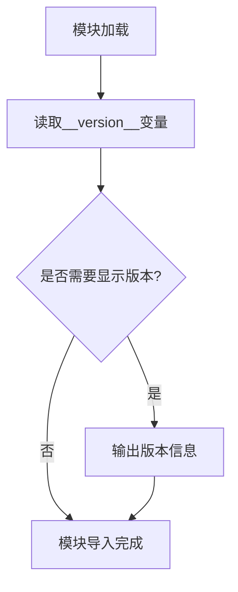

# `MinerU\mineru\version.py` 详细设计文档

该代码文件仅包含版本号定义，用于标识软件或库的当前版本为2.7.6，通常作为项目元数据供版本管理和发布流程使用。

## 整体流程



## 类结构

```
无类层次结构（该文件不包含任何类定义）
```

## 全局变量及字段


### `__version__`
    
模块版本号，标识当前软件的版本，格式为主版本号.次版本号.补丁版本号

类型：`str`
    


    

## 全局函数及方法


## 关键组件


### 版本标识模块

这是一个极其简化的Python模块，仅包含版本号标识，用于记录软件的版本信息。

### 全局变量

#### __version__

- **类型**: str
- **描述**: 软件版本号，标识当前代码的版本为2.7.6

### 关键组件信息

#### 版本号（__version__）

- **名称**: __version__
- **描述**: 字符串类型的版本标识符，遵循Python社区约定俗成的版本声明方式，用于模块的版本追踪和依赖管理

### 潜在的技术债务或优化空间

1. **功能单一**: 该模块仅包含版本信息，缺乏实际功能实现，在实际项目中可能需要补充更多的元数据信息
2. **文档缺失**: 没有对应的docstring或注释说明版本变更历史
3. **无测试覆盖**: 简单的版本号定义通常不需要测试，但建议在发布流程中验证版本一致性

### 其它项目

#### 设计目标与约束

- **目标**: 提供一个标准化的版本访问接口，符合Python packaging规范
- **约束**: 版本号格式需遵循语义化版本控制(SemVer)建议

#### 错误处理与异常设计

- 本模块不涉及运行时错误处理，属于静态元数据定义

#### 数据流与状态机

- 无动态数据流，仅作为只读版本标识符使用

#### 外部依赖与接口契约

- 无外部依赖，仅作为模块级全局变量供其他模块通过 `import` 访问


## 问题及建议


### 已知问题

-   代码仅包含版本号定义，缺乏实际功能代码，无法进行深度的架构分析
-   缺少版本管理策略说明（如语义化版本、版本变更记录）
-   未提供版本与功能特性的对应关系文档

### 优化建议

-   建议在版本号附近添加版本发布说明或变更日志注释
-   可考虑使用 `__version__` 的同时，添加 `__author__`、`__license__` 等元信息
-   若此为项目根模块，建议建立独立的 `__init__.py` 或 `version.py` 来集中管理版本信息
-   建议为版本号添加类型注解以提高代码可维护性，如 `__version__: str = "2.7.6"`


## 其它


### 设计目标与约束

该代码文件是一个版本标识模块，其主要目标是为软件包提供版本号标识，不涉及任何业务逻辑或复杂功能。设计约束包括遵循Python模块规范和版本号格式要求。

### 外部依赖与接口契约

该文件不引入外部依赖，也不定义接口契约。版本号`__version__`作为全局变量供其他模块导入使用，约定俗成的接口为字符串类型。

### 兼容性考虑

需要确保版本号格式与Python版本兼容，并考虑与包管理工具（如pip）的兼容性。

### 版本管理策略

版本号遵循语义化版本控制规范（SemVer），当前版本为"2.7.6"。版本变更应记录在CHANGELOG中。

### 安全性考虑

版本号本身不涉及敏感信息，但应确保版本信息的完整性和可追溯性，防止未授权修改。

    