# `MinerU\projects\mcp\src\mineru\api.py` 详细设计文档

MinerU API 客户端库，用于将本地文件或远程 URL 转换为 Markdown 格式，支持批量处理、OCR 识别、页码范围选择等功能，并提供完整的任务状态轮询和结果下载流程。

## 整体流程

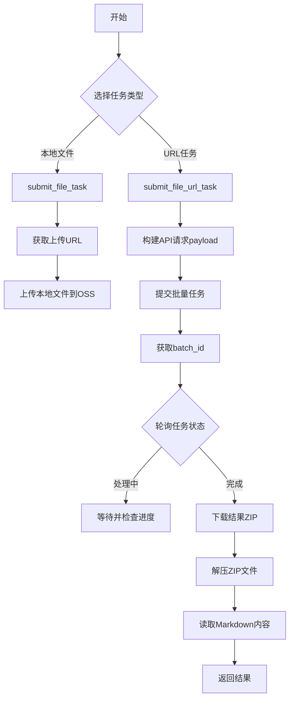

## 类结构

```
MinerUClient (主客户端类)
├── singleton_func (单例装饰器)
└── config (全局配置模块)
```

## 全局变量及字段


### `asyncio`
    
Python异步编程库，提供协程和事件循环支持

类型：`module`
    


### `os`
    
操作系统接口模块，提供文件和目录操作功能

类型：`module`
    


### `zipfile`
    
ZIP文件处理模块，用于压缩和解压文件

类型：`module`
    


### `Path`
    
路径处理类，来自pathlib模块，用于跨平台路径操作

类型：`class`
    


### `aiohttp`
    
异步HTTP客户端库，用于发起异步网络请求

类型：`module`
    


### `requests`
    
同步HTTP客户端库，用于发起同步网络请求

类型：`module`
    


### `config`
    
全局配置模块，包含API密钥、日志等配置信息

类型：`module`
    


### `singleton_func`
    
单例模式装饰器函数，确保类只有一个实例

类型：`function`
    


### `MinerUClient.api_base`
    
MinerU API服务的基础URL地址

类型：`Optional[str]`
    


### `MinerUClient.api_key`
    
用于向MinerU API进行身份验证的密钥

类型：`str`
    
    

## 全局函数及方法


### `singleton_func`

单例模式装饰器，用于确保被装饰的类在整个应用程序生命周期中只存在一个实例。

参数：

-  `cls`：`class`，需要被装饰成单例模式的类

返回值：`function`，返回 `_singleton` 内部函数，该函数负责创建或返回指定类的单例实例

#### 流程图

```mermaid
flowchart TD
    A[开始: 装饰器接收 cls 类] --> B{cls 是否在 instance 字典中?}
    B -->|否| C[创建新实例: instance[cls] = cls(\*args, \*\*kwargs)]
    C --> D[返回实例: return instance[cls]]
    B -->|是| D
    D --> E[结束: 返回单例实例]
    
    style A fill:#f9f,stroke:#333
    style E fill:#9f9,stroke:#333
```

#### 带注释源码

```python
def singleton_func(cls):
    """
    单例模式装饰器。
    
    该装饰器确保被装饰的类在整个应用程序中只存在一个实例。
    通过维护一个全局字典 instance 来存储已创建的实例，
    每次调用时检查实例是否已存在，若存在则返回现有实例，否则创建新实例。
    
    Args:
        cls: 需要作为单例的类
        
    Returns:
        _singleton: 返回一个函数，该函数控制类的实例化过程
    """
    # 全局实例存储字典，键为类名，值为类的实例
    instance = {}

    def _singleton(*args, **kwargs):
        """
        内部函数，负责创建或返回单例实例。
        
        Args:
            *args: 传递给类的位置参数
            **kwargs: 传递给类的关键字参数
            
        Returns:
            cls: 类的单例实例
        """
        # 检查该类是否已有实例
        if cls not in instance:
            # 如果没有实例，则创建新实例并存储
            instance[cls] = cls(*args, **kwargs)
        
        # 返回已存在的实例或新创建的实例
        return instance[cls]

    # 返回内部单例函数
    return _singleton
```


### `MinerUClient.__init__`

初始化 MinerU API 客户端，设置 API 基础 URL 和 API 密钥，如果未提供则从环境变量或配置中读取，并在 API 密钥缺失时抛出明确的错误提示。

参数：

-  `api_base`：`Optional[str]`，MinerU API 的基础 URL，默认从环境变量 MINERU_API_BASE 获取
-  `api_key`：`Optional[str]`，用于向 MinerU 进行身份验证的 API 密钥，默认从环境变量 MINERU_API_KEY 获取

返回值：无返回值（构造函数）

#### 流程图

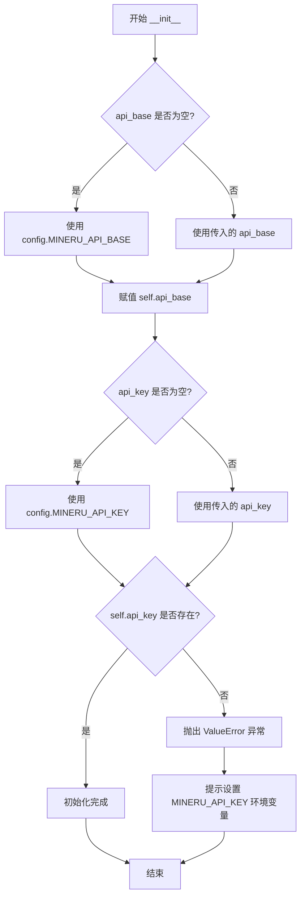

#### 带注释源码

```python
def __init__(self, api_base: Optional[str] = None, api_key: Optional[str] = None):
    """
    初始化 MinerU API 客户端。

    Args:
        api_base: MinerU API 的基础 URL (默认: 从环境变量获取)
        api_key: 用于向 MinerU 进行身份验证的 API 密钥 (默认: 从环境变量获取)
    """
    # 如果未传入 api_base，则从配置模块读取默认的 API 基础地址
    self.api_base = api_base or config.MINERU_API_BASE
    # 如果未传入 api_key，则从配置模块读取默认的 API 密钥
    self.api_key = api_key or config.MINERU_API_KEY

    # 检查 API 密钥是否存在，如果不存在则抛出详细的错误提示
    if not self.api_key:
        # 提供更友好的错误消息
        raise ValueError(
            "错误: MinerU API 密钥 (MINERU_API_KEY) 未设置或为空。\n"
            "请确保已设置 MINERU_API_KEY 环境变量，例如:\n"
            "  export MINERU_API_KEY='your_actual_api_key'\n"
            "或者，在项目根目录的 `.env` 文件中定义该变量。"
        )
```


### MinerUClient._request

向 MinerU API 发出异步 HTTP 请求的核心方法，负责构建完整的请求 URL、设置认证头、日志记录以及处理响应，支持各种 HTTP 方法并返回 JSON 格式的 API 响应。

参数：

- `method`：`str`，HTTP 方法 (GET, POST 等)
- `endpoint`：`str`，API 端点路径 (不含基础 URL)
- `**kwargs`：传递给 aiohttp 请求的其他参数

返回值：`Dict[str, Any]`，API 响应 (JSON 格式)

#### 流程图

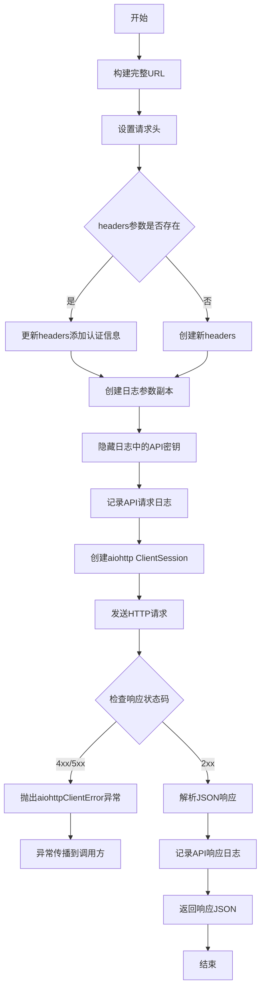

#### 带注释源码

```python
async def _request(self, method: str, endpoint: str, **kwargs) -> Dict[str, Any]:
    """
    向 MinerU API 发出请求。

    Args:
        method: HTTP 方法 (GET, POST 等)
        endpoint: API 端点路径 (不含基础 URL)
        **kwargs: 传递给 aiohttp 请求的其他参数

    Returns:
        dict: API 响应 (JSON 格式)
    """
    # 步骤1: 拼接完整URL，组合基础URL和端点路径
    url = f"{self.api_base}{endpoint}"
    
    # 步骤2: 构建请求头，包含认证令牌和接受JSON格式
    headers = {
        "Authorization": f"Bearer {self.api_key}",
        "Accept": "application/json",
    }

    # 步骤3: 合并用户传入的headers与认证头
    if "headers" in kwargs:
        kwargs["headers"].update(headers)
    else:
        kwargs["headers"] = headers

    # 步骤4: 创建不包含授权信息的参数副本，用于日志记录（避免敏感信息泄露）
    log_kwargs = kwargs.copy()
    if "headers" in log_kwargs and "Authorization" in log_kwargs["headers"]:
        log_kwargs["headers"] = log_kwargs["headers"].copy()
        log_kwargs["headers"]["Authorization"] = "Bearer ****"  # 隐藏API密钥

    # 步骤5: 记录调试日志，包括请求方法、URL和 sanitized 参数
    config.logger.debug(f"API请求: {method} {url}")
    config.logger.debug(f"请求参数: {log_kwargs}")

    # 步骤6: 使用aiohttp异步发送HTTP请求
    async with aiohttp.ClientSession() as session:
        async with session.request(method, url, **kwargs) as response:
            # 步骤7: 检查HTTP状态码，4xx/5xx会抛出异常
            response.raise_for_status()
            # 步骤8: 异步读取并解析JSON响应体
            response_json = await response.json()

            # 步骤9: 记录完整的API响应日志
            config.logger.debug(f"API响应: {response_json}")

            # 步骤10: 返回解析后的字典对象
            return response_json
```


### `MinerUClient.submit_file_url_task`

提交 File URL 以转换为 Markdown，支持单个URL或多个URL批量处理。

参数：

- `urls`：`Union[str, List[Union[str, Dict[str, Any]]], Dict[str, Any]]`，要转换的File URL，支持三种形式：单个URL字符串、多个URL的列表、或包含URL配置的字典列表（每个字典需包含url字段，可选包含is_ocr、data_id、page_ranges）
- `enable_ocr`：`bool`，是否为转换启用 OCR（所有文件的默认值），默认 True
- `language`：`str`，指定文档语言，默认 "ch"（中文）
- `page_ranges`：`Optional[str]`，指定页码范围，格式为逗号分隔的字符串，例如："2,4-6"表示选取第2页、第4页至第6页

返回值：`Dict[str, Any]`，任务信息，包含batch_id、uploaded_files和file_name（单文件时）

#### 流程图

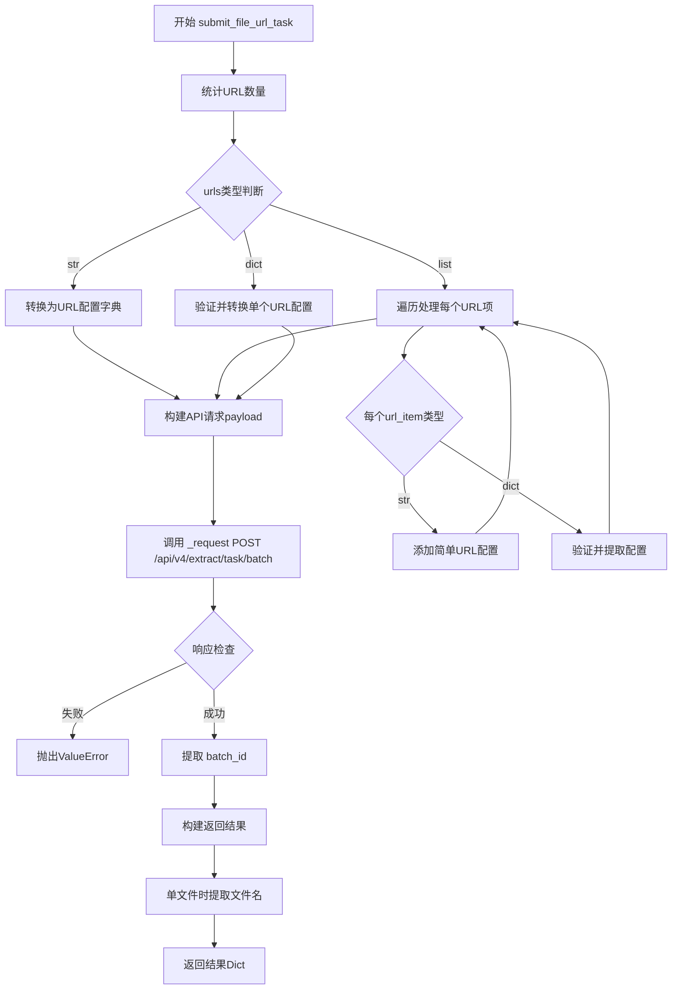

#### 带注释源码

```python
async def submit_file_url_task(
    self,
    urls: Union[str, List[Union[str, Dict[str, Any]]], Dict[str, Any]],
    enable_ocr: bool = True,
    language: str = "ch",
    page_ranges: Optional[str] = None,
) -> Dict[str, Any]:
    """
    提交 File URL 以转换为 Markdown。支持单个URL或多个URL批量处理。

    Args:
        urls: 可以是以下形式之一:
            1. 单个URL字符串
            2. 多个URL的列表
            3. 包含URL配置的字典列表，每个字典包含:
               - url: 文件URL (必需)
               - is_ocr: 是否启用OCR (可选)
               - data_id: 文件数据ID (可选)
               - page_ranges: 页码范围 (可选)
        enable_ocr: 是否为转换启用 OCR（所有文件的默认值）
        language: 指定文档语言，默认 ch，中文
        page_ranges: 指定页码范围，格式为逗号分隔的字符串。例如："2,4-6"表示选取第2页、第4页至第6页；"2--2"表示从第2页到倒数第2页。

    Returns:
        dict: 任务信息，包括batch_id
    """
    # 统计URL数量
    url_count = 1
    if isinstance(urls, list):
        url_count = len(urls)
    config.logger.debug(
        f"调用submit_file_url_task: {url_count}个URL, "
        + f"ocr={enable_ocr}, "
        + f"language={language}"
    )

    # 处理输入，确保我们有一个URL配置列表
    urls_config = []

    # 转换输入为标准格式
    if isinstance(urls, str):
        # 单个URL字符串情况
        urls_config.append(
            {"url": urls, "is_ocr": enable_ocr, "page_ranges": page_ranges}
        )

    elif isinstance(urls, list):
        # 处理URL列表或URL配置列表
        for i, url_item in enumerate(urls):
            if isinstance(url_item, str):
                # 简单的URL字符串
                urls_config.append(
                    {
                        "url": url_item,
                        "is_ocr": enable_ocr,
                        "page_ranges": page_ranges,
                    }
                )

            elif isinstance(url_item, dict):
                # 含有详细配置的URL字典
                if "url" not in url_item:
                    raise ValueError(f"URL配置必须包含 'url' 字段: {url_item}")

                # 获取个体配置，缺省值使用全局参数
                url_is_ocr = url_item.get("is_ocr", enable_ocr)
                url_page_ranges = url_item.get("page_ranges", page_ranges)

                url_config = {"url": url_item["url"], "is_ocr": url_is_ocr}
                if url_page_ranges is not None:
                    url_config["page_ranges"] = url_page_ranges

                urls_config.append(url_config)
            else:
                raise TypeError(f"不支持的URL配置类型: {type(url_item)}")
    elif isinstance(urls, dict):
        # 单个URL配置字典
        if "url" not in urls:
            raise ValueError(f"URL配置必须包含 'url' 字段: {urls}")

        url_is_ocr = urls.get("is_ocr", enable_ocr)
        url_page_ranges = urls.get("page_ranges", page_ranges)

        url_config = {"url": urls["url"], "is_ocr": url_is_ocr}
        if url_page_ranges is not None:
            url_config["page_ranges"] = url_page_ranges

        urls_config.append(url_config)
    else:
        raise TypeError(f"urls 必须是字符串、列表或字典，而不是 {type(urls)}")

    # 构建API请求payload
    files_payload = urls_config  # 与submit_file_task不同，这里直接使用URLs配置

    payload = {
        "language": language,
        "files": files_payload,
    }

    # 调用批量API
    response = await self._request(
        "POST", "/api/v4/extract/task/batch", json=payload
    )

    # 检查响应
    if "data" not in response or "batch_id" not in response["data"]:
        raise ValueError(f"提交批量URL任务失败: {response}")

    batch_id = response["data"]["batch_id"]

    config.logger.info(f"开始处理 {len(urls_config)} 个文件URL")
    config.logger.debug(f"批量URL任务提交成功，批次ID: {batch_id}")

    # 返回包含batch_id的响应和URLs信息
    result = {
        "data": {
            "batch_id": batch_id,
            "uploaded_files": [url_config.get("url") for url_config in urls_config],
        }
    }

    # 对于单个URL的情况，设置file_name以保持与原来返回格式的兼容性
    if len(urls_config) == 1:
        url = urls_config[0]["url"]
        # 从URL中提取文件名
        file_name = url.split("/")[-1]
        result["data"]["file_name"] = file_name

    return result
```


### `MinerUClient.submit_file_task`

该方法用于将本地文件（PDF、Word等）提交至MinerU API进行Markdown转换。支持单文件路径、文件路径列表或包含详细配置的字典列表等多种输入格式，自动处理文件验证、获取上传URL、OSS上传等流程，最终返回批次ID和已上传文件列表信息。

#### 参数

- `files`：`Union[str, List[Union[str, Dict[str, Any]]], Dict[str, Any]]`，要转换的本地文件，支持单个文件路径字符串、文件路径列表或包含path/name、is_ocr、page_ranges等配置的文件字典列表
- `enable_ocr`：`bool = True`，是否为转换启用OCR光学字符识别，默认启用
- `language`：`str = "ch"`，指定文档语言，默认为中文
- `page_ranges`：`Optional[str] = None`，指定要处理的页码范围，格式如"2,4-6"表示第2页和第4至6页

#### 返回值

`Dict[str, Any]`，任务提交结果，包含data字段，其中data.batch_id为批次ID，data.uploaded_files为已上传文件名列表，data.file_name在单文件时返回文件名以保持兼容性

#### 流程图

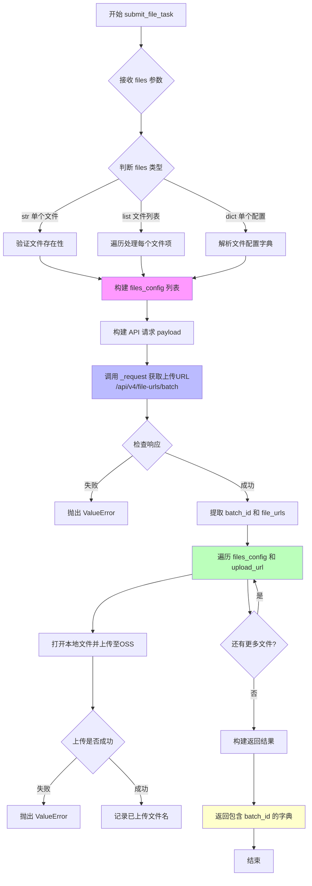

#### 带注释源码

```python
async def submit_file_task(
    self,
    files: Union[str, List[Union[str, Dict[str, Any]]], Dict[str, Any]],
    enable_ocr: bool = True,
    language: str = "ch",
    page_ranges: Optional[str] = None,
) -> Dict[str, Any]:
    """
    提交本地 File 文件以转换为 Markdown。支持单个文件路径或多个文件配置。

    Args:
        files: 可以是以下形式之一:
            1. 单个文件路径字符串
            2. 多个文件路径的列表
            3. 包含文件配置的字典列表，每个字典包含:
               - path/name: 文件路径或文件名
               - is_ocr: 是否启用OCR (可选)
               - data_id: 文件数据ID (可选)
               - page_ranges: 页码范围 (可选)
        enable_ocr: 是否为转换启用 OCR（所有文件的默认值）
        language: 指定文档语言，默认 ch，中文
        page_ranges: 指定页码范围，格式为逗号分隔的字符串。例如："2,4-6"表示选取第2页、第4页至第6页；"2--2"表示从第2页到倒数第2页。

    Returns:
        dict: 任务信息，包括batch_id
    """
    # ========== 步骤1: 参数预处理 ==========
    # 统计文件数量，用于日志记录
    file_count = 1
    if isinstance(files, list):
        file_count = len(files)
    
    # 记录调试日志
    config.logger.debug(
        f"调用submit_file_task: {file_count}个文件, "
        + f"ocr={enable_ocr}, "
        + f"language={language}"
    )

    # 处理输入，确保我们有一个文件配置列表
    files_config = []

    # ========== 步骤2: 输入格式标准化 ==========
    # 将不同格式的输入转换为统一的 files_config 列表
    if isinstance(files, str):
        # ----- 单个文件路径字符串处理 -----
        file_path = Path(files)
        if not file_path.exists():
            # 文件不存在时抛出明确错误
            raise FileNotFoundError(f"未找到 File 文件: {file_path}")

        files_config.append(
            {
                "path": file_path,
                "name": file_path.name,
                "is_ocr": enable_ocr,
                "page_ranges": page_ranges,
            }
        )

    elif isinstance(files, list):
        # ----- 文件列表处理 -----
        # 处理文件路径列表或文件配置列表
        for i, file_item in enumerate(files):
            if isinstance(file_item, str):
                # 简单的文件路径字符串
                file_path = Path(file_item)
                if not file_path.exists():
                    raise FileNotFoundError(f"未找到 File 文件: {file_path}")

                files_config.append(
                    {
                        "path": file_path,
                        "name": file_path.name,
                        "is_ocr": enable_ocr,
                        "page_ranges": page_ranges,
                    }
                )

            elif isinstance(file_item, dict):
                # 含有详细配置的文件字典
                # 必须包含 path 或 name 字段之一
                if "path" not in file_item and "name" not in file_item:
                    raise ValueError(
                        f"文件配置必须包含 'path' 或 'name' 字段: {file_item}"
                    )

                if "path" in file_item:
                    file_path = Path(file_item["path"])
                    if not file_path.exists():
                        raise FileNotFoundError(f"未找到 File 文件: {file_path}")

                    file_name = file_path.name
                else:
                    # 只有name没有path的情况
                    file_name = file_item["name"]
                    file_path = None

                # 获取配置选项，使用默认值作为备选
                file_is_ocr = file_item.get("is_ocr", enable_ocr)
                file_page_ranges = file_item.get("page_ranges", page_ranges)

                file_config = {
                    "path": file_path,
                    "name": file_name,
                    "is_ocr": file_is_ocr,
                }
                # 仅在提供了有效值时添加 page_ranges
                if file_page_ranges is not None:
                    file_config["page_ranges"] = file_page_ranges

                files_config.append(file_config)
            else:
                raise TypeError(f"不支持的文件配置类型: {type(file_item)}")
    
    elif isinstance(files, dict):
        # ----- 单个文件配置字典处理 -----
        if "path" not in files and "name" not in files:
            raise ValueError(f"文件配置必须包含 'path' 或 'name' 字段: {files}")

        if "path" in files:
            file_path = Path(files["path"])
            if not file_path.exists():
                raise FileNotFoundError(f"未找到 File 文件: {file_path}")

            file_name = file_path.name
        else:
            file_name = files["name"]
            file_path = None

        file_is_ocr = files.get("is_ocr", enable_ocr)
        file_page_ranges = files.get("page_ranges", page_ranges)

        file_config = {
            "path": file_path,
            "name": file_name,
            "is_ocr": file_is_ocr,
        }
        if file_page_ranges is not None:
            file_config["page_ranges"] = file_page_ranges

        files_config.append(file_config)
    else:
        raise TypeError(f"files 必须是字符串、列表或字典，而不是 {type(files)}")

    # ========== 步骤3: 构建 API 请求 Payload ==========
    # 准备上传到 MinerU API 的文件元信息
    files_payload = []
    for file_config in files_config:
        file_payload = {
            "name": file_config["name"],
            "is_ocr": file_config["is_ocr"],
        }
        if "page_ranges" in file_config and file_config["page_ranges"] is not None:
            file_payload["page_ranges"] = file_config["page_ranges"]
        files_payload.append(file_payload)

    payload = {
        "language": language,
        "files": files_payload,
    }

    # ========== 步骤4: 获取文件上传 URL ==========
    # 调用 API 获取 OSS 上传地址
    response = await self._request("POST", "/api/v4/file-urls/batch", json=payload)

    # 检查响应完整性
    if (
        "data" not in response
        or "batch_id" not in response["data"]
        or "file_urls" not in response["data"]
    ):
        raise ValueError(f"获取上传URL失败: {response}")

    batch_id = response["data"]["batch_id"]
    file_urls = response["data"]["file_urls"]

    # 验证 URL 数量与文件数量匹配
    if len(file_urls) != len(files_config):
        raise ValueError(
            f"上传URL数量 ({len(file_urls)}) 与文件数量 ({len(files_config)}) 不匹配"
        )

    config.logger.info(f"开始上传 {len(file_urls)} 个本地文件")
    config.logger.debug(f"获取上传URL成功，批次ID: {batch_id}")

    # ========== 步骤5: 上传文件到 OSS ==========
    uploaded_files = []

    for i, (file_config, upload_url) in enumerate(zip(files_config, file_urls)):
        file_path = file_config["path"]
        if file_path is None:
            raise ValueError(f"文件 {file_config['name']} 没有有效的路径")

        try:
            # 使用同步 requests 库上传（因为 aiohttp 上传大文件较复杂）
            with open(file_path, "rb") as f:
                # 重要：不设置Content-Type，让OSS自动处理文件类型
                response = requests.put(upload_url, data=f)

                if response.status_code != 200:
                    raise ValueError(
                        f"文件上传失败，状态码: {response.status_code}, 响应: {response.text}"
                    )

                config.logger.debug(f"文件 {file_path.name} 上传成功")
                uploaded_files.append(file_path.name)
        except Exception as e:
            raise ValueError(f"文件 {file_path.name} 上传失败: {str(e)}")

    config.logger.info(f"文件上传完成，共 {len(uploaded_files)} 个文件")

    # ========== 步骤6: 构建返回结果 ==========
    # 返回包含batch_id的响应和已上传的文件信息
    result = {"data": {"batch_id": batch_id, "uploaded_files": uploaded_files}}

    # 对于单个文件的情况，保持与原来返回格式的兼容性
    if len(uploaded_files) == 1:
        result["data"]["file_name"] = uploaded_files[0]

    return result
```


### `MinerUClient.get_batch_task_status`

获取批量转换任务的当前处理状态，通过轮询 API 端点 `/api/v4/extract-results/batch/{batch_id}` 查询指定批次 ID 的任务进度、结果及可能的错误信息。

参数：

- `self`：调用此方法的 `MinerUClient` 实例本身
- `batch_id`：`str`，批量任务的唯一标识符，用于查询特定任务的状态

返回值：`Dict[str, Any]`，包含批量任务的详细状态信息，通常包括各文件的处理状态（pending/running/done/failed）、进度百分比、下载链接或错误信息等。

#### 流程图

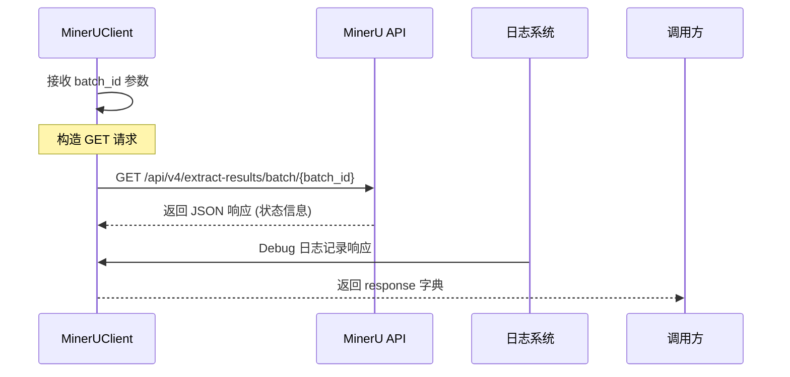

#### 带注释源码

```python
async def get_batch_task_status(self, batch_id: str) -> Dict[str, Any]:
    """
    获取批量转换任务的状态。

    Args:
        batch_id: 批量任务的ID

    Returns:
        dict: 批量任务状态信息
    """
    # 调用内部 _request 方法，发起 GET 请求到批量结果查询端点
    # 端点格式: /api/v4/extract-results/batch/{batch_id}
    response = await self._request(
        "GET", f"/api/v4/extract-results/batch/{batch_id}"
    )

    # 直接返回 API 原始响应字典，由调用方负责解析和处理
    return response
```

---

#### 补充说明

**设计目标与约束：**
- 该方法是 `process_file_to_markdown` 轮询机制的核心组件，用于在文件批量转换过程中持续检查任务进度。
- 采用异步设计（`async/await`），确保在高频轮询场景下不阻塞事件循环。

**潜在优化空间：**

1. **缺乏重试机制**：当前实现直接返回 API 响应，若遇到网络波动或临时性服务不可用，调用方需自行处理异常。建议在 `_request` 层面或本方法中添加有限重试逻辑。
   
2. **返回值语义不明确**：返回 `Dict[str, Any]` 缺乏结构化类型定义，调用方需依赖文档或试错了解响应格式。建议定义明确的 Pydantic 模型或 dataclass 封装响应结构。

3. **缺少批量状态聚合**：当一个 batch 包含多个文件时，该方法仅透传原始响应，未对各文件状态进行预处理或聚合（如统计完成数、失败数），加重调用方负担。

4. **日志信息有限**：仅依赖 `_request` 层的通用日志，未在方法入口/出口添加业务层日志（如记录 batch_id、查询次数等），不利于问题排查。

**错误处理与异常设计：**
- 本方法本身不捕获异常，异常由调用方或 `_request` 层处理。
- 可能的异常场景：网络超时（`aiohttp.ClientError`）、HTTP 4xx/5xx 错误（通过 `raise_for_status()` 抛出）、无效 batch_id 等。

**数据流关联：**
- 上游：通常由 `process_file_to_markdown` 在循环中调用，每隔 `retry_interval` 秒查询一次。
- 下游：调用方解析 `response["data"]["extract_result"]` 列表，提取每个文件的 `state`、`full_zip_url` 或 `err_msg`。


### `MinerUClient.process_file_to_markdown`

该方法实现了从提交文件转换任务到获取Markdown结果的完整流程，包括提交任务、轮询任务状态、下载并解压结果文件，最终返回包含成功和失败文件信息的字典。

参数：

- `self`：`MinerUClient`，MinerUClient 实例本身
- `task_fn`：`Callable`，提交任务的函数，可以是 `submit_file_url_task` 或 `submit_file_task`
- `task_arg`：`Union[str, List[Dict[str, Any]], Dict[str, Any]]`，任务函数的参数，可以是 URL 字符串、文件路径字符串、包含文件配置的字典或字典列表
- `enable_ocr`：`bool`，是否启用 OCR（默认为 True）
- `output_dir`：`Optional[str]`，结果的输出目录（默认为 None，从配置获取）
- `max_retries`：`int`，最大状态检查重试次数（默认为 180）
- `retry_interval`：`int`，状态检查之间的时间间隔，单位秒（默认为 10）

返回值：`Union[str, Dict[str, Any]]`，单文件时返回包含提取的 Markdown 文件的目录路径字符串；多文件时返回包含 results（文件处理结果列表）、extract_dir（提取目录）、success_count（成功数）、fail_count（失败数）、total_count（总数）的字典。

#### 流程图

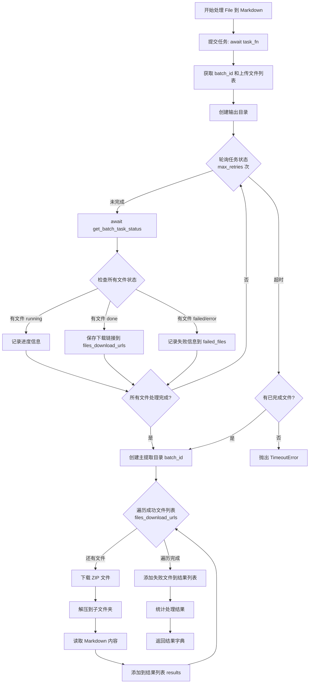

#### 带注释源码

```python
async def process_file_to_markdown(
    self,
    task_fn,
    task_arg: Union[str, List[Dict[str, Any]], Dict[str, Any]],
    enable_ocr: bool = True,
    output_dir: Optional[str] = None,
    max_retries: int = 180,
    retry_interval: int = 10,
) -> Union[str, Dict[str, Any]]:
    """
    从开始到结束处理 File 到 Markdown 的转换。

    Args:
        task_fn: 提交任务的函数 (submit_file_url_task 或 submit_file_task)
        task_arg: 任务函数的参数，可以是:
                - URL字符串
                - 文件路径字符串
                - 包含文件配置的字典
                - 包含多个文件配置的字典列表
        enable_ocr: 是否启用 OCR
        output_dir: 结果的输出目录
        max_retries: 最大状态检查重试次数
        retry_interval: 状态检查之间的时间间隔 (秒)

    Returns:
        Union[str, Dict[str, Any]]:
            - 单文件: 包含提取的 Markdown 文件的目录路径
            - 多文件: {
                "results": [
                    {
                        "filename": str,
                        "status": str,
                        "content": str,
                        "error_message": str,
                    }
                ],
                "extract_dir": str
            }
    """
    try:
        # 提交任务 - 使用位置参数调用，而不是命名参数
        task_info = await task_fn(task_arg, enable_ocr)

        # 批量任务处理
        batch_id = task_info["data"]["batch_id"]

        # 获取所有上传文件的名称
        uploaded_files = task_info["data"].get("uploaded_files", [])
        if not uploaded_files and "file_name" in task_info["data"]:
            uploaded_files = [task_info["data"]["file_name"]]

        if not uploaded_files:
            raise ValueError("无法获取上传文件的信息")

        config.logger.debug(f"批量任务提交成功。Batch ID: {batch_id}")

        # 跟踪所有文件的处理状态
        files_status = {}  # 将使用file_name作为键
        files_download_urls = {}
        failed_files = {}  # 记录失败的文件和错误信息

        # 准备输出路径
        output_path = config.ensure_output_dir(output_dir)

        # 轮询任务完成情况
        for i in range(max_retries):
            status_info = await self.get_batch_task_status(batch_id)

            config.logger.debug(f"轮训结果：{status_info}")

            if (
                "data" not in status_info
                or "extract_result" not in status_info["data"]
            ):
                config.logger.error(f"获取批量任务状态失败: {status_info}")
                await asyncio.sleep(retry_interval)
                continue

            # 检查所有文件的状态
            all_done = True
            has_progress = False

            for result in status_info["data"]["extract_result"]:
                file_name = result.get("file_name")

                if not file_name:
                    continue

                # 初始化状态，如果之前没有记录
                if file_name not in files_status:
                    files_status[file_name] = "pending"

                state = result.get("state")
                files_status[file_name] = state

                if state == "done":
                    # 保存下载链接
                    full_zip_url = result.get("full_zip_url")
                    if full_zip_url:
                        files_download_urls[file_name] = full_zip_url
                        config.logger.info(f"文件 {file_name} 处理完成")
                    else:
                        config.logger.debug(
                            f"文件 {file_name} 标记为完成但没有下载链接"
                        )
                        all_done = False
                elif state in ["failed", "error"]:
                    err_msg = result.get("err_msg", "未知错误")
                    failed_files[file_name] = err_msg
                    config.logger.warning(f"文件 {file_name} 处理失败: {err_msg}")
                    # 不抛出异常，继续处理其他文件
                else:
                    all_done = False
                    # 显示进度信息
                    if state == "running" and "extract_progress" in result:
                        has_progress = True
                        progress = result["extract_progress"]
                        extracted = progress.get("extracted_pages", 0)
                        total = progress.get("total_pages", 0)
                        if total > 0:
                            percent = (extracted / total) * 100
                            config.logger.info(
                                f"处理进度: {file_name} "
                                + f"{extracted}/{total} 页 "
                                + f"({percent:.1f}%)"
                            )

            # 检查是否所有文件都已经处理完成
            expected_file_count = len(uploaded_files)
            processed_file_count = len(files_status)
            completed_file_count = len(files_download_urls) + len(failed_files)

            # 记录当前状态
            config.logger.debug(
                f"文件处理状态: all_done={all_done}, "
                + f"files_status数量={processed_file_count}, "
                + f"上传文件数量={expected_file_count}, "
                + f"下载链接数量={len(files_download_urls)}, "
                + f"失败文件数量={len(failed_files)}"
            )

            # 判断是否所有文件都已完成（包括成功和失败的）
            if (
                processed_file_count > 0
                and processed_file_count >= expected_file_count
                and completed_file_count >= processed_file_count
            ):
                if files_download_urls or failed_files:
                    config.logger.info("文件处理完成")
                    if failed_files:
                        config.logger.warning(
                            f"有 {len(failed_files)} 个文件处理失败"
                        )
                    break
                else:
                    # 这种情况不应该发生，但保险起见
                    all_done = False

            # 如果没有进度信息，只显示简单的等待消息
            if not has_progress:
                config.logger.info(f"等待文件处理完成... ({i+1}/{max_retries})")

            await asyncio.sleep(retry_interval)
        else:
            # 如果超过最大重试次数，检查是否有部分文件完成
            if not files_download_urls and not failed_files:
                raise TimeoutError(f"批量任务 {batch_id} 未在允许的时间内完成")
            else:
                config.logger.warning(
                    "警告: 部分文件未在允许的时间内完成，" + "继续处理已完成的文件"
                )

        # 创建主提取目录
        extract_dir = output_path / batch_id
        extract_dir.mkdir(exist_ok=True)

        # 准备结果列表
        results = []

        # 下载并解压每个成功的文件的结果
        for file_name, download_url in files_download_urls.items():
            try:
                config.logger.debug
                (f"下载文件处理结果: {file_name}")

                # 从下载URL中提取zip文件名作为子目录名
                zip_file_name = download_url.split("/")[-1]
                # 去掉.zip扩展名
                zip_dir_name = os.path.splitext(zip_file_name)[0]

                file_extract_dir = extract_dir / zip_dir_name
                file_extract_dir.mkdir(exist_ok=True)

                # 下载ZIP文件
                zip_path = output_path / f"{batch_id}_{zip_file_name}"

                async with aiohttp.ClientSession() as session:
                    async with session.get(
                        download_url,
                        headers={"Authorization": f"Bearer {self.api_key}"},
                    ) as response:
                        response.raise_for_status()
                        with open(zip_path, "wb") as f:
                            f.write(await response.read())

                # 解压到子文件夹
                with zipfile.ZipFile(zip_path, "r") as zip_ref:
                    zip_ref.extractall(file_extract_dir)

                # 解压后删除ZIP文件
                zip_path.unlink()

                # 尝试读取Markdown内容
                markdown_content = ""
                markdown_files = list(file_extract_dir.glob("*.md"))
                if markdown_files:
                    with open(markdown_files[0], "r", encoding="utf-8") as f:
                        markdown_content = f.read()

                # 添加成功结果
                results.append(
                    {
                        "filename": file_name,
                        "status": "success",
                        "content": markdown_content,
                        "extract_path": str(file_extract_dir),
                    }
                )

                config.logger.debug(
                    f"文件 {file_name} 的结果已解压到: {file_extract_dir}"
                )

            except Exception as e:
                # 下载失败，添加错误结果
                error_msg = f"下载结果失败: {str(e)}"
                config.logger.error(f"文件 {file_name} {error_msg}")
                results.append(
                    {
                        "filename": file_name,
                        "status": "error",
                        "error_message": error_msg,
                    }
                )

        # 添加处理失败的文件到结果
        for file_name, error_msg in failed_files.items():
            results.append(
                {
                    "filename": file_name,
                    "status": "error",
                    "error_message": f"处理失败: {error_msg}",
                }
            )

        # 输出处理结果统计
        success_count = len(files_download_urls)
        fail_count = len(failed_files)
        total_count = success_count + fail_count

        config.logger.info("\n=== 文件处理结果统计 ===")
        config.logger.info(f"总文件数: {total_count}")
        config.logger.info(f"成功处理: {success_count}")
        config.logger.info(f"处理失败: {fail_count}")

        if failed_files:
            config.logger.info("\n失败文件详情:")
            for file_name, error_msg in failed_files.items():
                config.logger.info(f"  - {file_name}: {error_msg}")

        if success_count > 0:
            config.logger.info(f"\n结果保存目录: {extract_dir}")
        else:
            config.logger.info(f"\n输出目录: {extract_dir}")

        # 返回详细结果
        return {
            "results": results,
            "extract_dir": str(extract_dir),
            "success_count": success_count,
            "fail_count": fail_count,
            "total_count": total_count,
        }

    except Exception as e:
        config.logger.error(f"处理 File 到 Markdown 失败: {str(e)}")
        raise
```

## 关键组件


### MinerUClient API客户端

该代码实现了一个用于与MinerU API交互的异步客户端，支持将本地文件或远程URL转换为Markdown格式，提供完整的任务提交、状态轮询、结果下载与解压流程。

### 整体运行流程

1. **初始化阶段**：创建MinerUClient实例，验证API密钥
2. **任务提交阶段**：根据输入类型（URL或本地文件）调用相应方法提交转换任务
3. **状态轮询阶段**：持续轮询批处理任务状态，直至所有文件处理完成
4. **结果下载阶段**：下载成功处理的文件，解压到指定目录
5. **结果返回阶段**：返回包含成功/失败统计的详细结果

### 类详细信息

#### singleton_func

- **类型**：函数装饰器
- **描述**：实现单例模式，确保MinerUClient类只有一个全局实例
- **实现原理**：使用闭包和字典存储实例，首次调用时创建实例，后续调用直接返回已创建的实例

#### MinerUClient

- **类型**：类
- **描述**：与MinerU API交互的主客户端类，提供文件转Markdown的完整功能

##### 类字段

| 名称 | 类型 | 描述 |
|------|------|------|
| api_base | str | MinerU API的基础URL |
| api_key | str | API认证密钥 |

##### 类方法

###### __init__

- **参数**：
  - api_base (Optional[str])：API基础URL，默认从环境变量获取
  - api_key (Optional[str])：API密钥，默认从环境变量获取
- **返回值**：无
- **描述**：初始化客户端，验证API密钥是否设置

###### _request

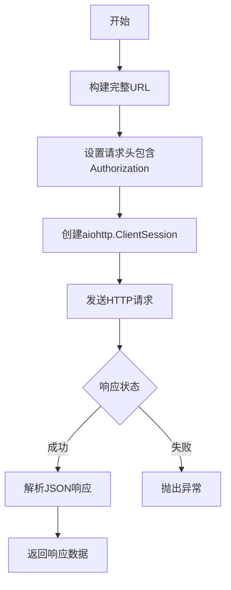

- **参数**：
  - method (str)：HTTP方法
  - endpoint (str)：API端点路径
  - **kwargs：传递给aiohttp的其他参数
- **返回值**：Dict[str, Any] - API响应JSON数据
- **描述**：异步发送HTTP请求到MinerU API，自动处理认证和日志记录

###### submit_file_url_task

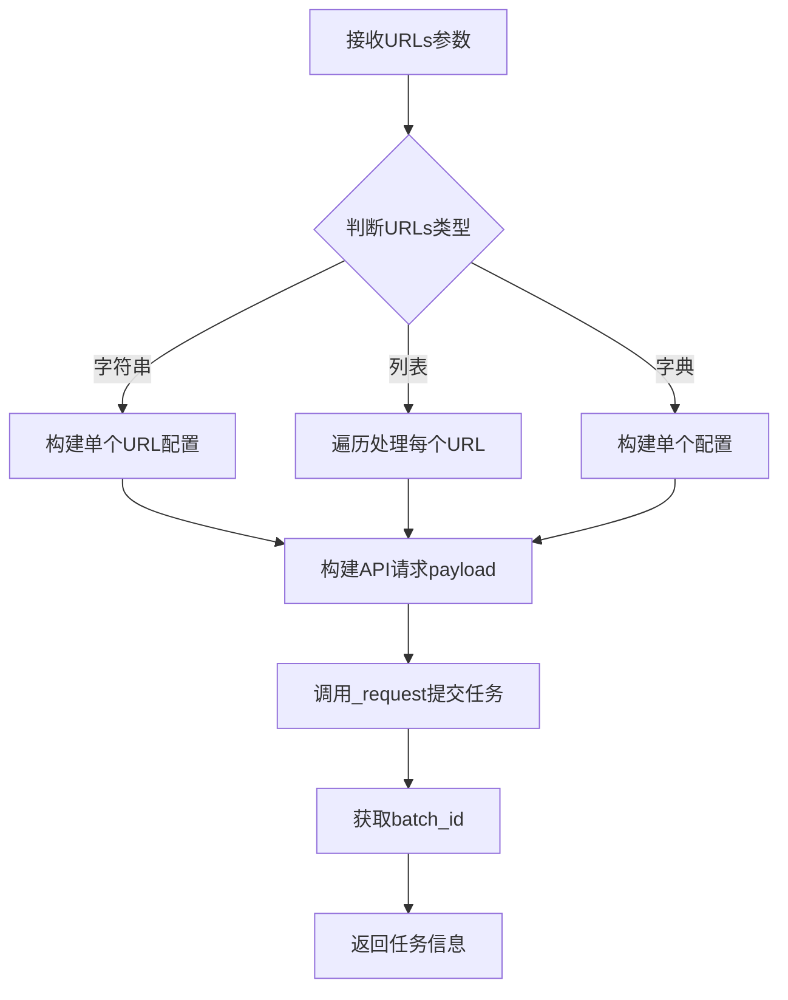

- **参数**：
  - urls (Union[str, List, Dict])：文件URL，支持多种格式
  - enable_ocr (bool)：是否启用OCR，默认True
  - language (str)：语言设置，默认"ch"
  - page_ranges (Optional[str])：页码范围
- **返回值**：Dict[str, Any] - 包含batch_id和上传文件列表
- **描述**：提交远程文件URL进行转换，支持批量处理

###### submit_file_task

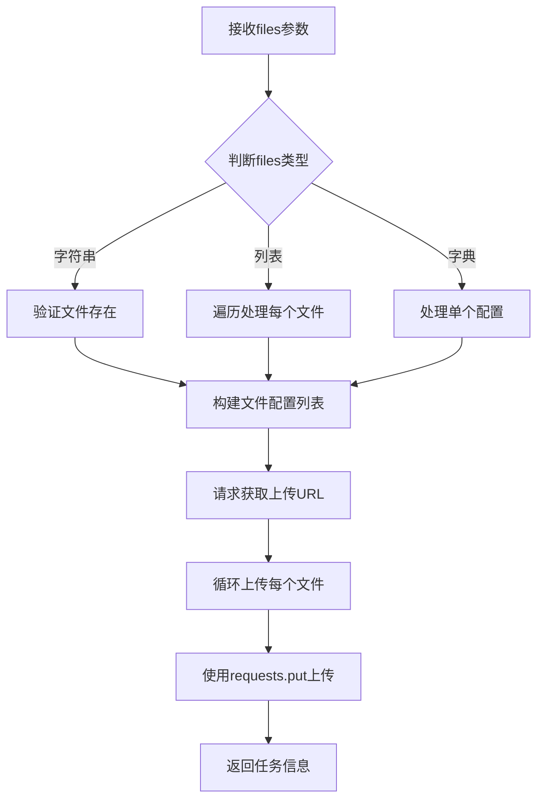

- **参数**：
  - files (Union[str, List, Dict])：本地文件路径，支持多种格式
  - enable_ocr (bool)：是否启用OCR，默认True
  - language (str)：语言设置，默认"ch"
  - page_ranges (Optional[str])：页码范围
- **返回值**：Dict[str, Any] - 包含batch_id和已上传文件列表
- **描述**：上传本地文件到OSS并提交转换任务

###### get_batch_task_status

- **参数**：
  - batch_id (str)：批处理任务ID
- **返回值**：Dict[str, Any] - 任务状态信息
- **描述**：获取批量转换任务的当前状态

###### process_file_to_markdown

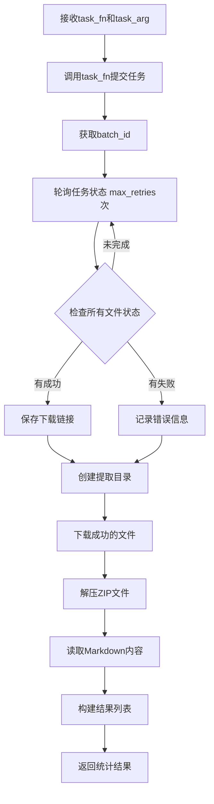

- **参数**：
  - task_fn：任务提交函数
  - task_arg (Union[str, List, Dict])：任务参数
  - enable_ocr (bool)：是否启用OCR
  - output_dir (Optional[str])：输出目录
  - max_retries (int)：最大轮询次数，默认180
  - retry_interval (int)：轮询间隔秒数，默认10
- **返回值**：Union[str, Dict[str, Any]] - 处理结果
- **描述**：完整流程：提交任务→轮询状态→下载结果→解压→返回

### 关键组件信息

#### 单例模式 (singleton_func)

通过装饰器实现类级别的单例，确保API客户端全局只有一个实例，避免重复创建连接资源

#### 异步HTTP请求 (_request)

使用aiohttp实现异步网络请求，支持并发处理多个API调用，提高整体吞吐量

#### 多格式输入处理

支持字符串、列表、字典三种输入格式，内部统一转换为标准配置结构，降低调用方使用门槛

#### 状态轮询机制

实现带重试的轮询逻辑，支持超时控制，提供进度反馈，处理长时间运行的任务

#### 文件上传与下载

本地文件通过预获取的上传URL直接上传到OSS，转换结果通过签名URL下载，支持大文件处理

#### 结果解压与解析

自动解压ZIP文件，尝试读取首个Markdown文件内容，同时保留完整文件结构供后续使用

### 潜在的技术债务与优化空间

1. **同步阻塞上传**：使用requests库同步上传文件，在高并发场景下可能成为瓶颈，建议改为aiofiles异步文件IO
2. **缺乏连接复用**：每次请求都创建新的aiohttp.ClientSession，建议复用连接池
3. **轮询效率固定**：retry_interval为固定值，可考虑指数退避策略或WebSocket推送
4. **内存占用**：大文件下载时使用response.read()一次性加载，建议使用流式下载
5. **错误重试**：上传失败时直接抛出异常，缺乏重试机制
6. **日志敏感信息**：虽然隐藏了Authorization头，但debug日志可能包含其他敏感字段

### 其他项目

#### 设计目标与约束

- **目标**：提供简洁的API将各类文档转换为Markdown
- **约束**：依赖aiohttp异步库，需要Python 3.7+
- **认证方式**：Bearer Token认证

#### 错误处理与异常设计

- 初始化时验证API密钥，缺失则抛出ValueError
- 文件不存在时抛出FileNotFoundError
- API响应异常时raise_for_status()抛出HTTPError
- 任务超时抛出TimeoutError
- 部分文件失败时记录但继续处理，最终在结果中体现

#### 数据流与状态机

```
[输入] → [格式标准化] → [任务提交] → [状态轮询] → [结果下载] → [解压] → [返回]
         ↓                              ↓
      [验证]                        [成功/失败/进行中]
```

#### 外部依赖与接口契约

- **依赖库**：aiohttp（异步HTTP）、requests（同步文件上传）、config（配置模块）
- **API端点**：
  - POST /api/v4/extract/task/batch（URL任务）
  - POST /api/v4/file-urls/batch（获取上传URL）
  - GET /api/v4/extract-results/batch/{batch_id}（查询状态）

## 问题及建议


### 已知问题

- **混合同步/异步阻塞**：`submit_file_task` 方法中使用同步的 `requests.put` 进行文件上传，这会阻塞事件循环，影响整体异步性能。
- **单例模式非线程安全**：`singleton_func` 使用简单字典存储实例，在多线程环境下可能创建多个实例，且没有实现析构或清理逻辑。
- **方法职责过于复杂**：`process_file_to_markdown` 方法承担了任务提交、状态轮询、结果下载、文件解压等多个职责，违反单一职责原则，难以维护和测试。
- **代码语法错误**：存在 `config.logger.debug` 换行缺少括号的问题（Python语法错误）。
- **缺少超时配置**：HTTP请求（aiohttp和requests）均未设置超时参数，可能导致请求无限期挂起。
- **轮询策略单一**：状态轮询使用固定间隔 `retry_interval`，没有实现指数退避策略，可能导致API压力过大或浪费资源。
- **返回值类型不一致**：`process_file_to_markdown` 返回类型声明为 `Union[str, Dict[str, Any]]`，但实际返回始终是字典，文档描述与实现不符。

### 优化建议

- **统一异步模型**：将 `requests.put` 替换为 `aiohttp` 的异步上传，或使用 `asyncio.to_thread` 包装同步操作。
- **重构单例模式**：使用 `threading.Lock` 保证线程安全，或考虑使用 `functools.lru_cache` 或依赖注入框架。
- **拆分大型方法**：将 `process_file_to_markdown` 拆分为独立方法：`submit_task`、`poll_task_status`、`download_and_extract_results`。
- **添加请求超时**：为所有HTTP请求添加 `timeout` 参数，建议使用 `aiohttp.ClientTimeout` 和 `requests.put(..., timeout=30)`。
- **优化轮询策略**：实现指数退避策略，初始间隔10秒，最大间隔120秒，避免频繁请求。
- **统一返回类型**：修改方法签名，明确返回字典类型，移除 `str` 类型分支。
- **添加连接池复用**：在类初始化时创建 `aiohttp.ClientSession` 并复用，减少连接开销。
- **提取公共逻辑**：`submit_file_url_task` 和 `submit_file_task` 中存在大量重复的配置处理逻辑，可抽象为私有辅助方法。

## 其它


### 设计目标与约束

**设计目标**
- 提供简单易用的API接口，将各种文件（PDF、Word、图片等）转换为Markdown格式
- 支持单文件和批量文件处理，满足不同业务场景需求
- 实现异步非阻塞的任务提交和状态轮询，提高系统吞吐量
- 自动管理文件上传、任务状态跟踪和结果下载的完整流程

**设计约束**
- 必须提供有效的API密钥才能使用服务
- API基础URL可通过配置或环境变量指定
- 支持的文件格式受限于MinerU后端服务能力
- 批量任务有最大处理数量限制（受API约束）
- 状态轮询采用固定间隔模式，最大重试次数有限制

### 错误处理与异常设计

**异常类型**
- `ValueError`: 参数验证失败、缺少必需字段、API响应格式错误
- `FileNotFoundError`: 本地文件不存在
- `TypeError`: 参数类型不支持
- `TimeoutError`: 任务处理超时
- `aiohttp.ClientError`: 网络请求相关错误
- `requests.RequestException`: 文件上传失败

**错误处理策略**
- 在初始化阶段检查API密钥，未设置则抛出详细错误提示
- 文件上传前验证文件存在性
- API响应验证确保包含必需字段
- 单个文件失败不影响其他文件处理，继续执行并记录错误
- 网络请求使用raise_for_status()自动触发异常
- 所有异常都通过日志记录详细信息

**日志级别使用**
- DEBUG: 详细的请求参数、响应内容、调试信息
- INFO: 关键流程节点、任务状态变更
- WARNING: 可恢复的错误、部分文件失败
- ERROR: 严重错误、需要立即处理的问题

### 数据流与状态机

**整体数据流**
```
用户调用 → 任务提交 → 获取上传URL → 文件上传 → 任务入队
     ↓
状态轮询 ← 任务处理中 ← 服务器处理
     ↓
结果下载 → ZIP解压 → Markdown提取 → 返回结果
```

**文件处理状态机**
- `pending`: 任务已提交，等待处理
- `running`: 正在处理中，可能包含进度信息
- `done`: 处理完成，可获取下载链接
- `failed/error`: 处理失败，包含错误信息

**批量任务状态判断逻辑**
1. 检查所有文件状态是否已记录
2. 记录已完成（done）和失败（failed/error）的文件数
3. 当已处理文件数≥上传文件数 且 至少有成功或失败记录时，认为任务完成
4. 如果达到最大重试次数仍有文件未完成，发出警告并处理已完成的文件

### 外部依赖与接口契约

**直接依赖**
- `aiohttp`: 异步HTTP客户端，用于API请求和结果下载
- `requests`: 同步HTTP客户端，用于文件上传（PUT请求）
- `pathlib.Path`: 文件路径操作
- `zipfile`: ZIP压缩包处理
- `asyncio`: 异步编程支持
- `typing`: 类型注解支持
- `os`: 操作系统接口

**内部依赖**
- `config`模块: 配置管理、日志输出、输出目录管理

**API端点契约**
- `POST /api/v4/extract/task/batch`: 提交URL任务
- `POST /api/v4/file-urls/batch`: 获取文件上传URL
- `GET /api/v4/extract-results/batch/{batch_id}`: 获取批量任务状态

**关键接口契约**
- 任务提交响应必须包含 `data.batch_id`
- 获取上传URL响应必须包含 `data.batch_id` 和 `data.file_urls`
- 状态查询响应必须包含 `data.extract_result` 数组，每个元素包含 `file_name`、`state`、`full_zip_url`（完成时）

### 性能考虑

**异步设计**
- 使用aiohttp实现异步HTTP请求，避免阻塞
- 文件上传使用同步requests库（aiohttp PUT上传存在兼容性问题）
- 状态轮询采用异步sleep，非轮询期间可处理其他任务

**批量处理优化**
- 批量提交任务减少网络往返
- 批量获取上传URL
- 批量下载结果文件

**潜在性能瓶颈**
- 固定间隔轮询（默认10秒）可能导致不必要的等待
- 文件串行上传，大批量文件时耗时较长
- 结果串行下载和解压
- 内存中读取整个ZIP文件内容

**优化建议**
- 考虑使用WebSocket或回调机制获取状态更新
- 实现文件上传并行化
- 考虑流式下载和边下载边解压
- 添加请求超时和重试策略

### 安全性考虑

**API密钥保护**
- API密钥存储在环境变量或配置中，不硬编码
- 日志记录时隐藏API密钥（显示为"Bearer ****"）
- 不在异常信息中暴露完整密钥

**文件安全**
- 上传前验证文件存在性
- 下载结果保存到指定输出目录
- 使用pathlib.Path防止路径遍历攻击
- 解压时验证ZIP文件内容

**网络请求安全**
- 验证HTTPS证书（aiohttp默认行为）
- 请求超时有默认限制
- 响应状态码验证（raise_for_status）

### 配置管理

**配置来源优先级**
1. 构造函数参数（最高优先级）
2. 环境变量
3. 配置文件（.env文件）
4. 默认值

**必需配置**
- `MINERU_API_KEY`: API密钥，无默认值，必须提供

**可选配置**
- `MINERU_API_BASE`: API基础URL，默认值在config模块定义

**运行时配置**
- `output_dir`: 结果输出目录，默认使用config指定目录
- `max_retries`: 最大轮询次数，默认180
- `retry_interval`: 轮询间隔，默认10秒

### 使用示例

**单文件URL转换**
```python
client = MinerUClient()
result = await client.submit_file_url_task(
    "https://example.com/document.pdf"
)
batch_id = result["data"]["batch_id"]
```

**多文件URL批量转换**
```python
urls = [
    "https://example.com/doc1.pdf",
    "https://example.com/doc2.docx",
    {"url": "https://example.com/doc3.pdf", "is_ocr": False}
]
result = await client.submit_file_url_task(urls, language="en")
```

**本地文件转换**
```python
result = await client.submit_file_task("/path/to/document.pdf")
```

**完整流程处理**
```python
client = MinerUClient()
result = await client.process_file_to_markdown(
    client.submit_file_task,
    "/path/to/document.pdf",
    output_dir="./output",
    max_retries=120
)
# result包含: results, extract_dir, success_count, fail_count, total_count
```

### 版本历史与变更记录

**当前版本**: 1.0.0

**主要功能**
- 支持URL和本地文件两种提交方式
- 批量任务处理能力
- 异步非阻塞执行
- 完整的结果下载和解压
- 详细的日志记录和错误处理

### 术语表

- **Batch ID**: 批量任务唯一标识符，用于跟踪整个任务组的状态
- **OCR**: Optical Character Recognition，光学字符识别，用于从图片中提取文本
- **Page Ranges**: 页码范围指定，用于选择文档的特定页面进行转换
- **Extract Result**: 提取结果，包含转换后的Markdown文件
- **Full ZIP URL**: 完整结果ZIP包的下载链接

### 参考资料

- MinerU API文档: 需参考官方API文档获取最新的端点和参数说明
- aiohttp文档: https://docs.aiohttp.org/
- Python asyncio: https://docs.python.org/3/library/asyncio.html
- pathlib文档: https://docs.python.org/3/library/pathlib.html


    