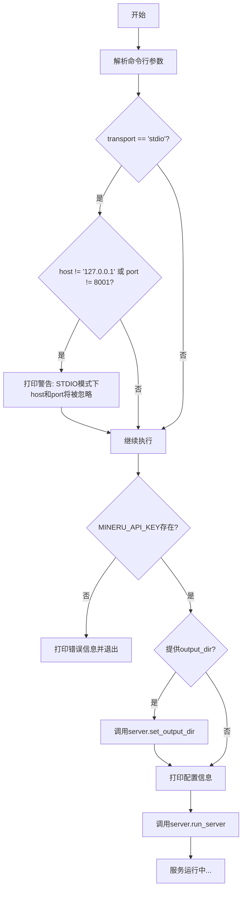

# `MinerU\projects\mcp\src\mineru\cli.py` 详细设计文档

MinerU文件的命令行转换服务入口，通过argparse解析命令行参数，验证API密钥，并启动文件转Markdown的服务器，支持stdio、sse和streamable-http三种传输协议。

## 整体流程



## 类结构

```
cli.py (命令行入口)
├── sys (标准库)
├── argparse (标准库)
├── config (配置模块)
│   └── MINERU_API_KEY (环境变量)
└── server (服务模块)
    ├── set_output_dir()
    └── run_server()
```

## 全局变量及字段


### `sys`
    
Python标准库模块，提供系统相关的参数和函数

类型：`module`
    


### `argparse`
    
Python标准库模块，用于命令行参数解析

类型：`module`
    


### `server`
    
本地模块，负责服务器运行和文件转换服务

类型：`module`
    


### `config`
    
本地模块，负责配置管理和环境变量读取

类型：`module`
    


### `config.MINERU_API_KEY`
    
API密钥，从环境变量读取，用于验证服务访问权限

类型：`str`
    


    

## 全局函数及方法


# MinerU File转Markdown服务 - main() 函数详细设计文档

## 1. 一段话描述

`main()` 是MinerU命令行服务的入口函数，负责解析命令行参数、验证API密钥配置、设置输出目录，并根据用户指定的传输协议（stdio、sse或streamable-http）启动相应的服务器。

---

## 2. 文件的整体运行流程

```
┌─────────────────────────────────────────────────────────────────────┐
│                         main() 入口函数                              │
├─────────────────────────────────────────────────────────────────────┤
│  1. 创建 ArgumentParser 并配置命令行参数                              │
│     ├── --output-dir / -o: 输出目录                                  │
│     ├── --transport / -t: 传输协议 (默认: stdio)                     │
│     ├── --port / -p: 服务器端口 (默认: 8001)                         │
│     └── --host: 服务器主机 (默认: 127.0.0.1)                         │
│                              ↓                                       │
│  2. 解析命令行参数 (argparse.parse_args())                           │
│                              ↓                                       │
│  3. 参数有效性检查                                                    │
│     └── STDIO模式下警告忽略host/port参数                             │
│                              ↓                                       │
│  4. 验证API密钥 (config.MINERU_API_KEY)                              │
│     └── 未设置则打印错误信息并退出 (sys.exit(1))                     │
│                              ↓                                       │
│  5. 设置输出目录 (如提供)                                             │
│     └── server.set_output_dir()                                     │
│                              ↓                                       │
│  6. 打印配置信息                                                      │
│     └── 输出服务启动信息和服务器地址                                  │
│                              ↓                                       │
│  7. 启动服务器                                                        │
│     └── server.run_server(mode, port, host)                         │
└─────────────────────────────────────────────────────────────────────┘
```

---

## 3. 类详细信息

本文件为模块文件，不包含类定义，仅包含模块级函数和导入。

---

## 4. 全局变量和全局函数详细信息

### 4.1 导入的模块

| 名称 | 类型 | 描述 |
|------|------|------|
| `sys` | `module` | Python标准库，提供系统相关功能用于stderr输出和程序退出 |
| `argparse` | `module` | Python标准库，用于命令行参数解析 |
| `config` | `module` | 项目配置模块，提供MINERU_API_KEY等配置项 |
| `server` | `module` | 服务器模块，提供set_output_dir()和run_server()函数 |

### 4.2 函数详情

#### `main()`

**描述**：命令行界面的入口点，解析参数、验证配置、启动服务。

**参数**：无

**返回值**：无返回值（正常情况下调用`server.run_server()`启动服务，异常情况下调用`sys.exit(1)`退出）

#### 流程图

```mermaid
flowchart TD
    A[main 函数开始] --> B[创建 ArgumentParser]
    B --> C[添加命令行参数]
    C --> D[parse_args 解析参数]
    D --> E{transport == 'stdio'?}
    E -->|Yes| F{host != '127.0.0.1' or port != 8001?}
    E -->|No| G[继续验证]
    F -->|Yes| H[打印警告信息到 stderr]
    F -->|No| G
    H --> G
    G --> I{MINERU_API_KEY 已设置?}
    I -->|No| J[打印错误信息到 stderr]
    J --> K[sys.exit(1) 退出程序]
    I -->|Yes| L{提供 output_dir?}
    L -->|Yes| M[调用 server.set_output_dir]
    L -->|No| N[跳过设置输出目录]
    M --> N
    N --> O[打印服务启动信息]
    O --> P{transport in ['sse', 'streamable-http']?}
    P -->|Yes| Q[打印服务器地址]
    P -->|No| R[不打印地址]
    Q --> S
    R --> S
    S --> T[调用 server.run_server 启动服务]
    T --> U[main 函数结束]
```

#### 带注释源码

```python
def main():
    """命令行界面的入口点。"""
    # 步骤1: 创建参数解析器，设置程序描述
    parser = argparse.ArgumentParser(description="MinerU File转Markdown转换服务")

    # 步骤2: 添加 --output-dir / -o 参数，指定输出目录
    parser.add_argument(
        "--output-dir", "-o", type=str, help="保存转换后文件的目录 (默认: ./downloads)"
    )

    # 步骤3: 添加 --transport / -t 参数，指定传输协议
    parser.add_argument(
        "--transport",
        "-t",
        type=str,
        default="stdio",
        help="协议类型 (默认: stdio,可选: sse,streamable-http)",
    )

    # 步骤4: 添加 --port / -p 参数，指定服务器端口
    parser.add_argument(
        "--port",
        "-p",
        type=int,
        default=8001,
        help="服务器端口 (默认: 8001, 仅在使用HTTP协议时有效)",
    )

    # 步骤5: 添加 --host 参数，指定服务器主机地址
    parser.add_argument(
        "--host",
        type=str,
        default="127.0.0.1",
        help="服务器主机地址 (默认: 127.0.0.1, 仅在使用HTTP协议时有效)",
    )

    # 步骤6: 解析命令行参数
    args = parser.parse_args()

    # 步骤7: 检查参数有效性 - STDIO模式下host和port参数将被忽略
    if args.transport == "stdio" and (args.host != "127.0.0.1" or args.port != 8001):
        print("警告: 在STDIO模式下，--host和--port参数将被忽略", file=sys.stderr)

    # 步骤8: 验证API密钥 - 移动到这里，以便 --help 等参数可以无密钥运行
    # 检查环境变量是否设置了MINERU_API_KEY
    if not config.MINERU_API_KEY:
        print(
            "错误: 启动服务需要 MINERU_API_KEY 环境变量。"
            "\\n请检查是否已设置该环境变量，例如："
            "\\n  export MINERU_API_KEY='your_actual_api_key'"
            "\\n或者，确保在项目根目录的 `.env` 文件中定义了该变量。"
            "\\n\\n您可以使用 --help 查看可用的命令行选项。",
            file=sys.stderr,  # 将错误消息输出到 stderr
        )
        sys.exit(1)  # 退出码1表示异常退出

    # 步骤9: 如果提供了输出目录，则进行设置
    if args.output_dir:
        server.set_output_dir(args.output_dir)

    # 步骤10: 打印配置信息
    print("MinerU File转Markdown转换服务启动...")
    # 仅在使用HTTP协议时打印服务器地址
    if args.transport in ["sse", "streamable-http"]:
        print(f"服务器地址: {args.host}:{args.port}")
    print("按 Ctrl+C 可以退出服务")

    # 步骤11: 根据指定模式启动服务器
    # 传入transport模式、端口和主机地址
    server.run_server(mode=args.transport, port=args.port, host=args.host)
```

---

## 5. 关键组件信息

| 组件名称 | 描述 |
|----------|------|
| `ArgumentParser` | 命令行参数解析器，支持短选项(-o, -t, -p)和长选项(--output-dir, --transport, --port, --host) |
| `config.MINERU_API_KEY` | API密钥配置项，用于验证用户身份，必须在环境变量或.env文件中设置 |
| `server.set_output_dir()` | 设置转换文件输出目录的函数 |
| `server.run_server()` | 启动服务器的核心函数，根据mode参数启动不同协议的服务器 |

---

## 6. 潜在的技术债务或优化空间

### 6.1 错误处理方面

- **缺乏详细的参数验证**：传输协议仅检查是否为"sse"或"streamable-http"时打印地址，但未验证是否为有效值
- **端口号范围未验证**：未检查端口号是否在有效范围内(1-65535)
- **路径未验证**：输出目录路径未检查是否存在或是否有写入权限

### 6.2 用户体验方面

- **缺少配置文件支持**：仅支持命令行参数和.env文件，可考虑增加YAML/JSON配置文件支持
- **缺少日志级别配置**：无法动态调整日志输出级别
- **缺少版本信息**：没有--version参数供用户查看版本

### 6.3 代码结构方面

- **硬编码的默认值**：端口8001、主机127.0.0.1等默认值散落在add_argument中，可提取为常量
- **错误消息可复用**：错误提示信息较长，可提取为常量或配置文件

---

## 7. 其它项目

### 7.1 设计目标与约束

- **设计目标**：提供简洁的命令行接口，支持多种传输协议，便于集成到各种工作流中
- **核心约束**：
  - MINERU_API_KEY必须配置才能启动服务
  - STDIO模式下host和port参数无效
  - 仅支持三种传输协议：stdio、sse、streamable-http

### 7.2 错误处理与异常设计

| 场景 | 处理方式 | 退出码 |
|------|----------|--------|
| API密钥未设置 | 打印详细错误提示到stderr | 1 |
| STDIO模式下指定host/port | 打印警告到stderr | 继续执行 |
| 其他异常 | 由server.run_server()处理 | - |

### 7.3 数据流与状态机

```
用户输入命令行
    ↓
argparse 解析参数
    ↓
参数有效性检查
    ↓
配置验证 (API Key)
    ↓
配置服务器参数
    ↓
启动服务 (Server)
    ↓
服务运行中 (等待请求)
```

### 7.4 外部依赖与接口契约

| 依赖模块 | 接口 | 用途 |
|----------|------|------|
| `config` | `MINERU_API_KEY` (属性) | 获取API密钥配置 |
| `server` | `set_output_dir(path)` | 设置输出目录 |
| `server` | `run_server(mode, port, host)` | 启动服务器 |

### 7.5 安全考虑

- API密钥通过环境变量传递，避免硬编码在代码中
- 错误信息输出到stderr而非stdout，便于日志分离
- 默认仅监听本地回环地址(127.0.0.1)，避免暴露到公网

## 关键组件


### 命令行参数解析器

使用argparse模块解析命令行参数，支持--output-dir、--transport、--port、--host四个参数，用于配置转换服务的输出目录、协议类型、服务器端口和主机地址。

### API密钥验证模块

在服务启动前验证MINERU_API_KEY环境变量是否已设置，若未设置则输出错误信息并退出，确保服务运行所需的认证凭证可用。

### 服务器配置模块

根据命令行参数配置服务器运行模式，支持stdio、sse、streamable-http三种协议，并根据传输协议类型决定是否使用host和port参数。

### 服务启动模块

调用server.run_server()方法以指定模式、端口和主机地址启动转换服务，支持STDIO模式和HTTP模式（SSE/streamable-http）。

### 输出目录配置模块

当用户通过--output-dir参数指定输出目录时，调用server.set_output_dir()方法设置转换后文件的保存路径。

### 参数有效性检查模块

检查命令行参数的有效性，当使用STDIO模式时警告host和port参数将被忽略，确保参数使用场景正确。


## 问题及建议


### 已知问题

- **转义字符错误**：错误消息中的 `\\n` 应为 `\n`，导致换行符未正确解析
- **参数验证不足**：缺少对 `--output-dir` 路径有效性、`--port` 范围（1-65535）、`--transport` 有效值的校验
- **硬编码值重复**：默认端口8001和主机127.0.0.1在多处出现，未提取为常量
- **API密钥验证不完善**：仅检查密钥存在性，未验证其格式或有效性
- **缺少类型注解**：函数参数和返回值缺少类型提示，降低代码可读性和IDE支持
- **模块导入无错误处理**：直接导入config和server模块，若导入失败会导致程序崩溃
- **警告输出时机不当**：STDIO模式下的警告在参数校验后才输出，用户可能已意识到参数被忽略

### 优化建议

- 修复转义字符为 `\n`，确保错误消息格式正确
- 添加参数验证逻辑，验证输出路径存在、端口范围合法、传输模式有效
- 定义常量（如 `DEFAULT_PORT`, `DEFAULT_HOST`）替代硬编码值
- 增加API密钥格式校验或预留接口以便后续扩展验证逻辑
- 为main函数和关键逻辑添加类型注解
- 使用 `try-except` 包装导入语句，提供友好的错误提示
- 考虑将业务逻辑提取为独立函数，提高代码可测试性
- 建议添加 `--version` 参数显示版本信息，增强CLI完整性

## 其它


### 设计目标与约束

本CLI工具旨在为MinerU文件转Markdown转换服务提供便捷的命令行启动方式，支持多种传输协议（stdio、sse、streamable-http），允许用户自定义输出目录、服务器地址和端口。核心约束包括：必须配置MINERU_API_KEY环境变量，仅在使用HTTP协议时host和port参数生效，stdio模式下忽略host和port参数。

### 错误处理与异常设计

程序采用显式错误检查与系统退出的组合策略。对于缺失API密钥的情况，程序向stderr输出详细错误信息并以状态码1退出；对于参数不一致（如stdio模式下指定host/port），仅输出警告而不中断执行。argparse自动处理无效参数和--help请求。异常处理依赖于下层server模块，暂无重试机制和降级策略。

### 数据流与状态机

CLI入口（main函数）作为数据流起点，解析命令行参数后进行参数校验，随后验证环境变量config.MINERU_API_KEY的有效性。验证通过后，根据args.output_dir调用server.set_output_dir()配置输出目录，最后将transport、port、host参数传递至server.run_server()启动服务。状态流转为：参数解析 → 参数校验 → 环境变量检查 → 配置应用 → 服务启动。

### 外部依赖与接口契约

主要外部依赖包括：argparse（标准库）用于CLI参数解析，config模块提供API密钥和配置管理，server模块负责实际服务启动。CLI与server模块的接口契约为：server.set_output_dir(path: str)设置输出目录，server.run_server(mode: str, port: int, host: str)启动服务。环境变量MINERU_API_KEY为必需的外部契约，未设置时程序无法启动。

### 配置管理

配置采用环境变量与命令行参数混合管理模式。MINERU_API_KEY通过环境变量config.MINERU_API_KEY获取，这是唯一必需的配置项。输出目录、传输协议、端口和主机地址通过命令行参数提供，其中output_dir默认为"./downloads"，transport默认为"stdio"，port默认为8001，host默认为"127.0.0.1"。配置优先级为：命令行参数 > 环境变量 > 硬编码默认值。

### 安全性考虑

程序对API密钥进行强制检查，未配置时拒绝启动，防止无凭证访问。错误信息输出至stderr而非stdout，便于脚本环境下的错误捕获。暂无HTTPS支持、认证中间件或输入 sanitization 机制，这些安全性增强依赖下层server模块实现。

### 性能考虑

CLI本身为轻量级入口，不涉及计算密集型操作。性能瓶颈主要存在于server模块的文件转换逻辑中。参数解析在进程启动时一次性完成，无运行时重复解析开销。暂无缓存机制或并发控制，相关优化需在下层服务中实现。

### 兼容性考虑

程序依赖Python 3标准库（argparse、sys），兼容Python 3.7+版本。CLI参数设计遵循UNIX命令行约定（短参数如-o、-t、-p），支持常见部署环境。跨平台兼容性取决于server模块对不同操作系统的支持程度。

    