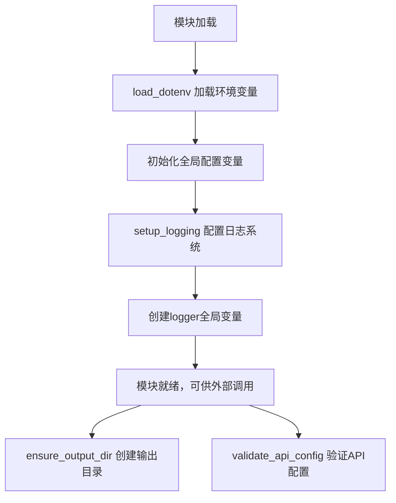
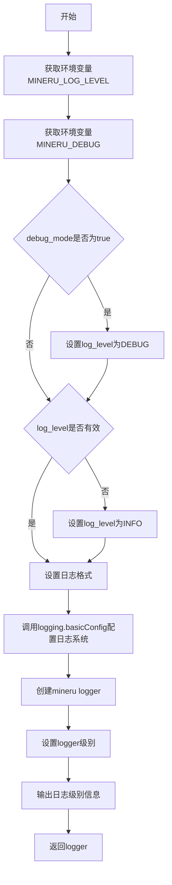
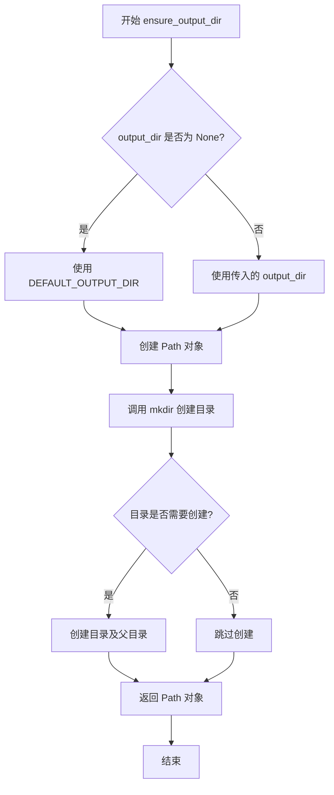
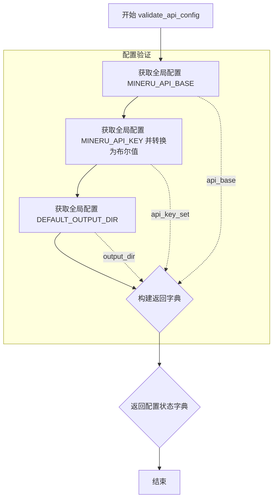

# `MinerU\projects\mcp\src\mineru\config.py` 详细设计文档

MinerU File转Markdown转换服务的配置工具模块，负责管理API配置、日志系统和输出目录等核心设置项，提供环境变量加载、配置验证和目录创建等辅助功能。

## 整体流程



## 类结构

```
无类定义 (纯配置模块)
├── 全局变量区
│   ├── API配置变量
│   ├── 日志变量
│   └── 目录变量
└── 全局函数区
    ├── setup_logging
    ├── ensure_output_dir
    └── validate_api_config
```

## 全局变量及字段


### `MINERU_API_BASE`
    
MinerU API服务的基地址，从环境变量读取，默认值为 https://mineru.net

类型：`str`
    


### `MINERU_API_KEY`
    
MinerU API认证密钥，从环境变量读取，用于API请求的身份验证

类型：`str`
    


### `USE_LOCAL_API`
    
是否使用本地API服务的开关，从环境变量转换而来，可选值为true/1/yes

类型：`bool`
    


### `LOCAL_MINERU_API_BASE`
    
本地MinerU API服务的基地址，从环境变量读取，默认值为 http://localhost:8080

类型：`str`
    


### `DEFAULT_OUTPUT_DIR`
    
文件转换后的默认输出目录，从环境变量读取，默认值为 ./downloads

类型：`str`
    


### `logger`
    
全局日志记录器实例，通过setup_logging函数初始化，用于记录应用程序运行日志

类型：`logging.Logger`
    


    

## 全局函数及方法


### `setup_logging`

该函数用于配置日志系统，通过读取环境变量`MINERU_LOG_LEVEL`和`MINERU_DEBUG`来动态设置日志级别，并返回一个配置好的`mineru`Logger实例。

参数：此函数无参数。

返回值：`logging.Logger`，返回配置好的日志记录器。

#### 流程图



#### 带注释源码

```python
def setup_logging():
    """
    设置日志系统，根据环境变量配置日志级别。

    Returns:
        logging.Logger: 配置好的日志记录器。
    """
    # 获取环境变量中的日志级别设置，默认为INFO
    log_level = os.getenv("MINERU_LOG_LEVEL", "INFO").upper()
    # 获取debug模式设置，转换为小写后判断是否为true/1/yes
    debug_mode = os.getenv("MINERU_DEBUG", "").lower() in ["true", "1", "yes"]

    # 如果设置了debug_mode，则覆盖log_level为DEBUG
    if debug_mode:
        log_level = "DEBUG"

    # 定义合法的日志级别列表
    valid_levels = ["DEBUG", "INFO", "WARNING", "ERROR", "CRITICAL"]
    # 确保log_level是有效的日志级别，否则默认为INFO
    if log_level not in valid_levels:
        log_level = "INFO"

    # 设置日志格式：时间 - Logger名称 - 级别 - 消息
    log_format = "%(asctime)s - %(name)s - %(levelname)s - %(message)s"

    # 配置logging模块的基础设置
    logging.basicConfig(level=getattr(logging, log_level), format=log_format)

    # 获取名为mineru的logger实例
    logger = logging.getLogger("mineru")
    # 设置logger的日志级别
    logger.setLevel(getattr(logging, log_level))

    # 输出当前日志级别配置信息
    logger.info(f"日志级别设置为: {log_level}")

    # 返回配置好的logger实例
    return logger
```


### `ensure_output_dir`

该函数用于确保指定的输出目录存在，如果目录不存在则创建它，是文件转换服务的基础设施保障函数。

参数：

- `output_dir`：`str | None`，输出目录的可选路径。如果为 `None`，则使用环境变量 `OUTPUT_DIR` 或默认值 `./downloads`。

返回值：`pathlib.Path`，返回表示输出目录的 Path 对象。

#### 流程图



#### 带注释源码

```python
def ensure_output_dir(output_dir=None):
    """
    确保输出目录存在。

    该函数接受一个可选的输出目录路径，如果未提供或为 None，
    则使用环境变量 OUTPUT_DIR 或默认值 ./downloads。
    使用 Path.mkdir 确保目录存在，parents=True 支持创建多级目录，
    exist_ok=True 避免目录已存在时抛出异常。

    Args:
        output_dir: 输出目录的可选路径。如果为 None，则使用 DEFAULT_OUTPUT_DIR。

    Returns:
        表示输出目录的 Path 对象。
    """
    # 使用短路运算符：如果 output_dir 为 None 或假值，则使用 DEFAULT_OUTPUT_DIR
    # DEFAULT_OUTPUT_DIR 来自环境变量 OUTPUT_DIR，默认为 "./downloads"
    output_path = Path(output_dir or DEFAULT_OUTPUT_DIR)
    
    # 创建目录：
    # - parents=True: 创建所有必要的父目录
    # - exist_ok=True: 如果目录已存在，不抛出异常
    output_path.mkdir(parents=True, exist_ok=True)
    
    # 返回 Path 对象，便于后续文件操作
    return output_path
```


### `validate_api_config`

该函数用于验证并返回当前 API 配置的状态，通过检查环境变量和配置常量，生成包含 API 基础地址、API 密钥设置状态和输出目录的配置状态字典，供调用方判断服务是否已正确配置。

参数：
- （无参数）

返回值：`dict`，返回包含 API 配置状态的字典，包含以下键值：
- `api_base`：API 基础地址（字符串）
- `api_key_set`：API 密钥是否已设置（布尔值）
- `output_dir`：默认输出目录（字符串）

#### 流程图



#### 带注释源码

```python
def validate_api_config():
    """
    验证是否已设置所需的 API 配置。

    Returns:
        dict: 配置状态。
    """
    # 从全局配置中获取 API 基础地址
    # MINERU_API_BASE: 从环境变量读取，默认值为 "https://mineru.net"
    api_base = MINERU_API_BASE
    
    # 将 API 密钥转换为布尔值，判断是否已设置
    # bool("") 为 False，表示未设置；bool("任意非空字符串") 为 True
    api_key_set = bool(MINERU_API_KEY)
    
    # 获取默认输出目录
    # DEFAULT_OUTPUT_DIR: 从环境变量读取，默认值为 "./downloads"
    output_dir = DEFAULT_OUTPUT_DIR
    
    # 构建并返回配置状态字典
    return {
        "api_base": api_base,           # API 服务的基础 URL 地址
        "api_key_set": api_key_set,     # API 密钥是否已配置的标志位
        "output_dir": output_dir,       # 文件转换后的输出目录路径
    }
```

## 关键组件


### 环境变量配置模块

负责从.env文件加载环境变量，提供API端点、API密钥、本地化开关和输出目录等配置项。

### 日志系统

提供可配置的日志记录功能，支持DEBUG、INFO、WARNING、ERROR、CRITICAL级别，可通过环境变量MINERU_LOG_LEVEL和MINERU_DEBUG控制。

### 输出目录管理

确保转换后的文件输出目录存在，不存在时自动创建，支持自定义目录路径。

### API配置验证

验证API服务的基础URL、密钥是否已正确配置，并返回当前配置状态供其他模块使用。


## 问题及建议


### 已知问题

-   **模块级副作用**：在模块导入时执行 `logger = setup_logging()`，导致日志系统在导入时就被初始化，后续难以动态调整配置。
-   **日志重复配置风险**：`logging.basicConfig()` 配置根 logger，随后又创建了 "mineru" 子 logger，可能导致日志输出重复或配置混乱。
-   **代码重复**：`.lower() in ["true", "1", "yes"]` 的布尔转换逻辑在 `USE_LOCAL_API` 和 `MINERU_DEBUG` 两处重复出现，未抽取为复用函数。
-   **缺少类型注解**：所有函数参数和返回值都缺少类型注解，降低了代码的可读性和可维护性。
-   **异常处理缺失**：`ensure_output_dir()` 中的目录创建操作没有异常处理，权限错误等情况会导致程序直接崩溃。
-   **API配置验证不足**：`validate_api_config()` 仅检查密钥是否存在，未验证密钥格式或 API 端点可达性。
-   **硬编码配置**：日志格式 `log_format` 是硬编码字符串，无法通过环境变量自定义配置。
-   **日志输出单一**：仅配置了控制台输出，未提供文件输出选项，生产环境调试困难。

### 优化建议

-   **移除模块级日志初始化**：将 `logger = setup_logging()` 移除，改为在需要时调用 `setup_logging()` 函数，或提供 `get_logger()` 函数延迟创建 logger。
-   **抽取布尔转换函数**：创建辅助函数如 `_str_to_bool()`，统一处理环境变量到布尔值的转换。
-   **添加类型注解**：为所有函数参数和返回值添加明确的类型注解，提升代码可读性。
-   **增强异常处理**：在 `ensure_output_dir()` 中捕获 `OSError` 异常，提供有意义的错误信息。
-   **增强配置验证**：`validate_api_config()` 可增加 API 端点 URL 格式验证和连接测试。
-   **配置日志格式环境变量**：添加 `MINERU_LOG_FORMAT` 环境变量支持自定义日志格式。
-   **支持日志文件输出**：添加 `MINERU_LOG_FILE` 环境变量，支持将日志输出到文件。
-   **添加配置校验函数**：创建 `validate_all_config()` 函数，在服务启动前进行完整配置校验。


## 其它


### 设计目标与约束

本配置工具的设计目标是集中管理MinerU转换服务的所有配置项，包括API端点、日志级别、输出目录等，支持本地/远程API切换，通过环境变量实现配置管理，满足12-Factor App配置分离原则。约束包括：必须从.env文件加载敏感信息（如API Key），API Key不能硬编码，日志级别必须为有效值，输出目录必须可创建。

### 错误处理与异常设计

环境变量读取异常：若.env文件不存在或格式错误，load_dotenv()会静默失败，使用默认值。日志级别无效：当MINERU_LOG_LEVEL设置为非法值时，默认回退到INFO级别。目录创建失败：ensure_output_dir()使用parents=True和exist_ok=True，确保多层目录创建且不抛异常，若磁盘满或权限不足会抛出OSError，由调用方处理。API配置验证：validate_api_config()返回字典而非抛出异常，调用方需根据api_key_set字段判断是否已配置。

### 外部依赖与接口契约

外部依赖包括：dotenv库（用于加载.env文件）、pathlib.Path（标准库）、logging（标准库）、os（标准库）。接口契约：setup_logging()返回logging.Logger对象；ensure_output_dir()接受可选output_dir参数，返回Path对象；validate_api_config()返回包含api_base、api_key_set、output_dir字段的字典。所有函数在模块导入时即执行初始化操作（setup_logging在模块加载时调用），需注意导入顺序带来的副作用。

### 配置文件格式

本模块使用.env文件作为配置源，支持的变量清单：MINERU_API_BASE（API服务地址，默认为https://mineru.net）、MINERU_API_KEY（API密钥，无默认值）、USE_LOCAL_API（是否使用本地API，默认为false）、LOCAL_MINERU_API_BASE（本地API地址，默认为http://localhost:8080）、OUTPUT_DIR（输出目录，默认为./downloads）、MINERU_LOG_LEVEL（日志级别，默认为INFO）、MINERU_DEBUG（调试模式，默认为false）。

### 安全性考虑

API Key存储：敏感信息通过环境变量管理，不写入代码仓库。日志脱敏：当前实现未对日志中的敏感信息进行脱敏处理，建议后续版本对API Key等敏感字段进行掩码处理。.env文件应加入.gitignore防止提交到版本控制系统。

### 性能考虑

配置加载在模块导入时完成，无运行时性能开销。日志系统使用Python内置logging模块，性能良好。目录创建使用exist_ok=True避免重复检查文件系统。


    