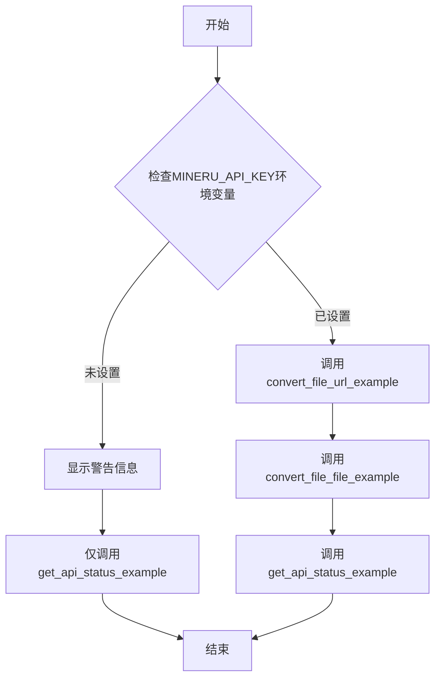
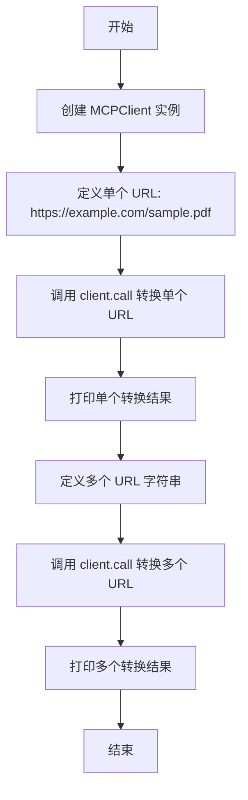
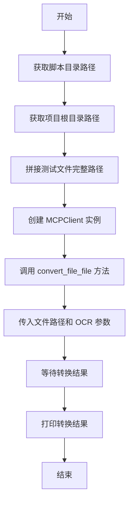
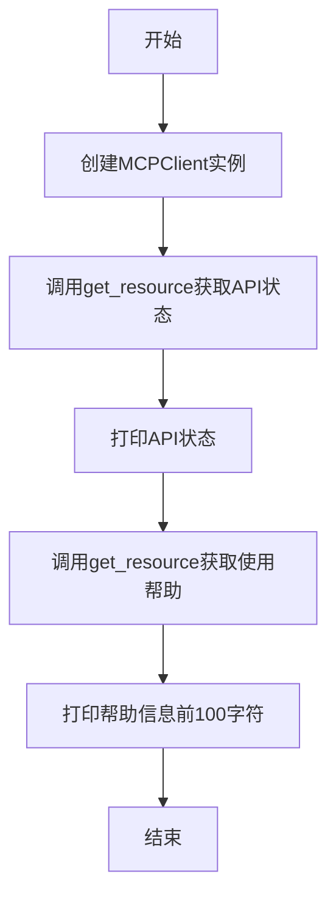
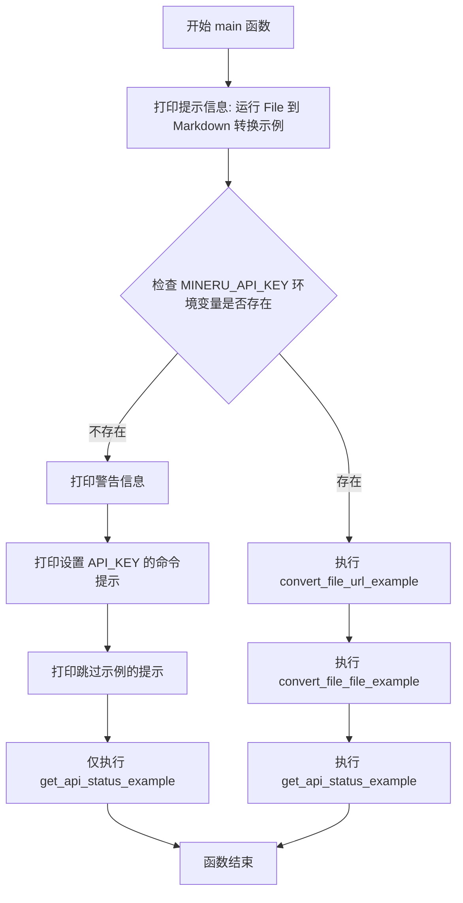

# `MinerU\projects\mcp\src\mineru\examples.py` 详细设计文档

演示如何使用 MinerU File转Markdown客户端的示例代码，展示了从URL转换文件和从本地文件转换的功能，以及获取API状态的方法

## 整体流程



## 类结构

```
本文件为脚本文件，无类定义
主要依赖MCPClient类进行API调用
```

## 全局变量及字段


### `os`
    
Python标准库操作系统接口模块，用于文件和路径操作

类型：`module`
    


### `asyncio`
    
Python标准库异步IO模块，用于编写异步代码

类型：`module`
    


### `MCPClient`
    
MinerU MCP客户端类，用于与MCP服务器通信并调用转换功能

类型：`class`
    


### `script_dir`
    
当前Python脚本所在的目录路径

类型：`str`
    


### `project_root`
    
项目根目录的绝对路径

类型：`str`
    


### `test_file_path`
    
测试PDF文件的完整路径

类型：`str`
    


### `client`
    
MCPClient的实例对象，用于发起API调用

类型：`MCPClient`
    


### `result`
    
存储文件转换或API调用的返回结果

类型：`Any`
    


### `urls`
    
包含多个待转换文件URL的字符串，以换行分隔

类型：`str`
    


### `status`
    
存储API状态查询的返回信息

类型：`Any`
    


### `help_text`
    
存储使用帮助文档的文本内容

类型：`Any`
    


    

## 全局函数及方法


### `convert_file_url_example`

从 URL 转换 File 的示例函数，演示如何使用 MCPClient 调用远程服务将 PDF 文件从 URL 转换为 Markdown 格式，支持单文件和批量转换。

参数：

- 该函数无参数

返回值：`None`，该函数没有显式返回值，仅执行打印操作输出转换结果

#### 流程图



#### 带注释源码

```python
async def convert_file_url_example():
    """从 URL 转换 File 的示例。"""
    
    # 初始化 MCPClient，连接到本地服务器
    client = MCPClient("http://localhost:8000")

    # 定义单个文件 URL
    # 示例使用 PDF 文件
    url = "https://example.com/sample.pdf"
    
    # 调用远程 convert_file_url 方法进行转换
    # enable_ocr=True 启用光学字符识别功能
    result = await client.call(
        "convert_file_url", url=url, enable_ocr=True
    )
    # 输出转换结果
    print(f"转换结果: {result}")

    # 定义多个 URL，用换行符分隔
    urls = """
    https://example.com/doc1.pdf
    https://example.com/doc2.pdf
    """
    
    # 批量转换多个文件 URL
    # 同样启用 OCR 功能
    result = await client.call("convert_file_url", url=urls, enable_ocr=True)
    # 输出批量转换结果
    print(f"多个转换结果: {result}")
```


### `convert_file_file_example`

转换本地 File 文件的示例函数，通过 MCP 客户端调用 MinerU 服务将本地 PDF 文件转换为 Markdown 格式。

参数：

- （无）

返回值：`None`，该函数为异步示例函数，不返回具体值，结果通过打印输出

#### 流程图



#### 带注释源码

```python
async def convert_file_file_example():
    """转换本地 File 文件的示例。"""
    # 创建 MCPClient 客户端实例，连接到本地 8000 端口的服务
    client = MCPClient("http://localhost:8000")

    # 获取当前脚本文件的目录绝对路径
    # __file__ 表示当前文件路径，os.path.dirname 获取目录部分
    script_dir = os.path.dirname(os.path.abspath(__file__))
    
    # 获取项目根目录路径（向上三级目录）
    # 从脚本目录 -> 上级目录 -> 项目根目录
    project_root = os.path.dirname(os.path.dirname(os.path.dirname(script_dir)))
    
    # 拼接完整的测试 PDF 文件路径
    # 路径格式: {项目根目录}/test_files/test.pdf
    test_file_path = os.path.join(project_root, "test_files", "test.pdf")

    # 调用 MCP 客户端的 call 方法执行文件转换
    # 参数:
    #   - file_path: 要转换的本地文件完整路径
    #   - enable_ocr: 是否启用 OCR 识别文字
    result = await client.call(
        "convert_file_file", file_path=test_file_path, enable_ocr=True
    )
    
    # 打印转换结果
    print(f"文件转换结果: {result}")
```


### `get_api_status_example`

获取 API 状态的示例函数，通过 MCPClient 连接本地服务并查询 API 状态及使用帮助信息。

参数：暂无参数

返回值：`None`，该函数没有返回值，仅通过 `print` 输出状态信息

#### 流程图



#### 带注释源码

```python
async def get_api_status_example():
    """获取 API 状态的示例。"""
    # 创建MCPClient客户端实例，连接到本地8000端口的服务
    client = MCPClient("http://localhost:8000")

    # 获取 API 状态
    # 调用get_resource方法查询status://api资源
    status = await client.get_resource("status://api")
    # 打印返回的API状态信息
    print(f"API 状态: {status}")

    # 获取使用帮助
    # 调用get_resource方法查询help://usage资源
    help_text = await client.get_resource("help://usage")
    # 打印帮助信息，仅显示前100个字符以避免输出过长
    print(f"使用帮助: {help_text[:100]}...")  # 显示前 100 个字符
```


### `main`

该函数是整个示例脚本的入口点，负责检查 API 密钥环境变量，根据是否配置了 `MINERU_API_KEY` 来决定执行全部示例（转换 URL、转换本地文件、获取 API 状态）或仅获取 API 状态。

参数： 无

返回值：`None`，无返回值（异步函数）

#### 流程图



#### 带注释源码

```python
async def main():
    """运行所有示例。
    
    该函数作为示例脚本的入口点，负责协调各个示例函数的执行。
    根据是否设置了 MINERU_API_KEY 环境变量，决定运行全部示例还是仅获取 API 状态。
    """
    # 打印脚本启动提示信息
    print("运行 File 到 Markdown 转换示例...")

    # 检查是否设置了 API_KEY
    # MINERU_API_KEY 是调用 MinerU 服务所需的认证密钥
    if not os.environ.get("MINERU_API_KEY"):
        # 环境变量未设置，打印警告信息提示用户
        print("警告: MINERU_API_KEY 环境变量未设置。")
        print("使用以下命令设置: export MINERU_API_KEY=your_api_key")
        print("跳过需要 API 访问的示例...")

        # 由于缺少 API 密钥，仅获取 API 状态（可能不需要认证）
        await get_api_status_example()
    else:
        # API 密钥已设置，运行完整的示例流程
        
        # 示例1: 从 URL 转换文件（支持单个或多个 URL）
        await convert_file_url_example()
        
        # 示例2: 转换本地文件
        await convert_file_file_example()
        
        # 示例3: 获取 API 状态和使用帮助
        await get_api_status_example()
```

## 关键组件


### MCPClient

远程MCP服务器客户端，用于调用文件转换服务

### convert_file_url_example

从URL转换文件的异步示例函数，支持单文件和批量转换

### convert_file_file_example

转换本地PDF文件到Markdown的异步示例函数

### get_api_status_example

获取API状态和帮助文档的异步示例函数

### main

主入口函数，协调所有示例的执行和环境变量检查

### MINERU_API_KEY

环境变量配置，用于API身份验证

### asyncio异步模式

基于Python asyncio的异步编程框架，支持并发文件转换请求

## 问题及建议


### 已知问题

- **硬编码的服务器地址**: `"http://localhost:8000"` 被硬编码在多个位置，不利于多环境部署和配置管理
- **缺乏完整的错误处理**: 代码中没有任何 try-except 块，无法捕获和处理网络异常、API 错误或文件访问错误
- **不完善的 API Key 验证**: 仅在启动时检查 `MINERU_API_KEY` 是否存在，但没有处理认证失败或 API 返回错误的情况
- **路径计算方式脆弱**: 通过多次 `os.path.dirname` 嵌套来定位测试文件，当目录结构变化时容易导致路径错误
- **使用 print 进行日志记录**: 缺乏日志级别控制，不利于生产环境的调试和问题追踪
- **客户端实例未复用**: 每个示例函数都独立创建 `MCPClient` 实例，增加连接开销
- **异步调用缺少超时设置**: 所有 `await` 调用都没有设置超时时间，可能导致请求无限期等待
- **URL 参数传递方式不当**: 将多行字符串直接作为 URL 参数传递，解析逻辑不明确
- **返回值缺乏状态处理**: 直接打印结果，未对不同响应状态或错误进行区分处理
- **缺少类型注解**: 函数参数和返回值没有类型提示，降低代码可读性和可维护性

### 优化建议

- 将服务器地址抽取为环境变量或配置文件参数，支持多环境切换
- 为所有异步调用添加超时控制，使用 `asyncio.wait_for` 或客户端内置超时参数
- 引入 `logging` 模块替代 print，设置合理的日志级别
- 实现客户端连接复用或单例模式，减少连接开销
- 使用结构化方式传递多 URL（如列表），而非多行字符串
- 添加完整的异常捕获和错误处理机制，对不同错误类型进行区分处理
- 为所有函数添加类型注解，提升代码可读性和静态检查能力
- 将测试文件路径获取逻辑封装为独立的辅助函数，提高可测试性
- 添加重试机制应对临时性网络故障

## 其它


### 设计目标与约束

**设计目标**：演示如何使用MinerU MCP客户端将各种来源的File（URL或本地文件）转换为Markdown格式，并提供API状态查询功能。

**约束条件**：
- 依赖MCPClient类与远程服务器通信（默认localhost:8000）
- 需要设置MINERU_API_KEY环境变量才能调用转换功能
- 所有网络请求均为异步操作
- 仅支持PDF文件的转换（从示例中的test.pdf推断）

### 错误处理与异常设计

**环境变量缺失处理**：
- 检测到MINERU_API_KEY未设置时，打印警告信息并跳过需要认证的示例
- 仅执行不需要API密钥的get_api_status_example

**网络异常处理**：
- MCPClient.call()和get_resource()可能抛出连接错误
- 示例中未显式捕获异常，实际使用需添加try-except块

**文件路径异常处理**：
- test_file_path通过动态计算可能存在路径不存在的情况
- 建议添加os.path.exists()检查

### 数据流与状态机

**主流程状态机**：
1. START → 检查环境变量
2. 有API_KEY → 依次执行URL转换、文件转换、状态查询
3. 无API_KEY → 仅执行状态查询
4. END

**数据流向**：
- 环境变量 → API密钥传递
- 用户输入(URL/文件路径) → MCPClient.call() → 远程服务器 → 结果返回 → print输出

### 外部依赖与接口契约

**外部依赖**：
- mcp.client.MCPClient：MCP协议客户端库
- os：路径处理和环境变量读取
- asyncio：异步编程支持

**接口契约**：
- MCPClient(url)：构造函数，接受服务器地址
- client.call(method, **kwargs)：调用远程方法，返回结果字典
- client.get_resource(uri)：获取资源，返回状态或帮助文本

### 性能考虑

- 异步并发：多个转换示例串行执行，可改为asyncio.gather()并行处理
- 网络延迟：依赖远程服务器响应时间
- 大文件处理：PDF文件大小影响转换速度

### 安全性考虑

- API密钥以环境变量形式传递，避免硬编码
- 警告提示用户设置API_KEY
- 未实现请求超时配置

### 配置管理

- 服务器地址硬编码为"http://localhost:8000"
- API密钥从环境变量MINERU_API_KEY读取
- enable_ocr参数默认为True

### 部署要求

- Python 3.7+（支持asyncio）
- 安装mcp客户端库
- 配置MINERU_API_KEY环境变量
- MCP服务器需运行在localhost:8000

### 测试策略

- 单元测试：模拟MCPClient返回值
- 集成测试：需要运行的MCP服务器
- 测试文件：项目根目录test_files/test.pdf


    