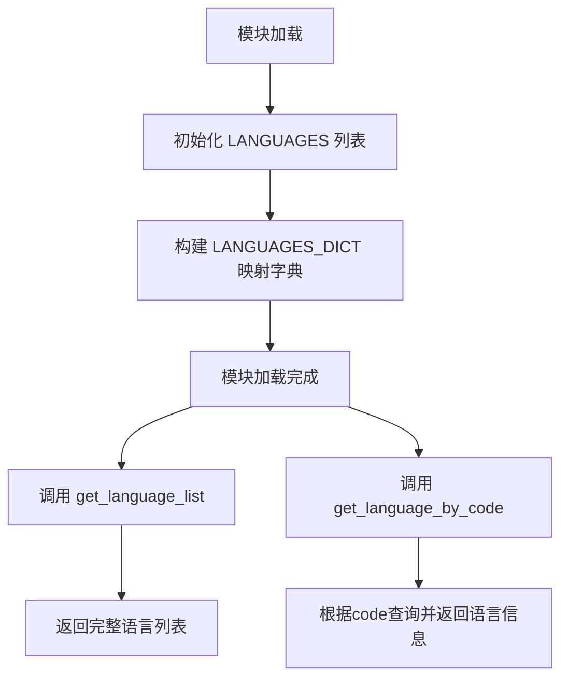
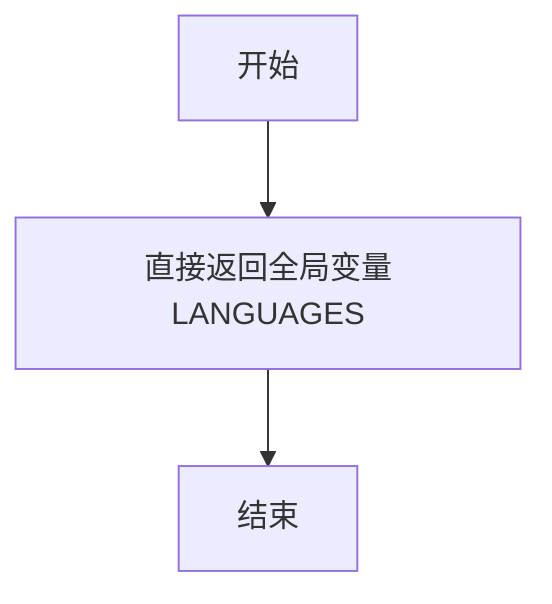
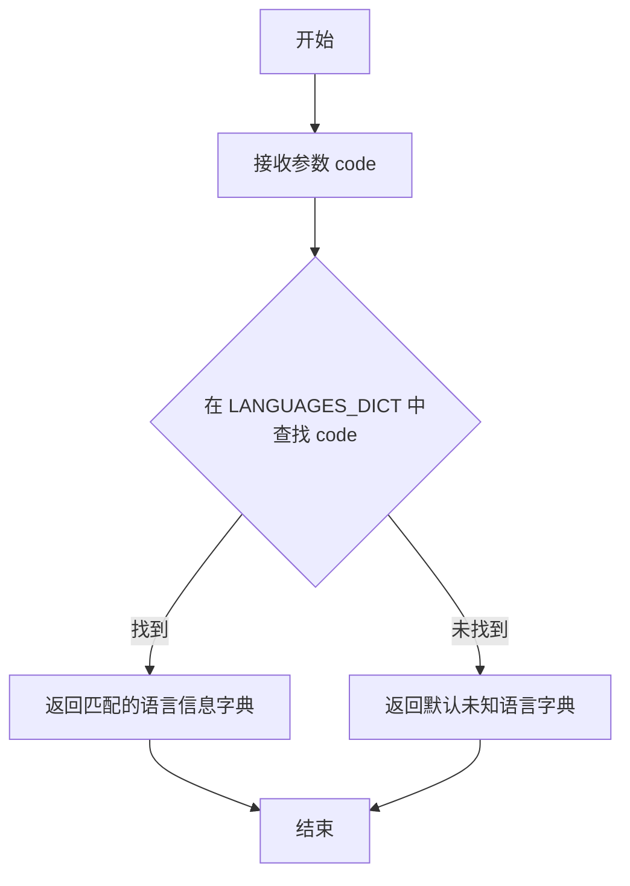

# `MinerU\projects\mcp\src\mineru\language.py` 详细设计文档

MinerU项目支持的语言定义模块，包含一个语言列表常量和两个辅助函数，用于获取语言列表和根据语言代码查询语言信息。

## 整体流程



## 类结构

```
无类结构 - 该文件为纯数据定义模块
```

## 全局变量及字段


### `LANGUAGES`
    
支持的语言列表，每个元素包含语言名称、描述和代码信息

类型：`List[Dict[str, str]]`
    


### `LANGUAGES_DICT`
    
语言代码到语言信息的映射字典，用于快速查找特定语言

类型：`Dict[str, Dict[str, str]]`
    


    

## 全局函数及方法


### `get_language_list`

获取所有支持的语言列表，返回一个包含所有语言信息的列表。

参数：

- （无参数）

返回值：`List[Dict[str, str]]`，返回支持的语言列表，每个元素是一个包含语言名称(name)、描述(description)和代码(code)的字典。

#### 流程图



#### 带注释源码

```python
def get_language_list() -> List[Dict[str, str]]:
    """获取所有支持的语言列表。
    
    Returns:
        List[Dict[str, str]]: 包含所有支持语言的列表，每项包含name、description和code字段
    """
    return LANGUAGES
```


### `get_language_by_code`

根据传入的语言代码，在预构建的语言字典中查找对应的语言信息并返回。如果未找到匹配的语言代码，则返回一个默认的"未知"语言信息字典。

参数：

- `code`：`str`，语言代码（如 "en"、"zh"、"fr" 等）

返回值：`Dict[str, str]`，包含语言名称(name)、描述(description)和代码(code)的字典

#### 流程图



#### 带注释源码

```python
def get_language_by_code(code: str) -> Dict[str, str]:
    """根据语言代码获取语言信息。
    
    Args:
        code: 语言代码，如 'en', 'zh', 'fr' 等
        
    Returns:
        包含语言信息的字典，格式为 {'name': str, 'description': str, 'code': str}
        如果未找到对应代码，则返回 {'name': '未知', 'description': 'Unknown', 'code': 原始code}
    """
    # 使用预构建的 LANGUAGES_DICT 字典进行快速查找
    # LANGUAGES_DICT 是以语言代码为键，语言信息字典为值的映射
    return LANGUAGES_DICT.get(
        code,  # 要查找的语言代码
        # 未找到时的默认值：未知语言
        {"name": "未知", "description": "Unknown", "code": code}
    )
```

## 关键组件


### LANGUAGES

全局常量，存储MinerU支持的所有语言列表，每个语言包含name（语言名称）、description（描述）和code（语言代码）三个字段。

### LANGUAGES_DICT

全局字典，以语言代码为键，语言信息字典为值，用于O(1)时间复杂度的快速语言查找。

### get_language_list()

全局函数，无参数输入，返回List[Dict[str, str]]类型，返回所有支持的语言列表。

### get_language_by_code()

全局函数，根据传入的语言代码code参数，查询并返回对应语言的信息字典，若未找到则返回默认的"未知"语言信息。


## 问题及建议


### 已知问题

-   **数据重复**：存在两条完全相同的语言记录（"阿瓦尔文"/"Avar"/"ava"），分别位于第118和119行
-   **语言代码不规范**：语言代码（code字段）缺乏统一标准，部分使用双字母缩写（如"ch"、"en"），部分使用英文全词（如"german"、"japan"、"korean"），部分使用下划线命名（如"chinese_cht"、"rs_latin"），与ISO 639-1/2标准不符（如"german"应为"de"，"japan"应为"ja"）
-   **硬编码数据**：所有语言数据直接硬编码在源代码中，扩展性差，每次添加新语言需修改代码
-   **缺乏类型安全**：使用Dict[str, str]泛型定义，未使用Literal或Enum限制code的可能值，无法在编译期校验语言代码有效性
-   **功能单一**：当前仅支持静态查询，缺少语言过滤、按条件搜索等扩展功能

### 优化建议

-   **消除重复数据**：删除重复的"阿瓦尔文"记录
-   **统一语言代码标准**：将所有语言代码迁移至ISO 639-1标准（如将"german"改为"de"，"japan"改为"ja"，"chinese_cht"改为"zh_TW"），或采用统一的命名规范
-   **引入类型定义**：使用Python 3.8+的Literal类型或Enum类定义语言代码常量，提升类型安全和IDE支持
-   **支持外部配置**：将语言数据迁移至JSON/YAML配置文件，通过配置管理加载，支持运行时扩展
-   **扩展查询功能**：增加按名称搜索、过滤支持、验证语言代码有效性等辅助函数
-   **添加文档注释**：为每种语言补充文档说明其使用场景和来源标准

## 其它


### 设计目标与约束

本模块作为MinerU项目的语言配置模块，目标是提供统一的多语言支持列表，并实现高效的语言信息查询功能。约束方面，该模块仅依赖Python标准库typing模块，确保在各种Python环境中可移植，不引入外部依赖。

### 错误处理与异常设计

代码采用防御式编程策略。在get_language_by_code函数中，当传入的语言代码不存在时，不抛出异常，而是返回一个包含"未知"信息的默认字典。这种设计避免了因语言代码错误导致程序中断，同时保证调用方能够继续正常执行。模块未定义自定义异常类，因为当前场景下使用默认值返回更为合适。

### 数据流与状态机

数据流较为简单：初始化时LANGUAGES列表被加载到内存，同时LANGUAGES_DICT字典根据LANGUAGES列表构建，形成主从关系。两个查询函数get_language_list和get_language_by_code都从内存中读取数据，不涉及状态变更，属于无状态的纯数据提供模块。

### 外部依赖与接口契约

本模块仅依赖typing模块的Dict和List类型提示，属于Python标准库，无需额外安装。接口契约包括：get_language_list返回List[Dict[str, str]]类型，get_language_by_code接收str类型的code参数并返回Dict[str, str]类型。所有返回的语言信息字典都包含name、description、code三个键。

### 性能考虑

LANGUAGES_DICT字典的构建实现了O(n)时间复杂度的初始化，将后续查询操作优化为O(1)时间复杂度。对于大规模语言代码查询场景，这种预计算空间换时间的策略是合理的。模块级别变量在导入时执行初始化，后续调用无额外开销。

### 可维护性与扩展性

当前存在数据冗余问题：第120行和第121行都定义了"阿瓦尔文"(Avar)，code为"ava"。这可能导致维护困惑。添加新语言时需要在LANGUAGES列表中追加元素，LANGUAGES_DICT会自动同步，无需手动维护。代码采用字典列表结构，便于未来扩展更多语言属性。

### 测试策略建议

建议为该模块编写单元测试，测试用例包括：验证LANGUAGES列表长度与LANGUAGES_DICT键数量一致、验证所有语言代码唯一、验证get_language_by_code对已知代码返回正确信息、验证对未知代码返回默认"未知"信息、验证LANGUAGES_DICT包含所有LANGUAGES中的代码。

### 版本兼容性

代码使用Python 3.6+的字典推导式语法，依赖typing模块（Python 3.5+标准库）。建议在项目 Requirements中明确Python版本要求为3.6及以上，以确保模块正常运行。

### 国际化与本地化说明

虽然模块定义了多语言列表，但description字段目前仅提供英文描述。若MinerU面向多语言用户群体，后续可考虑将description也实现为多语言支持，或使用语言代码作为key关联到独立的国际化资源文件。

### 代码质量观察

模块存在一处重复定义：第120行和第121行定义了相同的"阿瓦尔文"(Avar)语言，建议删除重复项。此外，代码缺少模块级文档字符串，建议在文件开头添加模块功能说明，提升代码可读性和可维护性。


    