# `MinerU\projects\mcp\src\mineru\server.py` 详细设计文档

一个基于FastMCP框架实现的文档转换服务，提供将PDF、Word、PPT及图片等文件转换为Markdown格式的能力，支持本地API和远程API两种模式，具备OCR识别、多文件批量处理和SSE/STDIO/Streamable-HTTP多种通信方式。

## 整体流程

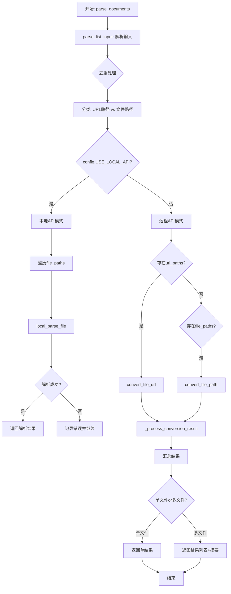

## 类结构

```
FastMCP (第三方框架)
└── mcp (FastMCP实例: MinerU File to Markdown Conversion)

MinerUClient (来自 api 模块)
└── 负责与MinerU服务通信
```

## 全局变量及字段


### `mcp`
    
FastMCP服务器实例，提供文档转Markdown的MCP工具服务

类型：`FastMCP`
    


### `_client_instance`
    
MinerUClient的单例实例，用于与MinerU API通信处理文件转换

类型：`Optional[MinerUClient]`
    


### `output_dir`
    
Markdown文件的输出目录，默认为config.DEFAULT_OUTPUT_DIR

类型：`str`
    


### `FastMCP.name`
    
MCP服务器的名称，此处为'MinerU File to Markdown Conversion'

类型：`str`
    


### `FastMCP.instructions`
    
MCP服务器的指令说明，描述了文档转换工具的功能和支持的文件格式

类型：`str`
    
    

## 全局函数及方法


### `create_starlette_app`

创建用于SSE（Server-Sent Events）传输的Starlette应用实例，配置MCP服务器的路由和消息处理机制。

参数：

- `mcp_server`：`Any`，MCP服务器实例，用于处理SSE连接和MCP协议通信
- `debug`：`bool`，是否启用调试模式，默认为False

返回值：`Starlette`，配置好的Starlette应用实例，包含SSE端点和消息处理路由

#### 流程图

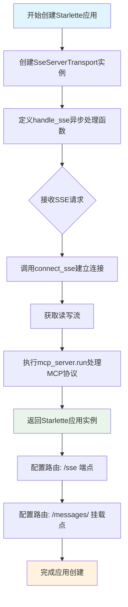

#### 带注释源码

```python
def create_starlette_app(mcp_server, *, debug: bool = False) -> Starlette:
    """创建用于SSE传输的Starlette应用。

    该函数创建了一个Starlette应用，用于通过Server-Sent Events (SSE)
    传输方式来处理MCP（Model Context Protocol）服务器的通信。
    应用配置了两个主要路由：
    1. /sse - 用于客户端建立SSE连接
    2. /messages/ - 用于接收客户端发送的POST消息

    Args:
        mcp_server: MCP服务器实例，负责处理MCP协议的读写和初始化
        debug: 是否启用调试模式，启用后会显示详细的错误信息

    Returns:
        Starlette: 配置好的Starlette应用实例，包含SSE和消息处理路由
    """
    # 创建SSE服务器传输对象，指定消息路径为 "/messages/"
    # SseServerTransport 负责管理SSE连接的生命周期
    sse = SseServerTransport("/messages/")

    async def handle_sse(request: Request) -> None:
        """处理SSE连接请求。
        
        这是一个异步请求处理器，负责：
        1. 接收客户端的SSE连接请求
        2. 建立与客户端的双向通信流
        3. 运行MCP服务器处理协议消息
        """
        # 使用上下文管理器建立SSE连接
        # connect_sse 方法会返回一个异步上下文管理器
        # 包含 (read_stream, write_stream) 两个流对象
        async with sse.connect_sse(
            request.scope,      # 请求的ASGI作用域
            request.receive,    # 接收消息的协程
            request._send,      # 发送消息的方法
        ) as (read_stream, write_stream):
            # 执行MCP服务器的运行循环
            # 处理初始化选项和协议消息的读写
            await mcp_server.run(
                read_stream,                           # 读取客户端消息
                write_stream,                          # 写入响应消息
                mcp_server.create_initialization_options(),  # 创建初始化选项
            )

    # 返回配置好的Starlette应用实例
    # 配置了两个路由：
    # 1. Route("/sse", endpoint=handle_sse) - GET请求，建立SSE连接
    # 2. Mount("/messages/", app=sse.handle_post_message) - POST请求，接收消息
    return Starlette(
        debug=debug,                                    # 调试模式开关
        routes=[
            # 注册SSE端点，客户端通过访问 /sse 建立持久连接
            Route("/sse", endpoint=handle_sse),
            # 挂载消息处理应用，接收POST请求格式的MCP消息
            Mount("/messages/", app=sse.handle_post_message),
        ],
    )
```


### `run_server`

运行 FastMCP 服务器，根据指定模式启动不同的服务器类型（STDIO、SSE 或 Streamable HTTP），并管理服务器生命周期。

参数：

- `mode`：`Optional[str]`，运行模式，支持 "stdio"、"sse"、"streamable-http"，默认为 None（STDIO 模式）
- `port`：`int`，服务器端口，默认为 8001，仅在 HTTP 模式（SSE/streamable-http）下有效
- `host`：`str`，服务器主机地址，默认为 "127.0.0.1"，仅在 HTTP 模式下有效

返回值：`None`，该函数无返回值，通过日志输出和异常处理完成服务器启动与资源清理

#### 流程图

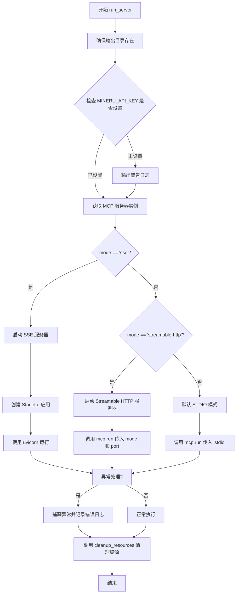

#### 带注释源码

```python
def run_server(mode=None, port=8001, host="127.0.0.1"):
    """运行 FastMCP 服务器。

    Args:
        mode: 运行模式，支持stdio、sse、streamable-http
        port: 服务器端口，默认为8001，仅在HTTP模式下有效
        host: 服务器主机地址，默认为127.0.0.1，仅在HTTP模式下有效
    """
    # 确保输出目录存在
    config.ensure_output_dir(output_dir)

    # 检查是否设置了 API 密钥
    if not config.MINERU_API_KEY:
        config.logger.warning("警告: MINERU_API_KEY 环境变量未设置。")
        config.logger.warning("使用以下命令设置: export MINERU_API_KEY=your_api_key")

    # 获取MCP服务器实例
    mcp_server = mcp._mcp_server

    try:
        # 运行服务器
        if mode == "sse":
            config.logger.info(f"启动SSE服务器: {host}:{port}")
            starlette_app = create_starlette_app(mcp_server, debug=True)
            uvicorn.run(starlette_app, host=host, port=port)
        elif mode == "streamable-http":
            config.logger.info(f"启动Streamable HTTP服务器: {host}:{port}")
            # 在HTTP模式下传递端口参数
            mcp.run(mode, port=port)
        else:
            # 默认stdio模式
            config.logger.info("启动STDIO服务器")
            mcp.run(mode or "stdio")
    except Exception as e:
        config.logger.error(f"\n❌ 服务异常退出: {str(e)}")
        traceback.print_exc()
    finally:
        # 清理资源
        cleanup_resources()
```


### `cleanup_resources`

清理全局资源，包括关闭客户端连接等操作。

参数： 无

返回值：`None`，无返回值

#### 流程图

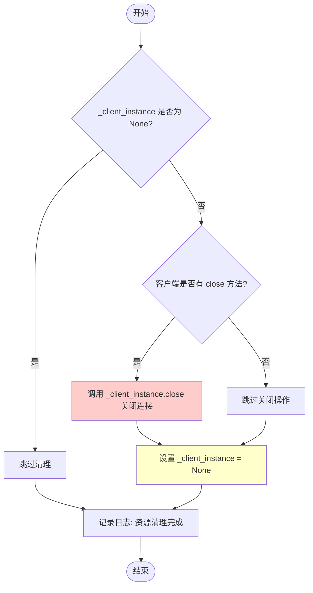

#### 带注释源码

```python
def cleanup_resources():
    """清理全局资源。"""
    # 声明使用全局变量 _client_instance
    global _client_instance
    
    # 检查客户端实例是否存在
    if _client_instance is not None:
        try:
            # 如果客户端有close方法，调用它
            if hasattr(_client_instance, "close"):
                _client_instance.close()
        except Exception as e:
            # 捕获清理过程中的异常并记录错误日志
            config.logger.error(f"清理客户端资源时出错: {str(e)}")
        finally:
            # 无论是否成功关闭，都将客户端实例置为None
            _client_instance = None
    
    # 记录资源清理完成的信息
    config.logger.info("资源清理完成")
```


### `get_client`

获取 MinerUClient 的单例实例。如果尚未初始化，则进行初始化。该函数采用单例模式确保全局只有一个 MinerUClient 实例，避免重复创建客户端带来的资源开销。

参数：

- 无

返回值：

- `MinerUClient`：MinerUClient 的单例实例

#### 流程图


#### 带注释源码

```python
def get_client() -> MinerUClient:
    """获取 MinerUClient 的单例实例。如果尚未初始化，则进行初始化。
    
    该函数实现了单例模式，确保全局只有一个 MinerUClient 实例。
    首次调用时创建实例，后续调用直接返回已创建的实例。
    
    Returns:
        MinerUClient: MinerUClient的单例实例
    """
    global _client_instance  # 声明使用全局变量
    if _client_instance is None:  # 检查实例是否已初始化
        _client_instance = MinerUClient()  # 首次调用时创建实例
    return _client_instance  # 返回单例实例
```

---

## 补充信息

### 1. 文件的整体运行流程

该文件是 **MinerU File转Markdown转换的FastMCP服务器实现**，主要流程如下：

1. **服务器初始化**：通过 `run_server()` 函数启动 FastMCP 服务器，支持三种模式（stdio、sse、streamable-http）
2. **客户端管理**：通过 `get_client()` 获取 `MinerUClient` 单例实例
3. **文件处理**：提供 `parse_documents()` 统一入口，支持本地文件和URL的转换
4. **结果读取**：自动查找并读取转换后的Markdown文件内容

### 2. 全局变量信息

| 变量名 | 类型 | 描述 |
|--------|------|------|
| `_client_instance` | `Optional[MinerUClient]` | MinerUClient 的全局单例实例 |
| `output_dir` | `str` | Markdown文件的输出目录 |
| `mcp` | `FastMCP` | FastMCP 服务器实例 |

### 3. 关键组件信息

| 组件名称 | 描述 |
|----------|------|
| `MinerUClient` | MinerU API 客户端，用于处理文件转换 |
| `FastMCP` | MCP服务器框架，提供工具暴露能力 |
| `parse_documents` | 核心工具函数，统一处理文件和URL转换 |
| `get_client` | 单例获取函数，管理客户端实例生命周期 |

### 4. 潜在的技术债务或优化空间

1. **单例模式的线程安全性**：`get_client()` 函数在多线程环境下可能存在竞态条件，建议使用线程锁（如 `threading.Lock`）保护实例化过程
2. **全局状态管理**：使用 `global` 关键字管理状态不利于测试，建议考虑依赖注入方式
3. **资源清理时机**：`cleanup_resources()` 在服务器异常时可能未被调用，建议使用上下文管理器或信号处理确保资源释放

### 5. 其它项目

#### 设计目标与约束

- 支持多种文件格式：PDF、Word、PPT、图片（JPG、PNG、JPEG）
- 支持本地文件和远程URL两种处理方式
- 支持stdio、SSE、Streamable HTTP三种服务器模式

#### 错误处理与异常设计

- 全局异常捕获并记录日志
- 对每种输入格式（字符串、字典、JSON）进行容错处理
- 返回结构化的成功/失败状态字典

#### 数据流与状态机

```
输入 → parse_list_input() 解析 → 分类(URL/文件路径) 
    → convert_file_url/convert_file_path 处理 
    → find_and_read_markdown_content 读取结果 
    → 返回最终内容
```


### `set_output_dir`

设置转换后文件的输出目录，更新全局变量并确保输出目录存在。

参数：

- `dir_path`：`str`，新的输出目录路径

返回值：`str`，设置后的输出目录路径

#### 流程图

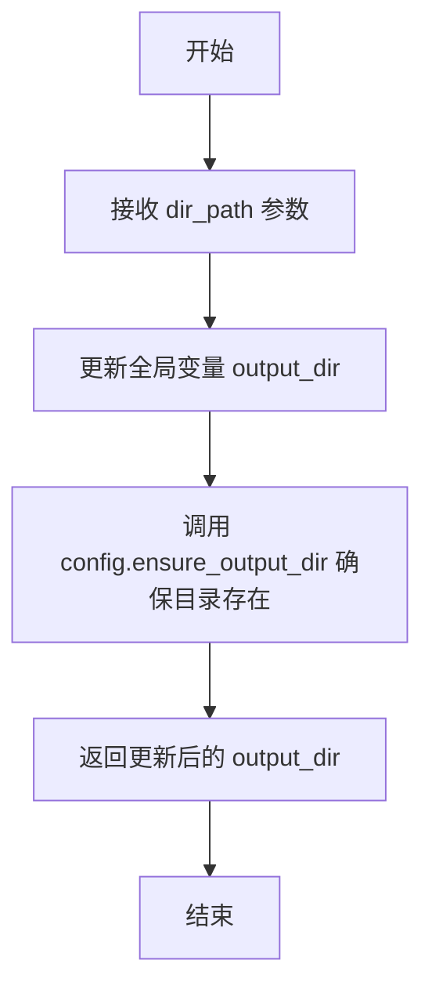

#### 带注释源码

```python
def set_output_dir(dir_path: str):
    """设置转换后文件的输出目录。
    
    Args:
        dir_path: 新的输出目录路径
        
    Returns:
        str: 设置后的输出目录路径
    """
    # 声明使用全局变量 output_dir，以便在函数内部修改其值
    global output_dir
    
    # 更新全局输出目录变量为新的路径
    output_dir = dir_path
    
    # 调用配置模块的 ensure_output_dir 方法，确保输出目录存在
    # 如果目录不存在，该方法会创建目录
    config.ensure_output_dir(output_dir)
    
    # 返回更新后的输出目录路径
    return output_dir
```


### `parse_list_input`

解析可能包含由逗号、换行符或空格分隔的多个项目（支持带引号）的字符串输入，将其拆分为独立的字符串列表。

参数：

- `input_str`：`str`，可能包含多个项目的字符串，输入可能包含逗号、换行符或空格作为分隔符

返回值：`List[str]`，解析后的项目列表，移除了空项目和最外层引号

#### 流程图

```mermaid
flowchart TD
    A[开始: parse_list_input] --> B{input_str 是否为空?}
    B -->|是| C[返回空列表 []]
    B -->|否| D[使用正则表达式 ,<br>或换行符或空格分割]
    E[遍历分割后的每个项目] --> F{项目是否为空?}
    F -->|是| G[跳过该项目]
    F -->|否| H{项目是否带引号?}
    H -->|是| I[移除首尾引号]
    H -->|否| J[保留原项目]
    I --> K[添加项目到结果列表]
    J --> K
    G --> L{是否还有更多项目?}
    L -->|是| E
    L -->|否| M[返回结果列表]
```

#### 带注释源码

```python
def parse_list_input(input_str: str) -> List[str]:
    """
    解析可能包含由逗号或换行符分隔的多个项目的字符串输入。

    Args:
        input_str: 可能包含多个项目的字符串

    Returns:
        解析出的项目列表
    """
    # 输入为空时直接返回空列表
    if not input_str:
        return []

    # 按逗号、换行符或空格分割
    # 正则表达式 [,\n\s]+ 匹配一个或多个逗号、换行符或空白字符
    items = re.split(r"[,\n\s]+", input_str)

    # 移除空项目并处理带引号的项目
    result = []
    for item in items:
        # 去除项目两端的空白字符
        item = item.strip()
        # 如果存在引号，则移除（处理双引号或单引号）
        if (item.startswith('"') and item.endswith('"')) or (
            item.startswith("'") and item.endswith("'")
        ):
            # 移除首尾的引号字符
            item = item[1:-1]

        # 仅添加非空项目到结果列表
        if item:
            result.append(item)

    return result
```


### `convert_file_url`

将文件 URL 转换为 Markdown 格式的异步函数。该函数支持多种输入格式（单个 URL、URL 列表、JSON 配置等），通过 MinerUClient 提交文件转换任务并返回处理结果。

参数：

-  `url`：`str`，待转换的 URL，支持单个 URL、多个 URL（逗号/换行分隔）、JSON 字符串格式的 URL 配置列表，或字典/字典列表格式的 URL 配置
-  `enable_ocr`：`bool`，是否启用 OCR 识别，默认 False
-  `language`：`str`，文档语言，默认 "ch"（中文）
-  `page_ranges`：`str | None`，指定页码范围，格式如 "2,4-6"，默认 None

返回值：`Dict[str, Any]`，包含转换结果。成功时返回 `{"status": "success", "result_path": "输出目录路径"}`，失败时返回 `{"status": "error", "error": "错误信息"}`

#### 流程图

```mermaid
flow TD
    A[开始 convert_file_url] --> B{url 类型检查}
    B -->|dict| C[直接作为单个URL配置]
    B -->|list of dict| D[作为URL配置列表]
    B -->|str| E{是否为JSON数组格式}
    E -->|是| F[解析JSON为URL配置列表]
    E -->|否| G[调用parse_list_input解析URL列表]
    C --> H{urls_to_process是否为空}
    D --> H
    F --> H
    G --> H
    H -->|否| I{URL数量}
    I -->|1个| J[构建单个URL配置字典]
    I -->|多个| K[构建URL配置列表]
    J --> L[调用get_client获取客户端实例]
    K --> L
    L --> M[调用process_file_to_markdown]
    M --> N{执行结果}
    N -->|成功| O[返回成功状态和结果路径]
    N -->|失败| P[返回错误状态和错误信息]
    H -->|是| Q[抛出ValueError: 未提供有效的URL]
```

#### 带注释源码

```python
async def convert_file_url(
    url: str,
    enable_ocr: bool = False,
    language: str = "ch",
    page_ranges: str | None = None,
) -> Dict[str, Any]:
    """
    从URL转换文件到Markdown格式。支持单个或多个URL处理。

    返回:
        成功: {"status": "success", "result_path": "输出目录路径"}
        失败: {"status": "error", "error": "错误信息"}
    """
    # 初始化待处理的URL配置容器
    urls_to_process = None

    # 检查是否为字典或字典列表格式的URL配置
    if isinstance(url, dict):
        # 单个URL配置字典，直接使用
        urls_to_process = url
    elif isinstance(url, list) and len(url) > 0 and isinstance(url[0], dict):
        # URL配置字典列表，直接使用
        urls_to_process = url
    elif isinstance(url, str):
        # 检查是否为 JSON 字符串格式的多URL配置
        if url.strip().startswith("[") and url.strip().endswith("]"):
            try:
                # 尝试解析 JSON 字符串为URL配置列表
                url_configs = json.loads(url)
                if not isinstance(url_configs, list):
                    raise ValueError("JSON URL配置必须是列表格式")

                urls_to_process = url_configs
            except json.JSONDecodeError:
                # 不是有效的 JSON，继续使用字符串解析方式
                pass

    # 如果还未确定URL配置，尝试解析普通URL列表字符串
    if urls_to_process is None:
        # 解析普通URL列表（支持逗号、换行、空格分隔）
        urls = parse_list_input(url)

        if not urls:
            raise ValueError("未提供有效的 URL")

        if len(urls) == 1:
            # 单个URL处理，构建配置字典
            urls_to_process = {"url": urls[0], "is_ocr": enable_ocr}
        else:
            # 多个URL，转换为URL配置列表
            urls_to_process = []
            for url_item in urls:
                urls_to_process.append(
                    {
                        "url": url_item,
                        "is_ocr": enable_ocr,
                    }
                )

    # 使用submit_file_url_task处理URLs
    try:
        # 获取客户端单例并调用文件转Markdown处理方法
        result_path = await get_client().process_file_to_markdown(
            # 传入lambda表达式作为任务提交回调
            lambda urls, o: get_client().submit_file_url_task(
                urls,
                o,
                language=language,
                page_ranges=page_ranges,
            ),
            urls_to_process,
            enable_ocr,
            output_dir,
        )
        # 成功返回状态和结果路径
        return {"status": "success", "result_path": result_path}
    except Exception as e:
        # 捕获异常并返回错误状态和错误信息
        return {"status": "error", "error": str(e)}
```


### `convert_file_path`

将本地文件转换为Markdown格式。支持单个或多个文件批量处理。

参数：

- `file_path`：`str`，文件路径，支持字符串（单个路径、逗号分隔的多个路径、JSON字符串格式）、字典（单个文件配置）、字典列表（多个文件配置）等多种格式
- `enable_ocr`：`bool`，启用OCR识别，默认False
- `language`：`str`，文档语言，默认"ch"中文
- `page_ranges`：`str | None`，指定页码范围，格式如"2,4-6"，仅远程API支持，默认None

返回值：`Dict[str, Any]`，成功时返回 `{"status": "success", "result_path": "输出目录路径"}`，失败时返回 `{"status": "error", "error": "错误信息"}`

#### 流程图

```mermaid
flowchart TD
    A[开始 convert_file_path] --> B{file_path 类型检查}
    
    B -->|dict| C[单个文件配置字典]
    B -->|list 且首元素为dict| D[文件配置字典列表]
    B -->|str| E{JSON字符串格式检查}
    
    E -->|以[开头以]结尾| F[尝试解析JSON]
    F -->|解析成功| D
    F -->|解析失败| G[普通字符串解析]
    
    E -->|非JSON格式| G
    
    C --> H[files_to_process 赋值]
    D --> H
    G --> H
    
    H --> I{files_to_process 是否为空}
    
    I -->|是| J[调用 parse_list_input 解析]
    J --> K{解析结果是否为空}
    K -->|是| L[抛出 ValueError: 未提供有效的文件路径]
    K -->|否| M{文件数量}
    
    M -->|1个| N[构建单个文件配置: path + is_ocr]
    M -->|多个| O[遍历构建文件配置列表]
    
    N --> P
    O --> P
    
    I -->|否| P[调用 get_client().process_file_to_markdown]
    
    P --> Q[调用 submit_file_task 提交任务]
    Q --> R{任务执行是否成功}
    
    R -->|成功| S[返回 {"status": "success", "result_path": result_path}]
    R -->|失败| T[返回 {"status": "error", "error": str(e), params: {...}}]
    
    S --> U[结束]
    T --> U
    L --> U
```

#### 带注释源码

```python
async def convert_file_path(
    file_path: str,
    enable_ocr: bool = False,
    language: str = "ch",
    page_ranges: str | None = None,
) -> Dict[str, Any]:
    """
    将本地文件转换为Markdown格式。支持单个或多个文件批量处理。

    返回:
        成功: {"status": "success", "result_path": "输出目录路径"}
        失败: {"status": "error", "error": "错误信息"}
    """

    files_to_process = None  # 初始化待处理文件配置

    # 检查是否为字典或字典列表格式的文件配置
    if isinstance(file_path, dict):
        # 单个文件配置字典
        # 格式: {"path": "/path/to/file.pdf", "is_ocr": true}
        files_to_process = file_path
    elif (
        isinstance(file_path, list)
        and len(file_path) > 0
        and isinstance(file_path[0], dict)
    ):
        # 文件配置字典列表
        # 格式: [{"path": "/path/to/file1.pdf", "is_ocr": false}, ...]
        files_to_process = file_path
    elif isinstance(file_path, str):
        # 检查是否为 JSON 字符串格式的多文件配置
        if file_path.strip().startswith("[") and file_path.strip().endswith("]"):
            try:
                # 尝试解析 JSON 字符串为文件配置列表
                file_configs = json.loads(file_path)
                if not isinstance(file_configs, list):
                    raise ValueError("JSON 文件配置必须是列表格式")

                files_to_process = file_configs
            except json.JSONDecodeError:
                # 不是有效的 JSON，继续使用字符串解析方式
                pass

    # 如果 files_to_process 仍未设置，则解析普通字符串格式
    if files_to_process is None:
        # 解析普通文件路径列表（逗号、换行、空格分隔）
        file_paths = parse_list_input(file_path)

        if not file_paths:
            raise ValueError("未提供有效的文件路径")

        if len(file_paths) == 1:
            # 单个文件处理
            files_to_process = {
                "path": file_paths[0],
                "is_ocr": enable_ocr,
            }
        else:
            # 多个文件路径，转换为文件配置列表
            files_to_process = []
            for i, path in enumerate(file_paths):
                files_to_process.append(
                    {
                        "path": path,
                        "is_ocr": enable_ocr,
                    }
                )

    # 使用submit_file_task处理文件
    try:
        # 调用客户端的 process_file_to_markdown 方法
        # 该方法内部会调用 submit_file_task 提交文件转换任务
        result_path = await get_client().process_file_to_markdown(
            lambda files, o: get_client().submit_file_task(
                files,
                o,
                language=language,
                page_ranges=page_ranges,
            ),
            files_to_process,
            enable_ocr,
            output_dir,
        )
        return {"status": "success", "result_path": result_path}
    except Exception as e:
        # 捕获异常并返回错误信息，同时附带参数信息便于调试
        return {
            "status": "error",
            "error": str(e),
            "params": {
                "file_path": file_path,
                "enable_ocr": enable_ocr,
                "language": language,
            },
        }
```


### `local_parse_file`

根据环境变量设置使用本地API解析文件，支持文件存在性检查和错误处理。

参数：

- `file_path`：`str`，要解析的文件的路径
- `parse_method`：`str`，解析方法，默认为"auto"

返回值：`Dict[str, Any]`，包含处理结果的字典。成功时返回 `{"status": "success", "result": 处理结果}` 或 `{"status": "success", "result_path": "输出目录路径"}`，失败时返回 `{"status": "error", "error": "错误信息"}`

#### 流程图

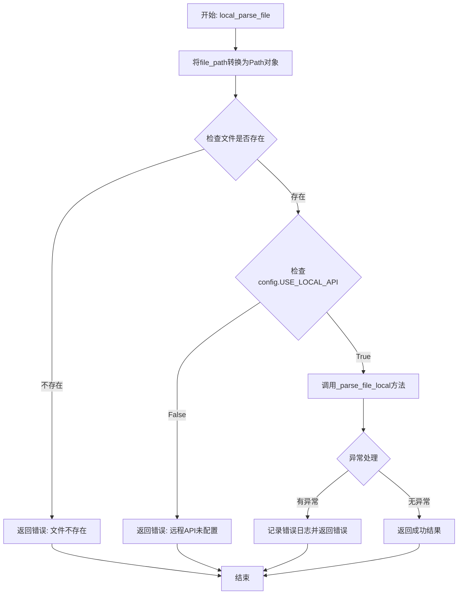

#### 带注释源码

```python
async def local_parse_file(
    file_path: str,
    parse_method: str = "auto",
) -> Dict[str, Any]:
    """
    根据环境变量设置使用本地或远程API解析文件。

    返回:
        成功: {"status": "success", "result": 处理结果} 或 {"status": "success", "result_path": "输出目录路径"}
        失败: {"status": "error", "error": "错误信息"}
    """
    # 将字符串路径转换为Path对象，以便进行文件操作
    file_path = Path(file_path)

    # 检查文件是否存在
    if not file_path.exists():
        # 文件不存在时返回错误状态
        return {"status": "error", "error": f"文件不存在: {file_path}"}

    try:
        # 根据环境变量决定使用本地API还是远程API
        if config.USE_LOCAL_API:
            # 记录调试日志，显示使用的本地API地址
            config.logger.debug(f"使用本地API: {config.LOCAL_MINERU_API_BASE}")
            # 调用本地解析方法处理文件
            return await _parse_file_local(
                file_path=str(file_path),
                parse_method=parse_method,
            )
        else:
            # 远程API未配置时返回错误
            return {"status": "error", "error": "远程API未配置"}
    except Exception as e:
        # 捕获异常并记录错误日志
        config.logger.error(f"解析文件时出错: {str(e)}")
        return {"status": "error", "error": str(e)}
```


### `read_converted_file`

读取解析后的文件内容。主要支持Markdown和其他文本文件格式。

参数：

-  `file_path`：`str`，需要读取的文件路径

返回值：`Dict[str, Any]`，成功时返回 `{"status": "success", "content": "文件内容"}`，失败时返回 `{"status": "error", "error": "错误信息"}`

#### 流程图

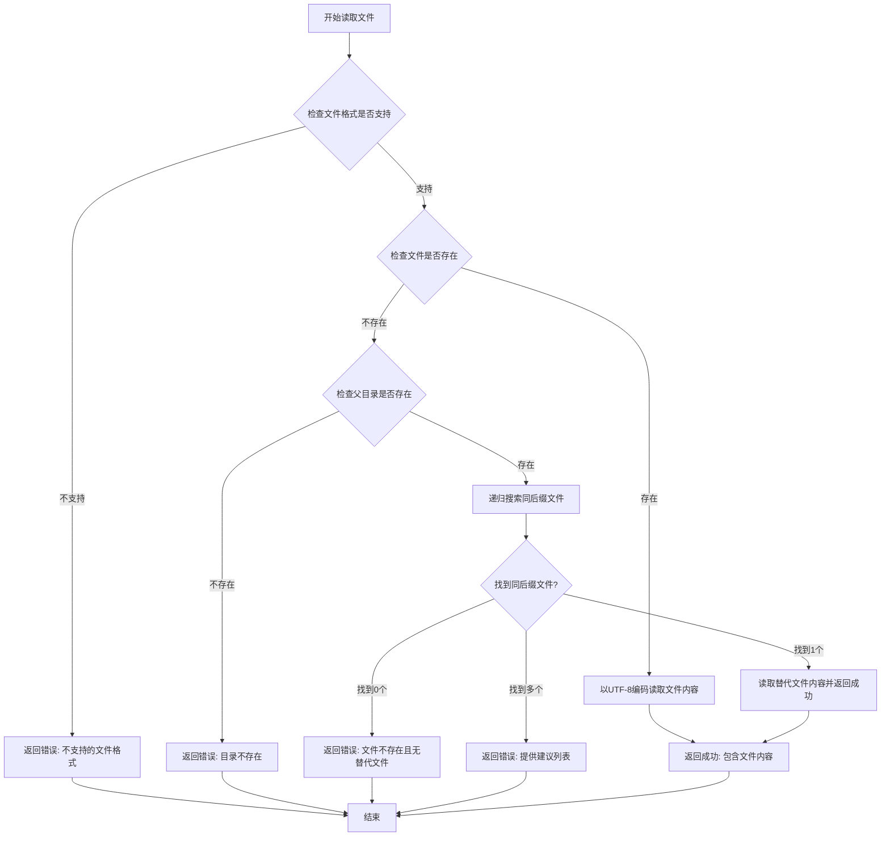

#### 带注释源码

```python
async def read_converted_file(
    file_path: str,
) -> Dict[str, Any]:
    """
    读取解析后的文件内容。主要支持Markdown和其他文本文件格式。

    返回:
        成功: {"status": "success", "content": "文件内容"}
        失败: {"status": "error", "error": "错误信息"}
    """
    try:
        # 将文件路径转换为Path对象，便于操作
        target_file = Path(file_path)
        parent_dir = target_file.parent
        suffix = target_file.suffix.lower()

        # 定义支持的文本文件格式列表
        text_extensions = [".md", ".txt", ".json", ".html", ".tex", ".latex"]

        # 检查文件格式是否在支持列表中
        if suffix not in text_extensions:
            return {
                "status": "error",
                "error": f"不支持的文件格式: {suffix}。目前仅支持以下格式: {', '.join(text_extensions)}",
            }

        # 检查目标文件是否存在
        if not target_file.exists():
            # 检查父目录是否存在
            if not parent_dir.exists():
                return {"status": "error", "error": f"目录 {parent_dir} 不存在"}

            # 递归搜索所有子目录下的同后缀文件
            similar_files_paths = [
                str(f) for f in parent_dir.rglob(f"*{suffix}") if f.is_file()
            ]

            if similar_files_paths:
                # 只有一个匹配文件时，直接读取
                if len(similar_files_paths) == 1:
                    alternative_file = similar_files_paths[0]
                    try:
                        with open(alternative_file, "r", encoding="utf-8") as f:
                            content = f.read()
                        return {
                            "status": "success",
                            "content": content,
                            "message": f"未找到文件 {target_file.name}，但找到了 {Path(alternative_file).name}，已返回其内容",
                        }
                    except Exception as e:
                        return {
                            "status": "error",
                            "error": f"尝试读取替代文件时出错: {str(e)}",
                        }
                else:
                    # 找到多个匹配文件，提供建议列表
                    suggestion = f"你是否在找: {', '.join(similar_files_paths)}?"
                    return {
                        "status": "error",
                        "error": f"文件 {target_file.name} 不存在。在 {parent_dir} 及其子目录下找到以下同类型文件。{suggestion}",
                    }
            else:
                return {
                    "status": "error",
                    "error": f"文件 {target_file.name} 不存在，且在目录 {parent_dir} 及其子目录下未找到其他 {suffix} 文件。",
                }

        # 文件存在，以文本模式读取内容
        with open(target_file, "r", encoding="utf-8") as f:
            content = f.read()
        return {"status": "success", "content": content}

    except Exception as e:
        # 捕获所有异常并记录错误日志
        config.logger.error(f"读取文件时出错: {str(e)}")
        return {"status": "error", "error": str(e)}
```


### `find_and_read_markdown_content`

在给定的结果目录路径中，递归搜索并读取Markdown文件（.md）和其他文本文件（.txt），支持多种常见文件名模式，返回找到的文件内容或错误信息。

参数：

-  `result_path`：`str`，结果目录路径，用于在该目录下查找Markdown或文本文件

返回值：`Dict[str, Any]`，包含所有文件内容或错误信息的字典，成功时返回 `status: "success"` 和内容，失败时返回 `status: "warning"` 和错误消息

#### 流程图

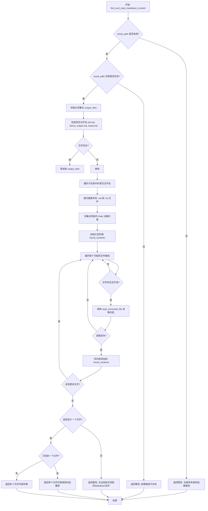

#### 带注释源码

```python
async def find_and_read_markdown_content(result_path: str) -> Dict[str, Any]:
    """
    在给定的路径中寻找并读取Markdown文件内容。
    查找所有可能的文件位置，返回所有找到的有效内容。

    Args:
        result_path: 结果目录路径

    Returns:
        Dict[str, Any]: 包含所有文件内容或错误信息的字典
    """
    # 参数校验：如果路径为空，返回警告状态
    if not result_path:
        return {"status": "warning", "message": "未提供有效的结果路径"}

    # 将字符串路径转换为 Path 对象
    base_path = Path(result_path)
    
    # 检查目录是否存在，不存在则返回警告
    if not base_path.exists():
        return {"status": "warning", "message": f"结果路径不存在: {result_path}"}

    # 使用集合来存储文件路径，确保唯一性（自动去重）
    unique_files = set()

    # 步骤1: 添加常见文件名（直接位于根目录）
    common_files = [
        base_path / "full.md",
        base_path / "full.txt",
        base_path / "output.md",
        base_path / "result.md",
    ]
    for f in common_files:
        if f.exists():
            unique_files.add(str(f))

    # 步骤2: 遍历子目录，查找子目录中的常见文件名
    for subdir in base_path.iterdir():
        if subdir.is_dir():
            subdir_files = [
                subdir / "full.md",
                subdir / "full.txt",
                subdir / "output.md",
                subdir / "result.md",
            ]
            for f in subdir_files:
                if f.exists():
                    unique_files.add(str(f))

    # 步骤3: 使用 glob 递归查找所有的 .md 和 .txt 文件
    for md_file in base_path.glob("**/*.md"):
        unique_files.add(str(md_file))
    for txt_file in base_path.glob("**/*.txt"):
        unique_files.add(str(txt_file))

    # 将集合转换回 Path 对象列表
    possible_files = [Path(f) for f in unique_files]

    # 记录调试日志：找到的候选文件数量
    config.logger.debug(f"找到 {len(possible_files)} 个可能的文件")

    # 收集所有找到的有效文件内容
    found_contents = []

    # 步骤4: 遍历每个可能的文件，尝试读取内容
    for file_path in possible_files:
        if file_path.exists():
            # 调用辅助函数 read_converted_file 读取文件
            result = await read_converted_file(str(file_path))
            # 如果读取成功，将内容和路径添加到结果列表
            if result["status"] == "success":
                config.logger.debug(f"成功读取文件内容: {file_path}")
                found_contents.append(
                    {"file_path": str(file_path), "content": result["content"]}
                )

    # 步骤5: 根据找到的文件数量返回结果
    if found_contents:
        config.logger.debug(f"在结果目录中找到了 {len(found_contents)} 个可读取的文件")
        
        # 如果只找到一个文件，保持向后兼容的返回格式
        if len(found_contents) == 1:
            return {
                "status": "success",
                "content": found_contents[0]["content"],
                "file_path": found_contents[0]["file_path"],
            }
        # 如果找到多个文件，返回内容列表
        else:
            return {"status": "success", "contents": found_contents}

    # 如果没有找到任何有效的文件，返回警告
    return {
        "status": "warning",
        "message": f"无法在结果目录中找到可读取的Markdown文件: {result_path}",
    }
```


### `_process_conversion_result`

处理转换结果，统一格式化输出。该函数接收转换结果、源文件路径或URL以及是否为URL的标识，然后根据不同的结果格式提取并返回标准化的处理结果。

参数：

- `result`：`Dict[str, Any]`，转换函数返回的结果，包含状态和可能的result_path
- `source`：`str`，源文件路径或URL
- `is_url`：`bool`，是否为URL，默认为False

返回值：`Dict[str, Any]`，格式化后的结果字典，包含文件名、源路径、状态和内容（或错误信息）

#### 流程图

```mermaid
flowchart TD
    A([开始]) --> B[从source提取filename]
    B --> C{is_url and '?' in filename}
    C -->|Yes| D[移除query参数]
    C -->|No| E{is_url}
    D --> F
    E -->|Yes| F
    E -->|No| G[使用Path获取文件名]
    G --> F
    F --> H[创建base_result字典]
    H --> I{result['status'] == 'success']
    
    I -->|Yes| J{result_path存在}
    I -->|No| K[添加错误信息到base_result]
    K --> Z([返回base_result])
    
    J -->|Yes| L{result_path是dict且有'results'}
    J -->|No| M[添加错误: 转换成功但未返回结果路径]
    M --> Z
    
    L -->|Yes| N[遍历results查找匹配filename]
    L -->|No| O{result_path是str}
    
    N --> P{找到匹配项}
    P -->|Yes, success| Q[返回成功状态和content]
    P -->|Yes, error| R[返回错误状态和error_message]
    P -->|No| S{有extract_dir}
    
    S -->|Yes| T[尝试从extract_dir读取内容]
    T --> U{读取成功}
    U -->|Yes| V[返回成功状态和content]
    U -->|No| W[返回错误: 未找到匹配内容]
    W --> Z
    S -->|No| W
    
    O -->|Yes| X[使用find_and_read_markdown_content读取]
    X --> Y{读取成功}
    Y -->|Yes| V
    Y -->|No| Z1[返回错误: 无法读取转换结果]
    Z1 --> Z
    
    L -->|No| AA{result_path是其他dict}
    AA -->|Yes| AB[尝试获取extract_dir/path/dir]
    AB --> AC{有有效路径}
    AC -->|Yes| AD[尝试读取内容]
    AD --> AE{读取成功}
    AE -->|Yes| V
    AE -->|No| AF[返回错误: 转换结果格式无法识别]
    AF --> Z
    AC -->|No| AF
    
    AA -->|No| AG[返回错误: 无法识别的result_path类型]
    AG --> Z
```

#### 带注释源码

```python
async def _process_conversion_result(
    result: Dict[str, Any], source: str, is_url: bool = False
) -> Dict[str, Any]:
    """
    处理转换结果，统一格式化输出。

    Args:
        result: 转换函数返回的结果
        source: 源文件路径或URL
        is_url: 是否为URL

    Returns:
        格式化后的结果字典
    """
    # 从源路径提取文件名，URL情况下需要处理query参数
    filename = source.split("/")[-1]
    if is_url and "?" in filename:
        # 处理URL中的查询参数，例如: example.com/file.pdf?token=xxx
        filename = filename.split("?")[0]
    elif not is_url:
        # 本地文件使用Path获取标准文件名
        filename = Path(source).name

    # 构建基础结果字典，包含文件名和源路径
    base_result = {
        "filename": filename,
        "source_url" if is_url else "source_path": source,
    }

    # 检查转换是否成功
    if result["status"] == "success":
        # 获取result_path，可能是字符串或字典
        result_path = result.get("result_path")

        # 记录调试信息
        config.logger.debug(f"处理结果 result_path 类型: {type(result_path)}")

        if result_path:
            # 情况1: result_path是字典且包含results字段（批量处理结果）
            if isinstance(result_path, dict) and "results" in result_path:
                config.logger.debug("检测到批量处理结果格式")

                # 查找与当前源文件匹配的结果
                for item in result_path.get("results", []):
                    if item.get("filename") == filename or (
                        not is_url and Path(source).name == item.get("filename")
                    ):
                        # 直接返回匹配项的状态，无论是success还是error
                        if item.get("status") == "success" and "content" in item:
                            base_result.update(
                                {
                                    "status": "success",
                                    "content": item.get("content", ""),
                                }
                            )
                            # 如果有extract_path，也添加进去
                            if "extract_path" in item:
                                base_result["extract_path"] = item["extract_path"]
                            return base_result
                        elif item.get("status") == "error":
                            # 处理失败的文件，直接返回error状态
                            base_result.update(
                                {
                                    "status": "error",
                                    "error_message": item.get(
                                        "error_message", "文件处理失败"
                                    ),
                                }
                            )
                            return base_result

                # 如果没有找到匹配的结果，但有extract_dir，尝试从那里读取
                if "extract_dir" in result_path:
                    config.logger.debug(
                        f"尝试从extract_dir读取: {result_path['extract_dir']}"
                    )
                    try:
                        content_result = await find_and_read_markdown_content(
                            result_path["extract_dir"]
                        )
                        if content_result.get("status") == "success":
                            base_result.update(
                                {
                                    "status": "success",
                                    "content": content_result.get("content", ""),
                                    "extract_path": result_path["extract_dir"],
                                }
                            )
                            return base_result
                    except Exception as e:
                        config.logger.error(f"从extract_dir读取内容时出错: {str(e)}")

                # 如果上述方法都失败，返回错误
                base_result.update(
                    {
                        "status": "error",
                        "error_message": "未能在批量处理结果中找到匹配的内容",
                    }
                )

            # 情况2: result_path是字符串（传统格式）
            elif isinstance(result_path, str):
                config.logger.debug(f"处理传统格式结果路径: {result_path}")
                content_result = await find_and_read_markdown_content(result_path)
                if content_result.get("status") == "success":
                    base_result.update(
                        {
                            "status": "success",
                            "content": content_result.get("content", ""),
                            "extract_path": result_path,
                        }
                    )
                else:
                    base_result.update(
                        {
                            "status": "error",
                            "error_message": f"无法读取转换结果: {content_result.get('message', '')}",
                        }
                    )

            # 情况3: result_path是其他类型的字典（尝试处理）
            elif isinstance(result_path, dict):
                config.logger.debug(f"处理其他字典格式: {result_path}")
                # 尝试从字典中提取可能的路径
                extract_path = (
                    result_path.get("extract_dir")
                    or result_path.get("path")
                    or result_path.get("dir")
                )
                if extract_path and isinstance(extract_path, str):
                    try:
                        content_result = await find_and_read_markdown_content(
                            extract_path
                        )
                        if content_result.get("status") == "success":
                            base_result.update(
                                {
                                    "status": "success",
                                    "content": content_result.get("content", ""),
                                    "extract_path": extract_path,
                                }
                            )
                            return base_result
                    except Exception as e:
                        config.logger.error(f"从extract_path读取内容时出错: {str(e)}")

                # 如果没有找到有效路径，返回错误
                base_result.update(
                    {"status": "error", "error_message": "转换结果格式无法识别"}
                )
            else:
                # 情况4: result_path是其他类型（错误）
                base_result.update(
                    {
                        "status": "error",
                        "error_message": f"无法识别的result_path类型: {type(result_path)}",
                    }
                )
        else:
            # result_path为空的情况
            base_result.update(
                {"status": "error", "error_message": "转换成功但未返回结果路径"}
            )
    else:
        # 处理失败的情况
        base_result.update(
            {"status": "error", "error_message": result.get("error", "未知错误")}
        )

    return base_result
```


### `parse_documents`

统一接口，将本地文件或URL转换为Markdown格式，支持批量处理，根据`USE_LOCAL_API`配置自动选择本地或远程API进行处理，并自动读取转换后的文件内容返回。

参数：

- `file_sources`：`str`，文件路径或URL，支持单个或多个（逗号分隔），支持pdf、ppt、pptx、doc、docx及图片格式（jpg、jpeg、png）
- `enable_ocr`：`bool`，启用OCR识别，默认False
- `language`：`str`，文档语言，默认"ch"中文，可选"en"英文等
- `page_ranges`：`str | None`，指定页码范围，格式如"2,4-6"（远程API使用），默认None

返回值：`Dict[str, Any]`，成功时返回`{"status": "success", "content": "文件内容"}`或`{"status": "success", "results": [处理结果列表]}`，失败时返回`{"status": "error", "error": "错误信息"}`

#### 流程图

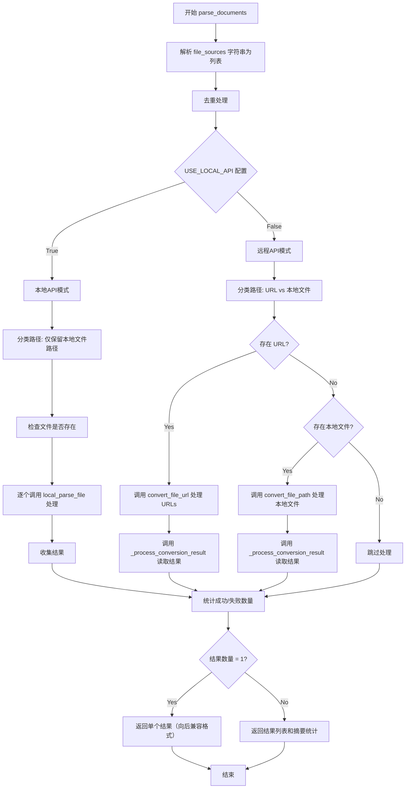

#### 带注释源码

```python
@mcp.tool()
async def parse_documents(
    # 文件来源：支持本地路径或URL，多个用逗号分隔
    file_sources: Annotated[
        str,
        Field(
            description="""文件路径或URL，支持以下格式:
            - 单个路径或URL: "/path/to/file.pdf" 或 "https://example.com/document.pdf"
            - 多个路径或URL(逗号分隔): "/path/to/file1.pdf, /path/to/file2.pdf" 或
              "https://example.com/doc1.pdf, https://example.com/doc2.pdf"
            - 混合路径和URL: "/path/to/file.pdf, https://example.com/document.pdf"
            (支持pdf、ppt、pptx、doc、docx以及图片格式jpg、jpeg、png)"""
        ),
    ],
    # 通用参数：OCR识别开关
    enable_ocr: Annotated[bool, Field(description="启用OCR识别,默认False")] = False,
    # 通用参数：文档语言设置
    language: Annotated[
        str, Field(description='文档语言，默认"ch"中文，可选"en"英文等')
    ] = "ch",
    # 远程API参数：页码范围指定
    page_ranges: Annotated[
        str | None,
        Field(
            description='指定页码范围，格式为逗号分隔的字符串。例如："2,4-6"：表示选取第2页、第4页至第6页；"2--2"：表示从第2页一直选取到倒数第二页。（远程API）,默认None'
        ),
    ] = None,
) -> Dict[str, Any]:
    """
    统一接口，将文件转换为Markdown格式。支持本地文件和URL，会根据USE_LOCAL_API配置自动选择合适的处理方式。

    当USE_LOCAL_API=true时:
    - 会过滤掉http/https开头的URL路径
    - 对本地文件使用本地API进行解析

    当USE_LOCAL_API=false时:
    - 将http/https开头的路径使用convert_file_url处理
    - 将其他路径使用convert_file_path处理

    处理完成后，会自动尝试读取转换后的文件内容并返回。

    返回:
        成功: {"status": "success", "content": "文件内容"} 或 {"status": "success", "results": [处理结果列表]}
        失败: {"status": "error", "error": "错误信息"}
    """
    # 步骤1: 解析路径列表 - 将逗号/换行/空格分隔的字符串解析为列表
    sources = parse_list_input(file_sources)
    if not sources:
        return {"status": "error", "error": "未提供有效的文件路径或URL"}

    # 步骤2: 去重处理 - 使用字典保持原始顺序的同时去除重复
    sources = list(dict.fromkeys(sources))

    config.logger.debug(f"去重后的文件路径: {sources}")

    # 记录去重统计信息
    original_count = len(parse_list_input(file_sources))
    unique_count = len(sources)
    if original_count > unique_count:
        config.logger.debug(
            f"检测到重复路径，已自动去重: {original_count} -> {unique_count}"
        )

    # 步骤3: 路径分类 - 区分URL路径和本地文件路径
    url_paths = []
    file_paths = []

    for source in sources:
        # 检查是否以 http:// 或 https:// 开头
        if source.lower().startswith(("http://", "https://")):
            url_paths.append(source)
        else:
            file_paths.append(source)

    results = []

    # 步骤4: 根据 USE_LOCAL_API 配置选择处理模式
    if config.USE_LOCAL_API:
        # === 本地API模式 ===
        # 在本地API模式下，只处理本地文件路径，过滤掉URL
        if not file_paths:
            return {
                "status": "warning",
                "message": "在本地API模式下，无法处理URL，且未提供有效的本地文件路径",
            }

        config.logger.info(f"使用本地API处理 {len(file_paths)} 个文件")

        # 逐个处理本地文件
        for path in file_paths:
            try:
                # 检查文件是否存在，不存在则记录错误并跳过
                if not Path(path).exists():
                    results.append(
                        {
                            "filename": Path(path).name,
                            "source_path": path,
                            "status": "error",
                            "error_message": f"文件不存在: {path}",
                        }
                    )
                    continue

                # 调用本地解析函数
                result = await local_parse_file(
                    file_path=path,
                    parse_method=(
                        "ocr" if enable_ocr else "txt"
                    ),  # 如果启用OCR，使用ocr，否则使用txt
                )

                # 添加文件名和源路径信息到结果中
                result_with_filename = {
                    "filename": Path(path).name,
                    "source_path": path,
                    **result,
                }
                results.append(result_with_filename)

            except Exception as e:
                # 处理文件时出现异常，记录错误但继续处理下一个文件
                config.logger.error(f"处理文件 {path} 时出现错误: {str(e)}")
                results.append(
                    {
                        "filename": Path(path).name,
                        "source_path": path,
                        "status": "error",
                        "error_message": f"处理文件时出现异常: {str(e)}",
                    }
                )

    else:
        # === 远程API模式 ===
        # 分别处理URL和本地文件路径
        
        # 处理URL类型输入
        if url_paths:
            config.logger.info(f"使用远程API处理 {len(url_paths)} 个文件URL")

            try:
                # 调用convert_file_url处理URLs
                url_result = await convert_file_url(
                    url=",".join(url_paths),
                    enable_ocr=enable_ocr,
                    language=language,
                    page_ranges=page_ranges,
                )

                if url_result["status"] == "success":
                    # 为每个URL生成对应的结果
                    for url in url_paths:
                        result_item = await _process_conversion_result(
                            url_result, url, is_url=True
                        )
                        results.append(result_item)
                else:
                    # 转换失败，为所有URL添加错误结果
                    for url in url_paths:
                        results.append(
                            {
                                "filename": url.split("/")[-1].split("?")[0],
                                "source_url": url,
                                "status": "error",
                                "error_message": url_result.get("error", "URL处理失败"),
                            }
                        )

            except Exception as e:
                config.logger.error(f"处理URL时出现错误: {str(e)}")
                for url in url_paths:
                    results.append(
                        {
                            "filename": url.split("/")[-1].split("?")[0],
                            "source_url": url,
                            "status": "error",
                            "error_message": f"处理URL时出现异常: {str(e)}",
                        }
                    )

        # 处理本地文件路径输入
        if file_paths:
            config.logger.info(f"使用远程API处理 {len(file_paths)} 个本地文件")

            # 预先过滤出存在的文件
            existing_files = []
            for file_path in file_paths:
                if not Path(file_path).exists():
                    results.append(
                        {
                            "filename": Path(file_path).name,
                            "source_path": file_path,
                            "status": "error",
                            "error_message": f"文件不存在: {file_path}",
                        }
                    )
                else:
                    existing_files.append(file_path)

            if existing_files:
                try:
                    # 调用convert_file_path处理本地文件
                    file_result = await convert_file_path(
                        file_path=",".join(existing_files),
                        enable_ocr=enable_ocr,
                        language=language,
                        page_ranges=page_ranges,
                    )

                    config.logger.debug(f"file_result: {file_result}")

                    if file_result["status"] == "success":
                        # 为每个文件生成对应的结果
                        for file_path in existing_files:
                            result_item = await _process_conversion_result(
                                file_result, file_path, is_url=False
                            )
                            results.append(result_item)
                    else:
                        # 转换失败，为所有文件添加错误结果
                        for file_path in existing_files:
                            results.append(
                                {
                                    "filename": Path(file_path).name,
                                    "source_path": file_path,
                                    "status": "error",
                                    "error_message": file_result.get(
                                        "error", "文件处理失败"
                                    ),
                                }
                            )

                except Exception as e:
                    config.logger.error(f"处理本地文件时出现错误: {str(e)}")
                    for file_path in existing_files:
                        results.append(
                            {
                                "filename": Path(file_path).name,
                                "source_path": file_path,
                                "status": "error",
                                "error_message": f"处理文件时出现异常: {str(e)}",
                            }
                        )

    # 步骤5: 处理结果为空的情况
    if not results:
        return {"status": "error", "error": "未处理任何文件"}

    # 步骤6: 计算成功和失败的统计信息
    success_count = len([r for r in results if r.get("status") == "success"])
    error_count = len([r for r in results if r.get("status") == "error"])
    total_count = len(results)

    # 步骤7: 返回结果格式化
    # 只有一个结果时，直接返回该结果（保持向后兼容）
    if len(results) == 1:
        result = results[0].copy()
        # 为了向后兼容，移除新增的字段
        if "filename" in result:
            del result["filename"]
        if "source_path" in result:
            del result["source_path"]
        if "source_url" in result:
            del result["source_url"]
        return result

    # 多个结果时，返回详细的结果列表和摘要
    # 根据成功/失败情况决定整体状态
    overall_status = "success"
    if success_count == 0:
        # 所有文件都失败
        overall_status = "error"
    elif error_count > 0:
        # 有部分文件失败，但不是全部
        overall_status = "partial_success"

    return {
        "status": overall_status,
        "results": results,
        "summary": {
            "total_files": total_count,
            "success_count": success_count,
            "error_count": error_count,
        },
    }
```


### `get_ocr_languages`

获取 MinerU OCR 引擎支持的语言列表，返回包含状态和语言数据的字典。

参数：

- 该函数无参数

返回值：`Dict[str, Any]`，包含所有支持的OCR语言列表的字典。成功时返回 `{"status": "success", "languages": 语言列表}`，失败时返回 `{"status": "error", "error": 错误信息}`

#### 流程图

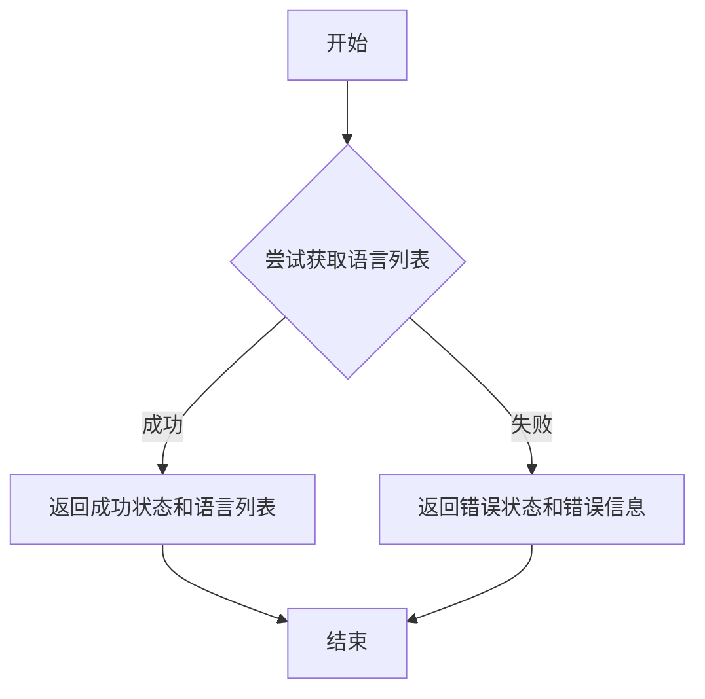

#### 带注释源码

```python
@mcp.tool()
async def get_ocr_languages() -> Dict[str, Any]:
    """
    获取 OCR 支持的语言列表。

    Returns:
        Dict[str, Any]: 包含所有支持的OCR语言列表的字典
    """
    try:
        # 从language模块获取语言列表
        # get_language_list() 是从 .language 模块导入的函数
        languages = get_language_list()
        
        # 成功时返回状态为success和语言列表
        return {"status": "success", "languages": languages}
    except Exception as e:
        # 捕获任何异常并返回错误状态和错误信息
        return {"status": "error", "error": str(e)}
```


### `_parse_file_local`

使用本地API解析文件，将本地文件上传到本地部署的MinerU服务进行文档转换。

参数：

- `file_path`：`str`，要解析的本地文件路径
- `parse_method`：`str`，解析方法，默认为"auto"，支持"auto"、"ocr"、"txt"等

返回值：`Dict[str, Any]`，包含解析结果的字典。成功时返回 `{"status": "success", "result": {...}}`，失败时返回 `{"status": "error", "error": "错误信息"}`

#### 流程图

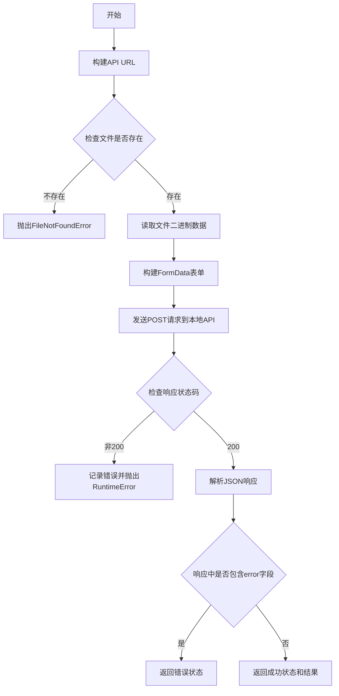

#### 带注释源码

```python
async def _parse_file_local(
    file_path: str,
    parse_method: str = "auto",
) -> Dict[str, Any]:
    """
    使用本地API解析文件。

    Args:
        file_path: 要解析的文件路径
        parse_method: 解析方法
        output_dir: 输出目录

    Returns:
        Dict[str, Any]: 包含解析结果的字典
    """
    # API URL路径 - 拼接本地API基址和文件解析端点
    api_url = f"{config.LOCAL_MINERU_API_BASE}/file_parse"

    # 使用Path对象确保文件路径正确
    file_path_obj = Path(file_path)
    # 验证文件是否存在，不存在则抛出异常
    if not file_path_obj.exists():
        raise FileNotFoundError(f"文件不存在: {file_path}")

    # 读取文件二进制数据 - 以二进制模式读取用于上传
    with open(file_path_obj, "rb") as f:
        file_data = f.read()

    # 准备用于上传文件的表单数据
    # 获取文件扩展名作为content_type
    file_type = file_path_obj.suffix.lower()
    # 创建aiohttp表单数据对象
    form_data = aiohttp.FormData()
    # 添加文件字段 - 包含二进制数据、文件名和内容类型
    form_data.add_field(
        "file", file_data, filename=file_path_obj.name, content_type=file_type
    )
    # 添加解析方法参数
    form_data.add_field("parse_method", parse_method)

    # 记录调试日志 - 显示请求URL和上传文件信息
    config.logger.debug(f"发送本地API请求到: {api_url}")
    config.logger.debug(f"上传文件: {file_path_obj.name} (大小: {len(file_data)} 字节)")

    # 发送请求 - 使用aiohttp异步HTTP客户端
    try:
        # 创建异步HTTP会话
        async with aiohttp.ClientSession() as session:
            # 发送POST请求上传文件
            async with session.post(api_url, data=form_data) as response:
                # 检查HTTP响应状态码
                if response.status != 200:
                    # 读取错误响应文本
                    error_text = await response.text()
                    # 记录错误日志
                    config.logger.error(
                        f"API返回错误状态码: {response.status}, 错误信息: {error_text}"
                    )
                    # 抛出运行时错误
                    raise RuntimeError(f"API返回错误: {response.status}, {error_text}")

                # 解析JSON响应
                result = await response.json()

                # 记录调试日志
                config.logger.debug(f"本地API响应: {result}")

                # 处理响应 - 检查是否包含错误信息
                if "error" in result:
                    return {"status": "error", "error": result["error"]}

                # 返回成功结果
                return {"status": "success", "result": result}
    # 捕获网络通信错误
    except aiohttp.ClientError as e:
        error_msg = f"与本地API通信时出错: {str(e)}"
        config.logger.error(error_msg)
        raise RuntimeError(error_msg)
```


### FastMCP.run

该方法是 FastMCP 框架的核心运行方法，负责启动 MCP 服务器并处理客户端请求。根据代码中的三种调用场景，该方法支持不同的传输模式（stdio、sse、streamable-http）。

参数：

-  `mode`：`str | None`，运行模式，支持 "stdio"（标准输入输出）、"sse"（Server-Sent Events）、"streamable-http"（流式 HTTP），默认为 None
-  `read_stream`：异步读取流，用于从客户端读取数据（SSE 模式必需）
-  `write_stream`：异步写入流，用于向客户端发送数据（SSE 模式必需）
-  `initialization_options`：初始化选项，包含服务器配置信息（SSE 模式使用）
-  `port`：`int`，服务器端口，仅在 HTTP 模式下有效
-  `host`：`str`，服务器主机地址，通过 uvicorn 传递

返回值：`None`，该方法为异步 void 方法，通过回调或事件循环处理请求

#### 流程图

```mermaid
flowchart TD
    A[开始] --> B{判断运行模式}
    
    B --> C{mode == "sse"?}
    C -->|Yes| D[创建 Starlette 应用]
    D --> E[使用 uvicorn 运行 Starlette]
    E --> F[调用 mcp.run<br/>read_stream, write_stream,<br/>initialization_options]
    
    C -->|No| G{mode == "streamable-http"?}
    G -->|Yes| H[调用 mcp.run<br/>mode='streamable-http', port=port]
    
    G -->|No| I[默认 STDIO 模式]
    I --> J[调用 mcp.run<br/>mode='stdio']
    
    F --> K[MCP 服务器运行中<br/>处理 SSE 连接]
    H --> L[MCP 服务器运行中<br/>处理 HTTP 请求]
    J --> M[MCP 服务器运行中<br/>处理 STDIO I/O]
    
    K --> N{异常?}
    L --> N
    M --> N
    
    N -->|Yes| O[捕获异常<br/>记录错误日志]
    O --> P[调用 cleanup_resources]
    
    N -->|No| Q[正常运行时<br/>等待客户端请求]
    Q --> R[结束]
    P --> R
```

#### 带注释源码

```python
# 在 run_server 函数中，根据不同模式调用 mcp.run

def run_server(mode=None, port=8001, host="127.0.0.1"):
    """运行 FastMCP 服务器。

    Args:
        mode: 运行模式，支持stdio、sse、streamable-http
        port: 服务器端口，默认为8001，仅在HTTP模式下有效
        host: 服务器主机地址，默认为127.0.0.1，仅在HTTP模式下有效
    """
    # ... 前置检查代码 ...
    
    # 获取MCP服务器实例
    mcp_server = mcp._mcp_server

    try:
        # 运行服务器 - 三种模式分支
        if mode == "sse":
            # SSE 模式：通过 Starlette + uvicorn 运行
            config.logger.info(f"启动SSE服务器: {host}:{port}")
            starlette_app = create_starlette_app(mcp_server, debug=True)
            uvicorn.run(starlette_app, host=host, port=port)
            # 内部会调用 mcp.run(read_stream, write_stream, initialization_options)
            
        elif mode == "streamable-http":
            # HTTP 模式：直接调用 mcp.run 传递 mode 和 port
            config.logger.info(f"启动Streamable HTTP服务器: {host}:{port}")
            mcp.run(mode, port=port)  # 底层使用 aiohttp 运行 HTTP 服务器
            
        else:
            # 默认 STDIO 模式：标准输入输出通信
            config.logger.info("启动STDIO服务器")
            mcp.run(mode or "stdio")  # mode 为 None 时默认为 "stdio"
            
    except Exception as e:
        config.logger.error(f"\n❌ 服务异常退出: {str(e)}")
        traceback.print_exc()
    finally:
        # 清理资源
        cleanup_resources()
```

```python
# SSE 模式下的具体调用流程（在 create_starlette_app 中）

async def handle_sse(request: Request) -> None:
    """处理SSE连接请求。"""
    # 创建 SSE 传输连接
    async with sse.connect_sse(
        request.scope,
        request.receive,
        request._send,
    ) as (read_stream, write_stream):
        # 核心调用：传递读写流和初始化选项
        await mcp_server.run(
            read_stream,           # 异步读取流
            write_stream,          # 异步写入流
            mcp_server.create_initialization_options(),  # 服务器初始化配置
        )
```

#### 技术说明

`FastMCP.run` 方法是 MCP（Model Context Protocol）服务器的入口点，其行为取决于传入的参数：

1. **STDIO 模式**：适用于本地 CLI 工具交互，通过标准输入输出流进行通信
2. **SSE 模式**：通过 HTTP Server-Sent Events 长连接，支持实时推送
3. **Streamable-http 模式**：支持完整的 HTTP 请求/响应流，适合 Web 应用集成

该方法内部会启动事件循环，持续处理来自客户端的请求，直到服务器关闭或发生异常。


### `FastMCP.create_initialization_options`

返回 MCP 服务器的初始化配置选项，用于在 SSE 连接建立时传递给 MCP 服务器运行时。

参数：无需参数

返回值：`InitializationOptions`（或类似类型），MCP 服务器运行时所需的初始化配置对象，包含协议版本、功能标志等设置

#### 流程图

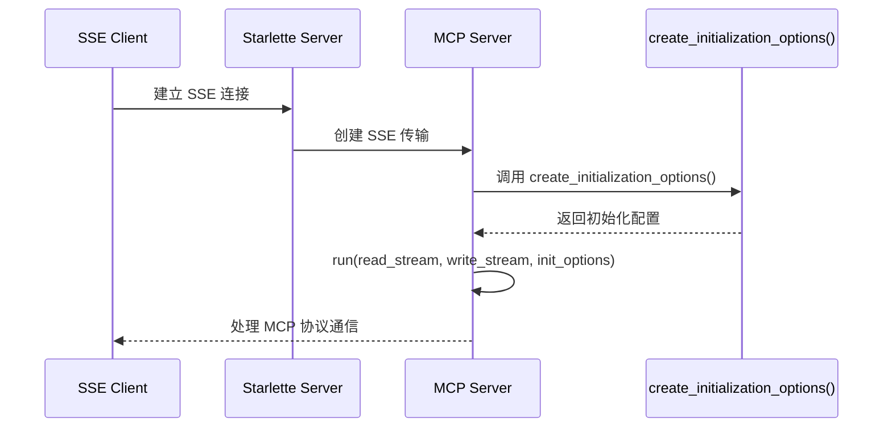

#### 带注释源码

```python
# 该方法是 FastMCP 库内部方法，在代码中被调用
# 位于 mcp_server (FastMCP._mcp_server) 实例上

async def handle_sse(request: Request) -> None:
    """处理 SSE 连接请求。"""
    async with sse.connect_sse(
        request.scope,
        request.receive,
        request._send,
    ) as (read_stream, write_stream):
        # 调用 create_initialization_options() 获取初始化配置
        # 该方法返回 MCP 协议握手所需的所有配置参数
        await mcp_server.run(
            read_stream,
            write_stream,
            mcp_server.create_initialization_options(),  # 返回 InitializationOptions 对象
        )
```

---

### 备注

`create_initialization_options` 是 FastMCP 框架提供的内部方法，用于生成 MCP 服务器的初始化参数。在该代码中，它在 SSE 传输模式下被调用，确保 MCP 客户端与服务器之间能够正确进行协议握手和功能协商。


### `FastMCP._mcp_server`

该属性是 FastMCP 框架提供的内部属性，用于获取底层 MCP 服务器实例。通过该实例可以创建 Starlette 应用或直接运行服务器。

参数：

-  该属性无直接参数，通过 `mcp._mcp_server` 形式访问

返回值：`Any`（MCP 服务器实例），用于创建 Starlette 应用或运行服务器

#### 流程图

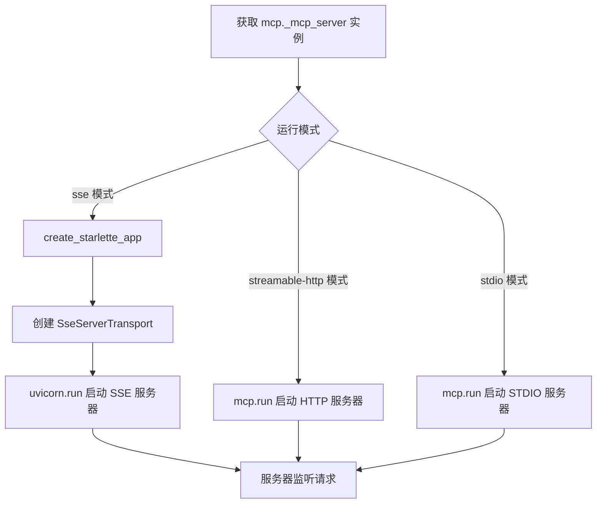

#### 带注释源码

```python
# 在 run_server 函数中的使用方式

def run_server(mode=None, port=8001, host="127.0.0.1"):
    """运行 FastMCP 服务器。

    Args:
        mode: 运行模式，支持stdio、sse、streamable-http
        port: 服务器端口，默认为8001，仅在HTTP模式下有效
        host: 服务器主机地址，默认为127.0.0.1，仅在HTTP模式下有效
    """
    # 确保输出目录存在
    config.ensure_output_dir(output_dir)

    # 检查是否设置了 API 密钥
    if not config.MINERU_API_KEY:
        config.logger.warning("警告: MINERU_API_KEY 环境变量未设置。")
        config.logger.warning("使用以下命令设置: export MINERU_API_KEY=your_api_key")

    # 获取MCP服务器实例（通过 FastMCP 内部属性获取）
    # _mcp_server 是 FastMCP 框架提供的底层服务器对象
    mcp_server = mcp._mcp_server

    try:
        # 根据运行模式启动服务器
        if mode == "sse":
            config.logger.info(f"启动SSE服务器: {host}:{port}")
            # 使用 mcp_server 创建 Starlette 应用
            starlette_app = create_starlette_app(mcp_server, debug=True)
            uvicorn.run(starlette_app, host=host, port=port)
        elif mode == "streamable-http":
            config.logger.info(f"启动Streamable HTTP服务器: {host}:{port}")
            # 在HTTP模式下传递端口参数
            mcp.run(mode, port=port)
        else:
            # 默认stdio模式
            config.logger.info("启动STDIO服务器")
            mcp.run(mode or "stdio")
    except Exception as e:
        config.logger.error(f"\n❌ 服务异常退出: {str(e)}")
        traceback.print_exc()
    finally:
        # 清理资源
        cleanup_resources()
```

#### 关键说明

`FastMCP._mcp_server` 是 **FastMCP 框架的内部实现**，非本项目代码中定义的方法，而是一个来自 `fastmcp` 库的只读属性。该属性的主要用途包括：

1. **创建 Starlette 应用**：在 SSE 模式下，需要通过 `_mcp_server` 创建支持 SSE 传输的 Starlette 应用
2. **运行服务器**：`mcp_server.run()` 方法接收输入/输出流和初始化选项来启动服务器
3. **创建初始化选项**：`mcp_server.create_initialization_options()` 用于生成 MCP 协议握手所需的初始化数据


根据提供的代码，我注意到 `MinerUClient` 类是从 `.api` 模块导入的，但 `api.py` 文件的内容并未包含在当前代码中。因此，**`process_file_to_markdown` 方法的完整源码无法直接提取**。

不过，我可以根据代码中的**调用方式**来推断该方法的签名和功能逻辑：

### `MinerUClient.process_file_to_markdown`

该方法是一个异步方法，用于将文件（通过 URL 或本地路径）转换为 Markdown 格式。它接收一个任务提交回调函数、处理对象、OCR 标志和输出目录，然后返回转换结果的路径。

参数：

-  `submit_task_func`：`<function>`，提交任务的回调函数，用于调用 `submit_file_url_task` 或 `submit_file_task`
-  `targets`：`<dict | list>`，待处理的文件或 URL 配置，支持字典格式或字典列表
-  `enable_ocr`：`<bool>`，是否启用 OCR 识别
-  `output_dir`：`<str>`，转换后的输出目录路径

返回值：`<str>`，返回转换结果保存的目录路径

#### 流程图

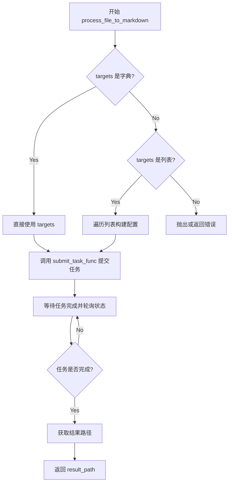

#### 推断的带注释源码（基于调用上下文）

```python
async def process_file_to_markdown(
    self,
    submit_task_func: Callable,  # 提交任务的回调函数
    targets: Dict | List[Dict],   # 目标文件配置
    enable_ocr: bool,             # 是否启用OCR
    output_dir: str,              # 输出目录
) -> str:
    """
    将文件转换为Markdown格式。
    
    Args:
        submit_task_func: 任务提交回调，接收(targets, output_dir)参数
        targets: 文件/URL配置字典或列表
        enable_ocr: 是否启用OCR
        output_dir: 输出目录
    
    Returns:
        str: 转换结果保存的目录路径
    """
    # 1. 处理targets参数，统一格式
    if isinstance(targets, dict):
        targets_to_process = targets
    elif isinstance(targets, list):
        targets_to_process = targets
    else:
        raise ValueError(f"不支持的targets类型: {type(targets)}")
    
    # 2. 调用回调函数提交任务
    # submit_task_func 可能是 submit_file_task 或 submit_file_url_task
    result = await submit_task_func(targets_to_process, output_dir)
    
    # 3. 轮询等待任务完成（根据API特性）
    # 这是一个推断的等待逻辑
    result_path = await self._wait_for_completion(result)
    
    # 4. 返回结果路径
    return result_path
```

---

## ⚠️ 补充说明

由于 `MinerUClient` 类的完整实现在 `api.py` 文件中（该文件未在当前代码中提供），上述源码是**基于调用模式的合理推断**。如需获取准确的实现细节，请提供 `api.py` 文件内容。


# MinerUClient.submit_file_url_task

从提供的代码中，我无法找到 `MinerUClient` 类及其 `submit_file_url_task` 方法的完整定义。该类是通过 `from .api import MinerUClient` 从外部模块导入的。

不过，我可以从代码中的**调用方式**提取相关信息：

### MinerUClient.submit_file_url_task

该方法在 `convert_file_url` 异步函数中被调用，用于处理URL格式的文件转换为Markdown格式。

参数：

- `urls`：`Any`（从lambda表达式传入），待处理的URL配置
- `o`：`Any`（从lambda表达式传入），输出目录相关参数
- `language`：`str`，文档语言，默认"ch"中文，可选"en"英文等
- `page_ranges`：`str | None`，指定页码范围，格式如"2,4-6"，默认None

返回值：预期为 `Any`，包含转换任务提交结果

#### 流程图

```mermaid
sequenceDiagram
    participant User as 用户
    participant parse_documents as parse_documents
    participant convert_file_url as convert_file_url
    participant MinerUClient as MinerUClient
    participant submit_file_url_task as submit_file_url_task
    
    User->>parse_documents: 调用parse_documents处理URL
    parse_documents->>convert_file_url: 传入URL列表、enable_ocr、language、page_ranges
    convert_file_url->>MinerUClient: 获取客户端实例
    convert_file_url->>submit_file_url_task: 调用submit_file_url_task提交URL转换任务
    submit_file_url_task-->>convert_file_url: 返回任务结果
    convert_file_url-->>parse_documents: 返回转换结果
    parse_documents-->>User: 返回处理后的Markdown内容
```

#### 带注释源码

```python
# 该方法在 convert_file_url 函数中被调用
# 调用位置：代码第180-186行

# 使用submit_file_url_task处理URLs
try:
    result_path = await get_client().process_file_to_markdown(
        lambda urls, o: get_client().submit_file_url_task(
            urls,           # URLs配置列表或字典
            o,              # 输出目录路径
            language=language,      # 语言参数: "ch" 或 "en"
            page_ranges=page_ranges,  # 页码范围: "2,4-6" 格式
        ),
        urls_to_process,   # 待处理的URL配置
        enable_ocr,        # 是否启用OCR
        output_dir,        # 输出目录
    )
    return {"status": "success", "result_path": result_path}
except Exception as e:
    return {"status": "error", "error": str(e)}
```

---

**注意**：由于 `MinerUClient` 类定义在外部模块 `.api` 中，未包含在当前提供的代码文件内，无法提取其完整的方法实现细节。如需获取完整的类定义和 `submit_file_url_task` 方法实现，请提供 `api.py` 或相关模块的代码。


# 分析结果

## 问题

从提供的代码中，我无法直接找到 `MinerUClient.submit_file_task` 方法的完整定义。代码中只显示了以下内容：

1. **导入语句**：`from .api import MinerUClient` - 表明 `MinerUClient` 类是从 `.api` 模块导入的
2. **调用方式**：在 `convert_file_path` 函数中有对该方法的调用

```python
# 代码中的调用方式
await get_client().submit_file_task(
    files,
    o,
    language=language,
    page_ranges=page_ranges,
)
```

## 推断的信息

基于代码中的调用上下文，我可以提供以下推断：

### `MinerUClient.submit_file_task`

**描述**：提交文件转换任务到MinerU服务

参数：

- `files`：`Any`，文件配置（可能为字典或字典列表）
- `o`：`Any`，输出配置
- `language`：`str`，文档语言，默认 "ch"
- `page_ranges`：`str | None`，指定页码范围

返回值：推测为 `Dict[str, Any]` 或异步任务结果

#### 流程图

```mermaid
flowchart TD
    A[调用 submit_file_task] --> B{检查参数有效性}
    B -->|参数有效| C[构建API请求]
    B -->|参数无效| D[抛出异常]
    C --> E[发送异步请求到MinerU服务]
    E --> F[等待响应]
    F --> G{请求成功?}
    G -->|是| H[返回转换任务结果]
    G -->|否| I[抛出异常]
```

#### 带注释源码

```python
# 从 convert_file_path 函数中提取的调用示例
# 注意：这是调用方代码，而非方法定义本身

# 准备要处理的文件配置
files_to_process = []  
for i, path in enumerate(file_paths):
    files_to_process.append(
        {
            "path": path,
            "is_ocr": enable_ocr,
        }
    )

# 调用 submit_file_task 提交转换任务
result_path = await get_client().process_file_to_markdown(
    lambda files, o: get_client().submit_file_task(
        files,        # 文件配置列表
        o,            # 输出配置
        language=language,    # 语言参数
        page_ranges=page_ranges,  # 页码范围
    ),
    files_to_process,
    enable_ocr,
    output_dir,
)
```

## 建议

要获取 `MinerUClient` 类及其 `submit_file_task` 方法的完整定义，需要查看 `mineru_client/api.py` 或类似路径下的源文件。目前提供的代码文件（`server.py`）只包含了：

- 服务器启动逻辑
- MCP 工具定义（如 `parse_documents`、`get_ocr_languages`）
- 对 `MinerUClient` 的使用，但未定义该类

如需完整的类定义，请提供 `.api` 模块的代码内容。


### `SseServerTransport.connect_sse`

建立 SSE（Server-Sent Events）连接，创建用于 MCP 服务器通信的读写流。

参数：

- `scope`：`Dict`，ASGI scope 字典，包含请求的元数据（路径、方法、Headers 等）
- `receive`：`Callable`，ASGI receive callable，用于接收客户端消息
- `send`：`Callable`，ASGI send callable，用于向客户端发送消息

返回值：`Tuple[AsyncIterator, AsyncIterator]`，返回元组 `(read_stream, write_stream)`：
- `read_stream`：异步迭代器，用于读取客户端输入
- `write_stream`：异步迭代器，用于向客户端输出

#### 流程图

```mermaid
flowchart TD
    A[客户端发起 SSE 请求] --> B[调用 connect_sse 方法]
    B --> C{建立 SSE 连接}
    C -->|成功| D[返回读写流元组]
    C -->|失败| E[抛出异常]
    D --> F[进入 async with 上下文]
    F --> G[执行 MCP 服务器 run 方法]
    G --> H[处理客户端与 MCP 服务器的通信]
    H --> I[通信完成，自动关闭连接]
```

#### 带注释源码

```python
# 导入 SseServerTransport 类
from mcp.server.sse import SseServerTransport

# 创建 SSE 传输处理器，指定消息路径为 "/messages/"
sse = SseServerTransport("/messages/")

async def handle_sse(request: Request) -> None:
    """处理 SSE 连接请求。
    
    这是 FastMCP 服务器用于 SSE 模式的核心处理函数。
    当客户端连接到 /sse 端点时，此函数会被调用。
    """
    # 使用 async with 上下文管理器调用 connect_sse
    # 该方法会：
    # 1. 解析请求的 ASGI scope、receive、send 参数
    # 2. 建立 SSE 连接
    # 3. 返回 (read_stream, write_stream) 元组供 MCP 服务器使用
    async with sse.connect_sse(
        request.scope,    # ASGI scope 字典，包含请求路径、方法、headers 等
        request.receive,  # 异步接收函数，用于接收客户端消息
        request._send,    # 异步发送函数，用于向客户端发送消息
    ) as (read_stream, write_stream):
        # 在上下文内，运行 MCP 服务器
        # read_stream: 用于读取客户端的请求数据
        # write_stream: 用于向客户端返回响应
        await mcp_server.run(
            read_stream,
            write_stream,
            mcp_server.create_initialization_options(),
        )
    # 退出上下文时自动关闭连接并清理资源
```


# SseServerTransport.handle_post_message 分析

由于 `SseServerTransport` 来自外部依赖库 `mcp.server.sse`（MCP Python SDK），其源码不在当前项目代码中。以下是基于代码使用方式和对 MCP 协议的理解进行的分析。

### SseServerTransport.handle_post_message

这是 MCP 服务器中用于处理 POST 消息的核心方法，属于外部依赖 `mcp.server.sse.SseServerTransport` 类。在当前项目中通过 `Mount("/messages/", app=sse.handle_post_message)` 挂载到 Starlette 路由上，用于接收并处理来自 MCP 客户端的请求消息。

**注意**：该方法的具体实现源码位于 `mcp.server.sse` 第三方库中，以下信息基于代码使用方式和 MCP 协议推断。

参数：

-  `scope`：字典，Starlette 请求的 ASGI scope，包含请求的路径、方法、头部等信息
-  `receive`：可调用对象，Starlette 用于接收请求体的协程函数
-  `send`：可调用对象，Starlette 用于发送响应的协程函数

返回值：`None`，该方法通过 `send` 回调直接发送响应，不返回任何值

#### 流程图

```mermaid
flowchart TD
    A[客户端POST请求到 /messages/] --> B{handle_post_message 被调用}
    B --> C[从 receive 获取请求体]
    C --> D[解析 MCP 协议消息]
    D --> E[调用 MCP 服务器处理消息]
    E --> F[通过 send 发送 SSE 响应]
    F --> G[客户端接收实时消息流]
    
    style A fill:#e1f5fe
    style G fill:#e1f5fe
    style E fill:#fff3e0
```

#### 带注释源码

```python
# 以下为基于 mcp.server.sse 库使用方式的推断源码
# 实际源码位于 mcp.server.sse 包中

"""
SseServerTransport 类的 handle_post_message 方法使用方式：

在项目中的调用位置 (server.py 第48行):
"""
Mount("/messages/", app=sse.handle_post_message)

"""
方法功能说明:
1. 接收来自 MCP 客户端的 POST 请求（包含 JSON-RPC 消息）
2. 解析请求体中的 MCP 协议消息
3. 将消息传递给 MCP 服务器实例处理
4. 通过 Server-Sent Events (SSE) 将处理结果实时推送回客户端

典型的工作流程:
"""

async def handle_post_message(scope, receive, send):
    """处理 MCP 客户端的 POST 消息请求。
    
    Args:
        scope: ASGI scope 字典，包含请求的元数据
        receive: 异步接收函数，用于获取请求体
        send: 异步发送函数，用于发送 SSE 响应
    """
    # 1. 接收并解析请求体（JSON-RPC 格式的 MCP 消息）
    # 2. 创建消息流
    # 3. 调用 mcp_server.run() 处理消息
    # 4. 通过 SSE 发送响应
    
    # 注意: 实际实现位于 mcp.server.sse 第三方库
    pass
```

#### 在项目中的实际调用方式

```python
# server.py 第 34-48 行
sse = SseServerTransport("/messages/")  # 创建传输层实例，指定消息路径前缀

async def handle_sse(request: Request) -> None:
    """处理SSE连接请求。"""
    async with sse.connect_sse(
        request.scope,
        request.receive,
        request._send,
    ) as (read_stream, write_stream):
        await mcp_server.run(
            read_stream,
            write_stream,
            mcp_server.create_initialization_options(),
        )

return Starlette(
    debug=debug,
    routes=[
        Route("/sse", endpoint=handle_sse),           # SSE 连接端点
        Mount("/messages/", app=sse.handle_post_message),  # POST 消息处理端点
    ],
)
```

#### 关键组件信息

| 名称 | 一句话描述 |
|------|-----------|
| `SseServerTransport` | MCP 协议的 SSE 传输层实现，负责消息的接收和处理 |
| `handle_post_message` | 处理客户端 POST 请求的核心方法，将消息路由到 MCP 服务器 |
| `connect_sse` | 建立 SSE 连接的辅助方法，用于双向流式通信 |

#### 技术债务与优化空间

1. **外部依赖透明度**：项目中使用了 `mcp.server.sse` 但没有在文档或 requirements 中明确标注版本依赖，可能导致兼容性问题
2. **错误处理缺失**：`handle_post_message` 的调用没有显式的错误处理，如果消息处理失败可能导致连接异常断开
3. **日志记录不足**：没有对消息路由过程进行详细的日志记录，难以调试生产环境中的问题

## 关键组件


### MinerU文件转Markdown转换服务

该代码实现了一个基于FastMCP框架的文件转Markdown转换服务器，支持多种文档格式（PDF、Word、PPT、图片等）的本地和远程解析，具备OCR识别、多语言支持、单例客户端管理、多运行模式（SSE/STDIO/Streamable-HTTP）切换，以及自动结果读取与格式转换功能。

### 关键组件识别

#### 组件1：FastMCP服务器初始化与配置

使用FastMCP框架创建MCP服务器实例，配置服务器名称、指令说明和服务工具。

#### 组件2：多模式服务器运行架构

支持stdio、sse、streamable-http三种运行模式，通过run_server函数根据mode参数动态选择，并使用Starlette框架处理SSE传输。

#### 组件3：MinerUClient单例管理

通过get_client函数实现MinerUClient的单例模式，确保全局只有一个客户端实例，避免资源浪费。

#### 组件4：URL文件转换流程

convert_file_url函数处理远程URL文件的转换请求，支持单个URL、URL列表、JSON配置等多种输入格式的解析。

#### 组件5：本地文件转换流程

convert_file_path函数处理本地文件的转换请求，支持文件路径的批量处理和多种输入格式的解析。

#### 组件6：本地API解析实现

_parse_file_local函数通过aiohttp向本地MinerU API发送文件进行解析，支持二进制文件上传和解析方法指定。

#### 组件7：转换结果读取与定位

read_converted_file和find_and_read_markdown_content函数实现转换后文件的自动查找和内容读取，支持多种文件名策略和模糊匹配。

#### 组件8：转换结果后处理

_process_conversion_result函数统一处理不同格式的转换结果（批量处理结果、传统路径格式、字典格式），提取并返回标准化的内容。

#### 组件9：统一文档解析入口

parse_documents是主要工具函数，根据USE_LOCAL_API配置自动选择本地或远程处理方式，支持混合路径和URL输入，提供批量处理和详细统计信息。

#### 组件10：OCR语言获取功能

get_ocr_languages工具函数返回MinerU支持的OCR语言列表，供用户选择合适的识别语言。


## 问题及建议


### 已知问题

-   **全局状态管理混乱**：`output_dir` 使用全局变量，在 `run_server` 函数中直接引用但未作为参数传入，容易导致状态不一致和难以测试
-   **重复代码模式**：`convert_file_url` 和 `convert_file_path` 函数包含大量重复的输入解析逻辑（字典/列表/字符串格式检测），可提取为通用函数
-   **返回值格式不统一**：错误处理时存在多种返回格式（`error`、`warning`、`message`），部分返回 `status` + `error`，部分返回 `status` + `message`，缺乏一致的错误响应规范
-   **类型注解缺失**：`run_server` 函数的 `mode` 参数缺少类型注解，文档字符串与实际实现不完整
-   **资源泄漏风险**：`_parse_file_local` 中使用 `aiohttp.ClientSession()` 但未显式关闭，每次请求创建新会话，存在连接池耗尽的风险
-   **缺少重试机制**：网络请求（远程API调用、本地API调用）没有任何重试逻辑，瞬时网络故障会导致直接失败
-   **并发处理不足**：批量文件处理采用串行循环（`for path in file_paths`），未利用 `asyncio.gather` 或并发机制，处理大量文件时效率低下

### 优化建议

-   **重构全局状态**：将 `output_dir` 作为参数传递给需要的函数，或使用依赖注入模式，便于测试和配置管理
-   **提取通用解析逻辑**：将 URL 和文件路径的输入格式解析（字典/列表/JSON字符串）合并为一个 `parse_input_config` 函数
-   **统一错误响应规范**：定义标准的 `Result` 或 `ApiResponse` 类，确保所有函数返回格式一致；区分 `error`（业务错误）和 `warning`（可恢复提示）
-   **完善类型注解**：为 `run_server` 添加 `mode: Optional[str] = None` 类型注解，补充缺失的参数文档
-   **优化资源管理**：创建模块级 `aiohttp.ClientSession` 并复用，或使用上下文管理器确保会话正确关闭
-   **添加重试机制**：使用 `aiohttp-retry` 或自定义重试装饰器，为远程API调用添加指数退避重试
-   **实现并发处理**：使用 `asyncio.gather` 或 `asyncio.Semaphore` 控制并发数批量处理文件，提升吞吐量
-   **拆分巨型函数**：`parse_documents` 函数过长（超过200行），建议拆分为输入解析、路径分类、处理执行、结果汇总等子函数

## 其它


### 设计目标与约束

**设计目标：**
本项目旨在构建一个基于FastMCP框架的文档转换服务，将各类文档（PDF、Word、PPT、图片等）转换为Markdown格式。核心目标包括：提供统一的文档解析接口、支持本地和远程API模式、具备良好的扩展性和容错能力。

**约束条件：**
- 依赖`MINERU_API_KEY`环境变量进行远程API认证
- 本地模式需配置`USE_LOCAL_API=true`和`LOCAL_MINERU_API_BASE`
- 输出目录默认为`./output`，可通过`set_output_dir`配置
- 支持的文件格式：PDF、DOC、DOCX、PPT、PPTX、JPG、JPEG、PNG

### 错误处理与异常设计

**异常分类：**
- 输入验证异常：`ValueError`（无效URL/文件路径、格式不支持）
- 文件操作异常：`FileNotFoundError`（文件不存在）、IO异常（读写失败）
- 网络通信异常：`aiohttp.ClientError`（API请求失败）
- 业务逻辑异常：`RuntimeError`（API返回错误状态码）

**处理策略：**
- 统一返回`{"status": "error", "error": "错误信息"}`格式
- 全局异常捕获在`run_server`中，记录日志并触发资源清理
- 单个文件处理失败不影响批量任务继续执行
- 远程API模式下，URL和本地文件分别处理，互不影响

### 数据流与状态机

**主数据流：**
```
用户输入(file_sources) 
→ parse_list_input() 解析输入 
→ 分类(URL/本地文件) 
→ 选择处理模式(本地API/远程API) 
→ submit_file_url_task() 或 submit_file_path_task() 
→ process_file_to_markdown() 
→ find_and_read_markdown_content() 
→ 返回结果
```

**状态转换：**
- `parse_documents`: idle → parsing → completed/error
- 批量处理: 对每个source独立维护状态，支持部分成功(partial_success)

### 外部依赖与接口契约

**核心依赖：**
- `fastmcp`: MCP服务器框架
- `aiohttp`: 异步HTTP客户端
- `uvicorn`: ASGI服务器
- `pydantic`: 数据验证
- `starlette`: Web框架
- `MinerUClient`: 自定义API客户端（位于.api模块）

**接口契约：**
- MCP工具`parse_documents`: 输入文件路径/URL列表，输出转换结果
- MCP工具`get_ocr_languages`: 返回支持的OCR语言列表
- RESTful端点: `/sse`(SSE连接)、`/messages/`(POST消息处理)

### 安全性考虑

- API密钥通过环境变量`MINERU_API_KEY`注入，避免硬编码
- 文件路径操作使用`Path`对象防止路径遍历攻击
- JSON解析异常捕获防止恶意输入
- SSE连接支持调试模式

### 性能考量

- 使用单例模式复用`MinerUClient`实例
- 异步处理`async/await`提升并发能力
- 去重处理避免重复解析相同文件
- 批量处理时逐个维护结果而非等待全部完成

### 配置管理

- 通过`config`模块集中管理配置
- 环境变量控制：`MINERU_API_KEY`、`USE_LOCAL_API`、`LOCAL_MINERU_API_BASE`
- 运行时配置：`output_dir`支持动态修改

### 兼容性考虑

- 支持Python 3.8+（基于类型注解和asyncio）
- 兼容stdio、SSE、streamable-http三种运行模式
- 结果格式兼容：单个结果直接返回，多个结果返回列表


    