# `MinerU\projects\mineru_tianshu\api_server.py` 详细设计文档

MinerU Tianshu API服务器是一个基于FastAPI的RESTful服务，提供文档解析任务的提交、查询、管理功能，支持MinIO对象存储集成，用于企业级多GPU文档解析场景。

## 整体流程

```mermaid
graph TD
    A[客户端请求] --> B{请求类型}
    B -->|POST /submit| C[submit_task]
    B -->|GET /tasks/{id}/data| D[get_task_data]
    B -->|GET /tasks/{id}| E[get_task_status]
    B -->|DELETE /tasks/{id}| F[cancel_task]
    B -->|GET /queue/stats| G[get_queue_stats]
    B -->|GET /queue/tasks| H[list_tasks]
    B -->|GET /health| I[health_check]
    B -->|POST /admin/cleanup| J[cleanup_old_tasks]
    B -->|POST /admin/reset-stale| K[reset_stale_tasks]
    C --> L[保存上传文件到临时目录]
    L --> M[调用db.create_task创建任务]
    M --> N[返回task_id和任务状态]
    D --> O[检查任务是否存在]
    O -->|不存在| P[抛出404错误]
    O -->|存在| Q{任务是否完成}
    Q -->|未完成| R[返回当前状态]
    Q -->|已完成| S[读取解析结果文件]
    S --> T[根据include_fields返回对应数据]
    T --> U{是否需要上传图片}
    U -->|是| V[process_markdown_images]
    U -->|否| W[返回响应]
    E --> X[查询任务状态和详情]
    X --> Y{任务是否完成}
    Y -->|是| Z[读取Markdown内容]
    Z --> AA[处理图片并返回data字段]
    Y -->|否| AB[仅返回状态信息]
```

## 类结构

```
FastAPI Application
├── API Endpoints
│   ├── Root (/, GET)
│   ├── Task Management
│   │   ├── /api/v1/tasks/submit (POST)
│   │   ├── /api/v1/tasks/{task_id}/data (GET)
│   │   ├── /api/v1/tasks/{task_id} (GET)
│   │   └── /api/v1/tasks/{task_id} (DELETE)
│   ├── Queue Management
│   │   ├── /api/v1/queue/stats (GET)
│   │   └── /api/v1/queue/tasks (GET)
│   ├── Admin Operations
│   │   ├── /api/v1/admin/cleanup (POST)
│   │   └── /api/v1/admin/reset-stale (POST)
│   └── Health Check
│       └── /api/v1/health (GET)
└── Utility Functions
    ├── get_minio_client
    ├── process_markdown_images
    ├── read_json_file
    ├── get_file_metadata
    └── get_images_info
```

## 全局变量及字段


### `app`
    
FastAPI 应用实例，提供 RESTful API 接口用于任务提交、查询和管理

类型：`FastAPI`
    


### `db`
    
数据库实例，用于任务状态管理、持久化和队列统计

类型：`TaskDB`
    


### `OUTPUT_DIR`
    
解析结果文件的输出目录路径

类型：`Path`
    


### `MINIO_CONFIG`
    
MinIO 对象存储服务配置字典，包含 endpoint、access_key、secret_key 等配置

类型：`dict`
    


    

## 全局函数及方法


### `get_minio_client`

获取MinIO客户端实例，用于与MinIO对象存储服务建立连接。

参数：

- （无参数）

返回值：`Minio`，MinIO 客户端实例，用于操作对象存储

#### 流程图

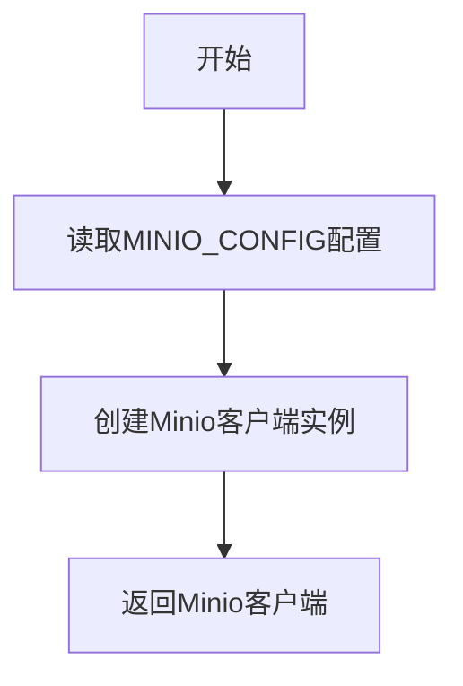

#### 带注释源码

```python
def get_minio_client():
    """
    获取MinIO客户端实例
    
    该函数从全局配置 MINIO_CONFIG 中读取连接参数，
    创建一个 Minio 客户端对象用于后续与 MinIO 对象存储服务交互。
    
    配置项来源（优先级从高到低）：
    1. 环境变量：MINIO_ENDPOINT, MINIO_ACCESS_KEY, MINIO_SECRET_KEY, MINIO_BUCKET
    2. 默认值：空字符串
    
    Returns:
        Minio: MinIO 客户端实例，可用于上传、下载、删除等对象存储操作
    """
    return Minio(
        endpoint=MINIO_CONFIG['endpoint'],      # MinIO服务地址，如：localhost:9000
        access_key=MINIO_CONFIG['access_key'],  # 访问密钥
        secret_key=MINIO_CONFIG['secret_key'],  # 秘密密钥
        secure=MINIO_CONFIG['secure']            # 是否使用HTTPS连接
    )
```


### `process_markdown_images`

该函数用于处理 Markdown 内容中的图片引用，支持将本地图片上传至 MinIO 对象存储服务，并将 Markdown 中的图片引用替换为可直接访问的 HTML img 标签。

#### 参数

- `md_content`：`str`，原始 Markdown 文档内容
- `image_dir`：`Path`，图片文件所在目录的路径对象
- `upload_images`：`bool`，是否执行图片上传与链接替换操作，默认为 False

#### 返回值

`str`，处理后的 Markdown 内容。当 `upload_images` 为 False 时返回原内容；上传失败时返回保留原引用的内容；成功时返回图片链接已被替换为 MinIO URL 的 HTML img 标签格式内容。

#### 流程图

```mermaid
flowchart TD
    A[开始处理 Markdown 图片] --> B{upload_images 为 True?}
    B -->|否| C[直接返回原始 md_content]
    B -->|是| D[获取 MinIO 客户端和配置]
    D --> E[编译正则表达式 !\[[^\]]*\]\(([^)]+)\)]
    E --> F[遍历匹配到的所有图片引用]
    F --> G[提取 alt 文本和图片路径]
    G --> H[构建完整本地图片路径]
    H --> I{图片文件存在?}
    I -->|否| J[返回原始引用]
    I -->|是| K[生成 UUID 新文件名]
    K --> L[上传图片到 MinIO]
    L --> M{上传成功?}
    M -->|否| N[记录错误日志并返回原始引用]
    M -->|是| O[生成 MinIO 访问 URL]
    O --> P[返回 HTML img 标签]
    P --> Q[替换所有图片引用]
    Q --> R[返回处理后的内容]
    J --> Q
    N --> Q
    C --> S[结束]
    R --> S
```

#### 带注释源码

```python
def process_markdown_images(md_content: str, image_dir: Path, upload_images: bool = False):
    """
    处理 Markdown 中的图片引用
    
    Args:
        md_content: Markdown 内容
        image_dir: 图片所在目录
        upload_images: 是否上传图片到 MinIO 并替换链接
        
    Returns:
        处理后的 Markdown 内容
    """
    # 如果不需要上传图片，直接返回原始内容
    if not upload_images:
        return md_content
    
    try:
        # 获取 MinIO 客户端实例
        minio_client = get_minio_client()
        bucket_name = MINIO_CONFIG['bucket_name']
        minio_endpoint = MINIO_CONFIG['endpoint']
        
        # 定义正则表达式匹配 Markdown 图片语法：
        # !\[([^\]]*)\] 匹配 alt 文本部分
        # \(([^)]+)\) 匹配图片路径部分
        img_pattern = r'!\[([^\]]*)\]\(([^)]+)\)'
        
        # 定义替换函数，用于 re.sub() 的回调
        def replace_image(match):
            # 提取 alt 文本（图片无法显示时显示的替代文本）
            alt_text = match.group(1)
            # 提取图片路径
            image_path = match.group(2)
            
            # 构建完整的本地图片路径（目录 + 文件名）
            full_image_path = image_dir / Path(image_path).name
            
            # 检查图片文件是否存在
            if full_image_path.exists():
                # 获取文件后缀（如 .png, .jpg）
                file_extension = full_image_path.suffix
                # 使用 UUID 生成唯一的新文件名，避免冲突
                new_filename = f"{uuid.uuid4()}{file_extension}"
                
                try:
                    # 构造 MinIO 对象存储路径
                    object_name = f"images/{new_filename}"
                    # 执行文件上传
                    minio_client.fput_object(bucket_name=bucket_name, object_name=object_name, file_path=str(full_image_path))
                    
                    # 根据配置决定使用 HTTP 还是 HTTPS 协议
                    scheme = 'https' if MINIO_CONFIG['secure'] else 'http'
                    # 生成 MinIO 访问 URL
                    minio_url = f"{scheme}://{minio_endpoint}/{bucket_name}/{object_name}"
                    
                    # 返回 HTML 格式的 img 标签，替换原有 Markdown 语法
                    return f''
                except Exception as e:
                    # 上传失败时记录日志，并保持原始 Markdown 引用不变
                    logger.error(f"Failed to upload image to MinIO: {e}")
                    return match.group(0)
            
            # 图片文件不存在时，返回原始引用
            return match.group(0)
        
        # 使用正则表达式替换所有图片引用
        new_content = re.sub(img_pattern, replace_image, md_content)
        return new_content
        
    except Exception as e:
        # 整个处理流程发生异常时，记录错误并返回原始内容
        logger.error(f"Error processing markdown images: {e}")
        return md_content
```


### `read_json_file`

读取 JSON 文件并返回解析后的数据，支持 UTF-8 编码，如果读取或解析失败则记录日志并返回 None。

参数：

- `file_path`：`Path`，JSON 文件路径

返回值：`任意类型 | None`，解析后的 JSON 数据（Python 对象），失败返回 None

#### 流程图

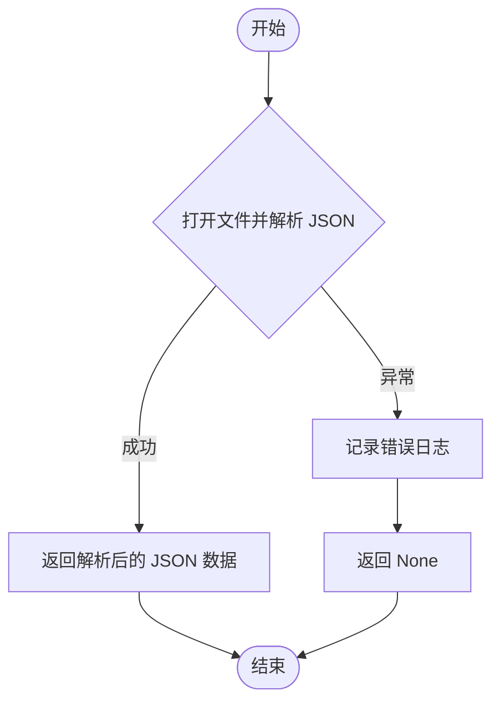

#### 带注释源码

```python
def read_json_file(file_path: Path):
    """
    读取 JSON 文件

    Args:
        file_path: JSON 文件路径

    Returns:
        解析后的 JSON 数据，失败返回 None
    """
    try:
        # 以 UTF-8 编码打开文件并使用 json.load 解析
        with open(file_path, 'r', encoding='utf-8') as f:
            return json.load(f)
    except Exception as e:
        # 捕获所有异常并记录错误日志，返回 None 表示失败
        logger.error(f"Failed to read JSON file {file_path}: {e}")
        return None
```


### `get_file_metadata`

获取文件的元数据信息，包括文件大小、创建时间和修改时间。

参数：

- `file_path`：`Path`，文件路径

返回值：`Optional[Dict]`，包含文件元数据的字典（包含 size、created_at、modified_at），文件不存在时返回 None

#### 流程图

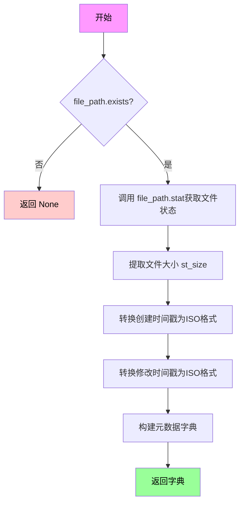

#### 带注释源码

```python
def get_file_metadata(file_path: Path):
    """
    获取文件元数据

    Args:
        file_path: 文件路径

    Returns:
        包含文件元数据的字典
    """
    # 检查文件是否存在，不存在则直接返回 None
    if not file_path.exists():
        return None

    # 获取文件的系统状态信息（包含大小、时间戳等）
    stat = file_path.stat()
    
    # 构建并返回包含文件元数据的字典
    # size: 文件大小（字节）
    # created_at: 文件创建时间（ISO 格式字符串）
    # modified_at: 文件修改时间（ISO 格式字符串）
    return {
        'size': stat.st_size,
        'created_at': datetime.fromtimestamp(stat.st_ctime).isoformat(),
        'modified_at': datetime.fromtimestamp(stat.st_mtime).isoformat()
    }
```


### `get_images_info`

获取指定图片目录中的所有图片信息，可选择是否将图片上传到 MinIO 并生成访问 URL。

参数：

- `image_dir`：`Path`，图片目录的路径对象
- `upload_to_minio`：`bool`，是否将图片上传到 MinIO 并生成访问 URL，默认为 False

返回值：`dict`，包含图片数量、图片列表和上传状态的信息字典

#### 流程图

```mermaid
flowchart TD
    A[开始 get_images_info] --> B{图片目录是否存在且为目录}
    B -->|否| C[返回空结果: count=0, list=[], uploaded_to_minio=False]
    B -->|是| D[定义支持的图片格式集合]
    D --> E[遍历目录下的所有文件]
    E --> F{文件是图片格式?}
    F -->|否| E
    F -->|是| G[获取图片基本信息: name, size, path]
    H{upload_to_minio 为 true?}
    H -->|否| I[将图片信息添加到列表]
    H -->|是| J[调用 get_minio_client 获取客户端]
    J --> K[生成 UUID 新文件名]
    K --> L[上传图片到 MinIO]
    L --> M{上传成功?}
    M -->|是| N[生成 MinIO 访问 URL]
    M -->|否| O[记录错误, url 设为 None]
    N --> P[将 url 添加到图片信息]
    O --> P
    P --> I
    I --> Q{还有更多图片文件?}
    Q -->|是| E
    Q -->|否| R[返回结果字典]
    C --> R
```

#### 带注释源码

```python
def get_images_info(image_dir: Path, upload_to_minio: bool = False):
    """
    获取图片目录信息

    Args:
        image_dir: 图片目录路径
        upload_to_minio: 是否上传到 MinIO

    Returns:
        图片信息字典
    """
    # 检查目录是否存在且为有效目录，无效则返回空结果
    if not image_dir.exists() or not image_dir.is_dir():
        return {
            'count': 0,
            'list': [],
            'uploaded_to_minio': False
        }

    # 定义支持的图片格式集合，用于过滤目录中的图片文件
    image_extensions = {'.png', '.jpg', '.jpeg', '.gif', '.bmp', '.webp', '.svg'}
    # 筛选出目录中所有符合图片格式的文件，并按名称排序
    image_files = [f for f in image_dir.iterdir() if f.is_file() and f.suffix.lower() in image_extensions]

    # 初始化图片信息列表
    images_list = []

    # 遍历每个图片文件
    for img_file in sorted(image_files):
        # 构建基础图片信息字典，包含文件名、大小和相对路径
        img_info = {
            'name': img_file.name,
            'size': img_file.stat().st_size,
            'path': str(img_file.relative_to(image_dir.parent))
        }

        # 如果需要上传到 MinIO
        if upload_to_minio:
            try:
                # 获取 MinIO 客户端实例和配置信息
                minio_client = get_minio_client()
                bucket_name = MINIO_CONFIG['bucket_name']
                minio_endpoint = MINIO_CONFIG['endpoint']

                # 使用 UUID 生成唯一的文件名，保持原文件扩展名
                file_extension = img_file.suffix
                new_filename = f"{uuid.uuid4()}{file_extension}"
                # MinIO 对象名称使用 images/ 前缀组织
                object_name = f"images/{new_filename}"

                # 执行上传到 MinIO 操作
                minio_client.fput_object(bucket_name=bucket_name, object_name=object_name, file_path=str(img_file))

                # 根据配置的安全设置选择 HTTP 协议，生成访问 URL
                scheme = 'https' if MINIO_CONFIG['secure'] else 'http'
                img_info['url'] = f"{scheme}://{minio_endpoint}/{bucket_name}/{object_name}"

            except Exception as e:
                # 捕获上传过程中的异常，记录错误日志，URL 设为 None
                logger.error(f"Failed to upload image {img_file.name} to MinIO: {e}")
                img_info['url'] = None

        # 将处理完的图片信息添加到列表中
        images_list.append(img_info)

    # 返回包含计数、图片列表和上传状态的结果字典
    return {
        'count': len(images_list),
        'list': images_list,
        'uploaded_to_minio': upload_to_minio
    }
```


### `root`

这是 FastAPI 应用根路径的 GET 请求处理函数，提供服务的基本信息，包括服务名称、版本、描述和文档访问路径。

参数：
- 此函数没有参数

返回值：`dict`，返回包含服务元数据的字典，包括服务名称、MinerU Tianshu 的版本号、"天枢 - 企业级多GPU文档解析服务" 的描述，以及 FastAPI 自动生成的交互式 API 文档路径 "/docs"

#### 流程图

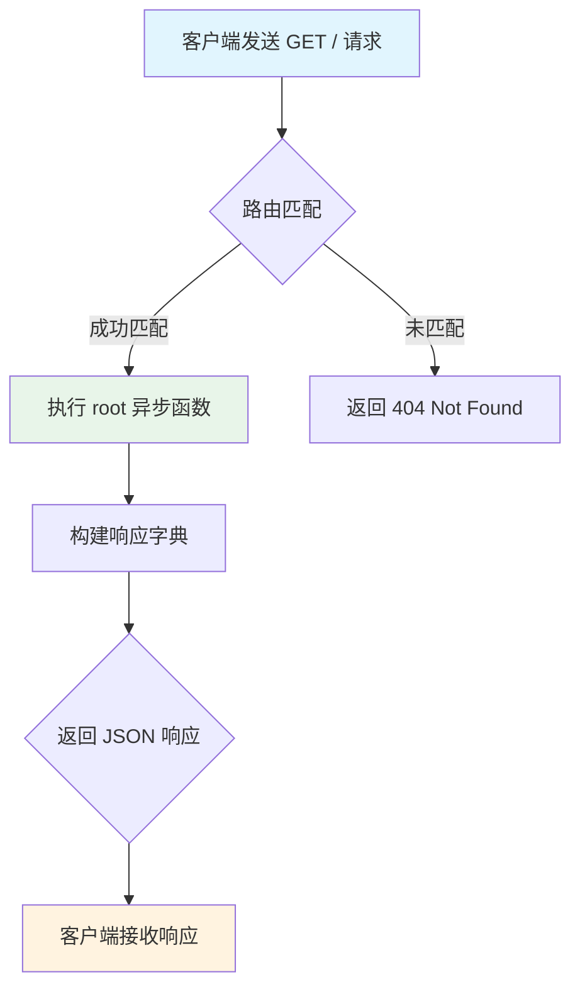

#### 带注释源码

```python
@app.get("/")
async def root():
    """
    API根路径
    
    这是一个简单的健康检查和元数据端点，返回服务的基本信息。
    客户端可以通过访问根路径快速确认服务是否在线运行，
    同时获取服务的名称、版本号和文档访问入口。
    """
    return {
        "service": "MinerU Tianshu",      # 服务名称
        "version": "1.0.0",                # 服务版本号
        "description": "天枢 - 企业级多GPU文档解析服务",  # 服务描述
        "docs": "/docs"                    # FastAPI 自动生成的 Swagger UI 文档路径
    }
```


### `submit_task`

提交文档解析任务到后台处理，立即返回 task_id，任务在后台异步执行。

参数：

- `file`：`UploadFile`，文档文件：PDF/图片(MinerU解析) 或 Office/HTML/文本等(MarkItDown解析)
- `backend`：`str`，处理后端：pipeline/vlm-transformers/vlm-vllm-engine
- `lang`：`str`，语言：ch/en/korean/japan等
- `method`：`str`，解析方法：auto/txt/ocr
- `formula_enable`：`bool`，是否启用公式识别
- `table_enable`：`bool`，是否启用表格识别
- `priority`：`int`，优先级，数字越大越优先

返回值：`dict`，包含任务提交结果的字典，包含 success、task_id、status、message、file_name、created_at 字段

#### 流程图

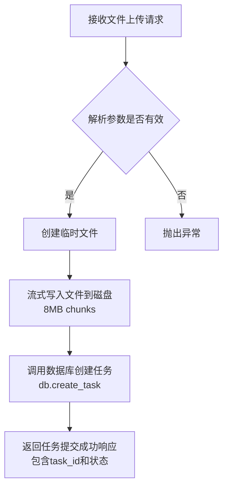

#### 带注释源码

```python
@app.post("/api/v1/tasks/submit")
async def submit_task(
    file: UploadFile = File(..., description="文档文件: PDF/图片(MinerU解析) 或 Office/HTML/文本等(MarkItDown解析)"),
    backend: str = Form('pipeline', description="处理后端: pipeline/vlm-transformers/vlm-vllm-engine"),
    lang: str = Form('ch', description="语言: ch/en/korean/japan等"),
    method: str = Form('auto', description="解析方法: auto/txt/ocr"),
    formula_enable: bool = Form(True, description="是否启用公式识别"),
    table_enable: bool = Form(True, description="是否启用表格识别"),
    priority: int = Form(0, description="优先级，数字越大越优先"),
):
    """
    提交文档解析任务
    
    立即返回 task_id，任务在后台异步处理
    """
    try:
        # 保存上传的文件到临时目录
        # 使用 NamedTemporaryFile 创建临时文件，保持原文件扩展名
        temp_file = tempfile.NamedTemporaryFile(delete=False, suffix=Path(file.filename).suffix)
        
        # 流式写入文件到磁盘，避免高内存使用
        # 使用 8MB (1 << 23) 大小的 chunk 进行分块读取和写入
        while True:
            chunk = await file.read(1 << 23)  # 8MB chunks
            if not chunk:
                break
            temp_file.write(chunk)
        
        temp_file.close()
        
        # 创建任务
        # 调用数据库模块创建任务记录，传入文件信息和处理选项
        task_id = db.create_task(
            file_name=file.filename,
            file_path=temp_file.name,
            backend=backend,
            options={
                'lang': lang,
                'method': method,
                'formula_enable': formula_enable,
                'table_enable': table_enable,
            },
            priority=priority
        )
        
        logger.info(f"✅ Task submitted: {task_id} - {file.filename} (priority: {priority})")
        
        # 返回任务提交成功的响应
        return {
            'success': True,
            'task_id': task_id,
            'status': 'pending',
            'message': 'Task submitted successfully',
            'file_name': file.filename,
            'created_at': datetime.now().isoformat()
        }
    
    except Exception as e:
        # 捕获异常并记录错误日志
        logger.error(f"❌ Failed to submit task: {e}")
        # 抛出 HTTP 500 异常
        raise HTTPException(status_code=500, detail=str(e))
```


### `get_task_data`

按需获取任务的解析数据，支持灵活获取 MinerU 解析后的各种数据（包括 Markdown 内容、Content List JSON、Middle JSON、Model Output JSON、图片列表等），通过 include_fields 参数按需选择需要返回的字段。

参数：

-  `task_id`：`str`，任务ID，用于唯一标识一个解析任务
-  `include_fields`：`str`，Query参数，需要返回的字段，逗号分隔（可选值：md,content_list,middle_json,model_output,images,layout_pdf,span_pdf,origin_pdf），默认为 "md,content_list,middle_json,model_output,images"
-  `upload_images`：`bool`，Query参数，是否上传图片到MinIO并返回URL，默认为 False
-  `include_metadata`：`bool`，Query参数，是否包含文件元数据，默认为 True

返回值：`dict`，返回任务解析数据，包含 success、task_id、status、file_name、backend、created_at、completed_at 和 data 字段

#### 流程图

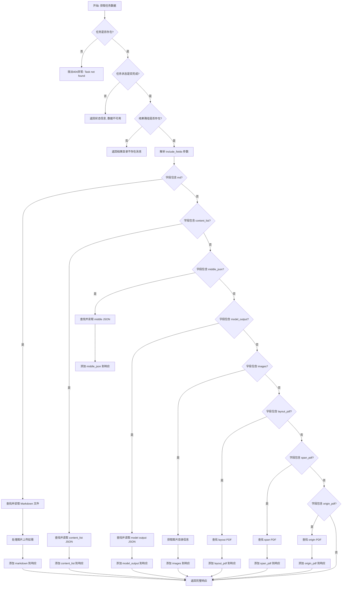

#### 带注释源码

```python
@app.get("/api/v1/tasks/{task_id}/data")
async def get_task_data(
    task_id: str,
    include_fields: str = Query(
        "md,content_list,middle_json,model_output,images",
        description="需要返回的字段，逗号分隔：md,content_list,middle_json,model_output,images,layout_pdf,span_pdf,origin_pdf"
    ),
    upload_images: bool = Query(False, description="是否上传图片到MinIO并返回URL"),
    include_metadata: bool = Query(True, description="是否包含文件元数据")
):
    """
    按需获取任务的解析数据

    支持灵活获取 MinerU 解析后的数据，包括：
    - Markdown 内容
    - Content List JSON（结构化内容列表）
    - Middle JSON（中间处理结果）
    - Model Output JSON（模型原始输出）
    - 图片列表
    - 其他辅助文件（layout PDF、span PDF、origin PDF）

    通过 include_fields 参数按需选择需要返回的字段
    """
    # 第一步：从数据库获取任务信息
    task = db.get_task(task_id)

    # 任务不存在时抛出404异常
    if not task:
        raise HTTPException(status_code=404, detail="Task not found")

    # 第二步：构建基础响应结构，包含任务元信息
    response = {
        'success': True,
        'task_id': task_id,
        'status': task['status'],
        'file_name': task['file_name'],
        'backend': task['backend'],
        'created_at': task['created_at'],
        'completed_at': task['completed_at']
    }

    # 第三步：检查任务状态，未完成则直接返回状态信息
    if task['status'] != 'completed':
        response['message'] = f"Task is in {task['status']} status, data not available yet"
        return response

    # 第四步：检查结果路径有效性
    if not task['result_path']:
        response['message'] = 'Task completed but result files have been cleaned up (older than retention period)'
        return response

    result_dir = Path(task['result_path'])
    if not result_dir.exists():
        response['message'] = 'Result directory does not exist'
        return response

    # 第五步：解析需要返回的字段列表
    fields = [f.strip() for f in include_fields.split(',')]

    # 初始化 data 字段用于存放解析结果
    response['data'] = {}  # type: ignore

    logger.info(f"📦 Getting complete data for task {task_id}, fields: {fields}")

    # 第六步：递归搜索文件并处理各类数据
    try:
        # 1. 处理 Markdown 文件
        if 'md' in fields:
            # 使用 rglob 递归查找所有 md 文件
            md_files = list(result_dir.rglob('*.md'))
            # 排除带特殊后缀的 md 文件（layout/span/origin）
            md_files = [f for f in md_files if not any(f.stem.endswith(suffix) for suffix in ['_layout', '_span', '_origin'])] 

            if md_files:
                md_file = md_files[0]
                logger.info(f"📄 Reading markdown file: {md_file}")

                # 读取 Markdown 内容
                with open(md_file, 'r', encoding='utf-8') as f:
                    md_content = f.read()

                # 如果需要上传图片到 MinIO，处理图片引用
                image_dir = md_file.parent / 'images'
                if upload_images and image_dir.exists():
                    md_content = process_markdown_images(md_content, image_dir, upload_images)

                # 构建响应数据结构
                response['data']['markdown'] = {
                    'content': md_content,
                    'file_name': md_file.name
                }

                # 可选：添加文件元数据
                if include_metadata:
                    metadata = get_file_metadata(md_file)
                    if metadata:
                        response['data']['markdown']['metadata'] = metadata

        # 2. 处理 Content List JSON（结构化内容列表）
        if 'content_list' in fields:
            content_list_files = list(result_dir.rglob('*_content_list.json'))
            if content_list_files:
                content_list_file = content_list_files[0]
                logger.info(f"📄 Reading content list file: {content_list_file}")

                content_data = read_json_file(content_list_file)
                if content_data is not None:
                    response['data']['content_list'] = {
                        'content': content_data,
                        'file_name': content_list_file.name
                    }

                    if include_metadata:
                        metadata = get_file_metadata(content_list_file)
                        if metadata:
                            response['data']['content_list']['metadata'] = metadata

        # 3. 处理 Middle JSON（中间处理结果）
        if 'middle_json' in fields:
            middle_json_files = list(result_dir.rglob('*_middle.json'))
            if middle_json_files:
                middle_json_file = middle_json_files[0]
                logger.info(f"📄 Reading middle json file: {middle_json_file}")

                middle_data = read_json_file(middle_json_file)
                if middle_data is not None:
                    response['data']['middle_json'] = {
                        'content': middle_data,
                        'file_name': middle_json_file.name
                    }

                    if include_metadata:
                        metadata = get_file_metadata(middle_json_file)
                        if metadata:
                            response['data']['middle_json']['metadata'] = metadata

        # 4. 处理 Model Output JSON（模型原始输出）
        if 'model_output' in fields:
            model_output_files = list(result_dir.rglob('*_model.json'))
            if model_output_files:
                model_output_file = model_output_files[0]
                logger.info(f"📄 Reading model output file: {model_output_file}")

                model_data = read_json_file(model_output_file)
                if model_data is not None:
                    response['data']['model_output'] = {
                        'content': model_data,
                        'file_name': model_output_file.name
                    }

                    if include_metadata:
                        metadata = get_file_metadata(model_output_file)
                        if metadata:
                            response['data']['model_output']['metadata'] = metadata

        # 5. 处理图片列表
        if 'images' in fields:
            image_dirs = list(result_dir.rglob('images'))
            if image_dirs:
                image_dir = image_dirs[0]
                logger.info(f"🖼️  Getting images info from: {image_dir}")

                images_info = get_images_info(image_dir, upload_images)
                response['data']['images'] = images_info

        # 6. 处理 Layout PDF（布局PDF）
        if 'layout_pdf' in fields:
            layout_pdf_files = list(result_dir.rglob('*_layout.pdf'))
            if layout_pdf_files:
                layout_pdf_file = layout_pdf_files[0]
                response['data']['layout_pdf'] = {
                    'file_name': layout_pdf_file.name,
                    'path': str(layout_pdf_file.relative_to(result_dir))
                }

                if include_metadata:
                    metadata = get_file_metadata(layout_pdf_file)
                    if metadata:
                        response['data']['layout_pdf']['metadata'] = metadata

        # 7. 处理 Span PDF（Span PDF）
        if 'span_pdf' in fields:
            span_pdf_files = list(result_dir.rglob('*_span.pdf'))
            if span_pdf_files:
                span_pdf_file = span_pdf_files[0]
                response['data']['span_pdf'] = {
                    'file_name': span_pdf_file.name,
                    'path': str(span_pdf_file.relative_to(result_dir))
                }

                if include_metadata:
                    metadata = get_file_metadata(span_pdf_file)
                    if metadata:
                        response['data']['span_pdf']['metadata'] = metadata

        # 8. 处理 Origin PDF（原始PDF）
        if 'origin_pdf' in fields:
            origin_pdf_files = list(result_dir.rglob('*_origin.pdf'))
            if origin_pdf_files:
                origin_pdf_file = origin_pdf_files[0]
                response['data']['origin_pdf'] = {
                    'file_name': origin_pdf_file.name,
                    'path': str(origin_pdf_file.relative_to(result_dir))
                }

                if include_metadata:
                    metadata = get_file_metadata(origin_pdf_file)
                    if metadata:
                        response['data']['origin_pdf']['metadata'] = metadata

        logger.info(f"✅ Complete data retrieved successfully for task {task_id}")

    # 第七步：异常处理
    except Exception as e:
        logger.error(f"❌ Failed to get complete data for task {task_id}: {e}")
        logger.exception(e)
        raise HTTPException(status_code=500, detail=f"Internal server error: {e}")  

    return response
```


### `get_task_status`

查询任务状态和详情。当任务完成时，会自动返回解析后的 Markdown 内容（data 字段），可选择是否上传图片到 MinIO 并替换为 URL。

参数：

-  `task_id`：`str`，任务ID，路径参数
-  `upload_images`：`bool`，是否上传图片到MinIO并替换链接（仅当任务完成时有效），查询参数，默认值为 `False`

返回值：`dict`，包含任务状态、详情及可选的Markdown内容

#### 流程图

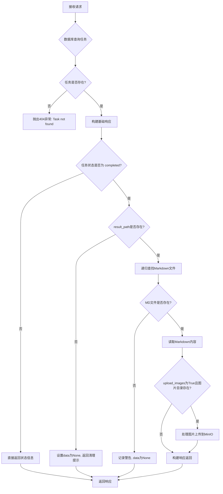

#### 带注释源码

```python
@app.get("/api/v1/tasks/{task_id}")
async def get_task_status(
    task_id: str,
    upload_images: bool = Query(False, description="是否上传图片到MinIO并替换链接（仅当任务完成时有效）")
):
    """
    查询任务状态和详情
    
    当任务完成时，会自动返回解析后的 Markdown 内容（data 字段）
    可选择是否上传图片到 MinIO 并替换为 URL
    """
    # 从数据库获取任务信息
    task = db.get_task(task_id)
    
    # 任务不存在时抛出404异常
    if not task:
        raise HTTPException(status_code=404, detail="Task not found")
    
    # 构建基础响应字典，包含任务的核心信息
    response = {
        'success': True,
        'task_id': task_id,
        'status': task['status'],
        'file_name': task['file_name'],
        'backend': task['backend'],
        'priority': task['priority'],
        'error_message': task['error_message'],
        'created_at': task['created_at'],
        'started_at': task['started_at'],
        'completed_at': task['completed_at'],
        'worker_id': task['worker_id'],
        'retry_count': task['retry_count']
    }
    logger.info(f"✅ Task status: {task['status']} - (result_path: {task['result_path']})")
    
    # 如果任务已完成，尝试返回解析内容
    if task['status'] == 'completed':
        # 检查结果路径是否存在
        if not task['result_path']:
            # 结果文件已被清理（超过保留期）
            response['data'] = None
            response['message'] = 'Task completed but result files have been cleaned up (older than retention period)'
            return response
        
        result_dir = Path(task['result_path'])
        logger.info(f"📂 Checking result directory: {result_dir}")
        
        # 检查结果目录是否存在
        if result_dir.exists():
            logger.info(f"✅ Result directory exists")
            # 递归查找 Markdown 文件（MinerU 输出结构：task_id/filename/auto/*.md）
            md_files = list(result_dir.rglob('*.md'))
            logger.info(f"📄 Found {len(md_files)} markdown files: {[f.relative_to(result_dir) for f in md_files]}")
            
            # 如果找到 Markdown 文件
            if md_files:
                try:
                    # 读取第一个 Markdown 文件内容
                    md_file = md_files[0]
                    logger.info(f"📖 Reading markdown file: {md_file}")
                    with open(md_file, 'r', encoding='utf-8') as f:
                        md_content = f.read()
                    
                    logger.info(f"✅ Markdown content loaded, length: {len(md_content)} characters")
                    
                    # 查找图片目录（在 markdown 文件的同级目录下）
                    image_dir = md_file.parent / 'images'
                    
                    # 处理图片（如果需要上传到 MinIO）
                    if upload_images and image_dir.exists():
                        logger.info(f"🖼️  Processing images for task {task_id}, upload_images={upload_images}")
                        # 调用图片处理函数，上传图片到 MinIO 并替换链接
                        md_content = process_markdown_images(md_content, image_dir, upload_images)
                    
                    # 添加 data 字段到响应
                    response['data'] = {
                        'markdown_file': md_file.name,
                        'content': md_content,
                        'images_uploaded': upload_images,
                        'has_images': image_dir.exists() if not upload_images else None
                    }
                    logger.info(f"✅ Response data field added successfully")
                    
                except Exception as e:
                    # 读取失败不影响状态查询，只是不返回 data
                    logger.error(f"❌ Failed to read markdown content: {e}")
                    logger.exception(e)
                    response['data'] = None
            else:
                # 未找到 Markdown 文件
                logger.warning(f"⚠️  No markdown files found in {result_dir}")
        else:
            # 结果目录不存在
            logger.error(f"❌ Result directory does not exist: {result_dir}")
    elif task['status'] == 'completed':
        # 任务完成但 result_path 为空的边界情况处理
        logger.warning(f"⚠️  Task completed but result_path is empty")
    else:
        # 任务未完成，跳过内容加载
        logger.info(f"ℹ️  Task status is {task['status']}, skipping content loading")
    
    return response
```


### `cancel_task`

取消指定的任务，仅限 pending（待处理）状态的任务可以取消。取消后会更新任务状态为 cancelled 并删除关联的临时文件。

参数：

- `task_id`：`str`，任务ID，从URL路径参数获取

返回值：`dict`，成功时返回包含 `success: True` 和 `message` 的字典；任务不存在时抛出 404 状态码；任务非 pending 状态时抛出 400 状态码

#### 流程图

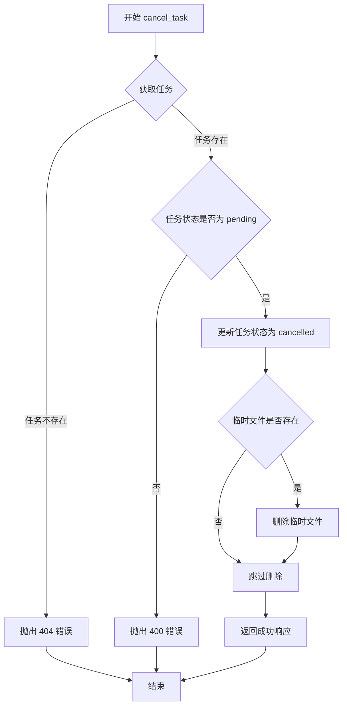

#### 带注释源码

```python
@app.delete("/api/v1/tasks/{task_id}")
async def cancel_task(task_id: str):
    """
    取消任务（仅限 pending 状态）
    
    只有处于 pending（待处理）状态的任务才能被取消。
    取消后会：
    1. 更新任务状态为 cancelled
    2. 删除关联的临时文件
    
    Args:
        task_id: 任务ID，从URL路径参数获取
        
    Returns:
        成功时返回包含 success: True 和 message 的字典
        
    Raises:
        HTTPException: 
            - 404 任务不存在
            - 400 任务状态不是 pending
    """
    # 根据 task_id 从数据库获取任务信息
    task = db.get_task(task_id)
    
    # 检查任务是否存在
    if not task:
        # 任务不存在，抛出 404 错误
        raise HTTPException(status_code=404, detail="Task not found")
    
    # 检查任务状态是否为 pending
    if task['status'] == 'pending':
        # 更新任务状态为 cancelled
        db.update_task_status(task_id, 'cancelled')
        
        # 删除临时文件
        file_path = Path(task['file_path'])
        if file_path.exists():
            # 只有文件存在时才删除
            file_path.unlink()
        
        # 记录日志并返回成功响应
        logger.info(f"⏹️  Task cancelled: {task_id}")
        return {
            'success': True,
            'message': 'Task cancelled successfully'
        }
    else:
        # 任务状态不是 pending，无法取消，抛出 400 错误
        raise HTTPException(
            status_code=400, 
            detail=f"Cannot cancel task in {task['status']} status"
        )
```


### `get_queue_stats`

获取队列统计信息，返回当前任务队列中各状态的任务数量统计。

参数：
- （无显式参数，通过 FastAPI 框架隐式接收请求上下文）

返回值：`dict`，包含任务队列统计信息的字典

#### 流程图

```mermaid
flowchart TD
    A[开始] --> B[调用 db.get_queue_stats]
    B --> C[计算 total = sum(stats.values())]
    C --> D[获取当前时间戳]
    D --> E[构建响应字典]
    E --> F[返回 JSON 响应]
    
    B -.-> B1[查询数据库任务表]
    B1 -.-> B2[按状态分组统计数量]
    B2 -.-> B
```

#### 带注释源码

```python
@app.get("/api/v1/queue/stats")
async def get_queue_stats():
    """
    获取队列统计信息
    
    返回当前任务队列中各状态的任务数量统计，
    包括 pending、processing、completed、failed 等状态的任务数
    """
    # 调用数据库模块获取队列统计数据
    # 返回格式: {'pending': 数量, 'processing': 数量, 'completed': 数量, 'failed': 数量, ...}
    stats = db.get_queue_stats()
    
    # 构建响应字典，包含成功标志、统计数据、总任务数和时间戳
    return {
        'success': True,                           # 响应成功标志
        'stats': stats,                             # 各状态的任务统计字典
        'total': sum(stats.values()),              # 所有状态的任务总数
        'timestamp': datetime.now().isoformat()    # 当前时间戳
    }
```


### `list_tasks`

获取任务列表，支持按状态筛选和分页查询。

参数：

-  `status`：`Optional[str]`，筛选状态: pending/processing/completed/failed
-  `limit`：`int`，返回数量限制，最大值为 1000

返回值：`Dict[str, Any]`，返回包含成功状态、任务数量和任务列表的字典

#### 流程图

```mermaid
flowchart TD
    A[开始] --> B{是否提供status参数?}
    B -->|是| C[调用db.get_tasks_by_status]
    B -->|否| D[直接执行SQL查询]
    C --> E[获取任务列表]
    D --> F[构建SQL语句: SELECT * FROM tasks ORDER BY created_at DESC LIMIT ?]
    F --> G[执行查询]
    G --> E
    E --> H[将查询结果转换为字典列表]
    H --> I[构建响应: {success, count, tasks}]
    I --> J[返回JSON响应]
```

#### 带注释源码

```python
@app.get("/api/v1/queue/tasks")  # 定义GET请求路由 /api/v1/queue/tasks
async def list_tasks(
    status: Optional[str] = Query(None, description="筛选状态: pending/processing/completed/failed"),  # 可选的状态筛选参数
    limit: int = Query(100, description="返回数量限制", le=1000)  # 返回数量限制，最大1000
):
    """
    获取任务列表
    """
    # 判断是否需要按状态筛选
    if status:
        # 如果提供了status参数，调用数据库方法按状态查询
        tasks = db.get_tasks_by_status(status, limit)
    else:
        # 如果没有提供status，返回所有任务（直接执行SQL）
        # 使用数据库游标执行原始SQL查询
        with db.get_cursor() as cursor:
            cursor.execute('''
                SELECT * FROM tasks 
                ORDER BY created_at DESC 
                LIMIT ?
            ''', (limit,))
            # 将查询结果转换为字典列表
            tasks = [dict(row) for row in cursor.fetchall()]
    
    # 构建响应字典，包含成功标志、任务数量和任务列表
    return {
        'success': True,
        'count': len(tasks),
        'tasks': tasks
    }
```


### `cleanup_old_tasks`

清理旧任务记录的管理接口，用于删除超过指定天数的任务数据，释放存储空间。

参数：

-  `days`：`int`，清理N天前的任务，默认为7天

返回值：`dict`，包含是否成功(`success`)、删除的任务数量(`deleted_count`)和消息(`message`)

#### 流程图

```mermaid
flowchart TD
    A[接收 DELETE /api/v1/admin/cleanup 请求] --> B{获取 days 参数}
    B --> C[调用 db.cleanup_old_tasks(days)]
    C --> D[数据库执行清理操作]
    D --> E[记录日志: Cleaned up {deleted_count} old tasks]
    F[返回JSON响应] --> E
    E --> G[结束]
```

#### 带注释源码

```python
@app.post("/api/v1/admin/cleanup")
async def cleanup_old_tasks(days: int = Query(7, description="清理N天前的任务")):
    """
    清理旧任务记录（管理接口）
    
    调用数据库方法删除超过指定天数的任务记录，
    包括任务元数据、临时文件和结果文件
    """
    # 调用数据库模块的清理方法，传入天数参数
    deleted_count = db.cleanup_old_tasks(days)
    
    # 记录清理任务的日志信息
    logger.info(f"🧹 Cleaned up {deleted_count} old tasks")
    
    # 返回清理结果
    return {
        'success': True,
        'deleted_count': deleted_count,
        'message': f'Cleaned up tasks older than {days} days'
    }
```

---

> **注意**：该函数是一个 FastAPI 路由处理器，实际的清理逻辑由 `TaskDB` 类的 `cleanup_old_tasks` 方法实现（位于 `task_db` 模块中，当前代码中未展示该模块的具体实现）。该方法通常会执行以下操作：
> 1. 查询并删除超过指定天数的任务记录
> 2. 删除关联的临时文件（上传的原始文档）
> 3. 删除关联的结果目录（解析输出文件）
> 4. 更新任务计数统计


### `reset_stale_tasks` (API端点) / `TaskDB.reset_stale_tasks` (数据库方法)

重置超时的处理中任务，将状态为 "processing" 且超过指定超时时间的任务重置为 "pending"，以便重新被worker认领执行。

参数：

- `timeout_minutes`：`int`，超时时间（分钟），默认为60分钟，用于判断任务是否已超时

返回值：`int`，返回被重置的任务数量

#### 流程图

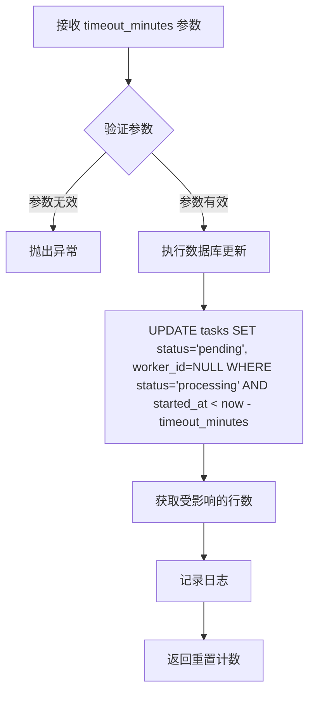

#### 带注释源码

```python
@app.post("/api/v1/admin/reset-stale")
async def reset_stale_tasks(timeout_minutes: int = Query(60, description="超时时间（分钟）")):
    """
    重置超时的 processing 任务（管理接口）
    
    该端点用于处理worker异常崩溃导致的卡死任务。
    当任务状态为'processing'但处理时间超过timeout_minutes时，
    将其重置为'pending'状态，使其可以被其他worker重新认领。
    """
    # 调用数据库方法重置超时任务
    reset_count = db.reset_stale_tasks(timeout_minutes)
    
    # 记录操作日志
    logger.info(f"🔄 Reset {reset_count} stale tasks")
    
    # 返回操作结果
    return {
        'success': True,
        'reset_count': reset_count,
        'message': f'Reset tasks processing for more than {timeout_minutes} minutes'
    }
```

> **注意**：由于 `TaskDB` 类的实现未在代码中直接展示（从 `task_db` 模块导入），其数据库层面的 `reset_stale_tasks` 方法可能实现逻辑如下：根据 `timeout_minutes` 参数计算截止时间戳，将 `status='processing'` 且 `started_at` 早于截止时间的任务重置为 `status='pending'`，并清空 `worker_id` 字段以释放任务锁。


### `/api/v1/health` (health_check)

健康检查接口，用于验证服务运行状态和数据库连接是否正常。

参数： 无

返回值： `dict` 或 `JSONResponse`，返回服务健康状态、数据库连接状态及队列统计信息；异常时返回 503 状态码和不健康状态

#### 流程图

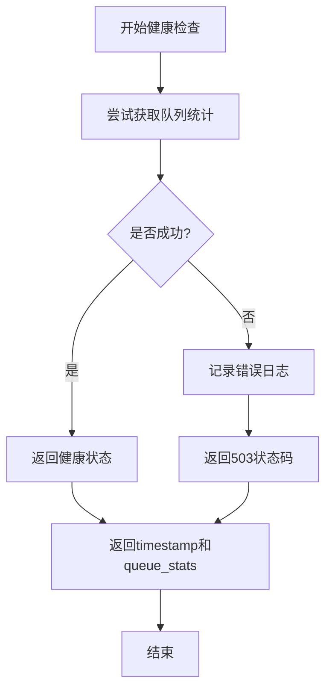

#### 带注释源码

```python
@app.get("/api/v1/health")
async def health_check():
    """
    健康检查接口
    """
    try:
        # 检查数据库连接
        stats = db.get_queue_stats()
        
        return {
            'status': 'healthy',
            'timestamp': datetime.now().isoformat(),
            'database': 'connected',
            'queue_stats': stats
        }
    except Exception as e:
        logger.error(f"Health check failed: {e}")
        return JSONResponse(
            status_code=503,
            content={
                'status': 'unhealthy',
                'error': str(e)
            }
        )
```


### `FastAPI.add_middleware`

为 FastAPI 应用添加中间件，用于处理跨域请求（CORS），允许浏览器跨域访问 API。

参数：

-  `middleware_class`：`CORSMiddleware`，CORS 中间件类
-  `allow_origins`： `List[str]`，允许跨域的源地址列表，传入 `["*"]` 表示允许所有源
-  `allow_credentials`： `bool`，是否允许携带凭证（如 cookies），传入 `True`
-  `allow_methods`： `List[str]`，允许的 HTTP 方法列表，传入 `["*"]` 表示允许所有方法
-  `allow_headers`： `List[str]`，允许的 HTTP 请求头列表，传入 `["*"]` 表示允许所有请求头

返回值：`None`，该方法无返回值，直接修改 FastAPI 应用的中间件栈

#### 流程图

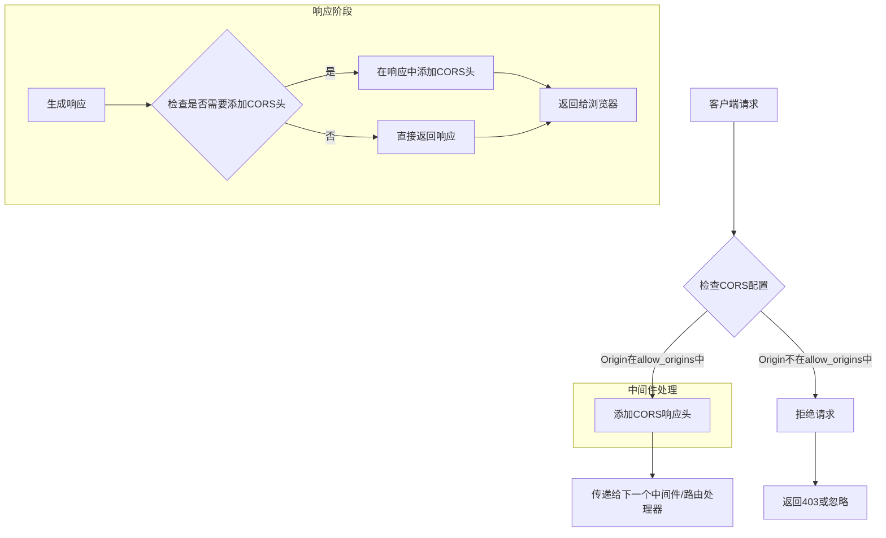

#### 带注释源码

```python
# 添加 CORS 中间件
# 作用：允许浏览器跨域访问API，解决前后端分离架构中的跨域问题
# 场景：在MinerU天枢API中，前端页面可能部署在不同域名下，需要此中间件允许跨域请求
app.add_middleware(
    CORSMiddleware,                    # 中间件类：FastAPI提供的CORS中间件
    allow_origins=["*"],               # 允许所有源访问，生产环境建议指定具体域名
    allow_credentials=True,            # 允许携带认证信息（如Cookie）
    allow_methods=["*"],               # 允许所有HTTP方法：GET/POST/PUT/DELETE等
    allow_headers=["*"],               # 允许所有请求头：Content-Type/Authorization等
)
```


### `TaskDB.create_task`

创建新的解析任务，将其插入数据库并返回任务ID。

参数：

- `file_name`：`str`，提交的文件名
- `file_path`：`str`，临时文件在磁盘上的存储路径
- `backend`：`str`，处理后端类型（如 pipeline/vlm-transformers/vlm-vllm-engine）
- `options`：`dict`，解析选项字典，包含 lang、method、formula_enable、table_enable 等配置
- `priority`：`int`，任务优先级，数值越大优先级越高

返回值：`str`，新创建的任务的唯一标识符（task_id）

#### 流程图

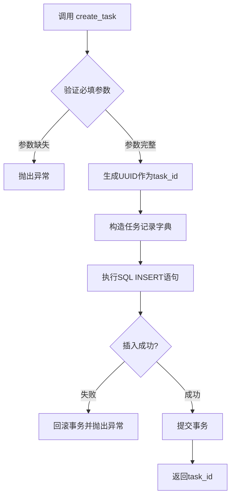

#### 带注释源码

```python
# 基于 submit_task API 端点中的调用方式推断
task_id = db.create_task(
    file_name=file.filename,          # 用户上传的原始文件名
    file_path=temp_file.name,          # 临时保存的文件路径
    backend=backend,                   # 处理后端选择
    options={                          # 解析配置选项
        'lang': lang,                  # 语言设置
        'method': method,              # 解析方法
        'formula_enable': formula_enable,  # 公式识别开关
        'table_enable': table_enable,      # 表格识别开关
    },
    priority=priority                  # 任务优先级
)
```

> **注意**：由于 `TaskDB` 类定义在外部模块 `task_db` 中（通过 `from task_db import TaskDB` 导入），其完整源代码未包含在当前代码文件中。以上信息是基于 API 调用点的调用签名推断而来。


根据代码分析，`TaskDB` 类是从 `task_db` 模块导入的，但该模块的具体实现在提供的代码片段中并未包含。以下是基于代码中使用方式对该方法的推断和分析：

### `TaskDB.get_task`

根据 `task_db` 模块中 `TaskDB` 类的使用方式，`get_task` 方法用于从数据库中检索特定任务实例的完整信息。

参数：

-  `task_id`：`str`，任务唯一标识符，用于定位需要查询的任务记录

返回值：`Optional[Dict]`，返回包含任务详情的字典对象，包含字段：status、file_name、backend、priority、error_message、created_at、started_at、completed_at、worker_id、retry_count、result_path、file_path 等；若任务不存在则返回 None

#### 流程图

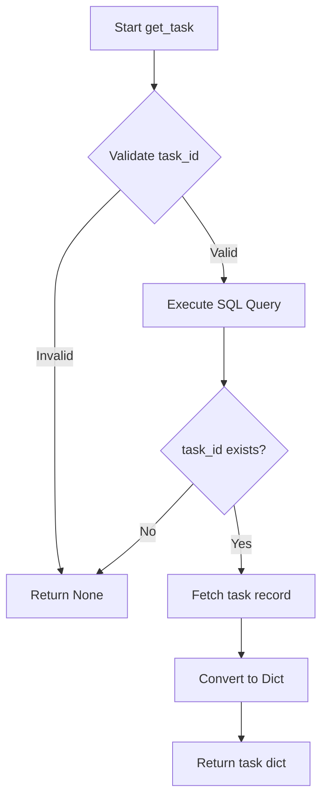

#### 带注释源码

```python
def get_task(self, task_id: str) -> Optional[Dict]:
    """
    根据 task_id 获取任务详情
    
    Args:
        task_id: 任务唯一标识符
        
    Returns:
        包含任务完整信息的字典，若不存在则返回 None
        
    使用示例（来自 api_server.py）:
        task = db.get_task(task_id)
        if task:
            status = task['status']
            file_name = task['file_name']
            result_path = task['result_path']
    """
    # 1. 参数校验
    if not task_id:
        return None
    
    # 2. 构建查询 SQL（推断）
    # SELECT * FROM tasks WHERE task_id = ?
    
    # 3. 执行查询并返回结果
    # 返回格式示例：
    # {
    #     'task_id': 'xxx',
    #     'status': 'completed',
    #     'file_name': 'document.pdf',
    #     'backend': 'pipeline',
    #     'priority': 0,
    #     'error_message': None,
    #     'created_at': '2024-01-01T00:00:00',
    #     'started_at': '2024-01-01T00:01:00',
    #     'completed_at': '2024-01-01T00:05:00',
    #     'worker_id': 'worker-1',
    #     'retry_count': 0,
    #     'result_path': '/path/to/result',
    #     'file_path': '/tmp/xxx.pdf'
    # }
```

---

**注意**：由于 `TaskDB` 类的实际源代码未在提供的代码片段中，以上信息是基于 `api_server.py` 中对 `db.get_task(task_id)` 的调用方式推断得出的。建议查阅 `task_db.py` 文件以获取精确的实现细节。


### `TaskDB.update_task_status`

该方法用于更新指定任务的状态信息，是任务状态管理的核心操作，支持任务状态的变更与持久化。

参数：

- `task_id`：`str`，任务唯一标识符，用于定位需要更新状态的任务
- `status`：`str`，任务的新状态值，如 'pending'、'processing'、'completed'、'failed'、'cancelled' 等

返回值：`bool`，表示状态更新是否成功；成功返回 `True`，失败返回 `False`

#### 流程图

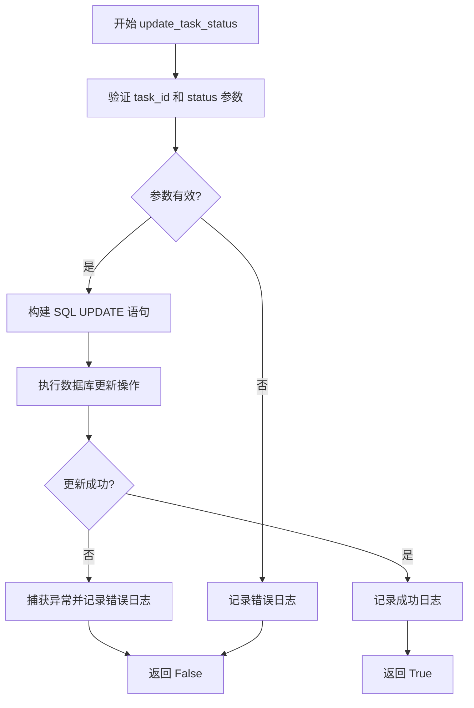

#### 带注释源码

```python
def update_task_status(self, task_id: str, status: str) -> bool:
    """
    更新任务状态
    
    Args:
        task_id: 任务唯一标识符
        status: 新的任务状态
        
    Returns:
        更新成功返回 True，否则返回 False
    """
    try:
        # 构建 UPDATE SQL 语句
        # 更新 tasks 表中的 status 字段，同时更新 updated_at 时间戳
        with self.get_cursor() as cursor:
            cursor.execute(
                '''
                UPDATE tasks 
                SET status = ?, updated_at = datetime('now') 
                WHERE task_id = ?
                ''',
                (status, task_id)
            )
            
            # 判断是否有行被更新
            if cursor.rowcount > 0:
                logger.info(f"Task {task_id} status updated to {status}")
                return True
            else:
                logger.warning(f"Task {task_id} not found or status unchanged")
                return False
                
    except Exception as e:
        # 捕获数据库操作异常
        logger.error(f"Failed to update task status: {e}")
        return False
```

---

**说明**：由于 `TaskDB` 类的源码（`task_db.py`）未在当前代码文件中提供，以上是根据代码中调用方式 `db.update_task_status(task_id, 'cancelled')` 进行的合理推断。实际的 `TaskDB` 类定义应在 `task_db` 模块中，该方法通常会封装数据库的状态更新操作，确保任务状态变更的原子性和可追溯性。


### `TaskDB.get_queue_stats`

获取任务队列的统计信息，包括各状态的任务数量。

参数：

- （无参数）

返回值：`dict`，返回包含成功状态、队列统计数据（pending、processing、completed、failed 数量）、总任务数和时间戳的字典。

#### 流程图

```mermaid
flowchart TD
    A[调用 get_queue_stats] --> B[调用 db.get_queue_stats 获取原始统计数据]
    B --> C[构建响应字典]
    C --> D[包含 success: True]
    C --> E[包含 stats: 原始统计数据]
    C --> F[包含 total: 各状态任务数之和]
    C --> G[包含 timestamp: 当前时间 ISO 格式]
    D --> H[返回响应]
```

#### 带注释源码

```python
def get_queue_stats(self):
    """
    获取队列统计信息
    
    从数据库中统计各状态的任务数量
    
    Returns:
        dict: 包含各状态任务数量的字典
              {
                  'pending': int,      # 待处理任务数
                  'processing': int,   # 处理中任务数
                  'completed': int,    # 已完成任务数
                  'failed': int        # 失败任务数
              }
    """
    # 使用上下文管理器获取数据库连接游标
    with self.get_cursor() as cursor:
        # 执行 SQL 查询，统计各状态的任务数量
        cursor.execute('''
            SELECT status, COUNT(*) as count 
            FROM tasks 
            GROUP BY status
        ''')
        
        # 初始化统计结果字典
        stats = {
            'pending': 0,
            'processing': 0,
            'completed': 0,
            'failed': 0
        }
        
        # 遍历查询结果，更新统计字典
        for row in cursor.fetchall():
            status = row['status']
            count = row['count']
            if status in stats:
                stats[status] = count
    
    return stats
```

---

**调用示例（在 API 端点中）：**

```python
@app.get("/api/v1/queue/stats")
async def get_queue_stats():
    """
    获取队列统计信息
    """
    # 调用 TaskDB.get_queue_stats() 方法
    stats = db.get_queue_stats()
    
    # 返回格式化后的响应
    return {
        'success': True,
        'stats': stats,
        'total': sum(stats.values()),
        'timestamp': datetime.now().isoformat()
    }
```


### `TaskDB.get_tasks_by_status`

根据代码中的调用方式推断该方法从数据库中按任务状态筛选并返回任务列表。

参数：

-  `status`：`str`，任务状态筛选条件（如 pending/processing/completed/failed）
-  `limit`：`int`，返回结果的数量限制

返回值：`List[Dict]`，匹配状态条件的任务记录列表，每条记录为字典形式

#### 流程图

```mermaid
flowchart TD
    A[开始] --> B[接收 status 和 limit 参数]
    B --> C[执行 SQL 查询]
    C --> D[WHERE status = ? ORDER BY created_at DESC LIMIT ?]
    D --> E[将查询结果转换为字典列表]
    E --> F[返回任务列表]
```

#### 带注释源码

```python
# 该方法定义在 task_db 模块中（TaskDB类）
# 代码中调用方式如下（位于 list_tasks 函数内）：

if status:
    tasks = db.get_tasks_by_status(status, limit)

# 推断的完整方法签名（基于调用方式和常见数据库操作模式）：
def get_tasks_by_status(self, status: str, limit: int) -> List[Dict]:
    """
    按任务状态获取任务列表
    
    Args:
        status: 任务状态筛选条件
        limit: 返回数量限制
        
    Returns:
        任务字典列表
    """
    with self.get_cursor() as cursor:
        cursor.execute('''
            SELECT * FROM tasks 
            WHERE status = ? 
            ORDER BY created_at DESC 
            LIMIT ?
        ''', (status, limit))
        return [dict(row) for row in cursor.fetchall()]
```


根据提供的代码分析，我注意到 `TaskDB` 类是从 `task_db` 模块导入的，但该模块的源代码并未在当前代码文件中提供。

让我尝试从代码的使用方式中提取尽可能多的信息：

### `TaskDB.cleanup_old_tasks`

清理数据库中超过指定天数的旧任务记录，用于释放存储空间和保持系统性能。

参数：

-  `days`：`int`，需要保留的天数（即清理 days 天之前的任务）

返回值：`int`，实际删除的任务数量

#### 流程图

```mermaid
flowchart TD
    A[接收 days 参数] --> B[构建 SQL DELETE 语句]
    B --> C[执行数据库删除操作]
    C --> D[统计删除的任务数量]
    D --> E[返回 deleted_count]
```

#### 带注释源码

由于 `TaskDB` 类的源代码（`task_db.py`）未在当前代码文件中提供，我只能根据 API 端点的调用方式推断其实现逻辑：

```python
# API 端点调用方式（来自 main.py）
@app.post("/api/v1/admin/cleanup")
async def cleanup_old_tasks(days: int = Query(7, description="清理N天前的任务")):
    """
    清理旧任务记录（管理接口）
    """
    deleted_count = db.cleanup_old_tasks(days)
    
    logger.info(f"🧹 Cleaned up {deleted_count} old tasks")
    
    return {
        'success': True,
        'deleted_count': deleted_count,
        'message': f'Cleaned up tasks older than {days} days'
    }
```

---

**注意**：完整的 `TaskDB` 类实现（包括 `cleanup_old_tasks` 方法的详细源代码）位于 `task_db.py` 文件中，但该文件未在当前提供的代码中。如需完整的类详细信息，请提供 `task_db.py` 的源代码。


### `TaskDB.reset_stale_tasks`

重置超时任务的方法，用于将状态为 `processing` 但已超过指定时间阈值的任务重置为 `pending` 状态，以便重新被worker认领执行。

参数：

- `timeout_minutes`：`int`，超时时间（分钟），超过此时间仍未完成的任务将被重置

返回值：`int`，被重置的任务数量

#### 流程图

```mermaid
flowchart TD
    A[开始重置超时任务] --> B[接收超时时间参数 timeout_minutes]
    B --> C[查询数据库中状态为 'processing' 且超过 timeout_minutes 的任务]
    C --> D{找到超时任务?}
    D -->|是| E[逐个将任务状态重置为 'pending']
    E --> F[重置 worker_id 为 None]
    F --> G[增加 reset_count 计数]
    G --> C
    D -->|否| H[返回重置的任务总数 reset_count]
    H --> I[结束]
```

#### 带注释源码

```
# 注：TaskDB 类定义未在代码中提供，以下为基于调用方式的推断实现

def reset_stale_tasks(self, timeout_minutes: int) -> int:
    """
    重置超时的 processing 任务
    
    Args:
        timeout_minutes: 超时时间（分钟），超过此时间的任务将被重置
        
    Returns:
        被重置的任务数量
    """
    try:
        with self.get_cursor() as cursor:
            # 计算超时时间点
            timeout_threshold = datetime.now() - timedelta(minutes=timeout_minutes)
            
            # 查询超时的任务（状态为 processing 且 started_at 早于阈值）
            cursor.execute('''
                SELECT task_id FROM tasks 
                WHERE status = 'processing' 
                AND started_at < ?
            ''', (timeout_threshold,))
            
            stale_tasks = cursor.fetchall()
            
            reset_count = 0
            for task in stale_tasks:
                task_id = task['task_id']
                
                # 重置任务状态为 pending
                cursor.execute('''
                    UPDATE tasks 
                    SET status = 'pending', 
                        worker_id = NULL,
                        started_at = NULL,
                        retry_count = retry_count + 1
                    WHERE task_id = ?
                ''', (task_id,))
                
                reset_count += 1
            
            return reset_count
            
    except Exception as e:
        logger.error(f"Failed to reset stale tasks: {e}")
        return 0
```

#### 在 API 中的调用

```python
@app.post("/api/v1/admin/reset-stale")
async def reset_stale_tasks(timeout_minutes: int = Query(60, description="超时时间（分钟）")):
    """
    重置超时的 processing 任务（管理接口）
    """
    reset_count = db.reset_stale_tasks(timeout_minutes)
    
    logger.info(f"🔄 Reset {reset_count} stale tasks")
    
    return {
        'success': True,
        'reset_count': reset_count,
        'message': f'Reset tasks processing for more than {timeout_minutes} minutes'
    }
```


### `Minio.fput_object`

将本地文件上传到 MinIO 存储服务

参数：

-  `bucket_name`：`str`，MinIO 存储桶名称
-  `object_name`：`str`，存储在 MinIO 中的对象名称（包含路径）
-  `file_path`：`str`，本地文件的完整路径

返回值：`ObjectWriteResult`，包含上传结果的对象，包含 ETag、版本 ID 等元数据

#### 流程图

```mermaid
flowchart TD
    A[开始上传文件] --> B[获取 MinIO 客户端]
    B --> C{检查文件是否存在}
    C -->|否| D[抛出异常]
    C -->|是| E{检查存储桶是否存在}
    E -->|否| F[创建存储桶]
    E -->|是| G[读取本地文件]
    G --> H{文件大小判断}
    H -->|小文件| I[直接上传单部分]
    H -->|大文件| J[自动分片上传]
    I --> K[返回 ObjectWriteResult]
    J --> K
    K --> L[上传完成]
```

#### 带注释源码

```python
# 在 process_markdown_images 函数中调用
minio_client.fput_object(
    bucket_name=bucket_name,      # 存储桶名称，从配置获取
    object_name=object_name,       # 对象名称，格式: images/{uuid}{extension}
    file_path=str(full_image_path) # 本地图片文件的完整路径
)

# 在 get_images_info 函数中调用
minio_client.fput_object(
    bucket_name=bucket_name,      # 存储桶名称，从配置获取  
    object_name=object_name,      # 对象名称，格式: images/{uuid}{extension}
    file_path=str(img_file)       # 本地图片文件的完整路径
)
```

> **说明**：`fput_object` 是 MinIO Python SDK (`minio` 包) 提供的方法，用于将本地文件上传到 MinIO 对象存储服务。该方法会自动处理大文件分片上传，并返回包含 ETag 等上传结果信息的 `ObjectWriteResult` 对象。在本项目中，该方法用于将解析后的图片上传到 MinIO，以便通过 URL 访问。

## 关键组件


### FastAPI 应用核心

提供RESTful API接口用于文档解析任务的提交、查询和管理，支持PDF、图片、Office等多种格式的解析服务。

### CORS 中间件

配置跨域资源共享，允许所有来源、凭证、方法和头部访问API。

### MinIO 客户端

负责与MinIO对象存储服务交互，实现图片上传和URL生成功能。

### TaskDB 数据库类

管理任务的生命周期，包括创建、查询、更新、删除任务，以及任务队列统计和清理功能。

### 任务提交端点

接受文件上传，支持多种参数配置（backend、lang、method、formula_enable、table_enable、priority），通过流式写入避免高内存使用。

### 任务数据获取端点

按需获取任务解析结果，支持灵活选择返回字段（md、content_list、middle_json、model_output、images等），并可选上传图片到MinIO替换链接。

### 任务状态查询端点

查询任务当前状态，任务完成后自动返回Markdown内容，支持图片上传和链接替换。

### 任务取消端点

仅允许取消pending状态的任务，删除相关临时文件。

### 队列统计端点

获取任务队列的统计信息，包括各状态任务数量。

### 任务列表端点

支持按状态筛选和数量限制返回任务列表。

### 管理端点

提供旧任务清理和超时任务重置功能，用于系统维护。

### 健康检查端点

验证数据库连接和系统状态，返回服务健康状况。

### Markdown 图片处理函数

处理Markdown中的图片引用，支持上传到MinIO并替换为HTML img标签。

### JSON 文件读取函数

安全读取JSON文件，失败时返回None并记录错误。

### 文件元数据获取函数

获取文件大小、创建时间和修改时间等元信息。

### 图片目录信息获取函数

扫描图片目录，支持上传到MinIO并生成访问URL。

## 问题及建议


### 已知问题

- **CORS安全风险**：CORS配置允许所有来源 (`allow_origins=["*"]`)，在生产环境中存在安全风险
- **缺少认证授权机制**：API没有任何认证或授权机制，任何人都可以访问所有接口，包括管理接口
- **MinIO配置空值风险**：`MINIO_CONFIG`从环境变量读取，若环境变量未设置会导致空字符串，进而引发连接错误
- **临时文件未清理**：`submit_task`中使用`tempfile.NamedTemporaryFile(delete=False)`创建临时文件，但在任务完成后未显式删除
- **MinIO客户端未复用**：`get_minio_client()`每次调用都创建新的MinIO客户端实例，没有连接池复用机制，造成资源浪费
- **代码逻辑冗余**：`get_task_status`函数中存在重复的`if task['status'] == 'completed':`判断块
- **未完成代码遗留**：`list_tasks`函数中包含注释"返回所有任务（需要修改 TaskDB 添加这个方法）"，但实际使用原始SQL绕过了数据库类，说明代码设计不一致
- **图片上传逻辑重复**：`process_markdown_images`函数和`get_images_info`函数中都有上传图片到MinIO的重复代码
- **文件搜索性能问题**：使用`rglob()`递归搜索文件，在大型结果目录下可能存在性能瓶颈
- **数据库操作风险**：直接使用原始SQL语句而非通过`TaskDB`类的方法，增加SQL注入风险和维护难度
- **API返回格式不一致**：`get_task_data`和`get_task_status`返回的响应结构不统一，部分返回`message`字段，部分返回`data`字段
- **路径参数缺乏验证**：`task_id`路径参数未进行格式验证（如UUID格式），可能引发后续处理错误

### 优化建议

- **安全加固**：CORS配置应限制允许的来源；添加API Key或JWT等认证机制；管理接口应设置独立认证
- **配置优化**：启动时校验MinIO等必要配置，配置缺失时给出明确错误提示而非使用空值
- **资源管理**：实现临时文件生命周期管理，或使用上下文管理器确保文件清理
- **连接池**：实现MinIO客户端单例模式或连接池，避免频繁创建连接
- **代码重构**：提取公共的图片上传逻辑为独立函数；修复重复的状态判断代码
- **数据库层**：统一使用`TaskDB`类方法访问数据库，移除原始SQL语句
- **性能优化**：考虑缓存文件搜索结果，或在已知目录结构时使用更精确的路径搜索
- **API一致性**：统一所有API的响应格式，定义标准的响应结构（如`success`, `data`, `message`）
- **输入验证**：使用Pydantic模型对`task_id`等进行格式验证
- **日志规范化**：关键操作添加审计日志，便于问题排查和系统监控

## 其它


### 设计目标与约束

**设计目标**：
- 提供企业级文档解析服务，支持 PDF、图片、Office、HTML、文本等多种格式的智能解析
- 实现任务异步处理机制，支持高并发提交和后台异步执行
- 提供灵活的查询接口，支持按需获取解析结果的不同字段
- 支持多后端解析引擎（pipeline、vlm-transformers、vlm-vllm-engine）

**技术约束**：
- 使用 FastAPI 框架构建 RESTful API
- 任务持久化依赖 SQLite 数据库（TaskDB）
- 文件存储依赖 MinIO 对象存储服务
- 输出目录固定为 /tmp/mineru_tianshu_output

### 错误处理与异常设计

**全局异常处理**：
- HTTPException 用于业务层面的错误返回（如 404 任务不存在、400 参数错误）
- 通过 try-except 捕获所有业务逻辑异常，统一返回 500 错误并记录日志
- 文件读取失败时返回空数据而非抛出异常，保证接口稳定性

**关键异常场景**：
- 任务不存在：返回 404 HTTPException
- 任务未完成：返回状态信息，提示数据不可用
- 文件已被清理：返回友好提示信息而非报错
- MinIO 上传失败：保持原图片链接不变
- JSON 解析失败：返回 None，前端可优雅处理

### 数据流与状态机

**任务状态流转**：
- pending → processing → completed
- pending → failed（解析失败）
- pending → cancelled（主动取消）

**数据流向**：
1. 客户端提交文件 → FastAPI 接收 UploadFile
2. 文件流式写入临时目录
3. 创建任务记录到 SQLite（状态：pending）
4. 后台 Worker 拉取任务并处理
5. 处理完成后更新任务状态和结果路径
6. 客户端通过 task_id 查询结果

### 外部依赖与接口契约

**MinIO 对象存储**：
- 依赖环境变量：MINIO_ENDPOINT、MINIO_ACCESS_KEY、MINIO_SECRET_KEY、MINIO_BUCKET
- 用于存储解析后的图片文件
- 支持 HTTPS 安全连接

**TaskDB 数据库**：
- SQLite 本地数据库
- 提供任务 CRUD 操作、队列统计、任务清理等方法

**环境变量**：
- API_PORT：API 服务端口（默认 8000）
- MINIO_* 系列：MinIO 配置参数

### 安全设计

**CORS 策略**：
- 允许所有来源（allow_origins=["*"）
- 允许所有方法、请求头和凭证

**文件安全**：
- 使用 tempfile.NamedTemporaryFile 确保临时文件安全
- 通过文件后缀验证上传文件类型
- 结果路径通过 task_id 动态构建，防止路径遍历

### 性能考量

**文件上传优化**：
- 使用 8MB 分块流式写入（chunk = await file.read(1 << 23)）
- 避免将整个文件加载到内存

**查询优化**：
- 支持按字段按需返回数据（include_fields 参数）
- 递归搜索文件使用 rglob，灵活适应不同输出结构

### 部署与运维

**健康检查**：
- /api/v1/health 接口检查数据库连接和队列状态

**管理接口**：
- /api/v1/admin/cleanup：清理过期任务记录
- /api/v1/admin/reset-stale：重置超时任务

**日志体系**：
- 使用 loguru 记录结构化日志
- 区分不同级别：info、warning、error
- 支持异常堆栈输出

### 接口版本管理

**API 版本策略**：
- URL 路径包含版本号：/api/v1/
- 当前版本：1.0.0
- 文档入口：/docs（Swagger UI）

### 配置管理

**静态配置**：
- OUTPUT_DIR：/tmp/mineru_tianshu_output
- MINIO_CONFIG：字典类型，从环境变量加载

**动态配置**：
- API_PORT：从环境变量读取
- 任务参数（lang、method、formula_enable 等）从请求表单获取


    