# `MinerU\projects\mineru_tianshu\client_example.py` 详细设计文档

MinerU Tianshu 客户端示例是一个异步Python客户端，用于与天枢（Tianshu）服务端进行交互，提供了任务提交、状态查询、队列监控等核心功能，支持单个任务处理、批量任务提交、优先级队列和实时状态轮询等使用场景。

## 整体流程

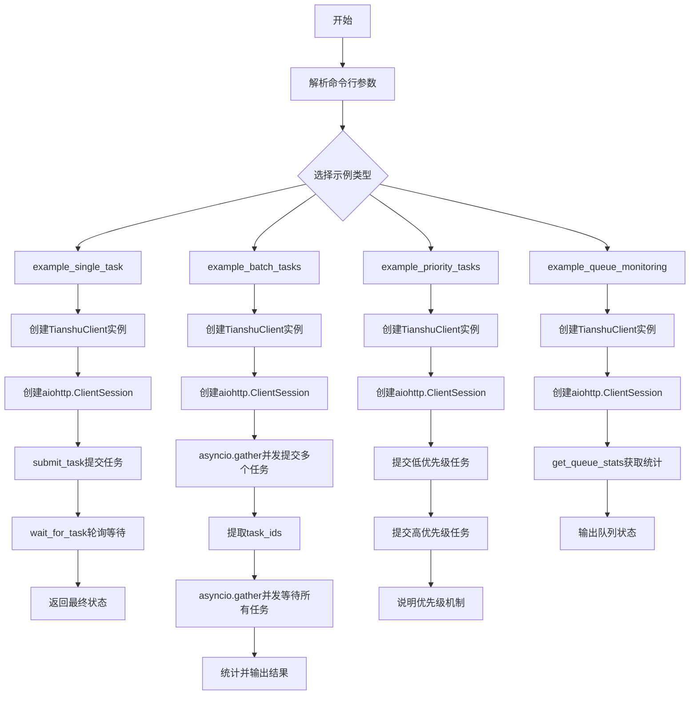

## 类结构

```
TianshuClient (天枢客户端类)
├── __init__ (初始化方法)
├── submit_task (提交任务方法)
├── get_task_status (查询任务状态方法)
├── wait_for_task (等待任务完成方法)
├── get_queue_stats (获取队列统计方法)
└── cancel_task (取消任务方法)

全局函数模块 (示例函数)
├── example_single_task (单个任务示例)
├── example_batch_tasks (批量任务示例)
├── example_priority_tasks (优先级队列示例)
├── example_queue_monitoring (队列监控示例)
└── main (主入口函数)
```

## 全局变量及字段


### `TianshuClient.api_url`
    
API服务地址

类型：`str`
    


### `TianshuClient.base_url`
    
API版本基础URL

类型：`str`
    
    

## 全局函数及方法


### `example_single_task`

示例函数，演示如何提交单个文档处理任务并等待其完成。创建天枢客户端，提交一个 PDF 文档处理任务（demo1.pdf），使用中文语言、pipeline 后端、启用公式和表格识别，然后轮询等待任务完成并返回最终状态。

参数： 无

返回值：`Dict`，任务完成后的最终状态字典，包含任务ID、状态、结果路径等信息

#### 流程图

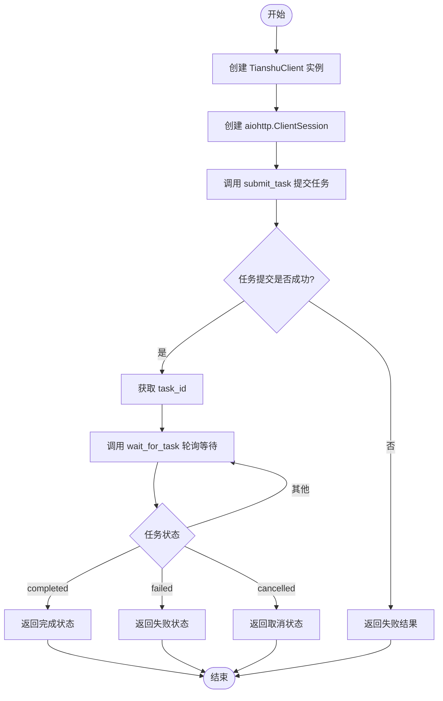

#### 带注释源码

```python
async def example_single_task():
    """
    示例1：提交单个任务并等待完成
    
    该函数演示了使用 Tianshu 客户端进行单任务处理的基本流程：
    1. 创建客户端实例
    2. 提交任务
    3. 等待任务完成
    4. 返回结果
    """
    # 打印示例分隔线
    logger.info("=" * 60)
    logger.info("示例1：提交单个任务")
    logger.info("=" * 60)
    
    # 步骤1: 创建 TianshuClient 实例，默认为本地服务
    client = TianshuClient()
    
    # 步骤2: 使用 async context manager 管理 HTTP 会话
    async with aiohttp.ClientSession() as session:
        # 步骤3: 提交任务到处理队列
        # 参数说明:
        #   - session: aiohttp 会话，用于发送 HTTP 请求
        #   - file_path: 要处理的 PDF 文件路径（相对路径）
        #   - backend: 处理后端，'pipeline' 表示使用管道处理
        #   - lang: 语言设置为 'ch' (中文)
        #   - formula_enable: 启用公式识别
        #   - table_enable: 启用表格识别
        result = await client.submit_task(
            session,
            file_path='../../demo/pdfs/demo1.pdf',
            backend='pipeline',
            lang='ch',
            formula_enable=True,
            table_enable=True
        )
        
        # 步骤4: 检查任务提交是否成功
        # submit_task 返回格式: {'success': bool, 'task_id': str, ...}
        if result.get('success'):
            # 提取任务ID用于后续查询
            task_id = result['task_id']
            
            # 步骤5: 等待任务处理完成
            # 使用轮询方式检查任务状态，支持超时控制
            # 默认超时 600 秒，轮询间隔 2 秒
            logger.info(f"⏳ Waiting for task {task_id} to complete...")
            final_status = await client.wait_for_task(session, task_id)
            
            # 步骤6: 返回最终任务状态
            # 返回值包含: status, result_path, error_message 等字段
            return final_status
        else:
            # 任务提交失败时，result 已包含错误信息
            # 直接返回失败结果供调用方处理
            return result
```


### `example_batch_tasks`

该函数是一个异步示例函数，演示如何批量提交多个PDF文件任务到天枢服务端，并发等待所有任务完成后统计结果。

参数： 无

返回值： `List[Dict]`列表，每个元素包含对应任务的最终状态字典

#### 流程图

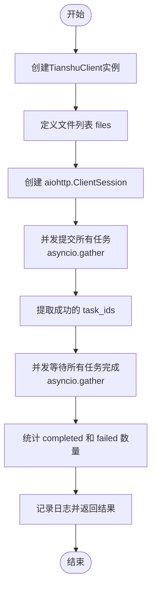

#### 带注释源码

```python
async def example_batch_tasks():
    """示例2：批量提交多个任务并并发等待"""
    # 打印分隔线，标识示例开始
    logger.info("=" * 60)
    logger.info("示例2：批量提交多个任务")
    logger.info("=" * 60)
    
    # 创建天枢客户端实例
    client = TianshuClient()
    
    # 准备待处理的PDF文件路径列表
    files = [
        '../../demo/pdfs/demo1.pdf',
        '../../demo/pdfs/demo2.pdf',
        '../../demo/pdfs/demo3.pdf',
    ]
    
    # 使用异步上下文管理器创建HTTP会话，确保会话正确关闭
    async with aiohttp.ClientSession() as session:
        # 打印提交任务数量日志
        logger.info(f"📤 Submitting {len(files)} tasks...")
        
        # 构建异步提交任务列表（列表推导式）
        submit_tasks = [
            client.submit_task(session, file) 
            for file in files
        ]
        
        # 使用 asyncio.gather 并发执行所有提交任务
        results = await asyncio.gather(*submit_tasks)
        
        # 从提交结果中提取成功的 task_id（过滤掉提交失败的任务）
        task_ids = [r['task_id'] for r in results if r.get('success')]
        logger.info(f"✅ Submitted {len(task_ids)} tasks successfully")
        
        # 打印等待日志
        logger.info(f"⏳ Waiting for all tasks to complete...")
        
        # 构建异步等待任务列表
        wait_tasks = [
            client.wait_for_task(session, task_id) 
            for task_id in task_ids
        ]
        
        # 使用 asyncio.gather 并发等待所有任务完成
        final_results = await asyncio.gather(*wait_tasks)
        
        # 统计任务完成情况：completed 和 failed 数量
        completed = sum(1 for r in final_results if r.get('status') == 'completed')
        failed = sum(1 for r in final_results if r.get('status') == 'failed')
        
        # 打印结果统计日志
        logger.info("=" * 60)
        logger.info(f"📊 Results: {completed} completed, {failed} failed")
        logger.info("=" * 60)
        
        # 返回所有任务的最终结果列表
        return final_results
```


### `example_priority_tasks`

该函数是一个示例方法，演示如何使用 Tianshu 客户端提交具有不同优先级的任务，展示了优先级队列的工作原理，高优先级任务会被优先处理。

参数：

- 该函数无参数

返回值：`None`，该函数仅执行示例逻辑，不返回任何值

#### 流程图

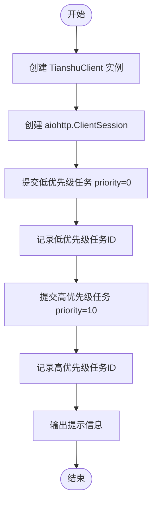

#### 带注释源码

```python
async def example_priority_tasks():
    """示例3：使用优先级队列"""
    # 打印分隔线和示例标题，标识示例3开始
    logger.info("=" * 60)
    logger.info("示例3：优先级队列")
    logger.info("=" * 60)
    
    # 创建 TianshuClient 实例，使用默认的 API 地址
    client = TianshuClient()
    
    # 使用 async context manager 创建 aiohttp 会话，确保资源正确释放
    async with aiohttp.ClientSession() as session:
        # 提交低优先级任务，优先级设置为 0
        low_priority = await client.submit_task(
            session,
            file_path='../../demo/pdfs/demo1.pdf',
            priority=0  # 低优先级，数值越小优先级越低
        )
        # 打印低优先级任务的 Task ID
        logger.info(f"📝 Low priority task: {low_priority['task_id']}")
        
        # 提交高优先级任务，优先级设置为 10
        high_priority = await client.submit_task(
            session,
            file_path='../../demo/pdfs/demo2.pdf',
            priority=10  # 高优先级，数值越大优先级越高
        )
        # 打印高优先级任务的 Task ID
        logger.info(f"🔥 High priority task: {high_priority['task_id']}")
        
        # 提示高优先级任务会先被服务器处理
        # 高优先级任务会在队列中排在低优先级任务之前
        logger.info("⏳ 高优先级任务将优先处理...")
```


### `example_queue_monitoring`

该函数是 Tianshu 客户端示例程序的第四个演示用例，用于监控队列状态。它通过创建 TianshuClient 实例并调用 get_queue_stats 方法获取当前队列的统计信息，包括总任务数和各类状态的任务数量，然后格式化输出到日志。

参数：无

返回值：`None`，该函数没有显式返回值，仅执行日志输出操作

#### 流程图

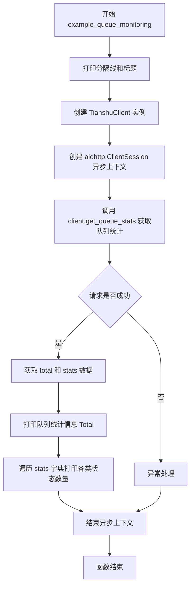

#### 带注释源码

```python
async def example_queue_monitoring():
    """示例4：监控队列状态"""
    # 打印分隔线和示例标题，用于命令行输出格式化
    logger.info("=" * 60)
    logger.info("示例4：监控队列状态")
    logger.info("=" * 60)
    
    # 创建 TianshuClient 实例，连接到默认的本地 API 端点 http://localhost:8000
    client = TianshuClient()
    
    # 使用 aiohttp 异步上下文管理器创建 HTTP 会话，确保会话正确关闭
    async with aiohttp.ClientSession() as session:
        # 获取队列统计
        # 调用客户端的 get_queue_stats 方法，从服务器获取当前队列的统计信息
        # 返回包含 total（总任务数）和 stats（各状态任务数）的字典
        stats = await client.get_queue_stats(session)
        
        # 打印队列统计标题
        logger.info("📊 Queue Statistics:")
        # 打印总任务数，使用 get 方法提供默认值 0 防止键不存在报错
        logger.info(f"   Total: {stats.get('total', 0)}")
        # 遍历 stats 字典中的所有状态及其对应的任务数量
        # stats 字典格式示例: {'pending': 5, 'running': 2, 'completed': 10}
        for status, count in stats.get('stats', {}).items():
            # 格式化输出每个状态的任务数量，:12s 表示左对齐宽度12的字符串
            logger.info(f"   {status:12s}: {count}")
```


### `main`

主函数，作为客户端示例的入口点，根据命令行参数选择运行不同的示例场景（单个任务、批量任务、优先级队列、监控队列）。

参数：该函数无显式参数，通过 `sys.argv` 获取命令行第一个参数来确定运行模式。

返回值：`None`，异步函数无返回值。

#### 流程图

```mermaid
flowchart TD
    A[Start main] --> B{len(sys.argv) > 1?}
    B -->|Yes| C[example = sys.argv[1]]
    B -->|No| D[example = 'all']
    C --> E{example?}
    D --> E
    E -->|single| F[运行 example_single_task]
    E -->|batch| G[运行 example_batch_tasks]
    E -->|priority| H[运行 example_priority_tasks]
    E -->|monitor| I[运行 example_queue_monitoring]
    E -->|all| J[依次运行所有示例]
    F --> K[Print newline]
    G --> K
    H --> K
    I --> K
    J --> K
    K --> L{有异常?}
    L -->|Yes| M[记录错误日志并打印堆栈]
    L -->|No| N[End]
    M --> N
```

#### 带注释源码

```python
async def main():
    """主函数，客户端示例入口点"""
    import sys  # 导入系统模块以获取命令行参数
    
    # 判断是否传入了命令行参数
    if len(sys.argv) > 1:
        # 如果传入了参数，使用第一个参数作为示例名称
        example = sys.argv[1]
    else:
        # 如果没有传入参数，默认运行所有示例
        example = 'all'
    
    try:
        # 根据示例名称执行对应的示例函数
        if example == 'single' or example == 'all':
            # 示例1：提交单个任务并等待完成
            await example_single_task()
            print()  # 打印空行分隔输出
        
        if example == 'batch' or example == 'all':
            # 示例2：批量提交多个任务并并发等待
            await example_batch_tasks()
            print()
        
        if example == 'priority' or example == 'all':
            # 示例3：使用优先级队列
            await example_priority_tasks()
            print()
        
        if example == 'monitor' or example == 'all':
            # 示例4：监控队列状态
            await example_queue_monitoring()
            print()
            
    except Exception as e:
        # 捕获所有异常并记录错误日志
        logger.error(f"Example failed: {e}")
        import traceback
        traceback.print_exc()  # 打印完整的异常堆栈信息
```


### TianshuClient.__init__

构造函数，用于初始化天枢客户端实例，设置API连接的基础URL。

参数：

- `api_url`：`str`，可选参数，API服务器的基础URL，默认为 `'http://localhost:8000'`

返回值：`None`，无返回值（构造函数）

#### 流程图

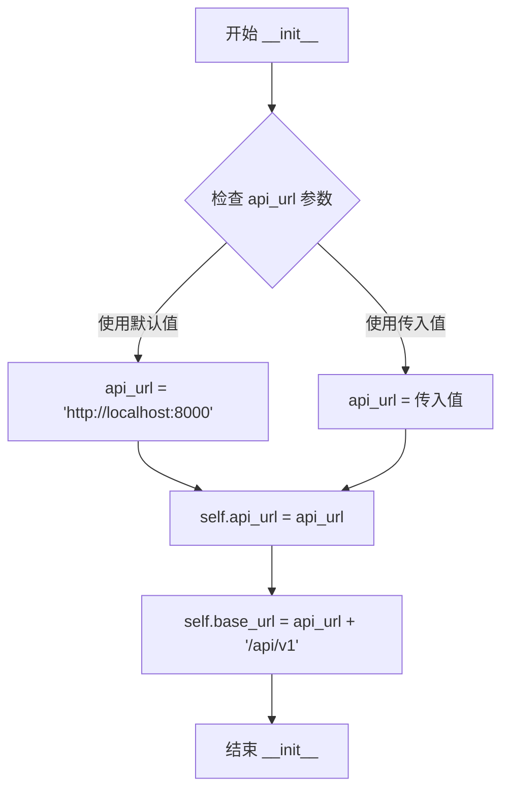

#### 带注释源码

```python
def __init__(self, api_url='http://localhost:8000'):
    """
    初始化天枢客户端
    
    Args:
        api_url: API服务器的基础URL，默认为本地8000端口
    """
    # 保存传入的API地址
    self.api_url = api_url
    
    # 构建完整的基础URL路径，用于后续API调用
    # 格式: {api_url}/api/v1
    # 例如: http://localhost:8000/api/v1
    self.base_url = f"{api_url}/api/v1"
```


### `TianshuClient.submit_task`

提交任务到天枢后端处理系统，支持文件上传和多种处理配置参数

#### 参数

- `session`：`aiohttp.ClientSession`，aiohttp 异步会话实例，用于发送 HTTP 请求
- `file_path`：`str`，待处理文件的本地路径
- `backend`：`str`，处理后端类型，默认为 'pipeline'
- `lang`：`str`，文档语言类型，默认为 'ch'（中文）
- `method`：`str`，解析方法，默认为 'auto'（自动选择）
- `formula_enable`：`bool`，是否启用公式识别，默认为 True
- `table_enable`：`bool`，是否启用表格识别，默认为 True
- `priority`：`int`，任务优先级，数值越高优先级越高，默认为 0

#### 返回值

`Dict`，包含 `task_id` 的响应字典；若提交失败则返回包含 `success: False` 和 `error` 信息的字典

#### 流程图

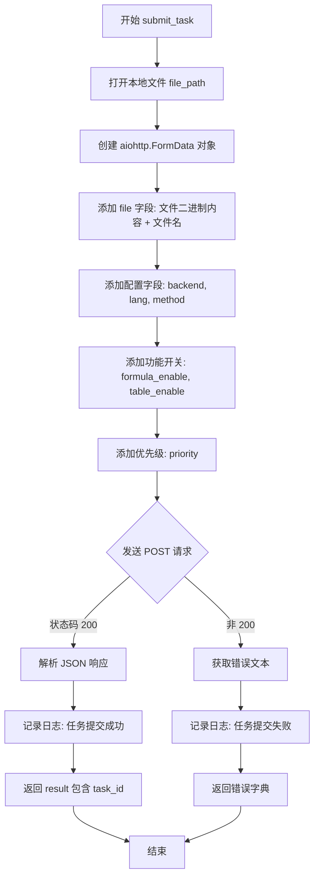

#### 带注释源码

```python
async def submit_task(
    self,
    session: aiohttp.ClientSession,
    file_path: str,
    backend: str = 'pipeline',
    lang: str = 'ch',
    method: str = 'auto',
    formula_enable: bool = True,
    table_enable: bool = True,
    priority: int = 0
) -> Dict:
    """
    提交任务
    
    Args:
        session: aiohttp session - 异步 HTTP 会话
        file_path: 文件路径 - 待上传的本地文件路径
        backend: 处理后端 - 指定使用的处理后端类型
        lang: 语言 - 文档语言设置
        method: 解析方法 - 文件解析方式
        formula_enable: 是否启用公式识别 - 启用后识别数学/化学公式
        table_enable: 是否启用表格识别 - 启用后识别表格结构
        priority: 优先级 - 任务调度优先级
        
    Returns:
        响应字典，包含 task_id - 成功时返回 {"task_id": "xxx"}
        失败时返回 {"success": False, "error": "错误信息"}
    """
    # 以二进制读模式打开本地文件
    with open(file_path, 'rb') as f:
        # 创建 FormData 对象用于封装multipart/form-data请求体
        data = aiohttp.FormData()
        
        # 添加文件字段：包含文件二进制内容和文件名
        data.add_field('file', f, filename=Path(file_path).name)
        
        # 添加处理配置字段
        data.add_field('backend', backend)
        data.add_field('lang', lang)
        data.add_field('method', method)
        
        # 将布尔值转换为字符串.lower()以符合HTTP表单规范
        data.add_field('formula_enable', str(formula_enable).lower())
        data.add_field('table_enable', str(table_enable).lower())
        
        # 优先级数值
        data.add_field('priority', str(priority))
        
        # 发送 POST 请求到任务提交端点
        async with session.post(f'{self.base_url}/tasks/submit', data=data) as resp:
            # 判断HTTP响应状态码
            if resp.status == 200:
                # 成功：解析JSON响应体
                result = await resp.json()
                # 记录成功日志，包含文件名和任务ID
                logger.info(f"✅ Submitted: {file_path} -> Task ID: {result['task_id']}")
                # 返回包含task_id的结果字典
                return result
            else:
                # 失败：获取错误响应文本
                error = await resp.text()
                # 记录错误日志
                logger.error(f"❌ Failed to submit {file_path}: {error}")
                # 返回错误信息字典
                return {'success': False, 'error': error}
```


### `TianshuClient.get_task_status`

查询指定任务的状态信息，通过 HTTP GET 请求从后端 API 获取任务当前的处理状态。

参数：

- `session`：`aiohttp.ClientSession`，aiohttp 客户端会话对象，用于发起 HTTP 请求
- `task_id`：`str`，待查询的任务唯一标识符

返回值：`Dict`，包含任务状态信息的字典，成功时返回任务状态数据，失败时返回包含 `success: False` 和错误信息的字典

#### 流程图

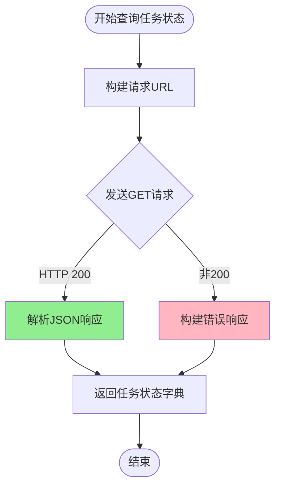

#### 带注释源码

```python
async def get_task_status(self, session: aiohttp.ClientSession, task_id: str) -> Dict:
    """
    查询任务状态
    
    Args:
        session: aiohttp session
        task_id: 任务ID
        
    Returns:
        任务状态字典
    """
    # 使用 session 发起 GET 请求到任务状态查询端点
    # 拼接完整的 API URL: {base_url}/tasks/{task_id}
    async with session.get(f'{self.base_url}/tasks/{task_id}') as resp:
        # 检查 HTTP 响应状态码
        if resp.status == 200:
            # 请求成功，异步解析 JSON 响应体并返回
            return await resp.json()
        else:
            # 请求失败，返回包含错误信息的字典
            # 注意：此处错误信息固定为 'Task not found'，不够精确
            return {'success': False, 'error': 'Task not found'}
```


### `TianshuClient.wait_for_task`

该方法用于轮询等待指定任务完成，通过持续查询任务状态直到任务达到终态（completed/failed/cancelled）或超时，返回最终的任务状态字典。

参数：

- `self`：`TianshuClient`，TianshuClient 实例本身
- `session`：`aiohttp.ClientSession`，aiohttp 会话对象，用于发起 HTTP 请求
- `task_id`：`str`，要等待的任务 ID
- `timeout`：`int`，超时时间（秒），默认 600 秒
- `poll_interval`：`int`，轮询间隔（秒），默认 2 秒

返回值：`Dict`，最终任务状态字典，包含任务状态、结果路径或错误信息

#### 流程图

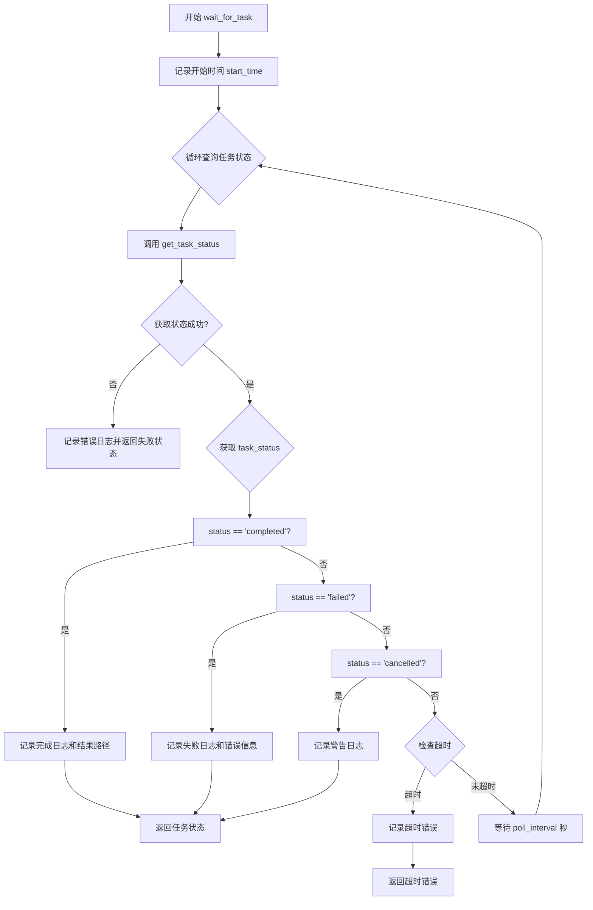

#### 带注释源码

```python
async def wait_for_task(
    self,
    session: aiohttp.ClientSession,
    task_id: str,
    timeout: int = 600,
    poll_interval: int = 2
) -> Dict:
    """
    等待任务完成
    
    Args:
        session: aiohttp session
        task_id: 任务ID
        timeout: 超时时间（秒）
        poll_interval: 轮询间隔（秒）
        
    Returns:
        最终任务状态
    """
    # 记录轮询开始时间，用于后续计算超时
    start_time = time.time()
    
    # 持续轮询直到任务完成、失败、取消或超时
    while True:
        # 调用 get_task_status 方法查询当前任务状态
        status = await self.get_task_status(session, task_id)
        
        # 检查状态获取是否成功（HTTP 200）
        if not status.get('success'):
            logger.error(f"❌ Failed to get status for task {task_id}")
            return status
        
        # 获取任务的具体状态字符串
        task_status = status.get('status')
        
        # 任务成功完成
        if task_status == 'completed':
            logger.info(f"✅ Task {task_id} completed!")
            logger.info(f"   Output: {status.get('result_path')}")
            return status
        
        # 任务执行失败
        elif task_status == 'failed':
            logger.error(f"❌ Task {task_id} failed!")
            logger.error(f"   Error: {status.get('error_message')}")
            return status
        
        # 任务被取消
        elif task_status == 'cancelled':
            logger.warning(f"⚠️  Task {task_id} was cancelled")
            return status
        
        # 检查是否超过预设的超时时间
        if time.time() - start_time > timeout:
            logger.error(f"⏱️  Task {task_id} timeout after {timeout}s")
            return {'success': False, 'error': 'timeout'}
        
        # 等待指定间隔后继续轮询
        await asyncio.sleep(poll_interval)
```


### `TianshuClient.get_queue_stats`

获取任务队列的统计信息，用于监控队列状态和任务分布情况。

参数：

- `session`：`aiohttp.ClientSession`，HTTP会话对象，用于发起请求

返回值：`Dict`，包含队列统计信息的字典，通常包含队列中各状态任务的数量

#### 流程图

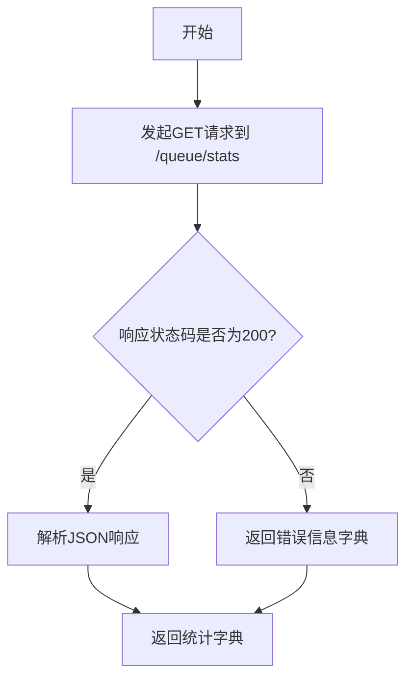

#### 带注释源码

```python
async def get_queue_stats(self, session: aiohttp.ClientSession) -> Dict:
    """
    获取队列统计
    
    Args:
        session: aiohttp session，用于维持HTTP连接
        
    Returns:
        队列统计字典，包含各状态任务的数量统计
    """
    # 使用 session 发起 GET 请求到队列统计端点
    async with session.get(f'{self.base_url}/queue/stats') as resp:
        # 直接返回解析后的 JSON 响应字典
        # 不进行额外的错误处理，假设调用方会处理可能的异常
        return await resp.json()
```


### `TianshuClient.cancel_task`

取消指定的任务，通过发送 DELETE 请求到服务端撤销任务。

参数：

-  `session`：`aiohttp.ClientSession`，HTTP 会话对象，用于发送请求
-  `task_id`：`str`，要取消的任务 ID

返回值：`Dict`，服务端返回的响应字典，通常包含任务取消结果

#### 流程图

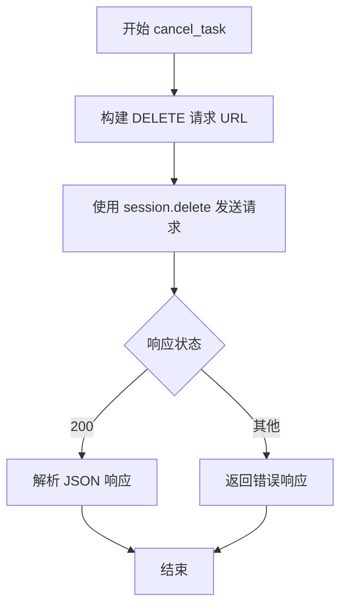

#### 带注释源码

```python
async def cancel_task(self, session: aiohttp.ClientSession, task_id: str) -> Dict:
    """
    取消任务
    
    Args:
        session: aiohttp session，用于维持 HTTP 连接
        task_id: 任务ID，指定要取消的任务
    
    Returns:
        Dict: 服务端返回的 JSON 响应，包含取消结果
    """
    # 使用 DELETE 方法向任务端点发送请求
    # 构造 URL: {base_url}/tasks/{task_id}
    async with session.delete(f'{self.base_url}/tasks/{task_id}') as resp:
        # 直接返回解析后的 JSON 响应
        # 未做错误处理，调用方需自行处理异常情况
        return await resp.json()
```

## 关键组件


### TianshuClient 类

天枢客户端核心类，提供与天枢文档处理服务交互的所有方法，包括任务提交、状态查询、队列统计和任务取消功能。

### submit_task 方法

异步方法，用于将文档处理任务提交到服务端，支持配置后端、语言、解析方法、公式识别、表格识别和优先级等参数。

### get_task_status 方法

异步方法，通过任务ID查询任务当前的处理状态，返回任务是否成功、失败或已取消等状态信息。

### wait_for_task 方法

异步方法，轮询等待任务完成，支持自定义超时时间和轮询间隔，处理任务完成、失败、取消和超时等状态。

### get_queue_stats 方法

异步方法，获取队列统计信息，包括队列中总任务数及各状态任务的数量统计。

### cancel_task 方法

异步方法，根据任务ID取消指定的任务，支持在任务执行前终止任务。

### 异步任务处理示例

提供四个示例函数展示客户端的典型使用场景：单任务提交与等待、批量并发任务提交、优先级队列任务提交以及队列状态监控。

## 问题及建议


### 已知问题

- **错误处理不完善**：多处方法缺少完整的异常捕获，如`get_queue_stats`和`cancel_task`方法未处理HTTP错误响应，`get_task_status`方法将所有非200状态统一返回"Task not found"，无法区分具体错误类型
- **资源管理风险**：`submit_task`方法中打开文件后使用`aiohttp.FormData`，但未对文件路径进行有效性验证（文件是否存在、是否为有效PDF等）
- **超时机制缺失**：使用`aiohttp.ClientSession`时未设置默认超时配置，可能导致请求在网络问题时无限期等待
- **硬编码配置**：API基础URL、轮询间隔、超时时间等参数均为硬编码，缺乏灵活的配置选项
- **类型注解不完整**：部分方法如`get_queue_stats`和`cancel_task`缺少返回类型注解，影响代码可维护性和IDE支持
- **重复代码模式**：`submit_task`、`get_task_status`、`get_queue_stats`等方法中存在相似的响应处理逻辑（状态码检查、JSON解析），未提取为公共方法
- **批量任务容错性不足**：`example_batch_tasks`中使用列表推导式直接提取`task_id`，未对提交失败的任务进行过滤，可能导致后续处理抛出KeyError
- **日志信息不完整**：缺少请求URL、耗时统计等调试信息，不利于生产环境问题排查

### 优化建议

- 为`aiohttp.ClientSession`配置全局超时（如`aiohttp.ClientTimeout(total=30)`），并为各请求添加适当的超时参数
- 增加文件存在性检查和文件类型验证，可使用`Path.is_file()`和文件魔数判断
- 将重复的错误处理逻辑抽取为私有方法，如`_handle_response(resp)`，统一处理状态码和异常
- 考虑将配置参数（API URL、超时、轮询间隔等）通过构造函数或配置类注入，提高可测试性
- 为`example_batch_tasks`添加任务提交结果校验，过滤掉提交失败的任务ID
- 补充完整的类型注解，特别是异步方法的返回类型
- 增加重试机制，针对网络波动场景使用`aiohttp-retry`或自定义重试逻辑
- 增加请求日志，记录请求URL、方法名、耗时等信息，便于问题追踪

## 其它


### 设计目标与约束

本客户端旨在为MinerU天枢服务端提供Python异步接口，实现文档处理任务的提交、状态查询、结果获取等功能。设计目标包括：简化任务提交流程、支持批量并发处理、提供任务状态轮询机制、支持优先级队列。约束条件包括：依赖aiohttp异步HTTP库、需服务端提供RESTful API支持、任务文件需为本地PDF文件、网络中断时需上层调用方处理重试逻辑。

### 错误处理与异常设计

客户端采用分层错误处理策略：HTTP层面捕获非200状态码并返回包含success=False的字典；任务状态层面区分completed、failed、cancelled三种状态；网络层面由aiohttp自动处理连接超时。网络错误时get_task_status返回{'success': False, 'error': 'Task not found'}；业务失败时返回{'success': False, 'error_message': '具体错误信息'}；超时场景返回{'success': False, 'error': 'timeout'}。调用方需根据返回字典的success字段判断操作是否成功，无需捕获HTTP异常。

### 数据流与状态机

任务状态流转遵循标准状态机模型：pending(已提交等待处理) → processing(处理中) → completed(成功) | failed(失败) | cancelled(已取消)。数据流路径为：本地PDF文件 → multipart/form-data提交 → 服务端任务队列 → 状态轮询获取 → 结果下载。submit_task将文件编码为FormData发送；wait_for_task通过轮询获取状态变更；cancel_task发送DELETE请求终止任务。

### 外部依赖与接口契约

外部依赖包括：aiohttp(异步HTTP客户端，版本需支持ClientSession上下文管理器)、loguru(日志记录)、pathlib(Path对象处理)、asyncio(内置)、typing(类型提示)。接口契约方面，API基础路径为{api_url}/api/v1，核心端点包括：POST /api/v1/tasks/submit(提交任务，需multipart/form-data)、GET /api/v1/tasks/{task_id}(查询状态)、DELETE /api/v1/tasks/{task_id}(取消任务)、GET /api/v1/queue/stats(队列统计)。所有响应均返回JSON格式，任务状态响应包含status、result_path、error_message等字段。

### 并发与异步设计

客户端完全基于asyncio构建，支持高并发场景。submit_task和wait_for_task均为async函数，可通过asyncio.gather并发执行批量任务。示例2演示了并发提交和并发等待的模式，submit_tasks列表和wait_tasks列表可同时触发多个HTTP请求。poll_interval参数控制轮询频率，默认为2秒，可在高并发场景下适当增大以减少服务端压力。

### 安全性考量

当前实现为轻量级客户端示例，安全性设计包括：API地址可配置支持内网部署、文件上传使用标准multipart/form-data协议、未在代码中硬编码认证凭证。生产环境建议添加：API Key/Bearer Token认证机制、HTTPS传输加密、请求签名验证、敏感操作日志审计。文件路径验证由Path对象安全处理，避免路径遍历攻击。

### 配置与扩展性

TianshuClient类支持运行时配置api_url参数，默认值为http://localhost:8000。submit_task方法支持丰富配置参数：backend(处理后端)、lang(语言)、method(解析方法)、formula_enable(公式识别)、table_enable(表格识别)、priority(优先级)。扩展方向包括：添加结果下载方法、添加任务列表查询方法、添加回调通知机制、添加重试装饰器支持。

### 性能考量

性能优化措施包括：复用aiohttp.ClientSession减少TCP连接开销、批量任务使用asyncio.gather并发处理、轮询间隔可配置平衡实时性与服务端压力。建议生产环境配置：连接池大小根据并发量调整、设置合理超时值、启用HTTP Keep-Alive、考虑使用WebSocket替代轮询获取状态更新。
    