# `MinerU\projects\mineru_tianshu\litserve_worker.py` 详细设计文档

MinerU Tianshu 是一个基于 LitServe 的 Worker 实现，通过独立线程循环轮询数据库任务，智能地将 PDF/图片文件路由给 GPU 加速的 MinerU 进行解析，将其他格式路由给 MarkItDown，并利用 LitServe 实现多 GPU 自动负载均衡。

## 整体流程

```mermaid
graph TD
    Start([启动 LitServe Worker Pool]) --> Init[初始化 MinerUWorkerAPI]
    Init --> Setup[setup() 初始化环境]
    Setup --> LoopStart[启动 _worker_loop 线程]
    subgraph Worker Loop
        LoopStart --> Poll{轮询数据库获取任务}
        Poll -->|无任务| Wait[time.sleep(poll_interval)]
        Wait --> Poll
        Poll -->|有任务| Process[_process_task 处理任务]
        Process --> CheckType{判断文件类型}
        CheckType -->|PDF/图片| MinerU[_parse_with_mineru]
        CheckType -->|其他格式| MarkItDown[_parse_with_markitdown]
        MinerU --> UpdateDB[更新任务状态为 completed]
        MarkItDown --> UpdateDB
        UpdateDB --> Cleanup[清理临时文件]
        Cleanup --> Poll
    end
    subgraph HTTP Interface
        Request --> Decode[decode_request]
        Decode --> Predict[predict (健康检查/轮询状态)]
        Predict --> Encode[encode_response]
    end
    Setup --> Teardown{收到关闭信号}
    Teardown --> Stop[teardown 优雅停止线程]
```

## 类结构

```
ls.LitAPI (第三方库基类)
└── MinerUWorkerAPI (自定义实现)
```

## 全局变量及字段


### `MARKITDOWN_AVAILABLE`
    
标记 markitdown 库是否可用，False 时 Office 格式解析将被禁用

类型：`bool`
    


### `PDF_IMAGE_FORMATS`
    
定义仅使用 MinerU 解析的 PDF 和图片格式集合

类型：`set`
    


### `MinerUWorkerAPI.output_dir`
    
输出目录，用于存储解析后的结果文件

类型：`Path`
    


### `MinerUWorkerAPI.worker_id_prefix`
    
Worker ID 前缀，用于生成唯一的工作进程标识

类型：`str`
    


### `MinerUWorkerAPI.poll_interval`
    
Worker 拉取任务的轮询间隔时间（秒）

类型：`float`
    


### `MinerUWorkerAPI.enable_worker_loop`
    
是否启用 Worker 自动循环拉取任务模式

类型：`bool`
    


### `MinerUWorkerAPI.db`
    
任务数据库实例，用于任务队列的存取和管理

类型：`TaskDB`
    


### `MinerUWorkerAPI.worker_id`
    
当前 Worker 的唯一标识，包含前缀、主机名、设备和进程ID

类型：`str`
    


### `MinerUWorkerAPI.markitdown`
    
Office 文档解析器实例，用于解析非 PDF/图片格式的文件

类型：`MarkItDown`
    


### `MinerUWorkerAPI.running`
    
Worker 运行状态标志，控制主循环的启停

类型：`bool`
    


### `MinerUWorkerAPI.worker_thread`
    
Worker 轮询线程，用于在后台持续拉取和处理任务

类型：`Thread`
    


### `MinerUWorkerAPI.PDF_IMAGE_FORMATS`
    
类变量，定义支持使用 MinerU 解析的 PDF 和图片格式集合

类型：`set`
    
    

## 全局函数及方法


### `start_litserve_workers`

启动 LitServe Worker Pool，初始化 GPU 资源自动负载均衡的服务池，创建 LitServer 实例并注册信号处理器以支持优雅关闭。

参数：

-  `output_dir`：`str`，输出目录，指定处理结果文件的存储路径，默认为 `/tmp/mineru_tianshu_output`
-  `accelerator`：`str`，加速器类型，支持 auto/cuda/cpu/mps，用于指定硬件加速方式，默认为 `'auto'`
-  `devices`：`str`，使用的设备，支持 auto 或逗号分隔的设备编号列表如 `'0,1,2'`，默认为 `'auto'`
-  `workers_per_device`：`int`，每个 GPU 的 worker 数量，默认为 `1`
-  `port`：`int`，服务端口，LitServe 服务器监听端口，默认为 `9000`
-  `poll_interval`：`float`，Worker 拉取任务的间隔（秒），控制任务轮询频率，默认为 `0.5`
-  `enable_worker_loop`：`bool`，是否启用 worker 自动循环拉取任务，设置为 False 则使用调度器驱动模式，默认为 `True`

返回值：`None`，无返回值，函数内部直接启动服务器阻塞运行

#### 流程图

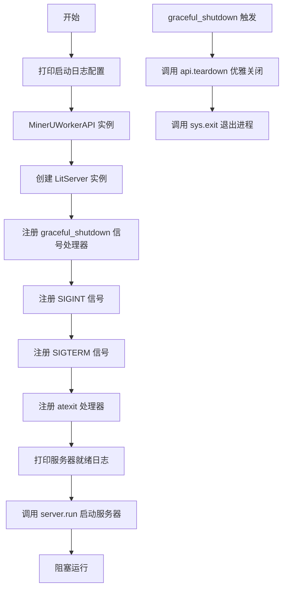

#### 带注释源码

```python
def start_litserve_workers(
    output_dir='/tmp/mineru_tianshu_output',
    accelerator='auto',
    devices='auto',
    workers_per_device=1,
    port=9000,
    poll_interval=0.5,
    enable_worker_loop=True
):
    """
    启动 LitServe Worker Pool
    
    Args:
        output_dir: 输出目录
        accelerator: 加速器类型 (auto/cuda/cpu/mps)
        devices: 使用的设备 (auto/[0,1,2])
        workers_per_device: 每个 GPU 的 worker 数量
        port: 服务端口
        poll_interval: Worker 拉取任务的间隔（秒）
        enable_worker_loop: 是否启用 worker 自动循环拉取任务
    """
    # 打印启动横幅和配置信息，便于运维人员确认启动参数
    logger.info("=" * 60)
    logger.info("🚀 Starting MinerU Tianshu LitServe Worker Pool")
    logger.info("=" * 60)
    logger.info(f"📂 Output Directory: {output_dir}")
    logger.info(f"🎮 Accelerator: {accelerator}")
    logger.info(f"💾 Devices: {devices}")
    logger.info(f"👷 Workers per Device: {workers_per_device}")
    logger.info(f"🔌 Port: {port}")
    logger.info(f"🔄 Worker Loop: {'Enabled' if enable_worker_loop else 'Disabled'}")
    if enable_worker_loop:
        logger.info(f"⏱️  Poll Interval: {poll_interval}s")
    logger.info("=" * 60)
    
    # 创建 LitServe API 实例，传入工作目录、轮询间隔和循环模式配置
    # MinerUWorkerAPI 是自定义的 LitAPI 子类，负责任务处理逻辑
    api = MinerUWorkerAPI(
        output_dir=output_dir,
        poll_interval=poll_interval,
        enable_worker_loop=enable_worker_loop
    )
    
    # 创建 LitServer 实例，配置加速器、设备数量和每个设备的 worker 数量
    # timeout=False 表示不设置任务超时，由 worker 循环自行控制
    server = ls.LitServer(
        api,
        accelerator=accelerator,
        devices=devices,
        workers_per_device=workers_per_device,
        timeout=False,  # 不设置超时
    )
    
    # 定义优雅关闭处理器，处理系统信号并清理资源
    def graceful_shutdown(signum=None, frame=None):
        """处理关闭信号，优雅地停止 worker"""
        logger.info("🛑 Received shutdown signal, gracefully stopping workers...")
        # 注意：LitServe 会为每个设备创建多个 worker 实例
        # 这里的 api 只是模板，实际的 worker 实例由 LitServe 管理
        # teardown 会在每个 worker 进程中被调用
        if hasattr(api, 'teardown'):
            api.teardown()
        sys.exit(0)
    
    # 注册信号处理器（Ctrl+C 等），确保容器/进程被终止时能优雅清理
    signal.signal(signal.SIGINT, graceful_shutdown)
    signal.signal(signal.SIGTERM, graceful_shutdown)
    
    # 注册 atexit 处理器（正常退出时调用），作为信号处理的补充
    atexit.register(lambda: api.teardown() if hasattr(api, 'teardown') else None)
    
    # 打印服务器初始化完成信息，包括监听地址和工作模式
    logger.info(f"✅ LitServe worker pool initialized")
    logger.info(f"📡 Listening on: http://0.0.0.0:{port}/predict")
    if enable_worker_loop:
        logger.info(f"🔁 Workers will continuously poll and process tasks")
    else:
        logger.info(f"🔄 Workers will wait for scheduler triggers")
    logger.info("=" * 60)
    
    # 启动服务器，generate_client_file=False 表示不生成客户端文件
    # 此调用会阻塞主线程，直到服务器关闭
    server.run(port=port, generate_client_file=False)
```


### `MinerUWorkerAPI.__init__`

构造函数，初始化 MinerU LitServe Worker 实例，配置输出目录、任务拉取参数、数据库连接和工作线程等核心资源。

参数：

- `output_dir`：`str`，默认值 `/tmp/mineru_tianshu_output`，Worker 处理结果的输出目录路径
- `worker_id_prefix`：`str`，默认值 `tianshu`，Worker 唯一标识符的前缀，用于生成 worker_id
- `poll_interval`：`float`，默认值 `0.5`，Worker 循环拉取任务的间隔时间（秒）
- `enable_worker_loop`：`bool`，默认值 `True`，是否启用 Worker 自动循环拉取任务模式

返回值：`None`，无返回值（构造函数）

#### 流程图

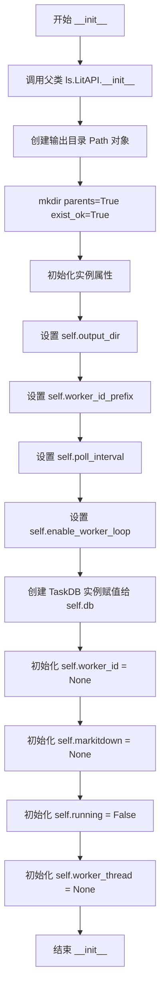

#### 带注释源码

```python
def __init__(self, output_dir='/tmp/mineru_tianshu_output', worker_id_prefix='tianshu', 
             poll_interval=0.5, enable_worker_loop=True):
    """
    初始化 MinerUWorkerAPI 实例
    
    Args:
        output_dir: 输出目录路径，默认为 /tmp/mineru_tianshu_output
        worker_id_prefix: Worker ID 前缀，默认为 'tianshu'
        poll_interval: Worker 拉取任务的时间间隔（秒），默认为 0.5
        enable_worker_loop: 是否启用 Worker 自动循环拉取任务，默认为 True
    """
    # 调用父类 LitAPI 的初始化方法
    super().__init__()
    
    # 将输出目录字符串转换为 Path 对象，并创建目录
    self.output_dir = Path(output_dir)
    self.output_dir.mkdir(parents=True, exist_ok=True)
    
    # 设置 Worker ID 前缀，用于标识不同的 Worker 实例
    self.worker_id_prefix = worker_id_prefix
    
    # 设置任务拉取间隔（秒），控制 Worker 查询数据库的频率
    self.poll_interval = poll_interval  # Worker 拉取任务的间隔（秒）
    
    # 是否启用 Worker 循环拉取模式
    # True: Worker 主动循环从数据库拉取任务并处理
    # False: 等待外部调度器触发处理任务
    self.enable_worker_loop = enable_worker_loop  # 是否启用 worker 循环拉取
    
    # 创建任务数据库连接实例，用于任务队列管理
    self.db = TaskDB()
    
    # Worker 唯一标识符，在 setup() 方法中初始化
    self.worker_id = None
    
    # MarkItDown 解析器实例，在 setup() 方法中初始化（如果可用）
    self.markitdown = None
    
    # Worker 运行状态标志，用于控制 worker 循环的启动和停止
    self.running = False  # Worker 运行状态
    
    # Worker 线程句柄，用于管理后台任务处理线程
    self.worker_thread = None  # Worker 线程
```


### `MinerUWorkerAPI.setup`

该方法是 LitServe Worker 的核心初始化逻辑，在每个 Worker 进程启动时被调用一次。它负责生成唯一的工作线程 ID、配置 CUDA 环境变量以实现 GPU 隔离、设置显存大小、初始化 MarkItDown 解析器，并启动后台任务轮询循环，从而使 Worker 能够持续主动地从任务队列中拉取并处理文档解析任务。

参数：

- `device`：`str`，LitServe 分配的设备标识符（如 `cuda:0`、`cuda:1`、`cpu` 或 `auto`），用于确定当前 Worker 应该使用哪个 GPU 设备进行计算。

返回值：`None`，该方法不返回任何值，仅执行初始化操作。

#### 流程图

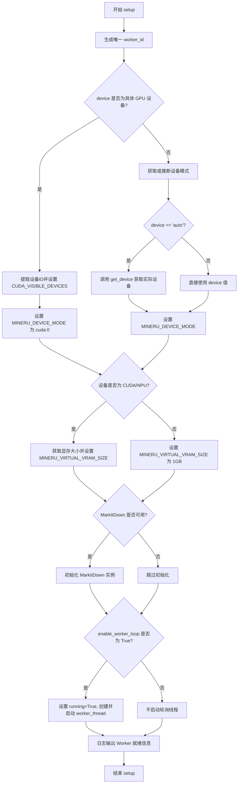

#### 带注释源码

```python
def setup(self, device):
    """
    初始化环境（每个 worker 进程调用一次）
    
    关键修复：使用 CUDA_VISIBLE_DEVICES 确保每个进程只使用分配的 GPU
    
    Args:
        device: LitServe 分配的设备 (cuda:0, cuda:1, etc.)
    """
    # 生成唯一的 worker_id：包含前缀、主机名、设备和进程ID
    import socket
    hostname = socket.gethostname()
    pid = os.getpid()
    self.worker_id = f"{self.worker_id_prefix}-{hostname}-{device}-{pid}"
    
    logger.info(f"⚙️  Worker {self.worker_id} setting up on device: {device}")
    
    # 关键修复：设置 CUDA_VISIBLE_DEVICES 限制进程只能看到分配的 GPU
    # 这样可以防止一个进程占用多张卡的显存
    if device != 'auto' and device != 'cpu' and ':' in str(device):
        # 从 'cuda:0' 提取设备ID '0'
        device_id = str(device).split(':')[-1]
        os.environ['CUDA_VISIBLE_DEVICES'] = device_id
        # 设置为 cuda:0，因为对进程来说只能看到一张卡（逻辑ID变为0）
        os.environ['MINERU_DEVICE_MODE'] = 'cuda:0'
        device_mode = os.environ['MINERU_DEVICE_MODE']
        logger.info(f"🔒 CUDA_VISIBLE_DEVICES={device_id} (Physical GPU {device_id} → Logical GPU 0)")
    else:
        # 配置 MinerU 环境
        if os.getenv('MINERU_DEVICE_MODE', None) is None:
            os.environ['MINERU_DEVICE_MODE'] = device if device != 'auto' else get_device()
        device_mode = os.environ['MINERU_DEVICE_MODE']
    
    # 配置显存：根据设备类型设置虚拟显存大小
    if os.getenv('MINERU_VIRTUAL_VRAM_SIZE', None) is None:
        if device_mode.startswith("cuda") or device_mode.startswith("npu"):
            try:
                vram = get_vram(device_mode)
                os.environ['MINERU_VIRTUAL_VRAM_SIZE'] = str(vram)
            except:
                os.environ['MINERU_VIRTUAL_VRAM_SIZE'] = '8'  # 默认值
        else:
            os.environ['MINERU_VIRTUAL_VRAM_SIZE'] = '1'
    
    # 初始化 MarkItDown（如果可用）：用于解析 Office 格式文档
    if MARKITDOWN_AVAILABLE:
        self.markitdown = MarkItDown()
        logger.info(f"✅ MarkItDown initialized for Office format parsing")
    
    logger.info(f"✅ Worker {self.worker_id} ready")
    logger.info(f"   Device: {device_mode}")
    logger.info(f"   VRAM: {os.environ['MINERU_VIRTUAL_VRAM_SIZE']}GB")
    
    # 启动 worker 循环拉取任务（在独立线程中）
    # 如果 enable_worker_loop 为 False，则不启动自动轮询线程
    if self.enable_worker_loop:
        self.running = True
        self.worker_thread = threading.Thread(
            target=self._worker_loop, 
            daemon=True,
            name=f"Worker-{self.worker_id}"
        )
        self.worker_thread.start()
        logger.info(f"🔄 Worker loop started (poll_interval={self.poll_interval}s)")
```


### `MinerUWorkerAPI.teardown`

优雅关闭 Worker，设置 running 标志为 False，等待 worker 线程完成当前任务后退出。这避免了守护线程可能导致的任务处理不完整或数据库操作不一致问题。

参数： 无

返回值：`None`，无返回值描述

#### 流程图

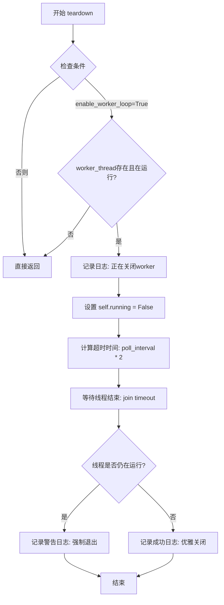

#### 带注释源码

```python
def teardown(self):
    """
    优雅关闭 Worker
    
    设置 running 标志为 False，等待 worker 线程完成当前任务后退出。
    这避免了守护线程可能导致的任务处理不完整或数据库操作不一致问题。
    """
    # 检查是否启用了 worker 循环且线程存在并正在运行
    if self.enable_worker_loop and self.worker_thread and self.worker_thread.is_alive():
        # 记录关闭日志
        logger.info(f"🛑 Shutting down worker {self.worker_id}...")
        
        # 设置 running 标志为 False，通知 worker 循环退出
        self.running = False
        
        # 计算等待超时时间（poll_interval 的 2 倍）
        # 这样可以确保线程至少有一次机会完成当前任务
        timeout = self.poll_interval * 2
        
        # 等待 worker 线程完成当前任务后退出
        self.worker_thread.join(timeout=timeout)
        
        # 检查线程是否已停止
        if self.worker_thread.is_alive():
            # 线程未在超时时间内停止，记录警告日志
            logger.warning(f"⚠️  Worker thread did not stop within {timeout}s, forcing exit")
        else:
            # 线程已优雅停止，记录成功日志
            logger.info(f"✅ Worker {self.worker_id} shut down gracefully")
```


### `MinerUWorkerAPI._worker_loop`

这是 Worker 进程的主循环方法，运行在独立的后台线程中。该方法持续不断地查询任务队列（数据库），一旦发现有待处理的任务，便取出任务并调用 `_process_task` 进行处理；如果队列为空，则进入短暂的休眠等待状态，以此实现任务的自动拉取与处理。

参数：

-  `self`：`MinerUWorkerAPI`，Worker 自身的实例，包含运行状态（`running`）、任务数据库连接（`db`）等上下文。

返回值：`None`，无返回值。该方法通过修改对象状态（如更新数据库）来产生副作用。

#### 流程图

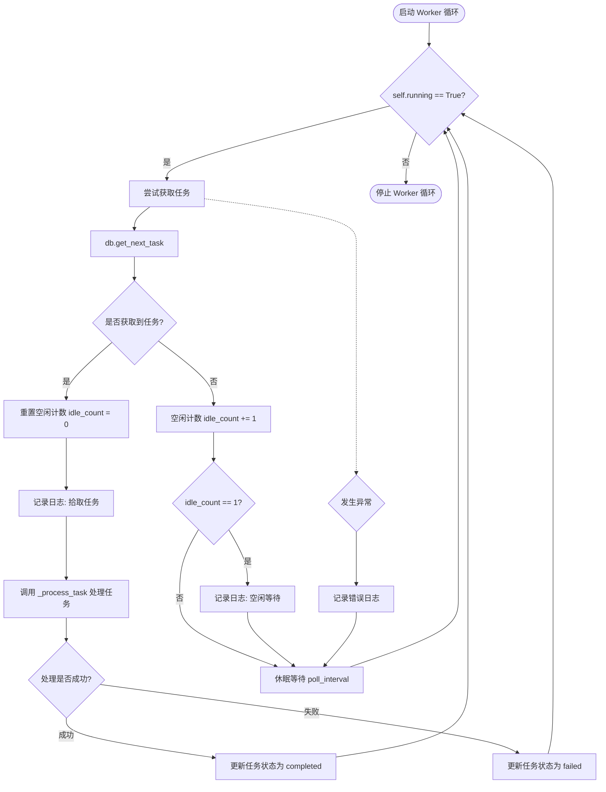

#### 带注释源码

```python
def _worker_loop(self):
    """
    Worker 主循环：持续拉取并处理任务
    
    这个方法在独立线程中运行，让每个 worker 主动拉取任务
    而不是被动等待调度器触发
    """
    # 记录启动日志
    logger.info(f"🔁 {self.worker_id} started task polling loop")
    
    # 空闲计数器，用于控制日志输出频率，避免刷屏
    idle_count = 0
    
    # 进入主循环，只要 self.running 为 True 就持续运行
    while self.running:
        try:
            # 1. 尝试从数据库获取下一个任务
            # 传入 worker_id 以便数据库标记任务被该 worker 锁定
            task = self.db.get_next_task(self.worker_id)
            
            if task:
                # === 2. 任务处理分支 ===
                idle_count = 0  # 重置空闲计数
                
                # 提取任务 ID 进行日志记录
                task_id = task['task_id']
                logger.info(f"🔄 {self.worker_id} picked up task {task_id}")
                
                try:
                    # 调用类方法处理单个任务
                    self._process_task(task)
                except Exception as e:
                    # 处理任务时发生异常，记录错误并更新数据库状态为失败
                    logger.error(f"❌ {self.worker_id} failed to process task {task_id}: {e}")
                    success = self.db.update_task_status(
                        task_id, 'failed', 
                        error_message=str(e), 
                        worker_id=self.worker_id
                    )
                    if not success:
                        # 如果更新失败，可能是任务被其他进程抢走处理了
                        logger.warning(f"⚠️  Task {task_id} was modified by another process during failure update")
            
            else:
                # === 3. 无任务空闲分支 ===
                # 没有任务时，增加空闲计数
                idle_count += 1
                
                # 只在第一次进入空闲状态时记录日志，避免日志刷屏
                if idle_count == 1:
                    logger.debug(f"💤 {self.worker_id} is idle, waiting for tasks...")
                
                # 空闲时休眠一段时间再拉取，减少数据库压力
                time.sleep(self.poll_interval)
                
        except Exception as e:
            # === 4. 循环级异常处理 ===
            # 捕获数据库连接错误等严重异常，避免线程崩溃
            logger.error(f"❌ {self.worker_id} loop error: {e}")
            time.sleep(self.poll_interval)
    
    # 5. 循环结束
    logger.info(f"⏹️  {self.worker_id} stopped task polling loop")
```


### `MinerUWorkerAPI._process_task`

处理单个任务，包括判断文件类型、选择解析方式、执行解析、更新任务状态和清理临时文件。

参数：

-  `task`：`dict`，任务字典，包含 task_id、file_path、file_name、backend、options 等字段

返回值：`None`，该方法无返回值，通过修改数据库状态来标记任务完成

#### 流程图

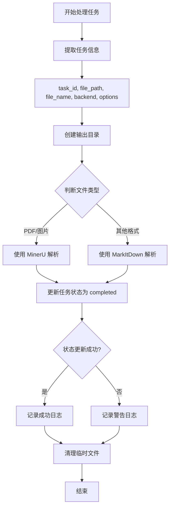

#### 带注释源码

```python
def _process_task(self, task: dict):
    """
    处理单个任务
    
    Args:
        task: 任务字典，包含 task_id、file_path、file_name、backend、options
    """
    # 1. 从任务字典中提取关键信息
    task_id = task['task_id']
    file_path = task['file_path']
    file_name = task['file_name']
    backend = task['backend']
    # options 以 JSON 字符串形式存储，需要反序列化为字典
    options = json.loads(task['options'])
    
    logger.info(f"🔄 Processing task {task_id}: {file_name}")
    
    try:
        # 2. 准备输出目录，以 task_id 作为子目录名称
        output_path = self.output_dir / task_id
        output_path.mkdir(parents=True, exist_ok=True)
        
        # 3. 判断文件类型，决定使用哪种解析器
        file_type = self._get_file_type(file_path)
        
        if file_type == 'pdf_image':
            # PDF 和图片格式使用 MinerU 解析（GPU 加速）
            self._parse_with_mineru(
                file_path=Path(file_path),
                file_name=file_name,
                task_id=task_id,
                backend=backend,
                options=options,
                output_path=output_path
            )
            parse_method = 'MinerU'
            
        else:  # file_type == 'markitdown'
            # 其他所有格式使用 MarkItDown 解析
            self._parse_with_markitdown(
                file_path=Path(file_path),
                file_name=file_name,
                output_path=output_path
            )
            parse_method = 'MarkItDown'
        
        # 4. 解析完成后，更新任务状态为成功
        success = self.db.update_task_status(
            task_id, 'completed', 
            result_path=str(output_path),
            worker_id=self.worker_id
        )
        
        # 5. 根据状态更新结果记录日志
        if success:
            logger.info(f"✅ Task {task_id} completed by {self.worker_id}")
            logger.info(f"   Parser: {parse_method}")
            logger.info(f"   Output: {output_path}")
        else:
            # 任务可能被其他进程修改（如被抢占），记录警告
            logger.warning(
                f"⚠️  Task {task_id} was modified by another process. "
                f"Worker {self.worker_id} completed the work but status update was rejected."
            )
    
    finally:
        # 6. 无论成功或失败，都需要清理临时文件
        # 注意：这里使用 finally 确保即使解析失败也会清理
        try:
            if Path(file_path).exists():
                Path(file_path).unlink()
        except Exception as e:
            logger.warning(f"Failed to clean up temp file {file_path}: {e}")
```


### `MinerUWorkerAPI.decode_request`

解码请求。该方法从 HTTP 请求中提取 action 参数，用于兼容旧接口，目前主要用于健康检查和手动触发任务轮询。

参数：

- `request`：`dict`，HTTP 请求字典，包含 `action` 等字段

返回值：`str`，从请求中获取的 action 值，默认为 `'poll'`

#### 流程图

```mermaid
flowchart TD
    A[decode_request 开始] --> B{request 是否为字典?}
    B -->|是| C{request 中是否有 'action' 键?}
    B -->|否| D[返回默认值 'poll']
    C -->|是| E[返回 request['action']]
    C -->|否| F[返回默认值 'poll']
    
    style A fill:#f9f,stroke:#333
    style D fill:#9f9,stroke:#333
    style E fill:#9f9,stroke:#333
    style F fill:#9f9,stroke:#333
```

#### 带注释源码

```python
def decode_request(self, request):
    """
    解码请求
    
    现在主要用于健康检查和手动触发（兼容旧接口）
    """
    # 使用字典的 get 方法安全获取 'action' 键
    # 如果键不存在，返回默认值 'poll'
    # 这是 LitServe 框架的标准接口方法
    return request.get('action', 'poll')
```


### `MinerUWorkerAPI._get_file_type`

判断文件类型，根据文件扩展名决定使用 MinerU（PDF/图片）还是 MarkItDown（其他格式）进行解析。

参数：

-  `file_path`：`str`，需要解析的文件路径

返回值：`str`，返回文件类型标识：
  - `'pdf_image'`：PDF 或图片格式，使用 MinerU 解析
  - `'markitdown'`：其他所有格式，使用 markitdown 解析

#### 流程图

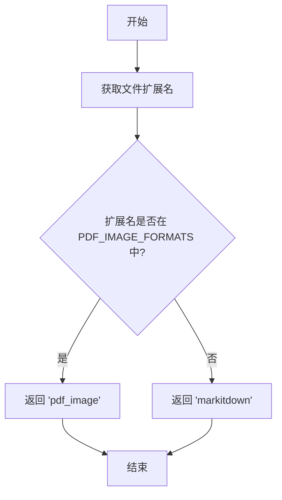

#### 带注释源码

```python
def _get_file_type(self, file_path: str) -> str:
    """
    判断文件类型
    
    Args:
        file_path: 文件路径
        
    Returns:
        'pdf_image': PDF 或图片格式，使用 MinerU 解析
        'markitdown': 其他所有格式，使用 markitdown 解析
    """
    # 获取文件扩展名并转换为小写（确保大小写不敏感）
    suffix = Path(file_path).suffix.lower()
    
    # 判断扩展名是否在预定义的 PDF/图片格式集合中
    if suffix in self.PDF_IMAGE_FORMATS:
        return 'pdf_image'
    else:
        # 所有非 PDF/图片格式都使用 markitdown
        return 'markitdown'
```


### `MinerUWorkerAPI._parse_with_mineru`

使用 MinerU 解析 PDF 和图片格式的核心方法。该方法读取文件字节流，调用 MinerU 的解析引擎处理文档，并清理推理过程中产生的临时内存。

参数：

- `file_path`：`Path`，待解析文件的路径对象
- `file_name`：`str`，待解析文件的名称（带扩展名）
- `task_id`：`str`，任务的唯一标识符，用于日志和内存清理追踪
- `backend`：`str`，指定 MinerU 解析使用的基础模型后端
- `options`：`dict`，解析选项字典，包含语言（lang）、解析方法（method）、公式识别开关（formula_enable）、表格识别开关（table_enable）等配置
- `output_path`：`Path`，解析结果的输出目录路径

返回值：`None`，该方法直接修改文件系统中的输出目录，不返回任何值

#### 流程图

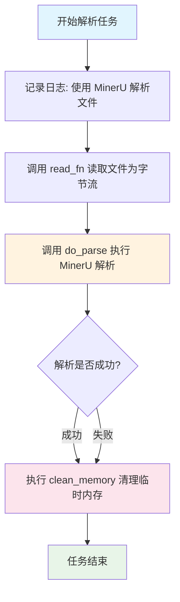

#### 带注释源码

```python
def _parse_with_mineru(self, file_path: Path, file_name: str, task_id: str, 
                       backend: str, options: dict, output_path: Path):
    """
    使用 MinerU 解析 PDF 和图片格式
    
    Args:
        file_path: 文件路径
        file_name: 文件名
        task_id: 任务ID
        backend: 后端类型
        options: 解析选项
        output_path: 输出路径
    """
    # 记录解析开始的日志信息
    logger.info(f"📄 Using MinerU to parse: {file_name}")
    
    try:
        # 步骤1: 读取文件为字节流
        # read_fn 是 MinerU CLI 提供的工具函数，支持本地文件和远程URL
        pdf_bytes = read_fn(file_path)
        
        # 步骤2: 执行解析
        # do_parse 是 MinerU 的核心解析函数，会自动加载模型并处理文档
        # ModelSingleton 机制会自动复用已加载的模型，避免重复加载开销
        do_parse(
            output_dir=str(output_path),              # 输出目录路径
            pdf_file_names=[Path(file_name).stem],    # 文件名（不含扩展名）列表
            pdf_bytes_list=[pdf_bytes],               # 文件字节流列表
            p_lang_list=[options.get('lang', 'ch')],  # 解析语言，默认为中文
            backend=backend,                          # 解析后端类型
            parse_method=options.get('method', 'auto'),  # 解析方法，auto 表示自动选择
            formula_enable=options.get('formula_enable', True),  # 是否启用公式识别
            table_enable=options.get('table_enable', True),      # 是否启用表格识别
        )
    finally:
        # 步骤3: 清理推理过程中产生的临时内存
        # 注意：这里只清理推理产生的中间结果，不会卸载已加载的模型
        # 这样可以保持模型在内存中复用于后续任务，提升处理效率
        try:
            clean_memory()
        except Exception as e:
            # 内存清理失败不应中断任务，仅记录 debug 级别日志
            logger.debug(f"Memory cleanup failed for task {task_id}: {e}")
```


### `MinerUWorkerAPI._parse_with_markitdown`

使用 markitdown 解析文档（支持 Office、HTML、文本等多种格式），将输入文件转换为 Markdown 格式并保存到指定输出路径。

参数：

- `self`：`MinerUWorkerAPI`，类实例本身
- `file_path`：`Path`，待解析文件的完整路径
- `file_name`：`str`，待解析文件的名称
- `output_path`：`Path`，解析结果输出目录的路径

返回值：`None`，该方法无返回值，结果直接写入文件系统

#### 流程图

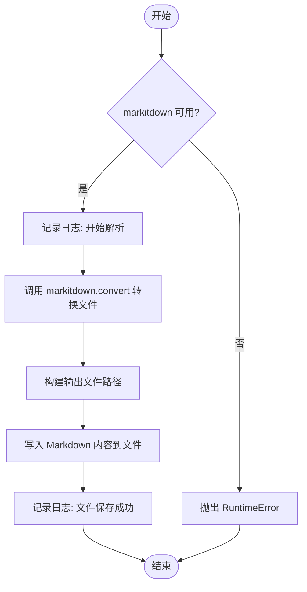

#### 带注释源码

```python
def _parse_with_markitdown(self, file_path: Path, file_name: str, 
                           output_path: Path):
    """
    使用 markitdown 解析文档（支持 Office、HTML、文本等多种格式）
    
    Args:
        file_path: 文件路径
        file_name: 文件名
        output_path: 输出路径
    """
    # 检查 markitdown 是否可用，若不可用则抛出运行时错误
    if not MARKITDOWN_AVAILABLE or self.markitdown is None:
        raise RuntimeError("markitdown is not available. Please install it: pip install markitdown")
    
    # 记录解析开始的日志信息
    logger.info(f"📊 Using MarkItDown to parse: {file_name}")
    
    # 使用 markitdown 将文档转换为 Markdown 格式
    # result 对象包含转换后的文本内容
    result = self.markitdown.convert(str(file_path))
    
    # 根据原文件名构建 Markdown 输出文件名（保留主名，替换为 .md 后缀）
    # 并保存到指定的输出目录
    output_file = output_path / f"{Path(file_name).stem}.md"
    
    # 将转换后的 Markdown 内容写入文件，使用 UTF-8 编码
    output_file.write_text(result.text_content, encoding='utf-8')
    
    # 记录文件保存成功的日志信息
    logger.info(f"📝 Markdown saved to: {output_file}")
```


### `MinerUWorkerAPI.predict`

HTTP 接口方法，主要用于健康检查、获取 worker 状态以及兼容旧的手动触发模式。当启用 worker 自动循环时，该接口主要返回当前 worker 的运行状态；当禁用自动循环时，该接口可手动触发任务拉取和处理。

参数：

-  `action`：`str`，操作类型，支持 "health"（健康检查）、"poll"（手动拉取任务）或其它值

返回值：`dict`，根据不同的 action 返回不同的响应结构

#### 流程图

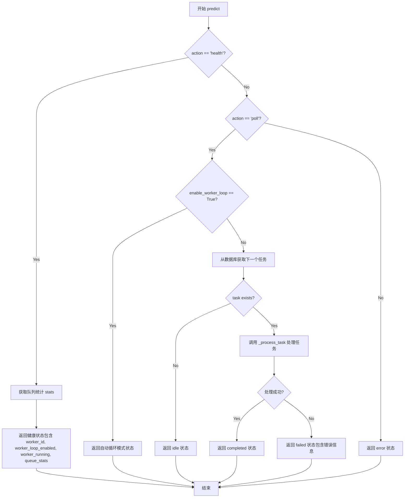

#### 带注释源码

```python
def predict(self, action):
    """
    HTTP 接口（主要用于健康检查和监控）
    
    现在任务由 worker 循环自动拉取处理，这个接口主要用于：
    1. 健康检查
    2. 获取 worker 状态
    3. 兼容旧的手动触发模式（当 enable_worker_loop=False 时）
    
    Args:
        action: str，操作类型，"health" 或 "poll"
    
    Returns:
        dict，根据 action 返回不同的响应结构
    """
    # 分支1：健康检查
    if action == 'health':
        # 健康检查
        stats = self.db.get_queue_stats()
        return {
            'status': 'healthy',
            'worker_id': self.worker_id,
            'worker_loop_enabled': self.enable_worker_loop,
            'worker_running': self.running,
            'queue_stats': stats
        }
    
    # 分支2：手动轮询任务（兼容模式）
    elif action == 'poll':
        if not self.enable_worker_loop:
            # 兼容模式：手动触发任务拉取
            # 从数据库获取下一个待处理任务
            task = self.db.get_next_task(self.worker_id)
            
            # 如果没有待处理任务，返回空闲状态
            if not task:
                return {
                    'status': 'idle',
                    'message': 'No pending tasks in queue',
                    'worker_id': self.worker_id
                }
            
            # 尝试处理任务
            try:
                self._process_task(task)
                return {
                    'status': 'completed',
                    'task_id': task['task_id'],
                    'worker_id': self.worker_id
                }
            except Exception as e:
                return {
                    'status': 'failed',
                    'task_id': task['task_id'],
                    'error': str(e),
                    'worker_id': self.worker_id
                }
        else:
            # Worker 循环模式：返回状态信息
            # 此时任务由独立线程自动拉取，此接口仅返回当前状态
            return {
                'status': 'auto_mode',
                'message': 'Worker is running in auto-loop mode, tasks are processed automatically',
                'worker_id': self.worker_id,
                'worker_running': self.running
            }
    
    # 分支3：无效的 action
    else:
        return {
            'status': 'error',
            'message': f'Invalid action: {action}. Use "health" or "poll".',
            'worker_id': self.worker_id
        }
```


### `MinerUWorkerAPI.encode_response`

编码响应（透传模式），将处理结果直接返回给客户端。该方法是 LitServe 框架的必需接口，用于将 `predict` 方法的返回值序列化后响应 HTTP 请求。

参数：

- `response`：`Any`，需要编码的响应对象，通常是字典类型

返回值：`Any`，编码后的响应对象（由于采用透传模式，直接返回原始 response）

#### 流程图

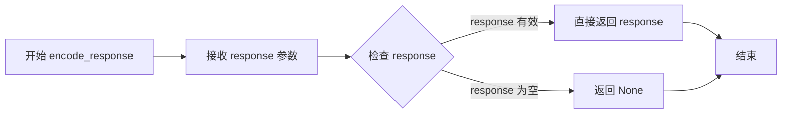

#### 带注释源码

```python
def encode_response(self, response):
    """
    编码响应
    
    LitServe 框架的标准接口方法，用于将 predict 方法的返回值
    序列化为 HTTP 响应。
    
    当前实现采用透传模式：直接返回 predict 方法的结果，不做额外处理。
    这符合 LitServe 的设计理念，由 LitServe 内部处理响应序列化。
    
    Args:
        response: predict 方法返回的响应对象，通常是字典类型
        
    Returns:
        未经修改的 response 对象，由 LitServe 进行后续序列化处理
    """
    return response
```

## 关键组件


### MinerUWorkerAPI

LitServe API Worker 主类，负责管理 Worker 生命周期、任务拉取循环、任务处理（PDF/图片使用 MinerU 解析，其他格式使用 MarkItDown 解析）、GPU 资源分配与显存管理、健康检查与状态监控。

### 任务拉取循环 (_worker_loop)

独立线程中运行的 Worker 主循环，持续从数据库拉取待处理任务，若无任务则休眠等待，实现了主动轮询而非被动等待调度的主动负载均衡模式。

### 文件类型路由 (_get_file_type)

根据文件扩展名判断解析方式，PDF 和图片格式（.pdf, .png, .jpg 等）路由至 MinerU 解析，其他所有格式路由至 MarkItDown 解析。

### MinerU 解析器 (_parse_with_mineru)

调用 MinerU 的 do_parse 接口处理 PDF 和图片文档，支持多语言、公式识别、表格识别，利用 ModelSingleton 复用模型，处理完成后调用 clean_memory 清理中间结果。

### MarkItDown 解析器 (_parse_with_markitdown)

使用 markitdown 库解析 Office、HTML、文本等多种格式文档，将转换结果保存为 Markdown 文件。

### GPU 资源隔离 (setup)

通过设置 CUDA_VISIBLE_DEVICES 环境变量实现进程级 GPU 隔离，确保每个 Worker 进程只能访问分配的单张 GPU，防止显存争用。

### 任务数据库交互 (TaskDB)

与 TaskDB 实例交互获取任务、更新任务状态（包括成功完成、失败、结果路径），提供队列统计信息。

### 优雅关闭机制 (teardown)

通过设置 running 标志并等待 Worker 线程完成当前任务（带超时）实现优雅关闭，避免守护线程导致的任务不完整或数据库不一致。

### LitServe 启动器 (start_litserve_workers)

创建并配置 LitServer 实例，注册信号处理器（SIGINT/SIGTERM）和 atexit 回调，启动 Worker 池并监听指定端口。

### 健康检查与状态接口 (predict)

提供 HTTP 接口用于健康检查、获取 Worker 状态、队列统计信息，支持手动触发模式（当 enable_worker_loop=False 时）。

## 问题及建议


### 已知问题

- **JSON 解析异常未捕获**：`task['options']` 直接调用 `json.loads()`，若数据库中存储的 options 格式错误会导致整个 worker 崩溃
- **数据库并发冲突处理不完善**：任务状态更新失败仅记录警告日志，没有重试机制，可能导致任务结果与状态不一致
- **线程安全风险**：`self.running` 标志和 `self.markitdown` 对象在多线程环境下读写没有锁保护，可能产生竞态条件
- **GPU 内存管理不完整**：仅调用 `clean_memory()` 清理推理中间结果，缺少模型卸载机制，长时间运行可能导致显存碎片化
- **临时文件清理不可靠**：文件删除放在 `finally` 块中，若进程异常退出（如 SIGKILL）临时文件将残留
- **Worker ID 生成逻辑重复**：在 `setup` 中设置环境变量 `MINERU_DEVICE_MODE`，但 `get_device()` 也可能设置相同变量，逻辑分散且可能冲突
- **缺少任务超时机制**：任务处理没有超时限制，一旦解析卡死（如大文件）将阻塞 worker
- **端口和日志输出无访问控制**：未发现对 `/predict` 接口的认证和限流机制，存在滥用风险

### 优化建议

- **增强异常处理**：对 `json.loads` 添加 try-except，为数据库操作添加重试装饰器或事务支持
- **添加线程安全保护**：使用 `threading.Lock` 保护共享资源的读写，或考虑使用线程安全的数据结构
- **完善资源清理**：实现进程退出时的 atexit 回调清理临时文件，或使用临时目录的自动清理机制（如 `tempfile.TemporaryDirectory`）
- **引入任务超时**：在 `_process_task` 中使用 signal 或线程超时机制，为单个任务设置最大处理时间
- **集中配置管理**：将 GPU 设备、环境变量初始化逻辑统一到一个配置类中，避免重复和冲突
- **添加健康检查详细指标**：返回 GPU 内存使用率、当前处理任务数、已完成任务统计等信息便于监控
- **优化轮询策略**：空闲时采用指数退避策略（当前固定 0.5s），减少无任务时的数据库查询压力
- **添加 markitdown 后备方案**：当 markitdown 不可用时，应该有明确的错误提示而非静默跳过部分格式

## 其它


### 设计目标与约束

**设计目标**：
1. 实现 GPU 资源的自动负载均衡，通过 LitServe 的多 Worker 架构支持多 GPU 并行处理
2. 支持 Worker 主动循环拉取任务模式，提高任务处理效率和资源利用率
3. 支持多种文件格式解析：PDF/图片使用 MinerU（GPU 加速），其他格式使用 MarkItDown（Office、HTML、文本等）
4. 实现优雅关闭机制，确保 Worker 在停止时完成当前任务再退出

**设计约束**：
1. 每个 Worker 进程只能使用分配的单张 GPU，通过 CUDA_VISIBLE_DEVICES 环境变量隔离
2. Worker 循环拉取间隔受 poll_interval 控制，默认 0.5 秒
3. 任务处理采用同步模式，完成当前任务后才拉取下一个任务
4. 依赖 markitdown 库进行 Office 格式解析，该库为可选依赖

### 错误处理与异常设计

**异常分类与处理**：
1. **任务处理异常**：在 _process_task 方法中捕获，更新任务状态为 failed 并记录错误信息到数据库
2. **数据库操作异常**：在更新任务状态时可能发生（如任务被其他进程修改），通过返回值判断并记录警告日志
3. **文件清理异常**：在 finally 块中捕获，仅记录警告不影响主流程
4. **Worker 循环异常**：在外层循环捕获，记录错误后继续运行
5. **MarkItDown 不可用异常**：在初始化时检测，运行时调用则抛出 RuntimeError

**优雅关闭机制**：
1. teardown 方法设置 running 标志为 False
2. 等待 worker 线程完成当前任务（超时时间为 poll_interval * 2）
3. 超时后强制退出避免无限等待

### 数据流与状态机

**任务状态流转**：
```
pending → processing (Worker 拉取) → completed (成功) 
       ↘                               ↘ failed (异常)
```

**数据流向**：
1. Worker 从 TaskDB 获取 pending 状态任务
2. 根据文件扩展名判断解析方式
3. 调用相应解析器处理文件
4. 解析结果保存到 output_dir
5. 更新 TaskDB 任务状态为 completed/failed
6. 清理临时文件

**文件类型判断**：
- PDF/图片格式（.pdf, .png, .jpg, .jpeg, .bmp, .tiff, .tif, .webp）→ MinerU 解析
- 其他所有格式 → MarkItDown 解析

### 外部依赖与接口契约

**核心依赖**：
1. **litserve**：GPU 负载均衡框架，负责 Worker 进程管理和设备分配
2. **task_db**：任务队列数据库模块，提供 get_next_task、update_task_status、get_queue_stats 方法
3. **markitdown**：可选依赖，用于 Office 格式解析
4. **MinerU 内部模块**：do_parse（解析入口）、read_fn（文件读取）、get_device（设备检测）、get_vram（显存检测）、clean_memory（内存清理）

**接口契约**：
1. **HTTP API（/predict）**：
   - action=health：返回 Worker 健康状态、Worker ID、队列统计信息
   - action=poll：在 disable-worker-loop 模式下手动拉取任务，返回任务执行结果
2. **数据库接口**：
   - get_next_task(worker_id)：获取下一个待处理任务
   - update_task_status(task_id, status, result_path/error_message, worker_id)：更新任务状态
   - get_queue_stats()：获取队列统计信息
3. **命令行接口**：
   - --output-dir：输出目录
   - --accelerator：加速器类型
   - --devices：GPU 设备列表
   - --workers-per-device：每设备 Worker 数量
   - --port：服务端口
   - --poll-interval：任务拉取间隔
   - --disable-worker-loop：禁用自动拉取模式

### 配置管理

**环境变量**：
1. MINERU_DEVICE_MODE：设备模式（cuda:0, cpu 等）
2. MINERU_VIRTUAL_VRAM_SIZE：虚拟显存大小（GB）
3. CUDA_VISIBLE_DEVICES：进程可见 GPU 设备（物理 GPU ID）

**配置优先级**：
1. 命令行参数 > 环境变量 > 代码默认值
2. device 参数由 LitServe 自动分配，代码根据 device 设置 CUDA_VISIBLE_DEVICES

### 并发与同步机制

**并发模型**：
1. LitServe 为每个设备创建独立 Worker 进程
2. 每个 Worker 内部启动独立线程执行 _worker_loop
3. 使用 threading.Event 机制（running 标志）控制线程停止

**同步策略**：
1. 任务状态更新使用乐观锁（通过返回值判断是否成功）
2. 数据库操作可能出现竞态条件，通过返回值处理
3. GPU 资源通过 CUDA_VISIBLE_DEVICES 物理隔离，避免多进程争抢
    