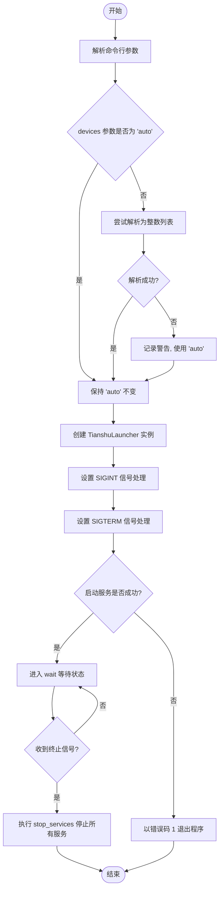
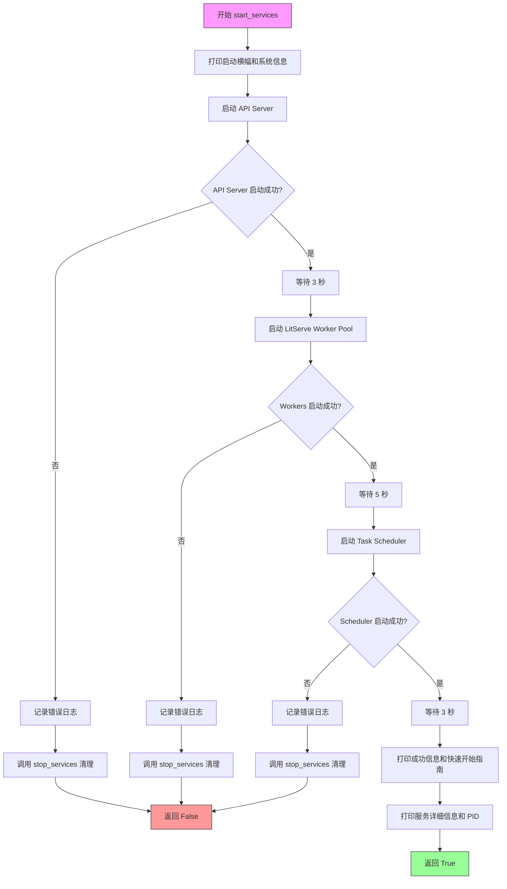
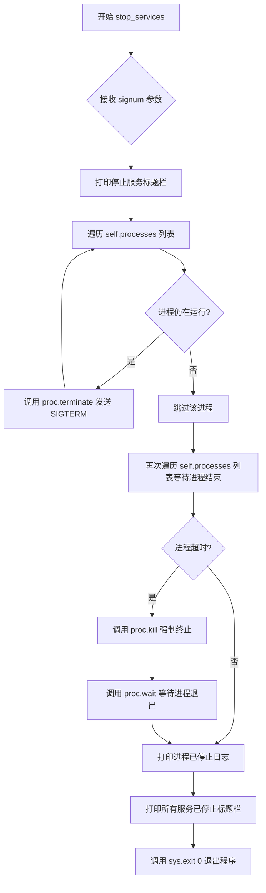
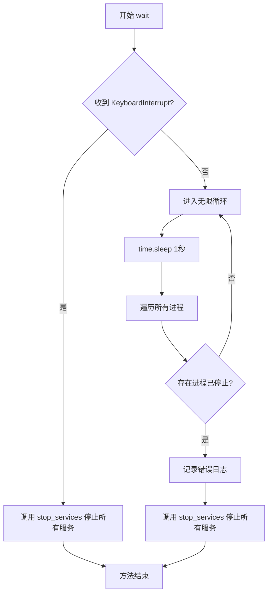

# `MinerU\projects\mineru_tianshu\start_all.py` 详细设计文档

MinerU Tianshu（天枢）统一启动脚本，通过一键启动API Server、LitServe Worker Pool和Task Scheduler三个核心服务，实现企业级多GPU文档解析服务的快速部署。

## 整体流程

```mermaid
graph TD
    A[开始] --> B[解析命令行参数]
    B --> C[处理devices参数]
    C --> D[创建TianshuLauncher实例]
    D --> E[设置SIGINT和SIGTERM信号处理]
    E --> F{start_services返回True?}
    F -- 是 --> G[调用wait方法持续监控]
    F -- 否 --> H[sys.exit(1)退出]
    G --> I{收到KeyboardInterrupt?}
    I -- 是 --> J[调用stop_services停止所有服务]
    I -- 否 --> K{有进程意外退出?}
    K -- 是 --> J
    K -- 否 --> G
    J --> L[等待进程结束]
    L --> M[流程结束]

subgraph start_services流程
    S1[启动API Server] --> S2[等待3秒]
    S2 --> S3{API Server启动失败?}
    S3 -- 是 --> S4[返回False]
    S3 -- 否 --> S5[启动LitServe Worker Pool]
    S5 --> S6[等待5秒]
    S6 --> S7{Workers启动失败?}
    S7 -- 是 --> S4
    S7 -- 否 --> S8[启动Task Scheduler]
    S8 --> S9[等待3秒]
    S9 --> S10{Scheduler启动失败?}
    S10 -- 是 --> S4
    S10 -- 否 --> S11[返回True]
end
```

## 类结构

```
TianshuLauncher (天枢服务启动器)
└── 主要方法:
    ├── __init__ (构造函数)
    ├── start_services (启动所有服务)
    ├── stop_services (停止所有服务)
    └── wait (等待并监控服务状态)
```

## 全局变量及字段


### `subprocess`
    
用于启动和管理子进程

类型：`module`
    


### `signal`
    
用于处理系统信号（如SIGINT、SIGTERM）

类型：`module`
    


### `sys`
    
提供Python解释器的相关信息和系统相关功能

类型：`module`
    


### `time`
    
提供时间相关的函数和常量

类型：`module`
    


### `os`
    
提供操作系统相关功能，如环境变量、进程管理等

类型：`module`
    


### `logger`
    
日志记录器，用于输出程序运行日志

类型：`loguru.logger`
    


### `Path`
    
用于路径处理和文件操作

类型：`pathlib.Path`
    


### `argparse`
    
命令行参数解析模块

类型：`module`
    


### `TianshuLauncher.output_dir`
    
输出目录路径

类型：`str`
    


### `TianshuLauncher.api_port`
    
API服务器端口

类型：`int`
    


### `TianshuLauncher.worker_port`
    
Worker服务器端口

类型：`int`
    


### `TianshuLauncher.workers_per_device`
    
每个GPU的worker数量

类型：`int`
    


### `TianshuLauncher.devices`
    
使用的GPU设备

类型：`str/list`
    


### `TianshuLauncher.accelerator`
    
加速器类型(auto/cpu/cuda/mps)

类型：`str`
    


### `TianshuLauncher.processes`
    
存储启动的子进程列表

类型：`list`
    
    

## 全局函数及方法


### `main`

主函数，负责解析命令行参数、创建 `TianshuLauncher` 启动器实例、设置信号处理以优雅地停止服务、然后启动所有服务并进入等待状态。

参数：
- 该函数无直接参数，通过 `argparse` 从命令行接收以下参数：
  - `output_dir`：`str`，输出目录，默认为 `/tmp/mineru_tianshu_output`
  - `api_port`：`int`，API 服务器端口，默认为 `8000`
  - `worker_port`：`int`，Worker 服务器端口，默认为 `9000`
  - `accelerator`：`str`，加速器类型，可选值为 `auto`、`cuda`、`cpu`、`mps`，默认为 `auto`
  - `workers_per_device`：`int`，每个 GPU 的 worker 数量，默认为 `1`
  - `devices`：`str`，使用的 GPU 设备，逗号分隔，默认为 `auto`

返回值：`None`，无返回值（函数执行完毕后程序退出）

#### 流程图



#### 带注释源码

```python
def main():
    """主函数"""
    # 创建命令行参数解析器
    parser = argparse.ArgumentParser(
        description='MinerU Tianshu - 统一启动脚本',
        formatter_class=argparse.RawDescriptionHelpFormatter,
        epilog="""
示例:
  # 使用默认配置启动（自动检测GPU）
  python start_all.py
  
  # 使用CPU模式
  python start_all.py --accelerator cpu
  
  # 指定输出目录和端口
  python start_all.py --output-dir /data/output --api-port 8080
  
  # 每个GPU启动2个worker
  python start_all.py --accelerator cuda --workers-per-device 2
  
  # 只使用指定的GPU
  python start_all.py --accelerator cuda --devices 0,1
        """
    )
    
    # 添加输出目录参数
    parser.add_argument('--output-dir', type=str, default='/tmp/mineru_tianshu_output',
                       help='输出目录 (默认: /tmp/mineru_tianshu_output)')
    # 添加 API 服务器端口参数
    parser.add_argument('--api-port', type=int, default=8000,
                       help='API服务器端口 (默认: 8000)')
    # 添加 Worker 服务器端口参数
    parser.add_argument('--worker-port', type=int, default=9000,
                       help='Worker服务器端口 (默认: 9000)')
    # 添加加速器类型参数
    parser.add_argument('--accelerator', type=str, default='auto',
                       choices=['auto', 'cuda', 'cpu', 'mps'],
                       help='加速器类型 (默认: auto，自动检测)')
    # 添加每个 GPU 的 worker 数量参数
    parser.add_argument('--workers-per-device', type=int, default=1,
                       help='每个GPU的worker数量 (默认: 1)')
    # 添加使用的 GPU 设备参数
    parser.add_argument('--devices', type=str, default='auto',
                       help='使用的GPU设备，逗号分隔 (默认: auto，使用所有GPU)')
    
    # 解析命令行参数
    args = parser.parse_args()
    
    # 处理 devices 参数，支持逗号分隔的设备 ID 列表
    devices = args.devices
    if devices != 'auto':
        try:
            # 尝试将字符串解析为整数列表，例如 '0,1' -> [0, 1]
            devices = [int(d) for d in devices.split(',')]
        except:
            # 解析失败时记录警告并回退到 'auto'
            logger.warning(f"Invalid devices format: {devices}, using 'auto'")
            devices = 'auto'
    
    # 创建天枢服务启动器实例
    launcher = TianshuLauncher(
        output_dir=args.output_dir,
        api_port=args.api_port,
        worker_port=args.worker_port,
        workers_per_device=args.workers_per_device,
        devices=devices,
        accelerator=args.accelerator
    )
    
    # 设置信号处理：SIGINT (Ctrl+C) 时优雅停止所有服务
    signal.signal(signal.SIGINT, launcher.stop_services)
    # 设置信号处理：SIGTERM (kill 信号) 时优雅停止所有服务
    signal.signal(signal.SIGTERM, launcher.stop_services)
    
    # 启动所有服务
    if launcher.start_services():
        # 启动成功后进入等待状态，保持服务运行
        launcher.wait()
    else:
        # 启动失败时以错误码 1 退出程序
        sys.exit(1)


if __name__ == '__main__':
    main()
```


### `TianshuLauncher.__init__`

该方法是 `TianshuLauncher` 类的构造函数，用于初始化天枢服务启动器的配置参数，包括输出目录、各服务端口、设备配置和加速器类型，同时初始化进程列表用于管理子进程。

**参数：**

- `output_dir`：`str`，输出目录路径，默认为 `/tmp/mineru_tianshu_output`，用于指定任务输出文件的存放位置
- `api_port`：`int`，API 服务器端口，默认为 `8000`，用于接收 HTTP 请求
- `worker_port`：`int`，LitServe Worker 服务端口，默认为 `9000`，用于处理推理任务
- `workers_per_device`：`int`，每个 GPU 设备上的 Worker 进程数量，默认为 `1`
- `devices`：`str`，指定使用的 GPU 设备，默认为 `'auto'`（自动检测所有可用 GPU），支持逗号分隔的设备 ID
- `accelerator`：`str`，加速器类型，默认为 `'auto'`（自动检测），可选值包括 `cuda`、`cpu`、`mps`

**返回值：** `None`，无显式返回值，仅初始化实例属性

#### 流程图

```mermaid
flowchart TD
    A[开始 __init__] --> B[接收配置参数]
    B --> C[设置 self.output_dir]
    C --> D[设置 self.api_port]
    D --> E[设置 self.worker_port]
    E --> F[设置 self.workers_per_device]
    F --> G[设置 self.devices]
    G --> H[设置 self.accelerator]
    H --> I[初始化 self.processes = []]
    I --> J[结束 __init__]
```

#### 带注释源码

```python
def __init__(
    self,
    output_dir='/tmp/mineru_tianshu_output',
    api_port=8000,
    worker_port=9000,
    workers_per_device=1,
    devices='auto',
    accelerator='auto'
):
    """
    初始化天枢服务启动器
    
    Args:
        output_dir: 输出目录路径，用于存放解析结果
        api_port: API 服务器监听端口
        worker_port: LitServe Worker 池监听端口
        workers_per_device: 每个 GPU 设备启动的 Worker 数量
        devices: GPU 设备标识，'auto' 表示自动检测
        accelerator: 加速器类型，'auto'/'cuda'/'cpu'/'mps'
    """
    # 设置输出目录属性
    self.output_dir = output_dir
    # 设置 API 服务端口
    self.api_port = api_port
    # 设置 Worker 服务端口
    self.worker_port = worker_port
    # 设置每设备 Worker 数量
    self.workers_per_device = workers_per_device
    # 设置 GPU 设备列表
    self.devices = devices
    # 设置加速器类型
    self.accelerator = accelerator
    # 初始化进程列表，用于存储所有启动的子进程
    self.processes = []
```


### `TianshuLauncher.start_services`

该方法是 `TianshuLauncher` 类的核心方法，负责一键启动 MinerU 天枢系统的所有服务组件（API Server、LitServe Worker Pool、Task Scheduler），并通过子进程管理确保各服务按顺序启动且相互协调，同时提供启动失败时的错误处理和服务终止机制。

参数：

- `self`：隐式参数，`TianshuLauncher` 实例对象，包含服务启动所需的所有配置信息

返回值：`bool`，返回 `True` 表示所有服务启动成功，返回 `False` 表示任意服务启动失败

#### 流程图



#### 带注释源码

```python
def start_services(self):
    """启动所有服务"""
    # 打印启动横幅，标识系统名称和启动意图
    logger.info("=" * 70)
    logger.info("🚀 MinerU Tianshu - Starting All Services")
    logger.info("=" * 70)
    logger.info("天枢 - 企业级多GPU文档解析服务")
    logger.info("")
    
    try:
        # ==================== 步骤 1: 启动 API Server ====================
        logger.info("📡 [1/3] Starting API Server...")
        
        # 复制当前环境变量，并添加 API_PORT 配置
        env = os.environ.copy()
        env['API_PORT'] = str(self.api_port)
        
        # 使用 subprocess.Popen 启动 API Server 作为独立子进程
        # cwd=Path(__file__).parent 确保在正确的目录下执行
        api_proc = subprocess.Popen(
            [sys.executable, 'api_server.py'],
            cwd=Path(__file__).parent,
            env=env
        )
        
        # 将进程添加到管理列表，格式为 (服务名, 进程对象)
        self.processes.append(('API Server', api_proc))
        
        # 等待 3 秒让 API Server 完成初始化
        time.sleep(3)
        
        # 检查进程是否异常退出（poll() 返回 None 表示进程仍在运行）
        if api_proc.poll() is not None:
            logger.error("❌ API Server failed to start!")
            return False
        
        # 启动成功，记录 PID 和访问地址
        logger.info(f"   ✅ API Server started (PID: {api_proc.pid})")
        logger.info(f"   📖 API Docs: http://localhost:{self.api_port}/docs")
        logger.info("")
        
        # ==================== 步骤 2: 启动 LitServe Worker Pool ====================
        logger.info("⚙️  [2/3] Starting LitServe Worker Pool...")
        
        # 构建 worker 启动命令，包含所有必要的参数配置
        worker_cmd = [
            sys.executable, 'litserve_worker.py',
            '--output-dir', self.output_dir,
            '--accelerator', self.accelerator,
            '--workers-per-device', str(self.workers_per_device),
            '--port', str(self.worker_port),
            '--devices', str(self.devices) if isinstance(self.devices, str) else ','.join(map(str, self.devices))
        ]
        
        # 启动 worker 进程池
        worker_proc = subprocess.Popen(
            worker_cmd,
            cwd=Path(__file__).parent
        )
        self.processes.append(('LitServe Workers', worker_proc))
        
        # 等待 5 秒让 worker 完成初始化（相比 API Server 需要更长时间）
        time.sleep(5)
        
        # 检查 worker 启动状态
        if worker_proc.poll() is not None:
            logger.error("❌ LitServe Workers failed to start!")
            return False
        
        # 启动成功，记录详细信息
        logger.info(f"   ✅ LitServe Workers started (PID: {worker_proc.pid})")
        logger.info(f"   🔌 Worker Port: {self.worker_port}")
        logger.info(f"   👷 Workers per Device: {self.workers_per_device}")
        logger.info("")
        
        # ==================== 步骤 3: 启动 Task Scheduler ====================
        logger.info("🔄 [3/3] Starting Task Scheduler...")
        
        # 构建 scheduler 启动命令
        scheduler_cmd = [
            sys.executable, 'task_scheduler.py',
            '--litserve-url', f'http://localhost:{self.worker_port}/predict',
            '--wait-for-workers'
        ]
        
        # 启动任务调度器
        scheduler_proc = subprocess.Popen(
            scheduler_cmd,
            cwd=Path(__file__).parent
        )
        self.processes.append(('Task Scheduler', scheduler_proc))
        
        # 等待 3 秒
        time.sleep(3)
        
        # 检查 scheduler 启动状态
        if scheduler_proc.poll() is not None:
            logger.error("❌ Task Scheduler failed to start!")
            return False
        
        logger.info(f"   ✅ Task Scheduler started (PID: {scheduler_proc.pid})")
        logger.info("")
        
        # ==================== 启动完成 ====================
        # 打印启动成功的完整信息
        logger.info("=" * 70)
        logger.info("✅ All Services Started Successfully!")
        logger.info("=" * 70)
        logger.info("")
        
        # 提供快速开始指南，包含 API 调用的示例端点
        logger.info("📚 Quick Start:")
        logger.info(f"   • API Documentation: http://localhost:{self.api_port}/docs")
        logger.info(f"   • Submit Task:       POST http://localhost:{self.api_port}/api/v1/tasks/submit")
        logger.info(f"   • Query Status:      GET  http://localhost:{self.api_port}/api/v1/tasks/{{task_id}}")
        logger.info(f"   • Queue Stats:       GET  http://localhost:{self.api_port}/api/v1/queue/stats")
        logger.info("")
        
        # 打印所有已启动服务的详细信息，包括进程 PID
        logger.info("🔧 Service Details:")
        for name, proc in self.processes:
            logger.info(f"   • {name:20s} PID: {proc.pid}")
        logger.info("")
        
        # 提示用户如何停止服务
        logger.info("⚠️  Press Ctrl+C to stop all services")
        logger.info("=" * 70)
        
        # 所有服务启动成功
        return True
        
    except Exception as e:
        # 捕获启动过程中的任何异常，记录错误并清理已启动的服务
        logger.error(f"❌ Failed to start services: {e}")
        self.stop_services()
        return False
```


### `TianshuLauncher.stop_services`

停止 TianshuLauncher 实例所管理的所有服务进程（包括 API Server、LitServe Workers 和 Task Scheduler），支持信号处理机制实现优雅关闭。

参数：

- `self`：隐式参数，`TianshuLauncher` 类型，当前启动器实例
- `signum`：`int` 或 `None`，接收到的信号编号（可选，用于信号处理回调，默认 `None`）
- `frame`：`frame` 对象或 `None`，当前堆栈帧（可选，用于信号处理回调，默认 `None`）

返回值：`None`，该方法通过 `sys.exit(0)` 退出进程，无实际返回值

#### 流程图



#### 带注释源码

```python
def stop_services(self, signum=None, frame=None):
    """停止所有服务"""
    # 打印空行和分隔标题栏，表示开始停止服务流程
    logger.info("")
    logger.info("=" * 70)
    logger.info("⏹️  Stopping All Services...")
    logger.info("=" * 70)
    
    # 第一轮循环：遍历所有已启动的进程，发送终止信号(SIGTERM)
    for name, proc in self.processes:
        # proc.poll() 返回 None 表示进程仍在运行(未退出)
        if proc.poll() is None:  # 进程仍在运行
            # 记录正在停止的进程信息
            logger.info(f"   Stopping {name} (PID: {proc.pid})...")
            # 调用 terminate() 发送 SIGTERM 信号，优雅终止进程
            proc.terminate()
    
    # 第二轮循环：等待所有进程自然退出或超时后强制杀死
    for name, proc in self.processes:
        try:
            # wait(timeout=10) 最多等待 10 秒让进程自然退出
            proc.wait(timeout=10)
            # 进程成功退出，打印成功日志
            logger.info(f"   ✅ {name} stopped")
        except subprocess.TimeoutExpired:
            # 超过 10 秒进程仍未退出，视为优雅终止失败
            logger.warning(f"   ⚠️  {name} did not stop gracefully, forcing...")
            # 调用 kill() 强制杀死进程(SIGKILL 信号)
            proc.kill()
            # 等待强制杀死后的进程彻底退出
            proc.wait()
    
    # 打印所有服务已停止的分隔栏
    logger.info("=" * 70)
    logger.info("✅ All Services Stopped")
    logger.info("=" * 70)
    # 调用 sys.exit(0) 正常退出程序
    sys.exit(0)
```


### `TianshuLauncher.wait`

等待所有服务运行，监控子进程状态，在接收到终止信号或任何服务意外停止时自动停止所有服务。

参数： 无

返回值：`None`，无返回值（方法执行完成后直接退出）

#### 流程图



#### 带注释源码

```python
def wait(self):
    """等待所有服务"""
    try:
        # 无限循环，持续监控所有子进程状态
        while True:
            # 每秒检查一次，避免过度占用CPU
            time.sleep(1)
            
            # 检查进程状态：遍历所有已启动的子进程
            for name, proc in self.processes:
                # poll() 返回 None 表示进程仍在运行
                # 如果返回不是 None，说明进程已终止
                if proc.poll() is not None:
                    # 记录哪个服务意外停止
                    logger.error(f"❌ {name} unexpectedly stopped!")
                    # 调用 stop_services 清理所有服务
                    self.stop_services()
                    # 退出方法
                    return
                    
    except KeyboardInterrupt:
        # 捕获 Ctrl+C 中断信号
        # 优雅停止所有服务
        self.stop_services()
```

## 关键组件


### TianshuLauncher

天枢服务启动器核心类，负责管理API Server、LitServe Worker Pool和Task Scheduler三个服务的启动、运行和停止生命周期。

### 服务进程管理

通过subprocess模块管理多个子进程的创建、监控和优雅终止，支持SIGINT和SIGTERM信号处理以实现平滑关闭。

### 命令行参数解析

使用argparse实现灵活的配置选项，支持输出目录、端口号、加速器类型、每个设备的worker数量和GPU设备选择等参数。

### 环境变量传递

通过os.environ.copy()复制当前环境并注入API_PORT等配置信息，确保子进程能够获取必要的运行环境参数。

### 健康检查机制

通过轮询检查进程状态（proc.poll()），在服务启动失败时立即返回错误并执行清理操作，确保系统的可靠性。

### 日志输出系统

使用loguru库实现结构化日志输出，清晰展示服务启动进度、端口信息和快速访问链接，便于运维人员监控和调试。

### 信号处理与优雅关闭

注册SIGINT和SIGTERM信号处理器，在收到终止信号时先尝试优雅终止进程，超时后强制杀死未退出的进程。

### 进程超时等待

在stop_services中为每个进程设置10秒超时限制，平衡了优雅关闭和快速响应运维需求。


## 问题及建议


### 已知问题

-   **硬编码的等待时间**：使用固定的 `time.sleep(3/5)` 等待服务启动，可能导致启动过快时服务未就绪，或在高性能环境下等待时间过长而降低启动效率
-   **不完整的错误恢复**：当 `start_services` 中某个服务启动失败时（如 API Server），已启动的进程可能未被正确清理，存在资源泄漏风险
-   **缺乏进程健康检查机制**：`wait()` 方法仅检测进程是否意外退出，但没有实现自动重启逻辑或健康检查探针
-   **缺少日志输出捕获**：子进程的标准输出和错误输出未被捕获或记录，导致服务启动失败时难以诊断根本原因
-   **配置验证不足**：命令行参数缺少类型和范围验证（如 `--workers-per-device` 应为正整数），可能在运行时引发隐藏错误
-   **无超时控制的优雅停机**：`stop_services` 中固定 10 秒超时时间，对于大规模服务可能不足，且无法根据服务数量动态调整

### 优化建议

-   **实现动态就绪检查**：使用轮询机制替代固定睡眠时间，主动检测服务是否就绪（如尝试连接端口或调用健康检查端点），而非盲目等待
-   **完善错误处理与资源清理**：在 `start_services` 的异常处理中确保所有已启动进程被正确终止，使用上下文管理器或 try-finally 块保证资源释放
-   **添加进程监控与自动恢复**：在 `wait()` 循环中实现进程健康检查和自动重启机制，记录详细的退出状态和错误日志
-   **捕获并记录子进程输出**：使用 `subprocess.Popen` 的 `stdout` 和 `stderr` 参数将子进程输出重定向到日志文件或日志系统，便于故障排查
-   **增加配置验证**：使用 `argparse` 的 `type` 参数或自定义验证函数确保参数合法，如端口号范围、设备ID格式等
-   **支持配置文件**：引入配置文件（如 YAML/JSON）支持预设配置，方便在不同环境间切换，减少命令行重复输入
-   **实现可配置的优雅停机**：根据服务数量动态计算停机超时时间，支持强制终止前的优雅重试机制

## 其它


### 设计目标与约束

**设计目标**：
1. 提供一键启动 MinerU Tianshu 企业级多GPU文档解析服务的能力
2. 实现 API Server、LitServe Workers、Task Scheduler 三个服务的自动化管理
3. 支持多GPU分布式处理和自动设备检测
4. 提供优雅的服务停止和资源清理机制

**设计约束**：
1. 依赖 Python 3.8+ 环境
2. 必须在具有 GPU 的机器上运行（除非使用 --accelerator cpu）
3. 启动顺序必须严格遵循：API Server → LitServe Workers → Task Scheduler
4. 各服务间存在依赖关系：Task Scheduler 依赖 LitServe Workers，LitServe Workers 依赖 API Server

### 错误处理与异常设计

**错误处理策略**：
1. **启动失败处理**：任何服务启动失败立即停止所有已启动服务并返回 False
2. **进程异常退出**：wait() 方法中持续监控各服务进程状态，检测到异常退出时调用 stop_services() 清理资源
3. **超时处理**：服务停止时使用 10 秒超时强制 kill 未能优雅停止的进程

**异常类型**：
- `subprocess.TimeoutExpired`：服务停止超时
- `Exception`：start_services() 中的通用异常捕获
- `KeyboardInterrupt`：用户主动中断（Ctrl+C）

### 数据流与状态机

**启动状态机**：
```
IDLE → STARTING_API → API_RUNNING → STARTING_WORKERS → WORKERS_RUNNING → STARTING_SCHEDULER → SCHEDULER_RUNNING → RUNNING
```

**停止状态机**：
```
RUNNING → STOPPING → STOPPED
```

**数据流**：
1. 用户通过 CLI 传入参数 → TianshuLauncher 初始化
2. start_services() 创建子进程 → 子进程通过环境变量/命令行接收配置
3. 各服务通过 HTTP 端口通信（API:8000, Workers:9000）
4. Task Scheduler 通过 /predict 端点提交任务到 Workers

### 外部依赖与接口契约

**外部依赖**：
1. `api_server.py`：必须存在于同目录，提供 REST API
2. `litserve_worker.py`：必须存在于同目录，提供推理服务
3. `task_scheduler.py`：必须存在于同目录，负责任务调度
4. `loguru` 包：用于日志输出
5. `subprocess`、`signal`、`sys`、`time`、`os`、`pathlib`、`argparse`：Python 标准库

**接口契约**：
- API Server：监听 --api-port，暴露 /docs、/api/v1/tasks/submit、/api/v1/tasks/{task_id}、/api/v1/queue/stats
- LitServe Worker：监听 --port，暴露 /predict 端点
- Task Scheduler：通过 --litserve-url 参数连接 Workers

### 安全性设计

**环境隔离**：
- 使用 `os.environ.copy()` 创建独立环境变量，避免污染父进程环境
- 子进程在独立工作目录（cwd=Path(__file__).parent）中运行

**进程管理**：
- 通过 signal.signal() 注册 SIGINT/SIGTERM 处理，确保容器环境下的优雅停止
- 严格控制子进程生命周期，避免僵尸进程

### 配置管理

**命令行参数**：
| 参数 | 类型 | 默认值 | 说明 |
|------|------|--------|------|
| --output-dir | str | /tmp/mineru_tianshu_output | 输出目录 |
| --api-port | int | 8000 | API服务器端口 |
| --worker-port | int | 9000 | Worker服务器端口 |
| --accelerator | str | auto | 加速器类型（auto/cuda/cpu/mps） |
| --workers-per-device | int | 1 | 每个GPU的worker数量 |
| --devices | str | auto | GPU设备ID，逗号分隔 |

### 性能考虑与优化建议

**当前实现优点**：
1. 使用 subprocess.Popen 非阻塞启动各服务
2. 启动间隙使用 time.sleep() 等待服务就绪
3. 持续监控进程状态，及时发现异常

**优化建议**：
1. 添加服务健康检查（HTTP GET /health），而非仅依赖进程存活判断
2. 添加启动超时配置，避免无限等待
3. 支持热重载配置，无需完全重启服务
4. 添加进程优先级设置，确保关键服务资源优先

### 兼容性设计

**平台兼容性**：
- 支持 Linux、macOS（需测试）、Windows WSL2
- GPU 加速支持 CUDA、Apple MPS、CPU fallback

**Python 版本**：
- 最低 Python 3.8（使用 dataclasses 等特性）

**依赖兼容性**：
- loguru 需要单独安装（pip install loguru）
- 其他依赖为 Python 标准库，无需额外安装

### 监控与日志设计

**日志方案**：
- 使用 loguru 库，输出到 stderr（默认）
- 日志包含时间戳、颜色分级、进程 PID
- 启动过程详细记录每个步骤的成功/失败状态

**监控建议**：
1. 可集成 Prometheus 导出各服务指标
2. 添加健康检查端点
3. 记录启动耗时、服务运行时间

### 部署架构

**单机部署**：
```
┌─────────────────────────────────────────────┐
│           MinerU Tianshu Host               │
│  ┌─────────┐  ┌─────────┐  ┌─────────────┐  │
│  │  API    │  │ LitServe│  │   Task      │  │
│  │ Server  │──│ Workers │──│ Scheduler   │  │
│  │ :8000   │  │ :9000   │  │  (Internal) │  │
│  └─────────┘  └─────────┘  └─────────────┘  │
│       │              │              │        │
│       └──────────────┴──────────────┘        │
│                      ↓                        │
│              GPU Devices (CUDA/MPS)          │
└─────────────────────────────────────────────┘
```

**客户端交互**：
- 客户端 → HTTP → API Server (:8000)
- API Server → HTTP → Task Scheduler
- Task Scheduler → HTTP → LitServe Workers (:9000)


    