# `MinerU\projects\mineru_tianshu\task_db.py` 详细设计文档

MinerU Tianshu任务数据库管理器，负责任务的全生命周期持久化存储、状态管理和并发安全的原子性操作，基于SQLite实现的任务队列系统。

## 整体流程

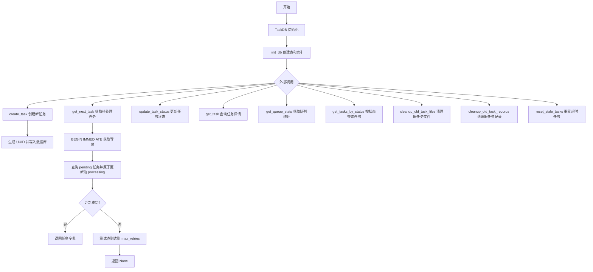

## 类结构

```
TaskDB (任务数据库管理类)
└── SQLite 数据库连接管理
    ├── 表: tasks
    ├── 索引: idx_status, idx_priority, idx_created_at, idx_worker_id
```

## 全局变量及字段


### `sqlite3`
    
Python标准库SQLite3数据库驱动模块

类型：`module`
    


### `json`
    
Python标准库JSON编解码模块

类型：`module`
    


### `uuid`
    
Python标准库UUID生成模块

类型：`module`
    


### `contextmanager`
    
装饰器，用于创建上下文管理器

类型：`function`
    


### `Optional`
    
类型提示，表示值可以是指定类型或None

类型：`type_hint`
    


### `List`
    
类型提示，表示列表类型

类型：`type_hint`
    


### `Dict`
    
类型提示，表示字典类型

类型：`type_hint`
    


### `Path`
    
 pathlib模块中的路径对象，用于路径操作

类型：`class`
    


### `TaskDB.db_path`
    
数据库文件路径

类型：`str`
    
    

## 全局函数及方法


### `TaskDB.__init__`

初始化 TaskDB 实例，设置数据库文件路径并初始化数据库表结构。

参数：

- `db_path`：`str`，数据库文件路径，默认为 `'mineru_tianshu.db'`

返回值：`None`，无返回值（构造函数）

#### 流程图

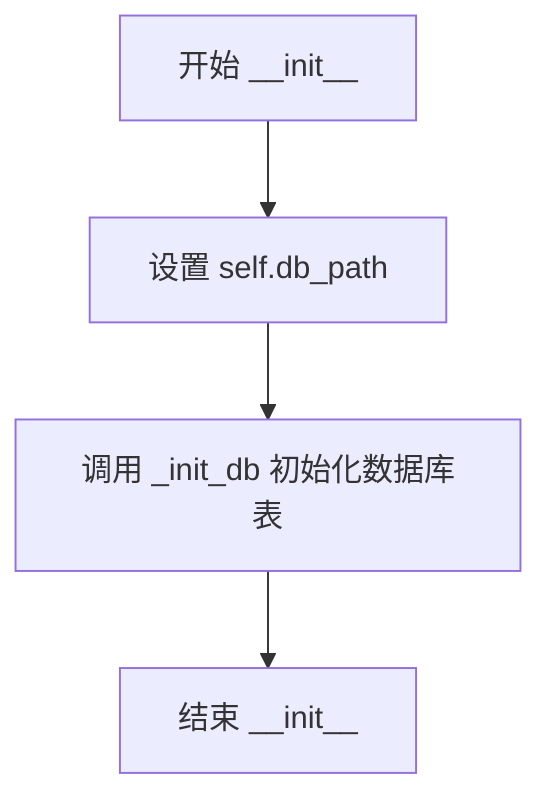

#### 带注释源码

```python
def __init__(self, db_path='mineru_tianshu.db'):
    """
    初始化 TaskDB 实例
    
    Args:
        db_path: 数据库文件路径，默认为 'mineru_tianshu.db'
    """
    # 1. 保存数据库文件路径到实例属性
    self.db_path = db_path
    
    # 2. 调用私有方法初始化数据库表结构
    #    该方法会创建 tasks 表及必要的索引
    self._init_db()
```


### `TaskDB._get_conn`

获取数据库连接，每次调用创建新连接以避免 pickle 序列化问题和跨线程共享连接的安全隐患。

参数：

- 无显式参数（隐式参数 `self`：类型 `TaskDB`，表示当前数据库管理器实例）

返回值：`sqlite3.Connection`，返回配置好的 SQLite 数据库连接对象，具有 Row 工厂以支持字典风格访问查询结果。

#### 流程图

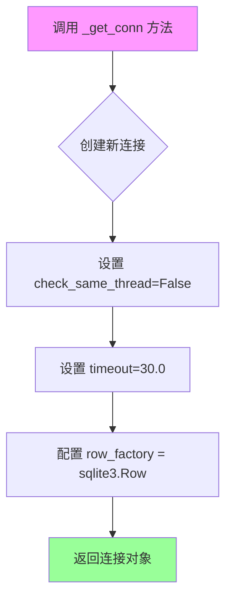

#### 带注释源码

```python
def _get_conn(self):
    """获取数据库连接（每次创建新连接，避免 pickle 问题）
    
    并发安全说明：
        - 使用 check_same_thread=False 是安全的，因为：
          1. 每次调用都创建新连接，不跨线程共享
          2. 连接使用完立即关闭（在 get_cursor 上下文管理器中）
          3. 不使用连接池，避免线程间共享同一连接
        - timeout=30.0 防止死锁，如果锁等待超过30秒会抛出异常
    """
    # 创建新连接，传入数据库文件路径
    conn = sqlite3.connect(
        self.db_path, 
        check_same_thread=False,  # 允许跨线程使用（因每次创建新连接，故安全）
        timeout=30.0               # 等待锁的超时时间（秒），防止无限死锁
    )
    # 设置行工厂为 sqlite3.Row，使查询结果可通过字典键访问（如 row['column_name']）
    conn.row_factory = sqlite3.Row
    # 返回配置好的连接对象
    return conn
```


### `TaskDB.get_cursor`

获取数据库游标的上下文管理器，自动处理事务提交和异常回滚，确保数据库操作的原子性和资源正确释放。

参数： 无（仅 `self`）

返回值：`sqlite3.Cursor`，数据库游标对象，供调用者执行 SQL 语句

#### 流程图

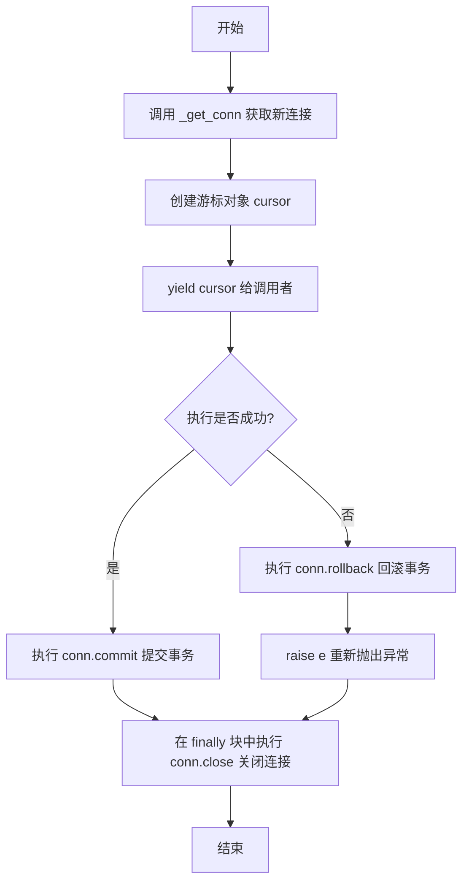

#### 带注释源码

```python
@contextmanager
def get_cursor(self):
    """上下文管理器，自动提交和错误处理"""
    # 步骤1：获取新的数据库连接（每次调用创建新连接，避免跨线程共享）
    conn = self._get_conn()
    # 步骤2：基于连接创建游标对象
    cursor = conn.cursor()
    try:
        # 步骤3：将游标yield给调用者，调用者可在with块内执行SQL
        yield cursor
        # 步骤4：若执行正常且未抛异常，则提交事务使修改持久化
        conn.commit()
    except Exception as e:
        # 步骤5：若执行过程中发生异常，则回滚事务撤销所有未提交的修改
        conn.rollback()
        # 步骤6：重新抛出异常，让调用者感知到错误
        raise e
    finally:
        # 步骤7：无论成功或失败，最终都会关闭连接释放资源
        conn.close()  # 关闭连接
```


### `TaskDB._init_db`

初始化 SQLite 数据库，创建 tasks 表和四个索引以加速查询。

参数：

- 无

返回值：`None`，无返回值

#### 流程图

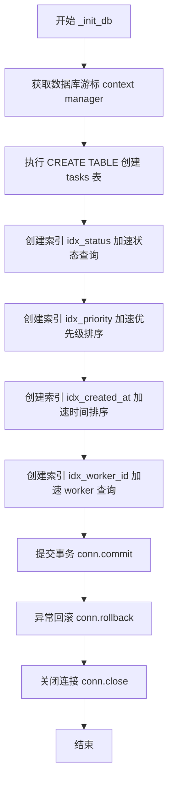

#### 带注释源码

```python
def _init_db(self):
    """初始化数据库表"""
    # 使用 get_cursor 上下文管理器获取游标，自动处理事务提交和连接关闭
    with self.get_cursor() as cursor:
        # 创建 tasks 表，如果不存在则创建
        # 表结构包含：
        # - task_id: 主键，任务唯一标识
        # - file_name: 文件名（必填）
        # - file_path: 文件路径
        # - status: 任务状态，默认 'pending'
        # - priority: 优先级，数字越大越优先
        # - backend: 处理后端，默认 'pipeline'
        # - options: 处理选项（JSON 格式）
        # - result_path: 结果文件路径
        # - error_message: 错误信息
        # - created_at: 创建时间戳
        # - started_at: 开始处理时间戳
        # - completed_at: 完成时间戳
        # - worker_id: 处理该任务的 Worker ID
        # - retry_count: 重试次数
        cursor.execute('''
            CREATE TABLE IF NOT EXISTS tasks (
                task_id TEXT PRIMARY KEY,
                file_name TEXT NOT NULL,
                file_path TEXT,
                status TEXT DEFAULT 'pending',
                priority INTEGER DEFAULT 0,
                backend TEXT DEFAULT 'pipeline',
                options TEXT,
                result_path TEXT,
                error_message TEXT,
                created_at TIMESTAMP DEFAULT CURRENT_TIMESTAMP,
                started_at TIMESTAMP,
                completed_at TIMESTAMP,
                worker_id TEXT,
                retry_count INTEGER DEFAULT 0
            )
        ''')
        
        # 创建索引加速查询
        # idx_status: 按状态查询任务（如查询所有 pending 任务）
        cursor.execute('CREATE INDEX IF NOT EXISTS idx_status ON tasks(status)')
        # idx_priority: 按优先级降序排序（配合 ORDER BY priority DESC）
        cursor.execute('CREATE INDEX IF NOT EXISTS idx_priority ON tasks(priority DESC)')
        # idx_created_at: 按创建时间排序和范围查询
        cursor.execute('CREATE INDEX IF NOT EXISTS idx_created_at ON tasks(created_at)')
        # idx_worker_id: 按 worker 查询任务（用于查看某个 worker 的任务）
        cursor.execute('CREATE INDEX IF NOT EXISTS idx_worker_id ON tasks(worker_id)')
```


### `TaskDB.create_task`

创建新任务并持久化到 SQLite 数据库，返回任务唯一标识符。

参数：

- `self`：`TaskDB`，TaskDB 实例本身
- `file_name`：`str`，文件名
- `file_path`：`str`，文件路径
- `backend`：`str`，处理后端，默认为 'pipeline'，可选值包括 pipeline/vlm-transformers/vlm-vllm-engine
- `options`：`dict`，处理选项字典，可选，默认为 None
- `priority`：`int`，优先级，数字越大越优先，默认为 0

返回值：`str`，新创建的任务唯一标识符（UUID 格式）

#### 流程图

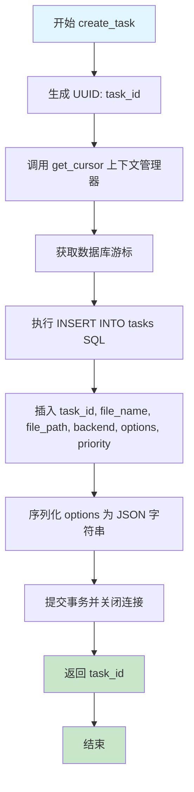

#### 带注释源码

```python
def create_task(self, file_name: str, file_path: str, 
               backend: str = 'pipeline', options: dict = None,
               priority: int = 0) -> str:
    """
    创建新任务
    
    Args:
        file_name: 文件名
        file_path: 文件路径
        backend: 处理后端 (pipeline/vlm-transformers/vlm-vllm-engine)
        options: 处理选项 (dict)
        priority: 优先级，数字越大越优先
        
    Returns:
        task_id: 任务ID
    """
    # 使用 UUID v4 生成全局唯一任务标识符
    task_id = str(uuid.uuid4())
    
    # 使用上下文管理器获取数据库游标，自动处理事务提交和连接关闭
    with self.get_cursor() as cursor:
        # 执行 INSERT 语句将任务数据插入数据库
        # 使用参数化查询 (?) 防止 SQL 注入攻击
        cursor.execute('''
            INSERT INTO tasks (task_id, file_name, file_path, backend, options, priority)
            VALUES (?, ?, ?, ?, ?, ?)
        ''', (task_id, file_name, file_path, backend, json.dumps(options or {}), priority))
    
    # 返回新创建的任务 ID 供调用方使用
    return task_id
```


### `TaskDB.get_next_task`

获取下一个待处理任务（原子操作），采用乐观锁机制防止多 Worker 并发冲突，通过重试机制确保高并发场景下的任务分发效率。

参数：

- `self`：隐式参数，TaskDB 实例本身
- `worker_id`：`str`，Worker 标识符，用于标记任务被哪个 Worker 抢占
- `max_retries`：`int`，当任务被其他 Worker 抢走时的最大重试次数，默认值为 3

返回值：`Optional[Dict]`，返回任务字典（包含任务完整信息），若队列为空或重试次数用尽则返回 `None`

#### 流程图

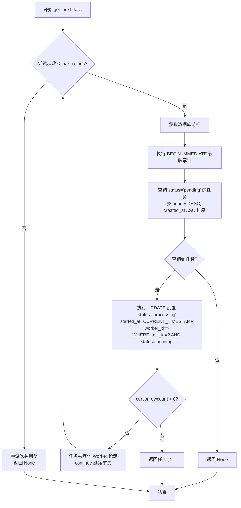

#### 带注释源码

```python
def get_next_task(self, worker_id: str, max_retries: int = 3) -> Optional[Dict]:
    """
    获取下一个待处理任务（原子操作，防止并发冲突）
    
    Args:
        worker_id: Worker ID
        max_retries: 当任务被其他 worker 抢走时的最大重试次数（默认3次）
        
    Returns:
        task: 任务字典，如果没有任务返回 None
        
    并发安全说明：
        1. 使用 BEGIN IMMEDIATE 立即获取写锁
        2. UPDATE 时检查 status = 'pending' 防止重复拉取
        3. 检查 rowcount 确保更新成功
        4. 如果任务被抢走，立即重试而不是返回 None（避免不必要的等待）
    """
    # 最多尝试 max_retries 次，防止高并发下任务被抢导致长时间等待
    for attempt in range(max_retries):
        # 使用上下文管理器获取游标，内部自动提交或回滚
        with self.get_cursor() as cursor:
            # BEGIN IMMEDIATE：立即获取写锁，避免与其他写事务死锁
            # 相比 BEGIN EXCLUSIVE 更温和，避免长时间阻塞读操作
            cursor.execute('BEGIN IMMEDIATE')
            
            # 按优先级（降序）和创建时间（升序）获取最高优先级的待处理任务
            # priority DESC: 数字越大越优先
            # created_at ASC: 同优先级下，先创建的任务先执行
            cursor.execute('''
                SELECT * FROM tasks 
                WHERE status = 'pending' 
                ORDER BY priority DESC, created_at ASC 
                LIMIT 1
            ''')
            
            # 获取查询结果（可能为 None）
            task = cursor.fetchone()
            
            if task:
                # 找到待处理任务，尝试将其状态更新为 processing
                # 使用原子操作：只有当 status 仍为 'pending' 时才更新
                # 这防止了多个 Worker 同时抢到同一任务
                cursor.execute('''
                    UPDATE tasks 
                    SET status = 'processing', 
                        started_at = CURRENT_TIMESTAMP, 
                        worker_id = ?
                    WHERE task_id = ? AND status = 'pending'
                ''', (worker_id, task['task_id']))
                
                # 检查是否更新成功（rowcount 表示受影响的行数）
                if cursor.rowcount == 0:
                    # 更新失败说明任务被其他 Worker 抢走了（status 已经不是 'pending'）
                    # 立即重试获取下一个任务，而不是返回 None 造成等待
                    continue
                
                # 更新成功，返回任务信息（转换为字典）
                return dict(task)
            else:
                # 队列中没有待处理任务，直接返回 None
                return None
    
    # 重试次数用尽（max_retries=3），仍未获取到任务
    # 常见于极高并发场景：多个 Worker 同时竞争少数任务
    return None
```


### `TaskDB._build_update_clauses`

构建 UPDATE 和 WHERE 子句的辅助方法，用于动态生成 SQL 更新语句的条件和参数，支持 task_id、worker_id 条件，以及 completed/failed 状态的特殊处理。

参数：

- `self`：TaskDB 实例的隐式引用
- `status`：`str`，新状态（pending/processing/completed/failed/cancelled）
- `result_path`：`str | None`，结果路径（可选），仅在 completed 状态时使用
- `error_message`：`str | None`，错误信息（可选），仅在 failed 状态时使用
- `worker_id`：`str | None`，Worker ID（可选），用于并发安全检查
- `task_id`：`str | None`，任务ID（可选），用于定位特定任务

返回值：`tuple[List[str], List[Any], List[str], List[Any]]`，返回四个元素的元组：
- update_clauses：UPDATE 语句的 SET 部分列表
- update_params：UPDATE 参数列表
- where_clauses：WHERE 条件子句列表
- where_params：WHERE 参数列表

#### 流程图

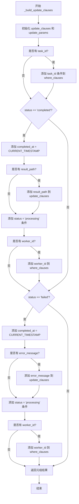

#### 带注释源码

```python
def _build_update_clauses(self, status: str, result_path: str = None, 
                         error_message: str = None, worker_id: str = None, 
                         task_id: str = None):
    """
    构建 UPDATE 和 WHERE 子句的辅助方法
    
    Args:
        status: 新状态
        result_path: 结果路径（可选）
        error_message: 错误信息（可选）
        worker_id: Worker ID（可选）
        task_id: 任务ID（可选）
        
    Returns:
        tuple: (update_clauses, update_params, where_clauses, where_params)
    """
    # 初始化 UPDATE 子句列表和参数列表，status 是必填字段
    update_clauses = ['status = ?']
    update_params = [status]
    where_clauses = []
    where_params = []
    
    # 添加 task_id 条件（如果提供）
    # 用于精确定位要更新的任务
    if task_id:
        where_clauses.append('task_id = ?')
        where_params.append(task_id)
    
    # 处理 completed 状态
    # 完成任务时需要记录完成时间，并可选地保存结果路径
    if status == 'completed':
        # 记录完成时间戳
        update_clauses.append('completed_at = CURRENT_TIMESTAMP')
        # 如果提供了结果路径，将其加入更新字段
        if result_path:
            update_clauses.append('result_path = ?')
            update_params.append(result_path)
        # 只更新正在处理的任务，防止状态机错乱
        where_clauses.append("status = 'processing'")
        # 如果提供了 worker_id，检查任务是否属于该 worker（并发安全）
        if worker_id:
            where_clauses.append('worker_id = ?')
            where_params.append(worker_id)
    
    # 处理 failed 状态
    # 任务失败时需要记录完成时间和错误信息
    elif status == 'failed':
        # 记录完成时间戳
        update_clauses.append('completed_at = CURRENT_TIMESTAMP')
        # 如果提供了错误信息，将其加入更新字段
        if error_message:
            update_clauses.append('error_message = ?')
            update_params.append(error_message)
        # 只更新正在处理的任务，防止状态机错乱
        where_clauses.append("status = 'processing'")
        # 如果提供了 worker_id，检查任务是否属于该 worker（并发安全）
        if worker_id:
            where_clauses.append('worker_id = ?')
            where_params.append(worker_id)
    
    # 返回四个元素：UPDATE子句、UPDATE参数、WHERE子句、WHERE参数
    return update_clauses, update_params, where_clauses, where_params
```


### `TaskDB.update_task_status`

更新任务状态，支持原子性操作和并发安全检查

参数：

-  `task_id`：`str`，任务ID
-  `status`：`str`，新状态 (pending/processing/completed/failed/cancelled)
-  `result_path`：`str`，结果路径（可选）
-  `error_message`：`str`，错误信息（可选）
-  `worker_id`：`str`，Worker ID（可选，用于并发检查）

返回值：`bool`，更新是否成功

#### 流程图

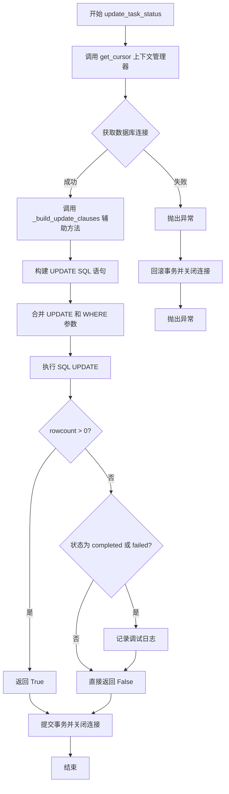

#### 带注释源码

```python
def update_task_status(self, task_id: str, status: str, 
                      result_path: str = None, error_message: str = None,
                      worker_id: str = None):
    """
    更新任务状态
    
    Args:
        task_id: 任务ID
        status: 新状态 (pending/processing/completed/failed/cancelled)
        result_path: 结果路径（可选）
        error_message: 错误信息（可选）
        worker_id: Worker ID（可选，用于并发检查）
        
    Returns:
        bool: 更新是否成功
        
    并发安全说明：
        1. 更新为 completed/failed 时会检查状态是 processing
        2. 如果提供 worker_id，会检查任务是否属于该 worker
        3. 返回 False 表示任务被其他进程修改了
    """
    # 使用上下文管理器获取数据库游标，自动处理事务提交和连接关闭
    with self.get_cursor() as cursor:
        # 使用辅助方法构建 UPDATE 和 WHERE 子句
        # 根据 status 类型自动处理不同的字段更新逻辑
        update_clauses, update_params, where_clauses, where_params = \
            self._build_update_clauses(status, result_path, error_message, worker_id, task_id)
        
        # 合并参数：先 UPDATE 部分，再 WHERE 部分
        all_params = update_params + where_params
        
        # 动态构建 UPDATE SQL 语句
        sql = f'''
            UPDATE tasks 
            SET {', '.join(update_clauses)}
            WHERE {' AND '.join(where_clauses)}
        '''
        
        # 执行更新操作
        cursor.execute(sql, all_params)
        
        # 检查更新是否成功（rowcount 表示受影响的行数）
        success = cursor.rowcount > 0
        
        # 调试日志（仅在失败时记录，帮助排查并发冲突问题）
        if not success and status in ['completed', 'failed']:
            from loguru import logger
            logger.debug(
                f"Status update failed: task_id={task_id}, status={status}, "
                f"worker_id={worker_id}, SQL: {sql}, params: {all_params}"
            )
        
        # 返回更新结果：True 表示成功，False 表示任务被其他进程修改或不存在
        return success
```


### `TaskDB.get_task`

查询任务详情，根据任务ID从数据库中获取完整的任务信息。

参数：

-  `task_id`：`str`，任务ID，用于唯一标识需要查询的任务

返回值：`Optional[Dict]`，返回任务字典，如果任务不存在则返回 None

#### 流程图

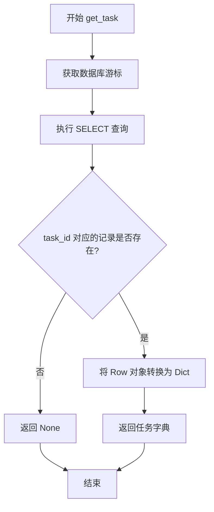

#### 带注释源码

```python
def get_task(self, task_id: str) -> Optional[Dict]:
    """
    查询任务详情
    
    Args:
        task_id: 任务ID
        
    Returns:
        task: 任务字典，如果不存在返回 None
    """
    # 使用上下文管理器获取游标，确保自动提交和异常处理
    with self.get_cursor() as cursor:
        # 执行 SQL 查询，根据 task_id 精确查询任务记录
        cursor.execute('SELECT * FROM tasks WHERE task_id = ?', (task_id,))
        
        # 获取查询结果（单条记录）
        task = cursor.fetchone()
        
        # 如果记录存在，将 Row 对象转换为字典返回；否则返回 None
        return dict(task) if task else None
```


### `TaskDB.get_queue_stats`

获取队列中各状态的任务数量统计信息，通过 SQL 的 GROUP BY 和 COUNT 聚合函数实现对任务表中不同状态（pending/processing/completed/failed/cancelled）任务数量的统计。

参数： 无

返回值：`Dict[str, int]`，返回字典，键为任务状态（字符串），值为对应状态的任务数量（整数）。例如：`{'pending': 5, 'processing': 2, 'completed': 100, 'failed': 3}`

#### 流程图

```mermaid
flowchart TD
    A[开始] --> B[获取数据库游标<br>get_cursor 上下文管理器]
    B --> C[执行 SQL 查询<br>SELECT status, COUNT<br>GROUP BY status]
    C --> D[获取所有查询结果<br>fetchall]
    D --> E{遍历每一行}
    E -->|是| F[提取 status 和 count]
    F --> G[构建统计字典<br>dict[status] = count]
    G --> E
    E -->|否| H[返回统计字典]
    H --> I[结束]
    
    style A fill:#e1f5fe
    style H fill:#c8e6c9
    style I fill:#c8e6c9
```

#### 带注释源码

```python
def get_queue_stats(self) -> Dict[str, int]:
    """
    获取队列统计信息
    
    Returns:
        stats: 各状态的任务数量
    """
    # 使用上下文管理器获取游标，自动管理连接生命周期
    # 上下文管理器会确保：正常执行时commit，异常时rollback，最后关闭连接
    with self.get_cursor() as cursor:
        # 执行 SQL 统计查询
        # 使用 GROUP BY status 按任务状态分组
        # COUNT(*) 统计每个分组的任务数量
        cursor.execute('''
            SELECT status, COUNT(*) as count 
            FROM tasks 
            GROUP BY status
        ''')
        
        # 遍历查询结果，使用字典推导式构建统计字典
        # row['status'] 是任务状态字符串（如 'pending', 'completed' 等）
        # row['count'] 是该状态的任务数量整数
        stats = {row['status']: row['count'] for row in cursor.fetchall()}
        
        # 返回统计结果字典
        # 如果没有任何任务，返回空字典 {}
        return stats
```


### `TaskDB.get_tasks_by_status`

根据指定状态查询任务列表，返回符合条件的任务记录

参数：

- `self`：`TaskDB`，TaskDB实例本身
- `status`：`str`，任务状态，用于过滤任务（如 pending、processing、completed、failed 等）
- `limit`：`int`，返回数量限制，默认为 100

返回值：`List[Dict]`，任务列表，每个元素为任务字典，包含任务的完整字段信息

#### 流程图

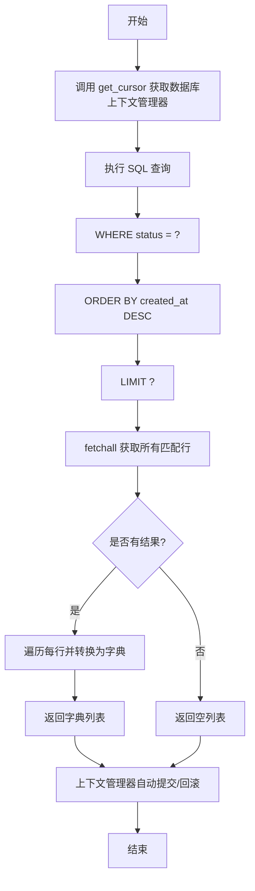

#### 带注释源码

```python
def get_tasks_by_status(self, status: str, limit: int = 100) -> List[Dict]:
    """
    根据状态获取任务列表
    
    Args:
        status: 任务状态
        limit: 返回数量限制
        
    Returns:
        tasks: 任务列表
    """
    # 使用上下文管理器获取数据库游标，确保自动提交和错误处理
    with self.get_cursor() as cursor:
        # 执行 SQL 查询，按状态过滤并按创建时间降序排序
        cursor.execute('''
            SELECT * FROM tasks 
            WHERE status = ? 
            ORDER BY created_at DESC 
            LIMIT ?
        ''', (status, limit))
        
        # 将查询结果（Row 对象）转换为字典列表并返回
        # fetchall() 返回所有匹配的记录，每条记录转为 dict 格式
        return [dict(row) for row in cursor.fetchall()]
```


### `TaskDB.cleanup_old_task_files`

清理指定天数前的已完成或失败任务的结果文件目录，同时清空数据库中的 result_path 字段，但保留任务记录以便用户查询历史状态。

参数：

- `days`：`int`，清理多少天前的任务文件，默认为 7 天

返回值：`int`，实际删除的文件目录数量

#### 流程图

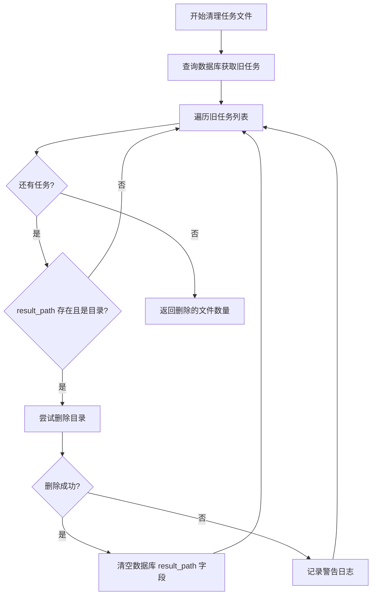

#### 带注释源码

```python
def cleanup_old_task_files(self, days: int = 7):
    """
    清理旧任务的结果文件（保留数据库记录）
    
    Args:
        days: 清理多少天前的任务文件
        
    Returns:
        int: 删除的文件目录数
        
    注意：
        - 只删除结果文件，保留数据库记录
        - 数据库中的 result_path 字段会被清空
        - 用户仍可查询任务状态和历史记录
    """
    from pathlib import Path
    import shutil
    
    # 使用上下文管理器获取数据库光标，自动处理事务提交和异常回滚
    with self.get_cursor() as cursor:
        # 查询符合清理条件的任务：已完成或失败状态、超过指定天数、有结果路径
        cursor.execute('''
            SELECT task_id, result_path FROM tasks 
            WHERE completed_at < datetime('now', '-' || ? || ' days')
            AND status IN ('completed', 'failed')
            AND result_path IS NOT NULL
        ''', (days,))
        
        # 获取所有待清理的任务记录
        old_tasks = cursor.fetchall()
        file_count = 0
        
        # 遍历每个旧任务，删除其结果文件
        for task in old_tasks:
            if task['result_path']:
                result_path = Path(task['result_path'])
                # 检查路径存在且为目录
                if result_path.exists() and result_path.is_dir():
                    try:
                        # 使用 shutil.rmtree 递归删除目录及其所有内容
                        shutil.rmtree(result_path)
                        file_count += 1
                        
                        # 清空数据库中的 result_path，表示文件已被清理
                        # 保留任务记录，用户仍可查询任务状态和历史
                        cursor.execute('''
                            UPDATE tasks 
                            SET result_path = NULL
                            WHERE task_id = ?
                        ''', (task['task_id'],))
                        
                    except Exception as e:
                        # 记录删除失败的任务 ID 和错误信息，但继续处理其他任务
                        from loguru import logger
                        logger.warning(f"Failed to delete result files for task {task['task_id']}: {e}")
        
        # 返回实际删除的文件目录数量
        return file_count
```


### `TaskDB.cleanup_old_task_records`

清理极旧的任务记录（可选功能），永久删除数据库中已完成或失败且超过指定天数的任务记录。

参数：

- `days`：`int`，删除多少天前的任务记录，默认值为 30 天

返回值：`int`，删除的记录数

#### 流程图

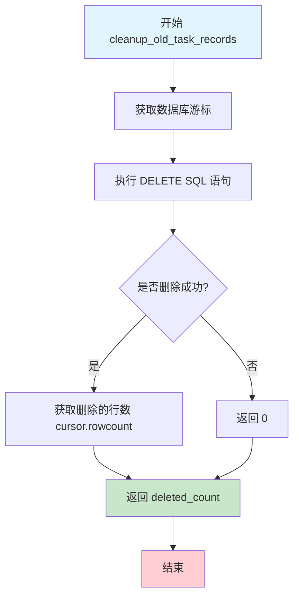

#### 带注释源码

```python
def cleanup_old_task_records(self, days: int = 30):
    """
    清理极旧的任务记录（可选功能）
    
    Args:
        days: 删除多少天前的任务记录
        
    Returns:
        int: 删除的记录数
        
    注意：
        - 这个方法会永久删除数据库记录
        - 建议设置较长的保留期（如30-90天）
        - 一般情况下不需要调用此方法
    """
    # 使用上下文管理器获取数据库游标，自动处理事务提交和连接关闭
    with self.get_cursor() as cursor:
        # 执行删除 SQL，清理已完成/失败且超过指定天数的任务记录
        # datetime('now', '-' || ? || ' days') 计算相对于当前时间的日期
        cursor.execute('''
            DELETE FROM tasks 
            WHERE completed_at < datetime('now', '-' || ? || ' days')
            AND status IN ('completed', 'failed')
        ''', (days,))
        
        # 获取删除的记录数（受影响的行数）
        deleted_count = cursor.rowcount
        # 返回删除的记录数
        return deleted_count
```


### `TaskDB.reset_stale_tasks`

重置超时的 processing 任务为 pending 状态，并将重试计数加1，用于处理 worker 崩溃或超时未完成的任务，使其可以被其他 worker 重新拾取。

参数：

- `self`：`TaskDB`，隐式参数，类实例本身
- `timeout_minutes`：`int`，超时时间（分钟），默认值为 60，超过此时间未完成的任务将被重置

返回值：`int`，被重置的任务数量

#### 流程图

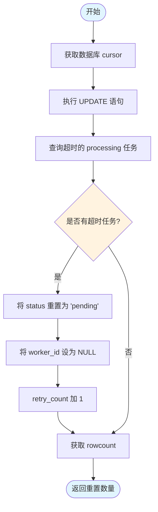

#### 带注释源码

```python
def reset_stale_tasks(self, timeout_minutes: int = 60):
    """
    重置超时的 processing 任务为 pending
    
    Args:
        timeout_minutes: 超时时间（分钟）
        
    Returns:
        int: 被重置的任务数量
        
    使用场景:
        - Worker 崩溃或异常退出时，其认领的任务会卡在 processing 状态
        - 定时调用此方法可将超时任务重置为 pending，供其他 worker 重新拾取
        - 每次重置会累加 retry_count，便于追踪任务失败次数
    """
    # 使用上下文管理器获取 cursor，自动处理事务提交和连接关闭
    with self.get_cursor() as cursor:
        # 执行 UPDATE 语句：重置超时任务
        # 条件：status = 'processing' 且 started_at 早于 timeout_minutes 分钟
        cursor.execute('''
            UPDATE tasks 
            SET status = 'pending',           -- 重置状态为 pending
                worker_id = NULL,             -- 清除 worker 标识，允许其他 worker 拾取
                retry_count = retry_count + 1 -- 累加重试计数
            WHERE status = 'processing' 
            AND started_at < datetime('now', '-' || ? || ' minutes')
        ''', (timeout_minutes,))
        
        # cursor.rowcount 返回受影响的行数，即被重置的任务数量
        reset_count = cursor.rowcount
        
        # 返回重置的任务数量，供调用方记录日志或统计
        return reset_count
```

## 关键组件


### 任务持久化存储

使用SQLite数据库存储任务信息，包括任务ID、文件名、文件路径、状态、优先级、后端类型、处理选项、结果路径、错误信息、时间戳、工作节点ID和重试次数等字段，确保任务数据在系统重启后不丢失。

### 状态管理与原子性操作

通过`get_next_task()`方法实现任务的原子性获取和状态转换，使用`BEGIN IMMEDIATE`事务和`UPDATE ... WHERE status = 'pending'`条件确保并发场景下同一任务只被一个worker获取，避免任务重复处理。

### 并发安全控制

采用每次调用创建新SQLite连接的策略（`check_same_thread=False` + timeout=30.0），结合事务回滚和重试机制（`max_retries`参数），在`update_task_status()`中通过状态检查和worker_id验证防止并发冲突。

### 上下文管理器自动资源管理

`get_cursor()`方法作为上下文管理器，自动处理数据库连接的获取、事务提交、异常回滚和连接关闭，简化调用代码并确保资源正确释放。

### 任务队列优先级调度

在`get_next_task()`中通过`ORDER BY priority DESC, created_at ASC`实现按优先级（数字越大越优先）和创建时间排序的任务获取策略，支持多worker并发消费。

### 动态UPDATE子句构建

`_build_update_clauses()`辅助方法根据不同状态（completed/failed）动态构建SQL UPDATE语句的参数，封装状态转换逻辑并支持可选字段（result_path、error_message、worker_id）的条件更新。

### 索引优化

在`_init_db()`中创建了status、priority、created_at和worker_id四个索引，加速常见查询场景（按状态筛选、按优先级排序、按时间清理、按worker查询）。

### 过期任务重置

`reset_stale_tasks()`方法定期将超时的processing状态任务重置为pending状态并增加retry_count，支持故障恢复和任务超时处理。

### 历史数据清理

提供两个清理方法：`cleanup_old_task_files()`删除旧任务的结果文件目录但保留数据库记录，`cleanup_old_task_records()`永久删除超时的任务记录，平衡存储空间和数据保留需求。

### 工作节点任务认领

通过在任务表中记录worker_id，每个任务只能由创建它的worker更新为completed/failed状态，防止其他worker误操作他worker认领的任务。


## 问题及建议


### 已知问题

-   **事务嵌套问题**：`get_next_task` 方法中手动执行 `BEGIN IMMEDIATE` 获取写锁，但在 `get_cursor` 上下文管理器中已经包含了事务管理（commit/rollback），导致事务嵌套或双重提交的问题，可能引发 SQLITE 错误。
-   **SQL 动态拼接风险**：`update_task_status` 方法中 `_build_update_clauses` 使用字符串拼接构建列名列表（`{', '.join(update_clauses)}`），虽然当前场景下列名可控，但如果未来扩展时参数校验不足，存在注入风险。
-   **并发重试逻辑缺陷**：`get_next_task` 方法中的重试循环在任务被抢走时使用 `continue`，但在 `with self.get_cursor()` 上下文内使用 `continue` 会提前退出上下文，可能导致资源未正确释放。
-   **数据不一致风险**：`cleanup_old_task_files` 方法中先删除文件再更新数据库记录，如果数据库更新失败，会造成文件已删除但数据库仍记录 result_path 的不一致状态。
-   **WHERE 条件缺失风险**：当 `_build_update_clauses` 未传入 `task_id` 且状态不是 completed/failed 时，where_clauses 为空，导致 `UPDATE tasks SET status = ?` 无条件更新，可能修改所有任务记录。
-   **日志依赖不一致**：代码中导入了 `loguru` 但仅在部分方法中使用，且 `logger.debug` 在默认配置下不会输出，导致调试信息不可见。
-   **资源效率问题**：每次数据库操作都创建新连接（`_get_conn`），未使用连接池，高并发场景下性能开销较大。

### 优化建议

-   **重构事务管理**：移除 `get_cursor` 上下文管理器中的自动事务，或在 `get_next_task` 中直接使用底层连接而非上下文管理器，避免事务嵌套。
-   **修复重试循环**：将 `get_next_task` 中的重试逻辑改为 while 循环并在上下文外部管理，或使用独立的连接执行原子操作。
-   **添加条件校验**：在 `_build_update_clauses` 中当 where_clauses 为空时抛出异常或返回失败，防止全表更新。
-   **使用连接池**：引入 `sqlite3.ConnectionPool` 或 `queue.Queue` 管理连接，提升并发性能。
-   **统一日志策略**：使用统一的日志级别（如 INFO/WARNING），或确保 loguru 配置为可见调试信息。
-   **增强错误处理**：在文件删除和数据库更新之间使用事务，或记录删除失败的文件路径以便重试。
-   **添加重试装饰器**：对 `update_task_status` 等关键方法添加重试机制，应对临时锁等待。

## 其它


### 设计目标与约束

本模块的核心设计目标是提供一个轻量级、可靠的任务持久化管理系统，支持多Worker并发访问、任务状态追踪和原子性操作。主要约束包括：1) 使用SQLite作为存储引擎，适合中小规模任务队列场景（建议万级任务量）；2) 单文件数据库设计，便于部署和迁移；3) 不支持分布式事务，仅适用于单机多进程或单进程多线程场景；4) 依赖Python标准库和loguru（可选），最小化外部依赖。

### 错误处理与异常设计

代码采用上下文管理器实现自动提交和回滚：get_cursor方法捕获异常后执行rollback并重新抛出，确保事务原子性。数据库连接失败时SQLite会抛出sqlite3.DatabaseError，调用方需处理。update_task_status返回布尔值表示更新是否成功，调用方可根据返回值判断任务是否被其他进程抢走。cleanup_old_task_files和cleanup_old_task_records可能抛出文件系统异常，内部捕获后记录warning日志继续处理。超时机制通过SQLite的timeout参数实现，默认30秒超时。

### 数据流与状态机

任务生命周期状态转换如下：pending（创建）→ processing（被Worker获取）→ completed/failed（处理完成）或 cancelled（取消）。reset_stale_tasks支持将超时的processing状态重置为pending，实现故障恢复。状态转换的并发安全通过WHERE条件检查实现：更新为completed/failed时必须status='processing'，更新为processing时必须status='pending'。

### 外部依赖与接口契约

核心依赖：1) sqlite3（Python标准库）；2) json（Python标准库）；3) uuid（Python标准库）；4) pathlib.Path（Python标准库）；5) contextlib.contextmanager（Python标准库）；6) typing（Python标准库）；7) loguru（可选，用于调试日志）。外部接口包括TaskDB类公开方法：create_task、get_next_task、update_task_status、get_task、get_queue_stats、get_tasks_by_status、cleanup_old_task_files、cleanup_old_task_records、reset_stale_tasks。所有方法均为同步阻塞调用，不支持异步。

### 性能考量与优化建议

已实现的优化：1) 每次调用创建新连接避免pickle问题；2) 使用索引加速status/priority/created_at/worker_id查询；3) get_next_task使用BEGIN IMMEDIATE获取写锁减少竞争；4) 批量查询使用LIMIT限制结果集大小。建议优化：1) 当前使用单文件SQLite，高并发写入时考虑连接池（但需解决pickle问题）；2) cleanup_old_task_files逐条删除文件，可考虑批量删除；3) get_tasks_by_status默认limit=100，大数据集场景考虑分页；4) 可添加查询缓存减少频繁SQL执行。

### 事务与锁机制

代码使用SQLite事务确保原子性：get_cursor上下文管理器默认开启事务，异常时rollback。get_next_task方法显式使用BEGIN IMMEDIATE立即获取写锁，防止多Worker同时抢任务。UPDATE操作使用WHERE条件实现乐观锁：检查status='pending'或status='processing'确保只更新符合条件的目标行。SQLite默认使用DEFERRED事务模式，BEGIN IMMEDIATE在语句开始时获取RESERVED锁，commit时获取EXCLUSIVE锁。

### 安全性考虑

当前实现未做SQL注入防护，但代码使用参数化查询（?占位符）避免SQL注入风险。建议：1) 验证db_path防止路径遍历攻击；2) file_path和result_path建议做路径规范化检查；3) worker_id和task_id建议添加格式验证（UUID格式）；4) options参数接受dict但直接json.dumps存储，需信任调用方输入；5) 如果在多租户场景使用，需添加tenant_id隔离。

### 数据库Schema详细设计

tasks表包含13个字段：task_id（TEXT PRIMARY KEY，UUID格式）、file_name（TEXT NOT NULL）、file_path（TEXT）、status（TEXT DEFAULT 'pending'，枚举值：pending/processing/completed/failed/cancelled）、priority（INTEGER DEFAULT 0）、backend（TEXT DEFAULT 'pipeline'）、options（TEXT，JSON格式存储）、result_path（TEXT）、error_message（TEXT）、created_at（TIMESTAMP）、started_at（TIMESTAMP）、completed_at（TIMESTAMP）、worker_id（TEXT）、retry_count（INTEGER DEFAULT 0）。索引包括：idx_status（status字段）、idx_priority（priority DESC）、idx_created_at（created_at）、idx_worker_id（worker_id）。

### 测试策略建议

建议补充单元测试覆盖：1) 任务创建和查询；2) 状态转换并发安全（多线程抢任务）；3) 事务回滚场景；4) 超时任务重置；5) 旧任务清理；6) 边界条件（空数据库、无可用任务、重复task_id）。当前__main__仅包含基本功能演示，无自动化测试。

### 配置管理

db_path支持构造函数注入，默认值'mineru_tianshu.db'。其他配置硬编码：SQLite timeout=30.0、max_retries=3、默认limit=100。建议抽取为配置文件或环境变量：1) 数据库路径；2) 超时时间；3) 重试次数；4) 清理保留天数；5) 日志级别。

### 监控与日志

当前仅在update_task_status失败时使用loguru记录debug级别日志。缺乏指标采集，建议添加：1) 任务处理耗时统计；2) 各状态任务数量（已有get_queue_stats）；3) 并发冲突次数；4) 清理操作结果。推荐接入Prometheus或自定义metrics收集器。

    