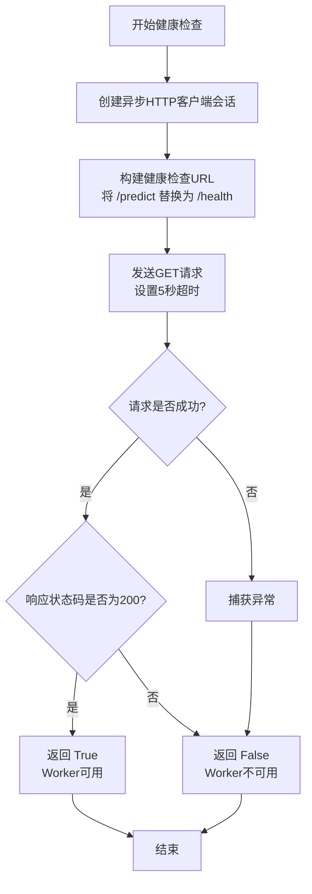
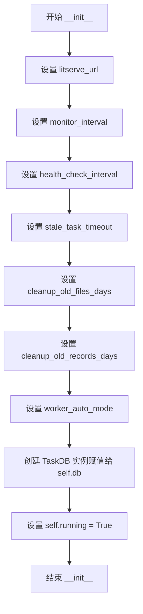
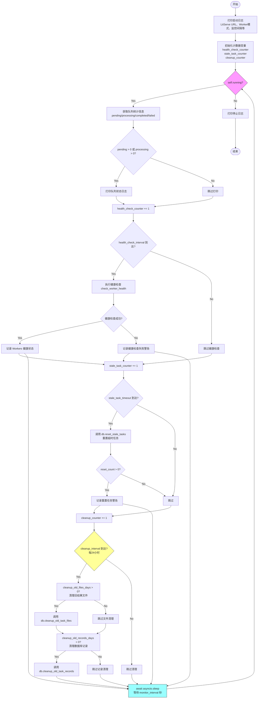
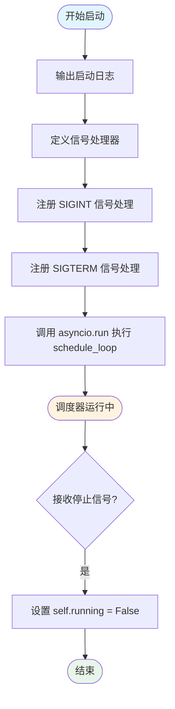
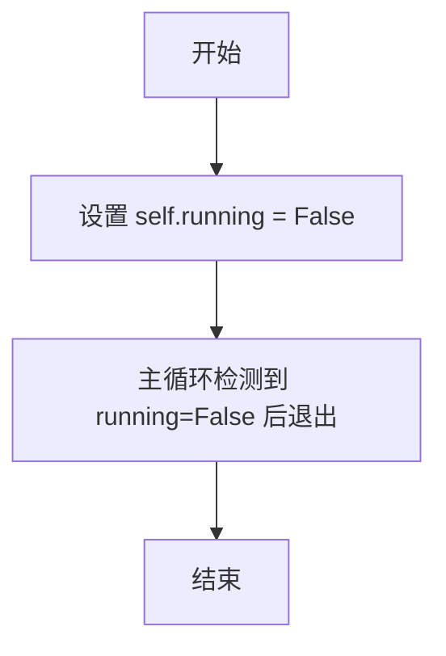

# `MinerU\projects\mineru_tianshu\task_scheduler.py` 详细设计文档

MinerU天枢任务调度器是一个可选的辅助组件，在Worker自动循环模式下负责周期性监控SQLite任务队列状态、执行Worker健康检查、进行故障恢复（重置超时任务）、收集统计信息以及定期清理过期的任务文件和数据库记录，以保持系统的稳定性和资源管理。

## 整体流程

```mermaid
graph TD
A[启动调度器] --> B[设置信号处理]
B --> C[进入schedule_loop主循环]
C --> D{self.running?}
D -- 否 --> E[退出循环，停止调度器]
D -- 是 --> F[获取队列统计信息]
F --> G[记录pending/processing/completed/failed数量]
G --> H[健康检查计数器+1]
H --> I{健康检查周期到?}
I -- 是 --> J[调用check_worker_health]
I -- 否 --> K[超时任务重置计数器+1]
J --> K
K --> L{超时重置周期到?}
L -- 是 --> M[调用db.reset_stale_tasks重置超时任务]
L -- 否 --> N[清理计数器+1]
M --> N
N --> O{清理周期到? (24小时)}
O -- 是 --> P[清理旧结果文件]
O -- 否 --> Q[等待monitor_interval秒]
P --> Q
Q --> C
```

## 类结构

```
TaskScheduler (任务调度器)
└── 依赖: TaskDB (数据库操作类，由task_db模块导入)
```

## 全局变量及字段


### `health_check`
    
异步健康检查函数，用于验证LitServe Worker是否可用

类型：`async function`
    


### `TaskScheduler.litserve_url`
    
LitServe Worker的URL地址

类型：`str`
    


### `TaskScheduler.monitor_interval`
    
监控间隔（秒，默认300秒）

类型：`int`
    


### `TaskScheduler.health_check_interval`
    
健康检查间隔（秒，默认900秒）

类型：`int`
    


### `TaskScheduler.stale_task_timeout`
    
超时任务重置时间（分钟，默认60）

类型：`int`
    


### `TaskScheduler.cleanup_old_files_days`
    
清理多少天前的结果文件（默认7天，0=禁用）

类型：`int`
    


### `TaskScheduler.cleanup_old_records_days`
    
清理多少天前的数据库记录（默认0，不推荐删除）

类型：`int`
    


### `TaskScheduler.worker_auto_mode`
    
Worker是否启用自动循环模式

类型：`bool`
    


### `TaskScheduler.db`
    
数据库操作实例

类型：`TaskDB`
    


### `TaskScheduler.running`
    
调度器运行状态标志

类型：`bool`
    
    

## 全局函数及方法


### `health_check`

独立健康检查函数，验证 LitServe Worker 是否可用，通过发送 HTTP GET 请求到健康检查端点来判断服务状态。

参数：

- `litserve_url`：`str`，LitServe Worker 的 URL（通常指向 `/predict` 端点）

返回值：`bool`，Worker 是否可用（返回 True 表示服务健康可用）

#### 流程图



#### 带注释源码

```python
async def health_check(litserve_url: str) -> bool:
    """
    健康检查：验证 LitServe Worker 是否可用
    
    该函数是一个独立的全局异步函数，用于在调度器启动前
    验证 LitServe Worker 是否已经就绪。
    
    Args:
        litserve_url: LitServe Worker 的 URL，通常指向 /predict 端点
        
    Returns:
        bool: Worker 是否可用（True 表示健康可用）
    """
    try:
        # 创建异步 HTTP 客户端会话，用于发送请求
        async with aiohttp.ClientSession() as session:
            # 将 URL 从 /predict 端点替换为 /health 端点
            # 例如: http://localhost:9000/predict -> http://localhost:9000/health
            health_url = litserve_url.replace('/predict', '/health')
            
            # 发送 GET 请求到健康检查端点，设置5秒超时
            async with session.get(
                health_url,
                timeout=aiohttp.ClientTimeout(total=5)
            ) as resp:
                # 判断 HTTP 状态码是否为 200
                return resp.status == 200
    except:
        # 捕获所有异常（超时、网络错误等），返回 False 表示不可用
        return False
```

#### 使用场景

该函数在 `if __name__ == '__main__'` 块中被调用，用于 `--wait-for-workers` 参数的场景：

```python
# 等待 workers 就绪（可选）
if args.wait_for_workers:
    logger.info("⏳ Waiting for LitServe workers to be ready...")
    import time
    max_retries = 30
    for i in range(max_retries):
        if asyncio.run(health_check(args.litserve_url)):
            logger.info("✅ LitServe workers are ready!")
            break
        time.sleep(2)
        if i == max_retries - 1:
            logger.error("❌ LitServe workers not responding, starting anyway...")
```

#### 设计特点

1. **独立函数**：不依赖类实例，可直接调用
2. **容错设计**：使用 try-except 捕获所有异常，确保不会因为网络问题导致程序崩溃
3. **超时保护**：设置 5 秒超时，避免长时间阻塞
4. **URL 自动转换**：通过字符串替换自动生成健康检查 URL，无需用户额外配置


### `TaskScheduler.__init__`

初始化调度器参数，设置监控间隔、健康检查间隔、任务超时时间、文件清理策略等关键配置，并创建数据库连接实例。

参数：

- `self`：`TaskScheduler`，TaskScheduler 实例本身
- `litserve_url`：`str`，LitServe Worker 的 URL 地址，用于健康检查和任务通信，默认值为 `'http://localhost:9000/predict'`
- `monitor_interval`：`int`，监控队列状态的间隔时间（秒），默认 300 秒（5 分钟）
- `health_check_interval`：`int`，健康检查 Workers 的间隔时间（秒），默认 900 秒（15 分钟）
- `stale_task_timeout`：`int`，超时任务的重置时间（分钟），默认 60 分钟
- `cleanup_old_files_days`：`int`，清理多少天前的结果文件（0=禁用），默认 7 天
- `cleanup_old_records_days`：`int`，清理多少天前的数据库记录（0=禁用，不推荐删除），默认 0
- `worker_auto_mode`：`bool`，Worker 是否启用自动循环模式，默认 True

返回值：`None`，无返回值（`__init__` 方法）

#### 流程图



#### 带注释源码

```python
def __init__(
    self, 
    litserve_url='http://localhost:9000/predict', 
    monitor_interval=300,
    health_check_interval=900,
    stale_task_timeout=60,
    cleanup_old_files_days=7,
    cleanup_old_records_days=0,
    worker_auto_mode=True
):
    """
    初始化调度器
    
    Args:
        litserve_url: LitServe Worker 的 URL
        monitor_interval: 监控间隔（秒，默认300秒=5分钟）
        health_check_interval: 健康检查间隔（秒，默认900秒=15分钟）
        stale_task_timeout: 超时任务重置时间（分钟）
        cleanup_old_files_days: 清理多少天前的结果文件（0=禁用，默认7天）
        cleanup_old_records_days: 清理多少天前的数据库记录（0=禁用，不推荐删除）
        worker_auto_mode: Worker 是否启用自动循环模式
    """
    # 存储 LitServe Worker 的 URL 地址，用于后续健康检查和任务通信
    self.litserve_url = litserve_url
    
    # 存储监控间隔（秒），用于控制主循环的等待时间
    self.monitor_interval = monitor_interval
    
    # 存储健康检查间隔（秒），用于定期检查 Workers 的健康状态
    self.health_check_interval = health_check_interval
    
    # 存储超时任务阈值（分钟），用于判断任务是否超时并需要重置
    self.stale_task_timeout = stale_task_timeout
    
    # 存储结果文件清理策略（天数），0 表示禁用清理功能
    self.cleanup_old_files_days = cleanup_old_files_days
    
    # 存储数据库记录清理策略（天数），0 表示禁用清理功能（不推荐删除历史记录）
    self.cleanup_old_records_days = cleanup_old_records_days
    
    # 存储 Worker 运行模式标志，True 表示自动循环模式，False 表示调度器驱动模式
    self.worker_auto_mode = worker_auto_mode
    
    # 创建 TaskDB 数据库实例，用于访问 SQLite 任务队列和执行数据库操作
    self.db = TaskDB()
    
    # 设置调度器运行状态标志，True 表示正在运行，False 表示已停止
    self.running = True
```


### `TaskScheduler.check_worker_health`

检查 Worker 的健康状态，通过向 LitServe Worker 发送健康检查请求并解析响应来判断服务是否正常运行。

参数：

- `session`：`aiohttp.ClientSession`，用于发送 HTTP 请求的 aiohttp 客户端会话对象

返回值：`dict | None`，成功时返回 Worker 健康检查结果的字典对象，失败时返回 `None`

#### 流程图

```mermaid
flowchart TD
    A[开始健康检查] --> B[发送POST请求到litserve_url]
    B --> C{请求是否超时?}
    C -->|是| D[记录警告: Health check timeout]
    D --> G[返回None]
    C -->|否| E{响应状态码是否为200?}
    E -->|否| F[记录错误: Health check failed with status {status}]
    F --> G
    E -->|是| H[解析JSON响应]
    H --> I[返回健康检查结果dict]
    
    J[捕获异常] --> K[记录错误: Health check error: {e}]
    K --> G
```

#### 带注释源码

```python
async def check_worker_health(self, session: aiohttp.ClientSession):
    """
    检查 worker 健康状态
    
    向 LitServe Worker 发送健康检查请求，通过 POST 方法
    调用 /predict 端点并传递 action='health' 参数来探测服务状态
    """
    try:
        # 使用 aiohttp 异步发送 POST 请求
        # json 参数自动设置 Content-Type 为 application/json
        # timeout=10 设置 10 秒超时，防止请求无限等待
        async with session.post(
            self.litserve_url,           # LitServe Worker 的 URL
            json={'action': 'health'},   # 健康检查动作标识
            timeout=aiohttp.ClientTimeout(total=10)  # 10秒超时限制
        ) as resp:
            # 检查 HTTP 响应状态码
            if resp.status == 200:
                # 状态码 200 表示健康检查成功，解析 JSON 响应体
                result = await resp.json()
                return result  # 返回健康检查结果字典
            else:
                # 非 200 状态码表示健康检查失败
                logger.error(f"Health check failed with status {resp.status}")
                return None  # 返回 None 表示检查失败
                
    except asyncio.TimeoutError:
        # 处理请求超时异常（超过 10 秒未收到响应）
        logger.warning("Health check timeout")
        return None
        
    except Exception as e:
        # 捕获其他所有异常（如网络错误、连接失败等）
        logger.error(f"Health check error: {e}")
        return None
```


### `TaskScheduler.schedule_loop`

主监控循环，负责在 Worker 自动循环模式下周期性监控任务队列状态、执行 Worker 健康检查、收集统计信息、重置超时任务以及清理过期的任务文件和数据库记录。

参数：
- 该方法无显式参数（`self` 为实例引用）

返回值：`None`，无返回值

#### 流程图



#### 带注释源码

```python
async def schedule_loop(self):
    """
    主监控循环
    """
    # 打印启动信息，展示调度器配置参数
    logger.info("🔄 Task scheduler started")
    logger.info(f"   LitServe URL: {self.litserve_url}")
    logger.info(f"   Worker Mode: {'Auto-Loop' if self.worker_auto_mode else 'Scheduler-Driven'}")
    logger.info(f"   Monitor Interval: {self.monitor_interval}s")
    logger.info(f"   Health Check Interval: {self.health_check_interval}s")
    logger.info(f"   Stale Task Timeout: {self.stale_task_timeout}m")
    if self.cleanup_old_files_days > 0:
        logger.info(f"   Cleanup Old Files: {self.cleanup_old_files_days} days")
    else:
        logger.info(f"   Cleanup Old Files: Disabled")
    if self.cleanup_old_records_days > 0:
        logger.info(f"   Cleanup Old Records: {self.cleanup_old_records_days} days (Not Recommended)")
    else:
        logger.info(f"   Cleanup Old Records: Disabled (Keep Forever)")
    
    # 初始化循环计数器，用于跟踪各任务的执行周期
    health_check_counter = 0
    stale_task_counter = 0
    cleanup_counter = 0
    
    # 创建 HTTP 会话用于健康检查请求
    async with aiohttp.ClientSession() as session:
        # 主循环：持续运行直到收到停止信号
        while self.running:
            try:
                # 1. 监控队列状态 - 从数据库获取各状态任务数量
                stats = self.db.get_queue_stats()
                pending_count = stats.get('pending', 0)
                processing_count = stats.get('processing', 0)
                completed_count = stats.get('completed', 0)
                failed_count = stats.get('failed', 0)
                
                # 仅在有活动任务时打印状态，减少日志噪音
                if pending_count > 0 or processing_count > 0:
                    logger.info(
                        f"📊 Queue: {pending_count} pending, {processing_count} processing, "
                        f"{completed_count} completed, {failed_count} failed"
                    )
                
                # 2. 定期健康检查 - 根据累计监控时间判断是否需要执行
                health_check_counter += 1
                if health_check_counter * self.monitor_interval >= self.health_check_interval:
                    health_check_counter = 0  # 重置计数器
                    logger.info("🏥 Performing health check...")
                    health_result = await self.check_worker_health(session)
                    if health_result:
                        logger.info(f"✅ Workers healthy: {health_result}")
                    else:
                        logger.warning("⚠️  Workers health check failed")
                
                # 3. 定期重置超时任务 - 将长时间处于 processing 状态的任务重置为 pending
                stale_task_counter += 1
                if stale_task_counter * self.monitor_interval >= self.stale_task_timeout * 60:
                    stale_task_counter = 0  # 重置计数器
                    reset_count = self.db.reset_stale_tasks(self.stale_task_timeout)
                    if reset_count > 0:
                        logger.warning(f"⚠️  Reset {reset_count} stale tasks (timeout: {self.stale_task_timeout}m)")
                
                # 4. 定期清理旧任务文件和记录 - 每24小时执行一次
                cleanup_counter += 1
                # 计算24小时对应的监控周期数
                cleanup_interval_cycles = (24 * 3600) / self.monitor_interval
                if cleanup_counter >= cleanup_interval_cycles:
                    cleanup_counter = 0  # 重置计数器
                    
                    # 清理旧结果文件（保留数据库记录）
                    if self.cleanup_old_files_days > 0:
                        logger.info(f"🧹 Cleaning up result files older than {self.cleanup_old_files_days} days...")
                        file_count = self.db.cleanup_old_task_files(days=self.cleanup_old_files_days)
                        if file_count > 0:
                            logger.info(f"✅ Cleaned up {file_count} result directories (DB records kept)")
                    
                    # 清理极旧的数据库记录（可选，默认不启用）
                    if self.cleanup_old_records_days > 0:
                        logger.warning(
                            f"🗑️  Cleaning up database records older than {self.cleanup_old_records_days} days..."
                        )
                        record_count = self.db.cleanup_old_task_records(days=self.cleanup_old_records_days)
                        if record_count > 0:
                            logger.warning(f"⚠️  Deleted {record_count} task records permanently")
                
                # 等待下一次监控 - 使用可中断的异步睡眠
                await asyncio.sleep(self.monitor_interval)
                
            except Exception as e:
                # 异常处理：记录错误但继续运行，避免调度器因瞬时故障停止
                logger.error(f"Scheduler loop error: {e}")
                await asyncio.sleep(self.monitor_interval)
        
        # 循环结束，打印停止日志
        logger.info("⏹️  Task scheduler stopped")
```


### `TaskScheduler.start`

启动调度器，设置信号处理并进入主监控循环。

参数：

- 无

返回值：`None`，无返回值描述

#### 流程图



#### 带注释源码

```python
def start(self):
    """启动调度器"""
    # 输出调度器启动日志
    logger.info("🚀 Starting MinerU Tianshu Task Scheduler...")
    
    # 定义信号处理器函数，用于处理系统中断信号
    def signal_handler(sig, frame):
        """处理 SIGINT/SIGTERM 信号，设置停止标志"""
        logger.info("\n🛑 Received stop signal, shutting down...")
        self.running = False
    
    # 注册 SIGINT (Ctrl+C) 信号处理器
    signal.signal(signal.SIGINT, signal_handler)
    # 注册 SIGTERM (终止进程) 信号处理器
    signal.signal(signal.SIGTERM, signal_handler)
    
    # 运行调度循环，这是一个异步函数
    # 会阻塞直到调度器停止或发生异常
    asyncio.run(self.schedule_loop())
```


### `TaskScheduler.stop`

停止调度器，将 running 标志设置为 False 以通知主监控循环退出。

参数：
- 该方法无参数（除隐式参数 `self` 外）

返回值：`None`，无返回值

#### 流程图



#### 带注释源码

```python
def stop(self):
    """
    停止调度器
    
    通过将 self.running 设置为 False 来通知主监控循环退出。
    主循环（schedule_loop）会在下一次迭代检查该标志并退出。
    """
    self.running = False
```

## 关键组件


### TaskScheduler

任务调度器核心类，负责在Worker自动循环模式下监控队列状态、执行健康检查、故障恢复（重置超时任务）以及定期清理旧任务文件和记录。

### Worker 自动循环模式

一种Worker工作模式，Worker已主动处理任务，调度器仅作为辅助监控系统，以较低频率（如5分钟监控、15分钟健康检查）检查系统状态，最小化系统开销。

### 队列状态监控

定期从TaskDB获取并记录任务队列的统计数据，包括pending（待处理）、processing（处理中）、completed（已完成）和failed（失败）任务的数量。

### Worker 健康检查

通过向LitServe Worker发送HTTP POST请求（action='health'）验证Worker的可用性和健康状态，使用aiohttp异步客户端实现，带有超时控制。

### 超时任务恢复

定期检查并重置超过指定时间（如60分钟）的任务，将processing状态的任务重置为pending状态，实现故障自恢复机制。

### 旧任务文件清理

定期清理指定天数（如7天）前的结果文件目录，保留数据库记录，仅删除物理文件，以释放存储空间。

### 旧数据库记录清理

可选功能，清理指定天数前的数据库任务记录，默认禁用（不推荐），因为删除历史记录可能影响统计和追溯。

### 信号处理

捕获SIGINT和SIGTERM信号，实现优雅停止调度器，确保在接收到终止信号后能够安全关闭。

### TaskDB 数据库交互

依赖的数据库模块，提供任务队列统计、超时任务重置、文件清理、记录清理等数据库操作接口。

### health_check 独立函数

standalone健康检查函数，通过发送GET请求到/health端点验证LitServe Worker是否可用，返回布尔值。

## 问题及建议


### 已知问题

-   **单位不一致风险**：`stale_task_timeout` 参数类型为 int，文档描述为"分钟"，但在 `schedule_loop` 中使用 `self.stale_task_timeout * 60` 转换为秒，如果调用方未仔细阅读文档可能导致超时逻辑错误
-   **阻塞事件循环**：`TaskDB` 的 `cleanup_old_task_files` 和 `cleanup_old_task_records` 方法是同步调用，会阻塞 asyncio 事件循环，在大量数据时影响调度器响应性
-   **计数器精度不足**：健康检查和超时任务重置使用 `counter * monitor_interval >= interval` 判断，可能因整数舍入导致实际间隔大于预期，且 monitor_interval 变化时逻辑可能失效
-   **异常返回未处理**：`check_worker_health` 在超时时返回 `None`，但在 `schedule_loop` 中仅记录日志而未对 `None` 结果做进一步处理（如告警）
-   **信号处理作用域**：`signal_handler` 在 `start()` 方法内部定义，且仅在调用 `start()` 时生效，直接调用 `schedule_loop()` 不会捕获系统信号导致无法优雅停止
-   **数据库连接未显式关闭**：`TaskDB` 实例在 `__init__` 中创建，但无显式 `close()` 方法，依赖 Python 垃圾回收
-   **健康检查 URL 构造错误**：`health_check` 辅助函数使用 `/health` 端点，但 `check_worker_health` 使用 `/predict` 端点 + `action: health` JSON 方式，两者行为不一致

### 优化建议

-   **统一超时参数单位**：将 `stale_task_timeout` 明确为秒，或在类中提供 `get_stale_task_timeout_seconds()` 方法，避免调用方困惑
-   **异步化数据库操作**：将 `TaskDB` 的清理方法改为异步实现，或使用 `asyncio.to_thread()` 包装同步调用，避免阻塞事件循环
-   **改进定时逻辑**：使用 `asyncio.Event.wait_for()` 或专门的调度库（如 `aiojobs`）实现更精确的定时控制，或使用 `time.monotonic()` 记录上次执行时间戳
-   **增强错误处理**：对 `check_worker_health` 返回 `None` 的情况添加重试逻辑或告警通知
-   **解耦信号处理**：将 `signal_handler` 定义为类方法或模块级函数，确保在任何入口点都能正确处理退出信号
-   **统一健康检查方式**：在 `health_check()` 函数中使用与 `check_worker_health()` 一致的请求方式（POST /predict with action）
-   **添加资源清理**：实现 `TaskScheduler.close()` 方法显式关闭数据库连接，并在 `schedule_loop` 异常退出时确保 `ClientSession` 正确关闭

## 其它


### 设计目标与约束

该任务调度器是MinerU天枢系统的可选组件，主要设计目标包括：1）实现轻量级的后台监控机制，在Worker自动循环模式下定期检查系统状态；2）通过健康检查确保Worker进程的可用性；3）提供故障恢复能力，自动重置超时卡死的任务；4）支持旧任务文件和数据库记录的清理。设计约束方面：调度器采用非阻塞的异步设计，最小化对主业务的影响；监控间隔设置为可配置，默认5分钟监控、15分钟健康检查，符合轻量级后台服务的定位；明确与传统调度模式的区别——在Worker自动循环模式下，调度器仅作为监控辅助而非任务触发器。

### 错误处理与异常设计

代码中的错误处理主要分为以下几个层面：1）健康检查层面的异常捕获——`check_worker_health`方法捕获`asyncio.TimeoutError`、网络异常和通用异常，分别记录警告和错误日志并返回`None`；2）主循环层面的异常处理——`schedule_loop`的`while self.running`循环内使用`try-except`捕获所有异常，避免单次错误导致调度器终止，记录错误后继续下一次循环；3）信号处理——通过`signal.signal`注册`SIGINT`和`SIGTERM`处理器，实现优雅关闭；4）任务清理操作的结果判断——各清理方法调用后检查返回值，仅在数量大于0时记录日志。整体采用“记录但不中断”的容错策略，确保调度器的持续运行能力。

### 数据流与状态机

调度器的核心数据流如下：启动时从命令行参数或默认值初始化配置参数 → 创建`TaskDB`数据库连接 → 进入`schedule_loop`主循环。在每个监控周期内：1）通过`db.get_queue_stats()`获取队列统计数据（pending、processing、completed、failed四个状态计数）；2）累计计数判断是否达到健康检查阈值，达到则调用`check_worker_health`向Worker发送健康探测请求；3）累计计数判断是否达到超时任务重置阈值，达到则调用`db.reset_stale_tasks`重置超时任务；4）累计计数判断是否达到清理周期（默认24小时），达到则依次调用`db.cleanup_old_task_files`和`db.cleanup_old_task_records`清理文件和记录。状态机方面，调度器本身仅有“运行中”和“已停止”两种状态，通过`self.running`布尔标志控制。

### 外部依赖与接口契约

本模块的外部依赖包括：1）`aiohttp`——用于异步HTTP请求，与Worker的LitServe服务通信；2）`loguru`——日志记录框架；3）`task_db.TaskDB`——本地SQLite数据库操作类，负责任务队列的CRUD和统计；4）`signal`——系统信号处理，用于优雅关闭；5）`asyncio`——Python异步编程基础库。接口契约方面：与Worker的通信通过`litserve_url`（默认`http://localhost:9000/predict`）进行，请求格式为`json={'action': 'health'}`，期望返回状态码200和JSON响应；与数据库的交互通过`TaskDB`类，预期提供`get_queue_stats()`、`reset_stale_tasks(timeout)`、`cleanup_old_task_files(days)`、`cleanup_old_task_records(days)`四个方法。命令行接口通过`argparse`定义，支持8个配置参数传入。

### 部署与运维注意事项

调度器的部署需要考虑以下运维要点：1）进程管理——建议使用systemd或supervisor管理调度器进程，确保异常退出后自动重启；2）资源配置——虽然调度器设计为轻量级，但建议至少分配512MB内存，CPU使用率在正常监控状态下极低；3）日志轮转——loguru默认不自动轮转生产日志，建议配置日志轮转策略避免磁盘爆满；4）数据库访问——调度器与Worker共享同一个SQLite数据库，需注意并发访问可能带来的锁问题（代码中未显式处理）；5）网络连通性——健康检查依赖与Worker的网络连通性，建议在网络分区时增加重试机制。

### 配置参数详解

| 参数名 | 类型 | 默认值 | 说明 |
|--------|------|--------|------|
| litserve_url | str | http://localhost:9000/predict | Worker服务地址 |
| monitor_interval | int | 300 | 监控周期（秒），5分钟 |
| health_check_interval | int | 900 | 健康检查周期（秒），15分钟 |
| stale_task_timeout | int | 60 | 任务超时阈值（分钟） |
| cleanup_old_files_days | int | 7 | 结果文件保留天数，0为禁用 |
| cleanup_old_records_days | int | 0 | 数据库记录保留天数，0为禁用 |
| worker_auto_mode | bool | True | Worker是否启用自动循环模式 |

### 安全性考量

当前代码存在以下安全改进空间：1）健康检查接口无认证机制，建议添加API Key或Token验证；2）`litserve_url`参数未做URL合法性校验，可能存在注入风险；3）数据库路径和权限未明确限定，建议确保数据库文件权限为600且仅调度器可访问；4）命令行参数中敏感信息（如未来可能添加的密码）需注意不在进程列表中暴露。

    