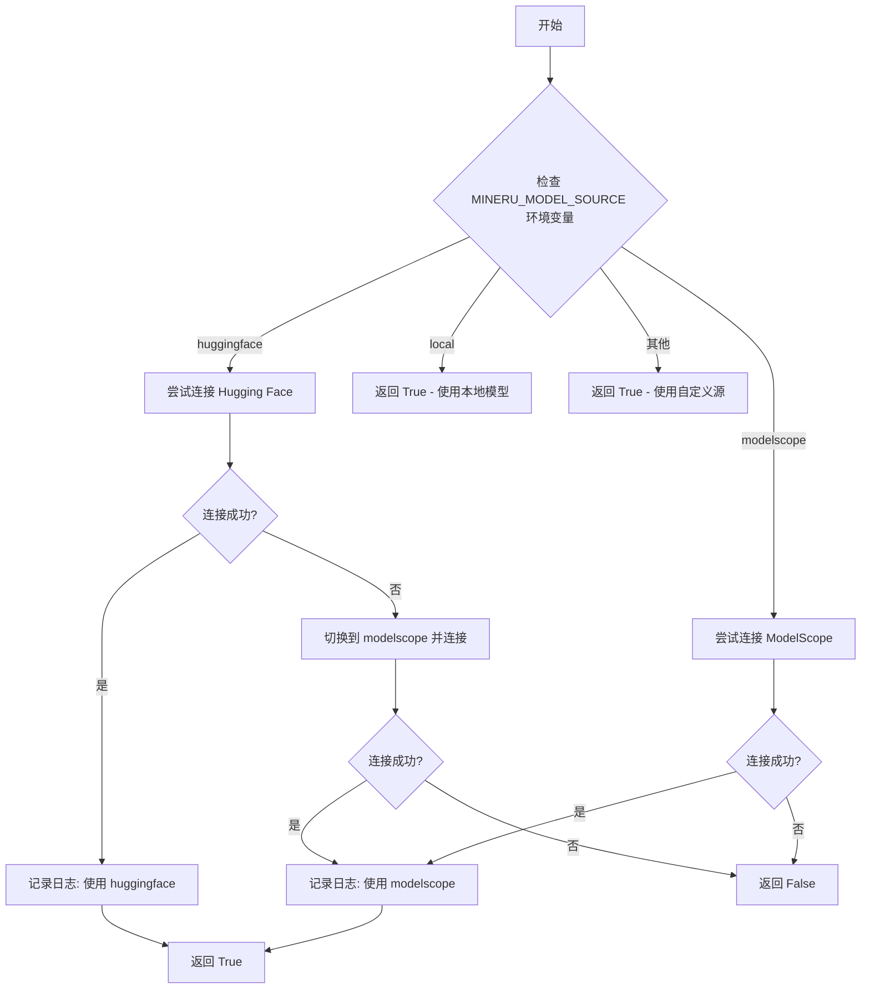
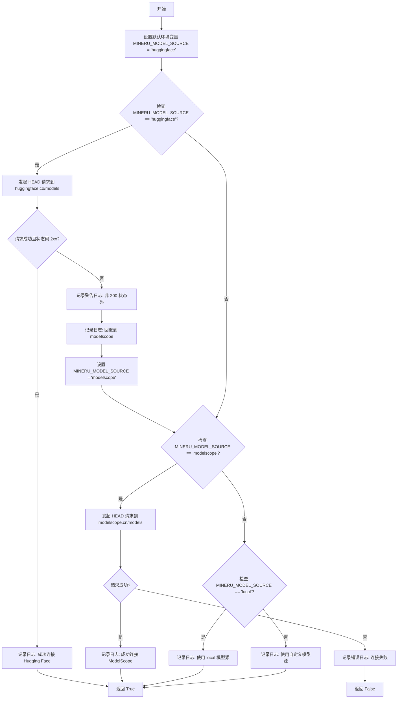
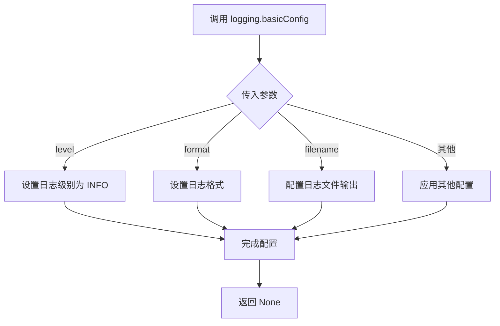
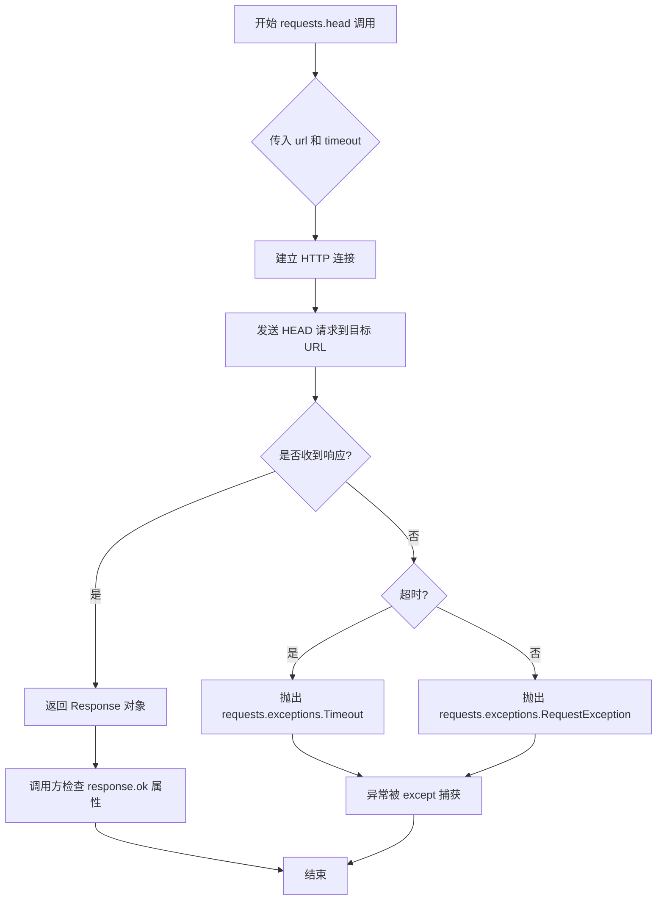
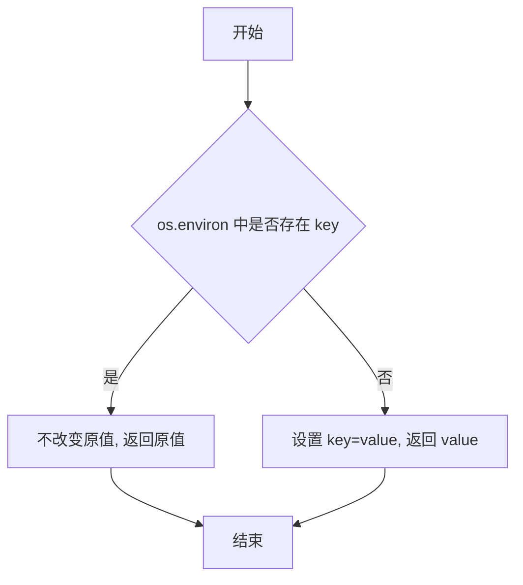
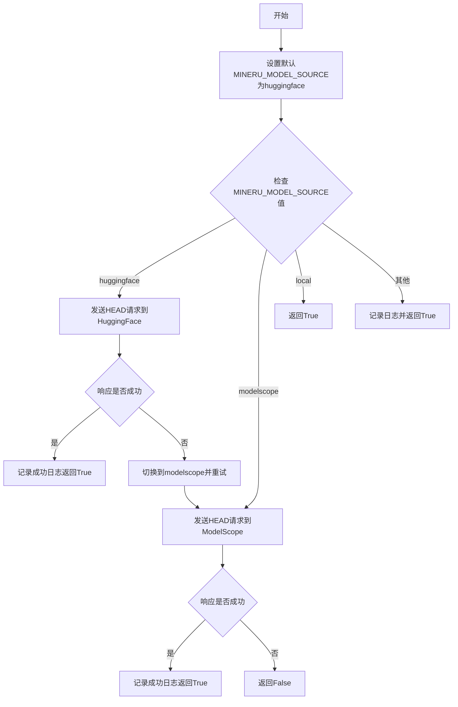

# `MinerU\projects\multi_gpu_v2\_config_endpoint.py` 详细设计文档

该代码实现了一个模型源自动配置功能，通过网络连接检测来确定最佳的模型来源。它首先尝试连接Hugging Face，如果失败则自动切换到ModelScope，同时支持本地模式和自定义模型源配置。

## 整体流程



## 类结构

```
无类结构 - 脚本文件
```

## 全局变量及字段


### `TIMEOUT`
    
网络请求超时时间(秒)

类型：`int`
    


### `model_list_url`
    
Hugging Face 模型列表URL

类型：`str`
    


### `modelscope_url`
    
ModelScope 模型列表URL

类型：`str`
    


    

## 全局函数及方法


### `config_endpoint`

该函数用于检测并配置模型源，首先尝试连接 Hugging Face，如果连接失败则自动切换到 ModelScope，同时支持本地模型源和自定义模型源的配置。

参数：
- 该函数无参数

返回值：`bool`，返回 `True` 表示成功配置模型源，返回 `False` 表示所有尝试均失败

#### 流程图



#### 带注释源码

```python
import requests
import os
import logging

# 配置日志级别为 INFO
logging.basicConfig(level=logging.INFO)

# 定义连接超时时间（秒）
TIMEOUT = 3


def config_endpoint():
    """
    Checks for connectivity to Hugging Face and sets the model source accordingly.
    If the Hugging Face endpoint is reachable, it sets MINERU_MODEL_SOURCE to 'huggingface'.
    Otherwise, it falls back to 'modelscope'.
    
    检测并配置模型源。
    如果 Hugging Face 端点可访问，则设置 MINERU_MODEL_SOURCE 为 'huggingface'。
    否则，回退到 'modelscope'。
    """

    # 设置默认模型源为 huggingface
    os.environ.setdefault('MINERU_MODEL_SOURCE', 'huggingface')
    
    # 定义 Hugging Face 和 ModelScope 的模型列表 URL
    model_list_url = f"https://huggingface.co/models"
    modelscope_url = f"https://modelscope.cn/models"
    
    # 如果当前模型源配置为 huggingface，则尝试连接 Hugging Face
    if os.environ['MINERU_MODEL_SOURCE'] == 'huggingface':
        try:
            # 发送 HEAD 请求检测连接（只获取响应头，不下载 body）
            response = requests.head(model_list_url, timeout=TIMEOUT)
            
            # 检查响应状态码是否为 2xx 成功状态
            if response.ok:
                # 记录成功信息并返回 True
                logging.info(f"Successfully connected to Hugging Face. Using 'huggingface' as model source.")
                return True
            else:
                # 记录非 200 状态码的警告
                logging.warning(f"Hugging Face endpoint returned a non-200 status code: {response.status_code}")

        # 捕获网络请求异常（超时、DNS 解析失败、连接拒绝等）
        except requests.exceptions.RequestException as e:
            logging.error(f"Failed to connect to Hugging Face at {model_list_url}: {e}")

        # 如果上述检查失败，切换到 modelscope 作为备选
        logging.info("Falling back to 'modelscope' as model source.")
        os.environ['MINERU_MODEL_SOURCE'] = 'modelscope'
    
    # 如果当前模型源配置为 modelscope，则尝试连接 ModelScope
    elif os.environ['MINERU_MODEL_SOURCE'] == 'modelscope':
        try:
            # 发送 HEAD 请求检测连接
            response = requests.head(modelscope_url, timeout=TIMEOUT)
            # 检查响应是否成功
            if response.ok:
                logging.info(f"Successfully connected to ModelScope. Using 'modelscope' as model source.")
                return True
        # 捕获网络请求异常
        except requests.exceptions.RequestException as e:
            logging.error(f"Failed to connect to ModelScope at {modelscope_url}: {e}")
        
    # 如果当前模型源配置为 local，直接返回成功
    elif os.environ['MINERU_MODEL_SOURCE'] == 'local':
        logging.info("Using 'local' as model source.")
        return True
    
    # 如果是其他自定义模型源，记录日志并返回成功
    else:
        logging.error(f"Using custom model source: {os.environ['MINERU_MODEL_SOURCE']}")
        return True
    
    # 所有连接尝试均失败，返回 False
    return False


if __name__ == '__main__':
    print(config_endpoint())
```


### `logging.basicConfig`

配置日志系统，设置全局日志记录器的基本配置，包括日志级别、格式、输出目标等。

参数：

- `level`：`int` 或 `str`，日志级别，决定记录的消息优先级。代码中传入 `logging.INFO`，表示记录 INFO 级别及以上的日志。
- `format`：`str`，可选，日志消息的格式化字符串，默认为 `%(levelname)s:%(name)s:%(message)s`。
- `filename`：`str`，可选，日志输出文件名，若指定则写入文件，否则输出到控制台。
- `filemode`：`str`，可选，文件打开模式，默认为 `'a'`（追加）。
- `datefmt`：`str`，可选，日期时间格式。
- `style`：`str`，可选，格式字符串风格，可为 `'%'`, `'{'`, `'$'`。
- `stream`：`stream`，可选，日志输出流（如 `sys.stdout`），与 `filename` 冲突。
- `handlers`：`list`，可选，自定义处理器列表。

返回值：`None`，该函数不返回值，仅修改日志系统配置。

#### 流程图



#### 带注释源码

```python
import logging

# 调用 logging.basicConfig 配置日志系统
# 参数：
#   level=logging.INFO: 设置日志级别为 INFO，表示记录 INFO 及以上级别的日志
#                      日志级别从低到高：DEBUG < INFO < WARNING < ERROR < CRITICAL
# 该调用将日志输出到控制台（默认 stream=sys.stderr）
logging.basicConfig(level=logging.INFO)
```


### `requests.head`

`requests.head` 是 requests 库提供的 HTTP HEAD 请求方法，用于向指定 URL 发送 HEAD 请求以检查连接性。HEAD 请求与 GET 请求类似，但不返回响应体，只获取响应头信息，常用于检查资源是否存在或服务是否可达。

参数：

- `url`：`str`，目标 URL，用于指定要发送 HEAD 请求的地址
- `timeout`：`int/float`，超时时间（秒），指定等待响应的最大时间
- `**kwargs`：可选参数，支持其他 requests 库支持的参数（如 headers、params 等）

返回值：`requests.Response`，服务器响应对象，包含状态码、响应头等信息

#### 流程图



#### 带注释源码

```python
# requests.head 方法的简化实现原理
# 以下是对 requests.head 调用过程的注释说明

# 调用示例 1: 检查 Hugging Face 连接
response = requests.head(model_list_url, timeout=TIMEOUT)
# - model_list_url = "https://huggingface.co/models"
# - TIMEOUT = 3 (秒)
# - 发送 HEAD 请求到 Hugging Face 模型列表页面
# - 返回 Response 对象，包含 HTTP 状态码和响应头

# 调用示例 2: 检查 ModelScope 连接
response = requests.head(modelscope_url, timeout=TIMEOUT)
# - modelscope_url = "https://modelscope.cn/models"
# - TIMEOUT = 3 (秒)
# - 发送 HEAD 请求到 ModelScope 模型页面
# - 返回 Response 对象，包含 HTTP 状态码和响应头

# Response 对象常用属性和方法:
# - response.ok: bool, True if status_code < 400
# - response.status_code: int, HTTP 状态码 (200, 404, 500 等)
# - response.headers: dict, 响应头信息
# - response.raise_for_status(): 如果状态码 >= 400 抛出异常

# requests.head 与 requests.get 的区别:
# - HEAD 请求只获取响应头，不下载响应体
# - 更轻量，适合检查资源是否存在
# - 减少网络带宽消耗

# 异常处理:
# - requests.exceptions.Timeout: 请求超时
# - requests.exceptions.ConnectionError: 连接失败
# - requests.exceptions.RequestException: 其他请求异常基类
```


### `os.environ.setdefault`

设置环境变量的默认值，如果环境变量不存在则设置它，如果已存在则保持其原值。

参数：

- `key`：`str`，环境变量的名称（这里是 `'MINERU_MODEL_SOURCE'`）
- `value`：`str`，要设置的默认值（这里是 `'huggingface'`）

返回值：`str`，返回环境变量的值（如果原不存在则返回刚设置的值，如果已存在则返回原值）

#### 流程图



#### 带注释源码

```python
# 设置环境变量 'MINERU_MODEL_SOURCE' 的默认值
# 如果该环境变量已存在，则保持其原值
# 如果该环境变量不存在，则设置为 'huggingface'
os.environ.setdefault('MINERU_MODEL_SOURCE', 'huggingface')
```

## 关键组件


### 一段话描述

该代码是一个模型源自动配置模块，通过向Hugging Face和ModelScope发送HTTP HEAD请求来检测网络连通性，动态选择可用的模型源（huggingface/modelscope/local），当主源不可用时自动回退到备选源。

### 文件的整体运行流程

1. **初始化阶段**：设置默认环境变量`MINERU_MODEL_SOURCE`为`huggingface`，定义超时时间和两个模型源的URL
2. **检测阶段**：读取当前`MINERU_MODEL_SOURCE`环境变量值
3. **连接验证**：根据环境变量选择对应平台发送HEAD请求进行连通性测试
4. **回退逻辑**：若首选源连接失败，自动切换到`modelscope`
5. **结果返回**：返回布尔值表示是否成功连接到任一可用源

### 全局变量和全局函数详细信息

#### 全局变量

| 名称 | 类型 | 描述 |
|------|------|------|
| TIMEOUT | int | HTTP请求超时时间（秒），设为3秒 |
| model_list_url | str | HuggingFace模型列表的URL地址 |
| modelscope_url | str | ModelScope模型列表的URL地址 |

#### 全局函数

**config_endpoint**

- 参数：无
- 返回值类型：bool
- 返回值描述：成功连接到任一模型源返回True，否则返回False
- Mermaid流程图：



- 带注释源码：

```python
def config_endpoint():
    """
    Checks for connectivity to Hugging Face and sets the model source accordingly.
    If the Hugging Face endpoint is reachable, it sets MINERU_MODEL_SOURCE to 'huggingface'.
    Otherwise, it falls back to 'modelscope'.
    """

    # 设置默认模型源为huggingface
    os.environ.setdefault('MINERU_MODEL_SOURCE', 'huggingface')
    # 定义两个模型源的URL
    modelscope_url = f"https://modelscope.cn/models"
    model_list_url = f"https://huggingface.co/models"
    
    # 根据环境变量选择要检测的模型源
    if os.environ['MINERU_MODEL_SOURCE'] == 'huggingface':
        try:
            # 发送HEAD请求检测HuggingFace连通性
            response = requests.head(model_list_url, timeout=TIMEOUT)
            
            # 检查是否收到2xx成功状态码
            if response.ok:
                logging.info(f"Successfully connected to Hugging Face. Using 'huggingface' as model source.")
                return True
            else:
                logging.warning(f"Hugging Face endpoint returned a non-200 status code: {response.status_code}")

        except requests.exceptions.RequestException as e:
            logging.error(f"Failed to connect to Hugging Face at {model_list_url}: {e}")

        # 连接失败，切换到modelscope作为备选
        logging.info("Falling back to 'modelscope' as model source.")
        os.environ['MINERU_MODEL_SOURCE'] = 'modelscope'
    
    # 检测modelscope源
    elif os.environ['MINERU_MODEL_SOURCE'] == 'modelscope':
        try:
            response = requests.head(modelscope_url, timeout=TIMEOUT)
            if response.ok:
                logging.info(f"Successfully connected to ModelScope. Using 'modelscope' as model source.")
                return True
        except requests.exceptions.RequestException as e:
            logging.error(f"Failed to connect to ModelScope at {modelscope_url}: {e}")
        
    # local模式不需要网络检测
    elif os.environ['MINERU_MODEL_SOURCE'] == 'local':
        logging.info("Using 'local' as model source.")
        return True
    
    # 自定义源，不做检测直接返回成功
    else:
        logging.error(f"Using custom model source: {os.environ['MINERU_MODEL_SOURCE']}")
        return True
    
    return False
```

### 关键组件信息

| 组件名称 | 一句话描述 |
|----------|------------|
| 连接检测器 | 使用HTTP HEAD请求验证远程端点可访问性的模块 |
| 动态源选择器 | 根据连接状态自动选择最优模型源的逻辑组件 |
| 环境变量管理器 | 通过os.environ管理模型源配置的模块 |
| 日志系统 | 使用logging记录连接状态和错误信息的模块 |

### 潜在的技术债务或优化空间

1. **缺少重试机制**：网络请求失败时没有重试逻辑，可能因临时网络波动导致误判
2. **异常处理不完善**：异常捕获后直接回退，没有区分不同类型的网络错误
3. **硬编码URL**：模型源URL硬编码在函数内部，缺乏配置灵活性
4. **缺少并发检测**：可以并行检测多个源以提高启动速度
5. **超时值不可配置**：TIMEOUT固定为3秒，无法适应不同网络环境
6. **日志级别不一致**：某些地方使用error记录可恢复错误，不够准确

### 其它项目

#### 设计目标与约束

- **目标**：实现模型源的自动检测与动态切换，确保在Hugging Face不可用时自动回退到ModelScope
- **约束**：依赖网络连通性，运行时需要访问外网

#### 错误处理与异常设计

- 使用try-except捕获`requests.exceptions.RequestException`处理网络异常
- 对HTTP非2xx响应码进行单独处理
- 所有异常都会触发回退逻辑，不会抛出到上层

#### 数据流与状态机

- 状态流：huggingface → (连接失败) → modelscope → (连接失败) → 返回False
- 环境变量作为状态存储的载体，贯穿整个检测流程

#### 外部依赖与接口契约

- 依赖`requests`库进行HTTP请求
- 依赖`os`模块操作环境变量
- 依赖`logging`模块记录运行日志
- 返回布尔值表示检测成功与否


## 问题及建议


### 已知问题

-   **环境变量访问不安全**：直接使用`os.environ['MINERU_MODEL_SOURCE']`访问环境变量，若变量不存在会抛出`KeyError`异常，应改用`os.environ.get()`方法。
-   **逻辑冗余与不一致**：`config_endpoint()`函数在开始时使用`setdefault`设置了默认值，但后续代码仍然重复检查该变量的值，导致逻辑冗余；同时，首次检查`huggingface`分支内部逻辑较长，而`modelscope`分支检查逻辑不完整。
-   **连接检查不够健壮**：仅使用HEAD请求且超时时间固定为3秒，在网络环境较差时容易误判，导致不必要的回退；且HEAD请求可能无法反映实际的模型下载连通性。
-   **失败处理不完善**：当两个endpoint都连接失败时，函数返回`False`但没有任何日志说明具体失败原因，缺乏对最终失败场景的处理。
-   **代码扩展性差**：URL硬编码在函数内部，若需要添加新的模型源或修改URL，需要直接修改源码，不符合开闭原则。

### 优化建议

-   使用`os.environ.get('MINERU_MODEL_SOURCE', 'huggingface')`统一获取环境变量，避免KeyError。
-   将URL配置提取为模块级常量或配置文件，提高可维护性。
-   考虑增加连接重试机制或使用更长的超时时间（如5-10秒），并记录每次尝试的详细信息。
-   对连接检查失败的情况进行更细粒度的日志记录，明确告知用户具体是哪个endpoint出现了什么问题。
-   考虑使用结构化的返回值（如返回字典包含success状态、current_source、error_message等），使调用者能够更方便地获取执行结果。

## 其它


### 设计目标与约束

本代码的设计目标是实现一个自动化的模型源选择机制，能够在Hugging Face不可用时自动降级到ModelScope。约束包括：超时时间限制为3秒，仅支持head请求方法，仅支持huggingface、modelscope和local三种模式。

### 错误处理与异常设计

代码通过try-except块捕获requests.exceptions.RequestException类型的异常，记录错误日志后继续执行降级逻辑。当Hugging Face返回非2xx状态码时，同样触发降级流程。无网络连接、超时、SSL错误等均被视为连接失败。

### 数据流与状态机

程序启动时首先设置默认环境变量MINERU_MODEL_SOURCE为huggingface，然后根据连接检测结果决定是否保持该值或切换到modelscope。状态流转路径为：huggingface检测成功→使用huggingface；huggingface检测失败→切换modelscope→检测modelscope；配置为local→直接使用local。

### 外部依赖与接口契约

代码依赖requests库进行HTTP请求，依赖os模块进行环境变量操作，依赖logging模块进行日志记录。外部接口包括Hugging Face的/models端点和ModelScope的/models端点，均使用HEAD方法进行可达性检测。

### 性能考虑

使用HEAD方法而非GET方法减少网络流量和响应时间，超时时间设置为3秒以平衡用户体验和检测准确性，无重试机制以避免不必要的延迟。

### 安全性考虑

代码未对外部URL进行严格验证，存在DNS重绑定等潜在安全风险。未使用HTTPS证书验证参数，可能受到中间人攻击影响。环境变量直接使用未进行输入校验。

### 配置管理

模型源通过环境变量MINERU_MODEL_SOURCE控制，支持huggingface、modelscope、local三种预定义值及自定义值。超时时间通过全局常量TIMEOUT定义，便于统一调整。

### 日志设计

使用Python标准logging模块，日志级别设为INFO级别。分别记录成功连接信息、降级切换信息、各类错误信息，为运维提供足够的诊断依据。

### 测试策略

应包含网络可达性测试（模拟正常和异常网络环境）、超时测试、状态码非200测试、环境变量不同值测试、异常捕获测试。建议使用mock对象隔离外部依赖。

### 部署注意事项

部署时需确保网络可达Hugging Face和ModelScope的API端点，考虑在内网环境下的降级逻辑。需要正确设置环境变量或依赖代码的默认逻辑。

### 监控和告警

建议监控config_endpoint的返回值，统计切换到modelscope的频率和次数，当降级发生频繁时触发告警，提示Hugging Face服务可能存在问题。

### 版本兼容性

代码使用标准库和requests库，需确保部署环境安装requests>=2.0版本。Python版本建议3.6以上以支持logging.basicConfig的level参数类型注解。

### 扩展性设计

当前仅支持三个固定模型源，若需扩展新源需要修改函数逻辑。可考虑将模型源列表配置化，支持插件式扩展。URL模板目前硬编码，可抽取为配置项。

### 代码规范和约定

函数命名使用snake_case，符合Python PEP8规范。环境变量命名使用全大写加下划线。注释使用Google风格文档字符串。建议添加类型注解提高代码可维护性。


    