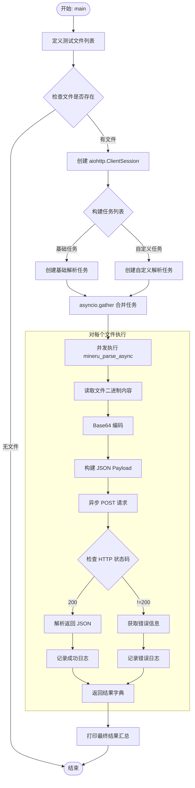
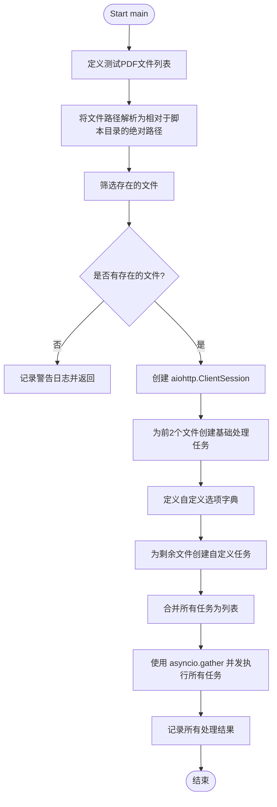

# `MinerU\projects\multi_gpu_v2\client.py` 详细设计文档

An asynchronous Python script that leverages aiohttp to concurrently send local PDF files to a local MiniOCR/MineRUC server for processing, handling base64 encoding and custom options while logging results.

## 整体流程



## 类结构

```
mineru_client.py (功能模块 - 无类结构)
├── mineru_parse_async (异步处理函数)
└── main (异步入口函数)
```

## 全局变量及字段


### `test_files`
    
包含测试PDF文件路径的列表

类型：`List[str]`
    


### `existing_files`
    
筛选后存在的测试文件路径列表

类型：`List[str]`
    


### `basic_tasks`
    
使用默认选项的异步解析任务列表

类型：`List[asyncio.Task]`
    


### `custom_options`
    
自定义解析选项，包含后端、语言、方法和功能开关配置

类型：`Dict[str, Any]`
    


### `custom_tasks`
    
使用自定义选项的异步解析任务列表

类型：`List[asyncio.Task]`
    


### `all_tasks`
    
合并后的所有异步任务列表

类型：`List[asyncio.Task]`
    


### `all_results`
    
所有任务执行结果的列表

类型：`List[Dict[str, Any]]`
    


    

## 全局函数及方法


### `mineru_parse_async`

这是一个异步函数，用于将指定的PDF文件读取并进行Base64编码，然后通过aiohttp异步POST请求发送至Mineru解析服务（默认为本地地址），最后返回服务器处理后的JSON结果或错误信息。

参数：

- `session`：`aiohttp.ClientSession`，由aiohttp创建的会话对象，用于复用TCP连接，提高并发请求性能。
- `file_path`：`str`，需要解析的PDF文件的本地路径。
- `url`：`str`，Mineru服务的预测API端点URL，默认为 `http://127.0.0.1:8000/predict`。
- `**options`：`dict`，可变关键字参数，用于传递解析配置选项（如语言 `lang`、后端 `backend`、公式识别 `formula_enable` 等）。

返回值：`dict`，返回服务器响应的JSON数据（通常包含 `output_dir`）；若发生错误（包括HTTP错误或代码异常），则返回一个包含 `error` 键的错误描述字典。

#### 流程图

```mermaid
flowchart TD
    START([开始]) --> READ[打开文件 file_path<br>读取二进制内容]
    READ --> ENCODE[Base64.b64encode 编码<br>并解码为 UTF-8 字符串]
    ENCODE --> PAYLOAD[构建 JSON Payload<br>{file: b64_str, options: dict}]
    PAYLOAD --> POST[async session.post(url, json=payload)]
    
    POST --> STATUS{响应状态码}
    
    -- 200 OK --> JSON[await response.json()]
    JSON --> LOG_SUC[logger.info 成功信息]
    LOG_SUC --> RETURN_RES[返回结果字典]
    
    -- 非 200 --> ERR_TXT[await response.text()]
    ERR_TXT --> LOG_ERR[logger.error 服务器错误]
    LOG_ERR --> RETURN_ERR[返回 {'error': text}]
    
    POST -.-> EXCEPT[捕获 Exception]
    EXCEPT --> LOG_EXC[logger.error 异常信息]
    LOG_EXC --> RETURN_ERR
    
    RETURN_RES --> END([结束])
    RETURN_ERR --> END
```

#### 带注释源码

```python
async def mineru_parse_async(session, file_path, url='http://127.0.0.1:8000/predict', **options):
    """
    Asynchronous version of the parse function.
    """
    try:
        # 1. 读取本地文件并进行Base64编码，以便作为JSON payload传输
        with open(file_path, 'rb') as f:
            # 读取二进制 -> Base64编码 -> 解码为utf-8字符串
            file_b64 = base64.b64encode(f.read()).decode('utf-8')

        # 2. 构造请求体，包含编码后的文件内容和额外选项
        payload = {
            'file': file_b64,
            'options': options
        }

        # 3. 使用传入的 aiohttp session 发送异步POST请求
        # async with 确保请求完成后自动关闭连接（如果是新的话）
        async with session.post(url, json=payload) as response:
            # 4. 检查HTTP状态码
            if response.status == 200:
                # 5. 成功处理：解析JSON响应
                result = await response.json()
                # 记录成功日志，提示输出目录
                logger.info(f"✅ Processed: {file_path} -> {result.get('output_dir', 'N/A')}")
                return result
            else:
                # 6. 服务器端错误处理：获取错误文本
                error_text = await response.text()
                logger.error(f"❌ Server error for {file_path}: {error_text}")
                return {'error': error_text}

    except Exception as e:
        # 7. 异常捕获：处理如文件不存在、网络中断等客户端错误
        logger.error(f"❌ Failed to process {file_path}: {e}")
        return {'error': str(e)}
```


### `main`

这是异步主函数，用于协调多个PDF文件的并发解析任务。它定义了测试文件列表，筛选存在的文件，创建aiohttp会话，构造基础任务和自定义选项任务，最后使用asyncio.gather并发执行所有任务并记录结果。

参数：
- 无

返回值：`None`，该函数为异步函数，不返回有意义的值，主要通过日志输出结果。

#### 流程图



#### 带注释源码

```python
async def main():
    """
    Main function to run all parsing tasks concurrently.
    主函数，并发运行所有解析任务
    """
    # 定义测试PDF文件路径列表
    test_files = [
        '../../demo/pdfs/demo1.pdf',
        '../../demo/pdfs/demo2.pdf',
        '../../demo/pdfs/demo3.pdf',
        '../../demo/pdfs/small_ocr.pdf',
    ]

    # 使用脚本所在目录作为基准，将相对路径转换为绝对路径
    # os.path.dirname(__file__) 获取脚本所在目录
    test_files = [os.path.join(os.path.dirname(__file__), f) for f in test_files]
    
    # 筛选出实际存在的文件
    existing_files = [f for f in test_files if os.path.exists(f)]
    
    # 如果没有找到测试文件，记录警告并退出函数
    if not existing_files:
        logger.warning("No test files found.")
        return

    # 创建 aiohttp 会话以在多个请求中复用连接
    # 使用 async with 确保会话正确关闭
    async with aiohttp.ClientSession() as session:
        # === 基础处理 === 
        # 为前2个文件创建基础解析任务（使用默认选项）
        basic_tasks = [mineru_parse_async(session, file_path) for file_path in existing_files[:2]]

        # === 自定义选项 ===
        # 定义自定义解析选项：使用pipeline后端、中文语言、自动方法、启用公式和表格识别
        custom_options = {
            'backend': 'pipeline', 
            'lang': 'ch', 
            'method': 'auto',
            'formula_enable': True, 
            'table_enable': True,
            # 示例：远程VLM服务器选项（vllm/sglang/lmdeploy...）
            # 'backend': 'vlm-http-client', 
            # 'server_url': 'http://127.0.0.1:30000',
        }

        # 为剩余文件创建使用自定义选项的解析任务
        custom_tasks = [mineru_parse_async(session, file_path, **custom_options) for file_path in existing_files[2:]]

        # 合并所有任务为一个列表
        all_tasks = basic_tasks + custom_tasks

        # 使用 asyncio.gather 并发执行所有任务
        # return_exceptions=True 使得某个任务失败不会导致整体取消
        all_results = await asyncio.gather(*all_tasks)

        # 记录所有任务的结果
        logger.info(f"All Results: {all_results}")

        
    # 所有处理完成后记录完成信息
    logger.info("🎉 All processing completed!")
```


## 关键组件


### 文件读取与Base64编码模块

负责读取本地PDF文件并将其转换为Base64编码字符串，以便通过HTTP请求传输。使用了Python的base64库和os.path模块实现文件路径处理和二进制读取。

### 异步HTTP请求处理模块

使用aiohttp库实现异步HTTP POST请求，将Base64编码的文件和选项发送到MinerU服务。支持请求重试机制和会话复用，提高并发处理效率。

### 配置选项管理模块

定义并管理发送到远程解析服务的各种配置参数，包括后端类型、语言设置、公式识别、表格识别等选项。通过字典形式传递自定义参数。

### 并发任务调度模块

使用asyncio.gather实现多个文件解析任务的并发执行。通过创建任务列表并统一等待结果，提高整体处理效率。

### 错误处理与日志记录模块

使用loguru库实现结构化日志记录，区分成功、错误和警告信息。包含文件不存在、服务器错误、请求异常等情况的处理。

### 文件路径解析模块

处理相对路径转换为绝对路径，并验证文件是否存在。使用os.path.join和os.path.exists确保文件可访问性。


## 问题及建议


### 已知问题

-   **阻塞式文件IO**：在异步函数中使用同步的 `open()` 和 `f.read()`，会阻塞事件循环，降低并发性能
-   **缺乏超时配置**：aiohttp 请求未设置超时，可能导致请求无限期等待
-   **错误处理不一致**：网络错误和业务错误都返回 `{'error': str(e)}` 格式，调用方难以区分错误类型
-   **并发控制缺失**：`asyncio.gather()` 未设置最大并发数，可能导致并发过高影响服务稳定
-   **相对路径依赖**：使用 `os.path.dirname(__file__)` 配合相对路径，部署灵活性差
-   **异常传播风险**：`asyncio.gather` 未使用 `return_exceptions=True`，单个任务失败会导致整体中断
-   **硬编码配置**：URL、文件路径、选项参数均硬编码，缺乏配置管理
-   **日志泄露风险**：打印所有结果可能包含敏感信息或大量数据，影响日志可读性
-   **类型注解缺失**：缺少参数和返回值类型提示，降低代码可维护性
-   **资源复用不足**：每次调用都重新读取并编码文件，未实现文件缓存机制
-   **状态码处理单一**：仅处理 200 状态码，其他 2xx 成功状态码未覆盖
-   **同步版本缺失**：仅提供异步版本，限制了使用场景的灵活性

### 优化建议

-   使用 `aiofiles` 库实现异步文件读写，避免阻塞事件循环
-   为 aiohttp 请求配置 `timeout` 参数，建议使用 `aiohttp.ClientTimeout(total=60)`
-   定义自定义异常类（如 `MineruParseError`），区分网络错误、服务器错误和业务错误
-   使用 `asyncio.Semaphore` 控制最大并发数，防止资源耗尽
-   将 URL、并发数、超时等配置抽取为配置文件或环境变量
-   使用 `asyncio.gather(*tasks, return_exceptions=True)`，并对结果进行独立处理
-   实现重试机制（可使用 `tenacity` 库），增强网络请求的容错能力
-   对日志输出进行分级处理，结果日志使用 `debug` 级别，避免敏感信息泄露
-   添加完整的类型注解，提升代码可读性和 IDE 支持
-   对大文件实现流式编码或预加载缓存，减少重复 IO 操作
-   扩展状态码处理范围，覆盖 201、202 等成功状态
-   提供同步封装函数 `mineru_parse`，便于非异步场景调用

## 其它


### 设计目标与约束

本代码的设计目标是实现一个高效的异步文档批处理工具，通过调用远程MiniMinerU服务实现PDF文件的结构化解析。核心约束包括：1）仅支持PDF格式输入；2）依赖远程HTTP服务可用性；3）支持自定义解析选项（语言、公式识别、表格识别等）；4）需要Python 3.7+环境及aiohttp、loguru等依赖库。

### 错误处理与异常设计

代码采用分层错误处理策略。在`mineru_parse_async`函数中，使用try-except捕获所有异常并返回包含错误信息的字典，调用方可通过检查返回字典中是否存在`error`键来判断是否出错。主要异常场景包括：文件读取失败、网络请求超时、服务器返回非200状态码、JSON解析失败等。日志记录使用loguru库，区分info、warning、error三个级别，异常信息会同时输出到控制台和日志文件。

### 数据流与状态机

数据流转过程为：读取PDF文件→Base64编码→构建JSON payload→发送POST请求→接收响应→JSON解析→返回结果。主函数状态机包含：文件检查状态（验证文件存在性）→任务创建状态（构建basic_tasks和custom_tasks）→并发执行状态（asyncio.gather等待所有任务完成）→结果收集状态（汇总所有结果并输出）。

### 外部依赖与接口契约

本代码依赖以下外部组件：1）MiniMinerU服务端（默认http://127.0.0.1:8000/predict），需提供POST接口，接收包含base64编码文件和options参数的JSON，返回包含output_dir的结果；2）aiohttp库用于异步HTTP通信；3）loguru用于结构化日志输出；4）Python标准库（base64、os、asyncio）。接口契约要求：请求Content-Type为application/json，响应状态码200表示成功，其他状态码需作为错误处理。

### 配置管理

配置通过硬编码和函数参数两种方式管理。远程服务端URL在mineru_parse_async函数中默认为'http://127.0.0.1:8000/predict'，可通过参数覆盖。解析选项通过**options传递，支持的选项包括：backend（解析后端）、lang（语言设置）、method（解析方法）、formula_enable（公式识别）、table_enable（表格识别）、server_url（远程VLM服务地址）等。

### 性能考虑

代码采用asyncio实现并发处理，多个文件解析任务同时执行而非串行执行，显著提高批量处理效率。使用aiohttp.ClientSession复用TCP连接，避免频繁建立和断开连接的开销。当前实现中basic_tasks和custom_tasks分开执行，理论上可进一步优化为统一任务列表以实现更细粒度的并发控制。

### 安全性考虑

当前实现存在以下安全风险：1）未对文件路径进行严格验证，可能存在路径遍历攻击风险；2）Base64编码直接读取文件内容，大文件可能导致内存压力；3）服务端URL可配置但未实现HTTPS支持；4）未实现请求超时机制。建议在生产环境中添加：输入文件大小限制、路径规范化检查、超时参数配置、HTTPS支持等安全措施。

### 部署和运维相关

部署环境要求：Python 3.7+、pip包管理、安装依赖（pip install aiohttp loguru）。运行方式为直接执行Python脚本（python script_name.py）。运维需关注：远程服务可用性监控、日志收集与分析、错误率统计、响应时间监控等。生产环境建议使用systemd或Docker进行进程管理。

### 测试策略

当前代码包含demo测试文件验证逻辑，但缺乏单元测试和集成测试。建议补充：1）单元测试：测试mineru_parse_async函数的各种异常场景；2）mock测试：使用aioresponses模拟HTTP响应；3）集成测试：使用真实PDF文件和本地运行的MiniMinerU服务进行端到端测试。

### 监控和日志

日志使用loguru库实现，推荐配置：添加日志轮转（rotation）、压缩（compression）、保留策略（retention）。关键监控指标包括：文件处理成功率、平均处理时间、错误类型分布、并发任务数等。建议在main函数中添加Prometheus指标暴露或自定义统计信息输出。

    