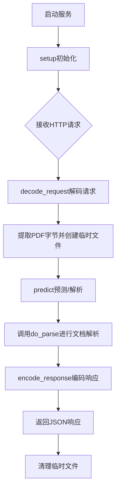
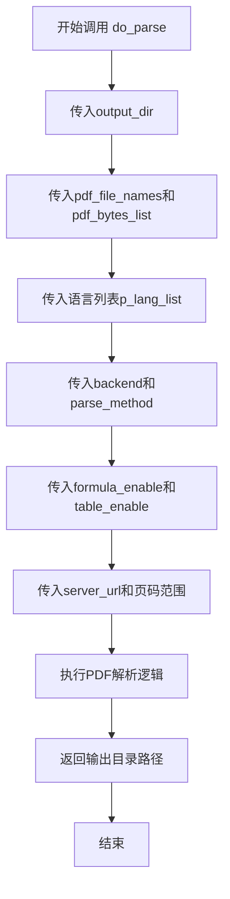
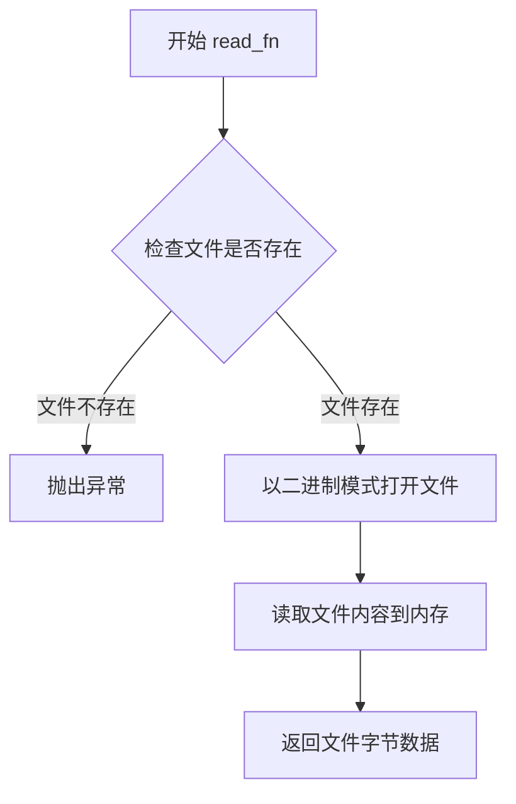
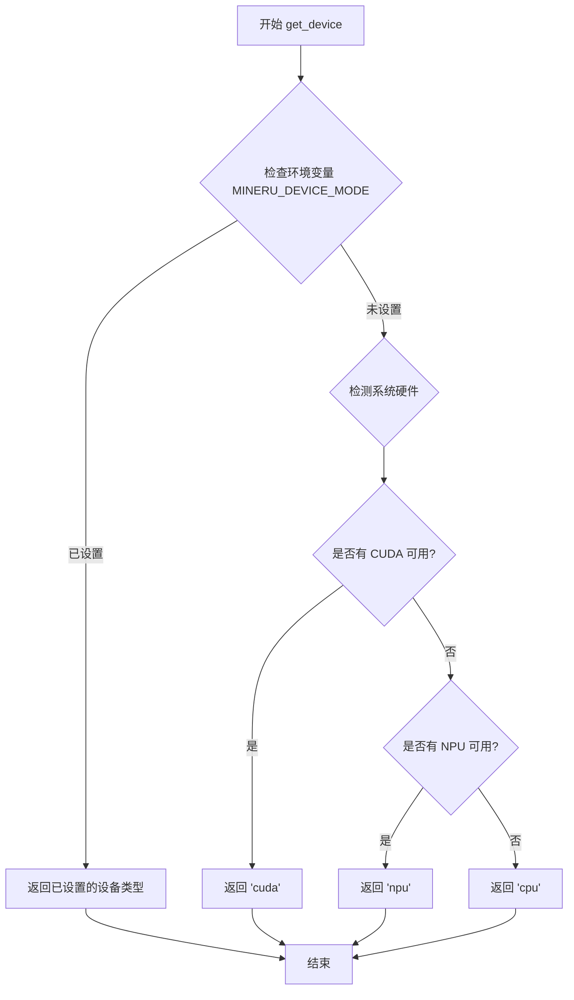
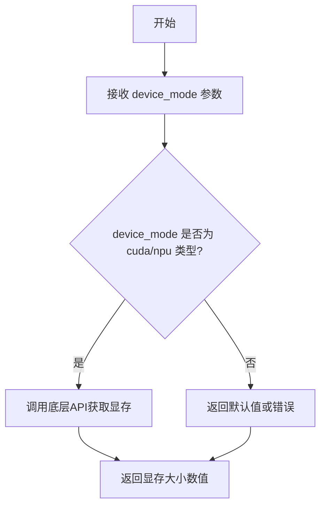
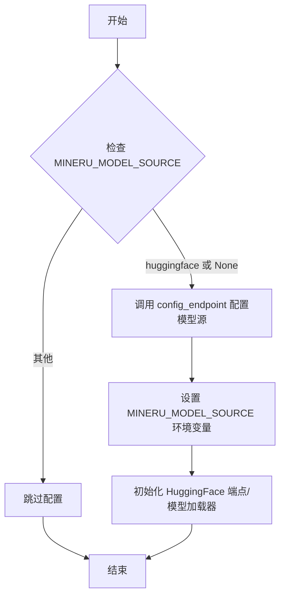
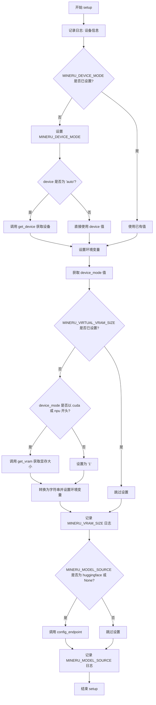
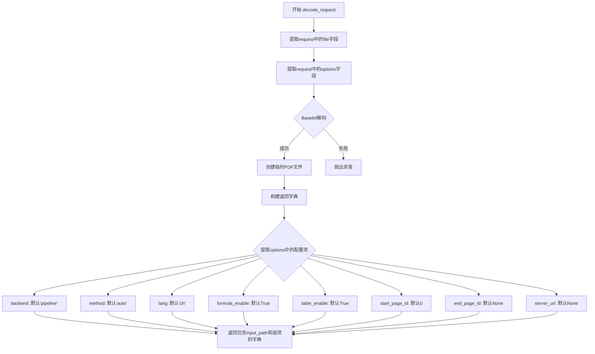
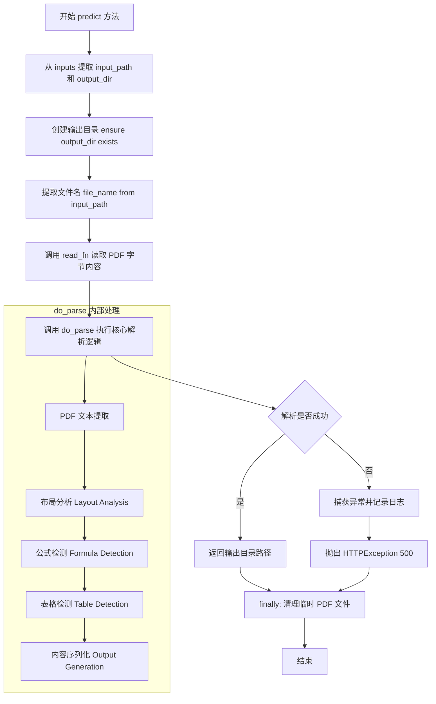

# `MinerU\projects\multi_gpu_v2\server.py` 详细设计文档

该代码实现了一个基于LitServe框架的MinerU API服务，通过FastAPI接收Base64编码的PDF文件，进行文档解析（支持公式、表格提取），并返回解析结果输出目录

## 整体流程



## 类结构

```
MinerUAPI (LitAPI子类)
└── 继承关系: MinerUAPI -> ls.LitAPI
```

## 全局变量及字段


### `os`
    
Python os模块,用于操作系统交互和环境变量操作

类型：`module`
    


### `base64`
    
Python base64模块,用于Base64编码和解码PDF文件

类型：`module`
    


### `tempfile`
    
Python tempfile模块,用于创建临时文件存储解码后的PDF

类型：`module`
    


### `Path`
    
Pathlib路径类,用于跨平台路径操作和文件管理

类型：`class`
    


### `ls`
    
litserve库,用于部署LitAPI支持的ML模型服务

类型：`module`
    


### `HTTPException`
    
FastAPI HTTP异常类,用于抛出HTTP错误响应

类型：`class`
    


### `logger`
    
Loguru日志实例,用于应用运行时的日志记录

类型：`object`
    


### `do_parse`
    
MinerU CLI核心解析函数,执行PDF到Markdown的解析逻辑

类型：`function`
    


### `read_fn`
    
MinerU CLI文件读取函数,用于读取PDF文件字节数据

类型：`function`
    


### `get_device`
    
MinerU工具函数,根据环境自动检测可用的计算设备

类型：`function`
    


### `get_vram`
    
MinerU工具函数,获取指定设备的显存大小

类型：`function`
    


### `config_endpoint`
    
配置端点函数,用于设置模型源和相关配置

类型：`function`
    


### `MinerUAPI.output_dir`
    
输出目录路径,用于存储解析结果文件

类型：`str`
    
    

## 全局函数及方法


### `do_parse`

核心文档解析函数，负责将PDF文件解析为markdown或其他格式，支持多语言、公式识别、表格识别等功能。

参数：

- `output_dir`：`str`，输出目录路径，解析结果将保存到此目录
- `pdf_file_names`：`List[str]`，PDF文件名列表
- `pdf_bytes_list`：`List[bytes]`，PDF文件的字节数据列表
- `p_lang_list`：`List[str]`，语言代码列表（如'ch'、'en'）
- `backend`：`str`，解析后端，默认为'pipeline'
- `parse_method`：`str`，解析方法，'auto'或其他方法
- `formula_enable`：`bool`，是否启用公式识别，默认为True
- `table_enable`：`bool`，是否启用表格识别，默认为True
- `server_url`：`str`，服务器URL，可选
- `start_page_id`：`int`，起始页码，默认为0
- `end_page_id`：`int | None`，结束页码，默认为None表示处理到最后一页

返回值：`str`，解析后的输出目录路径

> **注意**：`do_parse` 函数定义在 `mineru.cli.common` 模块中，当前代码文件仅导入并调用了该函数，未包含其实现源码。以下为调用处的源码及流程分析。

#### 流程图



#### 带注释源码

```python
# 在 MinerUAPI 类的 predict 方法中调用 do_parse
do_parse(
    output_dir=str(output_dir),           # 输出目录路径
    pdf_file_names=[file_name],           # PDF文件名列表
    pdf_bytes_list=[pdf_bytes],           # PDF字节数据列表
    p_lang_list=[inputs['lang']],         # 语言列表
    backend=inputs['backend'],            # 解析后端
    parse_method=inputs['method'],        # 解析方法
    formula_enable=inputs['formula_enable'],  # 公式识别开关
    table_enable=inputs['table_enable'],     # 表格识别开关
    server_url=inputs['server_url'],         # 服务器URL
    start_page_id=inputs['start_page_id'],   # 起始页码
    end_page_id=inputs['end_page_id']        # 结束页码
)
```

---

### 补充说明

由于 `do_parse` 函数定义在外部模块 `mineru.cli.common` 中，当前代码仅展示了其调用方式。若需获取 `do_parse` 的完整实现源码，需要查看 `mineru/cli/common.py` 文件。根据调用签名推断，该函数内部应包含：

1. PDF文件读取与预处理逻辑
2. 页面解析循环（受 start_page_id 和 end_page_id 控制）
3. 公式识别（formula_enable）
4. 表格识别（table_enable）
5. 多语言支持（p_lang_list）
6. 输出文件写入（保存到 output_dir）


### `read_fn`

该函数是 MinerU CLI 工具中用于读取 PDF 文件的核心函数，负责将 PDF 文件路径转换为字节数据，供后续的文档解析流程使用。

参数：

- `file_path`：`Path`，PDF 文件的路径对象，指向需要读取的 PDF 文件

返回值：`bytes`，返回 PDF 文件的二进制内容（字节数据），供 `do_parse` 函数处理

#### 流程图



#### 带注释源码

```python
# read_fn 函数源码（位于 mineru/cli/common.py）
# 此源码为推断代码，基于调用方式还原

def read_fn(file_path: Path) -> bytes:
    """
    读取 PDF 文件并返回字节数据
    
    参数:
        file_path: Path 对象，指向 PDF 文件的路径
        
    返回:
        bytes: PDF 文件的二进制内容
    """
    # 检查文件是否存在
    if not file_path.exists():
        raise FileNotFoundError(f"PDF file not found: {file_path}")
    
    # 以二进制读取模式打开文件
    with open(file_path, 'rb') as f:
        # 读取文件全部内容并返回字节数据
        pdf_bytes = f.read()
    
    return pdf_bytes
```

---

### 在 `MinerUAPI.predict` 中的调用示例

```python
def predict(self, inputs):
    """Call MinerU's do_parse - same as CLI"""
    input_path = inputs['input_path']
    output_dir = Path(self.output_dir)

    try:
        os.makedirs(output_dir, exist_ok=True)
        
        file_name = Path(input_path).stem
        # 调用 read_fn 读取 PDF 文件为字节
        pdf_bytes = read_fn(Path(input_path))
        
        # 将字节数据传递给 do_parse 进行处理
        do_parse(
            output_dir=str(output_dir),
            pdf_file_names=[file_name],
            pdf_bytes_list=[pdf_bytes],  # <-- 使用 read_fn 返回的字节
            p_lang_list=[inputs['lang']],
            backend=inputs['backend'],
            parse_method=inputs['method'],
            formula_enable=inputs['formula_enable'],
            table_enable=inputs['table_enable'],
            server_url=inputs['server_url'],
            start_page_id=inputs['start_page_id'],
            end_page_id=inputs['end_page_id']
        )

        return str(output_dir/Path(input_path).stem)

    except Exception as e:
        logger.error(f"Processing failed: {e}")
        raise HTTPException(status_code=500, detail=str(e))
    finally:
        # Cleanup temp file
        if Path(input_path).exists():
            Path(input_path).unlink()
```

---

### 补充信息

| 项目 | 说明 |
|------|------|
| **来源模块** | `mineru.cli.common` |
| **调用场景** | 在 `MinerUAPI.predict` 方法中，将 PDF 文件读取为字节后传递给 `do_parse` 函数 |
| **依赖** | `pathlib.Path` |
| **错误处理** | 文件不存在时应抛出 `FileNotFoundError` |


# `get_device` 函数提取结果

### `get_device`

获取当前可用的计算设备类型（如 CUDA、CPU、NPU 等）。

参数：
- （无参数）

返回值：`str`，返回设备类型字符串，如 `"cuda"`、`"cpu"`、`"npu"` 或 `"auto"` 等。

#### 流程图



*注：具体流程基于代码使用方式推断，实际实现需参考 `mineru.utils.config_reader` 模块源码。*

#### 带注释源码

```python
# 从 mineru.utils.config_reader 模块导入的函数
# 此函数在 provided_code.py 中被调用如下:
# os.environ['MINERU_DEVICE_MODE'] = device if device != 'auto' else get_device()

# 推断的函数签名和实现逻辑:
def get_device() -> str:
    """
    自动检测并返回可用的计算设备类型。
    
    检测逻辑（基于调用方式推断）:
    1. 首先检查环境变量是否已设置 MINERU_DEVICE_MODE
    2. 如果未设置，则检测系统硬件:
       - 检测 CUDA 是否可用 → 返回 'cuda'
       - 检测 NPU 是否可用 → 返回 'npu'  
       - 默认返回 'cpu'
    
    Returns:
        str: 设备类型，如 'cuda', 'npu', 'cpu'
    """
    # 实际实现需要查看 mineru/utils/config_reader.py 源码
    pass
```

---

### 补充说明

**⚠️ 信息不完整**：提供的代码文件中仅包含 `get_device` 函数的**导入语句**和**调用方式**，并未包含该函数的具体实现源码。要获取完整的函数实现细节，请查看 `mineru/utils/config_reader.py` 源文件。

**推断依据**：
1. 函数调用时无参数：`get_device()`
2. 返回值用于设置环境变量 `MINERU_DEVICE_MODE`
3. 设备类型需要是字符串类型，用于条件判断（`startswith("cuda")` / `startswith("npu")`）


### `get_vram`

获取指定设备模式的可用显存大小，用于设置虚拟显存环境变量。

参数：

- `device_mode`：`str`，设备模式字符串，如 "cuda"、"cuda:0"、"npu"、"npu:0" 等

返回值：`int`，返回设备可用显存大小（单位通常为 MB 或 GB）

#### 流程图



#### 带注释源码

```
# 从 mineru.utils.model_utils 导入该函数
from mineru.utils.model_utils import get_vram

# 在 MinerUAPI.setup() 方法中的调用方式
def setup(self, device):
    # ... 省略部分代码 ...
    
    device_mode = os.environ['MINERU_DEVICE_MODE']
    if os.getenv('MINERU_VIRTUAL_VRAM_SIZE', None) == None:
        if device_mode.startswith("cuda") or device_mode.startswith("npu"):
            # 调用 get_vram 获取显存大小
            vram = get_vram(device_mode)
            # 将显存大小转换为字符串并存储到环境变量
            os.environ['MINERU_VIRTUAL_VRAM_SIZE'] = str(vram)
        else:
            # 非 CUDA/NPU 设备设置默认值为 1
            os.environ['MINERU_VIRTUAL_VRAM_SIZE'] = '1'
    
    # ... 省略部分代码 ...
```

> **注意**：由于提供的代码文件中仅包含 `get_vram` 函数的调用代码，未展示该函数的具体实现，上述信息是基于函数调用上下文进行的推断。实际函数定义可能位于 `mineru/utils/model_utils.py` 文件中，建议查看源文件获取完整的函数实现细节。


### `config_endpoint`

该函数用于配置模型源端点，根据环境变量 `MINERU_MODEL_SOURCE` 的设置（默认为 'huggingface'），初始化对应的模型源配置，确保 MinerU API 能够正确加载模型。

参数：
- 无（该函数不接受任何显式参数，通过环境变量获取配置）

返回值：`None`，无返回值（主要通过设置环境变量 `MINERU_MODEL_SOURCE` 产生副作用）

#### 流程图



#### 带注释源码

```
# 源码未在当前代码文件中提供
# 以下为基于调用上下文的推断

def config_endpoint():
    """
    配置模型端点/源。
    当 MINERU_MODEL_SOURCE 为 'huggingface' 或未设置时调用，
    用于初始化 HuggingFace 模型的加载配置。
    """
    # 推测实现逻辑：
    # 1. 检查环境变量或配置文件
    # 2. 设置模型源为 'huggingface'
    # 3. 可能初始化模型缓存路径或端点 URL
    os.environ['MINERU_MODEL_SOURCE'] = 'huggingface'
    # ... 其他初始化逻辑
```

> **注意**：该函数定义位于 `_config_endpoint` 模块中，当前提供的代码段仅包含导入和调用，未展示其完整实现。上方源码为基于 `MinerUAPI.setup()` 方法中调用逻辑的推测。


### `MinerUAPI.__init__`

初始化 MinerU API 实例，设置默认输出目录。

参数：

- `self`：实例本身，MinerUAPI 类实例
- `output_dir`：`str`，输出目录路径，默认为 `/tmp`，用于指定处理结果的存储位置

返回值：`None`，无返回值，这是类的初始化方法

#### 流程图

```mermaid
flowchart TD
    A[开始 __init__] --> B[调用 super().__init__ 初始化父类]
    B --> C[设置 self.output_dir = output_dir]
    C --> D[结束 __init__]
```

#### 带注释源码

```python
def __init__(self, output_dir='/tmp'):
    """
    初始化 MinerUAPI 实例
    
    参数:
        output_dir: str, 输出目录路径, 默认为 '/tmp'
    """
    # 调用父类 LitAPI 的初始化方法
    super().__init__()
    
    # 设置实例的输出目录属性，用于保存处理结果
    self.output_dir = output_dir
```


### `MinerUAPI.setup`

设置环境变量和模型配置，模拟 MinerU CLI 的行为，包括设置设备模式（MINERU_DEVICE_MODE）、虚拟显存大小（MINERU_VIRTUAL_VRAM_SIZE）以及模型源配置（MINERU_MODEL_SOURCE）。

参数：

- `self`：`MinerUAPI`，MinerUAPI 类实例（隐式参数）
- `device`：`str`，目标设备类型，支持 `'auto'`、`'cuda'`、`'npu'`、`'cpu'` 等值

返回值：`None`，该方法不返回任何值，仅修改环境变量

#### 流程图



#### 带注释源码

```python
def setup(self, device):
    """Setup environment variables exactly like MinerU CLI does"""
    logger.info(f"Setting up on device: {device}")
    
    # 1. 设置 MINERU_DEVICE_MODE 环境变量
    # 如果未设置，则根据 device 参数决定：
    # - device 为 'auto' 时，自动检测设备
    # - 否则直接使用传入的 device 值
    if os.getenv('MINERU_DEVICE_MODE', None) == None:
        os.environ['MINERU_DEVICE_MODE'] = device if device != 'auto' else get_device()

    # 2. 获取当前的 device_mode
    device_mode = os.environ['MINERU_DEVICE_MODE']
    
    # 3. 设置 MINERU_VIRTUAL_VRAM_SIZE 环境变量
    # 仅在未设置的情况下进行设置
    if os.getenv('MINERU_VIRTUAL_VRAM_SIZE', None) == None:
        # 对于 CUDA 或 NPU 设备，获取实际显存大小
        if device_mode.startswith("cuda") or device_mode.startswith("npu"):
            vram = get_vram(device_mode)
            os.environ['MINERU_VIRTUAL_VRAM_SIZE'] = str(vram)
        else:
            # 非 GPU 设备设置为 1
            os.environ['MINERU_VIRTUAL_VRAM_SIZE'] = '1'
    
    # 记录虚拟显存大小日志
    logger.info(f"MINERU_VIRTUAL_VRAM_SIZE: {os.environ['MINERU_VIRTUAL_VRAM_SIZE']}")

    # 4. 设置 MINERU_MODEL_SOURCE 并调用配置端点
    # 当模型源为 huggingface 或未设置时，调用 config_endpoint
    if os.getenv('MINERU_MODEL_SOURCE', None) in ['huggingface', None]:
        config_endpoint()
    
    # 记录模型源日志
    logger.info(f"MINERU_MODEL_SOURCE: {os.environ['MINERU_MODEL_SOURCE']}")
```


### `MinerUAPI.decode_request`

该方法负责将客户端请求中的Base64编码PDF文件解码为临时文件，并提取请求参数中的配置选项，为后续的文档解析流程准备输入路径和解析参数。

参数：

- `self`：`MinerUAPI`，MinerUAPI类的实例本身，包含output_dir等属性
- `request`：`dict`，客户端请求字典，必须包含`file`键（Base64编码的PDF文件内容），可选包含`options`键（解析配置选项）

返回值：`dict`，包含以下键值对：
- `input_path`：`str`，临时PDF文件的绝对路径
- `backend`：`str`，解析后端类型，默认为'pipeline'
- `method`：`str`，解析方法，默认为'auto'
- `lang`：`str`，语言类型，默认为'ch'
- `formula_enable`：`bool`，是否启用公式识别，默认为True
- `table_enable`：`bool`，是否启用表格识别，默认为True
- `start_page_id`：`int`，起始页码，默认为0
- `end_page_id`：`int | None`，结束页码，默认为None
- `server_url`：`str | None`，服务器URL，默认为None

#### 流程图



#### 带注释源码

```python
def decode_request(self, request):
    """Decode file and options from request"""
    # 从请求字典中提取Base64编码的文件内容
    file_b64 = request['file']
    # 从请求字典中提取可选的配置选项，默认为空字典
    options = request.get('options', {})
    
    # 使用base64模块将Base64字符串解码为字节数据
    file_bytes = base64.b64decode(file_b64)
    
    # 创建临时PDF文件，delete=False确保文件在方法返回后仍然存在
    # 以便后续的predict方法能够访问该文件
    with tempfile.NamedTemporaryFile(suffix='.pdf', delete=False) as temp:
        # 将解码后的字节数据写入临时文件
        temp.write(file_bytes)
        # 获取临时文件的路径Path对象
        temp_file = Path(temp.name)
    
    # 返回包含输入路径和所有解析选项的字典
    # 为每个选项提供默认值，确保predict方法能够使用这些配置
    return {
        'input_path': str(temp_file),  # 临时PDF文件的完整路径字符串
        'backend': options.get('backend', 'pipeline'),  # 解析后端，默认为pipeline
        'method': options.get('method', 'auto'),  # 解析方法，默认为自动检测
        'lang': options.get('lang', 'ch'),  # 语言设置，默认为中文
        'formula_enable': options.get('formula_enable', True),  # 是否启用公式识别
        'table_enable': options.get('table_enable', True),  # 是否启用表格识别
        'start_page_id': options.get('start_page_id', 0),  # 解析起始页码
        'end_page_id': options.get('end_page_id', None),  # 解析结束页码，None表示解析到最后一页
        'server_url': options.get('server_url', None),  # 可选的服务器URL配置
    }
```


### `MinerUAPI.predict`

该方法是 MinerUAPI 类的核心预测方法，接收前端传入的 PDF 解析请求参数，创建输出目录，调用底层的 `do_parse` 函数执行 PDF 解析核心逻辑，并返回解析结果输出目录路径。

**参数：**

- `self`：`MinerUAPI` 类的实例本身，无需显式传递
- `inputs`：`dict`，包含 PDF 解析所需的所有参数，结构如下：
  - `input_path`：`str`，临时 PDF 文件的路径（由 `decode_request` 方法创建）
  - `backend`：`str`，解析后端类型（如 'pipeline'），默认为 'pipeline'
  - `method`：`str`，解析方法（如 'auto'），默认为 'auto'
  - `lang`：`str`，文档语言（如 'ch' 表示中文），默认为 'ch'
  - `formula_enable`：`bool`，是否启用公式识别，默认为 True
  - `table_enable`：`bool`，是否启用表格识别，默认为 True
  - `start_page_id`：`int`，解析起始页码，默认为 0
  - `end_page_id`：`int | None`，解析结束页码，默认为 None（解析到最后一页）
  - `server_url`：`str | None`，公式渲染服务 URL，默认为 None

**返回值：** `str`，解析结果输出目录的绝对路径字符串

#### 流程图



#### 带注释源码

```python
def predict(self, inputs):
    """Call MinerU's do_parse - same as CLI"""
    # 从 inputs 字典中提取输入文件路径和输出目录
    input_path = inputs['input_path']
    output_dir = Path(self.output_dir)

    try:
        # 确保输出目录存在，不存在则创建
        os.makedirs(output_dir, exist_ok=True)
        
        # 从输入路径中提取文件名（不含扩展名）作为输出子目录名
        file_name = Path(input_path).stem
        
        # 调用 read_fn 读取 PDF 文件内容为字节流
        pdf_bytes = read_fn(Path(input_path))
        
        # 调用 MinerU 核心解析函数 do_parse 执行 PDF 解析
        # 该函数会进行文本提取、布局分析、公式识别、表格识别等处理
        do_parse(
            output_dir=str(output_dir),           # 输出目录路径
            pdf_file_names=[file_name],           # PDF 文件名列表
            pdf_bytes_list=[pdf_bytes],           # PDF 字节数据列表
            p_lang_list=[inputs['lang']],         # 语言列表
            backend=inputs['backend'],            # 解析后端
            parse_method=inputs['method'],        # 解析方法
            formula_enable=inputs['formula_enable'],  # 是否启用公式识别
            table_enable=inputs['table_enable'],  # 是否启用表格识别
            server_url=inputs['server_url'],      # 公式渲染服务 URL
            start_page_id=inputs['start_page_id'],    # 起始页码
            end_page_id=inputs['end_page_id']     # 结束页码
        )

        # 解析成功后，返回输出目录的完整路径字符串
        # 格式: /tmp/mineru_output/{文件名}
        return str(output_dir/Path(input_path).stem)

    except Exception as e:
        # 捕获解析过程中的所有异常
        logger.error(f"Processing failed: {e}")
        # 抛出 HTTP 500 异常告知前端处理失败
        raise HTTPException(status_code=500, detail=str(e))
    finally:
        # finally 块确保临时文件一定会被清理
        # 清理 decode_request 阶段创建的临时 PDF 文件
        if Path(input_path).exists():
            Path(input_path).unlink()
```


### `MinerUAPI.encode_response`

该方法用于将模型预测结果编码为符合 API 规范的响应格式，将预测阶段返回的输出目录路径封装为标准字典结构返回给客户端。

参数：

- `self`：`MinerUAPI`，MinerUAPI 类实例本身，包含 output_dir 等属性
- `response`：`str`，预测阶段返回的输出目录路径字符串，即处理完成的 PDF 文件名

返回值：`Dict[str, str]`，包含输出目录路径的字典，键为 `output_dir`，值为传入的 response 字符串

#### 流程图

```mermaid
flowchart TD
    A[开始 encode_response] --> B[接收 response 参数]
    B --> C[构建响应字典 {'output_dir': response}]
    C --> D[返回响应字典]
    D --> E[结束]
```

#### 带注释源码

```python
def encode_response(self, response):
    """
    Encode the prediction response into API response format.
    
    This method transforms the output from the predict() method into a 
    standardized dictionary format that will be sent back to the client.
    The response contains the output directory path where the processed 
    results are stored.
    
    Args:
        response: A string representing the output directory path returned 
                  from the predict() method. This is typically the stem 
                  (filename without extension) of the processed PDF file.
    
    Returns:
        Dict[str, str]: A dictionary containing the output_dir key with 
                        the response string as its value. This follows 
                        the LitServe API convention for response encoding.
    
    Example:
        >>> encode_response('/tmp/mineru_output/document_name')
        {'output_dir': '/tmp/mineru_output/document_name'}
    """
    return {'output_dir': response}
```

## 关键组件


### MinerUAPI 类

LitServe 框架的核心 API 类，封装了 PDF 文档处理的所有逻辑，继承自 ls.LitAPI，负责接收请求、处理文档并返回结果。

### setup 方法

设备与环境初始化方法，设置 MINERU_DEVICE_MODE、MINERU_VIRTUAL_VRAM_SIZE 等环境变量，并根据设备类型配置虚拟显存大小。

### decode_request 方法

请求解码方法，将 base64 编码的 PDF 文件解码为临时文件，提取并规范化请求中的配置选项（backend、method、lang、formula_enable 等）。

### predict 方法

核心预测方法，调用 MinerU CLI 的 do_parse 函数处理 PDF 文档，支持多参数配置（语言、解析方法、公式识别、表格识别、页码范围等）。

### encode_response 方法

响应编码方法，将处理结果（输出目录路径）封装为标准响应格式。

### 临时文件管理组件

使用 tempfile.NamedTemporaryFile 管理上传的 PDF 文件，在请求结束后自动清理临时文件，避免磁盘空间泄漏。

### 环境变量管理组件

集中管理 MinerU 运行所需的三个核心环境变量：MINERU_DEVICE_MODE（设备模式）、MINERU_VIRTUAL_VRAM_SIZE（虚拟显存）、MINERU_MODEL_SOURCE（模型来源）。

### 异常处理机制

在 predict 方法中捕获异常并转换为 HTTP 500 错误，使用 loguru 记录错误日志，确保服务稳定性。


## 问题及建议


### 已知问题

- **临时文件泄漏风险**：`decode_request`中创建的临时文件（`delete=False`）在API调用成功后不会自动清理，只有在`predict`执行后才删除。如果请求在`decode_request`和`predict`之间失败，临时文件会残留在系统中
- **文件句柄未显式关闭**：使用`tempfile.NamedTemporaryFile`创建临时文件后，虽然使用了`with`语句，但`delete=False`导致文件在`with`块退出后仍然存在，需要依赖后续的`unlink()`调用才能清理
- **环境变量状态污染**：直接修改`os.environ`且在`setup`方法中根据条件设置，若服务长时间运行或多线程环境下，可能导致环境变量状态不一致
- **缺少输入验证**：对`request`字典的访问没有进行充分验证（如`file`字段为空、格式错误等），`base64.b64decode`可能抛出异常但未做捕获处理
- **异常处理过于宽泛**：在`predict`中使用`except Exception`捕获所有异常，可能隐藏具体的业务逻辑错误，且在非FastAPI请求上下文中抛出`HTTPException`行为可能不符合预期
- **硬编码默认值**：输出目录`/tmp`、默认语言`ch`等硬编码在代码中，缺乏灵活的配置机制
- **资源竞争隐患**：多worker模式下`get_device()`和`get_vram()`等全局函数调用缺乏线程安全保证，环境变量可能被并发修改
- **日志不完整**：关键操作（如文件解码开始、PDF处理开始、响应编码完成）缺少详细的日志记录，不利于问题排查和监控

### 优化建议

- **引入上下文管理器或显式清理机制**：创建临时文件后使用`try/finally`确保在各种异常路径下都能正确清理，可考虑使用`tempfile.TemporaryDirectory`或自定义清理逻辑
- **增加输入验证层**：在`decode_request`中添加请求体验证（检查`file`字段存在性、base64格式有效性、options参数合法性等），对异常输入提前返回有意义的错误信息
- **使用配置类或环境变量注入**：将硬编码的默认值（如output_dir、默认语言）提取到配置类或环境变量中，提高可配置性
- **细化异常处理**：根据异常类型进行分层捕获，区分业务异常和系统异常，提供更精确的错误信息和HTTP状态码
- **添加请求级别日志**：在`decode_request`、`predict`、`encode_response`方法入口和出口添加结构化日志，记录请求ID、文件信息、处理时长等关键指标
- **考虑状态无副作用设计**：将环境变量设置移至服务初始化阶段（`setup`），避免在请求处理路径中修改全局状态
- **添加类型注解和文档**：为方法参数、返回值添加类型注解，完善docstring中的参数描述，提高代码可维护性

## 其它


### 设计目标与约束

本API服务旨在将MinerU的PDF解析功能封装为高效的RESTful API，支持基于Base64编码的PDF文件输入，并返回解析结果。设计约束包括：设备支持CPU/CUDA/NPU三种模式；输出目录默认/tmp，需确保可写入；请求超时由LitServer控制，默认不设限；最大并发数受workers_per_device参数限制。

### 错误处理与异常设计

异常处理采用分层设计：decode_request阶段若Base64解码失败或文件类型不匹配，LitServer将返回400 Bad Request；predict阶段若解析失败，捕获所有Exception并抛出500 HTTPException，错误信息通过detail字段返回；临时文件清理在finally块中执行，确保即使解析异常也能清理资源。关键异常类型包括：Base64解码异常、PDF文件读取异常、MinerU解析异常、文件系统权限异常。

### 数据流与状态机

请求处理流程为：客户端发送Base64编码的PDF文件 → LitServer接收请求 → decode_request解码并创建临时文件 → predict调用do_parse执行解析 → encode_response封装结果 → 清理临时文件并返回。状态转换包括：初始化状态(setup完成前) → 就绪状态(setup完成后) → 处理状态(predict执行中) → 完成状态(响应返回后)。每个请求独立处理，无状态共享。

### 外部依赖与接口契约

核心依赖包括：litserve框架提供API服务能力；fastapi提供HTTP异常处理；loguru提供日志记录；mineru.cli.common模块提供do_parse和read_fn函数；mineru.utils.config_reader提供get_device；mineru.utils.model_utils提供get_vram。外部接口契约：输入请求必须包含file字段(Base64编码的PDF)，可选options字段包含backend/method/lang/formula_enable/table_enable/start_page_id/end_page_id/server_url；响应返回output_dir字段表示解析结果目录路径。

### 安全性考虑

当前实现未包含认证授权机制，建议生产环境添加API Key或OAuth2认证。临时文件使用NamedTemporaryFile创建，需注意多进程并发写入场景下的文件冲突风险。Base64解码未做大小限制，存在内存耗尽风险，建议添加请求体大小限制。设备模式通过环境变量注入，需防止环境变量注入攻击。

### 性能与资源管理

虚拟显存大小通过MINERU_VIRTUAL_VRAM_SIZE环境变量配置，非CUDA/NPU设备默认为1。临时文件在predict方法finally块中清理，但若服务异常退出可能导致临时文件残留，建议添加定时清理任务。workers_per_device设为1限制了并发处理能力，可根据服务器资源调整。PDF字节在内存中完整读取后传递，可能导致大文件内存压力。

### 部署与运维配置

服务端口固定为8000，建议通过环境变量或命令行参数配置。日志使用loguru框架，默认输出到stderr，可通过LOGURU配置环境变量调整日志级别。输出目录默认/tmp/mineru_output，建议挂载持久化存储并通过output_dir参数配置。设备自动检测(accelerator='auto', devices='auto')，生产环境建议显式指定设备以避免动态检测开销。

### 版本兼容性

代码依赖Python标准库(base64, os, pathlib, tempfile)和第三方库(litserve, fastapi, loguru, mineru)。litserve版本需与fastapi兼容。当前MINERU_MODEL_SOURCE默认为None或huggingface，需确保mineru版本支持此配置项。建议在requirements.txt或pyproject.toml中锁定依赖版本。

### 配置参数说明

| 参数名 | 来源 | 默认值 | 说明 |
|--------|------|--------|------|
| output_dir | 构造函数 | /tmp | 解析结果输出目录 |
| device | setup参数 | auto | 运行设备，自动检测时调用get_device |
| MINERU_DEVICE_MODE | 环境变量 | device参数值 | 设备模式(cpu/cuda/npu) |
| MINERU_VIRTUAL_VRAM_SIZE | 环境变量 | 根据设备计算 | 虚拟显存大小，非GPU设备为1 |
| MINERU_MODEL_SOURCE | 环境变量 | None | 模型来源，None或huggingface |
| backend | 请求options | pipeline | 解析后端 |
| method | 请求options | auto | 解析方法 |
| lang | 请求options | ch | 文档语言 |
    