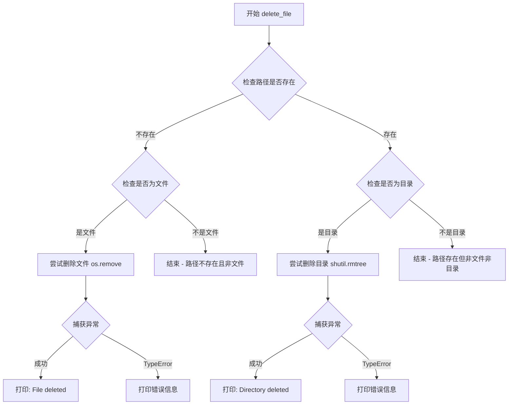

# `MinerU\tests\clean_coverage.py` 详细设计文档

这是一个清理coverage报告的工具脚本，通过调用系统API删除指定的文件或目录，并处理可能出现的异常情况。

## 整体流程

```mermaid
graph TD
    A[开始] --> B{os.path.exists(path)?}
    B -- 否 --> C{os.path.isfile(path)?}
    C -- 是 --> D[调用os.remove删除文件]
    C -- 否 --> E{os.path.isdir(path)?}
    E -- 是 --> F[调用shutil.rmtree递归删除目录]
    E -- 否 --> G[结束]
    B -- 是 --> C
    D --> H[打印删除成功消息]
    F --> I[打印删除成功消息]
    H --> G
    I --> J[捕获TypeError异常]
    J --> K[打印错误消息]
    K --> G
```

## 类结构

```
无类层次结构（脚本文件）
```

## 全局变量及字段


### `htmlcov/`
    
要删除的目录路径

类型：`str`
    


    

## 全局函数及方法


### `delete_file`

该函数是一个全局函数，用于删除指定的文件或目录。如果目标是文件，则使用 `os.remove()` 删除；如果是目录，则使用 `shutil.rmtree()` 递归删除。同时包含基本的错误处理和日志输出。

参数：

- `path`：`str`，要删除的文件或目录的路径

返回值：`None`，该函数没有返回值，仅通过 print 输出操作结果

#### 流程图



#### 带注释源码

```python
def delete_file(path):
    """
    删除指定的文件或目录。
    
    Args:
        path: 要删除的文件或目录的路径
    """
    # 首先检查路径是否存在
    if not os.path.exists(path):
        # 路径不存在时，检查是否为文件（逻辑异常：路径不存在时 is_file 必然返回 False）
        if os.path.isfile(path):
            try:
                # 删除文件
                os.remove(path)
                print(f"File '{path}' deleted.")
            except TypeError as e:
                # 捕获删除文件时的 TypeError 异常
                print(f"Error deleting file '{path}': {e}")
    # 路径存在时，检查是否为目录
    elif os.path.isdir(path):
        try:
            # 递归删除目录及其所有内容
            shutil.rmtree(path)
            print(f"Directory '{path}' and its contents deleted.")
        except TypeError as e:
            # 捕获删除目录时的 TypeError 异常
            print(f"Error deleting directory '{path}': {e}")
```

## 关键组件


### delete_file 函数

核心删除功能实现，负责删除指定路径的文件或目录，包含存在性检查、类型判断和异常处理。

### 文件类型判断模块

通过 os.path.isfile() 和 os.path.isdir() 判断目标路径是文件还是目录，以决定使用 os.remove() 或 shutil.rmtree()。

### 异常处理机制

使用 try-except 捕获 TypeError 异常，处理删除过程中可能出现的错误，并打印错误信息。

### 主程序入口

if __name__ == "__main__" 块，用于演示 delete_file 函数的功能，调用删除 htmlcov/ 目录。

### os 和 shutil 模块依赖

分别提供文件系统操作（路径检查、文件删除）和目录树删除功能。

### 潜在技术债务

1. 异常类型捕获不全面，仅捕获 TypeError，应捕获更通用的 OSError
2. 路径存在性检查逻辑冗余，os.path.exists() 和 os.path.isfile() 可合并
3. 缺少返回值机制，调用者无法判断操作是否成功
4. 缺少日志记录机制，仅使用 print 输出
5. 函数设计为纯副作用操作，不符合函数式编程最佳实践


## 问题及建议


### 已知问题

-   **逻辑错误**：`if not os.path.exists(path)` 的判断逻辑完全错误。当文件不存在时条件为True，然后内部检查 `os.path.isfile(path)` 必然返回False，导致文件存在时反而进入错误分支，无法正确删除文件
-   **异常类型捕获错误**：捕获 `TypeError` 不当，`os.remove` 和 `shutil.rmtree` 可能抛出 `OSError`、`FileNotFoundError`、`PermissionError` 等，而非 `TypeError`
-   **无返回值机制**：函数无返回值，调用者无法得知删除操作是否成功
-   **函数命名不准确**：`delete_file` 函数名暗示仅删除文件，但实际可删除目录，命名具有误导性
-   **硬编码路径**：`"htmlcov/"` 路径硬编码在主程序中，缺乏灵活配置
-   **使用print而非日志**：使用 `print` 输出信息，不利于生产环境日志管理
-   **缺少类型注解**：无Python类型提示，降低代码可读性和IDE支持
-   **被注释代码未清理**：`#delete_file(".coverage")` 注释代码遗留，若需删除coverage文件应取消注释或移除

### 优化建议

-   修正逻辑判断为 `if os.path.exists(path):`，或分别判断文件和目录处理
-   捕获更具体的异常类型如 `OSError`、`FileNotFoundError`，或使用 `Exception` 捕获所有异常
-   为函数添加布尔返回值或抛出自定义异常以反馈操作结果
-   重命名函数为 `delete_path` 或 `remove_path` 以准确反映功能
-   考虑将路径作为参数传入或使用配置文件管理
-   替换 `print` 为 `logging` 模块进行日志记录
-   添加函数参数和返回值的类型注解
-   清理被注释的代码或明确其用途

## 其它


### 设计目标与约束

该代码的核心目标是通过Python脚本清理代码覆盖率相关的文件或目录。约束条件包括：仅支持文件和目录的删除操作，不支持递归保留特定文件；依赖Python标准库（os、shutil）；在Windows和Linux平台均可运行。

### 错误处理与异常设计

代码中使用了try-except块捕获TypeError异常，但存在以下问题：异常类型捕获不准确（os.remove和shutil.rmtree可能抛出OSError而非TypeError）；缺少对其他可能异常（PermissionError、FileNotFoundError等）的处理；异常信息打印后未进行进一步处理或日志记录。建议增加更全面的异常捕获和日志记录机制。

### 数据流与状态机

数据流：输入参数path → 检查路径是否存在 → 判断是文件还是目录 → 执行相应的删除操作 → 输出结果。状态机相对简单，主要包含两个状态：文件删除流程和目录删除流程。

### 外部依赖与接口契约

外部依赖：Python标准库os和shutil模块。接口契约：delete_file函数接受一个字符串类型的path参数，无返回值（仅打印信息）。未来可考虑增加回调函数支持、删除前确认机制等扩展接口。

### 性能考虑

当前实现使用shutil.rmtree删除目录，该方法会递归删除所有子目录和文件。对于大型目录，可能需要考虑进度显示、异步删除或分批删除等优化方案。当前代码为同步执行，阻塞主线程。

### 安全性考虑

代码存在潜在安全风险：直接接受用户输入的路径并执行删除操作，可能导致误删重要文件。建议增加路径验证、白名单机制、删除前确认提示等功能。当前代码未检查路径是否在特定目录下，可能发生路径穿越攻击。

### 可测试性

代码可测试性较差，主要问题包括：print语句输出难以进行单元测试；函数无返回值，无法验证执行结果；直接使用os和shutil模块，缺乏依赖注入。建议重构为可注入依赖的模块化设计，增加返回值或状态对象，便于单元测试。

### 日志与监控

当前仅使用print输出基本信息，缺少结构化日志。建议引入logging模块，实现不同级别的日志记录（DEBUG、INFO、WARNING、ERROR），并记录操作时间戳、操作用户等信息，便于审计和追踪。

### 兼容性考虑

代码使用Python 3标准库，兼容Python 3.6+版本。跨平台兼容性较好，但需注意Windows和Linux对路径分隔符、处理权限的差异。建议增加平台特定处理或使用pathlib模块提升兼容性。

### 部署与配置

该脚本为独立Python文件，部署简单。建议增加：命令行参数解析（argparse）支持自定义删除路径、添加--dry-run模式、配置文件支持等。当前代码在if __name__ == "__main__"块中硬编码了删除路径，不够灵活。

### 扩展性建议

当前功能单一，仅支持基本删除操作。可扩展方向包括：支持多个路径批量删除；增加通配符匹配；支持删除前备份；增加统计信息（删除文件数量、释放空间等）；支持排除特定文件或目录。


    