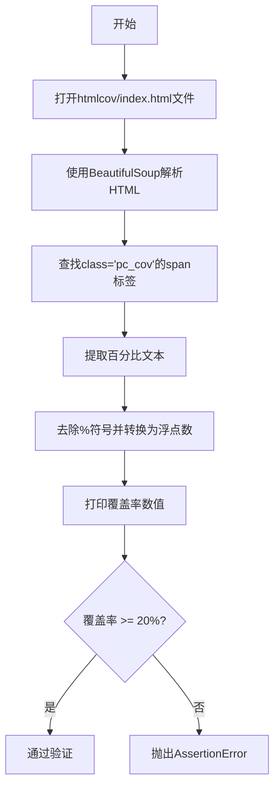
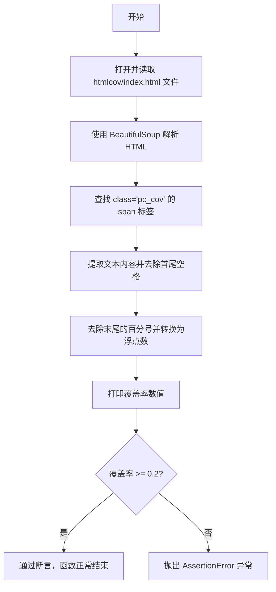

# `MinerU\tests\get_coverage.py` 详细设计文档

该脚本用于读取HTML格式的代码覆盖率报告，解析其中的覆盖率百分比数值，并断言覆盖率是否达到20%的最低要求。

## 整体流程



## 类结构

```
模块级
└── get_covrage (函数)
```

## 全局变量及字段


### `html_content`
    
从文件读取的HTML内容字符串

类型：`str`
    


### `soup`
    
用于解析HTML文档的BeautifulSoup对象

类型：`BeautifulSoup`
    


### `pc_cov_span`
    
查找到的包含pc_cov类的span标签元素

类型：`Tag`
    


### `percentage_value`
    
从span标签提取的覆盖率百分比文本

类型：`str`
    


### `percentage_float`
    
转换后的浮点数类型的覆盖率值

类型：`float`
    


    

## 全局函数及方法


### `get_covrage`

该函数用于读取HTML格式的代码覆盖率报告文件，解析其中的覆盖率百分比数值，并验证覆盖率是否达到预设的阈值（20%）。

参数：

- 该函数无参数

返回值：`float`，返回解析得到的覆盖率百分比浮点数（范围0-100）

#### 流程图



#### 带注释源码

```python
"""
get cov
"""
from bs4 import BeautifulSoup  # 导入BeautifulSoup库用于HTML解析
import shutil  # 导入shutil库（虽然当前代码中未使用）

def get_covrage():
    """获取代码覆盖率并验证是否达到阈值"""
    # 发送请求获取网页内容
    # 打开HTML覆盖率报告文件，读取其全部内容
    html_content = open("htmlcov/index.html", "r", encoding="utf-8").read()
    
    # 使用html.parser解析器创建BeautifulSoup对象
    soup = BeautifulSoup(html_content, 'html.parser')

    # 查找包含"pc_cov"的span标签
    # 在HTML中定位显示百分比覆盖率的元素
    pc_cov_span = soup.find('span', class_='pc_cov')

    # 提取百分比值
    # 获取span标签的文本内容并去除首尾空白字符
    percentage_value = pc_cov_span.text.strip()
    
    # 去除末尾的百分号符号，并转换为浮点数类型
    percentage_float = float(percentage_value.rstrip('%'))
    
    # 打印覆盖率数值用于调试和日志记录
    print ("percentage_float:", percentage_float)
    
    # 断言验证覆盖率是否达到20%的最低要求
    # 如果未达到则会抛出AssertionError异常
    assert percentage_float >= 0.2

if __name__ == '__main__':
    # 模块入口，调用主函数
    get_covrage()
```

## 关键组件


### HTML覆盖率文件读取与解析

该组件负责读取本地HTML覆盖率报告文件，并使用BeautifulSoup库进行解析，提取所需的覆盖率数据。

### 覆盖率百分比提取

该组件从HTML中定位特定的span元素（class为'pc_cov'），提取其中的文本内容，并将其转换为浮点数格式，以便进行数值比较和验证。

### 覆盖率阈值验证

该组件通过断言机制验证提取的覆盖率是否达到预设的0.2（20%）阈值，确保代码覆盖率符合项目要求。


## 问题及建议


### 已知问题

-   **文件句柄未正确关闭**：使用`open()`未配合`with`语句，可能导致文件句柄泄漏
-   **异常处理缺失**：文件读取、HTML解析、DOM元素查找过程中均无异常捕获，程序可能直接崩溃
-   **变量可能为`None`**：`soup.find()`可能返回`None`，直接访问`.text`会触发`AttributeError`
-   **硬编码路径**：文件路径`htmlcov/index.html`写死在代码中，缺乏灵活性
-   **注释与实现不符**：注释声称"发送请求获取网页内容"，实际是从本地文件读取
-   **硬编码阈值**：断言阈值`0.2`直接写在代码中，缺乏配置管理
-   **函数无返回值**：获取到的覆盖率值未返回，调用方无法使用该数据
-   **缺少类型注解**：函数参数和返回值缺乏类型提示，影响可维护性
-   **无日志记录**：使用`print`调试，线上环境缺乏有效日志

### 优化建议

-   使用`with open()`上下文管理器确保文件正确关闭
-   添加`try-except`捕获`FileNotFoundError`、`FeatureNotFound`等异常
-   对`soup.find()`结果进行`None`检查后再访问属性
-   将文件路径改为函数参数或配置文件
-   修正注释描述，使其与实际实现一致
-   将阈值定义为常量或配置项
-   返回覆盖率浮点数值供调用方使用
-   添加类型注解（`-> float`）
-   使用`logging`模块替代`print`进行日志输出

## 其它


### 设计目标与约束

该代码的核心目标是从本地HTML覆盖率报告中提取覆盖率百分比，并验证其是否达到最低阈值（20%）。设计约束包括：1) 依赖本地文件系统中的htmlcov/index.html文件；2) 使用固定的HTML解析方式（BeautifulSoup+html.parser）；3) 硬编码的阈值判断逻辑。

### 错误处理与异常设计

代码存在多处错误处理缺陷：1) 文件读取未使用with语句，可能导致文件句柄泄漏；2) 未处理文件不存在异常（FileNotFoundError）；3) 未处理BeautifulSoup解析异常；4) 未处理pc_cov_span为None的情况（导致AttributeError）；5) 断言失败时仅抛出AssertionError，缺乏明确的异常信息。建议增加try-except捕获FileNotFoundError、HTML解析错误、空值访问错误，并提供有意义的错误消息。

### 外部依赖与接口契约

外部依赖包括：1) BeautifulSoup4（bs4库）用于HTML解析；2) Python内置open函数用于文件读取。接口契约：输入为本地文件系统路径"htmlcov/index.html"，输出为覆盖率百分比浮点数。需要确保htmlcov/index.html文件存在且格式符合预期（包含class='pc_cov'的span标签）。

### 性能考虑

当前代码在文件较小时性能可接受，但存在优化空间：1) 文件读取后未关闭文件句柄；2) 可考虑使用with语句自动管理资源；3) 对于大文件可以考虑流式读取但本场景不适用。

### 安全性考虑

代码存在安全风险：1) 硬编码文件路径"htmlcov/index.html"，缺乏路径验证；2) 未验证HTML内容是否包含恶意脚本（虽然使用html.parser相对安全）；3) 建议增加路径存在性检查和文件大小限制。

### 可维护性与扩展性

可维护性问题：1) 硬编码的文件路径、class名称、阈值等Magic Number分散在代码中；2) 缺乏配置管理机制；3) 阈值0.2应该作为配置参数而非硬编码。扩展性建议：可将文件路径、class名称、阈值等提取为配置参数或函数参数，增加对不同覆盖率报告格式的适配能力。

### 测试策略

当前代码缺乏测试覆盖。建议增加：1) 单元测试模拟不同HTML内容；2) 测试文件不存在场景；3) 测试pc_cov标签缺失场景；4) 测试不同百分比格式（整数、小数、边界值）；5) 使用mock替代真实文件读取。

### 配置与参数

当前配置均为硬编码：1) 文件路径：htmlcov/index.html；2) CSS类名：pc_cov；3) 覆盖率阈值：0.2（20%）；4) 解析器：html.parser。建议将这些值提取为配置文件或环境变量。

### 日志与监控

代码缺乏日志输出，仅使用print语句输出percentage_float。建议增加标准日志记录（logging模块），记录关键操作节点、异常信息、覆盖率值等，便于问题排查和监控。

### 部署与运行环境

运行环境要求：1) Python 3.x；2) 安装bs4库（pip install beautifulsoup4）；3) 工作目录下存在htmlcov/index.html文件。部署时需确保文件路径正确，并处理文件不存在的情况。

    