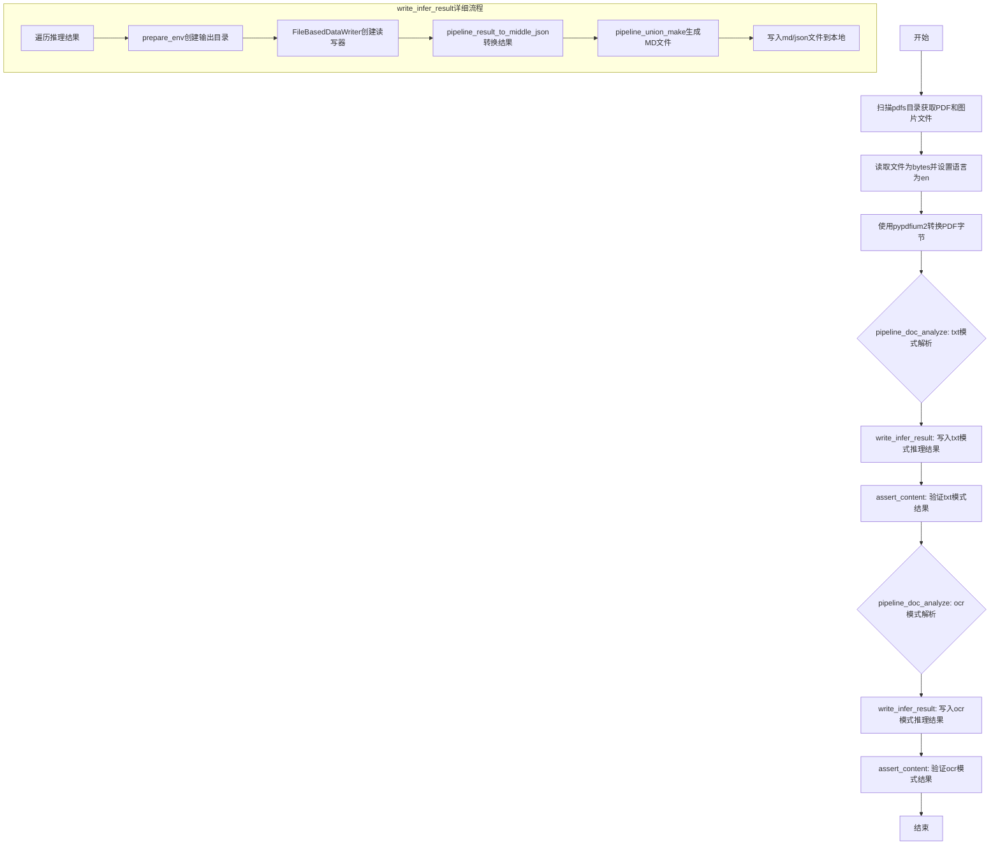
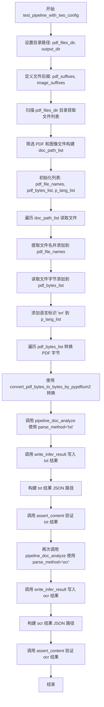
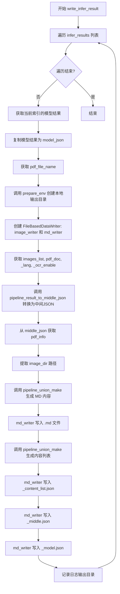
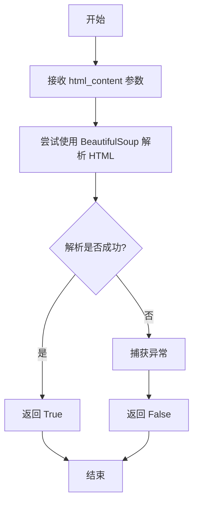

# `MinerU\tests\unittest\test_e2e.py` 详细设计文档

这是一个PDF文档解析测试文件，通过调用mineru后端pipeline模块，对PDF文件进行txt和ocr两种方式的解析，生成包含文本、表格、图片、公式等元素的中间JSON和Markdown文件，并进行结果验证。

## 整体流程



## 类结构

```
该文件为测试模块，无类定义
纯函数模块，包含4个全局函数
```

## 全局变量及字段


### `__dir__`
    
当前文件所在目录的绝对路径

类型：`str`
    


### `pdf_files_dir`
    
PDF测试文件所在目录路径

类型：`str`
    


### `output_dir`
    
测试输出结果的目标目录路径

类型：`str`
    


### `pdf_suffixes`
    
PDF文件的后缀名列表

类型：`list[str]`
    


### `image_suffixes`
    
图像文件的后缀名列表

类型：`list[str]`
    


### `doc_path_list`
    
待处理的文档路径对象列表

类型：`list[Path]`
    


### `pdf_file_names`
    
PDF文件的名称列表（不含后缀）

类型：`list[str]`
    


### `pdf_bytes_list`
    
PDF文件的字节数据列表

类型：`list[bytes]`
    


### `p_lang_list`
    
PDF文档对应的语言列表

类型：`list[str]`
    


### `new_pdf_bytes`
    
经过pypdfium2转换后的PDF字节数据

类型：`bytes`
    


### `infer_results`
    
pipeline分析的推理结果列表

类型：`list`
    


### `all_image_lists`
    
所有文档中提取的图像列表

类型：`list[list]`
    


### `all_pdf_docs`
    
所有PDF文档对象列表

类型：`list`
    


### `lang_list`
    
解析时使用的语言列表

类型：`list[str]`
    


### `ocr_enabled_list`
    
OCR功能启用状态列表

类型：`list[bool]`
    


### `res_json_path`
    
结果JSON文件的绝对路径

类型：`str`
    


### `content_list`
    
从JSON文件读取的内容列表

类型：`list[dict]`
    


### `type_set`
    
内容类型集合，用于验证内容多样性

类型：`set[str]`
    


### `content_dict`
    
单个内容项的字典，包含类型和详情

类型：`dict`
    


### `model_json`
    
推理结果的深拷贝，用于写入文件

类型：`dict`
    


### `pdf_file_name`
    
当前处理的PDF文件名（不含后缀）

类型：`str`
    


### `local_image_dir`
    
本地图像输出的目标目录路径

类型：`str`
    


### `local_md_dir`
    
本地Markdown文件输出的目标目录路径

类型：`str`
    


### `image_writer`
    
用于写入图像文件的数据写入器

类型：`FileBasedDataWriter`
    


### `md_writer`
    
用于写入Markdown文件的数据写入器

类型：`FileBasedDataWriter`
    


### `images_list`
    
当前文档中提取的图像列表

类型：`list`
    


### `pdf_doc`
    
当前PDF文档对象

类型：`object`
    


### `_lang`
    
当前文档的语言设置

类型：`str`
    


### `_ocr_enable`
    
当前文档是否启用OCR

类型：`bool`
    


### `middle_json`
    
中间JSON格式的解析结果

类型：`dict`
    


### `pdf_info`
    
PDF文档信息字典，包含页面和元素数据

类型：`dict`
    


### `image_dir`
    
图像目录的基础路径（用于Markdown引用）

类型：`str`
    


### `md_content_str`
    
生成的Markdown格式内容字符串

类型：`str`
    


### `html_content`
    
待验证的HTML内容字符串

类型：`str`
    


### `soup`
    
BeautifulSoup解析后的HTML文档对象

类型：`BeautifulSoup`
    


### `target_str_list`
    
用于内容验证的目标字符串列表

类型：`list[str]`
    


### `correct_count`
    
匹配正确的目标字符串数量

类型：`int`
    


### `target_str`
    
当前正在检查的目标字符串

类型：`str`
    


    

## 全局函数及方法


### `test_pipeline_with_two_config`

该函数是一个测试函数，用于测试管道（pipeline）的两种配置（txt 和 ocr 解析方法）。它会扫描指定目录下的 PDF 和图像文件，分别使用 txt 和 ocr 两种解析方法对文档进行分析，然后将结果写入输出目录，并使用 assert_content 函数对结果进行验证。

参数： 无

返回值：`None`，该函数没有返回值，仅执行测试逻辑

#### 流程图



#### 带注释源码

```python
def test_pipeline_with_two_config():
    """
    测试管道在两种配置下的功能：txt 和 ocr 解析方法
    该函数扫描 PDF 目录，分别使用两种方法进行分析并验证结果
    """
    # 获取当前文件所在目录
    __dir__ = os.path.dirname(os.path.abspath(__file__))
    # 构建 PDF 文件目录路径
    pdf_files_dir = os.path.join(__dir__, "pdfs")
    # 构建输出目录路径
    output_dir = os.path.join(__dir__, "output")
    # 定义 PDF 文件后缀列表
    pdf_suffixes = [".pdf"]
    # 定义图像文件后缀列表
    image_suffixes = [".png", ".jpeg", ".jpg"]

    # 初始化文档路径列表
    doc_path_list = []
    # 遍历 PDF 目录下的所有文件
    for doc_path in Path(pdf_files_dir).glob("*"):
        # 检查文件后缀是否在 PDF 或图像后缀列表中
        if doc_path.suffix in pdf_suffixes + image_suffixes:
            doc_path_list.append(doc_path)

    # 注释：可以取消注释以使用 modelscope 作为模型源
    # os.environ["MINERU_MODEL_SOURCE"] = "modelscope"

    # 初始化文件名、PDF 字节和语言列表
    pdf_file_names = []
    pdf_bytes_list = []
    p_lang_list = []
    # 遍历文档路径列表，读取每个文件
    for path in doc_path_list:
        # 获取文件名（不含后缀）
        file_name = str(Path(path).stem)
        # 读取文件为字节
        pdf_bytes = read_fn(path)
        # 添加文件名到列表
        pdf_file_names.append(file_name)
        # 添加文件字节到列表
        pdf_bytes_list.append(pdf_bytes)
        # 添加语言标识 'en' 到列表
        p_lang_list.append("en")
    
    # 遍历 PDF 字节列表，使用 pypdfium2 转换每个 PDF
    for idx, pdf_bytes in enumerate(pdf_bytes_list):
        new_pdf_bytes = convert_pdf_bytes_to_bytes_by_pypdfium2(pdf_bytes)
        pdf_bytes_list[idx] = new_pdf_bytes

    # 调用 pipeline_doc_analyze 使用 txt 解析方法进行分析
    # 获取推理结果、图像列表、PDF 文档、语言列表和 OCR 启用状态列表
    infer_results, all_image_lists, all_pdf_docs, lang_list, ocr_enabled_list = (
        pipeline_doc_analyze(
            pdf_bytes_list,
            p_lang_list,
            parse_method="txt",
        )
    )
    # 写入 txt 方法的推理结果
    write_infer_result(
        infer_results,
        all_image_lists,
        all_pdf_docs,
        lang_list,
        ocr_enabled_list,
        pdf_file_names,
        output_dir,
        parse_method="txt",
    )
    # 构建 txt 结果 JSON 文件路径
    res_json_path = (
        Path(__file__).parent / "output" / "test" / "txt" / "test_content_list.json"
    ).as_posix()
    # 验证 txt 方法的结果内容
    assert_content(res_json_path, parse_method="txt")
    
    # 再次调用 pipeline_doc_analyze 使用 ocr 解析方法进行分析
    infer_results, all_image_lists, all_pdf_docs, lang_list, ocr_enabled_list = (
        pipeline_doc_analyze(
            pdf_bytes_list,
            p_lang_list,
            parse_method="ocr",
        )
    )
    # 写入 ocr 方法的推理结果
    write_infer_result(
        infer_results,
        all_image_lists,
        all_pdf_docs,
        lang_list,
        ocr_enabled_list,
        pdf_file_names,
        output_dir,
        parse_method="ocr",
    )
    # 构建 ocr 结果 JSON 文件路径
    res_json_path = (
        Path(__file__).parent / "output" / "test" / "ocr" / "test_content_list.json"
    ).as_posix()
    # 验证 ocr 方法的结果内容
    assert_content(res_json_path, parse_method="ocr")
```


### `write_infer_result`

该函数接收PDF解析后的推理结果、图像列表、PDF文档、语言配置、OCR配置等数据，遍历每个PDF文件，将其转换为中间JSON格式，并根据指定的解析模式生成Markdown文档、内容列表、模型JSON和中间JSON文件，最终写入到指定的输出目录中。

参数：

- `infer_results`：`List[Any]`，PDF分析推理结果列表，每个元素对应一个PDF文件的模型输出
- `all_image_lists`：`List[List[str]]`，所有PDF对应的图像列表，包含每个PDF中提取的图像路径
- `all_pdf_docs`：`List[Any]`，所有PDF文档对象列表，用于访问PDF的页面和内容信息
- `lang_list`：`List[str]`，语言列表，指定每个PDF文档的语言（如"en"、"zh"等）
- `ocr_enabled_list`：`List[bool]`，OCR启用标志列表，指定是否为每个PDF启用OCR功能
- `pdf_file_names`：`List[str]`，PDF文件名列表，用于构建输出文件的命名
- `output_dir`：`str`，输出目录的根路径，所有生成的文件将保存在此目录下
- `parse_method`：`str`，解析方法标识符，指定使用哪种解析方式（如"txt"、"ocr"、"vlm"等）

返回值：`None`，该函数无返回值，直接将结果写入文件系统

#### 流程图



#### 带注释源码

```python
def write_infer_result(
    infer_results,
    all_image_lists,
    all_pdf_docs,
    lang_list,
    ocr_enabled_list,
    pdf_file_names,
    output_dir,
    parse_method,
):
    """将PDF推理结果写入到输出目录的各个文件中
    
    Args:
        infer_results: PDF分析推理结果列表
        all_image_lists: 所有PDF的图像列表
        all_pdf_docs: 所有PDF文档对象
        lang_list: 语言列表
        ocr_enabled_list: OCR启用列表
        pdf_file_names: PDF文件名列表
        output_dir: 输出目录
        parse_method: 解析方法
    """
    # 遍历每个PDF文件的推理结果
    for idx, model_list in enumerate(infer_results):
        # 深拷贝模型结果，保留原始数据用于写入
        model_json = copy.deepcopy(model_list)
        # 获取当前PDF的文件名
        pdf_file_name = pdf_file_names[idx]
        
        # 准备输出环境，创建本地图像和MD文件目录
        local_image_dir, local_md_dir = prepare_env(
            output_dir, pdf_file_name, parse_method
        )
        
        # 创建数据写入器，用于写入图像和MD文件
        image_writer, md_writer = FileBasedDataWriter(
            local_image_dir
        ), FileBasedDataWriter(local_md_dir)

        # 获取当前PDF对应的图像列表、PDF文档、语言和OCR配置
        images_list = all_image_lists[idx]
        pdf_doc = all_pdf_docs[idx]
        _lang = lang_list[idx]
        _ocr_enable = ocr_enabled_list[idx]
        
        # 将模型结果转换为中间JSON格式
        middle_json = pipeline_result_to_middle_json(
            model_list,
            images_list,
            pdf_doc,
            image_writer,
            _lang,
            _ocr_enable,
            True,
        )

        # 从中间JSON中获取PDF信息
        pdf_info = middle_json["pdf_info"]

        # 获取图像目录的相对路径
        image_dir = str(os.path.basename(local_image_dir))
        
        # 生成Markdown格式内容
        md_content_str = pipeline_union_make(pdf_info, MakeMode.MM_MD, image_dir)
        # 写入MD文件
        md_writer.write_string(
            f"{pdf_file_name}.md",
            md_content_str,
        )

        # 生成内容列表（用于后续验证）
        content_list = pipeline_union_make(pdf_info, MakeMode.CONTENT_LIST, image_dir)
        # 写入内容列表JSON文件
        md_writer.write_string(
            f"{pdf_file_name}_content_list.json",
            json.dumps(content_list, ensure_ascii=False, indent=4),
        )

        # 写入中间JSON文件（包含完整的PDF结构信息）
        md_writer.write_string(
            f"{pdf_file_name}_middle.json",
            json.dumps(middle_json, ensure_ascii=False, indent=4),
        )

        # 写入模型JSON文件（原始推理结果）
        md_writer.write_string(
            f"{pdf_file_name}_model.json",
            json.dumps(model_json, ensure_ascii=False, indent=4),
        )

        # 记录本地输出目录信息
        logger.info(f"local output dir is {local_md_dir}")
```


### `validate_html`

该函数用于验证 HTML 内容的有效性，通过使用 BeautifulSoup 解析器尝试解析给定的 HTML 字符串，如果解析成功则返回 True，否则捕获异常并返回 False。

参数：

- `html_content`：`str`，待验证的 HTML 内容字符串

返回值：`bool`，表示 HTML 内容是否有效（True 为有效，False 为无效）

#### 流程图



#### 带注释源码

```python
def validate_html(html_content):
    """
    验证 HTML 内容的有效性
    
    参数:
        html_content: 待验证的 HTML 内容字符串
    
    返回值:
        bool: HTML 内容是否有效
    """
    try:
        # 使用 BeautifulSoup 的 html.parser 解析器尝试解析 HTML 内容
        soup = BeautifulSoup(html_content, "html.parser")
        # 解析成功，返回 True
        return True
    except Exception as e:
        # 解析失败，捕获异常并返回 False
        return False
```


### `assert_content`

该函数用于验证解析结果文件的内容是否符合预期，通过对不同类型的内容（图片、表格、公式、文本）进行断言校验，确保解析输出的质量。

参数：

- `content_path`：`str`，待验证的 JSON 文件路径
- `parse_method`：`str`，解析方法，默认为 "txt"，可选值包括 "txt"、"ocr"、"vlm"

返回值：`None`，该函数通过断言进行验证，不返回任何值

#### 流程图

```mermaid
flowchart TD
    A[开始 assert_content] --> B[读取JSON文件]
    B --> C[初始化空集合 type_set]
    C --> D[遍历 content_list]
    D --> E{匹配 content_dict['type']}
    
    E -->|image| F[图片校验]
    F --> F1[添加 'image' 到 type_set]
    F1 --> F2[使用 fuzz.ratio 校验 image_caption]
    F2 --> F3[断言相似度 > 90]
    F3 --> K
    
    E -->|table| G[表格校验]
    G --> G1[添加 'table' 到 type_set]
    G1 --> G2[使用 fuzz.ratio 校验 table_caption]
    G2 --> G3[断言相似度 > 90]
    G3 --> G4[调用 validate_html 校验 table_body]
    G4 --> G5[校验表格内容包含目标字符串]
    G5 --> G6{parse_method 类型}
    G6 -->|txt 或 ocr| G7[断言正确率 > 90%]
    G6 -->|vlm| G8[断言正确率 > 70%]
    G7 --> K
    G8 --> K
    
    E -->|equation| H[公式校验]
    H --> H1[添加 'equation' 到 type_set]
    H1 --> H2[校验 text 包含目标字符串]
    H2 --> H3[目标字符串: $$, lambda, frac, bar]
    H3 --> K
    
    E -->|text| I[文本校验]
    I --> I1[添加 'text' 到 type_set]
    I1 --> I2[使用 fuzz.ratio 校验文本内容]
    I2 --> I3[断言相似度 > 90]
    I3 --> K
    
    K{遍历结束}
    K -->|是| L[断言 type_set 长度 >= 4]
    L --> M[结束]
```

#### 带注释源码

```python
def assert_content(content_path, parse_method="txt"):
    """
    验证解析结果文件的内容是否符合预期
    
    参数:
        content_path: str, 待验证的JSON文件路径
        parse_method: str, 解析方法，默认为"txt"，可选"txt"/"ocr"/"vlm"
    """
    # 读取JSON文件并加载内容列表
    content_list = []
    with open(content_path, "r", encoding="utf-8") as file:
        content_list = json.load(file)
        logger.info(content_list)
    
    # 用于记录已校验的内容类型
    type_set = set()
    
    # 遍历每个内容项进行类型匹配和校验
    for content_dict in content_list:
        match content_dict["type"]:
            # 图片校验：只校验 Caption
            case "image":
                type_set.add("image")
                assert (
                    fuzz.ratio(
                        content_dict["image_caption"][0],  # 提取图片标题
                        "Figure 1: Figure Caption",         # 预期标题
                    )
                    > 90  # 相似度阈值
                )
            
            # 表格校验：校验 Caption、表格格式和表格内容
            case "table":
                type_set.add("table")
                # 校验表格标题
                assert (
                    fuzz.ratio(
                        content_dict["table_caption"][0],  # 提取表格标题
                        "Table 1: Table Caption",          # 预期标题
                    )
                    > 90
                )
                # 校验 HTML 表格格式
                assert validate_html(content_dict["table_body"])
                
                # 预期表格内容关键词列表
                target_str_list = [
                    "Model", "Testing", "Error", "Linear",
                    "Regression", "0.98740", "1321.2", "Gray",
                    "Prediction", "0.00617", "687"
                ]
                
                # 统计匹配的正确率
                correct_count = 0
                for target_str in target_str_list:
                    if target_str in content_dict["table_body"]:
                        correct_count += 1
                
                # 根据解析方法设置不同的正确率阈值
                if parse_method == "txt" or parse_method == "ocr":
                    assert correct_count > 0.9 * len(target_str_list)  # 90%阈值
                elif parse_method == "vlm":
                    assert correct_count > 0.7 * len(target_str_list)  # 70%阈值
                else:
                    assert False
            
            # 公式校验：检测是否含有公式元素
            case "equation":
                type_set.add("equation")
                # 预期公式包含的关键词
                target_str_list = ["$$", "lambda", "frac", "bar"]
                for target_str in target_str_list:
                    assert target_str in content_dict["text"]
            
            # 文本校验：文本相似度超过90
            case "text":
                type_set.add("text")
                assert (
                    fuzz.ratio(
                        content_dict["text"],  # 实际文本内容
                        "Trump graduated from the Wharton School of the University of Pennsylvania with a bachelor's degree in 1968. He became president of his father's real estate business in 1971 and renamed it The Trump Organization."  # 预期文本
                    )
                    > 90  # 相似度阈值
                )
    
    # 确保至少包含4种内容类型（image/table/equation/text）
    assert len(type_set) >= 4
```

## 关键组件


### PDF字节转换组件

使用pypdfium2库将PDF字节转换为处理所需的字节格式，支持PDF文件的预处理。

### 管道文档分析组件

支持两种解析方法（txt和ocr）的文档分析功能，分别调用pipeline_doc_analyze进行推理，返回推理结果、图像列表、PDF文档、语言列表和OCR启用状态。

### 推理结果写入组件

将模型推理结果转换为中间JSON格式，并生成多种输出文件（MD文档、内容列表JSON、中间JSON、模型JSON），同时管理图像和Markdown文件的写入。

### 内容断言验证组件

验证解析结果的准确性，包括图片标题、表格内容与格式、公式元素和文本相似度的校验，支持多种解析方法的阈值判断。

### HTML验证组件

使用BeautifulSoup验证HTML内容格式是否正确，用于表格body的格式校验。

### 多格式输出生成组件

根据MakeMode枚举生成不同格式的输出，包括MM_MD模式生成Markdown文档和CONTENT_LIST模式生成内容列表JSON。

### 图像目录管理组件

通过prepare_env函数准备输出环境，为每个PDF文件创建独立的图像目录和Markdown输出目录。


## 问题及建议


### 已知问题

-   **代码重复**：测试函数 `test_pipeline_with_two_config` 中对 txt 和 ocr 两种解析方法的处理逻辑几乎完全重复，只是结果路径和 `parse_method` 参数不同
-   **硬编码配置**：文件后缀、路径、阈值（如90%、70%）等配置以硬编码方式存在，缺乏灵活配置机制
-   **函数职责过重**：`write_infer_result` 函数同时负责环境准备、结果转换和多文件写入，违反单一职责原则
-   **缺少类型注解**：整个代码文件中没有使用类型注解，降低了代码的可读性和可维护性
-   **魔法数字与字符串**：断言中使用的目标字符串（如 "Trump graduated from..."）和阈值（如 90、70）散落在代码中，难以维护
-   **Python版本兼容性**：使用了 Python 3.10+ 的 match-case 语法，可能导致与旧版本 Python 不兼容
-   **未使用的导入**：`copy` 模块被导入但未使用
-   **缺乏错误处理**：`validate_html` 函数捕获异常后仅返回布尔值，未记录错误详情
-   **路径构造脆弱**：使用字符串拼接构造路径（如 `Path(__file__).parent / "output" / "test" / ...`），存在跨平台路径分隔符问题风险
-   **环境变量管理混乱**：重要的模型源配置（`MINERU_MODEL_SOURCE`）以注释形式存在，使用时需要手动修改代码

### 优化建议

-   将 txt 和 ocr 两种解析方法的测试逻辑抽取为通用函数，通过参数区分具体行为，减少代码重复
-   将配置项（文件后缀、阈值、路径模板等）提取为配置文件或常量类，统一管理
-   拆分 `write_infer_result` 为多个职责单一的函数：环境准备、结果转换、文件写入
-   为所有函数和参数添加类型注解，提高代码可读性
-   将魔法数字和字符串提取为常量或测试数据文件，便于维护和修改
-   将 match-case 替换为兼容性更好的 if-elif-else 结构，或明确声明 Python 版本要求
-   清理未使用的导入（如 `copy`）
-   增强 `validate_html` 函数的错误处理，记录具体的异常信息用于调试
-   使用 `pathlib` 或标准化的路径构建工具，确保跨平台兼容性
-   通过环境变量或配置文件管理模型源配置，避免修改源代码
-   添加适当的文档字符串（docstring）说明函数功能和参数含义
-   将被注释的 VLM 测试代码移除或完善，避免代码库中存在大量死代码


## 其它


### 设计目标与约束

**设计目标**：验证PDF文档解析pipeline的正确性，支持txt和ocr两种解析方法，确保输出内容（文本、图像、表格、公式）的完整性和准确性。

**技术约束**：
- 依赖pypdfium2进行PDF字节转换
- 依赖fuzzywuzzy进行字符串相似度校验
- 仅支持.pdf、.png、.jpeg、.jpg格式文件
- 输出目录固定为`output/test/{parse_method}/`

### 外部依赖与接口契约

**核心依赖**：
- `mineru.cli.common`: PDF读取与转换（`read_fn`, `convert_pdf_bytes_to_bytes_by_pypdfium2`, `prepare_env`）
- `mineru.data.data_reader_writer`: 文件写入（`FileBasedDataWriter`）
- `mineru.backend.pipeline.pipeline_analyze`: 文档解析（`pipeline_doc_analyze`）
- `mineru.backend.pipeline.pipeline_middle_json_mkcontent`: 内容生成（`pipeline_union_make`）
- `mineru.backend.pipeline.model_json_to_middle_json`: 结果转换（`pipeline_result_to_middle_json`）

**接口契约**：
- `pipeline_doc_analyze(pdf_bytes_list, p_lang_list, parse_method)` 返回 infer_results, all_image_lists, all_pdf_docs, lang_list, ocr_enabled_list
- `pipeline_result_to_middle_json(model_list, images_list, pdf_doc, image_writer, _lang, _ocr_enable, enable_matter)` 返回 middle_json

### 错误处理与异常设计

**异常捕获**：
- `validate_html`: 使用BeautifulSoup解析HTML，捕获解析异常返回False
- `assert_content`: 使用assert语句进行断言校验，失败时抛出AssertionError

**错误类型**：
- 文件不存在或格式不支持
- JSON解析失败
- 图像/表格/公式/文本内容校验失败
- 字符串相似度低于阈值

### 数据流与状态机

**数据流**：
1. 扫描pdfs目录获取文件列表
2. 读取PDF文件为字节流
3. 使用pypdfium2转换PDF字节
4. 调用pipeline_doc_analyze进行解析（支持txt/ocr模式）
5. 调用pipeline_result_to_middle_json转换为中间JSON
6. 调用pipeline_union_make生成MD和content_list
7. 写入输出文件（.md, .json）
8. 读取输出JSON进行内容校验

**处理状态**：
- READY → PROCESSING → WRITING → VALIDATING → DONE

### 性能优化与资源管理

**优化点**：
- PDF字节转换在循环中逐个处理，可考虑批量处理
- 使用copy.deepcopy复制model_list避免修改原始数据

**资源管理**：
- 使用with语句确保文件正确关闭
- FileBasedDataWriter管理图像和MD文件写入

### 安全性设计

**安全考虑**：
- 文件路径使用Path模块处理，避免路径注入
- JSON写入使用ensure_ascii=False支持Unicode
- 文件读取指定encoding="utf-8"

### 可测试性与测试策略

**单元测试**：
- `validate_html`: 测试有效/无效HTML解析
- `assert_content`: 测试各类型内容校验逻辑

**集成测试**：
- `test_pipeline_with_two_config`: 端到端测试txt和ocr两种解析模式

### 配置与环境

**环境变量**：
- `MINERU_MODEL_SOURCE`: 可设置为"modelscope"使用模型Scope源

**配置参数**：
- parse_method: "txt" | "ocr"
- 支持语言: "en"
- 相似度阈值: 90%（一般）、70%（vlm模式表格）
</think>
    