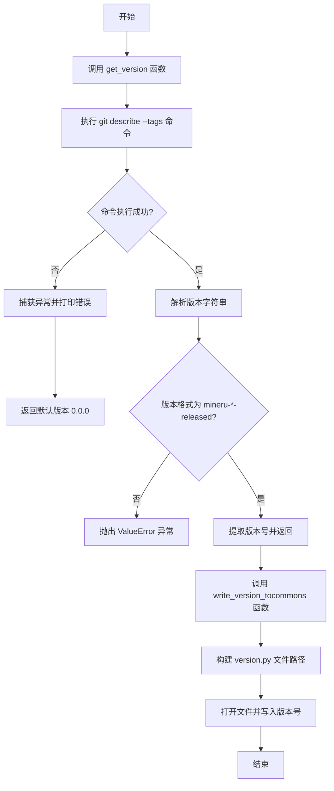

# `MinerU\update_version.py` 详细设计文档

这是一个版本管理脚本，用于从Git仓库获取版本标签并将其写入到mineru/version.py文件中，实现项目版本的自动提取和更新

## 整体流程



## 类结构

```
version_manager.py (主模块)
├── get_version (全局函数)
└── write_version_tocommons (全局函数)
```

## 全局变量及字段


### `version_name`
    
从 Git 标签获取的版本号字符串，用于写入版本文件

类型：`str`
    


    

## 全局函数及方法


### `get_version`

该函数通过执行 `git describe --tags` 命令获取当前代码库的版本标签，并按照特定格式（mineru-<version>-released）解析提取版本号，若执行失败或格式不匹配则返回默认版本 "0.0.0"。

参数： 无

返回值：`str`，解析得到的版本号字符串，若发生异常则返回默认版本 "0.0.0"

#### 流程图

```mermaid
flowchart TD
    A([Start get_version]) --> B[构建 git describe --tags 命令]
    B --> C[执行 subprocess.check_output]
    C --> D{命令执行成功?}
    D -->|是| E[解码并去除首尾空白]
    D -->|否| F[捕获异常并打印错误]
    F --> M[返回默认版本 "0.0.0"]
    M --> Z([End])
    E --> G[用 '-' 分割版本字符串]
    G --> H{格式验证: 分割后部分数>1 且 第一部分以'mineru'开头?}
    H -->|是| I[返回第二部分 version_parts[1]]
    H -->|否| J[抛出 ValueError 异常]
    J --> K[捕获 ValueError 异常]
    K --> L[打印异常信息]
    L --> M
    I --> Z
```

#### 带注释源码

```python
def get_version():
    """
    获取当前代码库的版本号。
    
    通过执行 git describe --tags 命令获取最新标签，
    并按照 mineru-<version>-released 格式解析提取版本号。
    
    Returns:
        str: 解析得到的版本号，若发生异常则返回 "0.0.0"
    """
    # 构建 git 命令列表，使用 git describe --tags 获取最近标签
    command = ["git", "describe", "--tags"]
    try:
        # 执行子进程命令，获取 git 标签输出
        version = subprocess.check_output(command).decode().strip()
        
        # 用 '-' 分割版本字符串，例如 "mineru-v1.2.3-5-released" -> ["mineru", "v1.2.3", "5", "released"]
        version_parts = version.split("-")
        
        # 验证版本格式：必须有多于1个部分，且第一部分以"mineru"开头
        if len(version_parts) > 1 and version_parts[0].startswith("mineru"):
            # 返回第二部分，即版本号（如 "v1.2.3"）
            return version_parts[1]
        else:
            # 格式不符合预期，抛出 ValueError
            raise ValueError(f"Invalid version tag {version}. Expected format is mineru-<version>-released.")
    except Exception as e:
        # 捕获所有异常，打印错误信息并返回默认版本号
        print(e)
        return "0.0.0"
```


### `write_version_to_commons`

该函数用于将版本号字符串写入到项目 Commons 目录下的 version.py 文件中，以便其他模块可以导入获取当前版本信息。

参数：

- `version`：`str`，需要写入的版本号字符串

返回值：`None`，该函数不返回任何值，仅执行文件写入操作

#### 流程图

```mermaid
flowchart TD
    A[开始] --> B[构建version.py文件路径]
    B --> C[打开文件并写入版本信息]
    C --> D[关闭文件]
    D --> E[结束]
    
    subgraph B
    B1[获取当前文件目录] --> B2[拼接mineru/version.py路径]
    end
    
    subgraph C
    C1[以写入模式打开文件] --> C2[格式化版本字符串为__version__ = \"version\"] --> C3[写入文件内容]
    end
```

#### 带注释源码

```python
def write_version_to_commons(version):
    """
    将版本号写入到 Commons 目录的 version.py 文件中
    
    参数:
        version: str, 要写入的版本号字符串
    """
    # 使用 os.path.join 构建完整的文件路径
    # __file__ 表示当前脚本的路径，dirname 获取其所在目录
    # 拼接得到 mineru/version.py 的完整路径
    commons_path = os.path.join(os.path.dirname(__file__), 'mineru', 'version.py')
    
    # 以写入模式打开文件（会覆盖原有内容）
    # 使用 with 语句确保文件正确关闭
    with open(commons_path, 'w') as f:
        # 写入 Python 模块格式的版本变量
        # 格式: __version__ = "x.x.x"
        f.write(f'__version__ = "{version}"\n')
```


## 关键组件


### Git版本获取组件

负责从Git仓库的标签中提取版本号，使用subprocess调用git describe --tags命令，并解析版本字符串格式。

### 版本解析与验证组件

负责解析版本字符串，验证是否符合"mineru-<version>-released"格式，并提取版本号部分。

### 版本文件写入组件

负责将获取到的版本号写入到mineru/version.py文件中，生成Python版本的__version__变量。

### 异常处理与降级组件

负责捕获版本获取过程中的各种异常（如Git命令失败、版本格式错误），并在异常情况下返回默认版本号"0.0.0"保证程序继续运行。

### 主流程协调组件

负责协调版本获取和版本写入的完整流程，作为脚本入口点串联各个功能模块。


## 问题及建议


### 已知问题

- **异常处理不当**：`get_version()` 函数捕获了所有异常后仅打印错误并返回默认值 "0.0.0"，掩盖了真实错误，且 "0.0.0" 本身也可能是有效版本号，导致调用方无法区分成功与失败
- **文件写入缺乏保护**：`write_version_to_commons()` 没有异常处理，若目标目录不存在或写入失败会导致程序直接崩溃
- **subprocess 调用缺少安全配置**：未设置超时时间、未处理 stderr 输出，git 命令执行失败时错误信息不完整
- **硬编码字符串分散**："mineru" 前缀和 "released" 后缀逻辑散落在代码中，若项目名称变更需多处修改
- **版本解析逻辑脆弱**：依赖特定格式 `mineru-<version>-released`，对格式变化的容错性差
- **缺少类型注解**：无函数参数和返回值类型声明，降低代码可读性和 IDE 支持
- **日志记录不规范**：使用 `print()` 调试，生产环境不利于日志收集和级别控制

### 优化建议

- 统一异常类型：为不同失败场景定义自定义异常类，让调用方能区分错误类型
- 文件操作增加异常处理：检查目录存在性、捕获 IOError，并提供清晰的失败原因
- 使用 `subprocess.run()` 替代 `check_output()`，设置超时、捕获 stderr
- 提取常量：定义 `PROJECT_NAME = "mineru"` 和 `VERSION_FORMAT = "released"` 常量
- 添加类型注解：使用 `typing.Optional[str]` 等提示返回值可能是 None
- 引入日志模块：使用 `logging` 替代 `print`，配置合理日志级别
- 返回值设计改进：让失败时返回 `None` 而非 magic string，或使用 Result 模式

## 其它


### 设计目标与约束

本代码的主要设计目标是通过Git标签自动获取项目版本号，并将其写入到Python版本文件中，实现版本号的自动化管理。约束条件包括：1）必须使用Git作为版本控制工具；2）版本标签必须符合mineru-<version>-released格式；3）版本文件必须位于mineru/version.py；4）需要在Python环境中执行。

### 错误处理与异常设计

代码采用异常捕获与默认值相结合的策略。get_version()函数中捕获所有Exception异常，当Git命令执行失败或版本标签格式不符合预期时，打印错误信息并返回默认值"0.0.0"。write_version_to_commons()函数未进行异常处理，可能存在文件写入失败时程序崩溃的风险。建议增加文件写入失败的异常捕获和处理机制。

### 数据流与状态机

数据流为：读取Git标签 → 解析版本字符串 → 验证格式 → 写入版本文件。无复杂状态机，仅包含两个顺序执行的状态：获取版本和写入版本。

### 外部依赖与接口契约

外部依赖包括：1）Git命令行工具（必须在系统PATH中）；2）Python标准库（os、subprocess）。接口契约：get_version()无参数输入，返回版本字符串；write_version_to_commons(version)接收版本字符串参数，无返回值。

### 安全性考虑

代码存在潜在安全风险：1）直接使用subprocess调用外部命令，未进行路径验证；2）文件写入路径使用__file__动态获取但未验证路径存在性；3）版本号直接写入文件未进行安全过滤。建议增加路径验证、输入校验和错误处理。

### 性能考虑

性能开销主要集中在Git命令执行上，为外部进程调用。文件写入操作频率很低（仅在构建时执行一次），性能影响可忽略。建议：避免频繁调用，可增加缓存机制。

### 可测试性

当前代码可测试性较差，主要问题：1）依赖外部Git命令和文件系统；2）未使用依赖注入；3）print和硬编码路径影响测试。建议：1）将Git命令执行和文件路径抽象为可mock的函数；2）使用临时目录进行文件操作测试；3）将返回值通过参数或配置注入。

### 部署和构建相关

本代码作为构建脚本使用，通常在CI/CD流水线或版本发布时执行一次。建议集成到项目构建系统中，如setup.py、pyproject.toml或Makefile中。

### 配置文件

当前无配置文件，所有配置硬编码。建议将可配置项提取：1）版本文件路径；2）版本标签前缀；3）版本号格式正则表达式；4）默认版本号。

### 兼容性考虑

当前兼容Python 3.x版本。跨平台兼容性依赖Git命令的可用性，在Windows、Linux、macOS上均可运行，但需要确保Git已安装并在PATH中。

    