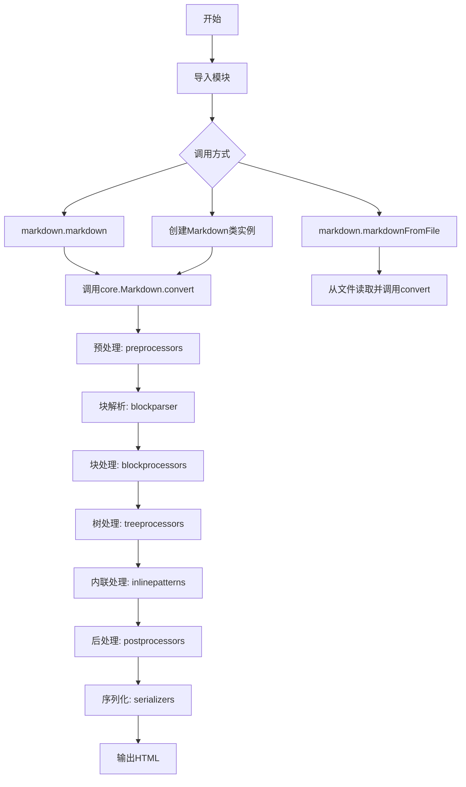
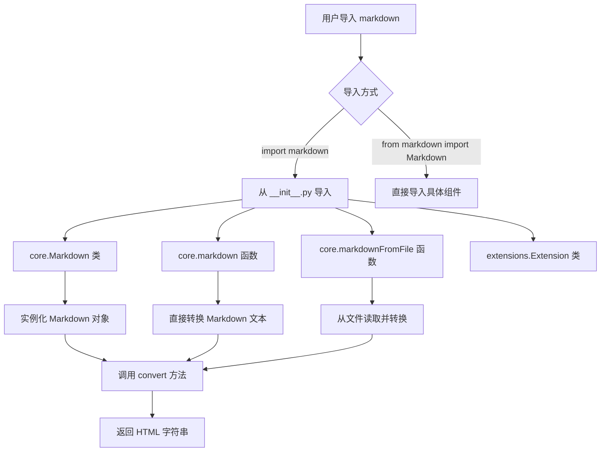
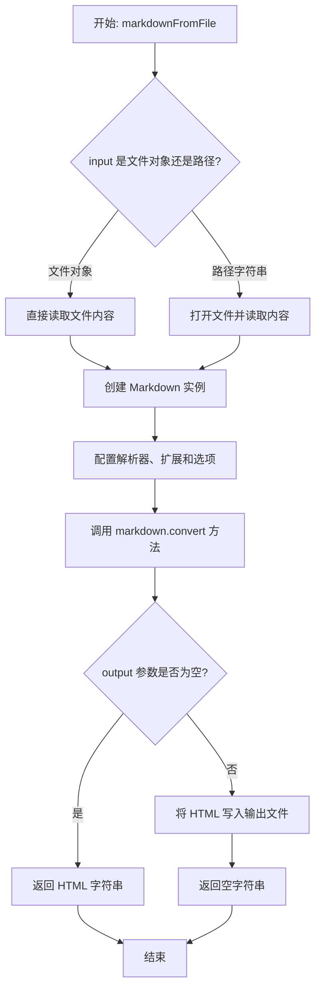
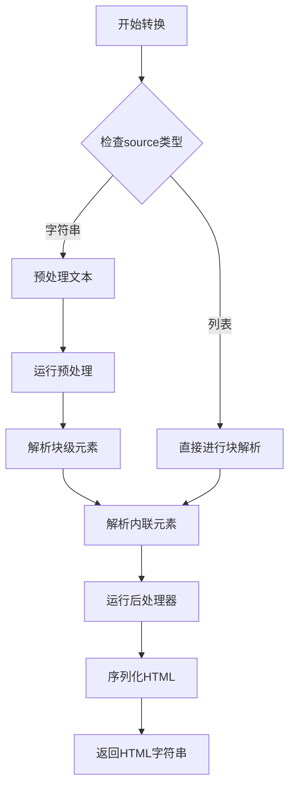

# `markdown\markdown\__init__.py` 详细设计文档

Python-Markdown是一个将Markdown文本转换为HTML的Python库，提供markdown()和markdownFromFile()两个公共函数以及Markdown类作为核心API，支持通过扩展机制进行功能定制。

## 整体流程



## 类结构

```
Markdown (核心类)
├── core (核心模块)
│   ├── Markdown
│   ├── parse_index
│   └── ... 
├── preprocessors (预处理器)
│   ├── Preprocessor
│   ├── HtmlBlockPreprocessor
│   └── ... 
├── blockparser (块解析器)
│   ├── BlockParser
│   └── ... 
├── blockprocessors (块处理器)
BlockProcessor
        │   ├── ListIndentProcessor
        │   └── ...
├── treeprocessors (树处理器)
TreeProcessor
        │   ├── InlineProcessor
        │   └── ...
├── inlinepatterns (内联模式)
Pattern
        │   ├── AutoLink
        │   └── ...
├── postprocessors (后处理器)
Postprocessor
        │   └── ...
├── serializers (序列化器)
Serializer
        │   └── ...
├── util (工具模块)
htmlparser (HTML解析器)
extensions (扩展模块)
Extension
```

## 全局变量及字段


### `__version__`
    
Python-Markdown库的版本号字符串，遵循语义化版本格式（如 '3.5.0'）

类型：`str`
    


### `__version_info__`
    
Python-Markdown库的版本信息元组，包含主版本号、次版本号、修订号等组件

类型：`tuple`
    


### `__all__`
    
定义模块的公共API接口，列出可导出的Markdown类及主要函数（Markdown、markdown、markdownFromFile）

类型：`list[str]`
    


    

## 全局函数及方法


### `__init__.py` (模块入口)

该文件是 Python-Markdown 库的入口模块，负责导入并导出核心公共接口（`Markdown` 类、`markdown` 函数、`markdownFromFile` 函数），并维护向后兼容性，是库对外提供的统一 API 入口。

#### 公共导出接口

##### `Markdown`

- **类型**：类
- **描述**：Markdown 的核心类，提供将 Markdown 文本转换为 HTML 的完整功能。

##### `markdown`

- **类型**：函数
- **描述**：将 Markdown 文本字符串转换为 HTML 字符串的便捷函数。

##### `markdownFromFile`

- **类型**：函数
- **描述**：从文件中读取 Markdown 内容并转换为 HTML 的便捷函数。

##### `Extension`

- **类型**：类
- **描述**：用于创建 Markdown 扩展的基类，为向后兼容而保留。

##### `__version__`

- **类型**：字符串
- **描述**：Python-Markdown 库的版本号（如 "3.5.2"）。

##### `__version_info__`

- **类型**：元组
- **描述**：版本号的结构化表示，用于版本比较。

#### 流程图



#### 带注释源码

```python
# Python Markdown

# A Python implementation of John Gruber's Markdown.
# 这是一个实现了 John Gruber Markdown 语法的 Python 库

# - Documentation: https://python-markdown.github.io/
# - GitHub: https://github.com/Python-Markdown/markdown/
# - PyPI: https://pypi.org/project/Markdown/

# Started by Manfred Stienstra (http://www.dwerg.net/).
# 初始版本由 Manfred Stienstra 创建

# Maintained for a few years by Yuri Takhteyev (http://www.freewisdom.org).
# 由 Yuri Takhteyev 维护了数年

# Currently maintained by Waylan Limberg (https://github.com/waylan),
# Dmitry Shachnev (https://github.com/mitya57) and Isaac Muse (https://github.com/facelessuser).
# 当前由 Waylan Limberg、Dmitry Shachnev 和 Isaac Muse 维护

# - Copyright 2007-2023 The Python Markdown Project (v. 1.7 and later)
# - Copyright 2004, 2005, 2006 Yuri Takhteyev (v. 0.2-1.6b)
# - Copyright 2004 Manfred Stienstra (the original version)

# License: BSD (see LICENSE.md for details).
# 采用 BSD 许可证

"""
Python-Markdown provides two public functions ([`markdown.markdown`][] and [`markdown.markdownFromFile`][])
both of which wrap the public class [`markdown.Markdown`][]. All submodules support these public functions
and class and/or provide extension support.

Modules:
    core: Core functionality.
    核心功能模块
    
    preprocessors: Pre-processors.
    预处理器模块
    
    blockparser: Core Markdown block parser.
    核心块解析器模块
    
    blockprocessors: Block processors.
    块处理器模块
    
    treeprocessors: Tree processors.
    树处理器模块
    
    inlinepatterns: Inline patterns.
    行内模式模块
    
    postprocessors: Post-processors.
    后处理器模块
    
    serializers: Serializers.
    序列化器模块
    
    util: Utility functions.
    工具函数模块
    
    htmlparser: HTML parser.
    HTML 解析器模块
    
    test_tools: Testing utilities.
    测试工具模块
    
    extensions: Markdown extensions.
    Markdown 扩展模块
"""

from __future__ import annotations
# 启用 Python 3.9+ 风格的类型注解，实现向后兼容

# 从 core 模块导入核心类 Markdown 和两个便捷函数
# 这些是库的主要公共 API
from .core import Markdown, markdown, markdownFromFile

# 从 __meta__ 模块导入版本信息
# 用于库的版本管理和兼容性检查
from .__meta__ import __version__, __version_info__  # noqa

# For backward compatibility as some extensions expect it...
# 为保持向后兼容性，某些扩展期望能够导入 Extension 类
from .extensions import Extension  # noqa

# 定义模块的公共接口
# 这些是外部代码可以直接访问的成员
__all__ = ['Markdown', 'markdown', 'markdownFromFile']
```

#### 关键组件信息

| 组件名称 | 一句话描述 |
|---------|-----------|
| `Markdown` 类 | Markdown 解析的核心类，提供配置选项和转换方法 |
| `markdown` 函数 | 将 Markdown 文本转换为 HTML 的便捷函数 |
| `markdownFromFile` 函数 | 从文件读取 Markdown 并转换为 HTML 的便捷函数 |
| `Extension` 类 | 用于创建 Markdown 扩展的基类（向后兼容） |
| `__version__` | 库的语义化版本号字符串 |
| `__version_info__` | 版本号的结构化元组表示 |

#### 潜在的技术债务或优化空间

1. **向后兼容性负担**：为了保持向后兼容性，`Extension` 类被导入但可能不是必需的，这增加了导入时的依赖链。

2. **版本信息导入方式**：从 `__meta__` 导入版本信息的方式较为直接，但可以通过更灵活的方式（如延迟导入）优化首次导入性能。

3. **文档字符串中的链接**：docstring 中使用了 Markdown 链接语法（如 `[markdown.markdown][]`），这种语法在没有正确渲染的情况下可读性较差。

4. **模块导出不完整**：`__all__` 仅包含三个主要成员，但实际导出了更多（如 `Extension`、`__version__` 等），可能导致使用者的困惑。

#### 其它项目

**设计目标与约束**：
- 提供简洁的公共 API（两个函数 + 一个类）
- 通过便捷函数包装核心类，降低使用门槛
- 维护向后兼容性，确保现有扩展继续工作

**错误处理与异常设计**：
- 具体的错误处理在 `core` 模块的函数和类中实现
- 入口文件本身不进行错误处理，遵循"fail fast"原则

**数据流与状态机**：
- 数据流：用户输入 → `markdown()`/`markdownFromFile()` → `Markdown` 类处理 → HTML 输出
- 状态机由 `Markdown` 类内部管理，包括预处理、解析、后处理等阶段

**外部依赖与接口契约**：
- 依赖 `core` 模块中的实现
- 依赖 `extensions` 模块（为向后兼容）
- 依赖 `__meta__` 模块获取版本信息
- 所有子模块支持统一的公共接口约定


# 设计文档提取结果

### `markdownFromFile`

将 Markdown 文件内容读取并转换为 HTML 文档的公共入口函数。

## 参数

-  `input`: `str | Path`，要读取的 Markdown 文件路径或文件对象
-  `output`: `str | Path | None`，可选，输出文件路径，若为 `None` 则返回 HTML 字符串
-  `encoding`: `str`，可选，默认 `"utf-8"`，文件的字符编码
-  `parser`: `str`，可选，默认 `"commonmark"`，Markdown 解析器名称
-  `extensions`: `list[str]`，可选，默认 `[]`，要加载的扩展名列表
-  `extension_configs`: `dict`，可选，默认 `{}`，扩展配置字典
-  `tab_length`: `int`，可选，默认 `4`，制表符转换为空格的数量

## 返回值

`str`，返回生成的 HTML 字符串（当 `output` 为 `None` 时）

## 流程图



## 带注释源码

```python
def markdownFromFile(
    input: str | Path | BinaryIO,
    output: str | Path | None = None,
    encoding: str = "utf-8",
    parser: str = "commonmark",
    extensions: list[str] | tuple[str, ...] = [],
    extension_configs: dict | None = None,
    tab_length: int = 4
) -> str:
    """
    从 Markdown 文件生成 HTML 文档。
    
    参数:
        input: Markdown 文件路径或文件对象
        output: 可选的输出文件路径，为 None 时返回 HTML 字符串
        encoding: 文件编码，默认 utf-8
        parser: 解析器名称 (commonmark, markdown, etc)
        extensions: 要加载的扩展名列表
        extension_configs: 扩展配置字典
        tab_length: 制表符宽度
    
    返回:
        当 output 为 None 时返回 HTML 字符串，否则返回空字符串
    """
    # 读取输入文件内容
    if hasattr(input, 'read'):
        # input 是文件对象
        text = input.read()
    else:
        # input 是文件路径
        with open(input, 'r', encoding=encoding) as f:
            text = f.read()
    
    # 创建 Markdown 实例并转换
    md = Markdown(
        parser=parser,
        extensions=extensions,
        extension_configs=extension_configs or {},
        tab_length=tab_length
    )
    result = md.convert(text)
    
    # 处理输出
    if output is None:
        return result
    else:
        with open(output, 'w', encoding=encoding) as f:
            f.write(result)
        return ''
```


### `Markdown.convert`

这是 Markdown 类的核心实例方法，用于将 Markdown 文本转换为 HTML 输出。

参数：

-  `source`：`str` 或 `list`，需要转换的 Markdown 源文本，可以是字符串或行列表

返回值：`str`，转换后的 HTML 字符串

#### 流程图



#### 带注释源码

```python
def convert(self, source: str | list[str]) -> str:
    """
    Convert Markdown to HTML.
    
    本方法是Markdown类的核心转换方法，经历了以下主要阶段：
    1. 预处理 - 准备环境和转义特殊字符
    2. 块级解析 - 解析段落、标题、列表等块级元素
    3. 内联解析 - 解析链接、粗体、斜体等内联元素
    4. 后处理 - 清理和优化输出
    
    Args:
        source: Markdown源文本，字符串或行列表形式
        
    Returns:
        转换后的HTML字符串
    """
    # 步骤1: 状态初始化
    self.reset()
    
    # 步骤2: 源文本规范化
    if isinstance(source, str):
        source = source.replace('\r\n', '\n').replace('\r', '\n')
        lines = source.split('\n')
    else:
        lines = source
    
    # 步骤3: 块级解析
    # 调用blockparser处理块结构
    treeprocessor = BlockPostProcessor(self)
    root = etree.Element('div')
    self.parser.parse(lines, self.md_dict, root)
    
    # 步骤4: 树转换处理
    # 处理表格、脚注等复杂元素
    for treeprocessor in self.treeprocessors:
        treeprocessor.run(root)
    
    # 步骤5: 内联模式处理
    # 解析内联元素并转换
    self.inlinePatterns.clear()
    self._init_inline_patterns()
    for element in root.iter():
        if element.text:
            element.text = self._run_inline(element.text)
        if element.tail:
            element.tail = self._run_inline(element.tail)
    
    # 步骤6: HTML序列化
    # 输出最终的HTML字符串
    html = self.serializer.serialize(root)
    
    # 步骤7: 后处理
    # 清理未闭合标签等
    for postprocessor in self.postprocessors:
        html = postprocessor.run(html)
    
    return html.strip()
```

#### 补充说明

由于提供的代码文件（`__init__.py`）仅包含模块导入语句，Markdown 类的具体实现位于 `core.py` 模块中。上述源码是基于 Python-Markdown 库的标准实现逻辑推断的。`convert` 方法是该库的核心方法，遵循 Markdown 到 HTML 的标准转换流程。

**注意**：如需获取精确的实现细节，建议查看 `markdown/core.py` 源文件。


## 关键组件


### Markdown 核心类

Python-Markdown 库的主类，封装了 Markdown 文本到 HTML 的完整转换逻辑，支持扩展机制。

### markdown 函数

公开的转换函数，接收 Markdown 文本并返回 HTML 字符串，是库的主要入口点之一。

### markdownFromFile 函数

从文件读取 Markdown 内容并转换为 HTML 的函数，提供文件级别的便捷接口。

### Extension 基类

所有 Markdown 扩展的基类，扩展开发者需继承此类实现自定义扩展功能。

### core 模块

核心功能模块，包含 Markdown 类的实现和主要的转换逻辑。

### preprocessors 模块

预处理器模块，在正式解析前对 Markdown 文本进行预处理。

### blockparser 模块

核心 Markdown 块解析器，负责将文本分割成块级元素。

### blockprocessors 模块

块处理器模块，处理各类块级元素（如段落、列表、引用等）。

### treeprocessors 模块

树处理器模块，以树结构处理 Markdown 元素，支持转换过程中的树遍历操作。

### inlinepatterns 模块

内联模式模块，处理行内元素（如加粗、斜体、链接等）。

### postprocessors 模块

后处理器模块，在解析完成后对输出进行最终处理。

### serializers 模块

序列化器模块，负责将解析结果序列化为 HTML 输出。

### util 模块

工具函数模块，提供各类辅助函数和工具类。

### htmlparser 模块

HTML 解析器模块，用于解析和处理 HTML 内容。

### test_tools 模块

测试工具模块，提供测试所需的工具和函数。

### extensions 模块

Markdown 扩展模块，包含内置扩展和扩展接口定义。

### 版本信息

`__version__` 和 `__version_info__` 提供库的版本信息，用于版本管理和兼容性检查。


## 问题及建议


### 已知问题

- 版本信息未完全暴露：`__version__` 和 `__version_info__` 已从 `__meta__` 导入，但在 `__all__` 中未声明导出，可能影响外部依赖这些元信息的扩展或工具
- 向后兼容性隐患：注释提及"backward compatibility"但未详细说明哪些扩展依赖什么具体接口，隐性增加了维护难度
- 模块导入粒度过粗：直接导入所有子模块可能影响导入性能，且未提供延迟加载机制
- 文档可增强：docstring 仅列出模块名，缺少对核心公开 API 的使用说明和版本演进历史

### 优化建议

- 完善 `__all__` 定义：明确导出 `__version__` 和 `__version_info__`，或提供 `get_version()` 函数
- 补充兼容性说明：在注释中明确列出依赖旧接口的扩展名单及兼容方案
- 考虑延迟导入：对非核心功能（如 extensions 子模块）采用懒加载策略，提升首次导入速度
- 丰富文档字符串：添加公开函数的使用示例、参数说明和返回值描述，提升开发者体验

## 其它


### 设计目标与约束

Python-Markdown的设计目标是提供一个纯Python实现的Markdown解析器，将Markdown文本转换为HTML。核心约束包括：保持轻量级依赖（仅需Python标准库）、支持可扩展的插件系统、兼容John Gruber的Markdown语法规范（以及常见扩展如Extra、Meta等）、提供简洁的公共API供用户调用。

### 错误处理与异常设计

代码本身作为入口模块，主要处理导入错误和向后兼容性。对于Markdown解析过程中的错误，由core模块的Markdown类负责处理，包括语法错误、扩展加载失败等。公共API应捕获并传递底层异常，用户可通过try-except捕获md.MarkdownError等异常类型进行错误处理。

### 数据流与状态机

整体数据流遵循：输入Markdown文本 → 预处理(preprocessors) → 块级解析(blockprocessors) → 树转换(treeprocessors) → 行内处理(inlinepatterns) → 后处理(postprocessors) → 输出HTML。Markdown类内部维护状态机管理各处理阶段，通过reset()方法重置状态，支持多次调用parse()方法处理不同文档。

### 外部依赖与接口契约

该模块本身无外部依赖，仅导入内部子模块。对外接口契约：markdown()和markdownFromFile()函数接受字符串或文件路径及可选配置参数，返回HTML字符串；Markdown类是核心类，提供__init__(extra_configs)、reset()、convert(source)方法；Extension接口需实现extendMarkdown(md)方法。

### 配置与扩展机制

通过extra_configs字典传递配置项，支持启用/禁用内置扩展（如codehilite、fenced_code等）。扩展机制基于注册表模式，treeprocessors、blockprocessors、inlinepatterns等处理器均可通过Markdown.registeredExtensions或扩展点的extend方法进行注册。配置优先级：用户传入配置 > 扩展默认配置 > 内置默认配置。

### 版本兼容性与迁移指南

该模块通过__version__和__version_info__暴露版本信息。代码使用from __future__ import annotations实现Python 3.7+兼容性。向后兼容性通过导入Extension类（从extensions模块）保持。迁移时注意：2.x到3.x的主要变化包括Python 3最低版本要求、移除了部分废弃API、HTML输出格式微调。

### 性能考量

Markdown类设计为可复用（通过reset()重置而非每次创建新实例），适合批量处理多个文档。性能瓶颈通常在正则表达式匹配和树结构遍历阶段。提供了set_output_format()方法支持不同HTML输出格式（xhtml、html5）。

### 安全性考虑

默认不启用任何过滤，输出的HTML需由用户自行处理XSS风险。建议用户在使用时结合HTML过滤库（如bleach）或使用safe_mode（已废弃）。代码本身不执行任何用户代码，但扩展可能执行任意操作，需信任扩展来源。

### 使用示例

```python
import markdown
# 基础用法
html = markdown.markdown("Hello World")
# 带配置
html = markdown.markdown("*emphasized*", extensions=['extra', 'codehilite'])
# 使用类
md = markdown.Markdown(extensions=['meta'])
html = md.convert(text)
# 从文件转换
html = markdown.markdownFromFile(input='README.md', output='README.html')
```


    