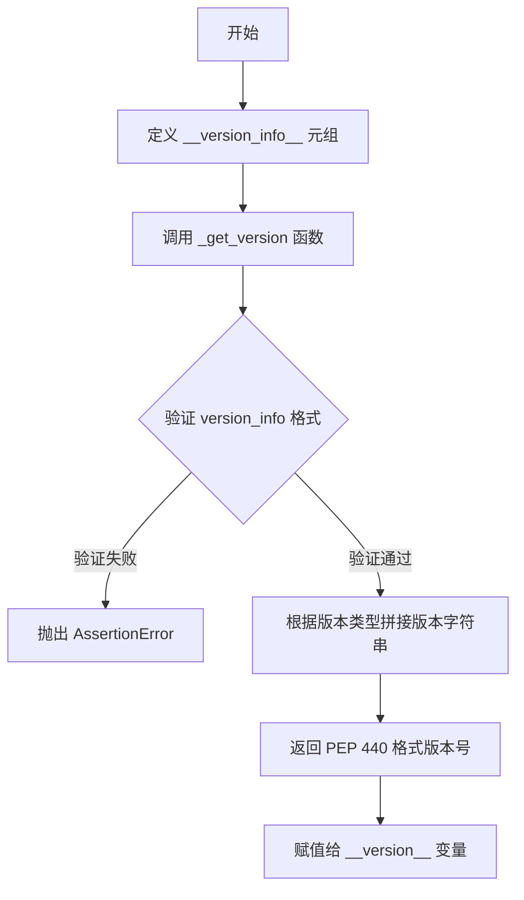

# `markdown\markdown\__meta__.py` 详细设计文档

Python Markdown库的版本信息管理模块，通过定义版本信息元组和转换函数，生成符合PEP 440标准的版本号字符串，供项目整体使用。

## 整体流程



## 类结构

```
该文件为简单模块文件，无类定义
仅包含全局变量和全局函数
```

## 全局变量及字段


### `__version_info__`
    
版本信息元组，包含主版本号、次版本号、补丁版本号、开发阶段类型和开发阶段编号，用于生成标准版本字符串

类型：`tuple[int, int, int, str, int]`
    


### `__version__`
    
PEP 440 规范格式的版本字符串，通过 _get_version 函数从 __version_info__ 转换生成，如 '3.10.2'

类型：`str`
    


### `_get_version`
    
内部函数，接收版本信息元组并返回符合 PEP 440 标准的版本号字符串，支持 dev、alpha、beta、rc 和 final 等版本阶段

类型：`Callable[[tuple], str]`
    


    

## 全局函数及方法


### `_get_version(version_info)`

将版本信息元组转换为符合PEP 440标准的版本字符串。

参数：

- `version_info`：`tuple`，包含5个元素的版本信息元组，格式为 `(major, minor, patch, stage, stage_num)`，其中 stage 可选值为 'dev'、'alpha'、'beta'、'rc'、'final'

返回值：`str`，符合PEP 440标准的版本字符串

#### 流程图

```mermaid
flowchart TD
    A[开始] --> B{len(version_info) == 5?}
    B -->|否| C[抛出 AssertionError]
    B -->|是| D{version_info[3] in ('dev', 'alpha', 'beta', 'rc', 'final')}
    D -->|否| C
    D -->|是| E{patch == 0?}
    E -->|是| F[parts = 2]
    E -->|否| G[parts = 3]
    F --> H[v = '.'.join(major.minor[.patch])]
    G --> H
    H --> I{version_info[3] == 'dev'?}
    I -->|是| J[v += f'.dev{stage_num}']
    I -->|否| K{version_info[3] == 'final'?}
    K -->|是| L[无后缀]
    K -->|否| M[根据 mapping 添加后缀]
    J --> N[返回版本字符串]
    L --> N
    M --> N
    N --> O[结束]
```

#### 带注释源码

```python
def _get_version(version_info):
    """
    将版本信息元组转换为符合PEP 440标准的版本字符串。
    
    参数:
        version_info: 包含5个元素的元组，格式为 (major, minor, patch, stage, stage_num)
                     - major: 主版本号
                     - minor: 次版本号
                     - patch: 补丁版本号
                     - stage: 开发阶段 ('dev', 'alpha', 'beta', 'rc', 'final')
                     - stage_num: 阶段序号
    
    返回值:
        符合PEP 440标准的版本字符串
    
    示例:
        (1, 1, 2, 'dev', 0)    => "1.1.2.dev0"
        (1, 1, 2, 'alpha', 1)  => "1.1.2a1"
        (1, 2, 0, 'beta', 2)   => "1.2b2"
        (1, 2, 0, 'rc', 4)     => "1.2rc4"
        (1, 2, 0, 'final', 0)  => "1.2"
    """
    # 断言：验证版本信息元组长度为5
    assert len(version_info) == 5
    
    # 断言：验证版本阶段是否合法
    assert version_info[3] in ('dev', 'alpha', 'beta', 'rc', 'final')
    
    # 确定版本号部分数量
    # 如果补丁版本为0，则省略补丁版本号 (如 "1.2" 而非 "1.2.0")
    parts = 2 if version_info[2] == 0 else 3
    
    # 拼接基础版本号 (major.minor[.patch])
    v = '.'.join(map(str, version_info[:parts]))
    
    # 根据版本阶段添加相应的后缀
    if version_info[3] == 'dev':
        # 开发版本: .devN
        v += '.dev' + str(version_info[4])
    elif version_info[3] != 'final':
        # 预发布版本: aN (alpha), bN (beta), rcN (release candidate)
        mapping = {'alpha': 'a', 'beta': 'b', 'rc': 'rc'}
        v += mapping[version_info[3]] + str(version_info[4])
    # final 版本无后缀
    
    return v
```

## 关键组件


### 版本信息元组 (`__version_info__`)

存储库的版本信息，包含主版本号、次版本号、补丁版本号、发布阶段和开发版本号。

### 版本号生成函数 (`_get_version()`)

将版本信息元组转换为符合PEP 440标准的版本号字符串，支持dev、alpha、beta、rc和final等发布阶段。

### 公共版本号 (`__version__`)

对外暴露的版本号字符串，由`_get_version()`函数根据`__version_info__`生成。


## 问题及建议


### 已知问题

-   **魔法数字与可读性差**：`parts = 2 if version_info[2] == 0 else 3` 这行代码的含义不够直观，后续维护者难以理解其意图
-   **缺乏类型注解**：虽然导入了 `from __future__ import annotations`，但函数参数和返回值均无类型注解，不利于静态分析和IDE支持
-   **使用 assert 进行验证**：在生产环境中使用 `assert` 进行版本信息验证，当 Python 以优化模式运行（`python -O`）时会被跳过，导致验证失效
-   **错误信息不明确**：assert 失败时仅抛出 `AssertionError`，不提供有意义的错误描述，调试困难
-   **字符串拼接方式过时**：使用 `map(str, version_info[:parts])` 配合 `.join()` 进行字符串拼接，可读性不如 f-string

### 优化建议

-   **添加类型注解**：为函数参数和返回值添加明确的类型提示，如 `def _get_version(version_info: tuple[int, int, int, str, int]) -> str:`
-   **改用 ValueError 替代 assert**：使用自定义异常或 `ValueError` 替代 assert 进行参数验证，确保在生产环境中也能生效
-   **提取常量**：将 `mapping` 字典和版本阶段列表提取为模块级常量，提高可维护性
-   **简化版本号生成逻辑**：重构 `parts` 的计算逻辑，添加注释说明其含义，或拆分为更清晰的步骤
-   **考虑使用 f-string**：在 Python 3.6+ 环境中，使用 f-string 可提升字符串拼接的可读性

## 其它


### 版本信息管理

该模块负责管理Python Markdown库的版本信息，通过`_get_version`函数将元组形式的版本信息转换为符合PEP 440规范的版本字符串。

### 全局变量

- `__version_info__`: tuple类型，存储版本号的元组，包含主版本号、次版本号、补丁版本号、发布阶段和发布阶段序号
- `__version__`: str类型，根据`__version_info__`生成的符合PEP 440标准的版本号字符串

### 全局函数

- `_get_version`: 参数为version_info (tuple类型)，将版本信息元组转换为标准版本字符串；返回str类型的版本号；无mermaid流程图；源码如题所示

### 关键组件信息

- `__version_info__`: 版本信息元组，定义了版本号的结构和发布阶段
- `_get_version`: 版本号转换函数，实现版本格式的标准化

### 设计目标与约束

- 目标：提供符合PEP 440规范的版本号管理机制
- 约束：版本信息元组必须包含5个元素，发布阶段必须为合法值(dev/alpha/beta/rc/final)

### 错误处理与异常设计

- 使用assert进行参数验证，确保版本信息元组长度和发布阶段合法性
- 不符合规范时抛出AssertionError

### 外部依赖与接口契约

- 无外部依赖
- 对外接口：`__version__`和`__version_info__`两个模块级变量

### 潜在技术债务与优化空间

- 使用assert进行错误处理不够优雅，建议使用自定义异常
- 缺乏版本比较功能，可考虑添加版本比较相关函数
- 未区分最终发布版本的补丁号显示逻辑可以更明确

### 其它项目

无

    