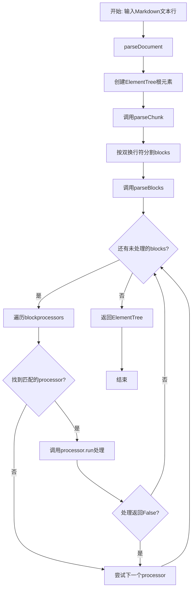
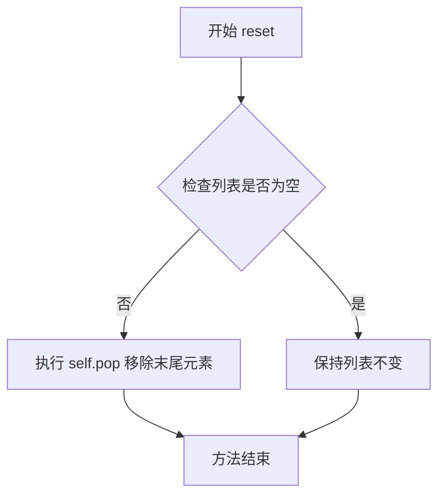
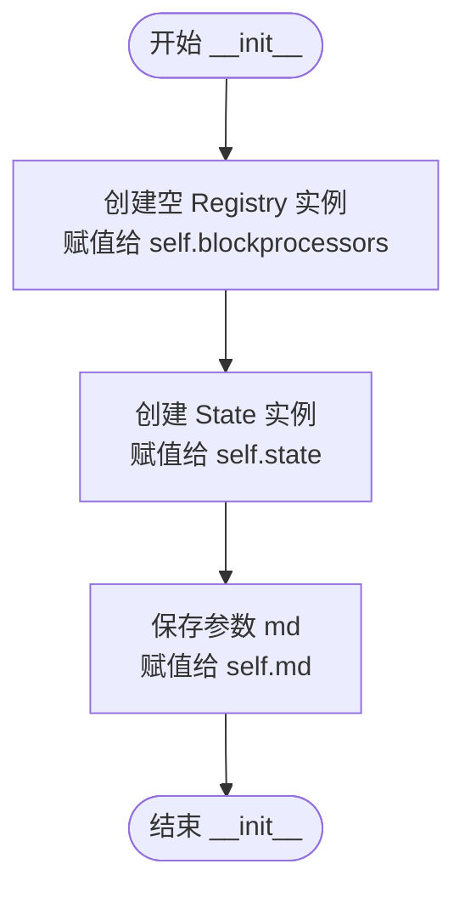
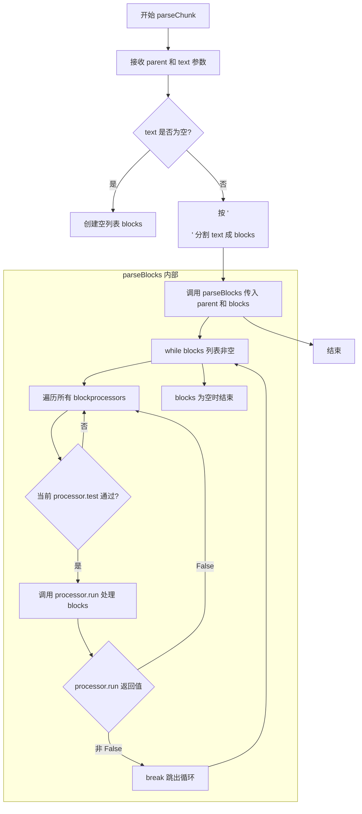

# `markdown\markdown\blockparser.py` 详细设计文档

Python Markdown库的块解析器模块，负责将Markdown文档的块级元素（如段落、列表、引用块等）解析为XML ElementTree结构。该模块包含State类用于跟踪解析器的嵌套状态，以及BlockParser类作为主解析器协调各种BlockProcessor处理不同类型的块。

## 整体流程



## 类结构

```
State (状态跟踪类)
└── BlockParser (块解析器主类)
```

## 全局变量及字段


### `etree`
    
XML ElementTree module for creating parsed document structure

类型：`xml.etree.ElementTree`
    


### `TYPE_CHECKING`
    
Flag for type checking imports to avoid runtime overhead

类型：`bool`
    


### `Iterable`
    
Type hint for iterable objects

类型：`typing.Iterable`
    


### `Any`
    
Type hint for arbitrary type

类型：`typing.Any`
    


### `BlockParser.blockprocessors`
    
A collection of blockprocessors that handle different types of Markdown blocks

类型：`util.Registry[BlockProcessor]`
    


### `BlockParser.state`
    
Tracks the nesting level of current location in document being parsed

类型：`State`
    


### `BlockParser.md`
    
A Markdown instance providing configuration and extension support

类型：`Markdown`
    


### `BlockParser.root`
    
The root element of the parsed document tree

类型：`etree.Element`
    
    

## 全局函数及方法


### `State.set`

设置一个新的解析器状态，将其追加到状态列表的末尾，用于跟踪嵌套的解析层级。

参数：

- `state`：`Any`，要设置的新状态值，可以是任意类型，表示当前解析的块类型或状态标识

返回值：`None`，无返回值，该方法直接修改内部列表状态

#### 流程图

```mermaid
flowchart TD
    A[开始 set 方法] --> B[接收 state 参数]
    B --> C{验证 state 非空}
    C -->|是| D[调用 self.append(state) 将状态追加到列表末尾]
    C -->|否| E[追加空状态]
    D --> F[结束方法]
    E --> F
```

#### 带注释源码

```python
def set(self, state: Any):
    """ Set a new state. """
    # 将传入的状态追加到列表末尾
    # 列表继承自 list 类，用于跟踪解析器的嵌套状态层级
    # 每次进入新的嵌套块时调用 set 方法添加新状态
    self.append(state)
```


### `State.reset`

该方法用于将解析器状态回退到前一个嵌套层级，通过移除列表末尾的状态元素来实现状态的"弹出"操作，确保嵌套块解析时状态的一致性。

参数：

- 无参数

返回值：`None`，无返回值描述

#### 流程图



#### 带注释源码

```python
def reset(self) -> None:
    """ Step back one step in nested state. """
    self.pop()
```


### `State.isstate`

该方法用于测试 BlockParser 的当前（顶层）解析状态是否与给定的状态相匹配，通过检查状态栈的最后一个元素来判断当前是否处于特定的分析阶段。

参数：

- `state`：`Any`，要测试的状态值，用于与当前顶层状态进行比较

返回值：`bool`，如果当前顶层状态等于给定状态返回 `True`，否则返回 `False`

#### 流程图

```mermaid
flowchart TD
    A[开始 isstate] --> B{检查状态栈长度}
    B -->|长度 > 0| C[获取栈顶元素 self[-1]]
    C --> D{栈顶元素 == state?}
    D -->|是| E[返回 True]
    D -->|否| F[返回 False]
    B -->|长度 == 0| F
```

#### 带注释源码

```python
def isstate(self, state: Any) -> bool:
    """ Test that top (current) level is given state. """
    # 检查状态栈是否有元素（是否处于嵌套状态中）
    if len(self):
        # 获取栈顶元素（当前最内层的状态）并与给定状态比较
        return self[-1] == state
    else:
        # 状态栈为空（不在任何嵌套状态中），返回 False
        return False
```


### BlockParser.__init__

初始化 `BlockParser` 实例。接收一个 Markdown 实例作为参数，初始化块处理器注册表、解析状态，并将 Markdown 实例挂载到当前解析器对象上，为后续的文档解析流程做好准备。

参数：

-  `md`：`Markdown`，Markdown 核心实例，包含了配置、扩展和工具方法。

返回值：`None`，构造函数不返回值，仅初始化对象状态。

#### 流程图



#### 带注释源码

```python
def __init__(self, md: Markdown):
    """ Initialize the block parser.

    Arguments:
        md: A Markdown instance.

    Attributes:
        BlockParser.md (Markdown): A Markdown instance.
        BlockParser.state (State): Tracks the nesting level of current location in document being parsed.
        BlockParser.blockprocessors (util.Registry): A collection of
            [`blockprocessors`][markdown.blockprocessors].

    """
    # 初始化块处理器注册表，用于存储和管理各种 BlockProcessor 实例
    self.blockprocessors: util.Registry[BlockProcessor] = util.Registry()
    # 初始化状态跟踪器，用于管理解析过程中的嵌套状态
    self.state = State()
    # 保存 Markdown 实例的引用，以便在解析过程中调用相关配置和工具
    self.md = md
```


### `BlockParser.parseDocument`

该方法将Markdown文档的行序列解析为ElementTree对象，作为BlockParser的主入口方法，负责初始化根元素并调用内部解析方法完成文档到XML DOM的转换。

参数：

- `lines`：`Iterable[str]`，待解析的Markdown文档行序列

返回值：`etree.ElementTree`，解析完成后的ElementTree对象

#### 流程图

```mermaid
flowchart TD
    A[开始 parseDocument] --> B[创建根元素: self.root = etree.Element<br/>self.md.doc_tag]
    B --> C[将lines用换行符连接成字符串:<br/>'\n'.join(lines)]
    C --> D[调用parseChunk处理文本:<br/>parseChunkself.root<br/>joined_text]
    D --> E[使用root创建ElementTree:<br/>etree.ElementTreeself.root]
    E --> F[返回ElementTree对象]
    F --> G[结束]
```

#### 带注释源码

```python
def parseDocument(self, lines: Iterable[str]) -> etree.ElementTree:
    """ Parse a Markdown document into an `ElementTree`.

    Given a list of lines, an `ElementTree` object (not just a parent
    `Element`) is created and the root element is passed to the parser
    as the parent. The `ElementTree` object is returned.

    This should only be called on an entire document, not pieces.

    Arguments:
        lines: A list of lines (strings).

    Returns:
        An element tree.
    """
    # 创建根元素，使用Markdown实例的doc_tag作为标签名
    # 例如: 'div' 或其他由Markdown实例定义的根元素标签
    self.root = etree.Element(self.md.doc_tag)
    
    # 将行列表用换行符连接成单个字符串
    # 然后传递给parseChunk进行进一步处理
    self.parseChunk(self.root, '\n'.join(lines))
    
    # 用已解析的根元素创建ElementTree对象并返回
    # ElementTree包含完整的DOM树结构
    return etree.ElementTree(self.root)
```


### `BlockParser.parseChunk`

该方法负责将一块 Markdown 文本解析并附加到指定的 XML 元素节点。它首先将文本按双换行符分割成多个块，然后调用 `parseBlocks` 方法逐块处理。

参数：

- `self`：BlockParser 实例，解析器本身
- `parent`：`etree.Element`，父 XML 元素，待解析的块将附加到此元素下
- `text`：`str`，待解析的 Markdown 文本字符串，可以包含多个块（以双换行符分隔）

返回值：`None`，该方法直接修改 `parent` 元素的内容，不返回任何值

#### 流程图



#### 带注释源码

```python
def parseChunk(self, parent: etree.Element, text: str) -> None:
    """ Parse a chunk of Markdown text and attach to given `etree` node.

    While the `text` argument is generally assumed to contain multiple
    blocks which will be split on blank lines, it could contain only one
    block. Generally, this method would be called by extensions when
    block parsing is required.

    The `parent` `etree` Element passed in is altered in place.
    Nothing is returned.

    Arguments:
        parent: The parent element.
        text: The text to parse.

    """
    # 将文本按双换行符（块分隔符）分割成多个块
    # 例如 "paragraph1\n\nparagraph2" 会变成 ["paragraph1", "paragraph2"]
    # 然后调用 parseBlocks 方法处理这些块
    self.parseBlocks(parent, text.split('\n\n'))
```


### `BlockParser.parseBlocks`

处理 Markdown 文本块并将解析结果附加到给定的 ElementTree 节点。该方法遍历所有已注册的块处理器，按顺序测试每个块处理器是否能处理当前的文本块，直到所有块处理完毕或找到匹配的处理器并成功执行为止。

参数：

- `parent`：`etree.Element`，父元素，用于附加解析后的块
- `blocks`：`list[str]`，要解析的文本块列表

返回值：`None`，该方法直接修改父元素，不返回任何值

#### 流程图

```mermaid
flowchart TD
    A[开始 parseBlocks] --> B{blocks 列表是否为空?}
    B -->|否| C[取第一个块 blocks[0]]
    B -->|是| Z[结束]
    
    C --> D[遍历 blockprocessors 列表]
    D --> E{还有 processor 未检查?}
    E -->|是| F[调用 processor.test parent, blocks[0]]
    E -->|否| C
    
    F --> G{test 返回 True?}
    G -->|否| E
    G -->|是| H[调用 processor.run parent, blocks]
    
    H --> I{run 返回 False?}
    I -->|是| D
    I -->|否| J[跳出内层循环]
    J --> B
    
    style A fill:#f9f,color:#000
    style Z fill:#9f9,color:#000
    style H fill:#ff9,color:#000
```

#### 带注释源码

```python
def parseBlocks(self, parent: etree.Element, blocks: list[str]) -> None:
    """ Process blocks of Markdown text and attach to given `etree` node.

    Given a list of `blocks`, each `blockprocessor` is stepped through
    until there are no blocks left. While an extension could potentially
    call this method directly, it's generally expected to be used
    internally.

    This is a public method as an extension may need to add/alter
    additional `BlockProcessors` which call this method to recursively
    parse a nested block.

    Arguments:
        parent: The parent element.
        blocks: The blocks of text to parse.

    """
    # 外层循环：持续处理直到所有 blocks 都被处理完毕
    # blocks 列表会在 processor.run() 执行时被修改（通常会移除已处理的块）
    while blocks:
        # 遍历所有已注册的 BlockProcessor
        # 处理器按照注册顺序逐一尝试处理当前块
        for processor in self.blockprocessors:
            # test() 方法快速检测当前 processor 是否能处理该块
            # 返回 True 表示该 processor 可能是正确的处理器
            if processor.test(parent, blocks[0]):
                # run() 方法执行实际解析逻辑
                # 返回 False 表示处理失败，需要尝试下一个 processor
                # 返回 True 或 None 表示处理成功，退出当前块的处理器查找
                if processor.run(parent, blocks) is not False:
                    # run returns True or None
                    # 成功处理后跳出 for 循环，继续处理下一个块
                    break
```

## 关键组件


### State

状态追踪工具类，用于跟踪BlockParser的当前状态和嵌套层级。基于list实现，提供了set()、reset()和isstate()方法来管理嵌套的解析状态。

### BlockParser

块级Markdown解析器核心类，负责将Markdown文档解析为ElementTree对象。通过组合多个BlockProcessor来处理不同类型的块级元素，支持嵌套块的递归解析。

### BlockProcessor (接口)

块处理器接口/基类，Python Markdown通过注册不同的BlockProcessor来处理各种块类型（如段落、列表、引用块等）。具体实现分布在blockprocessors模块中。

### parseDocument 方法

将整个Markdown文档解析为ElementTree对象的入口方法，接收行列表输入，返回完整的ElementTree树结构。

### parseChunk 方法

解析一块Markdown文本并附加到指定的etree父节点，用于处理扩展程序需要单独解析块内容的场景。

### parseBlocks 方法

核心块处理循环，遍历所有已注册的BlockProcessor，依次测试并处理每个块，直到所有块处理完毕，支持递归处理嵌套块。

### util.Registry

块处理器的注册表，用于存储和管理所有的BlockProcessor实例，支持迭代遍历和动态添加/替换处理器。

### Markdown 实例引用

BlockParser持有Markdown实例的引用，用于访问全局配置和扩展机制，确保块解析与整个Markdown处理流程的协调。


## 问题及建议


### 已知问题

- **类型注解不完整**：在 `BlockParser.__init__` 方法的文档字符串中，属性被错误地记录为 `BlockParser.md`、`BlockParser.state` 和 `BlockParser.blockprocessors`，这与实际代码中使用的 `self.md`、`self.state` 和 `self.blockprocessors` 不一致，容易造成混淆。
- **输入处理效率低下**：`parseDocument` 方法先将所有行用 `'\n'.join(lines)` 合并成字符串，然后在 `parseChunk` 中又用 `split('\n\n')` 拆分，这种双重转换对于大型文档效率较低，且丢失了原始行边界信息。
- **缺少错误处理**：代码没有对输入参数进行验证（如 `lines` 是否可迭代、`parent` 是否为有效 Element），也没有异常捕获机制，任何 BlockProcessor 的失败都可能导致整个解析过程崩溃。
- **Registry 依赖紧耦合**：代码强依赖 `util.Registry` 实现，缺乏对注册机制的抽象或错误处理，如果 Registry 内部出现问题难以调试和替换。
- **State 类非线程安全**：State 类继承自 list，在多线程并发解析场景下可能出现竞争条件，导致状态混乱。
- **文档字符串过时**：BlockParser 类的文档字符串内容为空，未能提供有意义的类级别说明。

### 优化建议

- **修复文档字符串**：统一属性命名，更新 BlockParser 类的文档字符串以描述其核心职责，并补充关键方法的复杂度说明。
- **优化输入处理**：考虑直接在 `parseDocument` 中处理行列表，避免不必要的字符串合并/拆分操作，或提供预优化的分支路径。
- **添加输入验证**：在关键入口方法中添加参数类型和有效性检查，提供清晰的错误信息。
- **考虑性能优化**：对于大量 BlockProcessor 的场景，可以考虑添加基于块的初步筛选机制或缓存已匹配的处理器，减少每次迭代的开销。
- **增强线程安全性**：如果需要支持多线程场景，考虑为 State 类添加锁机制或提供线程局部的解析器实例。
- **提供更细粒度的 API 标注**：明确区分公共 API 和内部方法（如使用 `_` 前缀），便于扩展者理解哪些方法可以安全调用。


## 其它


### 设计目标与约束

该模块作为Python Markdown的核心解析组件，承担将Markdown文本转换为结构化XML元素树的关键职责。设计目标包括：1）实现模块化架构，通过可插拔的BlockProcessor机制支持不同类型块的解析；2）支持嵌套结构的正确处理，通过State类跟踪多层嵌套状态；3）保持与Markdown语法的兼容性，同时为扩展提供灵活的自定义接口。约束条件方面，该模块专注于块级解析，不处理内联元素（如粗体、斜体等），该任务由独立的内联解析器负责；同时依赖xml.etree.ElementTree作为输出格式，不支持其他输出格式。

### 错误处理与异常设计

该模块的错误处理遵循以下策略：1）在parseBlocks方法中，当BlockProcessor.run()返回False时，循环会继续尝试下一个处理器，而不是抛出异常，这意味着处理器无法识别某块时会让其他处理器尝试处理；2）State类的isstate方法在列表为空时返回False而非抛出IndexError，这是预期的防御性编程；3）parseDocument方法假设输入的lines参数是有效的可迭代对象，若输入格式异常可能导致ElementTree构建失败，但该层级不进行显式验证；4）扩展模块添加的BlockProcessor应遵循test/run契约，若违反可能导致解析结果不符合预期。当前模块本身没有自定义异常类，错误通常向上传播到调用方处理。

### 数据流与状态机

数据流遵循以下路径：输入的Markdown文本行（Iterable[str]）首先在parseDocument中被合并为单个字符串并创建根Element，然后依次经过parseChunk和parseBlocks的处理。parseBlocks是核心循环，对每个块依次遍历注册的所有BlockProcessor，调用其test方法判断是否匹配，若匹配则调用run方法处理并可能修改blocks列表。状态机方面，State类作为栈结构维护当前解析上下文，通过set方法压入新状态（如'quote'、'list'等），通过reset方法弹出状态，通过isstate方法查询当前顶层状态。这种设计支持多层嵌套：例如在引用块内解析列表时，会先设置quote状态，进入列表处理时再设置list状态，列表处理完成后reset回到quote状态，引用块处理完成后再reset回到顶层。

### 外部依赖与接口契约

该模块的直接依赖包括：1）xml.etree.ElementTree（标准库），用于构建输出XML树结构；2）markdown.Markdown类，通过构造函数传入的md参数关联到主Markdown实例；3）util.Registry类，用于管理BlockProcessor的注册和迭代；4）typing模块的类型注解。接口契约方面：1）BlockProcessor必须实现test(parent, block) -> bool方法判断是否处理当前块；2）BlockProcessor必须实现run(parent, blocks)方法执行实际解析，可返回False表示不处理当前块；3）扩展通过BlockParser.blockprocessors.registry()方法注册新的处理器；4）md.doc_tag属性被用于创建根元素名称。TYPE_CHECKING下的导入仅用于类型注解，不影响运行时行为。

### 性能特征与优化考虑

性能特征方面：1）parseDocument中使用'\n'.join(lines)会一次性加载整个文档到内存，对于超大文档可能导致内存压力，建议改为迭代式处理；2）parseBlocks中对blocks列表使用while循环配合for迭代，每次迭代都可能修改blocks（通过processor.run），存在一定的迭代器失效风险；3）每次调用parseBlocks都会遍历所有注册的BlockProcessor直到找到匹配项，当处理器数量增多时可能导致性能下降。优化空间包括：1）可以考虑为BlockProcessor添加优先级机制，减少不必要的test调用；2）对于大文档，可以实现流式处理减少内存占用；3）可以在BlockProcessor中缓存已解析的结果避免重复处理。

### 扩展性设计

该模块的扩展性设计体现在多个层面：1）BlockProcessor机制允许通过注册新的处理器来支持自定义块类型，如表格、脚注等；2）可以通过替换现有处理器来改变默认行为，例如用自定义的列表处理器替换默认实现；3）State类支持任意类型的状态值，扩展可以根据需要定义自己的状态标识；4）parseBlocks方法被标记为public，允许扩展直接调用进行递归解析。扩展的最佳实践包括：1）在处理器中正确处理嵌套结构，确保调用parseBlocks时设置和重置状态；2）test方法应保持轻量，避免执行复杂计算；3）处理器应遵循最小权限原则，只修改必要的DOM节点。

### 线程安全与并发处理

该模块的线程安全性分析如下：1）BlockParser实例包含可变状态（blockprocessors、state、root等），因此不是线程安全的；2）State类作为list的子类，其操作不是原子性的，在多线程环境下直接操作可能导致状态不一致；3）Registry的注册表操作（非线程安全）在解析过程中通常只读，但在扩展加载时可能被并发修改。使用建议：1）在多线程环境中，每个线程应创建独立的BlockParser实例；2）如果在Web服务器中使用，应为每个请求创建新的Markdown实例（包括BlockParser）；3）扩展的加载和注册应在启动阶段完成，避免在解析过程中动态注册。

### 版本兼容性

该模块与Python版本的兼容性：1）使用from __future__ import annotations实现向后兼容的注解语法；2）依赖的xml.etree.ElementTree、typing等均为Python 3标准库，兼容性取决于项目声明的Python版本要求；3）根据项目文档，Python-Markdown 3.x系列要求Python 3.5+，Python-Markdown 2.x系列支持Python 2.7。外部依赖兼容性方面：1）util.Registry类的实现细节影响扩展的注册方式；2）ElementTree的行为在Python版本间保持一致。类型注解使用TYPE_CHECKING guard确保在运行时不影响性能。

### 安全考量

该模块处理的是用户提供的Markdown文本，安全考量包括：1）ElementTree本身对XML实体编码有基本处理，可防止基本的XML注入；2）但如果扩展处理器直接操作DOM属性或文本内容，可能引入XSS风险，扩展开发者应注意正确转义；3）parseDocument假设输入为可信的Markdown文本，未对恶意构造的输入（如深度嵌套导致栈溢出、大文件导致内存耗尽）进行防护；4）建议在使用该模块时对输入长度和复杂度进行限制，并设置合理的递归深度限制。

### 配置与可调参数

BlockParser本身不直接提供配置接口，配置主要通过Markdown实例和扩展实现：1）md.doc_tag控制输出XML的根元素名称；2）BlockProcessor的行为可通过扩展配置进行定制；3）state列表的长度理论上无上限，但实际受文档嵌套深度限制。建议的扩展配置方式包括：1）在扩展的setup函数中修改BlockParser的配置；2）通过Markdown实例的__init__参数传递配置；3）使用util.Registry的优先级机制控制处理器顺序。

### 相关模块与上下文

该模块在Python-Markdown项目中的位置：1）处于core模块层级，被markdown.py的主入口调用；2）与inline模块（处理内联元素）并列，共同构成完整的Markdown解析；3）blockprocessors子模块包含各种具体的BlockProcessor实现（如ListBlockProcessor、QuoteBlockProcessor等）；4）treeprocessors子模块在BlockParser之后运行，将ElementTree转换为最终输出。调用链：用户调用Markdown(text) -> __call__ -> parse方法 -> BlockParser.parseDocument -> 各种BlockProcessor处理 -> 返回ElementTree。


    