# `markdown\markdown\blockprocessors.py` 详细设计文档

该模块是Python-Markdown库的核心组件之一，负责块级（Block-level）解析。它定义了一系列继承自BlockProcessor的处理器（如标题、列表、代码块、引用等），通过正则表达式和状态机将Markdown文本块转换为xml.etree.ElementTree结构。

## 整体流程

```mermaid
graph TD
    Start([文本输入]) --> Split[将文本按空行分割为blocks列表]
    Split --> LoopBlocks{遍历blocks列表}
    LoopBlocks --> LoopProcessors{遍历已注册的BlockProcessors (按优先级排序)}
    LoopProcessors --> Test[调用 processor.test(parent, block)]
    Test -- False --> NextP[下一个Processor]
    NextP --> LoopProcessors
    Test -- True --> Run[调用 processor.run(parent, blocks)]
    Run --> UpdateTree[更新ElementTree]
    UpdateTree --> LoopBlocks
    LoopBlocks -- 还有block --> LoopBlocks
    LoopBlocks -- 结束 --> End([解析完成])
```

## 类结构

```
BlockProcessor (抽象基类)
├── ListIndentProcessor (列表缩进处理)
├── CodeBlockProcessor (代码块处理)
├── BlockQuoteProcessor (引用块处理)
├── OListProcessor (有序列表处理)
│   └── UListProcessor (无序列表处理)
├── HashHeaderProcessor (Hash标题处理)
├── SetextHeaderProcessor (Setext标题处理)
├── HRProcessor (水平线处理)
├── EmptyBlockProcessor (空块处理)
├── ReferenceProcessor (引用定义处理)
└── ParagraphProcessor (段落处理)
```

## 全局变量及字段


### `logger`
    
模块日志记录器

类型：`logging.Logger`
    


### `BlockProcessor.parser`
    
解析器实例

类型：`BlockParser`
    


### `BlockProcessor.tab_length`
    
Tab长度设置

类型：`int`
    


### `ListIndentProcessor.INDENT_RE`
    
缩进正则表达式

类型：`re.Pattern`
    


### `BlockQuoteProcessor.RE`
    
匹配blockquote的正则

类型：`re.Pattern`
    


### `OListProcessor.TAG`
    
标签名 ('ol')

类型：`str`
    


### `OListProcessor.STARTSWITH`
    
列表起始数字

类型：`str`
    


### `OListProcessor.LAZY_OL`
    
是否忽略起始数字

类型：`bool`
    


### `OListProcessor.SIBLING_TAGS`
    
兄弟标签列表

类型：`list[str]`
    


### `OListProcessor.RE`
    
有序列表项正则

类型：`re.Pattern`
    


### `OListProcessor.CHILD_RE`
    
子列表项正则

类型：`re.Pattern`
    


### `OListProcessor.INDENT_RE`
    
缩进正则

类型：`re.Pattern`
    


### `UListProcessor.TAG`
    
标签名 ('ul')

类型：`str`
    


### `HashHeaderProcessor.RE`
    
匹配Atx风格标题

类型：`re.Pattern`
    


### `SetextHeaderProcessor.RE`
    
匹配Setext风格标题

类型：`re.Pattern`
    


### `HRProcessor.RE`
    
原子组正则字符串

类型：`str`
    


### `HRProcessor.SEARCH_RE`
    
搜索正则

类型：`re.Pattern`
    


### `ReferenceProcessor.RE`
    
匹配引用定义

类型：`re.Pattern`
    
    

## 全局函数及方法


### `build_block_parser`

构建并注册默认块处理器的工厂函数，创建一个配置完整的 `BlockParser` 实例，用于解析 Markdown 文档中的各种块级元素。

参数：

- `md`：`Markdown`，Markdown 实例，提供配置和全局状态
- `**kwargs`：`Any`，可选的额外关键字参数，用于扩展或覆盖默认配置

返回值：`BlockParser`，配置完成并注册了所有默认块处理器的解析器实例

#### 流程图

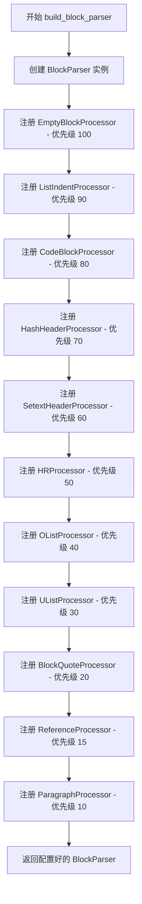

#### 带注释源码

```python
def build_block_parser(md: Markdown, **kwargs: Any) -> BlockParser:
    """ Build the default block parser used by Markdown. """
    # 第一步：创建 BlockParser 实例，传入 Markdown 实例以共享配置和状态
    parser = BlockParser(md)
    
    # 第二步：按优先级从高到低注册各个块处理器
    # 优先级数字越小越先被尝试匹配，数字大的先执行
    
    # 处理空块或以空行开头的块
    parser.blockprocessors.register(EmptyBlockProcessor(parser), 'empty', 100)
    
    # 处理列表项的缩进子内容
    parser.blockprocessors.register(ListIndentProcessor(parser), 'indent', 90)
    
    # 处理缩进代码块
    parser.blockprocessors.register(CodeBlockProcessor(parser), 'code', 80)
    
    # 处理 ATX 风格标题 (# Header)
    parser.blockprocessors.register(HashHeaderProcessor(parser), 'hashheader', 70)
    
    # 处理 Setext 风格标题 (Header\n===)
    parser.blockprocessors.register(SetextHeaderProcessor(parser), 'setextheader', 60)
    
    # 处理水平分割线 (---, ***, ___)
    parser.blockprocessors.register(HRProcessor(parser), 'hr', 50)
    
    # 处理有序列表 (1. Item)
    parser.blockprocessors.register(OListProcessor(parser), 'olist', 40)
    
    # 处理无序列表 (- Item, * Item, + Item)
    parser.blockprocessors.register(UListProcessor(parser), 'ulist', 30)
    
    # 处理块引用 (> Quote)
    parser.blockprocessors.register(BlockQuoteProcessor(parser), 'quote', 20)
    
    # 处理引用参考 ([id]: url "title")
    parser.blockprocessors.register(ReferenceProcessor(parser), 'reference', 15)
    
    # 处理普通段落（兜底处理器，始终返回 True）
    parser.blockprocessors.register(ParagraphProcessor(parser), 'paragraph', 10)
    
    # 第三步：返回配置完成的解析器实例
    return parser
```


### `BlockProcessor.test`

检测块是否符合该处理器类型。作为基类方法，由子类重写实现具体的检测逻辑。

参数：

- `parent`：`etree.Element`，将作为块父级的元素，用于判断当前上下文环境（如在列表内部时可能有不同的处理方式）
- `block`：`str`，从源文本中在空行处分割出的文本块

返回值：`bool`，返回 `True` 表示该块符合当前处理器类型，应由该处理器处理；返回 `False` 表示不符合

#### 流程图

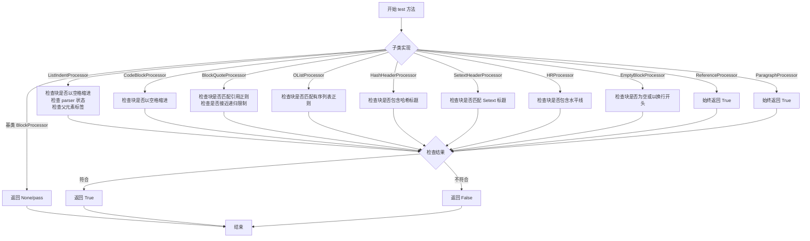

#### 带注释源码

```python
def test(self, parent: etree.Element, block: str) -> bool:
    """ Test for block type. Must be overridden by subclasses.

    As the parser loops through processors, it will call the `test`
    method on each to determine if the given block of text is of that
    type. This method must return a boolean `True` or `False`. The
    actual method of testing is left to the needs of that particular
    block type. It could be as simple as `block.startswith(some_string)`
    or a complex regular expression. As the block type may be different
    depending on the parent of the block (i.e. inside a list), the parent
    `etree` element is also provided and may be used as part of the test.

    Keyword arguments:
        parent: An `etree` element which will be the parent of the block.
        block: A block of text from the source which has been split at blank lines.
    """
    pass  # pragma: no cover
```


### `BlockProcessor.run`

执行块处理器的核心方法。当解析器确定块的适当类型后，将调用相应处理器的 `run` 方法。该方法应解析块的各行并将它们追加到 ElementTree 中。此方法直接修改传入的 `parent` 和 `blocks` 对象，而非返回新对象。如果返回 `False`，效果与 `test` 方法返回 `False` 相同。

参数：

- `parent`：`etree.Element`，当前块的父元素节点
- `blocks`：`list[str]`，文档中所有剩余块的列表

返回值：`bool | None`，返回 `False` 时表示该块未被处理，等同于 `test` 方法返回 `False`；返回 `None` 或其他值时表示处理成功

#### 流程图

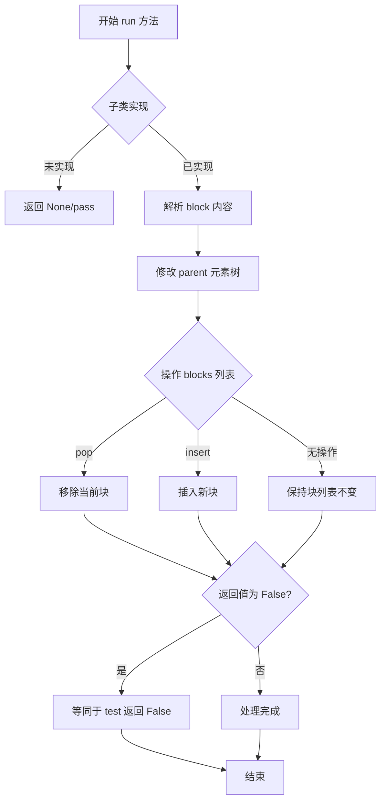

#### 带注释源码

```python
def run(self, parent: etree.Element, blocks: list[str]) -> bool | None:
    """ Run processor. Must be overridden by subclasses.

    When the parser determines the appropriate type of a block, the parser
    will call the corresponding processor's `run` method. This method
    should parse the individual lines of the block and append them to
    the `etree`.

    Note that both the `parent` and `etree` keywords are pointers
    to instances of the objects which should be edited in place. Each
    processor must make changes to the existing objects as there is no
    mechanism to return new/different objects to replace them.

    This means that this method should be adding `SubElements` or adding text
    to the parent, and should remove (`pop`) or add (`insert`) items to
    the list of blocks.

    If `False` is returned, this will have the same effect as returning `False`
    from the `test` method.

    Keyword arguments:
        parent: An `etree` element which is the parent of the current block.
        blocks: A list of all remaining blocks of the document.
    """
    pass  # pragma: no cover
```


### `BlockProcessor.lastChild`

获取父元素的最后一个子元素，用于在块处理器中快速访问兄弟节点或确定父元素的最后一个子节点。

参数：

- `parent`：`etree.Element`，父元素，要获取其最后一个子元素的 XML 元素树节点

返回值：`etree.Element | None`，返回父元素的最后一个子元素，如果父元素没有子元素则返回 None

#### 流程图

```mermaid
flowchart TD
    A[开始] --> B{检查 parent 是否有子元素}
    B -->|有子元素 len(parent) > 0| C[返回 parent 的最后一个元素 parent[-1]]
    B -->|没有子元素 len(parent) == 0| D[返回 None]
    C --> E[结束]
    D --> E
```

#### 带注释源码

```python
def lastChild(self, parent: etree.Element) -> etree.Element | None:
    """ Return the last child of an `etree` element. """
    # 检查父元素是否有子元素
    # Python 中可以直接用 len() 获取元素的孩子数量
    if len(parent):
        # 如果有子元素，返回最后一个子元素
        # etree.Element 支持负索引访问，-1 即为最后一个元素
        return parent[-1]
    else:
        # 如果没有子元素，返回 None
        return None
```


### `BlockProcessor.detab`

移除文本前台头的Tab（缩进），将带有指定空格数缩进的行去除缩进，并返回处理后的文本和剩余未处理的行。

参数：

- `text`：`str`，需要移除前台头Tab（缩进）的文本
- `length`：`int | None`，可选参数，指定要移除的空格数，默认为 `None`（使用实例的 `tab_length` 属性）

返回值：`tuple[str, str]`，返回一个元组，包含：
- 第一个元素：去除缩进后的文本
- 第二个元素：剩余未处理的行（当遇到非缩进行时停止，剩余的原始行）

#### 流程图

```mermaid
flowchart TD
    A[开始: detab text, length] --> B{length is None?}
    B -->|Yes| C[length = self.tab_length]
    B -->|No| D[使用传入的length]
    C --> E[初始化 newtext = [], lines = text.split '\n']
    D --> E
    E --> F[遍历 lines 中的每个 line]
    F --> G{line.startswith ' ' * length?}
    G -->|Yes| H[newtext.append line[length:]]
    H --> I{还有更多行?}
    G -->|No| J{not line.strip()}
    J -->|Yes| K[newtext.append '']
    K --> I
    J -->|No| L[break 停止循环]
    I -->|Yes| F
    I -->|No| M[构建返回值]
    M --> N[返回 '\n'.join newtext, '\n'.join lines[len newtext:]]
    
    style A fill:#f9f,color:#000
    style N fill:#9f9,color:#000
    style L fill:#ff9,color:#000
```

#### 带注释源码

```python
def detab(self, text: str, length: int | None = None) -> tuple[str, str]:
    """ Remove a tab from the front of each line of the given text. """
    # 如果未指定length，则使用实例的tab_length属性（默认为4）
    if length is None:
        length = self.tab_length
    
    # 初始化结果列表和待处理的行列表
    newtext = []
    lines = text.split('\n')
    
    # 遍历每一行
    for line in lines:
        # 检查当前行是否以指定数量的空格开头（模拟Tab缩进）
        if line.startswith(' ' * length):
            # 去除该行的前台头缩进（切片移除前length个字符）
            newtext.append(line[length:])
        # 检查当前行是否为空行（只包含空白字符）
        elif not line.strip():
            # 保留空行
            newtext.append('')
        else:
            # 当前行不是缩进行，停止处理
            break
    
    # 返回两个部分：
    # 1. 已去除缩进的文本（newtext用换行符连接）
    # 2. 剩余未处理的行（从原始lines中跳过已处理行数）
    return '\n'.join(newtext), '\n'.join(lines[len(newtext):])
```


### `BlockProcessor.looseDetab`

该方法实现"宽松"的 Detab 处理，即移除文本每行前缀的指定数量的空格，但允许处理已经减少缩进的行（与 `detab` 方法不同，`looseDetab` 不会在遇到非缩进行时停止处理）。

参数：

- `text`：`str`，需要处理的文本内容
- `level`：`int`，缩进级别，默认为 1，表示要移除的缩进单位数

返回值：`str`，处理后的文本内容

#### 流程图

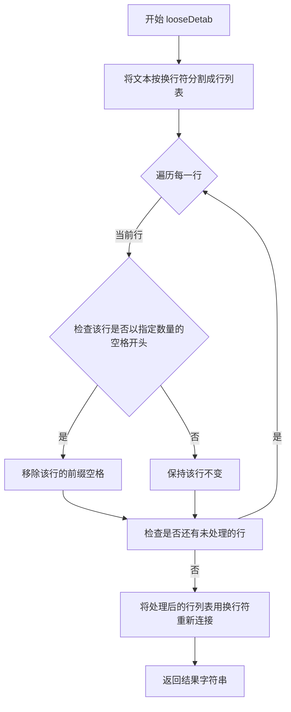

#### 带注释源码

```python
def looseDetab(self, text: str, level: int = 1) -> str:
    """ Remove a tab from front of lines but allowing dedented lines. """
    # 将输入文本按换行符分割成行列表
    lines = text.split('\n')
    # 遍历每一行
    for i in range(len(lines)):
        # 计算该行应该被移除的空格数：tab_length * level
        # 检查当前行是否以足够数量的空格开头
        if lines[i].startswith(' '*self.tab_length*level):
            # 如果是，则移除对应数量的前缀空格
            lines[i] = lines[i][self.tab_length*level:]
        # 注意：与 detab 方法不同，这里不会在遇到非缩进行时停止处理
        # 而是继续处理后续的行，允许已经减少缩进的行存在
    # 将处理后的行列表重新用换行符连接成字符串并返回
    return '\n'.join(lines)
```


### `ListIndentProcessor.test`

该方法用于测试给定的文本块是否符合 ListIndentProcessor 的处理条件，即判断该块是否为列表项的缩进子内容。当文本块以缩进开始、父元素是列表项（`li`）或者父元素的最后一个子元素是列表（`ul`/`ol`）时返回 True。

参数：

- `parent`：`etree.Element`，用于测试的父元素，方法会检查其标签是否为列表项类型或包含列表类型的子元素
- `block`：`str`，待测试的文本块，方法会检查其是否以缩进（空格）开头

返回值：`bool`，如果文本块符合 ListIndentProcessor 的处理条件则返回 True，否则返回 False

#### 流程图

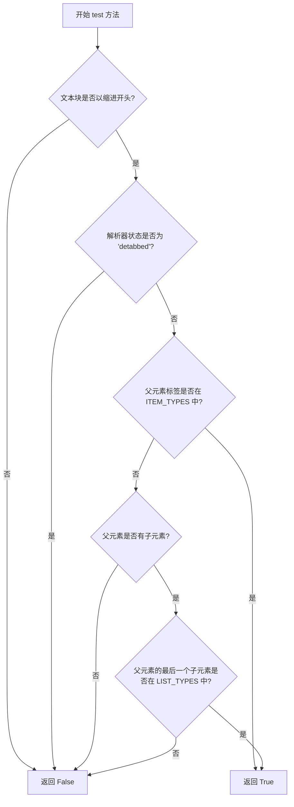

#### 带注释源码

```python
def test(self, parent: etree.Element, block: str) -> bool:
    """测试该块是否应由 ListIndentProcessor 处理。
    
    检查三个条件：
    1. 块以缩进（空格）开头
    2. 解析器当前不在 'detabbed' 状态
    3. 父元素是列表项或包含列表类型的子元素
    
    Args:
        parent: 用于测试的 etree 父元素
        block: 待测试的文本块
        
    Returns:
        bool: 如果块符合处理条件返回 True，否则返回 False
    """
    # 条件1：检查块是否以缩进开头（空格的个数等于 tab_length）
    block_starts_with_indent = block.startswith(' '*self.tab_length)
    
    # 条件2：检查解析器当前状态，确保不在 'detabbed' 状态
    # 'detabbed' 状态表示已经处理过缩进，不应重复处理
    not_in_detabbed_state = not self.parser.state.isstate('detabbed')
    
    # 条件3：检查父元素是否为列表项类型
    # ITEM_TYPES = ['li']，即父元素必须是 <li> 标签
    parent_is_item = parent.tag in self.ITEM_TYPES
    
    # 条件4：如果父元素不是直接的列表项，检查其最后一个子元素是否是列表
    # LIST_TYPES = ['ul', 'ol']，即检查是否有 <ul> 或 <ol> 子元素
    parent_has_list = (
        len(parent) and parent[-1] is not None and
        (parent[-1].tag in self.LIST_TYPES)
    )
    
    # 综合判断：必须同时满足所有条件
    return (
        block_starts_with_indent and 
        not_in_detabbed_state and 
        (parent_is_item or parent_has_list)
    )
```


### `ListIndentProcessor.run`

该方法用于处理列表项的缩进子块。当Markdown中存在缩进内容（如多级列表或列表项内的段落）时，此处理器会确定正确的父元素（可能是列表项、嵌套列表等），并将缩进的块解析为该父元素的子内容。

参数：

- `parent`：`etree.Element`，当前块的父元素，通常是一个列表项（`li`）或列表（`ol`/`ul`）
- `blocks`：`list[str]`，文档中所有剩余的文本块列表

返回值：`None`，该方法直接修改 `parent` 元素和 `blocks` 列表，不返回任何值

#### 流程图

```mermaid
flowchart TD
    A[开始 run 方法] --> B[从 blocks 弹出第一个块]
    B --> C[调用 get_level 获取缩进级别和兄弟元素]
    C --> D[调用 looseDetab 移除指定级别的缩进]
    D --> E[设置解析器状态为 'detabbed']
    E --> F{parent.tag 是否在 ITEM_TYPES 中?}
    F -->|是| G{parent 是否有 LIST_TYPES 子元素?}
    G -->|是| H[使用 parent[-1] 作为父元素解析块]
    G -->|否| I[直接使用 parent 解析块]
    F -->|否| J{sibling.tag 是否在 ITEM_TYPES 中?}
    J -->|是| K[使用 sibling 作为父元素解析块]
    J -->|否| L{sibling 是否有 ITEM_TYPES 子元素?}
    L -->|是| M{sibling[-1] 是否有文本?}
    M -->|是| N[创建 p 元素保存文本并插入]
    M -->|否| O[直接解析块到 sibling[-1]]
    L -->|否| P[调用 create_item 创建新列表项]
    H --> Q[重置解析器状态]
    I --> Q
    K --> Q
    N --> Q
    O --> Q
    P --> Q
    Q --> R[结束]
```

#### 带注释源码

```python
def run(self, parent: etree.Element, blocks: list[str]) -> None:
    """
    处理列表项的缩进子块。
    
    该方法分析缩进的文本块，确定正确的父元素（可能是嵌套列表或列表项），
    并将内容解析为该父元素的子元素。
    
    参数:
        parent: 当前的父元素（通常是 li 元素）
        blocks: 文档中所有剩余的文本块列表
    
    返回:
        None: 直接修改父元素和块列表，无返回值
    """
    # 1. 从块列表中弹出当前要处理的块
    block = blocks.pop(0)
    
    # 2. 获取缩进级别和对应的兄弟元素
    # get_level 方法根据缩进深度确定应该将块添加到哪个父元素下
    level, sibling = self.get_level(parent, block)
    
    # 3. 移除指定级别的缩进
    # looseDetab 保留不包含足够缩进的行，只移除指定层级的缩进
    block = self.looseDetab(block, level)

    # 4. 设置解析器状态为 'detabbed'
    # 这是一个状态标记，表示当前正在处理已去除缩进的块
    self.parser.state.set('detabbed')
    
    # 5. 根据父元素类型和兄弟元素情况，选择不同的处理策略
    if parent.tag in self.ITEM_TYPES:
        # 情况1: 父元素本身是列表项 (li)
        # 检查该列表项是否有子列表（ul/ol）
        if len(parent) and parent[-1].tag in self.LIST_TYPES:
            # 如果有子列表，使用子列表作为父元素解析块
            # 处理边缘情况：缩进列表的第一个成员在之前已解析
            self.parser.parseBlocks(parent[-1], [block])
        else:
            # 父元素已经是 li，直接解析子块
            self.parser.parseBlocks(parent, [block])
    elif sibling.tag in self.ITEM_TYPES:
        # 情况2: 兄弟元素是列表项
        # 使用兄弟元素作为父元素
        self.parser.parseBlocks(sibling, [block])
    elif len(sibling) and sibling[-1].tag in self.ITEM_TYPES:
        # 情况3: 父元素是列表(ol/ul)，其最后一个子元素是li
        # 假设最后一个 li 是当前块的父元素
        if sibling[-1].text:
            # 如果 li 有文本内容，需要将其移动到 p 元素中
            # p 元素需要插入到列表开头，以防已有其他子元素（如嵌套子列表）
            p = etree.Element('p')
            p.text = sibling[-1].text
            sibling[-1].text = ''
            sibling[-1].insert(0, p)
        # 使用 parseChunk 递归解析块内容
        self.parser.parseChunk(sibling[-1], block)
    else:
        # 情况4: 没有找到合适的父元素
        # 创建一个新的 li 元素作为父元素
        self.create_item(sibling, block)
    
    # 6. 重置解析器状态
    # 清除 'detabbed' 状态标记
    self.parser.state.reset()
```


### `ListIndentProcessor.create_item`

创建新的 `li` 元素并将文本块解析为该元素的子元素，用于处理列表项的缩进内容。

参数：

- `parent`：`etree.Element`，父元素，用于追加新的 `li` 子元素
- `block`：`str`，需要解析的文本块内容

返回值：`None`，无返回值，直接修改 ElementTree 结构

#### 流程图

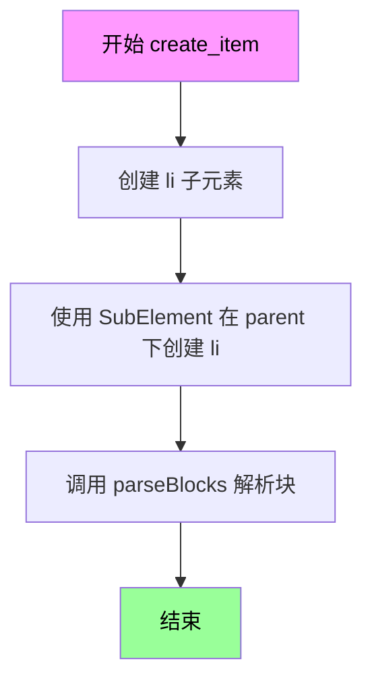

#### 带注释源码

```python
def create_item(self, parent: etree.Element, block: str) -> None:
    """ Create a new `li` and parse the block with it as the parent. """
    # 使用 ElementTree 的 SubElement 在 parent 下创建一个新的 'li' 元素
    li = etree.SubElement(parent, 'li')
    # 调用解析器的 parseBlocks 方法，使用新创建的 li 作为父元素解析 block 内容
    self.parser.parseBlocks(li, [block])
```


### `ListIndentProcessor.get_level`

获取缩进级别，根据列表层级确定当前块的缩进深度，并返回对应的父元素。

参数：

- `parent`：`etree.Element`，父元素，用于遍历子元素以找到正确嵌套层级
- `block`：`str`，待处理的文本块，用于匹配缩进正则表达式

返回值：`tuple[int, etree.Element]`，返回缩进级别（整数）和对应的父元素（元组的第二个元素）

#### 流程图

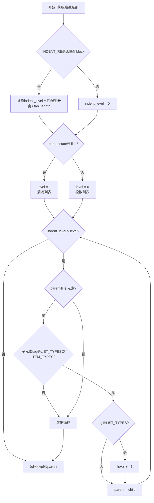

#### 带注释源码

```python
def get_level(self, parent: etree.Element, block: str) -> tuple[int, etree.Element]:
    """ Get level of indentation based on list level. """
    # 使用正则表达式匹配block的缩进前缀
    m = self.INDENT_RE.match(block)
    if m:
        # 计算缩进级别：匹配到的空格数除以tab长度
        indent_level = len(m.group(1))/self.tab_length
    else:
        # 没有缩进则级别为0
        indent_level = 0
    
    # 检查解析器状态，判断当前是否在列表中
    if self.parser.state.isstate('list'):
        # 紧凑列表(tight-list)已经有了正确的父元素
        level = 1
    else:
        # 松散列表(loose-list)需要查找父元素
        level = 0
    
    # 遍历树的子元素以找到匹配的缩进级别
    while indent_level > level:
        # 获取parent的最后一个子元素
        child = self.lastChild(parent)
        # 检查子元素是否为列表或列表项类型
        if (child is not None and
           (child.tag in self.LIST_TYPES or child.tag in self.ITEM_TYPES)):
            if child.tag in self.LIST_TYPES:
                # 如果是列表类型，层级加1
                level += 1
            # 更新parent为当前子元素继续遍历
            parent = child
        else:
            # 没有更多子层级了
            # 如果还不到indent_level，说明是代码块，停止查找
            break
    
    # 返回计算出的缩进级别和最终父元素
    return level, parent
```


### `CodeBlockProcessor.test`

该方法用于测试给定的文本块是否为代码块，通过检查该块是否以缩进（空格）开头来判断。

参数：

- `parent`：`etree.Element`，用于测试的父元素，可根据需要作为测试逻辑的一部分
- `block`：`str`，从源码中按空行分割出的文本块

返回值：`bool`，如果文本块以缩进（空格）开头则返回 `True`，否则返回 `False`

#### 流程图

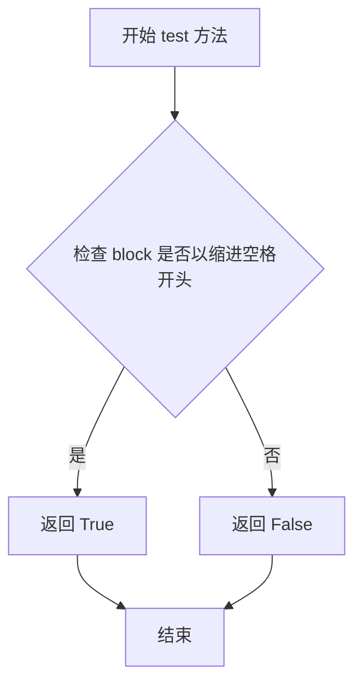

#### 带注释源码

```python
def test(self, parent: etree.Element, block: str) -> bool:
    """测试给定的文本块是否为代码块。
    
    通过检查文本块是否以缩进（空格）开头来判断是否为代码块。
    代码块在 Markdown 中通过缩进来表示，缩进量由 tab_length 决定。
    
    参数:
        parent: etree.Element，父元素（在此方法中未直接使用，仅作为接口签名一部分）
        block: str，要测试的文本块
        
    返回:
        bool，如果文本块以缩进空格开头则返回 True，否则返回 False
    """
    # 生成与 tab_length 相同数量的空格字符串
    # self.tab_length 在构造函数中从 parser.md.tab_length 初始化
    indented_prefix = ' ' * self.tab_length
    
    # 检查文本块是否以指定数量的空格开头
    # 如果是，则认为这是一个代码块
    return block.startswith(indented_prefix)
```


### `CodeBlockProcessor.run`

处理代码块，将缩进的文本块解析为HTML代码元素。

参数：

- `parent`：`etree.Element`，父XML元素，用于追加代码块
- `blocks`：`list[str]`（实际类型`list[str]`），包含待处理文本块的列表

返回值：`None`，该方法直接修改父元素和块列表，不返回任何值

#### 流程图

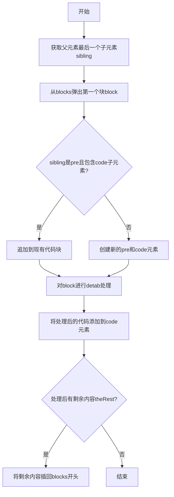

#### 带注释源码

```python
def run(self, parent: etree.Element, blocks: list[str]) -> None:
    """处理代码块，将缩进的文本块转换为HTML代码元素"""
    # 获取父元素的最后一个子元素
    sibling = self.lastChild(parent)
    # 从块列表中弹出第一个块进行处理
    block = blocks.pop(0)
    # 用于存储处理后剩余的内容
    theRest = ''
    
    # 检查上一个兄弟元素是否是代码块（pre元素且包含code子元素）
    if (sibling is not None and sibling.tag == "pre" and
       len(sibling) and sibling[0].tag == "code"):
        # 之前的块已经是代码块，由于空行不会开始新的代码块，
        # 将此块追加到之前的代码块，并添加因分割成列表而移除的换行符
        code = sibling[0]
        # 执行detab操作，处理缩进
        block, theRest = self.detab(block)
        # 使用AtomicString防止进一步处理，更新代码文本内容
        code.text = util.AtomicString(
            '{}\n{}\n'.format(code.text, util.code_escape(block.rstrip()))
        )
    else:
        # 这是一个新的代码块，创建元素并插入文本
        pre = etree.SubElement(parent, 'pre')
        code = etree.SubElement(pre, 'code')
        # 执行detab操作，处理缩进
        block, theRest = self.detab(block)
        # 使用AtomicString防止进一步处理
        code.text = util.AtomicString('%s\n' % util.code_escape(block.rstrip()))
    
    # 如果这个块在第一个缩进行之后包含未缩进的行，
    # 将这些行作为主块列表的第一个块，以便后续处理
    if theRest:
        blocks.insert(0, theRest)
```


### `BlockQuoteProcessor.test`

该方法用于测试给定的文本块是否符合块引用（Block Quote）的语法规则，通过正则表达式匹配块引用标记（`>`）并结合递归深度限制检查来判断。

参数：

- `parent`：`etree.Element`，父元素，用于提供上下文信息（虽然在此方法中未直接使用，但遵循基类接口设计）
- `block`：`str`，从源码中按空行分割出的文本块，需要检测其是否包含块引用标记

返回值：`bool`，如果文本块包含块引用语法且未超过递归深度限制则返回 `True`，否则返回 `False`

#### 流程图

```mermaid
flowchart TD
    A[开始 test 方法] --> B{正则表达式 RE.search(block) 是否匹配}
    B -->|是| C{util.nearing_recursion_limit 返回值}
    B -->|否| D[返回 False]
    C -->|False| E[返回 True]
    C -->|True| D
    E --> F[结束]
    D --> F
```

#### 带注释源码

```python
def test(self, parent: etree.Element, block: str) -> bool:
    """测试给定文本块是否符合块引用语法规则。
    
    该方法通过正则表达式检测文本块中是否包含块引用标记（>），
    同时检查当前递归深度是否接近限制，以防止无限递归。
    
    参数:
        parent: etree.Element，父元素（在此方法中未使用，但遵循基类接口）
        block: str，待测试的文本块
    
    返回:
        bool: 
            - True: 文本块包含块引用标记且未超过递归限制
            - False: 文本块不包含块引用标记或已超过递归限制
    """
    # 使用预编译的正则表达式 RE 在文本块中搜索块引用标记
    # RE 匹配模式: (^|\n)[ ]{0,3}>[ ]?(.*)
    #   - (^|\n): 行的开头或换行符后
    #   - [ ]{0,3}: 可选的0-3个空格（符合Markdown规范）
    #   - >: 块引用标记
    #   - [ ]?: 可选的单个空格
    #   - (.*): 捕获剩余内容
    # bool() 将匹配结果（Match对象或None）转换为布尔值
    return bool(self.RE.search(block)) and not util.nearing_recursion_limit()
```


### `BlockQuoteProcessor.run`

该方法负责解析 Markdown 块引用（blockquote）语法。它从块中提取以 `>` 开头的行，处理块引用前后的内容，创建一个 `blockquote` 元素，并将块引用内的内容递归解析到该元素中。

参数：

- `parent`：`etree.Element`，作为当前块的父元素，用于添加解析后的内容
- `blocks`：`list[str]`，包含文档中所有剩余块的列表，会被修改（pop 操作）

返回值：`None`，无返回值（方法直接修改 ElementTree 树结构和 blocks 列表）

#### 流程图

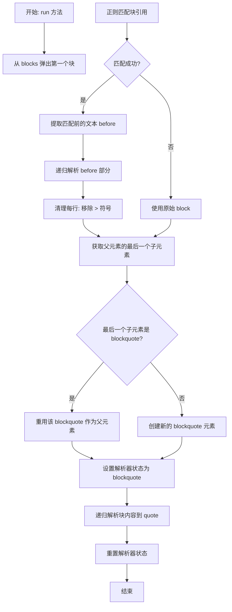

#### 带注释源码

```python
def run(self, parent: etree.Element, blocks: list[str]) -> None:
    """处理块引用（blockquote）解析。
    
    当解析器确定块为块引用类型时调用此方法。该方法解析块中的
    块引用行，创建一个 blockquote 元素，并将内容递归添加到其中。
    
    参数:
        parent: 当前块的父 ElementTree 元素。
        blocks: 文档中剩余的所有块列表。
    """
    # 从块列表中弹出第一块进行处理
    block = blocks.pop(0)
    
    # 使用正则表达式搜索块引用标记 (">")
    m = self.RE.search(block)
    if m:
        # 提取块引用标记之前的内容
        before = block[:m.start()]  # 块引用前的行
        
        # 递归解析块引用前的文本
        self.parser.parseBlocks(parent, [before])
        
        # 移除每行开头的 "> " 符号并清理
        block = '\n'.join(
            [self.clean(line) for line in block[m.start():].split('\n')]
        )
    
    # 获取父元素的最后一个子元素
    sibling = self.lastChild(parent)
    
    # 检查上一个块是否是 blockquote
    if sibling is not None and sibling.tag == "blockquote":
        # 上一个块是 blockquote，继续使用它作为父元素
        quote = sibling
    else:
        # 创建新的 blockquote 元素作为父元素
        quote = etree.SubElement(parent, 'blockquote')
    
    # 设置解析器状态为 blockquote，以便在列表中嵌入的块引用使用 p 标签
    self.parser.state.set('blockquote')
    
    # 递归解析块内容，使用 blockquote 作为父元素
    self.parser.parseChunk(quote, block)
    
    # 重置解析器状态
    self.parser.state.reset()
```


### `BlockQuoteProcessor.clean`

该方法用于移除 Markdown 块引用（blockquote）标记 `>` 从行首，仅返回引用内的实际内容。

参数：

- `line`：`str`，需要处理的文本行，可能包含块引用前缀 `>`

返回值：`str`，移除块引用标记后的文本内容

#### 流程图

```mermaid
flowchart TD
    A[开始: 输入 line] --> B{line.strip == '>'?}
    B -->|是| C[返回空字符串 '']
    B -->|否| D{正则匹配成功?}
    D -->|是| E[返回 m.group(2) 即引用内容]
    D -->|否| F[返回原始 line]
    C --> G[结束: 输出处理后的字符串]
    E --> G
    F --> G
    
    style A fill:#f9f,stroke:#333
    style G fill:#9f9,stroke:#333
```

#### 带注释源码

```python
def clean(self, line: str) -> str:
    """ Remove `>` from beginning of a line. """
    # 使用预编译的正则表达式匹配块引用行
    # 正则: (^|\n)[ ]{0,3}>[ ]?(.*)
    # 匹配: 行首/换行后 可选3个空格 + > + 可选空格 + 捕获剩余内容
    m = self.RE.match(line)
    
    # 检查是否为纯块引用标记行（仅包含 > 或 > 和空格）
    if line.strip() == ">":
        # 空块引用行，返回空字符串
        return ""
    elif m:
        # 正则匹配成功，返回捕获的引用内容（组2）
        # m.group(2) 获取的是 > 之后的实际文本内容
        return m.group(2)
    else:
        # 无块引用标记，返回原始行不变
        return line
```


### OListProcessor.test

该方法用于测试给定的文本块是否符合有序列表（ordered list）的格式。它通过正则表达式检查块是否以数字序号开头（如 "1. Item"），并根据父元素和当前块的内容返回布尔值以决定是否由当前处理器处理该块。

参数：

- `parent`：`etree.Element`，父元素，用于判断当前块的上下文环境（如是否在列表中）
- `block`：`str`，从源文本中按空行分割出的文本块，需要检测其是否为有序列表项

返回值：`bool`，如果文本块符合有序列表的格式则返回 `True`，否则返回 `False`

#### 流程图

```mermaid
flowchart TD
    A[开始 test 方法] --> B[调用 self.RE.match(block)]
    B --> C{匹配结果是否存在?}
    C -->|是| D[将匹配对象转换为布尔值]
    C -->|否| E[返回 False]
    D --> F[返回 bool(match结果)]
    E --> F
```

#### 带注释源码

```python
def test(self, parent: etree.Element, block: str) -> bool:
    """测试块是否为有序列表类型。
    
    该方法使用预编译的正则表达式 self.RE 检查给定的文本块是否匹配
    有序列表项的格式。正则表达式匹配以数字序号开头的内容，例如：
    "1. Item" 或 "   123. Content"。
    
    正则表达式说明：
        ^[ ]{0,%d}\d+\.[ ]+(.*)
        ^           - 行首
        [ ]{0,%d}   - 0到tab_length-1个空格（可缩进）
        \d+        - 一个或多个数字（序号）
        \.         - 点号
        [ ]+       - 一个或多个空格
        (.*)       - 捕获剩余内容
    
    参数:
        parent: etree.Element，父元素（通常为列表或列表项元素）
        block: str，要测试的文本块
    
    返回:
        bool：如果块匹配有序列表格式返回True，否则返回False
    """
    return bool(self.RE.match(block))
```


### `OListProcessor.run`

该方法是有序列表（ordered list）的块处理器核心方法，负责解析 Markdown 中的有序列表（如 `1. Item`），将文本块解析为 HTML 的 `<ol>` 和 `<li>` 元素，并处理多级嵌套列表、列表起始编号、紧密度列表与宽松列表等复杂场景。

参数：

- `parent`：`etree.Element`，当前块的父元素，用于挂载解析后的列表结构
- `blocks`：`list[str]`，文档中剩余的文本块列表，方法会通过 `pop` 操作消费当前块，并通过 `insert` 操作将剩余内容放回队列

返回值：`None`，该方法直接修改 `parent` 元素和 `blocks` 列表，不返回任何值

#### 流程图

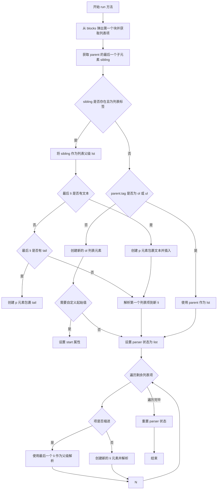

#### 带注释源码

```python
def run(self, parent: etree.Element, blocks: list[str]) -> None:
    """
    运行有序列表处理器。
    
    该方法从 blocks 列表中取出第一个块，解析其中的有序列表项，
    并将结果挂载到 parent 元素下。处理三种情况：
    1. 前面已有列表（追加到现有列表）
    2. parent 本身就是列表（多级嵌套）
    3. 全新的列表（创建新的 ol 元素）
    """
    # 从 blocks 弹出第一个块，并通过 get_items 方法将其拆分为多个列表项
    items = self.get_items(blocks.pop(0))
    
    # 获取 parent 的最后一个子元素，用于判断是否需要追加到现有列表
    sibling = self.lastChild(parent)

    # 判断是否存在已经构建好的列表 sibling
    if sibling is not None and sibling.tag in self.SIBLING_TAGS:
        # 前一个块已经是列表，将新列表项追加到该列表
        lst = sibling
        
        # 确保前一个列表项的最后 li 元素被 p 标签包裹
        # 如果 li 有 text 内容，说明没有 p 标签，需要创建
        if lst[-1].text:
            # 创建 p 元素并插入到 li 的第一个位置
            p = etree.Element('p')
            p.text = lst[-1].text
            lst[-1].text = ''
            lst[-1].insert(0, p)
        
        # 如果最后 li 有 tail（尾随文本），也需要放入 p 标签
        # 这种情况常见于标题后没有空行的情况
        lch = self.lastChild(lst[-1])
        if lch is not None and lch.tail:
            p = etree.SubElement(lst[-1], 'p')
            p.text = lch.tail.lstrip()
            lch.tail = ''

        # 为第一个列表项创建新的 li 元素并解析
        # 设置为 looselist 状态，因为第一个项需要用 p 标签包裹
        li = etree.SubElement(lst, 'li')
        self.parser.state.set('looselist')
        firstitem = items.pop(0)
        self.parser.parseBlocks(li, [firstitem])
        self.parser.state.reset()
    
    # 处理多级缩进列表的边缘情况
    # 例如：父列表项为空的情况
    # * * subitem1
    #     * subitem2
    elif parent.tag in ['ol', 'ul']:
        lst = parent
    
    # 创建一个全新的列表
    else:
        # 使用 TAG 属性创建 ol 或 ul 元素
        lst = etree.SubElement(parent, self.TAG)
        
        # 如果不是延迟起始（LAZY_OL）且设置了自定义起始值
        # 为 ol 标签添加 start 属性
        if not self.LAZY_OL and self.STARTSWITH != '1':
            lst.attrib['start'] = self.STARTSWITH

    # 设置 parser 状态为 list，表示正在解析列表
    self.parser.state.set('list')
    
    # 遍历剩余的列表项
    for item in items:
        # 如果列表项以缩进开头，说明是嵌套的列表项
        if item.startswith(' '*self.tab_length):
            # 使用最后一个 li 元素作为父级进行解析
            self.parser.parseBlocks(lst[-1], [item])
        else:
            # 新的列表项，创建新的 li 元素
            li = etree.SubElement(lst, 'li')
            self.parser.parseBlocks(li, [item])
    
    # 重置 parser 状态
    self.parser.state.reset()
```


### `OListProcessor.get_items`

该方法是 OListProcessor 类中的核心方法，用于将一个文本块（block）拆解成多个有序列表项（list items）。它逐行遍历文本块，使用正则表达式匹配来识别新列表项、缩进嵌套项或延续前一行内容的项，最终返回一个由各个列表项内容组成的字符串列表。

参数：

- `block`：`str`，要处理的有序列表文本块，包含一行或多行文本，列表项之间用换行符分隔

返回值：`list[str]`拆分后的列表项文本列表，每个元素代表一个独立的列表项内容

#### 流程图

```mermaid
flowchart TD
    A[开始 get_items] --> B[初始化空列表 items]
    B --> C[按换行符分割 block 为行列表]
    C --> D{遍历所有行}
    D -->|还有未处理行| E[取出一行 line]
    E --> F{CHILD_RE 匹配 line?}
    F -->|是| G[这是新列表项]
    G --> H{是第一个列表项 且 是有序列表?}
    H -->|是| I[检测起始索引数字<br/>更新 STARTSWITH 属性]
    H -->|否| J[跳过检测]
    I --> K[提取列表项内容 m.group(3)<br/>添加到 items]
    J --> K
    F -->|否| L{INDENT_RE 匹配 line?}
    L -->|是| M[这是缩进嵌套项]
    M --> N{最后一个 items 项以缩进开头?}
    N -->|是| O[用换行符追加到最后一个 items 项]
    N -->|否| P[创建新列表项追加到 items]
    L -->|否| Q[这是前一个列表项的延续行]
    Q --> O
    K --> D
    O --> D
    P --> D
    D -->|所有行处理完毕| R[返回 items 列表]
    R --> S[结束]
```

#### 带注释源码

```python
def get_items(self, block: str) -> list[str]:
    """ Break a block into list items. """
    # 初始化一个空列表用于存储解析出的列表项
    items = []
    
    # 遍历块中的每一行
    for line in block.split('\n'):
        # 使用 CHILD_RE 正则匹配新列表项（可以是 ol 或 ul 格式）
        m = self.CHILD_RE.match(line)
        
        if m:
            # 这是一个新的列表项
            # 检查第一个列表项的起始索引（仅对有序列表有效）
            if not items and self.TAG == 'ol':
                # 检测第一个列表项的整数值为起始数字
                INTEGER_RE = re.compile(r'(\d+)')
                self.STARTSWITH = INTEGER_RE.match(m.group(1)).group()
            
            # 将列表项内容追加到 items 列表
            # m.group(3) 包含列表项的实际文本内容（不含序号标记）
            items.append(m.group(3))
        
        elif self.INDENT_RE.match(line):
            # 这是一个缩进的（可能是嵌套的）列表项
            if items[-1].startswith(' '*self.tab_length):
                # 前一个列表项也是缩进的，将当前行追加到该列表项
                items[-1] = '{}\n{}'.format(items[-1], line)
            else:
                # 前一个列表项不是缩进的，创建新的列表项
                items.append(line)
        
        else:
            # 这是前一个列表项的延续行（内容行，非列表标记）
            # 将当前行追加到最后一个列表项
            items[-1] = '{}\n{}'.format(items[-1], line)
    
    # 返回解析后的所有列表项
    return items
```


### `UListProcessor.__init__`

该方法是 `UListProcessor` 类的构造函数，用于初始化无序列表块处理器。它继承自 `OListProcessor`，设置无序列表的 HTML 标签为 `ul`，并配置用于检测无序列表项的正则表达式。

参数：

- `parser`：`BlockParser`，Markdown 块解析器实例，用于解析文档中的块级元素

返回值：`None`，无返回值

#### 流程图

```mermaid
flowchart TD
    A[开始 __init__] --> B[调用 super().__init__parser]
    B --> C[设置 TAG = 'ul']
    C --> D[编译正则表达式 self.RE<br/>匹配无序列表项模式<br/>r'^[ ]{0,%d}[*+-][ ]+(.*)']
    E[结束 __init__]
    D --> E
```

#### 带注释源码

```python
def __init__(self, parser: BlockParser):
    """ 初始化无序列表块处理器。 """
    # 调用父类 OListProcessor 的构造函数
    # 继承父类的所有属性和方法
    super().__init__(parser)
    
    # 设置无序列表的 HTML 标签为 'ul'
    # 用于后续创建 <ul> 元素包装无序列表内容
    self.TAG = 'ul'
    
    # 编译正则表达式用于检测无序列表项
    # 模式说明：
    #   ^[ ]{0,%d} - 行首可选择0到tab_length-1个空格
    #   [*+-]     - 匹配无序列表标记：星号(*)、加号(+)或减号(-)
    #   [ ]+      - 至少一个空格作为分隔符
    #   (.*)      - 捕获列表项的内容
    # 示例匹配：'* item', '  - subitem', '+ another'
    self.RE = re.compile(r'^[ ]{0,%d}[*+-][ ]+(.*)' % (self.tab_length - 1))
```


### `HashHeaderProcessor.test`

该方法用于检测 Markdown 文本块中是否包含哈希风格标题（Atx 风格标题），即以 1-6 个 `#` 符号开头的标题行。

参数：

- `parent`：`etree.Element`，父元素，用于上下文判断（虽然此方法主要检查文本内容）
- `block`：`str`，待检测的文本块，可能包含多行文本

返回值：`bool`，如果文本块中存在符合哈希标题格式的内容则返回 `True`，否则返回 `False`

#### 流程图

```mermaid
flowchart TD
    A[开始 test 方法] --> B{使用正则表达式搜索 block}
    B --> C[匹配成功?]
    C -->|是| D[返回 True]
    C -->|否| E[返回 False]
    E --> F[结束]
    D --> F
```

#### 带注释源码

```python
def test(self, parent: etree.Element, block: str) -> bool:
    """检测文本块是否包含哈希风格标题（Atx 风格）。
    
    使用预编译的正则表达式 RE 在文本块中搜索符合以下格式的内容：
    - 以换行符或字符串开头
    - 1-6 个 # 符号（表示标题级别）
    - 标题文本
    - 可选的尾随 # 符号
    - 换行符或字符串结尾
    
    Args:
        parent: etree.Element，父元素（此方法中未直接使用）
        block: str，要检测的文本块
        
    Returns:
        bool，如果找到匹配的哈希标题则返回 True，否则返回 False
    """
    # 使用正则表达式搜索块文本中是否存在哈希标题模式
    # re.search 会在文本中查找第一个匹配项，而不是要求完全匹配
    return bool(self.RE.search(block))
```


### `HashHeaderProcessor.run`

该方法负责解析 Markdown 中的 ATX 风格标题（Hash Headers），即以 `#` 到 `######` 开头的标题行。它从块列表中提取当前块，使用正则表达式匹配标题及其级别，然后创建对应的 HTML `h1` 到 `h6` 元素添加到 DOM 树中，同时处理标题前后的文本内容。

参数：

- `parent`：`etree.Element`，父元素，用于将解析后的标题元素作为子元素添加到该父元素中
- `blocks`：`list[str]`，剩余的文档块列表，当前方法会 pop（弹出）第一个块进行处理，可能将未处理完的内容插入回列表

返回值：`None`，该方法直接修改 `parent` 元素和 `blocks` 列表，不返回任何值

#### 流程图

```mermaid
flowchart TD
    A[开始 run 方法] --> B[从 blocks 列表弹出第一个块]
    B --> C{正则表达式是否匹配成功}
    C -->|是| D[提取 before: 匹配前的文本]
    D --> E{before 是否为空}
    E -->|否| F[递归解析 before 部分]
    E -->|是| G[跳过解析]
    F --> G
    G --> H[获取标题级别和标题文本]
    H --> I[创建 h{level} 元素]
    I --> J[设置标题文本并添加到 parent]
    J --> K{after 是否为空}
    K -->|否| L{当前状态是否为 looselist}
    L -->|是| M[对 after 进行 looseDetab 处理]
    L -->|否| N[保持 after 不变]
    M --> O[将 after 插入 blocks 列表头部]
    N --> O
    K -->|是| P[结束方法]
    O --> P
    C -->|否| Q[记录警告日志]
    Q --> P
```

#### 带注释源码

```python
def run(self, parent: etree.Element, blocks: list[str]) -> None:
    """处理 ATX 风格标题块，将其转换为 HTML h1-h6 元素。
    
    该方法从 blocks 列表中取出第一个块，使用正则表达式匹配其中的
    标题格式，提取标题级别和文本内容，然后创建对应的 HTML 元素
    添加到父元素中。标题前后的内容会被适当处理。
    
    参数:
        parent: 父 ElementTree 元素，标题将作为其子元素添加
        blocks: 文档剩余块的列表，会被原地修改
    """
    # 从块列表中弹出第一个块进行处理
    block = blocks.pop(0)
    # 使用预编译的正则表达式搜索标题模式
    # 正则匹配: (# 到 ######) 开头，可选结尾的 #，捕获级别和文本
    m = self.RE.search(block)
    if m:
        # 获取匹配前的所有行（标题不在块的第一行时可能存在）
        before = block[:m.start()]  # 标题之前的所有内容
        # 获取匹配后的所有行（标题后的内容）
        after = block[m.end():]     # 标题之后的所有内容
        
        # 如果标题前有内容，需要先递归解析这些行
        if before:
            # 由于标题不是块的第一个且标题前的行必须先被解析，
            # 递归将这些行作为一个块进行解析
            self.parser.parseBlocks(parent, [before])
        
        # 使用正则命名组创建标题
        # level 是 # 的数量 (1-6)，决定 h1-h6 标签
        h = etree.SubElement(parent, 'h%d' % len(m.group('level')))
        # 设置标题文本内容，去除首尾空白
        h.text = m.group('header').strip()
        
        # 如果标题后还有内容，需要将其放回块列表待后续处理
        if after:
            # 将剩余行作为第一个块插入，等待后续解析器处理
            if self.parser.state.isstate('looselist'):
                # 这是一个边界情况：标题是宽松列表的子元素
                # 且标题后没有空行。为确保正确解析，
                # 需要对后续行进行 detab 处理。参见 #1443
                after = self.looseDetab(after)
            # 将处理后的后续内容插入块列表头部
            blocks.insert(0, after)
    else:  # pragma: no cover
        # 理论上不应执行到这里，但以防万一
        # 记录无法解析的标题问题
        logger.warn("We've got a problem header: %r" % block)
```


### `SetextHeaderProcessor.test`

该方法用于检测给定的文本块是否为 Setext 风格的标题（一种使用下划线行定义标题的 Markdown 语法）。通过正则表达式匹配文本块的前两行是否符合 Setext 标题格式（第一行为标题文本，第二行为由等号 `=` 或短横线 `-` 组成的下划线行），返回布尔值表示测试结果。

参数：

- `parent`：`etree.Element`，父 ElementTree 元素，用于上下文判断（虽然当前实现未使用）
- `block`：`str`，从源码中按空行分割出的文本块，用于检测是否为 Setext 标题格式

返回值：`bool`，如果文本块符合 Setext 标题格式则返回 `True`，否则返回 `False`

#### 流程图

```mermaid
flowchart TD
    A[开始 test 方法] --> B[调用 self.RE.match(block)]
    B --> C{匹配结果是否为空}
    C -->|否, 匹配成功| D[返回 True]
    C -->|是, 匹配失败| E[返回 False]
    D --> F[结束]
    E --> F
```

#### 带注释源码

```python
def test(self, parent: etree.Element, block: str) -> bool:
    """检测文本块是否为 Setext 风格标题。
    
    参数:
        parent: 父 ElementTree 元素（当前方法未使用，仅为接口一致性）。
        block: 待检测的文本块内容。
    
    返回:
        bool: 如果 block 匹配 Setext 标题正则表达式则返回 True，否则返回 False。
    """
    # 使用预编译的正则表达式匹配 block
    # 正则表达式: ^.*?\n[=-]+[ ]*(\n|$)
    #   - ^.*? : 匹配第一行（标题文本），非贪婪模式
    #   - \n   : 换行符
    #   - [=-]+: 匹配一个或多个等号或短横线
    #   - [ ]* : 匹配零个或多个空格
    #   - (\n|$): 匹配换行符或字符串结尾
    # re.MULTILINE 模式使 ^ 匹配每行开头
    return bool(self.RE.match(block))
```


### `SetextHeaderProcessor.run`

该方法用于处理 Setext 风格的 Markdown 标题（一种使用下划线语法定义的标题，如使用 `=` 标记一级标题，使用 `-` 标记二级标题）。它从块中提取前两行，根据第二行的字符确定标题级别，然后创建对应的 HTML 标题元素并添加到父元素中，如果块中还有剩余行则将其放回待处理块列表。

参数：

- `parent`：`etree.Element`，父元素，用于挂载生成的标题元素
- `blocks`：`list[str]`，剩余的文档块列表，从中取出当前块进行处理，处理后可能重新插入剩余内容

返回值：`None`，该方法直接修改 ElementTree 结构，不返回任何值

#### 流程图

```mermaid
flowchart TD
    A[开始执行 run 方法] --> B[从 blocks 弹出第一个块并按行分割]
    B --> C{判断第二行是否以 '=' 开头?}
    C -->|是| D[设置 level = 1]
    C -->|否| E[设置 level = 2]
    D --> F[创建 h1 元素]
    E --> G[创建 h2 元素]
    F --> H[设置标题文本为第一行内容]
    G --> H
    H --> I{块是否有超过2行内容?}
    I -->|是| J[将第3行及之后的行合并并插入 blocks 列表开头]
    I -->|否| K[结束]
    J --> K
```

#### 带注释源码

```python
def run(self, parent: etree.Element, blocks: list[str]) -> None:
    """
    处理 Setext 风格标题的块处理器。

    Setext 风格标题使用下划线语法：
    一级标题：文本后跟一行以等号开头
    二级标题：文本后跟一行以连字符开头

    参数:
        parent: 父 ElementTree 元素，标题将作为子元素添加到此元素
        blocks: 文档中剩余块的列表，第一个元素是当前待处理的块

    返回:
        None: 直接修改 ElementTree 结构，不返回值
    """
    # 从块列表中弹出第一个块（当前待处理块），并按换行符分割成行列表
    lines = blocks.pop(0).split('\n')

    # 确定标题级别：'=' 对应一级标题 h1，'-' 对应二级标题 h2
    if lines[1].startswith('='):
        level = 1  # 一级标题
    else:
        level = 2  # 二级标题

    # 在父元素下创建对应级别的标题元素（h1 或 h2）
    h = etree.SubElement(parent, 'h%d' % level)

    # 设置标题文本内容为第一行内容，并去除首尾空白
    h.text = lines[0].strip()

    # 如果块中有超过2行（即除了标题行和下划线行外还有内容）
    if len(lines) > 2:
        # 将剩余行合并成一个字符串，并重新插入到块列表开头
        # 以便后续处理器继续处理这些内容
        blocks.insert(0, '\n'.join(lines[2:]))
```


### `HRProcessor.test`

该方法用于检测文本块是否符合 Markdown 水平线（Horizontal Rule）的语法规则，通过正则表达式匹配三种可能的水平线样式（-、_、*），并在匹配成功时保存匹配对象供后续 `run` 方法使用。

参数：

- `parent`：`etree.Element`，父元素节点，用于判断当前块所在的上下文环境（虽然此方法主要基于文本内容检测，但保留此参数以符合基类接口）
- `block`：`str`，待检测的文本块，即根据空行分割后的 Markdown 文档片段

返回值：`bool`，如果文本块包含符合水平线规则的内容返回 `True`，否则返回 `False`

#### 流程图

```mermaid
flowchart TD
    A[开始 test 方法] --> B{使用 SEARCH_RE.search<br/>搜索 block 中的水平线模式}
    B -->|找到匹配| C[保存匹配对象到 self.match]
    C --> D[返回 True]
    B -->|未找到匹配| E[返回 False]
    D --> F[结束]
    E --> F
```

#### 带注释源码

```python
def test(self, parent: etree.Element, block: str) -> bool:
    """
    测试给定的文本块是否符合水平线（Horizontal Rule）的语法规则。
    
    该方法使用预编译的正则表达式 SEARCH_RE 在文本块中搜索水平线模式。
    支持三种水平线样式：连字符（-）、下划线（_）和星号（*）。
    每种样式需要至少3个字符，且前后允许最多2个空格。
    
    参数:
        parent: 父元素节点（etree.Element），提供块所在的上下文，
                虽然此实现中主要依据文本内容检测，但保留此参数以符合基类接口。
        block: 待检测的文本块（str），是根据空行分割后的 Markdown 文档片段。
    
    返回:
        bool: 如果文本块包含符合水平线规则的内容返回 True，否则返回 False。
              匹配成功后，匹配对象会被保存在实例属性 self.match 中，
              供后续的 run 方法使用。
    """
    # 使用 MULTILINE 模式的正则表达式在 block 中搜索水平线模式
    m = self.SEARCH_RE.search(block)
    
    # 如果找到匹配
    if m:
        # 将匹配对象保存在类实例属性 self.match 中
        # 这样在后续调用 run 方法时可以获取完整匹配信息
        # （包括水平线前后的内容位置等）
        self.match = m
        # 返回 True 表示当前块是水平线
        return True
    
    # 未找到匹配，返回 False
    return False
```


### `HRProcessor.run`

该方法用于处理 Markdown 文档中的水平线（Horizontal Rules）块。当检测到水平线语法（如 `---`、`___` 或 `***`）时，该方法会解析水平线前后的文本内容，创建一个 `<hr>` 元素添加到 ElementTree 中，并将剩余的块内容放回待处理队列。

参数：

- `parent`：`etree.Element`，当前块的父元素，用于追加生成的 `<hr>` 元素
- `blocks`：`list[str]`，包含所有剩余文档块的列表，第一个元素是被处理的块

返回值：`None`，该方法直接修改 `parent` ElementTree 和 `blocks` 列表，不返回任何值

#### 流程图

```mermaid
flowchart TD
    A[开始执行 run 方法] --> B[从 blocks 列表弹出第一个块]
    B --> C[获取之前 test 方法保存的 match 对象]
    C --> D{检查水平线前是否有内容}
    D -->|有| E[递归解析水平线前的块]
    D -->|无| F[跳过解析]
    E --> F
    F --> G[在 parent 元素下创建 hr 元素]
    G --> H{检查水平线后是否有内容}
    H -->|有| I[将剩余内容插入 blocks 列表开头]
    H -->|无| J[结束]
    I --> J
```

#### 带注释源码

```python
def run(self, parent: etree.Element, blocks: list[str]) -> None:
    """
    运行水平线处理器，解析并转换 Markdown 水平线为 HTML hr 元素。
    
    参数:
        parent: etree.Element，水平线元素的父容器
        blocks: list[str]，待处理的文档块列表
    """
    # 从块列表中弹出当前要处理的块
    block = blocks.pop(0)
    # 获取之前 test() 方法中匹配到的水平线正则对象
    match = self.match
    
    # 提取水平线之前的所有行（去除末尾换行符）
    prelines = block[:match.start()].rstrip('\n')
    if prelines:
        # 如果水平线前有内容，递归解析这些行
        # 确保水平线前的文本先被正确处理
        self.parser.parseBlocks(parent, [prelines])
    
    # 在父元素下创建 <hr> 元素
    etree.SubElement(parent, 'hr')
    
    # 提取水平线之后的所有行（去除开头换行符）
    postlines = block[match.end():].lstrip('\n')
    if postlines:
        # 将水平线后的内容放回块列表开头，留待后续处理器处理
        blocks.insert(0, postlines)
```


### `EmptyBlockProcessor.test`

测试给定的文本块是否为空或以空行开头，用于处理空块或以空行开头的块。

参数：

- `parent`：`etree.Element`，父 ElementTree 元素，用于判断当前块的上下文
- `block`：`str`，从源码中按空行分割出的文本块

返回值：`bool`，如果块为空或以换行符开头返回 `True`，否则返回 `False`

#### 流程图

```mermaid
flowchart TD
    A[开始 test 方法] --> B{block 是否为空或 None"}
    B -->|是| C[返回 True]
    B -->|否| D{"block 是否以换行符 '\\n' 开头"}
    D -->|是| E[返回 True]
    D -->|否| F[返回 False]
    C --> G[结束]
    E --> G
    F --> G
```

#### 带注释源码

```python
def test(self, parent: etree.Element, block: str) -> bool:
    """测试块是否为空或以空行开头。
    
    该方法检查给定的文本块是否符合 EmptyBlockProcessor 的处理条件：
    1. 块为空（长度为0）
    2. 块以换行符开头（即第一行是空行）
    
    参数:
        parent: 父 ElementTree 元素，用于判断块的上下文（虽然此处理器不常用）
        block: 从源码中按空行分割出的文本块
        
    返回:
        bool: 如果块为空或以换行符开头返回 True，否则返回 False
    """
    # 检查块是否为空（空字符串或 None）
    # not block 在 block 为空字符串时返回 True
    # 在 Python 中，空字符串 '' 为 falsy 值
    return not block or block.startswith('\n')
```


### `EmptyBlockProcessor.run`

处理空行块或以空行开头的块，将空行转换为适当的换行符，并在前一个块是代码块时保留空白。

参数：

- `parent`：`etree.Element`，当前块的父元素，用于附加子元素
- `blocks`：`list[str]`，文档中所有剩余块的列表，会被原地修改

返回值：`None`，该方法直接修改 `parent` 元素和 `blocks` 列表，不返回任何值

#### 流程图

```mermaid
flowchart TD
    A[开始] --> B[从blocks中弹出第一个块]
    B --> C{块是否为空?}
    C -->|是| D[设置filler为'\n\n']
    C -->|否| E[设置filler为'\n']
    E --> F[保存块的剩余部分到theRest]
    F --> G{theRest是否存在?}
    G -->|是| H[将theRest插入blocks开头]
    G -->|否| I[获取parent的最后一个子元素]
    D --> I
    H --> I
    I --> J{最后一个子元素存在且为pre/code?}
    J -->|是| K[追加filler到code元素的文本]
    J -->|否| L[结束]
    K --> L
```

#### 带注释源码

```python
def run(self, parent: etree.Element, blocks: list[str]) -> None:
    """处理空块或以空行开头的块。
    
    该方法会将空行转换为适当的换行符。如果前一个兄弟元素
    是代码块(pre/code)，则会将换行符追加到代码块文本中
    以保留空白。
    """
    # 从块列表中弹出第一个块
    block = blocks.pop(0)
    # 默认使用双换行符(段落间隔)
    filler = '\n\n'
    if block:
        # 块不为空，说明是以空行开头的块
        # 只替换单个空行
        filler = '\n'
        # 保存剩余部分(去掉第一个字符后)
        theRest = block[1:]
        if theRest:
            # 将剩余行添加回主块列表以供后续处理
            blocks.insert(0, theRest)
    
    # 获取父元素的最后一个子元素
    sibling = self.lastChild(parent)
    # 检查最后一个子元素是否是代码块
    if (sibling is not None and sibling.tag == 'pre' and
       len(sibling) and sibling[0].tag == 'code'):
        # 最后一个块是代码块，追加空白以保留空白
        # 使用AtomicString确保内容不会被进一步处理
        sibling[0].text = util.AtomicString(
            '{}{}'.format(sibling[0].text, filler)
        )
```


### `ReferenceProcessor.test`

该方法用于测试给定的文本块是否为链接引用（reference link definition）。由于 ReferenceProcessor 旨在处理链接引用定义，其 `test` 方法简单返回 True，表示该处理器应该尝试处理该块，实际的匹配验证在 `run` 方法中进行。

参数：

- `parent`：`etree.Element`，块的父元素，用于判断块的上下文
- `block`：`str`，从源码中按空行分割出的文本块

返回值：`bool`，返回 True 表示该处理器应该处理此块

#### 流程图

```mermaid
flowchart TD
    A[开始 test 方法] --> B[返回 True]
    B --> C[结束]
    
    说明: 由于 ReferenceProcessor 旨在处理所有可能的链接引用块,
    test 方法简单返回 True 让 run 方法进行实际匹配验证
```

#### 带注释源码

```python
def test(self, parent: etree.Element, block: str) -> bool:
    """ Test for block type - reference processor always accepts for processing.
    
    The ReferenceProcessor is designed to handle link reference definitions
    (e.g., [id]: http://example.com "Title"). Since the actual matching logic
    is complex and involves regex patterns, this method simply returns True
    to allow the run method to perform the actual pattern matching.
    
    Keyword arguments:
        parent: An `etree` element which will be the parent of the block.
        block: A block of text from the source which has been split at blank lines.
    """
    return True
```


### `ReferenceProcessor.run`

处理Markdown文档中的链接引用定义（如 `[id]: url "title"` 格式），将提取的引用信息存储到Markdown对象的references字典中，并返回是否成功处理。

#### 参数

- `self`：`ReferenceProcessor`，方法所属的类实例
- `parent`：`etree.Element`，当前块的父元素，用于将解析后的元素添加到ElementTree中
- `blocks`：`list[str]`，文档中剩余的文本块列表，方法会从这个列表中pop（取出）第一个块进行处理，并根据需要将未处理的内容重新插入列表

#### 返回值

- `bool`：如果成功匹配并处理了链接引用定义则返回 `True`，否则返回 `False`

#### 流程图

```mermaid
flowchart TD
    A[开始执行 run 方法] --> B[从 blocks 列表中 pop 第一个块]
    B --> C{使用正则表达式 RE 搜索块}
    C -->|匹配成功| D[提取引用信息: id, link, title]
    C -->|匹配失败| H[将块重新插入 blocks 列表头部]
    H --> I[返回 False]
    D --> E{检查 id 是否存在}
    E -->|id 已存在| F[覆盖原有的引用]
    E -->|id 不存在| G[添加新引用到 references 字典]
    F --> J{块中是否有后续内容}
    G --> J
    J -->|有后续内容| K[将后续内容插入 blocks 列表头部]
    J -->|无后续内容| L{块前是否有内容}
    L -->|有前置内容| M[将前置内容插入 blocks 列表头部]
    K --> N[返回 True]
    M --> N
    L --> N
```

#### 带注释源码

```python
def run(self, parent: etree.Element, blocks: list[str]) -> bool:
    """处理链接引用定义块。
    
    链接引用定义的格式为：
    [id]: url "title"  或
    [id]: url 'title' 或
    [id]: url (title)
    
    Args:
        parent: 父元素，用于构建ElementTree
        blocks: 剩余的文本块列表
        
    Returns:
        bool: 是否成功处理了链接引用
    """
    # 从块列表中取出第一个块进行处理
    block = blocks.pop(0)
    
    # 使用正则表达式搜索链接引用定义
    # 正则表达式解析：
    # ^[ ]{0,3}            - 行首，可选0-3个空格
    # \[([^\[\]]*)\]:      - 匹配 [id]: 格式，捕获id
    # [ ]*\n?[ ]*          - 可选的空格和换行
    # ([^\s]+)             - 捕获URL链接
    # [ ]*                 - 可选空格
    # (?:\n[ ]*)?          - 可选的换行和缩进
    # (["\'])(.*)\4        - 捕获双引号或单引号包裹的标题
    # |                    - 或者
    # \((.*)\)             - 捕获括号包裹的标题
    m = self.RE.search(block)
    
    if m:
        # 提取引用ID并转换为小写（Markdown规范要求ID不区分大小写）
        id = m.group(1).strip().lower()
        
        # 提取链接地址，去除可能的尖括号（如 <url>）
        link = m.group(2).lstrip('<').rstrip('>')
        
        # 提取标题（可能是双引号、单引号或括号格式）
        # m.group(5) 是引号格式的标题，m.group(6) 是括号格式的标题
        title = m.group(5) or m.group(6)
        
        # 将引用存储到 Markdown 对象的 references 字典中
        # 字典结构: {id: (link, title)}
        self.parser.md.references[id] = (link, title)
        
        # 处理匹配之后的内容
        if block[m.end():].strip():
            # 将匹配部分之后的内容重新放回块列表，等待后续处理
            blocks.insert(0, block[m.end():].lstrip('\n'))
        
        # 处理匹配之前的内容
        if block[:m.start()].strip():
            # 将匹配部分之前的内容重新放回块列表，等待后续处理
            blocks.insert(0, block[:m.start()].rstrip('\n'))
        
        # 成功处理了链接引用
        return True
    
    # 没有匹配到链接引用定义
    # 将原始块放回块列表，以便其他处理器可以处理
    blocks.insert(0, block)
    return False
```


### `ParagraphProcessor.test`

该方法用于测试给定文本块是否应由段落处理器处理。在 `ParagraphProcessor` 中，该方法始终返回 `True`，表示它愿意处理任何未被其他处理器捕获的块，这使其成为块处理链中的默认/后备处理器。

参数：

- `parent`：`etree.Element`，父元素，表示该块将附加到的 ElementTree 元素
- `block`：`str`，从源码中按空行分割出的文本块

返回值：`bool`，返回 `True` 表示该块应由此处理器处理，返回 `False` 则跳过

#### 流程图

```mermaid
flowchart TD
    A[开始 test 方法] --> B[接收 parent 和 block 参数]
    B --> C[直接返回 True]
    C --> D[结束: 告知解析器该块应由段落处理器处理]
```

#### 带注释源码

```python
def test(self, parent: etree.Element, block: str) -> bool:
    """ Test for block type. Must be overridden by subclasses.

    As the parser loops through processors, it will call the `test`
    method on each to determine if the given block of text is of that
    type. This method must return a boolean `True` or `False`. The
    actual method of testing is left to the needs of that particular
    block type. It could be as simple as `block.startswith(some_string)`
    or a complex regular expression. As the block type may be different
    depending on the parent of the block (i.e. inside a list), the parent
    `etree` element is also provided and may be used as part of the test.

    Keyword arguments:
        parent: An `etree` element which will be the parent of the block.
        block: A block of text from the source which has been split at blank lines.
    """
    return True  # 段落处理器始终接受处理，作为默认/后备处理器
```


### `ParagraphProcessor.run`

处理段落块，将文本块转换为 ElementTree 中的 `<p>` 元素或将其附加到现有父元素的文本中。该方法是 Markdown 解析器块处理流程的最终回退处理器，当其他处理器都不匹配时使用。

参数：

- `parent`：`etree.Element`，父 ElementTree 元素，当前块的父节点
- `blocks`：`list[str]`，文档中所有剩余块的列表

返回值：`None`，无返回值（方法通过修改 `parent` 和 `blocks` 对象实现副作用）

#### 流程图

```mermaid
flowchart TD
    A[开始] --> B[从blocks中pop第一个块]
    B --> C{block.strip()是否为空?}
    C -->|是| D[不做处理, 方法结束]
    C -->|否| E{parser.state是否为list状态?}
    E -->|是| F[获取父元素的最后一个子元素sibling]
    F --> G{sibling是否存在?}
    G -->|是| H{sibling.tail是否存在?}
    H -->|是| I[将block追加到sibling.tail]
    H -->|否| J[设置sibling.tail为block]
    G -->|否| K{parent.text是否存在?}
    K -->|是| L[将block追加到parent.text]
    K -->|否| M[设置parent.text为block.lstrip]
    E -->|否| N[创建新的p元素]
    N --> O[设置p.text为block.lstrip]
    O --> P[将p添加到parent作为子元素]
    I --> Q[方法结束]
    J --> Q
    L --> Q
    M --> Q
    P --> Q
```

#### 带注释源码

```python
def run(self, parent: etree.Element, blocks: list[str]) -> None:
    """
    运行处理器，将文本块转换为段落元素。

    该方法是Markdown块解析流程的最终回退处理器。
    当其他所有块处理器都不匹配时，此方法被调用来处理剩余的文本块。

    参数:
        parent: 父ElementTree元素，当前块的容器节点
        blocks: 文档中所有剩余块的列表（会被修改）
    """
    # 从块列表中取出第一个块进行处理
    block = blocks.pop(0)

    # 检查块是否为空（只包含空白字符）
    if block.strip():
        # 非空块：需要添加到DOM树中

        # 检查解析器当前是否处于list状态（紧排列表中）
        if self.parser.state.isstate('list'):
            # === 处理紧排列表(tight-list)中的段落 ===
            # 这种情况发生在列表项中的标题没有空行跟随时
            # 例如: * # Header
            #      Line 2 of list item - not part of header.

            # 获取父元素的最后一个子元素
            sibling = self.lastChild(parent)

            if sibling is not None:
                # 兄弟元素存在，将其作为插入点
                if sibling.tail:
                    # 如果兄弟元素已有尾部文本，追加新块
                    sibling.tail = '{}\n{}'.format(sibling.tail, block)
                else:
                    # 设置尾部文本
                    sibling.tail = '\n%s' % block
            else:
                # 没有兄弟元素，直接追加到父元素的文本
                if parent.text:
                    # 已有文本，追加新块
                    parent.text = '{}\n{}'.format(parent.text, block)
                else:
                    # 设置初始文本（去除前导空白）
                    parent.text = block.lstrip()
        else:
            # === 处理普通段落 ===
            # 创建一个新的<p>元素作为段落容器
            p = etree.SubElement(parent, 'p')
            # 设置段落文本（去除前导空白）
            p.text = block.lstrip()
```

## 关键组件


### BlockProcessor

Base class for all block processors, providing common methods for tree manipulation and block parsing. Defines abstract `test` and `run` methods that subclasses must implement.

### ListIndentProcessor

Processes indented children of list items, handling nested lists and maintaining proper indentation levels through recursive parsing.

### CodeBlockProcessor

Processes code blocks that are indented with spaces (typically 4 spaces or one tab), creating `<pre><code>` elements in the ElementTree.

### BlockQuoteProcessor

Processes blockquotes marked with `>` prefix, handling multi-line blockquotes and recursively parsing content within `<blockquote>` elements.

### OListProcessor

Processes ordered lists (numbered lists like 1., 2., etc.), handling list numbering, nesting, and mixed list types within the same parent.

### UListProcessor

Processes unordered lists (bullet lists using *, -, or + markers), inheriting from OListProcessor and overriding the tag type.

### HashHeaderProcessor

Processes ATX-style headers (lines starting with # through ######), extracting header level from the number of hash symbols.

### SetextHeaderProcessor

Processes Setext-style headers (text followed by underline with = or -), converting underline characters to header levels (h1 or h2).

### HRProcessor

Processes horizontal rules (---, ***, ___) at any position in a block, using atomic regex groups for accurate matching.

### EmptyBlockProcessor

Processes empty blocks or blocks starting with empty lines, handling whitespace preservation in code blocks.

### ReferenceProcessor

Processes link reference definitions ([id]: URL "title"), storing references in the parser's markdown instance for later use.

### ParagraphProcessor

Processes remaining text blocks as paragraphs, handling both regular paragraphs and tight-list paragraph content.


## 问题及建议


### 已知问题

- **Base类方法未实现**: `BlockProcessor`基类的`test()`和`run()`方法只有`pass`语句，子类必须覆盖这些方法，否则调用时不会产生任何效果
- **低效的test方法**: `ReferenceProcessor.test()`和`ParagraphProcessor.test()`始终返回`True`，这意味着它们会处理所有块，虽然作为fallback处理器是合理的，但缺乏更精确的预筛选
- **状态可变性问题**: `OListProcessor.get_items()`方法中直接修改`self.STARTSWITH`属性，这会导致实例状态在解析过程中发生变化，可能在多线程或重复用场景下产生意外行为
- **线程安全问题**: `HRProcessor`将匹配结果存储在实例属性`self.match`中，在并发解析场景下可能导致数据竞争
- **正则表达式编译**: 部分正则表达式在方法内部编译（如`INTEGER_RE`），每次调用`get_items()`时都会重新编译，增加性能开销
- **异常处理不足**: 多个位置直接调用`m.group()`而未事先检查`m`是否为`None`（如`SetextHeaderProcessor.run()`、`HashHeaderProcessor.run()`），虽然代码流程保证`m`不为空，但缺乏防御性编程
- **类型注解不完整**: 部分方法参数和返回值缺少类型注解，如`BlockProcessor.lastChild()`的返回类型在不同位置不一致（实际返回`None`或`Element`）

### 优化建议

- **提取公共正则表达式**: 将`OListProcessor.get_items()`中的`INTEGER_RE`移到`__init__`方法中作为类属性预先编译
- **添加线程安全机制**: 将`HRProcessor`的`self.match`改为方法局部变量或使用线程本地存储
- **防御性编程**: 在调用`m.group()`前添加`if m:`检查，或使用`assert m is not None`确保代码健壮性
- **统一test方法语义**: 考虑为始终返回`True`的处理器添加文档说明其作为fallback的角色
- **考虑使用__slots__**: 对于大量实例的处理器类，使用`__slots__`可以减少内存开销
- **提取魔法字符串**: 将如`'li'`、`'ul'`、`'ol'`等标签字符串提取为常量，提高可维护性
- **性能分析优化**: 对于高频调用的方法（如`detab`、`looseDetab`），可考虑使用`functools.lru_cache`缓存结果

## 其它


### 设计目标与约束

设计目标：实现一个可扩展的Markdown块级元素解析框架，通过模块化的BlockProcessor子类处理不同类型的块级元素，支持解析代码块、列表、引用、标题、水平线、段落等常见Markdown语法。

主要约束：
- 依赖Python标准库xml.etree.ElementTree作为DOM结构
- 必须与BlockParser配合使用，通过优先级注册机制协调各处理器
- tab长度必须与Markdown实例配置一致（默认4空格）
- 处理器必须修改传入的ElementTree对象，不能返回新对象

### 错误处理与异常设计

代码采用宽松的错误处理策略：

1. **日志记录**：使用Python标准logging模块，通过`logger.warn`记录无法处理的边界情况（如" We've got a problem header"）

2. **异常抑制**：BlockProcessor的test和run方法使用pass作为默认实现，子类必须覆盖但基类不抛出异常

3. **边界保护**：ReferenceProcessor在无匹配时返回False并将block恢复；BlockQuoteProcessor使用`util.nearing_recursion_limit()`防止无限递归

4. **类型注解**：使用TYPE_CHECKING避免循环依赖，方法返回类型包含`bool | None`和`etree.Element | None`

### 数据流与状态机

**解析流程**：
1. BlockParser按优先级遍历注册的所有BlockProcessor
2. 对每个block调用processor.test()判断是否匹配
3. 匹配则调用processor.run()处理block，可能修改parent ElementTree
4. block被处理后从blocks列表中pop，剩余blocks继续被后续处理器处理

**状态管理**：
- `parser.state`对象维护解析状态（'detabbed'、'list'、'looselist'、'blockquote'）
- 状态影响后续处理器的test()判断逻辑
- ListIndentProcessor和OListProcessor通过状态判断缩进级别和父子关系

### 外部依赖与接口契约

**外部依赖**：
- `xml.etree.ElementTree`：用于构建DOM树
- `re`：正则表达式匹配各种Markdown模式
- `logging`：日志记录
- `typing`：类型注解
- `markdown.util`：提供AtomicString、code_escape等工具函数
- `markdown.blockparser.BlockParser`：解析器主类

**接口契约**：
- BlockProcessor子类必须实现test(parent, block)和run(parent, blocks)方法
- test()返回bool表示是否匹配当前block
- run()返回bool|None表示是否成功处理
- 处理器通过self.parser访问BlockParser实例
- 通过self.parser.md访问Markdown实例配置

### 关键组件交互关系

BlockParser通过`blockprocessors`注册表管理所有BlockProcessor，优先级从100到10递减：
- 优先级100：EmptyBlockProcessor（最高优先级，处理空块）
- 优先级90：ListIndentProcessor（处理列表缩进）
- 优先级80：CodeBlockProcessor（处理代码块）
- 优先级70：HashHeaderProcessor（处理#标题）
- 优先级60：SetextHeaderProcessor（处理Setext标题）
- 优先级50：HRProcessor（处理水平线）
- 优先级40：OListProcessor（处理有序列表）
- 优先级30：UListProcessor（处理无序列表）
- 优先级20：BlockQuoteProcessor（处理引用）
- 优先级15：ReferenceProcessor（处理引用定义）
- 优先级10：ParagraphProcessor（最低优先级，默认处理段落）

### 性能考量与优化空间

1. **正则表达式编译**：RE在类定义时编译一次，但每个实例初始化时重新编译INDENT_RE等，存在优化空间

2. **字符串操作**：大量使用字符串split/join操作，对大文档可能存在性能瓶颈

3. **递归解析**：BlockQuoteProcessor和ListIndentProcessor使用递归解析块，深度文档可能导致栈溢出风险

4. **状态机开销**：频繁的state.set()和reset()操作可能影响性能

### 潜在技术债务

1. **继承设计问题**：UListProcessor继承OListProcessor但未完全覆盖，TAG改为'ul'但复用了大量有序列表逻辑，可能导致未来维护困难

2. **魔法数字**：优先级数值（100、90、80等）和tab_length默认值缺乏明确常量定义

3. **类型注解不完整**：部分方法参数使用Any类型，缺乏精确类型定义

4. **注释文档不完整**：部分方法注释说明简单，如SetextHeaderProcessor的RE注释仅为"Detect Setext-style header"

5. **边界情况处理**：HashHeaderProcessor中使用`logger.warn`而非抛出异常，可能导致静默失败

    