# `markdown\markdown\core.py` 详细设计文档

Python-Markdown库的核心入口文件，定义了一个模块化的Markdown解析器类（Markdown），通过预处理器（preprocessors）、块解析器（blockparsers）、内联处理器（inlinepatterns）、树处理器（treeprocessors）和后处理器（postprocessors）组成的管道，将Markdown文本转换为HTML或XHTML字符串，并提供了便捷函数直接从文件或字符串进行转换。

## 整体流程

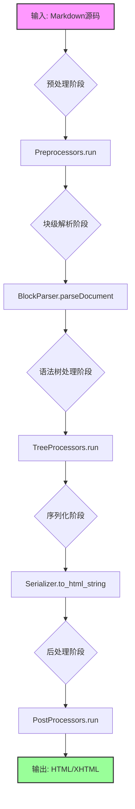

## 类结构

```
Markdown (核心类)
├── preprocessors (Registry: 文本预处理)
├── parser (BlockParser: 块级结构解析)
├── inlinePatterns (Registry: 行内语法解析)
├── treeprocessors (Registry: DOM树遍历与转换)
├── postprocessors (Registry: 输出文本后处理)
└── registeredExtensions (list: 扩展列表)
```

## 全局变量及字段


### `logger`
    
模块级日志记录器，用于记录Markdown库运行时的调试和错误信息

类型：`logging.Logger`
    


### `__all__`
    
公开的API导出列表，定义模块对外公开的接口

类型：`list`
    


### `Markdown.tab_length`
    
制表符长度，定义源码中Tab键对应的空格数，默认值为4

类型：`int`
    


### `Markdown.ESCAPED_CHARS`
    
转义字符列表，包含需要反斜杠转义的Markdown特殊字符

类型：`list[str]`
    


### `Markdown.block_level_elements`
    
块级HTML标签列表，定义哪些HTML标签被视为块级元素

类型：`list[str]`
    


### `Markdown.registeredExtensions`
    
已注册的扩展实例列表，存储通过registerExtension方法注册的扩展

类型：`list[Extension]`
    


### `Markdown.doc_tag`
    
文档包装标签，用于包裹整个输出文档的HTML标签，默认值为div

类型：`str`
    


### `Markdown.stripTopLevelTags`
    
是否移除顶层标签，控制输出时是否去除doc_tag包装标签

类型：`bool`
    


### `Markdown.references`
    
链接引用映射，存储文档中定义的引用链接名称到URL和标题的映射

类型：`dict[str, tuple[str, str]]`
    


### `Markdown.htmlStash`
    
HTML暂存区，用于临时存储HTML片段以避免被Markdown解析器处理

类型：`HtmlStash`
    


### `Markdown.output_formats`
    
支持的输出格式映射，定义可用的输出格式及其对应的序列化函数

类型：`ClassVar[dict[str, Callable[[Element], str]]]`
    


### `Markdown.output_format`
    
当前输出格式，指定当前使用的输出格式名称如html或xhtml

类型：`str`
    


### `Markdown.serializer`
    
序列化函数，将ElementTree元素转换为字符串输出的函数

类型：`Callable[[Element], str]`
    


### `Markdown.preprocessors`
    
预处理器注册表，存储在主解析前对源码进行处理的预处理器

类型：`Registry`
    


### `Markdown.parser`
    
块解析器，负责解析Markdown文档的块级结构元素

类型：`BlockParser`
    


### `Markdown.inlinePatterns`
    
内联模式注册表，存储用于处理内联Markdown语法的模式匹配器

类型：`Registry`
    


### `Markdown.treeprocessors`
    
树处理器注册表，存储对ElementTree进行后处理的树处理器

类型：`Registry`
    


### `Markdown.postprocessors`
    
后处理器注册表，存储在序列化后对输出文本进行处理的后处理器

类型：`Registry`
    
    

## 全局函数及方法


### `Markdown.convert`

将 Markdown 格式的文本转换为指定输出格式（HTML/XHTML）的字符串。该方法是 Python-Markdown 库的核心转换引擎，通过五个主要阶段处理输入：预处理、块级解析、树处理（包括内联处理）、序列化以及后处理。

参数：

- `source`：`str`，Markdown 格式的文本（Unicode 或 ASCII 字符串）

返回值：`str`，指定输出格式的字符串

#### 流程图

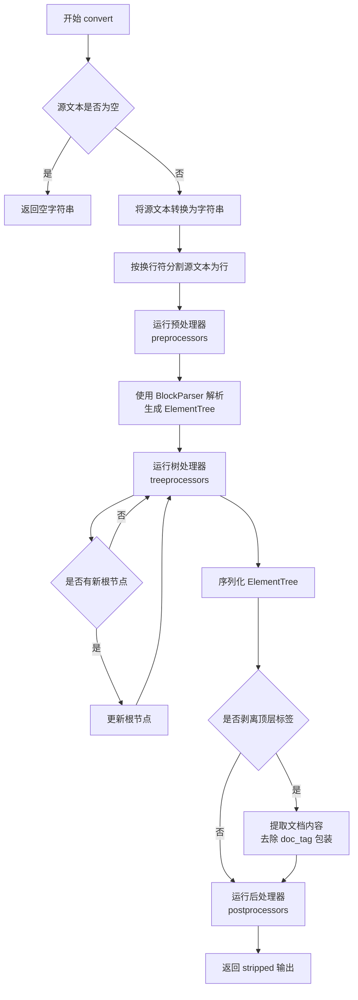

#### 带注释源码

```python
def convert(self, source: str) -> str:
    """
    Convert a Markdown string to a string in the specified output format.

    Arguments:
        source: Markdown formatted text as Unicode or ASCII string.

    Returns:
        A string in the specified output format.

    Markdown parsing takes place in five steps:

    1. A bunch of `preprocessors` munge the input text.
    2. A `BlockParser` parses the high-level structural elements of the
       pre-processed text into an `ElementTree` object.
    3. A bunch of `treeprocessors` are run against the `ElementTree` object.
       One such `treeprocessor` (`InlineProcessor`) runs `inlinepatterns`
       against the `ElementTree` object, parsing inline markup.
    4. Some `postprocessors` are run against the text after the
       `ElementTree` object has been serialized into text.
    5. The output is returned as a string.

    !!! warning
        The Python-Markdown library does ***not*** sanitize its HTML output.
        If you are processing Markdown input from an untrusted source, it is your
        responsibility to ensure that it is properly sanitized.
    """

    # Fix up the source text
    # 检查源文本是否为空或仅包含空白字符
    if not source.strip():
        return ''  # a blank Unicode string

    # 尝试将源文本转换为字符串（处理可能的编码问题）
    try:
        source = str(source)
    except UnicodeDecodeError as e:  # pragma: no cover
        # 自定义错误消息同时保留原始 traceback
        e.reason += '. -- Note: Markdown only accepts Unicode input!'
        raise

    # 将源文本按行分割，为预处理器准备数据
    self.lines = source.split("\n")
    # 依次运行每个预处理器，对文本进行初步处理
    for prep in self.preprocessors:
        self.lines = prep.run(self.lines)

    # 使用块解析器解析高级结构元素，生成 ElementTree 根节点
    root = self.parser.parseDocument(self.lines).getroot()

    # 运行树处理器，对 ElementTree 进行转换
    for treeprocessor in self.treeprocessors:
        newRoot = treeprocessor.run(root)
        if newRoot is not None:
            root = newRoot

    # 正确序列化：剥离顶层标签（如 <div>）
    output = self.serializer(root)
    if self.stripTopLevelTags:
        try:
            # 找到文档标签的起始位置并提取内容
            start = output.index(
                '<%s>' % self.doc_tag) + len(self.doc_tag) + 2
            end = output.rindex('</%s>' % self.doc_tag)
            output = output[start:end].strip()
        except ValueError as e:  # pragma: no cover
            if output.strip().endswith('<%s />' % self.doc_tag):
                # 空文档情况
                output = ''
            else:
                # 严重问题：无法剥离顶层标签
                raise ValueError('Markdown failed to strip top-level '
                                 'tags. Document=%r' % output.strip()) from e

    # 运行文本后处理器，对序列化后的文本进行最终处理
    for pp in self.postprocessors:
        output = pp.run(output)

    # 返回剥离空白后的最终输出
    return output.strip()
```

---

### `Markdown.__init__`

创建 Markdown 实例并初始化所有必要的组件，包括配置解析器、注册扩展、重置状态等。该构造函数是使用 Python-Markdown 库的入口点。

参数：

- `**kwargs`：`关键字参数`，支持以下选项：
  - `extensions`：`list[Extension | str]`，扩展列表
  - `extension_configs`：`dict[str, dict[str, Any]]`，扩展配置
  - `output_format`：`str`，输出格式（'xhtml' 或 'html'）
  - `tab_length`：`int`，制表符长度（默认 4）

返回值：无（构造函数）

#### 流程图

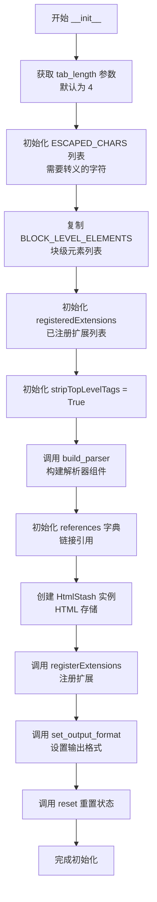

#### 带注释源码

```python
def __init__(self, **kwargs):
    """
    Creates a new Markdown instance.

    Keyword Arguments:
        extensions (list[Extension | str]): A list of extensions.
            If an item is an instance of a subclass of `Extension`,
            the instance will be used as-is. If an item is of type `str`,
            it is passed to `build_extension` with its corresponding
            `extension_configs` and the returned instance of `Extension`
            is used.
        extension_configs (dict[str, dict[str, Any]]): Configuration
            settings for extensions.
        output_format (str): Format of output. Supported formats are:
            - `xhtml`: Outputs XHTML style tags. Default.
            - `html`: Outputs HTML style tags.
        tab_length (int): Length of tabs in the source. Default: `4`
    """
    # 获取 tab_length 参数，默认为 4
    self.tab_length: int = kwargs.get('tab_length', 4)

    # 定义需要反斜杠转义的字符列表
    self.ESCAPED_CHARS: list[str] = [
        '\\', '`', '*', '_', '{', '}', '[', ']', '(', ')', '>', '#', '+', '-', '.', '!'
    ]
    """ List of characters which get the backslash escape treatment. """

    # 复制块级元素列表（从 util 模块导入的常量）
    self.block_level_elements: list[str] = BLOCK_LEVEL_ELEMENTS.copy()

    # 初始化已注册扩展列表
    self.registeredExtensions: list[Extension] = []
    # 文档类型（TODO：可能已废弃）
    self.docType = ""
    # 是否剥离顶层标签标志
    self.stripTopLevelTags: bool = True

    # 构建解析器（预处理器、块处理器、内联处理器、树处理器、后处理器）
    self.build_parser()

    # 初始化引用字典（存储文档中的链接引用）
    self.references: dict[str, tuple[str, str]] = {}
    # 创建 HTML 存储实例
    self.htmlStash: util.HtmlStash = util.HtmlStash()
    # 注册扩展并应用配置
    self.registerExtensions(extensions=kwargs.get('extensions', []),
                            configs=kwargs.get('extension_configs', {}))
    # 设置输出格式（默认为 'xhtml'）
    self.set_output_format(kwargs.get('output_format', 'xhtml'))
    # 重置状态，准备解析新文档
    self.reset()
```

---

### `markdown`

全局快捷函数，将 Markdown 字符串转换为 HTML 并返回 Unicode 字符串。该函数封装了 `Markdown` 类的最基本用法，提供了一行代码转换的便捷接口。

参数：

- `text`：`str`，Markdown 格式的文本
- `**kwargs`：`关键字参数`，接受 Markdown 类接受的任何参数

返回值：`str`，指定输出格式的字符串

#### 流程图

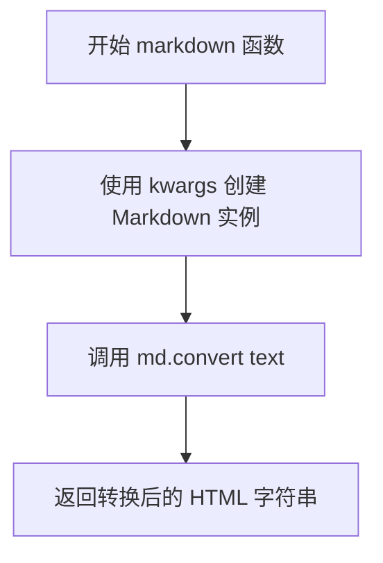

#### 带注释源码

```python
def markdown(text: str, **kwargs: Any) -> str:
    """
    Convert a markdown string to HTML and return HTML as a Unicode string.

    This is a shortcut function for `Markdown` class to cover the most
    basic use case. It initializes an instance of `Markdown`, loads the
    necessary extensions and runs the parser on the given text.

    Arguments:
        text: Markdown formatted text as Unicode or ASCII string.

    Keyword arguments:
        **kwargs: Any arguments accepted by the Markdown class.

    Returns:
        A string in the specified output format.

    !!! warning
        The Python-Markdown library does ***not*** sanitize its HTML output.
        If you are processing Markdown input from an untrusted source, it is your
        responsibility to ensure that it is properly sanitized.
    """
    # 使用提供的关键字参数创建 Markdown 实例
    md = Markdown(**kwargs)
    # 调用实例的 convert 方法进行转换
    return md.convert(text)
```

---

### `Markdown.build_parser`

从各个组件构建解析器，为 Markdown 实例初始化预处理器、块处理器、内联处理器、树处理器和后处理器。该方法可以被子类重写以构建自定义解析器。

参数：无

返回值：`Markdown`，返回 self 以支持链式调用

#### 流程图

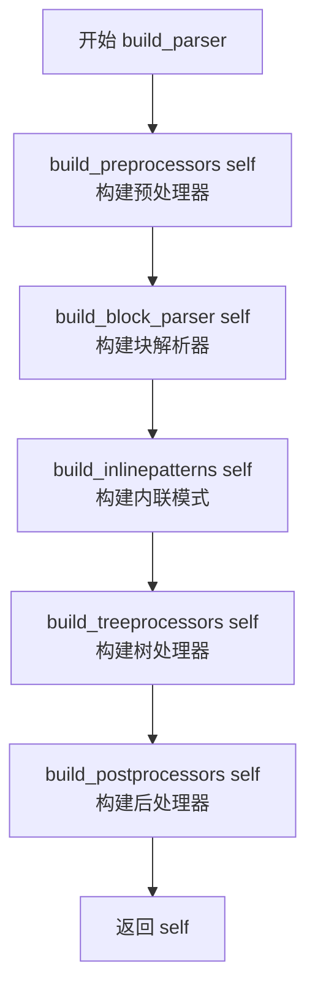

#### 带注释源码

```python
def build_parser(self) -> Markdown:
    """
    Build the parser from the various parts.

    Assigns a value to each of the following attributes on the class instance:

    * `Markdown.preprocessors` -- A collection of preprocessors.
    * `Markdown.parser` -- A collection of blockprocessors.
    * `Markdown.inlinePatterns` -- A collection of inlinepatterns.
    * `Markdown.treeprocessors` -- A collection of treeprocessors.
    * `Markdown.postprocessors` -- A collection of postprocessors.

    This method could be redefined in a subclass to build a custom parser which
    is made up of a different combination of processors and patterns.
    """
    # 构建预处理器注册表
    self.preprocessors = build_preprocessors(self)
    # 构建块级解析器
    self.parser = build_block_parser(self)
    # 构建内联模式注册表
    self.inlinePatterns = build_inlinepatterns(self)
    # 构建树处理器注册表
    self.treeprocessors = build_treeprocessors(self)
    # 构建后处理器注册表
    self.postprocessors = build_postprocessors(self)
    return self
```

---

### `Markdown.registerExtensions`

将扩展列表加载到 Markdown 实例中，处理字符串形式或实例形式的扩展。该方法负责实例化扩展并将其集成到 Markdown 处理管道中。

参数：

- `extensions`：`Sequence[Extension | str]`，扩展列表
- `configs`：`Mapping[str, dict[str, Any]]`，扩展配置字典

返回值：`Markdown`，返回 self 以支持链式调用

#### 流程图

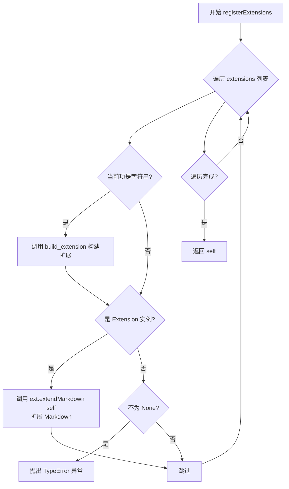

#### 带注释源码

```python
def registerExtensions(
    self,
    extensions: Sequence[Extension | str],
    configs: Mapping[str, dict[str, Any]]
) -> Markdown:
    """
    Load a list of extensions into an instance of the `Markdown` class.

    Arguments:
        extensions (list[Extension | str]): A list of extensions.
            If an item is an instance of a subclass of `Extension`,
            the instance will be used as-is. If an item is of type `str`,
            it is passed to `build_extension` with its corresponding `configs`
            and the returned instance of `Extension` is used.
        configs (dict[str, dict[str, Any]]): Configuration settings for extensions.
    """
    # 遍历每个扩展
    for ext in extensions:
        # 如果是字符串形式，先构建扩展实例
        if isinstance(ext, str):
            ext = self.build_extension(ext, configs.get(ext, {}))
        # 检查是否是有效的 Extension 实例
        if isinstance(ext, Extension):
            # 调用扩展的 extendMarkdown 方法将其集成到 Markdown
            ext.extendMarkdown(self)
            logger.debug(
                'Successfully loaded extension "%s.%s".'
                % (ext.__class__.__module__, ext.__class__.__name__)
            )
        elif ext is not None:
            # 扩展类型无效，抛出类型错误
            raise TypeError(
                'Extension "{}.{}" must be of type: "{}.{}"'.format(
                    ext.__class__.__module__, ext.__class__.__name__,
                    Extension.__module__, Extension.__name__
                )
            )
    return self
```

---

### `markdownFromFile`

从文件或流读取 Markdown 文本并写入 HTML 输出到文件或流的快捷函数。该函数封装了 `Markdown` 类的文件 I/O 操作。

参数：

- `input`：`str | BinaryIO | None`，输入文件名或可读对象（默认 stdin）
- `output`：`str | BinaryIO | None`，输出文件名或可写对象（默认 stdout）
- `encoding`：`str | None`，输入输出编码（默认 utf-8）
- `**kwargs`：`关键字参数`，接受 Markdown 类接受的任何参数

返回值：无

#### 流程图

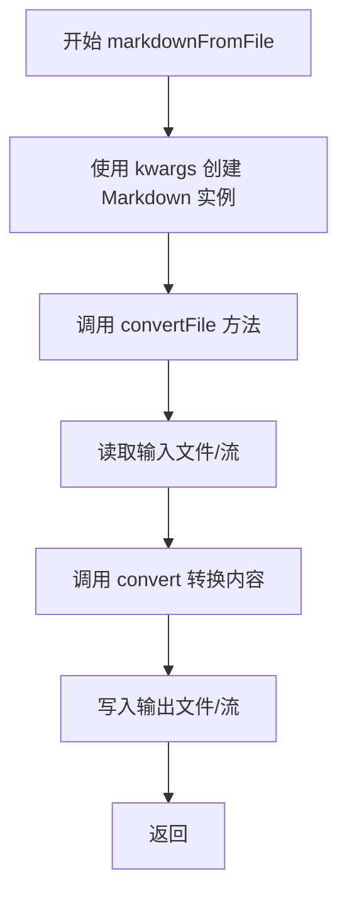

#### 带注释源码

```python
def markdownFromFile(**kwargs: Any):
    """
    Read Markdown text from a file or stream and write HTML output to a file or stream.

    This is a shortcut function which initializes an instance of `Markdown`,
    and calls the `convertFile` method rather than `convert`.

    Keyword arguments:
        input (str | BinaryIO): A file name or readable object.
        output (str | BinaryIO): A file name or writable object.
        encoding (str): Encoding of input and output.
        **kwargs: Any arguments accepted by the `Markdown` class.

    !!! warning
        The Python-Markdown library does ***not*** sanitize its HTML output.
        As `markdown.markdownFromFile` writes directly to the file system, there is no
        easy way to sanitize the output from Python code. Therefore, it is
        recommended that the `markdown.markdownFromFile` function not be used on input
        from an untrusted source.
    """
    # 创建 Markdown 实例
    md = Markdown(**kwargs)
    # 调用 convertFile 方法处理文件转换
    md.convertFile(kwargs.get('input', None),
                   kwargs.get('output', None),
                   kwargs.get('encoding', None))
```


### `markdownFromFile`

从文件或流中读取 Markdown 文本并将其转换为 HTML 输出到文件或流的便捷函数。

参数：

- `input`：`str | BinaryIO`，输入文件路径或可读对象
- `output`：`str | BinaryIO`，输出文件路径或可写对象
- `encoding`：`str`，输入输出文件的编码格式
- `**kwargs`：接受 Markdown 类接受的任何参数

返回值：`None`，该函数直接操作文件/流，不返回任何值

#### 流程图

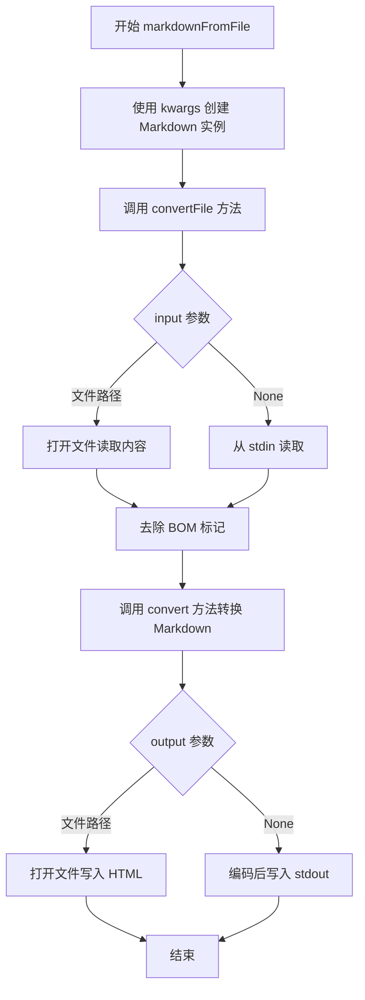

#### 带注释源码

```python
def markdownFromFile(**kwargs: Any):
    """
    Read Markdown text from a file or stream and write HTML output to a file or stream.

    This is a shortcut function which initializes an instance of [`Markdown`][markdown.Markdown],
    and calls the [`convertFile`][markdown.Markdown.convertFile] method rather than
    [`convert`][markdown.Markdown.convert].

    Keyword arguments:
        input (str | BinaryIO): A file name or readable object.
        output (str | BinaryIO): A file name or writable object.
        encoding (str): Encoding of input and output.
        **kwargs: Any arguments accepted by the `Markdown` class.

    !!! warning
        The Python-Markdown library does ***not*** sanitize its HTML output.
        As `markdown.markdownFromFile` writes directly to the file system, there is no
        easy way to sanitize the output from Python code. Therefore, it is
        recommended that the `markdown.markdownFromFile` function not be used on input
        from an untrusted source.  For more information see [Sanitizing HTML
        Output](../../sanitization.md).

    """
    # 创建一个 Markdown 实例，传入所有关键字参数
    md = Markdown(**kwargs)
    # 调用实例的 convertFile 方法进行文件转换
    # 从 kwargs 中获取 input、output 和 encoding 参数，默认值均为 None
    md.convertFile(kwargs.get('input', None),
                   kwargs.get('output', None),
                   kwargs.get('encoding', None))
```


### `Markdown.__init__`

Creates a new Markdown instance, initializing all core components including preprocessors, block parser, inline patterns, tree processors, postprocessors, and registered extensions. Sets up default configuration for output format, tab length, escaped characters, and block-level elements.

参数：

-   `**kwargs`：`dict`，关键字参数，包含以下可选配置：
    -   `extensions`：`list[Extension | str]`，扩展列表，可以是 Extension 实例或字符串
    -   `extension_configs`：`dict[str, dict[str, Any]]`，扩展配置
    -   `output_format`：`str`，输出格式（'xhtml' 或 'html'），默认为 'xhtml'
    -   `tab_length`：`int`，Tab 长度，默认为 4

返回值：`None`，构造函数无返回值

#### 流程图

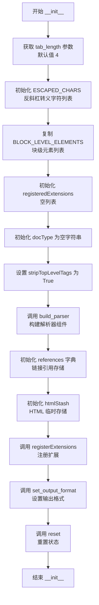

#### 带注释源码

```python
def __init__(self, **kwargs):
    """
    Creates a new Markdown instance.

    Keyword Arguments:
        extensions (list[Extension | str]): A list of extensions.

            If an item is an instance of a subclass of [`markdown.extensions.Extension`][],
            the instance will be used as-is. If an item is of type `str`, it is passed
            to [`build_extension`][markdown.Markdown.build_extension] with its corresponding
            `extension_configs` and the returned instance  of [`markdown.extensions.Extension`][]
            is used.
        extension_configs (dict[str, dict[str, Any]]): Configuration settings for extensions.
        output_format (str): Format of output. Supported formats are:

            * `xhtml`: Outputs XHTML style tags. Default.
            * `html`: Outputs HTML style tags.
        tab_length (int): Length of tabs in the source. Default: `4`

    """
    # 从 kwargs 获取 tab_length，默认为 4，用于处理 Markdown 源码中的 Tab 缩进
    self.tab_length: int = kwargs.get('tab_length', 4)

    # 定义需要反斜杠转义的字符列表，这些字符在 Markdown 中有特殊含义
    self.ESCAPED_CHARS: list[str] = [
        '\\', '`', '*', '_', '{', '}', '[', ']', '(', ')', '>', '#', '+', '-', '.', '!'
    ]
    """ List of characters which get the backslash escape treatment. """

    # 复制块级 HTML 元素列表，用于判断哪些 HTML 标签是块级元素
    self.block_level_elements: list[str] = BLOCK_LEVEL_ELEMENTS.copy()

    # 存储已注册的扩展实例
    self.registeredExtensions: list[Extension] = []
    
    # 文档类型（TODO: 标记为可能删除，当前似乎未使用）
    self.docType = ""  # TODO: Maybe delete this. It does not appear to be used anymore.
    
    # 是否移除顶层包装标签（如 <div>）
    self.stripTopLevelTags: bool = True

    # 构建解析器的各个组件：预处理器、块解析器、内联模式、树处理器、后处理器
    self.build_parser()

    # 存储文档中定义的链接引用 [ref]: url "title"
    self.references: dict[str, tuple[str, str]] = {}
    
    # HTML 临时存储，用于在转换过程中保存原始 HTML 代码
    self.htmlStash: util.HtmlStash = util.HtmlStash()
    
    # 注册用户提供的扩展及其配置
    self.registerExtensions(extensions=kwargs.get('extensions', []),
                            configs=kwargs.get('extension_configs', {}))
    
    # 设置输出格式（xhtml 或 html），默认为 xhtml
    self.set_output_format(kwargs.get('output_format', 'xhtml'))
    
    # 重置所有状态变量，为第一次转换做准备
    self.reset()
```


### `Markdown.build_parser`

该方法负责构建 Markdown 解析器的核心组件，通过调用各个处理器的构建函数来初始化预处理器、块级解析器、内联模式、树处理器和后处理器这五个关键的处理器集合，并返回 Markdown 实例本身以支持链式调用。

参数：
- `self`：`Markdown` 实例，调用该方法的 Markdown 对象本身

返回值：`Markdown`，返回该 Markdown 实例本身，用于链式调用

#### 流程图

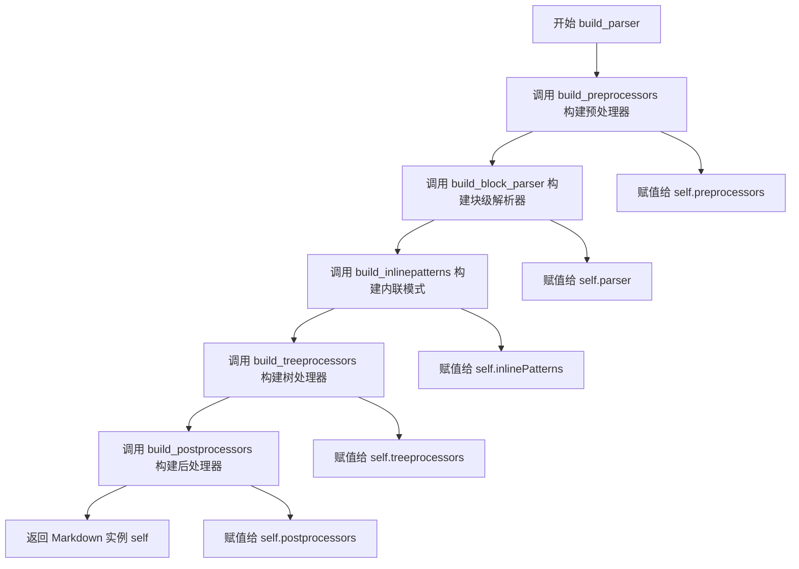

#### 带注释源码

```python
def build_parser(self) -> Markdown:
    """
    Build the parser from the various parts.

    Assigns a value to each of the following attributes on the class instance:

    * **`Markdown.preprocessors`** ([`Registry`][markdown.util.Registry]) -- A collection of
      [`preprocessors`][markdown.preprocessors].
    * **`Markdown.parser`** ([`BlockParser`][markdown.blockparser.BlockParser]) -- A collection of
      [`blockprocessors`][markdown.blockprocessors].
    * **`Markdown.inlinePatterns`** ([`Registry`][markdown.util.Registry]) -- A collection of
      [`inlinepatterns`][markdown.inlinepatterns].
    * **`Markdown.treeprocessors`** ([`Registry`][markdown.util.Registry]) -- A collection of
      [`treeprocessors`][markdown.treeprocessors].
    * **`Markdown.postprocessors`** ([`Registry`][markdown.util.Registry]) -- A collection of
      [`postprocessors`][markdown.postprocessors].

    This method could be redefined in a subclass to build a custom parser which is made up of a different
    combination of processors and patterns.

    """
    # 构建预处理器集合，用于文本的初步处理（如转义字符处理）
    self.preprocessors = build_preprocessors(self)
    
    # 构建块级解析器，用于解析 Markdown 的块级结构（段落、列表、引用等）
    self.parser = build_block_parser(self)
    
    # 构建内联模式集合，用于解析行内元素（链接、粗体、斜体等）
    self.inlinePatterns = build_inlinepatterns(self)
    
    # 构建树处理器集合，用于处理 ElementTree 结构（如添加属性、转换元素等）
    self.treeprocessors = build_treeprocessors(self)
    
    # 构建后处理器集合，用于最终输出的处理（如清理空白、添加样式等）
    self.postprocessors = build_postprocessors(self)
    
    # 返回实例本身，支持链式调用
    return self
```


### `Markdown.registerExtensions`

该方法用于将扩展列表加载到 Markdown 类实例中，遍历每个扩展并调用其 `extendMarkdown` 方法完成注册，同时验证扩展类型是否符合要求。

参数：

- `extensions`：`Sequence[Extension | str]`，要加载的扩展列表，可以是 Extension 实例或字符串
- `configs`：`Mapping[str, dict[str, Any]]`，扩展的配置信息字典

返回值：`Markdown`，返回 Markdown 实例本身以支持链式调用

#### 流程图

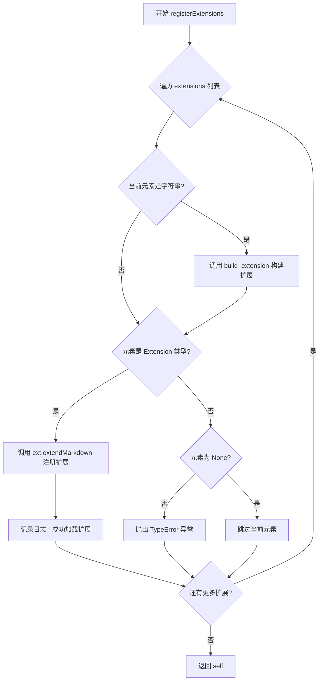

#### 带注释源码

```python
def registerExtensions(
    self,
    extensions: Sequence[Extension | str],
    configs: Mapping[str, dict[str, Any]]
) -> Markdown:
    """
    Load a list of extensions into an instance of the `Markdown` class.

    Arguments:
        extensions (list[Extension | str]): A list of extensions.

            If an item is an instance of a subclass of [`markdown.extensions.Extension`][],
            the instance will be used as-is. If an item is of type `str`, it is passed
            to [`build_extension`][markdown.Markdown.build_extension] with its corresponding `configs` and the
            returned instance  of [`markdown.extensions.Extension`][] is used.
        configs (dict[str, dict[str, Any]]): Configuration settings for extensions.

    """
    # 遍历传入的扩展列表
    for ext in extensions:
        # 如果扩展是字符串形式，则通过 build_extension 方法构建扩展实例
        if isinstance(ext, str):
            ext = self.build_extension(ext, configs.get(ext, {}))
        
        # 检查构建后的扩展是否为 Extension 类型
        if isinstance(ext, Extension):
            # 调用扩展的 extendMarkdown 方法，将自身注册到 Markdown 实例中
            ext.extendMarkdown(self)
            # 记录成功加载扩展的调试日志
            logger.debug(
                'Successfully loaded extension "%s.%s".'
                % (ext.__class__.__module__, ext.__class__.__name__)
            )
        # 如果扩展既不是 Extension 也不是 None，则抛出类型错误
        elif ext is not None:
            raise TypeError(
                'Extension "{}.{}" must be of type: "{}.{}"'.format(
                    ext.__class__.__module__, ext.__class__.__name__,
                    Extension.__module__, Extension.__name__
                )
            )
    
    # 返回 Markdown 实例本身，支持链式调用
    return self
```


### `Markdown.build_extension`

该方法根据传入的扩展名称和配置信息，构建并返回一个 Markdown 扩展的实例。它首先尝试通过 Python 入口点（entry point）机制加载扩展，如果未找到则尝试使用点号表示法（dot notation）加载模块和类，或调用 `makeExtension` 函数来创建扩展实例。

参数：

- `ext_name`：`str`，扩展的名称，可以是简单的扩展名（会通过 entry point 查找）或带类名的点号表示法（如 `path.to.module:ClassName`）
- `configs`：`Mapping[str, Any]`，扩展的配置字典，用于初始化扩展实例

返回值：`Extension`，返回已构建并配置好的扩展实例

#### 流程图

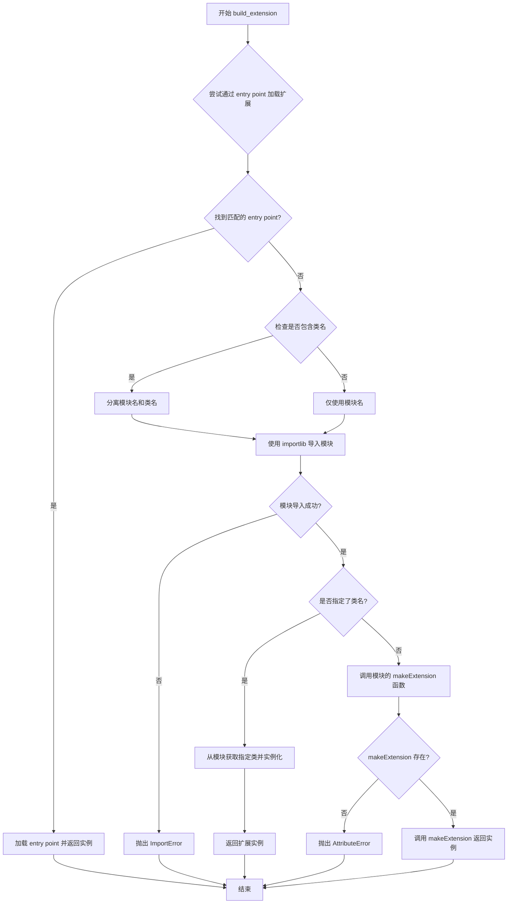

#### 带注释源码

```python
def build_extension(self, ext_name: str, configs: Mapping[str, Any]) -> Extension:
    """
    Build extension from a string name, then return an instance using the given `configs`.

    Arguments:
        ext_name: Name of extension as a string.
        configs: Configuration settings for extension.

    Returns:
        An instance of the extension with the given configuration settings.

    First attempt to load an entry point. The string name must be registered as an entry point in the
    `markdown.extensions` group which points to a subclass of the [`markdown.extensions.Extension`][] class.
    If multiple distributions have registered the same name, the first one found is returned.

    If no entry point is found, assume dot notation (`path.to.module:ClassName`). Load the specified class and
    return an instance. If no class is specified, import the module and call a `makeExtension` function and return
    the [`markdown.extensions.Extension`][] instance returned by that function.
    """
    # 创建配置的副本，避免修改原始字典
    configs = dict(configs)

    # 步骤1：尝试通过 entry point 机制加载扩展
    # 从已安装的扩展中查找匹配名称的 entry point
    entry_points = [ep for ep in util.get_installed_extensions() if ep.name == ext_name]
    
    # 如果找到匹配的 entry point，加载并返回实例
    if entry_points:
        ext = entry_points[0].load()
        return ext(**configs)

    # 步骤2：未找到 entry point，使用点号表示法加载
    # 检查是否指定了类名（格式：path.to.module:ClassName）
    # 如果有冒号，则分离模块名和类名；否则类名为空
    ext_name, class_name = ext_name.split(':', 1) if ':' in ext_name else (ext_name, '')

    try:
        # 动态导入模块
        module = importlib.import_module(ext_name)
        logger.debug(
            'Successfully imported extension module "%s".' % ext_name
        )
    except ImportError as e:
        # 如果导入失败，构造详细的错误信息并重新抛出
        message = 'Failed loading extension "%s".' % ext_name
        e.args = (message,) + e.args[1:]
        raise

    if class_name:
        # 如果指定了类名，从模块中获取该类并实例化
        return getattr(module, class_name)(**configs)
    else:
        # 如果没有指定类名，期望模块中存在 makeExtension 函数
        try:
            # 调用 makeExtension 函数创建扩展实例
            return module.makeExtension(**configs)
        except AttributeError as e:
            # 如果 makeExtension 不存在，构造详细的错误信息
            message = e.args[0]
            message = "Failed to initiate extension " \
                      "'%s': %s" % (ext_name, message)
            e.args = (message,) + e.args[1:]
            raise
```


### `Markdown.registerExtension`

注册一个扩展程序，使其具有可重置状态。该方法通常在扩展程序初始化期间调用一次，注册后的扩展程序的 `reset` 方法将在 `Markdown.reset()` 时被调用。

参数：

- `extension`：`Extension`，要注册的扩展实例

返回值：`Markdown`，返回自身以支持链式调用

#### 流程图

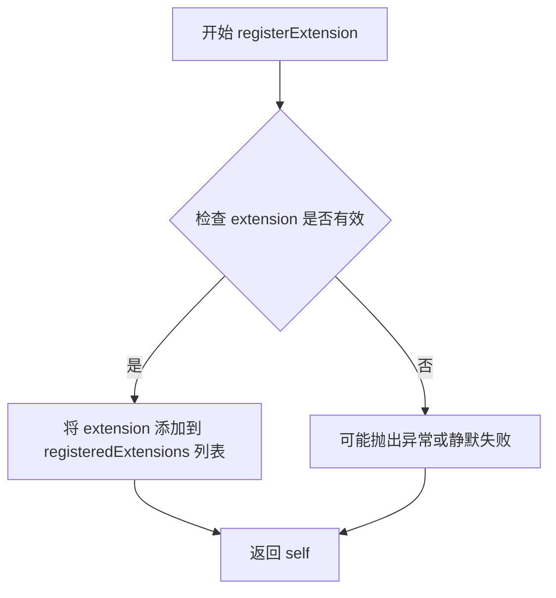

#### 带注释源码

```python
def registerExtension(self, extension: Extension) -> Markdown:
    """
    Register an extension as having a resettable state.

    Arguments:
        extension: An instance of the extension to register.

    This should get called once by an extension during setup. A "registered" extension's
    `reset` method is called by [`Markdown.reset()`][markdown.Markdown.reset]. Not all extensions have or need a
    resettable state, and so it should not be assumed that all extensions are "registered."

    """
    # 将扩展实例添加到已注册扩展列表中
    self.registeredExtensions.append(extension)
    # 返回 Markdown 实例本身，支持链式调用
    return self
```


### `Markdown.reset`

重置所有状态变量，为解析器实例处理新输入做好准备。在创建类实例时调用一次，应在多次调用 `convert` 方法之间手动调用。

参数：

- 无参数（仅包含 `self`）

返回值：`Markdown`，返回 `self` 以支持链式调用

#### 流程图

```mermaid
flowchart TD
    A[开始 reset] --> B[调用 self.htmlStash.reset&#40;&#41;]
    B --> C[调用 self.references.clear&#40;&#41;]
    C --> D{遍历 self.registeredExtensions 中的每个 extension}
    D --> E{检查 extension 是否有 'reset' 属性}
    E -->|是| F[调用 extension.reset&#40;&#41;]
    E -->|否| G[继续下一个 extension]
    F --> G
    D -->|遍历完成| H[返回 self]
    H --> I[结束]
```

#### 带注释源码

```python
def reset(self) -> Markdown:
    """
    Resets all state variables to prepare the parser instance for new input.

    Called once upon creation of a class instance. Should be called manually between calls
    to [`Markdown.convert`][markdown.Markdown.convert].
    """
    # 重置 HTML 存储，清空其中暂存的 HTML 片段
    self.htmlStash.reset()
    # 清空链接引用字典，用于存储文档中发现的链接引用
    self.references.clear()

    # 遍历所有已注册的扩展，调用其 reset 方法（如果存在）
    # 以便在处理新文档时重置扩展的内部状态
    for extension in self.registeredExtensions:
        if hasattr(extension, 'reset'):
            extension.reset()

    # 返回 self 以支持链式调用
    return self
```


### `Markdown.set_output_format`

设置 Markdown 实例的输出格式（HTML 或 XHTML），并根据格式选择相应的序列化器。

参数：

- `format`：`str`，输出格式名称，必须是 `Markdown.output_formats` 字典中的已知值（如 'html' 或 'xhtml'）

返回值：`Markdown`，返回 Markdown 实例本身，支持链式调用

#### 流程图

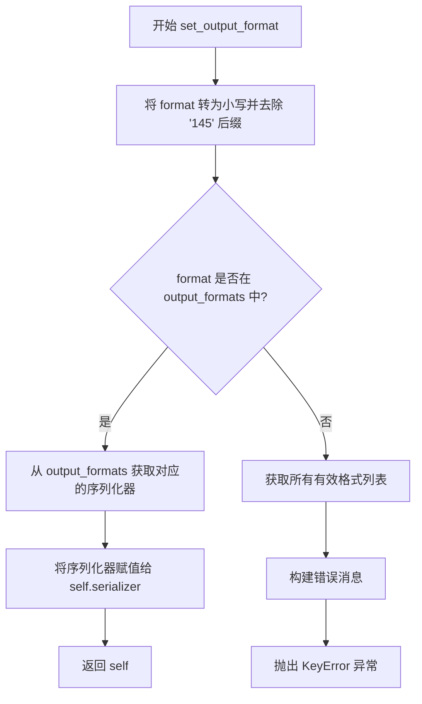

#### 带注释源码

```python
def set_output_format(self, format: str) -> Markdown:
    """
    Set the output format for the class instance.

    Arguments:
        format: Must be a known value in `Markdown.output_formats`.

    """
    # 将格式名称转换为小写，并去除可能的数字后缀（如 'html5' -> 'html'）
    self.output_format = format.lower().rstrip('145')  # ignore number
    
    # 尝试从已知的输出格式字典中获取对应的序列化器
    try:
        self.serializer = self.output_formats[self.output_format]
    except KeyError as e:
        # 如果格式无效，收集所有有效格式并生成错误消息
        valid_formats = list(self.output_formats.keys())
        valid_formats.sort()
        message = 'Invalid Output Format: "%s". Use one of %s.' \
            % (self.output_format,
               '"' + '", "'.join(valid_formats) + '"')
        # 更新异常参数并重新抛出
        e.args = (message,) + e.args[1:]
        raise
    # 返回实例本身，支持链式调用
    return self
```


### `Markdown.is_block_level`

检查给定的 `tag` 是否为块级 HTML 标签。如果 `tag` 是字符串且存在于 `Markdown.block_level_elements` 列表中，则返回 `True`；否则返回 `False`。非字符串类型的标签始终返回 `False`。

参数：

- `tag`：`Any`，要检查的 HTML 标签，可以是字符串或 ElementTree 标签对象

返回值：`bool`，如果标签是块级元素返回 `True`，否则返回 `False`

#### 流程图

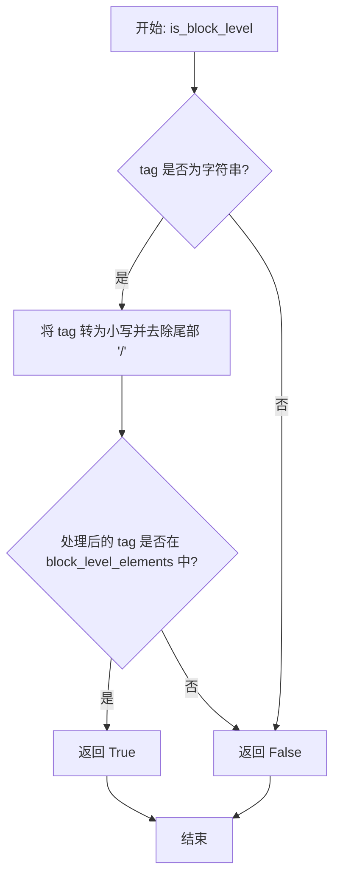

#### 带注释源码

```python
def is_block_level(self, tag: Any) -> bool:
    """
    Check if the given `tag` is a block level HTML tag.

    Returns `True` for any string listed in `Markdown.block_level_elements`. A `tag` which is
    not a string always returns `False`.

    """
    # 检查 tag 是否为字符串类型
    # ElementTree 中有些标签不是字符串，因此需要先进行类型判断
    if isinstance(tag, str):
        # 将标签转为小写以进行不区分大小写的比较
        # 去除尾部 '/' 以处理自闭合标签如 <br/>
        return tag.lower().rstrip('/') in self.block_level_elements
    # 对于非字符串类型的标签（如 ElementTree 元素对象），直接返回 False
    # 因为 block_level_elements 列表中只包含字符串形式的标签名
    return False
```


### `Markdown.convert`

将Markdown格式的文本字符串转换为指定输出格式（HTML或XHTML）的字符串。该方法是Python-Markdown库的核心转换方法，通过五个主要阶段处理输入文本：预处理、块级解析、树处理（包括内联模式处理）、序列化以及后处理，最终输出干净的HTML/XHTML字符串。

参数：

- `source`：`str`，Markdown格式的文本，作为Unicode或ASCII字符串

返回值：`str`，指定输出格式的字符串（默认为XHTML）

#### 流程图

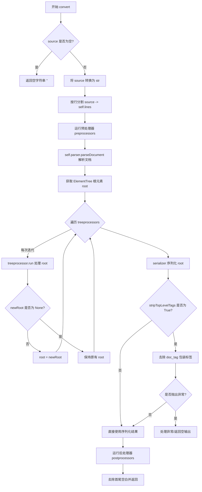

#### 带注释源码

```python
def convert(self, source: str) -> str:
    """
    Convert a Markdown string to a string in the specified output format.

    Arguments:
        source: Markdown formatted text as Unicode or ASCII string.

    Returns:
        A string in the specified output format.

    Markdown parsing takes place in five steps:

    1. A bunch of preprocessors munge the input text.
    2. A BlockParser parses the high-level structural elements of the
       pre-processed text into an ElementTree object.
    3. A bunch of treeprocessors are run against the ElementTree object.
       One such treeprocessor (InlineProcessor) runs inlinepatterns
       against the ElementTree object, parsing inline markup.
    4. Some postprocessors are run against the text after the
       ElementTree object has been serialized into text.
    5. The output is returned as a string.

    !!! warning
        The Python-Markdown library does ***not*** sanitize its HTML output.
        If you are processing Markdown input from an untrusted source, it is your
        responsibility to ensure that it is properly sanitized. For more
        information see [Sanitizing HTML Output](../../sanitization.md).

    """

    # Fix up the source text
    # 检查输入是否为空或仅包含空白字符
    if not source.strip():
        return ''  # a blank Unicode string

    try:
        # 确保 source 是字符串类型（处理可能是其他类型的情况）
        source = str(source)
    except UnicodeDecodeError as e:  # pragma: no cover
        # Customize error message while maintaining original traceback
        # 如果无法转换为字符串，添加提示信息并重新抛出异常
        e.reason += '. -- Note: Markdown only accepts Unicode input!'
        raise

    # Split into lines and run the line preprocessors.
    # 将输入按行分割，存储在实例变量 self.lines 中
    self.lines = source.split("\n")
    # 依次运行所有预处理器，对文本进行初步处理
    for prep in self.preprocessors:
        self.lines = prep.run(self.lines)

    # Parse the high-level elements.
    # 使用块解析器解析预处理后的文本，构建 ElementTree 结构
    root = self.parser.parseDocument(self.lines).getroot()

    # Run the tree-processors
    # 依次运行所有树处理器，对 ElementTree 进行转换处理
    for treeprocessor in self.treeprocessors:
        newRoot = treeprocessor.run(root)
        # 如果树处理器返回了新的根元素，则更新 root
        if newRoot is not None:
            root = newRoot

    # Serialize _properly_.  Strip top-level tags.
    # 使用序列化器将 ElementTree 转换为字符串输出
    output = self.serializer(root)
    # 如果设置了 stripTopLevelTags，则去除包装标签（如 <div>）
    if self.stripTopLevelTags:
        try:
            # 找到 doc_tag 的起始和结束位置
            start = output.index(
                '<%s>' % self.doc_tag) + len(self.doc_tag) + 2
            end = output.rindex('</%s>' % self.doc_tag)
            # 提取标签内部的内容并去除空白
            output = output[start:end].strip()
        except ValueError as e:  # pragma: no cover
            # 处理特殊情况：空文档或严重问题
            if output.strip().endswith('<%s />' % self.doc_tag):
                # We have an empty document
                output = ''
            else:
                # We have a serious problem
                raise ValueError('Markdown failed to strip top-level '
                                 'tags. Document=%r' % output.strip()) from e

    # Run the text post-processors
    # 依次运行所有后处理器，对序列化后的文本进行最终处理
    for pp in self.postprocessors:
        output = pp.run(output)

    # 去除首尾空白并返回最终结果
    return output.strip()
```


### `Markdown.convertFile`

该方法用于从文件或流读取 Markdown 文本并将其转换为 HTML 输出到指定文件或标准输出，支持多种输入输出类型（文件路径、文件对象、二进制流），并处理字符编码转换。

参数：

- `input`：`str | BinaryIO | None`，文件对象或路径，`None` 时从 `stdin` 读取
- `output`：`str | BinaryIO | None`，文件对象或路径，`None` 时写入 `stdout`
- `encoding`：`str | None`，输入输出文件编码，默认为 `utf-8`

返回值：`Markdown`，返回 Markdown 实例本身，支持链式调用

#### 流程图

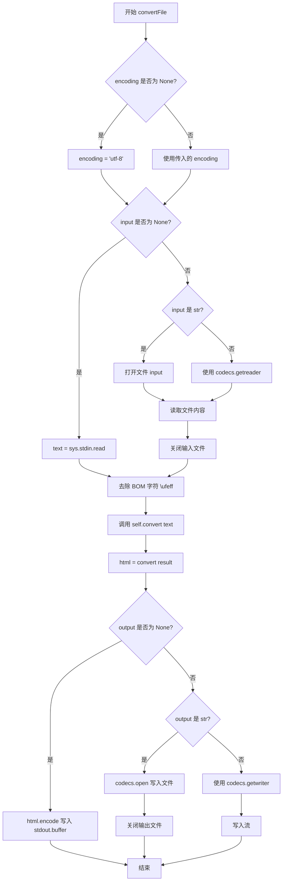

#### 带注释源码

```python
def convertFile(
    self,
    input: str | BinaryIO | None = None,
    output: str | BinaryIO | None = None,
    encoding: str | None = None,
) -> Markdown:
    """
    Read Markdown text from a file or stream and write HTML output to a file or stream.

    Decodes the input file using the provided encoding (defaults to `utf-8`),
    passes the file content to markdown, and outputs the HTML to either
    the provided stream or the file with provided name, using the same
    encoding as the source file. The
    [`xmlcharrefreplace`](https://docs.python.org/3/library/codecs.html#error-handlers)
    error handler is used when encoding the output.

    **Note:** This is the only place that decoding and encoding of Unicode
    takes place in Python-Markdown.  (All other code is Unicode-in /
    Unicode-out.)

    Arguments:
        input: File object or path. Reads from `stdin` if `None`.
        output: File object or path. Writes to `stdout` if `None`.
        encoding: Encoding of input and output files. Defaults to `utf-8`.

    !!! warning
        The Python-Markdown library does ***not*** sanitize its HTML output.
        As `Markdown.convertFile` writes directly to the file system, there is no
        easy way to sanitize the output from Python code. Therefore, it is
        recommended that the `Markdown.convertFile` method not be used on input
        from an untrusted source.  For more information see [Sanitizing HTML
        Output](../../sanitization.md).

    """

    # 设置默认编码为 utf-8
    encoding = encoding or "utf-8"

    # 读取源文件
    if input:
        # 判断 input 是文件路径还是文件对象
        if isinstance(input, str):
            # 打开文件并读取内容
            input_file = open(input, mode="r", encoding=encoding)
        else:
            # 使用 codecs 处理二进制流
            input_file = codecs.getreader(encoding)(input)
        # 读取文件内容
        text = input_file.read()
        # 关闭文件
        input_file.close()
    else:
        # 从标准输入读取
        text = sys.stdin.read()

    # 移除字节顺序标记 BOM
    text = text.lstrip('\ufeff')

    # 调用 convert 方法进行 Markdown 转换
    html = self.convert(text)

    # 写入到文件或标准输出
    if output:
        # 判断 output 是文件路径还是文件对象
        if isinstance(output, str):
            # 打开文件并写入，使用 xmlcharrefreplace 处理无法编码的字符
            output_file = codecs.open(output, "w",
                                      encoding=encoding,
                                      errors="xmlcharrefreplace")
            output_file.write(html)
            output_file.close()
        else:
            # 使用 codecs 处理二进制流
            writer = codecs.getwriter(encoding)
            output_file = writer(output, errors="xmlcharrefreplace")
            output_file.write(html)
            # 不关闭文件，用户可能需要继续写入
    else:
        # 编码后写入标准输出缓冲区
        html = html.encode(encoding, "xmlcharrefreplace")
        sys.stdout.buffer.write(html)

    # 返回 Markdown 实例，支持链式调用
    return self
```

## 关键组件


### Markdown 类

核心解析器类，负责将Markdown文本转换为HTML/XHTML。集成了预处理器、块处理器、树处理器、内联模式处理器和后处理器，通过扩展机制支持功能扩展。

### 预处理器 (Preprocessors)

在块级解析之前对输入文本进行预处理，用于处理文本的特殊转换和规范化操作。

### 块处理器 (Blockprocessors)

负责解析Markdown的块级结构元素（如段落、列表、引用块、代码块等），将文本转换为ElementTree结构。

### 树处理器 (Treeprocessors)

对生成的ElementTree对象进行遍历和处理，其中InlineProcessor负责解析内联标记（如加粗、斜体、链接等）。

### 内联模式 (Inlinepatterns)

定义内联Markdown语法（如`**加粗**`、`*斜体*`、链接、图片等）的正则匹配模式和转换逻辑。

### 后处理器 (Postprocessors)

在序列化为文本后对输出进行最终处理，用于清理和转换最终的HTML输出。

### 扩展机制 (Extensions)

支持通过Entry Points或模块导入方式加载自定义扩展，允许用户通过继承Extension类并实现extendMarkdown方法添加自定义功能。

### 序列化器 (Serializers)

将ElementTree对象转换为HTML或XHTML字符串输出，支持html和xhtml两种输出格式。

### 工具模块 (Util)

提供HtmlStash用于暂存HTML片段、BLOCK_LEVEL_ELEMENTS定义块级HTML标签列表、Registry注册表管理器等基础工具。

### 输出格式管理

通过output_format属性和set_output_format方法支持HTML和XHTML两种输出格式的动态切换。

### 文件 I/O 处理

支持从文件或标准输入读取Markdown文本，并将转换后的HTML输出到文件或标准输出，同时处理字符编码转换。


## 问题及建议


### 已知问题

- `docType` 属性在 `__init__` 中被初始化但在代码中从未使用，存在废弃代码
- `convert` 方法职责过重，包含了文本预处理、解析、树处理、序列化和后处理等多个步骤，违反了单一职责原则
- `set_output_format` 方法中的 `.rstrip('145')` 操作含义不明确，Magic Number 缺乏注释说明
- 错误处理中 `ValueError` 的 raise 方式使用了 `from e` 但捕获的异常类型不匹配（捕获 `ValueError` 但实际处理的是 `KeyError`）
- `output_format` 实例属性与 `output_formats` 类属性的命名容易造成混淆
- 缺少对 `extensions` 参数为 `None` 时的显式处理，依赖 `kwargs.get` 的默认值行为

### 优化建议

- 移除废弃的 `docType` 属性以减少代码冗余
- 将 `convert` 方法拆分为多个私有方法（如 `_preprocess`、`_parse`、`_serialize`、`_postprocess`）以提升可读性和可维护性
- 为 `rstrip('145')` 添加详细注释解释其用途，或提取为命名常量
- 统一异常处理逻辑，确保捕获的异常类型与实际抛出的异常类型一致
- 考虑使用 `@dataclass` 或 `attrs` 库重构部分简单类，提升代码简洁性
- 添加输入验证逻辑，对 `extensions` 参数类型进行显式检查并抛出明确的 `TypeError`
- 实现处理器链的懒加载机制，仅在首次使用时初始化各个处理器
- 为正则表达式编译结果添加缓存机制，减少重复编译开销


## 其它


### 设计目标与约束

**设计目标**：
- 实现John Gruber的Markdown语法到HTML/XHTML的转换
- 提供可扩展的插件架构，支持第三方扩展
- 支持多种输入输出格式（字符串、文件、stdin/stdout）
- 保持Python的Unicode兼容性
- 提供清晰的五阶段处理流水线

**设计约束**：
- Python 3.7+支持
- 依赖标准库（codecs、sys、logging、importlib）和内部模块
- 输出不进行HTML清理，需要调用方自行处理
- 使用xml.etree.ElementTree作为DOM中间表示
- 必须通过entry points或dot notation加载扩展

### 错误处理与异常设计

**异常类型及处理**：

| 异常类型 | 触发场景 | 处理方式 |
|---------|---------|---------|
| `ImportError` | 扩展模块加载失败 | 重新包装错误消息后抛出 |
| `UnicodeDecodeError` | 源代码包含非Unicode字符 | 添加提示信息后重新抛出 |
| `ValueError` | output_format不在支持列表中 | 列出有效格式后抛出 |
| `ValueError` | strip top-level tags失败 | 检测空文档情况，否则重新抛出 |
| `TypeError` | 扩展对象类型不正确 | 提示正确的类型要求 |

**日志记录**：
- 使用`logging.getLogger('MARKDOWN')`进行调试日志记录
- 记录扩展加载成功信息
- 记录扩展模块导入成功信息

### 数据流与状态机

**处理流水线（5个阶段）**：

```
输入(Markdown文本)
    ↓
[Phase 1: Preprocessors]
    ↓ 文本行处理
[Phase 2: BlockParser]
    ↓ 构建ElementTree DOM
[Phase 3: TreeProcessors]
    ↓ 树结构转换/InlinePattern处理
[Phase 4: Serializer]
    ↓ ElementTree→HTML字符串
[Phase 5: Postprocessors]
    ↓ 字符串后处理
输出(HTML/XHTML文本)
```

**状态管理**：
- `reset()`：重置htmlStash、references、registeredExtensions
- `convert()`：单次转换流程
- `convertFile()`：文件IO流程

### 外部依赖与接口契约

**入口点约定**：
- 扩展需注册为`markdown.extensions`组的entry point
- 或使用dot notation: `path.to.module:ClassName`
- 或提供`makeExtension()`函数

**输出格式契约**：
- 序列化器必须是`Callable[[Element], str]`
- 内置格式：'html'、'xhtml'

**扩展接口**：
- 扩展必须继承`Extension`类
- 必须实现`extendMarkdown(self, md)`方法
- 可选实现`reset()`方法用于状态重置

### 安全性考虑

- **HTML清理**：库本身不清理输出，调用方需自行使用BeautifulSoup、bleach等库处理不可信输入
- **文件操作**：`convertFile`直接读写文件系统，存在路径遍历风险
- **扩展加载**：动态加载扩展代码，存在代码执行风险

### 性能特性

- `tab_length`参数影响缩进解析效率
- 扩展注册后状态可复用，避免重复初始化
- 大文档建议分块处理或使用流式API（当前版本无流式支持）

### 配置项汇总

| 参数名 | 类型 | 默认值 | 说明 |
|--------|------|--------|------|
| extensions | list | [] | 加载的扩展列表 |
| extension_configs | dict | {} | 扩展配置 |
| output_format | str | 'xhtml' | 输出格式 |
| tab_length | int | 4 | Tab长度 |

### 版本与兼容性

- 代码标注支持Python 3.7+
- TYPE_CHECKING块用于类型提示，不影响运行时
- 保持对旧版Python Markdown语法的兼容性


    