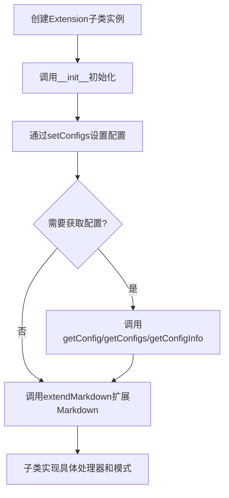
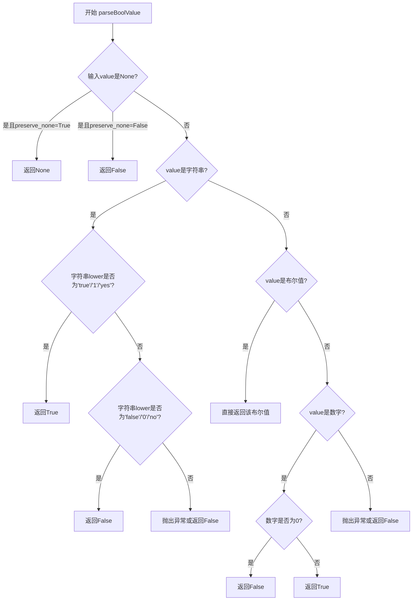
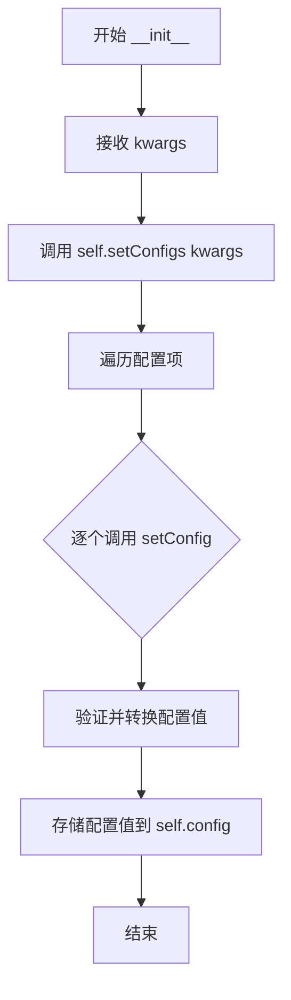
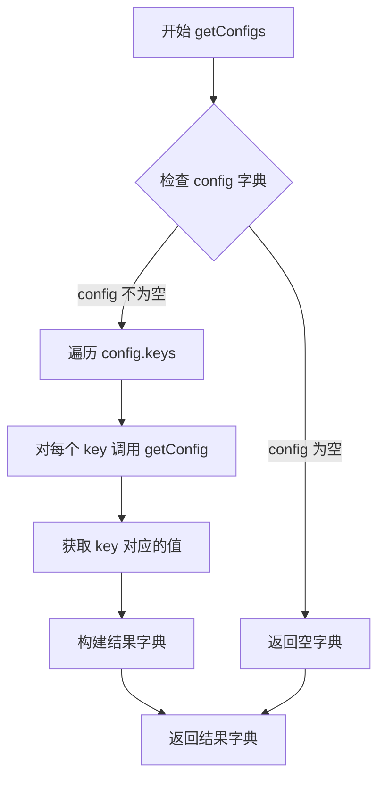
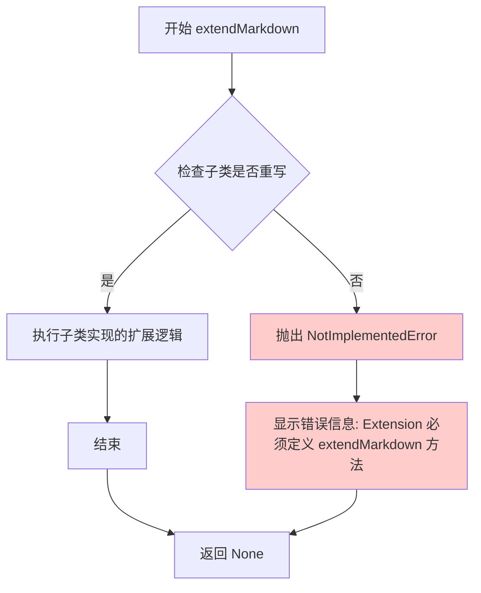

# `markdown\markdown\extensions\__init__.py` 详细设计文档

这是Python Markdown库的扩展基类模块，提供了Extension抽象基类用于创建Markdown插件，通过配置管理机制(setConfig/getConfig)和extendMarkdown抽象方法允许第三方扩展自定义Markdown解析行为。

## 整体流程



## 类结构

```
Extension (抽象基类)
├── 用户自定义扩展 (需继承Extension)
│   ├── 需实现extendMarkdown方法
│   └── 可定义config类属性
```

## 全局变量及字段


### `TYPE_CHECKING`
    
typing模块的条件导入标识，用于类型检查时导入避免循环依赖

类型：`typing module`
    


### `Any`
    
typing中的任意类型，表示任意类型的变量

类型：`typing.Any`
    


### `Iterable`
    
typing中的可迭代类型，用于标注可迭代对象

类型：`typing.Iterable`
    


### `Mapping`
    
typing中的映射类型，用于标注字典等映射结构

类型：`typing.Mapping`
    


### `Extension.config`
    
存储扩展配置选项的字典，包含键、默认值和描述

类型：`Mapping[str, list]`
    
    

## 全局函数及方法


### `parseBoolValue`

该函数是一个从 `markdown.util` 模块导入的布尔值解析工具，用于将各种格式的输入值（如字符串 "true"/"false"、数字、布尔值等）统一转换为 Python 布尔类型，同时支持通过 `preserve_none` 参数保留 None 值。

参数：

- `value`：`Any`，需要解析的值，可以是字符串、数字、布尔值或 None
- `preserve_none`：`bool`，可选参数（默认 False），当设为 True 时，如果输入值为 None 则返回 None 而不是 False

返回值：`bool | None`，解析后的布尔值，如果 preserve_none 为 True 且输入为 None 则返回 None

#### 流程图



#### 带注释源码

```python
# 该函数定义在 markdown/util.py 中
# 以下是基于调用方式和文档描述的推断实现

def parseBoolValue(value: Any, preserve_none: bool = False) -> bool | None:
    """
    将各种格式的值解析为布尔值。
    
    参数:
        value: 要解析的值，支持字符串、数字、布尔值、None
        preserve_none: 如果为True且value为None，则返回None而非False
        
    返回:
        解析后的布尔值，或None（当preserve_none=True且value为None时）
    """
    # 处理 None 值
    if value is None:
        if preserve_none:
            return None
        return False
    
    # 如果已经是布尔值，直接返回
    if isinstance(value, bool):
        return value
    
    # 如果是字符串，进行字符串解析
    if isinstance(value, str):
        lower_value = value.lower().strip()
        if lower_value in ('true', '1', 'yes', 'on'):
            return True
        if lower_value in ('false', '0', 'no', 'off'):
            return False
        # 未知字符串格式的处理
    
    # 如果是数字，0为False，非0为True
    if isinstance(value, (int, float)):
        return bool(value)
    
    # 其他类型默认返回False或抛出异常
    return False
```

> **注意**：由于 `parseBoolValue` 函数定义在 `..util` 模块中，当前代码文件仅导入了该函数并使用了它，因此没有提供完整的源代码。上面的源码是根据函数在 `setConfig` 方法中的使用方式和 Python-Markdown 项目的常见模式推断得出的。如需获取完整源码，请参考 `markdown/util.py` 文件。


### `Extension.__init__`

这是 `Extension` 类的构造函数，负责初始化扩展实例并设置配置选项。

参数：

- `kwargs`：`Mapping[str, Any] | Iterable[tuple[str, Any]]`，可变关键字参数，用于接收并设置扩展的配置选项

返回值：`None`，构造函数不返回值

#### 流程图



#### 带注释源码

```python
def __init__(self, **kwargs):
    """
    初始化扩展实例并设置配置。
    
    该方法是 Extension 类的构造函数，接收任意数量的关键字参数，
    并将这些参数传递给 setConfigs 方法进行处理。
    
    参数:
        **kwargs: 可变关键字参数，包含要设置的配置选项。
                  格式应为 {'key': 'value'} 或等效的键值对迭代器。
    
    返回值:
        无返回值 (返回 None)。
    
    示例:
        # 创建扩展实例并传递配置
        ext = MyExtension(extension_name='my_ext', enabled=True)
    """
    # 调用 setConfigs 方法，将 kwargs 传递给配置设置器
    self.setConfigs(kwargs)
```


### `Extension.getConfig`

获取单个配置选项的值。如果指定的键存在于配置中，则返回其值；否则返回默认值。

参数：

- `key`：`str`，配置选项的名称
- `default`：`Any`，当键不存在时返回的默认值，默认为空字符串

返回值：`Any`，存储的配置选项的值

#### 流程图

```mermaid
flowchart TD
    A[开始 getConfig] --> B{key 是否在 self.config 中?}
    B -->|是| C[返回 self.config[key][0]]
    B -->|否| D[返回 default]
    C --> E[结束]
    D --> E
```

#### 带注释源码

```python
def getConfig(self, key: str, default: Any = '') -> Any:
    """
    Return a single configuration option value.

    Arguments:
        key: The configuration option name.
        default: Default value to return if key is not set.

    Returns:
        Value of stored configuration option.
    """
    # 检查指定的 key 是否存在于配置字典中
    if key in self.config:
        # 返回该配置项的值（存储在 config[key][0] 位置）
        return self.config[key][0]
    else:
        # 如果 key 不存在，返回用户提供的默认值
        return default
```


### `Extension.getConfigs`

返回该扩展的所有配置选项。它遍历 `config` 字典中的所有键，对每个键调用 `getConfig` 方法获取其对应的值，并返回一个包含所有配置选项的字典。

参数： 无

返回值：`dict[str, Any]`，返回所有配置选项的字典

#### 流程图



#### 带注释源码

```python
def getConfigs(self) -> dict[str, Any]:
    """
    Return all configuration options.

    Returns:
        All configuration options.
    """
    # 使用字典推导式遍历 config 中的所有键
    # 对每个键调用 getConfig 获取其对应的值
    # 返回包含所有配置选项的字典
    return {key: self.getConfig(key) for key in self.config.keys()}
```


### `Extension.getConfigInfo`

该方法用于获取当前扩展实例的所有配置选项及其描述信息。它遍历配置字典，提取每个配置项的键和描述信息，以列表形式返回所有配置选项的名称-描述对。

参数：  
- 该方法无参数（除隐含的 `self` 参数）

返回值：`list[tuple[str, str]]`，返回所有配置选项的描述信息列表，每个元素为包含配置键名和描述文本的元组

#### 流程图

```mermaid
flowchart TD
    A[开始 getConfigInfo] --> B{self.config 是否为空}
    B -- 是 --> C[返回空列表 []]
    B -- 否 --> D[获取 self.config.keys()]
    D --> E[遍历所有 key]
    E --> F[提取 self.config[key][1] 即描述]
    F --> G[构建元组 (key, description)]
    G --> H{是否还有更多 key}
    H -- 是 --> E
    H -- 否 --> I[返回列表]
    I --> J[结束]
```

#### 带注释源码

```python
def getConfigInfo(self) -> list[tuple[str, str]]:
    """
    Return descriptions of all configuration options.

    Returns:
        All descriptions of configuration options.
    """
    # 使用列表推导式遍历配置字典的所有键
    # self.config[key][1] 获取配置项的描述文本（索引0是默认值，索引1是描述）
    return [(key, self.config[key][1]) for key in self.config.keys()]
```


### `Extension.setConfig`

设置单个配置选项的值。如果配置项的默认值是布尔值或`None`，则该值会通过`parseBoolValue`函数进行处理后再存储。

参数：

- `key`：`str`，要设置的配置选项名称
- `value`：`Any`，要分配给该选项的值

返回值：`None`，无返回值

#### 流程图

```mermaid
flowchart TD
    A[开始 setConfig] --> B{检查 config[key] 是否存在}
    B -->|是| C{默认值是布尔值?}
    B -->|否| D[抛出 KeyError]
    C -->|是| E[使用 parseBoolValue 转换 value]
    C -->|否| F{默认值是 None?}
    E --> G[存储转换后的值到 config[key][0]]
    F -->|是| H[使用 parseBoolValue 转换 value, preserve_none=True]
    F -->|否| G
    H --> G
    G --> I[结束]
    D --> I
```

#### 带注释源码

```python
def setConfig(self, key: str, value: Any) -> None:
    """
    Set a configuration option.

    If the corresponding default value set in [`config`][markdown.extensions.Extension.config]
    is a `bool` value or `None`, then `value` is passed through
    [`parseBoolValue`][markdown.util.parseBoolValue] before being stored.

    Arguments:
        key: Name of configuration option to set.
        value: Value to assign to option.

    Raises:
        KeyError: If `key` is not known.
    """
    # 如果配置项的默认值是布尔值，则将传入值转换为布尔类型
    if isinstance(self.config[key][0], bool):
        value = parseBoolValue(value)
    
    # 如果配置项的默认值是 None，则将传入值转换为布尔类型，同时保留 None
    if self.config[key][0] is None:
        value = parseBoolValue(value, preserve_none=True)
    
    # 将处理后的值存储到配置字典中
    self.config[key][0] = value
```


### `Extension.setConfigs`

设置多个配置选项。该方法接收一个配置项集合（字典或可迭代的键值对元组），遍历并逐个调用 `setConfig` 方法进行设置。

参数：

-  `items`：`Mapping[str, Any] | Iterable[tuple[str, Any]]`，配置选项集合，可以是字典或可迭代的键值对元组

返回值：`None`，无返回值

#### 流程图

```mermaid
flowchart TD
    A[开始 setConfigs] --> B{检查 items 是否有 items 属性}
    B -->|是| C[将 items 转换为 items.items()]
    B -->|否| D[直接使用 items]
    C --> E[遍历 items 中的每个 key-value 对]
    D --> E
    E --> F[调用 setConfig 设置单个配置]
    F --> G{还有更多配置项?}
    G -->|是| E
    G -->|否| H[结束]
```

#### 带注释源码

```python
def setConfigs(self, items: Mapping[str, Any] | Iterable[tuple[str, Any]]) -> None:
    """
    Loop through a collection of configuration options, passing each to
    [`setConfig`][markdown.extensions.Extension.setConfig].

    Arguments:
        items: Collection of configuration options.

    Raises:
        KeyError: for any unknown key.
    """
    # 检查传入的 items 是否有 'items' 属性（即是否为字典类型）
    if hasattr(items, 'items'):
        # 如果是字典，调用其 items() 方法转换为键值对元组的可迭代对象
        items = items.items()
    # 遍历所有配置项的键值对
    for key, value in items:
        # 逐个调用 setConfig 方法设置每个配置项
        self.setConfig(key, value)
```


### `Extension.extendMarkdown`

该方法是 Markdown 扩展的抽象基类方法，用于将各种处理器和模式添加到 Markdown 实例中。每个自定义扩展都必须重写此方法以实现具体的扩展逻辑。当前实现抛出一个 `NotImplementedError` 异常，以确保子类必须实现该方法。

参数：

- `md`：`Markdown`，需要被扩展的 Markdown 实例

返回值：`None`，该方法不返回任何值

#### 流程图



#### 带注释源码

```python
def extendMarkdown(self, md: Markdown) -> None:
    """
    Add the various processors and patterns to the Markdown Instance.

    This method must be overridden by every extension.

    Arguments:
        md: The Markdown instance.

    """
    # 抛出 NotImplementedError 异常，强制要求子类必须重写此方法
    # 这是模板方法模式的应用，确保所有扩展都实现了扩展接口
    raise NotImplementedError(
        'Extension "%s.%s" must define an "extendMarkdown"'
        'method.' % (self.__class__.__module__, self.__class__.__name__)
    )
```

## 关键组件


### Extension 类

Markdown扩展的基类，所有扩展必须继承此类并重写extendMarkdown方法。提供配置管理的统一接口。

### config 类属性

存储扩展的默认配置选项，格式为字典，每个键对应一个包含默认值和描述的列表。

### getConfig 方法

获取单个配置选项的值，支持默认值返回，用于访问特定配置项。

### getConfigs 方法

返回所有配置选项的字典，用于批量获取配置信息。

### getConfigInfo 方法

返回配置选项的描述信息列表，格式为(键, 描述)的元组列表。

### setConfig 方法

设置单个配置选项的值，自动处理布尔值和None值的解析。

### setConfigs 方法

批量设置多个配置选项，接受字典或可迭代的键值对。

### extendMarkdown 抽象方法

向Markdown实例添加处理器和模式的入口点，所有扩展必须实现此方法。


## 问题及建议


### 已知问题

- **配置共享风险**：`config` 是类级别的属性（`class variable`），所有实例共享同一个配置字典。如果修改配置，可能会意外影响其他实例。
- **类型注解不完整**：`__init__` 方法的参数使用了 `**kwargs`，导致类型信息丢失，无法静态分析。
- **抽象方法实现不当**：`extendMarkdown` 使用 `raise NotImplementedError` 而非 `abc.abstractmethod`，导致无法在编译时强制子类实现该方法。
- **默认参数潜在冲突**：`getConfig` 方法的 `default` 参数默认为空字符串 `''`，如果配置值本身可以是空字符串，则无法区分"未设置"和"设置为空字符串"的情况。
- **错误处理不够具体**：`setConfig` 和 `setConfigs` 方法在 key 不存在时直接抛出 `KeyError`，缺乏明确的错误提示信息。
- **线程安全问题**：配置直接修改 `self.config[key][0]`，在多线程环境下可能导致竞态条件。
- **缺乏输入验证**：`setConfig` 方法未对 value 的类型进行验证，可能导致类型错误在后续使用时才暴露。

### 优化建议

- **修复配置共享问题**：将 `config` 定义为实例属性（在 `__init__` 中深拷贝），避免实例间配置相互影响。
- **使用抽象基类**：导入 `abc` 模块，将 `extendMarkdown` 改为 `@abc.abstractmethod` 装饰的抽象方法。
- **改进类型注解**：为 `__init__` 参数添加显式类型定义，或使用 `TypedDict` 描述配置结构。
- **优化默认值处理**：使用 `None` 作为 `getConfig` 的默认值，或返回 `Optional[Any]` 并区分"未设置"状态。
- **增强错误处理**：在配置 key 不存在时抛出自定义异常，提供更有意义的错误信息（如建议的 key 列表）。
- **添加输入验证**：在 `setConfig` 中增加类型检查和值验证，确保配置值符合预期格式。
- **考虑线程安全**：如果需要线程安全，可以使用锁或提供线程安全的配置副本。

## 其它


### 设计目标与约束

**设计目标**：
- 为Python Markdown提供统一的扩展基类，定义扩展的生命周期和配置管理接口
- 通过配置映射机制，支持扩展的自定义配置选项
- 强制子类实现`extendMarkdown`方法，确保扩展能够正确集成到Markdown处理流程中

**设计约束**：
- 配置项必须在类级别定义`config`属性，格式为`{'key': ['default_value', 'description']}`
- 所有配置值在存储时会对布尔值和None值进行`parseBoolValue`转换
- 配置键必须与`config`属性中定义的键匹配，否则抛出KeyError

### 错误处理与异常设计

**异常类型**：
- `NotImplementedError`：当子类未实现`extendMarkdown`方法时抛出，提示扩展必须定义该方法
- `KeyError`：当设置或获取未在`config`中定义的配置键时抛出

**错误传播机制**：
- `setConfig`和`setConfigs`方法中的KeyError会直接向上传播，调用者需捕获处理
- `parseBoolValue`转换失败时的异常由`markdown.util`模块抛出

### 数据流与状态机

**配置数据流**：
1. 初始化阶段：Extension实例创建时，通过`__init__`调用`setConfigs`加载初始配置
2. 读取阶段：通过`getConfig`/`getConfigs`获取单个或全部配置项
3. 修改阶段：通过`setConfig`/`setConfigs`修改配置值，布尔值自动转换
4. 查询阶段：通过`getConfigInfo`获取配置的描述信息

**状态转换**：
- Extension实例创建 → 配置初始化 → 配置就绪 → extendMarkdown调用 → 扩展注册完成

### 外部依赖与接口契约

**外部依赖**：
- `markdown.util.parseBoolValue`：用于布尔值和None值的类型转换
- `typing`：类型注解支持
- `Markdown`类：extendMarkdown方法接收的Markdown实例参数

**接口契约**：
- 扩展类必须继承`Extension`基类
- 必须定义`config`类属性（即使为空字典）
- 必须实现`extendMarkdown(self, md: Markdown) -> None`方法
- 配置值类型应与`config`中定义的默认值类型一致

### 扩展机制

**扩展注册流程**：
1. 用户创建Extension子类实例
2. 实例通过构造函数自动调用`setConfigs`初始化配置
3. 用户调用Markdown实例的`registerExtension`方法
4. Markdown调用扩展的`extendMarkdown`方法
5. 扩展通过md对象注册各种处理器、模式、渲染器

**配置传递机制**：
- 构造函数接收任意关键字参数
- 参数名对应config中的键
- 参数值自动经过类型转换后存储

### 线程安全性

**当前实现分析**：
- `config`属性为类级别共享的映射，对象级别的修改会相互影响
- 多个Markdown实例共享同一Extension类时，配置修改会产生竞态条件

**潜在风险**：
- 同一Extension类被多个Markdown实例使用时，配置修改会相互覆盖
- 建议每个Markdown实例使用独立的Extension实例

### 版本兼容性

**Python版本支持**：
- 使用`from __future__ import annotations`支持Python 3.7+的类型注解延迟求值
- `TYPE_CHECKING`分支确保类型检查时导入不污染运行时

### 安全性

**输入验证**：
- 配置值通过`parseBoolValue`进行基本类型转换，但不做深度验证
- 恶意构造的配置值可能导致意外行为

**沙箱考虑**：
- 扩展可以访问完整的Markdown实例，可能执行任意代码
- 需确保加载的扩展来源可信

### 测试策略

**单元测试覆盖点**：
- `getConfig`：测试获取存在的键、不存在的键、默认值
- `getConfigs`：测试返回完整配置字典
- `getConfigInfo`：测试返回键值对列表
- `setConfig`：测试布尔值转换、None值转换、KeyError
- `setConfigs`：测试字典和迭代器输入

**集成测试**：
- 测试扩展正确注册到Markdown实例
- 测试配置在扩展生命周期内的持久性

### 性能考量

**时间复杂度**：
- 配置读取：O(1)字典查找
- 配置写入：O(1)字典赋值
- 配置迭代：O(n)，n为配置项数量

**空间复杂度**：
- 每个Extension实例维护独立的配置字典副本
- 配置项数量直接影响内存占用

### 可扩展性

**子类扩展点**：
- 重写`config`类属性定义新配置项
- 重写`extendMarkdown`方法注册处理器
- 可选重写`__init__`添加初始化逻辑

**插件架构支持**：
- 遵循开闭原则，对扩展开放，对Markdown核心封闭
- 通过注册机制实现动态扩展


    