# `markdown\markdown\extensions\abbr.py` 详细设计文档

这是一个Python-Markdown的缩写（Abbreviations）扩展，用于解析Markdown文档中的缩写定义并将其渲染为HTML的<abbr>标签，支持通过 glossary 配置或在文档中使用 `*[abbr]: definition` 语法定义缩写。

## 整体流程

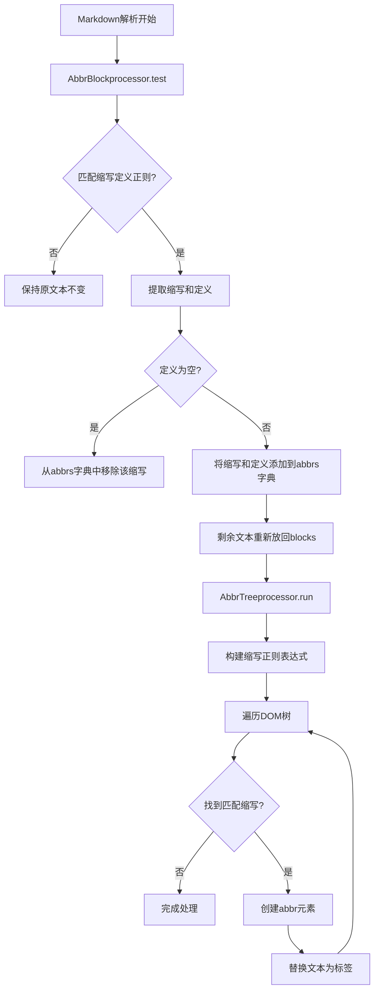

## 类结构

```
Extension (抽象基类)
└── AbbrExtension (缩写扩展类)
Treeprocessor (树处理器基类)
└── AbbrTreeprocessor (缩写树处理器)
BlockProcessor (块处理器基类)
└── AbbrBlockprocessor (缩写块处理器)
InlineProcessor (内联处理器基类)
└── AbbrInlineProcessor (已弃用)
```

## 全局变量及字段


### `AbbrPreprocessor`
    
已弃用的类别名，指向AbbrBlockprocessor

类型：`AbbrBlockprocessor`
    


### `AbbrExtension.config`
    
扩展配置选项，包含glossary字典

类型：`dict`
    


### `AbbrExtension.abbrs`
    
运行时缩写字典

类型：`dict`
    


### `AbbrExtension.glossary`
    
词汇表字典，存储预定义的缩写

类型：`dict`
    


### `AbbrTreeprocessor.abbrs`
    
缩写字典引用

类型：`dict`
    


### `AbbrTreeprocessor.RE`
    
编译后的正则表达式

类型：`re.RegexObject | None`
    


### `AbbrBlockprocessor.abbrs`
    
缩写字典引用

类型：`dict`
    


### `AbbrBlockprocessor.RE`
    
匹配缩写定义的正则表达式

类型：`re.RegexObject`
    


### `AbbrInlineProcessor.title`
    
缩写定义标题

类型：`str`
    
    

## 全局函数及方法


### `makeExtension`

工厂函数，用于创建AbbrExtension实例。该函数是Python-Markdown扩展的入口点，允许通过Markdown的扩展机制加载缩写功能。

参数：

- `**kwargs`：`dict`，关键字参数，将直接传递给`AbbrExtension`构造函数，用于配置扩展行为（如glossary配置项）

返回值：`AbbrExtension`，返回一个新创建的`AbbrExtension`实例，该实例会被注册到Markdown处理器中

#### 流程图

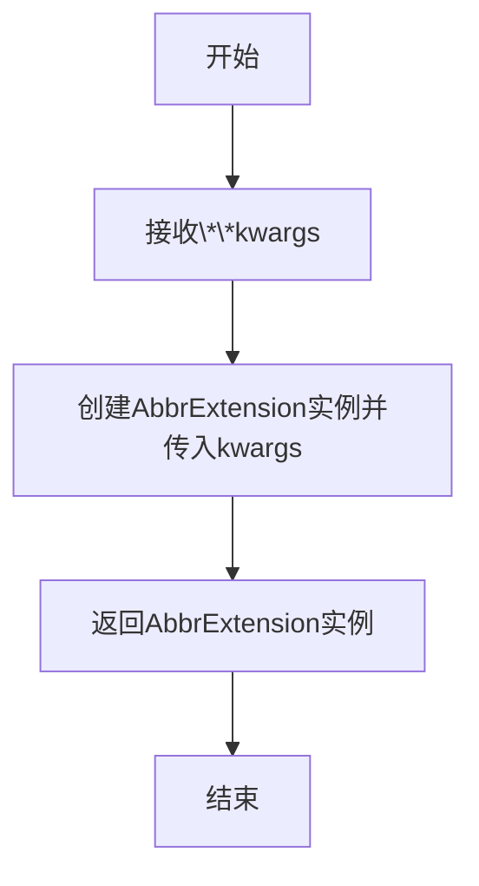

#### 带注释源码

```python
def makeExtension(**kwargs):  # pragma: no cover
    """
    工厂函数，用于创建AbbrExtension实例。
    
    这是Python-Markdown扩展的入口点函数，Markdown在加载扩展时会调用此函数。
    该函数接收可选的关键字参数，并将其传递给AbbrExtension构造函数。
    
    参数:
        **kwargs: 关键字参数，通常用于传递扩展配置，如glossary字典
        
    返回值:
        AbbrExtension: 新创建的缩写扩展实例
    """
    return AbbrExtension(**kwargs)
```


### `AbbrExtension.__init__`

该方法是 AbbrExtension 类的构造函数，负责初始化缩写扩展实例。它设置了默认配置选项（包含术语表glossary），调用父类构造函数，并初始化用于存储缩写的字典。

参数：

- `**kwargs`：关键字参数，传递给父类 Extension 的配置参数

返回值：`None`，构造函数无返回值

#### 流程图

```mermaid
flowchart TD
    A[开始 __init__] --> B[设置 self.config 字典]
    B --> C[定义 glossary 配置项]
    C --> D[调用 super().__init__\*\*kwargs]
    D --> E[初始化 self.abbrs = {}]
    E --> F[初始化 self.glossary = {}]
    F --> G[结束]
```

#### 带注释源码

```python
def __init__(self, **kwargs):
    """ Initiate Extension and set up configs. """
    # 定义默认配置选项字典，包含一个 'glossary' 键
    # glossary 是一个包含两个元素的列表：
    #   [0] - 默认值（空字典），用于存储缩写术语表
    #   [1] - 描述字符串，说明字典的键是缩写，值是定义
    self.config = {
        'glossary': [
            {},
            'A dictionary where the `key` is the abbreviation and the `value` is the definition.'
            "Default: `{}`"
        ],
    }
    """ Default configuration options. """
    
    # 调用父类 Extension 的初始化方法，传入所有关键字参数
    super().__init__(**kwargs)
    
    # 初始化一个空字典，用于存储在文档中发现的缩写及其定义
    self.abbrs = {}
    
    # 初始化一个空字典，用于存储通过 glossary 配置加载的缩写术语
    self.glossary = {}
```


### `AbbrExtension.reset`

该方法用于重置缩写词扩展，清空所有已定义的缩写词，并从词汇表(glossary)中重新加载缩写词。

参数：無（该方法仅接收 `self` 参数）

返回值：`None`，重置操作无返回值

#### 流程图

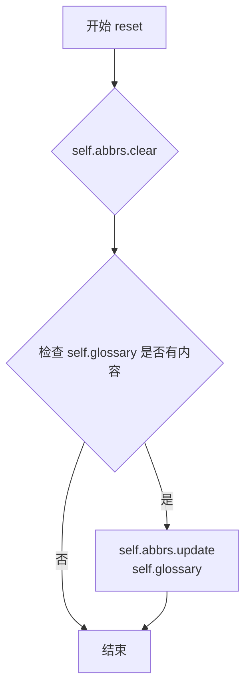

#### 带注释源码

```python
def reset(self):
    """ Clear all previously defined abbreviations. """
    # 清空当前已定义的缩写词字典
    self.abbrs.clear()
    # 如果词汇表中有内容，则将词汇表中的缩写词添加到当前缩写词字典中
    if (self.glossary):
        self.abbrs.update(self.glossary)
```


### AbbrExtension.reset_glossary

清除 glossary 字典中的所有缩写词定义，重置扩展的词汇表状态。

参数：

- （无参数）

返回值：`None`，无返回值描述（该方法直接操作对象内部状态，通过 `clear()` 方法清空 `glossary` 字典）

#### 流程图

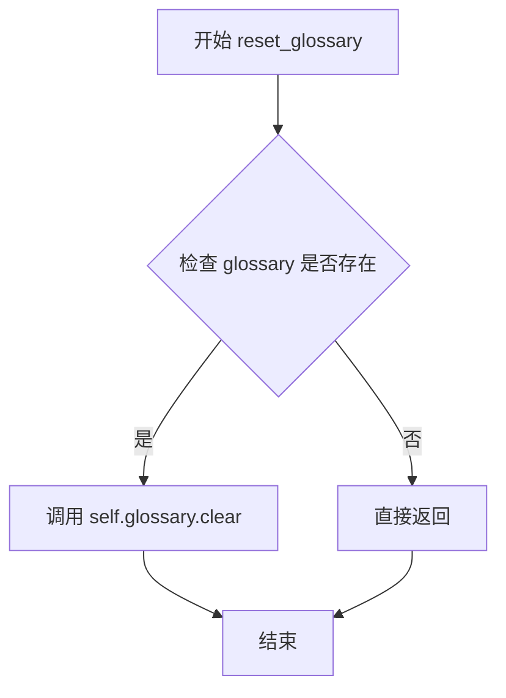

#### 带注释源码

```python
def reset_glossary(self):
    """ Clear all abbreviations from the glossary. """
    self.glossary.clear()
```

**源码解析：**

- `self.glossary`：类型为 `dict[str, str]`，存储缩写词与其定义之间的映射关系（在 `__init__` 方法中初始化为空字典）
- `.clear()`：Python 字典的内置方法，用于移除字典中的所有键值对，使字典变为空字典 `{}`


### `AbbrExtension.load_glossary`

将传入的字典合并到类的词汇表（glossary）中，已存在的缩写词会被新传入的值覆盖。

参数：

- `dictionary`：`dict[str, str]`，要添加到词汇表的字典，键为缩写词，值为其定义

返回值：`None`，无返回值（该方法直接修改实例的 `glossary` 属性）

#### 流程图

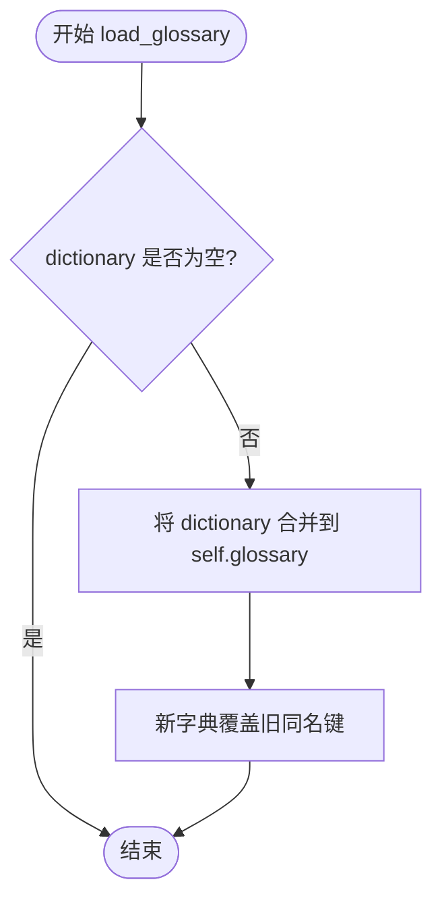

#### 带注释源码

```
def load_glossary(self, dictionary: dict[str, str]):
    """Adds `dictionary` to our glossary. Any abbreviations that already exist will be overwritten."""
    # 检查传入的字典是否非空
    if dictionary:
        # 使用字典解包合并：先展开 dictionary，再展开 self.glossary
        # 这样 self.glossary 中的同名键会被 dictionary 中的值覆盖
        self.glossary = {**dictionary, **self.glossary}
```


### `AbbrExtension.extendMarkdown`

该方法是缩写（Abbreviation）扩展的核心集成方法，负责将缩写处理功能注册到Markdown解析引擎中，包括树处理器（用于在HTML树中替换缩写文本）和块处理器（用于解析文档中的缩写定义）。

参数：

- `md`：`Markdown`，Markdown实例对象，该方法将向此实例注册缩写处理器

返回值：`None`，无返回值

#### 流程图

```mermaid
flowchart TD
    A[开始 extendMarkdown] --> B{config['glossary'][0] 是否存在?}
    B -->|是| C[调用 load_glossary 加载词汇表]
    B -->|否| D[跳过加载]
    C --> E[使用 abbrs.update 合并词汇表]
    D --> E
    E --> F[调用 md.registerExtension 注册自身]
    F --> G[注册 AbbrTreeprocessor 到 treeprocessors]
    G --> H[注册 AbbrBlockprocessor 到 blockprocessors]
    H --> I[结束]
```

#### 带注释源码

```python
def extendMarkdown(self, md):
    """ Insert `AbbrTreeprocessor` and `AbbrBlockprocessor`. """
    # 检查配置中是否提供了预定义的词汇表（glossary）
    if (self.config['glossary'][0]):
        # 如果存在预定义词汇表，则加载到扩展的glossary中
        self.load_glossary(self.config['glossary'][0])
    
    # 将glossary中的缩写更新到abbrs字典中，用于后续处理
    self.abbrs.update(self.glossary)
    
    # 向Markdown实例注册当前扩展，以便在文档处理流程中调用
    md.registerExtension(self)
    
    # 注册缩写树处理器（Treeprocessor），优先级为7
    # 该处理器负责在生成的HTML树中查找并替换缩写文本为<abbr>元素
    md.treeprocessors.register(AbbrTreeprocessor(md, self.abbrs), 'abbr', 7)
    
    # 注册缩写块处理器（BlockProcessor），优先级为16
    # 该处理器负责在Markdown文档中解析缩写定义（类似：*[HTML]: HyperText Markup Language）
    md.parser.blockprocessors.register(AbbrBlockprocessor(md.parser, self.abbrs), 'abbr', 16)
```


### `AbbrTreeprocessor.__init__`

初始化 AbbrTreeprocessor 实例，设置缩写字典和用于匹配缩写的正则表达式对象。

参数：

- `md`：`Markdown | None`，可选的 Markdown 实例，用于调用父类 Treeprocessor 的初始化
- `abbrs`：`dict | None`，可选的缩写字典，如果为 None 则使用空字典

返回值：`None`，构造函数无返回值

#### 流程图

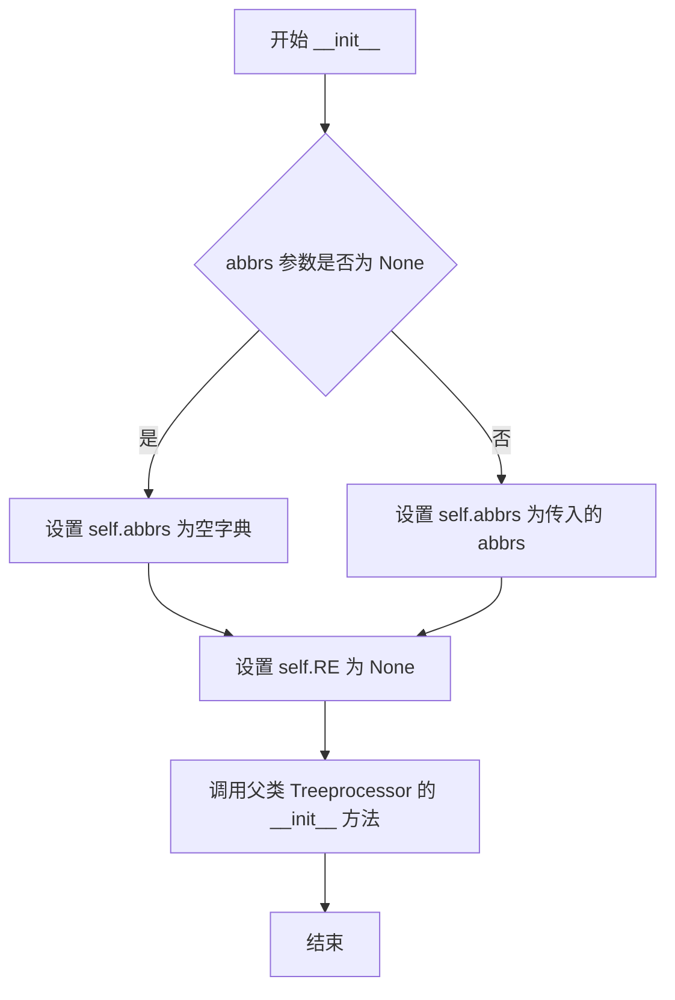

#### 带注释源码

```python
def __init__(self, md: Markdown | None = None, abbrs: dict | None = None):
    # 如果提供了缩写字典，则使用它；否则初始化为空字典
    # 这是用于存储所有已定义缩写的字典，key 是缩写，value 是定义
    self.abbrs: dict = abbrs if abbrs is not None else {}
    
    # 初始化正则表达式对象为 None
    # 将在 run 方法中根据 abbrs 动态构建编译后的正则表达式
    self.RE: re.RegexObject | None = None
    
    # 调用父类 Treeprocessor 的构造函数
    # 传递 md 参数以建立与 Markdown 实例的连接
    super().__init__(md)
```


### `AbbrTreeprocessor.create_element`

创建一个 `<abbr>` HTML 元素，用于表示缩写术语，并为其设置标题（完整定义）和显示文本。

参数：

- `title`：`str`，缩写的完整定义/说明文本，将作为 `title` 属性
- `text`：`str`，要在页面上显示的缩写文本内容
- `tail`：`str`，元素尾部需要保留的文本内容

返回值：`etree.Element`，创建的 `<abbr>` XML 元素节点

#### 流程图

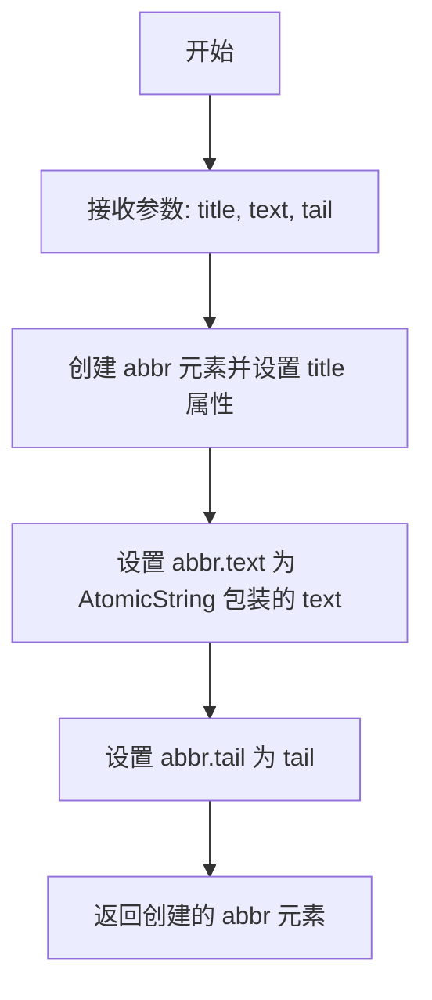

#### 带注释源码

```python
def create_element(self, title: str, text: str, tail: str) -> etree.Element:
    ''' Create an `abbr` element. '''
    # 创建一个 <abbr> 元素，设置 title 属性为缩写的完整定义
    abbr = etree.Element('abbr', {'title': title})
    # 使用 AtomicString 包装文本内容，确保不会被进一步处理
    abbr.text = AtomicString(text)
    # 设置元素的 tail 属性，保留元素后的文本内容
    abbr.tail = tail
    # 返回创建的 abbr 元素
    return abbr
```


### `AbbrTreeprocessor.iter_element`

该方法递归地遍历 XML/HTML 元素树。它在元素的文本内容（`text`）和元素之后的尾随文本（`tail`）中查找与预定义缩略语（`self.abbrs`）匹配的内容。一旦找到匹配项，它会使用 `create_element` 创建一个 `<abbr>` 标签，并将其插入到树中相应的位置，从而替换原始文本。

参数：

-  `el`：`etree.Element`，当前正在遍历处理的元素。
-  `parent`：`etree.Element | None`，当前元素 `el` 的父元素，用于处理 `el` 的尾随文本（tail）。

返回值：`None`，该方法直接修改传入的 Element 树，不返回任何值。

#### 流程图

```mermaid
flowchart TD
    Start([开始 iter_element])
    CheckChildren{还有子元素<br>未遍历?}
    RecursiveCall[递归调用:<br>iter_element(child, el)]
    CheckText{el.text 存在且<br>不是 AtomicString?}
    FindTextMatches[在文本中查找所有<br>缩略语匹配 m]
    ReverseTextMatches[倒序遍历匹配项 m]
    CreateAbbr[创建 abbr 元素]
    InsertAbbr[el.insert(0, abbr)<br>插入到元素开头]
    UpdateText[更新 text 为<br>匹配前的部分]
    CheckTail{parent 存在且<br>el.tail 存在且<br>不是 AtomicString?}
    FindTailMatches[在 tail 中查找<br>缩略语匹配 m]
    ReverseTailMatches[倒序遍历匹配项 m]
    CreateTailAbbr[创建 abbr 元素]
    InsertTailAbbr[parent.insert(index, abbr)<br>插入到父元素中]
    UpdateTail[更新 tail 为<br>匹配前的部分]
    End([结束])

    Start --> CheckChildren
    CheckChildren -->|是| RecursiveCall
    RecursiveCall --> CheckChildren
    CheckChildren -->|否| CheckText
    
    CheckText -->|否| CheckTail
    CheckText -->|是| FindTextMatches
    FindTextMatches --> ReverseTextMatches
    ReverseTextMatches --> CreateAbbr
    CreateAbbr --> InsertAbbr
    InsertAbbr --> UpdateText
    UpdateText --> CheckTail
    
    CheckTail -->|否| End
    CheckTail -->|是| FindTailMatches
    FindTailMatches --> ReverseTailMatches
    ReverseTailMatches --> CreateTailAbbr
    CreateTailAbbr --> InsertTailAbbr
    InsertTailAbbr --> UpdateTail
    UpdateTail --> End
```

#### 带注释源码

```python
def iter_element(self, el: etree.Element, parent: etree.Element | None = None) -> None:
    ''' Recursively iterate over elements, run regex on text and wrap matches in `abbr` tags. '''
    # 1. 递归遍历子元素
    # 注意：使用 reversed 遍历子元素，这样在后续插入操作中不会因为索引变化而影响顺序
    for child in reversed(el):
        self.iter_element(child, el)
    
    # 2. 处理当前元素的 text (元素开始标签之后的文本)
    if text := el.text:
        # 检查文本是否已经被处理过（AtomicString 通常用于标记不应再被修改的文本）
        if not isinstance(text, AtomicString):
            # 倒序遍历所有匹配项，防止插入新元素后影响之前匹配项的索引
            for m in reversed(list(self.RE.finditer(text))):
                # 确保该缩略语确实存在于字典中
                if self.abbrs[m.group(0)]:
                    # 创建 abbr 元素：title=定义, text=缩写, tail=匹配项之后的文本
                    abbr = self.create_element(self.abbrs[m.group(0)], m.group(0), text[m.end():])
                    # 将新创建的 abbr 插入到元素的最前面（index=0）
                    # 这样可以保持文本的原始顺序：第一个匹配的被插入到最后？
                    # 实际上因为是倒序插入，先处理最后的匹配，插入到开头，从而还原顺序
                    el.insert(0, abbr)
                    # 更新 text 为匹配项之前的文本
                    text = text[:m.start()]
            # 将处理（可能有截断）后的文本重新赋给元素
            el.text = text

    # 3. 处理 tail (元素结束标签之后的文本，属于父元素的文本)
    # 只有当存在父元素时才处理 tail
    if parent is not None and el.tail:
        tail = el.tail
        if not isinstance(tail, AtomicString):
            # 找到当前元素在父元素列表中的位置，插入 abbr 到其后面
            index = list(parent).index(el) + 1
            for m in reversed(list(self.RE.finditer(tail))):
                abbr = self.create_element(self.abbrs[m.group(0)], m.group(0), tail[m.end():])
                parent.insert(index, abbr)
                tail = tail[:m.start()]
            el.tail = tail
```


### `AbbrTreeprocessor.run`

该方法是 AbbrTreeprocessor 类的核心方法，用于遍历 Markdown 文档的 XML 元素树，将文本中已知的缩写词替换为 HTML `<abbr>` 元素，并添加对应的 title 属性显示定义。

参数：

- `root`：`etree.Element`，Markdown 文档解析后的根元素树

返回值：`etree.Element | None`，如果没有定义任何缩写词则返回 None，否则返回修改后的元素树（通过直接修改 root 参数实现）

#### 流程图

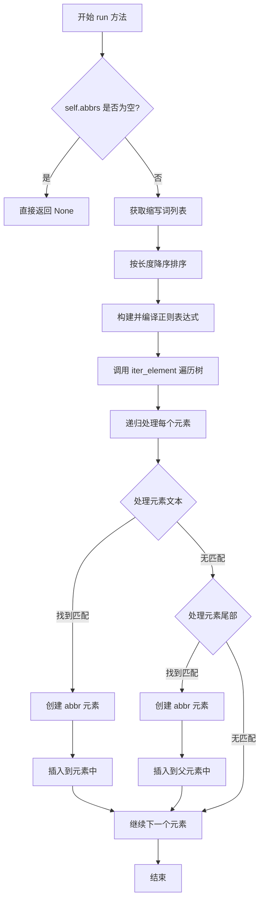

#### 带注释源码

```python
def run(self, root: etree.Element) -> etree.Element | None:
    ''' Step through tree to find known abbreviations. '''
    # 检查是否定义了缩写词，如果没有定义则直接返回，不进行处理
    if not self.abbrs:
        # No abbreviations defined. Skip running processor.
        return
    
    # 获取所有缩写词的键列表
    abbr_list = list(self.abbrs.keys())
    # 按长度降序排序，确保较长的缩写词优先匹配（如 'API' 优先于 'AI'）
    abbr_list.sort(key=len, reverse=True)
    
    # 构建正则表达式：使用 \b 单词边界，匹配列表中的任意缩写词
    # re.escape 用于转义特殊字符，防止正则表达式注入
    self.RE = re.compile(f"\\b(?:{ '|'.join(re.escape(key) for key in abbr_list) })\\b")
    
    # 递归遍历树结构，查找并替换匹配的缩写词为 abbr 元素
    self.iter_element(root)
```


### `AbbrBlockprocessor.__init__`

**描述**：构造函数，用于初始化 `AbbrBlockprocessor` 类的新实例。该方法接收 Markdown 解析器实例和一个共享的缩写字典，将缩写字典绑定到当前实例属性，并调用父类 `BlockProcessor` 的构造函数以完成基础组件的注册和初始化。

参数：

- `parser`：`BlockParser`，Markdown 核心的块解析器（BlockParser）实例，负责管理块的解析流程。
- `abbrs`：`dict`，一个字典对象，用于在文档解析过程中动态存储和更新缩写词条（例如 `{"API": "Application Programming Interface"}`）。

返回值：`None`，Python 中的 `__init__` 方法不返回值，通常隐式返回 `None`。

#### 流程图

```mermaid
flowchart TD
    A([开始 __init__]) --> B[接收参数: parser, abbrs]
    B --> C[赋值实例变量: self.abbrs = abbrs]
    C --> D[调用父类构造函数: super().__init__(parser)]
    D --> E([结束 __init__])
```

#### 带注释源码

```python
def __init__(self, parser: BlockParser, abbrs: dict):
    """
    初始化 AbbrBlockprocessor。

    参数:
        parser: Markdown 的 BlockParser 实例。
        abbrs: 用于存储已识别缩写的字典。
    """
    # 将传入的缩写字典存储为实例属性 self.abbrs
    # 这样在 run() 方法中解析文本块时，可以访问或修改这些缩写定义
    self.abbrs: dict = abbrs
    
    # 调用父类 BlockProcessor 的 __init__ 方法
    # 这是一个关键步骤，确保了当前处理器被正确绑定到解析器上，
    # 并继承了父类用于处理块迭代和测试的核心逻辑
    super().__init__(parser)
```


### `AbbrBlockprocessor.test`

该方法用于测试给定的文本块是否符合缩写定义的格式要求。它是 BlockProcessor 类的一部分，用于在解析 Markdown 文本时识别缩写定义块。

参数：

- `parent`：`etree.Element`，父元素节点，用于构建元素树
- `block`：`str`，需要测试的文本块内容

返回值：`bool`，如果文本块符合缩写定义格式则返回 True，否则返回 False

#### 流程图

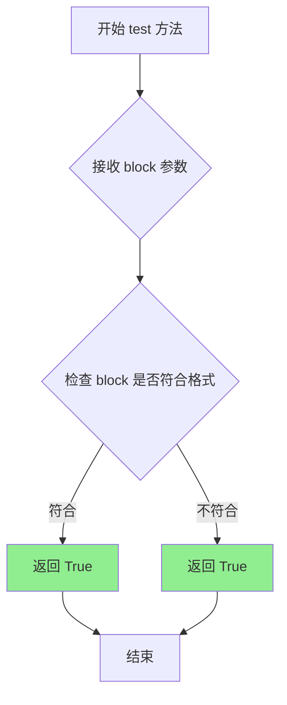

#### 带注释源码

```python
def test(self, parent: etree.Element, block: str) -> bool:
    """
    测试给定的文本块是否符合缩写定义块的格式。
    
    在 AbbrBlockprocessor 中，该方法始终返回 True，
    意味着所有块都会被传递给 run 方法进行处理。
    这是因为 AbbrBlockprocessor 需要处理所有可能的块，
    筛选工作由 run 方法中的正则表达式匹配完成。
    
    参数:
        parent: 父元素节点，用于构建元素树结构
        block: 需要测试的文本块内容
        
    返回:
        bool: 始终返回 True，表示接受所有块
    """
    return True
```


### `AbbrBlockprocessor.run`

该方法是 Python-Markdown 缩写扩展的块处理器核心方法，负责从文本块中解析缩写定义（如 `*[abbr]: Abbreviation` 格式），将解析出的缩写及其定义添加到缩写字典中，并根据需要将未匹配的内容重新放回块列表供后续处理。

参数：

- `self`：`AbbrBlockprocessor`，隐式参数，代表当前处理器实例
- `parent`：`etree.Element`，父元素，用于构建 Markdown 语法树
- `blocks`：`list[str]`，文本块列表，包含待处理的 Markdown 文本块

返回值：`bool`，返回 `True` 表示成功解析并处理了缩写定义；返回 `False` 表示未找到缩写定义

#### 流程图

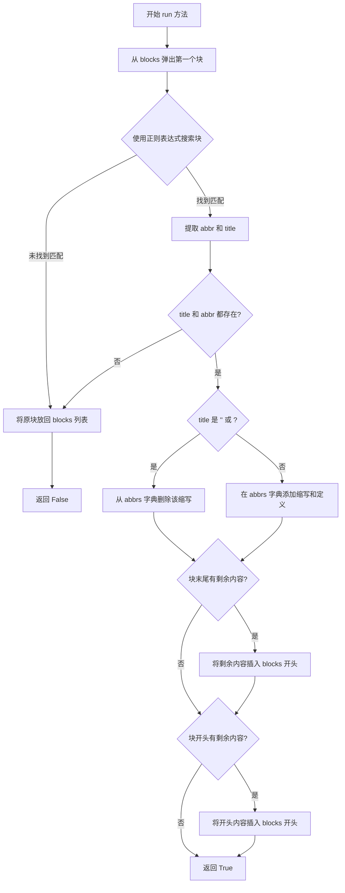

#### 带注释源码

```python
def run(self, parent: etree.Element, blocks: list[str]) -> bool:
    """
    Find and remove all abbreviation references from the text.
    Each reference is added to the abbreviation collection.

    Args:
        parent: The parent element in the ElementTree.
        blocks: List of text blocks to process.

    Returns:
        True if abbreviation reference was found and processed, False otherwise.
    """
    # 从 blocks 列表中弹出第一个文本块进行处理
    block = blocks.pop(0)
    
    # 使用预编译的正则表达式搜索缩写定义格式: *[abbr]: Definition
    m = self.RE.search(block)
    
    if m:
        # 正则表达式匹配成功，提取缩写和定义标题
        abbr = m.group('abbr').strip()       # 获取缩写字符串并去除首尾空格
        title = m.group('title').strip()     # 获取定义标题并去除首尾空格
        
        # 确保缩写和定义标题都存在
        if title and abbr:
            # 处理特殊情况：title 为 '' 或 "" 表示删除该缩写
            if title == "''" or title == '""':
                self.abbrs.pop(abbr)         # 从缩写字典中移除该条目
            else:
                # 正常情况：将缩写和定义添加到缩写字典
                self.abbrs[abbr] = title
            
            # 处理匹配项之后的剩余内容
            if block[m.end():].strip():
                # 如果匹配项后面还有内容，将其放回 blocks 列表开头
                # 左侧的换行符会被移除
                blocks.insert(0, block[m.end():].lstrip('\n'))
            
            # 处理匹配项之前的剩余内容
            if block[:m.start()].strip():
                # 如果匹配项前面还有内容，将其放回 blocks 列表开头
                # 右侧的换行符会被移除
                blocks.insert(0, block[:m.start()].rstrip('\n'))
            
            # 成功处理缩写定义，返回 True
            return True
    
    # 未找到缩写定义，将原块放回 blocks 列表，保持不变
    blocks.insert(0, block)
    return False
```


### `AbbrInlineProcessor.__init__`

这是 `AbbrInlineProcessor` 类的初始化方法，用于创建一个缩写内联处理器实例，接受匹配模式和标题（定义）作为参数。

参数：

- `pattern`：`str`，用于匹配缩写内容的正则表达式模式
- `title`：`str`，缩写的定义或说明文字

返回值：`None`，`__init__` 方法不返回任何值（隐式返回 `None`）

#### 流程图

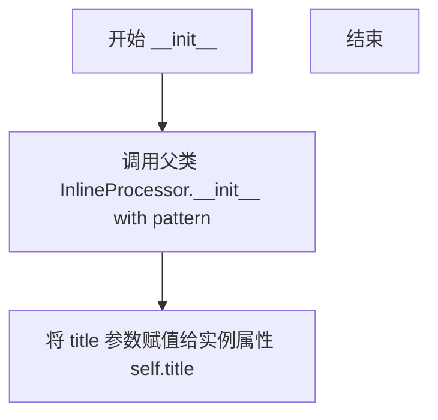

#### 带注释源码

```python
def __init__(self, pattern: str, title: str):
    """
    初始化 AbbrInlineProcessor 实例。

    参数:
        pattern: 用于匹配缩写文本的正则表达式模式
        title: 缩写的定义/说明,将作为 title 属性存储
    """
    super().__init__(pattern)  # 调用父类 InlineProcessor 的初始化方法
    self.title = title          # 将传入的 title 参数存储为实例属性
```


### `AbbrInlineProcessor.handleMatch`

该方法用于处理缩写文本的内联匹配，将匹配到的缩写文本包装成HTML `<abbr>`元素，并返回该元素及其在原始文本中的位置信息。

参数：

- `m`：`re.Match[str]`，正则表达式匹配对象，包含匹配的缩写文本（通过 `m.group('abbr')` 获取）
- `data`：`str`，原始的文本数据（在此方法中未使用，仅作为接口参数保留）

返回值：`tuple[etree.Element, int, int]`，返回一个三元组：创建的元素、匹配在原始文本中的起始位置、匹配在原始文本中的结束位置

#### 流程图

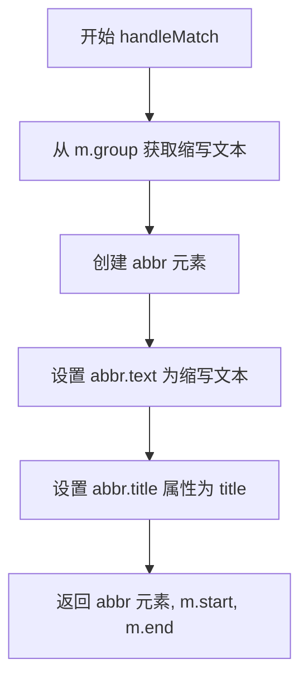

#### 带注释源码

```python
def handleMatch(self, m: re.Match[str], data: str) -> tuple[etree.Element, int, int]:
    """
    处理缩写文本的内联匹配。
    
    参数:
        m: 正则表达式匹配对象，包含捕获的缩写文本
        data: 原始文本数据（当前方法未使用）
    
    返回:
        包含创建的abbr元素、匹配起始位置、匹配结束位置的三元组
    """
    # 创建一个新的 <abbr> XML 元素
    abbr = etree.Element('abbr')
    
    # 设置元素的文本内容为匹配到的缩写文本
    # 使用 AtomicString 防止文本被进一步处理
    abbr.text = AtomicString(m.group('abbr'))
    
    # 设置 title 属性，显示缩写的完整定义
    abbr.set('title', self.title)
    
    # 返回创建的元素和匹配的起止位置
    # 返回的起止位置用于告诉 Markdown 引擎哪些文本已被处理
    return abbr, m.start(0), m.end(0)
```

## 关键组件


### AbbrExtension

主扩展类，负责管理缩写的配置、注册和重置。它加载词汇表并将缩写处理程序注册到Markdown处理器中。

### AbbrTreeprocessor

树处理器，负责在文档的XML树中查找已知的缩写并将匹配文本替换为`<abbr>`HTML元素。它递归遍历元素，使用正则表达式匹配缩写。

### AbbrBlockprocessor

块处理器，负责解析文本中的缩写定义（格式为`*[缩写]：定义`）。它从文本中提取并添加缩写到缩写集合中，支持删除已定义的缩写。

### 缩写词汇表管理

通过`glossary`配置和`load_glossary`方法管理缩写词典，支持动态加载和合并多个词汇表，实现缩写的持久化定义。

### 正则表达式编译与匹配

AbbrTreeprocessor动态构建和编译正则表达式，按长度降序排序缩写关键词以确保最长匹配优先，使用边界符`\b`精确匹配单词边界。

### 元素创建与迭代

通过`create_element`方法创建`<abbr>`元素，`iter_element`方法递归遍历XML树，处理元素的text和tail部分，将匹配文本包装为缩写标签。

### 废弃兼容性

提供`AbbrPreprocessor`和`AbbrInlineProcessor`等废弃类以保持向后兼容，通过`deprecated`装饰器发出警告提示用户使用新类名。


## 问题及建议


### 已知问题

- **AbbrTreeprocessor.iter_element方法逻辑晦涩**：使用`reversed(list(self.RE.finditer(text)))`配合`insert(0, abbr)`的方式虽然能达到目的，但逻辑较难理解，可读性差
- **正则表达式重复编译**：AbbrTreeprocessor的run方法每次调用都会重新编译正则表达式，没有缓存机制，影响性能
- **AbbrBlockprocessor.test方法无实际作用**：该方法始终返回True，没有进行任何预检查，失去了块处理器的优化意义
- **load_glossary方法字典合并顺序问题**：`{**dictionary, **self.glossary}`会导致新传入的dictionary中的键值对会覆盖已有的glossary中的同名键，与方法注释"Any abbreviations that already exist will be overwritten"描述的行为不一致
- **递归深度风险**：iter_element方法使用递归遍历元素树，对于大型文档可能导致栈溢出
- **弃用代码仍保留**：AbbrInlineProcessor和AbbrPreprocessor已标记弃用但未移除，增加了代码维护负担和理解成本

### 优化建议

- 考虑将iter_element改为迭代方式实现，消除递归栈溢出风险
- 缓存编译后的正则表达式，避免每次run都重新编译
- 优化test方法的实现，加入有意义的预检查逻辑（如检查block中是否包含`[*]`模式）
- 修正load_glossary的合并顺序，使其符合注释描述的预期行为
- 考虑移除已弃用的类（AbbrInlineProcessor、AbbrPreprocessor）或将其移至单独的兼容模块
- 添加单元测试覆盖更多边界情况，特别是空字典、特殊字符等情况

## 其它


### 设计目标与约束

本扩展的设计目标是向Python-Markdown添加缩写（abbreviation）处理功能，使得用户可以在Markdown文档中定义缩写，并在文档中自动将其转换为HTML的`<abbr>`标签，显示完整的定义作为title属性。设计约束包括：1) 必须继承Python-Markdown的标准扩展架构；2) 缩写匹配优先级按长度降序排列，确保最长匹配优先；3) 支持通过配置字典或文档内联方式定义缩写；4) 保持与Python-Markdown各版本的向后兼容性。

### 错误处理与异常设计

本扩展的错误处理机制相对简单，主要处理以下场景：1) 当缩写定义为空或标题为空时，不创建缩写条目；2) 当使用`''`或`""`作为标题时，表示删除已有缩写；3) 正则表达式编译失败时，由Python-Markdown框架统一处理；4) 对于不存在的缩写引用，视为普通文本处理，不抛出异常。AbbrTreeprocessor在abbrs为空时直接返回，不进行树遍历。AbbrBlockprocessor在无匹配时恢复原块并返回False。

### 数据流与状态机

数据流分为两个阶段：定义阶段和渲染阶段。定义阶段：用户通过两种方式定义缩写——1) 在扩展配置中传入glossary字典；2) 在Markdown文档中使用`*[abbr]: definition`语法块。AbbrBlockprocessor使用正则`^[*]\[(?P<abbr>[^\\]*?)\][ ]?:[ ]*\n?[ ]*(?P<title>.*)$`匹配块级缩写定义，将结果存入abbrs字典。渲染阶段：AbbrTreeprocessor遍历Markdown生成的HTML元素树，对文本内容和tail部分进行正则匹配，将已定义的缩写包装为`<abbr>`元素。正则表达式按缩写长度降序构建，确保最长匹配优先。

### 外部依赖与接口契约

本扩展依赖以下外部组件和接口：1) Python-Markdown核心框架（`Markdown`类、`Extension`基类、`BlockProcessor`、`Treeprocessor`、`InlineProcessor`）；2) `blockprocessors`、`inlinepatterns`、`treeprocessors`模块；3) `util.AtomicString`用于标记原子字符串以避免重复处理；4) `util.deprecated`装饰器用于向后兼容；5) 标准库`re`模块进行正则匹配；6) 标准库`xml.etree.ElementTree`构建和操作DOM树。接口契约：扩展必须实现`extendMarkdown(md)`方法注册处理器；BlockProcessor必须实现`test()`和`run()`方法；Treeprocessor必须实现`run()`方法。

### 性能考虑与优化空间

当前实现存在以下性能考量：1) 每次调用AbbrTreeprocessor.run()时都重新编译正则表达式，若文档处理多次调用，应缓存编译结果；2) iter_element方法对每个元素都执行正则匹配，对于大型文档可能存在性能瓶颈；3) 使用reversed()和list()可能产生额外的内存开销；4) 缩写列表按长度排序的时间复杂度为O(n log n)，对于大量缩写定义可考虑使用其他数据结构优化。建议优化：1) 缓存编译后的正则表达式对象；2) 对于超长文档考虑分块处理；3) 使用生成器替代list()减少内存占用。

### 线程安全性分析

本扩展本身不维护内部状态，abbrs字典由外部传入并在Extension实例中共享。在多线程环境下使用Python-Markdown时，需要注意：1) 多个Markdown实例可以安全并发处理不同文档；2) 共享同一个Markdown实例处理并发请求时，abbrs字典的读写操作不是线程安全的；3) reset()和load_glossary()方法会修改内部状态，并发调用时需加锁保护。建议：在Web应用等多线程环境中，每个请求使用独立的Markdown实例，或使用线程本地存储（threading.local）管理缩写状态。

### 版本兼容性说明

本扩展针对Python-Markdown 3.x系列设计，使用了`from __future__ import annotations`支持类型提示的延迟求值。代码兼容Python 3.8+版本。已废弃的AbbrPreprocessor和AbbrInlineProcessor类通过@deprecated装饰器标记，将在未来版本中移除。AtomicString的使用方式与Python-Markdown 2.x版本保持兼容。建议用户在使用时查阅Python-Markdown官方文档确认具体版本要求。

### 测试策略建议

建议补充以下测试用例：1) 空缩写定义和空标题的边界情况；2) 重复定义缩写的覆盖行为；3) 缩写嵌套于其他HTML标签内的处理；4) 特殊字符（正则元字符）在缩写中的转义；5) 大量缩写定义（如1000+）的性能基准测试；6) 并发场景下的线程安全性测试；7) 与其他扩展（如链接、图片）的交互测试；8) Unicode字符在缩写定义中的支持。

### 配置管理与使用示例

扩展通过makeExtension工厂函数实例化，支持以下配置方式：1) 通过glossary配置参数传入字典：`makeExtension(glossary={'API': 'Application Programming Interface'})`；2) 通过文档内联定义：`*[API]: Application Programming Interface`；3) 混合使用两者，文档内联定义优先。配置示例代码见AbbrExtension类的config字典定义，默认为空字典。

    