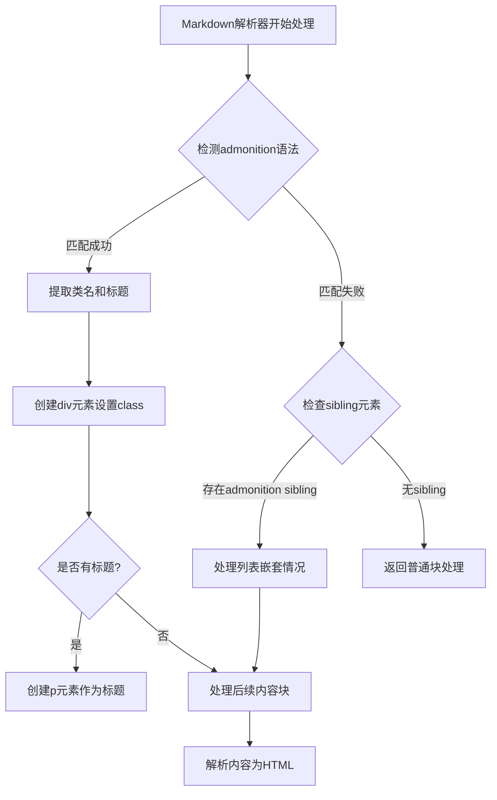
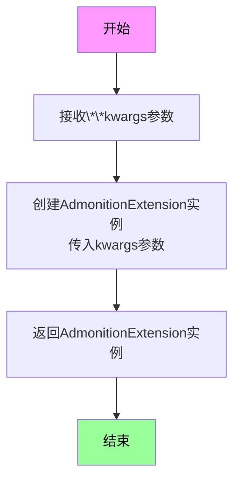
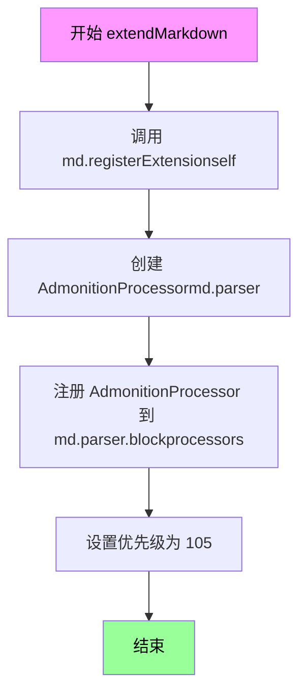
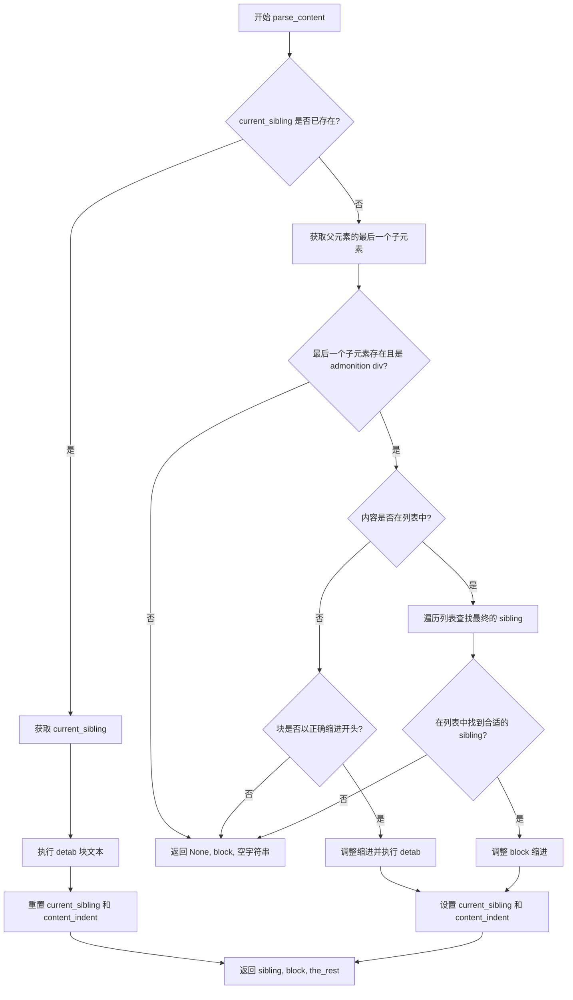
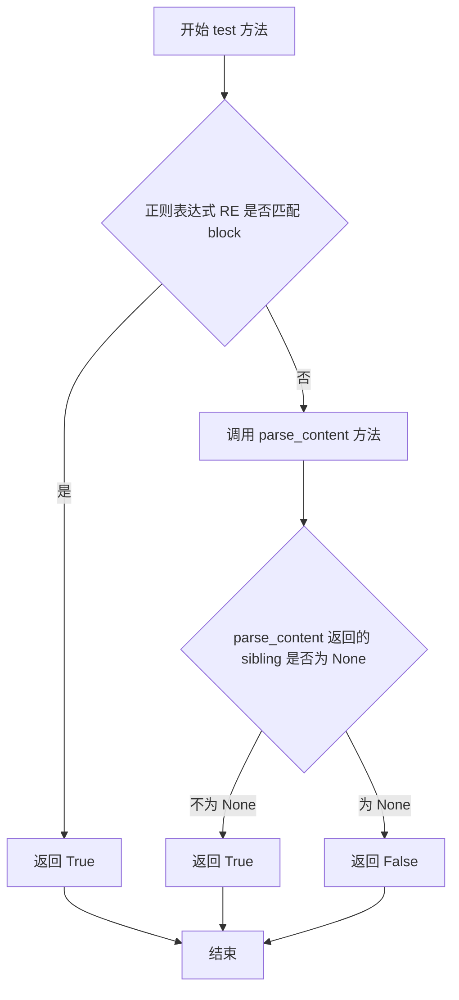
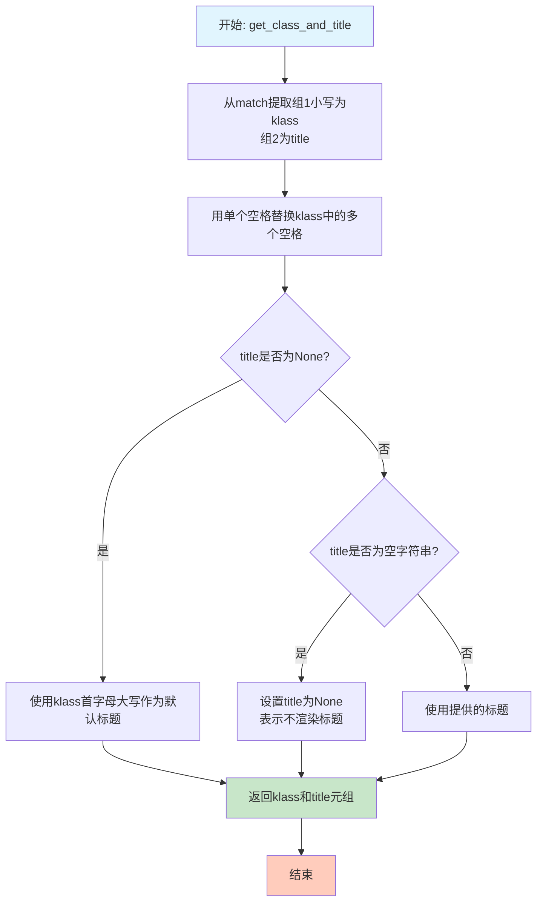

# `markdown\markdown\extensions\admonition.py` 详细设计文档

Python-Markdown的Admonition扩展，为Markdown文档添加rST风格的警告/提示框（admonition）功能，支持自定义样式类名和标题，通过块处理器解析特殊语法标记（!!! note "Title"）并转换为HTML的div元素。

## 整体流程



## 类结构

```
Extension (抽象基类)
└── AdmonitionExtension

BlockProcessor (抽象基类)
└── AdmonitionProcessor
```

## 全局变量及字段


### `AdmonitionProcessor.CLASSNAME`
    
CSS class name for the admonition div element, set to 'admonition'

类型：`str`
    


### `AdmonitionProcessor.CLASSNAME_TITLE`
    
CSS class name for the admonition title paragraph, set to 'admonition-title'

类型：`str`
    


### `AdmonitionProcessor.RE`
    
Regular expression pattern to match admonition syntax like '!!! note "Title"' with optional class and title

类型：`re.Pattern[str]`
    


### `AdmonitionProcessor.RE_SPACES`
    
Regular expression pattern to match multiple consecutive spaces for replacing with single space

类型：`re.Pattern[str]`
    


### `AdmonitionProcessor.current_sibling`
    
Tracks the current sibling element when processing nested content within lists

类型：`etree.Element | None`
    


### `AdmonitionProcessor.content_indent`
    
Stores the indentation level of the content for proper detabbing during parsing

类型：`int`
    
    

## 全局函数及方法


### `makeExtension`

该函数是 Python-Markdown 警告（Admonition）扩展的工厂函数，用于创建并返回 `AdmonitionExtension` 类的实例，使得该扩展可以被注册到 Markdown 解析器中。

参数：

- `**kwargs`：关键字参数，可变数量参数，用于传递给 `AdmonitionExtension` 构造器的可选配置参数

返回值：`AdmonitionExtension`，返回创建的警告扩展实例对象

#### 流程图



#### 带注释源码

```python
def makeExtension(**kwargs):  # pragma: no cover
    """
    创建并返回 AdmonitionExtension 扩展实例的工厂函数。
    
    该函数是 Python-Markdown 扩展接口的标准入口点，用于实例化扩展类。
    当 Markdown 库加载扩展时，会调用此函数来获取扩展实例。
    
    参数:
        **kwargs: 传递给 AdmonitionExtension 构造器的可选关键字参数。
                  目前 AdmonitionExtension 的基类 Extension 接受可选配置。
    
    返回值:
        AdmonitionExtension: 返回配置好的警告扩展实例，可用于注册到 Markdown 解析器。
    
    示例:
        >>> md = markdown.Markdown(extensions=['markdown.extensions.admonition'])
        >>> # 或者等价地使用
        >>> md = markdown.Markdown(extensions=[makeExtension()])
    """
    return AdmonitionExtension(**kwargs)
```


### `AdmonitionExtension.extendMarkdown`

该方法是Admonition扩展的核心入口点，负责将Admonition功能注册到Markdown解析器中，使其能够处理rST风格的警告块（admonitions）。

参数：

- `md`：`markdown.Markdown`，Markdown实例对象，包含解析器和其他已注册的扩展

返回值：`None`，无返回值（该方法通过副作用完成功能注册）

#### 流程图



#### 带注释源码

```python
def extendMarkdown(self, md):
    """ Add Admonition to Markdown instance. """
    # 将当前扩展实例注册到Markdown对象中
    # 这样Markdown可以跟踪所有已加载的扩展
    md.registerExtension(self)

    # 创建AdmonitionProcessor实例，传入解析器对象
    # 并将其注册到块处理器列表中，键名为'admonition'
    # 优先级105决定了处理器被调用的顺序（数值越小越先被尝试）
    md.parser.blockprocessors.register(AdmonitionProcessor(md.parser), 'admonition', 105)
```


### `AdmonitionProcessor.__init__`

这是 `AdmonitionProcessor` 类的构造函数，用于初始化 admonition 处理器实例。该方法接收一个块解析器作为参数，调用父类构造函数，并初始化两个实例变量用于跟踪当前兄弟元素和内容缩进。

参数：

- `parser`：`blockparser.BlockParser`，用于解析 Markdown 块的解析器实例

返回值：`None`，构造函数不返回值

#### 流程图

```mermaid
flowchart TD
    A[开始 __init__] --> B[调用父类构造器 super().__init__parser]
    B --> C[初始化 self.current_sibling = None]
    C --> D[初始化 self.content_indent = 0]
    D --> E[结束]
```

#### 带注释源码

```python
def __init__(self, parser: blockparser.BlockParser):
    """Initialization."""

    # 调用父类 BlockProcessor 的构造函数，传入解析器
    super().__init__(parser)

    # 初始化当前兄弟元素为 None，用于跟踪 admonition 的后续内容
    self.current_sibling: etree.Element | None = None
    
    # 初始化内容缩进为 0，用于处理嵌套的列表中的 admonition
    self.content_indent = 0
```


### `AdmonitionProcessor.parse_content`

该方法用于从Markdown块中解析并获取适当的 admonition（警告提示）兄弟元素。它处理复杂的嵌套场景，特别是当内容涉及列表项时，能够正确识别和提取 admonition 元素，同时处理缩进和列表嵌套的边界情况。

参数：

- `parent`：`etree.Element`，父 XML 元素，用于查找兄弟元素
- `block`：`str`，待解析的 Markdown 文本块

返回值：`tuple[etree.Element | None, str, str]`，返回一个三元组，包含：
- 第一个元素：找到的兄弟元素（`etree.Element`）或 `None`
- 第二个元素：处理后的块文本（`str`）
- 第三个元素：剩余文本/未处理的文本（`str`）

#### 流程图



#### 带注释源码

```python
def parse_content(self, parent: etree.Element, block: str) -> tuple[etree.Element | None, str, str]:
    """Get sibling admonition.

    Retrieve the appropriate sibling element. This can get tricky when
    dealing with lists.

    """

    old_block = block  # 保存原始块文本，用于后续缩进调整
    the_rest = ''  # 初始化剩余文本为空

    # We already acquired the block via test
    # 如果已经通过 test 方法获取了块，则直接使用 current_sibling
    if self.current_sibling is not None:
        sibling = self.current_sibling  # 获取已保存的兄弟元素
        block, the_rest = self.detab(block, self.content_indent)  # 去除缩进
        self.current_sibling = None  # 重置当前兄弟元素
        self.content_indent = 0  # 重置内容缩进
        return sibling, block, the_rest  # 返回结果

    # 获取父元素的最后一个子元素
    sibling = self.lastChild(parent)

    # 检查最后一个子元素是否是有效的 admonition div
    if sibling is None or sibling.tag != 'div' or sibling.get('class', '').find(self.CLASSNAME) == -1:
        sibling = None  # 不是有效的 admonition，设置 sibling 为 None
    else:
        # If the last child is a list and the content is sufficiently indented
        # to be under it, then the content's sibling is in the list.
        # 处理列表嵌套的情况
        last_child = self.lastChild(sibling)  # 获取 sibling 的最后一个子元素
        indent = 0  # 初始化缩进计数

        # 遍历查找列表中的合适 sibling
        while last_child is not None:
            # 检查是否满足列表条件：
            # 1. sibling 存在
            # 2. 块文本有足够缩进（至少 2 个 tab 长度）
            # 3. last_child 是列表标签 (ul, ol, dl)
            if (
                sibling is not None and block.startswith(' ' * self.tab_length * 2) and
                last_child is not None and last_child.tag in ('ul', 'ol', 'dl')
            ):

                # The expectation is that we'll find an `<li>` or `<dt>`.
                # We should get its last child as well.
                # 预期会找到 li 或 dt 元素，继续获取其最后一个子元素
                sibling = self.lastChild(last_child)
                last_child = self.lastChild(sibling) if sibling is not None else None

                # Context has been lost at this point, so we must adjust the
                # text's indentation level so it will be evaluated correctly
                # under the list.
                # 调整文本缩进级别以正确处理列表中的内容
                block = block[self.tab_length:]  # 移除一个 tab 长度的缩进
                indent += self.tab_length  # 增加缩进计数
            else:
                last_child = None  # 不满足条件，退出循环

        # 检查块是否有正确的缩进
        if not block.startswith(' ' * self.tab_length):
            sibling = None  # 缩进不正确，设置 sibling 为 None

        # 如果 sibling 存在，调整缩进并处理块
        if sibling is not None:
            indent += self.tab_length  # 增加缩进计数
            block, the_rest = self.detab(old_block, indent)  # 根据缩进去除缩进
            self.current_sibling = sibling  # 保存 sibling 供后续使用
            self.content_indent = indent  # 保存内容缩进

    return sibling, block, the_rest  # 返回 sibling, 处理后的块, 剩余文本
```


### `AdmonitionProcessor.test`

该方法用于测试给定的文本块是否符合 Admonition 语法规则，通过正则表达式匹配或解析内容来确定是否为有效的 Admonition 块。

参数：

- `parent`：`etree.Element`，父元素，用于后续解析
- `block`：`str`，需要测试的文本块

返回值：`bool`，如果文本块符合 Admonition 规则则返回 `True`，否则返回 `False`

#### 流程图



#### 带注释源码

```python
def test(self, parent: etree.Element, block: str) -> bool:
    """测试 block 是否符合 Admonition 语法规则。
    
    参数:
        parent: 父元素，用于传递给 parse_content 方法进行进一步检查
        block: 要测试的文本块
    
    返回:
        bool: 如果 block 符合 Admonition 语法规则返回 True，否则返回 False
    """
    
    # 首先尝试使用正则表达式匹配 Admonition 语法
    # 语法格式: !!! 类型 [可选标题] 后跟内容
    if self.RE.search(block):
        return True
    else:
        # 正则表达式不匹配时，尝试解析内容查找是否有已存在的 sibling admonition
        # 这是为了处理嵌套在列表中的 Admonition 情况
        return self.parse_content(parent, block)[0] is not None
```


### `AdmonitionProcessor.run`

该方法是AdmonitionProcessor类的核心方法，负责解析Markdown文档中的admonition块（如`!!! note`、`!!! warning`等），将其转换为HTML的`<div>`元素，并处理嵌套内容和后续块。

参数：

- `parent`：`etree.Element`，父XML元素，用于添加admonition的HTML结构
- `blocks`：`list[str]`，包含Markdown块的列表，该方法会从列表中pop第一个块进行处理

返回值：`None`，该方法直接修改XML元素树和blocks列表，不返回任何值

#### 流程图

```mermaid
flowchart TD
    A[开始执行run方法] --> B[从blocks列表pop第一个块]
    C{正则表达式匹配?}
    B --> C
    C -->|是| D{匹配位置>0?}
    C -->|否| E[调用parse_content获取sibling]
    D -->|是| F[解析匹配位置前的块]
    D -->|否| G[移除匹配的第一行并detab]
    E --> H[获取sibling、block和theRest]
    F --> G
    G --> I{匹配是否存在?}
    H --> I
    I -->|是| J[获取class和title]
    I -->|否| K{ sibling标签为li或dd且有文本?]
    J --> L[创建div元素并设置class]
    L --> M{有title?}
    M -->|是| N[创建p元素设置title]
    M -->|否| O[继续]
    K -->|是| P[创建p元素包裹文本]
    K -->|否| Q[div = sibling]
    N --> R[解析div内容]
    P --> R
    Q --> R
    O --> R
    R --> S{theRest存在?}
    S -->|是| T[将theRest插入blocks[0]]
    S -->|否| U[结束]
    T --> U
```

#### 带注释源码

```python
def run(self, parent: etree.Element, blocks: list[str]) -> None:
    """
    执行admonition处理的核心方法。
    
    该方法从blocks列表中取出第一个块，尝试将其匹配为admonition语法。
    如果匹配成功，创建相应的HTML结构；否则尝试作为已存在admonition的
    延续内容处理。
    
    参数:
        parent: 父XML元素，admonition将作为子元素添加到此元素中
        blocks: Markdown块的列表，处理后会修改此列表
    """
    
    # 从块列表中取出第一个块进行处理
    block = blocks.pop(0)
    
    # 使用正则表达式搜索admonition标记
    # 匹配格式: !!! type "title" 或 !!! type
    m = self.RE.search(block)

    if m:
        # 找到admonition标记的情况
        
        # 如果匹配位置不在块开头，说明前面有普通段落内容
        if m.start() > 0:
            # 解析匹配位置之前的块内容
            self.parser.parseBlocks(parent, [block[:m.start()]])
        
        # 移除第一行（admonition标记行）
        block = block[m.end():]  # removes the first line
        
        # 处理缩进：将tab转换为空格
        block, theRest = self.detab(block)
    else:
        # 未找到admonition标记，尝试解析为已存在admonition的延续内容
        sibling, block, theRest = self.parse_content(parent, block)

    if m:
        # 匹配到admonition，创建新的div元素
        
        # 从匹配结果中提取class和title
        klass, title = self.get_class_and_title(m)
        
        # 在父元素下创建div子元素
        div = etree.SubElement(parent, 'div')
        
        # 设置div的class属性：'admonition' + 具体类型
        div.set('class', '{} {}'.format(self.CLASSNAME, klass))
        
        # 如果存在标题，创建p元素显示标题
        if title:
            p = etree.SubElement(div, 'p')
            p.text = title
            p.set('class', self.CLASSNAME_TITLE)
    else:
        # 未匹配到admonition标记的情况（处理列表中的admonition）
        
        # Sibling是列表项，但需要将文本包装在<p>标签中
        if sibling.tag in ('li', 'dd') and sibling.text:
            text = sibling.text
            sibling.text = ''  # 清空原有文本
            p = etree.SubElement(sibling, 'p')
            p.text = text  # 将文本放入新的p元素

        div = sibling  # 使用sibling作为div

    # 递归解析admonition的内容块
    self.parser.parseChunk(div, block)

    # 处理剩余内容
    if theRest:
        # 这个块包含未缩进的行（与admonition内容同级的段落）
        # 将这些行作为下一个待处理的块插入blocks列表开头
        blocks.insert(0, theRest)
```


### `AdmonitionProcessor.get_class_and_title`

该方法负责从正则表达式匹配结果中解析并处理 admonition 的 CSS 类名和标题，根据是否有标题返回相应的元组，用于构建 HTML 元素的 class 属性和标题段落。

#### 参数

- `match`：`re.Match[str]`，正则表达式匹配对象，包含从 Markdown 源代码中提取的 admonition 类型和可选标题

#### 返回值

- `tuple[str, str | None]`，返回包含类名和标题的元组，其中类名为字符串，标题可能为字符串（当有标题时）、None（当使用默认标题或不渲染标题时）

#### 流程图



#### 带注释源码

```python
def get_class_and_title(self, match: re.Match[str]) -> tuple[str, str | None]:
    """
    从正则表达式匹配中提取 admonition 的类名和标题。
    
    参数:
        match: re.Match[str]，包含以下组:
            - group(1): admonition 类型（如 "note", "warning tip"）
            - group(2): 可选的标题文本（可能为 None 或空字符串）
    
    返回:
        tuple[str, str | None]: 
            - klass: 处理后的类名（已转小写，多空格合并）
            - title: 标题字符串（首字母大写）、None（空标题不渲染）或原标题
    """
    # 从匹配对象中提取类名（转换为小写）和标题
    klass, title = match.group(1).lower(), match.group(2)
    
    # 将类名中的多个连续空格替换为单个空格
    # 例如: "warning tip" -> "warning tip"
    klass = self.RE_SPACES.sub(' ', klass)
    
    # 如果没有提供标题，使用类名的首字母大写作为默认标题
    # 例如: "note" -> "Note"
    if title is None:
        # no title was provided, use the capitalized class name as title
        # e.g.: `!!! note` will render
        # `<p class="admonition-title">Note</p>`
        title = klass.split(' ', 1)[0].capitalize()
    # 如果显式提供空标题，则不渲染标题段落
    # 例如: `!!! warning ""` 将不渲染 <p> 元素
    elif title == '':
        # an explicit blank title should not be rendered
        # e.g.: `!!! warning ""` will *not* render `p` with a title
        title = None
    
    return klass, title
```

## 关键组件


### AdmonitionExtension

Admonition扩展的主类，负责向Markdown实例注册AdmonitionProcessor块处理器，使Markdown能够解析rST风格的警告和提示块语法。

### AdmonitionProcessor

核心块处理器类，负责解析admonition语法（如"!!! note"或"!!! warning Title"），生成对应的HTML div元素和标题，包含解析内容、检测块、处理运行等核心逻辑。

### 正则表达式模式（RE, RE_SPACES）

RE用于匹配admonition标记行（格式：!!! 类型 [可选标题]"内容"），RE_SPACES用于规范化类名中的多余空格，是语法解析的核心依赖。

### makeExtension函数

工厂函数，用于实例化AdmonitionExtension对象，是Python-Markdown扩展的标准入口点。


## 问题及建议


### 已知问题

-   **正则表达式重复编译**：在类定义中直接使用 `re.compile()`，虽然 Python 会缓存编译后的正则，但建议在类级别或模块级别预编译以提高性能
-   **魔法数字缺乏解释**：`md.parser.blockprocessors.register(..., 105)` 中的优先级 `105` 是硬编码值，没有注释说明其含义
-   **类型注解不完整**：`parse_content` 方法没有返回类型注解，且使用了 `tuple[etree.Element | None, str, str]` 这种新式注解但方法本身缺失注解
-   **方法过长**：`parse_content` 方法超过 60 行，嵌套层级深（4 层以上），逻辑复杂，难以维护和测试
-   **字符串格式化方式不统一**：使用了旧的 `'{} {}'.format()` 方式，可改用 f-string（虽然 Python 3.6+ 已广泛支持）
-   **缺乏错误处理**：正则表达式匹配、XML 元素操作等关键路径缺少异常捕获和处理
-   **代码重复**：`detab` 方法在多处调用，缩进计算逻辑有重复
-   **文档不完整**：部分方法如 `__init__`、`test`、`run` 等缺少详细的文档字符串

### 优化建议

-   将 `RE` 和 `RE_SPACES` 正则表达式提升为类属性（类变量），避免重复创建
-   为优先级数字 `105` 添加常量或注释说明其在块处理器中的顺序意义
-   补充 `parse_content` 方法的返回类型注解
-   重构 `parse_content` 方法，将其拆分为多个职责单一的小方法，提高可读性和可测试性
-   统一使用 f-string 进行字符串格式化
-   在关键路径添加 try-except 异常处理，如正则匹配失败、XML 操作异常等
-   提取 `detab` 调用和缩进计算的公共逻辑到私有方法中
-   为所有公共方法添加完整的 docstring，说明参数、返回值和异常情况
-   考虑将 `run` 方法中创建 `<p>` 标签的逻辑提取为独立方法
-   添加单元测试覆盖边界情况，如空块、特殊缩进、嵌套列表等

## 其它


### 设计目标与约束

本扩展的设计目标是为Python-Markdown添加rST风格的admonitions（警告/提示框）支持，允许用户在Markdown文档中使用`!!!`语法创建各种类型的可配置提示块。设计约束包括：必须继承自Python-Markdown的Extension基类并实现extendMarkdown方法；必须注册为block处理器且优先级低于标准块处理器（105）；需要兼容Python 3.x版本并使用类型提示；保持与现有Python-Markdown扩展架构的一致性。

### 错误处理与异常设计

代码采用返回None或空值的方式处理边界情况，而非抛出异常。在`parse_content`方法中，当无法找到合适的sibling元素时返回`(None, block, the_rest)`；在`test`方法中通过检查返回结果是否为None来判断测试是否通过。对于正则表达式匹配失败的情况，代码通过条件判断进行优雅处理，而非使用try-except捕获。空标题使用空字符串""显式标记，代码会将其转换为None以跳过标题渲染。

### 数据流与状态机

数据流主要分为两条路径：主流程中`run`方法接收blocks列表，通过正则匹配识别admonition语法块，然后创建div元素并调用`parseChunk`继续解析内部内容；嵌套流程中`parse_content`方法维护`current_sibling`和`content_indent`两个状态变量来处理与列表等嵌套结构的交互。状态转换：当检测到`!!!`语法时进入admonition创建状态；未检测到但存在缩进内容时进入sibling解析状态；解析完成后通过`theRest`机制将剩余内容放回blocks队列继续处理。

### 外部依赖与接口契约

主要依赖包括：`markdown.extension.Extension` - 扩展基类；`markdown.blockprocessors.BlockProcessor` - 块处理器基类；`xml.etree.ElementTree` - 用于构建HTML元素树；`re` - 正则表达式处理。接口契约方面，扩展必须暴露`extendMarkdown(md)`方法供Markdown核心调用；BlockProcessor必须实现`test(parent, block)`、`run(parent, blocks)`和可选的`parse_content(parent, block)`方法；注册时使用`md.parser.blockprocessors.register(processor, 'admonition', 105)`语法，名称为'admonition'，优先级为105。

### 配置项与可扩展性

当前扩展未提供自定义配置选项，但设计了可继承的类属性用于扩展：CLASSNAME和CLASSNAME_TITLE定义了生成的HTML类名；RE和RE_SPACES正则表达式可通过子类覆盖以支持不同语法；get_class_and_title方法可被重写以自定义标题处理逻辑。扩展点包括：可通过继承AdmonitionProcessor并覆盖相关方法来实现自定义admonition类型处理；可通过修改注册优先级来调整与其他块处理器的交互顺序。

### 性能考量

代码使用预编译正则表达式（类属性RE和RE_SPACES）避免重复编译开销。`parse_content`方法中的循环采用while循环加手动状态更新而非递归，避免深层递归栈溢出风险。在处理列表嵌套时通过减少字符串操作（仅在必要时调用detab）优化性能。状态变量`current_sibling`和`content_indent`的设计避免了重复的DOM查询操作。

### 版本历史与兼容性

本代码基于Python-Markdown 3.x架构设计，依赖其新的扩展注册机制。原始代码由Tiago Serafim编写，后由Python Markdown项目维护并采用BSD许可证。代码使用`from __future__ import annotations`确保与Python 3.9+类型注解的兼容性，同时通过TYPE_CHECKING条件导入保持运行时无额外依赖。

### 安全考虑

代码主要处理文本解析和HTML生成，不涉及用户输入执行或文件操作。标题内容通过`text`属性设置而非直接HTML拼接，防止XSS攻击（Markdown核心负责内容转义）。正则表达式使用固定模式，无动态构建避免ReDoS风险。


    